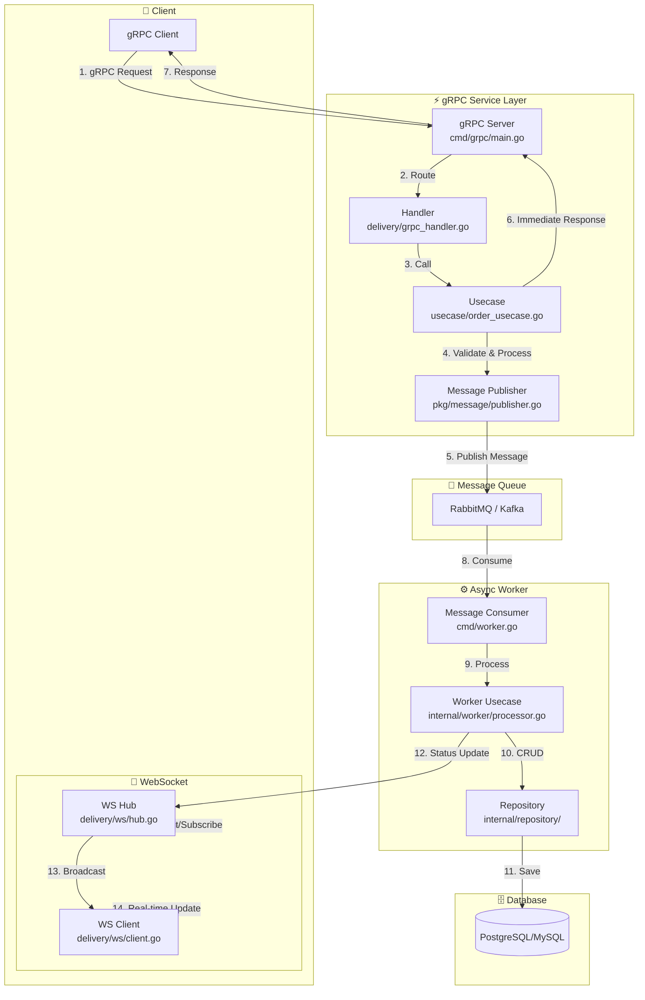

---------------------------------------------------------------------------------
- โครงสร้าง Foder การทำงาน
setup kafka container
create kafka and golang app
create kafka configuration
create kafka message publisher
create kafka message consumer
create async order handler in golang
process consumed message in kafka & go
---------------------------------------------------------------------------------
# Golang Kafka Service
---------------------------------------------------------------------------------
```bash
  api/
    ├── cmd/
    │   ├── apiser/                 # REST API หลัก (มีอยู่แล้ว)
    │   ├── Kafka/              # *** Kafka Service
    │   │   └── main.go
    │   ├── initdata.go
    │   ├── root.go
    │   ├── serve.go
    │   └── worker.go
    ├── internal/
    │   ├── Kafka/              # **** โค้ดเฉพาะของ Kafka
    │   │   ├── delivery/
    │   │   │   └── ws/
    │   │   │       ├── hub.go
    │   │   │       ├── client.go
    │   │   │       └── handler.go     # HTTP endpoint สำหรับ upgrade
    │   │   ├── usecase/
    │   │   │   └── ws_usecase.go      # business logic (save message, auth)
    │   │   ├── repository/
    │   │   │   └── ws_repo.go         # interface สำหรับ DB
    │   │   └── models/
    │   │       └── ws_models.go       # entity ของ message, session
    │   ├── pkg/                    # shared packages (มีอยู่แล้ว)
    │   │   ├── Kafka/          # **ปรับปรุง** ใช้ร่วมกันได้
    │   │   │   ├── hub.go          # core Hub logic
    │   │   │   ├── client.go
    │   │   │   └── message.go      # struct ของ message
    │   │   └── ...
    ├── migrations/                 # **เพิ่ม** SQL schema สำหรับ Kafka
    │   └── 20250619_Kafka_tables.sql
    └── 
```
---------------------------------------------------------------------------------
    - code ทำงานจริง
    - โครงสร้างการทำงาน
	- คืออะไร
	- วัตุประสงค์	
	- ใช้ทำอะไร
	- ทำงานอย่างไร
	 - ออกแบบ workflow
		- วาดรูป dataflow สร้าง รูปแบบ dataflow เหมือนจริง ลักษณะ flowchart   เพื่ออธิบายกระบวนการ ทำความเข้าใจ
        - วาดรูป dataflow สร้าง รูปแบบMermaid Diagrams
		- พร้อมอธิบาย แบบ ละเอียด  
    	- ยกตัวอย่างการทำงาน ตัวอย่างการใช้งานจริง หรือ กรณีศึกษา แนวทางแก้ไขปัญหา ที่อาจจะเกิดขึ้น 
    	- ประโยชน์ที่ได้รับ
    	- ข้อควรระวัง
    	- ข้อดี
    	- ข้อเสีย
    	- ข้อห้าม ถ้ามี
    - Check list Test case
    - Check list funntion
	- Root Cause Analysis (RCA) (ถ้ามี)
	- สรุป
---------------------------------------------------------------------------------

# Golang gRPC Service — เอกสารประกอบการทำงาน

## สารบัญ

1. [ภาพรวมระบบ](#1-ภาพรวมระบบ)
2. [โครงสร้างโฟลเดอร์และการทำงาน](#2-โครงสร้างโฟลเดอร์และการทำงาน)
3. [Workflow และ Data Flow Diagram](#3-workflow-และ-data-flow-diagram)
4. [ตัวอย่างการใช้งานจริง](#4-ตัวอย่างการใช้งานจริง)
5. [ประโยชน์ที่ได้รับ](#5-ประโยชน์ที่ได้รับ)
6. [ข้อดีและข้อเสีย](#6-ข้อดีและข้อเสีย)
7. [ข้อควรระวังและข้อห้าม](#7-ข้อควรระวังและข้อห้าม)
8. [Checklist และ Test Case](#8-checklist-และ-test-case)
9. [Root Cause Analysis (RCA)](#9-root-cause-analysis-rca)
10. [สรุป](#10-สรุป)

---

## 1. ภาพรวมระบบ

### คืออะไร

**Golang gRPC Service** คือระบบบริการที่ใช้ **gRPC (gRPC Remote Procedure Call)** ซึ่งเป็นโอเพนซอร์ส RPC framework ที่พัฒนาโดย Google ใช้ **Protocol Buffers** เป็น Interface Definition Language (IDL) และ **HTTP/2** เป็นโปรโตคอลในการขนส่ง ระบบนี้ถูกสร้างขึ้นบนภาษา Go เพื่อรองรับการสื่อสารระหว่างไมโครเซอร์วิสที่มีประสิทธิภาพสูง

### วัตถุประสงค์

1. **สร้างระบบสื่อสารความเร็วสูง** ระหว่างไมโครเซอร์วิสด้วย binary format แทน JSON
2. **รองรับการทำงานแบบ Asynchronous** ผ่าน Message Publisher/Consumer Pattern
3. **แยก Business Logic ออกจาก Transport Layer** ตามหลัก Clean Architecture
4. **จัดการ Order Processing** แบบ Async เพื่อไม่ให้ระบบหลักถูก阻塞

### ใช้ทำอะไร

- รับคำสั่งซื้อ (Order) ผ่าน gRPC endpoint
- ส่งต่อคำสั่งซื้อไปยัง Message Queue (ผ่าน Publisher)
- ประมวลผลคำสั่งซื้อแบบ Asynchronous (ผ่าน Consumer)
- อัปเดตสถานะ订单ผ่าน WebSocket (Real-time)
- สื่อสารระหว่างไมโครเซอร์วิสภายในระบบ

### ทำงานอย่างไร

1. **Client** ส่ง gRPC request มาที่ `cmd/grpc/main.go`
2. **gRPC Server** รับ request และเรียกใช้ Usecase Layer
3. **Usecase** ประมวลผลเบื้องต้นและส่งข้อมูลไปยัง **Message Publisher**
4. **Publisher** ส่ง message ไปยัง Queue (RabbitMQ/Kafka)
5. **Consumer** ดึง message จาก Queue มาประมวลผลแบบ Async
6. ผลลัพธ์ถูกบันทึกลง Database และแจ้ง Client ผ่าน WebSocket

---

## 2. โครงสร้างโฟลเดอร์และการทำงาน

```
api/
├── cmd/
│   ├── apiser/                 # REST API หลัก (มีอยู่แล้ว)
│   ├── grpc/                   # *** gRPC Service (ส่วนที่เพิ่มใหม่)
│   │   └── main.go             # จุดเริ่มต้นของ gRPC Server
│   ├── initdata.go
│   ├── root.go
│   ├── serve.go
│   └── worker.go
├── internal/
│   ├── grpc/                   # **** โค้ดเฉพาะของ gRPC
│   │   ├── delivery/
│   │   │   └── ws/
│   │   │       ├── hub.go      # จัดการ WebSocket connections
│   │   │       ├── client.go   # แต่ละ WebSocket client
│   │   │       └── handler.go  # HTTP endpoint สำหรับ upgrade connection
│   │   ├── usecase/
│   │   │   └── ws_usecase.go   # Business logic (save message, auth)
│   │   ├── repository/
│   │   │   └── ws_repo.go      # Interface สำหรับ DB operations
│   │   └── models/
│   │       └── ws_models.go    # Entity ของ message, session
│   └── pkg/                    # Shared packages (มีอยู่แล้ว)
│       ├── grpc/               # **ปรับปรุง** ใช้ร่วมกันได้
│       │   ├── hub.go          # core Hub logic
│       │   ├── client.go
│       │   └── message.go      # struct ของ message
│       └── ...
├── migrations/                 # **เพิ่ม** SQL schema สำหรับ gRPC
│   └── 20250619_grpc_tables.sql
└── ...
```

### คำอธิบายแต่ละส่วน

#### `cmd/grpc/main.go`
- **บทบาท**: Entry point ของ gRPC Server
- **หน้าที่**: 
  - อ่าน Config
  - สร้าง gRPC Server ด้วย `grpc.NewServer()`
  - Register Service Handler
  - เริ่ม Listen บนพอร์ตที่กำหนด

#### `internal/grpc/delivery/ws/`
- **บทบาท**: Transport/Adapter Layer
- **หน้าที่**:
  - `hub.go`: เก็บสถานะของ WebSocket connections ทั้งหมด, broadcast messages
  - `client.go`: จัดการแต่ละ connection (read/write pump)
  - `handler.go`: รับ HTTP request เพื่อ upgrade เป็น WebSocket

#### `internal/grpc/usecase/`
- **บทบาท**: Business Logic Layer
- **หน้าที่**:
  - ตรวจสอบ Authentication
  - ประมวลผลข้อความ
  - เรียก Repository เพื่อบันทึกข้อมูล
  - ส่งต่อข้อมูลไปยัง Publisher

#### `internal/grpc/repository/`
- **บทบาท**: Data Access Layer
- **หน้าที่**: Interface สำหรับการติดต่อ Database (implement ด้วย GORM, SQLx ฯลฯ)

#### `internal/grpc/models/`
- **บทบาท**: Entity/Model Definition
- **หน้าที่**: กำหนด struct ของ Message, Session, Order

#### `internal/pkg/grpc/`
- **บทบาท**: Shared/Core Package
- **หน้าที่**: โค้ดที่ใช้ร่วมกันระหว่างหลายๆ Service (Hub logic, Message struct)

---

## 3. Workflow และ Data Flow Diagram

### Mermaid Diagram — Data Flow



### คำอธิบายขั้นตอนการทำงานแบบละเอียด

| ขั้นตอน | ผู้กระทำ | การทำงาน | รายละเอียด |
|---------|----------|----------|------------|
| **1** | gRPC Client | ส่ง Request | Client ส่ง gRPC request ผ่าน protobuf ไปยัง gRPC Server |
| **2** | gRPC Server | Route Request | Server ที่ `cmd/grpc/main.go` รับ request และ route ไปยัง Handler ที่เหมาะสม |
| **3** | Handler | เรียก Usecase | Handler ใน `delivery/` เรียก Usecase Layer เพื่อประมวลผล business logic |
| **4** | Usecase | Validate & Process | Usecase ตรวจสอบความถูกต้องของข้อมูล และเตรียมข้อมูลสำหรับส่งต่อ |
| **5** | Publisher | Publish Message | Publisher ส่ง message ไปยัง Message Queue (RabbitMQ/Kafka) |
| **6** | Usecase | Immediate Response | ส่ง response กลับไปยัง Client ทันที (ไม่ต้องรอ processing เสร็จ) |
| **7** | gRPC Server | Return Response | ส่ง response กลับไปยัง gRPC Client |
| **8** | Consumer | Consume Message | Worker (`cmd/worker.go`) ดึง message จาก Queue มาประมวลผล |
| **9** | Worker | Process | Worker Usecase ประมวลผลคำสั่ง (เช่น คำนวณราคา, ตรวจสอบ stock) |
| **10-11** | Repository | Save to DB | Repository บันทึกผลลัพธ์ลง Database |
| **12-14** | WebSocket | Real-time Update | ส่ง status update ไปยัง Client ผ่าน WebSocket |
| **15** | WebSocket Client | Receive Update | Client รับการแจ้งเตือนแบบ Real-time |

---

## 4. ตัวอย่างการใช้งานจริง

### กรณีศึกษา: ระบบสั่งอาหารออนไลน์ (Food Delivery)

**Scenario**: ลูกค้าสั่งอาหารผ่าน Mobile App

1. **Client ส่ง gRPC Request**
   ```protobuf
   message OrderRequest {
       string user_id = 1;
       repeated Item items = 2;
       string address = 3;
   }
   ```

2. **gRPC Server รับและ Validate**
   - ตรวจสอบว่าผู้ใช้มีสิทธิ์สั่งอาหารหรือไม่
   - ตรวจสอบว่าเมนูที่สั่งมีในระบบหรือไม่

3. **Publish Message ไปยัง Queue**
   - Message: `{"order_id": "ORD-12345", "items": [...], "status": "pending"}`

4. **ตอบกลับ Client ทันที**
   - Response: `{"order_id": "ORD-12345", "status": "received"}`

5. **Worker ประมวลผลเบื้องหลัง**
   - คำนวณราคารวม
   - ตรวจสอบ stock วัตถุดิบ
   - คำนวณเวลาจัดส่งโดยประมาณ

6. **อัปเดตผ่าน WebSocket**
   - ส่งสถานะ "กำลังจัดเตรียมอาหาร" → "กำลังจัดส่ง" → "จัดส่งสำเร็จ"

### แนวทางแก้ไขปัญหาที่อาจเกิดขึ้น

| ปัญหา | สาเหตุ | แนวทางแก้ไข |
|--------|--------|-------------|
| **Message Lost** | Queue ล่มหรือ Network ปัญหา | ใช้ Dead Letter Queue (DLQ) + Retry Mechanism |
| **Processing Lag** | Worker ประมวลผลช้า | Scale-out Worker, ปรับ Batch Size |
| **Duplicate Message** | Consumer ack ไม่สำเร็จ | Implement Idempotency (ใช้ order_id เป็น unique key) |
| **Connection Timeout** | gRPC idle timeout | ใช้ Keep-alive, ปรับ timeout ให้เหมาะสม |
| **WebSocket Disconnect** | Network instability | Implement Reconnection + State Recovery |

---

## 5. ประโยชน์ที่ได้รับ

1. **ประสิทธิภาพสูง** ใช้ Protocol Buffers (binary format) ทำให้มีขนาดเล็กและเร็วกว่า JSON
2. **Asynchronous Processing** ไม่ต้องรอให้ processing เสร็จ ช่วยลด latency
3. **Real-time Update** ผ่าน WebSocket ทำให้ผู้ใช้รับรู้สถานะแบบทันที
4. **Scalability** สามารถเพิ่ม Worker ได้ตามปริมาณงาน
5. **Type Safety** Protobuf ช่วยให้มั่นใจได้ว่า data structure ถูกต้อง
6. **Clear Separation of Concerns** แยก Business Logic ออกจาก Transport Layer
7. **Streaming Support** รองรับ client-side, server-side, และ bidirectional streaming
8. **Language Agnostic** gRPC รองรับหลายภาษา ทำให้สามารถมี service ต่างภาษาได้

---

## 6. ข้อดีและข้อเสีย

### ข้อดี (Pros)

| ข้อดี | รายละเอียด |
|-------|------------|
| **ความเร็วสูง** | Binary serialization + HTTP/2 multiplexing ทำให้ faster than REST/JSON |
| **Streaming** | รองรับ bidirectional streaming ซึ่ง REST ทำไม่ได้ |
| **Type Safety** | Protobuf ช่วย reduce runtime errors |
| **Code Generation** | สร้าง Client/Server code อัตโนมัติจาก `.proto` |
| **Load Balancing** | รองรับ native load balancing |
| **Deadline/Timeout** | มี built-in context deadline handling |
| **Error Handling** | มี error model ที่ชัดเจน (gRPC status codes) |

### ข้อเสีย (Cons)

| ข้อเสีย | รายละเอียด |
|---------|------------|
| **ความซับซ้อน** | ต้องเรียนรู้ Protobuf และ gRPC concepts |
| **Debug ยาก** | Binary format ทำให้ดู payload ยากกว่า JSON |
| **Browser Support** | ไม่สามารถเรียกจาก browser โดยตรง (ต้องใช้ gRPC-Web) |
| **HTTP/2 Dependency** | ต้องมี HTTP/2 support |
| **Tooling** | เครื่องมือ (Postman, curl) รองรับน้อยกว่า REST |
| **Breaking Changes** | Proto change อาจทำให้ backward compatibility เสีย |

---

## 7. ข้อควรระวังและข้อห้าม

### ข้อควรระวัง (⚠️)

1. **Connection Management**
   - ควรใช้ Connection Pool เพื่อ reuse connection
   - ตั้งค่า Keep-alive ให้เหมาะสม เพื่อป้องกัน idle timeout

2. **Error Handling**
   - ใช้ gRPC status codes อย่างเหมาะสม (NotFound, InvalidArgument, Internal ฯลฯ)
   - ไม่ควรส่ง sensitive data ใน error message

3. **Message Size**
   - กำหนด MaxMessageSize ให้เหมาะสม (default ~4MB)
   - หาก message ใหญ่ ควรใช้ streaming แทน

4. **Context Deadline**
   - ต้องส่ง context ด้วยทุกครั้ง
   - ตั้ง deadline ให้เหมาะสม ไม่นานหรือสั้นเกินไป

5. **Idempotency**
   - Message processing ต้องทำ idempotent (ป้องกัน duplicate)
   - ใช้ unique ID เช่น order_id, transaction_id

6. **Database Transaction**
   - ใช้ transaction ในการอัปเดตหลายๆ table
   - ระวัง deadlock เมื่อมี concurrent requests

### ข้อห้าม (🚫)

1. **ห้าม expose gRPC service โดยตรงสู่ Internet** ควรมี API Gateway / Load Balancer อยู่ข้างหน้า
2. **ห้ามเก็บ secret ใน code** ใช้ Environment Variable หรือ Secret Manager
3. **ห้าม ignore context cancellation** ควรตรวจสอบ `ctx.Done()` ตลอดเวลา
4. **ห้ามใช้ blocking operation ใน goroutine โดยไม่มีการ timeout**
5. **ห้าม publish message โดยไม่มีการ retry mechanism**
6. **ห้ามทำ processing หนักๆ ใน gRPC handler** (ควรส่งไป Queue แทน)
7. **ห้าม hardcode port และ host** ควรอ่านจาก config

---

## 8. Checklist และ Test Case

### Checklist Function

#### ✅ gRPC Server
- [ ] `main.go` สามารถ start server ได้
- [ ] gRPC server listen บนพอร์ตที่กำหนด
- [ ] Service handler registered ถูกต้อง
- [ ] Graceful shutdown ทำงาน (รับ SIGTERM)
- [ ] Health check endpoint ทำงาน

#### ✅ Handler & Usecase
- [ ] Request validation ครบถ้วน
- [ ] Authentication/Authorization ทำงาน
- [ ] Business logic ถูกต้อง
- [ ] Error handling ครอบคลุม
- [ ] Logging ครบถ้วน (request/response/error)

#### ✅ Publisher & Consumer
- [ ] Publisher สามารถส่ง message ไป Queue ได้
- [ ] Consumer สามารถรับ message จาก Queue ได้
- [ ] Retry mechanism ทำงานเมื่อเกิด error
- [ ] Dead Letter Queue (DLQ) ทำงาน
- [ ] Message acknowledgement ถูกต้อง

#### ✅ WebSocket
- [ ] WebSocket upgrade สำเร็จ
- [ ] Hub สามารถ register/unregister client ได้
- [ ] Broadcast ไปยัง client ที่เกี่ยวข้องได้
- [ ] Reconnection handling ทำงาน

#### ✅ Database
- [ ] Migration สร้าง table ครบถ้วน
- [ ] Repository CRUD ทำงาน
- [ ] Transaction ทำงานถูกต้อง
- [ ] Connection pool ตั้งค่าเหมาะสม

### Checklist Test Case

#### Unit Test
| Test Case | Expected Result |
|-----------|-----------------|
| Validate order with valid data | Pass |
| Validate order with missing field | Return error |
| Usecase process order successfully | Return order ID |
| Usecase process order with insufficient stock | Return error |
| Repository save order | Order saved in DB |
| Repository get order by ID | Return correct order |

#### Integration Test
| Test Case | Expected Result |
|-----------|-----------------|
| gRPC call → publish to Queue | Message in Queue |
| Consumer → process → save DB | DB updated |
| WebSocket connect → receive update | Client receives message |
| Full flow: gRPC → Queue → Worker → WS | End-to-end success |

#### Load Test
| Test Case | Expected Result |
|-----------|-----------------|
| 100 concurrent gRPC requests | All processed |
| 1000 messages in Queue | All consumed |
| 50 WebSocket connections | All receive updates |

#### Chaos Test
| Test Case | Expected Result |
|-----------|-----------------|
| Queue down → retry | Message not lost |
| DB down → transaction rollback | Data consistent |
| Worker crash → restart | Process continues |

---

## 9. Root Cause Analysis (RCA)

### Problem: Message not processed (Stuck in Queue)

```
┌─────────────────────────────────────────────────────────────┐
│                    RCA: Message Stuck                       │
├─────────────────────────────────────────────────────────────┤
│ อาการ: Message ค้างใน Queue ไม่ถูก Consumer ดึงไป            │
├─────────────────────────────────────────────────────────────┤
│ สาเหตุที่เป็นไปได้:                                          │
│ 1. Consumer service หยุดทำงาน (crash)                      │
│ 2. Network issue ระหว่าง Consumer และ Queue                │
│ 3. Queue ถึง max retention (TTL หมด)                       │
│ 4. Consumer ack ไม่สำเร็จ → message กลับไป Queue           │
│ 5. Consumer processing time > ack timeout                  │
├─────────────────────────────────────────────────────────────┤
│ แนวทางแก้ไข:                                                │
│ 1. เพิ่ม监控 alert เมื่อ consumer หยุด                       │
│ 2. ใช้ circuit breaker + retry with backoff                │
│ 3. ตั้ง TTL ให้เหมาะสม (ไม่สั้นเกินไป)                       │
│ 4. ใช้ manual ack แทน auto ack                             │
│ 5. ปรับ ack timeout ให้เหมาะสม                             │
│ 6. ใช้ Dead Letter Queue สำหรับ message ที่ process ไม่ได้   │
└─────────────────────────────────────────────────────────────┘
```

### Problem: High Latency in gRPC Response

```
┌─────────────────────────────────────────────────────────────┐
│              RCA: High gRPC Latency                         │
├─────────────────────────────────────────────────────────────┤
│ อาการ: gRPC response time > 3 seconds                      │
├─────────────────────────────────────────────────────────────┤
│ สาเหตุที่เป็นไปได้:                                          │
│ 1. Processing หนักใน gRPC handler (sync)                  │
│ 2. Database query ช้า (no index, large data)               │
│ 3. Network latency ระหว่าง services                        │
│ 4. Connection pool หมด → รอ connection                    │
│ 5. Garbage Collection (GC) หยุดโลก                         │
├─────────────────────────────────────────────────────────────┤
│ แนวทางแก้ไข:                                                │
│ 1. ย้าย processing ไปเป็น async (publish to Queue)         │
│ 2. เพิ่ม index ใน database, optimize query                 │
│ 3. ใช้ service mesh /一 region                     │
│ 4. ปรับ connection pool size ให้เหมาะสม                    │
│ 5. ใช้ object pool, tune GOGC                              │
└─────────────────────────────────────────────────────────────┘
```

---

## 10. สรุป

**Golang gRPC Service** เป็นระบบที่ออกแบบมาเพื่อรองรับการสื่อสารระหว่างไมโครเซอร์วิสด้วยประสิทธิภาพสูง ผ่านการใช้ **gRPC** และ **Protocol Buffers** ร่วมกับ **Message Queue** เพื่อรองรับการทำงานแบบ Asynchronous

### จุดเด่นของระบบ

1. **Clean Architecture** แยก Business Logic ออกจาก Delivery Layer
2. **Async Processing** ช่วยลด Latency และเพิ่ม Scalability
3. **Real-time Update** ผ่าน WebSocket ให้用户体验ที่ดี
4. **Type Safety** จาก Protobuf ลด Runtime Error

### สิ่งที่ควรคำนึงถึง

- gRPC มีความซับซ้อนกว่า REST ต้องเรียนรู้ Protobuf
- Debug ยากกว่าเพราะเป็น Binary Format
- ต้องมี HTTP/2 support
- ต้องออกแบบ Proto อย่างระมัดระวังเรื่อง Backward Compatibility

### แนวทางปฏิบัติที่ดี

1. **เขียน `.proto` ก่อน** แล้ว generate code
2. **แยก proto และ implementation** ไว้คนละ package
3. **ใช้ Context** ทุกครั้ง พร้อมตั้ง Deadline
4. **ทำ Idempotency** ใน Consumer
5. **มี Monitoring & Alerting** ครบถ้วน
6. **ทำ Graceful Shutdown** เพื่อไม่ให้ request ตกหล่น

ระบบนี้เหมาะสำหรับ **องค์กรที่ต้องการความเร็วสูง**, **ระบบที่มีปริมาณ request สูง**, และ **ระบบที่ต้องการ Real-time update** เช่น E-commerce, Food Delivery, Fintech, Gaming ฯลฯ