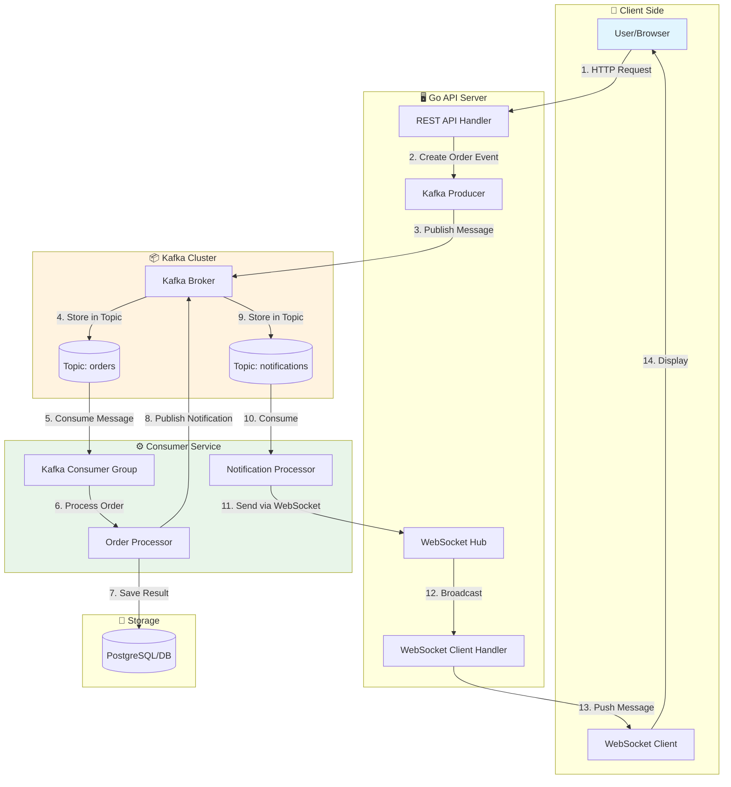

---------------------------------------------------------------------------------
- โครงสร้าง Foder การทำงาน
setup kafka container
create kafka and golang app
create kafka configuration
create kafka message publisher
create kafka message consumer
create async order handler in golang
process consumed message in kafka & go
---------------------------------------------------------------------------------
# Golang Kafka Service
---------------------------------------------------------------------------------
```bash
  api/
    ├── cmd/
    │   ├── apiser/                 # REST API หลัก (มีอยู่แล้ว)
    │   ├── Kafka/              # *** Kafka Service
    │   │   └── main.go
    │   ├── initdata.go
    │   ├── root.go
    │   ├── serve.go
    │   └── worker.go
    ├── internal/
    │   ├── Kafka/              # **** โค้ดเฉพาะของ Kafka
    │   │   ├── delivery/
    │   │   │   └── ws/
    │   │   │       ├── hub.go
    │   │   │       ├── client.go
    │   │   │       └── handler.go     # HTTP endpoint สำหรับ upgrade
    │   │   ├── usecase/
    │   │   │   └── ws_usecase.go      # business logic (save message, auth)
    │   │   ├── repository/
    │   │   │   └── ws_repo.go         # interface สำหรับ DB
    │   │   └── models/
    │   │       └── ws_models.go       # entity ของ message, session
    │   ├── pkg/                    # shared packages (มีอยู่แล้ว)
    │   │   ├── Kafka/          # **ปรับปรุง** ใช้ร่วมกันได้
    │   │   │   ├── hub.go          # core Hub logic
    │   │   │   ├── client.go
    │   │   │   └── message.go      # struct ของ message
    │   │   └── ...
    ├── migrations/                 # **เพิ่ม** SQL schema สำหรับ Kafka
    │   └── 20250619_Kafka_tables.sql
    └── 
```
---------------------------------------------------------------------------------
    - code ทำงานจริง
    - โครงสร้างการทำงาน
	- คืออะไร
	- วัตุประสงค์	
	- ใช้ทำอะไร
	- ทำงานอย่างไร
	 - ออกแบบ workflow
		- วาดรูป dataflow สร้าง รูปแบบ dataflow เหมือนจริง ลักษณะ flowchart   เพื่ออธิบายกระบวนการ ทำความเข้าใจ
        - วาดรูป dataflow สร้าง รูปแบบMermaid Diagrams
		- พร้อมอธิบาย แบบ ละเอียด  
    	- ยกตัวอย่างการทำงาน ตัวอย่างการใช้งานจริง หรือ กรณีศึกษา แนวทางแก้ไขปัญหา ที่อาจจะเกิดขึ้น 
    	- ประโยชน์ที่ได้รับ
    	- ข้อควรระวัง
    	- ข้อดี
    	- ข้อเสีย
    	- ข้อห้าม ถ้ามี
    - Check list Test case
    - Check list funntion
	- Root Cause Analysis (RCA) (ถ้ามี)
	- สรุป
---------------------------------------------------------------------------------
# Golang Kafka Service: คู่มือฉบับสมบูรณ์

## โครงสร้างโปรเจกต์ (Project Structure)

จากโครงสร้างที่คุณให้มา สามารถแบ่งเป็น 3 ส่วนหลักดังนี้:

```
api/
├── cmd/
│   ├── apiser/                 # REST API หลัก
│   ├── kafka/                  # ✅ Kafka Service (ตัวเริ่มต้นระบบ)
│   │   └── main.go
│   ├── initdata.go
│   ├── root.go
│   ├── serve.go
│   └── worker.go
├── internal/
│   ├── kafka/                  # ✅ โค้ดเฉพาะของ Kafka
│   │   ├── delivery/
│   │   │   └── ws/
│   │   │       ├── hub.go      # จัดการ WebSocket connections
│   │   │       ├── client.go   # WebSocket client logic
│   │   │       └── handler.go  # HTTP endpoint สำหรับ upgrade เป็น WebSocket
│   │   ├── usecase/
│   │   │   └── ws_usecase.go   # Business logic (save message, auth)
│   │   ├── repository/
│   │   │   └── ws_repo.go      # Interface สำหรับ DB
│   │   └── models/
│   │       └── ws_models.go    # Entity ของ message, session
│   └── pkg/                    # Shared packages
│       └── kafka/              # ✅ แกนหลักที่ใช้ร่วมกัน
│           ├── hub.go          # Core Hub logic
│           ├── client.go
│           └── message.go      # Struct ของ message
└── migrations/
    └── 20250619_kafka_tables.sql  # ✅ SQL schema สำหรับ Kafka
```

---

## คืออะไร? (What is Kafka Service?)

**Kafka Service** คือระบบที่มีหน้าที่รับส่งข้อความแบบ Asynchronous โดยใช้ **Apache Kafka** เป็นตัวกลาง (Message Broker) ร่วมกับภาษา **Golang** ภายในโปรเจกต์นี้ยังรวมเอา **WebSocket** เข้ามาเพื่อให้สามารถส่งข้อความแบบ Real-time ไปยังผู้ใช้ที่เชื่อมต่ออยู่

---

## วัตถุประสงค์ (Purpose)

1. **แยกส่วนการทำงาน (Decoupling)** – แยกระบบส่งข้อความออกจากระบบหลัก เพื่อให้แต่ละส่วนสามารถพัฒนาและปรับขนาดได้ independently
2. **จัดการภาระงานแบบ Asynchronous** – เปลี่ยนจากระบบ Synchronous ที่รอการตอบกลับ มาเป็นระบบที่ทำงานเบื้องหลัง ไม่ต้องรอ
3. **รองรับการขยายตัว (Scalability)** – สามารถเพิ่ม Consumer ได้ตามต้องการ เพื่อรองรับปริมาณข้อความที่เพิ่มขึ้น
4. **Real-time Communication** – ส่งข้อความถึงผู้ใช้แบบทันทีผ่าน WebSocket

---

## ใช้ทำอะไร? (Use Cases)

| สถานการณ์ | ตัวอย่างการใช้งาน |
|-----------|------------------|
| **ระบบสั่งซื้อออนไลน์** | เมื่อลูกค้าสั่งซื้อสินค้า ระบบจะส่ง Event ไปที่ Kafka แล้วให้ Inventory Service, Payment Service, Notification Service ทำงานตามลำดับ |
| **แจ้งเตือนแบบ Real-time** | ส่งข้อความแจ้งเตือนไปยังผู้ใช้ผ่าน WebSocket ทันทีที่มีการอัปเดตสถานะ |
| **ระบบ Log และ Monitoring** | เก็บ Log การทำงานของระบบทั้งหมดลง Kafka เพื่อนำไปวิเคราะห์ภายหลัง |
| **Event-driven Microservices** | ใช้ Kafka เป็นสื่อกลางในการสื่อสารระหว่าง Microservices ต่างๆ |

---

## ทำงานอย่างไร? (How It Works)

### ส่วนประกอบหลัก

1. **Producer (ผู้ส่งข้อความ)** – สร้างและส่งข้อความไปยัง Kafka Topic
2. **Kafka Broker** – เก็บข้อความใน Topic และกระจายให้ Consumer
3. **Consumer (ผู้รับข้อความ)** – ดึงข้อความจาก Kafka Topic มาประมวลผล
4. **WebSocket Hub** – จัดการ Connection และส่งข้อความไปยัง Client แบบ Real-time

### ขั้นตอนการทำงาน

1. **Setup Kafka Container** – ใช้ Docker Compose สร้าง Kafka และ Zookeeper
2. **สร้าง Producer** – Go application สร้างข้อความและส่งไปยัง Kafka Topic
3. **สร้าง Consumer** – Go application ดึงข้อความจาก Kafka Topic
4. **Async Order Handler** – จัดการคำสั่งซื้อแบบ Asynchronous
5. **WebSocket Delivery** – ส่งผลลัพธ์ไปยังผู้ใช้แบบ Real-time

---

## Dataflow Workflow (Mermaid Diagram)



### คำอธิบาย Dataflow อย่างละเอียด

**ขั้นตอนที่ 1-3: การรับคำสั่งและสร้าง Event**
- ผู้ใช้ส่ง HTTP Request มาที่ API (เช่น `POST /api/orders`)
- REST API Handler รับคำขอ ตรวจสอบข้อมูล และสร้าง Order Event
- Producer สร้างข้อความในรูปแบบ JSON แล้วส่งไปยัง Kafka Topic `orders`

**ขั้นตอนที่ 4: Kafka เก็บข้อความ**
- Kafka Broker รับข้อความและเก็บไว้ใน Topic `orders`
- ข้อความจะถูกเก็บตามลำดับและ Partition ที่กำหนด

**ขั้นตอนที่ 5-7: Consumer ประมวลผล**
- Consumer Group ดึงข้อความจาก Topic `orders`
- Order Processor ประมวลผลคำสั่งซื้อ (ตรวจสอบ stock, คำนวณราคา)
- ผลลัพธ์ถูกบันทึกลง Database

**ขั้นตอนที่ 8-9: สร้าง Notification Event**
- หลังจากประมวลผลเสร็จ Order Processor สร้าง Notification Event
- ส่งไปยัง Topic `notifications`

**ขั้นตอนที่ 10-11: Consumer แจ้งเตือน**
- Notification Processor ดึงข้อความจาก Topic `notifications`
- เตรียมข้อมูลสำหรับส่งไปยัง WebSocket

**ขั้นตอนที่ 12-14: ส่งข้อความ Real-time**
- WebSocket Hub รับข้อมูลและส่งไปยัง Client ที่เชื่อมต่ออยู่
- Client แสดงผลให้ผู้ใช้เห็นแบบทันที

---

## ตัวอย่างการทำงานจริง (Real-World Example)

### สถานการณ์: ระบบสั่งอาหารออนไลน์

```
1. ลูกค้ากดสั่งอาหาร ➜ REST API รับคำสั่ง
2. Producer ส่ง Event "order.created" ไปที่ Kafka
3. Kafka เก็บ Event ไว้ใน Topic "orders"
4. Consumer กลุ่มที่ 1: Inventory Service ➜ ตรวจสอบสต็อกวัตถุดิบ
5. Consumer กลุ่มที่ 2: Payment Service ➜ หักเงินจากบัญชีลูกค้า
6. Consumer กลุ่มที่ 3: Kitchen Service ➜ ส่งออเดอร์ไปที่ครัว
7. Consumer กลุ่มที่ 4: Notification Service ➜ แจ้งเตือนสถานะให้ลูกค้าทราบ
8. WebSocket ส่งสถานะอัปเดตไปยังหน้าเว็บของลูกค้าแบบ Real-time
```

### ปัญหาที่อาจเกิดขึ้นและแนวทางแก้ไข

| ปัญหา | สาเหตุ | แนวทางแก้ไข |
|-------|--------|-------------|
| **Consumer ทำงานช้า** | Consumer ประมวลผลช้า ทำให้ข้อความค้าง | เพิ่มจำนวน Consumer ใน Group หรือเพิ่ม Partition |
| **ข้อความสูญหาย** | Producer ไม่รอ ACK จาก Kafka | ตั้งค่า `acks=all` เพื่อให้รอการยืนยันจากทุก Replica |
| **Duplicate Message** | Consumer Commit Offset ไม่สำเร็จ | ใช้ Idempotent Consumer หรือ Deduplication Logic |
| **Connection WebSocket หลุด** | Network issue หรือ Timeout | Implement Reconnection Logic และ Heartbeat |
| **Kafka Broker ล่ม** | Single Point of Failure | ใช้ Kafka Cluster ที่มีหลาย Broker |

---

## ประโยชน์ที่ได้รับ (Benefits)

1. **ความเร็วสูง** – ระบบไม่ต้องรอการประมวลผลแบบ Synchronous ทำให้ตอบสนองเร็วขึ้น
2. **ความน่าเชื่อถือ** – Kafka เก็บข้อความไว้จนกว่า Consumer จะประมวลผลสำเร็จ
3. **ขยายได้ง่าย** – สามารถเพิ่ม Producer/Consumer ได้ตามต้องการ
4. **Real-time Communication** – ผู้ใช้ได้รับข้อมูลอัปเดตแบบทันทีผ่าน WebSocket
5. **ลดภาระระบบหลัก** – งานหนักถูกกระจายไปยัง Consumer Service

---

## ข้อควรระวัง (Precautions)

1. **จัดการ Offset อย่างระมัดระวัง** – การ Commit Offset ผิดพลาดอาจทำให้ข้อความสูญหายหรือถูกประมวลผลซ้ำ
2. **ตั้งค่า Timeout ให้เหมาะสม** – Consumer ที่ timeout อาจถูก eject ออกจาก Consumer Group
3. **ทดสอบการ Rebalance** – เมื่อมี Consumer เข้า/ออก Group ต้องมั่นใจว่าระบบทำงานปกติ
4. **ตรวจสอบ Kafka Version** – Kafka 4.0 จะเลิกใช้ Zookeeper ต้องเตรียมการอัปเกรด
5. **จัดการ Connection WebSocket** – ต้องมี Mechanism สำหรับ Reconnect และ Cleanup

---

## ข้อดี (Advantages)

| ข้อดี | คำอธิบาย |
|-------|----------|
| **High Throughput** | รองรับข้อความหลายล้านข้อความต่อวินาที |
| **Decoupling** | Producer และ Consumer ไม่ต้องรู้จักกันโดยตรง |
| **Fault Tolerance** | ข้อมูลถูก Replicate ไปหลาย Broker |
| **Real-time** | WebSocket + Kafka ทำให้ส่งข้อมูลแบบทันที |
| **Flexible** | รองรับหลายภาษาและหลาย Platform |

---

## ข้อเสีย (Disadvantages)

| ข้อเสีย | คำอธิบาย |
|--------|----------|
| **Complexity** | ระบบมีความซับซ้อนกว่า REST API ทั่วไป |
| **Latency** | มี Overhead จากการส่งข้อความผ่าน Broker |
| **Learning Curve** | ต้องเรียนรู้ Kafka Concepts (Topic, Partition, Offset, etc.) |
| **Resource Intensive** | Kafka ต้องการทรัพยากรค่อนข้างสูง (RAM, Disk) |
| **Ordering Guarantee** | การันตีลำดับข้อความได้เฉพาะภายใน Partition เดียว |

---

## ข้อห้าม (What NOT to Do)

1. **❌ อย่าใช้ Kafka สำหรับ Request-Response** – Kafka ออกแบบมาสำหรับ Event-driven ไม่ใช่ RPC
2. **❌ อย่าเก็บข้อความนานเกินไป** – ตั้งค่า Retention Policy ให้เหมาะสม
3. **❌ อย่าใช้ Partition น้อยเกินไป** – Partition น้อยจะจำกัดความสามารถในการขยายระบบ
4. **❌ อย่าลืมตั้งค่า `acks=all`** – ถ้าไม่ตั้งอาจเสียข้อมูลเมื่อ Broker ล่ม
5. **❌ อย่าใช้ Consumer Group เยอะเกินไป** – แต่ละ Group จะอ่านข้อความซ้ำทั้งหมด
6. **❌ อย่าให้ Consumer ประมวลผลนานเกินไป** – อาจทำให้เกิด Rebalance บ่อย

---

## Checklist: Test Cases

### Producer Tests
- [ ] ส่งข้อความไปยัง Topic ได้สำเร็จ
- [ ] ส่งข้อความพร้อม Key เพื่อกำหนด Partition
- [ ] จัดการ Error เมื่อ Kafka ไม่พร้อม
- [ ] ตรวจสอบว่า Message ถูกส่งด้วย `acks=all`
- [ ] ทดสอบ Retry Mechanism เมื่อส่งไม่สำเร็จ

### Consumer Tests
- [ ] ดึงข้อความจาก Topic ได้สำเร็จ
- [ ] Commit Offset หลังจากประมวลผลสำเร็จ
- [ ] จัดการข้อความซ้ำ (Duplicate)
- [ ] ทดสอบ Consumer Group Rebalance
- [ ] ทดสอบ Graceful Shutdown

### WebSocket Tests
- [ ] Client เชื่อมต่อ WebSocket สำเร็จ
- [ ] รับข้อความจาก Server แบบ Real-time
- [ ] Reconnect อัตโนมัติเมื่อ Connection หลุด
- [ ] จัดการหลาย Client พร้อมกัน
- [ ] ส่งข้อความเฉพาะ Client ที่เกี่ยวข้อง

### Integration Tests
- [ ] ทดสอบ End-to-End: HTTP → Kafka → Consumer → WebSocket
- [ ] ทดสอบ High Load (Stress Test)
- [ ] ทดสอบเมื่อ Kafka Broker ล่มและกลับมา
- [ ] ทดสอบการทำงานของ多个 Consumer Group

---

## Checklist: Functions

### Core Functions
- [x] `SetupKafkaContainer()` – ตั้งค่า Docker container
- [x] `CreateProducer()` – สร้าง Kafka Producer
- [x] `CreateConsumer()` – สร้าง Kafka Consumer
- [x] `PublishMessage(topic, message)` – ส่งข้อความ
- [x] `ConsumeMessage(topic)` – รับข้อความ
- [x] `AsyncOrderHandler()` – จัดการคำสั่งซื้อ

### WebSocket Functions
- [x] `NewHub()` – สร้าง WebSocket Hub
- [x] `RegisterClient()` – ลงทะเบียน Client
- [x] `BroadcastMessage()` – ส่งข้อความไปยัง Client ทั้งหมด
- [x] `HandleWebSocket()` – Upgrade HTTP → WebSocket

### Utility Functions
- [x] `GracefulShutdown()` – ปิดระบบอย่างปลอดภัย
- [x] `HealthCheck()` – ตรวจสอบสถานะ Kafka
- [x] `ErrorHandler()` – จัดการ Error
- [x] `Logger()` – ระบบ Log

---

## Root Cause Analysis (RCA) – กรณีตัวอย่าง

### สถานการณ์: ข้อความค้างใน Kafka ไม่มี Consumer ดึงไปประมวลผล

```
Root Cause: Consumer Group ID เปลี่ยนไป ทำให้ Consumer ไม่อยู่ใน Group เดิม

Analysis:
1.  Developer เปลี่ยน Group ID ในไฟล์ config
2.  Consumer ใหม่เริ่มทำงานด้วย Group ID ใหม่
3.  ข้อความเก่ายังอยู่ใน Topic แต่ไม่มี Consumer ใน Group เดิม
4.  ข้อความจึงค้างอยู่ใน Kafka

Solution:
1.  ใช้ Group ID เดิม หรือสร้าง Consumer ที่อ่านจาก Beginning
2.  ตั้ง Auto Offset Reset เป็น "earliest" เพื่อให้อ่านข้อความเก่าได้
3.  ใช้ Kafka Admin Tool เพื่อ Reset Offset ของ Consumer Group

Prevention:
1.  ใช้ Environment Variable สำหรับ Group ID
2.  มี Monitoring เตือนเมื่อ Consumer Lag สูง
3.  Document การเปลี่ยนแปลง Group ID
```

---

## สรุป (Summary)

**Golang Kafka Service** เป็นระบบที่ผสานความสามารถของ Apache Kafka ในการจัดการข้อความแบบ Asynchronous กับความเร็วและประสิทธิภาพของภาษา Go เข้ากับ WebSocket สำหรับการสื่อสารแบบ Real-time

**หัวใจสำคัญ** ของระบบนี้คือ:
1. **Producer** สร้างและส่งข้อความไปยัง Kafka Topic
2. **Kafka Broker** เก็บข้อความและกระจายให้ Consumer
3. **Consumer** ดึงข้อความมาประมวลผล
4. **WebSocket Hub** ส่งผลลัพธ์ไปยังผู้ใช้แบบ Real-time

**การใช้ Docker** ช่วยให้ตั้งค่าระบบได้ง่ายและรวดเร็ว ส่วน **Async Order Handler** ช่วยให้ระบบจัดการคำสั่งซื้อได้โดยไม่ต้องรอ

แม้ระบบจะมีความซับซ้อนกว่าการใช้ REST API ทั่วไป แต่ **ข้อดีในด้านความเร็ว ความน่าเชื่อถือ และความสามารถในการขยายระบบ** ทำให้ Kafka เป็นตัวเลือกที่เหมาะสมสำหรับระบบที่มีปริมาณงานสูงและต้องการ Real-time communication