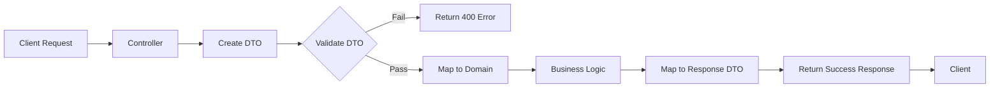
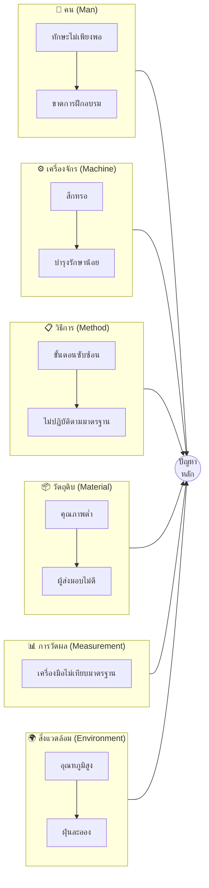
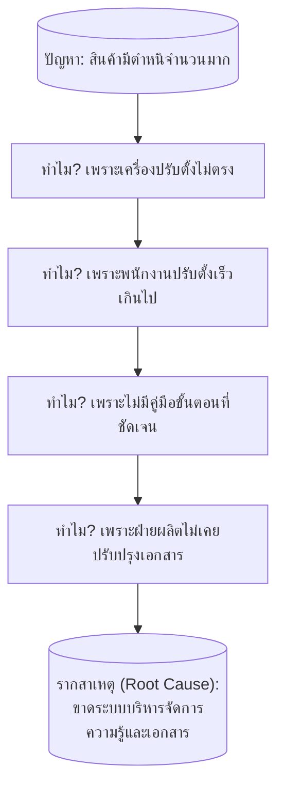

# 📚 คู่มือสถาปัตยกรรมซอฟต์แวร์และวิศวกรรมซอฟต์แวร์ฉบับสมบูรณ์ (The Complete Software Architecture & Engineering Master Guide)

> **เอกสารต้นแบบเชิงลึก** สำหรับนักพัฒนาซอฟต์แวร์ทุกระดับ ครอบคลุมตั้งแต่พื้นฐาน CRUD, ORM, TypeORM, Schema, Entity, DTO, Validation, Transaction, Cache ไปจนถึง Clean Architecture + DDD, AI Superpowers, Monitoring ใน DevOps, POC, ROI และ RCA Diagrams
>
> **จัดทำอย่างเป็นระบบ ครบถ้วน ไม่ตัดทอดความสำคัญ**

---

## สารบัญ (Table of Contents)

### ภาคที่ 1: พื้นฐานสถาปัตยกรรมซอฟต์แวร์ (Software Architecture Fundamentals)
1. [บทนำสู่สถาปัตยกรรมซอฟต์แวร์](#1-บทนำสู่สถาปัตยกรรมซอฟต์แวร์)
2. [Data Structures และ Algorithms](#2-data-structures-และ-algorithms)
3. [Big O Notation](#3-big-o-notation)
4. [Functional Programming](#4-functional-programming)
5. [Object-Oriented Programming (OOP)](#5-object-oriented-programming-oop)
6. [System Design](#6-system-design)
7. [Software Architecture](#7-software-architecture)
8. [CI/CD](#8-cicd)
9. [Cloud Platform (AWS)](#9-cloud-platform-aws)
10. [Domain-Driven Design (DDD)](#10-domain-driven-design-ddd)
11. [Clean Architecture](#11-clean-architecture)

### ภาคที่ 2: การจัดการข้อมูล (Data Management)
12. [CRUD คืออะไร](#12-crud-คืออะไร)
13. [ORM คืออะไร](#13-orm-คืออะไร)
14. [TypeORM คืออะไร](#14-typeorm-คืออะไร)
15. [Schema](#15-schema)
16. [Entity](#16-entity)
17. [DTO และ Validation](#17-dto-และ-validation)
18. [Transaction](#18-transaction)
19. [Cache](#19-cache)

### ภาคที่ 3: สถาปัตยกรรมระดับสูง (Advanced Architecture)
20. [Golang Module Master Template (Clean Architecture + DDD)](#20-golang-module-master-template)
21. [AI Superpowers Developer Guide (6 ทักษะ)](#21-ai-superpowers-developer-guide)
22. [Full-Stack AI Application Architecture](#22-full-stack-ai-application-architecture)

### ภาคที่ 4: DevOps และ Monitoring
23. [เครื่องมือ Monitoring ใน DevOps](#23-เครื่องมือ-monitoring-ใน-devops)
24. [POC (Proof of Concept) สำหรับ Monitoring Tools](#24-poc-proof-of-concept-สำหรับ-monitoring-tools)
25. [การคำนวณ ROI สำหรับ Monitoring Tools](#25-การคำนวณ-roi-สำหรับ-monitoring-tools)

### ภาคที่ 5: การวิเคราะห์และแก้ไขปัญหา
26. [RCA Diagrams (Fishbone และ 5 Whys)](#26-rca-diagrams)
27. [Best Practices และ Checklist](#27-best-practices-และ-checklist)

### ภาคผนวก
- [A. Dependency Matrix](#ภาคผนวก-a-dependency-matrix)
- [B. Kafka Topic Convention](#ภาคผนวก-b-kafka-topic-convention)
- [C. Error Code Convention](#ภาคผนวก-c-error-code-convention)
- [D. Environment Variables Naming](#ภาคผนวก-d-environment-variables-naming)
- [E. สรุปสูตรและเทมเพลตทั้งหมด](#ภาคผนวก-e-สรุปสูตรและเทมเพลตทั้งหมด)

---

# ภาคที่ 1: พื้นฐานสถาปัตยกรรมซอฟต์แวร์ (Software Architecture Fundamentals)

---

## 1. บทนำสู่สถาปัตยกรรมซอฟต์แวร์

### 1.1 บทนำ (Introduction)

สถาปัตยกรรมซอฟต์แวร์ (Software Architecture) คือรากฐานสำคัญของการพัฒนาซอฟต์แวร์ที่มีคุณภาพ มันคือ "พิมพ์เขียว" ที่กำหนดว่า�ระบบจะถูกสร้างอย่างไร องค์ประกอบต่างๆ จะสื่อสารกันอย่างไร และจะตอบสนองต่อความต้องการทางธุรกิจได้อย่างไร

ในยุคปัจจุบันที่ระบบซอฟต์แวร์มีความซับซ้อนมากขึ้น การเข้าใจหลักการสถาปัตยกรรมที่ดีไม่ใช่ทางเลือก แต่เป็นสิ่งจำเป็นสำหรับนักพัฒนาทุกคน

### 1.2 บทนิยาม (Definition)

**Software Architecture** คือชุดของโครงสร้างพื้นฐาน (Structures) ที่ประกอบด้วย:
- **องค์ประกอบ (Elements)** ของระบบ
- **ความสัมพันธ์ (Relationships)** ระหว่างองค์ประกอบ
- **คุณสมบัติ (Properties)** ของทั้งองค์ประกอบและความสัมพันธ์

สถาปัตยกรรมทำหน้าที่เป็น:
1. **กรอบการทำงาน** สำหรับการตัดสินใจทางเทคนิค
2. **สะพานเชื่อม** ระหว่างความต้องการทางธุรกิจ和技术
3. **เครื่องมือสื่อสาร** ระหว่างผู้มีส่วนได้ส่วนเสีย
4. **แนวทาง** สำหรับการวิเคราะห์และประเมินระบบ

### 1.3 หลักการสำคัญของสถาปัตยกรรมซอฟต์แวร์

| หลักการ | คำอธิบาย |
|---------|----------|
| **Separation of Concerns** | แยกความรับผิดชอบออกจากกัน |
| **Single Responsibility** | หนึ่งองค์ประกอบ หนึ่งหน้าที่ |
| **Loose Coupling** | ลดการพึ่งพากันระหว่างส่วนต่างๆ |
| **High Cohesion** | ส่วนที่เกี่ยวข้องกันอยู่ด้วยกัน |
| **Abstraction** | ซ่อนรายละเอียดที่ไม่จำเป็น |
| **Modularity** | แบ่งระบบเป็นโมดูลที่จัดการได้ |

### 1.4 โครงสร้างของสถาปัตยกรรมซอฟต์แวร์

```
┌─────────────────────────────────────────────────────────────┐
│                    PRESENTATION LAYER                       │
│  (UI, Web, Mobile, API Gateway, WebSocket)                  │
├─────────────────────────────────────────────────────────────┤
│                    APPLICATION LAYER                        │
│  (Use Cases, Application Services, DTOs, Orchestration)     │
├─────────────────────────────────────────────────────────────┤
│                      DOMAIN LAYER                           │
│  (Entities, Value Objects, Domain Services, Events)         │
├─────────────────────────────────────────────────────────────┤
│                  INFRASTRUCTURE LAYER                       │
│  (Database, Messaging, Cache, External Services)            │
└─────────────────────────────────────────────────────────────┘
```

### 1.5 แนวทางการประยุกต์ใช้

1. **เริ่มจากความต้องการทางธุรกิจ** ไม่ใช่เทคโนโลยี
2. **ออกแบบสำหรับการเปลี่ยนแปลง** (Design for Change)
3. **ใช้หลัก YAGNI** (You Aren't Gonna Need It)
4. **ทำ Documentation ให้ชัดเจน**
5. **Review สถาปัตยกรรมเป็นระยะ**

### 1.6 ปัญหาและแนวทางแก้ไข

| ปัญหา | แนวทางแก้ไข |
|-------|-------------|
| Over-engineering | เริ่มจากง่ายๆ ค่อยๆ เพิ่มความซับซ้อน |
| Tight Coupling | ใช้ Dependency Injection และ Interfaces |
| ไม่มี Documentation | สร้าง Architecture Decision Records (ADRs) |
| Scope Creep | กำหนดขอบเขตให้ชัดเจน |

---

## 2. Data Structures และ Algorithms

### 2.1 บทนำ

Data Structures และ Algorithms เป็นพื้นฐานของการเขียนโปรแกรมที่มีประสิทธิภาพ การเลือกใช้ให้เหมาะสมจะส่งผลโดยตรงต่อประสิทธิภาพของระบบ

### 2.2 บทนิยาม

**Data Structure** = วิธีการจัดเก็บและจัดระเบียบข้อมูลในหน่วยความจำ
**Algorithm** = ขั้นตอนวิธีการแก้ปัญหาที่ชัดเจนและเป็นลำดับ

### 2.3 Data Structures พื้นฐาน

#### 2.3.1 Linear Data Structures

| โครงสร้าง | ลักษณะ | การเข้าถึง | การเพิ่ม/ลบ | การใช้งาน |
|-----------|--------|-----------|-------------|-----------|
| **Array** | ข้อมูลเรียงต่อกัน | O(1) | O(n) | ข้อมูลที่เข้าถึงบ่อย |
| **Linked List** | โหนดเชื่อมกันด้วย pointer | O(n) | O(1) | ข้อมูลที่เพิ่ม/ลบบ่อย |
| **Stack** | LIFO (Last In First Out) | O(n) | O(1) | Undo, Expression parsing |
| **Queue** | FIFO (First In First Out) | O(n) | O(1) | Task scheduling, BFS |

#### 2.3.2 Non-Linear Data Structures

| โครงสร้าง | ลักษณะ | การเข้าถึง | การใช้งาน |
|-----------|--------|-----------|-----------|
| **Tree** | โครงสร้างลำดับชั้น | O(log n) - O(n) | File system, DOM |
| **Graph** | โหนดเชื่อมกันด้วย edges | O(V+E) | Social network, Maps |
| **Hash Table** | Key-Value mapping | O(1) เฉลี่ย | Cache, Database index |
| **Heap** | Priority queue | O(1) - O(log n) | Task scheduling |

### 2.4 Advanced Data Structures (สำหรับ Competitive Programming)

#### 2.4.1 Suffix Automaton + Suffix Link Tree

**Suffix Automaton** คือ Deterministic Finite Automaton (DFA) ที่รับทุก substring ของ string ที่กำหนด

```cpp
// โครงสร้าง Suffix Automaton
struct SuffixAutomaton {
    struct State {
        int len, link;
        map<char, int> next;
    };
    vector<State> st;
    int last;
    
    SuffixAutomaton() {
        st.push_back({0, -1, {}});
        last = 0;
    }
    
    void extend(char c) {
        int cur = st.size();
        st.push_back({st[last].len + 1, 0, {}});
        int p = last;
        while (p != -1 && !st[p].next.count(c)) {
            st[p].next[c] = cur;
            p = st[p].link;
        }
        if (p == -1) {
            st[cur].link = 0;
        } else {
            int q = st[p].next[c];
            if (st[p].len + 1 == st[q].len) {
                st[cur].link = q;
            } else {
                int clone = st.size();
                st.push_back({st[p].len + 1, st[q].link, st[q].next});
                while (p != -1 && st[p].next[c] == q) {
                    st[p].next[c] = clone;
                    p = st[p].link;
                }
                st[q].link = st[cur].link = clone;
            }
        }
        last = cur;
    }
};
```

**Suffix Link Tree** คือ tree ที่สร้างจาก suffix links ของ Suffix Automaton ใช้สำหรับ:
- หาจำนวนครั้งที่ substring ปรากฏ
- หา longest common substring
- หา distinct substrings

#### 2.4.2 Palindromic Automaton (Eertree)

**Palindromic Automaton** หรือ **Eertree** เป็นโครงสร้างข้อมูลที่เก็บ palindromic substrings ทั้งหมด

```cpp
struct PalindromicAutomaton {
    struct Node {
        int next[26];
        int len, link;
        int cnt;
    };
    vector<Node> tree;
    string s;
    int last;
    
    PalindromicAutomaton() {
        tree.push_back({{0}, -1, 0, 0}); // root 1
        tree.push_back({{0}, 0, 0, 0});  // root 2
        last = 1;
        s = "";
    }
    
    void addChar(char c) {
        s += c;
        int cur = last;
        int pos = s.size() - 1;
        
        while (true) {
            int curlen = tree[cur].len;
            if (pos - 1 - curlen >= 0 && s[pos - 1 - curlen] == c)
                break;
            cur = tree[cur].link;
        }
        
        if (tree[cur].next[c - 'a']) {
            last = tree[cur].next[c - 'a'];
            tree[last].cnt++;
            return;
        }
        
        int now = tree.size();
        tree.push_back({{0}, tree[cur].len + 2, 0, 0});
        tree[cur].next[c - 'a'] = now;
        
        if (tree[now].len == 1) {
            tree[now].link = 1;
        } else {
            int link = tree[cur].link;
            while (true) {
                int linklen = tree[link].len;
                if (pos - 1 - linklen >= 0 && s[pos - 1 - linklen] == c)
                    break;
                link = tree[link].link;
            }
            tree[now].link = tree[link].next[c - 'a'];
        }
        
        last = now;
        tree[last].cnt++;
    }
};
```

#### 2.4.3 Mo's Algorithm with Update

**Mo's Algorithm** เป็นเทคนิคสำหรับตอบคำถาม range queries แบบ offline

```cpp
// Mo's Algorithm with Update
struct Query {
    int l, r, t, idx;
};

struct Update {
    int pos, old_val, new_val;
};

class MosWithUpdate {
    vector<int> arr;
    vector<Query> queries;
    vector<Update> updates;
    int block_size;
    int cur_l, cur_r, cur_t;
    int cur_answer;
    
public:
    MosWithUpdate(vector<int>& a, int n) : arr(a) {
        block_size = pow(n, 2.0/3.0);
        cur_l = 0; cur_r = -1; cur_t = 0;
        cur_answer = 0;
    }
    
    void addQuery(int l, int r, int t, int idx) {
        queries.push_back({l, r, t, idx});
    }
    
    void addUpdate(int pos, int old_val, int new_val) {
        updates.push_back({pos, old_val, new_val});
    }
    
    void process() {
        sort(queries.begin(), queries.end(), [&](Query& a, Query& b) {
            int ba = a.l / block_size, bb = b.l / block_size;
            if (ba != bb) return ba < bb;
            int ra = a.r / block_size, rb = b.r / block_size;
            if (ra != rb) return ra < rb;
            return a.t < b.t;
        });
        
        // Process queries...
    }
};
```

#### 2.4.4 Centroid Decomposition + Fenwick Tree

**Centroid Decomposition** ใช้สำหรับแก้ปัญหาบน tree เช่น การหาระยะทางระหว่างโหนด

```cpp
class CentroidDecomposition {
    vector<vector<int>> adj;
    vector<bool> removed;
    vector<int> subtree_size;
    int n;
    
    int getSubtreeSize(int u, int p) {
        subtree_size[u] = 1;
        for (int v : adj[u]) {
            if (v != p && !removed[v])
                subtree_size[u] += getSubtreeSize(v, u);
        }
        return subtree_size[u];
    }
    
    int findCentroid(int u, int p, int total) {
        for (int v : adj[u]) {
            if (v != p && !removed[v] && subtree_size[v] > total / 2)
                return findCentroid(v, u, total);
        }
        return u;
    }
    
    void decompose(int entry) {
        int total = getSubtreeSize(entry, -1);
        int centroid = findCentroid(entry, -1, total);
        removed[centroid] = true;
        
        // Process centroid...
        
        for (int v : adj[centroid]) {
            if (!removed[v])
                decompose(v);
        }
    }
};
```

#### 2.4.5 Heavy-Light Decomposition (HLD) + Lazy Segment Tree

**HLD** ใช้สำหรับแก้ปัญหาบน tree เช่น path queries

```cpp
class HeavyLightDecomposition {
    vector<vector<int>> adj;
    vector<int> parent, depth, heavy, head, pos;
    int cur_pos;
    int n;
    
    int dfs(int u) {
        int size = 1;
        int max_c_size = 0;
        for (int v : adj[u]) {
            if (v != parent[u]) {
                parent[v] = u;
                depth[v] = depth[u] + 1;
                int c_size = dfs(v);
                size += c_size;
                if (c_size > max_c_size) {
                    max_c_size = c_size;
                    heavy[u] = v;
                }
            }
        }
        return size;
    }
    
    void decompose(int u, int h) {
        head[u] = h;
        pos[u] = cur_pos++;
        if (heavy[u] != -1)
            decompose(heavy[u], h);
        for (int v : adj[u]) {
            if (v != parent[u] && v != heavy[u])
                decompose(v, v);
        }
    }
    
public:
    void init() {
        parent.assign(n, -1);
        depth.assign(n, 0);
        heavy.assign(n, -1);
        head.assign(n, 0);
        pos.assign(n, 0);
        cur_pos = 0;
        dfs(0);
        decompose(0, 0);
    }
    
    int query(int u, int v) {
        int res = 0;
        while (head[u] != head[v]) {
            if (depth[head[u]] > depth[head[v]])
                swap(u, v);
            // Query segment tree on [pos[head[v]], pos[v]]
            v = parent[head[v]];
        }
        if (depth[u] > depth[v])
            swap(u, v);
        // Query segment tree on [pos[u], pos[v]]
        return res;
    }
};
```

#### 2.4.6 Fenwick Tree 2D + Range Update

```cpp
class Fenwick2D {
    vector<vector<int>> bit;
    int n, m;
    
public:
    Fenwick2D(int n, int m) : n(n), m(m) {
        bit.assign(n + 1, vector<int>(m + 1, 0));
    }
    
    void update(int x, int y, int val) {
        for (int i = x; i <= n; i += i & -i)
            for (int j = y; j <= m; j += j & -j)
                bit[i][j] += val;
    }
    
    int query(int x, int y) {
        int res = 0;
        for (int i = x; i > 0; i -= i & -i)
            for (int j = y; j > 0; j -= j & -j)
                res += bit[i][j];
        return res;
    }
    
    // Range update using difference array technique
    void rangeUpdate(int x1, int y1, int x2, int y2, int val) {
        update(x1, y1, val);
        update(x2 + 1, y1, -val);
        update(x1, y2 + 1, -val);
        update(x2 + 1, y2 + 1, val);
    }
};
```

#### 2.4.7 Wavelet Tree 2D

**Wavelet Tree** ใช้สำหรับตอบคำถามเกี่ยวกับ range queries เช่น k-th smallest element

```cpp
class WaveletTree {
    struct Node {
        vector<int> b;
        Node *left, *right;
    };
    
    Node* root;
    int low, high;
    vector<int> arr;
    
    Node* build(vector<int>& arr, int lo, int hi) {
        if (arr.empty() || lo > hi) return nullptr;
        
        Node* node = new Node();
        int mid = (lo + hi) / 2;
        vector<int> left_arr, right_arr;
        
        for (int x : arr) {
            if (x <= mid) {
                left_arr.push_back(x);
                node->b.push_back(0);
            } else {
                right_arr.push_back(x);
                node->b.push_back(1);
            }
        }
        
        if (lo < hi) {
            node->left = build(left_arr, lo, mid);
            node->right = build(right_arr, mid + 1, hi);
        }
        
        return node;
    }
    
public:
    WaveletTree(vector<int>& a, int lo, int hi) : arr(a), low(lo), high(hi) {
        root = build(arr, lo, hi);
    }
    
    int kthSmallest(int l, int r, int k) {
        // Implementation of k-th smallest query
        return 0; // Placeholder
    }
};
```

### 2.5 Algorithms พื้นฐาน

| ประเภท | Algorithm | Time Complexity | การใช้งาน |
|--------|-----------|-----------------|-----------|
| **Sorting** | Quick Sort | O(n log n) เฉลี่ย | จัดเรียงข้อมูลทั่วไป |
| **Sorting** | Merge Sort | O(n log n) | Stable sort, External sort |
| **Searching** | Binary Search | O(log n) | ค้นหาในข้อมูลที่เรียงแล้ว |
| **Graph** | BFS | O(V+E) | Shortest path (unweighted) |
| **Graph** | DFS | O(V+E) | Cycle detection, Topological sort |
| **Graph** | Dijkstra | O((V+E) log V) | Shortest path (weighted) |
| **DP** | Fibonacci | O(n) | ปัญหาการนับ |
| **Greedy** | Activity Selection | O(n log n) | ปัญหาการจัดตาราง |

---

## 3. Big O Notation

### 3.1 บทนำ

Big O Notation เป็นเครื่องมือทางคณิตศาสตร์ที่ใช้ describing ประสิทธิภาพของ algorithm ในแง่ของ time complexity และ space complexity เมื่อ input มีขนาดเพิ่มขึ้น

### 3.2 บทนิยาม

**Big O Notation** คือสัญกรณ์ที่อธิบาย upper bound ของการเติบโตของฟังก์ชัน เมื่อ input มีขนาดเข้าใกล้อนันต์

```
O(f(n)) = { g(n) : ∃ c > 0, n₀ > 0 such that ∀ n ≥ n₀, 0 ≤ g(n) ≤ c·f(n) }
```

### 3.3 ประเภทของ Complexity

| Notation | ชื่อ | ตัวอย่าง | ลักษณะ |
|----------|------|----------|--------|
| **O(1)** | Constant | Array access | คงที่ |
| **O(log n)** | Logarithmic | Binary search | ดีมาก |
| **O(n)** | Linear | Linear search | ดี |
| **O(n log n)** | Linearithmic | Merge sort | ปานกลาง |
| **O(n²)** | Quadratic | Bubble sort | แย่ |
| **O(n³)** | Cubic | Matrix multiplication | แย่มาก |
| **O(2ⁿ)** | Exponential | Subset generation | ไม่ยอมรับได้ |
| **O(n!)** | Factorial | Permutations | ไม่ยอมรับได้ |

### 3.4 การวิเคราะห์ Complexity

```typescript
// O(1) - Constant
function getFirst(arr: number[]): number {
    return arr[0]; // เข้าถึงครั้งเดียว
}

// O(n) - Linear
function findMax(arr: number[]): number {
    let max = arr[0];
    for (let i = 1; i < arr.length; i++) { // วน n ครั้ง
        if (arr[i] > max) max = arr[i];
    }
    return max;
}

// O(n²) - Quadratic
function bubbleSort(arr: number[]): number[] {
    for (let i = 0; i < arr.length; i++) {        // n ครั้ง
        for (let j = 0; j < arr.length - i - 1; j++) { // n ครั้ง
            if (arr[j] > arr[j + 1]) {
                [arr[j], arr[j + 1]] = [arr[j + 1], arr[j]];
            }
        }
    }
    return arr;
}

// O(log n) - Logarithmic
function binarySearch(arr: number[], target: number): number {
    let left = 0, right = arr.length - 1;
    while (left <= right) {
        const mid = Math.floor((left + right) / 2);
        if (arr[mid] === target) return mid;
        if (arr[mid] < target) left = mid + 1;
        else right = mid - 1;
    }
    return -1;
}
```

### 3.5 Space Complexity

| โครงสร้าง | Space Complexity | หมายเหตุ |
|-----------|------------------|----------|
| Array | O(n) | เก็บ n elements |
| Recursion | O(n) | Call stack |
| Hash Table | O(n) | เก็บ n key-value pairs |
| In-place sort | O(1) | ไม่ใช้ memory เพิ่ม |

### 3.6 ข้อควรระวัง

1. **Constant factors มีความสำคัญ** ในทางปฏิบัติ
2. **Amortized analysis** สำหรับ operations ที่บางครั้งแพง
3. **Best/Average/Worst case** ต่างกัน
4. **Input distribution** มีผลต่อ performance

---

## 4. Functional Programming

### 4.1 บทนำ

Functional Programming (FP) เป็น paradigms การเขียนโปรแกรมที่มอง computation เป็น evaluation ของ mathematical functions และหลีกเลี่ยงการเปลี่ยนแปลง state และ mutable data

### 4.2 บทนิยาม

**Functional Programming** คือรูปแบบการเขียนโปรแกรมที่:
- ใช้ **Pure Functions** เป็นหลัก
- หลีกเลี่ยง **Side Effects**
- ใช้ **Immutable Data**
- ใช้ **Function Composition**

### 4.3 หลักการสำคัญ

| หลักการ | คำอธิบาย | ตัวอย่าง |
|---------|----------|----------|
| **Pure Functions** | Input เดิม → Output เดิมเสมอ | `add(a, b) => a + b` |
| **Immutability** | ข้อมูลไม่เปลี่ยนแปลง | `const newArr = [...arr, item]` |
| **First-class Functions** | Function เป็นค่าได้ | `const fn = () => {}` |
| **Higher-order Functions** | Function รับ/return function | `map, filter, reduce` |
| **Function Composition** | ประกอบ functions | `compose(f, g)(x) = f(g(x))` |
| **Recursion** | เรียกตัวเอง | `factorial(n) = n * factorial(n-1)` |

### 4.4 การใช้งาน

```typescript
// Pure Function
const add = (a: number, b: number): number => a + b;

// Impure Function (มี side effect)
let total = 0;
const addToTotal = (value: number): void => {
    total += value; // เปลี่ยนแปลง external state
};

// Immutability
const original = [1, 2, 3];
const modified = [...original, 4]; // สร้าง array ใหม่

// Higher-order Functions
const numbers = [1, 2, 3, 4, 5];
const doubled = numbers.map(n => n * 2);        // [2, 4, 6, 8, 10]
const evens = numbers.filter(n => n % 2 === 0); // [2, 4]
const sum = numbers.reduce((acc, n) => acc + n, 0); // 15

// Function Composition
const compose = <T>(...fns: ((arg: T) => T)[]) => 
    (x: T) => fns.reduceRight((acc, fn) => fn(acc), x);

const addOne = (x: number) => x + 1;
const double = (x: number) => x * 2;
const addOneThenDouble = compose(double, addOne);
console.log(addOneThenDouble(5)); // 12
```

### 4.5 ข้อดี

- **คาดเดาได้ง่าย** (Predictable) เพราะ pure functions
- **ทดสอบง่าย** (Testable) ไม่ต้อง mock
- **Parallelizable** เพราะไม่มี shared state
- **Modular** ประกอบ functions ได้

### 4.6 ข้อเสีย

- **Performance** อาจต่ำกว่า imperative ในบางกรณี
- **Learning Curve** สูงสำหรับผู้เริ่มต้น
- **Memory Usage** จากการสร้าง immutable data
- **Debugging** ยากกว่าในบางกรณี

### 4.7 ข้อควรระวัง

1. **อย่าใช้ FP มากเกินไป** ในภาษาที่ไม่รองรับดี
2. **ระวัง Performance** จากการ copy data บ่อยๆ
3. **เข้าใจ Trade-offs** ระหว่าง FP และ OOP
4. **ใช้ FP เสริม** ไม่ใช่แทน OOP

---

## 5. Object-Oriented Programming (OOP)

### 5.1 บทนำ

Object-Oriented Programming (OOP) เป็น paradigms การเขียนโปรแกรมที่จัดโครงสร้างซอฟต์แวร์เป็น "objects" ที่มีทั้ง data และ behavior รวมกัน

### 5.2 บทนิยาม

**OOP** คือรูปแบบการเขียนโปรแกรมที่:
- ใช้ **Objects** เป็นหน่วยพื้นฐาน
- Objects มี **State** (data) และ **Behavior** (methods)
- Objects สื่อสารกันผ่าน **Messages** (method calls)

### 5.3 หลักการสำคัญ 4 ประการ

| หลักการ | คำอธิบาย | ตัวอย่าง |
|---------|----------|----------|
| **Encapsulation** | ซ่อนรายละเอียดภายใน | `private`, `public` |
| **Inheritance** | สืบทอดคุณสมบัติ | `class Dog extends Animal` |
| **Polymorphism** | หลายรูปแบบ | Method overriding |
| **Abstraction** | ซ่อนความซับซ้อน | Abstract classes, Interfaces |

### 5.4 การใช้งาน

```typescript
// Encapsulation
class BankAccount {
    private balance: number;
    private readonly accountNumber: string;
    
    constructor(accountNumber: string, initialBalance: number) {
        this.accountNumber = accountNumber;
        this.balance = initialBalance;
    }
    
    public deposit(amount: number): void {
        if (amount <= 0) throw new Error("Amount must be positive");
        this.balance += amount;
    }
    
    public withdraw(amount: number): void {
        if (amount > this.balance) throw new Error("Insufficient funds");
        this.balance -= amount;
    }
    
    public getBalance(): number {
        return this.balance;
    }
}

// Inheritance
abstract class Shape {
    abstract area(): number;
    abstract perimeter(): number;
}

class Circle extends Shape {
    constructor(private radius: number) { super(); }
    area(): number { return Math.PI * this.radius ** 2; }
    perimeter(): number { return 2 * Math.PI * this.radius; }
}

class Rectangle extends Shape {
    constructor(private width: number, private height: number) { super(); }
    area(): number { return this.width * this.height; }
    perimeter(): number { return 2 * (this.width + this.height); }
}

// Polymorphism
const shapes: Shape[] = [new Circle(5), new Rectangle(4, 6)];
shapes.forEach(shape => {
    console.log(`Area: ${shape.area()}, Perimeter: ${shape.perimeter()}`);
});

// Abstraction
interface Repository<T> {
    save(entity: T): Promise<T>;
    findById(id: string): Promise<T | null>;
    findAll(): Promise<T[]>;
    delete(id: string): Promise<void>;
}

class UserRepository implements Repository<User> {
    async save(user: User): Promise<User> { /* ... */ }
    async findById(id: string): Promise<User | null> { /* ... */ }
    async findAll(): Promise<User[]> { /* ... */ }
    async delete(id: string): Promise<void> { /* ... */ }
}
```

### 5.5 SOLID Principles

| หลักการ | ชื่อเต็ม | คำอธิบาย |
|---------|----------|----------|
| **S** | Single Responsibility | หนึ่ง class หนึ่งหน้าที่ |
| **O** | Open/Closed | เปิดรับการขยาย ปิดรับการแก้ไข |
| **L** | Liskov Substitution | Subclass แทน Superclass ได้ |
| **I** | Interface Segregation | Interfaces เล็กและเฉพาะเจาะจง |
| **D** | Dependency Inversion | พึ่งพา abstractions ไม่ใช่ concretions |

### 5.6 ข้อดี

- **Reusability** - นำโค้ดกลับมาใช้ใหม่
- **Maintainability** - บำรุงรักษาง่าย
- **Scalability** - ขยายระบบได้
- **Modeling** - จำลองโลกจริงได้ดี

### 5.7 ข้อเสีย

- **Complexity** - ซับซ้อนสำหรับงานเล็ก
- **Performance Overhead** - จาก abstraction
- **Over-engineering** - อาจออกแบบเกินจำเป็น
- **Learning Curve** - ต้องเข้าใจหลักการ

### 5.8 ข้อควรระวัง

1. **อย่าใช้ Inheritance มากเกินไป** - ใช้ Composition แทน
2. **ระวัง God Object** - class ที่ทำทุกอย่าง
3. **หลีกเลี่ยง Anemic Model** - class ที่มีแค่ data
4. **ใช้ Design Patterns ให้เหมาะสม**

---

## 6. System Design

### 6.1 บทนำ

System Design คือกระบวนการออกแบบสถาปัตยกรรมของระบบซอฟต์แวร์ที่รองรับความต้องการทางธุรกิจ มี scalability, reliability, และ maintainability

### 6.2 บทนิยาม

**System Design** คือการออกแบบองค์ประกอบของระบบและความสัมพันธ์ระหว่างกัน เพื่อตอบสนองความต้องการ:
- **Functional Requirements** - ระบบต้องทำอะไร
- **Non-functional Requirements** - ระบบต้องทำได้ดีแค่ไหน

### 6.3 องค์ประกอบหลัก

| องค์ประกอบ | คำอธิบาย | ตัวอย่าง |
|------------|----------|----------|
| **Load Balancer** | กระจาย traffic | Nginx, HAProxy, AWS ALB |
| **API Gateway** | จุดเข้าเดียว | Kong, AWS API Gateway |
| **Database** | เก็บข้อมูล | PostgreSQL, MongoDB |
| **Cache** | เพิ่มความเร็ว | Redis, Memcached |
| **Message Queue** | Async communication | Kafka, RabbitMQ |
| **CDN** | กระจาย content | CloudFront, Cloudflare |
| **Search Engine** | ค้นหา | Elasticsearch, Solr |

### 6.4 Scalability Patterns

| Pattern | คำอธิบาย | ข้อดี | ข้อเสีย |
|---------|----------|-------|----------|
| **Vertical Scaling** | เพิ่ม resource เครื่องเดิม | ง่าย | มีขีดจำกัด |
| **Horizontal Scaling** | เพิ่มเครื่อง | ไม่มีขีดจำกัด | ซับซ้อน |
| **Load Balancing** | กระจายโหลด | เพิ่ม throughput | ต้องจัดการ session |
| **Caching** | เก็บข้อมูลชั่วคราว | เร็ว | ข้อมูลอาจเก่า |
| **Sharding** | แบ่งข้อมูล | Scale ได้มาก | ซับซ้อน |
| **Replication** | สำเนาข้อมูล | High availability | ค่าใช้จ่ายสูง |

### 6.5 การออกแบบระบบ E-commerce

```
┌─────────────┐
│   Client    │
└──────┬──────┘
       │
┌──────▼──────┐
│     CDN     │
└──────┬──────┘
       │
┌──────▼──────┐
│Load Balancer│
└──────┬──────┘
       │
┌──────▼──────┐     ┌─────────────┐
│ API Gateway │────▶│    Auth     │
└──────┬──────┘     └─────────────┘
       │
   ┌───┴───┬───────┬───────┐
   │       │       │       │
┌──▼──┐ ┌──▼──┐ ┌──▼──┐ ┌──▼──┐
│User │ │Prod │ │Order│ │Pay  │
│Svc  │ │Svc  │ │Svc  │ │Svc  │
└──┬──┘ └──┬──┘ └──┬──┘ └──┬──┘
   │       │       │       │
┌──▼───────▼───────▼───────▼──┐
│         Message Queue        │
└──────────────┬───────────────┘
               │
    ┌──────────┼──────────┐
    │          │          │
┌───▼───┐ ┌───▼───┐ ┌───▼───┐
│  DB   │ │ Cache │ │Search │
└───────┘ └───────┘ └───────┘
```

### 6.6 CAP Theorem

**CAP Theorem** กล่าวว่าระบบ distributed system ไม่สามารถรับประกันได้ทั้ง 3 อย่างพร้อมกัน:
- **Consistency** - ข้อมูลเหมือนกันทุก node
- **Availability** - ระบบตอบสนองเสมอ
- **Partition Tolerance** - ทนต่อ network partition

ต้องเลือก 2 จาก 3:
- **CP** - Consistency + Partition Tolerance (เช่น HBase)
- **AP** - Availability + Partition Tolerance (เช่น Cassandra)
- **CA** - Consistency + Availability (เช่น RDBMS)

### 6.7 แนวทางการประยุกต์ใช้

1. **เริ่มจาก Requirements** - Understand what you're building
2. **Estimate Scale** - ประเมินขนาดของระบบ
3. **Design Core Components** - ออกแบบองค์ประกอบหลัก
4. **Identify Bottlenecks** - หาจุดคอขวด
5. **Iterate** - ปรับปรุงเรื่อยๆ

---

## 7. Software Architecture

### 7.1 บทนำ

Software Architecture เป็นรากฐานของการออกแบบระบบซอฟต์แวร์ที่กำหนดโครงสร้าง องค์ประกอบ และความสัมพันธ์ของระบบ

### 7.2 Architectural Patterns

| Pattern | คำอธิบาย | การใช้งาน |
|---------|----------|-----------|
| **Layered** | แบ่งเป็นชั้นๆ | Enterprise applications |
| **Microservices** | บริการเล็กๆ อิสระ | Cloud-native apps |
| **Event-Driven** | สื่อสารผ่าน events | Real-time systems |
| **Hexagonal** | Ports & Adapters | Testable systems |
| **Clean Architecture** | แยก concerns ชัดเจน | Complex domains |
| **CQRS** | แยก Read/Write | High-performance systems |
| **Event Sourcing** | เก็บ events | Audit-heavy systems |

### 7.3 Microservices vs Monolith

| Aspect | Monolith | Microservices |
|--------|----------|---------------|
| **Deployment** | ทั้งระบบพร้อมกัน | แต่ละ service อิสระ |
| **Scaling** | Scale ทั้งระบบ | Scale เฉพาะ service |
| **Complexity** | ต่ำ | สูง |
| **Technology** | เดียว | หลากหลาย |
| **Data** | Shared DB | DB per service |
| **Team** | ทีมเดียว | หลายทีม |

### 7.4 การเลือก Architecture

```
เริ่มจาก:
- ขนาดทีม
- ความซับซ้อนของ domain
- Requirements ด้าน scalability
- งบประมาณ
- Timeline

Monolith → Modular Monolith → Microservices
(เริ่มง่าย)                    (ซับซ้อน)
```

---

## 8. CI/CD

### 8.1 บทนำ

CI/CD (Continuous Integration/Continuous Deployment) คือแนวปฏิบัติที่ช่วยให้ทีมสามารถส่งมอบซอฟต์แวร์ได้อย่างรวดเร็ว มีคุณภาพ และเชื่อถือได้

### 8.2 บทนิยาม

- **Continuous Integration (CI)** - รวมโค้ดบ่อยๆ และทดสอบอัตโนมัติ
- **Continuous Delivery (CD)** - เตรียมพร้อม deploy ได้ตลอดเวลา
- **Continuous Deployment (CD)** - deploy อัตโนมัติทุกครั้งที่ผ่าน tests

### 8.3 CI/CD Pipeline

```
┌─────────┐   ┌─────────┐   ┌─────────┐   ┌─────────┐   ┌─────────┐
│  Code   │──▶│  Build  │──▶│  Test   │──▶│ Deploy  │──▶│ Monitor │
│ Commit  │   │         │   │         │   │         │   │         │
└─────────┘   └─────────┘   └─────────┘   └─────────┘   └─────────┘
     │             │             │             │             │
     ▼             ▼             ▼             ▼             ▼
  Git Push     Compile      Unit Tests    Staging      Metrics
  PR/MR        Lint         Integration   Production   Logs
               Security     E2E Tests     Canary       Alerts
```

### 8.4 เครื่องมือ CI/CD

| ประเภท | เครื่องมือ |
|--------|-----------|
| **CI/CD Platforms** | GitHub Actions, GitLab CI, Jenkins, CircleCI |
| **Container** | Docker, Podman |
| **Orchestration** | Kubernetes, Docker Swarm |
| **IaC** | Terraform, CloudFormation, Pulumi |
| **Config Management** | Ansible, Chef, Puppet |
| **Monitoring** | Prometheus, Grafana, Datadog |

### 8.5 Best Practices

1. **Automate Everything** - ทุกอย่างที่ทำซ้ำได้ ควร automate
2. **Fast Feedback** - Pipeline ควรเร็ว
3. **Test Early** - ทดสอบตั้งแต่ต้น
4. **Version Control** - ทุกอย่างอยู่ใน Git
5. **Small Changes** - เปลี่ยนแปลงทีละน้อย
6. **Rollback Plan** - มีแผนถอยกลับ

---

## 9. Cloud Platform (AWS)

### 9.1 บทนำ

AWS (Amazon Web Services) เป็นแพลตฟอร์ม cloud computing ที่ใหญ่ที่สุดในโลก ให้บริการมากกว่า 200 services

### 9.2 บริการหลักของ AWS

| หมวดหมู่ | บริการ | การใช้งาน |
|----------|--------|-----------|
| **Compute** | EC2, Lambda, ECS, EKS | รัน applications |
| **Storage** | S3, EBS, EFS, Glacier | เก็บข้อมูล |
| **Database** | RDS, DynamoDB, ElastiCache | ฐานข้อมูล |
| **Networking** | VPC, CloudFront, Route 53 | เครือข่าย |
| **Security** | IAM, KMS, WAF, Shield | ความปลอดภัย |
| **Analytics** | Athena, EMR, Kinesis | วิเคราะห์ข้อมูล |
| **ML/AI** | SageMaker, Rekognition, Comprehend | AI/ML |
| **DevOps** | CodePipeline, CodeBuild, CodeDeploy | CI/CD |

### 9.3 Well-Architected Framework

| Pillar | คำอธิบาย |
|--------|----------|
| **Operational Excellence** | 运行และ monitor ระบบ |
| **Security** | ปกป้องข้อมูลและระบบ |
| **Reliability** | ระบบทำงานได้ตามต้องการ |
| **Performance Efficiency** | ใช้ resource อย่างมีประสิทธิภาพ |
| **Cost Optimization** | ควบคุมค่าใช้จ่าย |
| **Sustainability** | ลดผลกระทบต่อสิ่งแวดล้อม |

---

## 10. Domain-Driven Design (DDD)

### 10.1 บทนำ

Domain-Driven Design (DDD) เป็นแนวทางการออกแบบซอฟต์แวร์ที่เน้น domain model เป็นศูนย์กลาง โดยนำเสนอโดย Eric Evans ในหนังสือ "Domain-Driven Design: Tackling Complexity in the Heart of Software"

### 10.2 องค์ประกอบหลักของ DDD

#### 10.2.1 Building Blocks

| Block | คำอธิบาย | ตัวอย่าง |
|-------|----------|----------|
| **Entity** | Object ที่มี identity | User, Order, Product |
| **Value Object** | Object ที่ไม่มี identity | Money, Address, DateRange |
| **Aggregate** | กลุ่มของ entities | Order + OrderItems |
| **Aggregate Root** | ประตูเข้า aggregate | Order |
| **Domain Service** | Logic ที่ไม่ผูกกับ entity | TransferService |
| **Repository** | จัดการ persistence | UserRepository |
| **Factory** | สร้าง complex objects | OrderFactory |
| **Domain Event** | เหตุการณ์ใน domain | OrderPlaced, PaymentReceived |

#### 10.2.2 Strategic Design

| แนวคิด | คำอธิบาย |
|--------|----------|
| **Bounded Context** | ขอบเขตของ domain model |
| **Ubiquitous Language** | ภาษาร่วมกันระหว่างทีม |
| **Context Map** | แผนที่ความสัมพันธ์ระหว่าง contexts |
| **Anti-Corruption Layer** | ชั้นป้องกันการรบกวนจากระบบอื่น |

### 10.3 Entity vs Value Object

| Aspect | Entity | Value Object |
|--------|--------|--------------|
| **Identity** | มี ID | ไม่มี ID |
| **Mutability** | เปลี่ยนแปลงได้ | Immutable |
| **Equality** | เทียบด้วย ID | เทียบด้วยค่า |
| **Lifecycle** | มี lifecycle | ไม่มี lifecycle |
| **ตัวอย่าง** | User, Order | Money, Address |

### 10.4 Aggregate Design

```
┌─────────────────────────────────────┐
│           Aggregate Root            │
│              (Order)                │
│  ┌─────────────────────────────┐    │
│  │ - id: OrderId               │    │
│  │ - customerId: CustomerId    │    │
│  │ - status: OrderStatus       │    │
│  │ - items: OrderItem[]        │    │
│  │ - totalAmount: Money        │    │
│  └─────────────────────────────┘    │
│                                     │
│  ┌──────────────┐  ┌──────────────┐ │
│  │  OrderItem   │  │  OrderItem   │ │
│  │ - productId  │  │ - productId  │ │
│  │ - quantity   │  │ - quantity   │ │
│  │ - price      │  │ - price      │ │
│  └──────────────┘  └──────────────┘ │
└─────────────────────────────────────┘
```

### 10.5 การประยุกต์ใช้ DDD

1. **เริ่มจาก Ubiquitous Language** - สร้างภาษาร่วมกัน
2. **ระบุ Bounded Contexts** - แบ่งขอบเขต
3. **ออกแบบ Aggregates** - กำหนดขอบเขต transaction
4. **สร้าง Domain Model** - implement entities และ VOs
5. **ใช้ Repositories** - จัดการ persistence
6. **Event-Driven** - ใช้ domain events

---

## 11. Clean Architecture

### 11.1 บทนำ

Clean Architecture เป็นแนวทางการออกแบบซอฟต์แวร์ที่นำเสนอโดย Robert C. Martin (Uncle Bob) เน้นการแยก concerns และการพึ่งพาที่ชี้เข้าข้างใน

### 11.2 บทนิยาม

**Clean Architecture** คือสถาปัตยกรรมที่:
- แยกซอฟต์แวร์เป็น layers
- Business rules อยู่ตรงกลาง
- Dependencies ชี้เข้าข้างใน
- Framework และ database เป็นรายละเอียด

### 11.3 โครงสร้าง

```
┌───────────────────────────────────────────┐
│  Interface Layer   (HTTP, WS, CLI)        │  ← รู้จักโลกภายนอก
├───────────────────────────────────────────┤
│  Infrastructure    (DB, Kafka, ES, Redis) │  ← Adapter
├───────────────────────────────────────────┤
│  Application       (Use Cases)            │  ← Business Flow
├───────────────────────────────────────────┤
│  Domain            (Entities, VOs)        │  ← ❤️ หัวใจ (ไม่รู้จักใคร)
└───────────────────────────────────────────┘
```

### 11.4 กฎการพึ่งพา (Dependency Rule)

| Layer | รู้จัก (import ได้) | ห้ามรู้จัก |
| :--- | :--- | :--- |
| Domain | stdlib, uuid | ทุก layer อื่น, gorm, gin, sarama |
| Application | Domain | Infrastructure, Interface |
| Infrastructure | Domain, Application | Interface |
| Interface | ทุก layer | – |

### 11.5 ข้อดี

- **Testable** - ทดสอบได้โดยไม่ต้อง spin infrastructure
- **Framework Independent** - ไม่ผูกกับ framework
- **Database Independent** - เปลี่ยน database ได้
- **UI Independent** - เปลี่ยน UI ได้
- **Maintainable** - บำรุงรักษาง่าย

### 11.6 ข้อเสีย

- **Complexity** - ซับซ้อนสำหรับงานเล็ก
- **Over-engineering** - อาจเกินจำเป็น
- **Learning Curve** - ต้องเข้าใจหลักการ
- **Boilerplate** - ต้องเขียนโค้ดเยอะ

### 11.7 เมื่อไหร่ควรใช้

**✅ ควรใช้ เมื่อ:**
- Business logic ซับซ้อน
- ต้องสลับ technology
- ทีม > 2 คน, โมดูล > 5
- ต้องการ test โดยไม่ต้อง spin infra

**❌ ไม่ควรใช้ เมื่อ:**
- CRUD ง่ายๆ
- Prototype / PoC
- Script ขนาดเล็ก

---

# ภาคที่ 2: การจัดการข้อมูล (Data Management)

---

## 12. CRUD คืออะไร

### 12.1 บทนำ

CRUD เป็น Operations พื้นฐานที่สำคัญที่สุดในการจัดการข้อมูลในระบบฐานข้อมูลหรือแอปพลิเคชันซอฟต์แวร์

### 12.2 บทนิยาม

**CRUD** คือชุดการดำเนินการพื้นฐาน 4 ประการ:
- **C**reate (สร้าง) - การเพิ่มข้อมูลใหม่
- **R**ead (อ่าน) - การดึงหรืออ่านข้อมูล
- **U**pdate (อัปเดต) - การแก้ไขข้อมูลที่มีอยู่
- **D**elete (ลบ) - การลบข้อมูล

### 12.3 องค์ประกอบหลักของ CRUD

1. **Create**: INSERT operations ใน SQL
2. **Read**: SELECT operations ใน SQL
3. **Update**: UPDATE operations ใน SQL
4. **Delete**: DELETE operations ใน SQL

### 12.4 โครงสร้างของ CRUD

```sql
-- Create
INSERT INTO table_name (column1, column2) VALUES (value1, value2);

-- Read
SELECT * FROM table_name WHERE condition;

-- Update
UPDATE table_name SET column1 = value1 WHERE condition;

-- Delete
DELETE FROM table_name WHERE condition;
```

### 12.5 การใช้งานเชิงออกแบบและเชิงวัตถุ (OOP)

```javascript
class UserRepository {
    create(user) { /* ... */ }
    read(id) { /* ... */ }
    update(id, userData) { /* ... */ }
    delete(id) { /* ... */ }
}
```

### 12.6 Architecture สถาปัตยกรรมของ CRUD

```
[Presentation Layer] → [Business Logic Layer] → [Data Access Layer] → [Database]
        ↓                    ↓                       ↓
     User Interface      CRUD Operations        SQL Queries
```

### 12.7 ภาษาโปรแกรมเชิงวัตถุส่วนใหญ่รองรับ CRUD

- Java (Spring, JPA)
- Python (Django, SQLAlchemy)
- JavaScript/TypeScript (Node.js, Express)
- C# (.NET Entity Framework)
- PHP (Laravel Eloquent)

### 12.8 Flow การทำงาน

```
User Request → Controller → Service/Logic → Repository/DAO → Database
                                    ↑
                              CRUD Operations
```

### 12.9 CRUD ↔ HTTP Methods ↔ REST

| CRUD Operation | HTTP Method | REST Endpoint | ตัวอย่าง |
|----------------|-------------|---------------|----------|
| **Create** | POST | /resources | POST /users |
| **Read** | GET | /resources/:id | GET /users/1 |
| **Update** | PUT/PATCH | /resources/:id | PUT /users/1 |
| **Delete** | DELETE | /resources/:id | DELETE /users/1 |

### 12.10 ตัวอย่างเปรียบเทียบ

#### CRUD-centric API (อาจไม่ RESTful)

```typescript
// เน้น operations มากกว่า resources
POST /createUser
GET /getUser?id=1
POST /updateUser
GET /deleteUser?id=1
```

#### RESTful API

```typescript
// เน้น resources และ HTTP semantics
POST   /users        // Create
GET    /users        // Read all
GET    /users/:id    // Read one
PUT    /users/:id    // Update (replace)
PATCH  /users/:id    // Update (partial)
DELETE /users/:id    // Delete
```

#### REST + CRUD อย่างถูกต้อง

```typescript
// Nested resources
GET    /users/:userId/orders          // Get user's orders
POST   /users/:userId/orders          // Create order for user
GET    /users/:userId/orders/:orderId // Get specific order
PUT    /users/:userId/orders/:orderId // Update order
DELETE /users/:userId/orders/:orderId // Delete order

// Non-CRUD actions (REST ดีกว่า CRUD)
POST   /users/:id/activate    // แทนที่ POST /activateUser
POST   /orders/:id/cancel     // แทนที่ POST /cancelOrder
POST   /users/:id/password    // แทนที่ POST /changePassword
```

---

## 13. ORM คืออะไร

### 13.1 บทนำ

ORM เป็นเทคนิคที่ช่วยให้นักพัฒนาทำงานกับฐานข้อมูลในรูปแบบ object-oriented โดยไม่ต้องเขียน SQL โดยตรง

### 13.2 บทนิยาม

**ORM (Object-Relational Mapping)** คือเทคนิคการเขียนโปรแกรมที่ใช้ในการแปลงข้อมูลระหว่างระบบประเภทที่ไม่เข้ากันในภาษาโปรแกรมเชิงวัตถุ โดยสร้าง "เสมือน" ฐานข้อมูลวัตถุ (object database) ที่สามารถใช้งานจากภายในภาษาโปรแกรมได้

### 13.3 องค์ประกอบหลักของ ORM

1. **Entity/Model**: คลาสที่แทนตารางในฐานข้อมูล
2. **Mapping Metadata**: การกำหนดความสัมพันธ์ระหว่าง object และ table
3. **Query Language**: ภาษาสำหรับ query ข้อมูล (เช่น HQL, DQL)
4. **Session/Unit of Work**: การจัดการ transaction และ cache

### 13.4 HQL (Hibernate Query Language)

**สำหรับ**: Hibernate ORM ใน Java
**ลักษณะ**: คล้าย SQL แต่ทำงานกับ Object แทน Table

```java
// แทนที่จะ SELECT * FROM employees
String hql = "FROM Employee e WHERE e.salary > :salary";
Query query = session.createQuery(hql);
query.setParameter("salary", 50000);
```

### 13.5 DQL (Doctrine Query Language)

**สำหรับ**: Doctrine ORM ใน PHP (ส่วนใหญ่ใช้กับ Symfony framework)
**ลักษณะ**: ออกแบบมาให้ทำงานกับ Entity objects

```php
$dql = "SELECT u FROM App\Entity\User u WHERE u.age > :age";
$query = $entityManager->createQuery($dql);
$query->setParameter('age', 18);
```

### 13.6 โครงสร้างของ ORM

```typescript
// Entity Definition
@Entity()
class User {
    @PrimaryKey()
    id: number;
    
    @Property()
    name: string;
    
    @Property()
    email: string;
}
```

### 13.7 การใช้งานเชิงออกแบบและเชิงวัตถุ ORM

```typescript
// แทนที่จะเขียน SQL
const users = await db.query('SELECT * FROM users WHERE age > 18');

// ใช้ ORM
const users = await userRepository.find({ where: { age: { $gt: 18 } } });
```

### 13.8 Architecture สถาปัตยกรรมของ ORM

```
[Application Code] → [ORM Framework] → [Database Driver] → [Database]
        ↓                   ↓                  ↓
    Object Model       SQL Generation      Native Queries
```

### 13.9 ภาษาโปรแกรมเชิงวัตถุส่วนใหญ่รองรับ ORM

- **Java**: Hibernate, JPA
- **Python**: SQLAlchemy, Django ORM
- **JavaScript/TypeScript**: TypeORM, Sequelize, Prisma
- **C#**: Entity Framework, NHibernate
- **PHP**: Doctrine, Eloquent ORM
- **Ruby**: ActiveRecord

### 13.10 Flow การทำงานของ ORM

```
Application Object → ORM Mapping → SQL Generation → Database Execution
         ↑                                                 ↓
    Result Set ←───── Data Conversion ←───── Database Response
```

### 13.11 ความแตกต่างจาก SQL ปกติ

1. **ทำงานกับ Object/Entity** ไม่ใช่ตารางโดยตรง
2. **ใช้ชื่อ Class/Entity** แทนชื่อตาราง
3. **ใช้ชื่อ Properties** แทนชื่อคอลัมน์
4. **รองรับ Inheritance และ Polymorphism**
5. **Type-safe** มากกว่า

### 13.12 ข้อดีของ ORM

- **Database independent** - เปลี่ยน database ได้โดยไม่ต้องแก้ query มาก
- **Object-oriented** - ทำงานกับ object ที่คุ้นเคย
- **ปลอดภัยกว่า** - ป้องกัน SQL injection ได้ดี
- **รองรับฟีเจอร์ขั้นสูง** เช่น caching, lazy loading

### 13.13 ข้อเสียของ ORM

- **Performance Overhead** - อาจช้ากว่า raw SQL
- **Complex Queries** - ยากสำหรับ complex queries
- **Learning Curve** - ต้องเรียนรู้ ORM-specific concepts
- **Magic Behavior** - บางพฤติกรรมไม่ชัดเจน
- **Vendor Lock-in** - ผูกกับ ORM เฉพาะ

### 13.14 เปรียบเทียบ ORM หลักๆ

| ORM | ภาษา | จุดเด่น | ข้อเสีย |
|-----|------|---------|---------|
| **Hibernate** | Java | ครบเครื่อง, community ใหญ่ | ซับซ้อน, เรียนรู้ยาก |
| **Entity Framework** | C# | Integration ดีกับ .NET | ผูกกับ Microsoft ecosystem |
| **TypeORM** | TypeScript | Decorator-based, cross-database | Performance issues บางครั้ง |
| **Prisma** | TypeScript | Type-safe มาก, migration ดี | ยังใหม่, ecosystem น้อยกว่า |
| **Django ORM** | Python | ง่าย, ผูกกับ Django | ไม่ flexible สำหรับ complex queries |
| **SQLAlchemy** | Python | ยืดหยุ่นสูง, SQL-like | เรียนรู้ยากกว่า Django ORM |

### 13.15 ORM Patterns ที่พบทั่วไป

#### 13.15.1 Active Record Pattern

```ruby
# Ruby on Rails - ต้นแบบของ Active Record
user = User.new(name: "John")
user.save
user.update(name: "Jane")
user.destroy
```

#### 13.15.2 Data Mapper Pattern

```java
// Hibernate/Doctrine - แยก Entity ออกจาก Persistence Logic
User user = new User("John");
userRepository.save(user); // Repository จัดการ persistence
```

#### 13.15.3 Repository Pattern

```csharp
// C# Entity Framework
public interface IUserRepository {
    User GetById(int id);
    void Add(User user);
    void Update(User user);
    void Delete(int id);
}
```

#### 13.15.4 Unit of Work Pattern

```typescript
// TypeORM
await connection.transaction(async manager => {
    const userRepo = manager.getRepository(User);
    const orderRepo = manager.getRepository(Order);
    
    await userRepo.save(newUser);
    await orderRepo.save(newOrder);
    // ทั้งสองอัน commit หรือ rollback พร้อมกัน
});
```

---

## 14. TypeORM คืออะไร

### 14.1 บทนำ

TypeORM เป็น ORM framework ชั้นนำสำหรับ TypeScript และ JavaScript ที่รองรับหลากหลายฐานข้อมูลและแพลตฟอร์ม

### 14.2 บทนิยาม

**TypeORM** คือ ORM framework สำหรับ TypeScript และ JavaScript (ES7+) ที่สามารถรันบนแพลตฟอร์ม Node.js, Browser, Cordova, PhoneGap, Ionic, React Native, NativeScript, Expo และ Electron โดยรองรับทั้ง Active Record และ Data Mapper patterns

### 14.3 องค์ประกอบหลักของ TypeORM

1. **Entities**: คลาสที่ถูกแมปกับตารางฐานข้อมูล
2. **Repositories**: สำหรับดำเนินการ CRUD
3. **Connections**: การเชื่อมต่อกับฐานข้อมูล
4. **Migrations**: การจัดการการเปลี่ยนแปลง schema
5. **Subscribers**: Event listeners สำหรับ entity events

### 14.4 โครงสร้างของ TypeORM

```typescript
// Entity
import { Entity, PrimaryGeneratedColumn, Column } from "typeorm";

@Entity()
export class User {
    @PrimaryGeneratedColumn()
    id: number;

    @Column()
    firstName: string;

    @Column()
    lastName: string;

    @Column()
    age: number;
}

// Repository Usage
const userRepository = connection.getRepository(User);
const user = new User();
user.firstName = "John";
user.lastName = "Doe";
user.age = 25;
await userRepository.save(user);
```

### 14.5 การใช้งานเชิงออกแบบและเชิงวัตถุ TypeORM

#### Active Record Pattern

```typescript
@Entity()
export class User extends BaseEntity {
    // ...
    
    static findByName(firstName: string, lastName: string) {
        return this.createQueryBuilder("user")
            .where("user.firstName = :firstName", { firstName })
            .andWhere("user.lastName = :lastName", { lastName })
            .getMany();
    }
}

// Usage
const users = await User.findByName("John", "Doe");
```

#### Data Mapper Pattern

```typescript
const userRepository = connection.getRepository(User);
const user = await userRepository.findOne({ where: { id: 1 } });
```

### 14.6 Architecture สถาปัตยกรรมของ TypeORM

```
[TypeScript/JS App] → [TypeORM] → [Database Driver] → [Database]
        ↓                  ↓             ↓
    Entities         Query Builder    PostgreSQL
    Repositories     SQL Generation   MySQL
    Migrations                        SQLite
                                     MongoDB
```

### 14.7 ภาษาโปรแกรมที่รองรับ TypeORM

- **Primary**: TypeScript, JavaScript (ES6+)
- **Platforms**: Node.js, Browser, Mobile Apps
- **Databases**: PostgreSQL, MySQL, MariaDB, SQLite, Microsoft SQL Server, Oracle, MongoDB, etc.

### 14.8 Flow การทำงานของ TypeORM

```
TypeScript Entity → TypeORM Decorators → Schema Sync → Database
        ↓                   ↓                  ↓
  Query Builder → Query Generation → SQL Execution → Result Mapping
```

### 14.9 Database ที่รองรับ TypeORM

| Database | TypeORM Package | Driver |
|----------|-----------------|--------|
| **MySQL** | `mysql2` หรือ `mysql` | `mysql` |
| **PostgreSQL** | `pg` | `postgres` |
| **SQLite** | `sqlite3` หรือ `better-sqlite3` | `sqlite` |
| **Microsoft SQL Server** | `mssql` | `mssql` |
| **MariaDB** | `mysql2` หรือ `mariadb` | `mariadb` |
| **Oracle** | `oracledb` | `oracle` |
| **MongoDB** | `mongodb` | `mongodb` |
| **CockroachDB** | `pg` | `cockroachdb` |
| **SAP HANA** | `@sap/hana-client` | `sap` |

### 14.10 ตัวอย่างโค้ด CRUD พื้นฐานด้วย TypeORM และ TypeScript

#### 14.10.1 Setup และ Entity Definition

```typescript
// src/entity/User.ts
import { Entity, PrimaryGeneratedColumn, Column, CreateDateColumn, UpdateDateColumn } from "typeorm";

@Entity()
export class User {
    @PrimaryGeneratedColumn()
    id: number;

    @Column({ length: 100 })
    name: string;

    @Column({ unique: true })
    email: string;

    @Column({ default: true })
    isActive: boolean;

    @CreateDateColumn()
    createdAt: Date;

    @UpdateDateColumn()
    updatedAt: Date;

    constructor(name: string, email: string) {
        this.name = name;
        this.email = email;
    }
}

// src/entity/Post.ts
@Entity()
export class Post {
    @PrimaryGeneratedColumn()
    id: number;

    @Column()
    title: string;

    @Column("text")
    content: string;

    @Column({ default: 0 })
    views: number;

    @ManyToOne(() => User, user => user.posts)
    @JoinColumn({ name: "authorId" })
    author: User;

    @Column()
    authorId: number;
}
```

#### 14.10.2 Database Connection

```typescript
// src/data-source.ts
import "reflect-metadata";
import { DataSource } from "typeorm";
import { User } from "./entity/User";
import { Post } from "./entity/Post";

export const AppDataSource = new DataSource({
    type: "postgres",
    host: "localhost",
    port: 5432,
    username: "postgres",
    password: "password",
    database: "myapp",
    synchronize: true, // ใช้เฉพาะ development!
    logging: true,
    entities: [User, Post],
    migrations: ["src/migration/*.ts"],
    subscribers: [],
});
```

#### 14.10.3 CRUD Operations Service

```typescript
// src/services/UserService.ts
import { AppDataSource } from "../data-source";
import { User } from "../entity/User";
import { Repository } from "typeorm";

export class UserService {
    private userRepository: Repository<User>;

    constructor() {
        this.userRepository = AppDataSource.getRepository(User);
    }

    // CREATE
    async createUser(userData: Partial<User>): Promise<User> {
        const user = this.userRepository.create(userData);
        return await this.userRepository.save(user);
    }

    // READ - Single
    async getUserById(id: number): Promise<User | null> {
        return await this.userRepository.findOne({ 
            where: { id },
            relations: ["posts"] // Include related posts
        });
    }

    // READ - Multiple with Pagination
    async getAllUsers(
        page: number = 1, 
        limit: number = 10,
        isActive?: boolean
    ): Promise<{ users: User[], total: number }> {
        
        const where: any = {};
        if (isActive !== undefined) {
            where.isActive = isActive;
        }

        const [users, total] = await this.userRepository.findAndCount({
            where,
            skip: (page - 1) * limit,
            take: limit,
            order: { createdAt: "DESC" }
        });

        return { users, total };
    }

    // READ - By Email
    async getUserByEmail(email: string): Promise<User | null> {
        return await this.userRepository.findOne({ 
            where: { email } 
        });
    }

    // UPDATE
    async updateUser(id: number, updateData: Partial<User>): Promise<User | null> {
        await this.userRepository.update(id, updateData);
        return await this.getUserById(id); // Return updated user
    }

    // UPDATE - Partial (ใช้ QueryBuilder สำหรับ complex updates)
    async incrementUserViews(id: number): Promise<void> {
        await this.userRepository
            .createQueryBuilder()
            .update(User)
            .set({ views: () => "views + 1" })
            .where("id = :id", { id })
            .execute();
    }

    // DELETE - Hard Delete
    async deleteUser(id: number): Promise<boolean> {
        const result = await this.userRepository.delete(id);
        return result.affected !== undefined && result.affected > 0;
    }

    // DELETE - Soft Delete (ต้องมี @DeleteDateColumn ใน Entity)
    async softDeleteUser(id: number): Promise<boolean> {
        const result = await this.userRepository.softDelete(id);
        return result.affected !== undefined && result.affected > 0;
    }

    // TRANSACTION Example
    async transferUserData(fromUserId: number, toUserId: number): Promise<void> {
        await AppDataSource.transaction(async transactionalEntityManager => {
            const fromUser = await transactionalEntityManager.findOne(User, {
                where: { id: fromUserId }
            });
            
            const toUser = await transactionalEntityManager.findOne(User, {
                where: { id: toUserId }
            });

            if (!fromUser || !toUser) {
                throw new Error("User not found");
            }

            // Transfer posts
            await transactionalEntityManager
                .createQueryBuilder()
                .update(Post)
                .set({ authorId: toUserId })
                .where("authorId = :fromUserId", { fromUserId })
                .execute();

            // Delete old user
            await transactionalEntityManager.remove(fromUser);
        });
    }
}
```

#### 14.10.4 Usage Example

```typescript
// src/index.ts
import { AppDataSource } from "./data-source";
import { UserService } from "./services/UserService";

async function main() {
    try {
        // Initialize connection
        await AppDataSource.initialize();
        console.log("Database connected!");

        const userService = new UserService();

        // CREATE
        const newUser = await userService.createUser({
            name: "John Doe",
            email: "john@example.com"
        });
        console.log("Created user:", newUser);

        // READ
        const user = await userService.getUserById(newUser.id);
        console.log("Found user:", user);

        // READ with pagination
        const { users, total } = await userService.getAllUsers(1, 10, true);
        console.log(`Total users: ${total}`);

        // UPDATE
        const updatedUser = await userService.updateUser(newUser.id, {
            name: "John Updated"
        });
        console.log("Updated user:", updatedUser);

        // DELETE
        const deleted = await userService.deleteUser(newUser.id);
        console.log("User deleted:", deleted);

    } catch (error) {
        console.error("Error:", error);
    } finally {
        await AppDataSource.destroy();
    }
}

main();
```

### 14.11 วิธีออกแบบ Entity และความสัมพันธ์ใน TypeORM

#### 14.11.1 Basic Entity Structure

```typescript
@Entity()
export class Product {
    @PrimaryGeneratedColumn('uuid') // หรือ 'increment'
    id: string;

    @Column()
    name: string;

    @Column('decimal', { precision: 10, scale: 2 })
    price: number;

    @Column({ default: true })
    isAvailable: boolean;

    @Column({ type: 'json', nullable: true })
    metadata: Record<string, any>;

    @CreateDateColumn()
    createdAt: Date;

    @UpdateDateColumn()
    updatedAt: Date;

    @DeleteDateColumn() // สำหรับ soft delete
    deletedAt: Date | null;
}
```

#### 14.11.2 Relationship Types

**One-to-One**

```typescript
// User has one Profile
@Entity()
export class User {
    @PrimaryGeneratedColumn()
    id: number;

    @Column()
    name: string;

    @OneToOne(() => Profile, profile => profile.user)
    @JoinColumn() // Foreign key อยู่ในตาราง User
    profile: Profile;
}

@Entity()
export class Profile {
    @PrimaryGeneratedColumn()
    id: number;

    @Column()
    bio: string;

    @OneToOne(() => User, user => user.profile)
    user: User; // ไม่มี @JoinColumn ฝั่งนี้
}
```

**One-to-Many / Many-to-One**

```typescript
// User has many Posts
@Entity()
export class User {
    @PrimaryGeneratedColumn()
    id: number;

    @Column()
    name: string;

    @OneToMany(() => Post, post => post.author)
    posts: Post[];
}

@Entity()
export class Post {
    @PrimaryGeneratedColumn()
    id: number;

    @Column()
    title: string;

    @ManyToOne(() => User, user => user.posts)
    @JoinColumn({ name: "author_id" })
    author: User;
}
```

**Many-to-Many**

```typescript
// Post has many Categories, Category has many Posts
@Entity()
export class Post {
    @PrimaryGeneratedColumn()
    id: number;

    @Column()
    title: string;

    @ManyToMany(() => Category, category => category.posts)
    @JoinTable({
        name: "post_categories", // ชื่อตาราง junction
        joinColumn: {
            name: "post_id",
            referencedColumnName: "id"
        },
        inverseJoinColumn: {
            name: "category_id",
            referencedColumnName: "id"
        }
    })
    categories: Category[];
}

@Entity()
export class Category {
    @PrimaryGeneratedColumn()
    id: number;

    @Column()
    name: string;

    @ManyToMany(() => Post, post => post.categories)
    posts: Post[];
}
```

**Self-Referencing Relationship**

```typescript
// Employee has a manager (also an Employee)
@Entity()
export class Employee {
    @PrimaryGeneratedColumn()
    id: number;

    @Column()
    name: string;

    @ManyToOne(() => Employee, employee => employee.subordinates)
    manager: Employee | null;

    @OneToMany(() => Employee, employee => employee.manager)
    subordinates: Employee[];
}
```

#### 14.11.3 Inheritance Strategies

```typescript
// Single Table Inheritance
@Entity()
@TableInheritance({ column: { type: "varchar", name: "type" } })
export abstract class Payment {
    @PrimaryGeneratedColumn()
    id: number;

    @Column('decimal')
    amount: number;

    @Column()
    type: string;
}

@ChildEntity()
export class CreditCardPayment extends Payment {
    @Column()
    cardNumber: string;

    @Column()
    expirationDate: string;
}

@ChildEntity()
export class BankTransferPayment extends Payment {
    @Column()
    bankName: string;

    @Column()
    accountNumber: string;
}

// Table Per Class Inheritance
@Entity()
@TableInheritance({ column: { type: "varchar", name: "type" } })
export abstract class Person {
    @PrimaryGeneratedColumn()
    id: number;

    @Column()
    name: string;
}

@ChildEntity()
@Table({ name: "employees" })
export class Employee extends Person {
    @Column()
    salary: number;
}

@ChildEntity()
@Table({ name: "customers" })
export class Customer extends Person {
    @Column()
    loyaltyPoints: number;
}
```

#### 14.11.4 Eager vs Lazy Loading

```typescript
@Entity()
export class User {
    @PrimaryGeneratedColumn()
    id: number;

    // Eager Loading (โหลดพร้อมกันเสมอ)
    @OneToMany(() => Post, post => post.author, { eager: true })
    posts: Post[];

    // Lazy Loading (โหลดเมื่อต้องการ)
    @OneToMany(() => Comment, comment => comment.user, { lazy: true })
    comments: Promise<Comment[]>;
}

// Usage
const user = await userRepository.findOne({ where: { id: 1 } });
console.log(user.posts); // มีข้อมูลแล้ว (eager)

const comments = await user.comments; // โหลดตอนนี้ (lazy)
```

#### 14.11.5 Indexes และ Constraints

```typescript
@Entity()
@Index(["email"], { unique: true })
@Index(["firstName", "lastName"]) // Composite index
export class User {
    @PrimaryGeneratedColumn()
    id: number;

    @Column()
    @Index() // Single column index
    email: string;

    @Column()
    firstName: string;

    @Column()
    lastName: string;

    @Column({ unique: true })
    username: string;

    @Column({ nullable: false })
    @Check(`"age" >= 18`) // Check constraint
    age: number;
}
```

### 14.12 การตั้งค่าเริ่มต้น (Configuration)

#### 14.12.1 PostgreSQL

```typescript
// src/data-source.ts
import { DataSource } from "typeorm";

export const AppDataSource = new DataSource({
    type: "postgres",
    host: "localhost",
    port: 5432,
    username: "postgres",
    password: "password",
    database: "myapp",
    
    // Development settings
    synchronize: true, // Auto-create/update tables (อย่าใช้ใน production!)
    logging: true,
    entities: ["src/entity/**/*.ts"],
    migrations: ["src/migration/**/*.ts"],
    subscribers: ["src/subscriber/**/*.ts"],
    
    // Production settings (ควรเพิ่ม)
    ssl: process.env.NODE_ENV === 'production' 
        ? { rejectUnauthorized: false } 
        : false,
    extra: {
        connectionLimit: 10,
        max: 20,
        min: 5,
        idleTimeoutMillis: 30000,
    }
});
```

#### 14.12.2 MySQL/MariaDB

```typescript
export const AppDataSource = new DataSource({
    type: "mysql",
    host: "localhost",
    port: 3306,
    username: "root",
    password: "password",
    database: "myapp",
    
    // MySQL-specific settings
    charset: "utf8mb4",
    timezone: "+07:00", // Asia/Bangkok
    supportBigNumbers: true,
    bigNumberStrings: false,
    
    synchronize: false, // ควร false ใน production
    logging: ["query", "error"], // Log เฉพาะ query และ error
    entities: [__dirname + "/entity/*.js"],
    migrations: [__dirname + "/migration/*.js"],
});
```

#### 14.12.3 SQLite

```typescript
export const AppDataSource = new DataSource({
    type: "sqlite",
    database: "database.sqlite", // หรือ ":memory:" สำหรับ in-memory
    
    // SQLite-specific
    enableWAL: true, // Write-Ahead Logging สำหรับ performance
    busyErrorRetry: 100, // Retry on busy
    
    synchronize: true,
    logging: false,
    entities: [User, Post],
});
```

#### 14.12.4 MongoDB

```typescript
export const AppDataSource = new DataSource({
    type: "mongodb",
    host: "localhost",
    port: 27017,
    database: "myapp",
    
    // MongoDB-specific
    useUnifiedTopology: true,
    useNewUrlParser: true,
    
    // สำหรับ MongoDB (NoSQL) entities อาจต่างจาก SQL
    entities: [UserMongoEntity, ProductMongoEntity],
    
    // ไม่ใช้ migrations สำหรับ MongoDB
    synchronize: true,
});
```

#### 14.12.5 Environment-based Configuration

```typescript
// config/database.config.ts
import { DataSourceOptions } from "typeorm";
import dotenv from "dotenv";

dotenv.config();

const commonConfig: Partial<DataSourceOptions> = {
    entities: ["src/entity/**/*.ts"],
    migrations: ["src/migration/**/*.ts"],
    subscribers: ["src/subscriber/**/*.ts"],
    logging: process.env.NODE_ENV === "development",
};

const configs: Record<string, DataSourceOptions> = {
    development: {
        type: "postgres",
        host: "localhost",
        port: 5432,
        username: "postgres",
        password: "password",
        database: "myapp_dev",
        synchronize: true,
        ...commonConfig,
    },
    
    test: {
        type: "sqlite",
        database: ":memory:",
        synchronize: true,
        dropSchema: true, // ล้าง schema ทุกครั้ง
        ...commonConfig,
    },
    
    production: {
        type: "postgres",
        host: process.env.DB_HOST,
        port: parseInt(process.env.DB_PORT || "5432"),
        username: process.env.DB_USERNAME,
        password: process.env.DB_PASSWORD,
        database: process.env.DB_NAME,
        synchronize: false, // ห้ามใช้ true ใน production!
        migrationsRun: true, // รัน migrations อัตโนมัติ
        ssl: {
            rejectUnauthorized: false,
        },
        extra: {
            ssl: {
                require: true,
                rejectUnauthorized: false,
            },
            connectionLimit: 10,
        },
        ...commonConfig,
    },
};

const env = process.env.NODE_ENV || "development";
export const dataSourceOptions = configs[env];
```

### 14.13 Connection Pool Configuration

```typescript
export const AppDataSource = new DataSource({
    type: "postgres",
    host: "localhost",
    port: 5432,
    username: "postgres",
    password: "password",
    database: "myapp",
    
    // Connection pool settings
    poolSize: 10, // Maximum connections
    extra: {
        max: 20, // Maximum connections
        min: 5,  // Minimum connections
        idleTimeoutMillis: 30000, // Close idle connections after 30s
        connectionTimeoutMillis: 2000, // Connection timeout
    },
    
    // Retry configuration
    retryAttempts: 3, // Retry connection on failure
    retryDelay: 1000, // Delay between retries
    
    // Cache configuration
    cache: {
        type: "database", // หรือ "redis"
        options: {
            tableName: "typeorm_cache",
            duration: 60000, // 1 minute
        }
    },
});
```

### 14.14 Multiple Database Connections

```typescript
// สำหรับ Microservices หรือ Multi-tenant
import { DataSource } from "typeorm";

export const PrimaryDataSource = new DataSource({
    name: "primary",
    type: "postgres",
    host: "primary.db.example.com",
    database: "primary_db",
    // ... other config
});

export const AnalyticsDataSource = new DataSource({
    name: "analytics",
    type: "postgres",
    host: "analytics.db.example.com",
    database: "analytics_db",
    // ... other config
});

// Usage
const primaryRepo = PrimaryDataSource.getRepository(User);
const analyticsRepo = AnalyticsDataSource.getRepository(AnalyticsEvent);
```

### 14.15 Best Practices สำหรับ TypeORM

1. **อย่าใช้ `synchronize: true` ใน production** - ใช้ migrations แทน
2. **Connection pooling** - configure ให้เหมาะสมกับ workload
3. **Environment-based config** - แยก config ตาม environment
4. **SSL/TLS** - เปิดใน production เสมอ
5. **Logging** - เปิดใน development, ปิดหรือจำกัดใน production
6. **Validate config** - ใช้ validation library เช่น Joi หรือ class-validator

---

## 15. Schema

### 15.1 บทนำ

Schema เป็นพิมพ์เขียว (Blueprint) ของข้อมูลหรือระบบ กำหนดว่าจะจัดระเบียบและเชื่อมโยงส่วนต่างๆ อย่างไร

### 15.2 บทนิยาม

**Schema** คือ โครงสร้างหรือโครงร่างที่กำหนดว่าข้อมูลจะถูกจัดเก็บและจัดระเบียบอย่างไร

### 15.3 Database Schema

#### 15.3.1 คืออะไร?

โครงสร้างทั้งหมดของฐานข้อมูล ได้แก่:
- **ตาราง (Tables)**
- **คอลัมน์ (Columns)**
- **ข้อมูลประเภท (Data Types)**
- **ความสัมพันธ์ (Relationships)**
- **คอนสเตรนต์ (Constraints)**
- **อินเด็กซ์ (Indexes)**
- **วิว (Views)**
- **สโตร์โพรซีเจอร์ (Stored Procedures)**

#### 15.3.2 ประเภทของ Database Schema

**1. Physical Schema (สคีมาทางกายภาพ)**
- จริงๆ ข้อมูลเก็บอย่างไรบน disk
- File organization, storage structures

**2. Logical Schema (สคีมาทางตรรกะ)**
- โครงสร้างเชิงตรรกะที่ developer เห็น
- ตาราง, ความสัมพันธ์, กฎธุรกิจ

```sql
-- ตัวอย่าง Logical Schema
CREATE TABLE customers (
    id INT PRIMARY KEY,
    name VARCHAR(100) NOT NULL,
    email VARCHAR(100) UNIQUE
);

CREATE TABLE orders (
    id INT PRIMARY KEY,
    customer_id INT REFERENCES customers(id),
    order_date DATE DEFAULT CURRENT_DATE
);
```

**3. View Schema (สคีมาของวิว)**
- Virtual tables ที่สร้างจากตารางจริง

```sql
CREATE VIEW customer_orders AS
SELECT c.name, o.order_date, o.total_amount
FROM customers c
JOIN orders o ON c.id = o.customer_id;
```

#### 15.3.3 ตัวอย่าง Schema Diagram

```
┌─────────────────┐      ┌─────────────────┐
│   Customers     │      │     Orders      │
├─────────────────┤      ├─────────────────┤
│ id (PK)         │◄─────│ customer_id (FK)│
│ name            │      │ id (PK)         │
│ email           │      │ order_date      │
│ phone           │      │ total_amount    │
└─────────────────┘      └─────────────────┘
```

### 15.4 XML Schema (XSD)

โครงสร้างของ XML document กำหนดว่าอิลิเมนต์และแอตทริบิวต์ควรเป็นอย่างไร

```xml
<!-- XML Schema Definition -->
<xs:schema>
  <xs:element name="book">
    <xs:complexType>
      <xs:sequence>
        <xs:element name="title" type="xs:string"/>
        <xs:element name="author" type="xs:string"/>
        <xs:element name="price" type="xs:decimal"/>
      </xs:sequence>
    </xs:complexType>
  </xs:element>
</xs:schema>
```

### 15.5 JSON Schema

โครงสร้างของ JSON document

```json
{
  "$schema": "http://json-schema.org/draft-07/schema#",
  "type": "object",
  "properties": {
    "name": { "type": "string" },
    "age": { "type": "number", "minimum": 0 },
    "email": { "type": "string", "format": "email" }
  },
  "required": ["name", "email"]
}
```

### 15.6 Application Schema (ใน Programming)

#### 15.6.1 ใน ORM (Hibernate/Doctrine)

```java
// Entity Schema ใน Java (Hibernate)
@Entity
@Table(name = "employees")
public class Employee {
    @Id
    @GeneratedValue(strategy = GenerationType.IDENTITY)
    private Long id;
    
    @Column(name = "full_name", nullable = false, length = 100)
    private String name;
    
    @Column(unique = true)
    private String email;
    
    @OneToMany(mappedBy = "employee")
    private List<Order> orders;
}
```

```php
// Entity Schema ใน PHP (Doctrine)
/**
 * @Entity
 * @Table(name="products")
 */
class Product
{
    /**
     * @Id
     * @GeneratedValue
     * @Column(type="integer")
     */
    private $id;
    
    /**
     * @Column(type="string", length=255)
     */
    private $name;
    
    /**
     * @Column(type="decimal", precision=10, scale=2)
     */
    private $price;
}
```

### 15.7 ทำไม Schema สำคัญ?

1. **Data Integrity** - รักษาความถูกต้องของข้อมูล
2. **Consistency** - โครงสร้างข้อมูลคงที่ทั่วทั้งระบบ
3. **Performance** - ออกแบบอินเด็กซ์และความสัมพันธ์ให้เหมาะสม
4. **Security** - กำหนดสิทธิ์การเข้าถึงระดับ schema
5. **Maintainability** - เข้าใจโครงสร้างง่าย เวลาแก้ไข

### 15.8 Schema Migration

การเปลี่ยนแปลง schema เมื่อเวลาผ่านไป

```sql
-- Version 1.0
CREATE TABLE users (
    id INT PRIMARY KEY,
    username VARCHAR(50)
);

-- Version 2.0 (Migration)
ALTER TABLE users ADD COLUMN email VARCHAR(100);
ALTER TABLE users ADD CONSTRAINT unique_email UNIQUE(email);
```

#### Tools สำหรับ Migration

- **Flyway** - Database migration tool
- **Liquibase** - Database-independent migrations
- **Doctrine Migrations** (PHP)
- **Alembic** (Python SQLAlchemy)

### 15.9 Schema Design Patterns

#### 15.9.1 Star Schema (ใช้ใน Data Warehouse)

```
Fact Table (กลาง) ──┐
                    ├── Dimension Tables (รายล้อม)
```

#### 15.9.2 Snowflake Schema

- Normalized version ของ star schema

#### 15.9.3 Single Table Inheritance (ใน ORM)

```sql
CREATE TABLE payments (
    id INT PRIMARY KEY,
    amount DECIMAL,
    payment_type VARCHAR(20), -- 'credit_card', 'bank_transfer'
    -- fields สำหรับทุก payment types
);
```

### 15.10 Best Practices สำหรับ Schema

1. **ตั้งชื่อให้สื่อความหมาย**
2. **ใช้ data types ให้เหมาะสม**
3. **กำหนด constraints (NOT NULL, UNIQUE, FOREIGN KEY)**
4. **Normalize แต่อย่าเกินเหตุ (ปกติถึง 3NF)**
5. **สร้าง index สำหรับคอลัมน์ที่ query บ่อย**
6. **Document schema ให้ชัดเจน**
7. **Version control schema changes**

### 15.11 Schema ในบริบทต่างๆ

| Context | ความหมาย |
|---------|----------|
| **Database** | โครงสร้างตารางและความสัมพันธ์ |
| **API** | Request/Response structure |
| **Programming** | Class/Interface definitions |
| **System Design** | Overall system structure |

**สรุป**: Schema คือ **พิมพ์เขียว (blueprint)** ของข้อมูลหรือระบบ กำหนดว่าจะจัดระเบียบและเชื่อมโยงส่วนต่างๆ อย่างไรให้ทำงานร่วมกันได้อย่างมีประสิทธิภาพ ✅

---

## 16. Entity

### 16.1 บทนำ

Entity เป็นแนวคิดพื้นฐานในหลายบริบท ตั้งแต่ฐานข้อมูล ไปจนถึง Domain-Driven Design

### 16.2 บทนิยาม

**Entity** คือ วัตถุหรือสิ่งใดๆ ในโลกจริงที่สามารถระบุตัวตนได้ชัดเจนและเก็บข้อมูลเกี่ยวกับสิ่งนั้นในระบบ

### 16.3 Database Context (ER Model)

ใน **Entity-Relationship Model** (แบบจำลองเอนทิตี-ความสัมพันธ์):

#### 16.3.1 คืออะไร?

- สิ่งที่เราต้องการเก็บข้อมูล
- ใช้ **สี่เหลี่ยม** แทนใน ER Diagram

#### 16.3.2 ตัวอย่าง Entity

```
┌─────────────┐    ┌─────────────┐    ┌─────────────┐
│   Student   │    │   Course    │    │  Professor  │
├─────────────┤    ├─────────────┤    ├─────────────┤
│ - student_id│    │ - course_id │    │ - prof_id   │
│ - name      │    │ - title     │    │ - name      │
│ - email     │    │ - credits   │    │ - department│
└─────────────┘    └─────────────┘    └─────────────┘
```

#### 16.3.3 Entity Types vs Entity Instances

```sql
-- Entity Type: "Employee" (เป็นประเภท)
-- Entity Instances: ข้อมูลจริงแต่ละแถว
CREATE TABLE employees (
    id INT PRIMARY KEY,      -- Attribute
    name VARCHAR(100),       -- Attribute
    department VARCHAR(50)   -- Attribute
);

-- Entity Instances (ข้อมูลจริง):
-- 1, 'สมชาย', 'IT'
-- 2, 'สุณี', 'HR'
-- 3, 'ประยูร', 'Finance'
```

### 16.4 Object-Oriented Programming & ORM Context

#### 16.4.1 ใน ORM (Object-Relational Mapping)

**Entity** คือ Java/PHP Class ที่ map กับ Database Table

#### 16.4.2 ตัวอย่างใน Hibernate (Java)

```java
import javax.persistence.*;

@Entity  // Annotation บอกว่านี้คือ Entity
@Table(name = "customers")  // Map กับตาราง "customers"
public class Customer {
    
    @Id  // Primary Key
    @GeneratedValue(strategy = GenerationType.IDENTITY)
    private Long id;
    
    @Column(name = "full_name", nullable = false)
    private String name;
    
    @Column(unique = true)
    private String email;
    
    @OneToMany(mappedBy = "customer")  // Relationship
    private List<Order> orders;
    
    // Constructors, Getters, Setters
    public Customer() {}
    
    public Long getId() { return id; }
    public void setId(Long id) { this.id = id; }
    // ... อื่นๆ
}
```

#### 16.4.3 ตัวอย่างใน Doctrine (PHP/Symfony)

```php
<?php
// src/Entity/Product.php
namespace App\Entity;

use Doctrine\ORM\Mapping as ORM;

/**
 * @ORM\Entity  // บอกว่านี้คือ Entity
 * @ORM\Table(name="products")  // Map กับตาราง "products"
 */
class Product
{
    /**
     * @ORM\Id  // Primary Key
     * @ORM\GeneratedValue
     * @ORM\Column(type="integer")
     */
    private $id;
    
    /**
     * @ORM\Column(type="string", length=255)
     */
    private $name;
    
    /**
     * @ORM\Column(type="decimal", precision=10, scale=2)
     */
    private $price;
    
    /**
     * @ORM\ManyToOne(targetEntity=Category::class, inversedBy="products")
     * @ORM\JoinColumn(nullable=false)
     */
    private $category;
    
    // Getters and Setters
    public function getId(): ?int { return $this->id; }
    public function getName(): ?string { return $this->id; }
    // ... อื่นๆ
}
```

### 16.5 Domain-Driven Design (DDD) Context

ใน DDD มี **Entity** ต่างจาก **Value Object**:

#### 16.5.1 Entity vs Value Object

| **Entity** | **Value Object** |
|------------|------------------|
| มี Identity (ID) | ไม่มี Identity |
| เปลี่ยนแปลงค่าได้ | Immutable (ไม่เปลี่ยนแปลง) |
| เทียบเท่ากันด้วย ID | เทียบเท่ากันด้วยค่า |
| **ตัวอย่าง**: User, Order, Product | **ตัวอย่าง**: Money, Address, DateRange |

```java
// Entity - มี ID
public class User {
    private UserId id;  // มี Identity
    private String name;
    private Email email;
    // แม้จะเปลี่ยนชื่อ แต่ยังเป็น user คนเดิมเพราะมี ID เดียวกัน
}

// Value Object - ไม่มี ID
public class Money {
    private BigDecimal amount;
    private Currency currency;
    // ถ้าจำนวนและสกุลเงินเท่ากัน ถือว่าเป็นค่าเงินเดียวกัน
}
```

### 16.6 ลักษณะสำคัญของ Entity

1. **มี Identity** - ระบุตัวตนได้ด้วย Identifier (ID)
2. **มีความต่อเนื่อง** - อยู่ตลอด lifecycle ของแอปพลิเคชัน
3. **เปลี่ยนแปลงได้** - State สามารถเปลี่ยนแปลงได้
4. **มีความเท่าเทียม** - เทียบเท่ากันถ้า ID เท่ากัน
5. **มีความสัมพันธ์** - สัมพันธ์กับ Entity อื่นได้

### 16.7 Entity Lifecycle (ใน ORM)

```
      ┌─────────────┐
      │   New       │ ─── ไม่มีใน database
      └─────────────┘
            │ persist()
            ↓
      ┌─────────────┐
      │ Managed     │ ─── tracking โดย ORM
      └─────────────┘
            │
    ┌───────┴───────┐
    ↓               ↓
┌─────────┐   ┌─────────┐
│ Removed │   │ Detached│ ─── ไม่ tracking แล้ว
└─────────┘   └─────────┘
```

#### 16.7.1 ตัวอย่าง Lifecycle

```java
// 1. New/Transient State
Customer customer = new Customer();
customer.setName("John");

// 2. Managed State
entityManager.persist(customer);  // เริ่ม tracking
customer.setEmail("john@email.com");  // ORM จะ detect การเปลี่ยนแปลง

// 3. Commit to Database
entityManager.getTransaction().commit();

// 4. Detached State
entityManager.detach(customer);
// หรือ entityManager.close();

// 5. Removed State
entityManager.remove(customer);  // จะถูกลบจาก database
```

### 16.8 Entity Relationships

#### 16.8.1 ประเภทของความสัมพันธ์

```java
@Entity
public class Author {
    @Id
    private Long id;
    
    // One-to-Many: ผู้เขียน 1 คน เขียนหนังสือหลายเล่ม
    @OneToMany(mappedBy = "author")
    private List<Book> books;
}

@Entity
public class Book {
    @Id
    private Long id;
    
    // Many-to-One: หนังสือหลายเล่ม เขียนโดยผู้เขียนคนเดียวกัน
    @ManyToOne
    @JoinColumn(name = "author_id")
    private Author author;
    
    // Many-to-Many: หนังสือหลายเล่ม อยู่ในหลายหมวดหมู่
    @ManyToMany
    @JoinTable(
        name = "book_category",
        joinColumns = @JoinColumn(name = "book_id"),
        inverseJoinColumns = @JoinColumn(name = "category_id")
    )
    private Set<Category> categories;
}
```

### 16.9 ทำไม Entity สำคัญ?

1. **Abstraction** - ซ่อนรายละเอียดการเก็บข้อมูล
2. **Business Logic** - เก็บ business rules ใน Entity
3. **Type Safety** - ตรวจสอบความถูกต้องตอน compile time
4. **Maintainability** - แก้ไขโครงสร้างข้อมูลในที่เดียว
5. **Database Independence** - เปลี่ยน DB ได้โดยไม่กระทบโค้ด

### 16.10 Entity Design Principles

#### 16.10.1 Rich Domain Model

ใส่ business logic ใน Entity

```java
@Entity
public class BankAccount {
    private BigDecimal balance;
    
    public void deposit(BigDecimal amount) {
        if (amount.compareTo(BigDecimal.ZERO) <= 0) {
            throw new IllegalArgumentException("Amount must be positive");
        }
        this.balance = this.balance.add(amount);
    }
    
    public void withdraw(BigDecimal amount) {
        if (balance.compareTo(amount) < 0) {
            throw new InsufficientFundsException();
        }
        this.balance = this.balance.subtract(amount);
    }
}
```

#### 16.10.2 Aggregate Root

Entity หลักที่ควบคุมกลุ่มของ objects

#### 16.10.3 Anemic Model Anti-pattern

อย่าทำ Entity ให้เป็นแค่ data container

### 16.11 Entity ใน Contexts อื่นๆ

| Context | ความหมาย |
|---------|----------|
| **Database** | ตารางข้อมูล |
| **ORM** | Class ที่ map กับตาราง |
| **DDD** | Object ที่มี Identity |
| **REST API** | Resource ที่สามารถ CRUD ได้ |
| **Microservices** | บริบทของ business capability |

### 16.12 สรุป Entity

**Entity** คือ **ตัวแทนของสิ่งใดๆ ในระบบที่ต้องการเก็บข้อมูลและติดตาม** มีเอกลักษณ์เฉพาะตัว และมักมี lifecycle ที่ชัดเจนในแอปพลิเคชัน

**Key Takeaways:**
1. Entity = มี Identity (ID) + มี State + มี Behavior
2. ใน ORM: Entity Class ↔ Database Table
3. ใน DDD: ต่างจาก Value Object (VO)
4. Design ให้ Entity ทำงานได้ด้วยตัวเอง (Rich Model)

**Entity** คือ **heart ของ business domain** ในแอปพลิเคชัน ✅

---

## 17. DTO และ Validation

### 17.1 บทนำ

DTO และ Validation เป็นเครื่องมือสำคัญในการสร้าง API ที่สะอาด ปลอดภัย และบำรุงรักษาได้ง่าย

### 17.2 บทนิยาม

#### 17.2.1 DTO (Data Transfer Object)

- **วัตถุที่ใช้ส่งข้อมูล** ระหว่างเลเยอร์/โมดูลของระบบ
- ออกแบบมาเฉพาะสำหรับ **การขนส่งข้อมูล** โดยไม่มีพฤติกรรมทางธุรกิจ
- ลดจำนวนการเรียกใช้เมธอดในการส่งข้อมูล
- **Immutable** (ควรเป็นแบบไม่เปลี่ยนแปลง) ในหลายกรณี

#### 17.2.2 Validation (การตรวจสอบความถูกต้อง)

- **กระบวนการตรวจสอบ** ว่าข้อมูลตรงตามกฎเกณฑ์ที่กำหนด
- ป้องกันข้อมูลผิดพลาดก่อนประมวลผล
- ทั้ง **client-side** และ **server-side**

### 17.3 องค์ประกอบหลักของ DTO

1. **Data Fields** - ฟิลด์ข้อมูลล้วนๆ
2. **Constructor** - สำหรับสร้าง object
3. **Getters** - วิธีการเข้าถึงข้อมูล
4. **No Business Logic** - ไม่มีตรรกะธุรกิจ
5. **Serializable** - สามารถแปลงเป็นรูปแบบต่างๆ (JSON, XML)

### 17.4 โครงสร้างของ DTO

```java
// ตัวอย่างใน Java
public class UserDTO {
    // 1. ฟิลด์ข้อมูล (private)
    private String username;
    private String email;
    private int age;
    
    // 2. Constructor
    public UserDTO(String username, String email, int age) {
        this.username = username;
        this.email = email;
        this.age = age;
    }
    
    // 3. Getters เท่านั้น (No setters สำหรับ immutable DTO)
    public String getUsername() { return username; }
    public String getEmail() { return email; }
    public int getAge() { return age; }
    
    // 4. ไม่มีเมธอดทางธุรกิจ
}
```

### 17.5 การใช้งาน

#### 17.5.1 เชิงออกแบบ (Design Perspective)

- **ลด Coupling** ระหว่างเลเยอร์
- **เพิ่ม Performance** ลดจำนวน remote calls
- **แยก Concerns** ระหว่าง Data Transfer และ Business Logic
- **Versioning** จัดการเวอร์ชัน API ได้ง่าย

#### 17.5.2 เชิงวัตถุ (OOP Perspective)

```java
// DTO สำหรับ Request
public class CreateUserRequest {
    @NotBlank(message = "Username is required")
    @Size(min = 3, max = 20)
    private String username;
    
    @Email(message = "Invalid email format")
    private String email;
    
    @Min(18) @Max(100)
    private int age;
    
    // getters/setters
}

// DTO สำหรับ Response
public class UserResponse {
    private Long id;
    private String username;
    private String email;
    private LocalDateTime createdAt;
    
    // constructor, getters
}
```

### 17.6 สถาปัตยกรรม (Architecture)

#### 17.6.1 ใน Layered Architecture

```
[Presentation Layer]
        ↓
[DTO Request] → Validation
        ↓
[Service Layer] ← [Business Objects]
        ↓
[DTO Response]
        ↓
[Presentation Layer]
```

#### 17.6.2 ใน Clean/Hexagonal Architecture

```
External World → DTO → Validator → Use Case → Domain Object
                                    ↓
External World ← DTO ← Presenter ← Response
```

### 17.7 ภาษาโปรแกรมเชิงวัตถุส่วนใหญ่รองรับ

#### 17.7.1 Java

- **Validation**: Jakarta Bean Validation (`@Valid`, `@NotNull`)
- **Framework**: Spring Boot, Jakarta EE

```java
@PostMapping("/users")
public ResponseEntity createUser(@Valid @RequestBody UserDTO userDTO) {
    // ทำงานเมื่อ validation ผ่าน
}
```

#### 17.7.2 C#

- **Validation**: Data Annotations

```csharp
public class UserDto
{
    [Required]
    [StringLength(20)]
    public string Username { get; set; }
    
    [EmailAddress]
    public string Email { get; set; }
}
```

#### 17.7.3 TypeScript/JavaScript

```typescript
// class-validator ใน NestJS
export class CreateUserDto {
  @IsString()
  @MinLength(3)
  username: string;
  
  @IsEmail()
  email: string;
}
```

#### 17.7.4 Python

```python
# Pydantic ใน FastAPI
from pydantic import BaseModel, EmailStr, validator

class UserDTO(BaseModel):
    username: str
    email: EmailStr
    age: int
    
    @validator('age')
    def validate_age(cls, v):
        if v < 18:
            raise ValueError('Age must be 18+')
        return v
```

### 17.8 Flow การทำงาน

#### 17.8.1 Flow แบบทั่วไป

```
1. Client ส่ง Request + Data
2. Controller รับ Data → แปลงเป็น DTO
3. Validate DTO (ถ้าผิด → Return Error Response)
4. Map DTO → Domain Object
5. Business Logic Processing
6. Map Result → Response DTO
7. Return Response DTO → Client
```

#### 17.8.2 Flow แบบละเอียด



#### 17.8.3 Validation Flow

```
Input Data
    ↓
Data Binding (แปลงเป็น DTO object)
    ↓
Validation Process:
    1. Field-level validation (@NotNull, @Email)
    2. Cross-field validation (@AssertTrue method)
    3. Custom validation (Custom Validator)
    ↓
ถ้าผิด → Collect all errors
    ↓
Return validation result
```

### 17.9 การเปรียบเทียบ DTO กับ Domain Object

| Aspect | DTO | Domain Object |
|--------|-----|---------------|
| **Purpose** | ส่งข้อมูล | แทน Entity ใน Domain |
| **Logic** | ไม่มี business logic | มี business logic |
| **Lifecycle** | สั้น (แค่ส่งข้อมูล) | ยาว (ตาม lifecycle ของ Entity) |
| **Relationships** | เรียบง่าย | ซับซ้อน (Aggregates, Value Objects) |
| **Validation** | Format/Input validation | Business rule validation |

### 17.10 Best Practices สำหรับ DTO และ Validation

1. **ใช้ DTO เฉพาะเมื่อจำเป็น** (ไม่งั้นจะ over-engineering)
2. **Immutable DTO** เมื่อเป็นไปได้
3. **แยก Request/Response DTO** ออกจากกัน
4. **ใช้ Auto-mapping libraries** (MapStruct, AutoMapper) ถ้า mapping ซับซ้อน
5. **Validate ทันทีที่รับข้อมูล**
6. **Return meaningful error messages**

### 17.11 ข้อควรระวัง

- **ไม่อยู่ใน DTO มากเกินไป** (DTO explosion)
- **ไม่ใส่ logic ใน DTO**
- **ไม่ใช้ DTO แทน Domain Model**
- **ระวัง performance** ในกรณี nested DTO ใหญ่ๆ

**DTO และ Validation เป็นเครื่องมือสำคัญในการสร้าง API ที่สะอาด ปลอดภัย และบำรุงรักษาได้ง่าย โดยช่วยแยกความรับผิดชอบระหว่างเลเยอร์ต่างๆ ของแอปพลิเคชัน**

---

## 18. Transaction

### 18.1 บทนำ

Transaction เป็นกลไกสำคัญในการรักษาความถูกต้องของข้อมูลในระบบฐานข้อมูล

### 18.2 บทนิยาม

**ทรานแซคชัน** คือ กลุ่มของ operations ที่ต้อง **สำเร็จทั้งหมดหรือล้มเหลวทั้งหมด** (All or Nothing) เพื่อรักษาความถูกต้องของข้อมูล

### 18.3 ACID Properties

| Property | คำอธิบาย |
|----------|----------|
| **Atomicity** (ความเป็นอะตอม) | ทั้งหมดสำเร็จหรือทั้งหมดยกเลิก |
| **Consistency** (ความคงเส้นคงวา) | ข้อมูลต้องสอดคล้องกับกฎ business เสมอ |
| **Isolation** (การแยกกัน) | ทรานแซคชันที่ทำงานพร้อมกันไม่รบกวนกัน |
| **Durability** (ความคงทน) | เมื่อ commit แล้ว ข้อมูลต้องถาวร |

### 18.4 ตัวอย่างในชีวิตจริง

```sql
-- การโอนเงินระหว่างบัญชี
BEGIN TRANSACTION;
UPDATE accounts SET balance = balance - 1000 WHERE id = 1;  -- ถอน
UPDATE accounts SET balance = balance + 1000 WHERE id = 2;  -- ฝาก
COMMIT; -- หรือ ROLLBACK ถ้าผิดพลาด
```

### 18.5 ใน ORM (Hibernate/Doctrine)

```java
// Java/Hibernate
Session session = sessionFactory.openSession();
Transaction tx = null;
try {
    tx = session.beginTransaction();
    // ทำหลาย operations
    session.save(employee);
    session.update(department);
    tx.commit(); // บันทึกทั้งหมด
} catch (Exception e) {
    if (tx != null) tx.rollback(); // ยกเลิกทั้งหมดถ้าผิดพลาด
}
```

---

## 19. Cache

### 19.1 บทนำ

Cache เป็นเทคนิคสำคัญในการเพิ่มประสิทธิภาพของระบบ

### 19.2 บทนิยาม

**แคช** คือ การเก็บข้อมูลชั่วคราวในที่ที่เข้าถึงได้เร็ว เพื่อลดการทำงานซ้ำๆ

### 19.3 ประเภทของ Cache

#### 19.3.1 First-level Cache (L1 Cache)

- อยู่ใน Session/Entity Manager
- อัตโนมัติ, ระดับ session

```java
// Query เดียวกันใน session เดียวจะใช้ cache
Employee e1 = session.get(Employee.class, 1); // Query DB
Employee e2 = session.get(Employee.class, 1); // ใช้ cache
```

#### 19.3.2 Second-level Cache (L2 Cache)

- ระดับ application, ใช้ร่วมกันหลาย sessions
- ต้อง configure แยก

```xml
<!-- Hibernate configuration -->
<property name="hibernate.cache.use_second_level_cache">true</property>
<property name="hibernate.cache.region.factory_class">
    org.hibernate.cache.ehcache.EhCacheRegionFactory
</property>
```

#### 19.3.3 Query Cache

- Cache ผลลัพธ์ของ query

```java
Query query = session.createQuery("FROM Product WHERE category = :cat");
query.setParameter("cat", "Electronics");
query.setCacheable(true); // เปิด query cache
```

### 19.4 ทำไมต้องใช้ Cache?

1. **Performance** - ลดการ query ซ้ำๆ ไป database
2. **ลด Load** - ลดภาระ database server
3. **เร็วขึ้น** - Memory access เร็วกว่า disk/database access

### 19.5 ตัวอย่างจริง

```
ผู้ใช้ A ──ขอข้อมูลสินค้า──> แอป
      ↑                      ↓
      │              [1] ตรวจสอบ Cache
      │                      ↓
      │              [2] ถ้ามี → ส่งข้อมูลจาก Cache
      │                      ↓
      │              [3] ถ้าไม่มี → Query Database
      │                      ↓
      │              [4] เก็บผลลัพธ์ใน Cache
      │                      ↓
      └─────────ได้ข้อมูล─────┘
```

### 19.6 ข้อควรระวัง

- **ข้อมูลอาจเก่า** (Stale data) ถ้าไม่จัดการ expiration
- **Memory usage** - ใช้ RAM มากขึ้น
- **Cache invalidation** - การลบ cache เมื่อข้อมูลเปลี่ยนแปลง

### 19.7 Cache Strategies

| Strategy | คำอธิบาย |
|----------|----------|
| **Read-Through** | อ่านจาก cache ก่อน ถ้าไม่มีค่อยอ่านจาก DB |
| **Write-Through** | เขียนทั้ง cache และ DB พร้อมกัน |
| **Write-Behind** | เขียน cache ก่อน แล้วค่อย sync ไป DB ทีหลัง |

### 19.8 ความสัมพันธ์ระหว่าง Transaction และ Cache

- **Transaction** รับประกันความถูกต้องของข้อมูลใน DB
- **Cache** เพิ่ม performance แต่ต้อง sync กับ DB ให้ถูกต้อง
- เมื่อมี **transaction rollback** อาจต้อง **ลบ cache** ด้วย
- **Cache invalidation** ซับซ้อนขึ้นเมื่อมี multiple transactions

**สรุป**: Transaction = ความน่าเชื่อถือของข้อมูล, Cache = ความเร็วในการเข้าถึงข้อมูล

---

# ภาคที่ 3: สถาปัตยกรรมระดับสูง (Advanced Architecture)

---

## 20. Golang Module Master Template

### 20.1 ปรัชญาและหลักการ

#### 20.1.1 Clean Architecture (Robert C. Martin)

แบ่งโค้ดเป็นชั้นๆ แยก **Business Rules** ออกจาก **Technology**:

```
┌───────────────────────────────────────────┐
│  Interface Layer   (HTTP, WS, CLI)        │  ← รู้จักโลกภายนอก
├───────────────────────────────────────────┤
│  Infrastructure    (DB, Kafka, ES, Redis) │  ← Adapter
├───────────────────────────────────────────┤
│  Application       (Use Cases)            │  ← Business Flow
├───────────────────────────────────────────┤
│  Domain            (Entities, VOs)        │  ← ❤️ หัวใจ (ไม่รู้จักใคร)
└───────────────────────────────────────────┘
```

#### 20.1.2 Domain-Driven Design

- **Entity** – มี identity (UUID), เปลี่ยนแปลงสถานะได้
- **Value Object** – ไม่มี identity, immutable, เทียบด้วยค่า
- **Aggregate Root** – ประตูเดียวในการเข้าถึง entity ย่อย
- **Repository** – interface อยู่ใน Domain, implementation อยู่ใน Infrastructure
- **Domain Service** – logic ที่ไม่ผูกกับ entity ตัวใดตัวหนึ่ง
- **Domain Error** – error ที่ธุรกิจกำหนด (ไม่ใช่ error ของ framework)

#### 20.1.3 กฎการพึ่งพา (Dependency Rule)

| Layer | รู้จัก (import ได้) | ห้ามรู้จัก |
| :--- | :--- | :--- |
| Domain | stdlib, uuid | ทุก layer อื่น, gorm, gin, sarama |
| Application | Domain | Infrastructure, Interface |
| Infrastructure | Domain, Application | Interface |
| Interface | ทุก layer | – |

#### 20.1.4 เมื่อไหร่ใช้ / ไม่ใช้

**✅ ควรใช้ Clean + DDD เมื่อ:**
- Business logic ซับซ้อน, มีหลาย state transitions
- ต้องสลับ technology (PostgreSQL ↔ MongoDB, Kafka ↔ RabbitMQ)
- ทีม > 2 คน, โมดูล > 5
- ต้องการ test โดยไม่ต้อง spin infra

**❌ ไม่ควรใช้ เมื่อ:**
- CRUD ง่ายๆ ไม่มี business rules
- Prototype / PoC
- Script ขนาดเล็ก

### 20.2 โครงสร้างมาตรฐานของโมดูล

```
internal/modules/{{module_name}}/
│
├── domain/                                    # 🏛️ DOMAIN LAYER (ไม่มี dependency ภายนอก)
│   ├── entity/
│   │   └── {{entity}}.go                     # Aggregate Root + Entity ย่อย
│   ├── value_object/
│   │   ├── {{vo_name}}.go                    # Immutable value objects
│   │   └── status.go                         # Enum-like status
│   ├── repository/
│   │   └── {{entity}}_repository.go          # Interface เท่านั้น
│   ├── service/
│   │   ├── {{domain}}_service.go  # Stateless domain logic
│   │   └── {{port}}_port.go       # Outbound port interface (เช่น Hasher, Blockchain)
│   ├── event/
│   │   └── event.go                          # Domain events
│   └── errors/
│       └── errors.go                         # Sentinel errors
│
├── application/                                # 🎯 APPLICATION LAYER (orchestration)
│   ├── {{verb}}_{{entity}}.go                # UseCase ละไฟล์
│   ├── dto.go                                # Request/Response DTO
│   └── mappers.go                            # Entity ↔ DTO
│
├── infrastructure/                             # 🔧 INFRASTRUCTURE LAYER (adapters)
│   ├── persistence/
│   │   ├── postgres/
│   │   │   ├── {{entity}}_repo_impl.go
│   │   │   └── models.go                     # GORM models (มี prefix)
│   │   └── redis/
│   │       └── {{entity}}_cache.go
│   ├── messaging/
│   │   ├── kafka_producer.go
│   │   └── consumers/
│   │       ├── {{topic}}_consumer.go
│   │       └── consumer_group.go
│   ├── search/elasticsearch/
│   │   └── {{entity}}_indexer.go
│   ├── services/                              # Outbound adapters ภายนอก
│   │   ├── email/smtp.go
│   │   ├── llm/openai.go
│   │   ├── blockchain/ethereum.go
│   │   ├── jwt/jwt_maker.go
│   │   └── hash/bcrypt_hasher.go
│   └── scheduler/
│       └── {{job}}_job.go
│
├── interfaces/                                 # 🌐 INTERFACE LAYER (inbound)
│   ├── http/
│   │   ├── {{entity}}_handler.go
│   │   ├── routes.go
│   │   └── dto.go                            # HTTP-specific DTO (ถ้าแยกจาก application)
│   ├── websocket/
│   │   └── hub.go
│   ├── middleware/
│   │   ├── auth.go
│   │   ├── cors.go
│   │   ├── logging.go
│   │   └── rate_limit.go
│   └── localization/
│       ├── i18n.go
│       └── locales/{en,th}.toml
│
└── module.go                                   # Composition Root (Wire-up ทั้งหมด)
```

#### 20.2.1 Entry Points (cmd/)

```
cmd/
├── api/main.go              # REST + WebSocket server
├── scheduler/main.go        # Cron jobs
├── migrate/main.go          # DB migrations
└── workers/
    ├── {{topic}}/main.go    # Kafka consumer per topic
    └── ...
```

#### 20.2.2 Shared Package (pkg/)

ใช้ได้เฉพาะ package เหล่านี้:

```
pkg/
├── cryptpass/    ├── jwt/         ├── kafka/       ├── logger/
├── db/           ├── elasticsearch├── mqtt/        ├── llm/
├── emailTemplates/├── helpers/    ├── report/      ├── responses/
├── httpErrors/   ├── influxdb/    ├── secureRandom/├── sendEmail/
├── http-swagger/ ├── transaction/ ├── utils/       ├── vectordb/
└── websocket/
```

### 20.3 Layer Templates

#### 20.3.1 Domain Layer

**Entity**

```go
package entity

import (
	"time"

	"github.com/google/uuid"
	domainerrors "icmongolang/internal/modules/{{module_name}}/domain/errors"
	valueobject "icmongolang/internal/modules/{{module_name}}/domain/value_object"
)

// {{Entity}} – Aggregate Root
type {{Entity}} struct {
	ID        uuid.UUID              `json:"id"`
	// ... fields
	Status    valueobject.{{Status}} `json:"status"`
	CreatedAt time.Time              `json:"created_at"`
	UpdatedAt time.Time              `json:"updated_at"`
}

// Constructor – บังคับ invariants ตอนสร้าง
func New{{Entity}}(/* required args */) *{{Entity}} {
	now := time.Now()
	return &{{Entity}}{
		ID:        uuid.New(),
		Status:    valueobject.{{Status}}Active,
		CreatedAt: now,
		UpdatedAt: now,
	}
}

// Behavior methods – เปลี่ยน state ผ่าน method เท่านั้น
func (e *{{Entity}}) Activate() error {
	if e.Status == valueobject.{{Status}}Active {
		return domainerrors.Err{{Entity}}AlreadyActive
	}
	e.Status = valueobject.{{Status}}Active
	e.UpdatedAt = time.Now()
	return nil
}

// Query methods
func (e *{{Entity}}) IsActive() bool {
	return e.Status == valueobject.{{Status}}Active
}
```

**Value Object**

```go
package valueobject

type {{Status}} string

const (
	{{Status}}Active   {{Status}} = "ACTIVE"
	{{Status}}Inactive {{Status}} = "INACTIVE"
)

func (s {{Status}}) IsValid() bool {
	switch s {
	case {{Status}}Active, {{Status}}Inactive:
		return true
	}
	return false
}

func (s {{Status}}) String() string { return string(s) }
```

**Repository Interface**

```go
package repository

import (
	"context"

	"github.com/google/uuid"
	"icmongolang/internal/modules/{{module_name}}/domain/entity"
)

type {{Entity}}Repository interface {
	Save(ctx context.Context, e *entity.{{Entity}}) error
	FindByID(ctx context.Context, id uuid.UUID) (*entity.{{Entity}}, error)
	FindByUserID(ctx context.Context, userID uuid.UUID) ([]entity.{{Entity}}, error)
	Delete(ctx context.Context, id uuid.UUID) error
}
```

**Domain Service / Port**

```go
package service

import "context"

// {{Port}} – outbound dependency ที่ Domain ต้องการ
type {{Port}} interface {
	DoSomething(ctx context.Context, input string) (string, error)
}
```

**Domain Errors**

```go
package domainerrors

import "errors"

var (
	Err{{Entity}}NotFound        = errors.New("{{entity}} not found")
	Err{{Entity}}AlreadyActive   = errors.New("{{entity}} already active")
	ErrInvalid{{Field}}          = errors.New("invalid {{field}}")
	Err{{Action}}NotAllowed      = errors.New("{{action}} not allowed")
)
```

#### 20.3.2 Application Layer

**Use Case**

```go
package application

import (
	"context"

	"github.com/google/uuid"
	"icmongolang/internal/modules/{{module_name}}/domain/entity"
	domainerrors "icmongolang/internal/modules/{{module_name}}/domain/errors"
	"icmongolang/internal/modules/{{module_name}}/domain/repository"
	"icmongolang/internal/modules/{{module_name}}/domain/service"
)

// {{Verb}}{{Entity}}UseCase
type {{Verb}}{{Entity}}UseCase struct {
	repo         repository.{{Entity}}Repository
	auditRepo    repository.AuditRepository
	port         service.{{Port}}
	// ... dependencies อื่น
}

func New{{Verb}}{{Entity}}UseCase(
	repo repository.{{Entity}}Repository,
	auditRepo repository.AuditRepository,
	port service.{{Port}},
) *{{Verb}}{{Entity}}UseCase {
	return &{{Verb}}{{Entity}}UseCase{
		repo:      repo,
		auditRepo: auditRepo,
		port:      port,
	}
}

// Input DTO – ใช้เฉพาะ field ที่จำเป็น
type {{Verb}}{{Entity}}Input struct {
	UserID    uuid.UUID
	// ... fields
	IPAddress string
	UserAgent string
}

// Execute – point of entry เดียว
func (uc *{{Verb}}{{Entity}}UseCase) Execute(ctx context.Context, input {{Verb}}{{Entity}}Input) error {
	// 1. Validate input
	if input.UserID == uuid.Nil {
		return domainerrors.ErrInvalidUserID
	}

	// 2. Load aggregate
	e, err := uc.repo.FindByID(ctx, input.UserID)
	if err != nil {
		return err
	}

	// 3. Call domain behavior
	if err := e.{{Action}}(); err != nil {
		return err
	}

	// 4. Persist
	if err := uc.repo.Save(ctx, e); err != nil {
		return err
	}

	// 5. Side effects (audit, event, cache)
	audit := entity.NewAuditTrail(&input.UserID, "{{ACTION}}", map[string]interface{}{
		"entity_id": e.ID.String(),
	})
	_ = uc.auditRepo.Save(ctx, audit)

	return nil
}
```

**DTO**

```go
package application

import "time"

// Output DTO – ส่งกลับให้ Interface Layer
type {{Entity}}Response struct {
	ID        string    `json:"id"`
	Status    string    `json:"status"`
	CreatedAt time.Time `json:"created_at"`
}
```

#### 20.3.3 Infrastructure Layer

**GORM Model (มี Prefix)**

```go
package postgres

import (
	"time"

	"github.com/google/uuid"
)

// TableName ใช้ prefix {{module_name}}_ เสมอ
type {{Entity}}Model struct {
	ID        uuid.UUID `gorm:"type:uuid;primaryKey;default:gen_random_uuid()"`
	// ... columns
	Status    string    `gorm:"type:varchar(20);not null;index"`
	CreatedAt time.Time `gorm:"default:now()"`
	UpdatedAt time.Time `gorm:"default:now()"`
}

func ({{Entity}}Model) TableName() string { return "{{module_name}}_{{entity}}s" }
```

**Repository Implementation**

```go
package postgres

import (
	"context"

	"github.com/google/uuid"
	"gorm.io/gorm"
	"icmongolang/internal/modules/{{module_name}}/domain/entity"
	domainerrors "icmongolang/internal/modules/{{module_name}}/domain/errors"
)

type {{entity}}RepoImpl struct{ db *gorm.DB }

func New{{Entity}}Repository(db *gorm.DB) *{{entity}}RepoImpl {
	return &{{entity}}RepoImpl{db: db}
}

func (r *{{entity}}RepoImpl) Save(ctx context.Context, e *entity.{{Entity}}) error {
	m := &{{Entity}}Model{
		ID:     e.ID,
		Status: string(e.Status),
		// map fields
	}
	return r.db.WithContext(ctx).Save(m).Error
}

func (r *{{entity}}RepoImpl) FindByID(ctx context.Context, id uuid.UUID) (*entity.{{Entity}}, error) {
	var m {{Entity}}Model
	err := r.db.WithContext(ctx).First(&m, "id = ?", id).Error
	if err == gorm.ErrRecordNotFound {
		return nil, domainerrors.Err{{Entity}}NotFound
	}
	if err != nil {
		return nil, err
	}
	return r.toEntity(&m), nil
}

func (r *{{entity}}RepoImpl) toEntity(m *{{Entity}}Model) *entity.{{Entity}} {
	return &entity.{{Entity}}{
		ID:     m.ID,
		Status: valueobject.{{Status}}(m.Status),
	}
}
```

**Kafka Producer**

```go
package messaging

import (
	"context"
	"encoding/json"
	"time"

	"github.com/IBM/sarama"
)

type Producer interface {
	Publish(ctx context.Context, topic string, key string, payload interface{}) error
}

type kafkaProducer struct{ p sarama.SyncProducer }

func NewKafkaProducer(brokers []string) (Producer, error) {
	cfg := sarama.NewConfig()
	cfg.Producer.Return.Successes = true
	cfg.Producer.RequiredAcks = sarama.WaitForAll
	cfg.Producer.Retry.Max = 5

	p, err := sarama.NewSyncProducer(brokers, cfg)
	if err != nil {
		return nil, err
	}
	return &kafkaProducer{p: p}, nil
}

func (k *kafkaProducer) Publish(ctx context.Context, topic, key string, payload interface{}) error {
	data, err := json.Marshal(payload)
	if err != nil {
		return err
	}
	_, _, err = k.p.SendMessage(&sarama.ProducerMessage{
		Topic: topic,
		Key:   sarama.StringEncoder(key),
		Value: sarama.ByteEncoder(data),
		Timestamp: time.Now(),
	})
	return err
}
```

**Kafka Consumer**

```go
package consumers

import (
	"context"
	"encoding/json"
	"log"

	"github.com/IBM/sarama"
)

type {{Topic}}Handler interface {
	Handle(ctx context.Context, payload map[string]interface{}) error
}

type {{Topic}}Consumer struct {
	handler {{Topic}}Handler
}

func New{{Topic}}Consumer(h {{Topic}}Handler) *{{Topic}}Consumer {
	return &{{Topic}}Consumer{handler: h}
}

func (c *{{Topic}}Consumer) Setup(sarama.ConsumerGroupSession) error   { return nil }
func (c *{{Topic}}Consumer) Cleanup(sarama.ConsumerGroupSession) error { return nil }

func (c *{{Topic}}Consumer) ConsumeClaim(s sarama.ConsumerGroupSession, claim sarama.ConsumerGroupClaim) error {
	for msg := range claim.Messages() {
		var payload map[string]interface{}
		if err := json.Unmarshal(msg.Value, &payload); err != nil {
			log.Printf("[{{topic}}] unmarshal error: %v", err)
			continue
		}
		if err := c.handler.Handle(context.Background(), payload); err != nil {
			log.Printf("[{{topic}}] handle error: %v", err)
		}
		s.MarkMessage(msg, "")
	}
	return nil
}
```

**Redis Cache**

```go
package redis

import (
	"context"
	"fmt"
	"time"

	"github.com/go-redis/redis/v8"
	"github.com/google/uuid"
)

type {{Entity}}Cache interface {
	Set(ctx context.Context, id uuid.UUID, val string) error
	Get(ctx context.Context, id uuid.UUID) (string, error)
	Delete(ctx context.Context, id uuid.UUID) error
}

type redis{{Entity}}Cache struct {
	client *redis.Client
	ttl    time.Duration
}

func New{{Entity}}Cache(client *redis.Client, ttl time.Duration) *redis{{Entity}}Cache {
	return &redis{{Entity}}Cache{client: client, ttl: ttl}
}

func (c *redis{{Entity}}Cache) key(id uuid.UUID) string {
	return fmt.Sprintf("{{module_name}}:{{entity}}:%s", id)
}

func (c *redis{{Entity}}Cache) Set(ctx context.Context, id uuid.UUID, val string) error {
	return c.client.Set(ctx, c.key(id), val, c.ttl).Err()
}

func (c *redis{{Entity}}Cache) Get(ctx context.Context, id uuid.UUID) (string, error) {
	return c.client.Get(ctx, c.key(id)).Result()
}

func (c *redis{{Entity}}Cache) Delete(ctx context.Context, id uuid.UUID) error {
	return c.client.Del(ctx, c.key(id)).Err()
}
```

**Elasticsearch Indexer**

```go
package elasticsearch

import (
	"bytes"
	"context"
	"encoding/json"

	"github.com/elastic/go-elasticsearch/v8"
)

type {{Entity}}Indexer interface {
	Index(ctx context.Context, doc interface{}) error
	Delete(ctx context.Context, id string) error
}

type es{{Entity}}Indexer struct {
	client *elasticsearch.Client
	index  string
}

func New{{Entity}}Indexer(client *elasticsearch.Client, index string) *es{{Entity}}Indexer {
	return &es{{Entity}}Indexer{client: client, index: index}
}

func (i *es{{Entity}}Indexer) Index(ctx context.Context, doc interface{}) error {
	data, _ := json.Marshal(doc)
	_, err := i.client.Index(i.index, bytes.NewReader(data))
	return err
}

func (i *es{{Entity}}Indexer) Delete(ctx context.Context, id string) error {
	_, err := i.client.Delete(i.index, id)
	return err
}
```

#### 20.3.4 Interface Layer

**HTTP Handler**

```go
package http

import (
	"net/http"

	"github.com/gin-gonic/gin"
	"github.com/google/uuid"
	"icmongolang/internal/modules/{{module_name}}/application"
)

type {{Entity}}Handler struct {
	createUC *application.Create{{Entity}}UseCase
	getUC    *application.Get{{Entity}}UseCase
}

func New{{Entity}}Handler(
	createUC *application.Create{{Entity}}UseCase,
	getUC *application.Get{{Entity}}UseCase,
) *{{Entity}}Handler {
	return &{{Entity}}Handler{createUC: createUC, getUC: getUC}
}

func (h *{{Entity}}Handler) Create(c *gin.Context) {
	uid, ok := c.MustGet("user_id").(uuid.UUID)
	if !ok {
		c.JSON(http.StatusUnauthorized, gin.H{"error": "unauthorized"})
		return
	}

	var req struct {
		// bind fields
	}
	if err := c.ShouldBindJSON(&req); err != nil {
		c.JSON(http.StatusBadRequest, gin.H{"error": err.Error()})
		return
	}

	input := application.Create{{Entity}}Input{
		UserID:    uid,
		IPAddress: c.ClientIP(),
		UserAgent: c.Request.UserAgent(),
	}
	if err := h.createUC.Execute(c.Request.Context(), input); err != nil {
		c.JSON(http.StatusBadRequest, gin.H{"error": err.Error()})
		return
	}
	c.JSON(http.StatusCreated, gin.H{"message": "created"})
}
```

**Routes**

```go
package http

import "github.com/gin-gonic/gin"

type Handlers struct {
	{{Entity}} *{{Entity}}Handler
}

func RegisterRoutes(r *gin.RouterGroup, h *Handlers, auth gin.HandlerFunc) {
	g := r.Group("/{{module_name}}")
	g.Use(auth)

	g.POST("/{{entity}}", h.{{Entity}}.Create)
	g.GET("/{{entity}}/:id", h.{{Entity}}.Get)
}
```

**Middleware**

```go
package middleware

import (
	"net/http"
	"strings"

	"github.com/gin-gonic/gin"
	"github.com/golang-jwt/jwt/v5"
	"github.com/google/uuid"
)

func Auth(secret string) gin.HandlerFunc {
	return func(c *gin.Context) {
		h := c.GetHeader("Authorization")
		if !strings.HasPrefix(h, "Bearer ") {
			c.AbortWithStatusJSON(http.StatusUnauthorized, gin.H{"error": "missing token"})
			return
		}
		tokenStr := strings.TrimPrefix(h, "Bearer ")
		token, err := jwt.Parse(tokenStr, func(t *jwt.Token) (interface{}, error) {
			if _, ok := t.Method.(*jwt.SigningMethodHMAC); !ok {
				return nil, jwt.ErrSignatureInvalid
			}
			return []byte(secret), nil
		})
		if err != nil || !token.Valid {
			c.AbortWithStatusJSON(http.StatusUnauthorized, gin.H{"error": "invalid token"})
			return
		}
		claims := token.Claims.(jwt.MapClaims)
		uid, err := uuid.Parse(claims["sub"].(string))
		if err != nil {
			c.AbortWithStatusJSON(http.StatusUnauthorized, gin.H{"error": "invalid sub"})
			return
		}
		c.Set("user_id", uid)
		c.Next()
	}
}
```

### 20.4 Cross-cutting Concerns

#### 20.4.1 WebSocket Hub

```go
package websocket

import (
	"encoding/json"
	"log"
	"net/http"
	"sync"
	"time"

	"github.com/gin-gonic/gin"
	"github.com/gorilla/websocket"
)

var upgrader = websocket.Upgrader{
	CheckOrigin:     func(r *http.Request) bool { return true },
	ReadBufferSize:  1024,
	WriteBufferSize: 1024,
}

type Client struct {
	Hub    *Hub
	Conn   *websocket.Conn
	Send   chan []byte
	UserID string
}

type Hub struct {
	clients    map[*Client]bool
	broadcast  chan []byte
	register   chan *Client
	unregister chan *Client
	mu         sync.RWMutex
}

func NewHub() *Hub {
	return &Hub{
		clients:    make(map[*Client]bool),
		broadcast:  make(chan []byte, 256),
		register:   make(chan *Client),
		unregister: make(chan *Client),
	}
}

func (h *Hub) Run() {
	for {
		select {
		case c := <-h.register:
			h.mu.Lock()
			h.clients[c] = true
			h.mu.Unlock()
		case c := <-h.unregister:
			h.mu.Lock()
			if _, ok := h.clients[c]; ok {
				delete(h.clients, c)
				close(c.Send)
			}
			h.mu.Unlock()
		case msg := <-h.broadcast:
			h.mu.RLock()
			for c := range h.clients {
				select {
				case c.Send <- msg:
				default:
					close(c.Send)
					delete(h.clients, c)
				}
			}
			h.mu.RUnlock()
		}
	}
}

func (h *Hub) SendToUser(userID string, event interface{}) {
	data, _ := json.Marshal(event)
	h.mu.RLock()
	defer h.mu.RUnlock()
	for c := range h.clients {
		if c.UserID == userID {
			select {
			case c.Send <- data:
			default:
			}
		}
	}
}

func (h *Hub) HandleWS(c *gin.Context, userID string) {
	conn, err := upgrader.Upgrade(c.Writer, c.Request, nil)
	if err != nil {
		log.Printf("ws upgrade: %v", err)
		return
	}
	client := &Client{Hub: h, Conn: conn, Send: make(chan []byte, 256), UserID: userID}
	h.register <- client
	go client.writePump()
	go client.readPump()
}

func (c *Client) writePump() {
	t := time.NewTicker(30 * time.Second)
	defer func() { t.Stop(); c.Conn.Close() }()
	for {
		select {
		case msg, ok := <-c.Send:
			if !ok {
				_ = c.Conn.WriteMessage(websocket.CloseMessage, []byte{})
				return
			}
			if err := c.Conn.WriteMessage(websocket.TextMessage, msg); err != nil {
				return
			}
		case <-t.C:
			if err := c.Conn.WriteMessage(websocket.PingMessage, nil); err != nil {
				return
			}
		}
	}
}

func (c *Client) readPump() {
	defer func() { c.Hub.unregister <- c; c.Conn.Close() }()
	for {
		if _, _, err := c.Conn.ReadMessage(); err != nil {
			return
		}
	}
}
```

#### 20.4.2 LLM Client (OpenAI-compatible)

```go
package llm

import (
	"bytes"
	"context"
	"encoding/json"
	"net/http"
)

type Client interface {
	Generate(ctx context.Context, prompt string) (string, error)
}

type openaiClient struct {
	apiKey, model, url string
	http               *http.Client
}

func NewOpenAIClient(apiKey, model, url string) Client {
	return &openaiClient{apiKey: apiKey, model: model, url: url, http: &http.Client{}}
}

func (c *openaiClient) Generate(ctx context.Context, prompt string) (string, error) {
	body := map[string]interface{}{
		"model": c.model,
		"messages": []map[string]string{
			{"role": "user", "content": prompt},
		},
	}
	data, _ := json.Marshal(body)
	req, _ := http.NewRequestWithContext(ctx, "POST", c.url, bytes.NewReader(data))
	req.Header.Set("Authorization", "Bearer "+c.apiKey)
	req.Header.Set("Content-Type", "application/json")

	resp, err := c.http.Do(req)
	if err != nil {
		return "", err
	}
	defer resp.Body.Close()

	var out struct {
		Choices []struct {
			Message struct{ Content string } `json:"message"`
		} `json:"choices"`
	}
	if err := json.NewDecoder(resp.Body).Decode(&out); err != nil {
		return "", err
	}
	if len(out.Choices) == 0 {
		return "", nil
	}
	return out.Choices[0].Message.Content, nil
}
```

#### 20.4.3 Blockchain (EVM)

```go
package blockchain

import (
	"context"
	"crypto/ecdsa"
	"fmt"
	"math/big"

	"github.com/ethereum/go-ethereum/common"
	"github.com/ethereum/go-ethereum/core/types"
	"github.com/ethereum/go-ethereum/crypto"
	"github.com/ethereum/go-ethereum/ethclient"
	"icmongolang/internal/modules/{{module_name}}/domain/service"
)

type ethClient struct {
	client          *ethclient.Client
	priv            *ecdsa.PrivateKey
	from            common.Address
	contractAddress common.Address
	chainID         *big.Int
	enabled         bool
}

func NewEthereumClient(rpcURL, privHex, contractAddr string, chainID int64, enabled bool) (service.BlockchainService, error) {
	if !enabled {
		return &ethClient{enabled: false}, nil
	}
	c, err := ethclient.Dial(rpcURL)
	if err != nil {
		return nil, err
	}
	priv, err := crypto.HexToECDSA(privHex)
	if err != nil {
		return nil, err
	}
	pub := priv.Public().(*ecdsa.PublicKey)
	from := crypto.PubkeyToAddress(*pub)
	return &ethClient{
		client:          c,
		priv:            priv,
		from:            from,
		contractAddress: common.HexToAddress(contractAddr),
		chainID:         big.NewInt(chainID),
		enabled:         true,
	}, nil
}

func (e *ethClient) RecordHash(ctx context.Context, data string) (string, error) {
	if !e.enabled {
		return "mock_tx", nil
	}
	nonce, err := e.client.PendingNonceAt(ctx, e.from)
	if err != nil {
		return "", err
	}
	hash := crypto.Keccak256Hash([]byte(data)).Bytes()
	tx := types.NewTransaction(nonce, e.contractAddress, big.NewInt(0), 200000, big.NewInt(25e9), hash)
	signed, err := types.SignTx(tx, types.NewEIP155Signer(e.chainID), e.priv)
	if err != nil {
		return "", err
	}
	if err := e.client.SendTransaction(ctx, signed); err != nil {
		return "", err
	}
	return signed.Hash().Hex(), nil
}

var _ = fmt.Sprintf // กัน unused
```

#### 20.4.4 Scheduler (Cron)

```go
package scheduler

import (
	"context"
	"log"
	"time"
)

type {{Job}}Job struct {
	// dependencies
}

func New{{Job}}Job(/* deps */) *{{Job}}Job {
	return &{{Job}}Job{}
}

func (j *{{Job}}Job) Run() {
	ctx, cancel := context.WithTimeout(context.Background(), 5*time.Minute)
	defer cancel()

	log.Println("[{{job}}] starting")
	if err := j.execute(ctx); err != nil {
		log.Printf("[{{job}}] error: %v", err)
	}
	log.Println("[{{job}}] done")
}

func (j *{{Job}}Job) execute(ctx context.Context) error {
	// implement
	return nil
}
```

### 20.5 Database & Migrations

#### 20.5.1 Naming Convention

| สิ่ง | รูปแบบ | ตัวอย่าง |
| :--- | :--- | :--- |
| Table | `{{module_name}}_<plural>` | `pdpa_consents`, `users_accounts` |
| Column | snake_case | `user_id`, `created_at` |
| PK | `id UUID` | – |
| FK | `<entity>_id` | `user_id` |
| Index | `idx_<table>_<column>` | `idx_pdpa_consents_user_id` |
| Unique | `uq_<table>_<column>` | `uq_pdpa_purposes_code` |
| Migration file | `YYYYMMDD_<module>_<desc>.sql` | `20240101_pdpa_init.sql` |

#### 20.5.2 ทำไมต้องใช้ Prefix `{{module_name}}_`

- ✅ **จัดหมวดหมู่ชัดเจน** – แยกตาราง module นี้ออกจาก module อื่น
- ✅ **Backup / Migrate เฉพาะเจาะจง** – DBA สามารถ backup เฉพาะตารางของ module ได้
- ✅ **ป้องกัน Name Collision** – เช่น `logs` ของระบบ general กับ `pdpa_audit_trails`
- ✅ **เวลา Migrate ฐานข้อมูล** – ง่ายต่อการ DROP ทั้ง module

#### 20.5.3 Migration Template

```sql
-- ============================================================
-- {{module_name}} module — initial schema
-- Prefix: {{module_name}}_ เพื่อแยกจากโมดูลอื่น
-- ============================================================

CREATE TABLE IF NOT EXISTS {{module_name}}_{{entity}}s (
    id UUID PRIMARY KEY DEFAULT gen_random_uuid(),
    user_id UUID NOT NULL,
    -- columns...
    status VARCHAR(20) NOT NULL DEFAULT 'ACTIVE',
    created_at TIMESTAMP DEFAULT NOW(),
    updated_at TIMESTAMP DEFAULT NOW()
);

CREATE INDEX IF NOT EXISTS idx_{{module_name}}_{{entity}}s_user_id
    ON {{module_name}}_{{entity}}s (user_id);
CREATE INDEX IF NOT EXISTS idx_{{module_name}}_{{entity}}s_status
    ON {{module_name}}_{{entity}}s (status);
```

### 20.6 Bootstrap / Entry Points

#### 20.6.1 Module Composition Root

```go
package {{module_name}}

import (
	"github.com/gin-gonic/gin"
	"github.com/go-redis/redis/v8"
	"gorm.io/gorm"

	"icmongolang/internal/modules/{{module_name}}/application"
	"icmongolang/internal/modules/{{module_name}}/domain/service"
	"icmongolang/internal/modules/{{module_name}}/infrastructure/messaging"
	"icmongolang/internal/modules/{{module_name}}/infrastructure/persistence/postgres"
	redisrepo "icmongolang/internal/modules/{{module_name}}/infrastructure/persistence/redis"
	httpiface "icmongolang/internal/modules/{{module_name}}/interfaces/http"
)

type Dependencies struct {
	DB      *gorm.DB
	Redis   *redis.Client
	Producer messaging.Producer
}

func Init(router *gin.RouterGroup, deps Dependencies, auth gin.HandlerFunc) {
	// Repositories
	{{entity}}Repo := postgres.New{{Entity}}Repository(deps.DB)
	auditRepo := postgres.NewAuditRepository(deps.DB)

	// Cache
	cache := redisrepo.New{{Entity}}Cache(deps.Redis, 0)

	// Domain services
	policy := service.New{{Domain}}Service()

	// Use cases
	createUC := application.NewCreate{{Entity}}UseCase({{entity}}Repo, auditRepo, policy)

	// Handlers
	handler := httpiface.New{{Entity}}Handler(createUC)

	// Routes
	httpiface.RegisterRoutes(router, &httpiface.Handlers{
		{{Entity}}: handler,
	}, auth)
}
```

#### 20.6.2 API Entry Point

```go
package main

import (
	"log"
	"os"

	"github.com/gin-gonic/gin"
	"github.com/go-redis/redis/v8"
	"github.com/joho/godotenv"
	"gorm.io/driver/postgres"
	"gorm.io/gorm"

	"icmongolang/internal/modules/{{module_name}}"
	"icmongolang/internal/modules/{{module_name}}/infrastructure/messaging"
	"icmongolang/internal/modules/{{module_name}}/interfaces/middleware"
)

func main() {
	_ = godotenv.Load()

	db, err := gorm.Open(postgres.Open(os.Getenv("DB_DSN")), &gorm.Config{})
	if err != nil {
		log.Fatal(err)
	}

	rdb := redis.NewClient(&redis.Options{Addr: os.Getenv("REDIS_ADDR")})

	producer, err := messaging.NewKafkaProducer([]string{os.Getenv("KAFKA_BROKERS")})
	if err != nil {
		log.Fatal(err)
	}

	r := gin.Default()
	api := r.Group("/api/v1")

	auth := middleware.Auth(os.Getenv("JWT_SECRET"))

	{{module_name}}.Init(api, {{module_name}}.Dependencies{
		DB:       db,
		Redis:    rdb,
		Producer: producer,
	}, auth)

	log.Println("listening :8080")
	if err := r.Run(":8080"); err != nil {
		log.Fatal(err)
	}
}
```

#### 20.6.3 Worker Entry Point

```go
package main

import (
	"context"
	"log"
	"os"
	"os/signal"
	"syscall"

	"github.com/IBM/sarama"
	"github.com/joho/godotenv"

	"icmongolang/internal/modules/{{module_name}}/infrastructure/messaging/consumers"
)

func main() {
	_ = godotenv.Load()

	brokers := []string{os.Getenv("KAFKA_BROKERS")}
	cfg := sarama.NewConfig()
	cfg.Consumer.Group.Rebalance.Strategy = sarama.BalanceStrategyRoundRobin
	cfg.Consumer.Offsets.Initial = sarama.OffsetOldest

	group, err := sarama.NewConsumerGroup(brokers, "{{module_name}}-{{topic}}-group", cfg)
	if err != nil {
		log.Fatal(err)
	}
	defer group.Close()

	handler := consumers.New{{Topic}}Consumer(/* usecase */)

	ctx, cancel := context.WithCancel(context.Background())
	defer cancel()

	go func() {
		for {
			if err := group.Consume(ctx, []string{"{{topic}}"}, handler); err != nil {
				log.Printf("consume error: %v", err)
			}
		}
	}()

	sig := make(chan os.Signal, 1)
	signal.Notify(sig, syscall.SIGINT, syscall.SIGTERM)
	<-sig
	log.Println("shutting down")
}
```

### 20.7 Reference Implementation (PDPA)

> PDPA module ในเวอร์ชันเต็มเป็น **ตัวอย่างอ้างอิง** ของ template นี้

#### 20.7.1 Mapping ตาราง ↔ โครงสร้าง

| Domain | Application | Infrastructure | Interface |
| :--- | :--- | :--- | :--- |
| `ConsentLog`, `DSARRequest`, `AuditTrail`, `UserAccountStatus` | `RecordConsent`, `RevokeConsent`, `SubmitDSAR`, `ImmediateDeletion`, `AutoDeleteExpiredConsents` | `consent_repo_impl.go`, `dsar_repo_impl.go`, `consent_cache.go`, `kafka_producer.go`, `consent_indexer.go`, `consent_cleanup_job.go` | `consent_handler.go`, `dsar_handler.go`, `deletion_handler.go`, `routes.go`, `hub.go`, `i18n.go` |
| VO: `ConsentPurpose`, `ConsentStatus`, `DSARType`, `DSARStatus`, `AccountStatus` | Ports: `BlockchainService`, `LocalizationService`, `EmailSender`, `LLMClient` | Scheduler: `ConsentCleanupJob` | Middleware: Auth, CORS, Rate limit |

#### 20.7.2 PDPA Table Schema (ตัวอย่าง)

```sql
-- ใช้ prefix pdpa_ ทุกตาราง
pdpa_policies              -- เวอร์ชันนโยบาย
pdpa_purposes              -- วัตถุประสงค์ (NECESSARY, ANALYTICS, MARKETING)
pdpa_consents              -- บันทึกความยินยอม
pdpa_user_requests         -- DSAR
pdpa_user_account_statuses -- สถานะบัญชี
pdpa_audit_trails          -- Audit log
pdpa_request_responses     -- ไฟล์ตอบกลับ
```

#### 20.7.3 PDPA Business Flows

| Flow | Use Case | Side Effects |
| :--- | :--- | :--- |
| ผู้ใช้ให้ความยินยอม | `RecordConsent` | DB, Redis, Kafka, Audit, Blockchain |
| ผู้ใช้เพิกถอน | `RevokeConsent` | DB, Redis, Kafka, Audit |
| ผู้ใช้ยื่น DSAR | `SubmitDSAR` | DB, OTP, Kafka (`pdpa.dsar.request`), Audit |
| ระบบประมวลผล DSAR (async) | `ProcessDSAR` | DB, WebSocket broadcast, Email, LLM |
| ลบทันที (หลังยืนยัน) | `ImmediateDeletion` | DB hard delete consent/DSAR, Anonymize user, Redis, ES, Blockchain |
| ลบอัตโนมัติ (Scheduler) | `AutoDeleteExpiredConsents` | เหมือนด้านบน + Kafka `pdpa.data.deleted` |
| รับ event บัญชี | `HandleAccountEvent` | DB update status, Audit |

### 20.8 Prompt Template สำหรับ AI

ใช้ prompt นี้เมื่อสั่งให้ AI สร้างหรือแก้ไข module ในโปรเจกต์ `icmongolang`

````
สร้าง/แก้ไขโมดูลในโปรเจกต์ icmongolang ตาม Template_Module.md

## ข้อมูลนำเข้า
- module_name: <ชื่อโมดูล lowercase เช่น pdpa, users, orders>
- entity: <ชื่อ entity หลัก เช่น Consent, User, Order>
- actions: <รายการ use cases ที่ต้องการ เช่น Create, Get, Delete>
- มี cross-cutting concerns: <Kafka/ES/Redis/LLM/Blockchain/WebSocket/Email – เลือกเฉพาะที่ใช้>
- database prefix: <module_name>_ (default = module_name)
- retention: <ถ้ามี>

## กฎการสร้าง
1. โครงสร้างตามหัวข้อ 2 ของ Template_Module.md
2. Domain Layer:
   - Entity มี constructor + behavior methods (ห้าม set field ตรง)
   - Value Object เป็น type + const + IsValid()
   - Repository เป็น interface
   - Errors เป็น sentinel errors
3. Application Layer:
   - 1 use case ต่อ 1 ไฟล์, มี Input/Output DTO
   - Execute() เป็น entry เดียว, return error
   - เรียก domain behavior, persist, side effects
4. Infrastructure Layer:
   - GORM models ใช้ TableName() + prefix {{module_name}}_
   - Repository impl map model ↔ entity
   - Kafka producer/consumer ใช้ interface
5. Interface Layer:
   - Gin handler ดึง user_id จาก context
   - Route ลงทะเบียนใน routes.go
   - Middleware auth ตรวจ JWT
6. Import package ต้องมาจาก pkg/ หรือ module ภายในเท่านั้น
   ห้ามใช้ package นอกเหนือจาก: pkg/{cryptpass, db, elasticsearch, emailTemplates,
   helpers, http-swagger, httpErrors, influxdb, jwt, kafka, llm, logger, mqtt,
   report, responses, secureRandom, sendEmail, transaction, utils, vectordb, websocket}
7. ถ้า module ใหม่:
   - สร้าง migration YYYYMMDD_<module>_init.sql
   - Wire-up ใน module.go + cmd/api/main.go
8. ถ้า module เดิม:
   - แก้ไขเฉพาะไฟล์ในโฟลเดอร์ของ module นั้น
9. รัน `go build ./...` และ `go test ./...` ให้ผ่าน
10. แสดงเฉพาะไฟล์ที่สร้าง/แก้ + อธิบายสั้นๆ ต่อไฟล์

## Output ที่ต้องการ
1. Tree ของไฟล์ทั้งหมด
2. โค้ดแต่ละไฟล์ (ครบ ไม่ตัด)
3. Migration SQL
4. ตัวอย่าง .env
5. วิธีรัน
````

#### 20.8.1 Prompt ย่อย สำหรับงานเฉพาะทาง

**เพิ่ม Kafka Consumer ใหม่:**

```
เพิ่ม Kafka consumer ใน module {{module_name}}
- topic: {{topic}}
- payload: {{payload schema}}
- business logic: {{อธิบาย}}
- สร้างที่ infrastructure/messaging/consumers/{{topic}}_consumer.go
- สร้าง cmd/workers/{{topic}}/main.go
```

**เพิ่ม Use Case:**

```
เพิ่ม use case {{Verb}}{{Entity}} ใน module {{module_name}}
- Input: {{fields}}
- Business rules: {{อธิบาย}}
- Side effects: {{audit/kafka/cache/blockchain/ws}}
- สร้างที่ application/{{verb}}_{{entity}}.go
- อัปเดต module.go และ handler
```

**เพิ่ม Value Object:**

```
เพิ่ม value object {{VO}} ใน module {{module_name}}
- ค่าที่เป็นไปได้: {{list}}
- Validation rules: {{อธิบาย}}
```

### 20.9 Checklist ก่อน Commit

#### 20.9.1 Domain Layer

- [ ] Entity ทุกตัวมี constructor (`New{{Entity}}`)
- [ ] Entity ไม่มี setter ตรง – เปลี่ยน state ผ่าน behavior method
- [ ] Value Object ทุกตัวมี `IsValid()` หรือ validation method
- [ ] Repository เป็น interface เท่านั้น
- [ ] Domain error เป็น sentinel error
- [ ] Domain **ไม่ import** gorm, gin, sarama, redis

#### 20.9.2 Application Layer

- [ ] Use case ละ 1 ไฟล์, ชื่อ `{{verb}}_{{entity}}.go`
- [ ] Input/Output DTO แยกชัดเจน
- [ ] Execute() return error, ไม่ panic
- [ ] ไม่มี SQL/HTTP ใน use case

#### 20.9.3 Infrastructure Layer

- [ ] GORM model มี `TableName()` + prefix
- [ ] Repository impl map model ↔ entity ถูกต้อง
- [ ] Kafka message ใช้ JSON
- [ ] Redis key มี namespace (`{{module_name}}:{{entity}}:<id>`)
- [ ] ES index มีชื่อสอดคล้อง

#### 20.9.4 Interface Layer

- [ ] Handler ดึง `user_id` จาก context เท่านั้น
- [ ] Route ลงทะเบียนครบ
- [ ] Error response เป็น JSON ที่สอดคล้องกัน
- [ ] Rate limit / auth middleware ถูก apply

#### 20.9.5 Build & Test

- [ ] `go build ./...` ผ่าน
- [ ] `go vet ./...` ผ่าน
- [ ] `go test ./...` ผ่าน
- [ ] ไม่มี import จาก package ที่ไม่อยู่ใน whitelist

#### 20.9.6 Migration

- [ ] ไฟล์ชื่อ `YYYYMMDD_<module>_<desc>.sql`
- [ ] ทุกตารางมี prefix
- [ ] มี index สำหรับ query ที่ใช้บ่อย
- [ ] มี FK constraint

#### 20.9.7 Documentation

- [ ] อัปเดต README ของ module
- [ ] เพิ่มตัวอย่าง .env ถ้ามี env ใหม่
- [ ] อัปเดต docker-compose ถ้ามี service ใหม่

---

## 21. AI Superpowers Developer Guide

### 21.1 บทนำ

คู่มือนี้แนะนำ **ทักษะ AI 6 ประการ** ที่นักพัฒนาทุกคนควรนำไปใช้ในเวิร์กโฟลว์ประจำวัน ทักษะเหล่านี้ไม่ใช่แค่เครื่องมือ แต่เป็นแนวคิดที่มีระเบียบวินัยในการคิด วางแผน ลงมือทำ และตรวจสอบงาน การนำทักษะเหล่านี้ไปใช้จะช่วยลดบั๊ก หลีกเลี่ยงการทำงานซ้ำ และส่งมอบงานที่มีคุณภาพสูงขึ้นโดยไม่เครียดเกินไป ทักษะทั้ง 6 ออกแบบมาให้ทำงานร่วมกันได้อย่างราบรื่นทั้งใน **เวิร์กโฟลว์พัฒนาฟีเจอร์ทั่วไป** และ **เวิร์กโฟลว์แก้บั๊ก**

### 21.2 บทนิยาม (Definitions of 6 AI Skills)

| # | Skill Name | English Definition | คำนิยามภาษาไทย |
|---|------------|--------------------|------------------|
| 1 | **brainstorming** | Understand the task deeply, identify faulty assumptions, and ask yourself critical questions before taking any action. | ทำความเข้าใจงานอย่างลึกซึ้ง ค้นหาสมมติฐานที่ผิดพลาด และตั้งคำถามสำคัญกับตัวเองก่อนลงมือทำทุกครั้ง |
| 2 | **writing-plans** | Create a clear implementation plan, break work into subtasks with order, and never execute without a plan. | เขียนแผนการ implement ที่ชัดเจน แบ่งงานเป็น subtask พร้อมลำดับขั้นตอน และจะไม่ลงมือทำโดยไม่มีแผน |
| 3 | **executing-plans** | Implement strictly according to the plan, step by step – no skipping, no reordering, no improvisation. | ลงมือ implement ตามแผนที่เขียนไว้ strictly ทีละขั้นตอน – ไม่ข้าม ไม่สลับลำดับ ไม่ทำนอกแผน |
| 4 | **investigate-error** | When an error occurs, analyze root cause, prioritize causes, and produce a report before any fix attempt. | เมื่อเกิด error ให้วิเคราะห์ root cause จัดลำดับสาเหตุ และออกรายงาน ก่อนเริ่มแก้ไขใดๆ |
| 5 | **test-driven-development** | Write tests first, then implement code to make tests pass – fix one bug at a time. | เขียน test ก่อน แล้วจึงเขียนโค้ดให้ test ผ่าน – แก้บั๊กทีละจุด |
| 6 | **scrutinize** | Mandatory final check: review logic and side effects before merging. No exceptions. | การตรวจสอบบังคับก่อน merge: ทบทวน logic และ side effects ทุกครั้ง ไม่มีข้อยกเว้น |

### 21.3 บทหัวข้อ (Main Chapter Headings)

คู่มือนี้ประกอบด้วย 8 หัวข้อหลัก:

| No. | English Heading | หัวข้อภาษาไทย |
|-----|----------------|----------------|
| 1 | Introduction | บทนำ |
| 2 | Definitions | บทนิยาม |
| 3 | Main Chapter Headings | บทหัวข้อ |
| 4 | *(reserved for future)* | *(สงวนไว้)* |
| 5 | Guide Design Principles | การออกแบบคู่มือ |
| 6 | Workflow Design | การออกแบบ Workflow |
| 7 | TASK LIST Template | แม่แบบ TASK LIST |
| 8 | CHECKLIST Template | แม่แบบ CHECKLIST |

### 21.4 การออกแบบคู่มือ (Guide Design Principles)

คู่มือนี้ถูกออกแบบให้:
- **นำไปปฏิบัติได้จริง** – ทุกทักษะมีเงื่อนไขเริ่มต้นและขั้นตอนชัดเจน
- **เป็นภาพ** – เวิร์กโฟลว์แสดงเป็นแผนภาพขั้นตอน
- **สองภาษา** – อังกฤษและไทยควบคู่กัน
- **ใช้แม่แบบได้** – มี TASK LIST และ CHECKLIST พร้อมใช้
- **บังคับปฏิบัติ** – บางขั้นตอน (เช่น scrutinize) ถูกกำกับว่า **KANDATORY** (ไม่มีข้อยกเว้น)

### 21.5 การออกแบบ Workflow

#### 21.5.1 Normal Workflow (พัฒนาฟีเจอร์ทั่วไป)

```
STEP 1: รับ Story Task
        ↓
STEP 2: แปลงเป็น Technical Task
        ↓
STEP 3: [AI] brainstorming ──→ [AI] writing-plans ──→ [AI] executing-plans
        ↓
STEP 4: หากเกิด error → [AI] investigate-error (แล้วกลับไป executing-plans)
        หากไม่เกิด → ไป STEP 5
        ↓
STEP 5: Proof of Work (record + screenshot)
        ↓
STEP 6: [AI] scrutinize (KANDATORY - ผ่านเท่านั้นถึงส่ง QA)
        ↓
STEP 7: ส่งให้ QA
```

#### 21.5.2 Bug Fix Workflow (แก้บั๊ก) – แบบสรุป

```
STEP 1: พบบั๊ก (จาก QA หรือ logging)
        ↓
STEP 2: [AI] investigate-error → เขียน root cause report
        ↓
STEP 3: [AI] writing-plans (แผนแก้บั๊ก + subtasks)
        ↓
STEP 4A (Path A): [AI] executing-plans (แก้ตามแผน)
STEP 4B (Path B): [AI] test-driven-development (เขียน test ก่อน แล้วค่อยแก้)
        ↓
STEP 5: [AI] scrutinize (KANDATORY)
        ↓
STEP 6: ส่งให้ QA / merge
```

#### 21.5.3 Bug Fix Workflow – แบบละเอียด

**ขั้นตอนหลัก (4 Steps)**

| Step | English | ภาษาไทย |
|------|---------|----------|
| STEP 1 | **Initiate** – ใช้ `investigate-error` | เริ่มต้น – ใช้ทักษะตรวจสอบข้อผิดพลาด |
| STEP 2 | **writing-plans** + **executing-plans** | เขียนแผน + ลงมือตามแผน |
| STEP 3 | **test-driven-development** | เขียน test ก่อน แล้วค่อยแก้โค้ด |
| STEP 4 | **Debug** | ดีบัก (ปรับแต่งจน test ผ่าน) |

**รายละเอียดย่อยใน STEP 1 (Initiate)**

```text
initiate-injector-error
reading-video-trace
tracking-fail-path
hypothesis-message
root-cause-identified
report-event
```

| Step | English | ภาษาไทย |
|------|---------|----------|
| 1 | `initiate-injector-error` | เริ่มต้นการตรวจสอบ error |
| 2 | `reading-video-trace` | อ่าน trace หรือ log ที่บันทึกไว้ |
| 3 | `tracking-fail-path` | ติดตามเส้นทางที่ทำให้เกิดความล้มเหลว |
| 4 | `hypothesis-message` | ตั้งสมมติฐานถึงสาเหตุที่เป็นไปได้ |
| 5 | `root-cause-identified` | ระบุ root cause ที่แท้จริง |
| 6 | `report-event` | รายงานเหตุการณ์ (เพื่อใช้ในการวางแผนแก้ไข) |

**NEXTORY GATE - 2.2 PATH**

- **English:** Before moving to STEP 2 (writing-plans), the workflow must pass through this gate. It ensures that the investigation (STEP 1) is complete and a root cause report exists.
- **ภาษาไทย:** ก่อนเข้าสู่ STEP 2 (writing-plans) เวิร์กโฟลว์ต้องผ่านประตูนี้ เพื่อยืนยันว่าการสอบสวน (STEP 1) เสร็จสมบูรณ์และมีรายงาน root cause แล้ว

**Flow แบบเต็ม (Bilingual)**

**English**
```
BUG FIX FLOW (Detailed)

STEP 1 – Initiate
   ├─ initiate-injector-error
   ├─ reading-video-trace
   ├─ tracking-fail-path
   ├─ hypothesis-message
   ├─ root-cause-identified
   └─ report-event
   ↓
[ NEXTORY GATE - 2.2 PATH ] → scrutinize (partial check)
   ↓
STEP 2 – writing-plans + executing-plans
   ↓
STEP 3 – test-driven-development
   ↓
STEP 4 – Debug
   ↓
Final scrutinize (KANDATORY) → Merge / QA
```

**ภาษาไทย**
```
เวิร์กโฟลว์แก้บั๊ก (แบบละเอียด)

STEP 1 – เริ่มต้น
   ├─ initiate-injector-error
   ├─ อ่าน video trace / log
   ├─ ติดตามเส้นทางที่เกิดความล้มเหลว
   ├─ ตั้งสมมติฐาน
   ├─ ระบุ root cause
   └─ รายงานเหตุการณ์
   ↓
[ NEXTORY GATE - 2.2 PATH ] → scrutinize (ตรวจสอบบางส่วน)
   ↓
STEP 2 – writing-plans + executing-plans
   ↓
STEP 3 – test-driven-development
   ↓
STEP 4 – ดีบัก
   ↓
 scrutinize (บังคับสมบูรณ์) → ส่ง QA หรือ merge
```

### 21.6 TASK LIST Template (แม่แบบรายการงาน)

ใช้สำหรับ `writing-plans` – ก่อน execute ทุกครั้ง

#### English Template

```markdown
# TASK LIST – [Feature/Bug ID]

## Objective
[One sentence describing what success looks like]

## Subtasks (in order)
- [ ] 1. [Subtask description] – Est: [time]
- [ ] 2. [Subtask description] – Depends on: #1
- [ ] 3. [Subtask description] – Depends on: #2
- [ ] 4. ...

## Dependencies
- External: [list any APIs, services, or teams]
- Internal: [list previous tasks or files]

## Risk / Assumptions
- [Any assumption that might be wrong]
- [Risk and mitigation]

## Definition of Done
- [ ] All subtasks completed
- [ ] Tests pass (if TDD)
- [ ] scrutinize passed
```

#### แม่แบบภาษาไทย

```markdown
# รายการงาน (TASK LIST) – [รหัสฟีเจอร์/บั๊ก]

## เป้าหมาย
[หนึ่งประโยคที่บอกว่าความสำเร็จหน้าตาเป็นอย่างไร]

## รายการงานย่อย (เรียงตามลำดับ)
- [ ] 1. [รายละเอียดงานย่อย] – เวลาที่คาด: [เวลา]
- [ ] 2. [รายละเอียดงานย่อย] – ขึ้นกับ: ข้อ 1
- [ ] 3. [รายละเอียดงานย่อย] – ขึ้นกับ: ข้อ 2
- [ ] 4. ...

## สิ่งที่ต้องพึ่งพา
- ภายนอก: [API, บริการ, หรือทีมอื่น]
- ภายใน: [งานก่อนหน้าหรือไฟล์ที่เกี่ยวข้อง]

## ความเสี่ยง / สมมติฐาน
- [สมมติฐานที่อาจผิดพลาด]
- [ความเสี่ยงและแนวทางลดความเสี่ยง]

## นิยามของความสำเร็จ (Definition of Done)
- [ ] งานย่อยทั้งหมดเสร็จ
- [ ] Test ผ่าน (ถ้าใช้ TDD)
- [ ] ผ่านการ scrutinize
```

### 21.7 CHECKLIST Template (แม่แบบรายการตรวจสอบ)

ใช้สำหรับ `scrutinize` (KANDATORY) – ก่อน merge หรือส่ง QA ทุกครั้ง

#### English Template

```markdown
# SCRUTINIZE CHECKLIST – [Task ID]

## Logic & Correctness
- [ ] Does the code do exactly what the plan said?
- [ ] Are there any off-by-one, null, or edge-case errors?
- [ ] Have all assumptions been validated?

## Side Effects
- [ ] Does this change affect other parts of the system?
- [ ] Are there unintended performance impacts?
- [ ] Are logs, metrics, or monitoring affected?

## Test & Coverage
- [ ] Are new tests added for this change?
- [ ] Do all existing tests still pass?
- [ ] Is TDD followed (if bug fix)?

## Plan Adherence
- [ ] Was the TASK LIST followed without skipping steps?
- [ ] Were any steps reordered? If yes, is it justified?

## Final
- [ ] I have reviewed everything and confirm it is safe to merge.
```

#### แม่แบบภาษาไทย

```markdown
# รายการตรวจสอบ SCRUTINIZE (บังคับ) – [รหัสงาน]

## ตรรกะและความถูกต้อง
- [ ] โค้ดทำตามที่แผนเขียนไว้เป๊ะหรือไม่?
- [ ] มี error แบบ off-by-one, null, หรือ edge-case ไหม?
- [ ] สมมติฐานทั้งหมดถูกตรวจสอบแล้วหรือยัง?

## ผลกระทบข้างเคียง (Side Effects)
- [ ] การเปลี่ยนแปลงนี้ส่งผลต่อส่วนอื่นของระบบหรือไม่?
- [ ] มีผลกระทบต่อประสิทธิภาพโดยไม่ตั้งใจหรือไม่?
- [ ] logs, metrics, หรือ monitoring ได้รับผลกระทบไหม?

## Test และความครอบคลุม
- [ ] มีการเพิ่ม test ใหม่สำหรับการเปลี่ยนแปลงนี้หรือไม่?
- [ ] test เดิมทั้งหมดผ่านไหม?
- [ ] ใช้ TDD ตามที่กำหนด (ถ้าเป็นการแก้บั๊ก) หรือไม่?

## การทำตามแผน
- [ ] TASK LIST ถูกลำดับตามโดยไม่ข้ามขั้นตอน?
- [ ] มีการสลับลำดับขั้นตอนหรือไม่? ถ้ามี มีเหตุผลสมควรหรือไม่?

## สรุป
- [ ] ผม/ฉัน ได้ตรวจสอบทุกอย่างแล้ว และยืนยันว่าปลอดภัยที่จะ merge
```

### 21.8 ภาคผนวก: Normal Workflow แบบไม่มี AI (สำหรับเปรียบเทียบ)

#### English – Original Workflow (Without AI)

| Step | Description |
|------|-------------|
| STEP 1 | Receive Story Task from Product Owner |
| STEP 2 | Convert to Technical Task (no validation) |
| STEP 3 | Understand – Plan – Execute (no structure) |
| STEP 4 | Verify correctness (no checklist, no safety net) |
| STEP 5 | Proof of Work (manual record + screenshot) |
| STEP 6 | QA finds bugs → rework → waste time → deliver |

#### ภาษาไทย – เวิร์กโฟลว์เดิม (ไม่มี AI)

| ขั้นตอน | คำอธิบาย |
|---------|-----------|
| STEP 1 | รับ Story Task จาก Product Owner |
| STEP 2 | แปลงเป็น Technical Task (ไม่มีการตรวจสอบคุณภาพ) |
| STEP 3 | ทำความเข้าใจ – วางแผน – ลงมือทำ (ไม่มีโครงสร้าง) |
| STEP 4 | ตรวจสอบความถูกต้อง (ไม่มี checklist, ไม่มี safety net) |
| STEP 5 | Proof of Work (บันทึกเอง + จับ screenshot) |
| STEP 6 | QA พบ bug → แก้ซ้ำ → เสียเวลา → ส่งงาน |

### 21.9 สรุปการใช้งาน (Quick Usage Summary)

| ขั้นตอน | ทักษะ AI ที่ใช้ | แม่แบบที่เกี่ยวข้อง |
|---------|----------------|----------------------|
| ก่อนลงมือทำ | brainstorming + writing-plans | TASK LIST |
| ระหว่างลงมือทำ | executing-plans | (ยึดตาม TASK LIST) |
| เมื่อเจอ error | investigate-error | root cause report |
| ถ้าต้องการป้องกัน error | test-driven-development | test files |
| ก่อนส่งงาน | scrutinize (KANDATORY) | SCRUTINIZE CHECKLIST |

---

## 22. Full-Stack AI Application Architecture

### 22.1 ภาพรวมสถาปัตยกรรม AI Application

```
┌─────────────────────────────────────────────────────────────┐
│                    𝐅𝐫𝐨𝐧𝐭𝐞𝐧𝐝                                │
│  React, Next.js, Streamlit - the layer users touch.         │
│  A good UI hides all the complexity underneath.             │
├─────────────────────────────────────────────────────────────┤
│              𝐃𝐨𝐜𝐮𝐦𝐞𝐧𝐭 𝐈𝐧𝐠𝐞𝐬𝐭𝐢𝐨𝐧                          │
│  OCR, file parsers, connectors - turning raw files into     │
│  usable data.                                               │
├─────────────────────────────────────────────────────────────┤
│           𝐂𝐡𝐮𝐧𝐤𝐢𝐧𝐠 & 𝐏𝐫𝐞𝐩𝐫𝐨𝐜𝐞𝐬𝐬𝐢𝐧𝐠                    │
│  Cleaning, splitting, and structuring inputs so models      │
│  can reason properly.                                       │
├─────────────────────────────────────────────────────────────┤
│                    𝐄𝐦𝐛𝐞𝐝𝐝𝐢𝐧𝐠𝐬                              │
│  Cohere, OpenAI, Azure - converting text into vectors       │
│  the system can retrieve from.                              │
├─────────────────────────────────────────────────────────────┤
│                 𝐕𝐞𝐜𝐭𝐨𝐫 𝐃𝐚𝐭𝐚𝐛𝐚𝐬𝐞                          │
│  Milvus, FAISS, Cosmos DB - the agent's long-term memory.   │
├─────────────────────────────────────────────────────────────┤
│                𝐑𝐞𝐭𝐫𝐢𝐞𝐯𝐚𝐥 𝐋𝐚𝐲𝐞𝐫                           │
│  LangChain, LlamaIndex, Haystack - deciding which           │
│  information matters right now.                             │
├─────────────────────────────────────────────────────────────┤
│               𝐏𝐫𝐨𝐦𝐩𝐭 𝐄𝐧𝐠𝐢𝐧𝐞𝐞𝐫𝐢𝐧𝐠                        │
│  Frameworks like Promptify and DSPy that shape reasoning,   │
│  structure, and behavior.                                   │
├─────────────────────────────────────────────────────────────┤
│                    𝐋𝐋𝐌 𝐋𝐚𝐲𝐞𝐫                               │
│  Azure, OpenAI, LLaMA, Mistral - the core intelligence      │
│  powering decisions.                                        │
├─────────────────────────────────────────────────────────────┤
│              𝐈𝐧𝐟𝐫𝐚 / 𝐃𝐞𝐩𝐥𝐨𝐲𝐦𝐞𝐧𝐭                         │
│  Docker, Kubernetes, AKS - where reliability, speed, and    │
│  scaling actually begin.                                    │
├─────────────────────────────────────────────────────────────┤
│           𝐎𝐛𝐬𝐞𝐫𝐯𝐚𝐛𝐢𝐥𝐢𝐭𝐲 & 𝐄𝐯𝐚𝐥𝐮𝐚𝐭𝐢𝐨𝐧                 │
│  Grafana, OpenTelemetry, Azure Foundry - without this,      │
│  agents drift, break, or silently fail.                     │
└─────────────────────────────────────────────────────────────┘
```

### 22.2 ระยะการพัฒนา Agentic AI

**Agentic AI evolves in phases:**
```
𝐏𝐫𝐨𝐭𝐨𝐭𝐲𝐩𝐞 → 𝐏𝐫𝐨𝐝𝐮𝐜𝐭 → 𝐏𝐥𝐚𝐭𝐟𝐨𝐫𝐦
```

Most teams fail not because of the model, but because the stack wasn't ready for real-world load.

### 22.3 องค์ประกอบแต่ละ Layer

| Layer | เทคโนโลยี | หน้าที่ |
|-------|-----------|---------|
| **Frontend** | React, Next.js, Streamlit | UI ที่ผู้ใช้สัมผัส |
| **Document Ingestion** | OCR, file parsers, connectors | แปลงไฟล์ดิบเป็นข้อมูล |
| **Chunking & Preprocessing** | Custom tools | ทำความสะอาด แบ่งข้อมูล |
| **Embeddings** | Cohere, OpenAI, Azure | แปลงข้อความเป็น vectors |
| **Vector Database** | Milvus, FAISS, Cosmos DB | หน่วยความจำระยะยาว |
| **Retrieval Layer** | LangChain, LlamaIndex, Haystack | เลือกข้อมูลที่เกี่ยวข้อง |
| **Prompt Engineering** | Promptify, DSPy | กำหนดรูปแบบการคิด |
| **LLM Layer** | Azure, OpenAI, LLaMA, Mistral | สมองหลัก |
| **Infra/Deployment** | Docker, Kubernetes, AKS | ความน่าเชื่อถือ |
| **Observability & Evaluation** | Grafana, OpenTelemetry | ตรวจสอบและประเมิน |

---

# ภาคที่ 4: DevOps และ Monitoring

---

## 23. เครื่องมือ Monitoring ใน DevOps

### 23.1 Use Case: Monitoring โครงสร้างพื้นฐานและ Container

**ความต้องการ:** ทีมต้องการมองเห็นสุขภาพของเซิร์ฟเวอร์ VM, Container, และ Kubernetes Cluster แบบเรียลไทม์

**เครื่องมือแนะนำ:**
- **Prometheus + Grafana + Node Exporter** (โอเพนซอร์ส)
- **Datadog Infrastructure Monitoring**
- **New Relic Infrastructure**

**ตัวอย่างการใช้งานจริง:**
- DevOps Engineer ตั้ง Alert เมื่อ CPU ของเซิร์ฟเวอร์เกิน 80% นานกว่า 5 นาที
- ติดตามการใช้งาน Memory ของ Pod ใน Kubernetes และทำ Auto-scaling
- ตรวจสอบสถานะของ Database cluster

### 23.2 Use Case: ตรวจสอบประสิทธิภาพแอปพลิเคชัน (APM)

**ความต้องการ:** Developer ต้องการรู้ว่าแอปพลิเคชันทำงานช้าที่ส่วนไหน มี Error มากน้อยแค่ไหน

**เครื่องมือแนะนำ:**
- **New Relic APM**
- **Datadog APM**
- **Dynatrace**
- **Elastic APM** (โอเพนซอร์ส)

**ตัวอย่างการใช้งานจริง:**
- Product Manager ดูแดชบอร์ดพบว่าเวลาโหลดหน้า Checkout ช้ากว่าปกติ 2 เท่า
- Developer ใช้ Distributed Tracing เพื่อหา Service ที่ทำให้ API response ช้าในระบบ Microservices
- ตรวจสอบอัตราความผิดพลาด (Error Rate) ของ Feature ใหม่หลัง Deployment

### 23.3 Use Case: วิเคราะห์ Log เพื่อแก้ไขปัญหา

**ความต้องการ:** ทีมต้องการค้นหาและวิเคราะห์ Log จากหลายแหล่งเพื่อ debugging

**เครื่องมือแนะนำ:**
- **Elastic Stack (ELK):** Elasticsearch + Logstash + Kibana
- **Splunk**
- **Grafana Loki** (เบาและประหยัด)
- **AWS CloudWatch Logs**

**ตัวอย่างการใช้งานจริง:**
- Site Reliability Engineer (SRE) ค้นหา Error Log รอบเวลาที่ระบบมีปัญหา
- Developer ดู Log Flow ของธุรกรรมหนึ่งเพื่อทำความเข้าใจพฤติกรรมระบบ
- ตั้ง Alert เมื่อพบคำว่า "OutOfMemoryError" หรือ "Connection timeout" ใน Log

### 23.4 Use Case: ตรวจสอบเครือข่าย (Network Monitoring)

**ความต้องการ:** ทีมเครือข่ายต้องการเห็น Traffic Flow และปัญหา Connectivity

**เครื่องมือแนะนำ:**
- **Prometheus + SNMP Exporter**
- **Datadog Network Monitoring**
- **SolarWinds**
- **Zabbix**

**ตัวอย่างการใช้งานจริง:**
- ตรวจสอบ Latency ระหว่าง Data Center กับ Cloud Provider
- ค้นหาการโจมตี DDoS จาก Traffic Pattern ที่ผิดปกติ
- ติดตาม Bandwidth การใช้งานของ API Gateway

### 23.5 Use Case: การแจ้งเตือนและจัดการเหตุการณ์

**ความต้องการ:** ทีมต้องการรับแจ้งเตือนเมื่อมีปัญหาและจัดการ Incident อย่างเป็นระบบ

**เครื่องมือแนะนำ:**
- **PagerDuty** (แจ้งเตือนและจัดการ On-call)
- **Opsgenie** (โดย Atlassian)
- **Prometheus Alertmanager** + **Slack/Teams Webhook**
- **VictorOps**

**ตัวอย่างการใช้งานจริง:**
- ระบบส่ง SMS และโทรหา Engineer คนที่ On-call เมื่อ Database ล้ม
- สร้าง Escalation Policy ถ้าไม่มีใครตอบ Alert ใน 15 นาที
- สรุป Report การเกิด Incident รายสัปดาห์เพื่อปรับปรุง

### 23.6 Use Case: Monitoring แบบ End-to-end และ Synthetic

**ความต้องการ:** ตรวจสอบระบบจากมุมมองผู้ใช้ภายนอก

**เครื่องมือแนะนำ:**
- **Grafana Synthetic Monitoring**
- **Datadog Synthetic Tests**
- **New Relic Synthetic Monitoring**
- **UptimeRobot** (ฟรีสำหรับพื้นฐาน)

**ตัวอย่างการใช้งานจริง:**
- ตั้ง Script ให้ simulate การซื้อสินค้าทุก 5 นาที เพื่อตรวจว่ากระบวนการครบถ้วน
- ตรวจสอบ Response Time ของเว็บจากหลายประเทศทั่วโลก
- รับแจ้งเตือนเมื่อหน้า Login ไม่สามารถเข้าถึงได้จากอินเทอร์เน็ตภายนอก

### 23.7 Use Case: Monitoring ค่าใช้จ่าย Cloud

**ความต้องการ:** ควบคุมและ optimize ค่าใช้จ่าย Cloud

**เครื่องมือแนะนำ:**
- **AWS Cost Explorer** / **Azure Cost Management** / **Google Cloud Billing Reports**
- **CloudHealth by VMware**
- **Datadog Cloud Cost Management**
- **Kubecost** (สำหรับ Kubernetes)

**ตัวอย่างการใช้งานจริง:**
- ตั้ง Budget Alert เมื่อค่าใช้จ่าย Cloud เกินงบประมาณ
- วิเคราะห์ว่า Service ไหนใช้ Resource มากที่สุดและ optimize
- คำนวณ Cost ของ Microservices แต่ละตัวแยกกัน

### 23.8 แผนการนำไปใช้จริง (Implementation Roadmap)

#### Phase 1: เบื้องต้น (เริ่มต้นทีมเล็ก)

- **ใช้ Prometheus + Grafana** สำหรับ Infrastructure Metrics
- **ELK Stack** ฝั่ง Log
- **Alert ผ่าน Slack/Email**

#### Phase 2: ขยายขอบเขต (ทีมขยาย, ระบบซับซ้อน)

- เพิ่ม **APM** (เช่น New Relic/Datadog)
- ใช้ **PagerDuty** สำหรับ Incident Management
- เพิ่ม **Synthetic Monitoring** สำหรับ Critical User Journeys

#### Phase 3: เต็มรูปแบบ (องค์กรใหญ่)

- รวมทุกอย่างใน **แพลตฟอร์มเดียว** (เช่น Datadog/Dynatrace)
- ใช้ **AIOps** สำหรับการตรวจจับความผิดปกติอัตโนมัติ
- เชื่อมโยงกับ **Chaos Engineering** tools
- **Cost Monitoring** แบบเรียลไทม์

### 23.9 ตัวอย่างสถานการณ์จำลอง (Scenario)

**บริษัท E-commerce กำลัง Migrate ไป Kubernetes:**

1. **ก่อน Migration:** ใช้ Zabbix + ELK สำหรับ Monitoring เซิร์ฟเวอร์ VM
2. **ระหว่าง Migration:**
   - ติดตั้ง Prometheus ใน Cluster เพื่อเก็บ Metrics
   - ใช้ Grafana Dashboard ดูทั้ง VM และ Container
   - ตั้ง Alert ผ่าน Slack
3. **หลัง Migration:**
   - เพิ่ม Jaeger สำหรับ Distributed Tracing
   - ใช้ Datadog APM สำหรับดูประสิทธิภาพแอป
   - ใช้ Kubecost ติดตามค่าใช้จ่าย
   - สร้าง Synthetic Test สำหรับ Critical Path (Login → Browse → Add to Cart → Checkout)

**ผลลัพธ์:** ลด MTTR (Mean Time To Resolution) จาก 2 ชั่วโมงเหลือ 20 นาที สามารถตรวจจับปัญหาได้ก่อนลูกค้ารายงาน 90% ของเวลา

### 23.10 เคล็ดลับการเลือกใช้

1. **เริ่มจากปัญหา** ไม่เริ่มจากเครื่องมือ
2. **Proof of Concept** ทดลองใช้กับระบบจริงก่อนตัดสินใจ
3. **คำนวณ ROI** ทั้งด้านเงินและเวลา
4. **ฝึกอบรมทีม** ให้สามารถใช้งานได้อย่างมีประสิทธิภาพ
5. **Review และปรับปรุง** กลยุทธ์ Monitoring เป็นประจำ

> การเลือก Monitoring tools ที่เหมาะสมจะช่วยให้ทีม DevOps สามารถ **"Build it, Ship it, Run it"** ได้อย่างมั่นใจ โดยมีข้อมูลที่จำเป็นสำหรับการตัดสินใจทุกขั้นตอนของ Software Delivery Lifecycle

---

## 24. POC (Proof of Concept) สำหรับ Monitoring Tools

### 24.1 POC คืออะไรในบริบท Monitoring Tools?

**Proof of Concept** คือการทดสอบใช้งานจริงในขอบเขตจำกัดเพื่อพิสูจน์ว่า:
- เครื่องมือทำงานได้ตามที่โฆษณา
- เหมาะสมกับสภาพแวดล้อมและความต้องการขององค์กร
- ให้ค่า ROI ที่คุ้มค่า

### 24.2 ทำไมต้องทำ POC ก่อนตัดสินใจซื้อ/ใช้?

| เหตุผล | รายละเอียด |
|------------|----------------|
| **ลดความเสี่ยง** | หลีกเลี่ยงการลงทุนผิดเครื่องมือ |
| **ทดสอบความเข้ากันได้** | ตรวจสอบการทำงานกับระบบปัจจุบัน |
| **วัดประสิทธิภาพจริง** | ดูว่าใช้งานจริงได้ดีแค่ไหน |
| **ประเมินความซับซ้อน** | รู้ความยากง่ายในการใช้งานและบำรุงรักษา |
| **คำนวณต้นทุนจริง** | ทั้งค่า license และค่าแรงดูแล |

### 24.3 ขั้นตอนการทำ POC Monitoring Tools แบบเป็นระบบ

#### Phase 1: กำหนดขอบเขตและความสำเร็จ (1-2 สัปดาห์)

**กำหนดเป้าหมายที่ชัดเจน:**

```
เป้าหมายตัวอย่าง:
1. สามารถ monitor metrics จาก 3 microservices ได้
2. สร้าง dashboard แสดง latency, error rate, request rate
3. ตั้ง alert เมื่อ error rate > 1% นานกว่า 5 นาที
4. สามารถ trace request ข้าม services ได้
5. ทีม 3 คนสามารถใช้งานได้ภายใน 2 วัน
```

**เลือกระบบที่ใช้ทดสอบ:**
- เลือกระบบที่มีปัญหา monitoring อยู่แล้ว
- เลือกระบบที่มีความสำคัญแต่ไม่ใช่ระดับวิกฤต
- ระบบที่มีลักษณะเป็นตัวแทนขององค์กร

#### Phase 2: การตั้งค่าและทดสอบ (2-4 สัปดาห์)

**ทีม POC:**

```
- DevOps Engineer: 2 คน
- Developer: 1 คน
- SRE/Operations: 1 คน
- Product Owner: 1 คน (part-time)
```

**กรอบการประเมิน:**

| หมวดหมู่ | ตัวชี้วัด | น้ำหนัก |
|-------------|-------------|------------|
| **การติดตั้งและตั้งค่า** | เวลาติดตั้ง, ความซับซ้อน | 15% |
| **การใช้งาน** | ความง่ายในการสร้าง dashboard/alert | 20% |
| **ประสิทธิภาพ** | Resource usage, Scalability | 20% |
| **การผสานรวม** | เข้ากับระบบปัจจุบันได้ดีแค่ไหน | 15% |
| **ต้นทุน** | License, Maintenance effort | 15% |
| **การสนับสนุน** | Documentation, Community, Support | 15% |

#### Phase 3: การประเมินผล (1 สัปดาห์)

### 24.4 ตัวอย่าง POC Template จริง

#### POC: Datadog vs New Relic vs Self-hosted Prometheus

**ระยะเวลา:** 4 สัปดาห์
**ระบบทดสอบ:** Checkout Service (Node.js) + Payment Service (Java) + Database (PostgreSQL)

**Success Criteria:**
1. ✅ สามารถเห็น metrics ทั้ง 3 services ใน dashboard เดียว
2. ✅ ตั้ง alert และได้รับ notification ภายใน 2 นาที
3. ✅ Developer สามารถค้นหา log เพื่อ debug ได้ภายใน 5 นาที
4. ✅ ค่าใช้จ่ายไม่เกิน $500/เดือน สำหรับปริมาณ traffic ปัจจุบัน
5. ✅ ทีมเห็นพ้องต้องกันว่าใช้งานง่าย

**ขั้นตอนการทดสอบ:**

```
สัปดาห์ 1:
- ติดตั้งทั้ง 3 solutions ใน staging environment
- Instrument application ด้วย agent/Exporter
- สร้าง basic dashboard

สัปดาห์ 2:
- ทดสอบ log collection และ analysis
- ทดสอบ alerting ผ่าน multiple channels
- ทดสอบ distributed tracing

สัปดาห์ 3:
- ทดสอบ performance ภายใต้ load
- ทดสอบ integration กับ existing tools
- ฝึกอบรมทีมเล็กและเก็บ feedback

สัปดาห์ 4:
- ประเมินผลและสรุป report
- คำแนะนำและข้อเสนอ
```

### 24.5 กรณีศึกษา POC จริง (Case Study)

**บริษัท:** Tech Startup ขนาด 50 คน
**ปัญหาที่ต้องการแก้:**
- ไม่รู้ performance ของระบบเมื่อมีผู้ใช้เพิ่ม
- ใช้เวลา debug ปัญหานานเกินไป
- เจอปัญหาใน production บ่อย

**POC ที่ดำเนินการ:**

```yaml
tools_tested:
  - Prometheus + Grafana (Open Source)
  - Datadog (SaaS Commercial)
  - Elastic Observability (Hybrid)

duration: 30 days
scope:
  - 2 microservices (API Gateway, User Service)
  - 1 database (MongoDB)
  - Production-like traffic pattern

test_scenarios:
  1. Normal operation monitoring
  2. Failure injection (simulate DB connection issue)
  3. Load test (spike to 1000 requests/second)
  4. Debug exercise (given error scenario, find root cause)
```

**ผลลัพธ์ที่วัดได้:**

| ตัวชี้วัด | Prometheus | Datadog | Elastic |
|-------------|---------------|-------------|-------------|
| **Setup Time** | 3 วัน | 2 ชั่วโมง | 1 วัน |
| **MTTR ลดลง** | 35% | 50% | 40% |
| **Cost/เดือน** | $200 (infra) | $800 | $600 |
| **Team Satisfaction** | 6/10 | 9/10 | 7/10 |
| **การบำรุงรักษา** | สูง | ต่ำ | ปานกลาง |

**ข้อสรุป:** เลือก Datadog เพราะลดเวลาดูแลและทีมใช้งานง่ายกว่า แม้จะราคาสูงแต่ให้ ROI ที่ดีกว่า

### 24.6 Checklist การทำ POC

**ก่อนเริ่ม POC:**
- [ ] มีเป้าหมายและ success criteria ที่ชัดเจน
- [ ] ได้รับ approval และ budget
- [ ] เลือก timeline ที่สมจริง
- [ ] มีทีมที่พร้อมให้เวลา
- [ ] เตรียม environment สำหรับทดสอบ

**ระหว่างทำ POC:**
- [ ] บันทึกทุกขั้นตอนและผลลัพธ์
- [ ] เก็บ feedback จากผู้ใช้ทุกวัน
- [ ] ทดสอบ scenario จริง
- [ ] วัด performance ตามที่กำหนด
- [ ] ตรวจสอบ integration กับระบบปัจจุบัน

**สิ้นสุด POC:**
- [ ] สรุปผลอย่างเป็นทางการ
- [ ] แสดง dashboard และตัวอย่างการใช้งาน
- [ ] คำนวณ ROI และ TCO
- [ ] ให้คำแนะนำอย่างชัดเจน
- [ ] ถ่ายทอดความรู้หากตัดสินใจ deploy

### 24.7 ข้อผิดพลาดที่ควรหลีกเลี่ยง

1. **POC ใหญ่เกินไป** - เลือก scope ที่เล็กพอจะจบได้
2. **ไม่มีเป้าหมายชัดเจน** - วัดอะไรไม่รู้ สรุปผลไม่ได้
3. **ทดสอบแค่ feature ดีๆ** - ต้องทดสอบข้อจำกัดด้วย
4. **ไม่เก็บข้อมูลอย่างเป็นระบบ** - อาศัยความจำไม่ได้
5. **ไม่ฟัง feedback ผู้ใช้จริง** - คนตัดสินใจไม่ใช่คนใช้

### 24.8 เทมเพลตสรุปผล POC

```markdown
# POC Report: [Tool Name]

## Executive Summary
[2-3 ย่อหน้า สรุปภาพรวม]

## Success Criteria Met
- [ ] Criteria 1: [รายละเอียด]
- [ ] Criteria 2: [รายละเอียด]
- [ ] Criteria 3: [รายละเอียด]

## ผลการทดสอบ
### Performance Metrics
| Metric | Result | Target | Pass/Fail |
|--------|--------|--------|-----------|
| Data Ingestion Latency | 1.2s | <2s | ✅ |
| Query Response Time | 0.8s | <1s | ✅ |

### Cost Analysis
| Item | Monthly Cost |
|------|--------------|
| License | $XXX |
| Infrastructure | $XXX |
| Maintenance Effort | X hours |

## ข้อดี
1. [ข้อดี 1]
2. [ข้อดี 2]

## ข้อจำกัด
1. [ข้อจำกัด 1]
2. [ข้อจำกัด 2]

## คำแนะนำ
[แนะนำให้ใช้/ไม่ใช้ เพราะอะไร]

## Next Steps (หากตัดสินใจใช้)
1. [ขั้นตอนที่ 1]
2. [ขั้นตอนที่ 2]
```

### 24.9 สถิติจากประสบการณ์จริง

จากการสำรวจทีม DevOps 100 ทีม:
- **70%** ทำ POC ก่อนตัดสินใจใช้ monitoring tool ใหม่
- **45%** เปลี่ยนใจหลังทำ POC (ไม่ใช้สิ่งที่คิดไว้ตอนแรก)
- **90%** บอกว่า POC ช่วยลดความเสี่ยงได้อย่างมีนัยสำคัญ
- **เวลา POC เฉลี่ย:** 3-4 สัปดาห์
- **ทีม POC เฉลี่ย:** 3-5 คน

### 24.10 คำแนะนำสุดท้าย

> "POC ที่ดีไม่ใช่การพิสูจน์ว่าเครื่องมือทำงานได้ แต่เป็นการพิสูจน์ว่าเครื่องมือนั้น **ทำงานได้ดีในสภาพแวดล้อมของคุณ** และ **ทีมคุณสามารถใช้งานมันได้อย่างมีประสิทธิภาพ**"

**เริ่มเล็ก วัดผลได้ชัด แล้วขยายออกไป** จะทำให้การตัดสินใจเลือก Monitoring tools ถูกต้องและคุ้มค่าที่สุด

---

## 25. การคำนวณ ROI สำหรับ Monitoring Tools

### 25.1 ROI คืออะไรและสำคัญอย่างไร

**ROI (Return on Investment)** = `(ผลประโยชน์ที่ได้รับ - ต้นทุนที่ลงทุน) / ต้นทุนที่ลงทุน × 100%`

**ทำไมต้องคำนวณ ROI สำหรับ Monitoring Tools:**
- ช่วยตัดสินใจลงทุนอย่างเป็นเหตุเป็นผล
- โน้มน้าวผู้บริหารและทีมการเงิน
- เปรียบเทียบเครื่องมือต่าง ๆ ได้อย่างเป็นกลาง
- ติดตามผลการลงทุนหลังใช้งานจริง

### 25.2 องค์ประกอบการคำนวณ ROI

#### A. ต้นทุน (Costs - C)

| ประเภทต้นทุน | ตัวอย่าง | วิธีการคำนวณ |
|-----------------|-------------|------------------|
| **1. License/Subscription** | Datadog $23/เดือน/host | จำนวน host × ราคาต่อ host × 12 |
| **2. Infrastructure** | VM, Storage สำหรับ Prometheus | Monthly cloud bill หรือ depreciation |
| **3. Implementation** | ค่าแรงทีมติดตั้ง/ตั้งค่า | คน-ชั่วโมง × อัตราค่าแรง |
| **4. Training** | ค่า training ทีม | คน × ชั่วโมง × อัตรา + ค่าอบรม |
| **5. Maintenance** | ค่าแรงดูแลรายเดือน | คน-ชั่วโมง/เดือน × อัตราค่าแรง |
| **6. Opportunity Cost** | เวลาที่ใช้กับ monitoring แทนที่จะพัฒนาฟีเจอร์ใหม่ | ค่าเสียโอกาส |

**สูตรต้นทุนรวม:**
`Total Cost (TC) = C1 + C2 + C3 + C4 + C5 + C6`

#### B. ผลประโยชน์ (Benefits - B)

| ประเภทผลประโยชน์ | KPI ที่วัดได้ | วิธีการประเมินมูลค่า |
|---------------------|------------------|------------------------|
| **1. ลด Downtime** | MTTR, Availability | (ชั่วโมง downtime ก่อน - หลัง) × รายได้/ชั่วโมง |
| **2. เพิ่ม Productivity** | เวลา debugging, Deployment frequency | ชั่วโมงที่ลดลง × อัตราค่าแรง |
| **3. ลด Resource Cost** | CPU/Memory utilization | Cloud bill ลดลง |
| **4. ป้องกัน Revenue Loss** | Error rate, Customer satisfaction | ยอดขายที่เพิ่มขึ้น/ไม่สูญเสีย |
| **5. ลด Pager Fatigue** | จำนวน alert, On-call stress | ค่าแรงประหยัด + การลาออกลดลง |
| **6. Innovation Enablement** | เวลาว่างสำหรับพัฒนาใหม่ | ฟีเจอร์ใหม่ที่สร้างรายได้ |

**สูตรผลประโยชน์รวม:**
`Total Benefit (TB) = B1 + B2 + B3 + B4 + B5 + B6`

### 25.3 ตัวอย่างการคำนวณ ROI จริง

**บริษัท:** E-commerce SaaS ขนาดกลาง
**สถานการณ์ก่อนใช้ Monitoring Tool:**
- Downtime เฉลี่ย 10 ชั่วโมง/เดือน
- เวลา debug ปัญหา 40 ชั่วโมง/เดือน
- Revenue $10,000/ชั่วโมง
- Engineer cost $50/ชั่วโมง

#### Option A: Datadog (SaaS)

**ต้นทุน (ต่อปี):**
1. License: 50 hosts × $23 × 12 = **$13,800**
2. Implementation: 80 ชั่วโมง × $50 = **$4,000**
3. Training: 40 ชั่วโมง × $50 = **$2,000**
4. Maintenance: 10 ชั่วโมง/เดือน × $50 × 12 = **$6,000**
   **Total Cost = $25,800/ปี**

**ผลประโยชน์ (ต่อปี):**
1. ลด Downtime: 10 → 2 ชั่วโมง/เดือน
   (8 ชั่วโมง × $10,000 × 12) = **$960,000**
2. ลด Debug Time: 40 → 10 ชั่วโมง/เดือน
   (30 ชั่วโมง × $50 × 12) = **$18,000**
3. ลด Cloud Cost: $2,000/เดือน → $1,500/เดือน
   ($500 × 12) = **$6,000**
   **Total Benefit = $984,000/ปี**

**ROI Calculation:**
```
ROI = (($984,000 - $25,800) / $25,800) × 100
    = ($958,200 / $25,800) × 100
    = 3,714%
```

**Payback Period:**
`$25,800 / ($984,000/12) = 0.31 เดือน ≈ 10 วัน`

#### Option B: Self-hosted Prometheus

**ต้นทุน (ต่อปี):**
1. Infrastructure: 3 VMs × $200/เดือน × 12 = **$7,200**
2. Implementation: 120 ชั่วโมง × $50 = **$6,000**
3. Training: 60 ชั่วโมง × $50 = **$3,000**
4. Maintenance: 40 ชั่วโมง/เดือน × $50 × 12 = **$24,000**
   **Total Cost = $40,200/ปี**

**ผลประโยชน์ (ต่อปี):**
1. ลด Downtime: 10 → 4 ชั่วโมง/เดือน
   (6 ชั่วโมง × $10,000 × 12) = **$720,000**
2. ลด Debug Time: 40 → 15 ชั่วโมง/เดือน
   (25 ชั่วโมง × $50 × 12) = **$15,000**
   **Total Benefit = $735,000/ปี**

**ROI Calculation:**
```
ROI = (($735,000 - $40,200) / $40,200) × 100
    = ($694,800 / $40,200) × 100
    = 1,728%
```

**Payback Period:** 0.66 เดือน ≈ 20 วัน

### 25.4 ROI Comparison Matrix

| ปัจจัย | Datadog | Prometheus | Winner |
|------------|-------------|----------------|------------|
| **ROI (%)** | 3,714% | 1,728% | Datadog |
| **Payback (วัน)** | 10 | 20 | Datadog |
| **Total Cost/ปี** | $25,800 | $40,200 | Datadog |
| **Total Benefit/ปี** | $984,000 | $735,000 | Datadog |
| **Flexibility** | กลาง | สูง | Prometheus |
| **Lock-in Risk** | สูง | ต่ำ | Prometheus |
| **Operational Burden** | ต่ำ | สูง | Datadog |

### 25.5 วิธีคำนวณ ROI แบบง่าย (Quick ROI Calculator)

```python
def calculate_monitoring_roi():
    # Inputs
    monthly_revenue = 300000  # รายได้ต่อเดือน (บาท)
    hourly_revenue = monthly_revenue / (30 * 24)  # รายได้ต่อชั่วโมง
    
    # Before monitoring
    monthly_downtime_before = 10  # ชั่วโมง
    debug_hours_before = 40       # ชั่วโมง/เดือน
    engineer_hourly_rate = 1500   # บาท/ชั่วโมง
    
    # After monitoring
    monthly_downtime_after = 2    # ชั่วโมง
    debug_hours_after = 10        # ชั่วโมง/เดือน
    
    # Tool costs (per year)
    tool_license = 200000         # บาท/ปี
    implementation_hours = 80     # ชั่วโมง
    monthly_maintenance = 20      # ชั่วโมง/เดือน
    
    # Calculate benefits
    downtime_reduction = (monthly_downtime_before - monthly_downtime_after) * hourly_revenue * 12
    productivity_gain = (debug_hours_before - debug_hours_after) * engineer_hourly_rate * 12
    
    total_benefit = downtime_reduction + productivity_gain
    
    # Calculate costs
    implementation_cost = implementation_hours * engineer_hourly_rate
    maintenance_cost = monthly_maintenance * engineer_hourly_rate * 12
    total_cost = tool_license + implementation_cost + maintenance_cost
    
    # Calculate ROI
    roi = ((total_benefit - total_cost) / total_cost) * 100
    payback_months = (total_cost / (total_benefit / 12))
    
    return {
        'total_benefit': total_benefit,
        'total_cost': total_cost,
        'roi_percentage': roi,
        'payback_months': payback_months
    }

# ผลลัพธ์
{
  'total_benefit': 2,160,000,  # บาท/ปี
  'total_cost': 656,000,       # บาท/ปี
  'roi_percentage': 229.27,    # %
  'payback_months': 3.64       # เดือน
}
```

### 25.6 Soft Benefits ที่วัดค่าได้ยากแต่สำคัญ

| Soft Benefit | วิธีการประเมินค่า |
|-----------------|---------------------|
| **Developer Happiness** | ลด turnover rate 5% = ประหยัด recruitment cost $30,000 |
| **Faster Innovation** | ลดเวลา ops 20% = เพิ่มเวลา develop ฟีเจอร์ใหม่ |
| **Better Decisions** | ข้อมูลดีขึ้น → Decision ถูกต้องมากขึ้น |
| **Customer Trust** | ลดปัญหาลูกค้า → Retention rate เพิ่มขึ้น |
| **Competitive Advantage** | System reliability สูงกว่าแข่ง |

**ตัวอย่างการประเมิน Soft Benefit:**

```
Developer Turnover Cost:
- Replacement cost: 50% ของ annual salary
- Average engineer salary: $80,000
- Turnover ลดลง 2 คน/ปี
- Soft benefit = 2 × ($80,000 × 50%) = $80,000/ปี
```

### 25.7 ROI Dashboard Template

**สรุป ROI 1 ปี:**

| Metric | Before | After | Improvement | Monetary Value |
|------------|------------|-----------|-----------------|-------------------|
| **MTTR (ชั่วโมง)** | 4 | 1 | 75% | $30,000/เหตุการณ์ |
| **Monthly Downtime** | 10h | 2h | 80% | $80,000/เดือน |
| **Debug Time (ชม./เดือน)** | 40 | 10 | 75% | $1,800/เดือน |
| **Deployment Frequency** | 2/สัปดาห์ | 10/สัปดาห์ | 400% | $50,000/ปี |
| **Alert Noise** | 1000/วัน | 100/วัน | 90% | $24,000/ปี |

**สรุปทางการเงิน:**

```
Total Annual Benefits: $1,500,000
Total Annual Costs: $300,000
Net Benefit: $1,200,000
ROI: 400%
Payback Period: 2.4 เดือน
```

### 25.8 กรณีศึกษา: ROI ที่แตกต่างกันตามองค์กร

#### องค์กร A: Startup (50 employees)

- Revenue: $2M/ปี
- Downtime impact: $500/ชั่วโมง
- ROI จาก Monitoring: 1500%
- **Key insight:** ROI สูงเพราะลด downtime ที่มีผลกระทบสูง

#### องค์กร B: Enterprise (5000 employees)

- Revenue: $500M/ปี
- Downtime impact: $50,000/ชั่วโมง
- ROI จาก Monitoring: 800%
- **Key insight:** ROI ต่ำกว่าเพราะมี existing monitoring บางส่วนแล้ว

#### องค์กร C: Government (Non-profit)

- No direct revenue
- Downtime impact: Public trust
- ROI จาก Monitoring: Hard to quantify
- **Key insight:** วัดจาก SLA improvement และ citizen satisfaction

### 25.9 Common Mistakes ในการคำนวณ ROI

1. **ไม่นับค่าแรงทีม** - Implementation และ maintenance cost
2. **ประเมินประโยชน์สูงเกิน** - Overestimate downtime reduction
3. **ลืม soft benefits** - Developer productivity, happiness
4. **ใช้ข้อมูลไม่ถูกต้อง** - ควรใช้ historical data จริง
5. **ไม่ track หลัง implement** - ROI ควรวัดหลังใช้งานจริงด้วย

### 25.10 แนวปฏิบัติที่ดี (Best Practices)

1. **ใช้ข้อมูลจริง** จากระบบปัจจุบัน
2. **Conservative estimation** ประเมินต่ำกว่าไม่สูงกว่า
3. **Track actual vs estimate** หลัง implementation
4. **Include all stakeholders** Dev, Ops, Finance, Business
5. **Regular review** ทบทวน ROI ทุก 6-12 เดือน

### 25.11 สรุปสูตร ROI Monitoring Tools

```
ROI = [
  (Downtime Reduction × Hourly Revenue)
  + (Productivity Gain × Hourly Rate)
  + (Resource Optimization Savings)
  + (Revenue Protection)
  - (License + Implementation + Maintenance)
] / (Total Costs) × 100%
```

**Rule of Thumb:**
Monitoring tools มักให้ ROI 300-1000% สำหรับองค์กรที่ไม่มี monitoring มาก่อน
Payback period มักอยู่ที่ 1-6 เดือน

**คำแนะนำสุดท้าย:**
> "อย่ามอง Monitoring เป็นค่าใช้จ่าย (Cost)
> ให้มองเป็นตัวคูณประสิทธิภาพ (Force Multiplier)
> ที่ช่วยให้ทีมทำงานได้ดีขึ้น เร็วขึ้น อย่างมีความสุขมากขึ้น"

---

# ภาคที่ 5: การวิเคราะห์และแก้ไขปัญหา

---

## 26. RCA Diagrams

### 26.1 บทนำ

Root Cause Analysis (RCA) เป็นกระบวนการวิเคราะห์หาสาเหตุที่แท้จริงของปัญหา เพื่อป้องกันการเกิดซ้ำ

### 26.2 แผนภาพก้างปลา (Fishbone Diagram)

ใช้เมื่อต้องการระดมสมองว่าสาเหตุของปัญหามีอะไรบ้าง จำแนกตามปัจจัยหลัก (คน, เครื่องจักร, วิธี, วัตถุดิบ, การวัด, สิ่งแวดล้อม)

#### โค้ด Mermaid



#### แผนภาพข้อความ (ASCII Art)

```text
          คน (Man)              เครื่องจักร (Machine)          วิธีการ (Method)
             |                         |                           |
    ทักษะไม่พอ-+---สึกหรอ-+---ขั้นตอนซับซ้อน-+
    ขาดฝึกอบรม-+---ดูแลน้อย-+---ไม่ทำตามมาตรฐาน-+
             |                         |                           |
             +-------------------------+---------------------------+
                                       |
                                 +-----+-----+
                                 | ปัญหาหลัก |
                                 +-----+-----+
                                       |
             +-------------------------+---------------------------+
             |                         |                           |
    วัตถุดิบ(Material)         การวัดผล(Measurement)       สิ่งแวดล้อม(Env)
    คุณภาพต่ำ-+---เครื่องมือไม่แม่น-+---อุณหภูมิสูง-+
    ส่งมอบช้า-+---ไม่ได้สอบเทียบ-+---ฝุ่นละออง-+
```

### 26.3 แผนภาพ 5 Whys

ใช้เมื่อต้องการเจาะลึกหาสาเหตุรากฐานของปัญหาเฉพาะด้านใดด้านหนึ่ง โดยถาม "ทำไม" ซ้ำ ๆ

#### โค้ด Mermaid



#### แผนภาพข้อความ (ASCII Art)

```text
   สินค้ามีตำหนิจำนวนมาก
          |
          v
  Q: ทำไม? เครื่องปรับตั้งไม่ตรง
          |
          v
  Q: ทำไม? พนักงานเร่งปรับตั้งเร็วเกินไป
          |
          v
  Q: ทำไม? ไม่มีคู่มือขั้นตอนการตั้งที่ชัดเจน
          |
          v
  Q: ทำไม? ฝ่ายผลิตไม่เคยปรับปรุงเอกสาร
          |
          v
  [ รากสาเหตุ: ขาดระบบบริหารจัดการความรู้และเอกสาร ]
```

### 26.4 คำแนะนำในการนำไปใช้ต่อ

1. ถ้าคุณใช้ **Notion**, **Obsidian**, **GitHub** หรือ **Discord** ให้วางโค้ด Mermaid ลงไป มันจะแปลงเป็นภาพให้อัตโนมัติ
2. ถ้าคุณต้องการปรับ **หมวดหมู่** หรือ **สาเหตุ** ให้ตรงกับอุตสาหกรรม (เช่น ไอที, การผลิต, การบริการ, หรือสายซอฟต์แวร์) สามารถปรับแต่งได้

---

## 27. Best Practices และ Checklist

### 27.1 Domain Layer Checklist

- [ ] Entity ทุกตัวมี constructor (`New{{Entity}}`)
- [ ] Entity ไม่มี setter ตรง – เปลี่ยน state ผ่าน behavior method
- [ ] Value Object ทุกตัวมี `IsValid()` หรือ validation method
- [ ] Repository เป็น interface เท่านั้น
- [ ] Domain error เป็น sentinel error
- [ ] Domain **ไม่ import** gorm, gin, sarama, redis

### 27.2 Application Layer Checklist

- [ ] Use case ละ 1 ไฟล์, ชื่อ `{{verb}}_{{entity}}.go`
- [ ] Input/Output DTO แยกชัดเจน
- [ ] Execute() return error, ไม่ panic
- [ ] ไม่มี SQL/HTTP ใน use case

### 27.3 Infrastructure Layer Checklist

- [ ] GORM model มี `TableName()` + prefix
- [ ] Repository impl map model ↔ entity ถูกต้อง
- [ ] Kafka message ใช้ JSON
- [ ] Redis key มี namespace (`{{module_name}}:{{entity}}:<id>`)
- [ ] ES index มีชื่อสอดคล้อง

### 27.4 Interface Layer Checklist

- [ ] Handler ดึง `user_id` จาก context เท่านั้น
- [ ] Route ลงทะเบียนครบ
- [ ] Error response เป็น JSON ที่สอดคล้องกัน
- [ ] Rate limit / auth middleware ถูก apply

### 27.5 Build & Test Checklist

- [ ] `go build ./...` ผ่าน
- [ ] `go vet ./...` ผ่าน
- [ ] `go test ./...` ผ่าน
- [ ] ไม่มี import จาก package ที่ไม่อยู่ใน whitelist

### 27.6 Migration Checklist

- [ ] ไฟล์ชื่อ `YYYYMMDD_<module>_<desc>.sql`
- [ ] ทุกตารางมี prefix
- [ ] มี index สำหรับ query ที่ใช้บ่อย
- [ ] มี FK constraint

### 27.7 Documentation Checklist

- [ ] อัปเดต README ของ module
- [ ] เพิ่มตัวอย่าง .env ถ้ามี env ใหม่
- [ ] อัปเดต docker-compose ถ้ามี service ใหม่

---

# ภาคผนวก

---

## ภาคผนวก A: Dependency Matrix

| Layer | stdlib | uuid | gorm | gin | sarama | redis | es | jwt |
| :--- | :-: | :-: | :-: | :-: | :-: | :-: | :-: | :-: |
| Domain | ✅ | ✅ | ❌ | ❌ | ❌ | ❌ | ❌ | ❌ |
| Application | ✅ | ✅ | ❌ | ❌ | ❌ | ❌ | ❌ | ❌ |
| Infrastructure | ✅ | ✅ | ✅ | ❌ | ✅ | ✅ | ✅ | ✅ |
| Interface | ✅ | ✅ | ❌ | ✅ | ❌ | ❌ | ❌ | ✅ |

---

## ภาคผนวก B: Kafka Topic Convention

```
<module>.<entity>.<action>
เช่น:
  pdpa.consent.log        # consent granted
  pdpa.consent.revoked    # consent revoked
  pdpa.dsar.request       # DSAR submitted
  pdpa.data.deleted       # data deleted
  pdpa.account.event      # account status changed
  pdpa.email.send         # email queue
  pdpa.llm.analyze        # LLM analysis request
```

---

## ภาคผนวก C: Error Code Convention (HTTP)

| Domain Error | HTTP Status |
| :--- | :-: |
| `ErrNotFound` | 404 |
| `ErrAlreadyExists` | 409 |
| `ErrInvalid*` | 400 |
| `ErrUnauthorized` | 401 |
| `ErrForbidden` | 403 |
| `ErrRateLimit` | 429 |

---

## ภาคผนวก D: Environment Variables Naming

```env
# Database
DB_DSN=
DB_MAX_OPEN=25
DB_MAX_IDLE=10

# Redis
REDIS_ADDR=
REDIS_PASSWORD=
REDIS_DB=0

# Kafka
KAFKA_BROKERS=localhost:9092
KAFKA_GROUP_ID={{module_name}}-group

# Elasticsearch
ELASTICSEARCH_URL=
ELASTICSEARCH_INDEX={{module_name}}_*

# JWT
JWT_SECRET=
JWT_TTL=24h

# LLM
LLM_API_KEY=
LLM_MODEL=gpt-4
LLM_API_URL=

# Blockchain
BLOCKCHAIN_ENABLED=false
BLOCKCHAIN_RPC_URL=
BLOCKCHAIN_CHAIN_ID=5
BLOCKCHAIN_PRIVATE_KEY=
BLOCKCHAIN_CONTRACT_ADDRESS=

# Module-specific
{{MODULE}}_RETENTION_YEARS=1
{{MODULE}}_DEFAULT_LANG=en
```

---

## ภาคผนวก E: สรุปสูตรและเทมเพลตทั้งหมด

### E.1 สูตร ROI

```
ROI = (Total Benefit - Total Cost) / Total Cost × 100%

Total Cost = License + Infrastructure + Implementation + Training + Maintenance + Opportunity Cost

Total Benefit = Downtime Reduction + Productivity Gain + Resource Optimization + Revenue Protection + Soft Benefits
```

### E.2 สูตร Payback Period

```
Payback Period (months) = Total Cost / (Total Benefit / 12)
```

### E.3 TASK LIST Template

```markdown
# TASK LIST – [Feature/Bug ID]

## Objective
[One sentence describing what success looks like]

## Subtasks (in order)
- [ ] 1. [Subtask description] – Est: [time]
- [ ] 2. [Subtask description] – Depends on: #1
- [ ] 3. [Subtask description] – Depends on: #2

## Dependencies
- External: [list any APIs, services, or teams]
- Internal: [list previous tasks or files]

## Risk / Assumptions
- [Any assumption that might be wrong]
- [Risk and mitigation]

## Definition of Done
- [ ] All subtasks completed
- [ ] Tests pass (if TDD)
- [ ] scrutinize passed
```

### E.4 SCRUTINIZE CHECKLIST Template

```markdown
# SCRUTINIZE CHECKLIST – [Task ID]

## Logic & Correctness
- [ ] Does the code do exactly what the plan said?
- [ ] Are there any off-by-one, null, or edge-case errors?
- [ ] Have all assumptions been validated?

## Side Effects
- [ ] Does this change affect other parts of the system?
- [ ] Are there unintended performance impacts?
- [ ] Are logs, metrics, or monitoring affected?

## Test & Coverage
- [ ] Are new tests added for this change?
- [ ] Do all existing tests still pass?
- [ ] Is TDD followed (if bug fix)?

## Plan Adherence
- [ ] Was the TASK LIST followed without skipping steps?
- [ ] Were any steps reordered? If yes, is it justified?

## Final
- [ ] I have reviewed everything and confirm it is safe to merge.
```

### E.5 POC Report Template

```markdown
# POC Report: [Tool Name]

## Executive Summary
[2-3 ย่อหน้า สรุปภาพรวม]

## Success Criteria Met
- [ ] Criteria 1: [รายละเอียด]
- [ ] Criteria 2: [รายละเอียด]

## ผลการทดสอบ
### Performance Metrics
| Metric | Result | Target | Pass/Fail |
|--------|--------|--------|-----------|
| ... | ... | ... | ... |

### Cost Analysis
| Item | Monthly Cost |
|------|--------------|
| License | $XXX |
| Infrastructure | $XXX |
| Maintenance Effort | X hours |

## ข้อดี
1. [ข้อดี 1]

## ข้อจำกัด
1. [ข้อจำกัด 1]

## คำแนะนำ
[แนะนำให้ใช้/ไม่ใช้ เพราะอะไร]

## Next Steps
1. [ขั้นตอนที่ 1]
```

---

> **สรุป:** เอกสารนี้เป็น **master guide** ที่รวบรวมองค์ความรู้ด้านสถาปัตยกรรมซอฟต์แวร์ ตั้งแต่พื้นฐาน CRUD, ORM, TypeORM, Schema, Entity, DTO, Validation, Transaction, Cache ไปจนถึง Clean Architecture + DDD, AI Superpowers, Monitoring ใน DevOps, POC, ROI และ RCA Diagrams ไว้ในที่เดียว
>
> ใช้เป็น **คู่มืออ้างอิง** สำหรับนักพัฒนาทุกระดับ และเป็น **แม่แบบ** สำหรับการสร้างโมดูลใหม่ในโปรเจกต์ `icmongolang`
>
> **จัดทำอย่างเป็นระบบ ครบถ้วน ไม่ตัดทอดความสำคัญ** ✅

---

**END OF DOCUMENT**