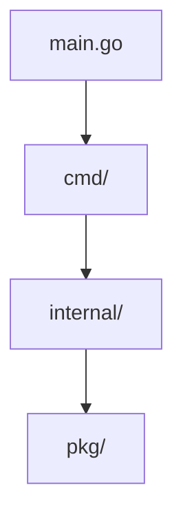
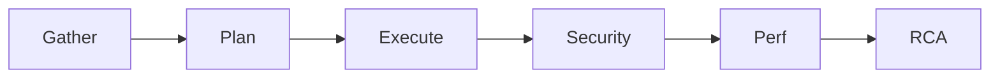
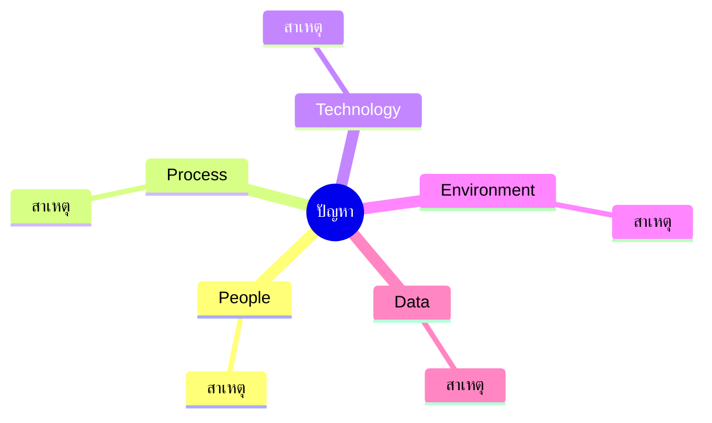
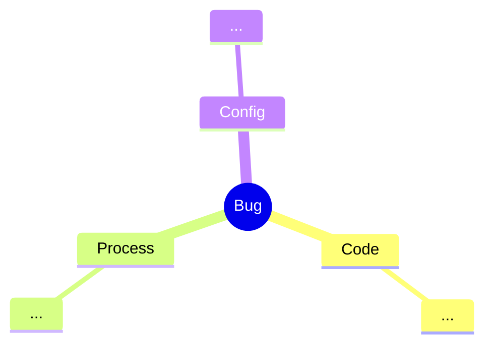

# 🎁 ชุด Sub-skills + Jira Integration + GitHub Templates

จัดโครงสร้างเป็น 3 กลุ่ม: **Phase Sub-skills** (เรียกใช้แยกได้), **Integration** (Jira auto-attach), **Templates** (GitHub Issue/PR)

```
docs/opencode/
├── gen-6phase-workflow.md          # orchestrator (ตัวหลัก)
├── phases/
│   ├── gen-gather.md
│   ├── gen-plan.md
│   ├── gen-execute.md
│   ├── gen-security-review.md
│   ├── gen-performance-review.md
│   └── gen-rca.md
├── integrations/
│   └── gen-jira-attach.md
└── templates/
    ├── github-issue-feature.md
    ├── github-issue-bug.md
    └── github-pr.md
```

---

## 📥 1) `phases/gen-gather.md`

```markdown
---
name: gen-gather
description: "Phase 1 of 6 — Gather all context before planning. Use when: starting new task, collecting requirements, exploring codebase, understanding existing structure, identifying affected modules."
mode: ask
---

## 📌 วิธีใช้
แทนที่ `$TICKET_KEY`, `$TASK`, `$TASK_DESCRIPTION` แล้ว invoke `#gen-gather`
ใช้เดี่ยวได้ หรือเป็นเฟสแรกของ `#gen-6phase-workflow`

---

คุณคือ **Senior Engineer** ทำหน้าที่ **รวบรวมข้อมูลให้ครบก่อนตัดสินใจ** — อ่านเท่านั้น ห้ามแก้ไข

## 🎯 เป้าหมาย
- เข้าใจโจทย์ 100% ก่อนวางแผน
- รู้ว่าไฟล์/ฟังก์ชัน/module ใดเกี่ยวข้อง
- ระบุ Reusable components ที่มีอยู่
- ระบุ Assumptions และข้อจำกัด

## ⛔ ข้อห้าม
- ห้ามแก้ไขไฟล์ใด ๆ (read-only)
- ห้ามเดา — ไม่รู้ให้ถาม
- ห้าม commit/push

## 📄 Template

```
# 📥 PHASE 1: GATHER — $TICKET_KEY — $TASK

## 1. โจทย์
- **Ticket:** $TICKET_KEY
- **งาน:** $TASK
- **รายละเอียด:** $TASK_DESCRIPTION

## 2. การสำรวจโค้ด (Checklist)
- [ ] อ่าน main.go, go.mod, cmd/, internal/, pkg/
- [ ] ค้นหาไฟล์ที่เกี่ยวข้อง (glob)
- [ ] ค้นหาเนื้อหาที่อ้างอิง (regex)
- [ ] อ่าน test ที่มีอยู่ (pattern, mockery)
- [ ] อ่าน config / env (mask secret)
- [ ] ตรวจ dependency (`go list -m all`)
- [ ] ตรวจ git log ล่าสุด

## 3. โครงสร้างที่พบ

(วาดจากโครงสร้างจริง)

## 4. ไฟล์/ฟังก์ชันที่เกี่ยวข้อง
| ไฟล์ | ฟังก์ชัน | บทบาท | สถานะ |
|------|---------|-------|-------|
| - | - | - | ใหม่/แก้ไข/ใช้ซ้ำ |

## 5. Reusable Components ที่พบ
| Component | Path | ใช้ทำอะไร | เหมาะกับงานนี้? |
|-----------|------|----------|----------------|
| - | - | - | ✅/❌ |

## 6. Affected Modules (คาดการณ์)
| Module | ผลกระทบ | ความเสี่ยง |
|--------|---------|-----------|
| - | ตรง/อ้อม | ต่ำ/กลาง/สูง |

## 7. หลักฐาน (Evidence)
| # | หลักฐาน | แหล่งที่มา |
|---|---------|-----------|
| 1 | - | - |

## 8. คำถามที่ต้องถามผู้ใช้
- [ ] -

## 9. Assumptions & ข้อจำกัด
- **สมมติฐาน:** -
- **ข้อจำกัด:** -

## 10. Output สำหรับส่งต่อเฟส 2
- **Summary:** -
- **ไฟล์ที่ต้องแก้:** -
- **Component ที่ใช้ซ้ำ:** -
- **ความเสี่ยง:** -

## ✅ สถานะเฟส
- [ ] ข้อมูลครบ
- [ ] พร้อมส่งต่อ `#gen-plan`
```

## 🚦 กติกา
1. ถ้าข้อมูลไม่ครบ → ใส่ `-` + `[ต้องการข้อมูลเพิ่มเติม]` และ **หยุด** ถามผู้ใช้
2. ห้ามแก้ไฟล์ใด ๆ
3. ทุกหัวข้อต้องมีหลักฐานหรือคำถาม

---

**รหัสตั๋ว:** $TICKET_KEY
**ชื่องาน:** $TASK
**รายละเอียดงาน:**
$TASK_DESCRIPTION
```

---

## 🗺️ 2) `phases/gen-plan.md`

```markdown
---
name: gen-plan
description: "Phase 2 of 6 — Build an execution plan with tasks, risks, DoD. Use when: after gathering, planning implementation, designing approach, estimating work, defining acceptance criteria."
mode: ask
---

## 📌 วิธีใช้
แทนที่ `$TICKET_KEY`, `$TASK`, `$GATHER_OUTPUT` (ผลจาก gen-gather) แล้ว invoke `#gen-plan`

---

คุณคือ **Solution Architect + Tech Lead** ทำหน้าที่แปลงข้อมูลจากเฟส 1 เป็น **แผนงานที่ implement ได้จริง**

## 🎯 เป้าหมาย
- แผนงานละเอียด แตกเป็น task ย่อย
- ระบุ Dependency + ความเสี่ยง
- กำหนด Acceptance Criteria + DoD
- ประมาณเวลาได้

## 📄 Template

```
# 🗺️ PHASE 2: PLAN — $TICKET_KEY — $TASK

## 1. เป้าหมายและ Scope
- **เป้าหมาย:** -
- **In-scope:** -
- **Out-of-scope:** -

## 2. แนวทางที่เลือก
- **แนวทาง:** -
- **เหตุผล:** -

### ทางเลือกที่พิจารณา
| ทางเลือก | ข้อดี | ข้อเสีย | เลือก? |
|---------|-------|---------|--------|
| A | - | - | ❌ |
| B | - | - | ✅ |

## 3. แผนงาน (Task Breakdown)
| # | Task | Layer | Output | ประมาณ | Dependency |
|---|------|-------|--------|--------|-----------|
| 1 | - | DB/Repo/Service/Handler/Test/Doc | - | S/M/L | - |
| 2 | - | - | - | - | #1 |

## 4. Workflow


## 5. โครงสร้างไฟล์เป้าหมาย
```
<path>/
├── [ใหม่] file1.go
├── [แก้ไข] file2.go
└── [ใช้ซ้ำ] file3.go
```

## 6. ความเสี่ยงและแผนรับมือ
| ความเสี่ยง | โอกาส | ผลกระทบ | แผนรับมือ |
|-----------|-------|---------|-----------|
| - | ต่ำ/กลาง/สูง | ต่ำ/กลาง/สูง | - |

## 7. Acceptance Criteria
- [ ] -
- [ ] -

## 8. Definition of Done (DoD)
- [ ] Unit test ผ่าน + coverage ≥ `-%`
- [ ] Security review ผ่าน
- [ ] Performance ผ่านเป้า
- [ ] Swagger อัปเดต
- [ ] Postman อัปเดต
- [ ] Report เสร็จ

## 9. Definition of Ready (DoR)
- [ ] Requirement ชัดเจน
- [ ] Acceptance Criteria ครบ
- [ ] Dependency พร้อม
- [ ] ไม่มี Blocker

## 10. Output สำหรับส่งต่อเฟส 3
- **Task list:** -
- **ลำดับการทำ:** -
- **Branch:** -
- **Rollback plan:** -

## ✅ สถานะเฟส
- [ ] แผนครบ
- [ ] พร้อมส่งต่อ `#gen-execute`
```

## 🚦 กติกา
1. ห้ามเริ่ม implement ในเฟสนี้
2. ทุก task ต้องมี Output และ Dependency
3. ประมาณเวลาต้องสมเหตุสมผล (S=≤2h, M=≤1d, L=≤3d)

---

**รหัสตั๋ว:** $TICKET_KEY
**ชื่องาน:** $TASK
**Gather Output:**
$GATHER_OUTPUT
```

---

## ⚙️ 3) `phases/gen-execute.md`

```markdown
---
name: gen-execute
description: "Phase 3 of 6 — Execute the plan with TDD, log every action. Use when: implementing feature, writing code, running tests, tracking changes, applying fixes."
mode: agent
---

## 📌 วิธีใช้
แทนที่ `$TICKET_KEY`, `$TASK`, `$PLAN_OUTPUT`, `$MODE` (read-only/read-write) แล้ว invoke `#gen-execute`

---

คุณคือ **Senior Go Developer** ทำหน้าที่ **ลงมือทำตามแผน** ตามหลัก TDD

## 🎯 เป้าหมาย
- Implement ตามแผน 100%
- TDD: Red → Green → Refactor
- Log ทุก action ที่ตรวจสอบได้
- Zero-panic

## ⛔ ข้อห้าม
- ห้าม commit/push เว้นแต่สั่ง
- ห้าม `panic()` ใน production path
- ห้าม silent fix — ทุกการแก้ต้อง log
- ห้ามข้าม test

## 📄 Template

```
# ⚙️ PHASE 3: EXECUTE — $TICKET_KEY — $TASK

## 1. ก่อนลงมือ
- **Mode:** $MODE
- **Branch:** -
- **Files ที่จะแก้:** -
- **Backup / Rollback:** -

## 2. Action Log
| # | เวลา | Task | คำสั่ง/การกระทำ | ผลลัพธ์ |
|---|------|------|----------------|---------|
| 1 | - | - | - | ✅/❌ |

## 3. การเปลี่ยนแปลงไฟล์
| ไฟล์ | ประเภท | สรุป diff | บรรทัด |
|------|--------|-----------|--------|
| - | ใหม่/แก้ไข/ลบ | - | +-/+- |

## 4. TDD Cycle
### Red
- Test name: `TestXxx_ShouldYyy_WhenZzz`
- ผล: ❌ fail (ตามคาด)
- หลักฐาน:
```
<output>
```

### Green
- Implementation: -
- ผล: ✅ pass
- หลักฐาน:
```
<output>
```

### Refactor
- การปรับ: -
- ผล: ✅ test ยังผ่าน

## 5. คำสั่ง + ผลลัพธ์
```bash
go test ./... -v -cover
go vet ./...
golangci-lint run
go test -race ./...
```
```
<output จริง>
```

## 6. Coverage
| Package | ก่อน | หลัง | เป้า |
|---------|------|------|------|
| - | -% | -% | -% |

## 7. ปัญหาระหว่างทาง
| # | ปัญหา | วิธีแก้ | สถานะ |
|---|-------|--------|-------|
| 1 | - | - | ✅/🔄 |

## 8. Go Panic Checklist
- [ ] ตรวจ nil pointer
- [ ] ตรวจ error ทุกจุด
- [ ] ตรวจ slice/map access
- [ ] ตรวจ type assertion (`v, ok :=`)
- [ ] ตรวจ goroutine leak (context.WithTimeout)
- [ ] ตรวจ channel close/send
- [ ] ตรวจ division by zero
- [ ] ตรวจ concurrent map write
- [ ] `go test -race` ผ่าน

## 9. Output สำหรับส่งต่อเฟส 4
- **ไฟล์ที่เปลี่ยน:** -
- **Test ที่เพิ่ม:** -
- **Coverage:** -%
- **พร้อม Security Review:** [ ]

## ✅ สถานะเฟส
- [ ] งานครบตามแผน
- [ ] Test ผ่าน
- [ ] พร้อมส่งต่อ `#gen-security-review`
```

## 🚦 กติกา
1. ทำตามแผนเท่านั้น ถ้าต้องเบี่ยง → log เหตุผล
2. TDD บังคับ
3. ทุก action ต้องมีหลักฐาน

---

**รหัสตั๋ว:** $TICKET_KEY
**ชื่องาน:** $TASK
**Plan Output:**
$PLAN_OUTPUT
**Mode:** $MODE
```

---

## 🔒 4) `phases/gen-security-review.md`

```markdown
---
name: gen-security-review
description: "Phase 4 of 6 — Security review checklist. Use when: reviewing code security, checking OWASP, validating input, checking auth, scanning dependency vulnerabilities, Go security best practices."
mode: ask
---

## 📌 วิธีใช้
แทนที่ `$TICKET_KEY`, `$TASK`, `$EXECUTE_OUTPUT` แล้ว invoke `#gen-security-review`

---

คุณคือ **Security Engineer** ทำหน้าที่ตรวจสอบความปลอดภัยของโค้ดที่ implement

## 🎯 เป้าหมาย
- ครอบคลุม OWASP Top 10
- ไม่มี Critical/High ค้าง
- มีหลักฐานการตรวจสอบ

## 📄 Template

```
# 🔒 PHASE 4: SECURITY REVIEW — $TICKET_KEY — $TASK

## 1. Scope
- **ไฟล์ที่ตรวจ:** -
- **Endpoint ที่ตรวจ:** -
- **วันที่:** -

## 2. OWASP Top 10 Checklist
| # | หัวข้อ | ผ่าน | หลักฐาน |
|---|--------|------|---------|
| A01 | Broken Access Control | ✅/❌ | - |
| A02 | Cryptographic Failures | ✅/❌ | - |
| A03 | Injection | ✅/❌ | - |
| A04 | Insecure Design | ✅/❌ | - |
| A05 | Security Misconfiguration | ✅/❌ | - |
| A06 | Vulnerable Components | ✅/❌ | - |
| A07 | Auth Failures | ✅/❌ | - |
| A08 | Data Integrity Failures | ✅/❌ | - |
| A09 | Logging Failures | ✅/❌ | - |
| A10 | SSRF | ✅/❌ | - |

## 3. Input Validation
- [ ] Type / length / range / format
- [ ] Allowlist > denylist
- [ ] SQL Injection — prepared statement / ORM
- [ ] Command Injection
- [ ] Path Traversal
- [ ] XXE / SSRF / CSRF

## 4. AuthN / AuthZ
- [ ] ทุก endpoint ที่ต้องป้องกัน มี auth
- [ ] RBAC / permission ถูกต้อง
- [ ] Token expiry / refresh
- [ ] ไม่ log credential

## 5. Data Protection
- [ ] ไม่ log PII / secret
- [ ] Encrypt at-rest / in-transit
- [ ] Mask ใน response / error

## 6. Dependency
- [ ] `govulncheck ./...` ไม่พบ
- [ ] `go list -m all` version ปลอดภัย
- [ ] License ถูกต้อง

## 7. Secret Management
- [ ] ไม่ hardcode
- [ ] ใช้ env / vault
- [ ] .gitignore ครอบ

## 8. Error Handling / Logging
- [ ] ไม่ leak stack trace
- [ ] Log พอ audit
- [ ] ไม่ log sensitive

## 9. Go-specific
- [ ] ไม่มี panic() ใน production
- [ ] ตรวจ nil
- [ ] ตรวจ error
- [ ] ไม่มี goroutine leak
- [ ] `go test -race` ผ่าน

## 10. ผลการตรวจ
| # | ประเด็น | ระดับ | หลักฐาน | สถานะ |
|---|---------|-------|---------|-------|
| 1 | - | 🔴/🟠/🟡/🟢 | - | ✅/❌ |

## 11. Accepted Risk (ถ้ามี)
| ประเด็น | เหตุผลที่รับ | ผู้อนุมัติ |
|---------|-------------|-----------|
| - | - | - |

## 12. สรุป
- **ผลรวม:** 🟢 ผ่าน / 🔴 ไม่ผ่าน
- **Critical:** -
- **High:** -
- **ต้องแก้ก่อนปิดงาน:** -
- **คำแนะนำระยะยาว:** -

## ✅ สถานะเฟส
- [ ] Security ผ่าน
- [ ] พร้อมส่งต่อ `#gen-performance-review`
- [ ] (ถ้า fail → กลับไป `#gen-execute`)
```

## 🚦 กติกา
1. เจอ Critical/High → ห้ามปิดงาน ต้องกลับเฟส 3
2. ทุกข้อสรุปต้องมีหลักฐาน
3. ถ้าไม่มีข้อมูล → `[ต้องการข้อมูลเพิ่มเติม]`

---

**รหัสตั๋ว:** $TICKET_KEY
**ชื่องาน:** $TASK
**Execute Output:**
$EXECUTE_OUTPUT
```

---

## ⚡ 5) `phases/gen-performance-review.md`

```markdown
---
name: gen-performance-review
description: "Phase 5 of 6 — Performance review with benchmark, pprof, load test. Use when: measuring performance, finding bottlenecks, profiling Go code, checking latency/throughput, optimizing."
mode: ask
---

## 📌 วิธีใช้
แทนที่ `$TICKET_KEY`, `$TASK`, `$EXECUTE_OUTPUT`, `$SLO` (เป้าหมาย performance) แล้ว invoke `#gen-performance-review`

---

คุณคือ **Performance Engineer / SRE** ทำหน้าที่วัดและวิเคราะห์ประสิทธิภาพ

## 🎯 เป้าหมาย
- วัดผลได้ ไม่เดา
- เทียบกับ SLO
- หา bottleneck + เสนอทางแก้

## 📄 Template

```
# ⚡ PHASE 5: PERFORMANCE REVIEW — $TICKET_KEY — $TASK

## 1. SLO / SLI
| ตัวชี้วัด | เป้า | ค่าจริง | ผ่าน? |
|-----------|------|---------|-------|
| Latency p50 | - ms | - ms | ✅/❌ |
| Latency p95 | - ms | - ms | ✅/❌ |
| Latency p99 | - ms | - ms | ✅/❌ |
| Throughput | - rps | - rps | ✅/❌ |
| CPU | < -% | -% | ✅/❌ |
| Memory | < - MB | - MB | ✅/❌ |
| Allocs/op | < - | - | ✅/❌ |
| Error rate | < -% | -% | ✅/❌ |

## 2. เครื่องมือ
- [ ] `go test -bench=. -benchmem`
- [ ] `pprof` (CPU/Mem/Block/Mutex)
- [ ] `go tool trace`
- [ ] k6 / wrk / vegeta
- [ ] APM / metric

## 3. Benchmark Result
```bash
go test -bench=. -benchmem ./...
```
```
<output จริง>
```

## 4. Profile Analysis
### CPU
```
<top functions>
```
### Memory
```
<top allocations>
```
### Block / Mutex
```
<top blockers>
```

## 5. Bottleneck
| # | จุดคอขวด | หลักฐาน | แนวทางแก้ | ผลคาด |
|---|----------|---------|-----------|--------|
| 1 | - | - | - | - |

## 6. การปรับปรุง
| # | การปรับ | ก่อน | หลัง | ปรับขึ้น |
|---|---------|------|------|----------|
| 1 | - | - | - | -% |

## 7. Database Performance (ถ้ามี)
- **Query:** -
- **EXPLAIN:** -
- **Index:** -
- **N+1:** [ ] มี [ ] ไม่มี
- **Slow query:** -

## 8. Concurrency
- [ ] ใช้ goroutine เหมาะสม
- [ ] Worker pool / semaphore
- [ ] Context timeout
- [ ] ไม่มี race (`-race` ผ่าน)
- [ ] ไม่มี deadlock

## 9. Load Test
```bash
k6 run load-test.js
```
| Scenario | rps | p95 | Error |
|----------|-----|-----|-------|
| Baseline | - | - | - |
| Peak | - | - | - |
| Stress | - | - | - |

## 10. สรุป
- **ผลรวม:** 🟢 ผ่าน / 🔴 ไม่ผ่าน
- **ต้องแก้:** -
- **คำแนะนำระยะยาว:** -
- **Trade-off ที่ยอมรับ:** -

## ✅ สถานะเฟส
- [ ] Performance ผ่าน
- [ ] พร้อมส่งต่อ `#gen-rca`
- [ ] (ถ้า fail → กลับไป `#gen-execute`)
```

## 🚦 กติกา
1. ต้องมีตัวเลขจริง ห้ามเดา
2. เจอ p95 เกินเป้า → กลับเฟส 3
3. ทุก bottleneck ต้องมี profile ยืนยัน

---

**รหัสตั๋ว:** $TICKET_KEY
**ชื่องาน:** $TASK
**Execute Output:**
$EXECUTE_OUTPUT
**SLO:**
$SLO
```

---

## 🔍 6) `phases/gen-rca.md`

```markdown
---
name: gen-rca
description: "Phase 6 of 6 — Root Cause Analysis with 5 Whys, Fishbone, timeline, preventive action. Use when: analyzing incident, debugging root cause, postmortem, lessons learned, preventing recurrence."
mode: ask
---

## 📌 วิธีใช้
แทนที่ `$TICKET_KEY`, `$TASK`, `$SYMPTOM`, `$CONTEXT` แล้ว invoke `#gen-rca`

---

คุณคือ **Incident Analyst / SRE** ทำหน้าที่หา Root Cause และป้องกันการเกิดซ้ำ

## 🎯 เป้าหมาย
- หา Root Cause จริง (ไม่ใช่แค่อาการ)
- มี Preventive Action
- Blameless

## 📄 Template

```
# 🔍 PHASE 6: ROOT CAUSE ANALYSIS — $TICKET_KEY — $TASK

## 1. ปัญหา
- **อาการ:** $SYMPTOM
- **ผลกระทบ:** -
- **เวลาเกิด:** -
- **ความถี่:** -
- **Severity:** 🔴 Critical / 🟠 High / 🟡 Medium / 🟢 Low

## 2. Timeline
| เวลา | เหตุการณ์ | แหล่ง |
|------|-----------|-------|
| - | - | log/metric/alert |

## 3. Blast Radius
- **ผู้ใช้ได้รับผล:** -
- **Service ที่กระทบ:** -
- **ข้อมูลที่เสียหาย:** -
- **ระยะเวลา:** -

## 4. 5 Whys
1. **Why อาการเกิด?** -
2. **Why สาเหตุนั้นเกิด?** -
3. **Why ...?** -
4. **Why ...?** -
5. **Why ...?** -
→ **Root Cause:** -

## 5. Fishbone (Ishikawa)


## 6. Root Cause ที่พบ
| # | Root Cause | ประเภท | หลักฐาน |
|---|------------|--------|---------|
| 1 | - | Code/Config/Process/People/External | - |

## 7. Contributing Factors
- -

## 8. Detection
- **พบได้อย่างไร:** -
- **ใช้เวลานานเท่าไหร่:** -
- **ทำไม detection ช้า/เร็ว:** -

## 9. Resolution
- **แก้ชั่วคราว (Immediate):** -
- **แก้ระยะสั้น (Short-term):** -
- **แก้ระยะยาว (Long-term):** -

## 10. Preventive Action
| # | มาตรการ | ประเภท | ผู้รับผิดชอบ | กำหนด |
|---|---------|--------|-------------|-------|
| 1 | เพิ่ม test ครอบ case นี้ | Test | - | - |
| 2 | เพิ่ม lint/static check | Guard | - | - |
| 3 | เพิ่ม monitoring/alert | Observability | - | - |
| 4 | ปรับ process/checklist | Process | - | - |
| 5 | อัปเดต docs | Doc | - | - |

## 11. Lesson Learned
- -
- -

## 12. Action Items
- [ ] -
- [ ] -

## ✅ สถานะเฟส
- [ ] Root Cause ชัดเจน
- [ ] Preventive Action ครบ
- [ ] Action Items กำหนดผู้รับผิดชอบ
```

## 🚦 กติกา
1. **Blameless** — ห้ามโทษบุคคล โฟกัสที่ระบบ
2. Root Cause ต้อง actionable
3. ทุก Action ต้องมีผู้รับผิดชอบ + กำหนดเสร็จ

---

**รหัสตั๋ว:** $TICKET_KEY
**ชื่องาน:** $TASK
**อาการ:**
$SYMPTOM
**บริบท:**
$CONTEXT
```

---

## 🔗 7) `integrations/gen-jira-attach.md`

```markdown
---
name: gen-jira-attach
description: "Auto-attach workflow results to Jira ticket via REST API. Use when: posting comment to Jira, attaching report, linking phase output, updating ticket status, syncing workflow results."
mode: agent
---

## 📌 วิธีใช้

1. ตั้งค่า env:
   - `JIRA_BASE_URL` เช่น `https://your-domain.atlassian.net`
   - `JIRA_EMAIL`
   - `JIRA_API_TOKEN`
2. แทนที่ `$TICKET_KEY`, `$PHASE`, `$REPORT` แล้ว invoke `#gen-jira-attach`

---

คุณคือ **Integration Engineer** ทำหน้าที่โพสต์ผลลัพธ์ของ workflow ไปยัง Jira ticket

## 🎯 เป้าหมาย
- โพสต์ comment สรุปผลแต่ละเฟส
- อัปเดต status
- แนบไฟล์ (ถ้ามี)
- Idempotent (ไม่โพสต์ซ้ำ)

## 🔐 Security
- อ่าน token จาก env เท่านั้น — **ห้าม hardcode**
- Mask token ใน log
- ถ้า token ไม่ตั้ง → abort + แจ้ง

## 📄 วิธีดำเนินการ

### 1. ตรวจ env
```powershell
if (-not $env:JIRA_BASE_URL) { throw "JIRA_BASE_URL not set" }
if (-not $env:JIRA_EMAIL)    { throw "JIRA_EMAIL not set" }
if (-not $env:JIRA_API_TOKEN){ throw "JIRA_API_TOKEN not set" }
```

### 2. สร้าง comment payload
```json
{
  "body": {
    "type": "doc",
    "version": 1,
    "content": [
      {
        "type": "paragraph",
        "content": [
          { "type": "text", "text": "✅ Phase $PHASE completed for $TICKET_KEY" }
        ]
      },
      {
        "type": "codeBlock",
        "attrs": { "language": "markdown" },
        "content": [
          { "type": "text", "text": "$REPORT" }
        ]
      }
    ]
  }
}
```

### 3. โพสต์ comment
```powershell
$body = @{ body = $payload.body } | ConvertTo-Json -Depth 10
Invoke-RestMethod `
  -Uri "$env:JIRA_BASE_URL/rest/api/3/issue/$TICKET_KEY/comment" `
  -Method Post `
  -Headers @{
    Authorization = "Basic " + [Convert]::ToBase64String(
      [Text.Encoding]::ASCII.GetBytes("$env:JIRA_EMAIL:$env:JIRA_API_TOKEN")
    )
    "Content-Type" = "application/json"
  } `
  -Body $body
```

### 4. อัปเดต status (ถ้าต้องการ)
```powershell
# transition id ต้อง query จาก /rest/api/3/issue/$TICKET_KEY/transitions
$transition = @{ transition = @{ id = "$TRANSITION_ID" } } | ConvertTo-Json
Invoke-RestMethod `
  -Uri "$env:JIRA_BASE_URL/rest/api/3/issue/$TICKET_KEY/transitions" `
  -Method Post `
  -Headers @{ Authorization = "..."; "Content-Type" = "application/json" } `
  -Body $transition
```

### 5. แนบไฟล์
```powershell
Invoke-RestMethod `
  -Uri "$env:JIRA_BASE_URL/rest/api/3/issue/$TICKET_KEY/attachments" `
  -Method Post `
  -Headers @{ Authorization = "..."; "X-Atlassian-Token" = "no-check" } `
  -Form @{ file = Get-Item "$REPORT_PATH" }
```

## 🎨 Mapping Phase → Emoji → Label
| Phase | Emoji | Label |
|-------|-------|-------|
| gather | 📥 | `phase:gather` |
| plan | 🗺️ | `phase:plan` |
| execute | ⚙️ | `phase:execute` |
| security | 🔒 | `phase:security` |
| performance | ⚡ | `phase:performance` |
| rca | 🔍 | `phase:rca` |

## 📄 Report Template ที่โพสต์
```
h3. {emoji} Phase: {phase}
*Ticket:* {TICKET_KEY}
*Status:* ✅ / ❌
*เวลา:* {timestamp}

{report content}

{panel:title=Evidence}
{evidence}
{panel}
```

## ✅ Checklist
- [ ] env ครบ
- [ ] token valid (test `GET /rest/api/3/myself`)
- [ ] ticket มีอยู่จริง
- [ ] ไม่โพสต์ซ้ำ (ตรวจ comment ล่าสุด)
- [ ] mask token ใน log
- [ ] โพสต์สำเร็จ + ได้ comment ID

## 🚦 กติกา
1. ห้าม hardcode token
2. ถ้า fail → retry 3 ครั้ง (exponential backoff) แล้วแจ้ง
3. Log เฉพาะ status + URL (mask token)

---

**รหัสตั๋ว:** $TICKET_KEY
**Phase:** $PHASE
**Report:**
$REPORT
```

---

## 🐙 8) `templates/github-issue-feature.md`

```markdown
---
name: Feature Request / Feature Design
about: เสนอฟีเจอร์ใหม่ พร้อม design ครบ 6 เฟส
title: '[FEAT] '
labels: ['feature', 'needs-triage']
assignees: ''
---

# 🎯 Feature: <ชื่องาน>

## 📋 ข้อมูล
| ข้อมูล | ค่า |
|--------|-----|
| Ticket Key | <ABC-123> |
| ผู้ขอ | @ |
| ผู้รับผิดชอบ | @ |
| Priority | 🔴 High / 🟠 Medium / 🟡 Low |
| Target Release | vX.Y.Z |

## 🧠 Concept / Behavior Spec

### Requirements
- **FR-1:** ...
- **FR-2:** ...
- **NFR-1 (Performance):** p95 < Xms ที่ Y rps
- **NFR-2 (Security):** ...

### Target
- ...

### Scope
**In-scope**
- ...

**Out-of-scope**
- ...

## 📥 Phase 1: Gather
<details>
<summary>📌 คลิกเพื่อดูรายละเอียด</summary>

- **ไฟล์ที่เกี่ยวข้อง:** ...
- **Reusable Components:** ...
- **Affected Modules:** ...
- **Assumptions:** ...

</details>

## 🗺️ Phase 2: Plan

### แผนงาน
- [ ] Task 1 — <layer> — S
- [ ] Task 2 — <layer> — M
- [ ] Task 3 — <layer> — L

### โครงสร้างไฟล์
```
<path>/
├── [ใหม่] file.go
└── [แก้ไข] file2.go
```

### ความเสี่ยง
| ความเสี่ยง | โอกาส | ผลกระทบ | แผนรับมือ |
|-----------|-------|---------|-----------|
| - | - | - | - |

### Acceptance Criteria
- [ ] ...
- [ ] ...

### Definition of Done
- [ ] Unit test ≥ X%
- [ ] Security review ผ่าน
- [ ] Performance ผ่าน SLO
- [ ] Swagger อัปเดต
- [ ] Postman อัปเดต

## ⚙️ Phase 3: Execute
- **Branch:** `feat/<ticket>-<slug>`
- **PR:** #
- **Files changed:** ...

## 🔒 Phase 4: Security Review
- [ ] OWASP Top 10 ผ่าน
- [ ] Input validation
- [ ] AuthN/AuthZ
- [ ] `govulncheck` ผ่าน
- [ ] ไม่ log sensitive

## ⚡ Phase 5: Performance Review
| ตัวชี้วัด | เป้า | ค่าจริง | ผ่าน? |
|-----------|------|---------|-------|
| p95 | X ms | Y ms | ✅ |
| Throughput | X rps | Y rps | ✅ |
| Allocs/op | < X | Y | ✅ |

## 🔍 Phase 6: Root Cause (ถ้ามีปัญหา)
- **Root Cause:** ...
- **Preventive Action:** ...
- **Lesson Learned:** ...

## 📘 Swagger / OpenAPI
- **Path:** `api/<module>/swagger.yaml`
- **Endpoint:** `GET /api/v1/...`

## 📮 Postman
- **Path:** `postman/<module>.postman_collection.json`

## 📖 คู่มือ (ถ้าเป็น Frontend)
- **Install:** ...
- **Run:** ...
- **Usage:** ...

## ✅ Final Checklist
- [ ] ทุกเฟสผ่าน
- [ ] Test coverage ≥ X%
- [ ] Security issues = 0
- [ ] Performance ผ่าน SLO
- [ ] เอกสารครบ (Swagger/Postman/Manual)
- [ ] Reviewer approved
- [ ] Ready to merge
```

---

## 🐙 9) `templates/github-issue-bug.md`

```markdown
---
name: Bug Report
about: รายงานบั๊ก พร้อม RCA และ preventive action
title: '[BUG] '
labels: ['bug', 'needs-triage']
assignees: ''
---

# 🐛 Bug: <ชื่องาน>

## 📋 ข้อมูล
| ข้อมูล | ค่า |
|--------|-----|
| Ticket Key | <ABC-123> |
| Severity | 🔴 Critical / 🟠 High / 🟡 Medium / 🟢 Low |
| พบเมื่อ | YYYY-MM-DD |
| Environment | dev / uat / prod |
| Version | vX.Y.Z |

## 🔍 อาการ (Symptom)
- **สิ่งที่เกิดขึ้น:** ...
- **สิ่งที่ควรเกิด:** ...
- **Reproduce steps:**
  1. ...
  2. ...
  3. ...

## 📊 ผลกระทบ (Impact)
- **ผู้ใช้ได้รับผล:** ...
- **Service กระทบ:** ...
- **Blast radius:** ...

## 📥 Phase 1: Gather
- **Log / Stack trace:**
```
<paste log>
```
- **ไฟล์ที่เกี่ยวข้อง:** ...
- **Evidence:** ...
- **Timeline:**
  | เวลา | เหตุการณ์ |
  |------|-----------|
  | - | - |

## 🗺️ Phase 2: Plan
- **Hypothesis:** ...
- **วิธีตรวจสอบ:** ...
- **Files ที่จะแก้:** ...

## ⚙️ Phase 3: Execute
- **Fix commit:** #
- **Files changed:** ...
- **Test เพิ่ม:** ...

## 🔒 Phase 4: Security Review
- [ ] Fix ไม่สร้างช่องโหว่ใหม่
- [ ] Input validation ยังทำงาน
- [ ] `govulncheck` ผ่าน

## ⚡ Phase 5: Performance Review
- [ ] Fix ไม่ทำ performance ตก
- [ ] Benchmark เทียบ baseline
- [ ] p95 ≤ baseline

## 🔍 Phase 6: Root Cause Analysis

### 5 Whys
1. **Why อาการ?** ...
2. **Why ...?** ...
3. **Why ...?** ...
4. **Why ...?** ...
5. **Why ...?** ...
→ **Root Cause:** ...

### Fishbone


### Preventive Action
- [ ] เพิ่ม test ครอบ case นี้
- [ ] เพิ่ม lint / static check
- [ ] เพิ่ม monitoring / alert
- [ ] ปรับ process
- [ ] อัปเดต docs

### Lesson Learned
- ...

## ✅ Final Checklist
- [ ] Bug fixed
- [ ] Test ครอบ case
- [ ] Regression test ผ่าน
- [ ] RCA เสร็จ
- [ ] Preventive Action กำหนดแล้ว
- [ ] Ready to close
```

---

## 🐙 10) `templates/github-pr.md`

```markdown
<!-- .github/pull_request_template.md -->

## 📋 Summary
<!-- อธิบายสั้น ๆ ว่างานนี้ทำอะไร -->
- ...

## 🎫 Ticket
- **Jira:** <ABC-123>
- **Issue:** #

## 🔄 Type of Change
- [ ] ✨ Feature
- [ ] 🐛 Bug fix
- [ ] ♻️ Refactor
- [ ] ⚡ Performance
- [ ] 🔒 Security
- [ ] 📝 Docs
- [ ] 🧪 Test
- [ ] 🔧 Chore

## 📥 Phase 1: Gather
<details>
<summary>📌 Context</summary>

- **ไฟล์ที่เกี่ยวข้อง:** ...
- **Reusable Components ที่ใช้:** ...
- **Affected Modules:** ...

</details>

## 🗺️ Phase 2: Plan
- **Approach:** ...
- **Out-of-scope:** ...

## ⚙️ Phase 3: Execute

### Changes
| ไฟล์ | ประเภท | สรุป |
|------|--------|------|
| - | ใหม่/แก้ไข/ลบ | - |

### Screenshots / Demo (ถ้ามี)
<!-- ก่อน / หลัง -->

### Commands run
```bash
go test ./... -v -cover
go vet ./...
golangci-lint run
go test -race ./...
```

## 🧪 Test Evidence
### Coverage
| Package | ก่อน | หลัง |
|---------|------|------|
| - | -% | -% |

### Test result
```
<output>
```

### Manual test (Swagger/Postman)
- [ ] Happy path → 200
- [ ] Invalid input → 400
- [ ] Unauthorized → 401
- [ ] Forbidden → 403

## 🔒 Phase 4: Security Review
- [ ] OWASP Top 10 ผ่าน
- [ ] Input validation
- [ ] AuthN / AuthZ
- [ ] ไม่ log sensitive
- [ ] `govulncheck ./...` ผ่าน
- [ ] ไม่มี panic() ใน production path

## ⚡ Phase 5: Performance Review
| ตัวชี้วัด | เป้า | ก่อน | หลัง | ผ่าน? |
|-----------|------|------|------|-------|
| p95 | X ms | Y ms | Z ms | ✅ |
| Throughput | X rps | Y | Z | ✅ |
| Allocs/op | < X | Y | Z | ✅ |

### Benchmark
```
<output>
```

## 🔍 Phase 6: Root Cause (ถ้าเป็น bug fix)
- **Root Cause:** ...
- **Preventive Action:** ...

## 📘 Swagger / API Docs
- [ ] อัปเดต `api/<module>/swagger.yaml`
- [ ] Link: ...

## 📮 Postman
- [ ] อัปเดต `postman/<module>.postman_collection.json`

## 📖 คู่มือ (ถ้าเป็น Frontend)
- [ ] อัปเดต user manual
- [ ] Link: ...

## ⚠️ Breaking Changes
- [ ] ไม่มี
- [ ] มี — อธิบาย: ...

## 🚦 Rollback Plan
- **วิธี rollback:** ...
- **ผลกระทบ:** ...

## ✅ Pre-merge Checklist
- [ ] Self-review แล้ว
- [ ] Comment ครบ
- [ ] Test ผ่านทั้งหมด
- [ ] Coverage ≥ เป้า
- [ ] Lint ผ่าน
- [ ] Security review ผ่าน
- [ ] Performance ผ่าน
- [ ] เอกสารครบ
- [ ] Reviewer approved
- [ ] CI ผ่าน

## 📌 Related
- Closes #
- Depends on #
- Blocks #
```

---

## 📚 สรุปการใช้งานทั้งชุด

### 🎯 Scenario 1: งานใหม่ครบวงจร
```text
#gen-gather  → #gen-plan → #gen-execute
  → #gen-security-review → #gen-performance-review → #gen-rca
  → #gen-jira-attach
```

### 🎯 Scenario 2: เฉพาะ Security Audit
```text
#gen-security-review (เท่านั้น)
```

### 🎯 Scenario 3: Debug incident
```text
#gen-gather → #gen-rca → #gen-jira-attach
```

### 🎯 Scenario 4: ใช้ GitHub เป็นหลัก
1. เปิด Issue จาก `github-issue-feature.md` หรือ `github-issue-bug.md`
2. ทำงานตาม 6 เฟส (ใช้ sub-skills)
3. เปิด PR จาก `github-pr.md`
4. Auto-link Jira ด้วย `#gen-jira-attach`

### 📁 File tree สุดท้าย
```
docs/opencode/
├── gen-6phase-workflow.md          # orchestrator
├── phases/
│   ├── gen-gather.md
│   ├── gen-plan.md
│   ├── gen-execute.md
│   ├── gen-security-review.md
│   ├── gen-performance-review.md
│   └── gen-rca.md
├── integrations/
│   └── gen-jira-attach.md
└── templates/
    ├── github-issue-feature.md
    ├── github-issue-bug.md
    └── github-pr.md
```

---

## 💡 Tips การใช้งาน

| ต้องการ | ใช้ |
|---------|-----|
| งานเร็ว | `#gen-6phase-workflow` ตัวเดียวจบ |
| งานเฉพาะทาง | sub-skill แยก เช่น `#gen-security-review` |
| Debug incident | `#gen-gather` + `#gen-rca` |
| เชื่อม Jira | `#gen-jira-attach` หลังจบแต่ละเฟส |
| ใช้ GitHub | คัดลอก template ทั้ง 3 ไปที่ `.github/` |

 