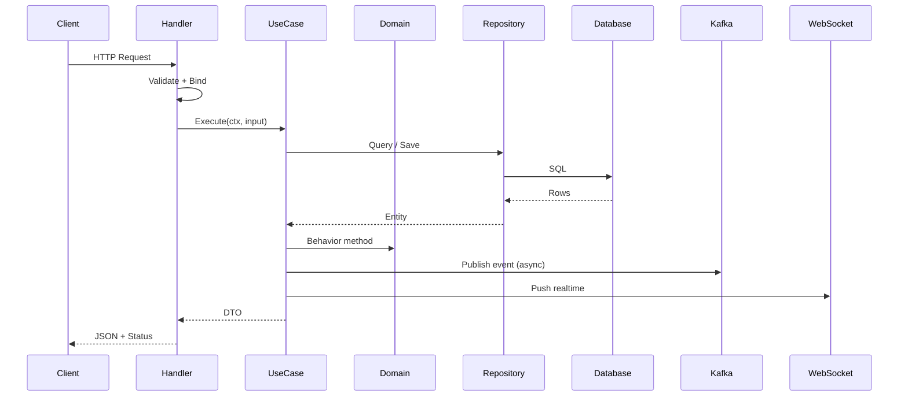
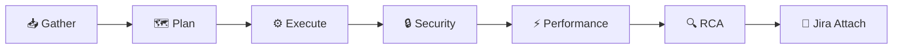

# 📄 Feature Design Template (Consolidated)

ไฟล์ template แบบครบวงจร — ใช้ร่วมกับ skill `#gen-feature-design`, 6-phase workflow, GitHub templates และ Jira integration

**บันทึกเป็น:** `docs/opencode/templates/feature-design-template.md`

```markdown
---
name: feature-design-template
description: "Consolidated template for feature design documents. Combines Concept/Behavior spec, clean architecture layout, TDD plan, test checklist, report, Swagger/Postman/user manual, 6-phase workflow, GitHub templates, and Jira integration."
version: 1.0.0
template-owner: platform-team
last-updated: YYYY-MM-DD
---

# TASK: $TICKET_KEY — $TASK

## 📋 รายละเอียด
- **Ticket:** $TICKET_KEY
- **ชื่องาน:** $TASK
- **ผู้ขอ:** @
- **ผู้รับผิดชอบ:** @
- **วันที่:** YYYY-MM-DD
- **Priority:** 🔴 High / 🟠 Medium / 🟡 Low
- **Target Release:** vX.Y.Z
- **คำอธิบาย:** $TASK_DESCRIPTION
- **Acceptance Criteria:**
  - [ ] -
  - [ ] -

---

## 🧠 หลักการทำงาน (Concept / Behavior spec)

### 1. ข้อกำหนด (Requirements)
- FR-1: -
- FR-2: -
- NFR-1 (Performance): p95 < `-` ms ที่ `-` rps
- NFR-2 (Security): -
- NFR-3 (Reliability): -

### 2. เป้าหมาย (Target)
- -
- -

### 3. ขอบเขต (Scope)
**In-scope**
- -

**Out-of-scope**
- -

### 4. โครงสร้าง Folder และไฟล์ของ Module

> อ้างอิงจากโมดูล DEMO / notification / inventory ตาม template หลัก (Clean Architecture)

```
internal/modules/<module>/
├── domain/
│   ├── entity/                     # [ใหม่/แก้ไข]
│   ├── value_object/               # [ใหม่/แก้ไข]
│   ├── repository/                 # [ใหม่/แก้ไข] interface เท่านั้น
│   ├── service/                    # [ใหม่/แก้ไข] domain service + port
│   ├── event/                      # [ใหม่/แก้ไข]
│   └── errors/                     # [ใหม่/แก้ไข] sentinel errors
├── application/
│   ├── <use_case_1>.go             # [ใหม่] 1 use case / 1 ไฟล์
│   ├── <use_case_2>.go
│   ├── dto.go                      # [ใหม่/แก้ไข]
│   └── mappers.go                  # [ใหม่/แก้ไข]
├── infrastructure/
│   ├── persistence/
│   │   ├── postgres/               # [ใหม่] models + repo impl + mappers
│   │   └── redis/                  # [ใหม่] cache / counter
│   ├── messaging/
│   │   ├── kafka_producer.go       # [ใช้ซ้ำ/แก้ไข]
│   │   └── consumers/              # [ใหม่/แก้ไข]
│   ├── services/                   # [ใหม่/แก้ไข] email / push / ...
│   └── scheduler/                  # [ใหม่] cron job
├── interfaces/
│   ├── http/                       # [ใหม่/แก้ไข] handler + routes + response
│   ├── websocket/                  # [ใหม่/แก้ไข]
│   └── middleware/                 # [ใหม่/แก้ไข]
├── testdata/                       # [ใหม่]
└── module.go                       # [ใหม่/แก้ไข] composition root

migrations/
└── YYYYMMDD_<module>_init.sql      # [ใหม่]
```

### 5. Workflow การทำงาน


### 6. อธิบาย Workflow
| ขั้น | ผู้รับผิดชอบ | สิ่งที่ทำ | Input | Output | Error handling |
|------|--------------|----------|-------|--------|----------------|
| 1 | Handler | รับ request, validate, ดึง user_id | JSON body | input DTO | 400 / 401 |
| 2 | UseCase | orchestrate business logic | input DTO | output DTO | 422 / 500 |
| 3 | Domain | invariants + behavior | entity | entity (mutated) | sentinel error |
| 4 | Repository | query/command DB | filter/entity | entity/rows | wrap error |
| 5 | Handler | map response | output DTO | JSON | - |

### 7. Affected Modules
| Module / File | ประเภท | ผลกระทบ | ความเสี่ยง |
|---------------|--------|---------|-----------|
| `internal/modules/<x>` | ใหม่ | - | ต่ำ |
| `internal/modules/<y>` | แก้ไข | - | กลาง |
| `cmd/api/main.go` | แก้ไข | wire-up | ต่ำ |
| `migrations/*.sql` | ใหม่ | DDL | กลาง |

### 8. รายการกระบวนการทำงาน (Task List)
- [ ] ออกแบบ entity + value object + domain error
- [ ] ออกแบบ repository interface (domain)
- [ ] ออกแบบ use case + DTO + mapper
- [ ] เขียน unit test (TDD — Red) ก่อน implement
- [ ] implement repository (postgres)
- [ ] implement cache / counter (redis)
- [ ] implement use case (Green → Refactor)
- [ ] implement handler + routes
- [ ] implement Kafka producer/consumer
- [ ] implement scheduler (ถ้ามี)
- [ ] wire-up module.go
- [ ] เขียน migration SQL
- [ ] เขียน Swagger
- [ ] เขียน Postman collection
- [ ] เขียนคู่มือ (ถ้าเป็น frontend)
- [ ] run test + lint + race + coverage

### 9. Performance Considerations
- **Algorithm:** -
- **Data structure:** -
- **DB Index:** `idx_<table>_<column>` — เหตุผล: -
- **Query:** อธิบาย EXPLAIN (ถ้ามี) -
- **Caching:** Redis (`<module>:<key>:<id>`), TTL `-`
- **Concurrency:** goroutine + worker pool / context timeout
- **Benchmark เป้าหมาย:** p95 < `-` ms, allocs/op < `-`

### 10. Test-Driven Development (TDD)
**Red → Green → Refactor**

1. **Red:** เขียน test ที่ fail ก่อน
   - `TestXxx_ShouldReturnYyy_WhenZzz`
   - `TestXxx_ShouldReturnErr_WhenInvalidInput`
2. **Green:** implement code น้อยที่สุดให้ test ผ่าน
3. **Refactor:** ปรับโครงสร้างโดย test ยังผ่าน
4. ใช้ `mockery` + `testify` ตาม `.mockery.yaml`
5. Coverage เป้าหมาย: **≥ 80%**

### 11. ข้อควรระวัง (Golang Panic Checklist)
- [ ] ตรวจ `nil` ก่อน dereference pointer ทุกจุด
- [ ] ตรวจ `err != nil` ทุกครั้งหลังเรียกฟังก์ชันที่ return error
- [ ] ใช้ `v, ok := m[k]` แทน `v := m[k]` เมื่อไม่มั่นใจ
- [ ] ตรวจ `len(slice) > 0` ก่อน `slice[0]`
- [ ] ใช้ `defer recover()` เฉพาะขอบเขตที่เหมาะสม (ไม่กลบ error จริง)
- [ ] ระวัง type assertion — ใช้ `v, ok := x.(T)`
- [ ] ระวัง channel — close ซ้ำ, ส่งหลัง close, deadlock
- [ ] ระวัง goroutine leak — ใช้ `context.WithTimeout`
- [ ] ระวัง integer overflow / division by zero
- [ ] ระวัง map concurrent write — ใช้ `sync.RWMutex` หรือ `sync.Map`
- [ ] ไม่มี `panic()` ใน production path
- [ ] `go test -race ./...` ผ่าน

### 12. ข้อดี (Pros)
- -
- -

### 13. ข้อเสีย (Cons)
- -
- -

### 14. ทางเลือกอื่น (Alternatives)
| ทางเลือก | ข้อดี | ข้อเสีย | เหตุผลที่ไม่เลือก |
|---------|-------|---------|------------------|
| A | - | - | - |
| B | - | - | - |

---

## 🧪 กระบวนการทดสอบ (Test Checklist)

### Unit Test
- [ ] Test happy path (`TestXxx_Success`)
- [ ] Test error path (invalid input, DB error, timeout)
- [ ] Test edge case (empty, boundary, nil, zero)
- [ ] Test idempotency (ถ้ามี)
- [ ] Test concurrency (`-race`)
- [ ] Coverage ≥ 80%
- [ ] Mock ผ่าน `mockery` + `testify`

### Integration Test (`//go:build integration`)
- [ ] testcontainers: Postgres
- [ ] testcontainers: Redis (ถ้ามี)
- [ ] testcontainers: Kafka (ถ้ามี)
- [ ] Migration ทำงานถูกต้อง
- [ ] Repo CRUD ผ่าน
- [ ] Idempotent migration (apply 2 ครั้ง)

### Manual Test (Swagger / Postman)
- [ ] Valid request → 200 / 201
- [ ] Invalid request → 400
- [ ] No auth → 401
- [ ] No permission → 403
- [ ] Not found → 404
- [ ] Conflict → 409
- [ ] Rate limit → 429

### Performance Test
- [ ] `go test -bench=. -benchmem`
- [ ] `k6` / `wrk` ที่ `-` rps
- [ ] ตรวจ memory allocation
- [ ] p95 ผ่าน SLO

### Lint / Static Analysis
- [ ] `go vet ./...`
- [ ] `golangci-lint run`
- [ ] `go test -race ./...`
- [ ] `govulncheck ./...`

---

## 📌 สรุป
- **ภาพรวม:** -
- **ผลลัพธ์ที่คาดหวัง:** -
- **ความเสี่ยงหลัก:** -
- **ประมาณการ:** S (≤2h) / M (≤1d) / L (≤3d)

---

## 📊 รายงานสรุปผลการดำเนินการ

| หัวข้อ | รายละเอียด |
|--------|-----------|
| งานที่ทำเสร็จ | - |
| ไฟล์ที่สร้างใหม่ | - |
| ไฟล์ที่แก้ไข | - |
| Test ที่เพิ่ม | - |
| Coverage | `-%` |
| Benchmark ผลลัพธ์ | - |
| ปัญหาที่พบ | - |
| งานที่ยังค้าง | - |
| Next step | - |

---

## 🔄 6-Phase Workflow (อ้างอิง)



| Phase | Skill | Mode | Output |
|-------|-------|------|--------|
| 1 | `#gen-gather` | ask | context + reusable + affected |
| 2 | `#gen-plan` | ask | task breakdown + DoD |
| 3 | `#gen-execute` | agent | code + test + action log |
| 4 | `#gen-security-review` | ask | OWASP + govulncheck |
| 5 | `#gen-performance-review` | ask | benchmark + pprof |
| 6 | `#gen-rca` | ask | 5 Whys + preventive |
| 🔗 | `#gen-jira-attach` | agent | comment + status + attach |

---

## 📘 Swagger: API Documentation

- **Path:** `api/<module>/swagger.yaml`
- **Endpoint:** `[METHOD] /path`
- **Request:** (schema)
- **Response:** (schema + status codes)

```yaml
openapi: 3.0.3
info:
  title: <Module> API
  version: 1.0.0
paths:
  /<resource>:
    get:
      summary: List <resource>
      security: [{ bearerAuth: [] }]
      parameters:
        - in: query
          name: page
          schema: { type: integer, default: 1 }
        - in: query
          name: size
          schema: { type: integer, default: 20, maximum: 100 }
      responses:
        '200':
          description: OK
          content:
            application/json:
              schema:
                $ref: '#/components/schemas/<Resource>ListResponse'
        '400': { description: Bad Request }
        '401': { description: Unauthorized }
    post:
      summary: Create <resource>
      requestBody:
        required: true
        content:
          application/json:
            schema:
              $ref: '#/components/schemas/<Resource>CreateRequest'
      responses:
        '201': { description: Created }
        '400': { description: Bad Request }
        '422': { description: Unprocessable Entity }
components:
  securitySchemes:
    bearerAuth:
      type: http
      scheme: bearer
      bearerFormat: JWT
  schemas:
    <Resource>CreateRequest:
      type: object
      required: [title, body]
      properties:
        title: { type: string, minLength: 1, maxLength: 255 }
        body:  { type: string, minLength: 1 }
    <Resource>ListResponse:
      type: object
      properties:
        items: { type: array, items: { $ref: '#/components/schemas/<Resource>' } }
        total: { type: integer, format: int64 }
        page:  { type: integer }
        size:  { type: integer }
```

---

## 📮 Postman Collection

- **ไฟล์:** `postman/<module>.postman_collection.json`
- **Environment variables:** `baseUrl`, `token`

| # | Request | คาดหวัง |
|---|---------|--------|
| 1 | `GET /<resource>` | 200 + schema |
| 2 | `GET /<resource>` (no token) | 401 |
| 3 | `POST /<resource>` | 201 |
| 4 | `POST /<resource>` (invalid) | 400 |
| 5 | `PUT /<resource>/{id}` | 200 |
| 6 | `DELETE /<resource>/{id}` | 204 |
| 7 | `GET /<resource>/{id}` (not found) | 404 |

```javascript
// Tests snippet
pm.test("Status 200", () => pm.response.to.have.status(200));
pm.test("Schema valid", () => pm.response.to.have.jsonSchema(schema));
pm.test("Response time < 500ms", () => pm.expect(pm.response.responseTime).to.be.below(500));
pm.environment.set("lastId", pm.response.json().id);
```

---

## 📖 คู่มือการใช้งาน (ถ้าเป็น Frontend)

- **การติดตั้ง:** `npm install`
- **การตั้งค่า env:** `.env.local` — `NEXT_PUBLIC_API_URL`, `NEXT_PUBLIC_WS_URL`
- **การรัน:** `npm run dev`
- **โครงสร้างหน้า / component:** -
- **Flow การใช้งานของผู้ใช้:**
  1. -
  2. -
- **การจัดการ error / loading / empty state:**
  - Loading: skeleton
  - Empty: illustration + CTA
  - Error: toast + retry
- **Accessibility checklist:**
  - [ ] Semantic HTML
  - [ ] Keyboard navigation
  - [ ] ARIA labels
  - [ ] Color contrast ≥ 4.5:1
- **Screenshot / ตัวอย่าง:** -

---

## 🐙 GitHub Templates (อ้างอิง)

| Template | Path | ใช้เมื่อ |
|----------|------|----------|
| Feature Issue | `.github/ISSUE_TEMPLATE/feature.md` | เสนอฟีเจอร์ใหม่ |
| Bug Issue | `.github/ISSUE_TEMPLATE/bug.md` | รายงานบั๊ก + RCA |
| Pull Request | `.github/pull_request_template.md` | เปิด PR |

### Branch naming
- `feat/<ticket>-<slug>` — ฟีเจอร์ใหม่
- `fix/<ticket>-<slug>` — bug fix
- `chore/<ticket>-<slug>` — งานอื่น
- `refactor/<ticket>-<slug>` — refactor

### Commit convention (Conventional Commits)
```
<type>(<scope>): <subject>

<body>

<footer>
```
- **type:** feat / fix / refactor / perf / docs / test / chore / security
- **scope:** module name (notification, inventory, ...)

---

## 🔗 Jira Integration (`#gen-jira-attach`)

### Env ที่ต้องตั้ง
```powershell
$env:JIRA_BASE_URL   = "https://your-domain.atlassian.net"
$env:JIRA_EMAIL      = "you@example.com"
$env:JIRA_API_TOKEN  = "***"   # เก็บใน vault / env เท่านั้น
```

### Phase → Emoji → Label
| Phase | Emoji | Label |
|-------|-------|-------|
| gather | 📥 | `phase:gather` |
| plan | 🗺️ | `phase:plan` |
| execute | ⚙️ | `phase:execute` |
| security | 🔒 | `phase:security` |
| performance | ⚡ | `phase:performance` |
| rca | 🔍 | `phase:rca` |

### Checklist ก่อนโพสต์
- [ ] env ครบ
- [ ] token valid (`GET /rest/api/3/myself`)
- [ ] ticket มีอยู่จริง
- [ ] ไม่โพสต์ซ้ำ (ตรวจ comment ล่าสุด)
- [ ] mask token ใน log
- [ ] โพสต์สำเร็จ + ได้ comment ID

---

## ✅ Definition of Done (DoD)

- [ ] ทุกเฟส (1–6) ผ่าน
- [ ] Unit test ผ่าน + coverage ≥ 80%
- [ ] Integration test ผ่าน (testcontainers)
- [ ] `go vet ./...` ผ่าน
- [ ] `golangci-lint run` ผ่าน
- [ ] `go test -race ./...` ผ่าน
- [ ] `govulncheck ./...` ไม่พบ Critical/High
- [ ] Security review ผ่าน (OWASP Top 10)
- [ ] Performance ผ่าน SLO (p95, throughput, allocs/op)
- [ ] Migration apply + idempotent
- [ ] Swagger อัปเดต
- [ ] Postman อัปเดต
- [ ] Report เสร็จ + Jira attach
- [ ] Reviewer approved
- [ ] CI ผ่านทุก job
- [ ] Rollback plan ระบุชัด
- [ ] ไม่มี Breaking Change (หรือประกาศชัด)

---

## ✅ Definition of Ready (DoR)

- [ ] Ticket มี Acceptance Criteria ชัดเจน
- [ ] Requirement ครบ
- [ ] Design approved
- [ ] Dependency พร้อม
- [ ] Environment พร้อม
- [ ] ไม่มี Blocker

---

## ⚠️ หมายเหตุท้ายผลลัพธ์

- ⚠️ งานส่วน **Database DDL / migration / index** ต้องมี **DB task แยก** — อ้างอิง skill `#gen-subtasks`
- ⚠️ งานส่วน **Infra / DevOps** (Kafka, Redis, ES provisioning) ต้องมี **Infra task แยก**
- ⚠️ Template นี้เป็น **read-only analysis** — ห้าม commit / push จนกว่าจะอนุมัติ
```

---

## 📁 File Tree ที่ควรมีในโปรเจกต์

```
docs/opencode/
├── gen-feature-design.md              # skill หลัก (feature design)
├── gen-6phase-workflow.md             # orchestrator
├── phases/
│   ├── gen-gather.md
│   ├── gen-plan.md
│   ├── gen-execute.md
│   ├── gen-security-review.md
│   ├── gen-performance-review.md
│   └── gen-rca.md
├── integrations/
│   └── gen-jira-attach.md
└── templates/
    ├── feature-design-template.md     # ← ไฟล์นี้
    ├── github-issue-feature.md
    ├── github-issue-bug.md
    └── github-pr.md

.github/
├── ISSUE_TEMPLATE/
│   ├── feature.md
│   └── bug.md
└── pull_request_template.md
```

---

## 🚀 วิธีใช้ Template

### Scenario 1 — งานใหม่ครบวงจร
```text
1. คัดลอก feature-design-template.md → docs/features/<TICKET_KEY>.md
2. แทนที่ placeholder: $TICKET_KEY, $TASK, $TASK_DESCRIPTION
3. รัน 6 phase ตามลำดับ (ใช้ sub-skills)
4. กรอกผลลัพธ์แต่ละหัวข้อ
5. โพสต์สรุปกลับ Jira ด้วย #gen-jira-attach
```

### Scenario 2 — ใช้เฉพาะ Security Audit
```text
#gen-security-review (เท่านั้น) — กรอกผลใน template เฉพาะหัวข้อที่ 4
```

### Scenario 3 — Debug incident
```text
#gen-gather → #gen-rca → #gen-jira-attach
ใช้ github-issue-bug.md เป็นตัวตั้งต้น
```

### Scenario 4 — ใช้ GitHub เป็นหลัก
```text
1. เปิด Issue จาก github-issue-feature.md
2. ทำงานตาม 6 เฟส
3. เปิด PR จาก github-pr.md
4. Auto-link Jira ด้วย #gen-jira-attach
```

---

## 💡 Tips

| ต้องการ | ใช้ |
|---------|-----|
| งานเร็ว | `#gen-6phase-workflow` ตัวเดียวจบ |
| งานเฉพาะทาง | sub-skill แยก เช่น `#gen-security-review` |
| Debug incident | `#gen-gather` + `#gen-rca` |
| เชื่อม Jira | `#gen-jira-attach` หลังจบแต่ละเฟส |
| ใช้ GitHub | คัดลอก template ทั้ง 3 ไปที่ `.github/` |
| เพิ่ม DB task | อ้างอิง `#gen-subtasks` |

---
 