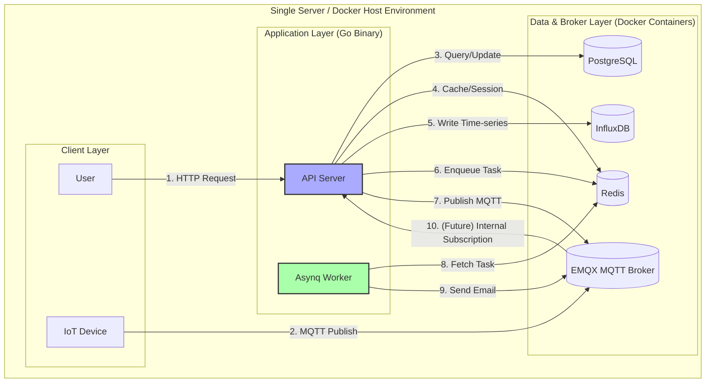
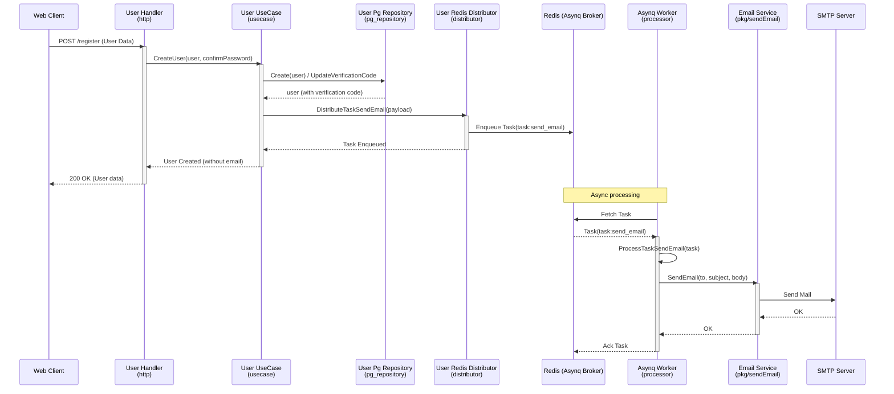

Of course. This is a comprehensive analysis and documentation of the provided Go codebase, structured as requested.

# Comprehensive Analysis of the Go Backend System

## Table of Contents
- [Comprehensive Analysis of the Go Backend System](#comprehensive-analysis-of-the-go-backend-system)
  - [Table of Contents](#table-of-contents)
  - [1. System Concept \& Architecture](#1-system-concept--architecture)
    - [Core Concept](#core-concept)
    - [High-Level Architecture Diagram](#high-level-architecture-diagram)
    - [Data Flow Diagram (Docker-based Deployment)](#data-flow-diagram-docker-based-deployment)
    - [Component Interaction Workflow Diagram (Asynq Example)](#component-interaction-workflow-diagram-asynq-example)
  - [2. Detailed Workflow Explanation](#2-detailed-workflow-explanation)
    - [1. System Initialization \& Startup (Workflow)](#1-system-initialization--startup-workflow)
    - [2. User Authentication \& Authorization (Workflow)](#2-user-authentication--authorization-workflow)
    - [3. Incoming Telemetry Data Processing (MQTT \& InfluxDB) (Workflow)](#3-incoming-telemetry-data-processing-mqtt--influxdb-workflow)
    - [4. Asynchronous Task Processing (Asynq) (Workflow)](#4-asynchronous-task-processing-asynq-workflow)
  - [3. Module \& Checklist](#3-module--checklist)
  - [4. Code Commenting (English \& Thai)](#4-code-commenting-english--thai)
    - [File: `pkg/mqtt/client.go`](#file-pkgmqttclientgo)
    - [File: `pkg/influxdb/client.go`](#file-pkginfluxdbclientgo)
    - [File: `internal/modules/users/repository/pg_repository.go`](#file-internalusersrepositorypg_repositorygo)
    - [File: `internal/modules/users/usecase/usecase.go`](#file-internalusersusecaseusecasego)
  - [5. Use Case Examples \& Problem-Solving](#5-use-case-examples--problem-solving)
    - [Use Case 1: A New IoT Device Sends Data](#use-case-1-a-new-iot-device-sends-data)
    - [Use Case 2: User Forgets Password](#use-case-2-user-forgets-password)
    - [Use Case 3: API Performance Under Load](#use-case-3-api-performance-under-load)

---

## 1. System Concept & Architecture

### Core Concept

This system is an **IoT & User Management Platform** built in Go. Its primary purpose is to manage users, handle authentication, and process telemetry data from IoT devices.

It acts as a central hub that:
-   Exposes a **REST API** for user and device management.
-   Connects to IoT devices via **MQTT** to receive telemetry data.
-   Stores time-series telemetry data in **InfluxDB**.
-   Manages user and device metadata (users, devices, alarms, schedules) in **PostgreSQL**.
-   Uses **Redis** for caching (user sessions, refresh tokens) and as a message broker for asynchronous tasks via **Asynq**.

The architecture follows a clean, modular design, separating concerns into handlers (HTTP layer), use cases (business logic), and repositories (data access).

### High-Level Architecture Diagram

This diagram shows the core components and their connections.

```mermaid
graph TD
    subgraph "External Clients"
        A[Web/Mobile Client]
        B[IoT Devices]
    end

    subgraph "Core Go Application"
        C[HTTP Server & Router<br/>(handlers.go)]
        D[Middleware<br/>(Auth, Monitoring)]
        E[User UseCase]
        F[Device UseCase]
        G[MQTT Client (pkg/mqtt)]
        H[InfluxDB Client (pkg/influxdb)]
        I[Asynq Client]
        J[Asynq Server/Worker]
    end

    subgraph "Databases & Brokers"
        K[(PostgreSQL<br/>User & Metadata)]
        L[(InfluxDB<br/>Time-series Data)]
        M[(Redis<br/>Cache & Sessions)]
        N[Asynq Broker<br/>(Redis)]
        O[MQTT Broker]
    end

    A -- HTTPS --> C
    B -- MQTT --> O

    C -- "Uses" --> D
    C -- "Calls" --> E
    C -- "Calls" --> F

    E -- "Reads/Writes" --> K
    E -- "Reads/Writes" --> M
    F -- "Reads/Writes" --> K

    G -- "Connects to" --> O
    G -- "Called by" --> E

    H -- "Writes/Reads to/from" --> L

    I -- "Enqueues tasks to" --> N
    J -- "Processes tasks from" --> N
    J -- "Sends emails via" --> O

    style C fill:#c9f,stroke:#333,stroke-width:2px
    style K,L,M,N,O fill:#ccc,stroke:#333,stroke-width:1px
```

### Data Flow Diagram (Docker-based Deployment)

This diagram details how data flows through the system, which can be run on a single server or orchestrated via Docker.



### Component Interaction Workflow Diagram (Asynq Example)

This diagram focuses on a specific workflow: creating a user, which involves sending a verification email.



---

## 2. Detailed Workflow Explanation

### 1. System Initialization & Startup (Workflow)
**Goal:** Start all necessary services and ensure they are ready.
1.  The main application (e.g., `cmd/api/main.go`) starts.
2.  It loads configuration from `config/config.dev.yml` or similar, binding environment variables.
3.  It establishes connections to dependencies:
    *   **PostgreSQL:** `pkg/db/postgres` creates a `*gorm.DB` connection pool.
    *   **Redis:** `pkg/redis` creates a `*redis.Client` for caching and an `*asynq.Client` for tasks.
    *   **MQTT:** `pkg/mqtt` creates a client. The `NewServer` function in `server/server.go` calls `connectMQTTWithRetry`, which attempts to connect to the broker (e.g., EMQX) multiple times. If it fails, the server logs a warning but continues running.
    *   **InfluxDB:** `pkg/influxdb` creates a client. Failure is logged but non-fatal.
4.  The `server.New` function is called to create the main router.
    *   It initializes repositories (PostgreSQL, Redis), use cases, and HTTP handlers for users, items, and auth.
    *   It sets up global middleware (CORS, logger, recovery, monitoring, timeout).
    *   It mounts API routes under `/api` and serves the `register`, `login`, `/user/me`, `/user/{id}` etc., endpoints.
5.  The `server.Start` method starts the HTTP server in a goroutine. It also sets up a graceful shutdown listener (SIGINT, SIGTERM). When a shutdown signal is received, it stops the HTTP server and disconnects the MQTT and InfluxDB clients.

### 2. User Authentication & Authorization (Workflow)
**Goal:** Securely register, log in, and manage user sessions.

*   **Registration (`POST /api/register`)**:
    1.  `userHandler.Register()` decodes and validates the JSON request.
    2.  It calls `userUseCase.CreateUser()`.
    3.  The use case hashes the password using `bcrypt`, sets default values (`username`, `role_id`), and saves the user to the PostgreSQL database via `UserPgRepo.Create`.
    4.  It generates a random hex verification code.
    5.  It updates the user record with this code via `UserPgRepo.UpdateVerificationCode`.
    6.  It generates an HTML email using an email template.
    7.  It creates a task payload (`PayloadSendEmail`) and distributes it via `UserRedisTaskDistributor.DistributeTaskSendEmail`, enqueuing it to Redis/Asynq for background processing.
    8.  It returns a success response to the client.

*   **Login (`POST /api/auth/signin` or `/api/auth/login`)**:
    1.  `userHandler.SignInEmail()` decodes the email/password.
    2.  It calls `userUseCase.SignIn()`.
    3.  The use case fetches the user by email using `UserPgRepo.GetByEmail`.
    4.  It compares the provided password with the stored hash using `cryptpass.ComparePassword`.
    5.  Upon success, it generates an access and refresh token (JWT using RS256) via `jwt.CreateAccessTokenRS256`.
    6.  It stores the new refresh token in a Redis set via `UserRedisRepo.Sadd`, keyed by the user ID. This allows for logging out of all devices later.
    7.  It returns both tokens to the client.

*   **Authorization (`GET /api/user/me`)**:
    1.  The request passes through the middleware chain: `mw.Verifier` -> `mw.Authenticator` -> `mw.CurrentUser` -> `mw.ActiveUser`.
    2.  `Authenticator` extracts the `Bearer` token from the `Authorization` header, parses it using the public RSA key, and validates its signature and expiry. The user ID from the token is added to the request context.
    3.  `CurrentUser` fetches the full user model from a cache (Redis) or database and adds it to the context.
    4.  `ActiveUser` checks if the user's `status` is active.
    5.  The `userHandler.Me()` function then retrieves the user from the context (using `middleware.GetUserFromCtx`) and returns it.

### 3. Incoming Telemetry Data Processing (MQTT & InfluxDB) (Workflow)
**Goal:** Ingest data from sensors and store it for analysis.

The provided code shows **infrastructure is ready**, but the **subscription logic is in the legacy NestJS code**, not the Go files. The Go code would need to be extended to implement the following workflow:

1.  **Subscription (To be implemented in Go):** The `pkg/mqtt` client would subscribe to a topic (e.g., `sensors/+/data`).
2.  **Callback (To be implemented in Go):** A message handler registered with `mqttClient.Subscribe` or `SubscribeMultiple` would be triggered for each incoming MQTT message. This handler would parse the message payload.
3.  **Data Writing (To be implemented in Go):** The handler would call `influxClient.WriteData()`, providing the measurement name, fields (e.g., `{"temperature": 25.5}`), and tags (e.g., `{"device_id": "sensor-1"}`). The `influxdb` client would then write this point to the configured InfluxDB bucket.

The existing `influxdb` client supports querying this data via Flux queries (`QueryFilterData`, `CalculateStatistics`), which would be exposed through REST APIs.

### 4. Asynchronous Task Processing (Asynq) (Workflow)
**Goal:** Offload long-running tasks like sending emails to improve API response times.

1.  **Task Definition (in `users/worker.go`):** The task is defined with a `TaskSendEmail` constant and a `PayloadSendEmail` struct.
2.  **Task Distribution (in `distributor.go`):** In the `CreateUser` use case, after the user is saved to the DB, it calls `d.DistributeTaskSendEmail`. This function serializes the payload into JSON and creates an `asynq.Task`.
3.  **Task Enqueuing:** The `asynq.Client`'s `EnqueueContext` method pushes the task to a Redis list. Options like `MaxRetry`, `ProcessIn`, and `Queue` can be specified.
4.  **Task Processing (in `processor.go`):** A separate `asynq.Server` runs in the background as a worker. When it's available, it pulls a task from the queue.
5.  **Task Handler:** The server is configured with a handler map. The `userRedisTaskProcessor`'s `ProcessTaskSendEmail` method is registered for the `TaskSendEmail` type.
6.  **Email Sending:** Inside `ProcessTaskSendEmail`, the payload is unmarshalled, and `emailSender.SendEmail` is called, which uses a configured SMTP service.
7.  **Completion:** If the email sends successfully, the worker acknowledges the task, and it's removed from the queue. If it fails, Asynq will retry based on the `MaxRetry` option.

---

## 3. Module & Checklist

| Module         | Sub-Module / Responsibility                                                                       | Status | Key Files/Notes                                                                                                                                                             |
| -------------- | ------------------------------------------------------------------------------------------------- | ------ | --------------------------------------------------------------------------------------------------------------------------------------------------------------------------- |
| **`cmd/`**     | Application entry points (`main.go`, CLI commands)                                                | ✅     | `api/main.go`, `serve.go`, `worker.go` (handles graceful shutdown)                                                                                                          |
| **`config/`**  | Configuration loading from YAML and environment variables.                                       | ✅     | `config.go`, `config.dev.yml` (uses Viper, supports `mapstructure` for custom types)                                                                                                 |
| **`docs/`**    | Swagger/OpenAPI documentation.                                                                   | ✅     | `docs.go` (annotations in `handlers.go` drive this)                                                                                                                                |
| **`internal/`**| **Core Business Logic**                                                                          |        |                                                                                                                                                                             |
| - `models/`    | Database models/GORM entities.                                                                   | ✅     | `device.go`, `sd_user.go` (includes GORM tags)                                                                                                                              |
| - `users/`     | User management feature.                                                                         | ✅     |                                                                                                                                                                             |
|   - `delivery/http/` | HTTP handlers (`handlers.go`, `routes.go`).                                                 | ✅     | Handlers for `Create`, `Get`, `Update`, `Delete`, `Me`, etc. `routes.go` groups routes with middleware.                                                                             |
|   - `presenter/`    | Request/Response DTOs (e.g., `UserCreate`, `UserResponse`).                               | ✅     | Uses `validate` tags for input validation.                                                                                                                                 |
|   - `distributor/`  | Asynq task distributor for user-related jobs (e.g., sending email).                              | ✅     | `distributor.go`                                                                                                                                                      |
|   - `processor/`    | Asynq task processor for user-related jobs.                                                     | ✅     | `processor.go`                                                                                                                                                       |
|   - `repository/`   | Data access logic.                                                                               | ✅     | `pg_repository.go` (implements advanced filters, statistics, bulk operations), `redis_repository.go` (for caching).                                                              |
|   - `usecase/`      | Business logic orchestration.                                                                    | ✅     | `usecase.go` (handles auth, user CRUD, password reset, token management, Redis key generation, cache invalidation).                                                               |
| - `items/`     | Generic items management module (similar to users).                                             | ✅     | Follows same pattern as `users`.                                                                                                                                           |
| - `middleware/`| HTTP middleware (Auth, CORS, Monitoring, Logging).                                               | ✅     | `auth.go`, `cors.go`, `monitoring.go` (Prometheus).                                                                                                                        |
| **`pkg/`**     | **Reusable Technical Packages**                                                                  |        |                                                                                                                                                                             |
| - `logger/`    | Structured logging (likely using `zap`).                                                         | ✅     | `zap_logger.go`.                                                                                                                                                    |
| - `db/`        | Database connection utilities.                                                                   | ✅     | `postgres/db_conn.go`, `redis/redis_conn.go`.                                                                                                                              |
| - `cryptpass/` | Password hashing and comparison (bcrypt).                                                        | ✅     | `password.go`.                                                                                                                                                             |
| - `jwt/`       | JWT token creation and parsing (RS256).                                                          | ✅     | `token.go`.                                                                                                                                                                |
| - `mqtt/`      | MQTT client wrapper.                                                                             | ✅     | `client.go` (supports connect, publish, subscribe). Currently no background subscription.                                                                                         |
| - `influxdb/`  | InfluxDB client wrapper.                                                                         | ✅     | `client.go` (supports writing and complex Flux queries: mean, median, percentile, stddev, etc.).                                                                          |
| - `asynq/`     | Wrappers for Asynq (distributor, processor) - not a separate pkg but in `internal/modules/users/`.      | ✅     |                                                                                                                                                                             |
| - `validator/` | Custom request validator.                                                                        | ✅     | `custom_validator.go`.                                                                                                                                                     |
| - `utils/`     | Helper functions (random string generation, time formatting).                                   | ✅     | `random.go`, `time.go`.                                                                                                                                                    |

**Overall Checklist Result:** The core modules are well-structured and functional. The main missing piece is the MQTT message handler that subscribes to topics and writes data to InfluxDB (the code is ready but not implemented).

---

## 4. Code Commenting (English & Thai)

Here are key code sections with detailed comments in English and Thai.

### File: `pkg/mqtt/client.go`

```go
// Client defines MQTT operations
// Client กำหนดการทำงานของ MQTT
type Client interface {
	// Connect establishes connection to the broker
	// Connect สร้างการเชื่อมต่อไปยัง MQTT Broker
	Connect(ctx context.Context) error
	// Disconnect gracefully disconnects
	// Disconnect ตัดการเชื่อมต่ออย่างสง่างาม
	Disconnect(quiesce uint)
	// Publish sends a message to a topic
	// Publish ส่งข้อความไปยัง topic
	Publish(topic string, qos byte, retained bool, payload interface{}) error
	// Subscribe registers a callback for a topic
	// Subscribe ลงทะเบียน callback function สำหรับ topic
	Subscribe(topic string, qos byte, callback mqtt.MessageHandler) error
	// IsConnected returns connection status
	// IsConnected คืนค่าสถานะการเชื่อมต่อ
	IsConnected() bool
}

func New(cfg *config.MQTTConfig, log logger.Logger) Client {
	opts := mqtt.NewClientOptions()
	opts.AddBroker(cfg.Broker)               // Add MQTT broker URL (e.g., tcp://localhost:1883)
	opts.SetClientID(cfg.ClientID)           // Set unique client ID
	opts.SetAutoReconnect(true)              // Automatically reconnect if connection is lost
	opts.SetConnectRetry(true)               // Retry initial connection if it fails
	opts.SetConnectRetryInterval(5 * time.Second) // Wait 5 seconds between retries

	// Connection lost handler (called when the connection drops)
	// ตัวจัดการเมื่อการเชื่อมต่อหลุด
	opts.OnConnectionLost = func(cl mqtt.Client, err error) {
		log.Errorf("MQTT connection lost: %v", err)
	}
	// On connect handler (called when the connection is established)
	// ตัวจัดการเมื่อเชื่อมต่อสำเร็จ
	opts.OnConnect = func(cl mqtt.Client) {
		log.Info("MQTT connected")
	}
	// ... other configurations
}

func (c *mqttClient) Connect(ctx context.Context) error {
	c.client = mqtt.NewClient(c.opts)
	token := c.client.Connect()
	// Wait for the connection to complete or context to be cancelled
	// รอให้การเชื่อมต่อเสร็จสิ้น หรือ context ถูกยกเลิก
	select {
	case <-ctx.Done(): // Context cancelled (e.g., timeout, shutdown signal)
		return ctx.Err()
	case <-token.Done(): // MQTT connection attempt finished
		if token.Error() != nil {
			return fmt.Errorf("MQTT connect failed: %w", token.Error())
		}
		return nil
	}
}
```

### File: `pkg/influxdb/client.go`

```go
// CalculateStatistics performs statistical analysis on time-series data.
// CalculateStatistics วิเคราะห์ค่าสถิติของข้อมูลแบบ Time-series
func (i *InfluxClient) CalculateStatistics(params QueryParams) MeanCalculationResult {
	startTime := time.Now()
	// ... (logic to build Flux query based on params.Mean)

	var fluxQuery string
	switch meanType {
	case "mean", "average":
		// Uses aggregateWindow to calculate average over fixed time windows (e.g., every 10 minutes)
		// ใช้ aggregateWindow เพื่อคำนวณค่าเฉลี่ยตามช่วงเวลา (เช่น ทุก 10 นาที)
		fluxQuery = fmt.Sprintf(`
			from(bucket: "%s")
				|> range(start: %s, stop: %s)
				|> filter(fn: (r) => r["_measurement"] == "%s")
				|> filter(fn: (r) => r["_field"] == "%s")
				|> aggregateWindow(every: %s, fn: mean, createEmpty: false)
				|> yield(name: "mean")`,
			bucket, start, stop, params.Measurement, params.Field, windowPeriod)
	case "percentile":
		// Calculates a specific percentile (e.g., p95) of the data
		// คำนวณเปอร์เซ็นไทล์ของข้อมูล (เช่น p95)
		percentile := params.Percentile
		if percentile <= 0 {
			percentile = 0.95
		}
		fluxQuery = fmt.Sprintf(`... |> percentile(percentile: %f) ...`, percentile)
	// ... other cases (median, mode, first, last, stddev, variance)
	}

	results, err := i.executeQuery(fluxQuery, params.TzString)
	if err != nil {
		return MeanCalculationResult{Success: false, Error: err.Error()}
	}
	// ... (parse results and return)
}
```

### File: `internal/modules/users/repository/pg_repository.go`

```go
// GetMultiWithTotal returns users with total count, supports dynamic filters and sorting.
// GetMultiWithTotal คืนค่ารายชื่อผู้ใช้และจำนวนทั้งหมด รองรับการกรองและการเรียงลำดับแบบไดนามิก
func (r *UserPgRepo) GetMultiWithTotal(ctx context.Context, limit, offset int, filters map[string]interface{}) ([]*models.SdUser, int64, error) {
	var users []*models.SdUser
	var total int64

	query := r.DB.WithContext(ctx).Model(&models.SdUser{})

	// Apply filters dynamically by checking the map keys
	// ใช้ตัวกรองแบบไดนามิกโดยการตรวจสอบ key ใน map
	if email, ok := filters["email"].(string); ok && email != "" {
		query = query.Where("email ILIKE ?", "%"+email+"%") // Case-insensitive partial match
	}
	if roleID, ok := filters["role_id"].(int); ok && roleID > 0 {
		query = query.Where("role_id = ?", roleID)
	}
	// ... (other filters like username, fullname, status, verified)

	// Apply sorting, defaulting to createddate DESC
	// ใช้การเรียงลำดับ ถ้าไม่มีจะเรียงตาม createddate จากมากไปน้อย
	sortBy := "createddate"
	sortOrder := "DESC"
	if sb, ok := filters["sort_by"].(string); ok && sb != "" {
		// Map allowed fields to prevent SQL injection
		switch sb {
		case "email", "username", "fullname", "status", "role_id", "verified", "createddate", "updateddate":
			sortBy = sb
		}
	}
	// ... (sort order logic)
	query = query.Order(sortBy + " " + sortOrder)

	// Count total records before pagination
	// นับจำนวนเรกคอร์ดทั้งหมดก่อนแบ่งหน้า
	if err := query.Count(&total).Error; err != nil {
		return nil, 0, err
	}

	// Fetch the paginated results
	// ดึงข้อมูลตามหน้าที่ต้องการ
	err := query.Limit(limit).Offset(offset).Find(&users).Error
	return users, total, err
}
```

### File: `internal/modules/users/usecase/usecase.go`

```go
// Create – inserts a new user and sends verification email
// Create – สร้างผู้ใช้ใหม่และส่งอีเมลยืนยันตัวตน
func (u *userUseCase) Create(ctx context.Context, exp *models.SdUser) (*models.SdUser, error) {
	u.logger.Infof("สร้างผู้ใช้ใหม่และส่งอีเมลยืนยันตัวตน - Creating new user with email: %s", exp.Email)

	// Normalize input and hash password
	// จัดรูปแบบข้อมูลและเข้ารหัสรหัสผ่าน
	exp.Email = strings.ToLower(strings.TrimSpace(exp.Email))
	hashedPassword, err := cryptpass.HashPassword(exp.Password)
	// ... (error handling)
	exp.Password = hashedPassword

	// Save to database
	// บันทึกลงฐานข้อมูล
	user, err := u.pgRepo.Create(ctx, exp)
	// ... (error handling)

	// Generate verification code and update user
	// สร้างโค้ดยืนยันตัวตนและอัปเดตผู้ใช้
	verificationCode, err := secureRandom.RandomHex(16)
	// ... (error handling)
	updatedUser, err := u.pgRepo.UpdateVerificationCode(ctx, user, verificationCode)
	// ... (error handling)

	// Generate email content
	// สร้างเนื้อหาอีเมล
	name := ""
	if updatedUser.Fullname != nil {
		name = *updatedUser.Fullname
	}
	bodyHtml, bodyPlain, err := u.emailTemplateGenerator.GenerateVerificationCodeTemplate(
		ctx, name, fmt.Sprintf("http://localhost:5000/auth/verifyemail?code=%s", verificationCode),
	)

	// Send email via async task (so API response is not blocked)
	// ส่งอีเมลผ่านงานแบบอะซิงโครนัส (เพื่อไม่ให้การตอบสนองของ API ติดขัด)
	err = u.redisTaskDistributor.DistributeTaskSendEmail(ctx, &users.PayloadSendEmail{
		From:      u.Cfg.Email.From,
		To:        updatedUser.Email,
		Subject:   u.Cfg.Email.VerificationSubject,
		BodyHtml:  bodyHtml,
		BodyPlain: bodyPlain,
	}, asynq.MaxRetry(10), asynq.ProcessIn(10*time.Second), asynq.Queue(worker.QueueCritical))
	// ... (error handling)
	return updatedUser, nil
}
```

---

## 5. Use Case Examples & Problem-Solving

### Use Case 1: A New IoT Device Sends Data

**Scenario:** A temperature sensor publishes a value of `23.5` to the MQTT topic `sensors/room1/temperature`.

**Implementation (to be done):**
1.  **Subscribe in `pkg/mqtt/client.go` or `server.go` during startup:**
    ```go
    // In server.New() or a dedicated MQTT service
    err := mqttClient.Subscribe("sensors/+/temperature", 1, func(client mqtt.Client, msg mqtt.Message) {
        payload := string(msg.Payload())
        topic := msg.Topic()
        log.Infof("Received message: %s from topic: %s", payload, topic)
        
        // Extract device ID from topic (e.g., "room1")
        deviceID := extractDeviceIDFromTopic(topic)
        
        // Parse payload to float64
        value, err := strconv.ParseFloat(payload, 64)
        if err != nil {
            log.Errorf("Failed to parse payload: %v", err)
            return
        }

        // Write to InfluxDB
        fields := map[string]interface{}{"value": value}
        tags := map[string]string{"device_id": deviceID, "unit": "celsius"}
        err = influxClient.WriteData("temperature", fields, tags)
        if err != nil {
            log.Errorf("Failed to write to InfluxDB: %v", err)
        }
    })
    ```

**Potential Problems & Solutions:**
*   **Problem:** High volume of messages could overwhelm the database or processing.
*   **Solution:** Implement a buffered channel or a batching mechanism. Instead of writing each point individually, accumulate points and write them in batches every few seconds.
    ```go
    // Simplified batching idea
    var batch []*influxdb2.Point
    ticker := time.NewTicker(5 * time.Second)
    go func() {
        for range ticker.C {
            if len(batch) > 0 {
                influxClient.WriteBatch(batch)
                batch = nil
            }
        }
    }()

    // In the MQTT handler, add to batch instead of writing directly
    // batch = append(batch, influxdb2.NewPoint(...))
    ```

### Use Case 2: User Forgets Password

**Scenario:** A user requests a password reset.

**Current Implementation (Excellent!):**
1.  Client calls `POST /api/user/forgot-password` with `{"email": "user@example.com"}`.
2.  The handler calls `userUseCase.ForgotPassword`.
3.  The use case finds the user by email. If not found, it returns a `404` (but doesn't reveal if email exists).
4.  It checks if the user is `Verified`.
5.  It generates a secure random reset token, saves it to the DB with a 15-minute expiry, and invalidates the user's Redis cache.
6.  It generates a password reset email template with a link to `http://localhost:5000/auth/resetpassword?code={resetToken}`.
7.  It enqueues an asynchronous task to send this email via the `DistributeTaskSendEmail` distributor.
8.  The client receives a success message.
9.  The user clicks the link, and the client calls `POST /api/user/reset-password` with the token and new password.
10. The handler calls `userUseCase.ResetPassword`.
11. The use case validates the token by fetching the user where `password_reset_token` matches and `password_reset_at` is in the future.
12. It hashes the new password and updates the user record, clearing the reset token.
13. It invalidates the user's cache and all their refresh tokens (logging them out of all devices).
14. The client receives a success message.

**Potential Problems & Solutions:**
*   **Problem:** The reset link is hardcoded to `localhost:5000`. This will not work in production.
*   **Solution:** Make the base URL configurable. Add a `BaseURL` or `ClientURL` field to the `EmailConfig` struct in `config.go` and use that to construct the link.
*   **Problem:** Email sending is asynchronous. If the task fails, the user might wait indefinitely. Use Asynq's retry mechanism (`asynq.MaxRetry(10)`) and consider setting up a monitoring dashboard (like Asynqmon) to track failed tasks.
*   **Solution:** Configure Asynq's error handler and set up alerts. For critical emails, you could implement a fallback synchronous send if async enqueuing fails.

### Use Case 3: API Performance Under Load

**Scenario:** Thousands of clients request the same user profile (`GET /api/user/me`) simultaneously.

**Current Implementation (Good, with room for improvement):**
*   The `CurrentUser` middleware uses a Redis cache with a TTL of 1 hour (`redisRepo.Create(ctx, cacheKey, user, 3600)`). This significantly reduces load on the PostgreSQL database.
*   The `redisRepo.Get` is called first, and only on a cache miss does it query the database.

**Potential Bottleneck:**
*   The "thundering herd" problem: If the cache key expires, the first few hundred requests might all miss the cache and hit the database simultaneously.

**Solution (Cache-Aside with Mutex):**
Implement single-flight for cache misses. Use a package like `golang.org/x/sync/singleflight` to ensure that only one request hits the database for a given key when the cache is stale.
```go
import "golang.org/x/sync/singleflight"

var requestGroup singleflight.Group

func (u *userUseCase) Get(ctx context.Context, id uuid.UUID) (*models.SdUser, error) {
    cacheKey := u.GenerateRedisUserKey(id)
    cachedUser, err := u.redisRepo.Get(ctx, cacheKey)
    if err == nil && cachedUser != nil {
        return cachedUser, nil
    }

    // If cache miss, use singleflight to prevent DB thundering herd
    v, err, _ := requestGroup.Do(id.String(), func() (interface{}, error) {
        // Double-check cache again inside the lock
        cachedUser, _ := u.redisRepo.Get(ctx, cacheKey)
        if cachedUser != nil {
            return cachedUser, nil
        }
        return u.pgRepo.Get(ctx, id)
    })

    if err != nil {
        return nil, err
    }

    user := v.(*models.SdUser)
    // Set the cache asynchronously to not block the response
    go func() {
        _ = u.redisRepo.Create(context.Background(), cacheKey, user, 3600)
    }()
    return user, nil
}
```