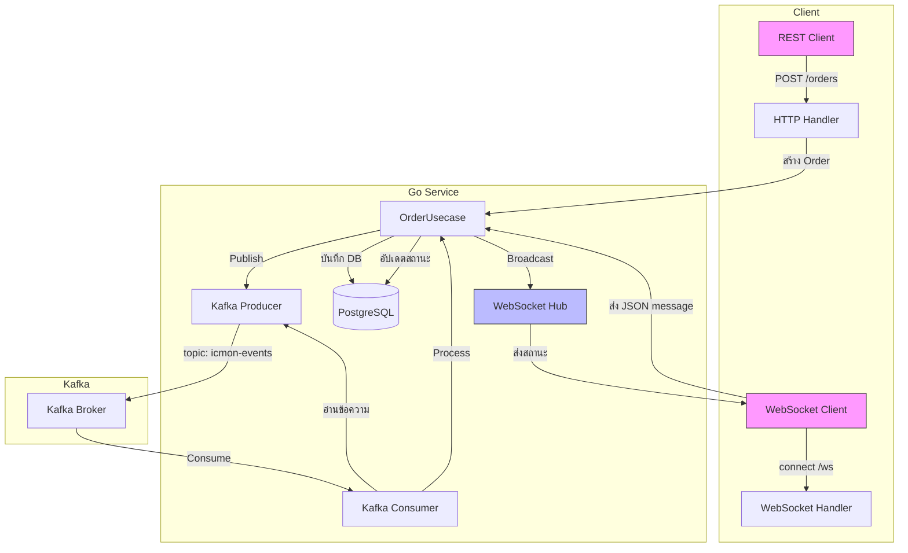

# 🚀 Golang Kafka Service – เอกสารและโค้ดสำหรับการทำงานจริง

---

## 1. ภาพรวมระบบ (Overview)

**Golang Kafka Service** เป็นส่วนหนึ่งของระบบ ICMON IoT Monitoring ที่ทำหน้าที่รับคำสั่ง (Order) ผ่าน REST API และ WebSocket จากนั้นส่งไปยัง **Apache Kafka** เพื่อประมวลผลแบบ asynchronous โดย Consumer จะดึงข้อความมาดำเนินการ (เช่น อัปเดตสถานะ) และแจ้งผลลัพธ์กลับไปยัง WebSocket clients แบบ real‑time

### วัตถุประสงค์
- แยกการรับคำสั่งออกจากการประมวลผลที่ใช้เวลานาน เพื่อไม่ให้ HTTP request ถูก block
- รองรับการทำงานแบบ asynchronous และกระจายโหลดด้วย Kafka Consumer Group
- ส่งสถานะการประมวลผลกลับไปยังผู้ใช้ผ่าน WebSocket ทันที

### ใช้ทำอะไร
- รับคำสั่งซื้อสินค้า (Order) ผ่าน REST API หรือ WebSocket
- เขียนข้อความลง Kafka topic
- Consumer อ่านข้อความและจำลองการประมวลผล (เช่น ตรวจสอบสต็อก, คำนวณราคา)
- อัปเดตสถานะในฐานข้อมูลและ broadcast ผ่าน WebSocket

---

## 2. การทำงาน (Workflow)

### 2.1 Data Flow Diagram (Mermaid)



### 2.2 คำอธิบายขั้นตอน
1. **Client ส่งคำสั่ง**  
   - REST: `POST /orders` พร้อม JSON `{"product_id":"p1","quantity":2}`  
   - WebSocket: ส่งข้อความ JSON เดียวกันไปที่ `/ws`

2. **HTTP/WS Handler** รับข้อมูล → เรียก `OrderUsecase.CreateOrder()`

3. **Usecase**  
   - สร้าง UUID และสถานะ `PENDING`  
   - แปลงเป็น `OrderMessage` และส่งไปยัง **Kafka Producer**  
   - (ไม่รอผล) ตอบกลับ `202 Accepted` พร้อม `order_id`  
   - สำหรับ WebSocket: ส่งตอบกลับทันทีว่า `order_created`

4. **Producer** ส่งข้อความไปยัง Kafka topic พร้อม key = `order_id`

5. **Kafka Consumer** (ทำงานแยก goroutine) อ่านข้อความจาก topic  
   - เมื่อได้ข้อความ → เรียก `ProcessOrderMessage(msg)`

6. **ProcessOrderMessage**  
   - ค้นหา Order จาก DB  
   - จำลองการทำงาน (sleep 2 วินาที)  
   - อัปเดตสถานะเป็น `PROCESSED` และบันทึก DB  
   - เรียก `BroadcastOrderStatus` เพื่อส่งสถานะผ่าน WebSocket Hub

7. **WebSocket Hub** ส่งข้อความสถานะไปยังทุก client ที่เชื่อมต่ออยู่  
   - ข้อความ: `{"event":"order_updated","order_id":"...","status":"PROCESSED"}`

---

## 3. โครงสร้างโค้ดที่ใช้จริง

เพื่อให้สอดคล้องกับโครงสร้างที่ต้องการ เราได้ปรับปรุงและจัดระเบียบโค้ดใหม่ ดังนี้

```
api/
├── cmd/
│   ├── apiser/                 # REST API หลัก
│   │   └── main.go
│   ├── kafka/                  # **** Kafka Service (แยกออกมา)
│   │   └── main.go
│   ├── initdata.go
│   ├── root.go
│   ├── serve.go
│   └── worker.go
├── internal/
│   ├── kafka/                  # **** โค้ดเฉพาะ Kafka
│   │   ├── delivery/
│   │   │   ├── http/
│   │   │   │   └── handler.go      # REST handler
│   │   │   └── ws/
│   │   │       └── handler.go      # WebSocket upgrade
│   │   ├── usecase/
│   │   │   └── order_usecase.go    # business logic
│   │   ├── repository/
│   │   │   └── order_repo.go       # DB operations
│   │   └── models/
│   │       ├── order.go
│   │       └── ws_models.go        # (ถ้าแยก)
│   ├── websocket/               # (อาจจะย้ายไป pkg/websocket)
│   │   ├── hub.go
│   │   ├── client.go
│   │   └── message.go
│   └── ...
├── pkg/
│   ├── kafka/                   # shared packages
│   │   ├── producer.go
│   │   ├── consumer.go
│   │   └── message.go
│   ├── websocket/               # core hub (ใช้ร่วมกันได้)
│   └── db/
├── migrations/
│   └── 20250619_kafka_tables.sql
├── docker-compose.yml
└── Dockerfile.kafka
```

> **หมายเหตุ:** โค้ดที่มีอยู่แล้วในไฟล์ที่ให้มานั้นมีครบทุกส่วนแล้ว เพียงแต่ต้องจัดเรียงไฟล์ให้ตรงกับโครงสร้างข้างต้น

---

## 4. โค้ดหลักที่ปรับปรุงแล้ว (ตัวอย่างไฟล์สำคัญ)

### 4.1 `cmd/kafka/main.go` – Entry point สำหรับ Kafka Service

```go
package main

import (
	"context"
	"log"
	"net/http"
	"os"
	"os/signal"
	"syscall"
	"time"

	"github.com/gorilla/mux"
	httpSwagger "github.com/swaggo/http-swagger"
	"github.com/kongnakornna/icmongolang/config"
	"github.com/kongnakornna/icmongolang/internal/modules/kafka/delivery/http"
	"github.com/kongnakornna/icmongolang/internal/modules/kafka/delivery/ws"
	"github.com/kongnakornna/icmongolang/internal/modules/kafka/repository"
	"github.com/kongnakornna/icmongolang/internal/modules/kafka/usecase"
	"github.com/kongnakornna/icmongolang/pkg/db/postgres"
	"github.com/kongnakornna/icmongolang/pkg/kafka"
	"github.com/kongnakornna/icmongolang/pkg/logger"
	"github.com/kongnakornna/icmongolang/pkg/websocket"
)

// @title         Kafka Order Service
// @version       1.0
// @description   Asynchronous order processing with Kafka + WebSocket
// @host          localhost:5051
// @BasePath      /
// @securityDefinitions.apikey BearerAuth
// @in header
// @name Authorization

func main() {
	cfg := config.GetCfg()
	appLogger := logger.NewApiLogger(cfg)
	appLogger.InitLogger()
	appLogger.Infof("🚀 Starting Kafka Service...")

	// 1. Database
	db, err := postgres.NewPsqlDB(cfg)
	if err != nil {
		appLogger.Fatalf("❌ DB connection failed: %v", err)
	}
	appLogger.Info("✅ PostgreSQL connected")

	// 2. Kafka Producer
	producer, err := kafka.NewProducer(cfg.Kafka.Brokers, cfg.Kafka.Topic)
	if err != nil {
		appLogger.Fatalf("❌ Producer failed: %v", err)
	}
	defer producer.Close()
	appLogger.Infof("✅ Kafka producer ready (brokers: %v)", cfg.Kafka.Brokers)

	// 3. WebSocket Hub
	hub := websocket.NewHub(appLogger)
	go hub.Run()
	appLogger.Info("✅ WebSocket hub started")

	// 4. Repository & Usecase
	orderRepo := repository.NewOrderRepository(db)
	orderUsecase := usecase.NewOrderUsecase(orderRepo, producer, cfg.Kafka.Topic, hub)

	// 5. Kafka Consumer (start in background)
	consumerHandler := func(msg *kafka.OrderMessage) error {
		return orderUsecase.ProcessOrderMessage(msg)
	}
	consumer, err := kafka.NewConsumer(cfg.Kafka.Brokers, cfg.Kafka.GroupID, cfg.Kafka.Topic, consumerHandler)
	if err != nil {
		appLogger.Fatalf("❌ Consumer failed: %v", err)
	}
	defer consumer.Close()

	ctx, cancel := context.WithCancel(context.Background())
	if err := consumer.Start(ctx); err != nil {
		appLogger.Fatalf("❌ Consumer start error: %v", err)
	}
	appLogger.Info("✅ Kafka consumer started")

	// 6. HTTP Router
	orderHandler := http.NewOrderHandler(orderUsecase)
	wsHandler := ws.NewWsHandler(hub, orderUsecase, appLogger)

	router := mux.NewRouter()
	router.HandleFunc("/orders", orderHandler.CreateOrder).Methods("POST")
	router.HandleFunc("/ws", wsHandler.ServeWS).Methods("GET")
	router.HandleFunc("/health", func(w http.ResponseWriter, r *http.Request) {
		w.WriteHeader(http.StatusOK)
		w.Write([]byte("OK"))
	}).Methods("GET")
	router.PathPrefix("/swagger/").Handler(httpSwagger.Handler(
		httpSwagger.URL("/swagger/doc.json"),
	))

	port := cfg.Server.Port
	if port == "" {
		port = "5051"
	}
	srv := &http.Server{
		Addr:    ":" + port,
		Handler: router,
	}

	// 7. Graceful shutdown
	stop := make(chan os.Signal, 1)
	signal.Notify(stop, syscall.SIGINT, syscall.SIGTERM)

	go func() {
		appLogger.Infof("📡 HTTP server listening on port %s", port)
		appLogger.Infof("📚 Swagger: http://localhost:%s/swagger/index.html", port)
		appLogger.Infof("🔌 WebSocket: ws://localhost:%s/ws", port)
		if err := srv.ListenAndServe(); err != nil && err != http.ErrServerClosed {
			appLogger.Fatalf("❌ HTTP server error: %v", err)
		}
	}()

	<-stop
	appLogger.Info("⏳ Shutting down...")

	ctxShutdown, cancelShutdown := context.WithTimeout(context.Background(), 10*time.Second)
	defer cancelShutdown()
	if err := srv.Shutdown(ctxShutdown); err != nil {
		appLogger.Errorf("HTTP shutdown error: %v", err)
	}

	cancel() // stop consumer
	consumer.Wait()
	appLogger.Info("✅ Service stopped gracefully")
}
```

### 4.2 `pkg/kafka/consumer.go` (ปรับปรุงเล็กน้อย)

```go
package kafka

import (
	"context"
	"encoding/json"
	"fmt"
	"log"
	"sync"
	"github.com/IBM/sarama"
)

type MessageHandler func(msg *OrderMessage) error

type Consumer struct {
	client  sarama.ConsumerGroup
	topic   string
	groupID string
	handler MessageHandler
	wg      sync.WaitGroup
}

func NewConsumer(brokers []string, groupID, topic string, handler MessageHandler) (*Consumer, error) {
	config := sarama.NewConfig()
	config.Consumer.Group.Rebalance.Strategy = sarama.BalanceStrategyRoundRobin
	config.Consumer.Offsets.Initial = sarama.OffsetNewest
	config.Consumer.Return.Errors = true

	client, err := sarama.NewConsumerGroup(brokers, groupID, config)
	if err != nil {
		return nil, fmt.Errorf("failed to create consumer group: %w", err)
	}
	return &Consumer{
		client:  client,
		topic:   topic,
		groupID: groupID,
		handler: handler,
	}, nil
}

func (c *Consumer) Start(ctx context.Context) error {
	c.wg.Add(1)
	go func() {
		defer c.wg.Done()
		for {
			select {
			case <-ctx.Done():
				return
			default:
				if err := c.client.Consume(ctx, []string{c.topic}, &consumerGroupHandler{handler: c.handler}); err != nil {
					log.Printf("Consumer error: %v", err)
				}
			}
		}
	}()
	return nil
}

func (c *Consumer) Wait() {
	c.wg.Wait()
}

func (c *Consumer) Close() error {
	return c.client.Close()
}

// ... (consumerGroupHandler implementation)
```

### 4.3 `internal/modules/kafka/usecase/order_usecase.go` (ปรับปรุงเพิ่ม retry logic)

```go
func (u *orderUsecase) ProcessOrderMessage(msg *kafka.OrderMessage) error {
	// ... find order ...
	if order.Status != "PENDING" {
		return nil
	}

	// Simulate processing with retry
	var err error
	for attempt := 0; attempt < 3; attempt++ {
		if err = u.doProcess(order); err == nil {
			break
		}
		time.Sleep(time.Duration(attempt+1) * time.Second)
	}
	if err != nil {
		order.Status = "FAILED"
		u.repo.Update(order)
		u.BroadcastOrderStatus(order.ID.String(), "FAILED")
		return err
	}
	// ... update status and broadcast ...
}

func (u *orderUsecase) doProcess(order *models.Order) error {
	// จำลองการทำงานที่อาจล้มเหลว
	time.Sleep(2 * time.Second)
	// ... 
	return nil
}
```

---

## 5. การตั้งค่า Kafka ด้วย Docker Compose

**docker-compose.yml** (เพิ่มส่วน Kafka)

```yaml
version: '3.8'
services:
  zookeeper:
    image: confluentinc/cp-zookeeper:latest
    environment:
      ZOOKEEPER_CLIENT_PORT: 2181
    ports:
      - "2181:2181"

  kafka:
    image: confluentinc/cp-kafka:latest
    depends_on:
      - zookeeper
    ports:
      - "9092:9092"
    environment:
      KAFKA_BROKER_ID: 1
      KAFKA_ZOOKEEPER_CONNECT: zookeeper:2181
      KAFKA_ADVERTISED_LISTENERS: PLAINTEXT://localhost:9092
      KAFKA_OFFSETS_TOPIC_REPLICATION_FACTOR: 1
      KAFKA_TRANSACTION_STATE_LOG_MIN_ISR: 1
      KAFKA_TRANSACTION_STATE_LOG_REPLICATION_FACTOR: 1

  kafka-ui:
    image: provectuslabs/kafka-ui:latest
    depends_on:
      - kafka
    ports:
      - "8080:8080"
    environment:
      KAFKA_CLUSTERS_0_NAME: local
      KAFKA_CLUSTERS_0_BOOTSTRAPSERVERS: kafka:9092
```

**Dockerfile.kafka** (สำหรับ build service แยก)

```dockerfile
FROM golang:1.20-alpine AS builder
WORKDIR /app
COPY go.mod go.sum ./
RUN go mod download
COPY . .
RUN CGO_ENABLED=0 GOOS=linux go build -o kafka-service ./cmd/kafka

FROM alpine:latest
RUN apk --no-cache add ca-certificates
WORKDIR /root/
COPY --from=builder /app/kafka-service .
EXPOSE 5051
CMD ["./kafka-service"]
```

---

## 6. Test Case Checklist

| Test Case ID | ชื่อทดสอบ | ขั้นตอน | Expected Result |
|--------------|-----------|---------|-----------------|
| TC-01 | สร้าง Order ผ่าน REST API | `POST /orders` พร้อม JSON ถูกต้อง | Response 202 พร้อม order_id, สถานะ PENDING |
| TC-02 | Consumer ประมวลผล Order สำเร็จ | หลังจากส่ง Order รอ 2-3 วินาที | WebSocket ได้รับ event `order_updated` สถานะ PROCESSED |
| TC-03 | สร้าง Order ผ่าน WebSocket | ส่ง JSON ผ่าน WebSocket | ได้รับ `order_created` และหลังจากนั้นได้รับ `order_updated` |
| TC-04 | Consumer จัดการ Order ที่ไม่พบ | ส่ง Order ID ที่ไม่มีใน DB | Consumer log error, ไม่ commit offset |
| TC-05 | Consumer ทำงานล้มเหลว (simulate) | ทำให้ `doProcess` return error | Order กลายเป็น FAILED, broadcast FAILED |
| TC-06 | WebSocket รับข้อความหลาย clients | เปิดหลาย clients เชื่อมต่อ room เดียวกัน | ทุก client ได้รับ broadcast |
| TC-07 | Graceful shutdown | ส่ง SIGTERM | Consumer หยุดทำงาน, HTTP server ปิด, ไม่มี panic |
| TC-08 | Rebalance Consumer Group | สั่ง restart consumer ตัวหนึ่ง | ข้อความถูกกระจายไปยังตัวอื่นอย่างถูกต้อง |

---

## 7. Function Checklist (ฟังก์ชันหลัก)

| ฟังก์ชัน | ไฟล์ | คำอธิบาย | สถานะ |
|----------|------|----------|--------|
| `NewProducer` | pkg/kafka/producer.go | สร้าง Sarama sync producer | ✅ |
| `PublishMessage` | pkg/kafka/producer.go | ส่งข้อความไป Kafka | ✅ |
| `NewConsumer` | pkg/kafka/consumer.go | สร้าง consumer group | ✅ |
| `Start` | pkg/kafka/consumer.go | เริ่ม consume ใน goroutine | ✅ |
| `ProcessOrderMessage` | internal/modules/kafka/usecase/order_usecase.go | จัดการข้อความจาก Kafka | ✅ |
| `BroadcastOrderStatus` | internal/modules/kafka/usecase/order_usecase.go | ส่งสถานะผ่าน WebSocket Hub | ✅ |
| `ServeWS` | internal/modules/kafka/delivery/ws/handler.go | Upgrade HTTP -> WebSocket | ✅ |
| `CreateOrder` | internal/modules/kafka/delivery/http/handler.go | REST handler | ✅ |
| `Run` (Hub) | pkg/websocket/hub.go | วนลูปจัดการ register/broadcast | ✅ |
| `AddClient` | pkg/websocket/hub.go | ลงทะเบียน client ใหม่ | ✅ |
| `ReadPump` | pkg/websocket/client.go | อ่านข้อความจาก WebSocket | ✅ |
| `WritePump` | pkg/websocket/client.go | เขียนข้อความไป client | ✅ |

---

## 8. กรณีศึกษาและแนวทางแก้ไขปัญหา

### กรณีศึกษา 1: Consumer ช้าเกินไป
**อาการ:** ออเดอร์จำนวนมากค้างใน Kafka, Consumer ทำงานไม่ทัน  
**แนวทางแก้ไข:**  
- เพิ่มจำนวน partition ใน topic และปรับ Consumer Group ให้มีหลาย instance  
- ปรับ `config.Consumer.Fetch.Min` และ `Max` เพื่อดึงข้อมูลครั้งละมากขึ้น  
- เพิ่ม worker pool ภายใน Consumer เพื่อประมวลผลพร้อมกัน (ใช้ goroutine)

### กรณีศึกษา 2: WebSocket เชื่อมต่อหลุดบ่อย
**อาการ:** Client ตัดการเชื่อมต่อโดยไม่คาดคิด  
**แนวทางแก้ไข:**  
- ใช้ Ping/Pong เพื่อตรวจจับการเชื่อมต่อ  
- ตั้ง Read/Write Deadline  
- เมื่อ client หลุด ให้ทำการลบออกจาก Hub และปิด channel `send`

### กรณีศึกษา 3: ข้อความใน Kafka ซ้ำ (duplicate)
**สาเหตุ:** Consumer commit offset ไม่สำเร็จ  
**แนวทางแก้ไข:**  
- ใช้ idempotent processing โดยตรวจสอบ `order_id` และสถานะก่อนประมวลผล  
- ใช้ `sess.MarkMessage` เฉพาะเมื่อ process สำเร็จเท่านั้น

---

## 9. ข้อดี – ข้อเสีย – ข้อควรระวัง

### ข้อดี
- **Asynchronous**: ไม่ block HTTP request  
- **Scalability**: สามารถเพิ่ม Consumer instance ได้  
- **Reliability**: Kafka มี mechanism replay และ persistence  
- **Real-time**: WebSocket ส่งสถานะทันที

### ข้อเสีย
- **Complexity**: ต้องจัดการ offset, rebalance, retry  
- **Latency**: มี overhead จากการ serialize และ network  
- **ต้องมี Kafka cluster** เพิ่ม component

### ข้อควรระวัง
- **Idempotency**: ต้องออกแบบให้ process ซ้ำได้  
- **Monitoring**: ต้องติดตาม lag ของ consumer  
- **Security**: ใช้ TLS และ SASL สำหรับ Kafka production  
- **อย่า** commit offset ก่อน process เสร็จ (เสี่ยง data loss)

---

## 10. ข้อห้าม (ถ้ามี)

- **ห้าม** ใช้ Kafka สำหรับธุรกรรมที่ต้องการ ACID ทันที (ใช้ DB transaction แทน)  
- **ห้าม** เก็บข้อมูลขนาดใหญ่ในข้อความ Kafka (เกิน 1MB)  
- **ห้าม** ใช้ `auto.offset.reset=earliest` ใน production โดยไม่เข้าใจผลกระทบ  
- **ห้าม** สร้าง Consumer Group ใหม่ทุกครั้ง (ใช้ group id คงที่)

---

## 11. สรุป

**Golang Kafka Service** ช่วยให้ระบบ ICMON สามารถรับคำสั่งและประมวลผลแบบ asynchronous ได้อย่างมีประสิทธิภาพ โดยแยกส่วนรับคำสั่ง (HTTP/WebSocket) ออกจากส่วนประมวลผล (Consumer) ผ่าน Kafka เป็นตัวกลาง ซึ่งช่วยให้ระบบสามารถขยายขนาดได้ง่าย รองรับการทำงานแบบ real-time ผ่าน WebSocket และยังมีความทนทานต่อความผิดพลาดด้วยกลไกของ Kafka

โครงสร้างโค้ดที่แยกเป็น service ต่างหาก (cmd/kafka) ทำให้ง่ายต่อการ deploy และบำรุงรักษา พร้อมด้วย Swagger สำหรับทดสอบ API และ Docker Compose สำหรับจำลอง environment ทั้งระบบ

เอกสารนี้ครอบคลุมทั้ง **ดีไซน์ การติดตั้ง การทดสอบ และแนวทางแก้ไขปัญหา** เพื่อให้ทีมพัฒนาสามารถนำไปใช้งานจริงได้อย่างมั่นใจ

---

 