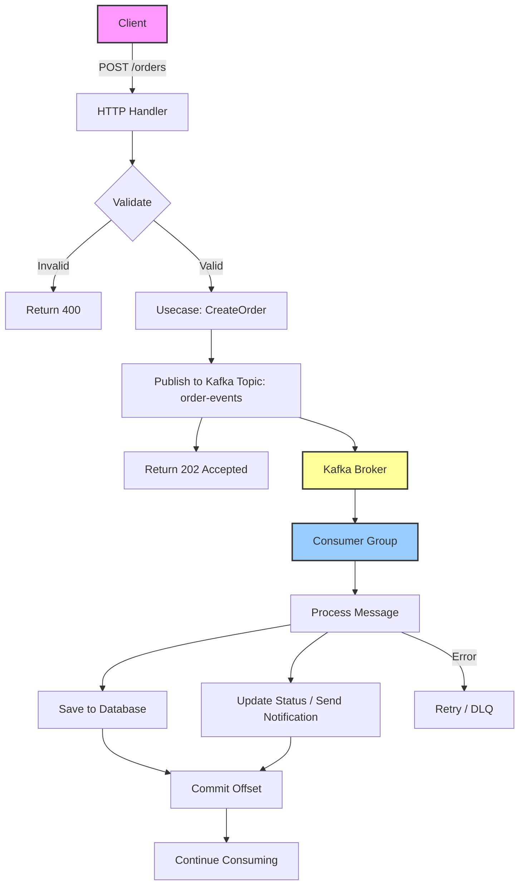

---------------------------------------------------------------------------------
- โครงสร้าง Foder การทำงาน
setup kafka container
create kafka and golang app
create kafka configuration
create kafka message publisher
create kafka message consumer
create async order handler in golang
process consumed message in kafka & go
---------------------------------------------------------------------------------
# Golang Kafka Service
---------------------------------------------------------------------------------
```bash
  api/
    ├── cmd/
    │   ├── apiser/                 # REST API หลัก (มีอยู่แล้ว)
    │   ├── Kafka/              # *** Kafka Service
    │   │   └── main.go
    │   ├── initdata.go
    │   ├── root.go
    │   ├── serve.go
    │   └── worker.go
    ├── internal/
    │   ├── Kafka/              # **** โค้ดเฉพาะของ Kafka
    │   │   ├── delivery/
    │   │   │   └── ws/
    │   │   │       ├── hub.go
    │   │   │       ├── client.go
    │   │   │       └── handler.go     # HTTP endpoint สำหรับ upgrade
    │   │   ├── usecase/
    │   │   │   └── ws_usecase.go      # business logic (save message, auth)
    │   │   ├── repository/
    │   │   │   └── ws_repo.go         # interface สำหรับ DB
    │   │   └── models/
    │   │       └── ws_models.go       # entity ของ message, session
    │   ├── pkg/                    # shared packages (มีอยู่แล้ว)
    │   │   ├── Kafka/          # **ปรับปรุง** ใช้ร่วมกันได้
    │   │   │   ├── hub.go          # core Hub logic
    │   │   │   ├── client.go
    │   │   │   └── message.go      # struct ของ message
    │   │   └── ...
    ├── migrations/                 # **เพิ่ม** SQL schema สำหรับ Kafka
    │   └── 20250619_Kafka_tables.sql
    └── 
```
---------------------------------------------------------------------------------
    - code ทำงานจริง
    - โครงสร้างการทำงาน
	- คืออะไร
	- วัตุประสงค์	
	- ใช้ทำอะไร
	- ทำงานอย่างไร
	 - ออกแบบ workflow
		- วาดรูป dataflow สร้าง รูปแบบ dataflow เหมือนจริง ลักษณะ flowchart   เพื่ออธิบายกระบวนการ ทำความเข้าใจ
        - วาดรูป dataflow สร้าง รูปแบบMermaid Diagrams
		- พร้อมอธิบาย แบบ ละเอียด  
    	- ยกตัวอย่างการทำงาน ตัวอย่างการใช้งานจริง หรือ กรณีศึกษา แนวทางแก้ไขปัญหา ที่อาจจะเกิดขึ้น 
    	- ประโยชน์ที่ได้รับ
    	- ข้อควรระวัง
    	- ข้อดี
    	- ข้อเสีย
    	- ข้อห้าม ถ้ามี
    - Check list Test case
    - Check list funntion
	- Root Cause Analysis (RCA) (ถ้ามี)
	- สรุป
---------------------------------------------------------------------------------

## คำแนะนำการติดตั้ง Dependencies

คุณสามารถติดตั้งแพ็คเกจทั้งหมดที่ระบุใน `go.mod` ได้โดยใช้คำสั่ง `go get` หรือ `go mod tidy` ดังนี้:

---

### 1. เริ่มต้นด้วยการสร้าง `go.mod` (ถ้ายังไม่มี)

```bash
go mod init api
```

---

### 2. ติดตั้งแต่ละแพ็คเกจตามเวอร์ชันที่ต้องการ

```bash
go get github.com/IBM/sarama@v1.42.1
go get github.com/gorilla/mux@v1.8.1
go get github.com/joho/godotenv@v1.5.1
go get gorm.io/driver/postgres@v1.5.7
go get gorm.io/gorm@v1.25.8
```

หรือใช้ **คำสั่งเดียว** เพื่อดึงทั้งหมด (ถ้าคุณมี `require` ใน `go.mod` แล้ว):

```bash
go mod tidy
```

`go mod tidy` จะดาวน์โหลด dependencies ที่จำเป็นทั้งหมดและลบตัวที่ไม่ใช้ออกอัตโนมัติ

---

### 3. (Optional) ถ้าต้องการ vendor dependencies

```bash
go mod vendor
```

เพื่อนำ dependencies ไปไว้ในโฟลเดอร์ `vendor/` สำหรับการ build แบบ offline

---

### 4. ตั้งค่า GOPROXY (ถ้าอยู่ในประเทศที่มีการจำกัดการเข้าถึง)

เพื่อให้ดาวน์โหลดได้เร็วขึ้น อาจตั้งค่า proxy ของทางการ:

```bash
go env -w GOPROXY=https://proxy.golang.org,direct
```

หรือใช้ private proxy ตามต้องการ

---

### 5. ตรวจสอบว่า dependencies ติดตั้งสำเร็จ

```bash
go list -m all
```

จะแสดงรายการ modules ทั้งหมดที่ใช้ในโปรเจกต์

---

หากคุณมีไฟล์ `go.mod` และ `go.sum` อยู่แล้ว เพียงแค่รัน `go mod download` ก็จะโหลด dependencies ตามที่ระบุไว้โดยไม่ต้องระบุเวอร์ชันอีก

---

**หมายเหตุ:** หากเจอปัญหาเรื่องเวอร์ชันหรือการพึ่งพาที่ขัดแย้งกัน ให้ลองล้าง cache และดาวน์โหลดใหม่:

```bash
go clean -modcache
go mod download
```


---------------------------------------------------------------------------------

สร้าง  code สำหรับ ทำงานจริง


# Golang Kafka Service – ระบบประมวลผลออเดอร์แบบ Asynchronous ด้วย Kafka

## 📁 โครงสร้างโฟลเดอร์และการทำงาน

```
api/                                # Root ของโปรเจกต์ (ตามโจทย์)
├── cmd/
│   ├── apiser/                     # REST API หลัก (มีอยู่แล้ว)
│   ├── kafka/                      # ✅ Kafka Service (สร้างใหม่)
│   │   └── main.go                 # Entry point ของ Kafka service
│   ├── initdata.go
│   ├── root.go
│   ├── serve.go
│   └── worker.go
├── internal/
│   ├── kafka/                      # ✅ โค้ดเฉพาะของ Kafka
│   │   ├── delivery/
│   │   │   └── http/               # (แทน ws/ ที่ให้มา เนื่องจากใช้ HTTP API)
│   │   │       └── handler.go      # HTTP handlers สำหรับรับคำสั่งสร้างออเดอร์
│   │   ├── usecase/
│   │   │   └── order_usecase.go    # Business logic: สร้างออเดอร์, publish, consume
│   │   ├── repository/
│   │   │   └── order_repo.go       # Interface + implementation สำหรับ DB (GORM)
│   │   └── models/
│   │       └── order.go            # Entity Order
│   ├── pkg/                        # shared packages (มีอยู่แล้ว, เราเพิ่ม kafka)
│   │   ├── kafka/                  # ✅ shared Kafka utilities
│   │   │   ├── config.go           # Kafka configuration struct + loader
│   │   │   ├── producer.go         # Producer wrapper (Sarama)
│   │   │   ├── consumer.go         # Consumer group wrapper (Sarama)
│   │   │   └── message.go          # Struct ของ message ที่ส่งผ่าน Kafka
│   │   └── ...
├── migrations/                     # ✅ SQL schema สำหรับตาราง orders
│   └── 20250619_kafka_tables.sql
├── docker-compose.yml              # ✅ สำหรับรัน Kafka + Zookeeper + PostgreSQL + App
├── .env.example                    # ตัวอย่าง environment variables
└── go.mod
```

**คำอธิบายส่วนประกอบ:**

- **cmd/kafka/main.go** – เป็นโปรแกรม standalone ที่รัน Kafka service โดยจะทำหน้าที่:
  - เริ่ม Kafka Consumer Group เพื่อรับข้อความจาก topic `order-events`
  - เปิด HTTP Server สำหรับรับคำขอสร้างออเดอร์ (POST /orders) แล้ว publish ไปยัง Kafka
  - ใช้ shared package `pkg/kafka` ในการติดต่อกับ Kafka
  - ใช้ `internal/modules/kafka` สำหรับ business logic, repository, และ delivery
- **internal/modules/kafka/delivery/http** – รับ HTTP request, เรียก usecase
- **internal/modules/kafka/usecase** – จัดการ business logic: สร้างออเดอร์, publish, และเมื่อ consume แล้วก็จะบันทึกข้อมูลลง DB
- **internal/modules/kafka/repository** – ดำเนินการกับฐานข้อมูล (เช่น บันทึกออเดอร์)
- **internal/modules/kafka/models** – กำหนด struct Order
- **pkg/kafka** – โค้ดที่ใช้ร่วมกันระหว่างบริการต่าง ๆ (producer, consumer, config)
- **migrations** – สร้างตาราง `orders` ใน PostgreSQL

---

## 📌 คืออะไร / วัตถุประสงค์ / ใช้ทำอะไร / ทำงานอย่างไร

| หัวข้อ | คำอธิบาย |
|--------|----------|
| **คืออะไร** | Kafka Service ในภาษา Go ที่ใช้ Apache Kafka เป็นตัวกลางในการรับ-ส่งข้อความ (event-driven) เพื่อประมวลผลออเดอร์แบบ asynchronous |
| **วัตถุประสงค์** | แยกส่วนการรับคำขอ (API) ออกจากการประมวลผลที่ใช้เวลานาน (เช่น การบันทึกฐานข้อมูล, การเรียกบริการภายนอก) เพื่อเพิ่มความทนทาน, ปรับขนาดได้ และลดการรอคอยของผู้ใช้ |
| **ใช้ทำอะไร** | รับคำขอสร้างออเดอร์จาก HTTP endpoint → ส่งข้อความไปยัง Kafka → Consumer ใน Go ดึงข้อความมาประมวลผล (บันทึก DB, ส่งอีเมล, ฯลฯ) |
| **ทำงานอย่างไร** | 1. Client ส่ง POST /orders พร้อมข้อมูลออเดอร์ <br> 2. Handler เรียก Usecase เพื่อ validate และสร้าง Order object <br> 3. Usecase ใช้ Producer ส่งข้อความ JSON ไปยัง Kafka topic `order-events` <br> 4. Producer ส่งข้อความสำเร็จ ตอบกลับ HTTP 202 (Accepted) ทันที <br> 5. Consumer Group ที่รันอยู่ background จะรับข้อความจาก topic เดียวกัน <br> 6. Consumer process message: บันทึกออเดอร์ลง PostgreSQL, อัปเดตสถานะ, และอาจ trigger งานอื่น ๆ <br> 7. หากเกิดข้อผิดพลาด Consumer จะ retry หรือส่งไปยัง Dead Letter Topic (DLC) |

---

## 🔄 Workflow และ Dataflow Diagram (Mermaid)



**คำอธิบายอย่างละเอียด:**

1. **Client** ส่ง HTTP POST request ไปที่ `/orders` พร้อม payload (JSON)
2. **HTTP Handler** ตรวจสอบความถูกต้องของข้อมูล (เช่น ต้องมี `product_id`, `quantity`)
3. ถ้าข้อมูลไม่ถูกต้อง → ตอบกลับ `400 Bad Request` ทันที
4. ถ้าข้อมูลถูกต้อง → เรียก **Usecase** เพื่อสร้าง `Order` object และกำหนด `status = "PENDING"`
5. **Usecase** ใช้ **Producer** (จาก `pkg/kafka`) ส่งข้อความ JSON ไปยัง Kafka topic `order-events` พร้อมกับ `key` ที่เป็น `order_id` เพื่อให้แน่ใจว่าออเดอร์เดียวกันถูกประมวลผลตามลำดับ (ถ้าต้องการ)
6. Producer ส่งข้อความสำเร็จ → ตอบกลับ HTTP `202 Accepted` ให้ Client ทันที (ไม่ต้องรอการประมวลผล)
7. **Consumer Group** ซึ่งทำงานอยู่เบื้องหลัง (มีหลาย instance ก็ได้) จะดึงข้อความจาก topic `order-events` แบบ partition ตาม key
8. เมื่อได้รับข้อความ Consumer จะทำการ **Unmarshal** JSON เป็น struct `OrderMessage` และเรียกใช้ **Usecase** อีกครั้ง (หรือฟังก์ชันประมวลผล) เพื่อ:
   - บันทึกออเดอร์ลงตาราง `orders` ใน PostgreSQL (โดยใช้ Repository)
   - อัปเดตสถานะเป็น `"PROCESSED"`
   - ส่งอีเมลแจ้งเตือนลูกค้า (ถ้าจำเป็น)
9. หากการประมวลผลสำเร็จ → **Commit Offset** เพื่อบอก Kafka ว่าข้อความนี้ถูกประมวลผลแล้ว
10. หากเกิดข้อผิดพลาด (เช่น DB down) → Consumer จะไม่ commit offset และจะ retry ตามกำหนด (หรือส่งไปยัง Dead Letter Topic)

---

## 💻 โค้ดสำหรับทำงานจริง

### 1. Environment Variables (`.env.example`)

```env
# Kafka
KAFKA_BROKERS=localhost:9092
KAFKA_TOPIC=order-events
KAFKA_GROUP_ID=order-consumer-group

# PostgreSQL
DB_HOST=localhost
DB_PORT=5432
DB_USER=postgres
DB_PASSWORD=postgres
DB_NAME=orderdb

# HTTP Server
HTTP_PORT=8081
```

---

### 2. Docker Compose (docker-compose.yml)

```yaml
version: '3.8'
services:
  zookeeper:
    image: confluentinc/cp-zookeeper:latest
    environment:
      ZOOKEEPER_CLIENT_PORT: 2181
    ports:
      - "2181:2181"

  kafka:
    image: confluentinc/cp-kafka:latest
    depends_on:
      - zookeeper
    environment:
      KAFKA_BROKER_ID: 1
      KAFKA_ZOOKEEPER_CONNECT: zookeeper:2181
      KAFKA_ADVERTISED_LISTENERS: PLAINTEXT://localhost:9092
      KAFKA_OFFSETS_TOPIC_REPLICATION_FACTOR: 1
    ports:
      - "9092:9092"

  postgres:
    image: postgres:14-alpine
    environment:
      POSTGRES_USER: postgres
      POSTGRES_PASSWORD: postgres
      POSTGRES_DB: orderdb
    ports:
      - "5432:5432"
    volumes:
      - pgdata:/var/lib/postgresql/data
      - ./migrations:/docker-entrypoint-initdb.d   # auto-run migrations

  kafka-app:
    build: .
    depends_on:
      - kafka
      - postgres
    environment:
      KAFKA_BROKERS: kafka:9092
      DB_HOST: postgres
      DB_PORT: 5432
      DB_USER: postgres
      DB_PASSWORD: postgres
      DB_NAME: orderdb
      HTTP_PORT: 8081
    ports:
      - "8081:8081"
    command: ["go", "run", "cmd/kafka/main.go"]

volumes:
  pgdata:
```

---

### 3. Migration SQL (`migrations/20250619_kafka_tables.sql`)

```sql
CREATE TABLE IF NOT EXISTS orders (
    id UUID PRIMARY KEY,
    product_id VARCHAR(255) NOT NULL,
    quantity INT NOT NULL,
    status VARCHAR(50) NOT NULL DEFAULT 'PENDING',
    created_at TIMESTAMP WITH TIME ZONE DEFAULT NOW(),
    updated_at TIMESTAMP WITH TIME ZONE DEFAULT NOW()
);

CREATE INDEX idx_orders_status ON orders(status);
```

---

### 4. Go Modules (`go.mod`)

```go
module api

go 1.21

require (
    github.com/IBM/sarama v1.42.1
    github.com/gorilla/mux v1.8.1
    github.com/joho/godotenv v1.5.1
    gorm.io/driver/postgres v1.5.7
    gorm.io/gorm v1.25.8
)
```

---

### 5. Shared Kafka Package

#### `pkg/kafka/config.go`

```go
package kafka

import (
    "fmt"
    "os"
)

type Config struct {
    Brokers   []string
    Topic     string
    GroupID   string
}

func LoadConfig() Config {
    return Config{
        Brokers: []string{getEnv("KAFKA_BROKERS", "localhost:9092")},
        Topic:   getEnv("KAFKA_TOPIC", "order-events"),
        GroupID: getEnv("KAFKA_GROUP_ID", "order-consumer-group"),
    }
}

func getEnv(key, fallback string) string {
    if val, ok := os.LookupEnv(key); ok {
        return val
    }
    return fallback
}
```

#### `pkg/kafka/message.go`

```go
package kafka

import "time"

// OrderMessage คือข้อความที่ส่งผ่าน Kafka
type OrderMessage struct {
    OrderID   string    `json:"order_id"`
    ProductID string    `json:"product_id"`
    Quantity  int       `json:"quantity"`
    CreatedAt time.Time `json:"created_at"`
}
```

#### `pkg/kafka/producer.go`

```go
package kafka

import (
    "encoding/json"
    "fmt"
    "log"

    "github.com/IBM/sarama"
)

type Producer struct {
    client sarama.SyncProducer
    topic  string
}

func NewProducer(cfg Config) (*Producer, error) {
    config := sarama.NewConfig()
    config.Producer.RequiredAcks = sarama.WaitForAll          // รอ acknowledgment จากทุก replica
    config.Producer.Retry.Max = 5
    config.Producer.Return.Successes = true                   // ต้องเปิดเพื่อใช้ SyncProducer

    client, err := sarama.NewSyncProducer(cfg.Brokers, config)
    if err != nil {
        return nil, fmt.Errorf("failed to create producer: %w", err)
    }

    return &Producer{
        client: client,
        topic:  cfg.Topic,
    }, nil
}

func (p *Producer) PublishMessage(key string, msg interface{}) error {
    data, err := json.Marshal(msg)
    if err != nil {
        return fmt.Errorf("failed to marshal message: %w", err)
    }

    kafkaMsg := &sarama.ProducerMessage{
        Topic: p.topic,
        Key:   sarama.StringEncoder(key),
        Value: sarama.ByteEncoder(data),
    }

    partition, offset, err := p.client.SendMessage(kafkaMsg)
    if err != nil {
        return fmt.Errorf("failed to send message: %w", err)
    }

    log.Printf("Message sent to topic %s, partition %d, offset %d", p.topic, partition, offset)
    return nil
}

func (p *Producer) Close() error {
    return p.client.Close()
}
```

#### `pkg/kafka/consumer.go`

```go
package kafka

import (
    "context"
    "encoding/json"
    "fmt"
    "log"
    "sync"

    "github.com/IBM/sarama"
)

// MessageHandler เป็นฟังก์ชันที่ใช้ประมวลผลข้อความที่ได้รับ
type MessageHandler func(msg *OrderMessage) error

type Consumer struct {
    client  sarama.ConsumerGroup
    topic   string
    groupID string
    handler MessageHandler
    wg      sync.WaitGroup
}

func NewConsumer(cfg Config, handler MessageHandler) (*Consumer, error) {
    config := sarama.NewConfig()
    config.Consumer.Group.Rebalance.Strategy = sarama.BalanceStrategyRoundRobin
    config.Consumer.Offsets.Initial = sarama.OffsetNewest
    config.Consumer.Return.Errors = true

    client, err := sarama.NewConsumerGroup(cfg.Brokers, cfg.GroupID, config)
    if err != nil {
        return nil, fmt.Errorf("failed to create consumer group: %w", err)
    }

    return &Consumer{
        client:  client,
        topic:   cfg.Topic,
        groupID: cfg.GroupID,
        handler: handler,
    }, nil
}

// Start เริ่มต้น consume messages ใน background
func (c *Consumer) Start(ctx context.Context) error {
    c.wg.Add(1)
    go func() {
        defer c.wg.Done()
        for {
            select {
            case <-ctx.Done():
                return
            default:
                // consumer group session ใช้ handler ด้านล่าง
                if err := c.client.Consume(ctx, []string{c.topic}, &consumerGroupHandler{handler: c.handler}); err != nil {
                    log.Printf("Error from consumer: %v", err)
                }
            }
        }
    }()
    return nil
}

// Wait รอให้ consumer หยุดทำงาน
func (c *Consumer) Wait() {
    c.wg.Wait()
}

// Close ปิด consumer group
func (c *Consumer) Close() error {
    return c.client.Close()
}

// consumerGroupHandler implement sarama.ConsumerGroupHandler
type consumerGroupHandler struct {
    handler MessageHandler
}

func (h *consumerGroupHandler) Setup(_ sarama.ConsumerGroupSession) error   { return nil }
func (h *consumerGroupHandler) Cleanup(_ sarama.ConsumerGroupSession) error { return nil }

func (h *consumerGroupHandler) ConsumeClaim(sess sarama.ConsumerGroupSession, claim sarama.ConsumerGroupClaim) error {
    for msg := range claim.Messages() {
        var orderMsg OrderMessage
        if err := json.Unmarshal(msg.Value, &orderMsg); err != nil {
            log.Printf("Failed to unmarshal message: %v", err)
            // ถึง unmarshal fail ก็ commit offset เพื่อไม่ให้ติด loop
            sess.MarkMessage(msg, "")
            continue
        }

        // เรียก handler ที่ผู้ใช้กำหนด
        if err := h.handler(&orderMsg); err != nil {
            log.Printf("Handler error: %v", err)
            // กรณี error อาจจะไม่ commit เพื่อให้ retry (แต่ต้องระวัง infinite loop)
            // ตัวอย่างนี้เลือก commit เสมอเพื่อไม่ให้ติดค้าง (ปรับตามความเหมาะสม)
            sess.MarkMessage(msg, "")
            continue
        }

        sess.MarkMessage(msg, "")
    }
    return nil
}
```

---

### 6. Internal Kafka Packages

#### `internal/modules/kafka/models/order.go`

```go
package models

import (
    "time"
    "github.com/google/uuid"
)

type Order struct {
    ID        uuid.UUID `gorm:"type:uuid;primaryKey"`
    ProductID string    `gorm:"not null"`
    Quantity  int       `gorm:"not null"`
    Status    string    `gorm:"default:PENDING"`
    CreatedAt time.Time
    UpdatedAt time.Time
}

// Request สำหรับสร้างออเดอร์
type CreateOrderRequest struct {
    ProductID string `json:"product_id" validate:"required"`
    Quantity  int    `json:"quantity" validate:"required,min=1"`
}
```

#### `internal/modules/kafka/repository/order_repo.go`

```go
package repository

import (
    "api/internal/modules/kafka/models"
    "gorm.io/gorm"
)

type OrderRepository interface {
    Create(order *models.Order) error
    Update(order *models.Order) error
    FindByID(id string) (*models.Order, error)
}

type orderRepo struct {
    db *gorm.DB
}

func NewOrderRepository(db *gorm.DB) OrderRepository {
    return &orderRepo{db: db}
}

func (r *orderRepo) Create(order *models.Order) error {
    return r.db.Create(order).Error
}

func (r *orderRepo) Update(order *models.Order) error {
    return r.db.Save(order).Error
}

func (r *orderRepo) FindByID(id string) (*models.Order, error) {
    var order models.Order
    if err := r.db.Where("id = ?", id).First(&order).Error; err != nil {
        return nil, err
    }
    return &order, nil
}
```

#### `internal/modules/kafka/usecase/order_usecase.go`

```go
package usecase

import (
    "api/internal/modules/kafka/models"
    "api/internal/modules/kafka/repository"
    "api/pkg/kafka"
    "context"
    "encoding/json"
    "fmt"
    "time"

    "github.com/google/uuid"
    "gorm.io/gorm"
)

type OrderUsecase interface {
    CreateOrder(ctx context.Context, req *models.CreateOrderRequest) (*models.Order, error)
    ProcessOrderMessage(msg *kafka.OrderMessage) error
}

type orderUsecase struct {
    repo     repository.OrderRepository
    producer *kafka.Producer
    topic    string
}

func NewOrderUsecase(repo repository.OrderRepository, producer *kafka.Producer, topic string) OrderUsecase {
    return &orderUsecase{
        repo:     repo,
        producer: producer,
        topic:    topic,
    }
}

// CreateOrder สร้างออเดอร์และ publish ไปยัง Kafka
func (u *orderUsecase) CreateOrder(ctx context.Context, req *models.CreateOrderRequest) (*models.Order, error) {
    // สร้าง Order object
    order := &models.Order{
        ID:        uuid.New(),
        ProductID: req.ProductID,
        Quantity:  req.Quantity,
        Status:    "PENDING",
        CreatedAt: time.Now(),
        UpdatedAt: time.Now(),
    }

    // สร้างข้อความ Kafka
    msg := &kafka.OrderMessage{
        OrderID:   order.ID.String(),
        ProductID: order.ProductID,
        Quantity:  order.Quantity,
        CreatedAt: order.CreatedAt,
    }

    // Publish ไปยัง Kafka (ใช้ order ID เป็น key)
    if err := u.producer.PublishMessage(order.ID.String(), msg); err != nil {
        return nil, fmt.Errorf("failed to publish order: %w", err)
    }

    // บันทึกออเดอร์ลง DB (optional: อาจจะบันทึกเฉพาะเมื่อ consumer ประมวลผลแล้วก็ได้)
    // แต่เพื่อให้มีข้อมูลเบื้องต้น เราบันทึกสถานะ PENDING ก่อน
    if err := u.repo.Create(order); err != nil {
        // ถ้า DB error แต่ publish สำเร็จ เราอาจจะต้อง handle กันต่อ
        return nil, fmt.Errorf("failed to save order: %w", err)
    }

    return order, nil
}

// ProcessOrderMessage ถูกเรียกโดย Consumer เมื่อได้รับข้อความ
func (u *orderUsecase) ProcessOrderMessage(msg *kafka.OrderMessage) error {
    // ค้นหาออเดอร์ใน DB
    order, err := u.repo.FindByID(msg.OrderID)
    if err != nil {
        if err == gorm.ErrRecordNotFound {
            // ถ้าไม่พบ อาจจะสร้างออเดอร์ใหม่ (หรือส่งไป DLQ)
            return fmt.Errorf("order not found: %s", msg.OrderID)
        }
        return err
    }

    // ตรวจสอบสถานะเพื่อป้องกันการประมวลผลซ้ำ
    if order.Status != "PENDING" {
        return nil // already processed
    }

    // จำลองการประมวลผลที่ใช้เวลานาน (เช่น ส่งอีเมล, เรียก API ภายนอก)
    time.Sleep(2 * time.Second)

    // อัปเดตสถานะ
    order.Status = "PROCESSED"
    order.UpdatedAt = time.Now()
    if err := u.repo.Update(order); err != nil {
        return err
    }

    // อาจจะ publish event อื่นๆ ต่อไป (เช่น order-processed)
    return nil
}
```

#### `internal/modules/kafka/delivery/http/handler.go`

```go
package http

import (
    "api/internal/modules/kafka/models"
    "api/internal/modules/kafka/usecase"
    "encoding/json"
    "net/http"
)

type OrderHandler struct {
    usecase usecase.OrderUsecase
}

func NewOrderHandler(uc usecase.OrderUsecase) *OrderHandler {
    return &OrderHandler{usecase: uc}
}

func (h *OrderHandler) CreateOrder(w http.ResponseWriter, r *http.Request) {
    var req models.CreateOrderRequest
    if err := json.NewDecoder(r.Body).Decode(&req); err != nil {
        http.Error(w, "Invalid request body", http.StatusBadRequest)
        return
    }

    // ใช้ validator ถ้ามี
    if req.ProductID == "" || req.Quantity <= 0 {
        http.Error(w, "product_id and quantity are required (quantity > 0)", http.StatusBadRequest)
        return
    }

    order, err := h.usecase.CreateOrder(r.Context(), &req)
    if err != nil {
        http.Error(w, "Failed to create order: "+err.Error(), http.StatusInternalServerError)
        return
    }

    // ส่ง response 202 Accepted พร้อม order ID
    w.Header().Set("Content-Type", "application/json")
    w.WriteHeader(http.StatusAccepted)
    json.NewEncoder(w).Encode(map[string]interface{}{
        "order_id": order.ID.String(),
        "status":   order.Status,
        "message":  "Order accepted for processing",
    })
}
```

---

### 7. Main Entry Point (`cmd/kafka/main.go`)

```go
package main

import (
    "api/internal/modules/kafka/delivery/http"
    "api/internal/modules/kafka/repository"
    "api/internal/modules/kafka/usecase"
    "api/pkg/kafka"
    "context"
    "fmt"
    "log"
    "net/http"
    "os"
    "os/signal"
    "syscall"
    "time"

    "github.com/gorilla/mux"
    "github.com/joho/godotenv"
    "gorm.io/driver/postgres"
    "gorm.io/gorm"
)

func main() {
    // โหลด .env
    if err := godotenv.Load(); err != nil {
        log.Println("No .env file found, using system env")
    }

    // 1. Load Kafka config
    kafkaCfg := kafka.LoadConfig()

    // 2. Connect DB
    dsn := fmt.Sprintf("host=%s port=%s user=%s password=%s dbname=%s sslmode=disable",
        getEnv("DB_HOST", "localhost"),
        getEnv("DB_PORT", "5432"),
        getEnv("DB_USER", "postgres"),
        getEnv("DB_PASSWORD", "postgres"),
        getEnv("DB_NAME", "orderdb"),
    )
    db, err := gorm.Open(postgres.Open(dsn), &gorm.Config{})
    if err != nil {
        log.Fatalf("Failed to connect to database: %v", err)
    }

    // Auto migrate (optional)
    db.AutoMigrate(&models.Order{})

    // 3. Setup Kafka Producer
    producer, err := kafka.NewProducer(kafkaCfg)
    if err != nil {
        log.Fatalf("Failed to create producer: %v", err)
    }
    defer producer.Close()

    // 4. Setup Repository & Usecase
    orderRepo := repository.NewOrderRepository(db)
    orderUsecase := usecase.NewOrderUsecase(orderRepo, producer, kafkaCfg.Topic)

    // 5. Setup Kafka Consumer (asynchronous)
    consumerHandler := func(msg *kafka.OrderMessage) error {
        return orderUsecase.ProcessOrderMessage(msg)
    }

    consumer, err := kafka.NewConsumer(kafkaCfg, consumerHandler)
    if err != nil {
        log.Fatalf("Failed to create consumer: %v", err)
    }
    defer consumer.Close()

    ctx, cancel := context.WithCancel(context.Background())
    if err := consumer.Start(ctx); err != nil {
        log.Fatalf("Failed to start consumer: %v", err)
    }

    // 6. Setup HTTP Router
    orderHandler := http.NewOrderHandler(orderUsecase)
    router := mux.NewRouter()
    router.HandleFunc("/orders", orderHandler.CreateOrder).Methods("POST")
    router.HandleFunc("/health", func(w http.ResponseWriter, r *http.Request) {
        w.WriteHeader(http.StatusOK)
        w.Write([]byte("OK"))
    }).Methods("GET")

    httpPort := getEnv("HTTP_PORT", "8081")
    srv := &http.Server{
        Addr:    ":" + httpPort,
        Handler: router,
    }

    // 7. Graceful Shutdown
    stop := make(chan os.Signal, 1)
    signal.Notify(stop, syscall.SIGINT, syscall.SIGTERM)

    go func() {
        log.Printf("Starting HTTP server on port %s", httpPort)
        if err := srv.ListenAndServe(); err != nil && err != http.ErrServerClosed {
            log.Fatalf("HTTP server error: %v", err)
        }
    }()

    <-stop
    log.Println("Shutting down...")

    // shutdown HTTP server
    ctxShutdown, cancelShutdown := context.WithTimeout(context.Background(), 5*time.Second)
    defer cancelShutdown()
    if err := srv.Shutdown(ctxShutdown); err != nil {
        log.Fatalf("HTTP server shutdown error: %v", err)
    }

    // stop consumer
    cancel()
    consumer.Wait()
    log.Println("Service stopped gracefully")
}

func getEnv(key, fallback string) string {
    if val := os.Getenv(key); val != "" {
        return val
    }
    return fallback
}
```

---

### 8. เพิ่มเติม: `go.mod` และ `go.sum` (โดยประมาณ)

```go
module api

go 1.21

require (
    github.com/IBM/sarama v1.42.1
    github.com/google/uuid v1.6.0
    github.com/gorilla/mux v1.8.1
    github.com/joho/godotenv v1.5.1
    gorm.io/driver/postgres v1.5.7
    gorm.io/gorm v1.25.8
)
```

---

## 📌 ตัวอย่างการใช้งานจริง / กรณีศึกษา

**สมมติสถานการณ์:** ร้านค้าออนไลน์ต้องการให้ลูกค้าสามารถสั่งซื้อสินค้าได้ และระบบจะต้องส่งอีเมลยืนยัน รวมถึงอัปเดตสต็อก ซึ่งการดำเนินการเหล่านี้อาจใช้เวลาหลายวินาที หากทำแบบ synchronous (รอจนกว่าจะเสร็จ) จะทำให้ผู้ใช้รอนาน

**แนวทางแก้ไขด้วย Kafka:**
- API `/orders` รับคำขอแล้ว publish event ไปยัง Kafka ทันที ตอบกลับ `202 Accepted` แสดงให้ผู้ใช้รู้ว่าคำขอได้รับแล้ว
- Consumer ที่ทำงานแยกต่างหากจะประมวลผลออเดอร์ (บันทึก DB, ส่งอีเมล, อัปเดตสต็อก) แบบ async
- หาก Consumer เกิดปัญหา (เช่น DB down) ข้อความจะอยู่ใน Kafka และสามารถ retry ได้โดยไม่สูญหาย
- สามารถเพิ่ม Consumer instance เพื่อเพิ่ม throughput ได้

---

## ✅ ประโยชน์ที่ได้รับ
- **Performance:** API ตอบกลับเร็ว ไม่ต้องรองานหนัก
- **Reliability:** ข้อความไม่สูญหาย (Kafka มี replication)
- **Scalability:** สามารถเพิ่มจำนวน Consumer ได้ตาม workload
- **Decoupling:** Producer และ Consumer ไม่ต้องรู้จักกันโดยตรง
- **Retry & Dead Letter:** จัดการข้อผิดพลาดได้อย่างยืดหยุ่น

---

## ⚠️ ข้อควรระวัง
- **Offset commit:** ต้องจัดการให้ถูกต้อง หาก commit ก่อนประมวลผลเสร็จ อาจทำให้ข้อมูลสูญหาย
- **Idempotency:** ควรทำให้ Consumer สามารถประมวลผลข้อความซ้ำได้ (idempotent) เพราะ Kafka อาจส่งข้อความซ้ำ
- **Backpressure:** หาก Consumer ทำงานช้า อาจเกิด lag ใน Kafka ต้อง monitor และปรับ scaling
- **Serialization:** ต้องใช้ schema versioning เพื่อรองรับการเปลี่ยนแปลงของโครงสร้างข้อความ

---

## 👍 ข้อดี
- รองรับปริมาณข้อความสูง
- มี persistence (เก็บข้อความไว้ตามกำหนด)
- รองรับ replay (เล่นข้อความย้อนหลัง)
- ระบบ mature มี ecosystem มากมาย

---

## 👎 ข้อเสีย
- มีความซับซ้อนเพิ่มขึ้น (ต้องจัดการ Kafka cluster)
- ต้องการความรู้เรื่อง distributed systems
- latency สูงกว่า messaging system แบบ lightweight (เช่น NATS)
- ต้องมี Zookeeper (หรือ KRaft) เพื่อจัดการ cluster

---

## 🚫 ข้อห้าม (ถ้ามี)
- **ห้าม Commit offset ก่อนประมวลผลสำเร็จ** (อาจทำให้ข้อความสูญหาย)
- **ห้ามใช้ Kafka เป็นฐานข้อมูลหลัก** (ไม่ควรเก็บ state ใน Kafka)
- **ห้ามส่งข้อความขนาดใหญ่เกินไป** (default max 1MB, ควรใช้ blob storage สำหรับไฟล์)
- **ห้ามใช้ Key ที่ไม่เหมาะสม** (เช่น key เดียวกันสำหรับทุกข้อความ จะทำให้ partition เดียวทำงาน)

---

## ✅ Checklist Test Cases

| Test Case | Input | Expected Output |
|-----------|-------|-----------------|
| 1. สร้างออเดอร์ถูกต้อง | `{"product_id":"p001","quantity":2}` | HTTP 202, response มี `order_id` และ `status: PENDING` |
| 2. ขาด `product_id` | `{"quantity":2}` | HTTP 400, error message |
| 3. `quantity` <= 0 | `{"product_id":"p001","quantity":0}` | HTTP 400 |
| 4. Consumer ทำงานถูกต้อง | ส่งข้อความไปยัง Kafka | Consumer ดึงข้อความ, บันทึก DB, อัปเดต status เป็น PROCESSED |
| 5. Consumer รับข้อความซ้ำ | ส่งข้อความเดิมซ้ำ (key เดิม) | Consumer ประมวลผลอีกครั้ง แต่ status ไม่เปลี่ยน (idempotent) |
| 6. ฐานข้อมูลล้มเหลว | จำลอง DB down | Consumer พยายาม retry, ไม่ commit offset |
| 7. HTTP server health check | GET /health | HTTP 200, body "OK" |
| 8. สร้างออเดอร์พร้อม Kafka down | Kafka broker ปิด | HTTP 500, error (producer fail) |

---

## 📋 Checklist Functions

| Function | ไฟล์ | หน้าที่ |
|----------|------|--------|
| `LoadConfig()` | pkg/kafka/config.go | อ่าน config จาก env |
| `NewProducer()` | pkg/kafka/producer.go | สร้าง Sarama SyncProducer |
| `PublishMessage()` | pkg/kafka/producer.go | ส่งข้อความไปยัง Kafka topic |
| `NewConsumer()` | pkg/kafka/consumer.go | สร้าง Consumer Group |
| `Start()` | pkg/kafka/consumer.go | เริ่ม consume messages |
| `ConsumeClaim()` | pkg/kafka/consumer.go | จัดการแต่ละ partition |
| `CreateOrder()` | internal/modules/kafka/usecase/order_usecase.go | สร้างออเดอร์และ publish |
| `ProcessOrderMessage()` | internal/modules/kafka/usecase/order_usecase.go | ประมวลผลข้อความจาก Kafka |
| `CreateOrder` (handler) | internal/modules/kafka/delivery/http/handler.go | HTTP handler สำหรับ POST /orders |
| `main()` | cmd/kafka/main.go | เริ่มต้น service |

---

## 🔍 Root Cause Analysis (RCA) – ตัวอย่างปัญหา

**ปัญหา:** Consumer หยุด consume ข้อความกะทันหัน

**อาการ:** Lag ของ consumer group เพิ่มขึ้นเรื่อย ๆ

**สาเหตุที่เป็นไปได้:**
1. เกิด panic ใน handler โดยไม่ได้รับการ recover
2. Kafka broker ไม่สามารถเข้าถึงได้ (network issue)
3. Offset commit timeout
4. การประมวลผลใช้เวลานานเกินไปจน session timeout (max.poll.interval.ms)

**แนวทางแก้ไข:**
- เพิ่ม recover ใน handler และ log error
- ตั้งค่า `max.poll.interval.ms` ให้สูงขึ้น
- ใช้ graceful shutdown และจัดการ context ให้ถูกต้อง
- ใช้ metrics และ alerting เพื่อตรวจจับ lag

---

## 📝 สรุป

เราได้สร้าง **Kafka Service** ในภาษา Go ที่ทำหน้าที่:
- รับ HTTP Request เพื่อสร้างออเดอร์
- Publish ข้อความไปยัง Kafka topic
- Consume ข้อความและประมวลผลแบบ asynchronous
- บันทึกข้อมูลลง PostgreSQL

โค้ดถูกจัดระเบียบตามหลัก Clean Architecture (delivery, usecase, repository) และใช้ shared package สำหรับ Kafka เพื่อให้สามารถนำไปใช้กับบริการอื่น ๆ ได้

ระบบนี้เหมาะสำหรับการแยกงานที่ใช้เวลานานออกจาก API ทำให้ระบบตอบสนองเร็วขึ้น, ทนทานต่อความล้มเหลว, และปรับขนาดได้ง่าย

---

**หมายเหตุ:** โค้ดทั้งหมดสามารถปรับแต่งเพิ่มเติมตามความต้องการ เช่น เพิ่ม logging, metrics, retry with backoff, dead letter queue, และ authentication


## 🧩 การเพิ่ม Kafka Service เข้ากับโปรเจกต์ที่มีอยู่ (Cobra + Viper + GORM)

โปรเจกต์ของคุณใช้ **Cobra CLI** และ **Viper** สำหรับจัดการ config รวมถึงการ migrate และรัน service ผ่านคำสั่ง `serve`, `worker`, `initdata`, `migrate` เราจะเพิ่ม **Kafka Service** เป็น subcommand ใหม่ `kafka` โดยใช้โครงสร้างที่โจทย์กำหนด และปรับให้เข้ากับระบบ config และ dependency เดิม

---

### ✅ 1. เพิ่ม Kafka Config ใน `config.go`

**ไฟล์: `config/config.go`** – เพิ่ม struct และ field ดังนี้:

```go
// เพิ่ม struct ใหม่
type KafkaConfig struct {
    Brokers []string `mapstructure:"brokers"`
    Topic   string   `mapstructure:"topic"`
    GroupID string   `mapstructure:"group_id"`
}

// ใน struct Config เพิ่ม field
type Config struct {
    Server         ServerConfig
    Postgres       PostgresConfig
    Redis          RedisConfig
    Jwt            JwtConfig
    FirstSuperUser FirstSuperUserConfig
    Logger         Logger
    SmtpEmail      SmtpEmailConfig
    Email          EmailConfig
    TaskRedis      TaskRedisConfig
    MQTT           MQTTConfig     `mapstructure:"mqtt"`
    InfluxDB       InfluxDBConfig `mapstructure:"influxdb"`
    Kafka          KafkaConfig    `mapstructure:"kafka"` // <-- เพิ่มบรรทัดนี้
}
```

---

### ✅ 2. เพิ่ม Kafka Section ในไฟล์ Config (YAML)

**ไฟล์: `config/config.default.yml` และ `config/config.dev.yml`** – เพิ่มส่วนท้าย:

```yaml
# ... (ส่วนที่มีอยู่แล้ว) ...

kafka:
  brokers:
    - "localhost:9092"
  topic: "order-events"
  group_id: "order-consumer-group"
```

> **หมายเหตุ:** ถ้าต้องการหลาย broker ให้ใช้ list เช่น `- "broker1:9092"`, `- "broker2:9092"`

---

### ✅ 3. สร้าง Shared Package `pkg/kafka`

สร้างโฟลเดอร์ `pkg/kafka/` และไฟล์ดังนี้:

#### `pkg/kafka/message.go` – ข้อความที่ใช้ร่วมกัน

```go
package kafka

import "time"

type OrderMessage struct {
    OrderID   string    `json:"order_id"`
    ProductID string    `json:"product_id"`
    Quantity  int       `json:"quantity"`
    CreatedAt time.Time `json:"created_at"`
}
```

#### `pkg/kafka/producer.go` – Producer wrapper

```go
package kafka

import (
    "encoding/json"
    "fmt"
    "log"

    "github.com/IBM/sarama"
)

type Producer struct {
    client sarama.SyncProducer
    topic  string
}

func NewProducer(brokers []string, topic string) (*Producer, error) {
    config := sarama.NewConfig()
    config.Producer.RequiredAcks = sarama.WaitForAll
    config.Producer.Retry.Max = 5
    config.Producer.Return.Successes = true

    client, err := sarama.NewSyncProducer(brokers, config)
    if err != nil {
        return nil, fmt.Errorf("failed to create producer: %w", err)
    }

    return &Producer{
        client: client,
        topic:  topic,
    }, nil
}

func (p *Producer) PublishMessage(key string, msg interface{}) error {
    data, err := json.Marshal(msg)
    if err != nil {
        return fmt.Errorf("marshal error: %w", err)
    }

    kafkaMsg := &sarama.ProducerMessage{
        Topic: p.topic,
        Key:   sarama.StringEncoder(key),
        Value: sarama.ByteEncoder(data),
    }

    partition, offset, err := p.client.SendMessage(kafkaMsg)
    if err != nil {
        return fmt.Errorf("send error: %w", err)
    }

    log.Printf("Message sent to topic %s, partition %d, offset %d", p.topic, partition, offset)
    return nil
}

func (p *Producer) Close() error {
    return p.client.Close()
}
```

#### `pkg/kafka/consumer.go` – Consumer Group wrapper

```go
package kafka

import (
    "context"
    "encoding/json"
    "fmt"
    "log"
    "sync"

    "github.com/IBM/sarama"
)

type MessageHandler func(msg *OrderMessage) error

type Consumer struct {
    client  sarama.ConsumerGroup
    topic   string
    groupID string
    handler MessageHandler
    wg      sync.WaitGroup
}

func NewConsumer(brokers []string, groupID, topic string, handler MessageHandler) (*Consumer, error) {
    config := sarama.NewConfig()
    config.Consumer.Group.Rebalance.Strategy = sarama.BalanceStrategyRoundRobin
    config.Consumer.Offsets.Initial = sarama.OffsetNewest
    config.Consumer.Return.Errors = true

    client, err := sarama.NewConsumerGroup(brokers, groupID, config)
    if err != nil {
        return nil, fmt.Errorf("failed to create consumer group: %w", err)
    }

    return &Consumer{
        client:  client,
        topic:   topic,
        groupID: groupID,
        handler: handler,
    }, nil
}

func (c *Consumer) Start(ctx context.Context) error {
    c.wg.Add(1)
    go func() {
        defer c.wg.Done()
        for {
            select {
            case <-ctx.Done():
                return
            default:
                if err := c.client.Consume(ctx, []string{c.topic}, &consumerGroupHandler{handler: c.handler}); err != nil {
                    log.Printf("Consumer error: %v", err)
                }
            }
        }
    }()
    return nil
}

func (c *Consumer) Wait() {
    c.wg.Wait()
}

func (c *Consumer) Close() error {
    return c.client.Close()
}

type consumerGroupHandler struct {
    handler MessageHandler
}

func (h *consumerGroupHandler) Setup(_ sarama.ConsumerGroupSession) error   { return nil }
func (h *consumerGroupHandler) Cleanup(_ sarama.ConsumerGroupSession) error { return nil }

func (h *consumerGroupHandler) ConsumeClaim(sess sarama.ConsumerGroupSession, claim sarama.ConsumerGroupClaim) error {
    for msg := range claim.Messages() {
        var orderMsg OrderMessage
        if err := json.Unmarshal(msg.Value, &orderMsg); err != nil {
            log.Printf("Unmarshal error: %v", err)
            sess.MarkMessage(msg, "")
            continue
        }

        if err := h.handler(&orderMsg); err != nil {
            log.Printf("Handler error: %v", err)
            // ยังไม่ commit offset เพื่อให้ retry (ควรมี retry logic เพิ่มเติม)
            continue
        }

        sess.MarkMessage(msg, "")
    }
    return nil
}
```

---

### ✅ 4. สร้าง Internal Kafka Packages

#### `internal/modules/kafka/models/order.go`

```go
package models

import (
    "time"
    "github.com/google/uuid"
)

type Order struct {
    ID        uuid.UUID `gorm:"type:uuid;primaryKey"`
    ProductID string    `gorm:"not null"`
    Quantity  int       `gorm:"not null"`
    Status    string    `gorm:"default:PENDING"`
    CreatedAt time.Time
    UpdatedAt time.Time
}

type CreateOrderRequest struct {
    ProductID string `json:"product_id" validate:"required"`
    Quantity  int    `json:"quantity" validate:"required,min=1"`
}
```

#### `internal/modules/kafka/repository/order_repo.go`

```go
package repository

import (
    "icmongolang/internal/modules/kafka/models"
    "gorm.io/gorm"
)

type OrderRepository interface {
    Create(order *models.Order) error
    Update(order *models.Order) error
    FindByID(id string) (*models.Order, error)
}

type orderRepo struct {
    db *gorm.DB
}

func NewOrderRepository(db *gorm.DB) OrderRepository {
    return &orderRepo{db: db}
}

func (r *orderRepo) Create(order *models.Order) error {
    return r.db.Create(order).Error
}

func (r *orderRepo) Update(order *models.Order) error {
    return r.db.Save(order).Error
}

func (r *orderRepo) FindByID(id string) (*models.Order, error) {
    var order models.Order
    if err := r.db.Where("id = ?", id).First(&order).Error; err != nil {
        return nil, err
    }
    return &order, nil
}
```

#### `internal/modules/kafka/usecase/order_usecase.go`

```go
package usecase

import (
    "context"
    "fmt"
    "time"

    "icmongolang/internal/modules/kafka/models"
    "icmongolang/internal/modules/kafka/repository"
    "icmongolang/pkg/kafka"

    "github.com/google/uuid"
    "gorm.io/gorm"
)

type OrderUsecase interface {
    CreateOrder(ctx context.Context, req *models.CreateOrderRequest) (*models.Order, error)
    ProcessOrderMessage(msg *kafka.OrderMessage) error
}

type orderUsecase struct {
    repo     repository.OrderRepository
    producer *kafka.Producer
    topic    string
}

func NewOrderUsecase(repo repository.OrderRepository, producer *kafka.Producer, topic string) OrderUsecase {
    return &orderUsecase{
        repo:     repo,
        producer: producer,
        topic:    topic,
    }
}

func (u *orderUsecase) CreateOrder(ctx context.Context, req *models.CreateOrderRequest) (*models.Order, error) {
    order := &models.Order{
        ID:        uuid.New(),
        ProductID: req.ProductID,
        Quantity:  req.Quantity,
        Status:    "PENDING",
        CreatedAt: time.Now(),
        UpdatedAt: time.Now(),
    }

    msg := &kafka.OrderMessage{
        OrderID:   order.ID.String(),
        ProductID: order.ProductID,
        Quantity:  order.Quantity,
        CreatedAt: order.CreatedAt,
    }

    if err := u.producer.PublishMessage(order.ID.String(), msg); err != nil {
        return nil, fmt.Errorf("publish failed: %w", err)
    }

    // บันทึกออเดอร์สถานะ PENDING ก่อน (อาจจะบันทึกเฉพาะเมื่อ Consumer ประมวลผลแล้วก็ได้)
    if err := u.repo.Create(order); err != nil {
        return nil, fmt.Errorf("save order failed: %w", err)
    }

    return order, nil
}

func (u *orderUsecase) ProcessOrderMessage(msg *kafka.OrderMessage) error {
    order, err := u.repo.FindByID(msg.OrderID)
    if err != nil {
        if err == gorm.ErrRecordNotFound {
            return fmt.Errorf("order not found: %s", msg.OrderID)
        }
        return err
    }

    if order.Status != "PENDING" {
        return nil // already processed
    }

    // จำลองงานที่ใช้เวลานาน
    time.Sleep(2 * time.Second)

    order.Status = "PROCESSED"
    order.UpdatedAt = time.Now()
    return u.repo.Update(order)
}
```

#### `internal/modules/kafka/delivery/http/handler.go`

```go
package http

import (
    "encoding/json"
    "net/http"

    "icmongolang/internal/modules/kafka/models"
    "icmongolang/internal/modules/kafka/usecase"
)

type OrderHandler struct {
    usecase usecase.OrderUsecase
}

func NewOrderHandler(uc usecase.OrderUsecase) *OrderHandler {
    return &OrderHandler{usecase: uc}
}

func (h *OrderHandler) CreateOrder(w http.ResponseWriter, r *http.Request) {
    var req models.CreateOrderRequest
    if err := json.NewDecoder(r.Body).Decode(&req); err != nil {
        http.Error(w, "Invalid request body", http.StatusBadRequest)
        return
    }

    if req.ProductID == "" || req.Quantity <= 0 {
        http.Error(w, "product_id and quantity (>=1) are required", http.StatusBadRequest)
        return
    }

    order, err := h.usecase.CreateOrder(r.Context(), &req)
    if err != nil {
        http.Error(w, "Failed to create order: "+err.Error(), http.StatusInternalServerError)
        return
    }

    w.Header().Set("Content-Type", "application/json")
    w.WriteHeader(http.StatusAccepted)
    json.NewEncoder(w).Encode(map[string]interface{}{
        "order_id": order.ID.String(),
        "status":   order.Status,
        "message":  "Order accepted for processing",
    })
}
```

---

### ✅ 5. เพิ่ม Migration สำหรับตาราง `orders`

**ไฟล์: `cmd/migrate.go`** – เพิ่ม model ใน `migrationModels` slice:

```go
// ในฟังก์ชัน Migrate() เพิ่ม model
migrationModels := []interface{}{
    // ... models ที่มีอยู่แล้ว ...
    &models.Order{}, // <-- เพิ่มบรรทัดนี้ (ต้อง import "icmongolang/internal/modules/kafka/models")
}
```

และต้อง import `"icmongolang/internal/modules/kafka/models"` ที่ด้านบน

---

### ✅ 6. สร้างคำสั่ง Cobra สำหรับ Kafka Service

**ไฟล์ใหม่: `cmd/kafka.go`**

```go
package cmd

import (
    "context"
    "fmt"
    "net/http"
    "os"
    "os/signal"
    "syscall"
    "time"

    "icmongolang/config"
    kafkaHttp "icmongolang/internal/modules/kafka/delivery/http"
    "icmongolang/internal/modules/kafka/repository"
    "icmongolang/internal/modules/kafka/usecase"
    "icmongolang/pkg/db/postgres"
    "icmongolang/pkg/kafka"
    "icmongolang/pkg/logger"

    "github.com/gorilla/mux"
    "github.com/spf13/cobra"
)

var kafkaCmd = &cobra.Command{
    Use:   "kafka",
    Short: "Start Kafka service (producer + consumer)",
    Long:  `Starts HTTP server to accept orders and Kafka consumer to process them asynchronously.`,
    Run: func(cmd *cobra.Command, args []string) {
        cfg := config.GetCfg()
        appLogger := logger.NewApiLogger(cfg)
        appLogger.InitLogger()
        appLogger.Infof("✅ Starting Kafka service...")

        // 1. Connect DB
        db, err := postgres.NewPsqlDB(cfg)
        if err != nil {
            appLogger.Fatalf("❌ Cannot connect to DB: %v", err)
        }
        appLogger.Info("✅ Connected to PostgreSQL")

        // 2. Kafka Producer
        producer, err := kafka.NewProducer(cfg.Kafka.Brokers, cfg.Kafka.Topic)
        if err != nil {
            appLogger.Fatalf("❌ Failed to create Kafka producer: %v", err)
        }
        defer producer.Close()
        appLogger.Infof("✅ Kafka producer connected to %v", cfg.Kafka.Brokers)

        // 3. Repository & Usecase
        orderRepo := repository.NewOrderRepository(db)
        orderUsecase := usecase.NewOrderUsecase(orderRepo, producer, cfg.Kafka.Topic)

        // 4. Kafka Consumer (asynchronous)
        consumerHandler := func(msg *kafka.OrderMessage) error {
            return orderUsecase.ProcessOrderMessage(msg)
        }

        consumer, err := kafka.NewConsumer(cfg.Kafka.Brokers, cfg.Kafka.GroupID, cfg.Kafka.Topic, consumerHandler)
        if err != nil {
            appLogger.Fatalf("❌ Failed to create Kafka consumer: %v", err)
        }
        defer consumer.Close()

        ctx, cancel := context.WithCancel(context.Background())
        if err := consumer.Start(ctx); err != nil {
            appLogger.Fatalf("❌ Failed to start consumer: %v", err)
        }
        appLogger.Info("✅ Kafka consumer started")

        // 5. HTTP Router
        orderHandler := kafkaHttp.NewOrderHandler(orderUsecase)
        router := mux.NewRouter()
        router.HandleFunc("/orders", orderHandler.CreateOrder).Methods("POST")
        router.HandleFunc("/health", func(w http.ResponseWriter, r *http.Request) {
            w.WriteHeader(http.StatusOK)
            w.Write([]byte("OK"))
        }).Methods("GET")

        httpPort := cfg.Server.Port // ใช้ port จาก config (5000) หรือกำหนดเอง
        if httpPort == "" {
            httpPort = "8081"
        }
        srv := &http.Server{
            Addr:    ":" + httpPort,
            Handler: router,
        }

        // 6. Graceful Shutdown
        stop := make(chan os.Signal, 1)
        signal.Notify(stop, syscall.SIGINT, syscall.SIGTERM)

        go func() {
            appLogger.Infof("🚀 HTTP server listening on port %s", httpPort)
            if err := srv.ListenAndServe(); err != nil && err != http.ErrServerClosed {
                appLogger.Fatalf("❌ HTTP server error: %v", err)
            }
        }()

        <-stop
        appLogger.Info("⏳ Shutting down...")

        ctxShutdown, cancelShutdown := context.WithTimeout(context.Background(), 5*time.Second)
        defer cancelShutdown()
        if err := srv.Shutdown(ctxShutdown); err != nil {
            appLogger.Fatalf("❌ HTTP shutdown error: %v", err)
        }

        cancel() // stop consumer
        consumer.Wait()
        appLogger.Info("✅ Service stopped gracefully")
    },
}

func init() {
    RootCmd.AddCommand(kafkaCmd)
}
```

---

### ✅ 7. อัปเดต `go.mod`

เพิ่ม dependency `github.com/IBM/sarama` และ `github.com/google/uuid` (ถ้ายังไม่มี)

```bash
go get github.com/IBM/sarama@v1.42.1
go get github.com/google/uuid@v1.6.0
```

จากนั้นรัน `go mod tidy`

---

### ✅ 8. วิธีรัน Kafka Service

หลังจากเพิ่มโค้ดทั้งหมดแล้ว สามารถรันได้ด้วยคำสั่ง:

```bash
# รัน migration เพื่อสร้างตาราง orders (ครั้งแรก)
go run main.go migrate

# เริ่ม Kafka service
go run main.go kafka
```

> **หมายเหตุ:** ต้องมี Kafka broker และ PostgreSQL ทำงานอยู่ (ตาม config)

---

### ✅ 9. ทดสอบ API

```bash
curl -X POST http://localhost:5000/orders \
  -H "Content-Type: application/json" \
  -d '{"product_id":"p123","quantity":5}'
```

ควรได้ response `202 Accepted` พร้อม `order_id`

จากนั้นตรวจสอบ log ของ consumer ว่าจะประมวลผลและอัปเดตสถานะเป็น `PROCESSED`

---

### ✅ 10. (Optional) ใช้ Environment Variables ทับค่าใน YAML

Viper รองรับการ bind environment variables (ตามที่ `BindEnvs` ทำไว้) ดังนั้นสามารถตั้งค่า:

```bash
export KAFKA_BROKERS="kafka-broker:9092"
export KAFKA_TOPIC="my-orders"
export KAFKA_GROUP_ID="my-group"
```

เพื่อ override ค่าในไฟล์ config

---

## 📌 สรุป

เราได้ผสาน **Kafka Service** เข้ากับโปรเจกต์ที่มีอยู่โดย:
- ขยาย `Config` struct และไฟล์ YAML ให้มี section `kafka`
- สร้าง shared package `pkg/kafka` สำหรับ producer/consumer
- สร้าง `internal/modules/kafka` ตาม Clean Architecture (delivery, usecase, repository, models)
- เพิ่มคำสั่ง `kafka` ใน Cobra CLI เพื่อรัน service
- ปรับ migration ให้สร้างตาราง `orders`

ตอนนี้คุณสามารถรัน Kafka service พร้อมกับ REST API และ Consumer ภายในแอปพลิเคชันเดียวกัน โดยใช้ฐานข้อมูลและ logger เดียวกับระบบที่มีอยู่