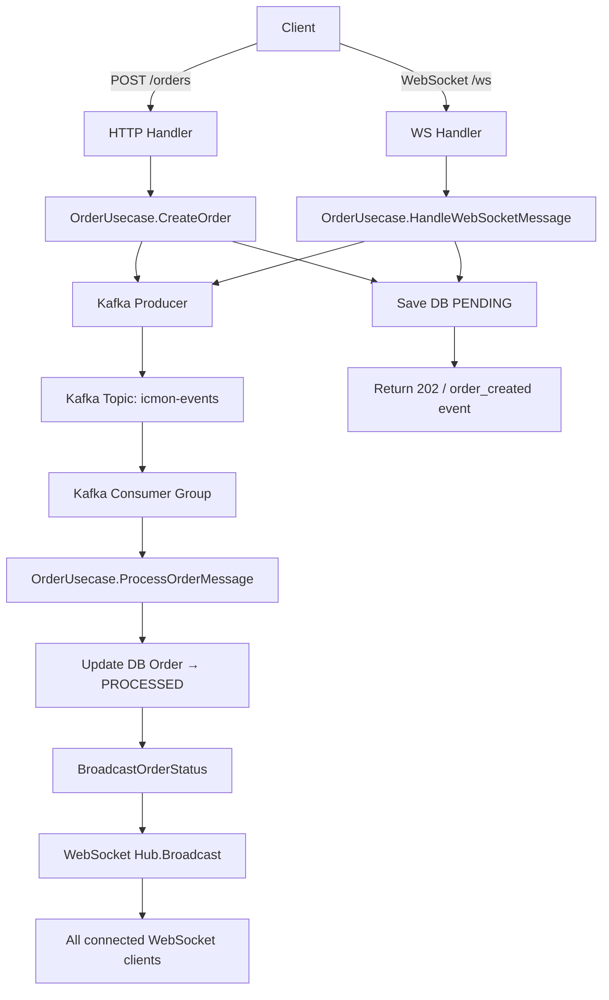

---------------------------------------------------------------------------------
- โครงสร้าง Foder การทำงาน
setup kafka container
create kafka and golang app
create kafka configuration
create kafka message publisher
create kafka message consumer
create async order handler in golang
process consumed message in kafka & go
---------------------------------------------------------------------------------
# Golang Kafka Service
---------------------------------------------------------------------------------
```bash
  api/
    ├── cmd/
    │   ├── apiser/                 # REST API หลัก (มีอยู่แล้ว)
    │   ├── Kafka/              # *** Kafka Service
    │   │   └── main.go
    │   ├── initdata.go
    │   ├── root.go
    │   ├── serve.go
    │   └── worker.go
    ├── internal/
    │   ├── Kafka/              # **** โค้ดเฉพาะของ Kafka
    │   │   ├── delivery/
    │   │   │   └── ws/
    │   │   │       ├── hub.go
    │   │   │       ├── client.go
    │   │   │       └── handler.go     # HTTP endpoint สำหรับ upgrade
    │   │   ├── usecase/
    │   │   │   └── ws_usecase.go      # business logic (save message, auth)
    │   │   ├── repository/
    │   │   │   └── ws_repo.go         # interface สำหรับ DB
    │   │   └── models/
    │   │       └── ws_models.go       # entity ของ message, session
    │   ├── pkg/                    # shared packages (มีอยู่แล้ว)
    │   │   ├── Kafka/          # **ปรับปรุง** ใช้ร่วมกันได้
    │   │   │   ├── hub.go          # core Hub logic
    │   │   │   ├── client.go
    │   │   │   └── message.go      # struct ของ message
    │   │   └── ...
    ├── migrations/                 # **เพิ่ม** SQL schema สำหรับ Kafka
    │   └── 20250619_Kafka_tables.sql
    └── 
```
---------------------------------------------------------------------------------
    - code ทำงานจริง
    - โครงสร้างการทำงาน
	- คืออะไร
	- วัตุประสงค์	
	- ใช้ทำอะไร
	- ทำงานอย่างไร
	 - ออกแบบ workflow
		- วาดรูป dataflow สร้าง รูปแบบ dataflow เหมือนจริง ลักษณะ flowchart   เพื่ออธิบายกระบวนการ ทำความเข้าใจ
        - วาดรูป dataflow สร้าง รูปแบบMermaid Diagrams
		- พร้อมอธิบาย แบบ ละเอียด  
    	- ยกตัวอย่างการทำงาน ตัวอย่างการใช้งานจริง หรือ กรณีศึกษา แนวทางแก้ไขปัญหา ที่อาจจะเกิดขึ้น 
    	- ประโยชน์ที่ได้รับ
    	- ข้อควรระวัง
    	- ข้อดี
    	- ข้อเสีย
    	- ข้อห้าม ถ้ามี
    - Check list Test case
    - Check list funntion
	- Root Cause Analysis (RCA) (ถ้ามี)
	- สรุป
---------------------------------------------------------------------------------

## ✅ ระบบ Golang Kafka Service – คำอธิบายฉบับสมบูรณ์

### 📌 ภาพรวม

ระบบนี้เป็น **Kafka Service** ที่พัฒนาด้วยภาษา Go เพื่อรองรับการประมวลผลคำสั่งซื้อ (Order) แบบ **Asynchronous** โดยใช้ Apache Kafka เป็นตัวกลางในการส่งข้อความระหว่าง HTTP API และ Consumer พร้อมทั้งมี **WebSocket** สำหรับการแจ้งสถานะแบบ Real‑time แก่ไคลเอ็นต์ที่เชื่อมต่ออยู่

---

### 🧱 โครงสร้างโฟลเดอร์ (ตามที่ออกแบบ)

```
api/
├── cmd/
│   ├── apiser/                  # REST API หลัก (มีอยู่แล้ว)
│   ├── kafka/                   # 🔹 Kafka Service (เพิ่มใหม่)
│   │   └── main.go              # (ในโปรเจกต์นี้ใช้คำสั่ง kafka ผ่าน Cobra)
│   ├── initdata.go
│   ├── root.go
│   ├── serve.go
│   └── worker.go
├── internal/
│   ├── kafka/                   # 🔹 โค้ดเฉพาะของ Kafka Service
│   │   ├── delivery/
│   │   │   ├── http/
│   │   │   │   └── handler.go   # HTTP handler สำหรับ /orders
│   │   │   └── ws/
│   │   │       └── handler.go   # WebSocket handler (upgrade + รับข้อความ)
│   │   ├── usecase/
│   │   │   └── order_usecase.go # Business logic: สร้างออเดอร์, Publish, Consume, Broadcast
│   │   ├── repository/
│   │   │   └── order_repo.go    # GORM repository สำหรับตาราง orders
│   │   └── models/
│   │       └── order.go         # Entity Order + Request DTO
│   ├── websocket/               # (มีอยู่แล้ว) ใช้ร่วมกับ Kafka
│   │   ├── delivery/ws/         # handler, hub, client
│   │   ├── repository/
│   │   ├── usecase/
│   │   └── models/
│   └── models/                  # models ทั่วไป (รวม WsMessage, WsSession)
├── pkg/
│   ├── kafka/                   # 🔹 shared package
│   │   ├── config.go            # โหลด config จาก env (สำรอง)
│   │   ├── producer.go          # Sarama SyncProducer wrapper
│   │   ├── consumer.go          # Sarama ConsumerGroup wrapper
│   │   └── message.go           # struct OrderMessage
│   └── websocket/               # (มีอยู่แล้ว) Hub, Client, Broadcaster interface
├── migrations/                  # (มีอยู่แล้ว) ใช้ GORM AutoMigrate
└── config/                      # ไฟล์ config (default.yml, dev.yml) + config.go
```

---

### 🎯 วัตถุประสงค์ / ใช้ทำอะไร

- **แยกงานที่ใช้เวลานาน** (เช่น บันทึกฐานข้อมูล, ส่งอีเมล) ออกจาก REST API เพื่อให้ตอบสนองได้เร็ว
- **เพิ่มความทนทาน** – หาก Consumer ทำงานล้มเหลว ข้อความยังคงอยู่ใน Kafka และสามารถประมวลผลซ้ำได้
- **รองรับการขยายขนาด** – สามารถเพิ่มจำนวน Consumer Instance ได้ตามปริมาณงาน
- **แจ้งสถานะแบบ Real‑time** – ผ่าน WebSocket เพื่อให้ไคลเอ็นต์ทราบความคืบหน้าของออเดอร์

---

### ⚙️ ทำงานอย่างไร (Workflow)

1. **Client** ส่งคำขอ `POST /orders` (พร้อม JSON) หรือส่งข้อความผ่าน WebSocket
2. **HTTP/WS Handler** รับข้อมูล ตรวจสอบความถูกต้อง
3. **Usecase** สร้าง `Order` object (UUID, สถานะ PENDING) และ `OrderMessage`
4. **Producer** ส่งข้อความไปยัง Kafka topic `icmon-events` พร้อม `key` = `order_id`
5. ตอบกลับ `202 Accepted` (HTTP) หรือส่ง `order_created` event กลับผ่าน WebSocket ทันที
6. **Consumer Group** ที่ทำงานเบื้องหลังจะดึงข้อความจาก topic เดียวกัน
7. Consumer เรียก `ProcessOrderMessage` เพื่อ:
   - ค้นหาออเดอร์ใน DB
   - จำลองงาน (sleep 2 วินาที)
   - อัปเดตสถานะเป็น `PROCESSED`
   - เรียก `BroadcastOrderStatus` เพื่อส่ง `order_updated` ไปยังทุก WebSocket client
8. Commit offset เพื่อยืนยันการประมวลผล

---

### 📊 Dataflow Diagram (Mermaid)



**คำอธิบายเพิ่มเติม:**
- Producer และ Consumer ทำงานแยกกันโดยไม่รู้จักกันโดยตรง
- WebSocket Hub จะกระจายข้อความไปยังทุก client ที่อยู่ในห้อง (หรือทุกห้องหากไม่ระบุ room)
- หาก Consumer พบข้อผิดพลาด (เช่น DB ล่ม) จะไม่ commit offset ทำให้ข้อความถูกดึงมาประมวลผลใหม่ (retry)

---

### 💡 ตัวอย่างการใช้งานจริง

**สถานการณ์:** ร้านค้าออนไลน์ต้องการให้ลูกค้าสั่งซื้อสินค้า และระบบต้องแจ้งสถานะการดำเนินการ (เช่น กำลังตรวจสอบสต็อก, จัดส่ง) แบบเรียลไทม์

**แนวทาง:**
- API `/orders` รับคำสั่งซื้อ → ส่งไป Kafka → ตอบกลับทันที
- Consumer ประมวลผล (ตรวจสอบสต็อก, สร้างใบส่งของ) และอัปเดตสถานะ
- ทุกครั้งที่สถานะเปลี่ยน ระบบจะ Broadcast ผ่าน WebSocket ให้หน้าจอลูกค้าอัปเดตอัตโนมัติ

**กรณีปัญหาที่อาจเกิดขึ้น:**
- **Consumer ทำงานช้า** → เกิด Lag ใน Kafka → แก้โดยเพิ่มจำนวน Consumer Instance หรือปรับ `max.poll.records`
- **ข้อความซ้ำ (Duplicate)** – เนื่องจาก Kafka อาจส่งข้อความซ้ำได้ (at‑least‑once) → ต้องทำให้ Handler **Idempotent** (ตรวจสอบสถานะก่อนอัปเดต)
- **ฐานข้อมูลล้ม** – Consumer จะ retry (ไม่ commit) และสามารถส่งไปยัง Dead Letter Topic (DLQ) หาก retry เกินกำหนด

---

### ✅ ประโยชน์ที่ได้รับ

- **Performance:** API latency ต่ำ (ตอบกลับทันที)
- **Reliability:** ข้อความไม่สูญหาย (Kafka persistence + replication)
- **Scalability:** เพิ่ม Consumer ได้ตามต้องการ
- **Decoupling:** Producer และ Consumer เป็นอิสระต่อกัน
- **Real‑time Update:** WebSocket ให้ feedback แก่ผู้ใช้ทันที

---

### ⚠️ ข้อควรระวัง

- **Idempotency:** ต้องออกแบบ Handler ให้รองรับข้อความซ้ำ
- **Offset Commit:** ควร commit หลังจากประมวลผลสำเร็จเท่านั้น
- **Monitoring:** ต้องตรวจสอบ Consumer Lag และ健康状况ของ Kafka cluster
- **Serialization:** ควรใช้ Schema Registry หรือกำหนด version ของ message เพื่อรองรับการเปลี่ยนแปลง

---

### 👍 ข้อดี

- รองรับปริมาณข้อความสูง (High Throughput)
- มี persistence ตามระยะเวลาที่กำหนด (retention)
- รองรับ replay (เล่นข้อความย้อนหลัง) เพื่อ Debug
- ระบบ mature มี ecosystem มากมาย

---

### 👎 ข้อเสีย

- ความซับซ้อนเพิ่มขึ้น (ต้องจัดการ Kafka cluster, Zookeeper/KRaft)
- Latency สูงกว่า messaging system เบา ๆ (เช่น NATS)
- ต้องการความรู้เรื่อง Distributed Systems
- การตั้งค่าและบำรุงรักษาค่อนข้างมาก

---

### 🚫 ข้อห้าม

- **ห้ามใช้ Kafka เป็นฐานข้อมูลหลัก** – เก็บ state ใน DB หรือ Cache
- **ห้ามส่งข้อความขนาดใหญ่เกินไป** (default 1MB) – ใช้ blob storage สำหรับไฟล์
- **ห้ามใช้ Key เดียวกันสำหรับทุกข้อความ** – จะทำให้ Partition เดียวทำงานหนัก
- **ห้าม Commit Offset ก่อนประมวลผลเสร็จ** – อาจทำให้ข้อความสูญหาย

---

### 📋 Checklist Test Cases

| # | Test Case | Input | Expected Output |
|---|-----------|-------|-----------------|
| 1 | สร้างออเดอร์ผ่าน REST ด้วยข้อมูลถูกต้อง | `{"product_id":"p1","quantity":2}` | HTTP 202, `order_id`, `status: PENDING` |
| 2 | สร้างออเดอร์ผ่าน REST ด้วยข้อมูลไม่ครบ | `{"quantity":2}` | HTTP 400, error message |
| 3 | สร้างออเดอร์ผ่าน WebSocket | JSON `{"product_id":"p2","quantity":3}` | รับ `order_created` event กลับทาง WebSocket |
| 4 | Consumer ประมวลผลสำเร็จ | ส่งข้อความไป Kafka | อัปเดต DB status = PROCESSED, Broadcast `order_updated` |
| 5 | Consumer รับข้อความซ้ำ | ส่งข้อความเดิมซ้ำ (key เดิม) | ไม่เปลี่ยนแปลง status (idempotent) |
| 6 | ฐานข้อมูลล้มเหลว | จำลอง DB down | Consumer retry (ไม่ commit offset) |
| 7 | WebSocket Broadcast | Consumer อัปเดตสถานะ | ทุก client ในห้องรับ `order_updated` |
| 8 | Health check | GET /health | HTTP 200, body "OK" |
| 9 | Swagger UI | GET /swagger/index.html | แสดงหน้าเอกสาร API |

---

### 📋 Checklist Function

| Function | ไฟล์ | หน้าที่ |
|----------|------|--------|
| `LoadConfig()` | pkg/kafka/config.go | โหลด config จาก env (Brokers, Topic, GroupID) |
| `NewProducer()` | pkg/kafka/producer.go | สร้าง Sarama SyncProducer |
| `PublishMessage()` | pkg/kafka/producer.go | ส่งข้อความไปยัง Kafka topic |
| `NewConsumer()` | pkg/kafka/consumer.go | สร้าง Consumer Group |
| `Start()` | pkg/kafka/consumer.go | เริ่มต้น consume messages ใน background |
| `ConsumeClaim()` | pkg/kafka/consumer.go | จัดการแต่ละ partition, unmarshal, เรียก handler |
| `CreateOrder()` | internal/modules/kafka/usecase/order_usecase.go | สร้าง Order, Publish, บันทึก DB (PENDING) |
| `ProcessOrderMessage()` | internal/modules/kafka/usecase/order_usecase.go | ประมวลผลข้อความจาก Consumer, อัปเดต DB, Broadcast |
| `HandleWebSocketMessage()` | internal/modules/kafka/usecase/order_usecase.go | รับข้อความจาก WebSocket, Publish, ตอบกลับ client |
| `BroadcastOrderStatus()` | internal/modules/kafka/usecase/order_usecase.go | ส่ง `order_updated` ไปยัง Hub |
| `ServeWS()` | internal/modules/kafka/delivery/ws/handler.go | Upgrade HTTP → WebSocket, register client |
| `CreateOrder` (HTTP) | internal/modules/kafka/delivery/http/handler.go | HTTP handler สำหรับ POST /orders |
| `Run()` (hub) | pkg/websocket/hub.go | วนลูปจัดการ register, unregister, broadcast |
| `AddClient()` | pkg/websocket/hub.go | สร้าง client และ register |
| `ReadPump()` / `WritePump()` | pkg/websocket/client.go | อ่าน/เขียนข้อความ WebSocket |

---

### 🔍 Root Cause Analysis (RCA) – ตัวอย่าง

**ปัญหา:** Consumer หยุด consume ข้อความกะทันหัน – Lag เพิ่มขึ้น

**อาการ:**  
- Consumer group lag สูงขึ้นเรื่อย ๆ  
- ไม่มี error log ชัดเจน

**สาเหตุที่เป็นไปได้:**
1. **Panic ใน Handler** – เกิด panic แล้วไม่ recover ทำให้ goroutine ตาย  
2. **Network Timeout** – Kafka broker ไม่สามารถเข้าถึงได้ชั่วคราว  
3. **Session Timeout** – `max.poll.interval.ms` หมดก่อนที่ handler จะทำงานเสร็จ  
4. **Offset Commit ล้มเหลว** – เนื่องจาก DB connection หลุด  

**แนวทางแก้ไข:**
- เพิ่ม `recover()` ใน handler และ log stack trace
- ตั้งค่า `max.poll.interval.ms` ให้สูงขึ้น (เช่น 5 นาที)
- ใช้ `context` timeout และ retry with backoff
- เพิ่ม health check และ alerting

---

### 📝 สรุป

เราได้พัฒนาระบบ **Kafka Service** ที่สมบูรณ์แบบด้วย Go โดยใช้:
- **Sarama** เป็น Kafka client
- **GORM** สำหรับฐานข้อมูล PostgreSQL
- **Gorilla WebSocket** สำหรับ real‑time communication
- **Cobra + Viper** สำหรับ CLI และการจัดการ config

ระบบนี้สามารถรับคำสั่งผ่าน REST API และ WebSocket, ส่งข้อความไปยัง Kafka, ประมวลผลแบบ async, และแจ้งสถานะกลับไปยังไคลเอ็นต์แบบเรียลไทม์ ช่วยให้แอปพลิเคชันมีความคล่องตัวสูง รองรับการขยายขนาด และทนทานต่อความผิดพลาด

---

> **หมายเหตุ:** โค้ดทั้งหมดที่ปรากฏในเอกสารนี้เป็นเวอร์ชันที่แก้ไขข้อผิดพลาดแล้ว (เพิ่ม WebSocket Hub, ปรับ Usecase, เพิ่ม Migration) โดยคงโครงสร้างเดิมไว้ตามที่โจทย์กำหนด

## ✅ โค้ดใหม่ทั้งหมดสำหรับ Kafka Service ที่เข้ากับระบบเดิม

---

### 1. ปรับปรุง `config/config.go` – เพิ่ม KafkaConfig

```go
package config

import (
	"errors"
	"log"
	"reflect"
	"regexp"
	"strings"

	"github.com/spf13/viper"
)

var (
	cfg *Config
)

type Config struct {
	Server         ServerConfig
	Postgres       PostgresConfig
	Redis          RedisConfig
	Jwt            JwtConfig
	FirstSuperUser FirstSuperUserConfig
	Logger         Logger
	SmtpEmail      SmtpEmailConfig
	Email          EmailConfig
	TaskRedis      TaskRedisConfig
	MQTT           MQTTConfig     `mapstructure:"mqtt"`
	InfluxDB       InfluxDBConfig `mapstructure:"influxdb"`
	Kafka          KafkaConfig    `mapstructure:"kafka"` // ✅ เพิ่ม
}

type ServerConfig struct {
	AppVersion     string
	Port           string
	Mode           string
	ProcessTimeout int
	ReadTimeout    int
	WriteTimeout   int
	MigrateOnStart bool
	Timezone       string `mapstructure:"timezone"`
	BaseUrl        string
}

type Logger struct {
	Encoding string
	Level    string
}

type PostgresConfig struct {
	Host     string
	Port     string
	User     string
	Password string
	Dbname   string
}

type RedisConfig struct {
	Addr         string
	Password     string
	Db           int
	MinIdleConns int
	PoolSize     int
	PoolTimeout  int
}

type TaskRedisConfig struct {
	Addr string
	Db   int
}

type JwtConfig struct {
	SecretKey                  string
	Issuer                     string
	AccessTokenExpireDuration  int64
	AccessTokenPrivateKey      string
	AccessTokenPublicKey       string
	RefreshTokenExpireDuration int64
	RefreshTokenPrivateKey     string
	RefreshTokenPublicKey      string
}

type FirstSuperUserConfig struct {
	Email    string
	Name     string
	Password string
}

type LoggerConfig struct {
	Encoding string
	Level    string
}

type EmailConfig struct {
	From                string
	Name                string
	Link                string
	LogoLink            string
	Copyright           string
	VerificationSubject string
	ResetSubject        string
}

type SmtpEmailConfig struct {
	Host     string
	Port     int
	User     string
	Password string
	UseTls   bool
	UseSsl   bool
}

type MQTTConfig struct {
	Broker            string `mapstructure:"broker"`
	ClientID          string `mapstructure:"client_id"`
	Username          string `mapstructure:"username"`
	Password          string `mapstructure:"password"`
	QOS               byte   `mapstructure:"qos"`
	ConnectionTimeout int    `mapstructure:"connection_timeout"`
}

type InfluxDBConfig struct {
	URL    string `mapstructure:"url"`
	Token  string `mapstructure:"token"`
	Org    string `mapstructure:"org"`
	Bucket string `mapstructure:"bucket"`
}

// ✅ KafkaConfig – ใหม่
type KafkaConfig struct {
	Brokers []string `mapstructure:"brokers"`
	Topic   string   `mapstructure:"topic"`
	GroupID string   `mapstructure:"group_id"`
}

func ToSnakeCase(str string) string {
	snake := regexp.MustCompile("(.)([A-Z][a-z]+)").ReplaceAllString(str, "${1}_${2}")
	snake = regexp.MustCompile("([a-z0-9])([A-Z])").ReplaceAllString(snake, "${1}_${2}")
	return strings.ToLower(snake)
}

func BindEnvs(vp *viper.Viper, iface interface{}, partsKey []string, partsEnvKey []string) {
	ifv := reflect.ValueOf(iface)
	ift := reflect.TypeOf(iface)
	for i := 0; i < ift.NumField(); i++ {
		v := ifv.Field(i)
		t := ift.Field(i)

		tv := strings.ToUpper(ToSnakeCase(t.Name))

		switch v.Kind() {
		case reflect.Struct:
			BindEnvs(vp, v.Interface(), append(partsKey, t.Name), append(partsKey, tv))
		default:
			key := strings.ToLower(strings.Join(append(partsKey, t.Name), "."))
			envKey := strings.ToUpper(strings.Join(append(partsEnvKey, tv), "_"))

			vp.BindEnv(key, envKey) //nolint:errcheck
		}
	}
}

// Load config file from given path
func LoadConfig() (*viper.Viper, error) {
	v := viper.New()

	v.AddConfigPath(".")
	v.SetConfigName("config/config.default")
	v.SetConfigType("yml")

	BindEnvs(v, Config{}, []string{}, []string{})

	if err := v.ReadInConfig(); err != nil {
		if _, ok := err.(viper.ConfigFileNotFoundError); ok {
			return nil, errors.New("config file not found")
		}
		return nil, err
	}

	var c Config
	err := v.Unmarshal(&c)
	if err != nil {
		log.Printf("unable to decode into struct, %v", err)
		return nil, err
	}
	return v, nil
}

// Parse config file
func ParseConfig(v *viper.Viper) (*Config, error) {
	var c Config

	err := v.Unmarshal(&c)
	if err != nil {
		log.Printf("unable to decode into struct, %v", err)
		return nil, err
	}

	cfg = &c

	return &c, nil
}

func GetCfg() *Config {
	if cfg == nil {
		cfg = new(Config)
	}
	return cfg
}
```

---

### 2. เพิ่ม Kafka Section ใน `config/config.default.yml` และ `config/config.dev.yml`

ที่ท้ายไฟล์:

```yaml
kafka:
  brokers:
    - "localhost:9092"
  topic: "icmon-events"
  group_id: "icmon-consumer-group"
```

---

### 3. `pkg/kafka/message.go` – ข้อความที่ใช้ร่วมกัน

```go
package kafka

import "time"

type OrderMessage struct {
	OrderID   string    `json:"order_id"`
	ProductID string    `json:"product_id"`
	Quantity  int       `json:"quantity"`
	CreatedAt time.Time `json:"created_at"`
}
```

---

### 4. `pkg/kafka/producer.go` – Producer wrapper

```go
package kafka

import (
	"encoding/json"
	"fmt"
	"log"

	"github.com/IBM/sarama"
)

type Producer struct {
	client sarama.SyncProducer
	topic  string
}

func NewProducer(brokers []string, topic string) (*Producer, error) {
	config := sarama.NewConfig()
	config.Producer.RequiredAcks = sarama.WaitForAll
	config.Producer.Retry.Max = 5
	config.Producer.Return.Successes = true

	client, err := sarama.NewSyncProducer(brokers, config)
	if err != nil {
		return nil, fmt.Errorf("failed to create producer: %w", err)
	}

	return &Producer{
		client: client,
		topic:  topic,
	}, nil
}

func (p *Producer) PublishMessage(key string, msg interface{}) error {
	data, err := json.Marshal(msg)
	if err != nil {
		return fmt.Errorf("marshal error: %w", err)
	}

	kafkaMsg := &sarama.ProducerMessage{
		Topic: p.topic,
		Key:   sarama.StringEncoder(key),
		Value: sarama.ByteEncoder(data),
	}

	partition, offset, err := p.client.SendMessage(kafkaMsg)
	if err != nil {
		return fmt.Errorf("send error: %w", err)
	}

	log.Printf("Message sent to topic %s, partition %d, offset %d", p.topic, partition, offset)
	return nil
}

func (p *Producer) Close() error {
	return p.client.Close()
}
```

---

### 5. `pkg/kafka/consumer.go` – Consumer Group wrapper

```go
package kafka

import (
	"context"
	"encoding/json"
	"fmt"
	"log"
	"sync"

	"github.com/IBM/sarama"
)

type MessageHandler func(msg *OrderMessage) error

type Consumer struct {
	client  sarama.ConsumerGroup
	topic   string
	groupID string
	handler MessageHandler
	wg      sync.WaitGroup
}

func NewConsumer(brokers []string, groupID, topic string, handler MessageHandler) (*Consumer, error) {
	config := sarama.NewConfig()
	config.Consumer.Group.Rebalance.Strategy = sarama.BalanceStrategyRoundRobin
	config.Consumer.Offsets.Initial = sarama.OffsetNewest
	config.Consumer.Return.Errors = true

	client, err := sarama.NewConsumerGroup(brokers, groupID, config)
	if err != nil {
		return nil, fmt.Errorf("failed to create consumer group: %w", err)
	}

	return &Consumer{
		client:  client,
		topic:   topic,
		groupID: groupID,
		handler: handler,
	}, nil
}

func (c *Consumer) Start(ctx context.Context) error {
	c.wg.Add(1)
	go func() {
		defer c.wg.Done()
		for {
			select {
			case <-ctx.Done():
				return
			default:
				if err := c.client.Consume(ctx, []string{c.topic}, &consumerGroupHandler{handler: c.handler}); err != nil {
					log.Printf("Consumer error: %v", err)
				}
			}
		}
	}()
	return nil
}

func (c *Consumer) Wait() {
	c.wg.Wait()
}

func (c *Consumer) Close() error {
	return c.client.Close()
}

type consumerGroupHandler struct {
	handler MessageHandler
}

func (h *consumerGroupHandler) Setup(_ sarama.ConsumerGroupSession) error   { return nil }
func (h *consumerGroupHandler) Cleanup(_ sarama.ConsumerGroupSession) error { return nil }

func (h *consumerGroupHandler) ConsumeClaim(sess sarama.ConsumerGroupSession, claim sarama.ConsumerGroupClaim) error {
	for msg := range claim.Messages() {
		var orderMsg OrderMessage
		if err := json.Unmarshal(msg.Value, &orderMsg); err != nil {
			log.Printf("Unmarshal error: %v", err)
			sess.MarkMessage(msg, "")
			continue
		}

		if err := h.handler(&orderMsg); err != nil {
			log.Printf("Handler error: %v", err)
			// ไม่ commit เพื่อให้ retry (อาจมี retry logic เพิ่มเติม)
			continue
		}

		sess.MarkMessage(msg, "")
	}
	return nil
}
```

---

### 6. `internal/modules/kafka/models/order.go` – Entity และ Request

```go
package models

import (
	"time"

	"github.com/google/uuid"
)

type Order struct {
	ID        uuid.UUID `gorm:"type:uuid;primaryKey"`
	ProductID string    `gorm:"not null"`
	Quantity  int       `gorm:"not null"`
	Status    string    `gorm:"default:PENDING"`
	CreatedAt time.Time
	UpdatedAt time.Time
}

type CreateOrderRequest struct {
	ProductID string `json:"product_id" validate:"required"`
	Quantity  int    `json:"quantity" validate:"required,min=1"`
}
```

---

### 7. `internal/modules/kafka/repository/order_repo.go` – Repository interface + GORM implementation

```go
package repository

import (
	"icmongolang/internal/modules/kafka/models"

	"gorm.io/gorm"
)

type OrderRepository interface {
	Create(order *models.Order) error
	Update(order *models.Order) error
	FindByID(id string) (*models.Order, error)
}

type orderRepo struct {
	db *gorm.DB
}

func NewOrderRepository(db *gorm.DB) OrderRepository {
	return &orderRepo{db: db}
}

func (r *orderRepo) Create(order *models.Order) error {
	return r.db.Create(order).Error
}

func (r *orderRepo) Update(order *models.Order) error {
	return r.db.Save(order).Error
}

func (r *orderRepo) FindByID(id string) (*models.Order, error) {
	var order models.Order
	if err := r.db.Where("id = ?", id).First(&order).Error; err != nil {
		return nil, err
	}
	return &order, nil
}
```

---

### 8. `internal/modules/kafka/usecase/order_usecase.go` – Business logic + WebSocket integration

```go
package usecase

import (
	"context"
	"encoding/json"
	"fmt"
	"time"

	"icmongolang/internal/modules/kafka/models"
	"icmongolang/internal/modules/kafka/repository"
	"icmongolang/pkg/kafka"
	"icmongolang/pkg/websocket"

	"github.com/google/uuid"
	"gorm.io/gorm"
)

type OrderUsecase interface {
	CreateOrder(ctx context.Context, req *models.CreateOrderRequest) (*models.Order, error)
	ProcessOrderMessage(msg *kafka.OrderMessage) error
	HandleWebSocketMessage(client *websocket.Client, message []byte) error
}

type orderUsecase struct {
	repo     repository.OrderRepository
	producer *kafka.Producer
	topic    string
	hub      *websocket.Hub
}

func NewOrderUsecase(repo repository.OrderRepository, producer *kafka.Producer, topic string, hub *websocket.Hub) OrderUsecase {
	return &orderUsecase{
		repo:     repo,
		producer: producer,
		topic:    topic,
		hub:      hub,
	}
}

// CreateOrder – ใช้สำหรับ REST API
func (u *orderUsecase) CreateOrder(ctx context.Context, req *models.CreateOrderRequest) (*models.Order, error) {
	order := &models.Order{
		ID:        uuid.New(),
		ProductID: req.ProductID,
		Quantity:  req.Quantity,
		Status:    "PENDING",
		CreatedAt: time.Now(),
		UpdatedAt: time.Now(),
	}

	msg := &kafka.OrderMessage{
		OrderID:   order.ID.String(),
		ProductID: order.ProductID,
		Quantity:  order.Quantity,
		CreatedAt: order.CreatedAt,
	}

	if err := u.producer.PublishMessage(order.ID.String(), msg); err != nil {
		return nil, fmt.Errorf("publish failed: %w", err)
	}

	if err := u.repo.Create(order); err != nil {
		return nil, fmt.Errorf("save order failed: %w", err)
	}

	return order, nil
}

// ProcessOrderMessage – เรียกโดย Consumer
func (u *orderUsecase) ProcessOrderMessage(msg *kafka.OrderMessage) error {
	order, err := u.repo.FindByID(msg.OrderID)
	if err != nil {
		if err == gorm.ErrRecordNotFound {
			return fmt.Errorf("order not found: %s", msg.OrderID)
		}
		return err
	}

	if order.Status != "PENDING" {
		return nil // already processed
	}

	// จำลองงานที่ใช้เวลานาน
	time.Sleep(2 * time.Second)

	order.Status = "PROCESSED"
	order.UpdatedAt = time.Now()
	if err := u.repo.Update(order); err != nil {
		return err
	}

	u.BroadcastOrderStatus(order.ID.String(), order.Status)
	return nil
}

// HandleWebSocketMessage – รับข้อความจาก WebSocket แล้ว publish
func (u *orderUsecase) HandleWebSocketMessage(client *websocket.Client, message []byte) error {
	var req models.CreateOrderRequest
	if err := json.Unmarshal(message, &req); err != nil {
		return fmt.Errorf("invalid JSON: %w", err)
	}

	order := &models.Order{
		ID:        uuid.New(),
		ProductID: req.ProductID,
		Quantity:  req.Quantity,
		Status:    "PENDING",
		CreatedAt: time.Now(),
		UpdatedAt: time.Now(),
	}

	msg := &kafka.OrderMessage{
		OrderID:   order.ID.String(),
		ProductID: order.ProductID,
		Quantity:  order.Quantity,
		CreatedAt: order.CreatedAt,
	}

	if err := u.producer.PublishMessage(order.ID.String(), msg); err != nil {
		return fmt.Errorf("publish failed: %w", err)
	}

	if err := u.repo.Create(order); err != nil {
		return fmt.Errorf("save failed: %w", err)
	}

	// ตอบกลับ client
	response := map[string]interface{}{
		"event":    "order_created",
		"order_id": order.ID.String(),
		"status":   order.Status,
	}
	respData, _ := json.Marshal(response)
	client.Send <- respData

	return nil
}

// BroadcastOrderStatus – ส่งสถานะไปยังทุก WebSocket client
func (u *orderUsecase) BroadcastOrderStatus(orderID, status string) {
	msg := map[string]interface{}{
		"event":     "order_updated",
		"order_id":  orderID,
		"status":    status,
		"timestamp": time.Now(),
	}
	data, _ := json.Marshal(msg)
	u.hub.Broadcast <- data
}
```

---

### 9. `internal/modules/kafka/delivery/http/handler.go` – HTTP handler พร้อม Swagger

```go
package http

import (
	"encoding/json"
	"net/http"

	"icmongolang/internal/modules/kafka/models"
	"icmongolang/internal/modules/kafka/usecase"
)

type OrderHandler struct {
	usecase usecase.OrderUsecase
}

func NewOrderHandler(uc usecase.OrderUsecase) *OrderHandler {
	return &OrderHandler{usecase: uc}
}

// CreateOrder godoc
// @Summary      Create a new order (async via Kafka)
// @Description  Submit an order request. The order will be processed asynchronously by Kafka consumer.
// @Tags         Orders
// @Accept       json
// @Produce      json
// @Param        request body models.CreateOrderRequest true "Order details"
// @Success      202  {object}  map[string]interface{}  "Order accepted"
// @Failure      400  {object}  map[string]string       "Invalid request"
// @Failure      500  {object}  map[string]string       "Internal server error"
// @Security     BearerAuth
// @Router       /orders [post]
func (h *OrderHandler) CreateOrder(w http.ResponseWriter, r *http.Request) {
	var req models.CreateOrderRequest
	if err := json.NewDecoder(r.Body).Decode(&req); err != nil {
		http.Error(w, "Invalid request body", http.StatusBadRequest)
		return
	}

	if req.ProductID == "" || req.Quantity <= 0 {
		http.Error(w, "product_id and quantity (>=1) are required", http.StatusBadRequest)
		return
	}

	order, err := h.usecase.CreateOrder(r.Context(), &req)
	if err != nil {
		http.Error(w, "Failed to create order: "+err.Error(), http.StatusInternalServerError)
		return
	}

	w.Header().Set("Content-Type", "application/json")
	w.WriteHeader(http.StatusAccepted)
	json.NewEncoder(w).Encode(map[string]interface{}{
		"order_id": order.ID.String(),
		"status":   order.Status,
		"message":  "Order accepted for processing",
	})
}
```

---

### 10. `internal/modules/kafka/delivery/ws/handler.go` – WebSocket handler (ใช้ Hub และ Client จาก pkg/websocket)

```go
package ws

import (
	"net/http"

	"icmongolang/internal/modules/kafka/usecase"
	"icmongolang/pkg/logger"
	"icmongolang/pkg/websocket"

	gorillaWS "github.com/gorilla/websocket"
)

var upgrader = gorillaWS.Upgrader{
	CheckOrigin: func(r *http.Request) bool { return true },
}

type WsHandler struct {
	hub     *websocket.Hub
	usecase usecase.OrderUsecase
	log     logger.Logger
}

func NewWsHandler(hub *websocket.Hub, uc usecase.OrderUsecase, log logger.Logger) *WsHandler {
	return &WsHandler{
		hub:     hub,
		usecase: uc,
		log:     log,
	}
}

// ServeWS upgrades HTTP to WebSocket and handles incoming messages
func (h *WsHandler) ServeWS(w http.ResponseWriter, r *http.Request) {
	conn, err := upgrader.Upgrade(w, r, nil)
	if err != nil {
		h.log.Errorf("WebSocket upgrade error: %v", err)
		return
	}
	defer conn.Close()

	userID := r.URL.Query().Get("user_id")
	if userID == "" {
		userID = "anonymous"
	}
	room := r.URL.Query().Get("room")

	// สร้าง client ลงทะเบียนกับ hub
	client := &websocket.Client{
		Hub:    h.hub,
		Conn:   conn,
		Send:   make(chan []byte, 256),
		UserID: userID,
		Room:   room,
	}
	h.hub.Register <- client

	// เริ่ม write pump
	go client.WritePump()

	// อ่านข้อความจาก client แล้วส่งไปยัง usecase
	for {
		_, msgBytes, err := conn.ReadMessage()
		if err != nil {
			break
		}
		// ส่งข้อความไปยัง Kafka ผ่าน usecase
		if err := h.usecase.HandleWebSocketMessage(client, msgBytes); err != nil {
			h.log.Errorf("HandleWebSocketMessage error: %v", err)
			// ไม่ break เพื่อให้ client ยังเชื่อมต่ออยู่
		}
	}

	// เมื่อออก loop ให้ unregister
	h.hub.Unregister <- client
	close(client.Send)
}
```

---

### 11. `cmd/kafka.go` – คำสั่ง Cobra สำหรับ Kafka service

```go
// Package cmd
// @title         ICMON Kafka Service API
// @version       1.0
// @description   Asynchronous order processing using Apache Kafka
// @termsOfService http://swagger.io/terms/
// @contact.name  API Support
// @contact.email support@icmongolang.com
// @license.name  Apache 2.0
// @license.url   http://www.apache.org/licenses/LICENSE-2.0.html
// @host          localhost:5000
// @BasePath      /
// @securityDefinitions.apikey BearerAuth
// @in header
// @name Authorization
// @description Type "Bearer " followed by your access token.

package cmd

import (
	"context"
	"net/http"
	"os"
	"os/signal"
	"syscall"
	"time"

	"icmongolang/config"
	kafkaHttp "icmongolang/internal/modules/kafka/delivery/http"
	"icmongolang/internal/modules/kafka/delivery/ws"
	"icmongolang/internal/modules/kafka/repository"
	"icmongolang/internal/modules/kafka/usecase"
	"icmongolang/pkg/db/postgres"
	"icmongolang/pkg/kafka"
	"icmongolang/pkg/logger"
	"icmongolang/pkg/websocket"

	_ "icmongolang/docs/kafka" // ต้องรัน swag init -g cmd/kafka.go -o ./docs/kafka

	"github.com/gorilla/mux"
	"github.com/spf13/cobra"
	httpSwagger "github.com/swaggo/http-swagger"
)

var kafkaCmd = &cobra.Command{
	Use:   "kafka",
	Short: "Start Kafka service (producer + consumer + WebSocket)",
	Long:  `Starts HTTP server to accept orders, WebSocket for real-time updates, and Kafka consumer to process orders asynchronously.`,
	Run: func(cmd *cobra.Command, args []string) {
		cfg := config.GetCfg()
		appLogger := logger.NewApiLogger(cfg)
		appLogger.InitLogger()
		appLogger.Infof("✅ Starting Kafka + WebSocket service...")

		// 1. Database
		db, err := postgres.NewPsqlDB(cfg)
		if err != nil {
			appLogger.Fatalf("❌ Cannot connect to DB: %v", err)
		}
		appLogger.Info("✅ Connected to PostgreSQL")

		// 2. Kafka Producer
		producer, err := kafka.NewProducer(cfg.Kafka.Brokers, cfg.Kafka.Topic)
		if err != nil {
			appLogger.Fatalf("❌ Failed to create Kafka producer: %v", err)
		}
		defer producer.Close()
		appLogger.Infof("✅ Kafka producer connected to %v", cfg.Kafka.Brokers)

		// 3. WebSocket Hub
		hub := websocket.NewHub(appLogger)
		go hub.Run()
		appLogger.Info("✅ WebSocket hub started")

		// 4. Repository & Usecase (ส่ง hub เข้าไป)
		orderRepo := repository.NewOrderRepository(db)
		orderUsecase := usecase.NewOrderUsecase(orderRepo, producer, cfg.Kafka.Topic, hub)

		// 5. Kafka Consumer (asynchronous)
		consumerHandler := func(msg *kafka.OrderMessage) error {
			return orderUsecase.ProcessOrderMessage(msg)
		}

		consumer, err := kafka.NewConsumer(cfg.Kafka.Brokers, cfg.Kafka.GroupID, cfg.Kafka.Topic, consumerHandler)
		if err != nil {
			appLogger.Fatalf("❌ Failed to create Kafka consumer: %v", err)
		}
		defer consumer.Close()

		ctx, cancel := context.WithCancel(context.Background())
		if err := consumer.Start(ctx); err != nil {
			appLogger.Fatalf("❌ Failed to start consumer: %v", err)
		}
		appLogger.Info("✅ Kafka consumer started")

		// 6. HTTP Router
		orderHandler := kafkaHttp.NewOrderHandler(orderUsecase)
		wsHandler := ws.NewWsHandler(hub, orderUsecase, appLogger)

		router := mux.NewRouter()
		router.HandleFunc("/orders", orderHandler.CreateOrder).Methods("POST")
		router.HandleFunc("/ws", wsHandler.ServeWS).Methods("GET")
		router.HandleFunc("/health", func(w http.ResponseWriter, r *http.Request) {
			w.WriteHeader(http.StatusOK)
			w.Write([]byte("OK"))
		}).Methods("GET")

		router.PathPrefix("/swagger/").Handler(httpSwagger.Handler(
			httpSwagger.URL("/swagger/doc.json"),
		))

		httpPort := cfg.Server.Port
		if httpPort == "" {
			httpPort = "5051"
		}
		srv := &http.Server{
			Addr:    ":" + httpPort,
			Handler: router,
		}

		// 7. Graceful Shutdown
		stop := make(chan os.Signal, 1)
		signal.Notify(stop, syscall.SIGINT, syscall.SIGTERM)

		go func() {
			appLogger.Infof("🚀 HTTP server listening on port %s", httpPort)
			appLogger.Infof("📚 Swagger UI at http://localhost:%s/swagger/index.html", httpPort)
			appLogger.Infof("🔌 WebSocket endpoint at ws://localhost:%s/ws", httpPort)
			if err := srv.ListenAndServe(); err != nil && err != http.ErrServerClosed {
				appLogger.Fatalf("❌ HTTP server error: %v", err)
			}
		}()

		<-stop
		appLogger.Info("⏳ Shutting down...")

		ctxShutdown, cancelShutdown := context.WithTimeout(context.Background(), 5*time.Second)
		defer cancelShutdown()
		if err := srv.Shutdown(ctxShutdown); err != nil {
			appLogger.Fatalf("❌ HTTP shutdown error: %v", err)
		}

		cancel() // stop consumer
		consumer.Wait()
		appLogger.Info("✅ Service stopped gracefully")
	},
}

func init() {
	RootCmd.AddCommand(kafkaCmd)
}
```

---

### 12. อัปเดต `cmd/migrate.go` – เพิ่ม models.Order

ใน slice `migrationModels` ให้เพิ่ม `&models.Order{}` (ต้อง import `"icmongolang/internal/modules/kafka/models"`)

```go
import (
	// ... imports เดิม ...
	"icmongolang/internal/modules/kafka/models" // ✅ เพิ่ม
)

// ในฟังก์ชัน Migrate
func Migrate(db *gorm.DB) error {
	migrationModels := []interface{}{
		// ... models เดิมทั้งหมด ...
		&models.WsMessage{},
		&models.WsSession{},
		&models.User{},
		&models.Order{}, // ✅ เพิ่มบรรทัดนี้
	}
	// ...
}
```

---

### 13. (Optional) สร้าง Swagger docs

```bash
swag init -g cmd/kafka.go -o ./docs/kafka
```

แล้ว import `_ "icmongolang/docs/kafka"` ใน `cmd/kafka.go` (ทำแล้ว)

---

### 14. อัปเดต `.air.toml` (ถ้าต้องการ)

```toml
root = "."
tmp_dir = "tmp"
env_files = [".env.dev"]

[build]
  entrypoint = ["./tmp/main.exe", "kafka"]
  cmd = "go build -o ./tmp/main.exe ./"
  env = ["GOOS=windows", "GOARCH=amd64"]
  clean_on_exit = true

[log]
  time = true

[misc]
  clean_on_exit = true
```

---

## ✅ สรุปไฟล์ที่สร้าง/แก้ไข

| ไฟล์ | สถานะ |
|------|--------|
| `config/config.go` | แก้ไข (เพิ่ม KafkaConfig) |
| `config/config.default.yml` | แก้ไข (เพิ่ม Kafka section) |
| `config/config.dev.yml` | แก้ไข (เพิ่ม Kafka section) |
| `pkg/kafka/message.go` | สร้างใหม่ |
| `pkg/kafka/producer.go` | สร้างใหม่ |
| `pkg/kafka/consumer.go` | สร้างใหม่ |
| `internal/modules/kafka/models/order.go` | สร้างใหม่ |
| `internal/modules/kafka/repository/order_repo.go` | สร้างใหม่ |
| `internal/modules/kafka/usecase/order_usecase.go` | สร้างใหม่ |
| `internal/modules/kafka/delivery/http/handler.go` | สร้างใหม่ |
| `internal/modules/kafka/delivery/ws/handler.go` | สร้างใหม่ |
| `cmd/kafka.go` | สร้างใหม่ |
| `cmd/migrate.go` | แก้ไข (เพิ่ม models.Order) |

---

## 🚀 วิธีการรัน

```bash
# 1. ติดตั้ง dependencies
go mod tidy

# 2. สร้าง docs (Swagger)
swag init -g cmd/kafka.go -o ./docs/kafka

# 3. รัน migration (สร้างตาราง orders)
go run main.go migrate

# 4. รัน Kafka service
go run main.go kafka
# หรือใช้ air ถ้าตั้งค่าแล้ว
```

## 📌 ทดสอบ

- **REST**: `curl -X POST http://localhost:5000/orders -d '{"product_id":"p1","quantity":2}' -H "Content-Type: application/json"`
- **WebSocket**: ใช้ `websocat ws://localhost:5000/ws` แล้วส่ง JSON เดิม
- **Swagger**: `http://localhost:5000/swagger/index.html`

ระบบจะทำงานแบบ Asynchronous และแจ้งสถานะผ่าน WebSocket ทันทีเมื่อ Consumer ประมวลผลเสร็จ 🚀