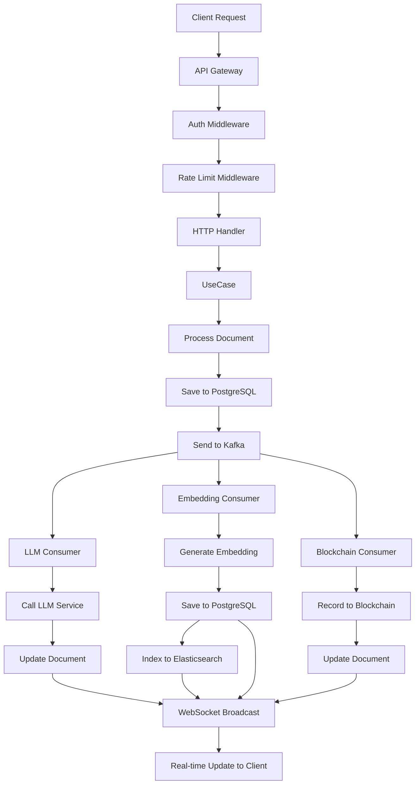

# เอกสาร Module XXX (ฉบับสมบูรณ์)
## ระบบประมวลผลเอกสารอัจฉริยะด้วย Clean Architecture + DDD

---

> **เป้าหมาย:**  
> การออกแบบซอฟต์แวร์ด้วย Clean Architecture (โดย Robert C. Martin) และ Domain-Driven Design (DDD) เพื่อแยก Business Logic ออกจากเทคโนโลยีภายนอก (Database, UI, Kafka, ฯลฯ) และจำลองโครงสร้างโค้ดให้สอดคล้องกับโดเมนธุรกิจอย่างแท้จริง  
>  
> **เหมาะสำหรับ:** นักพัฒนาที่ต้องการระบบ Lean Architecture + DDD ที่สามารถขยายและบำรุงรักษาได้ง่าย

---

## 📑 สารบัญ

1. [ภาพรวมระบบ](#1-ภาพรวมระบบ)
2. [โครงสร้าง Module](#2-โครงสร้าง-module)
3. [Bounded Contexts และ Context Map](#3-bounded-contexts-และ-context-map)
4. [Ubiquitous Language](#4-ubiquitous-language)
5. [Domain Layer](#5-domain-layer)
   - 5.1 Entities (Aggregates)
   - 5.2 Value Objects
   - 5.3 Repository Interfaces
   - 5.4 Domain Services
   - 5.5 Domain Errors
   - 5.6 Invariants
6. [Application Layer](#6-application-layer)
   - 6.1 Use Cases
   - 6.2 DTOs
7. [Infrastructure Layer](#7-infrastructure-layer)
   - 7.1 Repository Implementations
   - 7.2 Kafka Consumers
   - 7.3 WebSocket Broadcaster
   - 7.4 JWT, Bcrypt, Rate Limit
8. [Interface Layer](#8-interface-layer)
   - 8.1 HTTP Handlers
   - 8.2 Routes
   - 8.3 Middleware
9. [Database Migrations](#9-database-migrations)
10. [System Flow](#10-system-flow)
11. [Workflow Diagram](#11-workflow-diagram)
12. [การติดตั้งและใช้งาน](#12-การติดตั้งและใช้งาน)
13. [Business Model](#13-business-model)
14. [ภาคผนวก](#14-ภาคผนวก)
15. [Prompt สำหรับการขยายระบบในอนาคต](#15-prompt-สำหรับการขยายระบบในอนาคต)
16. [การตั้งชื่อตาราง Database (Prefix)](#16-การตั้งชื่อตาราง-database-prefix)
17. [DDD Validation Checklist](#17-ddd-validation-checklist)

---

## 1. ภาพรวมระบบ

ระบบนี้เป็นโมดูลหลักสำหรับการประมวลผลข้อมูลแบบ Real-time ด้วยสถาปัตยกรรมที่ทันสมัย ผสานรวมเทคโนโลยีหลากหลายเพื่อรองรับการทำงานที่ซับซ้อน:

| เทคโนโลยี | บทบาท |
|-----------|--------|
| **Apache Kafka** | รับ-ส่งข้อมูลแบบ Event-driven |
| **Elasticsearch** | จัดเก็บและค้นหาข้อมูลประสิทธิภาพสูง |
| **WebSocket** | สื่อสารแบบ Real-time กับ客户端 |
| **LLM Integration** | เรียกใช้งาน AI (GPT, Local) แบบ Async |
| **Embedding Vector** | สร้างเวกเตอร์สำหรับ Semantic Search |
| **Blockchain** | บันทึกข้อมูลลง Distributed Ledger |
| **QR Code & Payment** | ระบบชำระเงินครบวงจร |

**หลักการออกแบบ:**
- ✅ **Clean Architecture**: แยก Business Logic ออกจาก Infrastructure
- ✅ **Domain-Driven Design**: โมเดลสะท้อนโดเมนธุรกิจ
- ✅ **Testable**: ทดสอบง่ายด้วย Dependency Injection
- ✅ **Maintainable**: โครงสร้างชัดเจน บำรุงรักษาง่าย
- ✅ **Scalable**: รองรับการขยายระบบในอนาคต

---

## 2. โครงสร้าง Module

```
internal/modules/xxx/
│
├── domain/                                    # 🏛️ DOMAIN LAYER
│   ├── document/                              # Bounded Context: Document Management
│   │   ├── aggregate.go                       # DocumentAggregate (Root)
│   │   ├── value_objects.go                   # DocumentID, ContentHash, Status
│   │   ├── repository.go                      # DocumentRepository interface
│   │   ├── service.go                         # Domain services (ถ้ามี)
│   │   ├── events.go                          # Domain events
│   │   └── errors.go                          # Document-specific errors
│   │
│   ├── payment/                               # Bounded Context: Payment Processing
│   │   ├── aggregate.go                       # PaymentAggregate (Root)
│   │   ├── value_objects.go                   # PaymentID, QRCode, PaymentStatus
│   │   ├── repository.go                      # PaymentRepository interface
│   │   ├── events.go
│   │   └── errors.go
│   │
│   ├── blockchain/                            # Bounded Context: Blockchain Recording
│   │   ├── aggregate.go                       # BlockchainRecordAggregate (Root)
│   │   ├── value_objects.go                   # TxHash, ChainID, BlockchainStatus
│   │   ├── repository.go
│   │   └── errors.go
│   │
│   ├── embedding/                             # Bounded Context: Embedding
│   │   ├── aggregate.go                       # EmbeddingAggregate (Root)
│   │   ├── value_objects.go                   # Vector, Model
│   │   ├── repository.go
│   │   └── errors.go
│   │
│   └── shared/                                # Shared Kernel
│       └── money.go                           # Money Value Object 
│
├── application/                               # 🎯 APPLICATION LAYER
│   ├── document/
│   │   ├── service.go                         # ProcessDocumentUseCase, etc.
│   │   └── dto.go                             # Request/Response DTOs
│   ├── payment/
│   │   ├── service.go                         # CreatePayment, VerifyPayment
│   │   └── dto.go
│   ├── blockchain/
│   │   ├── service.go                         # RecordOnBlockchain, Verify
│   │   └── dto.go
│   └── embedding/
│       ├── service.go                         # GenerateEmbedding
│       └── dto.go
│
├── infrastructure/                            # 🔧 INFRASTRUCTURE LAYER
│   ├── persistence/
│   │   ├── document/
│   │   │   ├── postgres_repository.go         # PostgreSQL implementation
│   │   │   ├── models.go                      # GORM models
│   │   │   └── mappers.go                     # Domain ↔ DB mapping
│   │   ├── payment/
│   │   │   └── postgres_repository.go
│   │   ├── blockchain/
│   │   │   └── postgres_repository.go
│   │   └── embedding/
│   │       └── postgres_repository.go
│   │
│   ├── messaging/
│   │   ├── kafka/
│   │   │   ├── consumer.go                    # Main consumer group
│   │   │   ├── llm_consumer.go                # LLM consumer
│   │   │   ├── embedding_consumer.go          # Embedding consumer
│   │   │   ├── blockchain_consumer.go         # Blockchain consumer
│   │   │   └── producer.go                    # Kafka producer
│   │   └── websocket/
│   │       ├── hub.go                         # WebSocket hub
│   │       ├── client.go                      # Client connection
│   │       └── broadcaster.go                 # Broadcaster implementation
│   │
│   ├── security/
│   │   ├── jwt_maker.go                       # JWT implementation
│   │   ├── bcrypt_hasher.go                   # Bcrypt hasher
│   │   └── rate_limit_middleware.go           # Rate limit
│   │
│   └── external/
│       ├── llm/
│       │   ├── openai_client.go               # OpenAI integration
│       │   └── local_client.go                # Local LLM
│       ├── embedding/
│       │   ├── openai_embedder.go
│       │   └── local_embedder.go
│       ├── blockchain/
│       │   ├── ethereum_client.go
│       │   └── hyperledger_client.go
│       └── payment/
│           ├── stripe_client.go
│           └── qr_generator.go
│
└── interfaces/                                # 🌐 INTERFACE LAYER
    ├── http/
    │   ├── handlers/
    │   │   ├── document_handler.go
    │   │   ├── payment_handler.go
    │   │   ├── blockchain_handler.go
    │   │   ├── embedding_handler.go
    │   │   ├── websocket_handler.go
    │   │   └── health_handler.go
    │   ├── routes/
    │   │   ├── routes.go
    │   │   └── middleware.go
    │   └── dto/
    │       ├── http_request.go
    │       └── http_response.go
    └── middleware/
        ├── auth.go
        ├── cors.go
        ├── logging.go
        ├── rate_limit.go
        └── request_id.go
```

---

## 3. Bounded Contexts และ Context Map

### 3.1 การแบ่ง Bounded Contexts

| Bounded Context | ประเภท | คำอธิบาย |
|-----------------|--------|-----------|
| **Document Management** | Core | การจัดการเอกสาร การประมวลผล เป็นหัวใจของระบบ |
| **Payment Processing** | Core | การชำระเงินผ่าน QR Code และเกตเวย์ สร้างรายได้ |
| **Blockchain Recording** | Supporting | การบันทึกข้อมูลลงบล็อกเชนเพื่อความโปร่งใส |
| **LLM & Embedding** | Core | การใช้ AI และสร้างเวกเตอร์ เป็นจุดขายสำคัญ |
| **Real-time Communication** | Generic | WebSocket และ Kafka ใช้เทคโนโลยีมาตรฐาน |
| **User & Auth** | Supporting | การยืนยันตัวตนและสิทธิ์ จำเป็นแต่ไม่แตกต่าง |

### 3.2 Context Map

```
                    ┌─────────────────────────────────────────────────────────┐
                    │                    XXX DOMAIN                           │
                    │                                                         │
                    │  ┌──────────────┐       ┌──────────────┐               │
                    │  │   Document   │──────>│   Payment    │               │
                    │  │  Management  │  CS   │  Processing  │               │
                    │  │   (Core)     │       │   (Core)     │               │
                    │  │              │       │              │               │
                    │  │ - Document   │       │ - Payment    │               │
                    │  │ - Content    │       │ - QR Code    │               │
                    │  │ - Status     │       │ - Transaction│               │
                    │  └──────────────┘       └──────────────┘               │
                    │         │                        │                      │
                    │         │ CF                     │ P                   │
                    │         v                        v                      │
                    │  ┌──────────────┐       ┌──────────────┐               │
                    │  │   LLM &      │       │  Blockchain  │               │
                    │  │  Embedding   │       │  Recording   │               │
                    │  │   (Core)     │       │ (Supporting) │               │
                    │  │              │       │              │               │
                    │  │ - LLM Call   │       │ - Tx Hash    │               │
                    │  │ - Vector     │       │ - Block      │               │
                    │  └──────────────┘       └──────────────┘               │
                    │                                                         │
                    └─────────────────────────────────────────────────────────┘

Legend:
  CS = Customer-Supplier (Document Management supplies data to Payment)
  CF = Conformist (LLM/Embedding conforms to Document model)
  P  = Partnership (Payment and Blockchain evolve together)
```

---

## 4. Ubiquitous Language

### Document Management Context

| คำศัพท์ | คำจำกัดความ |
|---------|-------------|
| **Document** | เอกสารที่ประกอบด้วยเนื้อหาและข้อมูลเมตา เป็น Aggregate Root |
| **Content** | ข้อความหรือข้อมูลภายในเอกสาร |
| **Content Hash** | ค่าแฮชของเนื้อหา (SHA-256) ใช้ตรวจสอบความถูกต้อง |
| **Status** | สถานะของเอกสาร: `draft`, `processing`, `completed`, `failed` |
| **Processing** | การดำเนินการกับเอกสาร เช่น การเรียก LLM, สร้าง Embedding |
| **Completed** | เอกสารถูกประมวลผลครบถ้วนแล้ว |
| **Failed** | การประมวลผลล้มเหลว |
| **Metadata** | ข้อมูลเสริมที่เก็บในรูปแบบ key-value |

### Payment Processing Context

| คำศัพท์ | คำจำกัดความ |
|---------|-------------|
| **Payment** | ธุรกรรมการชำระเงินสำหรับเอกสารหนึ่ง ๆ |
| **QR Code** | รหัส QR สำหรับชำระเงิน (สร้างจากข้อมูลการชำระเงิน) |
| **Transaction ID** | รหัสอ้างอิงธุรกรรมจากผู้ให้บริการชำระเงิน |
| **Status** | `pending`, `paid`, `expired`, `failed` |
| **Amount** | จำนวนเงิน (พร้อมสกุลเงิน) |
| **Expiry** | เวลาหมดอายุของ QR Code หรือการชำระเงิน |

### Blockchain Recording Context

| คำศัพท์ | คำจำกัดความ |
|---------|-------------|
| **Blockchain Record** | บันทึกธุรกรรมบนบล็อกเชน |
| **Transaction Hash** | รหัสแฮชของธุรกรรมบนบล็อกเชน |
| **Block Number** | หมายเลขบล็อกที่บันทึกธุรกรรม |
| **Chain ID** | ตัวระบุเครือข่ายบล็อกเชน (Ethereum Mainnet, Polygon, ฯลฯ) |
| **Status** | `pending`, `confirmed`, `failed` |

### LLM & Embedding Context

| คำศัพท์ | คำจำกัดความ |
|---------|-------------|
| **LLM Request** | คำขอไปยังโมเดลภาษาใหญ่ (เช่น GPT-4) |
| **Prompt** | ข้อความที่ส่งให้ LLM เพื่อประมวลผล |
| **Response** | ผลลัพธ์ที่ได้จาก LLM |
| **Embedding** | เวกเตอร์เชิงตัวเลขที่แทนความหมายของเนื้อหา |
| **Model** | ชื่อหรือรหัสของโมเดลที่ใช้ (`openai`, `local`) |
| **Vector** | อาร์เรย์ของตัวเลขทศนิยมที่ใช้ในการค้นหาเชิงความหมาย |

---

## 5. Domain Layer

### 5.1 Entities (Aggregates)

#### 5.1.1 Document Aggregate (Root)

```
Document Aggregate
├── Document (Aggregate Root)
│   ├── DocumentID (Value Object: UUID)
│   ├── Title (string)
│   ├── Content (string)
│   ├── ContentHash (Value Object: SHA-256)
│   ├── Status (Value Object: Draft|Processing|Completed|Failed)
│   ├── UserID (Value Object - reference to User aggregate)
│   ├── Metadata (map[string]interface{})
│   ├── CreatedAt (time.Time)
│   └── UpdatedAt (time.Time)
│
└── Invariants:
    - Title must not be empty
    - Content must not be empty
    - Status transitions: Draft → Processing → Completed|Failed only
    - Cannot transition from Completed or Failed to other states
    - ContentHash must match actual content when computed
```

#### 5.1.2 Payment Aggregate (Root)

```
Payment Aggregate
├── Payment (Aggregate Root)
│   ├── PaymentID (Value Object: UUID)
│   ├── DocumentID (Value Object - reference only!)
│   ├── Amount (Value Object: Money)
│   ├── Status (Value Object: Pending|Paid|Expired|Failed)
│   ├── PaymentMethod (string, optional)
│   ├── TransactionID (string, optional)
│   ├── QRCode (Value Object: QR Code image/string)
│   ├── ExpiresAt (time.Time)
│   ├── UserID (Value Object - reference to User)
│   ├── CreatedAt (time.Time)
│   └── UpdatedAt (time.Time)
│
└── Invariants:
    - Amount must be positive
    - QRCode must be generated for Pending payments
    - Status transitions: Pending → Paid|Expired|Failed only
    - Cannot modify after Paid or Expired
```

#### 5.1.3 BlockchainRecord Aggregate (Root)

```
BlockchainRecord Aggregate
├── BlockchainRecord (Aggregate Root)
│   ├── RecordID (Value Object: UUID)
│   ├── DocumentID (Value Object - reference only!)
│   ├── TxHash (string)
│   ├── BlockNumber (int64, optional)
│   ├── ChainID (string)
│   ├── Data (string, encoded content)
│   ├── Status (Value Object: Pending|Confirmed|Failed)
│   ├── CreatedAt (time.Time)
│   └── UpdatedAt (time.Time)
│
└── Invariants:
    - TxHash must be non-empty
    - Data must be non-empty
    - Status transitions: Pending → Confirmed|Failed only
```

### 5.2 Value Objects

#### 5.2.1 DocumentStatus (Enum)
```go
type DocumentStatus struct { value string }
var (
    StatusDraft     = DocumentStatus{"draft"}
    StatusProcessing = DocumentStatus{"processing"}
    StatusCompleted = DocumentStatus{"completed"}
    StatusFailed    = DocumentStatus{"failed"}
)
```

#### 5.2.2 PaymentStatus (Enum)
```go
type PaymentStatus struct { value string }
var (
    PaymentPending = PaymentStatus{"pending"}
    PaymentPaid    = PaymentStatus{"paid"}
    PaymentExpired = PaymentStatus{"expired"}
    PaymentFailed  = PaymentStatus{"failed"}
)
```

#### 5.2.3 BlockchainStatus (Enum)
```go
type BlockchainStatus struct { value string }
var (
    BlockchainPending   = BlockchainStatus{"pending"}
    BlockchainConfirmed = BlockchainStatus{"confirmed"}
    BlockchainFailed    = BlockchainStatus{"failed"}
)
```

#### 5.2.4 ContentHash (Value Object)
```go
type ContentHash struct {
    value string // SHA-256 hex
}
func NewContentHash(content string) (ContentHash, error) {
    h := sha256.Sum256([]byte(content))
    return ContentHash{value: hex.EncodeToString(h[:])}, nil
}
func (h ContentHash) Verify(content string) bool {
    computed, _ := NewContentHash(content)
    return h.value == computed.value
}
```

#### 5.2.5 QRCode (Value Object)
```go
type QRCode struct {
    data     string // base64 or URI
    format   string // png, svg, etc.
    expiresAt time.Time
}
func NewQRCode(paymentID string, amount Money) (QRCode, error) {
    // Generate QR code based on payment data
    // ...
}
```

#### 5.2.6 Money (Shared Value Object)
```go
// Money represents a monetary amount with currency.
type Money struct {
    amount   int64  // cents/minor units
    currency string // ISO 4217
}

func NewMoney(amount int64, currency string) (Money, error) {
    if currency == "" {
        return Money{}, errors.New("currency is required")
    }
    if len(currency) != 3 {
        return Money{}, errors.New("currency must be 3-letter ISO code")
    }
    return Money{amount: amount, currency: currency}, nil
}

func MustMoney(amount int64, currency string) Money {
    m, _ := NewMoney(amount, currency)
    return m
}

func (m Money) Add(other Money) (Money, error) {
    if m.currency != other.currency {
        return Money{}, errors.New("cannot add different currencies")
    }
    return Money{amount: m.amount + other.amount, currency: m.currency}, nil
}

func (m Money) Subtract(other Money) (Money, error) { ... }
func (m Money) Multiply(factor int) Money { ... }
func (m Money) IsNegative() bool { return m.amount < 0 }
func (m Money) Equals(other Money) bool { ... }
```

### 5.3 Repository Interfaces

```go
// DocumentRepository defines persistence for Document aggregates.
type DocumentRepository interface {
    Save(ctx context.Context, doc *DocumentAggregate) error
    FindByID(ctx context.Context, id DocumentID) (*DocumentAggregate, error)
    FindByUser(ctx context.Context, userID UserID) ([]*DocumentAggregate, error)
    Exists(ctx context.Context, id DocumentID) (bool, error)
    Delete(ctx context.Context, id DocumentID) error
}

// PaymentRepository defines persistence for Payment aggregates.
type PaymentRepository interface {
    Save(ctx context.Context, payment *PaymentAggregate) error
    FindByID(ctx context.Context, id PaymentID) (*PaymentAggregate, error)
    FindByDocumentID(ctx context.Context, docID DocumentID) (*PaymentAggregate, error)
    Update(ctx context.Context, payment *PaymentAggregate) error
}

// BlockchainRecordRepository defines persistence for BlockchainRecord aggregates.
type BlockchainRecordRepository interface {
    Save(ctx context.Context, record *BlockchainRecordAggregate) error
    FindByID(ctx context.Context, id RecordID) (*BlockchainRecordAggregate, error)
    FindByDocumentID(ctx context.Context, docID DocumentID) (*BlockchainRecordAggregate, error)
    Update(ctx context.Context, record *BlockchainRecordAggregate) error
}

// EmbeddingRepository defines persistence for Embedding aggregates.
type EmbeddingRepository interface {
    Save(ctx context.Context, embedding *EmbeddingAggregate) error
    FindByDocumentID(ctx context.Context, docID DocumentID) (*EmbeddingAggregate, error)
    Delete(ctx context.Context, id EmbeddingID) error
}
```

### 5.4 Domain Services

```go
// DocumentProcessorService manages document processing workflow.
type DocumentProcessorService interface {
    Process(ctx context.Context, doc *DocumentAggregate) error
    Complete(ctx context.Context, doc *DocumentAggregate) error
    Fail(ctx context.Context, doc *DocumentAggregate, reason string) error
}

// PaymentService handles payment creation and verification.
type PaymentService interface {
    CreatePayment(ctx context.Context, docID DocumentID, amount Money) (*PaymentAggregate, error)
    GenerateQRCode(ctx context.Context, payment *PaymentAggregate) (QRCode, error)
    VerifyPayment(ctx context.Context, paymentID PaymentID, txID string) error
    ExpirePayment(ctx context.Context, paymentID PaymentID) error
}

// BlockchainService defines blockchain operations.
type BlockchainService interface {
    Record(ctx context.Context, docID DocumentID, data string) (txHash string, err error)
    Verify(ctx context.Context, txHash string) (confirmed bool, blockNumber int64, err error)
}
```

### 5.5 Domain Errors

```go
// Document errors
var (
    ErrDocumentNotFound          = errors.New("document not found")
    ErrDocumentAlreadyProcessing = errors.New("document already processing")
    ErrDocumentAlreadyCompleted  = errors.New("document already completed")
    ErrDocumentInvalidContent    = errors.New("document content invalid")
    ErrEmptyTitle                = errors.New("title cannot be empty")
    ErrEmptyContent              = errors.New("content cannot be empty")
    ErrInvalidStatusTransition   = errors.New("invalid status transition")
)

// Payment errors
var (
    ErrPaymentNotFound          = errors.New("payment not found")
    ErrPaymentAlreadyPaid       = errors.New("payment already paid")
    ErrPaymentExpired           = errors.New("payment expired")
    ErrPaymentAmountInvalid     = errors.New("payment amount invalid")
    ErrPaymentVerificationFailed = errors.New("payment verification failed")
    ErrInvalidAmount            = errors.New("amount must be positive")
)

// Blockchain errors
var (
    ErrBlockchainFailed    = errors.New("blockchain transaction failed")
    ErrBlockchainNotFound  = errors.New("blockchain record not found")
    ErrBlockchainInvalidTx = errors.New("invalid transaction hash")
)

// Embedding errors
var (
    ErrEmbeddingGenerationFailed = errors.New("embedding generation failed")
    ErrEmbeddingNotFound         = errors.New("embedding not found")
)

// LLM errors
var (
    ErrLLMServiceUnavailable = errors.New("LLM service unavailable")
    ErrLLMTimeout            = errors.New("LLM service timeout")
    ErrLLMInvalidResponse    = errors.New("invalid LLM response")
)
```

### 5.6 Invariants

#### 5.6.1 Document Aggregate Invariants

```go
// Invariant: Title must not be empty
// Enforced in: NewDocument, SetTitle()
//
// Invariant: Content must not be empty
// Enforced in: NewDocument, SetContent()
//
// Invariant: Status transitions are valid
// Enforced in: Process(), Complete(), Fail()
//   - Draft → Processing → Completed|Failed only
//
// Invariant: ContentHash must match content
// Enforced in: NewDocument, when content changes
```

#### 5.6.2 Payment Aggregate Invariants

```go
// Invariant: Amount must be positive
// Enforced in: NewPayment
//
// Invariant: QRCode generated for pending payments
// Enforced in: GenerateQRCode()
//
// Invariant: Status can only transition Pending → Paid|Expired|Failed
// Enforced in: MarkPaid(), Expire(), Fail()
```

#### 5.6.3 BlockchainRecord Aggregate Invariants

```go
// Invariant: TxHash must be non-empty
// Enforced in: NewBlockchainRecord
//
// Invariant: Data must be non-empty
// Enforced in: NewBlockchainRecord
//
// Invariant: Status transitions Pending → Confirmed|Failed only
// Enforced in: Confirm(), Fail()
```

#### 5.6.4 ตัวอย่างการบังคับใช้ Invariants ใน Code

```go
// DocumentAggregate - example methods with invariant enforcement

func (d *DocumentAggregate) Process() error {
    // Invariant: Cannot transition from Completed or Failed
    if d.status == StatusCompleted || d.status == StatusFailed {
        return ErrInvalidStatusTransition
    }
    // Invariant: Cannot process if already processing
    if d.status == StatusProcessing {
        return ErrDocumentAlreadyProcessing
    }
    d.status = StatusProcessing
    d.updatedAt = time.Now()
    d.raise(DocumentProcessingStartedEvent{DocumentID: d.id})
    return nil
}

func (d *DocumentAggregate) Complete() error {
    // Invariant: Can only complete from Processing state
    if d.status != StatusProcessing {
        return ErrInvalidStatusTransition
    }
    d.status = StatusCompleted
    d.updatedAt = time.Now()
    d.raise(DocumentCompletedEvent{DocumentID: d.id})
    return nil
}

func (d *DocumentAggregate) Fail(reason string) error {
    // Invariant: Cannot fail if already completed
    if d.status == StatusCompleted {
        return ErrDocumentAlreadyCompleted
    }
    // Invariant: Cannot fail if already failed (idempotent)
    if d.status == StatusFailed {
        return ErrDocumentAlreadyFailed
    }
    d.status = StatusFailed
    d.metadata["failure_reason"] = reason
    d.updatedAt = time.Now()
    d.raise(DocumentFailedEvent{DocumentID: d.id, Reason: reason})
    return nil
}
```

---

## 6. Application Layer

### 6.1 Use Cases

#### 6.1.1 ProcessDocumentUseCase

```go
type ProcessDocumentRequest struct {
    DocumentID string `json:"document_id"`
    UserID     string `json:"user_id"`
}

type ProcessDocumentResponse struct {
    DocumentID   string                 `json:"document_id"`
    Status       string                 `json:"status"`
    EmbeddingID  string                 `json:"embedding_id,omitempty"`
    LLMResponse  string                 `json:"llm_response,omitempty"`
    BlockchainTx string                 `json:"blockchain_tx,omitempty"`
    Metadata     map[string]interface{} `json:"metadata,omitempty"`
}

func (uc *ProcessDocumentUseCase) Execute(ctx context.Context, req ProcessDocumentRequest) (*ProcessDocumentResponse, error) {
    // 1. Get document
    doc, err := uc.docRepo.FindByID(ctx, DocumentID(req.DocumentID))
    if err != nil {
        return nil, err
    }

    // 2. Process document (domain logic)
    if err := doc.Process(); err != nil {
        return nil, err
    }

    // 3. Save document status
    if err := uc.docRepo.Save(ctx, doc); err != nil {
        return nil, err
    }

    // 4. Send to Kafka for async processing
    message := dto.KafkaMessage{
        Event: "document_processing_started",
        Data: map[string]interface{}{
            "document_id": doc.ID().String(),
            "user_id":     req.UserID,
        },
    }
    if err := uc.kafkaProducer.Publish(ctx, "document-processing", message); err != nil {
        // Log error but don't fail - we'll use retry
    }

    return &ProcessDocumentResponse{
        DocumentID: doc.ID().String(),
        Status:     doc.Status().String(),
        Metadata:   doc.Metadata(),
    }, nil
}
```

#### 6.1.2 CreatePaymentUseCase

```go
type CreatePaymentRequest struct {
    DocumentID string  `json:"document_id"`
    Amount     float64 `json:"amount"`
    Currency   string  `json:"currency"`
}

func (uc *CreatePaymentUseCase) Execute(ctx context.Context, req CreatePaymentRequest) (*PaymentAggregate, error) {
    // 1. Check document exists
    doc, err := uc.docRepo.FindByID(ctx, DocumentID(req.DocumentID))
    if err != nil {
        return nil, err
    }

    // 2. Create payment
    amount, _ := NewMoney(int64(req.Amount*100), req.Currency)
    payment, err := NewPayment(
        GeneratePaymentID(),
        doc.ID(),
        amount,
        15*time.Minute, // TTL
    )
    if err != nil {
        return nil, err
    }

    // 3. Generate QR code
    qr, err := payment.GenerateQRCode()
    if err != nil {
        return nil, err
    }

    // 4. Save payment
    if err := uc.paymentRepo.Save(ctx, payment); err != nil {
        return nil, err
    }

    // 5. Broadcast via WebSocket
    uc.broadcaster.BroadcastToUser(doc.UserID().String(), PaymentCreatedEvent{
        PaymentID: payment.ID().String(),
        QRCode:    qr.Data(),
        ExpiresAt: payment.ExpiresAt(),
    })

    return payment, nil
}
```

### 6.2 DTOs

```go
// Kafka Message DTO
type KafkaMessage struct {
    ID         string                 `json:"id"`
    Timestamp  int64                  `json:"timestamp"`
    Event      string                 `json:"event"`
    Data       map[string]interface{} `json:"data"`
    RetryCount int                    `json:"retry_count"`
}

// LLM Request DTO
type LLMRequest struct {
    DocumentID string `json:"document_id"`
    Prompt     string `json:"prompt"`
    Model      string `json:"model"`
}

// Embedding Request DTO
type EmbeddingRequest struct {
    DocumentID string `json:"document_id"`
    Content    string `json:"content"`
    Model      string `json:"model"`
}

// Blockchain Request DTO
type BlockchainRequest struct {
    DocumentID string `json:"document_id"`
    Data       string `json:"data"`
}
```

---

## 7. Infrastructure Layer

### 7.1 Repository Implementations

#### 7.1.1 PostgreSQL Repository (Document)

```go
package persistence

import (
    "context"
    "database/sql"
    "errors"
    "fmt"
    "gorm.io/gorm"
    "module/xxx/domain/document"
)

// Compile-time interface check
var _ document.DocumentRepository = (*PostgresDocumentRepository)(nil)

type PostgresDocumentRepository struct {
    db *gorm.DB
}

func NewPostgresDocumentRepository(db *gorm.DB) *PostgresDocumentRepository {
    return &PostgresDocumentRepository{db: db}
}

func (r *PostgresDocumentRepository) Save(ctx context.Context, doc *document.DocumentAggregate) error {
    model := toDocumentModel(doc)
    return r.db.WithContext(ctx).Save(model).Error
}

func (r *PostgresDocumentRepository) FindByID(ctx context.Context, id document.DocumentID) (*document.DocumentAggregate, error) {
    var model DocumentModel
    err := r.db.WithContext(ctx).Where("id = ?", id.String()).First(&model).Error
    if errors.Is(err, gorm.ErrRecordNotFound) {
        return nil, document.ErrDocumentNotFound
    }
    if err != nil {
        return nil, err
    }
    return toDomainDocument(model), nil
}
```

### 7.2 Kafka Consumers

#### 7.2.1 LLM Consumer

```go
package kafka

import (
    "context"
    "encoding/json"
    "log"
    "github.com/IBM/sarama"
    "module/xxx/application/dto"
    "module/xxx/domain/service"
)

type LLMConsumer struct {
    llmService service.LLMService
    docRepo    repository.DocumentRepository
}

func (c *LLMConsumer) Consume(ctx context.Context, msg *sarama.ConsumerMessage) error {
    var req dto.LLMRequest
    if err := json.Unmarshal(msg.Value, &req); err != nil {
        return err
    }

    log.Printf("Processing LLM request for document: %s", req.DocumentID)

    response, err := c.llmService.Process(ctx, req.Prompt, req.Model)
    if err != nil {
        return err
    }

    // Update document with LLM response
    doc, err := c.docRepo.FindByID(ctx, document.DocumentID(req.DocumentID))
    if err != nil {
        return err
    }
    doc.AddMetadata("llm_response", response)
    doc.AddMetadata("llm_model", req.Model)
    return c.docRepo.Save(ctx, doc)
}
```

### 7.3 WebSocket Broadcaster

```go
package websocket

import (
    "encoding/json"
    "sync"
    "github.com/gorilla/websocket"
)

type Hub struct {
    clients    map[*Client]bool
    broadcast  chan []byte
    register   chan *Client
    unregister chan *Client
    mu         sync.RWMutex
}

func (h *Hub) Broadcast(message interface{}) error {
    data, err := json.Marshal(message)
    if err != nil {
        return err
    }
    h.broadcast <- data
    return nil
}

func (h *Hub) BroadcastToUser(userID string, message interface{}) error {
    data, err := json.Marshal(message)
    if err != nil {
        return err
    }

    h.mu.RLock()
    defer h.mu.RUnlock()

    for client := range h.clients {
        if client.userID == userID {
            select {
            case client.send <- data:
            default:
                close(client.send)
                delete(h.clients, client)
            }
        }
    }
    return nil
}
```

### 7.4 JWT, Bcrypt, Rate Limit

#### 7.4.1 JWT Implementation

```go
package security

import (
    "time"
    "github.com/golang-jwt/jwt/v5"
)

type JWTMaker struct {
    secretKey string
    issuer    string
}

func (m *JWTMaker) Generate(userID, email string, roles []string) (string, error) {
    claims := jwt.MapClaims{
        "user_id": userID,
        "email":   email,
        "roles":   roles,
        "exp":     time.Now().Add(24 * time.Hour).Unix(),
        "iss":     m.issuer,
        "iat":     time.Now().Unix(),
    }
    token := jwt.NewWithClaims(jwt.SigningMethodHS256, claims)
    return token.SignedString([]byte(m.secretKey))
}

func (m *JWTMaker) Validate(tokenString string) (*Claims, error) {
    token, err := jwt.Parse(tokenString, func(token *jwt.Token) (interface{}, error) {
        if _, ok := token.Method.(*jwt.SigningMethodHMAC); !ok {
            return nil, errors.New("unexpected signing method")
        }
        return []byte(m.secretKey), nil
    })
    if err != nil {
        return nil, err
    }
    // Extract claims...
}
```

#### 7.4.2 Rate Limit Middleware

```go
type RateLimiter struct {
    requests map[string][]time.Time
    mu       sync.RWMutex
    limit    int
    window   time.Duration
}

func (rl *RateLimiter) Allow(key string) bool {
    rl.mu.Lock()
    defer rl.mu.Unlock()

    now := time.Now()
    // Clean old requests
    if requests, ok := rl.requests[key]; ok {
        var valid []time.Time
        for _, t := range requests {
            if now.Sub(t) < rl.window {
                valid = append(valid, t)
            }
        }
        rl.requests[key] = valid
    }

    if len(rl.requests[key]) >= rl.limit {
        return false
    }

    rl.requests[key] = append(rl.requests[key], now)
    return true
}
```

---

## 8. Interface Layer

### 8.1 HTTP Handlers

```go
type DocumentHandler struct {
    processDocUseCase *usecases.ProcessDocumentUseCase
}

func (h *DocumentHandler) ProcessDocument(w http.ResponseWriter, r *http.Request) {
    var req usecases.ProcessDocumentRequest
    if err := json.NewDecoder(r.Body).Decode(&req); err != nil {
        http.Error(w, "Invalid request", http.StatusBadRequest)
        return
    }

    // Get user from context (set by auth middleware)
    userID, ok := r.Context().Value("user_id").(string)
    if !ok {
        http.Error(w, "Unauthorized", http.StatusUnauthorized)
        return
    }
    req.UserID = userID

    resp, err := h.processDocUseCase.Execute(r.Context(), req)
    if err != nil {
        http.Error(w, err.Error(), http.StatusInternalServerError)
        return
    }

    w.Header().Set("Content-Type", "application/json")
    w.WriteHeader(http.StatusAccepted)
    json.NewEncoder(w).Encode(resp)
}
```

### 8.2 Routes

```go
func RegisterRoutes(
    r *mux.Router,
    docHandler *handlers.DocumentHandler,
    paymentHandler *handlers.PaymentHandler,
    authMiddleware *middleware.AuthMiddleware,
    rateLimitMiddleware *middleware.RateLimitMiddleware,
) {
    api := r.PathPrefix("/api/v1").Subrouter()

    // Public routes
    api.HandleFunc("/health", healthHandler.Health).Methods("GET")
    api.HandleFunc("/websocket", websocketHandler.Connect).Methods("GET")

    // Protected routes
    protected := api.NewRoute().Subrouter()
    protected.Use(authMiddleware.Authenticate)
    protected.Use(rateLimitMiddleware.Limit)

    protected.HandleFunc("/documents", docHandler.Create).Methods("POST")
    protected.HandleFunc("/documents/{id}/process", docHandler.ProcessDocument).Methods("POST")
    protected.HandleFunc("/payments", paymentHandler.Create).Methods("POST")
    protected.HandleFunc("/payments/{id}/verify", paymentHandler.Verify).Methods("POST")
}
```

### 8.3 Middleware

```go
type AuthMiddleware struct {
    jwtMaker *security.JWTMaker
}

func (m *AuthMiddleware) Authenticate(next http.Handler) http.Handler {
    return http.HandlerFunc(func(w http.ResponseWriter, r *http.Request) {
        authHeader := r.Header.Get("Authorization")
        if authHeader == "" {
            http.Error(w, "Authorization header required", http.StatusUnauthorized)
            return
        }

        parts := strings.Split(authHeader, " ")
        if len(parts) != 2 || parts[0] != "Bearer" {
            http.Error(w, "Invalid authorization header", http.StatusUnauthorized)
            return
        }

        claims, err := m.jwtMaker.Validate(parts[1])
        if err != nil {
            http.Error(w, "Invalid token", http.StatusUnauthorized)
            return
        }

        ctx := context.WithValue(r.Context(), "user_id", claims.UserID)
        ctx = context.WithValue(ctx, "user_email", claims.Email)
        ctx = context.WithValue(ctx, "user_roles", claims.Roles)
        next.ServeHTTP(w, r.WithContext(ctx))
    })
}
```

---

## 9. Database Migrations

```sql
-- 001_create_documents_table.up.sql
CREATE TABLE IF NOT EXISTS doc_documents (
    id VARCHAR(36) PRIMARY KEY,
    title VARCHAR(255) NOT NULL,
    content TEXT,
    content_hash VARCHAR(64),
    status VARCHAR(50) DEFAULT 'draft',
    user_id VARCHAR(36) NOT NULL,
    metadata JSONB,
    created_at TIMESTAMP WITH TIME ZONE DEFAULT CURRENT_TIMESTAMP,
    updated_at TIMESTAMP WITH TIME ZONE DEFAULT CURRENT_TIMESTAMP
);

CREATE INDEX idx_doc_documents_user_id ON doc_documents(user_id);
CREATE INDEX idx_doc_documents_status ON doc_documents(status);

-- 002_create_payments_table.up.sql
CREATE TABLE IF NOT EXISTS pay_payments (
    id VARCHAR(36) PRIMARY KEY,
    document_id VARCHAR(36) NOT NULL REFERENCES doc_documents(id),
    amount BIGINT NOT NULL,  -- in cents
    currency VARCHAR(3) DEFAULT 'THB',
    status VARCHAR(50) DEFAULT 'pending',
    payment_method VARCHAR(50),
    transaction_id VARCHAR(100),
    qr_code TEXT,
    qr_expires_at TIMESTAMP WITH TIME ZONE,
    user_id VARCHAR(36) NOT NULL,
    metadata JSONB,
    created_at TIMESTAMP WITH TIME ZONE DEFAULT CURRENT_TIMESTAMP,
    updated_at TIMESTAMP WITH TIME ZONE DEFAULT CURRENT_TIMESTAMP
);

-- 003_create_blockchain_records_table.up.sql
CREATE TABLE IF NOT EXISTS blk_records (
    id VARCHAR(36) PRIMARY KEY,
    document_id VARCHAR(36) NOT NULL REFERENCES doc_documents(id),
    tx_hash VARCHAR(100) NOT NULL,
    block_number BIGINT,
    chain_id VARCHAR(50),
    data TEXT,
    status VARCHAR(50) DEFAULT 'pending',
    metadata JSONB,
    created_at TIMESTAMP WITH TIME ZONE DEFAULT CURRENT_TIMESTAMP,
    updated_at TIMESTAMP WITH TIME ZONE DEFAULT CURRENT_TIMESTAMP
);

-- 004_create_embeddings_table.up.sql
CREATE TABLE IF NOT EXISTS emb_vectors (
    id VARCHAR(36) PRIMARY KEY,
    document_id VARCHAR(36) NOT NULL REFERENCES doc_documents(id),
    vector_data JSONB NOT NULL,
    model VARCHAR(100) NOT NULL,
    vector_size INTEGER,
    created_at TIMESTAMP WITH TIME ZONE DEFAULT CURRENT_TIMESTAMP
);
```

---

## 10. System Flow

```
┌─────────────────────────────────────────────────────────────────────────────────┐
│                             SYSTEM FLOW DIAGRAM                               │
└─────────────────────────────────────────────────────────────────────────────────┘

1. USER REQUEST FLOW
   ┌──────────────┐
   │   Client     │
   │  (Mobile/Web)│
   └──────┬───────┘
          │
          ▼
   ┌──────────────┐
   │  API Gateway │
   └──────┬───────┘
          │
          ▼
   ┌──────────────┐
   │   Auth       │◄──── JWT Validation
   │  Middleware  │
   └──────┬───────┘
          │
          ▼
   ┌──────────────┐
   │  Rate Limit  │◄──── Rate Limit Check
   │  Middleware  │
   └──────┬───────┘
          │
          ▼
   ┌──────────────┐
   │ HTTP Handler │
   └──────┬───────┘
          │
          ▼
   ┌──────────────┐
   │  Use Case    │
   └──────┬───────┘
          │
          ├───────────────────────────────┐
          │                               │
          ▼                               ▼
   ┌──────────────┐               ┌──────────────┐
   │   Domain     │               │  Repository  │
   │   Service    │               │  (Interface) │
   └──────┬───────┘               └──────┬───────┘
          │                               │
          ▼                               ▼
   ┌──────────────┐               ┌──────────────┐
   │   Database   │               │  PostgreSQL  │
   │  (PostgreSQL)│               │  (GORM)      │
   └──────────────┘               └──────────────┘

2. KAFKA EVENT FLOW
   ┌──────────────┐
   │   Producer   │
   │   (UseCase)  │
   └──────┬───────┘
          │
          ▼
   ┌──────────────┐
   │  Kafka Topic │
   │ document-    │
   │ processing   │
   └──────┬───────┘
          │
          ├────────────────────────────────────┐
          │                                    │
          ▼                                    ▼
   ┌──────────────┐                    ┌──────────────┐
   │   LLM        │                    │  Embedding   │
   │   Consumer   │                    │  Consumer    │
   └──────┬───────┘                    └──────┬───────┘
          │                                    │
          ▼                                    ▼
   ┌──────────────┐                    ┌──────────────┐
   │   LLM        │                    │  Embedding   │
   │   Service    │                    │  Service     │
   └──────────────┘                    └──────────────┘
```

---

## 11. Workflow Diagram



---

## 12. การติดตั้งและใช้งาน

### 12.1 Prerequisites

```bash
Go >= 1.21
PostgreSQL >= 14
Redis >= 7.0
Elasticsearch >= 8.0
Apache Kafka >= 3.0
Docker >= 24.0
Docker Compose >= 2.20
```

### 12.2 Docker Compose

```yaml
version: '3.8'
services:
  postgres:
    image: postgres:15-alpine
    environment:
      POSTGRES_USER: xxx_user
      POSTGRES_PASSWORD: xxx_password
      POSTGRES_DB: xxx_db
    ports:
      - "5432:5432"
    volumes:
      - postgres_data:/var/lib/postgresql/data

  redis:
    image: redis:7-alpine
    ports:
      - "6379:6379"

  elasticsearch:
    image: docker.elastic.co/elasticsearch/elasticsearch:8.10.2
    environment:
      - discovery.type=single-node
      - xpack.security.enabled=false
    ports:
      - "9200:9200"

  zookeeper:
    image: confluentinc/cp-zookeeper:latest
    environment:
      ZOOKEEPER_CLIENT_PORT: 2181

  kafka:
    image: confluentinc/cp-kafka:latest
    depends_on:
      - zookeeper
    environment:
      KAFKA_BROKER_ID: 1
      KAFKA_ZOOKEEPER_CONNECT: zookeeper:2181
      KAFKA_ADVERTISED_LISTENERS: PLAINTEXT://localhost:9092
    ports:
      - "9092:9092"

  app:
    build: .
    depends_on:
      - postgres
      - redis
      - elasticsearch
      - kafka
    environment:
      - DB_HOST=postgres
      - REDIS_HOST=redis
      - ELASTICSEARCH_URL=http://elasticsearch:9200
      - KAFKA_BROKERS=localhost:9092
    ports:
      - "8080:8080"
      - "8081:8081"
```

### 12.3 การติดตั้ง

```bash
# 1. Clone repository
git clone https://github.com/your-org/xxx-module.git
cd xxx-module

# 2. Copy environment variables
cp .env.example .env

# 3. Start services
docker-compose up -d

# 4. Run migrations
docker-compose exec app go run cmd/migrate/main.go up

# 5. Run application
docker-compose up -d app
```

---

## 13. Business Model

### 13.1 รายได้ (Revenue Streams)

| รายการ | รายละเอียด | ราคา |
|--------|-----------|------|
| Document Processing | ประมวลผลเอกสารต่อชิ้น | ฿10-100 |
| LLM Service | เรียกใช้ LLM ต่อ 1,000 tokens | ฿5-50 |
| Embedding Generation | สร้างเวกเตอร์ต่อเอกสาร | ฿3-30 |
| Blockchain Recording | บันทึกข้อมูลลง Blockchain | ฿50-500 |
| QR Code Payment | ค่าธรรมเนียมการชำระเงิน | 1-3% |
| Enterprise Plan | แพ็คเกจองค์กร (ไม่จำกัด) | ฿50,000/เดือน |
| API Access | ค่าเข้าใช้ API ต่อ 1,000 calls | ฿100-500 |

### 13.2 กลุ่มลูกค้าเป้าหมาย

| กลุ่ม | ความต้องการ |
|------|-------------|
| องค์กรธุรกิจ | ระบบจัดการเอกสารอัจฉริยะ, AI, Blockchain |
| สถาบันการศึกษา | ระบบจัดการงานวิจัย, จัดเก็บข้อมูล |
| ภาครัฐ | ระบบเอกสารราชการ, ความโปร่งใส |
| สตาร์ทอัพ | ระบบยืดหยุ่น, ราคาเริ่มต้นต่ำ |

---

## 14. ภาคผนวก

### 14.1 Dependencies

```go
// go.mod
require (
    github.com/gorilla/mux v1.8.1
    github.com/gorilla/websocket v1.5.1
    gorm.io/gorm v1.25.5
    gorm.io/driver/postgres v1.5.4
    github.com/redis/go-redis/v9 v9.3.0
    github.com/elastic/go-elasticsearch/v8 v8.10.1
    github.com/IBM/sarama v1.42.1
    github.com/golang-jwt/jwt/v5 v5.2.0
    golang.org/x/crypto v0.17.0
    github.com/sashabaranov/go-openai v1.18.0
    github.com/ethereum/go-ethereum v1.13.5
    github.com/stripe/stripe-go/v76 v76.14.0
    github.com/skip2/go-qrcode v0.0.0-20200617195104-da1b6568686e
    github.com/google/uuid v1.4.0
    github.com/spf13/viper v1.17.0
    github.com/sirupsen/logrus v1.9.3
)
```

### 14.2 Environment Variables

```bash
# Database
DB_HOST=localhost
DB_PORT=5432
DB_USER=xxx_user
DB_PASSWORD=xxx_password
DB_NAME=xxx_db

# Redis
REDIS_HOST=localhost
REDIS_PORT=6379

# Elasticsearch
ELASTICSEARCH_URL=http://localhost:9200
ELASTICSEARCH_INDEX=documents

# Kafka
KAFKA_BROKERS=localhost:9092
KAFKA_GROUP_ID=xxx-module

# JWT
JWT_SECRET=your-super-secret-key
JWT_EXPIRATION_HOURS=24

# LLM
OPENAI_API_KEY=your-openai-key
OPENAI_MODEL=gpt-4

# Blockchain
ETHEREUM_RPC_URL=http://localhost:8545

# Payment
STRIPE_SECRET_KEY=sk_test_...
```

---

## 15. Prompt สำหรับการขยายระบบในอนาคต

### 15.1 การเพิ่ม Real-time Collaboration

```
Prompt: "Add real-time document collaboration using Operational Transformation (OT).
Include domain model changes, WebSocket protocol updates, and conflict resolution strategy."
```

### 15.2 การเพิ่ม RAG (Retrieval-Augmented Generation)

```
Prompt: "Enhance the LLM consumer to support RAG:
- Integrate with Elasticsearch for semantic search
- Context retrieval from vector database
- Prompt engineering with document context
- Provide implementation with code examples"
```

### 15.3 การเพิ่ม Multi-Chain Support

```
Prompt: "Extend blockchain integration to support multiple chains:
- Ethereum Mainnet & L2
- Polygon
- Solana
- Hyperledger Fabric
Provide smart contract code and Go client implementation."
```

---

## 16. การตั้งชื่อตาราง Database (Prefix)

### 16.1 ข้อดีของการใช้ Prefix

1. **จัดหมวดหมู่ชัดเจน** – แยกตารางของแต่ละโมดูล
2. **ป้องกันชื่อซ้ำ** – หลีกเลี่ยงการชนกับโมดูลอื่น
3. **การจัดการสิทธิ์** – กำหนดสิทธิ์ตาม Prefix ได้
4. **การ Maintain** – เข้าใจง่ายว่าแต่ละตารางอยู่ในโมดูลใด

### 16.2 Prefix ที่แนะนำ

```sql
doc_     -- Document Management
pay_     -- Payment System
blk_     -- Blockchain Integration
emb_     -- Embedding & Vector
llm_     -- LLM Service
ws_      -- WebSocket
kfk_     -- Kafka Consumer
```

### 16.3 ตัวอย่างตาราง

```sql
doc_documents
doc_processing_jobs
pay_payments
pay_qr_codes
blk_records
blk_verifications
emb_vectors
emb_models
llm_requests
llm_responses
```

---

## 17. DDD Validation Checklist

### 17.1 Aggregate Rules

- [x] Aggregate Root is the only entry point (Document, Payment, BlockchainRecord)
- [x] Child entities are encapsulated (ไม่มี entity เด็กโดยตรง)
- [x] All changes go through Aggregate Root methods
- [x] Invariants documented with `// Invariant:` comments
- [x] Constructor validates all invariants
- [x] Mutation methods maintain invariants
- [x] No direct references to other Aggregates (use IDs)
- [x] One Aggregate = one transaction boundary

### 17.2 Entity Rules

- [x] Has unique identifier (ID)
- [x] ID is immutable after creation
- [x] ID type is specific (DocumentID, PaymentID, etc.)
- [x] No public setters
- [x] Methods express domain operations

### 17.3 Value Object Rules

- [x] Fully immutable (no setters)
- [x] Equals compares ALL fields
- [x] Constructor validates input
- [x] Provides `MustXxx()` for tests
- [x] Domain logic lives in VO methods

### 17.4 Repository Rules

- [x] Interface defined in domain layer
- [x] Implementation in infrastructure layer
- [x] Methods operate on Aggregates
- [x] No methods bypassing Aggregate Root

### 17.5 Clean Architecture Rules

- [x] Domain layer has no external dependencies
- [x] Application layer depends only on Domain
- [x] Infrastructure depends on Domain and Application
- [x] No circular dependencies

### 17.6 Common Anti-Patterns Avoided

- ✅ No Anemic Domain Model (มีพฤติกรรมใน Entities)
- ✅ No Large Aggregates
- ✅ No direct Aggregate references (ใช้ ID)
- ✅ No Business Logic leakage to controllers
- ✅ No Technical concepts in Domain (ไม่มี struct tags)

---

## 📝 สรุป

โมดูล XXX เป็นระบบที่ออกแบบด้วย **Clean Architecture** และ **Domain-Driven Design** เพื่อรองรับการประมวลผลเอกสารอัจฉริยะด้วยเทคโนโลยีที่ทันสมัย:

- ✅ **Kafka Consumer Group** – รับ-ส่งข้อมูลแบบ Event-driven
- ✅ **Elasticsearch Bulk Indexer** – ค้นหาข้อมูลประสิทธิภาพสูง
- ✅ **WebSocket Broadcaster** – สื่อสาร Real-time
- ✅ **LLM Consumer** – เรียกใช้ AI แบบ Async
- ✅ **Embedding Consumer** – สร้างเวกเตอร์สำหรับ Semantic Search
- ✅ **Blockchain Consumer** – บันทึกข้อมูลลง Distributed Ledger
- ✅ **QR Code & Payment System** – ระบบชำระเงินครบวงจร

**ข้อดีของการออกแบบนี้:**
1. **Separation of Concerns** – แยก Business Logic ออกจาก Infrastructure
2. **Testable** – ทดสอบง่ายด้วย Dependency Injection
3. **Maintainable** – บำรุงรักษาง่ายด้วยโครงสร้างที่ชัดเจน
4. **Scalable** – รองรับการขยายระบบในอนาคต
5. **Flexible** – เปลี่ยนเทคโนโลยีภายนอกได้โดยไม่กระทบ Business Logic

 