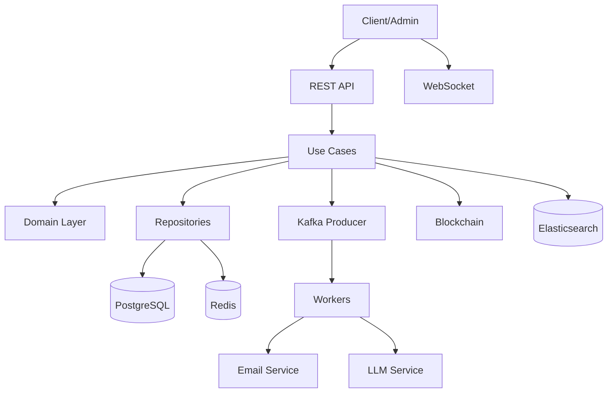
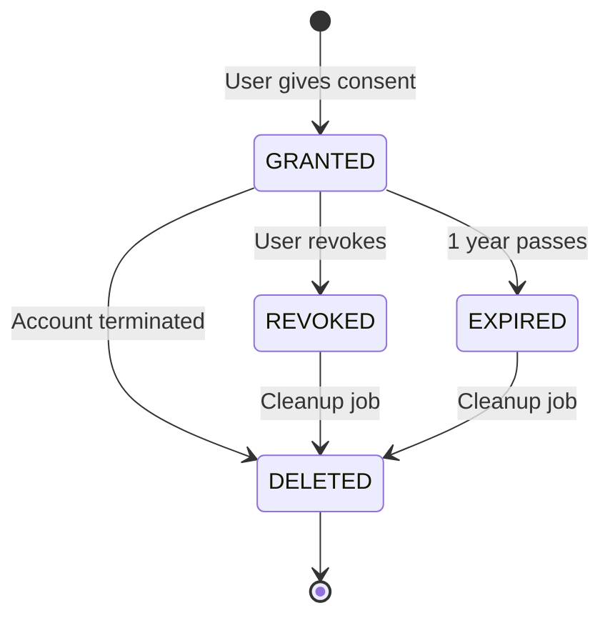
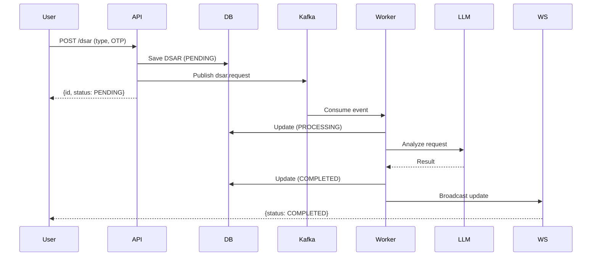

---

# 🚀 PDPA Module Generation Prompt (V6 - Multi-Framework Edition)

## 📋 Prompt หลัก (CO-STAR + CRISPE + RACE + RTF + BAB ผสม)

```
╔══════════════════════════════════════════════════════════════════╗
║  CO-STAR LAYER — บริบทของงาน                                      ║
╚══════════════════════════════════════════════════════════════════╝

[C — Context]
บริบท: เรากำลังสร้างระบบจัดการสิทธิ์ส่วนบุคคล (PDPA Module) 
สำหรับบริษัทที่ต้องปฏิบัติตาม พ.ร.บ.คุ้มครองข้อมูลส่วนบุคคล พ.ศ. 2562 
ของประเทศไทย รวมถึงสอดคล้องกับ GDPR สากล
- ระบบต้องรองรับผู้ใช้จำนวนมาก (multi-tenant)
- ต้องมี Audit Trail ที่ตรวจสอบได้
- ต้องมี Immutable Proof (Blockchain) สำหรับการให้/เพิกถอน consent
- Tech Stack: Go 1.21 + Gin + GORM + PostgreSQL + Redis + Kafka + Elasticsearch

[O — Objective]
เป้าหมาย: สร้าง Production-Ready PDPA Module ที่:
1. แยกชั้นตาม Clean Architecture + DDD อย่างสมบูรณ์
2. ครอบคลุม Use Cases ครบ 10 รายการ
3. รองรับ Async Processing ผ่าน Kafka
4. มี Data Deletion Policy ตามกฎหมาย (Soft + Hard + Anonymize)
5. มี Real-time Notification ผ่าน WebSocket
6. รองรับ i18n (EN/TH)

[S — Style]
สไตล์โค้ด:
- ใช้ idiomatic Go (gofmt standard)
- ใช้ Dependency Injection ผ่าน Constructor
- ใช้ Error Wrapping (fmt.Errorf with %w)
- ใช้ Context Propagation ทุก layer
- มี Comment อธิบาย 2 ภาษา (EN/TH) ในจุดสำคัญ
- ใช้ Interface-based design เพื่อ Testability

[T — Tone]
โทน: วิชาการ (Academic) + มืออาชีพ
- ใช้คำศัพท์เทคนิคที่ถูกต้อง
- อธิบายเหตุผล (Why) ไม่ใช่แค่ อะไร (What)
- มีการอ้างอิงหลักการ Clean Architecture / DDD / SOLID

[A — Audience]
ผู้รับ: Senior Go Developer ที่:
- เข้าใจ Clean Architecture แล้ว
- ต้องการ Production-Ready code
- จะนำไป integrate กับระบบเดิม
- ต้องการตัวอย่างที่รันได้จริง ไม่ใช่ pseudo-code

[R — Response]
รูปแบบคำตอบ:
- โค้ดเต็มไฟล์ (ไม่ตัดทอน)
- พร้อม path ของไฟล์กำกับด้านบน
- เรียงตาม Layer: Domain → Application → Infrastructure → Interface
- มี go.mod, .env, docker-compose.yml
- มี Migration SQL
- มี Writing Plan 7 Phases

╔══════════════════════════════════════════════════════════════════╗
║  CRISPE LAYER — กำหนดบทบาทและขอบเขต                              ║
╚══════════════════════════════════════════════════════════════════╝

[C — Capacity/Role]
คุณคือ **Principal Software Architect** ที่เชี่ยวชาญ:
- Go (10+ ปี), Clean Architecture, DDD, Hexagonal Architecture
- PDPA/GDPR Compliance Systems
- Event-Driven Architecture (Kafka)
- Data Privacy & Security Best Practices

[R — Request]
จงสร้างระบบ PDPA Module ที่สมบูรณ์ตามข้อกำหนดด้านล่าง

[I — Insight]
ข้อมูลเชิงลึกที่ต้องพิจารณา:
- PDPA ไทยกำหนดให้เก็บ consent แยกตาม purpose (ไม่ใช่ bundle)
- การลบข้อมูลต้องเก็บ audit log ไว้เป็นหลักฐาน (ไม่ลบจริง)
- บัญชี SUSPENDED ต้องมี retention period ตามกฎหมายบัญชี (1 ปี)
- DSAR ต้องตอบกลับภายใน 30 วัน (แต่ระบบต้อง process เร็วกว่า)
- Consent ต้องสามารถพิสูจน์ได้ว่าใครให้ เมื่อไหร่ ด้วยวิธีไหน

[S — Statement]
ข้อกำหนดบังคับ:
- ✅ Prefix `pdpa_` ทุกตาราง
- ✅ แยก Domain Entity กับ Persistence Model
- ✅ ใช้ Value Objects สำหรับ Type Safety
- ✅ Repository Pattern สำหรับ Data Access
- ✅ ใช้ Domain Errors (ไม่ leak infrastructure errors)
- ❌ ห้ามใช้ global state / singleton
- ❌ ห้ามให้ business logic รั่วเข้า infrastructure

[P — Personality]
บุคลิกการตอบ:
- กระชับ ไม่เยิ่นเย้อ
- มั่นใจ แต่ระบุข้อจำกัดเมื่อมี
- อธิบาย trade-off เมื่อมีการเลือก design

[E — Experiment]
ทางเลือกที่ต้องเสนอ:
- แสดง 2 วิธีสำหรับ Deletion: Hard Delete vs Anonymization + ระบุว่าเมื่อไหร่ใช้แบบไหน
- เสนอ Rate Limiting strategy สำหรับ DSAR
- เสนอ Blockchain approach (On-chain vs Off-chain Hash)

╔══════════════════════════════════════════════════════════════════╗
║  RACE LAYER — บทบาท หน้าที่ บริบท ความคาดหวัง                     ║
╚══════════════════════════════════════════════════════════════════╝

[R — Role]
คุณคือ Senior Backend Engineer + Compliance Officer

[A — Action]
ดำเนินการ:
1. วิเคราะห์ความต้องการ → สรุป Architecture Decision
2. ออกแบบ Database Schema
3. สร้าง Domain Layer (Entities, VOs, Repos, Services)
4. สร้าง Application Layer (Use Cases)
5. สร้าง Infrastructure Layer (GORM, Kafka, Redis, ES, Blockchain)
6. สร้าง Interface Layer (HTTP, WebSocket, i18n)
7. สร้าง Entry Points (API, Scheduler, Workers)
8. เขียน Writing Plan 7 Phases

[C — Context]
บริบทเชิงเทคนิค:
- Database: PostgreSQL 15 (ใช้ JSONB สำหรับ payload)
- Cache: Redis 7 (TTL 30 วัน สำหรับ consent cache)
- Queue: Kafka (7 topics: consent.log, consent.revoked, dsar.request, 
  data.deleted, account.event, email.send, llm.analyze)
- Search: Elasticsearch 8 (index: pdpa_consents)
- Blockchain: Ethereum (Goerli testnet สำหรับ dev, Mainnet สำหรับ prod)
- Auth: JWT (HS256), OTP (6 หลัก, หมดอายุ 15 นาที)

[E — Expectation]
ผลลัพธ์ที่คาดหวัง:
- โค้ดรันได้จริง 100% (compile ผ่าน)
- ผ่าน `go vet` และ `golangci-lint`
- มี test coverage > 70% สำหรับ Use Cases
- Deployment ได้ด้วย `docker-compose up`
- มี API documentation (Swagger/OpenAPI)

╔══════════════════════════════════════════════════════════════════╗
║  RTF LAYER — บทบาท งาน รูปแบบ                                     ║
╚══════════════════════════════════════════════════════════════════╝

[R — Role]
Architect + Coder + Technical Writer

[T — Task]
สร้างโมดูล PDPA ที่มี:
- 7 Database Tables (prefix pdpa_)
- 10 Use Cases
- 5 Kafka Workers
- 1 Scheduler
- 1 REST API Server
- 1 WebSocket Hub
- Blockchain Integration
- i18n (EN/TH)

[F — Format]
รูปแบบ output:
```markdown
## [Layer Name]

### [File Path]
```go
// full code here
```

**คำอธิบาย**: ...
**เหตุผลการออกแบบ**: ...
**Trade-offs**: ...
```

╔══════════════════════════════════════════════════════════════════╗
║  BAB LAYER — ก่อน หลัง สะพาน                                      ║
╚══════════════════════════════════════════════════════════════════╝

[B — Before: สถานะปัจจุบัน]
ทีมมี:
- ระบบ user management เดิม (Go + Gin)
- PostgreSQL เป็น primary DB
- ยังไม่มีระบบจัดการ consent
- ยังไม่มี DSAR workflow
- Audit log กระจัดกระจาย ไม่มีมาตรฐาน
- ต้องใช้ Excel manual ในการตอบ DSAR
→ ปัญหา: เสี่ยงผิด PDPA, ทำงานช้า, ไม่มีหลักฐานตรวจสอบ

[A — After: สถานะเป้าหมาย]
ทีมจะมี:
- PDPA Module ที่ plug-in ได้ทันที
- Consent management อัตโนมัติ (grant/revoke/expire)
- DSAR workflow ครบวงจร (submit → verify → process → notify)
- Auto-deletion ตาม policy
- Audit Trail ที่ตรวจสอบได้ (Blockchain-backed)
- Real-time notification ผ่าน WebSocket
→ ผลลัพธ์: Compliance 100%, ลดเวลาตอบ DSAR จาก 30 วัน → 3 วัน

[B — Bridge: สะพานเชื่อม]
วิธีพาจาก Before → After:
1. สร้าง PDPA Module แยก เป็น bounded context
2. เชื่อมกับ user management เดิมผ่าน Event (Kafka)
3. Migrate ข้อมูล consent เดิม (ถ้ามี)
4. Roll-out แบบ strangler fig pattern
5. Monitor ด้วย metrics (consent_granted_total, dsar_processed_total)

---

## 🎯 รายละเอียด Use Cases ที่ต้องสร้าง (10 รายการ)

| # | Use Case | Input | Output | Side Effects |
|---|----------|-------|--------|--------------|
| 1 | RecordConsent | UserID, Purposes, IP, UA | error | DB, Cache, Kafka, Blockchain, Audit |
| 2 | RevokeConsent | UserID, Purpose, IP, UA | error | DB, Cache, Kafka, Blockchain, Audit |
| 3 | GetConsentHistory | UserID | []ConsentLog | - |
| 4 | SubmitDSAR | UserID, Type, IP, UA | DSARRequest | DB, Kafka, Audit |
| 5 | ProcessDSAR | RequestID, Action | error | DB, Kafka, WS, Audit |
| 6 | GetDSARStatus | RequestID | DSARRequest | - |
| 7 | ImmediateDeletion | UserID | error | DB, Cache, ES, Kafka, Blockchain, Audit |
| 8 | AutoDeleteExpired | RetentionYears | error | DB, Cache, ES, Kafka, Audit |
| 9 | HandleAccountEvent | Event, UserID, Data | error | DB, Audit |
| 10 | GetAdminReport | DateRange, Filters | Report | - |

---

## 🗄️ Database Schema (สรุป)

```sql
-- 7 ตาราง หลัก
pdpa_policies                -- นโยบายความเป็นส่วนตัว (versioned)
pdpa_purposes                -- วัตถุประสงค์ (NECESSARY/ANALYTICS/MARKETING)
pdpa_consents                -- บันทึก consent (FK: purposes.code)
pdpa_user_requests           -- DSAR requests
pdpa_user_account_statuses   -- สถานะบัญชี
pdpa_audit_trails            -- Audit log (immutable)
pdpa_request_responses       -- ไฟล์ตอบกลับ DSAR (FK: requests.id)
```

---

## 📊 Writing Plans (7 Phases × 21 วัน)

### 🏗️ Phase 1: Foundation (Day 1-2)
**Deliverables:**
- [ ] `go.mod`, `.env`, `docker-compose.yml`
- [ ] `migrations/001_initial_pdpa_schema.sql`
- [ ] Domain Entities (4 ตัว)
- [ ] Value Objects (5 ตัว)

**Acceptance Criteria:**
- `docker-compose up` → PostgreSQL + Redis + Kafka + ES พร้อม
- `go build ./...` ผ่าน

---

### 🧠 Phase 2: Domain Logic (Day 3-4)
**Deliverables:**
- [ ] Repository Interfaces (4 ตัว)
- [ ] Domain Services: DeletionPolicyService, ConsentValidator
- [ ] Domain Errors (13 ตัว)
- [ ] Domain Events

**Acceptance Criteria:**
- Unit tests สำหรับ DeletionPolicy ผ่าน 100%
- ไม่มี import จาก infrastructure ใน domain

---

### ⚙️ Phase 3: Application Layer (Day 5-7)
**Deliverables:**
- [ ] 10 Use Cases
- [ ] DTOs (Input/Output)
- [ ] Event Publishing Logic

**Acceptance Criteria:**
- Mock repositories → test ผ่าน
- Business rules ครบ (consent expiry, account status checks)

---

### 🔌 Phase 4: Infrastructure (Day 8-12)
**Deliverables:**
- [ ] 7 GORM Models
- [ ] 4 Repository Implementations
- [ ] Redis Consent Cache
- [ ] Kafka Producer + 5 Consumers
- [ ] Elasticsearch Indexer
- [ ] Email/LLM/Blockchain Services

**Acceptance Criteria:**
- Integration test กับ PostgreSQL ผ่าน
- Kafka producer/consumer ทำงานได้

---

### 🌐 Phase 5: Interface Layer (Day 13-15)
**Deliverables:**
- [ ] HTTP Handlers: Consent, DSAR, Deletion, Admin
- [ ] Routes + Middleware
- [ ] WebSocket Hub + Handler
- [ ] i18n (EN/TH)

**Acceptance Criteria:**
- `curl` ทดสอบทุก endpoint ผ่าน
- WebSocket เชื่อมต่อ + รับ message ได้

---

### 🚀 Phase 6: Entry Points (Day 16-18)
**Deliverables:**
- [ ] `cmd/api/main.go`
- [ ] `cmd/scheduler/main.go`
- [ ] `cmd/workers/{dsar,email,llm,revoke,account}/main.go`
- [ ] `cmd/migrate/main.go`

**Acceptance Criteria:**
- ทุก binary build ผ่าน
- Graceful shutdown ทำงาน

---

### 🧪 Phase 7: Testing & Docs (Day 19-21)
**Deliverables:**
- [ ] Integration Tests
- [ ] E2E Test (consent → DSAR → deletion flow)
- [ ] API Documentation (Swagger)
- [ ] README + Architecture Diagram

**Acceptance Criteria:**
- Coverage > 70%
- Run E2E ผ่านทั้งหมด
- Documentation ครบ

---

## 📐 Mermaid Diagrams ที่ต้องมี

### 1. System Architecture


### 2. Consent Lifecycle


### 3. DSAR Flow


---

## 🎓 กฎการตอบที่ต้องปฏิบัติ

1. **ลำดับความสำคัญ**: Domain > Application > Infrastructure > Interface
2. **ทุก Use Case** ต้องมี:
   - Input/Output DTO
   - Dependency Injection
   - Error handling ครบ
   - Audit Trail
3. **ทุก Repository** ต้องมี:
   - Interface (domain)
   - Implementation (infrastructure)
   - Model mapping (ไม่มี domain leak)
4. **ทุก Handler** ต้องมี:
   - Input validation
   - Error → HTTP status mapping
   - Context propagation

---

## ✅ Self-Check ก่อนส่งคำตอบ

- [ ] ครอบคลุมทั้ง 4 layers?
- [ ] มี 7 tables + 10 use cases + 5 workers?
- [ ] โค้ด compile ผ่าน?
- [ ] มี go.mod + .env + docker-compose?
- [ ] มี Writing Plan 7 phases?
- [ ] มี Mermaid diagrams?
- [ ] ใช้ Prefix pdpa_ ทุกตาราง?
- [ ] แยก Domain Entity กับ Persistence Model?

---

## 🚦 เริ่มดำเนินการ

**ขั้นตอนที่ 1**: ยืนยันความเข้าใจ
สรุป Architecture + Technology Stack + Deliverables ที่จะสร้าง

**ขั้นตอนที่ 2**: สร้าง Phase 1-2 (Foundation + Domain)
ส่งโค้ด Domain Layer ทั้งหมดพร้อม migration SQL

**ขั้นตอนที่ 3**: สร้าง Phase 3-4 (Application + Infrastructure)
ส่งโค้ด Use Cases + Infrastructure ทั้งหมด

**ขั้นตอนที่ 4**: สร้าง Phase 5-6 (Interface + Entry Points)
ส่งโค้ด Handlers + main.go ทั้งหมด

**ขั้นตอนที่ 5**: สร้าง Phase 7 (Testing + Docs)
ส่ง Tests + Documentation

**เริ่มเลย!**
```

---

# 📊 สรุป Framework ที่ใช้ (Mapping Table)

| Framework | ส่วนที่นำมาประยุกต์ | ประโยชน์ใน Prompt นี้ |
|-----------|---------------------|----------------------|
| **CO-STAR** | Context, Objective, Style, Tone, Audience, Response | กำหนดขอบเขตงานชัดเจน ตั้งแต่บริบทจนถึงรูปแบบผลลัพธ์ |
| **CRISPE** | Capacity, Request, Insight, Statement, Personality, Experiment | กำหนดบทบาทผู้เชี่ยวชาญ + insight เฉพาะด้าน PDPA |
| **RACE** | Role, Action, Context, Expectation | กำหนดลำดับงาน + acceptance criteria |
| **RTF** | Role, Task, Format | กำหนดรูปแบบ output ที่ต้องการ |
| **BAB** | Before, After, Bridge | แสดง business value + transition plan |

---

# 🎯 วิธีใช้ Prompt นี้ให้ได้ผลสูงสุด

## สำหรับ AI แต่ละตัว:

| AI Model | วิธีใช้ |
|----------|--------|
| **Claude 3.5+** | ใช้ทั้งหมดในครั้งเดียว (context ใหญ่) |
| **ChatGPT 4o** | แบ่ง 3-4 messages: Domain, App+Infra, Interface, Docs |
| **Gemini 1.5 Pro** | ใช้ทั้งหมด + ขอ diagram เพิ่ม |
| **Cursor / Copilot** | ใช้ใน file-by-file comment |

## ก่อนใช้ ตรวจสอบ:

1. ✅ ระบุ Go version (1.21) ให้ชัด
2. ✅ ระบุ library versions ทั้งหมด
3. ✅ ระบุ database version (PostgreSQL 15)
4. ✅ ระบุว่า "ไม่ต้องใช้ mock libraries"
5. ✅ ถ้ามีระบบเดิม ให้แนบ code ที่มีอยู่

---

# 🔄 การปรับใช้ตาม Framework เดียว (ถ้า AI มี Context จำกัด)

### 🅰️ ใช้ CO-STAR อย่างเดียว:
```
Context: สร้าง PDPA Module สำหรับ Go
Objective: Production-ready, Clean Architecture
Style: Idiomatic Go, DI, Interface-based
Tone: Academic + Professional
Audience: Senior Go Developer
Response: Full code + migration + plan
```

### 🅱️ ใช้ RACE อย่างเดียว:
```
Role: Principal Architect + Compliance Officer
Action: สร้าง PDPA Module ตาม Clean Architecture
Context: Go 1.21, PostgreSQL, Kafka, Redis, ES, Ethereum
Expectation: Compile ได้ 100%, coverage >70%, docker-compose up ได้
```

### 🅲 ใช้ RTF อย่างเดียว (สั้นสุด):
```
Role: Senior Go Developer
Task: สร้าง PDPA Module (7 tables, 10 use cases, 5 workers)
Format: Full code per file + Writing Plan
```

---

# ⚠️ ข้อควรระวัง

1. **อย่าใช้ทั้ง 5 framework พร้อมกัน** ถ้า AI model เล็ก (context < 32K)
2. **ควรใช้ 2-3 framework ผสม** เช่น CO-STAR + RACE
3. **ถ้าต้องการแค่ prototype** → ใช้ RTF อย่างเดียว
4. **ถ้าต้องการ production code** → ใช้ CO-STAR + CRISPE + RACE

---

ถ้าคุณต้องการให้ผม **ปรับ prompt ให้เหมาะกับ AI ตัวใดตัวหนึ่ง** (เช่น Claude, GPT-4, Gemini) หรือ **แบ่ง prompt เป็นหลายส่วน** สำหรับการ paste แยก กรุณาบอกได้เลยครับ