หนังสือสอนภาษา Go ที่ครอบคลุมเนื้อหาตั้งแต่พื้นฐานจนถึงระดับสูง

### 📚 เล่มที่ 1: ปฐมบทกับการเขียนโปรแกรม
**เนื้อหา:** พื้นฐานการเขียนโปรแกรมคอมพิวเตอร์ รู้จักภาษา Go การใช้ Terminal การเตรียมสภาพแวดล้อม และการสร้างแอปพลิเคชันแรก
- บทที่ 1: ความรู้เบื้องต้นเกี่ยวกับการเขียนโปรแกรมคอมพิวเตอร์
- บทที่ 2: รู้จักกับภาษา Go
- บทที่ 3: พื้นฐานการใช้งาน Terminal
- บทที่ 4: เตรียมสภาพแวดล้อมสำหรับพัฒนา
- บทที่ 5: สร้างแอปพลิเคชันแรกของคุณ

---

### 📚 เล่มที่ 2: พื้นฐานภาษาและโครงสร้างข้อมูล (ตอนที่ 1)
**เนื้อหา:** ระบบเลข ตัวแปร ชนิดข้อมูล คำสั่งควบคุม และฟังก์ชัน
- บทที่ 6: ระบบเลขฐานสองและฐานสิบ
- บทที่ 7: เลขฐานสิบหก, ฐานแปด, ASCII, UTF8, Unicode และ Runes
- บทที่ 8: ตัวแปร, ค่าคงที่ และชนิดข้อมูลพื้นฐาน
- บทที่ 9: คำสั่งควบคุมการทำงาน
- บทที่ 10: ฟังก์ชัน

---

### 📚 เล่มที่ 3: พื้นฐานภาษาและโครงสร้างข้อมูล (ตอนที่ 2)
**เนื้อหา:** แพคเกจ การเริ่มต้นทำงาน ชนิดข้อมูลใหม่ เมธอด พอยน์เตอร์ และอินเทอร์เฟซ
- บทที่ 11: แพคเกจและการนำเข้า
- บทที่ 12: การเริ่มต้นทำงานของแพคเกจ
- บทที่ 13: การสร้างชนิดข้อมูลใหม่ (Types)
- บทที่ 14: เมธอด (Methods)
- บทที่ 15: พอยน์เตอร์ (Pointer)
- บทที่ 16: อินเทอร์เฟซ (Interfaces)

---

### 📚 เล่มที่ 4: การจัดการโปรเจกต์และโครงสร้างข้อมูลขั้นสูง
**เนื้อหา:** Go Modules การทดสอบ อาเรย์ สไลซ์ แมพ และการจัดการข้อผิดพลาด
- บทที่ 17: Go Modules - การจัดการโปรเจกต์สมัยใหม่
- บทที่ 18: Go Module Proxies
- บทที่ 19: การทดสอบหน่วย (Unit Tests)
- บทที่ 20: อาเรย์ (Arrays)
- บทที่ 21: สไลซ์ (Slices)
- บทที่ 22: แมพ (Maps)
- บทที่ 23: การจัดการข้อผิดพลาด (Errors)

---

### 📚 เล่มที่ 5: การพัฒนาแอปพลิเคชันเชิงปฏิบัติ
**เนื้อหา:** ฟังก์ชันขั้นสูง การจัดการ JSON/XML HTTP Server Enum วันที่ เวลา ไฟล์/ฐานข้อมูล Concurrency และ Logging
- บทที่ 24: ฟังก์ชันนิรนาม (Anonymous functions) และ Closure
- บทที่ 25: การจัดการข้อมูล JSON และ XML
- บทที่ 26: พื้นฐานการสร้าง HTTP Server
- บทที่ 27: Enum, Iota และ Bitmask
- บทที่ 28: วันที่และเวลา
- บทที่ 29: การจัดเก็บข้อมูล: ไฟล์และฐานข้อมูล
- บทที่ 30: การทำงานพร้อมกัน (Concurrency)
- บทที่ 31: การบันทึกเหตุการณ์ (Logging)
- บทที่ 32: เทมเพลต (Templates)
- บทที่ 33: การจัดการค่า Configuration

---

### 📚 เล่มที่ 6: สู่การเป็นนักพัฒนา Go มืออาชีพ
**เนื้อหา:** การวัดประสิทธิภาพ HTTP Client การวิเคราะห์โปรไฟล์ Context Generics OOP ใน Go การอัปเกรดเวอร์ชัน แนวทางการออกแบบโค้ด และ Cheatsheet
- บทที่ 34: การวัดประสิทธิภาพ (Benchmarks)
- บทที่ 35: สร้าง HTTP Client
- บทที่ 36: การวิเคราะห์โปรไฟล์ (Program Profiling)
- บทที่ 37: การจัดการ Context
- บทที่ 38: Generics - การเขียนโค้ดแบบยืดหยุ่น
- บทที่ 39: Go กับกระบวนทัศน์ OOP?
- บทที่ 40: การอัปเกรดหรือดาวน์เกรดเวอร์ชัน Go
- บทที่ 41: คำแนะนำในการออกแบบโค้ดที่ดี
- บทที่ 42: ชีทสรุป (Cheatsheet)

---

### 📚 เล่มที่ 7: เครื่องมือและไลบรารียอดนิยม
**เนื้อหา:** ไลบรารียอดนิยมสำหรับ Go และ GORM
- บทที่ 43: chi, viper, cobra, zap และเครื่องมือสำคัญ
- บทที่ 44: GORM – ORM ทรงพลังสำหรับ Go
- บทที่ 45: การส่งอีเมลด้วย gomail และ hermes

---

### 📚 เล่มที่ 8: การออกแบบสถาปัตยกรรมและ DDD
**เนื้อหา:** Clean Architecture Blueprint การออกแบบ Workflow และ Domain-Driven Design
- บทที่ 46: Clean Architecture และโครงสร้างโปรเจกต์
- บทที่ 47: Blueprint สำหรับโปรเจกต์ Go ระดับ Production
- บทที่ 48: การออกแบบ Workflow และ Task Management
- บทที่ 49: หลักการ DDD และการนำไปใช้ใน Go
- บทที่ 50: Aggregates, Event Storming และ CQRS
- บทที่ 51: การออกแบบบริการด้วย Go-DDD

---

### 📚 เล่มที่ 9: การผสานระบบภายนอกและคุณลักษณะเสริม
**เนื้อหา:** การเชื่อมต่อกับระบบภายนอกต่างๆ เช่น Redis, RabbitMQ, MQTT, InfluxDB, WebSocket, SMS, LINE และ Discord
- บทที่ 52: Redis สำหรับ Cache และ Message Queue
- บทที่ 53: RabbitMQ – Message Broker มาตรฐานองค์กร
- บทที่ 54: MQTT สำหรับ IoT และระบบเรียลไทม์
- บทที่ 55: InfluxDB – Time‑Series Database
- บทที่ 56: WebSocket และ Socket.IO
- บทที่ 57: การส่ง SMS และ LINE Notify
- บทที่ 58: Discord Webhook สำหรับแจ้งเตือน

---

### 📚 เล่มที่ 10: เทมเพลต กระบวนการพัฒนา และตัวอย่างโค้ด + ภาคผนวก
**เนื้อหา:** ตัวอย่างโค้ดครบวงจร เทมเพลตต่างๆ แผนภาพการทำงาน การจัดการ Configuration และภาคผนวก
- บทที่ 59: ตัวอย่างโค้ดครบวงจร (Full‑stack Example)
- บทที่ 60: Task List Template
- บทที่ 61: Checklist Template
- บทที่ 62: แผนภาพการทำงาน (Workflow Diagram)
- บทที่ 63: mop Config – การจัดการ Configuration
- **ภาคผนวก:** GORM CRUD กับฐานข้อมูลหลายประเภท, คู่มือภาษา Go ฉบับนำไปทำงาน, Golang Live-reload

---

## สรุปภาพรวม

| เล่มที่ | ชื่อเล่ม | จำนวนบท |
|--------|---------|---------|
| 1 | ปฐมบทกับการเขียนโปรแกรม | 5 บท |
| 2 | พื้นฐานภาษาและโครงสร้างข้อมูล (ตอนที่ 1) | 5 บท |
| 3 | พื้นฐานภาษาและโครงสร้างข้อมูล (ตอนที่ 2) | 6 บท |
| 4 | การจัดการโปรเจกต์และโครงสร้างข้อมูลขั้นสูง | 7 บท |
| 5 | การพัฒนาแอปพลิเคชันเชิงปฏิบัติ | 10 บท |
| 6 | สู่การเป็นนักพัฒนา Go มืออาชีพ | 9 บท |
| 7 | เครื่องมือและไลบรารียอดนิยม | 3 บท |
| 8 | การออกแบบสถาปัตยกรรมและ DDD | 6 บท |
| 9 | การผสานระบบภายนอกและคุณลักษณะเสริม | 7 บท |
| 10 | เทมเพลต กระบวนการพัฒนา และตัวอย่างโค้ด + ภาคผนวก | 5 บท + ภาคผนวก |

---

# โครงสร้าง Folder และ File

## ภาพรวมทั้งโปรเจกต์

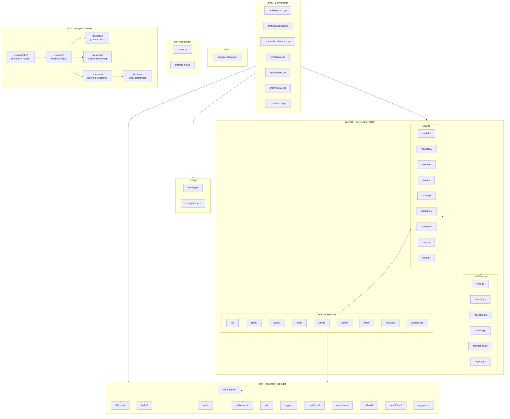

---

## แยกแต่ละ Module

### 1. Module: iot/ — main IoT domain

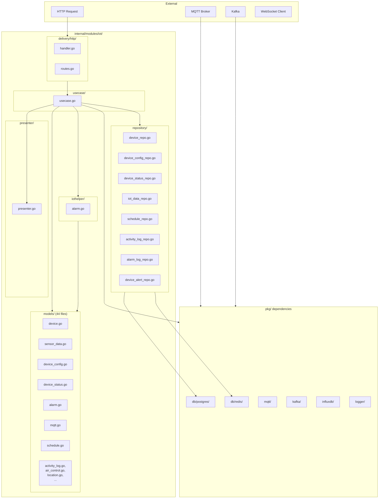

---

### 2. Module: users/ — User management

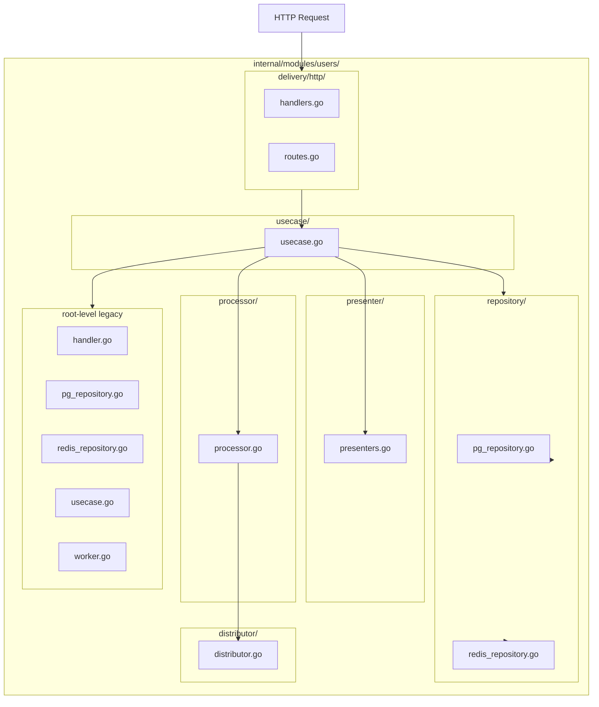

---

### 3. Module: alarm/ — Alarm & notification

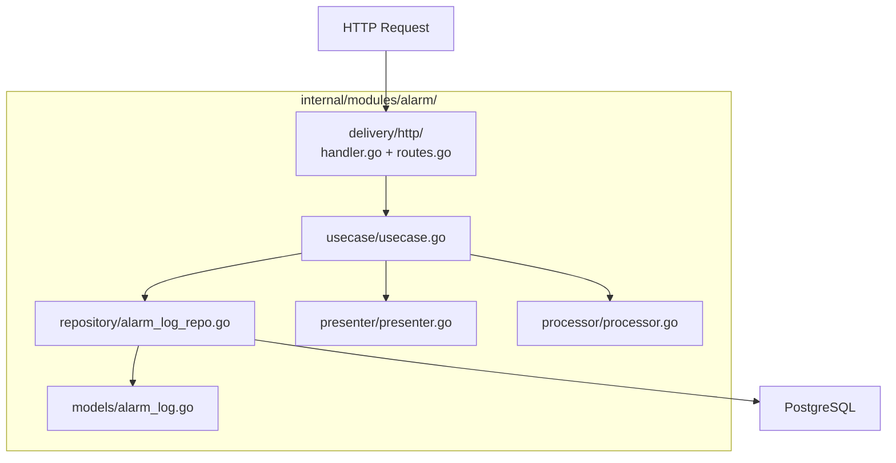

---

### 4. Module: auth/ — Authentication

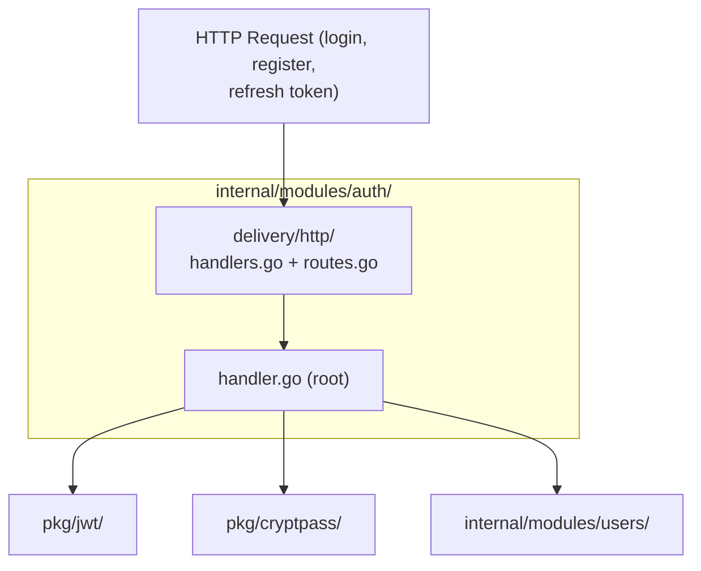

---

### 5. Module: items/ — CRUD items

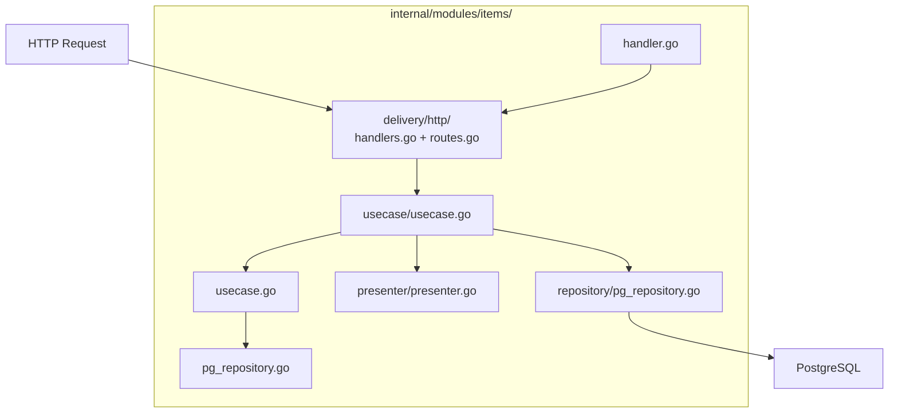

---

### 6. Module: kafka/ — Kafka message handling

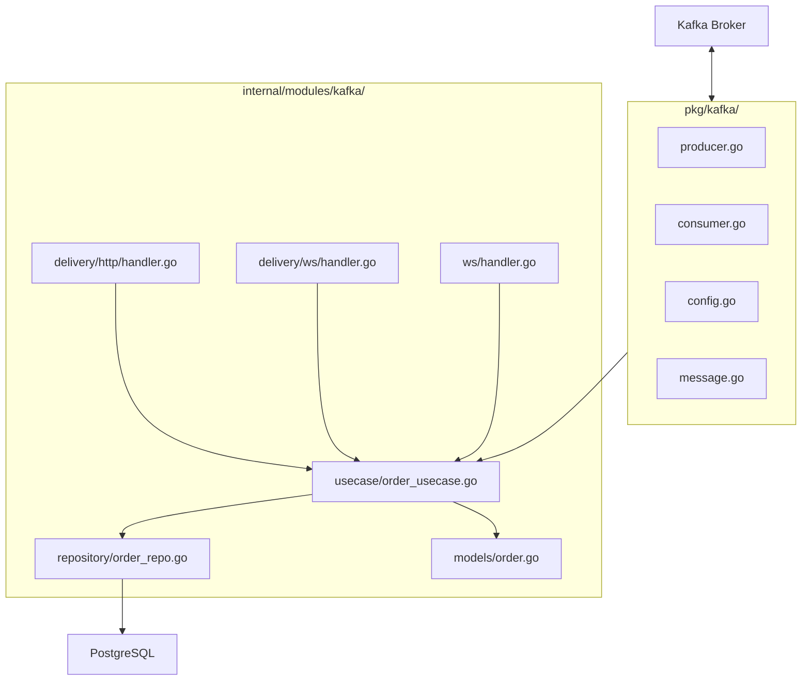

---

### 7. Module: mqtt/ — MQTT IoT gateway

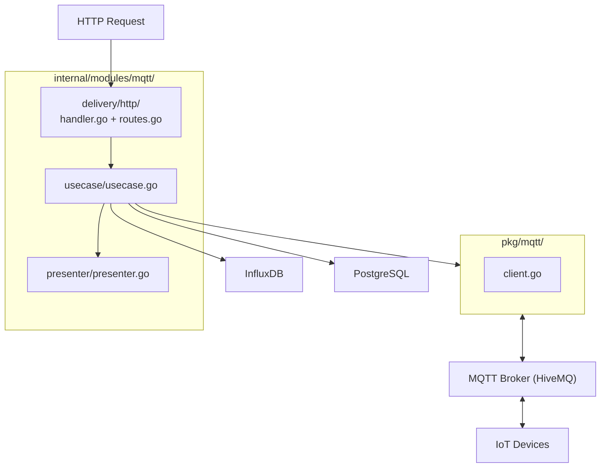

---

### 8. Module: influxdb/ — Time-series data query

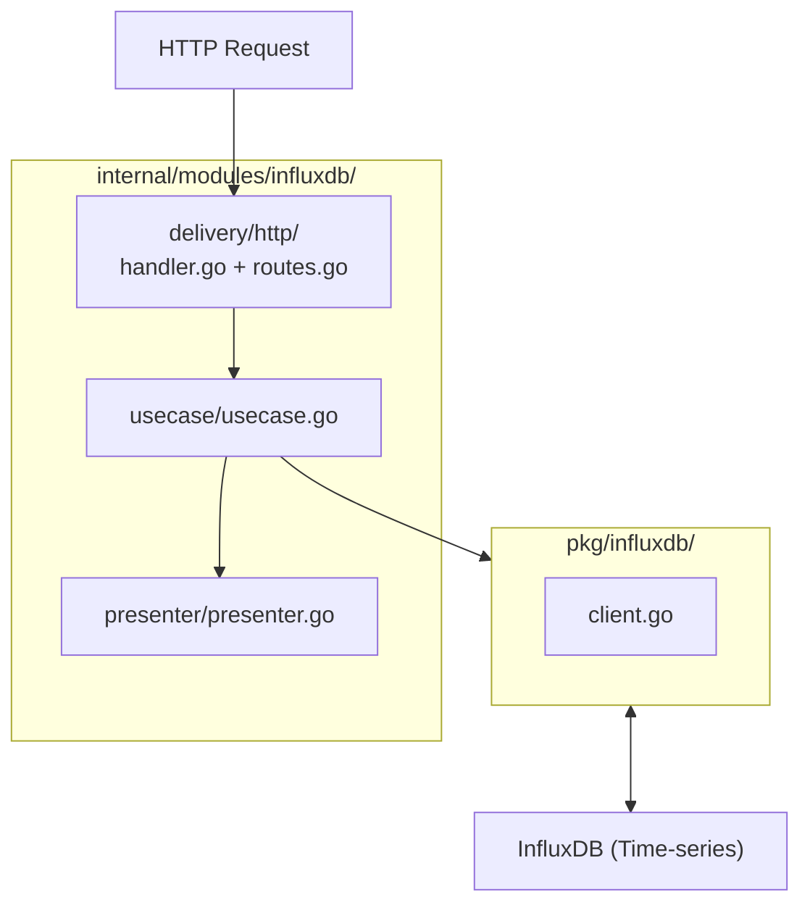

---

### 9. Module: websocket/ — Real-time WebSocket

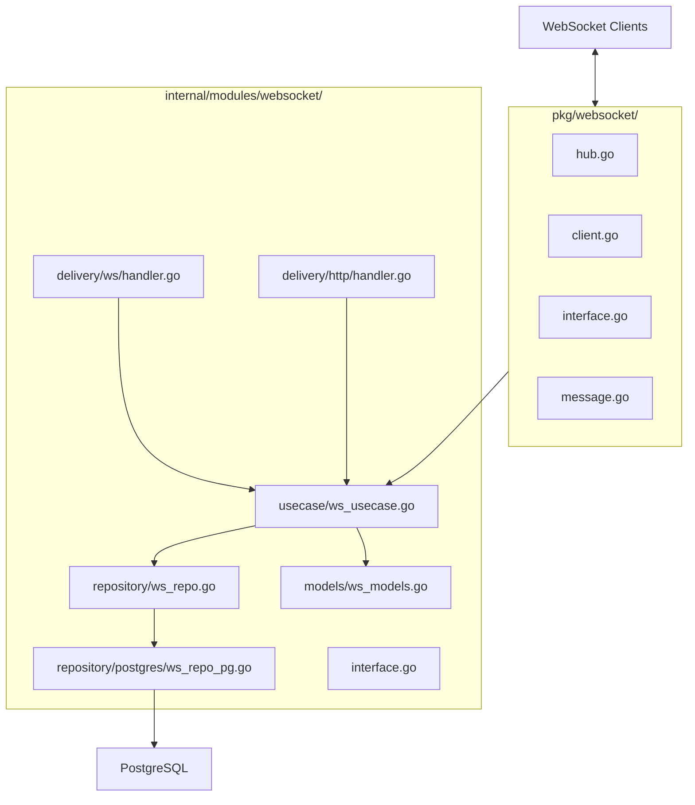

---

### 10. Shared Modules

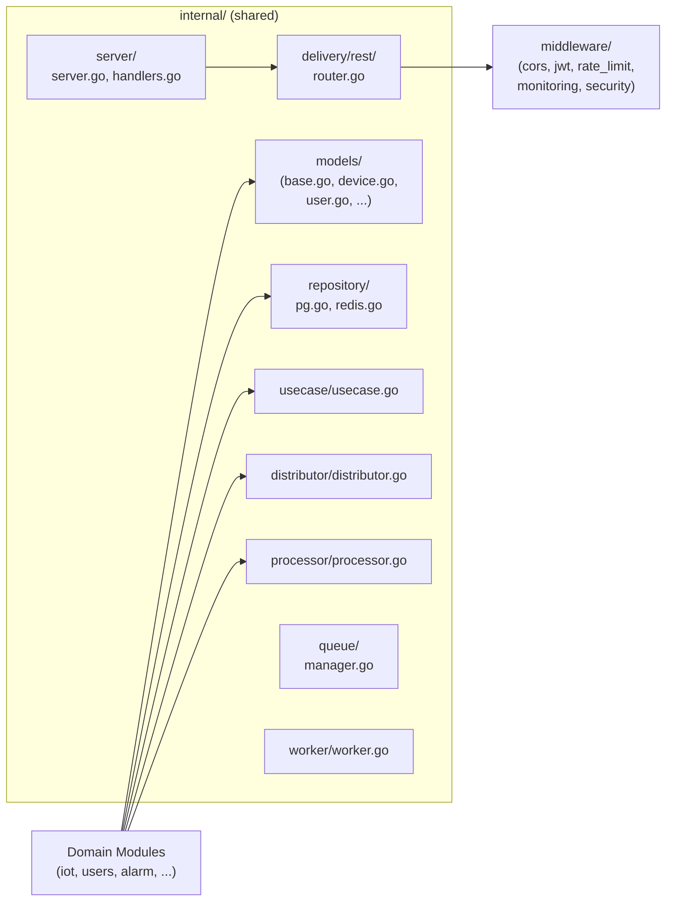

---

## Flow คำอธิบาย

1. **cmd/** — entry points เริ่มต้น (API, Kafka consumer, WebSocket, Worker)
2. **internal/** — core logic แบบ DDD แต่ละ domain มี layer: `delivery/http` → `usecase` → `repository` + `presenter` + `processor` + `distributor`
3. **pkg/** — shared packages (DB, Kafka, MQTT, JWT, Logger, ฯลฯ)
4. **middleware/** — intercept request (CORS, JWT auth, rate limit, monitoring)
5. **config/** → inject config ให้ทุก module
6. **db/ + migrations/** → schema ฐานข้อมูล

------------------------------
skill
1. สั่ง copilot  
   - copilot
   - /tb-brainstorming
   - แล้ว เอาโจทย์มา วาง เพื่อให้  AI วิเคาะห์ 
   - /tb-writing-plans
   -  ถาม และ ให้ ทางเลือก แสดงแนวทางตัดสินใจ ไปจน กว่าจะ สมบุรณ์
   - /tb-executing-plans
   - เริ่ม ทำงาน ตาม plans

/tb-scrutinize 
- Affected กับส่วนไหนบ้าง
- panic
- code ใน branches feature/rtrpms-2916 มันไปเปลียน  พถติกรรม ใน branches  dev  หรือไหม
- สิ่งที่ต้องการ code ใน  branches feature/rtrmps-2916   ต้องไม่เปลียนแปลง  พถติกรรม ใน branches  dev  code ใน branches  dev ต้องใช้งานได้ โดยไม่มีผลกระทบ 
- แค่นำ code นี้ไป เพิ่มเข้าไป โดยไม่มีผลกระทบ code ใน BRANCHES dev  
- รายงานสรุปผลการดำเนิดการ อะไรไปบ้าง และบอกกระบวนการทดสอบผล

