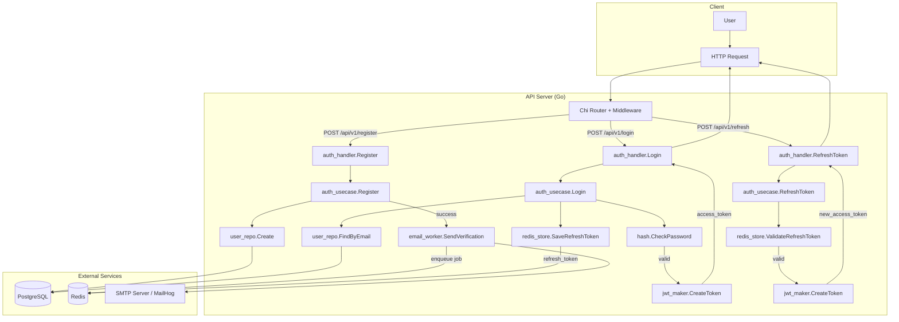

# หนังสือชุด “เรียน Go อย่างมืออาชีพ” (Professional Go Series)

จากแหล่งข้อมูลทั้ง **Go by Example**, **หลักสูตร Go เต็มรูปแบบ**, **10 โครงการสำหรับผู้เริ่มต้น**, และ **Go IoT Platform** — ผมได้เรียบเรียงเนื้อหาทั้งหมดออกเป็น **7 เล่ม** ที่สามารถนำไปใช้ทำงานได้จริง แต่ละเล่มมีความเป็นเอกเทศ เรียนจบเล่มใดเล่มหนึ่งก็สามารถนำความรู้ไปประยุกต์ใช้ได้ทันที


---

# 📘 เล่มที่ 1: พื้นฐานภาษา Go (Go Fundamentals)

> **เป้าหมาย:** เขียน Go เป็น — ตั้งแต่ Hello World จนถึงฟังก์ชันและโครงสร้างข้อมูลพื้นฐาน
> **เหมาะสำหรับ:** ผู้เริ่มต้นที่ยังไม่เคยเขียน Go มาก่อน
> **อ้างอิงจาก:** Go by Example (หัวข้อพื้นฐาน) + Course Content (บทที่ 1–12)

---

## หน้าปก

```
┌─────────────────────────────────────────────────────────────────┐
│                                                                 │
│                      เรียน Go อย่างมืออาชีพ                      │
│                                                                 │
│                          ═══════════                             │
│                                                                 │
│                          เล่มที่ 1                               │
│                                                                 │
│                    พื้นฐานภาษา Go                                │
│                 (Go Fundamentals)                               │
│                                                                 │
│                                                                 │
│                    ●  ข้อความ ●                                 │
│                    ●  ตัวแปร ●                                 │
│                    ●  เงื่อนไข ●                               │
│                    ●  ลูป ●                                    │
│                    ●  ฟังก์ชัน ●                               │
│                    ●  พอยน์เตอร์ ●                             │
│                    ●  โครงสร้างข้อมูลพื้นฐาน ●                  │
│                                                                 │
│                                                                 │
│                          ═══════════                             │
│                                                                 │
│                     สำหรับนักพัฒนาไทย                           │
│                 เรียนรู้จากตัวอย่างจริง                          │
│                                                                 │
└─────────────────────────────────────────────────────────────────┘
```

---

## สารบัญ เล่มที่ 1: พื้นฐานภาษา Go

### บทที่ 1: เริ่มต้นกับ Go
- 1.1 Go คืออะไร? — ประวัติและจุดเด่น
- 1.2 ติดตั้ง Go บน Windows / macOS / Linux
- 1.3 ตั้งค่า GOPATH และ Go Modules
- 1.4 Visual Studio Code + Go Extension
- 1.5 Hello World — โปรแกรมแรก
- 1.6 `go fmt` — จัดรูปแบบโค้ดอัตโนมัติ
- 1.7 `go run`, `go build`, `go mod init`

### บทที่ 2: ตัวแปรและชนิดข้อมูล
- 2.1 Values — ชนิดข้อมูลพื้นฐาน (string, int, float, bool)
- 2.2 Variables — การประกาศตัวแปรแบบ `var`
- 2.3 การประกาศตัวแปรแบบย่อ (`:=`)
- 2.4 Constants — ค่าคงที่
- 2.5 Zero Value — ค่าเริ่มต้นของตัวแปร
- 2.6 Type Declaration — การสร้างชนิดข้อมูลใหม่
- 2.7 Go Token — ส่วนประกอบของภาษา

### บทที่ 3: Control Flow
- 3.1 For Loop — ลูปแบบเดียวของ Go (3 รูปแบบ)
- 3.2 If/Else — เงื่อนไขแบบไม่มีวงเล็บ
- 3.3 Switch — Switch Statement และ Type Switch

### บทที่ 4: ฟังก์ชัน
- 4.1 Functions — การประกาศและเรียกใช้
- 4.2 Multiple Return Values — คืนค่าหลายค่า
- 4.3 Variadic Functions — รับพารามิเตอร์ไม่จำกัด
- 4.4 Closures — ฟังก์ชัน Closure
- 4.5 Recursion — การเรียกฟังก์ชันแบบเวียนเกิด
- 4.6 Function Value และ Anonymous Function
- 4.7 Higher Order Function

### บทที่ 5: พอยน์เตอร์ (Pointers)
- 5.1 คอนเซปของ Pointer
- 5.2 Function Return Pointer
- 5.3 Function Receive Pointer และ Alias
- 5.4 การประกาศตัวแปรแบบไม่มีชื่อ (`new` function)

### บทที่ 6: Package และการนำเข้า
- 6.1 Package and Import
- 6.2 Package และ SCM (Source Control Management)
- 6.3 Package และ Initialization Function (`init`)
- 6.4 vendor directory
- 6.5 การตั้งค่า GOPATH สำหรับหลายไดเรกทอรี

### บทที่ 7: ชนิดข้อมูลเชิงตัวเลข
- 7.1 Basic-type Integer
- 7.2 Why Second Complement Integer
- 7.3 Precedence Operator
- 7.4 Integer Overflow
- 7.5 Floating Point
- 7.6 Complex Number

### บทที่ 8: String และ Rune
- 8.1 String Quick Look
- 8.2 String Representation
- 8.3 การแปลง string ระหว่าง Unicode กับ UTF-8
- 8.4 String Conversion
- 8.5 Range-loop และ Package สำหรับ String
- 8.6 bytes package, string builder, strconv, unicode

### บทที่ 9: โครงสร้างข้อมูลพื้นฐาน
- 9.1 Arrays
- 9.2 Slices — คอนเซปและการประกาศ
- 9.3 Slice Appending
- 9.4 Maps
- 9.5 Range over Built-in Types

**รวมหน้า:** ประมาณ 250–300 หน้า
**เวลาที่ใช้เรียน:** 2–3 สัปดาห์ (เรียนวันละ 1–2 ชั่วโมง)


---

# 📘 เล่มที่ 2: โครงสร้างข้อมูลขั้นสูงและการจัดการ JSON

> **เป้าหมาย:** จัดการข้อมูลทุกประเภท — Struct, Interface, JSON, Template
> **เหมาะสำหรับ:** ผู้ที่เรียนพื้นฐาน Go มาแล้ว อยากเขียนโปรแกรมที่จัดการข้อมูลจริง
> **อ้างอิงจาก:** Go by Example (Structs, Interfaces, JSON) + Course Content (บทที่ 13–20)

---

## หน้าปก

```
┌─────────────────────────────────────────────────────────────────┐
│                                                                 │
│                      เรียน Go อย่างมืออาชีพ                      │
│                                                                 │
│                          ═══════════                             │
│                                                                 │
│                          เล่มที่ 2                               │
│                                                                 │
│              โครงสร้างข้อมูลขั้นสูงและการจัดการ JSON              │
│           (Advanced Data Structures & JSON)                     │
│                                                                 │
│                                                                 │
│                    ●  Structs ●                                │
│                    ●  Methods ●                                │
│                    ●  Interfaces ●                             │
│                    ●  JSON Marshal/Unmarshal ●                 │
│                    ●  Text Templates ●                         │
│                    ●  HTML Templates ●                         │
│                    ●  Reflection ●                             │
│                                                                 │
│                                                                 │
│                          ═══════════                             │
│                                                                 │
│                     สำหรับนักพัฒนาไทย                           │
│                 เรียนรู้จากตัวอย่างจริง                          │
│                                                                 │
└─────────────────────────────────────────────────────────────────┘
```

---

## สารบัญ เล่มที่ 2: โครงสร้างข้อมูลขั้นสูงและการจัดการ JSON

### บทที่ 1: Structs
- 1.1 Introduction to Structs
- 1.2 Struct กับ Pointer
- 1.3 Struct Embedding และ Anonymous Field
- 1.4 Struct และ Recursive
- 1.5 Embedded Struct — คอนเซปและการประยุกต์ใช้

### บทที่ 2: Methods
- 2.1 The Need of Method
- 2.2 Method Declaration
- 2.3 Method by Value vs by Reference
- 2.4 Method Best Practice และ Syntax Sugar
- 2.5 Method with Nil Receiver
- 2.6 Method Values

### บทที่ 3: Interfaces
- 3.1 Interfaces — คอนเซปพื้นฐาน
- 3.2 Interface Satisfaction — การทำให้ Interface เป็นจริง
- 3.3 Interface Value
- 3.4 Empty Interface
- 3.5 Type Assertion — ตอนที่ 1 และ 2
- 3.6 Type Assertion without Panic
- 3.7 Type Switches (Discriminated Union)
- 3.8 flag.Interface และการประยุกต์ใช้
- 3.9 sort.Interface — การเรียงลำดับด้วย Interface
- 3.10 error Interface
- 3.11 Interface ที่มี Methods ซ้ำกัน

### บทที่ 4: JSON
- 4.1 JSON Introduction
- 4.2 JSON Unmarshal — แปลง JSON เป็น Struct
- 4.3 JSON Marshal — แปลง Struct เป็น JSON
- 4.4 ใช้งาน JSON Unmarshal กับ HTTP GET
- 4.5 JSON Encoder/Decoder
- 4.6 Struct Tags สำหรับ JSON

### บทที่ 5: Templates
- 5.1 Text Template Introduction
- 5.2 Text Template — Actions และฟีเจอร์เพิ่มเติม
- 5.3 HTML Template

### บทที่ 6: Reflection
- 6.1 คอนเซปของ Reflection
- 6.2 Report Application — โครงสร้างโปรเจกต์
- 6.3 การเข้าถึง Struct Name
- 6.4 การเข้าถึง Struct Value
- 6.5 การเข้าถึง Struct Tag
- 6.6 Multiple Tags
- 6.7 การแก้ไข Struct Value
- 6.8 Reflection สรุป

### บทที่ 7: การจัดการ Error ขั้นสูง
- 7.1 Project Overview — Validation Library
- 7.2 Initial Project with Simple Length Validation
- 7.3 Add More Validations Chain
- 7.4 Refactored into Package
- 7.5 First Look at `errors.Is` and `Unwrap` Interface
- 7.6 Multi-layer Wrapping and Unwrapping Error
- 7.7 Tough Life before `errors.As`
- 7.8 Type Assertion with `errors.As`
- 7.9 Refactored Custom `As` Function
- 7.10 Add More Error Types

**รวมหน้า:** ประมาณ 220–260 หน้า
**เวลาที่ใช้เรียน:** 2 สัปดาห์


---

# 📘 เล่มที่ 3: การทำงานพร้อมกัน (Concurrency) — หัวใจของ Go

> **เป้าหมาย:** เขียนโปรแกรมที่ทำงานพร้อมกันได้อย่างปลอดภัยและมีประสิทธิภาพ
> **เหมาะสำหรับ:** นักพัฒนาที่ต้องการใช้จุดแข็งที่สุดของ Go
> **อ้างอิงจาก:** Go by Example (Concurrency) + Course Content (บทที่ 21–34)

---

## หน้าปก

```
┌─────────────────────────────────────────────────────────────────┐
│                                                                 │
│                      เรียน Go อย่างมืออาชีพ                      │
│                                                                 │
│                          ═══════════                             │
│                                                                 │
│                          เล่มที่ 3                               │
│                                                                 │
│              การทำงานพร้อมกัน — หัวใจของ Go                      │
│                 (Concurrency — Heart of Go)                     │
│                                                                 │
│                                                                 │
│                    ●  Goroutines ●                             │
│                    ●  Channels ●                               │
│                    ●  Select ●                                 │
│                    ●  WaitGroups ●                             │
│                    ●  Mutexes ●                                │
│                    ●  Worker Pools ●                           │
│                    ●  Scheduler ●                              │
│                    ●  Race Detection ●                         │
│                                                                 │
│                                                                 │
│                          ═══════════                             │
│                                                                 │
│                     สำหรับนักพัฒนาไทย                           │
│                 เรียนรู้จากตัวอย่างจริง                          │
│                                                                 │
└─────────────────────────────────────────────────────────────────┘
```

---

## สารบัญ เล่มที่ 3: การทำงานพร้อมกัน (Concurrency)

### บทที่ 1: Goroutines
- 1.1 Goroutine — คืออะไรและทำงานอย่างไร
- 1.2 Goroutine Example — Countdown Server
- 1.3 Initial Countdown Server
- 1.4 Countdown Server Client และ Complete Server
- 1.5 การตรวจสอบ Goroutines
- 1.6 การทำความเข้าใจ Goroutine อย่างลึกซึ้ง

### บทที่ 2: Channels
- 2.1 Why Channel?
- 2.2 คอนเซปของ Channels
- 2.3 Unbuffered Channels — คอนเซป
- 2.4 Unbuffered Channels — ตัวอย่าง
- 2.5 Unidirectional Channels Type
- 2.6 Buffered Channels — คอนเซป
- 2.7 Buffered Channels — ตัวอย่าง
- 2.8 Channel Synchronization
- 2.9 Channel Directions
- 2.10 Closing Channels
- 2.11 Range over Channels

### บทที่ 3: Select
- 3.1 Select — การเลือก Channel Event
- 3.2 Randomly Select Channel Event
- 3.3 Default Select
- 3.4 Timeouts
- 3.5 Non-Blocking Channel Operations

### บทที่ 4: Synchronization Primitives
- 4.1 WaitGroups — การรอให้ Goroutine ทำงานเสร็จ
- 4.2 Mutexes — ป้องกัน Data Race
- 4.3 sync.Mutex — Multiple Readers, Single Writer
- 4.4 Atomic Counters
- 4.5 One Time Initialization with `sync.Once`
- 4.6 Detecting Data Race

### บทที่ 5: Patterns
- 5.1 Worker Pools
- 5.2 Rate Limiting
- 5.3 Timers และ Tickers
- 5.4 Stateful Goroutines
- 5.5 Looping Goroutine — Project Overview
- 5.6 Project Baseline — Parse JSON
- 5.7 Project Baseline — Download Image
- 5.8 Project Baseline — Save Image
- 5.9 Project Baseline — Analyze Image
- 5.10 Project Baseline — Download Images in Parallel
- 5.11 Problem with Invalid URL และการแก้ด้วย WaitGroup
- 5.12 A Light Touch on Unsafe Counter
- 5.13 Project Baseline — Limited Number of Goroutine
- 5.14 Challenge Question

### บทที่ 6: Context และการยกเลิก
- 6.1 Context Overview
- 6.2 Hello Context — `WithTimeout`
- 6.3 Context — `WithCancel`
- 6.4 Context — `WithValue`
- 6.5 การจัดการ System Interrupt (Ctrl+C)
- 6.6 Cancel All Goroutines

### บทที่ 7: Race Condition และแนวทางแก้
- 7.1 Race Condition — คืออะไร
- 7.2 Go Mantra Solution — “Don’t communicate by sharing memory; share memory by communicating”
- 7.3 Go Mantra Solution — แบบฝึกหัดและเฉลย
- 7.4 Data Race Detection — `go run -race`

### บทที่ 8: รู้จัก Go Scheduler
- 8.1 Basic OS — Process, Process State, PCB
- 8.2 Basic OS — Thread
- 8.3 The Big Picture of Go Scheduler
- 8.4 GOMAXPROCS Experiment
- 8.5 Scheduling when Goroutine is Blocked
- 8.6 Stealing Work

**รวมหน้า:** ประมาณ 280–320 หน้า
**เวลาที่ใช้เรียน:** 3–4 สัปดาห์


---

# 📘 เล่มที่ 4: การพัฒนาเว็บและเครือข่าย

> **เป้าหมาย:** สร้าง Web Application, REST API, และระบบเครือข่ายด้วย Go
> **เหมาะสำหรับ:** ผู้ที่ต้องการพัฒนา Backend, API, หรือระบบ IoT
> **อ้างอิงจาก:** Go by Example (HTTP, TCP) + Course Content (บทที่ 35–42) + Go IoT Platform

---

## หน้าปก

```
┌─────────────────────────────────────────────────────────────────┐
│                                                                 │
│                      เรียน Go อย่างมืออาชีพ                      │
│                                                                 │
│                          ═══════════                             │
│                                                                 │
│                          เล่มที่ 4                               │
│                                                                 │
│              การพัฒนาเว็บและเครือข่าย                            │
│               (Web & Network Development)                       │
│                                                                 │
│                                                                 │
│                    ●  HTTP Server ●                            │
│                    ●  HTTP Client ●                            │
│                    ●  Routing & MUX ●                          │
│                    ●  TCP Server ●                             │
│                    ●  Web Application ●                        │
│                    ●  MQTT ●                                   │
│                    ●  REST API ●                               │
│                                                                 │
│                                                                 │
│                          ═══════════                             │
│                                                                 │
│                     สำหรับนักพัฒนาไทย                           │
│                 เรียนรู้จากตัวอย่างจริง                          │
│                                                                 │
└─────────────────────────────────────────────────────────────────┘
```

---

## สารบัญ เล่มที่ 4: การพัฒนาเว็บและเครือข่าย

### บทที่ 1: HTTP Server พื้นฐาน
- 1.1 HTTP Handler Introduction
- 1.2 HTTP Listen and Serve
- 1.3 HTTP Listen — Meet the Interface
- 1.4 Server Multiplexer (ServeMux)
- 1.5 Default MUX
- 1.6 Continue to Complete API

### บทที่ 2: HTTP Client
- 2.1 HTTP Client — การส่ง Request
- 2.2 การใช้งาน JSON Unmarshal กับ HTTP GET
- 2.3 HTTP Client — การจัดการ Response

### บทที่ 3: Web Application ด้วย Go
- 3.1 ภาพรวมของโปรเจกต์
- 3.2 วางโครงโปรเจกต์
- 3.3 Display View from Template
- 3.4 สร้าง Submit Form
- 3.5 การดึงข้อมูลจาก Form
- 3.6 การเขียนข้อมูลลงไฟล์
- 3.7 Refactor Template
- 3.8 เพิ่ม Bootstrap CSS
- 3.9 เพิ่ม Custom CSS และการสร้าง File Server

### บทที่ 4: TCP Server
- 4.1 TCP Server — พื้นฐาน
- 4.2 Chat Application — Main Structure
- 4.3 Chat Application — Complete

### บทที่ 5: MQTT และ IoT
- 5.1 MQTT คืออะไร?
- 5.2 การเชื่อมต่อ MQTT Broker
- 5.3 การส่งและรับข้อความ MQTT
- 5.4 Go IoT Platform — ภาพรวม
- 5.5 MQTT Client Management
- 5.6 Data Storage
- 5.7 Alarm Analysis
- 5.8 Data Visualization

### บทที่ 6: REST API Design
- 6.1 การออกแบบ REST API ด้วย Go
- 6.2 Routing และ Handler
- 6.3 การรับและส่ง JSON
- 6.4 Middleware
- 6.5 Error Handling ใน API

**รวมหน้า:** ประมาณ 200–240 หน้า
**เวลาที่ใช้เรียน:** 2–3 สัปดาห์


---

# 📘 เล่มที่ 5: การทดสอบและการปรับปรุงประสิทธิภาพ

> **เป้าหมาย:** เขียน Test, Benchmark, และ Profile โค้ด Go อย่างมืออาชีพ
> **เหมาะสำหรับ:** นักพัฒนาที่ต้องการเขียนโค้ดที่เชื่อถือได้และปรับแต่งประสิทธิภาพ
> **อ้างอิงจาก:** Course Content (บทที่ 43–48) + Go by Example (Testing)

---

## หน้าปก

```
┌─────────────────────────────────────────────────────────────────┐
│                                                                 │
│                      เรียน Go อย่างมืออาชีพ                      │
│                                                                 │
│                          ═══════════                             │
│                                                                 │
│                          เล่มที่ 5                               │
│                                                                 │
│              การทดสอบและการปรับปรุงประสิทธิภาพ                   │
│              (Testing & Performance)                            │
│                                                                 │
│                                                                 │
│                    ●  Unit Test ●                              │
│                    ●  Table-Driven Test ●                      │
│                    ●  Test Coverage ●                          │
│                    ●  Benchmark ●                              │
│                    ●  Profiling ●                              │
│                    ●  Go Modules ●                             │
│                                                                 │
│                                                                 │
│                          ═══════════                             │
│                                                                 │
│                     สำหรับนักพัฒนาไทย                           │
│                 เรียนรู้จากตัวอย่างจริง                          │
│                                                                 │
└─────────────────────────────────────────────────────────────────┘
```

---

## สารบัญ เล่มที่ 5: การทดสอบและการปรับปรุงประสิทธิภาพ

### บทที่ 1: การทดสอบ (Testing)
- 1.1 Introduction to Golang Testing
- 1.2 First Test
- 1.3 Table-Driven Test
- 1.4 White Box Testing
- 1.5 About Test Coverage
- 1.6 Test Coverage in Action

### บทที่ 2: Benchmark
- 2.1 Benchmark Testing
- 2.2 การเขียน Benchmark
- 2.3 การรัน Benchmark ด้วย `go test -bench`

### บทที่ 3: Profiling
- 3.1 Profiling — Why and What
- 3.2 Profile and View Report
- 3.3 Profile — Further Reading

### บทที่ 4: Go Modules
- 4.1 ภาพรวมของ Go Modules
- 4.2 เขียน Go Module อย่างง่าย และเขียน Test รองรับ
- 4.3 เรียกใช้ Go Module จาก Local
- 4.4 ปัญหา Diamond Dependency
- 4.5 Push Module to Github
- 4.6 แก้ไขปัญหา Module Cache
- 4.7 Downgrade Version
- 4.8 Upgrade Major Version

### บทที่ 5: Go Tools
- 5.1 Upgrade Go Tools
- 5.2 การติดตั้ง Ethereum/go-ethereum บน Windows
- 5.3 การลง Go หลายเวอร์ชันพร้อมกัน

**รวมหน้า:** ประมาณ 150–180 หน้า
**เวลาที่ใช้เรียน:** 1–2 สัปดาห์


---

# 📘 เล่มที่ 6: 10 โครงการฝึกปฏิบัติสำหรับผู้เริ่มต้น

> **เป้าหมาย:** เปลี่ยนความรู้เป็นทักษะจริงผ่านโปรเจกต์ 10 โครงการ
> **เหมาะสำหรับ:** ผู้ที่เรียนพื้นฐานมาแล้ว ต้องการฝึกฝนด้วยการลงมือทำ
> **อ้างอิงจาก:** 10 Project Ideas for Beginners (2025)

---

## หน้าปก

```
┌─────────────────────────────────────────────────────────────────┐
│                                                                 │
│                      เรียน Go อย่างมืออาชีพ                      │
│                                                                 │
│                          ═══════════                             │
│                                                                 │
│                          เล่มที่ 6                               │
│                                                                 │
│              10 โครงการฝึกปฏิบัติสำหรับผู้เริ่มต้น                 │
│           (10 Projects for Beginners)                           │
│                                                                 │
│                                                                 │
│         1.  To-Do List App                                      │
│         2.  Number Guessing Game                                │
│         3.  Weather App                                         │
│         4.  Chat Application                                    │
│         5.  Personal Blog                                       │
│         6.  Simple Calculator                                   │
│         7.  File Encryption/Decryption                          │
│         8.  Music Player                                        │
│         9.  Currency Converter                                  │
│         10. Space Invaders Game                                 │
│                                                                 │
│                                                                 │
│                          ═══════════                             │
│                                                                 │
│                     สำหรับนักพัฒนาไทย                           │
│                 เรียนรู้จากตัวอย่างจริง                          │
│                                                                 │
└─────────────────────────────────────────────────────────────────┘
```

---

## สารบัญ เล่มที่ 6: 10 โครงการฝึกปฏิบัติสำหรับผู้เริ่มต้น

### โครงการที่ 1: แอปพลิเคชันรายการสิ่งที่ต้องทำ (To-Do List)
- เป้าหมายและประโยชน์
- หัวข้อที่ต้องเรียนมาก่อน
- ขั้นตอนการพัฒนา
- โค้ดตัวอย่าง
- แบบฝึกหัดเพิ่มเติม

### โครงการที่ 2: เกมทายตัวเลข (Number Guessing Game)
- เป้าหมายและประโยชน์
- หัวข้อที่ต้องเรียนมาก่อน
- ขั้นตอนการพัฒนา
- โค้ดตัวอย่าง

### โครงการที่ 3: แอปพลิเคชันสภาพอากาศ (Weather App)
- เป้าหมายและประโยชน์
- การใช้ API ภายนอก
- การจัดการ JSON Response
- โค้ดตัวอย่าง

### โครงการที่ 4: แอปพลิเคชันแชท (Chat Application)
- เป้าหมายและประโยชน์
- TCP Server และ Goroutines
- การ Broadcast ข้อความ
- โค้ดตัวอย่าง

### โครงการที่ 5: เว็บไซต์บล็อกส่วนตัว (Personal Blog)
- เป้าหมายและประโยชน์
- HTTP Server และ Routing
- Template และการเก็บข้อมูล
- โค้ดตัวอย่าง

### โครงการที่ 6: เครื่องคิดเลขอย่างง่าย (Simple Calculator)
- เป้าหมายและประโยชน์
- Function และ Switch
- การแปลง String
- โค้ดตัวอย่าง

### โครงการที่ 7: การเข้ารหัสและถอดรหัสไฟล์ (File Encryption/Decryption)
- เป้าหมายและประโยชน์
- Crypto Package
- การอ่านและเขียนไฟล์
- โค้ดตัวอย่าง

### โครงการที่ 8: โปรแกรมเล่นเพลง (Music Player)
- เป้าหมายและประโยชน์
- การใช้งาน Library ภายนอก
- Goroutine สำหรับการเล่นแบบไม่สะดุด
- โค้ดตัวอย่าง

### โครงการที่ 9: ตัวแปลงสกุลเงิน (Currency Converter)
- เป้าหมายและประโยชน์
- API Integration
- การประมวลผลข้อมูลเรียลไทม์
- โค้ดตัวอย่าง

### โครงการที่ 10: เกม Space Invaders
- เป้าหมายและประโยชน์
- การพัฒนาเกมด้วย Ebitengine
- Event Handling และ Collision Detection
- โค้ดตัวอย่าง

**รวมหน้า:** ประมาณ 200–250 หน้า
**เวลาที่ใช้ทำ:** 4–6 สัปดาห์ (ทำโครงการละ 3–5 วัน)


---

# 📘 เล่มที่ 7: โครงการ IoT ขนาดใหญ่ (Go IoT Platform)

> **เป้าหมาย:** เรียนรู้การออกแบบและพัฒนาแพลตฟอร์ม IoT ระดับ Production
> **เหมาะสำหรับ:** ผู้ที่ต้องการทำงานด้าน IoT, MQTT, หรือระบบ Distributed
> **อ้างอิงจาก:** Go IoT Platform (github.com/iot-ecology/go-iot-platform)

---

## หน้าปก

```
┌─────────────────────────────────────────────────────────────────┐
│                                                                 │
│                      เรียน Go อย่างมืออาชีพ                      │
│                                                                 │
│                          ═══════════                             │
│                                                                 │
│                          เล่มที่ 7                               │
│                                                                 │
│              โครงการ IoT ขนาดใหญ่                                │
│               (Go IoT Platform)                                 │
│                                                                 │
│                                                                 │
│                    ●  MQTT Client Management ●                  │
│                    ●  Data Storage ●                            │
│                    ●  Alarm Analysis ●                          │
│                    ●  Data Visualization ●                      │
│                    ●  Offline Computing ●                       │
│                    ●  Microservices ●                           │
│                                                                 │
│                                                                 │
│                          ═══════════                             │
│                                                                 │
│                     สำหรับนักพัฒนาไทย                           │
│                 เรียนรู้จากตัวอย่างจริง                          │
│                                                                 │
└─────────────────────────────────────────────────────────────────┘
```

---

## สารบัญ เล่มที่ 7: โครงการ IoT ขนาดใหญ่ (Go IoT Platform)

### บทที่ 1: ภาพรวมของ Go IoT Platform
- 1.1 Go IoT Platform คืออะไร?
- 1.2 คุณสมบัติหลัก
  - MQTT Client Management
  - Data Storage
  - Alarm Analysis
  - Data Visualization
  - Offline Computing

### บทที่ 2: สถาปัตยกรรมระบบ
- 2.1 go-iot — MQTT Client Management Service
- 2.2 go-iot-mq — Rabbit Message Queue Service
- 2.3 iot-go-project — Management Backend Service
- 2.4 ant-vue — Admin Dashboard

### บทที่ 3: MQTT Client Management
- 3.1 การ maintain stable connections
- 3.2 การจัดการ MQTT Client จำนวนมาก
- 3.3 การเพิ่มและลบ MQTT Client

### บทที่ 4: Data Storage
- 4.1 การออกแบบฐานข้อมูลสำหรับ IoT
- 4.2 การเก็บข้อมูลที่รายงานจาก MQTT
- 4.3 การ query ข้อมูลย้อนหลัง

### บทที่ 5: Alarm Analysis
- 5.1 Real-time Monitoring
- 5.2 การตั้งค่า Alarm
- 5.3 การแจ้งเตือนเมื่อเกิดเหตุการณ์

### บทที่ 6: Data Visualization
- 6.1 การแสดงข้อมูลแบบ Real-time
- 6.2 Dashboard Design
- 6.3 การสร้างกราฟและ图表

### บทที่ 7: Offline Computing
- 7.1 การประมวลผลข้อมูลย้อนหลัง
- 7.2 Batch Processing
- 7.3 Data Analytics

### บทที่ 8: การติดตั้งและ
- 8.1 Deployment Guide
- 8.2 การตั้งค่า Environment
- 8.3 การรันใน Production

### บทที่ 9: การมีส่วนร่วมและเอกสาร
- 9.1 การรายงาน Issues
- 9.2 การส่ง Pull Requests
- 9.3 การปรับปรุง Documentation

**รวมหน้า:** ประมาณ 180–220 หน้า
**เวลาที่ใช้ศึกษา:** 2–3 สัปดาห์


---

# สรุปภาพรวมหนังสือชุด “เรียน Go อย่างมืออาชีพ”

| เล่ม | ชื่อ | หน้า | เวลา | หัวข้อหลัก |
|------|------|------|------|-----------|
| 1 | พื้นฐานภาษา Go | 250–300 | 2–3 สัปดาห์ | Variables, Functions, Pointers, Packages |
| 2 | โครงสร้างข้อมูลขั้นสูงและการจัดการ JSON | 220–260 | 2 สัปดาห์ | Structs, Interfaces, JSON, Templates, Reflection |
| 3 | การทำงานพร้อมกัน — หัวใจของ Go | 280–320 | 3–4 สัปดาห์ | Goroutines, Channels, Select, Sync, Scheduler |
| 4 | การพัฒนาเว็บและเครือข่าย | 200–240 | 2–3 สัปดาห์ | HTTP, TCP, MQTT, Web App, REST API |
| 5 | การทดสอบและการปรับปรุงประสิทธิภาพ | 150–180 | 1–2 สัปดาห์ | Testing, Benchmark, Profiling, Modules |
| 6 | 10 โครงการฝึกปฏิบัติสำหรับผู้เริ่มต้น | 200–250 | 4–6 สัปดาห์ | To-Do, Game, Weather, Chat, Blog, etc. |
| 7 | โครงการ IoT ขนาดใหญ่ | 180–220 | 2–3 สัปดาห์ | MQTT, Data Storage, Alarm, Visualization |

**รวมทั้งหมด:** ประมาณ 1,480–1,770 หน้า | เวลาเรียนทั้งหมด: 16–23 สัปดาห์ (4–6 เดือน)


---

## วิธีการใช้หนังสือชุดนี้

1. **เริ่มจากเล่ม 1** — ถ้าคุณยังไม่เคยเขียน Go มาก่อน
2. **เรียนเล่ม 2 และ 3 ควบคู่กัน** — Struct/Interface และ Concurrency เป็นสองเสาหลัก
3. **เลือกเล่ม 4 หรือ 6 ตามความสนใจ** — ถ้าอยากทำ Web / API หรืออยากฝึกโปรเจกต์
4. **เล่ม 5 เรียนเมื่อเริ่มเขียนโปรเจกต์จริง** — การทดสอบเป็นสิ่งสำคัญในการทำงาน
5. **เล่ม 7 เหมาะสำหรับผู้ที่สนใจ IoT โดยเฉพาะ** — ใช้ความรู้จากทุกเล่มมาประยุกต์

---
 
---

```bash
    icmongolang/
    ├── pkg/
    │   ├── helpers/
    │   │   ├── iot.go          # Alarm logic (สมบูรณ์)
    │   │   └── format.go       # ฟังก์ชันช่วยเหลือ (time, string, random)
    │   ├── mqtt/
    │   │   └── client.go       # MQTT client พร้อม GetDataFromTopic
    │   ├── influxdb/
    │   │   └── client.go       # InfluxDB client
    │   └── redis/
    │       └── redis_conn.go   # Redis client + Cache interface
    ├── internal/
    │   ├── mqtt/
    │   │   ├── delivery/http/
    │   │   │   ├── handler.go
    │   │   │   └── routes.go
    │   │   ├── presenter/
    │   │   │   └── presenter.go
    │   │   └── usecase/
    │   │       └── usecase.go
    │   ├── influxdb/
    │   │   ├── delivery/http/
    │   │   │   ├── handler.go
    │   │   │   └── routes.go
    │   │   ├── presenter/
    │   │   │   └── presenter.go
    │   │   └── usecase/
    │   │       └── usecase.go
    │   ├── alarm/
    │   │   ├── delivery/http/
    │   │   │   ├── handler.go
    │   │   │   └── routes.go
    │   │   ├── repository/
    │   │   │   └── alarm_log_repo.go
    │   │   └── usecase/
    │   │       └── usecase.go
    │   └── server/
    │       ├── handlers.go
    │       └── server.go
    └── cmd/api/main.go (สมมติตามเดิม)
```

- NodeJS type script  convert to golang   GORM entities
 
### โฟลเดอร์หลัก (Modules)
โปรเจกต์ใช้ **Clean Architecture** 3-layer + Delivery:

#### Modules โครงสร้าง
```
internal/modules/
├── auth/          # Authentication & Authorization
├── batch/         # Batch/Cron job management
├── customer/      # Customer & Vehicle management
├── dashboard/     # Dashboard & Reports
├── document/      # File upload/download management
├── email/         # Email service & SMTP config
├── i18n/          # Multi-language translation
├── influxdb/      # InfluxDB integration
├── iot/           # IoT/MQTT v3 device management
├── items/         # Item CRUD (reference module)
├── job/           # Job card / repair order
├── kafka/         # Kafka integration
├── mqtt/          # Standard MQTT
├── payment/       # Payment & Receipt
├── purchaseorder/ # Purchase Order
├── quotation/     # Quotation management
├── queue/         # In-memory queue
├── users/         # User management
├── websocket/     # WebSocket server
└── wos/           # Web Order System
```

| Layer | ตำแหน่ง | หน้าที่ |
|-------|---------|--------|
| **Model** | `internal/models/` | Entity (GORM) – `User`, `Session`, `VerificationToken` |
| **Repository** | `internal/repository/` | อ่าน/เขียน DB และ Redis ผ่าน interface |
| **Usecase** | `internal/usecase/` | Business logic: hash, JWT, email queue, validation |
| **Delivery** | `internal/delivery/rest/` | HTTP handlers, middleware, DTO, router |
| **Worker** | `internal/delivery/worker/` | Background job สำหรับส่งอีเมล |
 
```bash
  api/
    ├── cmd/                     # Cobra CLI (serve, migrate, initdata, worker)
    │   ├──apir/
    │   │  └── main.go
    │   ├── initdata.go             
    │   ├── root.go
    │   ├── serve.go
    │   └── worker.go        
    ├── config/                  # Viper config (YAML + env)
    │   ├── config.default.yml
    │   ├── config.dev.yml
    │   └── config.go  
    ├── internal/                # โค้ดส่วนตัว (ไม่ถูก import จากภายนอก)
    │   ├── iot/                 # shared packages (jwt, redis, email, logger, hash, utils)
    │   │   ├── delivery/        #  HTTP handlers, middleware, dto, router
    │   │   │     └── http/
    │   │   │          ├── handler.go
    │   │   │          └── routes.go
    │   │   ├── worker/        
    │   │   │     └──worker.go
    │   │   ├── helper/          #helper
    │   │   │     └──alarm.go
    │   │   ├── models/          # GORM entities
    │   │   │     ├── alarm.go
    │   │   │     ├── common.go
    │   │   │     └── device_type.go
    │   │   ├── presenter/          
    │   │   │     └── presenter.go
    │   │   ├── repository/         
    │   │   │     ├── alarm_log_repo.go
    │   │   │     ├── device_repo.go
    │   │   │     └── schedule_repo.go
    │   │   ├── usecase/          # GORM entities
    │   │   │     └── usecase.go
    │   │   └── iot.go
    │   ├── repository/          # interfaces + impl (postgres, redis)
    │   │       ├── pg.go
    │   │       └── redis.go
    │   ├── server/           
    │   │       ├── handlers.go
    │   │       └── server.go
    │   ├── usecase/             # business logic
    │   │       └── usecase.go
    │   ├── pg_repository.go   
    │   ├── redis_repository.go   
    │   ├── usecase.go   
    │   ├── pkg/                 #  shared packages (jwt, redis, email, logger, hash, utils)
    │   │   ├── db/              #  DB postgres,redis
    │   │   │   ├── postgres/ 
    │   │   │   │     └── db_conn.go
    │   │   │   └── redis/ 
    │   │   │          └── redis_conn.go
    │   │   ├── helpers/
    │   │   │   ├── iot.go          # Alarm logic (สมบูรณ์)
    │   │   │   └── format.go       # ฟังก์ชันช่วยเหลือ (time, string, random)
    │   │   ├── websocket/
    │   │   │   └── websocket.go   
    │   │   ├── mqtt/
    │   │   │   └── client.go       # MQTT client พร้อม GetDataFromTopic
    │   │   ├── influxdb/
    │   │   │   └── client.go       # InfluxDB client
    │   │   └── httpErrors/
    │   │       └── httpErrors.go   # httpErrors
    ├── migrations/              # raw SQL (optional)
    ├── docker-compose.dev.yml   # Postgres + Redis + MailHog
    ├── Dockerfile.dev / .air.toml
    └── go.mod
```
# WebSocket server

```bash
  api/
    ├── cmd/
    │   ├── apiser/                 # REST API หลัก (มีอยู่แล้ว)
    │   ├── websocket/              # *** WebSocket server
    │   │   └── main.go
    │   ├── initdata.go
    │   ├── root.go
    │   ├── serve.go
    │   └── worker.go
    ├── internal/
    │   ├── websocket/              # **** โค้ดเฉพาะของ WebSocket
    │   │   ├── delivery/
    │   │   │   └── ws/
    │   │   │       ├── hub.go
    │   │   │       ├── client.go
    │   │   │       └── handler.go     # HTTP endpoint สำหรับ upgrade
    │   │   ├── usecase/
    │   │   │   └── ws_usecase.go      # business logic (save message, auth)
    │   │   ├── repository/
    │   │   │   └── ws_repo.go         # interface สำหรับ DB
    │   │   └── models/
    │   │       └── ws_models.go       # entity ของ message, session
    │   ├── pkg/                    # shared packages (มีอยู่แล้ว)
    │   │   ├── websocket/          # **ปรับปรุง** ใช้ร่วมกันได้
    │   │   │   ├── hub.go          # core Hub logic
    │   │   │   ├── client.go
    │   │   │   └── message.go      # struct ของ message
    │   │   └── ...
    ├── migrations/                 # **เพิ่ม** SQL schema สำหรับ websocket
    │   └── 20250619_websocket_tables.sql
    └── 
```

---

## 2. Workflow & Dataflow Diagram (Flowchart TB – สำหรับ Draw.io)

คัดลอกโค้ด Mermaid ด้านล่างไปวางที่ [draw.io](https://draw.io) (เลือก File → Import from → Mermaid) หรือ [mermaid.live](https://mermaid.live) เพื่อดูภาพจริง




## 📁 โครงสร้างไฟล์ที่จะสร้าง/เพิ่ม

```
goiot/
├── pkg/
│   └── mqtt/                          # [สร้างใหม่] MQTT Client Wrapper
│       ├── client.go
│       ├── manager.go
│       └── options.go
├── internal/modules/iot/
│   ├── models/
│   │   ├── alert_rule.go              # [สร้างใหม่] ตารางเก็บกฎแจ้งเตือน
│   │   ├── telemetry.go               # [สร้างใหม่] Struct สำหรับรับข้อมูลจาก MQTT
│   │   ├── activity_log.go
│   │   ├──  air_control_device_map.go
│   │   ├──  air_control_log.go
│   │   ├──  air_control.go
│   │   ├──  air_mod_device_map.go
│   │   ├──  air_mod.go
│   │   ├──  air_period_device_map.go
│   │   ├──  air_period.go
│   │   ├──  air_setting_warning_device_map.go
│   │   ├──  air_setting_warning.go
│   │   ├──  air_warning_device_map.go
│   │   ├──  air_warning.go
│   │   ├──  alarm_log.go
│   │   ├──  alarm.go
│   │   ├──  api_key.go
│   │   ├──  audit_log.go
│   │   ├──  channel_template.go
│   │   ├──  command_log.go
│   │   ├──  common.go
│   │   ├──  device_alert.go
│   │   ├──  device_category.go
│   │   ├──  device_config.go
│   │   ├──  device_group_member.go
│   │   ├──  device_group.go
│   │   ├──  device_notification_config.go
│   │   ├──  device_schedule.go
│   │   ├──  device_status_history.go
│   │   ├──  device_status.go
│   │   ├──  device_type.go
│   │   ├──  device.go
│   │   ├──  group_notification_config.go
│   │   ├──  iot_data.go
│   │   ├──  location.go
│   │   ├──  mqtt_host.go
│   │   ├──  mqtt_log.go
│   │   ├──  mqtt.go
│   │   ├──  notification_channel.go
│   │   ├──  notification_condition.go
│   │   ├──  notification_log.go
│   │   ├──  notification_type.go
│   │   ├──  report_data.go
│   │   ├──  schedule.go
│   │   ├──  sensor_data.go
│   │   └── system_setting.go
│   ├── repository/
│   │   └── telemetry_repo.go          # [สร้างใหม่] Query ข้อมูลแบบ Temporal
│   ├── iothelper/
│   │   ├── alarm.go                   # [มีอยู่แล้ว - ขยาย]
│   │   └── alert_engine.go            # [สร้างใหม่] Rule Engine หลัก
│   ├── usecase/
│   │   ├── usecase.go                 # [มีอยู่แล้ว - เพิ่มฟังก์ชัน]
│   │   ├── device_manager.go          # [สร้างใหม่] จัดการสถานะ Device แบบ Real-time
│   │   └── telemetry_usecase.go       # [สร้างใหม่] ประมวลผล Telemetry
│   ├── delivery/http/
│   │   ├── handler.go                 # [มีอยู่แล้ว - เพิ่ม endpoint]
│   │   ├── websocket_handler.go       # [สร้างใหม่] เชื่อมต่อ WebSocket กับ Hub
│   │   └── routes.go                  # [มีอยู่แล้ว - เพิ่ม route]
└── cmd/
    └── mqtt-worker/                   # [สร้างใหม่] Microservice รับ MQTT
        └── main.go
```

