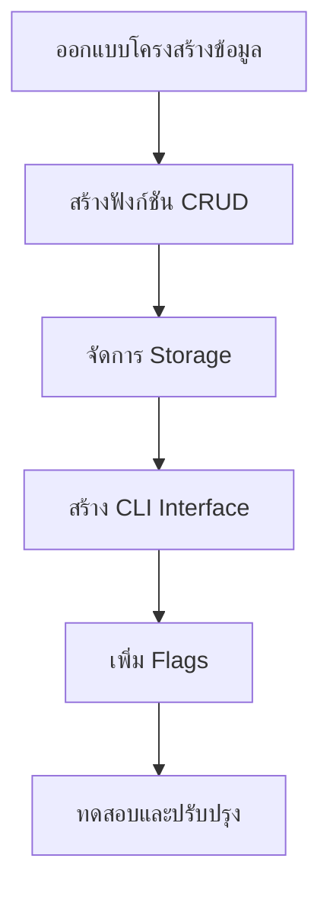

# 📘 เล่มที่ 6: 10 โครงการฝึกปฏิบัติสำหรับผู้เริ่มต้น (10 Projects for Beginners)

---

## 📖 บทนำ

การเรียนรู้ภาษาโปรแกรมที่ดีที่สุดคือการ **ลงมือทำ** เล่มนี้รวบรวม 10 โครงการที่ออกแบบมาเพื่อเปลี่ยนความรู้ทางทฤษฎีให้เป็นทักษะปฏิบัติจริง แต่ละโครงการจะพาคุณผ่านกระบวนการพัฒนาตั้งแต่เริ่มต้นจนจบ พร้อมอธิบายแนวคิดสำคัญที่เกี่ยวข้อง

### วัตถุประสงค์ของเล่มนี้

1. **เปลี่ยนความรู้เป็นทักษะ** — ลงมือเขียนโค้ดจริง
2. **เรียนรู้ผ่านการทำ** — Project-Based Learning
3. **สร้างพอร์ตโฟลิโอ** — มีโปรเจกต์ไว้โชว์
4. **เข้าใจแนวคิดสำคัญ** — ผ่านการประยุกต์ใช้จริง

### ระดับความยาก

| ระดับ | คำอธิบาย | โครงการ |
|-------|----------|---------|
| ⭐ | ง่าย | เครื่องคิดเลข, เกมทายตัวเลข |
| ⭐⭐ | ปานกลาง | To-Do List, Weather App, Currency Converter |
| ⭐⭐⭐ | ยาก | Chat App, Blog, File Encryption |
| ⭐⭐⭐⭐ | ท้าทาย | Music Player, Space Invaders |

---

## สารบัญ เล่มที่ 6

### โครงการที่ 1: แอปพลิเคชันรายการสิ่งที่ต้องทำ (To-Do List)
### โครงการที่ 2: เกมทายตัวเลข (Number Guessing Game)
### โครงการที่ 3: แอปพลิเคชันสภาพอากาศ (Weather App)
### โครงการที่ 4: แอปพลิเคชันแชท (Chat Application)
### โครงการที่ 5: เว็บไซต์บล็อกส่วนตัว (Personal Blog)
### โครงการที่ 6: เครื่องคิดเลขอย่างง่าย (Simple Calculator)
### โครงการที่ 7: การเข้ารหัสและถอดรหัสไฟล์ (File Encryption/Decryption)
### โครงการที่ 8: โปรแกรมเล่นเพลง (Music Player)
### โครงการที่ 9: ตัวแปลงสกุลเงิน (Currency Converter)
### โครงการที่ 10: เกม Space Invaders

---

## โครงการที่ 1: แอปพลิเคชันรายการสิ่งที่ต้องทำ (To-Do List)

---

### เป้าหมายและประโยชน์

**เป้าหมาย:** สร้างแอปพลิเคชัน CLI สำหรับจัดการรายการสิ่งที่ต้องทำ

**ประโยชน์ที่ได้:**
- การจัดการข้อมูลด้วย Struct
- การอ่าน/เขียนไฟล์
- การใช้ Flag และ User Input
- การจัดระเบียบโค้ด

### หัวข้อที่ต้องเรียนมาก่อน

- Struct และ Methods
- File I/O (os, encoding/json)
- Flag Package
- Error Handling

### ขั้นตอนการพัฒนา



### โค้ดตัวอย่าง

```go
// todo/todo.go
package todo

import (
    "encoding/json"
    "fmt"
    "os"
    "time"
)

type Task struct {
    ID        int       `json:"id"`
    Title     string    `json:"title"`
    Completed bool      `json:"completed"`
    CreatedAt time.Time `json:"created_at"`
    UpdatedAt time.Time `json:"updated_at"`
}

type TodoList struct {
    Tasks []Task `json:"tasks"`
    file  string
}

func NewTodoList(filename string) *TodoList {
    tl := &TodoList{
        Tasks: []Task{},
        file:  filename,
    }
    tl.load()
    return tl
}

func (tl *TodoList) load() error {
    data, err := os.ReadFile(tl.file)
    if err != nil {
        if os.IsNotExist(err) {
            return nil
        }
        return err
    }
    return json.Unmarshal(data, &tl.Tasks)
}

func (tl *TodoList) save() error {
    data, err := json.MarshalIndent(tl.Tasks, "", "  ")
    if err != nil {
        return err
    }
    return os.WriteFile(tl.file, data, 0644)
}

func (tl *TodoList) Add(title string) error {
    task := Task{
        ID:        tl.nextID(),
        Title:     title,
        Completed: false,
        CreatedAt: time.Now(),
        UpdatedAt: time.Now(),
    }
    tl.Tasks = append(tl.Tasks, task)
    return tl.save()
}

func (tl *TodoList) List() {
    if len(tl.Tasks) == 0 {
        fmt.Println("No tasks found")
        return
    }
    
    fmt.Println("\n📋 Todo List:")
    fmt.Println("━━━━━━━━━━━━━━━━━━━━━━━━━━━━━━━━━━━━━━")
    for _, task := range tl.Tasks {
        status := "◻️"
        if task.Completed {
            status = "✅"
        }
        fmt.Printf("%s [%d] %s\n", status, task.ID, task.Title)
    }
    fmt.Println("━━━━━━━━━━━━━━━━━━━━━━━━━━━━━━━━━━━━━━")
}

func (tl *TodoList) Complete(id int) error {
    for i := range tl.Tasks {
        if tl.Tasks[i].ID == id {
            tl.Tasks[i].Completed = true
            tl.Tasks[i].UpdatedAt = time.Now()
            return tl.save()
        }
    }
    return fmt.Errorf("task with ID %d not found", id)
}

func (tl *TodoList) Delete(id int) error {
    for i, task := range tl.Tasks {
        if task.ID == id {
            tl.Tasks = append(tl.Tasks[:i], tl.Tasks[i+1:]...)
            return tl.save()
        }
    }
    return fmt.Errorf("task with ID %d not found", id)
}

func (tl *TodoList) nextID() int {
    maxID := 0
    for _, task := range tl.Tasks {
        if task.ID > maxID {
            maxID = task.ID
        }
    }
    return maxID + 1
}
```

```go
// main.go
package main

import (
    "flag"
    "fmt"
    "log"
    "os"
    "strings"

    "todo"
)

const (
    filename = "tasks.json"
)

func main() {
    // Define flags
    addCmd := flag.NewFlagSet("add", flag.ExitOnError)
    addTitle := addCmd.String("title", "", "Task title")
    
    listCmd := flag.NewFlagSet("list", flag.ExitOnError)
    
    completeCmd := flag.NewFlagSet("complete", flag.ExitOnError)
    completeID := completeCmd.Int("id", 0, "Task ID to complete")
    
    deleteCmd := flag.NewFlagSet("delete", flag.ExitOnError)
    deleteID := deleteCmd.Int("id", 0, "Task ID to delete")
    
    if len(os.Args) < 2 {
        printUsage()
        return
    }
    
    todoList := todo.NewTodoList(filename)
    
    switch os.Args[1] {
    case "add":
        addCmd.Parse(os.Args[2:])
        if *addTitle == "" {
            fmt.Println("Error: Title is required")
            fmt.Println("Usage: todo add -title <title>")
            return
        }
        if err := todoList.Add(*addTitle); err != nil {
            log.Fatal("Failed to add task:", err)
        }
        fmt.Printf("✅ Added: %s\n", *addTitle)
        
    case "list":
        listCmd.Parse(os.Args[2:])
        todoList.List()
        
    case "complete":
        completeCmd.Parse(os.Args[2:])
        if *completeID == 0 {
            fmt.Println("Error: ID is required")
            fmt.Println("Usage: todo complete -id <id>")
            return
        }
        if err := todoList.Complete(*completeID); err != nil {
            log.Fatal(err)
        }
        fmt.Printf("✅ Completed task #%d\n", *completeID)
        
    case "delete":
        deleteCmd.Parse(os.Args[2:])
        if *deleteID == 0 {
            fmt.Println("Error: ID is required")
            fmt.Println("Usage: todo delete -id <id>")
            return
        }
        if err := todoList.Delete(*deleteID); err != nil {
            log.Fatal(err)
        }
        fmt.Printf("🗑️ Deleted task #%d\n", *deleteID)
        
    default:
        printUsage()
    }
}

func printUsage() {
    fmt.Println("📋 Todo List CLI")
    fmt.Println("\nUsage:")
    fmt.Println("  todo add -title <title>     Add a new task")
    fmt.Println("  todo list                   List all tasks")
    fmt.Println("  todo complete -id <id>      Complete a task")
    fmt.Println("  todo delete -id <id>        Delete a task")
}
```

### แบบฝึกหัดเพิ่มเติม

1. **เพิ่ม Due Date** — ให้แต่ละ Task มีวันที่ครบกำหนด
2. **เพิ่ม Priority** — High, Medium, Low
3. **เพิ่ม Categories** — จัดกลุ่ม Task ตามหมวดหมู่
4. **Search Function** — ค้นหา Task ตาม Keyword
5. **Export/Import** — ส่งออกเป็น CSV หรือ JSON
6. **Web Version** — สร้าง Web UI ด้วย HTML Templates

---

## โครงการที่ 2: เกมทายตัวเลข (Number Guessing Game)

---

### เป้าหมายและประโยชน์

**เป้าหมาย:** สร้างเกม CLI ที่ให้ผู้เล่นทายตัวเลขสุ่ม

**ประโยชน์ที่ได้:**
- การใช้ Random
- Loop และ Condition
- Input/Output
- Error Handling

### โค้ดตัวอย่าง

```go
// main.go
package main

import (
    "bufio"
    "fmt"
    "math/rand"
    "os"
    "strconv"
    "strings"
    "time"
)

const (
    minNumber   = 1
    maxNumber   = 100
    maxAttempts = 10
)

func main() {
    rand.Seed(time.Now().UnixNano())
    target := rand.Intn(maxNumber-minNumber+1) + minNumber
    
    reader := bufio.NewReader(os.Stdin)
    attempts := 0
    
    fmt.Println("🎯 Number Guessing Game")
    fmt.Printf("Guess a number between %d and %d\n", minNumber, maxNumber)
    fmt.Printf("You have %d attempts\n\n", maxAttempts)
    
    for attempts < maxAttempts {
        remaining := maxAttempts - attempts
        fmt.Printf("Attempts remaining: %d\n", remaining)
        fmt.Print("Enter your guess: ")
        
        input, err := reader.ReadString('\n')
        if err != nil {
            fmt.Println("Error reading input:", err)
            continue
        }
        
        input = strings.TrimSpace(input)
        guess, err := strconv.Atoi(input)
        if err != nil {
            fmt.Println("Please enter a valid number")
            continue
        }
        
        attempts++
        
        if guess < minNumber || guess > maxNumber {
            fmt.Printf("Please enter a number between %d and %d\n", minNumber, maxNumber)
            continue
        }
        
        if guess == target {
            fmt.Printf("\n🎉 Congratulations! You guessed it in %d attempts!\n", attempts)
            fmt.Printf("The number was %d\n", target)
            return
        }
        
        if guess < target {
            fmt.Println("📈 Too low! Try higher.")
        } else {
            fmt.Println("📉 Too high! Try lower.")
        }
        fmt.Println()
    }
    
    fmt.Printf("\n😢 Game Over! The number was %d\n", target)
    fmt.Println("Better luck next time!")
}
```

### แบบฝึกหัดเพิ่มเติม

1. **ระดับความยาก** — Easy (1-50, 15 attempts), Medium (1-100, 10 attempts), Hard (1-200, 5 attempts)
2. **Score System** — คำนวณคะแนนตามจำนวนครั้งที่ใช้
3. **Hint System** — ให้ Hint ทุก 3 ครั้ง
4. **High Score** — บันทึกคะแนนสูงสุด
5. **Multiplayer** — ผลัดกันเล่น

---

## โครงการที่ 3: แอปพลิเคชันสภาพอากาศ (Weather App)

---

### เป้าหมายและประโยชน์

**เป้าหมาย:** สร้าง CLI Tool ที่ดึงข้อมูลสภาพอากาศจาก API

**ประโยชน์ที่ได้:**
- การทำงานกับ API
- JSON Unmarshal
- HTTP Client
- Environment Variables

### โค้ดตัวอย่าง

```go
// weather/weather.go
package weather

import (
    "encoding/json"
    "fmt"
    "io"
    "net/http"
    "net/url"
    "time"
)

type Config struct {
    APIKey string
    BaseURL string
}

type WeatherResponse struct {
    Location struct {
        Name    string `json:"name"`
        Country string `json:"country"`
        Localtime string `json:"localtime"`
    } `json:"location"`
    Current struct {
        TempC     float64 `json:"temp_c"`
        TempF     float64 `json:"temp_f"`
        Condition struct {
            Text string `json:"text"`
            Icon string `json:"icon"`
        } `json:"condition"`
        WindKph    float64 `json:"wind_kph"`
        Humidity   int     `json:"humidity"`
        Cloud      int     `json:"cloud"`
        FeelslikeC float64 `json:"feelslike_c"`
        UV         float64 `json:"uv"`
    } `json:"current"`
}

type Client struct {
    httpClient *http.Client
    config     Config
}

func NewClient(apiKey string) *Client {
    return &Client{
        httpClient: &http.Client{
            Timeout: 10 * time.Second,
        },
        config: Config{
            APIKey:  apiKey,
            BaseURL: "https://api.weatherapi.com/v1",
        },
    }
}

func (c *Client) GetWeather(city string) (*WeatherResponse, error) {
    endpoint := fmt.Sprintf("%s/current.json?key=%s&q=%s",
        c.config.BaseURL,
        c.config.APIKey,
        url.QueryEscape(city),
    )
    
    resp, err := c.httpClient.Get(endpoint)
    if err != nil {
        return nil, err
    }
    defer resp.Body.Close()
    
    if resp.StatusCode != http.StatusOK {
        body, _ := io.ReadAll(resp.Body)
        return nil, fmt.Errorf("API error: %s", string(body))
    }
    
    data, err := io.ReadAll(resp.Body)
    if err != nil {
        return nil, err
    }
    
    var weather WeatherResponse
    if err := json.Unmarshal(data, &weather); err != nil {
        return nil, err
    }
    
    return &weather, nil
}

func (w *WeatherResponse) Display() {
    fmt.Println("\n🌤️  Weather Report")
    fmt.Println("━━━━━━━━━━━━━━━━━━━━━━━━━━━━━━━━━━━━━━")
    fmt.Printf("📍 Location: %s, %s\n", w.Location.Name, w.Location.Country)
    fmt.Printf("🕐 Local Time: %s\n", w.Location.Localtime)
    fmt.Println("━━━━━━━━━━━━━━━━━━━━━━━━━━━━━━━━━━━━━━")
    fmt.Printf("🌡️  Temperature: %.1f°C / %.1f°F\n", w.Current.TempC, w.Current.TempF)
    fmt.Printf("🌡️  Feels Like: %.1f°C\n", w.Current.FeelslikeC)
    fmt.Printf("☁️  Condition: %s\n", w.Current.Condition.Text)
    fmt.Printf("💨 Wind: %.1f km/h\n", w.Current.WindKph)
    fmt.Printf("💧 Humidity: %d%%\n", w.Current.Humidity)
    fmt.Printf("☁️  Cloud Cover: %d%%\n", w.Current.Cloud)
    fmt.Printf("☀️  UV Index: %.1f\n", w.Current.UV)
    fmt.Println("━━━━━━━━━━━━━━━━━━━━━━━━━━━━━━━━━━━━━━")
}
```

```go
// main.go
package main

import (
    "flag"
    "fmt"
    "log"
    "os"

    "weather"
)

func main() {
    var city string
    flag.StringVar(&city, "city", "", "City name")
    flag.StringVar(&city, "c", "", "City name (short)")
    flag.Parse()
    
    if city == "" {
        fmt.Println("❌ Error: City is required")
        fmt.Println("Usage: weather -city <city_name>")
        fmt.Println("Example: weather -city Bangkok")
        return
    }
    
    apiKey := os.Getenv("WEATHER_API_KEY")
    if apiKey == "" {
        fmt.Println("❌ Error: WEATHER_API_KEY environment variable is not set")
        fmt.Println("Get your API key from https://www.weatherapi.com")
        return
    }
    
    client := weather.NewClient(apiKey)
    
    data, err := client.GetWeather(city)
    if err != nil {
        log.Fatal("Failed to get weather:", err)
    }
    
    data.Display()
}
```

### แบบฝึกหัดเพิ่มเติม

1. **Forecast** — แสดงพยากรณ์อากาศ 3-7 วัน
2. **Units** — สลับระหว่าง Metric และ Imperial
3. **Cache** — เก็บข้อมูลใน Cache 5 นาที
4. **Multiple Cities** — เปรียบเทียบหลายเมือง
5. **Alerts** — แจ้งเตือนสภาพอากาศรุนแรง
6. **Web Version** — สร้าง Web UI

---

## โครงการที่ 4: แอปพลิเคชันแชท (Chat Application)

---

### เป้าหมายและประโยชน์

**เป้าหมาย:** สร้างแอปพลิเคชันแชทแบบ Real-time

**ประโยชน์ที่ได้:**
- TCP/WebSocket
- Goroutines และ Channels
- Concurrent Programming
- Real-time Communication

### โค้ดตัวอย่าง

(เนื่องจากเนื้อหายาว โปรดดูบทที่ 4 ของเล่มที่ 4 ซึ่งมีโค้ด Chat Application ครบถ้วน)

### แบบฝึกหัดเพิ่มเติม

1. **Private Messages** — แชทส่วนตัว
2. **Chat Rooms** — สร้างห้องแชท
3. **File Sharing** — ส่งไฟล์
4. **Emoji Support** — รองรับ Emoji
5. **User Authentication** — Login/Register
6. **Message History** — เก็บประวัติการแชท

---

## โครงการที่ 5: เว็บไซต์บล็อกส่วนตัว (Personal Blog)

---

### เป้าหมายและประโยชน์

**เป้าหมาย:** สร้างเว็บไซต์บล็อกส่วนตัว

**ประโยชน์ที่ได้:**
- Web Development
- Template
- Routing
- Data Persistence

### โค้ดตัวอย่าง

(เนื่องจากเนื้อหายาว โปรดดูบทที่ 3 ของเล่มที่ 4 ซึ่งมี Web Application ครบถ้วน)

### แบบฝึกหัดเพิ่มเติม

1. **Admin Panel** — จัดการโพสต์
2. **Comments** — ระบบคอมเมนต์
3. **Categories** — หมวดหมู่บทความ
4. **Search** — ค้นหาบทความ
5. **RSS Feed** — สร้าง RSS Feed
6. **Markdown** — รองรับ Markdown

---

## โครงการที่ 6: เครื่องคิดเลขอย่างง่าย (Simple Calculator)

---

### เป้าหมายและประโยชน์

**เป้าหมาย:** สร้างเครื่องคิดเลข CLI

**ประโยชน์ที่ได้:**
- Function Design
- Error Handling
- String Parsing
- Switch Statement

### โค้ดตัวอย่าง

```go
// calculator/calculator.go
package main

import (
    "bufio"
    "fmt"
    "math"
    "os"
    "strconv"
    "strings"
)

type Operation struct {
    Name     string
    Symbol   string
    Function func(float64, float64) float64
}

var operations = []Operation{
    {"Add", "+", func(a, b float64) float64 { return a + b }},
    {"Subtract", "-", func(a, b float64) float64 { return a - b }},
    {"Multiply", "*", func(a, b float64) float64 { return a * b }},
    {"Divide", "/", func(a, b float64) float64 { 
        if b == 0 {
            return math.NaN()
        }
        return a / b 
    }},
    {"Power", "^", func(a, b float64) float64 { return math.Pow(a, b) }},
    {"Modulo", "%", func(a, b float64) float64 { 
        if b == 0 {
            return math.NaN()
        }
        return math.Mod(a, b) 
    }},
}

func main() {
    reader := bufio.NewReader(os.Stdin)
    
    fmt.Println("🧮 Simple Calculator")
    fmt.Println("Enter 'q' to quit")
    fmt.Println("━━━━━━━━━━━━━━━━━━━━━━━━━━━━━━━━━━━━━━")
    fmt.Println("Supported operations:")
    for _, op := range operations {
        fmt.Printf("  %s (%s)\n", op.Name, op.Symbol)
    }
    fmt.Println("━━━━━━━━━━━━━━━━━━━━━━━━━━━━━━━━━━━━━━")
    
    for {
        fmt.Print("\nEnter expression (e.g., 5 + 3): ")
        input, err := reader.ReadString('\n')
        if err != nil {
            fmt.Println("Error reading input:", err)
            continue
        }
        
        input = strings.TrimSpace(input)
        if strings.ToLower(input) == "q" {
            fmt.Println("Goodbye! 👋")
            break
        }
        
        result, err := calculate(input)
        if err != nil {
            fmt.Println("❌", err)
            continue
        }
        
        if math.IsNaN(result) {
            fmt.Println("❌ Error: Division by zero or invalid operation")
            continue
        }
        
        fmt.Printf("✅ Result: %s = %.4f\n", input, result)
    }
}

func calculate(expression string) (float64, error) {
    parts := strings.Fields(expression)
    if len(parts) != 3 {
        return 0, fmt.Errorf("invalid format. Use: number operator number")
    }
    
    a, err := strconv.ParseFloat(parts[0], 64)
    if err != nil {
        return 0, fmt.Errorf("invalid first number: %v", err)
    }
    
    op := parts[1]
    
    b, err := strconv.ParseFloat(parts[2], 64)
    if err != nil {
        return 0, fmt.Errorf("invalid second number: %v", err)
    }
    
    for _, operation := range operations {
        if operation.Symbol == op {
            return operation.Function(a, b), nil
        }
    }
    
    return 0, fmt.Errorf("unknown operator: %s", op)
}
```

### แบบฝึกหัดเพิ่มเติม

1. **Scientific Functions** — sin, cos, log, sqrt
2. **Memory** — M+, M-, MR, MC
3. **History** — เก็บประวัติการคำนวณ
4. **Parentheses** — รองรับวงเล็บ
5. **GUI Version** — สร้าง GUI

---

## โครงการที่ 7: การเข้ารหัสและถอดรหัสไฟล์ (File Encryption/Decryption)

---

### เป้าหมายและประโยชน์

**เป้าหมาย:** สร้างเครื่องมือเข้ารหัส/ถอดรหัสไฟล์

**ประโยชน์ที่ได้:**
- Cryptography
- File I/O
- Command Line Tool
- Security Best Practices

### โค้ดตัวอย่าง

```go
// crypto/crypto.go
package crypto

import (
    "crypto/aes"
    "crypto/cipher"
    "crypto/rand"
    "crypto/sha256"
    "encoding/hex"
    "errors"
    "fmt"
    "io"
    "os"
)

type Crypto struct {
    key []byte
}

func NewCrypto(password string) *Crypto {
    // Derive key from password
    hash := sha256.Sum256([]byte(password))
    return &Crypto{
        key: hash[:],
    }
}

func (c *Crypto) EncryptFile(inputPath, outputPath string) error {
    // Read input file
    plaintext, err := os.ReadFile(inputPath)
    if err != nil {
        return err
    }
    
    // Create cipher block
    block, err := aes.NewCipher(c.key)
    if err != nil {
        return err
    }
    
    // Create GCM mode
    gcm, err := cipher.NewGCM(block)
    if err != nil {
        return err
    }
    
    // Generate nonce
    nonce := make([]byte, gcm.NonceSize())
    if _, err := io.ReadFull(rand.Reader, nonce); err != nil {
        return err
    }
    
    // Encrypt
    ciphertext := gcm.Seal(nonce, nonce, plaintext, nil)
    
    // Write to output
    return os.WriteFile(outputPath, ciphertext, 0644)
}

func (c *Crypto) DecryptFile(inputPath, outputPath string) error {
    // Read input file
    ciphertext, err := os.ReadFile(inputPath)
    if err != nil {
        return err
    }
    
    // Create cipher block
    block, err := aes.NewCipher(c.key)
    if err != nil {
        return err
    }
    
    // Create GCM mode
    gcm, err := cipher.NewGCM(block)
    if err != nil {
        return err
    }
    
    // Extract nonce
    nonceSize := gcm.NonceSize()
    if len(ciphertext) < nonceSize {
        return errors.New("ciphertext too short")
    }
    
    nonce, ciphertext := ciphertext[:nonceSize], ciphertext[nonceSize:]
    
    // Decrypt
    plaintext, err := gcm.Open(nil, nonce, ciphertext, nil)
    if err != nil {
        return err
    }
    
    // Write to output
    return os.WriteFile(outputPath, plaintext, 0644)
}

func (c *Crypto) EncryptString(text string) string {
    // Implementation for string encryption
    return hex.EncodeToString([]byte(text))
}
```

```go
// main.go
package main

import (
    "flag"
    "fmt"
    "log"
    "os"
    "strings"

    "crypto"
)

func main() {
    var (
        action     string
        input      string
        output     string
        password   string
    )
    
    flag.StringVar(&action, "action", "encrypt", "encrypt or decrypt")
    flag.StringVar(&action, "a", "encrypt", "encrypt or decrypt (short)")
    flag.StringVar(&input, "input", "", "Input file path")
    flag.StringVar(&input, "i", "", "Input file path (short)")
    flag.StringVar(&output, "output", "", "Output file path")
    flag.StringVar(&output, "o", "", "Output file path (short)")
    flag.StringVar(&password, "password", "", "Password for encryption")
    flag.StringVar(&password, "p", "", "Password (short)")
    flag.Parse()
    
    if input == "" || password == "" {
        printUsage()
        return
    }
    
    // Generate output filename if not specified
    if output == "" {
        if action == "encrypt" {
            output = input + ".enc"
        } else {
            output = strings.TrimSuffix(input, ".enc") + ".dec"
        }
    }
    
    c := crypto.NewCrypto(password)
    
    var err error
    if action == "encrypt" {
        fmt.Printf("🔒 Encrypting: %s -> %s\n", input, output)
        err = c.EncryptFile(input, output)
    } else {
        fmt.Printf("🔓 Decrypting: %s -> %s\n", input, output)
        err = c.DecryptFile(input, output)
    }
    
    if err != nil {
        log.Fatal("Operation failed:", err)
    }
    
    fmt.Println("✅ Done!")
}

func printUsage() {
    fmt.Println("🔐 File Encryption Tool")
    fmt.Println("\nUsage:")
    fmt.Println("  crypto -action encrypt -input <file> -password <pass>")
    fmt.Println("  crypto -action decrypt -input <file> -password <pass>")
    fmt.Println("\nOptions:")
    fmt.Println("  -a, -action   encrypt or decrypt")
    fmt.Println("  -i, -input    Input file path")
    fmt.Println("  -o, -output   Output file path (optional)")
    fmt.Println("  -p, -password Password for encryption")
}
```

### แบบฝึกหัดเพิ่มเติม

1. **RSA Encryption** — ใช้ Asymmetric Encryption
2. **File Signing** — Digital Signature
3. **Password Manager** — จัดเก็บรหัสผ่าน
4. **Steganography** — ซ่อนข้อมูลในรูปภาพ

---

## โครงการที่ 8: โปรแกรมเล่นเพลง (Music Player)

---

### เป้าหมายและประโยชน์

**เป้าหมาย:** สร้างโปรแกรมเล่นเพลง CLI

**ประโยชน์ที่ได้:**
- External Libraries (beep, ebitengine)
- Goroutines
- Audio Processing
- State Management

### โค้ดตัวอย่าง

```go
// player/player.go
package player

import (
    "fmt"
    "io"
    "os"
    "path/filepath"
    "sync"
    "time"

    "github.com/faiface/beep"
    "github.com/faiface/beep/mp3"
    "github.com/faiface/beep/speaker"
)

type Song struct {
    Name     string
    Path     string
    Duration time.Duration
}

type Player struct {
    songs     []Song
    current   int
    playing   bool
    paused    bool
    stream    beep.StreamSeekCloser
    ctrl      *beep.Ctrl
    mu        sync.Mutex
}

func NewPlayer() *Player {
    return &Player{
        songs:   []Song{},
        current: -1,
    }
}

func (p *Player) AddSong(path string) error {
    file, err := os.Open(path)
    if err != nil {
        return err
    }
    defer file.Close()
    
    streamer, format, err := mp3.Decode(file)
    if err != nil {
        return err
    }
    defer streamer.Close()
    
    // Get duration
    duration := streamer.Len() / int(format.SampleRate)
    
    p.songs = append(p.songs, Song{
        Name:     filepath.Base(path),
        Path:     path,
        Duration: time.Duration(duration) * time.Second,
    })
    
    return nil
}

func (p *Player) Play(index int) error {
    p.mu.Lock()
    defer p.mu.Unlock()
    
    if index < 0 || index >= len(p.songs) {
        return fmt.Errorf("invalid song index")
    }
    
    p.current = index
    p.playing = true
    p.paused = false
    
    // Close previous stream
    if p.stream != nil {
        p.stream.Close()
    }
    
    // Open new stream
    file, err := os.Open(p.songs[index].Path)
    if err != nil {
        return err
    }
    
    streamer, format, err := mp3.Decode(file)
    if err != nil {
        return err
    }
    
    p.stream = streamer
    p.ctrl = &beep.Ctrl{Streamer: streamer, Paused: false}
    
    // Init speaker
    if err := speaker.Init(format.SampleRate, format.SampleRate.N(time.Second/10)); err != nil {
        return err
    }
    
    speaker.Play(p.ctrl)
    
    fmt.Printf("▶️  Playing: %s\n", p.songs[index].Name)
    fmt.Printf("⏱️  Duration: %v\n", p.songs[index].Duration)
    
    return nil
}

func (p *Player) Pause() {
    p.mu.Lock()
    defer p.mu.Unlock()
    
    if !p.playing || p.paused {
        return
    }
    
    p.paused = true
    if p.ctrl != nil {
        p.ctrl.Paused = true
    }
    fmt.Println("⏸️  Paused")
}

func (p *Player) Resume() {
    p.mu.Lock()
    defer p.mu.Unlock()
    
    if !p.playing || !p.paused {
        return
    }
    
    p.paused = false
    if p.ctrl != nil {
        p.ctrl.Paused = false
    }
    fmt.Println("▶️  Resumed")
}

func (p *Player) Stop() {
    p.mu.Lock()
    defer p.mu.Unlock()
    
    p.playing = false
    p.paused = false
    if p.ctrl != nil {
        p.ctrl.Paused = true
    }
    fmt.Println("⏹️  Stopped")
}

func (p *Player) Next() error {
    if len(p.songs) == 0 {
        return fmt.Errorf("no songs in playlist")
    }
    next := p.current + 1
    if next >= len(p.songs) {
        next = 0
    }
    return p.Play(next)
}

func (p *Player) Previous() error {
    if len(p.songs) == 0 {
        return fmt.Errorf("no songs in playlist")
    }
    prev := p.current - 1
    if prev < 0 {
        prev = len(p.songs) - 1
    }
    return p.Play(prev)
}

func (p *Player) List() {
    if len(p.songs) == 0 {
        fmt.Println("📭 No songs in playlist")
        return
    }
    
    fmt.Println("\n🎵 Playlist:")
    fmt.Println("━━━━━━━━━━━━━━━━━━━━━━━━━━━━━━━━━━━━━━")
    for i, song := range p.songs {
        marker := "  "
        if i == p.current && p.playing {
            marker = "▶️"
        } else if i == p.current {
            marker = "⏸️"
        }
        fmt.Printf("%s [%d] %s (%v)\n", marker, i+1, song.Name, song.Duration)
    }
    fmt.Println("━━━━━━━━━━━━━━━━━━━━━━━━━━━━━━━━━━━━━━")
}
```

### แบบฝึกหัดเพิ่มเติม

1. **Playlist Management** — สร้าง, บันทึก, โหลด Playlist
2. **Volume Control** — ควบคุมระดับเสียง
3. **Equalizer** — ปรับแต่งเสียง
4. **Shuffle Mode** — สุ่มเพลง
5. **Repeat Mode** — เล่นซ้ำ

---

## โครงการที่ 9: ตัวแปลงสกุลเงิน (Currency Converter)

---

### เป้าหมายและประโยชน์

**เป้าหมาย:** สร้างเครื่องมือแปลงสกุลเงินแบบ Real-time

**ประโยชน์ที่ได้:**
- API Integration
- Real-time Data
- Caching
- Error Handling

### โค้ดตัวอย่าง

```go
// currency/currency.go
package currency

import (
    "encoding/json"
    "fmt"
    "io"
    "net/http"
    "sync"
    "time"
)

type ExchangeRate struct {
    Base   string             `json:"base"`
    Rates  map[string]float64 `json:"rates"`
    Date   string             `json:"date"`
    Timestamp time.Time
}

type Converter struct {
    apiKey     string
    baseURL    string
    cache      map[string]*ExchangeRate
    cacheTTL   time.Duration
    mu         sync.RWMutex
    httpClient *http.Client
}

func NewConverter(apiKey string) *Converter {
    return &Converter{
        apiKey:   apiKey,
        baseURL:  "https://api.exchangerate-api.com/v4/latest",
        cache:    make(map[string]*ExchangeRate),
        cacheTTL: 1 * time.Hour,
        httpClient: &http.Client{
            Timeout: 10 * time.Second,
        },
    }
}

func (c *Converter) GetRates(base string) (*ExchangeRate, error) {
    // Check cache
    c.mu.RLock()
    if data, ok := c.cache[base]; ok {
        if time.Since(data.Timestamp) < c.cacheTTL {
            c.mu.RUnlock()
            return data, nil
        }
    }
    c.mu.RUnlock()
    
    // Fetch from API
    url := fmt.Sprintf("%s/%s", c.baseURL, base)
    resp, err := c.httpClient.Get(url)
    if err != nil {
        return nil, err
    }
    defer resp.Body.Close()
    
    body, err := io.ReadAll(resp.Body)
    if err != nil {
        return nil, err
    }
    
    var rate ExchangeRate
    if err := json.Unmarshal(body, &rate); err != nil {
        return nil, err
    }
    
    rate.Timestamp = time.Now()
    
    // Update cache
    c.mu.Lock()
    c.cache[base] = &rate
    c.mu.Unlock()
    
    return &rate, nil
}

func (c *Converter) Convert(amount float64, from, to string) (float64, error) {
    if from == to {
        return amount, nil
    }
    
    rates, err := c.GetRates(from)
    if err != nil {
        return 0, err
    }
    
    rate, ok := rates.Rates[to]
    if !ok {
        return 0, fmt.Errorf("currency %s not supported", to)
    }
    
    return amount * rate, nil
}

func (c *Converter) ListSupported() []string {
    // Fetch from cache or API
    rates, err := c.GetRates("USD")
    if err != nil {
        return []string{}
    }
    
    currencies := make([]string, 0, len(rates.Rates))
    for currency := range rates.Rates {
        currencies = append(currencies, currency)
    }
    return currencies
}
```

```go
// main.go
package main

import (
    "bufio"
    "flag"
    "fmt"
    "os"
    "strconv"
    "strings"

    "currency"
)

func main() {
    var (
        amount float64
        from   string
        to     string
        list   bool
    )
    
    flag.Float64Var(&amount, "amount", 0, "Amount to convert")
    flag.StringVar(&from, "from", "USD", "Source currency")
    flag.StringVar(&to, "to", "EUR", "Target currency")
    flag.BoolVar(&list, "list", false, "List supported currencies")
    flag.Parse()
    
    apiKey := os.Getenv("CURRENCY_API_KEY")
    if apiKey == "" {
        fmt.Println("❌ Error: CURRENCY_API_KEY environment variable is not set")
        fmt.Println("Get your API key from https://exchangerate-api.com")
        return
    }
    
    conv := currency.NewConverter(apiKey)
    
    if list {
        currencies := conv.ListSupported()
        fmt.Println("\n🌍 Supported Currencies:")
        fmt.Println("━━━━━━━━━━━━━━━━━━━━━━━━━━━━━━━━━━━━━━")
        for i, curr := range currencies {
            if i%5 == 0 {
                fmt.Println()
            }
            fmt.Printf("%s ", curr)
        }
        fmt.Println()
        return
    }
    
    if amount == 0 {
        // Interactive mode
        interactiveMode(conv)
        return
    }
    
    result, err := conv.Convert(amount, from, to)
    if err != nil {
        fmt.Println("❌ Error:", err)
        return
    }
    
    fmt.Printf("💱 %.2f %s = %.2f %s\n", amount, from, result, to)
}

func interactiveMode(conv *currency.Converter) {
    reader := bufio.NewReader(os.Stdin)
    
    fmt.Println("💱 Currency Converter")
    fmt.Println("Enter 'quit' to exit")
    fmt.Println("━━━━━━━━━━━━━━━━━━━━━━━━━━━━━━━━━━━━━━")
    
    for {
        fmt.Print("\nEnter amount (e.g., 100 USD to EUR): ")
        input, err := reader.ReadString('\n')
        if err != nil {
            fmt.Println("Error reading input:", err)
            continue
        }
        
        input = strings.TrimSpace(input)
        if strings.ToLower(input) == "quit" {
            fmt.Println("Goodbye! 👋")
            break
        }
        
        parts := strings.Fields(input)
        if len(parts) != 4 || parts[2] != "to" {
            fmt.Println("❌ Invalid format. Use: amount from_currency to to_currency")
            fmt.Println("Example: 100 USD to EUR")
            continue
        }
        
        amount, err := strconv.ParseFloat(parts[0], 64)
        if err != nil {
            fmt.Println("❌ Invalid amount:", err)
            continue
        }
        
        from := strings.ToUpper(parts[1])
        to := strings.ToUpper(parts[3])
        
        result, err := conv.Convert(amount, from, to)
        if err != nil {
            fmt.Println("❌ Error:", err)
            continue
        }
        
        fmt.Printf("✅ %.2f %s = %.2f %s\n", amount, from, result, to)
    }
}
```

### แบบฝึกหัดเพิ่มเติม

1. **Historical Data** — แสดงอัตราแลกเปลี่ยนย้อนหลัง
2. **Graph** — แสดงกราฟการเปลี่ยนแปลง
3. **Favorites** — บันทึกสกุลเงินที่ใช้บ่อย
4. **Offline Mode** — ใช้ข้อมูลล่าสุดที่ Cache

---

## โครงการที่ 10: เกม Space Invaders

---

### เป้าหมายและประโยชน์

**เป้าหมาย:** สร้างเกม Space Invaders ด้วย Ebitengine

**ประโยชน์ที่ได้:**
- Game Development
- Event Handling
- Collision Detection
- Ebitengine Library

### โค้ดตัวอย่าง

```go
// main.go
package main

import (
    "image/color"
    "log"
    "math/rand"
    "time"

    "github.com/hajimehoshi/ebiten/v2"
    "github.com/hajimehoshi/ebiten/v2/ebitenutil"
)

const (
    screenWidth  = 800
    screenHeight = 600
    shipSpeed    = 5
    bulletSpeed  = 7
    alienSpeed   = 2
)

type Game struct {
    ship     *Ship
    bullets  []*Bullet
    aliens   []*Alien
    score    int
    gameOver bool
}

type Ship struct {
    x, y       float64
    width, height float64
}

type Bullet struct {
    x, y       float64
    width, height float64
    active     bool
}

type Alien struct {
    x, y       float64
    width, height float64
    active     bool
    direction  int
}

func NewGame() *Game {
    g := &Game{
        ship: &Ship{
            x:      screenWidth / 2,
            y:      screenHeight - 50,
            width:  40,
            height: 30,
        },
        bullets:  make([]*Bullet, 0),
        aliens:   make([]*Alien, 0),
        score:    0,
        gameOver: false,
    }
    
    g.initAliens()
    return g
}

func (g *Game) initAliens() {
    for i := 0; i < 5; i++ {
        for j := 0; j < 8; j++ {
            alien := &Alien{
                x:         50 + float64(j)*80,
                y:         50 + float64(i)*60,
                width:     40,
                height:    30,
                active:    true,
                direction: 1,
            }
            g.aliens = append(g.aliens, alien)
        }
    }
}

func (g *Game) Update() error {
    if g.gameOver {
        if ebiten.IsKeyPressed(ebiten.KeySpace) {
            return nil // Reset game
        }
        return nil
    }
    
    // Move ship
    if ebiten.IsKeyPressed(ebiten.KeyLeft) {
        g.ship.x -= shipSpeed
    }
    if ebiten.IsKeyPressed(ebiten.KeyRight) {
        g.ship.x += shipSpeed
    }
    
    // Boundary check
    if g.ship.x < 0 {
        g.ship.x = 0
    }
    if g.ship.x+g.ship.width > screenWidth {
        g.ship.x = screenWidth - g.ship.width
    }
    
    // Shoot
    if ebiten.IsKeyPressed(ebiten.KeySpace) {
        g.shoot()
    }
    
    // Update bullets
    for _, bullet := range g.bullets {
        bullet.y -= bulletSpeed
        if bullet.y < 0 {
            bullet.active = false
        }
    }
    g.cleanupBullets()
    
    // Update aliens
    moveDown := false
    for _, alien := range g.aliens {
        if alien.active {
            alien.x += float64(alien.direction) * alienSpeed
            if alien.x < 0 || alien.x+alien.width > screenWidth {
                moveDown = true
            }
        }
    }
    
    if moveDown {
        for _, alien := range g.aliens {
            if alien.active {
                alien.direction *= -1
                alien.y += 20
            }
        }
    }
    
    // Check collisions
    g.checkCollisions()
    
    // Check if aliens reached bottom
    for _, alien := range g.aliens {
        if alien.active && alien.y+alien.height > g.ship.y {
            g.gameOver = true
            return nil
        }
    }
    
    return nil
}

func (g *Game) shoot() {
    bullet := &Bullet{
        x:      g.ship.x + g.ship.width/2 - 2,
        y:      g.ship.y - 10,
        width:  4,
        height: 10,
        active: true,
    }
    g.bullets = append(g.bullets, bullet)
}

func (g *Game) cleanupBullets() {
    var active []*Bullet
    for _, bullet := range g.bullets {
        if bullet.active {
            active = append(active, bullet)
        }
    }
    g.bullets = active
}

func (g *Game) checkCollisions() {
    for _, bullet := range g.bullets {
        if !bullet.active {
            continue
        }
        for _, alien := range g.aliens {
            if !alien.active {
                continue
            }
            if g.rectIntersect(
                bullet.x, bullet.y, bullet.width, bullet.height,
                alien.x, alien.y, alien.width, alien.height,
            ) {
                bullet.active = false
                alien.active = false
                g.score += 10
            }
        }
    }
}

func (g *Game) rectIntersect(x1, y1, w1, h1, x2, y2, w2, h2 float64) bool {
    return x1 < x2+w2 && x1+w1 > x2 && y1 < y2+h2 && y1+h1 > y2
}

func (g *Game) Draw(screen *ebiten.Image) {
    // Draw ship
    ebitenutil.DrawRect(screen, g.ship.x, g.ship.y, g.ship.width, g.ship.height, color.RGBA{0, 255, 0, 255})
    
    // Draw bullets
    for _, bullet := range g.bullets {
        if bullet.active {
            ebitenutil.DrawRect(screen, bullet.x, bullet.y, bullet.width, bullet.height, color.RGBA{255, 255, 0, 255})
        }
    }
    
    // Draw aliens
    for _, alien := range g.aliens {
        if alien.active {
            ebitenutil.DrawRect(screen, alien.x, alien.y, alien.width, alien.height, color.RGBA{255, 0, 0, 255})
        }
    }
    
    // Draw score
    ebitenutil.DebugPrint(screen, fmt.Sprintf("Score: %d", g.score))
    
    if g.gameOver {
        ebitenutil.DebugPrintAt(screen, "GAME OVER! Press SPACE to restart", screenWidth/2-100, screenHeight/2)
    }
}

func (g *Game) Layout(outsideWidth, outsideHeight int) (int, int) {
    return screenWidth, screenHeight
}

func main() {
    rand.Seed(time.Now().UnixNano())
    ebiten.SetWindowSize(screenWidth, screenHeight)
    ebiten.SetWindowTitle("Space Invaders")
    
    if err := ebiten.RunGame(NewGame()); err != nil {
        log.Fatal(err)
    }
}
```

### แบบฝึกหัดเพิ่มเติม

1. **Power-ups** — เพิ่มพลังพิเศษ
2. **Levels** — ระดับความยากเพิ่มขึ้น
3. **Sound Effects** — เพิ่มเสียง
4. **High Score** — บันทึกคะแนนสูงสุด
5. **Boss Fights** — เพิ่มบอส

---

## 📝 สรุปเล่มที่ 6

### สรุปโครงการทั้งหมด

| โครงการ | ระดับ | เทคโนโลยี | เวลา |
|---------|-------|-----------|------|
| To-Do List | ⭐⭐ | CLI, JSON | 2-3 ชม. |
| Number Guessing | ⭐ | CLI, Random | 1-2 ชม. |
| Weather App | ⭐⭐ | API, HTTP | 2-3 ชม. |
| Chat App | ⭐⭐⭐ | TCP, Goroutines | 4-6 ชม. |
| Personal Blog | ⭐⭐⭐ | Web, Templates | 4-6 ชม. |
| Calculator | ⭐ | CLI, Math | 1-2 ชม. |
| File Encryption | ⭐⭐ | Crypto, File I/O | 3-4 ชม. |
| Music Player | ⭐⭐⭐ | Audio, Libraries | 4-6 ชม. |
| Currency Converter | ⭐⭐ | API, Cache | 2-3 ชม. |
| Space Invaders | ⭐⭐⭐⭐ | Ebitengine, Game Dev | 6-8 ชม. |

### สิ่งที่ได้เรียนรู้

1. **การออกแบบโปรเจกต์** — วางแผนก่อนเขียนโค้ด
2. **การจัดการข้อมูล** — File, JSON, Database
3. **API Integration** — เรียกใช้ API ภายนอก
4. **Concurrency** — Goroutines, Channels
5. **Web Development** — HTTP, Templates
6. **Cryptography** — การเข้ารหัสข้อมูล
7. **Game Development** — Ebitengine, Collision
8. **CLI Tools** — Flags, User Input

---
**จบเล่มที่ 6: 10 โครงการฝึกปฏิบัติสำหรับผู้เริ่มต้น** 🎉
 