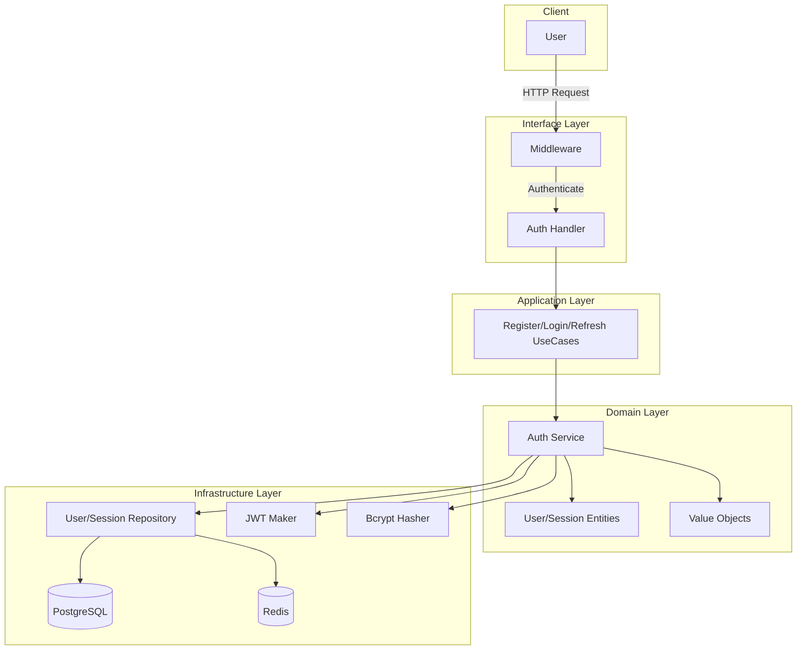

# Auth + User Management Module (ฉบับสมบูรณ์)

> **เป้าหมาย:** สร้างระบบ Authentication และ User Management ที่สมบูรณ์ด้วย Clean Architecture + DDD  
> **เหมาะสำหรับ:** นักพัฒนาที่ต้องการระบบ Login/Register, JWT, Session Management, RBAC

---

## สารบัญ

1. [ภาพรวมระบบ](#1-ภาพรวมระบบ)
2. [โครงสร้าง Module Auth](#2-โครงสร้าง-module-auth)
3. [Domain Layer](#3-domain-layer)
   - 3.1 Entities
   - 3.2 Value Objects
   - 3.3 Repository Interfaces
   - 3.4 Domain Services
   - 3.5 Domain Errors
4. [Application Layer](#4-application-layer)
   - 4.1 Use Cases
   - 4.2 DTOs
5. [Infrastructure Layer](#5-infrastructure-layer)
   - 5.1 Repository Implementations
   - 5.2 JWT Implementation
   - 5.3 Bcrypt Hasher Implementation
   - 5.4 Rate Limit Middleware
6. [Interface Layer](#6-interface-layer)
   - 6.1 HTTP Handlers
   - 6.2 Routes
   - 6.3 Middleware
7. [Database Migrations](#7-database-migrations)
8. [Workflow Diagram](#8-workflow-diagram)
9. [ภาคผนวก: โค้ดที่มีอยู่ในโปรเจกต์ปัจจุบัน](#9-ภาคผนวก-โค้ดที่มีอยู่ในโปรเจกต์ปัจจุบัน)

---

## 1. ภาพรวมระบบ

ระบบ Auth + User Management ถูกออกแบบตามหลัก **Clean Architecture** และ **Domain-Driven Design (DDD)** เพื่อให้:

- **แยกความรับผิดชอบ** ชัดเจน (Separation of Concerns)
- **ทดสอบได้ง่าย** (Testability)
- **บำรุงรักษาง่าย** (Maintainability)
- **ยืดหยุ่นต่อการเปลี่ยนแปลง** (Flexibility)

ฟีเจอร์หลัก:

- ✅ ลงทะเบียนผู้ใช้ (Register)
- ✅ เข้าสู่ระบบด้วย Email หรือ Username (Login/SignIn)
- ✅ JWT Token Management (Access + Refresh Token)
- ✅ Session Management
- ✅ ยืนยันอีเมล (Verify Email)
- ✅ ลืมรหัสผ่าน / รีเซ็ตรหัสผ่าน (Forgot/Reset Password)
- ✅ ออกจากระบบ (Logout) ทั้งแบบ Token เดียวและทั้งหมด
- ✅ จัดการโปรไฟล์ผู้ใช้ (Profile)
- ✅ จัดการบทบาทและสิทธิ์ (RBAC)
- ✅ Rate Limiting
- ✅ ระบบ Cookie-based Authentication

---

## 2. โครงสร้าง Module Auth

```
internal/modules/auth/
│
├── domain/                                    # 🏛️ DOMAIN LAYER
│   ├── entity/
│   │   ├── user.go                            # User Aggregate Root
│   │   ├── session.go                         # Session Entity
│   │   ├── verification_token.go              # VerificationToken Entity
│   │   └── permission.go                      # Permission Entity
│   │
│   ├── value_object/
│   │   ├── email.go                           # Email Value Object
│   │   ├── password.go                        # Password Value Object
│   │   ├── role.go                            # Role Value Object
│   │   ├── status.go                          # Status Value Object
│   │   ├── token_type.go                      # TokenType Value Object
│   │   └── user_id.go                         # UserID Value Object
│   │
│   ├── repository/
│   │   ├── user_repository.go                 # Interface
│   │   ├── session_repository.go              # Interface
│   │   └── verification_token_repository.go   # Interface
│   │
│   ├── service/
│   │   ├── auth_service.go                    # Domain Service
│   │   ├── password_hasher.go                 # Interface
│   │   └── token_maker.go                     # Interface
│   │
│   └── errors/
│       └── errors.go                          # Domain Errors
│
├── application/                               # 🎯 APPLICATION LAYER
│   ├── register.go                            # Register UseCase
│   ├── login.go                               # Login UseCase
│   ├── refresh_token.go                       # RefreshToken UseCase
│   ├── logout.go                              # Logout UseCase
│   ├── verify_email.go                        # VerifyEmail UseCase
│   ├── change_password.go                     # ChangePassword UseCase
│   ├── forgot_password.go                     # ForgotPassword UseCase
│   ├── reset_password.go                      # ResetPassword UseCase
│   ├── get_profile.go                         # GetProfile UseCase
│   ├── update_profile.go                      # UpdateProfile UseCase
│   ├── list_users.go                          # ListUsers UseCase
│   ├── update_user.go                         # UpdateUser UseCase
│   ├── delete_user.go                         # DeleteUser UseCase
│   ├── assign_role.go                         # AssignRole UseCase
│   ├── get_permissions.go                     # GetPermissions UseCase
│   └── dto.go                                 # Request/Response DTOs
│
├── infrastructure/                            # 🔧 INFRASTRUCTURE LAYER
│   ├── persistence/
│   │   ├── postgres/
│   │   │   ├── user_repo_impl.go              # PostgreSQL Implementation
│   │   │   ├── session_repo_impl.go
│   │   │   ├── verification_token_repo_impl.go
│   │   │   └── models.go                      # GORM Models
│   │   └── redis/
│   │       ├── session_repo_impl.go           # Redis Implementation
│   │       └── cache_repo_impl.go
│   │
│   └── security/
│       ├── jwt_maker.go                       # JWT Implementation
│       ├── bcrypt_hasher.go                   # Bcrypt Implementation
│       └── auth_middleware.go                 # Auth Middleware
│
└── interfaces/                                # 🌐 INTERFACE LAYER
    ├── http/
    │   ├── auth_handler.go                    # HTTP Handlers
    │   ├── user_handler.go
    │   ├── routes.go                          # Route Registration
    │   └── dto.go                             # HTTP DTOs
    └── middleware/
        ├── auth.go                            # Auth Middleware
        ├── cors.go                            # CORS Middleware
        ├── logging.go                         # Logging Middleware
        └── rate_limit.go                      # Rate Limit Middleware
```

---

## 3. DOMAIN LAYER

### 3.1 Entities

#### 3.1.1 User (Aggregate Root)

```go
// internal/modules/auth/domain/entity/user.go
package entity

import (
    "time"

    "your-project/internal/modules/auth/domain/value_object"
)

// User - Aggregate Root
type User struct {
    ID          value_object.UserID     `json:"id"`
    Email       value_object.Email      `json:"email"`
    Password    value_object.Password   `json:"-"`
    Name        string                  `json:"name"`
    Role        value_object.Role       `json:"role"`
    Status      value_object.Status     `json:"status"`
    CreatedAt   time.Time               `json:"created_at"`
    UpdatedAt   time.Time               `json:"updated_at"`
    LastLoginAt *time.Time              `json:"last_login_at,omitempty"`
    DeletedAt   *time.Time              `json:"deleted_at,omitempty"`
}

// NewUser - Factory method
func NewUser(email, password, name string) (*User, error) {
    emailVO, err := value_object.NewEmail(email)
    if err != nil {
        return nil, err
    }
    
    passwordVO, err := value_object.NewPassword(password)
    if err != nil {
        return nil, err
    }
    
    return &User{
        ID:        value_object.NewUserID(),
        Email:     emailVO,
        Password:  passwordVO,
        Name:      name,
        Role:      value_object.RoleUser,
        Status:    value_object.StatusPending,
        CreatedAt: time.Now(),
        UpdatedAt: time.Now(),
    }, nil
}

// Domain Methods
func (u *User) Activate() error {
    if u.Status == value_object.StatusActive {
        return ErrUserAlreadyActive
    }
    u.Status = value_object.StatusActive
    u.UpdatedAt = time.Now()
    return nil
}

func (u *User) Deactivate() error {
    if u.Status == value_object.StatusInactive {
        return ErrUserAlreadyInactive
    }
    u.Status = value_object.StatusInactive
    u.UpdatedAt = time.Now()
    return nil
}

func (u *User) Suspend() error {
    if u.Status == value_object.StatusSuspended {
        return ErrUserAlreadySuspended
    }
    u.Status = value_object.StatusSuspended
    u.UpdatedAt = time.Now()
    return nil
}

func (u *User) UpdatePassword(hashedPassword string) {
    u.Password = value_object.Password{Value: hashedPassword}
    u.UpdatedAt = time.Now()
}

func (u *User) UpdateProfile(name string) {
    u.Name = name
    u.UpdatedAt = time.Now()
}

func (u *User) UpdateRole(role value_object.Role) {
    u.Role = role
    u.UpdatedAt = time.Now()
}

func (u *User) RecordLogin() {
    now := time.Now()
    u.LastLoginAt = &now
    u.UpdatedAt = now
}

func (u *User) IsActive() bool {
    return u.Status == value_object.StatusActive
}

func (u *User) HasPermission(permission string) bool {
    return u.Role.HasPermission(permission)
}

func (u *User) IsAdmin() bool {
    return u.Role == value_object.RoleAdmin
}
```

#### 3.1.2 Session (Entity)

```go
// internal/modules/auth/domain/entity/session.go
package entity

import (
    "time"

    "your-project/internal/modules/auth/domain/value_object"
)

// Session - Entity
type Session struct {
    ID           string                `json:"id"`
    UserID       value_object.UserID   `json:"user_id"`
    RefreshToken string                `json:"refresh_token"`
    UserAgent    string                `json:"user_agent"`
    IP           string                `json:"ip"`
    ExpiresAt    time.Time             `json:"expires_at"`
    CreatedAt    time.Time             `json:"created_at"`
    RevokedAt    *time.Time            `json:"revoked_at,omitempty"`
}

// NewSession - Factory method
func NewSession(userID value_object.UserID, refreshToken, userAgent, ip string, expiresAt time.Time) *Session {
    return &Session{
        ID:           generateSessionID(),
        UserID:       userID,
        RefreshToken: refreshToken,
        UserAgent:    userAgent,
        IP:           ip,
        ExpiresAt:    expiresAt,
        CreatedAt:    time.Now(),
    }
}

// Domain Methods
func (s *Session) Revoke() {
    now := time.Now()
    s.RevokedAt = &now
}

func (s *Session) IsExpired() bool {
    return time.Now().After(s.ExpiresAt)
}

func (s *Session) IsRevoked() bool {
    return s.RevokedAt != nil
}

func (s *Session) IsValid() bool {
    return !s.IsExpired() && !s.IsRevoked()
}
```

#### 3.1.3 VerificationToken (Entity)

```go
// internal/modules/auth/domain/entity/verification_token.go
package entity

import (
    "time"

    "your-project/internal/modules/auth/domain/value_object"
)

// VerificationToken - Entity
type VerificationToken struct {
    ID        string                 `json:"id"`
    UserID    value_object.UserID    `json:"user_id"`
    Token     string                 `json:"token"`
    Type      value_object.TokenType `json:"type"`
    ExpiresAt time.Time              `json:"expires_at"`
    UsedAt    *time.Time             `json:"used_at,omitempty"`
    CreatedAt time.Time              `json:"created_at"`
}

// NewVerificationToken - Factory method
func NewVerificationToken(userID value_object.UserID, token string, tokenType value_object.TokenType, duration time.Duration) *VerificationToken {
    return &VerificationToken{
        ID:        generateTokenID(),
        UserID:    userID,
        Token:     token,
        Type:      tokenType,
        ExpiresAt: time.Now().Add(duration),
        CreatedAt: time.Now(),
    }
}

// Domain Methods
func (vt *VerificationToken) MarkUsed() {
    now := time.Now()
    vt.UsedAt = &now
}

func (vt *VerificationToken) IsUsed() bool {
    return vt.UsedAt != nil
}

func (vt *VerificationToken) IsExpired() bool {
    return time.Now().After(vt.ExpiresAt)
}

func (vt *VerificationToken) IsValid() bool {
    return !vt.IsUsed() && !vt.IsExpired()
}
```

---

### 3.2 Value Objects

#### 3.2.1 Email

```go
// internal/modules/auth/domain/value_object/email.go
package value_object

import (
    "fmt"
    "regexp"
    "strings"
)

// Email - Value Object
type Email struct {
    Value string
}

func NewEmail(email string) (Email, error) {
    email = strings.TrimSpace(email)
    if email == "" {
        return Email{}, fmt.Errorf("email cannot be empty")
    }
    
    pattern := `^[a-zA-Z0-9._%+-]+@[a-zA-Z0-9.-]+\.[a-zA-Z]{2,}$`
    matched, _ := regexp.MatchString(pattern, email)
    if !matched {
        return Email{}, fmt.Errorf("invalid email format: %s", email)
    }
    
    return Email{Value: email}, nil
}

func (e Email) String() string {
    return e.Value
}

func (e Email) Domain() string {
    parts := strings.Split(e.Value, "@")
    if len(parts) == 2 {
        return parts[1]
    }
    return ""
}

func (e Email) Username() string {
    parts := strings.Split(e.Value, "@")
    if len(parts) == 2 {
        return parts[0]
    }
    return ""
}
```

#### 3.2.2 Password

```go
// internal/modules/auth/domain/value_object/password.go
package value_object

import "fmt"

// Password - Value Object (Hashed)
type Password struct {
    Value string
}

func NewPassword(plain string) (Password, error) {
    if len(plain) < 8 {
        return Password{}, fmt.Errorf("password must be at least 8 characters")
    }
    
    // Check complexity
    hasUpper := false
    hasLower := false
    hasDigit := false
    hasSpecial := false
    
    for _, r := range plain {
        switch {
        case r >= 'A' && r <= 'Z':
            hasUpper = true
        case r >= 'a' && r <= 'z':
            hasLower = true
        case r >= '0' && r <= '9':
            hasDigit = true
        case r >= '!' && r <= '/':
            hasSpecial = true
        case r >= ':' && r <= '@':
            hasSpecial = true
        case r >= '[' && r <= '`':
            hasSpecial = true
        case r >= '{' && r <= '~':
            hasSpecial = true
        }
    }
    
    if !hasUpper {
        return Password{}, fmt.Errorf("password must contain uppercase letter")
    }
    if !hasLower {
        return Password{}, fmt.Errorf("password must contain lowercase letter")
    }
    if !hasDigit {
        return Password{}, fmt.Errorf("password must contain digit")
    }
    if !hasSpecial {
        return Password{}, fmt.Errorf("password must contain special character")
    }
    
    return Password{Value: plain}, nil
}

func NewHashedPassword(hashed string) Password {
    return Password{Value: hashed}
}

func (p Password) String() string {
    return p.Value
}

func (p Password) IsHashed() bool {
    // bcrypt hashes start with $2a$, $2b$, $2y$
    return len(p.Value) == 60 && p.Value[:4] == "$2a$"
}
```

#### 3.2.3 Role

```go
// internal/modules/auth/domain/value_object/role.go
package value_object

// Role - Value Object
type Role string

const (
    RoleUser       Role = "user"
    RoleModerator  Role = "moderator"
    RoleAdmin      Role = "admin"
    RoleSuperAdmin Role = "super_admin"
)

func (r Role) String() string {
    return string(r)
}

func (r Role) IsValid() bool {
    switch r {
    case RoleUser, RoleModerator, RoleAdmin, RoleSuperAdmin:
        return true
    default:
        return false
    }
}

func (r Role) IsAdmin() bool {
    return r == RoleAdmin || r == RoleSuperAdmin
}

func (r Role) HasPermission(permission string) bool {
    permissions := r.Permissions()
    for _, p := range permissions {
        if p == permission || p == "*" {
            return true
        }
    }
    return false
}

func (r Role) Permissions() []string {
    switch r {
    case RoleSuperAdmin:
        return []string{"*"}
    case RoleAdmin:
        return []string{
            "users:read", "users:write", "users:delete",
            "devices:read", "devices:write", "devices:delete",
            "alerts:read", "alerts:write",
            "dashboard:read", "dashboard:write",
            "settings:read", "settings:write",
        }
    case RoleModerator:
        return []string{
            "users:read",
            "devices:read", "devices:write",
            "alerts:read", "alerts:write",
            "dashboard:read",
        }
    default:
        return []string{
            "users:read",
            "devices:read",
            "alerts:read",
            "dashboard:read",
        }
    }
}
```

#### 3.2.4 Status

```go
// internal/modules/auth/domain/value_object/status.go
package value_object

// Status - Value Object
type Status string

const (
    StatusPending   Status = "pending"
    StatusActive    Status = "active"
    StatusInactive  Status = "inactive"
    StatusSuspended Status = "suspended"
    StatusDeleted   Status = "deleted"
)

func (s Status) String() string {
    return string(s)
}

func (s Status) IsValid() bool {
    switch s {
    case StatusPending, StatusActive, StatusInactive, StatusSuspended, StatusDeleted:
        return true
    default:
        return false
    }
}

func (s Status) IsActive() bool {
    return s == StatusActive
}

func (s Status) CanLogin() bool {
    return s == StatusActive
}
```

#### 3.2.5 UserID

```go
// internal/modules/auth/domain/value_object/user_id.go
package value_object

import (
    "fmt"
    "regexp"

    "github.com/google/uuid"
)

// UserID - Value Object
type UserID struct {
    Value string
}

func NewUserID() UserID {
    return UserID{
        Value: uuid.New().String(),
    }
}

func ParseUserID(id string) (UserID, error) {
    if id == "" {
        return UserID{}, fmt.Errorf("user ID cannot be empty")
    }
    
    pattern := `^[0-9a-f]{8}-[0-9a-f]{4}-[0-9a-f]{4}-[0-9a-f]{4}-[0-9a-f]{12}$`
    matched, _ := regexp.MatchString(pattern, id)
    if !matched {
        return UserID{}, fmt.Errorf("invalid user ID format: %s", id)
    }
    
    return UserID{Value: id}, nil
}

func (id UserID) String() string {
    return id.Value
}

func (id UserID) IsEmpty() bool {
    return id.Value == ""
}
```

#### 3.2.6 TokenType

```go
// internal/modules/auth/domain/value_object/token_type.go
package value_object

type TokenType string

const (
    TokenTypeEmailVerification TokenType = "email_verification"
    TokenTypePasswordReset     TokenType = "password_reset"
)

func (t TokenType) String() string {
    return string(t)
}
```

---

### 3.3 Repository Interfaces

#### 3.3.1 UserRepository

```go
// internal/modules/auth/domain/repository/user_repository.go
package repository

import (
    "context"

    "your-project/internal/modules/auth/domain/entity"
    "your-project/internal/modules/auth/domain/value_object"
)

type UserRepository interface {
    // CRUD
    Create(ctx context.Context, user *entity.User) error
    FindByID(ctx context.Context, id value_object.UserID) (*entity.User, error)
    FindByEmail(ctx context.Context, email value_object.Email) (*entity.User, error)
    Update(ctx context.Context, user *entity.User) error
    Delete(ctx context.Context, id value_object.UserID) error
    
    // Queries
    List(ctx context.Context, filter UserFilter) ([]*entity.User, int64, error)
    ExistsByEmail(ctx context.Context, email value_object.Email) (bool, error)
    ExistsByID(ctx context.Context, id value_object.UserID) (bool, error)
    
    // Status updates
    UpdateStatus(ctx context.Context, id value_object.UserID, status value_object.Status) error
    UpdateLastLogin(ctx context.Context, id value_object.UserID) error
}

type UserFilter struct {
    Status     *value_object.Status
    Role       *value_object.Role
    Search     *string
    Pagination Pagination
}

type Pagination struct {
    Offset int
    Limit  int
    Sort   string
    Order  string
}
```

#### 3.3.2 SessionRepository

```go
// internal/modules/auth/domain/repository/session_repository.go
package repository

import (
    "context"

    "your-project/internal/modules/auth/domain/entity"
    "your-project/internal/modules/auth/domain/value_object"
)

type SessionRepository interface {
    // CRUD
    Create(ctx context.Context, session *entity.Session) error
    FindByID(ctx context.Context, id string) (*entity.Session, error)
    FindByRefreshToken(ctx context.Context, refreshToken string) (*entity.Session, error)
    Update(ctx context.Context, session *entity.Session) error
    
    // Queries
    FindByUser(ctx context.Context, userID value_object.UserID) ([]*entity.Session, error)
    FindActiveByUser(ctx context.Context, userID value_object.UserID) ([]*entity.Session, error)
    
    // Updates
    Revoke(ctx context.Context, id string) error
    RevokeAllUserSessions(ctx context.Context, userID value_object.UserID) error
    
    // Cleanup
    DeleteExpired(ctx context.Context) error
}
```

#### 3.3.3 VerificationTokenRepository

```go
// internal/modules/auth/domain/repository/verification_token_repository.go
package repository

import (
    "context"

    "your-project/internal/modules/auth/domain/entity"
    "your-project/internal/modules/auth/domain/value_object"
)

type VerificationTokenRepository interface {
    // CRUD
    Create(ctx context.Context, token *entity.VerificationToken) error
    FindByToken(ctx context.Context, token string) (*entity.VerificationToken, error)
    FindByUserAndType(ctx context.Context, userID value_object.UserID, tokenType value_object.TokenType) (*entity.VerificationToken, error)
    Update(ctx context.Context, token *entity.VerificationToken) error
    
    // Updates
    MarkUsed(ctx context.Context, id string) error
    
    // Cleanup
    DeleteExpired(ctx context.Context) error
    DeleteUsed(ctx context.Context) error
}
```

---

### 3.4 Domain Services

#### 3.4.1 AuthService

```go
// internal/modules/auth/domain/service/auth_service.go
package service

import (
    "context"
    "time"

    "your-project/internal/modules/auth/domain/entity"
    "your-project/internal/modules/auth/domain/repository"
    "your-project/internal/modules/auth/domain/value_object"
    "your-project/internal/modules/auth/domain/errors"
)

// PasswordHasher - Interface
type PasswordHasher interface {
    Hash(password string) (string, error)
    Compare(hashed, plain string) error
}

// TokenMaker - Interface
type TokenMaker interface {
    CreateToken(userID string, role value_object.Role, duration time.Duration) (string, *time.Time, error)
    VerifyToken(token string) (*TokenClaims, error)
}

type TokenClaims struct {
    UserID    string
    Role      value_object.Role
    ExpiresAt time.Time
}

// AuthService - Domain Service
type AuthService struct {
    hasher      PasswordHasher
    tokenMaker  TokenMaker
    userRepo    repository.UserRepository
    sessionRepo repository.SessionRepository
    tokenRepo   repository.VerificationTokenRepository
}

func NewAuthService(
    hasher PasswordHasher,
    tokenMaker TokenMaker,
    userRepo repository.UserRepository,
    sessionRepo repository.SessionRepository,
    tokenRepo repository.VerificationTokenRepository,
) *AuthService {
    return &AuthService{
        hasher:      hasher,
        tokenMaker:  tokenMaker,
        userRepo:    userRepo,
        sessionRepo: sessionRepo,
        tokenRepo:   tokenRepo,
    }
}

// RegisterUser - Domain Service Method
func (s *AuthService) RegisterUser(ctx context.Context, email, password, name string) (*entity.User, error) {
    emailVO, err := value_object.NewEmail(email)
    if err != nil {
        return nil, err
    }
    
    exists, err := s.userRepo.ExistsByEmail(ctx, emailVO)
    if err != nil {
        return nil, err
    }
    if exists {
        return nil, errors.ErrEmailAlreadyExists
    }
    
    user, err := entity.NewUser(email, password, name)
    if err != nil {
        return nil, err
    }
    
    // Hash password
    hashed, err := s.hasher.Hash(password)
    if err != nil {
        return nil, err
    }
    user.UpdatePassword(hashed)
    
    if err := s.userRepo.Create(ctx, user); err != nil {
        return nil, err
    }
    
    return user, nil
}

// LoginUser - Domain Service Method
func (s *AuthService) LoginUser(ctx context.Context, email, password, userAgent, ip string) (string, string, *entity.Session, error) {
    emailVO, err := value_object.NewEmail(email)
    if err != nil {
        return "", "", nil, err
    }
    
    user, err := s.userRepo.FindByEmail(ctx, emailVO)
    if err != nil {
        return "", "", nil, errors.ErrInvalidCredentials
    }
    
    if !user.Status.CanLogin() {
        return "", "", nil, errors.ErrAccountInactive
    }
    
    if err := s.hasher.Compare(user.Password.Value, password); err != nil {
        return "", "", nil, errors.ErrInvalidCredentials
    }
    
    // Create tokens
    accessToken, expiresAt, err := s.tokenMaker.CreateToken(user.ID.String(), user.Role, 15*time.Minute)
    if err != nil {
        return "", "", nil, err
    }
    
    refreshToken, refreshExpiresAt, err := s.tokenMaker.CreateToken(user.ID.String(), user.Role, 7*24*time.Hour)
    if err != nil {
        return "", "", nil, err
    }
    
    // Create session
    session := entity.NewSession(user.ID, refreshToken, userAgent, ip, *refreshExpiresAt)
    if err := s.sessionRepo.Create(ctx, session); err != nil {
        return "", "", nil, err
    }
    
    // Record login
    user.RecordLogin()
    if err := s.userRepo.Update(ctx, user); err != nil {
        return "", "", nil, err
    }
    
    return accessToken, refreshToken, session, nil
}

// RefreshToken - Domain Service Method
func (s *AuthService) RefreshToken(ctx context.Context, refreshToken string) (string, *entity.Session, error) {
    session, err := s.sessionRepo.FindByRefreshToken(ctx, refreshToken)
    if err != nil {
        return "", nil, errors.ErrInvalidRefreshToken
    }
    
    if !session.IsValid() {
        return "", nil, errors.ErrInvalidRefreshToken
    }
    
    // Get user for role
    user, err := s.userRepo.FindByID(ctx, session.UserID)
    if err != nil {
        return "", nil, err
    }
    
    // Create new access token
    accessToken, _, err := s.tokenMaker.CreateToken(user.ID.String(), user.Role, 15*time.Minute)
    if err != nil {
        return "", nil, err
    }
    
    return accessToken, session, nil
}

// LogoutUser - Domain Service Method
func (s *AuthService) LogoutUser(ctx context.Context, sessionID string) error {
    return s.sessionRepo.Revoke(ctx, sessionID)
}

// VerifyEmail - Domain Service Method
func (s *AuthService) VerifyEmail(ctx context.Context, token string) error {
    vt, err := s.tokenRepo.FindByToken(ctx, token)
    if err != nil {
        return errors.ErrInvalidToken
    }
    
    if !vt.IsValid() {
        return errors.ErrInvalidToken
    }
    
    user, err := s.userRepo.FindByID(ctx, vt.UserID)
    if err != nil {
        return err
    }
    
    if err := user.Activate(); err != nil {
        return err
    }
    
    if err := s.userRepo.Update(ctx, user); err != nil {
        return err
    }
    
    return s.tokenRepo.MarkUsed(ctx, vt.ID)
}

// ChangePassword - Domain Service Method
func (s *AuthService) ChangePassword(ctx context.Context, userID value_object.UserID, oldPassword, newPassword string) error {
    user, err := s.userRepo.FindByID(ctx, userID)
    if err != nil {
        return err
    }
    
    if err := s.hasher.Compare(user.Password.Value, oldPassword); err != nil {
        return errors.ErrInvalidCredentials
    }
    
    if _, err := value_object.NewPassword(newPassword); err != nil {
        return err
    }
    
    hashed, err := s.hasher.Hash(newPassword)
    if err != nil {
        return err
    }
    
    user.UpdatePassword(hashed)
    return s.userRepo.Update(ctx, user)
}

// ForgotPassword - Domain Service Method
func (s *AuthService) ForgotPassword(ctx context.Context, email string) (*entity.VerificationToken, error) {
    emailVO, err := value_object.NewEmail(email)
    if err != nil {
        return nil, err
    }
    
    user, err := s.userRepo.FindByEmail(ctx, emailVO)
    if err != nil {
        return nil, errors.ErrUserNotFound
    }
    
    token := generateRandomToken()
    vt := entity.NewVerificationToken(user.ID, token, value_object.TokenTypePasswordReset, 1*time.Hour)
    
    if err := s.tokenRepo.Create(ctx, vt); err != nil {
        return nil, err
    }
    
    return vt, nil
}

// ResetPassword - Domain Service Method
func (s *AuthService) ResetPassword(ctx context.Context, token, newPassword string) error {
    vt, err := s.tokenRepo.FindByToken(ctx, token)
    if err != nil {
        return errors.ErrInvalidToken
    }
    
    if !vt.IsValid() || vt.Type != value_object.TokenTypePasswordReset {
        return errors.ErrInvalidToken
    }
    
    user, err := s.userRepo.FindByID(ctx, vt.UserID)
    if err != nil {
        return err
    }
    
    hashed, err := s.hasher.Hash(newPassword)
    if err != nil {
        return err
    }
    
    user.UpdatePassword(hashed)
    if err := s.userRepo.Update(ctx, user); err != nil {
        return err
    }
    
    return s.tokenRepo.MarkUsed(ctx, vt.ID)
}

func generateRandomToken() string {
    b := make([]byte, 32)
    rand.Read(b)
    return hex.EncodeToString(b)
}
```

---

### 3.5 Domain Errors

```go
// internal/modules/auth/domain/errors/errors.go
package errors

import "errors"

var (
    // User Errors
    ErrUserNotFound          = errors.New("user not found")
    ErrUserAlreadyActive     = errors.New("user already active")
    ErrUserAlreadyInactive   = errors.New("user already inactive")
    ErrUserAlreadySuspended  = errors.New("user already suspended")
    ErrEmailAlreadyExists    = errors.New("email already exists")
    ErrInvalidEmail          = errors.New("invalid email format")
    ErrInvalidPassword       = errors.New("invalid password")
    ErrAccountInactive       = errors.New("account is inactive")
    ErrAccountSuspended      = errors.New("account is suspended")
    
    // Auth Errors
    ErrInvalidCredentials    = errors.New("invalid credentials")
    ErrInvalidRefreshToken   = errors.New("invalid refresh token")
    ErrRefreshTokenRevoked   = errors.New("refresh token has been revoked")
    ErrRefreshTokenExpired   = errors.New("refresh token has expired")
    ErrInvalidToken          = errors.New("invalid token")
    ErrTokenAlreadyUsed      = errors.New("token already used")
    ErrTokenExpired          = errors.New("token expired")
    
    // Permission Errors
    ErrPermissionDenied      = errors.New("permission denied")
    ErrInvalidRole           = errors.New("invalid role")
    
    // Session Errors
    ErrSessionNotFound       = errors.New("session not found")
    ErrSessionExpired        = errors.New("session expired")
    ErrSessionRevoked        = errors.New("session revoked")
    
    // Validation Errors
    ErrValidationFailed      = errors.New("validation failed")
    ErrRequiredField         = errors.New("required field missing")
)
```

---

## 4. APPLICATION LAYER

### 4.1 Use Cases

#### 4.1.1 Register UseCase

```go
// internal/modules/auth/application/register.go
package application

import (
    "context"

    "your-project/internal/modules/auth/domain/service"
    "your-project/internal/modules/auth/domain/errors"
)

// RegisterUseCase - Application Use Case
type RegisterUseCase struct {
    authService *service.AuthService
}

func NewRegisterUseCase(authService *service.AuthService) *RegisterUseCase {
    return &RegisterUseCase{
        authService: authService,
    }
}

func (uc *RegisterUseCase) Execute(ctx context.Context, req RegisterRequest) (*RegisterResponse, error) {
    user, err := uc.authService.RegisterUser(ctx, req.Email, req.Password, req.Name)
    if err != nil {
        return nil, err
    }
    
    return &RegisterResponse{
        ID:        user.ID.String(),
        Email:     user.Email.String(),
        Name:      user.Name,
        Role:      string(user.Role),
        Status:    string(user.Status),
        CreatedAt: user.CreatedAt,
    }, nil
}

// DTOs
type RegisterRequest struct {
    Email    string `json:"email" validate:"required,email"`
    Password string `json:"password" validate:"required,min=8"`
    Name     string `json:"name" validate:"required"`
}

type RegisterResponse struct {
    ID        string    `json:"id"`
    Email     string    `json:"email"`
    Name      string    `json:"name"`
    Role      string    `json:"role"`
    Status    string    `json:"status"`
    CreatedAt time.Time `json:"created_at"`
}
```

#### 4.1.2 Login UseCase

```go
// internal/modules/auth/application/login.go
package application

import (
    "context"
    "time"

    "your-project/internal/modules/auth/domain/service"
)

// LoginUseCase - Application Use Case
type LoginUseCase struct {
    authService *service.AuthService
}

func NewLoginUseCase(authService *service.AuthService) *LoginUseCase {
    return &LoginUseCase{
        authService: authService,
    }
}

func (uc *LoginUseCase) Execute(ctx context.Context, req LoginRequest) (*LoginResponse, error) {
    accessToken, refreshToken, session, err := uc.authService.LoginUser(
        ctx,
        req.Email,
        req.Password,
        req.UserAgent,
        req.IP,
    )
    if err != nil {
        return nil, err
    }
    
    return &LoginResponse{
        AccessToken:  accessToken,
        RefreshToken: refreshToken,
        SessionID:    session.ID,
        ExpiresAt:    session.ExpiresAt,
    }, nil
}

// DTOs
type LoginRequest struct {
    Email     string `json:"email" validate:"required,email"`
    Password  string `json:"password" validate:"required"`
    UserAgent string
    IP        string
}

type LoginResponse struct {
    AccessToken  string    `json:"access_token"`
    RefreshToken string    `json:"refresh_token"`
    TokenType    string    `json:"token_type"`
    ExpiresIn    int64     `json:"expires_in"`
    SessionID    string    `json:"session_id"`
    ExpiresAt    time.Time `json:"expires_at"`
}
```

#### 4.1.3 Refresh Token UseCase

```go
// internal/modules/auth/application/refresh_token.go
package application

import (
    "context"
    "time"

    "your-project/internal/modules/auth/domain/service"
)

// RefreshTokenUseCase - Application Use Case
type RefreshTokenUseCase struct {
    authService *service.AuthService
}

func NewRefreshTokenUseCase(authService *service.AuthService) *RefreshTokenUseCase {
    return &RefreshTokenUseCase{
        authService: authService,
    }
}

func (uc *RefreshTokenUseCase) Execute(ctx context.Context, req RefreshTokenRequest) (*RefreshTokenResponse, error) {
    accessToken, session, err := uc.authService.RefreshToken(ctx, req.RefreshToken)
    if err != nil {
        return nil, err
    }
    
    return &RefreshTokenResponse{
        AccessToken: accessToken,
        SessionID:   session.ID,
        ExpiresAt:   session.ExpiresAt,
    }, nil
}

// DTOs
type RefreshTokenRequest struct {
    RefreshToken string `json:"refresh_token" validate:"required"`
}

type RefreshTokenResponse struct {
    AccessToken string    `json:"access_token"`
    TokenType   string    `json:"token_type"`
    ExpiresIn   int64     `json:"expires_in"`
    SessionID   string    `json:"session_id"`
    ExpiresAt   time.Time `json:"expires_at"`
}
```

#### 4.1.4 Logout UseCase

```go
// internal/modules/auth/application/logout.go
package application

import (
    "context"

    "your-project/internal/modules/auth/domain/service"
)

type LogoutUseCase struct {
    authService *service.AuthService
}

func NewLogoutUseCase(authService *service.AuthService) *LogoutUseCase {
    return &LogoutUseCase{authService: authService}
}

func (uc *LogoutUseCase) Execute(ctx context.Context, sessionID string) error {
    return uc.authService.LogoutUser(ctx, sessionID)
}
```

#### 4.1.5 VerifyEmail UseCase

```go
// internal/modules/auth/application/verify_email.go
package application

import (
    "context"

    "your-project/internal/modules/auth/domain/service"
)

type VerifyEmailUseCase struct {
    authService *service.AuthService
}

func NewVerifyEmailUseCase(authService *service.AuthService) *VerifyEmailUseCase {
    return &VerifyEmailUseCase{authService: authService}
}

func (uc *VerifyEmailUseCase) Execute(ctx context.Context, token string) error {
    return uc.authService.VerifyEmail(ctx, token)
}
```

#### 4.1.6 ForgotPassword UseCase

```go
// internal/modules/auth/application/forgot_password.go
package application

import (
    "context"

    "your-project/internal/modules/auth/domain/service"
)

type ForgotPasswordUseCase struct {
    authService *service.AuthService
}

func NewForgotPasswordUseCase(authService *service.AuthService) *ForgotPasswordUseCase {
    return &ForgotPasswordUseCase{authService: authService}
}

func (uc *ForgotPasswordUseCase) Execute(ctx context.Context, req ForgotPasswordRequest) error {
    _, err := uc.authService.ForgotPassword(ctx, req.Email)
    return err
}

type ForgotPasswordRequest struct {
    Email string `json:"email" validate:"required,email"`
}
```

#### 4.1.7 ResetPassword UseCase

```go
// internal/modules/auth/application/reset_password.go
package application

import (
    "context"

    "your-project/internal/modules/auth/domain/service"
)

type ResetPasswordUseCase struct {
    authService *service.AuthService
}

func NewResetPasswordUseCase(authService *service.AuthService) *ResetPasswordUseCase {
    return &ResetPasswordUseCase{authService: authService}
}

func (uc *ResetPasswordUseCase) Execute(ctx context.Context, req ResetPasswordRequest) error {
    return uc.authService.ResetPassword(ctx, req.Token, req.NewPassword)
}

type ResetPasswordRequest struct {
    Token       string `json:"token" validate:"required"`
    NewPassword string `json:"new_password" validate:"required,min=8"`
}
```

#### 4.1.8 ChangePassword UseCase

```go
// internal/modules/auth/application/change_password.go
package application

import (
    "context"

    "your-project/internal/modules/auth/domain/service"
    "your-project/internal/modules/auth/domain/value_object"
)

type ChangePasswordUseCase struct {
    authService *service.AuthService
}

func NewChangePasswordUseCase(authService *service.AuthService) *ChangePasswordUseCase {
    return &ChangePasswordUseCase{authService: authService}
}

func (uc *ChangePasswordUseCase) Execute(ctx context.Context, userID string, req ChangePasswordRequest) error {
    id, err := value_object.ParseUserID(userID)
    if err != nil {
        return err
    }
    return uc.authService.ChangePassword(ctx, id, req.OldPassword, req.NewPassword)
}

type ChangePasswordRequest struct {
    OldPassword string `json:"old_password" validate:"required"`
    NewPassword string `json:"new_password" validate:"required,min=8"`
}
```

---

### 4.2 DTOs (Application DTOs)

```go
// internal/modules/auth/application/dto.go
package application

import "time"

// Common Response
type ErrorResponse struct {
    Success bool   `json:"success"`
    Error   string `json:"error,omitempty"`
    Code    int    `json:"code,omitempty"`
}

type SuccessResponse struct {
    Success bool        `json:"success"`
    Data    interface{} `json:"data,omitempty"`
}

// User DTOs
type UserResponse struct {
    ID          string     `json:"id"`
    Email       string     `json:"email"`
    Name        string     `json:"name"`
    Role        string     `json:"role"`
    Status      string     `json:"status"`
    CreatedAt   time.Time  `json:"created_at"`
    UpdatedAt   time.Time  `json:"updated_at"`
    LastLoginAt *time.Time `json:"last_login_at,omitempty"`
}

type ListUsersResponse struct {
    Users      []UserResponse `json:"users"`
    Total      int64          `json:"total"`
    Page       int            `json:"page"`
    Limit      int            `json:"limit"`
    TotalPages int            `json:"total_pages"`
}

type UpdateProfileRequest struct {
    Name  string `json:"name" validate:"required"`
    Email string `json:"email" validate:"required,email"`
}

type AssignRoleRequest struct {
    UserID string `json:"user_id" validate:"required"`
    Role   string `json:"role" validate:"required"`
}
```

---

## 5. INFRASTRUCTURE LAYER

### 5.1 Repository Implementations

#### 5.1.1 User Repository (PostgreSQL)

```go
// internal/modules/auth/infrastructure/persistence/postgres/user_repo_impl.go
package postgres

import (
    "context"
    "database/sql"
    "fmt"
    "time"

    "gorm.io/gorm"

    "your-project/internal/modules/auth/domain/entity"
    "your-project/internal/modules/auth/domain/repository"
    "your-project/internal/modules/auth/domain/value_object"
    "your-project/internal/modules/auth/domain/errors"
)

// UserModel - GORM Model
type UserModel struct {
    ID          string    `gorm:"primaryKey;size:36"`
    Email       string    `gorm:"uniqueIndex;size:255"`
    Password    string    `gorm:"size:255"`
    Name        string    `gorm:"size:255"`
    Role        string    `gorm:"size:50"`
    Status      string    `gorm:"size:50"`
    CreatedAt   time.Time `gorm:"autoCreateTime"`
    UpdatedAt   time.Time `gorm:"autoUpdateTime"`
    LastLoginAt *time.Time
    DeletedAt   gorm.DeletedAt `gorm:"index"`
}

func (UserModel) TableName() string {
    return "users"
}

// UserRepositoryImpl - PostgreSQL Implementation
type UserRepositoryImpl struct {
    db *gorm.DB
}

func NewUserRepository(db *gorm.DB) *UserRepositoryImpl {
    return &UserRepositoryImpl{db: db}
}

func (r *UserRepositoryImpl) toModel(user *entity.User) *UserModel {
    return &UserModel{
        ID:          user.ID.String(),
        Email:       user.Email.String(),
        Password:    user.Password.Value,
        Name:        user.Name,
        Role:        string(user.Role),
        Status:      string(user.Status),
        CreatedAt:   user.CreatedAt,
        UpdatedAt:   user.UpdatedAt,
        LastLoginAt: user.LastLoginAt,
    }
}

func (r *UserRepositoryImpl) toEntity(model *UserModel) (*entity.User, error) {
    email, err := value_object.NewEmail(model.Email)
    if err != nil {
        return nil, err
    }
    
    userID, err := value_object.ParseUserID(model.ID)
    if err != nil {
        return nil, err
    }
    
    return &entity.User{
        ID:          userID,
        Email:       email,
        Password:    value_object.NewHashedPassword(model.Password),
        Name:        model.Name,
        Role:        value_object.Role(model.Role),
        Status:      value_object.Status(model.Status),
        CreatedAt:   model.CreatedAt,
        UpdatedAt:   model.UpdatedAt,
        LastLoginAt: model.LastLoginAt,
    }, nil
}

func (r *UserRepositoryImpl) Create(ctx context.Context, user *entity.User) error {
    model := r.toModel(user)
    return r.db.WithContext(ctx).Create(model).Error
}

func (r *UserRepositoryImpl) FindByID(ctx context.Context, id value_object.UserID) (*entity.User, error) {
    var model UserModel
    err := r.db.WithContext(ctx).Where("id = ?", id.String()).First(&model).Error
    if err == gorm.ErrRecordNotFound {
        return nil, errors.ErrUserNotFound
    }
    if err != nil {
        return nil, err
    }
    return r.toEntity(&model)
}

func (r *UserRepositoryImpl) FindByEmail(ctx context.Context, email value_object.Email) (*entity.User, error) {
    var model UserModel
    err := r.db.WithContext(ctx).Where("email = ?", email.String()).First(&model).Error
    if err == gorm.ErrRecordNotFound {
        return nil, errors.ErrUserNotFound
    }
    if err != nil {
        return nil, err
    }
    return r.toEntity(&model)
}

func (r *UserRepositoryImpl) Update(ctx context.Context, user *entity.User) error {
    model := r.toModel(user)
    return r.db.WithContext(ctx).Model(&UserModel{}).Where("id = ?", user.ID.String()).Updates(model).Error
}

func (r *UserRepositoryImpl) Delete(ctx context.Context, id value_object.UserID) error {
    return r.db.WithContext(ctx).Where("id = ?", id.String()).Delete(&UserModel{}).Error
}

func (r *UserRepositoryImpl) List(ctx context.Context, filter repository.UserFilter) ([]*entity.User, int64, error) {
    query := r.db.WithContext(ctx).Model(&UserModel{})
    
    if filter.Status != nil {
        query = query.Where("status = ?", string(*filter.Status))
    }
    if filter.Role != nil {
        query = query.Where("role = ?", string(*filter.Role))
    }
    if filter.Search != nil && *filter.Search != "" {
        search := "%" + *filter.Search + "%"
        query = query.Where("name LIKE ? OR email LIKE ?", search, search)
    }
    
    var total int64
    if err := query.Count(&total).Error; err != nil {
        return nil, 0, err
    }
    
    sort := "created_at"
    order := "DESC"
    if filter.Pagination.Sort != "" {
        sort = filter.Pagination.Sort
    }
    if filter.Pagination.Order != "" {
        order = filter.Pagination.Order
    }
    query = query.Order(fmt.Sprintf("%s %s", sort, order))
    
    if filter.Pagination.Limit > 0 {
        query = query.Offset(filter.Pagination.Offset).Limit(filter.Pagination.Limit)
    }
    
    var models []UserModel
    if err := query.Find(&models).Error; err != nil {
        return nil, 0, err
    }
    
    users := make([]*entity.User, len(models))
    for i, model := range models {
        user, err := r.toEntity(&model)
        if err != nil {
            return nil, 0, err
        }
        users[i] = user
    }
    
    return users, total, nil
}

func (r *UserRepositoryImpl) ExistsByEmail(ctx context.Context, email value_object.Email) (bool, error) {
    var count int64
    err := r.db.WithContext(ctx).Model(&UserModel{}).Where("email = ?", email.String()).Count(&count).Error
    return count > 0, err
}

func (r *UserRepositoryImpl) ExistsByID(ctx context.Context, id value_object.UserID) (bool, error) {
    var count int64
    err := r.db.WithContext(ctx).Model(&UserModel{}).Where("id = ?", id.String()).Count(&count).Error
    return count > 0, err
}

func (r *UserRepositoryImpl) UpdateStatus(ctx context.Context, id value_object.UserID, status value_object.Status) error {
    return r.db.WithContext(ctx).Model(&UserModel{}).
        Where("id = ?", id.String()).
        Update("status", string(status)).Error
}

func (r *UserRepositoryImpl) UpdateLastLogin(ctx context.Context, id value_object.UserID) error {
    now := time.Now()
    return r.db.WithContext(ctx).Model(&UserModel{}).
        Where("id = ?", id.String()).
        Update("last_login_at", now).Error
}
```

---

### 5.2 JWT Implementation

```go
// internal/modules/auth/infrastructure/security/jwt_maker.go
package security

import (
    "fmt"
    "time"

    "github.com/golang-jwt/jwt/v5"

    "your-project/internal/modules/auth/domain/service"
    "your-project/internal/modules/auth/domain/value_object"
)

type JWTConfig struct {
    SecretKey string
}

// JWTMaker - JWT Implementation
type JWTMaker struct {
    secretKey []byte
}

func NewJWTMaker(config JWTConfig) *JWTMaker {
    return &JWTMaker{
        secretKey: []byte(config.SecretKey),
    }
}

func (m *JWTMaker) CreateToken(userID string, role value_object.Role, duration time.Duration) (string, *time.Time, error) {
    expiresAt := time.Now().Add(duration)
    
    claims := jwt.MapClaims{
        "sub":  userID,
        "role": string(role),
        "exp":  expiresAt.Unix(),
        "iat":  time.Now().Unix(),
        "iss":  "go-iot-platform",
        "aud":  "go-iot-api",
    }
    
    token := jwt.NewWithClaims(jwt.SigningMethodHS256, claims)
    tokenString, err := token.SignedString(m.secretKey)
    if err != nil {
        return "", nil, err
    }
    
    return tokenString, &expiresAt, nil
}

func (m *JWTMaker) VerifyToken(tokenString string) (*service.TokenClaims, error) {
    token, err := jwt.Parse(tokenString, func(token *jwt.Token) (interface{}, error) {
        if _, ok := token.Method.(*jwt.SigningMethodHMAC); !ok {
            return nil, fmt.Errorf("unexpected signing method: %v", token.Header["alg"])
        }
        return m.secretKey, nil
    })
    
    if err != nil {
        return nil, err
    }
    
    if !token.Valid {
        return nil, fmt.Errorf("invalid token")
    }
    
    claims, ok := token.Claims.(jwt.MapClaims)
    if !ok {
        return nil, fmt.Errorf("invalid claims")
    }
    
    exp, ok := claims["exp"].(float64)
    if !ok {
        return nil, fmt.Errorf("invalid expiration")
    }
    
    return &service.TokenClaims{
        UserID:    claims["sub"].(string),
        Role:      value_object.Role(claims["role"].(string)),
        ExpiresAt: time.Unix(int64(exp), 0),
    }, nil
}
```

---

### 5.3 Bcrypt Hasher Implementation

```go
// internal/modules/auth/infrastructure/security/bcrypt_hasher.go
package security

import (
    "fmt"

    "golang.org/x/crypto/bcrypt"
)

// BcryptHasher - Bcrypt Implementation
type BcryptHasher struct {
    cost int
}

func NewBcryptHasher(cost int) *BcryptHasher {
    if cost == 0 {
        cost = bcrypt.DefaultCost
    }
    return &BcryptHasher{cost: cost}
}

func (h *BcryptHasher) Hash(password string) (string, error) {
    hashed, err := bcrypt.GenerateFromPassword([]byte(password), h.cost)
    if err != nil {
        return "", err
    }
    return string(hashed), nil
}

func (h *BcryptHasher) Compare(hashed, plain string) error {
    err := bcrypt.CompareHashAndPassword([]byte(hashed), []byte(plain))
    if err == bcrypt.ErrMismatchedHashAndPassword {
        return fmt.Errorf("invalid credentials")
    }
    return err
}
```

---

### 5.4 Rate Limit Middleware

```go
// internal/middleware/rate_limit.go (ตัวอย่าง)
package middleware

import (
    "net/http"
    "sync"
    "time"
)

type RateLimitConfig struct {
    RequestsPerSecond int
    Burst             int
    CleanupInterval   time.Duration
}

type RateLimitMiddleware struct {
    config   RateLimitConfig
    visitors map[string]*visitor
    mu       sync.Mutex
}

type visitor struct {
    tokens    int
    lastSeen  time.Time
    createdAt time.Time
}

func NewRateLimitMiddleware(config RateLimitConfig) *RateLimitMiddleware {
    rl := &RateLimitMiddleware{
        config:   config,
        visitors: make(map[string]*visitor),
    }
    
    go rl.cleanupLoop()
    return rl
}

func (rl *RateLimitMiddleware) Handler(next http.Handler) http.Handler {
    return http.HandlerFunc(func(w http.ResponseWriter, r *http.Request) {
        ip := r.RemoteAddr
        
        rl.mu.Lock()
        v, exists := rl.visitors[ip]
        if !exists {
            v = &visitor{
                tokens:    rl.config.Burst,
                lastSeen:  time.Now(),
                createdAt: time.Now(),
            }
            rl.visitors[ip] = v
        }
        rl.mu.Unlock()
        
        // Refill tokens based on time
        now := time.Now()
        elapsed := now.Sub(v.lastSeen).Seconds()
        newTokens := int(elapsed) * rl.config.RequestsPerSecond
        if newTokens > 0 {
            v.tokens = min(v.tokens+newTokens, rl.config.Burst)
            v.lastSeen = now
        }
        
        if v.tokens <= 0 {
            http.Error(w, "Too many requests", http.StatusTooManyRequests)
            return
        }
        
        v.tokens--
        next.ServeHTTP(w, r)
    })
}

func (rl *RateLimitMiddleware) cleanupLoop() {
    ticker := time.NewTicker(rl.config.CleanupInterval)
    for range ticker.C {
        rl.mu.Lock()
        now := time.Now()
        for ip, v := range rl.visitors {
            if now.Sub(v.lastSeen) > rl.config.CleanupInterval {
                delete(rl.visitors, ip)
            }
        }
        rl.mu.Unlock()
    }
}

func min(a, b int) int {
    if a < b {
        return a
    }
    return b
}
```

---

## 6. INTERFACE LAYER

### 6.1 HTTP Handlers

#### 6.1.1 Auth Handler (ตาม Clean Architecture)

```go
// internal/modules/auth/interfaces/http/auth_handler.go
package http

import (
    "encoding/json"
    "net"
    "net/http"

    "your-project/internal/modules/auth/application"
    "your-project/internal/modules/auth/domain/errors"
    "your-project/internal/shared/utils"
)

type AuthHandler struct {
    registerUC  *application.RegisterUseCase
    loginUC     *application.LoginUseCase
    refreshUC   *application.RefreshTokenUseCase
    logoutUC    *application.LogoutUseCase
    verifyUC    *application.VerifyEmailUseCase
    forgotUC    *application.ForgotPasswordUseCase
    resetUC     *application.ResetPasswordUseCase
}

func NewAuthHandler(
    registerUC *application.RegisterUseCase,
    loginUC *application.LoginUseCase,
    refreshUC *application.RefreshTokenUseCase,
    logoutUC *application.LogoutUseCase,
    verifyUC *application.VerifyEmailUseCase,
    forgotUC *application.ForgotPasswordUseCase,
    resetUC *application.ResetPasswordUseCase,
) *AuthHandler {
    return &AuthHandler{
        registerUC: registerUC,
        loginUC:    loginUC,
        refreshUC:  refreshUC,
        logoutUC:   logoutUC,
        verifyUC:   verifyUC,
        forgotUC:   forgotUC,
        resetUC:    resetUC,
    }
}

// Register - POST /api/v1/auth/register
func (h *AuthHandler) Register(w http.ResponseWriter, r *http.Request) {
    var req application.RegisterRequest
    if err := json.NewDecoder(r.Body).Decode(&req); err != nil {
        respondError(w, http.StatusBadRequest, "Invalid request body")
        return
    }
    
    if err := utils.ValidateStruct(req); err != nil {
        respondError(w, http.StatusBadRequest, err.Error())
        return
    }
    
    resp, err := h.registerUC.Execute(r.Context(), req)
    if err != nil {
        handleDomainError(w, err)
        return
    }
    
    respondJSON(w, http.StatusCreated, resp)
}

// Login - POST /api/v1/auth/login
func (h *AuthHandler) Login(w http.ResponseWriter, r *http.Request) {
    var req application.LoginRequest
    if err := json.NewDecoder(r.Body).Decode(&req); err != nil {
        respondError(w, http.StatusBadRequest, "Invalid request body")
        return
    }
    
    req.UserAgent = r.UserAgent()
    req.IP = getClientIP(r)
    
    if err := utils.ValidateStruct(req); err != nil {
        respondError(w, http.StatusBadRequest, err.Error())
        return
    }
    
    resp, err := h.loginUC.Execute(r.Context(), req)
    if err != nil {
        handleDomainError(w, err)
        return
    }
    
    respondJSON(w, http.StatusOK, resp)
}

// Refresh - POST /api/v1/auth/refresh
func (h *AuthHandler) Refresh(w http.ResponseWriter, r *http.Request) {
    var req application.RefreshTokenRequest
    if err := json.NewDecoder(r.Body).Decode(&req); err != nil {
        respondError(w, http.StatusBadRequest, "Invalid request body")
        return
    }
    
    if err := utils.ValidateStruct(req); err != nil {
        respondError(w, http.StatusBadRequest, err.Error())
        return
    }
    
    resp, err := h.refreshUC.Execute(r.Context(), req)
    if err != nil {
        handleDomainError(w, err)
        return
    }
    
    respondJSON(w, http.StatusOK, resp)
}

// Logout - POST /api/v1/auth/logout
func (h *AuthHandler) Logout(w http.ResponseWriter, r *http.Request) {
    sessionID := r.Context().Value("session_id").(string)
    
    if err := h.logoutUC.Execute(r.Context(), sessionID); err != nil {
        handleDomainError(w, err)
        return
    }
    
    respondJSON(w, http.StatusOK, map[string]string{"message": "Logged out successfully"})
}

// VerifyEmail - GET /api/v1/auth/verify?token=xxx
func (h *AuthHandler) VerifyEmail(w http.ResponseWriter, r *http.Request) {
    token := r.URL.Query().Get("token")
    if token == "" {
        respondError(w, http.StatusBadRequest, "Token is required")
        return
    }
    
    if err := h.verifyUC.Execute(r.Context(), token); err != nil {
        handleDomainError(w, err)
        return
    }
    
    respondJSON(w, http.StatusOK, map[string]string{"message": "Email verified successfully"})
}

// ForgotPassword - POST /api/v1/auth/forgot-password
func (h *AuthHandler) ForgotPassword(w http.ResponseWriter, r *http.Request) {
    var req application.ForgotPasswordRequest
    if err := json.NewDecoder(r.Body).Decode(&req); err != nil {
        respondError(w, http.StatusBadRequest, "Invalid request body")
        return
    }
    
    if err := utils.ValidateStruct(req); err != nil {
        respondError(w, http.StatusBadRequest, err.Error())
        return
    }
    
    if err := h.forgotUC.Execute(r.Context(), req); err != nil {
        handleDomainError(w, err)
        return
    }
    
    respondJSON(w, http.StatusOK, map[string]string{"message": "Password reset email sent"})
}

// ResetPassword - POST /api/v1/auth/reset-password
func (h *AuthHandler) ResetPassword(w http.ResponseWriter, r *http.Request) {
    var req application.ResetPasswordRequest
    if err := json.NewDecoder(r.Body).Decode(&req); err != nil {
        respondError(w, http.StatusBadRequest, "Invalid request body")
        return
    }
    
    if err := utils.ValidateStruct(req); err != nil {
        respondError(w, http.StatusBadRequest, err.Error())
        return
    }
    
    if err := h.resetUC.Execute(r.Context(), req); err != nil {
        handleDomainError(w, err)
        return
    }
    
    respondJSON(w, http.StatusOK, map[string]string{"message": "Password reset successfully"})
}

// Helper functions
func respondJSON(w http.ResponseWriter, status int, data interface{}) {
    w.Header().Set("Content-Type", "application/json")
    w.WriteHeader(status)
    json.NewEncoder(w).Encode(data)
}

func respondError(w http.ResponseWriter, status int, message string) {
    respondJSON(w, status, map[string]interface{}{
        "success": false,
        "error":   message,
        "code":    status,
    })
}

func handleDomainError(w http.ResponseWriter, err error) {
    switch err {
    case errors.ErrUserNotFound:
        respondError(w, http.StatusNotFound, err.Error())
    case errors.ErrEmailAlreadyExists:
        respondError(w, http.StatusConflict, err.Error())
    case errors.ErrInvalidCredentials:
        respondError(w, http.StatusUnauthorized, err.Error())
    case errors.ErrAccountInactive:
        respondError(w, http.StatusForbidden, err.Error())
    case errors.ErrInvalidRefreshToken:
        respondError(w, http.StatusUnauthorized, err.Error())
    case errors.ErrRefreshTokenRevoked:
        respondError(w, http.StatusUnauthorized, err.Error())
    case errors.ErrRefreshTokenExpired:
        respondError(w, http.StatusUnauthorized, err.Error())
    case errors.ErrInvalidToken:
        respondError(w, http.StatusBadRequest, err.Error())
    case errors.ErrTokenAlreadyUsed:
        respondError(w, http.StatusBadRequest, err.Error())
    case errors.ErrTokenExpired:
        respondError(w, http.StatusBadRequest, err.Error())
    case errors.ErrPermissionDenied:
        respondError(w, http.StatusForbidden, err.Error())
    default:
        respondError(w, http.StatusInternalServerError, "Internal server error")
    }
}

func getClientIP(r *http.Request) string {
    if ip := r.Header.Get("X-Forwarded-For"); ip != "" {
        return ip
    }
    if ip := r.Header.Get("X-Real-IP"); ip != "" {
        return ip
    }
    ip, _, _ := net.SplitHostPort(r.RemoteAddr)
    return ip
}
```

---

### 6.2 Routes

```go
// internal/modules/auth/interfaces/http/routes.go
package http

import (
    "github.com/go-chi/chi/v5"

    "your-project/internal/modules/auth/interfaces/middleware"
)

func RegisterAuthRoutes(r chi.Router, handler *AuthHandler, authMiddleware *middleware.AuthMiddleware) {
    r.Route("/api/v1/auth", func(r chi.Router) {
        // Public routes
        r.Post("/register", handler.Register)
        r.Post("/login", handler.Login)
        r.Post("/refresh", handler.Refresh)
        r.Get("/verify", handler.VerifyEmail)
        r.Post("/forgot-password", handler.ForgotPassword)
        r.Post("/reset-password", handler.ResetPassword)
        
        // Protected routes
        r.Group(func(r chi.Router) {
            r.Use(authMiddleware.Authenticate)
            r.Post("/logout", handler.Logout)
        })
    })
    
    r.Route("/api/v1/users", func(r chi.Router) {
        r.Use(authMiddleware.Authenticate)
        r.Get("/", handler.ListUsers)
        r.Get("/{id}", handler.GetUser)
        r.Put("/{id}", handler.UpdateUser)
        r.Delete("/{id}", handler.DeleteUser)
        r.Put("/{id}/role", handler.AssignRole)
        r.Get("/profile", handler.GetProfile)
        r.Put("/profile", handler.UpdateProfile)
        r.Put("/profile/password", handler.ChangePassword)
    })
}
```

---

### 6.3 Middleware

#### 6.3.1 Auth Middleware

```go
// internal/modules/auth/interfaces/middleware/auth.go
package middleware

import (
    "context"
    "net/http"
    "strings"

    "your-project/internal/modules/auth/domain/service"
)

type AuthMiddleware struct {
    tokenMaker service.TokenMaker
}

func NewAuthMiddleware(tokenMaker service.TokenMaker) *AuthMiddleware {
    return &AuthMiddleware{tokenMaker: tokenMaker}
}

func (m *AuthMiddleware) Authenticate(next http.Handler) http.Handler {
    return http.HandlerFunc(func(w http.ResponseWriter, r *http.Request) {
        authHeader := r.Header.Get("Authorization")
        if authHeader == "" {
            http.Error(w, "Authorization header required", http.StatusUnauthorized)
            return
        }
        
        parts := strings.Split(authHeader, " ")
        if len(parts) != 2 || parts[0] != "Bearer" {
            http.Error(w, "Invalid authorization header format", http.StatusUnauthorized)
            return
        }
        
        tokenString := parts[1]
        claims, err := m.tokenMaker.VerifyToken(tokenString)
        if err != nil {
            http.Error(w, "Invalid token", http.StatusUnauthorized)
            return
        }
        
        ctx := context.WithValue(r.Context(), "user_id", claims.UserID)
        ctx = context.WithValue(ctx, "role", claims.Role)
        ctx = context.WithValue(ctx, "expires_at", claims.ExpiresAt)
        
        next.ServeHTTP(w, r.WithContext(ctx))
    })
}
```

---

## 7. Database Migrations

```sql
-- migrations/auth/001_create_users_table.up.sql
CREATE TABLE IF NOT EXISTS users (
    id VARCHAR(36) PRIMARY KEY,
    email VARCHAR(255) NOT NULL UNIQUE,
    password VARCHAR(255) NOT NULL,
    name VARCHAR(255) NOT NULL,
    role VARCHAR(50) NOT NULL DEFAULT 'user',
    status VARCHAR(50) NOT NULL DEFAULT 'pending',
    created_at TIMESTAMP WITH TIME ZONE NOT NULL DEFAULT NOW(),
    updated_at TIMESTAMP WITH TIME ZONE NOT NULL DEFAULT NOW(),
    last_login_at TIMESTAMP WITH TIME ZONE,
    deleted_at TIMESTAMP WITH TIME ZONE
);

CREATE INDEX idx_users_email ON users(email);
CREATE INDEX idx_users_status ON users(status);
CREATE INDEX idx_users_role ON users(role);
CREATE INDEX idx_users_deleted_at ON users(deleted_at);

-- migrations/auth/002_create_sessions_table.up.sql
CREATE TABLE IF NOT EXISTS sessions (
    id VARCHAR(36) PRIMARY KEY,
    user_id VARCHAR(36) NOT NULL REFERENCES users(id) ON DELETE CASCADE,
    refresh_token TEXT NOT NULL,
    user_agent TEXT,
    ip VARCHAR(45),
    expires_at TIMESTAMP WITH TIME ZONE NOT NULL,
    revoked_at TIMESTAMP WITH TIME ZONE,
    created_at TIMESTAMP WITH TIME ZONE NOT NULL DEFAULT NOW()
);

CREATE INDEX idx_sessions_user_id ON sessions(user_id);
CREATE INDEX idx_sessions_refresh_token ON sessions(refresh_token);
CREATE INDEX idx_sessions_expires_at ON sessions(expires_at);

-- migrations/auth/003_create_verification_tokens_table.up.sql
CREATE TABLE IF NOT EXISTS verification_tokens (
    id VARCHAR(36) PRIMARY KEY,
    user_id VARCHAR(36) NOT NULL REFERENCES users(id) ON DELETE CASCADE,
    token VARCHAR(255) NOT NULL UNIQUE,
    type VARCHAR(50) NOT NULL,
    expires_at TIMESTAMP WITH TIME ZONE NOT NULL,
    used_at TIMESTAMP WITH TIME ZONE,
    created_at TIMESTAMP WITH TIME ZONE NOT NULL DEFAULT NOW()
);

CREATE INDEX idx_verification_tokens_token ON verification_tokens(token);
CREATE INDEX idx_verification_tokens_user_id ON verification_tokens(user_id);
```

---

## 8. Workflow Diagram



---

## 9. ภาคผนวก: โค้ดที่มีอยู่ในโปรเจกต์ปัจจุบัน

ในโปรเจกต์ปัจจุบันมีการ implement บางส่วนไว้แล้ว ดังนี้:

### 9.1 Auth Handler Interface

```go
// internal/modules/auth/handler.go
package auth

import "net/http"

type Handlers interface {
    Login() func(w http.ResponseWriter, r *http.Request)
    SignIn() func(w http.ResponseWriter, r *http.Request)
    RefreshToken() func(w http.ResponseWriter, r *http.Request)
    GetPublicKey() func(w http.ResponseWriter, r *http.Request)
    Logout() func(w http.ResponseWriter, r *http.Request)
    LogoutAllToken() func(w http.ResponseWriter, r *http.Request)
    VerifyEmail() func(w http.ResponseWriter, r *http.Request)
    ForgotPassword() func(w http.ResponseWriter, r *http.Request)
    ResetPassword() func(w http.ResponseWriter, r *http.Request)
}
```

### 9.2 Auth Handler Implementation (บางส่วน)

```go
// internal/modules/auth/handlers.go (บางส่วน)
package http

import (
    "encoding/json"
    "io"
    "net/http"
    "strings"
    "time"

    "icmongolang/config"
    "icmongolang/internal/middleware"
    "icmongolang/internal/modules/auth"
    "icmongolang/internal/modules/users"
    "icmongolang/internal/modules/users/presenter"
    "icmongolang/pkg/httpErrors"
    "icmongolang/pkg/jwt"
    "icmongolang/pkg/logger"
    "icmongolang/pkg/responses"
    "icmongolang/pkg/utils"

    "github.com/go-chi/render"
)

type authHandler struct {
    usersUC             users.UserUseCaseI
    cfg                 *config.Config
    logger              logger.Logger
    rateLimitMiddleware *middleware.RateLimitMiddleware
}

func CreateAuthHandler(uc users.UserUseCaseI, cfg *config.Config, logger logger.Logger) auth.Handlers {
    rateLimitConfig := middleware.RateLimitConfig{
        RequestsPerSecond: 50,
        Burst:             100,
        CleanupInterval:   15 * time.Minute,
    }
    rateLimitMiddleware := middleware.NewRateLimitMiddleware(rateLimitConfig)

    return &authHandler{
        cfg:                 cfg,
        usersUC:             uc,
        logger:              logger,
        rateLimitMiddleware: rateLimitMiddleware,
    }
}

// setAuthCookies เก็บ access/refresh token ลง cookie
func (h *authHandler) setAuthCookies(w http.ResponseWriter, accessToken, refreshToken string, accessExpiresIn, refreshExpiresIn int) {
    http.SetCookie(w, &http.Cookie{
        Name:     middleware.AccessTokenCookieName,
        Value:    accessToken,
        Path:     "/",
        MaxAge:   accessExpiresIn,
        HttpOnly: true,
        SameSite: http.SameSiteLaxMode,
    })
    http.SetCookie(w, &http.Cookie{
        Name:     middleware.RefreshTokenCookieName,
        Value:    refreshToken,
        Path:     "/",
        MaxAge:   refreshExpiresIn,
        HttpOnly: true,
        SameSite: http.SameSiteLaxMode,
    })
}

func (h *authHandler) clearAuthCookies(w http.ResponseWriter) {
    // ... ลบ cookies
}

// SignIn - POST /api/auth/signin (email + password)
func (h *authHandler) SignIn() func(w http.ResponseWriter, r *http.Request) {
    // ...  implementation
}

// Login - POST /api/auth/login (username + password)
func (h *authHandler) Login() func(w http.ResponseWriter, r *http.Request) {
    // ...  implementation
}

// RefreshToken - GET /api/auth/refresh
func (h *authHandler) RefreshToken() func(w http.ResponseWriter, r *http.Request) {
    // ...  implementation
}

// GetPublicKey - GET /api/auth/publickey
func (h *authHandler) GetPublicKey() func(w http.ResponseWriter, r *http.Request) {
    // ...  implementation
}

// Logout - GET /api/auth/logout
func (h *authHandler) Logout() func(w http.ResponseWriter, r *http.Request) {
    // ...  implementation
}

// LogoutAllToken - GET/POST /api/auth/logoutall
func (h *authHandler) LogoutAllToken() func(w http.ResponseWriter, r *http.Request) {
    // ...  implementation
}

// VerifyEmail - GET /api/auth/verifyemail
func (h *authHandler) VerifyEmail() func(w http.ResponseWriter, r *http.Request) {
    // ...  implementation
}

// ForgotPassword - POST /api/auth/forgotpassword
func (h *authHandler) ForgotPassword() func(w http.ResponseWriter, r *http.Request) {
    // ...  implementation
}

// ResetPassword - PATCH /api/auth/resetpassword
func (h *authHandler) ResetPassword() func(w http.ResponseWriter, r *http.Request) {
    // ...  implementation
}
```

> **หมายเหตุ:** โค้ดข้างต้นเป็นส่วนหนึ่งของระบบที่กำลังพัฒนา โดยใช้ `users.UserUseCaseI` เป็นตัวดำเนินการหลัก ซึ่งสอดคล้องกับ Domain Service ในสถาปัตยกรรม Clean Architecture

---

### 9.3 Routes (ปัจจุบัน)

```go
// internal/modules/auth/routes.go
package http

import (
    "icmongolang/internal/modules/auth"
    "icmongolang/internal/middleware"
    "time"

    "github.com/go-chi/chi/v5"
)

func MapAuthRoute(router *chi.Mux, h auth.Handlers, mw *middleware.MiddlewareManager) {
    rateLimitConfig := middleware.RateLimitConfig{
        RequestsPerSecond: 10,
        Burst:             20,
        CleanupInterval:   15 * time.Minute,
    }
    rateLimiter := middleware.NewRateLimitMiddleware(rateLimitConfig)

    router.Route("/auth", func(r chi.Router) {
        // Public routes with rate limiting
        r.Group(func(r chi.Router) {
            r.Use(rateLimiter.Handler)
            r.Post("/login", h.Login())
            r.Post("/signin", h.SignIn())
            r.Get("/publickey", h.GetPublicKey())
            r.Get("/verifyemail", h.VerifyEmail())
            r.Post("/forgotpassword", h.ForgotPassword())
            r.Patch("/resetpassword", h.ResetPassword())
        })
        
        // Protected routes (require authentication)
        r.Group(func(r chi.Router) {
            r.Use(mw.Verifier(false))
            r.Use(mw.Authenticator())
            r.Get("/refresh", h.RefreshToken())
            r.Get("/logout", h.Logout())
            r.Get("/logoutall", h.LogoutAllToken())
            r.Post("/logoutall", h.LogoutAllToken())
        })
    })
}
```

---

### 9.4 Auth UseCase (ปัจจุบัน)

```go
// internal/modules/auth/usecase.go (บางส่วน)
package usecase

import (
    "context"

    "icmongolang/config"
    "icmongolang/internal/modules/auth"
    "icmongolang/internal/modules/users"
    "icmongolang/pkg/logger"

    "github.com/google/uuid"
)

type authUseCase struct {
    usersUC users.UserUseCaseI
    cfg     *config.Config
    logger  logger.Logger
}

func CreateAuthUseCaseI(usersUC users.UserUseCaseI, cfg *config.Config, logger logger.Logger) auth.AuthUseCaseI {
    return &authUseCase{
        usersUC: usersUC,
        cfg:     cfg,
        logger:  logger,
    }
}

func (u *authUseCase) SignIn(ctx context.Context, email, password string) (string, string, error) {
    return u.usersUC.SignIn(ctx, email, password)
}

func (u *authUseCase) Login(ctx context.Context, username, password string) (string, string, error) {
    return u.usersUC.SignInByUsername(ctx, username, password)
}

func (u *authUseCase) Refresh(ctx context.Context, refreshToken string) (string, string, error) {
    return u.usersUC.Refresh(ctx, refreshToken)
}

func (u *authUseCase) Logout(ctx context.Context, refreshToken string) error {
    return u.usersUC.Logout(ctx, refreshToken)
}

func (u *authUseCase) LogoutAll(ctx context.Context, userID string) error {
    id, err := uuid.Parse(userID)
    if err != nil {
        return err
    }
    return u.usersUC.LogoutAll(ctx, id)
}

func (u *authUseCase) Verify(ctx context.Context, verificationCode string) error {
    return u.usersUC.Verify(ctx, verificationCode)
}

func (u *authUseCase) ForgotPassword(ctx context.Context, email string) error {
    return u.usersUC.ForgotPassword(ctx, email)
}

func (u *authUseCase) ResetPassword(ctx context.Context, resetToken, newPassword, confirmPassword string) error {
    return u.usersUC.ResetPassword(ctx, resetToken, newPassword, confirmPassword)
}
```

---

### 9.5 Auth Repository (PostgreSQL)

```go
// internal/modules/auth/pg_repository.go
package auth

import (
    "context"
    "time"

    "icmongolang/internal/models"

    "github.com/google/uuid"
)

// AuthPgRepository defines database operations for authentication data.
type AuthPgRepository interface {
    StoreRefreshToken(ctx context.Context, userID uuid.UUID, token string, expiresAt time.Time) error
    FindRefreshToken(ctx context.Context, token string) (*models.RefreshToken, error)
    DeleteRefreshToken(ctx context.Context, token string) error
    DeleteAllUserRefreshTokens(ctx context.Context, userID uuid.UUID) error
}

// Implementation in repository/pg_repository.go
type authPgRepo struct {
    db *gorm.DB
}

func CreateAuthPgRepository(db *gorm.DB) auth.AuthPgRepository {
    return &authPgRepo{db: db}
}

func (r *authPgRepo) StoreRefreshToken(ctx context.Context, userID uuid.UUID, token string, expiresAt time.Time) error {
    rt := &models.RefreshToken{
        UserID:    userID,
        Token:     token,
        ExpiresAt: expiresAt,
    }
    return r.db.WithContext(ctx).Create(rt).Error
}

func (r *authPgRepo) FindRefreshToken(ctx context.Context, token string) (*models.RefreshToken, error) {
    var rt models.RefreshToken
    if err := r.db.WithContext(ctx).Where("token = ?", token).First(&rt).Error; err != nil {
        return nil, err
    }
    return &rt, nil
}

func (r *authPgRepo) DeleteRefreshToken(ctx context.Context, token string) error {
    return r.db.WithContext(ctx).Where("token = ?", token).Delete(&models.RefreshToken{}).Error
}

func (r *authPgRepo) DeleteAllUserRefreshTokens(ctx context.Context, userID uuid.UUID) error {
    return r.db.WithContext(ctx).Where("user_id = ?", userID).Delete(&models.RefreshToken{}).Error
}
```

---

### 9.6 Presenters (DTOs)

```go
// internal/modules/users/presenter/presenters.go
package presenter

// SignInRequest (Email + Password)
type SignInRequest struct {
    Email    string `json:"email" validate:"required,email"`
    Password string `json:"password" validate:"required,min=8"`
}

// LoginRequest (Username + Password)
type LoginRequest struct {
    Username string `json:"username" validate:"required"`
    Password string `json:"password" validate:"required,min=8"`
}

// RefreshTokenRequest
type RefreshTokenRequest struct {
    RefreshToken string `json:"refresh_token" validate:"required"`
}

// ForgotPasswordRequest
type ForgotPasswordRequest struct {
    Email string `json:"email" validate:"required,email"`
}

// ResetPasswordRequest
type ResetPasswordRequest struct {
    NewPassword     string `json:"new_password" validate:"required,min=8"`
    ConfirmPassword string `json:"confirm_password" validate:"required,min=8"`
}

// TokenResponse
type TokenResponse struct {
    AccessToken  string `json:"access_token"`
    RefreshToken string `json:"refresh_token"`
    TokenType    string `json:"token_type"`
    ExpiresIn    int64  `json:"expires_in"`
}
```

---

### 9.7 ข้อสังเกตและแนวทางการพัฒนาเพิ่มเติม

1. **การรวมระบบ**: โค้ดที่มีอยู่ในโปรเจกต์ปัจจุบันใช้ `users.UserUseCaseI` ซึ่งเป็น UseCase ของ User Module โดยตรง ขณะที่เอกสารเล่ม A แนะนำให้มี `AuthService` แยกต่างหากภายใน Auth Module เพื่อให้เป็นไปตามหลัก DDD อย่างแท้จริง

2. **Rate Limiting**: มีการ implement Rate Limit Middleware ไว้แล้วในรูปแบบของ `RateLimitMiddleware` และใช้งานใน routes

3. **Cookie-based Authentication**: มีการ set/clear cookies สำหรับ access token และ refresh token ซึ่งช่วยให้ browser จัดการ token อัตโนมัติ

4. **JWT Public Key**: มี endpoint `/auth/publickey` เพื่อให้ client สามารถดึง public key สำหรับตรวจสอบ token (ใช้ในกรณีที่ใช้ asymmetric encryption)

5. **การจัดการ Session**: มี `RefreshToken` model ในฐานข้อมูลเพื่อจัดการ session ซึ่งสอดคล้องกับ `Session` entity ในเอกสารเล่ม A

6. **Missing Features**: ฟีเจอร์ที่ยังไม่มีในโปรเจกต์ปัจจุบัน (ตามเอกสารเล่ม A) ได้แก่:
   - Registration (`/auth/register`)
   - Change Password
   - Profile Management (Get/Update Profile)
   - User Management (List, Update, Delete, AssignRole)
   - Permission Management

---

## สรุป

เอกสารนี้รวบรวมทั้ง **แนวทาง Clean Architecture + DDD** สำหรับระบบ Auth และ User Management อย่างสมบูรณ์ ควบคู่กับ **โค้ดที่มีอยู่ในโปรเจกต์ปัจจุบัน** ซึ่งช่วยให้นักพัฒนาสามารถ:

- เข้าใจหลักการและโครงสร้างของระบบ
- ต่อยอดจากโค้ดที่มีอยู่เพื่อเพิ่มฟีเจอร์ที่ยังขาด
- ปรับปรุงโค้ดให้สอดคล้องกับหลักการ Clean Architecture มากขึ้น

การนำเอกสารนี้ไปใช้จะช่วยให้ระบบมีความยืดหยุ่น ทดสอบง่าย และบำรุงรักษาง่ายในระยะยาว

---

**จบเอกสาร**