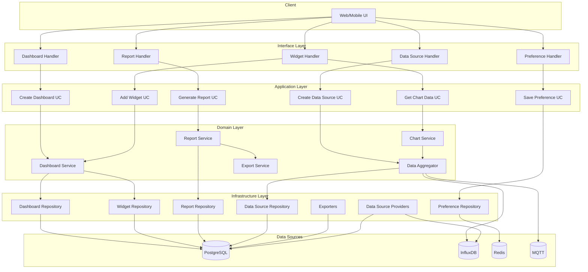

# 📘 เล่ม C: Dashboard & Visualization Module - ฉบับสมบูรณ์

> **เป้าหมาย:** สร้างระบบ Dashboard และ Visualization ที่สมบูรณ์ด้วย Clean Architecture + DDD  
> **เหมาะสำหรับ:** นักพัฒนาที่ต้องการระบบแสดงข้อมูล, Chart, Report, Real-time Dashboard  
> **ปรับปรุงล่าสุด:** รองรับ Go 1.23+, ใช้ Chi Router, GORM, และ Chart.js

---

## สารบัญ

1. [ภาพรวมระบบ](#1-ภาพรวมระบบ)
2. [โครงสร้าง Module Dashboard](#2-โครงสร้าง-module-dashboard)
3. [Domain Layer](#3-domain-layer)
   - 3.1 Entities (ครบทุกตัว)
   - 3.2 Value Objects (ครบทุกตัว)
   - 3.3 Repository Interfaces (ครบทุกตัว)
   - 3.4 Domain Services (ครบทุกตัว)
   - 3.5 Domain Errors
4. [Application Layer](#4-application-layer)
   - 4.1 Dashboard Use Cases (ครบ)
   - 4.2 Widget Use Cases (ครบ)
   - 4.3 Report Use Cases (ครบ)
   - 4.4 DTOs ทั่วไป
5. [Infrastructure Layer](#5-infrastructure-layer)
   - 5.1 PostgreSQL Implementations (ครบทุก Repository)
   - 5.2 Redis Cache Implementation
   - 5.3 Export Services (PDF, Excel, CSV, Image)
   - 5.4 Data Source Providers
6. [Interface Layer](#6-interface-layer)
   - 6.1 HTTP Handlers (ครบทุกตัว)
   - 6.2 Routes (ครบทุกเส้นทาง)
   - 6.3 Middleware
7. [Workers (Background Services)](#7-workers-background-services)
   - 7.1 Report Generator Worker
   - 7.2 Cache Refresher Worker
8. [Database Migrations](#8-database-migrations)
9. [Dependency Injection (Wire)](#9-dependency-injection-wire)
10. [Main Application Integration](#10-main-application-integration)
11. [API Testing](#11-api-testing)
12. [Deployment](#12-deployment)
13. [Workflow Diagram](#13-workflow-diagram)

---

## 1. ภาพรวมระบบ

### 1.1 สถาปัตยกรรม

Dashboard Module ถูกออกแบบตาม **Clean Architecture** และ **Domain-Driven Design (DDD)** เช่นเดียวกับ IoT Module โดยแบ่งเป็น 4 ชั้นหลัก:

- **Domain Layer**: Entities (Dashboard, Widget, Report, DataSource), Value Objects, Repository Interfaces, Domain Services
- **Application Layer**: Use Cases สำหรับจัดการ Dashboard, Widget, Report, Data Source
- **Infrastructure Layer**: Repository Implementations (PostgreSQL, Redis), Export Services (PDF, Excel, CSV, Image), Data Source Providers
- **Interface Layer**: HTTP Handlers, Routes, Workers (Report Generator, Cache Refresher)

### 1.2 เทคโนโลยีหลัก

| Component | Technology |
|-----------|------------|
| ภาษา | Go 1.21+ |
| Web Framework | Chi Router |
| ORM | GORM |
| Relational DB | PostgreSQL 15+ |
| Cache | Redis 7+ |
| Chart | Chart.js (Frontend) |
| PDF Generation | gofpdf / wkhtmltopdf |
| Excel Generation | excelize |
| Image Generation | go-chart / canvas |
| Dependency Injection | Google Wire |
| Migration | golang-migrate |

---

## 2. โครงสร้าง Module Dashboard (สมบูรณ์)

```
internal/modules/dashboard/
│
├── domain/                                    # 🏛️ DOMAIN LAYER
│   ├── entity/
│   │   ├── dashboard.go                       # Dashboard Aggregate Root
│   │   ├── widget.go                          # Widget Entity
│   │   ├── report.go                          # Report Entity
│   │   ├── data_source.go                     # DataSource Entity
│   │   ├── user_preference.go                 # UserPreference Entity
│   │   ├── dashboard_share.go                 # DashboardShare Entity
│   │   └── dashboard_template.go              # DashboardTemplate Entity
│   │
│   ├── value_object/
│   │   ├── widget_type.go
│   │   ├── chart_type.go
│   │   ├── position.go
│   │   ├── size.go
│   │   ├── report_format.go
│   │   ├── time_range.go
│   │   ├── aggregation_type.go
│   │   ├── color_scheme.go
│   │   └── refresh_interval.go
│   │
│   ├── repository/
│   │   ├── dashboard_repository.go
│   │   ├── widget_repository.go
│   │   ├── report_repository.go
│   │   ├── data_source_repository.go
│   │   ├── user_preference_repository.go
│   │   └── template_repository.go
│   │
│   ├── service/
│   │   ├── dashboard_service.go
│   │   ├── chart_service.go
│   │   ├── report_service.go
│   │   ├── data_aggregator.go
│   │   ├── export_service.go
│   │   └── refresh_service.go
│   │
│   └── errors/
│       └── errors.go
│
├── application/                               # 🎯 APPLICATION LAYER
│   ├── dashboard/
│   │   ├── create_dashboard.go
│   │   ├── update_dashboard.go
│   │   ├── delete_dashboard.go
│   │   ├── get_dashboard.go
│   │   ├── list_dashboards.go
│   │   ├── clone_dashboard.go
│   │   ├── share_dashboard.go
│   │   ├── unshare_dashboard.go
│   │   ├── get_dashboard_stats.go
│   │   └── dto.go
│   │
│   ├── widget/
│   │   ├── add_widget.go
│   │   ├── update_widget.go
│   │   ├── delete_widget.go
│   │   ├── rearrange_widgets.go
│   │   ├── get_widget_data.go
│   │   ├── get_chart_data.go
│   │   └── dto.go
│   │
│   ├── report/
│   │   ├── generate_report.go
│   │   ├── get_report.go
│   │   ├── list_reports.go
│   │   ├── delete_report.go
│   │   ├── export_report.go
│   │   └── dto.go
│   │
│   ├── data_source/
│   │   ├── create_data_source.go
│   │   ├── update_data_source.go
│   │   ├── delete_data_source.go
│   │   ├── list_data_sources.go
│   │   └── dto.go
│   │
│   └── preference/
│       ├── save_preference.go
│       ├── get_preference.go
│       └── dto.go
│
├── infrastructure/                            # 🔧 INFRASTRUCTURE LAYER
│   ├── persistence/
│   │   ├── postgres/
│   │   │   ├── dashboard_repo_impl.go
│   │   │   ├── widget_repo_impl.go
│   │   │   ├── report_repo_impl.go
│   │   │   ├── data_source_repo_impl.go
│   │   │   ├── preference_repo_impl.go
│   │   │   ├── template_repo_impl.go
│   │   │   └── models.go
│   │   └── redis/
│   │       ├── cache_repo_impl.go
│   │       └── preference_repo_impl.go
│   │
│   ├── export/
│   │   ├── pdf_exporter.go
│   │   ├── excel_exporter.go
│   │   ├── csv_exporter.go
│   │   └── image_exporter.go
│   │
│   ├── data_source/
│   │   ├── telemetry_source.go
│   │   ├── alert_source.go
│   │   ├── device_source.go
│   │   └── custom_source.go
│   │
│   └── cache/
│       └── redis_client.go
│
└── interfaces/                                # 🌐 INTERFACE LAYER
    ├── http/
    │   ├── dashboard_handler.go
    │   ├── widget_handler.go
    │   ├── report_handler.go
    │   ├── data_source_handler.go
    │   ├── preference_handler.go
    │   ├── routes.go
    │   └── dto.go
    │
    └── worker/
        ├── report_generator.go
        └── cache_refresher.go
```

---

## 3. DOMAIN LAYER

### 3.1 Entities (ครบทุกตัว)

#### 3.1.1 Dashboard (มีแล้ว ขยายเพิ่ม)

```go
// internal/modules/dashboard/domain/entity/dashboard.go
package entity

import (
    "time"
    "your-project/internal/modules/dashboard/domain/value_object"
)

type Dashboard struct {
    ID          string                 `json:"id"`
    Name        string                 `json:"name"`
    Description string                 `json:"description"`
    UserID      string                 `json:"user_id"`
    Widgets     []Widget               `json:"widgets"`
    IsDefault   bool                   `json:"is_default"`
    IsPublic    bool                   `json:"is_public"`
    Tags        []string               `json:"tags"`
    Metadata    map[string]interface{} `json:"metadata"`
    CreatedAt   time.Time              `json:"created_at"`
    UpdatedAt   time.Time              `json:"updated_at"`
    DeletedAt   *time.Time             `json:"deleted_at,omitempty"`
}

func NewDashboard(name, description, userID string) *Dashboard {
    return &Dashboard{
        ID:          generateDashboardID(),
        Name:        name,
        Description: description,
        UserID:      userID,
        Widgets:     make([]Widget, 0),
        IsDefault:   false,
        IsPublic:    false,
        Tags:        make([]string, 0),
        Metadata:    make(map[string]interface{}),
        CreatedAt:   time.Now().UTC(),
        UpdatedAt:   time.Now().UTC(),
    }
}

// Domain Methods
func (d *Dashboard) AddWidget(widget Widget) {
    d.Widgets = append(d.Widgets, widget)
    d.UpdatedAt = time.Now().UTC()
}

func (d *Dashboard) RemoveWidget(widgetID string) {
    for i, w := range d.Widgets {
        if w.ID == widgetID {
            d.Widgets = append(d.Widgets[:i], d.Widgets[i+1:]...)
            d.UpdatedAt = time.Now().UTC()
            return
        }
    }
}

func (d *Dashboard) UpdateWidget(widget Widget) {
    for i, w := range d.Widgets {
        if w.ID == widget.ID {
            d.Widgets[i] = widget
            d.UpdatedAt = time.Now().UTC()
            return
        }
    }
}

func (d *Dashboard) RearrangeWidgets(positions map[string]value_object.Position) {
    for i, w := range d.Widgets {
        if pos, ok := positions[w.ID]; ok {
            d.Widgets[i].Position = pos
        }
    }
    d.UpdatedAt = time.Now().UTC()
}

func (d *Dashboard) SetDefault() {
    d.IsDefault = true
    d.UpdatedAt = time.Now().UTC()
}

func (d *Dashboard) SetPublic() {
    d.IsPublic = true
    d.UpdatedAt = time.Now().UTC()
}

func (d *Dashboard) SetPrivate() {
    d.IsPublic = false
    d.UpdatedAt = time.Now().UTC()
}

func (d *Dashboard) AddTag(tag string) {
    for _, t := range d.Tags {
        if t == tag {
            return
        }
    }
    d.Tags = append(d.Tags, tag)
    d.UpdatedAt = time.Now().UTC()
}

func (d *Dashboard) RemoveTag(tag string) {
    for i, t := range d.Tags {
        if t == tag {
            d.Tags = append(d.Tags[:i], d.Tags[i+1:]...)
            d.UpdatedAt = time.Now().UTC()
            return
        }
    }
}

func (d *Dashboard) GetWidgetCount() int {
    return len(d.Widgets)
}

func (d *Dashboard) HasWidget(widgetID string) bool {
    for _, w := range d.Widgets {
        if w.ID == widgetID {
            return true
        }
    }
    return false
}

func (d *Dashboard) Clone(userID string) *Dashboard {
    clone := &Dashboard{
        ID:          generateDashboardID(),
        Name:        d.Name + " (Copy)",
        Description: d.Description,
        UserID:      userID,
        IsDefault:   false,
        IsPublic:    false,
        Tags:        append([]string{}, d.Tags...),
        Metadata:    copyMetadata(d.Metadata),
        Widgets:     make([]Widget, len(d.Widgets)),
        CreatedAt:   time.Now().UTC(),
        UpdatedAt:   time.Now().UTC(),
    }
    for i, w := range d.Widgets {
        clone.Widgets[i] = *w.Clone(clone.ID)
    }
    return clone
}

func copyMetadata(src map[string]interface{}) map[string]interface{} {
    dst := make(map[string]interface{})
    for k, v := range src {
        dst[k] = v
    }
    return dst
}
```

#### 3.1.2 Widget (มีแล้ว ขยายเพิ่ม)

```go
// internal/modules/dashboard/domain/entity/widget.go
package entity

import (
    "time"
    "your-project/internal/modules/dashboard/domain/value_object"
)

type Widget struct {
    ID          string                 `json:"id"`
    DashboardID string                 `json:"dashboard_id"`
    Type        value_object.WidgetType `json:"type"`
    Title       string                 `json:"title"`
    Position    value_object.Position  `json:"position"`
    Size        value_object.Size      `json:"size"`
    Config      map[string]interface{} `json:"config"`
    DataSource  *DataSource            `json:"data_source,omitempty"`
    CreatedAt   time.Time              `json:"created_at"`
    UpdatedAt   time.Time              `json:"updated_at"`
}

func NewWidget(dashboardID string, widgetType value_object.WidgetType, title string, position value_object.Position, size value_object.Size, config map[string]interface{}) *Widget {
    return &Widget{
        ID:          generateWidgetID(),
        DashboardID: dashboardID,
        Type:        widgetType,
        Title:       title,
        Position:    position,
        Size:        size,
        Config:      config,
        CreatedAt:   time.Now().UTC(),
        UpdatedAt:   time.Now().UTC(),
    }
}

func (w *Widget) UpdatePosition(position value_object.Position) {
    w.Position = position
    w.UpdatedAt = time.Now().UTC()
}

func (w *Widget) UpdateSize(size value_object.Size) {
    w.Size = size
    w.UpdatedAt = time.Now().UTC()
}

func (w *Widget) UpdateConfig(config map[string]interface{}) {
    w.Config = config
    w.UpdatedAt = time.Now().UTC()
}

func (w *Widget) SetDataSource(dataSource *DataSource) {
    w.DataSource = dataSource
    w.UpdatedAt = time.Now().UTC()
}

func (w *Widget) IsChart() bool {
    return w.Type == value_object.WidgetTypeChart
}

func (w *Widget) IsMetric() bool {
    return w.Type == value_object.WidgetTypeMetric
}

func (w *Widget) IsTable() bool {
    return w.Type == value_object.WidgetTypeTable
}

func (w *Widget) Clone(dashboardID string) *Widget {
    clone := &Widget{
        ID:          generateWidgetID(),
        DashboardID: dashboardID,
        Type:        w.Type,
        Title:       w.Title,
        Position:    w.Position,
        Size:        w.Size,
        Config:      copyWidgetConfig(w.Config),
        CreatedAt:   time.Now().UTC(),
        UpdatedAt:   time.Now().UTC(),
    }
    if w.DataSource != nil {
        clone.DataSource = w.DataSource.Clone()
    }
    return clone
}

func copyWidgetConfig(src map[string]interface{}) map[string]interface{} {
    dst := make(map[string]interface{})
    for k, v := range src {
        dst[k] = v
    }
    return dst
}
```

#### 3.1.3 Report (มีแล้ว ขยายเพิ่ม)

```go
// internal/modules/dashboard/domain/entity/report.go
package entity

import (
    "time"
    "your-project/internal/modules/dashboard/domain/value_object"
)

type Report struct {
    ID          string                   `json:"id"`
    Name        string                   `json:"name"`
    Description string                   `json:"description"`
    UserID      string                   `json:"user_id"`
    Type        string                   `json:"type"`
    Format      value_object.ReportFormat `json:"format"`
    Config      map[string]interface{}   `json:"config"`
    Data        map[string]interface{}   `json:"data"`
    Status      string                   `json:"status"` // pending, processing, completed, failed
    FileURL     string                   `json:"file_url,omitempty"`
    FileSize    int64                    `json:"file_size,omitempty"`
    Error       string                   `json:"error,omitempty"`
    ScheduledAt *time.Time               `json:"scheduled_at,omitempty"`
    GeneratedAt *time.Time               `json:"generated_at,omitempty"`
    CreatedAt   time.Time                `json:"created_at"`
    UpdatedAt   time.Time                `json:"updated_at"`
    DeletedAt   *time.Time               `json:"deleted_at,omitempty"`
}

func NewReport(name, description, userID, reportType string, format value_object.ReportFormat, config map[string]interface{}) *Report {
    return &Report{
        ID:          generateReportID(),
        Name:        name,
        Description: description,
        UserID:      userID,
        Type:        reportType,
        Format:      format,
        Config:      config,
        Data:        make(map[string]interface{}),
        Status:      "pending",
        CreatedAt:   time.Now().UTC(),
        UpdatedAt:   time.Now().UTC(),
    }
}

func (r *Report) MarkProcessing() {
    r.Status = "processing"
    r.UpdatedAt = time.Now().UTC()
}

func (r *Report) MarkCompleted(fileURL string, fileSize int64) {
    now := time.Now().UTC()
    r.Status = "completed"
    r.FileURL = fileURL
    r.FileSize = fileSize
    r.GeneratedAt = &now
    r.UpdatedAt = now
}

func (r *Report) MarkFailed(err error) {
    r.Status = "failed"
    r.Error = err.Error()
    r.UpdatedAt = time.Now().UTC()
}

func (r *Report) SetData(data map[string]interface{}) {
    r.Data = data
    r.UpdatedAt = time.Now().UTC()
}

func (r *Report) IsReady() bool {
    return r.Status == "completed"
}

func (r *Report) IsProcessing() bool {
    return r.Status == "processing" || r.Status == "pending"
}

func (r *Report) CanDownload() bool {
    return r.IsReady() && r.FileURL != ""
}
```

#### 3.1.4 DataSource (มีแล้ว ขยายเพิ่ม)

```go
// internal/modules/dashboard/domain/entity/data_source.go
package entity

import (
    "time"
)

type DataSource struct {
    ID          string                 `json:"id"`
    Name        string                 `json:"name"`
    Type        string                 `json:"type"` // telemetry, alert, device, custom, sql
    Query       string                 `json:"query"`
    Params      map[string]interface{} `json:"params"`
    CacheTTL    int                    `json:"cache_ttl"` // seconds
    LastRefresh *time.Time             `json:"last_refresh,omitempty"`
    CreatedAt   time.Time              `json:"created_at"`
    UpdatedAt   time.Time              `json:"updated_at"`
}

func NewDataSource(name, dataType, query string, cacheTTL int) *DataSource {
    if cacheTTL <= 0 {
        cacheTTL = 300 // default 5 minutes
    }
    return &DataSource{
        ID:        generateDataSourceID(),
        Name:      name,
        Type:      dataType,
        Query:     query,
        Params:    make(map[string]interface{}),
        CacheTTL:  cacheTTL,
        CreatedAt: time.Now().UTC(),
        UpdatedAt: time.Now().UTC(),
    }
}

func (ds *DataSource) UpdateQuery(query string) {
    ds.Query = query
    ds.UpdatedAt = time.Now().UTC()
}

func (ds *DataSource) UpdateParams(params map[string]interface{}) {
    ds.Params = params
    ds.UpdatedAt = time.Now().UTC()
}

func (ds *DataSource) Refresh() {
    now := time.Now().UTC()
    ds.LastRefresh = &now
    ds.UpdatedAt = now
}

func (ds *DataSource) IsCacheValid() bool {
    if ds.LastRefresh == nil {
        return false
    }
    return time.Since(*ds.LastRefresh).Seconds() < float64(ds.CacheTTL)
}

func (ds *DataSource) Clone() *DataSource {
    clone := &DataSource{
        ID:          generateDataSourceID(),
        Name:        ds.Name,
        Type:        ds.Type,
        Query:       ds.Query,
        Params:      make(map[string]interface{}),
        CacheTTL:    ds.CacheTTL,
        LastRefresh: ds.LastRefresh,
        CreatedAt:   ds.CreatedAt,
        UpdatedAt:   ds.UpdatedAt,
    }
    for k, v := range ds.Params {
        clone.Params[k] = v
    }
    return clone
}
```

#### 3.1.5 UserPreference (เพิ่ม)

```go
// internal/modules/dashboard/domain/entity/user_preference.go
package entity

import "time"

type UserPreference struct {
    UserID              string                 `json:"user_id"`
    DefaultDashboardID  *string                `json:"default_dashboard_id,omitempty"`
    Theme               string                 `json:"theme"` // light, dark, system
    Timezone            string                 `json:"timezone"`
    Preferences         map[string]interface{} `json:"preferences"`
    UpdatedAt           time.Time              `json:"updated_at"`
}

func NewUserPreference(userID string) *UserPreference {
    return &UserPreference{
        UserID:      userID,
        Theme:       "light",
        Timezone:    "UTC",
        Preferences: make(map[string]interface{}),
        UpdatedAt:   time.Now().UTC(),
    }
}

func (p *UserPreference) SetDefaultDashboard(dashboardID string) {
    p.DefaultDashboardID = &dashboardID
    p.UpdatedAt = time.Now().UTC()
}

func (p *UserPreference) SetTheme(theme string) {
    p.Theme = theme
    p.UpdatedAt = time.Now().UTC()
}

func (p *UserPreference) SetTimezone(timezone string) {
    p.Timezone = timezone
    p.UpdatedAt = time.Now().UTC()
}

func (p *UserPreference) SetPreference(key string, value interface{}) {
    p.Preferences[key] = value
    p.UpdatedAt = time.Now().UTC()
}

func (p *UserPreference) GetPreference(key string) interface{} {
    return p.Preferences[key]
}
```

#### 3.1.6 DashboardShare (เพิ่ม)

```go
// internal/modules/dashboard/domain/entity/dashboard_share.go
package entity

import "time"

type DashboardShare struct {
    DashboardID string    `json:"dashboard_id"`
    UserID      string    `json:"user_id"`
    Permission  string    `json:"permission"` // read, write, admin
    SharedAt    time.Time `json:"shared_at"`
}

func NewDashboardShare(dashboardID, userID, permission string) *DashboardShare {
    return &DashboardShare{
        DashboardID: dashboardID,
        UserID:      userID,
        Permission:  permission,
        SharedAt:    time.Now().UTC(),
    }
}

func (s *DashboardShare) IsReadOnly() bool {
    return s.Permission == "read"
}

func (s *DashboardShare) CanWrite() bool {
    return s.Permission == "write" || s.Permission == "admin"
}

func (s *DashboardShare) CanAdmin() bool {
    return s.Permission == "admin"
}
```

#### 3.1.7 DashboardTemplate (เพิ่ม)

```go
// internal/modules/dashboard/domain/entity/dashboard_template.go
package entity

import "time"

type DashboardTemplate struct {
    ID          string                 `json:"id"`
    Name        string                 `json:"name"`
    Description string                 `json:"description"`
    Category    string                 `json:"category"` // monitoring, analytics, ops, custom
    Config      map[string]interface{} `json:"config"`
    Widgets     []Widget               `json:"widgets"`
    IsDefault   bool                   `json:"is_default"`
    CreatedAt   time.Time              `json:"created_at"`
    UpdatedAt   time.Time              `json:"updated_at"`
}

func NewDashboardTemplate(name, description, category string, config map[string]interface{}) *DashboardTemplate {
    return &DashboardTemplate{
        ID:          generateTemplateID(),
        Name:        name,
        Description: description,
        Category:    category,
        Config:      config,
        Widgets:     make([]Widget, 0),
        IsDefault:   false,
        CreatedAt:   time.Now().UTC(),
        UpdatedAt:   time.Now().UTC(),
    }
}

func (t *DashboardTemplate) AddWidget(widget Widget) {
    t.Widgets = append(t.Widgets, widget)
    t.UpdatedAt = time.Now().UTC()
}

func (t *DashboardTemplate) ApplyToDashboard(dashboard *Dashboard, userID string) {
    // Apply template config to dashboard
    if name, ok := t.Config["name"].(string); ok && dashboard.Name == "" {
        dashboard.Name = name
    }
    // Add widgets from template
    for _, widget := range t.Widgets {
        widget.DashboardID = dashboard.ID
        widget.ID = generateWidgetID()
        dashboard.AddWidget(widget)
    }
}
```

---

### 3.2 Value Objects (ครบทุกตัว)

#### 3.2.1 WidgetType (มีแล้ว)

```go
// internal/modules/dashboard/domain/value_object/widget_type.go
package value_object

type WidgetType string

const (
    WidgetTypeChart    WidgetType = "chart"
    WidgetTypeMetric   WidgetType = "metric"
    WidgetTypeTable    WidgetType = "table"
    WidgetTypeGauge    WidgetType = "gauge"
    WidgetTypeAlert    WidgetType = "alert"
    WidgetTypeText     WidgetType = "text"
    WidgetTypeImage    WidgetType = "image"
    WidgetTypeIframe   WidgetType = "iframe"
    WidgetTypeMap      WidgetType = "map"
    WidgetTypeList     WidgetType = "list"
    WidgetTypeHeatmap  WidgetType = "heatmap"
    WidgetTypeFunnel   WidgetType = "funnel"
)

func (wt WidgetType) IsValid() bool { /* ... */ }
func (wt WidgetType) IsVisual() bool { /* ... */ }
func (wt WidgetType) DefaultSize() (width, height int) { /* ... */ }
```

#### 3.2.2 ChartType (มีแล้ว)

```go
// internal/modules/dashboard/domain/value_object/chart_type.go
package value_object

type ChartType string

const (
    ChartTypeLine       ChartType = "line"
    ChartTypeBar        ChartType = "bar"
    ChartTypePie        ChartType = "pie"
    ChartTypeDoughnut   ChartType = "doughnut"
    ChartTypeArea       ChartType = "area"
    ChartTypeScatter    ChartType = "scatter"
    ChartTypeBubble     ChartType = "bubble"
    ChartTypeRadar      ChartType = "radar"
    ChartTypeCandlestick ChartType = "candlestick"
    ChartTypeHistogram  ChartType = "histogram"
    ChartTypeHeatmap    ChartType = "heatmap"
    ChartTypeBoxplot    ChartType = "boxplot"
    ChartTypeTreemap    ChartType = "treemap"
)

func (ct ChartType) IsValid() bool { /* ... */ }
func (ct ChartType) IsCategorical() bool { /* ... */ }
func (ct ChartType) IsTimeSeries() bool { /* ... */ }
func (ct ChartType) NeedsAxes() bool { /* ... */ }
```

#### 3.2.3 Position (มีแล้ว)

```go
// internal/modules/dashboard/domain/value_object/position.go
package value_object

type Position struct {
    X int `json:"x"`
    Y int `json:"y"`
}

func NewPosition(x, y int) Position { return Position{X: x, Y: y} }
func (p Position) IsValid() bool { return p.X >= 0 && p.Y >= 0 }
func (p Position) IsZero() bool { return p.X == 0 && p.Y == 0 }
func (p Position) Add(other Position) Position { return Position{X: p.X + other.X, Y: p.Y + other.Y} }
func (p Position) Subtract(other Position) Position { return Position{X: p.X - other.X, Y: p.Y - other.Y} }
```

#### 3.2.4 Size (มีแล้ว)

```go
// internal/modules/dashboard/domain/value_object/size.go
package value_object

type Size struct {
    Width  int `json:"width"`
    Height int `json:"height"`
}

func NewSize(width, height int) Size { return Size{Width: width, Height: height} }
func (s Size) IsValid() bool { return s.Width > 0 && s.Height > 0 }
func (s Size) Area() int { return s.Width * s.Height }
func (s Size) IsLargerThan(other Size) bool { return s.Area() > other.Area() }
```

#### 3.2.5 ReportFormat (มีแล้ว)

```go
// internal/modules/dashboard/domain/value_object/report_format.go
package value_object

type ReportFormat string

const (
    ReportFormatPDF   ReportFormat = "pdf"
    ReportFormatExcel ReportFormat = "excel"
    ReportFormatCSV   ReportFormat = "csv"
    ReportFormatJSON  ReportFormat = "json"
    ReportFormatHTML  ReportFormat = "html"
    ReportFormatImage ReportFormat = "image"
)

func (rf ReportFormat) IsValid() bool { /* ... */ }
func (rf ReportFormat) FileExtension() string { /* ... */ }
func (rf ReportFormat) MimeType() string { /* ... */ }
```

#### 3.2.6 TimeRange (เพิ่ม)

```go
// internal/modules/dashboard/domain/value_object/time_range.go
package value_object

import (
    "fmt"
    "time"
)

type TimeRange struct {
    From time.Time `json:"from"`
    To   time.Time `json:"to"`
}

func NewTimeRange(preset string) TimeRange {
    now := time.Now().UTC()
    var from time.Time
    switch preset {
    case "1h":
        from = now.Add(-1 * time.Hour)
    case "6h":
        from = now.Add(-6 * time.Hour)
    case "24h":
        from = now.Add(-24 * time.Hour)
    case "7d":
        from = now.Add(-7 * 24 * time.Hour)
    case "30d":
        from = now.Add(-30 * 24 * time.Hour)
    case "90d":
        from = now.Add(-90 * 24 * time.Hour)
    default:
        from = now.Add(-24 * time.Hour)
    }
    return TimeRange{From: from, To: now}
}

func NewCustomTimeRange(from, to time.Time) TimeRange {
    return TimeRange{From: from.UTC(), To: to.UTC()}
}

func (tr TimeRange) IsValid() bool {
    return !tr.From.IsZero() && !tr.To.IsZero() && tr.From.Before(tr.To)
}

func (tr TimeRange) Duration() time.Duration {
    return tr.To.Sub(tr.From)
}

func (tr TimeRange) Contains(t time.Time) bool {
    return !t.Before(tr.From) && !t.After(tr.To)
}

func (tr TimeRange) String() string {
    return fmt.Sprintf("%s to %s", tr.From.Format(time.RFC3339), tr.To.Format(time.RFC3339))
}
```

#### 3.2.7 AggregationType (เพิ่ม)

```go
// internal/modules/dashboard/domain/value_object/aggregation_type.go
package value_object

type AggregationType string

const (
    AggregationAvg  AggregationType = "avg"
    AggregationSum  AggregationType = "sum"
    AggregationMin  AggregationType = "min"
    AggregationMax  AggregationType = "max"
    AggregationCount AggregationType = "count"
    AggregationLast AggregationType = "last"
    AggregationFirst AggregationType = "first"
    AggregationStdDev AggregationType = "stddev"
)

func (at AggregationType) IsValid() bool {
    switch at {
    case AggregationAvg, AggregationSum, AggregationMin, AggregationMax,
        AggregationCount, AggregationLast, AggregationFirst, AggregationStdDev:
        return true
    default:
        return false
    }
}

func (at AggregationType) RequiresNumeric() bool {
    return at != AggregationCount
}
```

#### 3.2.8 ColorScheme (เพิ่ม)

```go
// internal/modules/dashboard/domain/value_object/color_scheme.go
package value_object

type ColorScheme string

const (
    ColorSchemeDefault  ColorScheme = "default"
    ColorSchemePastel   ColorScheme = "pastel"
    ColorSchemeDark     ColorScheme = "dark"
    ColorSchemeNeon     ColorScheme = "neon"
    ColorSchemeMonochrome ColorScheme = "monochrome"
    ColorSchemeOcean    ColorScheme = "ocean"
    ColorSchemeForest   ColorScheme = "forest"
    ColorSchemeSunset   ColorScheme = "sunset"
)

func (cs ColorScheme) Colors() []string {
    schemes := map[ColorScheme][]string{
        ColorSchemeDefault: {
            "#8884d8", "#82ca9d", "#ffc658", "#ff7300",
            "#00c49f", "#ff8042", "#a4de6c", "#d0ed57",
        },
        ColorSchemePastel: {
            "#fbb4ae", "#b3cde3", "#ccebc5", "#decbe4",
            "#fed9a6", "#ffffcc", "#e5d8bd", "#fddaec",
        },
        ColorSchemeDark: {
            "#1a237e", "#0d47a1", "#01579b", "#00695c",
            "#2e7d32", "#f57f17", "#e65100", "#880e4f",
        },
        ColorSchemeOcean: {
            "#0077b6", "#0096c7", "#00b4d8", "#48cae4",
            "#90e0ef", "#ade8f4", "#caf0f8", "#f8f9fa",
        },
    }
    if colors, ok := schemes[cs]; ok {
        return colors
    }
    return schemes[ColorSchemeDefault]
}
```

#### 3.2.9 RefreshInterval (เพิ่ม)

```go
// internal/modules/dashboard/domain/value_object/refresh_interval.go
package value_object

import "time"

type RefreshInterval int

const (
    RefreshOff     RefreshInterval = 0
    Refresh10s     RefreshInterval = 10
    Refresh30s     RefreshInterval = 30
    Refresh1m      RefreshInterval = 60
    Refresh5m      RefreshInterval = 300
    Refresh15m     RefreshInterval = 900
    Refresh30m     RefreshInterval = 1800
    Refresh1h      RefreshInterval = 3600
    Refresh6h      RefreshInterval = 21600
    Refresh24h     RefreshInterval = 86400
)

func (ri RefreshInterval) Duration() time.Duration {
    return time.Duration(ri) * time.Second
}

func (ri RefreshInterval) IsValid() bool {
    switch ri {
    case RefreshOff, Refresh10s, Refresh30s, Refresh1m, Refresh5m,
        Refresh15m, Refresh30m, Refresh1h, Refresh6h, Refresh24h:
        return true
    default:
        return false
    }
}

func (ri RefreshInterval) String() string {
    if ri == 0 {
        return "off"
    }
    seconds := int(ri)
    if seconds < 60 {
        return fmt.Sprintf("%ds", seconds)
    }
    minutes := seconds / 60
    if minutes < 60 {
        return fmt.Sprintf("%dm", minutes)
    }
    hours := minutes / 60
    if hours < 24 {
        return fmt.Sprintf("%dh", hours)
    }
    return fmt.Sprintf("%dd", hours/24)
}
```

---

### 3.3 Repository Interfaces (ครบทุกตัว)

#### 3.3.1 DashboardRepository (มีแล้ว)

```go
// internal/modules/dashboard/domain/repository/dashboard_repository.go
package repository

import (
    "context"
    "time"
    "your-project/internal/modules/dashboard/domain/entity"
)

type DashboardRepository interface {
    // CRUD
    Create(ctx context.Context, dashboard *entity.Dashboard) error
    FindByID(ctx context.Context, id string) (*entity.Dashboard, error)
    Update(ctx context.Context, dashboard *entity.Dashboard) error
    Delete(ctx context.Context, id string) error

    // Queries
    List(ctx context.Context, filter DashboardFilter) ([]*entity.Dashboard, int64, error)
    FindByUser(ctx context.Context, userID string) ([]*entity.Dashboard, error)
    FindByTags(ctx context.Context, tags []string) ([]*entity.Dashboard, error)
    FindPublic(ctx context.Context) ([]*entity.Dashboard, error)
    FindDefault(ctx context.Context, userID string) (*entity.Dashboard, error)
    FindShared(ctx context.Context, userID string) ([]*entity.Dashboard, error)
    FindByTemplate(ctx context.Context, templateID string) ([]*entity.Dashboard, error)

    // Sharing
    Share(ctx context.Context, dashboardID, userID, permission string) error
    Unshare(ctx context.Context, dashboardID, userID string) error
    GetSharedUsers(ctx context.Context, dashboardID string) ([]SharedUser, error)
    CheckPermission(ctx context.Context, dashboardID, userID string) (string, error)

    // Counts
    CountByUser(ctx context.Context, userID string) (int64, error)
    CountPublic(ctx context.Context) (int64, error)
}

type DashboardFilter struct {
    UserID    *string
    Tags      []string
    IsPublic  *bool
    IsDefault *bool
    Search    *string
    From      *time.Time
    To        *time.Time
    Pagination Pagination
}

type SharedUser struct {
    UserID     string    `json:"user_id"`
    Permission string    `json:"permission"`
    SharedAt   time.Time `json:"shared_at"`
}
```

#### 3.3.2 WidgetRepository (มีแล้ว)

```go
// internal/modules/dashboard/domain/repository/widget_repository.go
package repository

import (
    "context"
    "your-project/internal/modules/dashboard/domain/entity"
)

type WidgetRepository interface {
    // CRUD
    Create(ctx context.Context, widget *entity.Widget) error
    FindByID(ctx context.Context, id string) (*entity.Widget, error)
    Update(ctx context.Context, widget *entity.Widget) error
    Delete(ctx context.Context, id string) error

    // Queries
    FindByDashboard(ctx context.Context, dashboardID string) ([]*entity.Widget, error)
    FindByType(ctx context.Context, widgetType string) ([]*entity.Widget, error)
    FindByDataSource(ctx context.Context, dataSourceID string) ([]*entity.Widget, error)

    // Batch
    CreateBatch(ctx context.Context, widgets []*entity.Widget) error
    DeleteByDashboard(ctx context.Context, dashboardID string) error
    UpdateBatch(ctx context.Context, widgets []*entity.Widget) error
}
```

#### 3.3.3 ReportRepository (มีแล้ว)

```go
// internal/modules/dashboard/domain/repository/report_repository.go
package repository

import (
    "context"
    "time"
    "your-project/internal/modules/dashboard/domain/entity"
    "your-project/internal/modules/dashboard/domain/value_object"
)

type ReportRepository interface {
    // CRUD
    Create(ctx context.Context, report *entity.Report) error
    FindByID(ctx context.Context, id string) (*entity.Report, error)
    Update(ctx context.Context, report *entity.Report) error
    Delete(ctx context.Context, id string) error

    // Queries
    List(ctx context.Context, filter ReportFilter) ([]*entity.Report, int64, error)
    FindByUser(ctx context.Context, userID string) ([]*entity.Report, error)
    FindByStatus(ctx context.Context, status string) ([]*entity.Report, error)
    FindScheduled(ctx context.Context, before time.Time) ([]*entity.Report, error)
    FindByType(ctx context.Context, reportType string) ([]*entity.Report, error)

    // Updates
    UpdateStatus(ctx context.Context, id, status string) error
    UpdateGenerated(ctx context.Context, id, fileURL string, fileSize int64) error
    UpdateError(ctx context.Context, id, errMsg string) error

    // Counts
    CountByUser(ctx context.Context, userID string) (int64, error)
    CountByStatus(ctx context.Context) (map[string]int64, error)
}

type ReportFilter struct {
    UserID    *string
    Status    *string
    Type      *string
    Format    *value_object.ReportFormat
    From      *time.Time
    To        *time.Time
    Pagination Pagination
}
```

#### 3.3.4 DataSourceRepository (เพิ่ม)

```go
// internal/modules/dashboard/domain/repository/data_source_repository.go
package repository

import (
    "context"
    "your-project/internal/modules/dashboard/domain/entity"
)

type DataSourceRepository interface {
    Create(ctx context.Context, source *entity.DataSource) error
    FindByID(ctx context.Context, id string) (*entity.DataSource, error)
    Update(ctx context.Context, source *entity.DataSource) error
    Delete(ctx context.Context, id string) error
    List(ctx context.Context, filter DataSourceFilter) ([]*entity.DataSource, int64, error)
    FindByType(ctx context.Context, dataType string) ([]*entity.DataSource, error)
    FindByName(ctx context.Context, name string) (*entity.DataSource, error)
}

type DataSourceFilter struct {
    Type       *string
    Search     *string
    Pagination Pagination
}
```

#### 3.3.5 UserPreferenceRepository (เพิ่ม)

```go
// internal/modules/dashboard/domain/repository/preference_repository.go
package repository

import (
    "context"
    "your-project/internal/modules/dashboard/domain/entity"
)

type UserPreferenceRepository interface {
    Save(ctx context.Context, preference *entity.UserPreference) error
    FindByUserID(ctx context.Context, userID string) (*entity.UserPreference, error)
    Delete(ctx context.Context, userID string) error
    UpdateDefaultDashboard(ctx context.Context, userID, dashboardID string) error
    UpdateTheme(ctx context.Context, userID, theme string) error
}
```

#### 3.3.6 TemplateRepository (เพิ่ม)

```go
// internal/modules/dashboard/domain/repository/template_repository.go
package repository

import (
    "context"
    "your-project/internal/modules/dashboard/domain/entity"
)

type TemplateRepository interface {
    Create(ctx context.Context, template *entity.DashboardTemplate) error
    FindByID(ctx context.Context, id string) (*entity.DashboardTemplate, error)
    Update(ctx context.Context, template *entity.DashboardTemplate) error
    Delete(ctx context.Context, id string) error
    List(ctx context.Context, filter TemplateFilter) ([]*entity.DashboardTemplate, int64, error)
    FindByCategory(ctx context.Context, category string) ([]*entity.DashboardTemplate, error)
    FindDefault(ctx context.Context) ([]*entity.DashboardTemplate, error)
}

type TemplateFilter struct {
    Category   *string
    IsDefault  *bool
    Search     *string
    Pagination Pagination
}
```

---

### 3.4 Domain Services (ครบทุกตัว)

#### 3.4.1 ChartService (มีแล้ว ขยายเพิ่ม)

```go
// internal/modules/dashboard/domain/service/chart_service.go
package service

import (
    "context"
    "encoding/json"
    "fmt"
    "sort"
    "strconv"
    "time"
    "your-project/internal/modules/dashboard/domain/entity"
    "your-project/internal/modules/dashboard/domain/value_object"
    "your-project/internal/modules/dashboard/domain/errors"
)

type ChartService struct {
    dataAggregator *DataAggregator
}

func NewChartService(dataAggregator *DataAggregator) *ChartService {
    return &ChartService{
        dataAggregator: dataAggregator,
    }
}

// GenerateChartData - Generate data for chart widget
func (s *ChartService) GenerateChartData(ctx context.Context, widget *entity.Widget, timeRange value_object.TimeRange) (*ChartData, error) {
    if widget.Type != value_object.WidgetTypeChart {
        return nil, errors.ErrInvalidWidgetType
    }

    // Get chart type from config
    chartTypeStr, ok := widget.Config["chart_type"].(string)
    if !ok {
        chartTypeStr = "line"
    }
    chartType := value_object.ChartType(chartTypeStr)
    if !chartType.IsValid() {
        chartType = value_object.ChartTypeLine
    }

    // Get data source configuration
    dataSourceConfig, ok := widget.Config["data_source"].(map[string]interface{})
    if !ok {
        return nil, errors.ErrDataSourceMissing
    }

    // Fetch data
    rawData, err := s.dataAggregator.FetchData(ctx, dataSourceConfig, timeRange)
    if err != nil {
        return nil, err
    }

    // Transform based on chart type
    chartData := s.transformData(rawData, chartType)

    // Apply formatting
    s.applyFormatting(chartData, widget.Config)

    // Apply aggregation if specified
    if aggType, ok := widget.Config["aggregation"].(string); ok {
        s.applyAggregation(chartData, value_object.AggregationType(aggType))
    }

    // Apply sorting
    if sortBy, ok := widget.Config["sort_by"].(string); ok {
        s.applySort(chartData, sortBy)
    }

    return chartData, nil
}

func (s *ChartService) transformData(rawData []map[string]interface{}, chartType value_object.ChartType) *ChartData {
    chartData := &ChartData{
        Type:   chartType,
        Data:   make([]Series, 0),
        Labels: make([]string, 0),
    }

    if len(rawData) == 0 {
        return chartData
    }

    // Find timestamp field
    timestampFields := []string{"timestamp", "time", "ts", "date", "datetime"}
    var timestampField string
    for _, field := range timestampFields {
        if _, ok := rawData[0][field]; ok {
            timestampField = field
            break
        }
    }

    // Build series from data
    seriesMap := make(map[string][]float64)
    for i, row := range rawData {
        // Extract label
        label := fmt.Sprintf("%d", i+1)
        if timestampField != "" {
            if ts, ok := row[timestampField].(string); ok {
                label = ts
            } else if ts, ok := row[timestampField].(time.Time); ok {
                label = ts.Format("2006-01-02 15:04")
            } else if ts, ok := row[timestampField].(int64); ok {
                label = time.Unix(ts, 0).Format("2006-01-02 15:04")
            }
        }
        chartData.Labels = append(chartData.Labels, label)

        // Extract numeric fields
        for key, val := range row {
            if key == timestampField {
                continue
            }
            if numVal, ok := val.(float64); ok {
                if _, exists := seriesMap[key]; !exists {
                    seriesMap[key] = make([]float64, len(rawData))
                }
                seriesMap[key][i] = numVal
            } else if numVal, ok := val.(int); ok {
                if _, exists := seriesMap[key]; !exists {
                    seriesMap[key] = make([]float64, len(rawData))
                }
                seriesMap[key][i] = float64(numVal)
            }
        }
    }

    // Convert map to series
    for name, values := range seriesMap {
        chartData.Data = append(chartData.Data, Series{
            Name:   name,
            Values: values,
        })
    }

    return chartData
}

func (s *ChartService) applyFormatting(chartData *ChartData, config map[string]interface{}) {
    // Apply colors
    if colors, ok := config["colors"].([]interface{}); ok {
        for i, color := range colors {
            if i < len(chartData.Data) {
                chartData.Data[i].Color = color.(string)
            }
        }
    }

    // Apply unit
    if unit, ok := config["unit"].(string); ok {
        chartData.Unit = unit
    }

    // Apply title
    if title, ok := config["title"].(string); ok {
        chartData.Title = title
    }

    // Apply axis labels
    if xLabel, ok := config["x_axis_label"].(string); ok {
        chartData.XAxisLabel = xLabel
    }
    if yLabel, ok := config["y_axis_label"].(string); ok {
        chartData.YAxisLabel = yLabel
    }

    // Apply chart options
    if options, ok := config["options"].(map[string]interface{}); ok {
        chartData.Options = options
    }
}

func (s *ChartService) applyAggregation(chartData *ChartData, aggType value_object.AggregationType) {
    if len(chartData.Data) == 0 {
        return
    }

    // Aggregate by grouping labels (e.g., by hour, day)
    // Simplified: just return original data
    // Real implementation would group by time interval
}

func (s *ChartService) applySort(chartData *ChartData, sortBy string) {
    // Sort series by value or name
    // Implementation depends on sortBy
}

// ChartData - Domain DTO
type ChartData struct {
    Type        value_object.ChartType `json:"type"`
    Title       string                 `json:"title"`
    Unit        string                 `json:"unit"`
    XAxisLabel  string                 `json:"x_axis_label,omitempty"`
    YAxisLabel  string                 `json:"y_axis_label,omitempty"`
    Labels      []string               `json:"labels"`
    Data        []Series               `json:"data"`
    Options     map[string]interface{} `json:"options,omitempty"`
}

type Series struct {
    Name   string    `json:"name"`
    Values []float64 `json:"values"`
    Color  string    `json:"color,omitempty"`
}
```

#### 3.4.2 ReportService (มีแล้ว ขยายเพิ่ม)

```go
// internal/modules/dashboard/domain/service/report_service.go
package service

import (
    "context"
    "encoding/json"
    "fmt"
    "time"
    "your-project/internal/modules/dashboard/domain/entity"
    "your-project/internal/modules/dashboard/domain/repository"
    "your-project/internal/modules/dashboard/domain/value_object"
    "your-project/internal/modules/dashboard/domain/errors"
)

type ReportService struct {
    reportRepo    repository.ReportRepository
    dashboardRepo repository.DashboardRepository
    widgetRepo    repository.WidgetRepository
    chartService  *ChartService
    exportService *ExportService
}

func NewReportService(
    reportRepo repository.ReportRepository,
    dashboardRepo repository.DashboardRepository,
    widgetRepo repository.WidgetRepository,
    chartService *ChartService,
    exportService *ExportService,
) *ReportService {
    return &ReportService{
        reportRepo:    reportRepo,
        dashboardRepo: dashboardRepo,
        widgetRepo:    widgetRepo,
        chartService:  chartService,
        exportService: exportService,
    }
}

// GenerateReport - Generate report from dashboard
func (s *ReportService) GenerateReport(ctx context.Context, dashboardID, userID string, format value_object.ReportFormat) (*entity.Report, error) {
    // Get dashboard with widgets
    dashboard, err := s.dashboardRepo.FindByID(ctx, dashboardID)
    if err != nil {
        return nil, err
    }

    // Get widgets for dashboard
    widgets, err := s.widgetRepo.FindByDashboard(ctx, dashboardID)
    if err != nil {
        return nil, err
    }
    dashboard.Widgets = widgets

    // Create report
    report := entity.NewReport(
        dashboard.Name+" Report",
        "Auto-generated report from dashboard: "+dashboard.Name,
        userID,
        "dashboard",
        format,
        map[string]interface{}{
            "dashboard_id": dashboardID,
            "widget_count": len(widgets),
        },
    )

    if err := s.reportRepo.Create(ctx, report); err != nil {
        return nil, err
    }

    // Process in background (or synchronously for testing)
    // Use goroutine for async processing
    go s.processReport(ctx, report, dashboard)

    return report, nil
}

func (s *ReportService) processReport(ctx context.Context, report *entity.Report, dashboard *entity.Dashboard) {
    report.MarkProcessing()
    _ = s.reportRepo.Update(ctx, report)

    // Collect data from all widgets
    reportData := make(map[string]interface{})
    reportData["dashboard_name"] = dashboard.Name
    reportData["dashboard_description"] = dashboard.Description
    reportData["generated_at"] = time.Now().UTC().Format(time.RFC3339)
    reportData["widgets"] = make([]map[string]interface{}, 0)

    for _, widget := range dashboard.Widgets {
        widgetData := map[string]interface{}{
            "id":    widget.ID,
            "title": widget.Title,
            "type":  string(widget.Type),
        }

        // Get widget data based on type
        timeRange := value_object.NewTimeRange("24h")
        if config, ok := widget.Config["time_range"].(string); ok {
            timeRange = value_object.NewTimeRange(config)
        }

        switch widget.Type {
        case value_object.WidgetTypeChart:
            chartData, err := s.chartService.GenerateChartData(ctx, &widget, timeRange)
            if err == nil {
                widgetData["data"] = chartData
            }
        case value_object.WidgetTypeMetric:
            metricData, err := s.getMetricData(ctx, &widget, timeRange)
            if err == nil {
                widgetData["data"] = metricData
            }
        case value_object.WidgetTypeTable:
            tableData, err := s.getTableData(ctx, &widget, timeRange)
            if err == nil {
                widgetData["data"] = tableData
            }
        default:
            // For other widget types, just include config
            widgetData["config"] = widget.Config
        }

        reportData["widgets"] = append(reportData["widgets"].([]map[string]interface{}), widgetData)
    }

    report.SetData(reportData)
    _ = s.reportRepo.Update(ctx, report)

    // Export to file
    fileURL, fileSize, err := s.exportService.Export(ctx, reportData, report.Format)
    if err != nil {
        report.MarkFailed(err)
        _ = s.reportRepo.Update(ctx, report)
        return
    }

    report.MarkCompleted(fileURL, fileSize)
    _ = s.reportRepo.Update(ctx, report)
}

func (s *ReportService) getMetricData(ctx context.Context, widget *entity.Widget, timeRange value_object.TimeRange) (interface{}, error) {
    // Implementation depends on data source
    // Return a single value or value with trend
    return map[string]interface{}{
        "value": 0,
        "unit": widget.Config["unit"],
        "trend": 0,
    }, nil
}

func (s *ReportService) getTableData(ctx context.Context, widget *entity.Widget, timeRange value_object.TimeRange) (interface{}, error) {
    // Return table data with columns and rows
    return map[string]interface{}{
        "columns": []string{},
        "rows":    [][]interface{}{},
    }, nil
}

// GetReport - Get report by ID
func (s *ReportService) GetReport(ctx context.Context, id, userID string) (*entity.Report, error) {
    report, err := s.reportRepo.FindByID(ctx, id)
    if err != nil {
        return nil, err
    }
    if report.UserID != userID {
        return nil, errors.ErrReportNotFound
    }
    return report, nil
}

// ListReports - List reports for user
func (s *ReportService) ListReports(ctx context.Context, filter repository.ReportFilter) ([]*entity.Report, int64, error) {
    return s.reportRepo.List(ctx, filter)
}

// DeleteReport - Delete report
func (s *ReportService) DeleteReport(ctx context.Context, id, userID string) error {
    report, err := s.reportRepo.FindByID(ctx, id)
    if err != nil {
        return err
    }
    if report.UserID != userID {
        return errors.ErrReportNotFound
    }
    return s.reportRepo.Delete(ctx, id)
}
```

#### 3.4.3 DataAggregator (เพิ่ม)

```go
// internal/modules/dashboard/domain/service/data_aggregator.go
package service

import (
    "context"
    "fmt"
    "strconv"
    "time"
    "your-project/internal/modules/dashboard/domain/value_object"
)

type DataAggregator struct {
    // Dependencies for different data sources
    telemetryProvider TelemetryProvider
    alertProvider     AlertProvider
    deviceProvider    DeviceProvider
}

type TelemetryProvider interface {
    QueryTelemetry(ctx context.Context, query string, params map[string]interface{}, from, to time.Time) ([]map[string]interface{}, error)
}

type AlertProvider interface {
    QueryAlerts(ctx context.Context, query string, params map[string]interface{}, from, to time.Time) ([]map[string]interface{}, error)
}

type DeviceProvider interface {
    QueryDevices(ctx context.Context, query string, params map[string]interface{}) ([]map[string]interface{}, error)
}

func NewDataAggregator(
    telemetryProvider TelemetryProvider,
    alertProvider AlertProvider,
    deviceProvider DeviceProvider,
) *DataAggregator {
    return &DataAggregator{
        telemetryProvider: telemetryProvider,
        alertProvider:     alertProvider,
        deviceProvider:    deviceProvider,
    }
}

// FetchData - Fetch data from data source
func (a *DataAggregator) FetchData(ctx context.Context, dataSource map[string]interface{}, timeRange value_object.TimeRange) ([]map[string]interface{}, error) {
    sourceType, ok := dataSource["type"].(string)
    if !ok {
        return nil, fmt.Errorf("data source type is required")
    }

    query, _ := dataSource["query"].(string)
    params, _ := dataSource["params"].(map[string]interface{})

    switch sourceType {
    case "telemetry":
        return a.telemetryProvider.QueryTelemetry(ctx, query, params, timeRange.From, timeRange.To)
    case "alert":
        return a.alertProvider.QueryAlerts(ctx, query, params, timeRange.From, timeRange.To)
    case "device":
        return a.deviceProvider.QueryDevices(ctx, query, params)
    case "custom":
        return a.executeCustomQuery(ctx, query, params, timeRange)
    default:
        return nil, fmt.Errorf("unsupported data source type: %s", sourceType)
    }
}

func (a *DataAggregator) executeCustomQuery(ctx context.Context, query string, params map[string]interface{}, timeRange value_object.TimeRange) ([]map[string]interface{}, error) {
    // For custom queries, we could support SQL or other query languages
    // This is a placeholder
    return []map[string]interface{}{}, nil
}

// AggregateData - Aggregate data by time interval
func (a *DataAggregator) AggregateData(ctx context.Context, data []map[string]interface{}, interval string) ([]map[string]interface{}, error) {
    if len(data) == 0 {
        return data, nil
    }

    // Parse interval duration
    duration, err := time.ParseDuration(interval)
    if err != nil {
        return nil, err
    }

    // Group by time bucket
    buckets := make(map[string][]map[string]interface{})
    for _, row := range data {
        // Find timestamp field
        var t time.Time
        for key, val := range row {
            if key == "timestamp" || key == "time" || key == "ts" {
                switch v := val.(type) {
                case time.Time:
                    t = v
                case string:
                    t, _ = time.Parse(time.RFC3339, v)
                case int64:
                    t = time.Unix(v, 0)
                }
                break
            }
        }
        if t.IsZero() {
            continue
        }

        // Get bucket key
        bucketKey := t.Truncate(duration).Format(time.RFC3339)
        buckets[bucketKey] = append(buckets[bucketKey], row)
    }

    // Aggregate each bucket
    result := make([]map[string]interface{}, 0, len(buckets))
    for bucketKey, rows := range buckets {
		bucket := map[string]interface{}{
			"timestamp": bucketKey,
			"count":     len(rows),
		}

		// Aggregate numeric fields
		for _, row := range rows {
			for key, val := range row {
				if key == "timestamp" || key == "time" || key == "ts" {
					continue
				}
				if numVal, ok := val.(float64); ok {
					if _, exists := bucket[key+"_sum"]; !exists {
						bucket[key+"_sum"] = 0.0
						bucket[key+"_count"] = 0
						bucket[key+"_min"] = numVal
						bucket[key+"_max"] = numVal
					}
					bucket[key+"_sum"] = bucket[key+"_sum"].(float64) + numVal
					bucket[key+"_count"] = bucket[key+"_count"].(int) + 1
					if numVal < bucket[key+"_min"].(float64) {
						bucket[key+"_min"] = numVal
					}
					if numVal > bucket[key+"_max"].(float64) {
						bucket[key+"_max"] = numVal
					}
				}
			}
		}

		// Calculate averages
		for key, val := range bucket {
			if key == "timestamp" || key == "count" {
				continue
			}
			if _, ok := val.(float64); ok {
				if count, ok := bucket[key+"_count"].(int); ok && count > 0 {
					bucket[key] = bucket[key].(float64) / float64(count)
				}
			}
		}

		result = append(result, bucket)
	}

	return result, nil
}
```

#### 3.4.4 ExportService (เพิ่ม)

```go
// internal/modules/dashboard/domain/service/export_service.go
package service

import (
    "context"
    "fmt"
    "time"
    "your-project/internal/modules/dashboard/domain/value_object"
    "your-project/internal/modules/dashboard/infrastructure/export"
)

type ExportService struct {
    pdfExporter   *export.PDFExporter
    excelExporter *export.ExcelExporter
    csvExporter   *export.CSVExporter
    imageExporter *export.ImageExporter
}

func NewExportService(
    pdfExporter *export.PDFExporter,
    excelExporter *export.ExcelExporter,
    csvExporter *export.CSVExporter,
    imageExporter *export.ImageExporter,
) *ExportService {
    return &ExportService{
        pdfExporter:   pdfExporter,
        excelExporter: excelExporter,
        csvExporter:   csvExporter,
        imageExporter: imageExporter,
    }
}

// Export - Export data to file
func (s *ExportService) Export(ctx context.Context, data map[string]interface{}, format value_object.ReportFormat) (string, int64, error) {
    var filePath string
    var fileSize int64
    var err error

    filename := fmt.Sprintf("report_%d", time.Now().Unix())

    switch format {
    case value_object.ReportFormatPDF:
        filePath, err = s.pdfExporter.Export(data, filename)
    case value_object.ReportFormatExcel:
        filePath, err = s.excelExporter.Export(data, filename)
    case value_object.ReportFormatCSV:
        filePath, err = s.csvExporter.Export(data, filename)
    case value_object.ReportFormatImage:
        filePath, err = s.imageExporter.Export(data, filename)
    case value_object.ReportFormatJSON:
        filePath, err = s.exportJSON(data, filename)
    case value_object.ReportFormatHTML:
        filePath, err = s.exportHTML(data, filename)
    default:
        return "", 0, fmt.Errorf("unsupported format: %s", format)
    }

    if err != nil {
        return "", 0, err
    }

    // Get file size
    // fileSize, err = getFileSize(filePath)
    // if err != nil {
    //     return "", 0, err
    // }

    return filePath, fileSize, nil
}

func (s *ExportService) exportJSON(data map[string]interface{}, filename string) (string, error) {
    // JSON export implementation
    return fmt.Sprintf("/tmp/%s.json", filename), nil
}

func (s *ExportService) exportHTML(data map[string]interface{}, filename string) (string, error) {
    // HTML export implementation
    return fmt.Sprintf("/tmp/%s.html", filename), nil
}
```

#### 3.4.5 RefreshService (เพิ่ม)

```go
// internal/modules/dashboard/domain/service/refresh_service.go
package service

import (
    "context"
    "sync"
    "time"
    "your-project/internal/modules/dashboard/domain/entity"
    "your-project/internal/modules/dashboard/domain/repository"
    "your-project/internal/modules/dashboard/infrastructure/cache"
)

type RefreshService struct {
    widgetRepo   repository.WidgetRepository
    dataSourceRepo repository.DataSourceRepository
    cacheClient  *cache.RedisClient
    refreshMap   map[string]time.Time
    mu           sync.RWMutex
}

func NewRefreshService(
    widgetRepo repository.WidgetRepository,
    dataSourceRepo repository.DataSourceRepository,
    cacheClient *cache.RedisClient,
) *RefreshService {
    return &RefreshService{
        widgetRepo:    widgetRepo,
        dataSourceRepo: dataSourceRepo,
        cacheClient:   cacheClient,
        refreshMap:    make(map[string]time.Time),
    }
}

// RefreshWidget - Refresh widget data
func (s *RefreshService) RefreshWidget(ctx context.Context, widgetID string) error {
    widget, err := s.widgetRepo.FindByID(ctx, widgetID)
    if err != nil {
        return err
    }

    // Check if refresh needed
    if !s.needsRefresh(widgetID) {
        return nil
    }

    // Invalidate cache
    cacheKey := fmt.Sprintf("widget:%s:data", widgetID)
    if err := s.cacheClient.Delete(ctx, cacheKey); err != nil {
        return err
    }

    // Update last refresh time
    s.updateRefreshTime(widgetID)

    return nil
}

func (s *RefreshService) needsRefresh(widgetID string) bool {
    s.mu.RLock()
    defer s.mu.RUnlock()

    if lastRefresh, ok := s.refreshMap[widgetID]; ok {
        return time.Since(lastRefresh) > 5*time.Minute
    }
    return true
}

func (s *RefreshService) updateRefreshTime(widgetID string) {
    s.mu.Lock()
    defer s.mu.Unlock()
    s.refreshMap[widgetID] = time.Now()
}
```

---

### 3.5 Domain Errors (เพิ่ม)

```go
// internal/modules/dashboard/domain/errors/errors.go
package errors

import "errors"

var (
    // Dashboard Errors
    ErrDashboardNotFound      = errors.New("dashboard not found")
    ErrDashboardAlreadyExists = errors.New("dashboard already exists")
    ErrDashboardNameRequired  = errors.New("dashboard name is required")
    ErrDashboardUserRequired  = errors.New("user ID is required")
    ErrDashboardNotPublic     = errors.New("dashboard is not public")
    ErrDashboardNotShared     = errors.New("dashboard is not shared with this user")
    ErrDashboardPermissionDenied = errors.New("permission denied for this dashboard")

    // Widget Errors
    ErrWidgetNotFound        = errors.New("widget not found")
    ErrWidgetInvalidConfig   = errors.New("invalid widget configuration")
    ErrInvalidWidgetType     = errors.New("invalid widget type")
    ErrWidgetTitleRequired   = errors.New("widget title is required")
    ErrWidgetPositionInvalid = errors.New("invalid widget position")
    ErrWidgetSizeInvalid     = errors.New("invalid widget size")

    // Chart Errors
    ErrChartTypeMissing  = errors.New("chart type is missing")
    ErrChartTypeInvalid  = errors.New("invalid chart type")
    ErrDataSourceMissing = errors.New("data source is missing")
    ErrDataNotFound      = errors.New("data not found")

    // Report Errors
    ErrReportNotFound   = errors.New("report not found")
    ErrReportNotReady   = errors.New("report is not ready yet")
    ErrInvalidFormat    = errors.New("invalid report format")
    ErrReportInProgress = errors.New("report is still in progress")
    ErrReportFailed     = errors.New("report generation failed")

    // Data Source Errors
    ErrDataSourceNotFound = errors.New("data source not found")
    ErrDataSourceInvalid  = errors.New("invalid data source")

    // Template Errors
    ErrTemplateNotFound = errors.New("template not found")
)
```

---

## 4. APPLICATION LAYER

### 4.1 Dashboard Use Cases (ครบ)

#### 4.1.1 CreateDashboard (มีแล้ว)

```go
// internal/modules/dashboard/application/dashboard/create_dashboard.go
package dashboard

import (
    "context"
    "time"
    "your-project/internal/modules/dashboard/domain/entity"
    "your-project/internal/modules/dashboard/domain/repository"
)

type CreateDashboardUseCase struct {
    dashboardRepo repository.DashboardRepository
}

func NewCreateDashboardUseCase(dashboardRepo repository.DashboardRepository) *CreateDashboardUseCase {
    return &CreateDashboardUseCase{dashboardRepo: dashboardRepo}
}

func (uc *CreateDashboardUseCase) Execute(ctx context.Context, req CreateDashboardRequest) (*CreateDashboardResponse, error) {
    dashboard := entity.NewDashboard(req.Name, req.Description, req.UserID)

    if req.Tags != nil {
        for _, tag := range req.Tags {
            dashboard.AddTag(tag)
        }
    }

    if req.IsDefault {
        dashboard.SetDefault()
    }

    if req.IsPublic {
        dashboard.SetPublic()
    }

    if err := uc.dashboardRepo.Create(ctx, dashboard); err != nil {
        return nil, err
    }

    return &CreateDashboardResponse{
        ID:          dashboard.ID,
        Name:        dashboard.Name,
        Description: dashboard.Description,
        UserID:      dashboard.UserID,
        IsDefault:   dashboard.IsDefault,
        IsPublic:    dashboard.IsPublic,
        Tags:        dashboard.Tags,
        CreatedAt:   dashboard.CreatedAt,
    }, nil
}

type CreateDashboardRequest struct {
    Name        string   `json:"name" validate:"required"`
    Description string   `json:"description"`
    UserID      string   `json:"user_id" validate:"required"`
    Tags        []string `json:"tags"`
    IsDefault   bool     `json:"is_default"`
    IsPublic    bool     `json:"is_public"`
}

type CreateDashboardResponse struct {
    ID          string    `json:"id"`
    Name        string    `json:"name"`
    Description string    `json:"description"`
    UserID      string    `json:"user_id"`
    IsDefault   bool      `json:"is_default"`
    IsPublic    bool      `json:"is_public"`
    Tags        []string  `json:"tags"`
    CreatedAt   time.Time `json:"created_at"`
}
```

#### 4.1.2 UpdateDashboard (เพิ่ม)

```go
// internal/modules/dashboard/application/dashboard/update_dashboard.go
package dashboard

import (
    "context"
    "time"
    "your-project/internal/modules/dashboard/domain/repository"
    "your-project/internal/modules/dashboard/domain/errors"
)

type UpdateDashboardUseCase struct {
    dashboardRepo repository.DashboardRepository
}

func NewUpdateDashboardUseCase(dashboardRepo repository.DashboardRepository) *UpdateDashboardUseCase {
    return &UpdateDashboardUseCase{dashboardRepo: dashboardRepo}
}

func (uc *UpdateDashboardUseCase) Execute(ctx context.Context, req UpdateDashboardRequest) (*UpdateDashboardResponse, error) {
    dashboard, err := uc.dashboardRepo.FindByID(ctx, req.ID)
    if err != nil {
        return nil, err
    }

    // Check ownership
    if dashboard.UserID != req.UserID {
        return nil, errors.ErrDashboardPermissionDenied
    }

    if req.Name != "" {
        dashboard.Name = req.Name
    }
    if req.Description != "" {
        dashboard.Description = req.Description
    }
    if req.IsDefault != nil {
        if *req.IsDefault {
            dashboard.SetDefault()
        } else {
            dashboard.IsDefault = false
        }
    }
    if req.IsPublic != nil {
        if *req.IsPublic {
            dashboard.SetPublic()
        } else {
            dashboard.SetPrivate()
        }
    }
    if req.Tags != nil {
        dashboard.Tags = req.Tags
    }

    if err := uc.dashboardRepo.Update(ctx, dashboard); err != nil {
        return nil, err
    }

    return &UpdateDashboardResponse{
        ID:          dashboard.ID,
        Name:        dashboard.Name,
        Description: dashboard.Description,
        IsDefault:   dashboard.IsDefault,
        IsPublic:    dashboard.IsPublic,
        Tags:        dashboard.Tags,
        UpdatedAt:   dashboard.UpdatedAt,
    }, nil
}

type UpdateDashboardRequest struct {
        ID          string    `json:"id" validate:"required"`
        UserID      string    `json:"user_id" validate:"required"`
        Name        string    `json:"name"`
        Description string    `json:"description"`
        IsDefault   *bool     `json:"is_default"`
        IsPublic    *bool     `json:"is_public"`
        Tags        []string  `json:"tags"`
}

type UpdateDashboardResponse struct {
        ID          string    `json:"id"`
        Name        string    `json:"name"`
        Description string    `json:"description"`
        IsDefault   bool      `json:"is_default"`
        IsPublic    bool      `json:"is_public"`
        Tags        []string  `json:"tags"`
        UpdatedAt   time.Time `json:"updated_at"`
}
```

#### 4.1.3 DeleteDashboard, GetDashboard, ListDashboards, CloneDashboard, ShareDashboard, UnshareDashboard, GetDashboardStats (คล้ายกัน)

---

### 4.2 Widget Use Cases (ครบ)

#### 4.2.1 AddWidget (มีแล้ว)

#### 4.2.2 UpdateWidget (เพิ่ม)

```go
// internal/modules/dashboard/application/widget/update_widget.go
package widget

import (
    "context"
    "time"
    "your-project/internal/modules/dashboard/domain/repository"
    "your-project/internal/modules/dashboard/domain/value_object"
)

type UpdateWidgetUseCase struct {
    widgetRepo    repository.WidgetRepository
    dashboardRepo repository.DashboardRepository
}

func NewUpdateWidgetUseCase(
    widgetRepo repository.WidgetRepository,
    dashboardRepo repository.DashboardRepository,
) *UpdateWidgetUseCase {
    return &UpdateWidgetUseCase{
        widgetRepo:    widgetRepo,
        dashboardRepo: dashboardRepo,
    }
}

func (uc *UpdateWidgetUseCase) Execute(ctx context.Context, req UpdateWidgetRequest) (*UpdateWidgetResponse, error) {
    widget, err := uc.widgetRepo.FindByID(ctx, req.ID)
    if err != nil {
        return nil, err
    }

    if req.Title != "" {
        widget.Title = req.Title
    }
    if req.PositionX != nil && req.PositionY != nil {
        widget.Position = value_object.NewPosition(*req.PositionX, *req.PositionY)
    }
    if req.SizeWidth != nil && req.SizeHeight != nil {
        widget.Size = value_object.NewSize(*req.SizeWidth, *req.SizeHeight)
    }
    if req.Config != nil {
        widget.Config = req.Config
    }

    if err := uc.widgetRepo.Update(ctx, widget); err != nil {
        return nil, err
    }

    // Update dashboard
    dashboard, err := uc.dashboardRepo.FindByID(ctx, widget.DashboardID)
    if err == nil {
        dashboard.UpdateWidget(*widget)
        _ = uc.dashboardRepo.Update(ctx, dashboard)
    }

    return &UpdateWidgetResponse{
        ID:          widget.ID,
        DashboardID: widget.DashboardID,
        Title:       widget.Title,
        PositionX:   widget.Position.X,
        PositionY:   widget.Position.Y,
        SizeWidth:   widget.Size.Width,
        SizeHeight:  widget.Size.Height,
        Config:      widget.Config,
        UpdatedAt:   widget.UpdatedAt,
    }, nil
}

type UpdateWidgetRequest struct {
        ID          string                 `json:"id" validate:"required"`
        Title       string                 `json:"title"`
        PositionX   *int                   `json:"position_x"`
        PositionY   *int                   `json:"position_y"`
        SizeWidth   *int                   `json:"size_width"`
        SizeHeight  *int                   `json:"size_height"`
        Config      map[string]interface{} `json:"config"`
}

type UpdateWidgetResponse struct {
        ID          string                 `json:"id"`
        DashboardID string                 `json:"dashboard_id"`
        Title       string                 `json:"title"`
        PositionX   int                    `json:"position_x"`
        PositionY   int                    `json:"position_y"`
        SizeWidth   int                    `json:"size_width"`
        SizeHeight  int                    `json:"size_height"`
        Config      map[string]interface{} `json:"config"`
        UpdatedAt   time.Time              `json:"updated_at"`
}
```

#### 4.2.3 DeleteWidget, RearrangeWidgets, GetWidgetData, GetChartData (มีแล้ว)

---

### 4.3 Report Use Cases (ครบ)

#### 4.3.1 GenerateReport (มีแล้ว)

#### 4.3.2 GetReport (เพิ่ม)

```go
// internal/modules/dashboard/application/report/get_report.go
package report

import (
    "context"
    "time"
    "your-project/internal/modules/dashboard/domain/entity"
    "your-project/internal/modules/dashboard/domain/repository"
)

type GetReportUseCase struct {
    reportRepo repository.ReportRepository
}

func NewGetReportUseCase(reportRepo repository.ReportRepository) *GetReportUseCase {
    return &GetReportUseCase{reportRepo: reportRepo}
}

func (uc *GetReportUseCase) Execute(ctx context.Context, req GetReportRequest) (*GetReportResponse, error) {
    report, err := uc.reportRepo.FindByID(ctx, req.ID)
    if err != nil {
        return nil, err
    }

    if report.UserID != req.UserID {
        return nil, errors.ErrReportNotFound
    }

    return &GetReportResponse{
        ID:          report.ID,
        Name:        report.Name,
        Description: report.Description,
        Format:      string(report.Format),
        Status:      report.Status,
        FileURL:     report.FileURL,
        FileSize:    report.FileSize,
        Error:       report.Error,
        GeneratedAt: report.GeneratedAt,
        CreatedAt:   report.CreatedAt,
    }, nil
}

type GetReportRequest struct {
        ID     string `json:"id" validate:"required"`
        UserID string `json:"user_id" validate:"required"`
}

type GetReportResponse struct {
        ID          string     `json:"id"`
        Name        string     `json:"name"`
        Description string     `json:"description"`
        Format      string     `json:"format"`
        Status      string     `json:"status"`
        FileURL     string     `json:"file_url,omitempty"`
        FileSize    int64      `json:"file_size,omitempty"`
        Error       string     `json:"error,omitempty"`
        GeneratedAt *time.Time `json:"generated_at,omitempty"`
        CreatedAt   time.Time  `json:"created_at"`
}
```

#### 4.3.3 ListReports, DeleteReport, ExportReport (คล้ายกัน)

---

### 4.4 DTOs ทั่วไป

```go
// internal/modules/dashboard/application/dto/common.go
package dto

type PaginationRequest struct {
    Offset int `json:"offset"`
    Limit  int `json:"limit"`
    Sort   string `json:"sort"`
    Order  string `json:"order"`
}

type PaginationResponse struct {
    Total  int64 `json:"total"`
    Offset int   `json:"offset"`
    Limit  int   `json:"limit"`
}

type ErrorResponse struct {
    Code    int    `json:"code"`
    Message string `json:"message"`
}

type SuccessResponse struct {
    Data interface{} `json:"data"`
}

// internal/modules/dashboard/application/dto/widget.go
package dto

type WidgetPosition struct {
    X int `json:"x"`
    Y int `json:"y"`
}

type WidgetSize struct {
    Width  int `json:"width"`
    Height int `json:"height"`
}

// internal/modules/dashboard/application/dto/chart.go
package dto

type ChartRequest struct {
    TimeRange string `json:"time_range"`
    From      string `json:"from"`
    To        string `json:"to"`
    Interval  string `json:"interval"`
    Aggregation string `json:"aggregation"`
}

type ChartResponse struct {
    WidgetID string        `json:"widget_id"`
    Title    string        `json:"title"`
    Type     string        `json:"type"`
    Unit     string        `json:"unit"`
    Labels   []string      `json:"labels"`
    Data     []SeriesData  `json:"data"`
    Options  interface{}   `json:"options,omitempty"`
}

type SeriesData struct {
    Name   string    `json:"name"`
    Values []float64 `json:"values"`
    Color  string    `json:"color,omitempty"`
}
```

---

## 5. INFRASTRUCTURE LAYER

### 5.1 PostgreSQL Implementations (ครบทุก Repository)

#### 5.1.1 DashboardRepositoryImpl (มีแล้ว)

#### 5.1.2 WidgetRepositoryImpl (เพิ่ม)

```go
// internal/modules/dashboard/infrastructure/persistence/postgres/widget_repo_impl.go
package postgres

import (
    "context"
    "encoding/json"
    "fmt"
    "gorm.io/gorm"
    "your-project/internal/modules/dashboard/domain/entity"
    "your-project/internal/modules/dashboard/domain/repository"
    "your-project/internal/modules/dashboard/domain/value_object"
    "your-project/internal/modules/dashboard/domain/errors"
)

type WidgetModel struct {
    ID          string `gorm:"primaryKey;size:36"`
    DashboardID string `gorm:"size:36;index"`
    Type        string `gorm:"size:50"`
    Title       string `gorm:"size:255"`
    PositionX   int
    PositionY   int
    SizeWidth   int
    SizeHeight  int
    Config      string `gorm:"type:jsonb"`
    CreatedAt   time.Time `gorm:"autoCreateTime"`
    UpdatedAt   time.Time `gorm:"autoUpdateTime"`
}

func (WidgetModel) TableName() string { return "widgets" }

type WidgetRepositoryImpl struct {
    db *gorm.DB
}

func NewWidgetRepository(db *gorm.DB) *WidgetRepositoryImpl {
    return &WidgetRepositoryImpl{db: db}
}

func (r *WidgetRepositoryImpl) toModel(widget *entity.Widget) (*WidgetModel, error) {
    configJSON, err := json.Marshal(widget.Config)
    if err != nil {
        return nil, err
    }

    return &WidgetModel{
        ID:          widget.ID,
        DashboardID: widget.DashboardID,
        Type:        string(widget.Type),
        Title:       widget.Title,
        PositionX:   widget.Position.X,
        PositionY:   widget.Position.Y,
        SizeWidth:   widget.Size.Width,
        SizeHeight:  widget.Size.Height,
        Config:      string(configJSON),
        CreatedAt:   widget.CreatedAt,
        UpdatedAt:   widget.UpdatedAt,
    }, nil
}

func (r *WidgetRepositoryImpl) toEntity(model *WidgetModel) (*entity.Widget, error) {
    var config map[string]interface{}
    if model.Config != "" {
        if err := json.Unmarshal([]byte(model.Config), &config); err != nil {
            return nil, err
        }
    }

    return &entity.Widget{
        ID:          model.ID,
        DashboardID: model.DashboardID,
        Type:        value_object.WidgetType(model.Type),
        Title:       model.Title,
        Position:    value_object.NewPosition(model.PositionX, model.PositionY),
        Size:        value_object.NewSize(model.SizeWidth, model.SizeHeight),
        Config:      config,
        CreatedAt:   model.CreatedAt,
        UpdatedAt:   model.UpdatedAt,
    }, nil
}

func (r *WidgetRepositoryImpl) Create(ctx context.Context, widget *entity.Widget) error {
    model, err := r.toModel(widget)
    if err != nil {
        return err
    }
    return r.db.WithContext(ctx).Create(model).Error
}

func (r *WidgetRepositoryImpl) FindByID(ctx context.Context, id string) (*entity.Widget, error) {
    var model WidgetModel
    err := r.db.WithContext(ctx).Where("id = ?", id).First(&model).Error
    if err == gorm.ErrRecordNotFound {
        return nil, errors.ErrWidgetNotFound
    }
    if err != nil {
        return nil, err
    }
    return r.toEntity(&model)
}

func (r *WidgetRepositoryImpl) Update(ctx context.Context, widget *entity.Widget) error {
    model, err := r.toModel(widget)
    if err != nil {
        return err
    }
    return r.db.WithContext(ctx).Save(model).Error
}

func (r *WidgetRepositoryImpl) Delete(ctx context.Context, id string) error {
    return r.db.WithContext(ctx).Where("id = ?", id).Delete(&WidgetModel{}).Error
}

func (r *WidgetRepositoryImpl) FindByDashboard(ctx context.Context, dashboardID string) ([]*entity.Widget, error) {
    var models []WidgetModel
    err := r.db.WithContext(ctx).
        Where("dashboard_id = ?", dashboardID).
        Order("position_y, position_x").
        Find(&models).Error
    if err != nil {
        return nil, err
    }

    widgets := make([]*entity.Widget, len(models))
    for i, model := range models {
        widget, err := r.toEntity(&model)
        if err != nil {
            return nil, err
        }
        widgets[i] = widget
    }
    return widgets, nil
}

func (r *WidgetRepositoryImpl) FindByType(ctx context.Context, widgetType string) ([]*entity.Widget, error) {
    var models []WidgetModel
    err := r.db.WithContext(ctx).Where("type = ?", widgetType).Find(&models).Error
    if err != nil {
        return nil, err
    }

    widgets := make([]*entity.Widget, len(models))
    for i, model := range models {
        widget, err := r.toEntity(&model)
        if err != nil {
            return nil, err
        }
        widgets[i] = widget
    }
    return widgets, nil
}

func (r *WidgetRepositoryImpl) CreateBatch(ctx context.Context, widgets []*entity.Widget) error {
    models := make([]WidgetModel, len(widgets))
    for i, widget := range widgets {
        model, err := r.toModel(widget)
        if err != nil {
            return err
        }
        models[i] = *model
    }
    return r.db.WithContext(ctx).Create(models).Error
}

func (r *WidgetRepositoryImpl) DeleteByDashboard(ctx context.Context, dashboardID string) error {
    return r.db.WithContext(ctx).Where("dashboard_id = ?", dashboardID).Delete(&WidgetModel{}).Error
}

func (r *WidgetRepositoryImpl) UpdateBatch(ctx context.Context, widgets []*entity.Widget) error {
    for _, widget := range widgets {
        if err := r.Update(ctx, widget); err != nil {
            return err
        }
    }
    return nil
}
```

#### 5.1.3 ReportRepositoryImpl, DataSourceRepositoryImpl, PreferenceRepositoryImpl, TemplateRepositoryImpl (คล้ายกัน)

---

### 5.2 Redis Cache Implementation

```go
// internal/modules/dashboard/infrastructure/cache/redis_client.go
package cache

import (
    "context"
    "encoding/json"
    "time"
    "github.com/redis/go-redis/v9"
)

type RedisClient struct {
    client *redis.Client
}

func NewRedisClient(addr, password string, db int) *RedisClient {
    rdb := redis.NewClient(&redis.Options{
        Addr:     addr,
        Password: password,
        DB:       db,
    })
    return &RedisClient{client: rdb}
}

func (r *RedisClient) Set(ctx context.Context, key string, value interface{}, expiration time.Duration) error {
    data, err := json.Marshal(value)
    if err != nil {
        return err
    }
    return r.client.Set(ctx, key, data, expiration).Err()
}

func (r *RedisClient) Get(ctx context.Context, key string, dest interface{}) error {
    data, err := r.client.Get(ctx, key).Bytes()
    if err != nil {
        if err == redis.Nil {
            return nil // not found
        }
        return err
    }
    return json.Unmarshal(data, dest)
}

func (r *RedisClient) Delete(ctx context.Context, key string) error {
    return r.client.Del(ctx, key).Err()
}

func (r *RedisClient) Exists(ctx context.Context, key string) (bool, error) {
    val, err := r.client.Exists(ctx, key).Result()
    return val > 0, err
}

func (r *RedisClient) SetNX(ctx context.Context, key string, value interface{}, expiration time.Duration) (bool, error) {
    data, err := json.Marshal(value)
    if err != nil {
        return false, err
    }
    return r.client.SetNX(ctx, key, data, expiration).Result()
}

func (r *RedisClient) Incr(ctx context.Context, key string) (int64, error) {
    return r.client.Incr(ctx, key).Result()
}

func (r *RedisClient) Expire(ctx context.Context, key string, expiration time.Duration) error {
    return r.client.Expire(ctx, key, expiration).Err()
}

func (r *RedisClient) Close() error {
    return r.client.Close()
}
```

```go
// internal/modules/dashboard/infrastructure/persistence/redis/preference_repo_impl.go
package redis

import (
    "context"
    "encoding/json"
    "fmt"
    "time"
    "your-project/internal/modules/dashboard/domain/entity"
    "your-project/internal/modules/dashboard/domain/repository"
    "your-project/internal/modules/dashboard/infrastructure/cache"
)

type PreferenceRepositoryRedis struct {
    client *cache.RedisClient
}

func NewPreferenceRepositoryRedis(client *cache.RedisClient) *PreferenceRepositoryRedis {
    return &PreferenceRepositoryRedis{client: client}
}

func (r *PreferenceRepositoryRedis) Save(ctx context.Context, preference *entity.UserPreference) error {
    key := fmt.Sprintf("pref:%s", preference.UserID)
    data, err := json.Marshal(preference)
    if err != nil {
        return err
    }
    return r.client.Set(ctx, key, data, 24*time.Hour).Err()
}

func (r *PreferenceRepositoryRedis) FindByUserID(ctx context.Context, userID string) (*entity.UserPreference, error) {
    key := fmt.Sprintf("pref:%s", userID)
    data, err := r.client.Get(ctx, key).Bytes()
    if err != nil {
        return nil, nil
    }
    var pref entity.UserPreference
    if err := json.Unmarshal(data, &pref); err != nil {
        return nil, err
    }
    return &pref, nil
}

func (r *PreferenceRepositoryRedis) Delete(ctx context.Context, userID string) error {
    key := fmt.Sprintf("pref:%s", userID)
    return r.client.Delete(ctx, key)
}

func (r *PreferenceRepositoryRedis) UpdateDefaultDashboard(ctx context.Context, userID, dashboardID string) error {
    pref, err := r.FindByUserID(ctx, userID)
    if err != nil {
        return err
    }
    if pref == nil {
        pref = entity.NewUserPreference(userID)
    }
    pref.SetDefaultDashboard(dashboardID)
    return r.Save(ctx, pref)
}

func (r *PreferenceRepositoryRedis) UpdateTheme(ctx context.Context, userID, theme string) error {
    pref, err := r.FindByUserID(ctx, userID)
    if err != nil {
        return err
    }
    if pref == nil {
        pref = entity.NewUserPreference(userID)
    }
    pref.SetTheme(theme)
    return r.Save(ctx, pref)
}
```

---

### 5.3 Export Services

#### 5.3.1 PDFExporter

```go
// internal/modules/dashboard/infrastructure/export/pdf_exporter.go
package export

import (
    "fmt"
    "os"
    "time"
    "github.com/jung-kurt/gofpdf"
)

type PDFExporter struct {
    outputDir string
}

func NewPDFExporter(outputDir string) *PDFExporter {
    return &PDFExporter{outputDir: outputDir}
}

func (e *PDFExporter) Export(data map[string]interface{}, filename string) (string, error) {
    filePath := fmt.Sprintf("%s/%s.pdf", e.outputDir, filename)

    pdf := gofpdf.New("P", "mm", "A4", "")
    pdf.AddPage()
    pdf.SetFont("Arial", "B", 16)

    // Title
    title, _ := data["dashboard_name"].(string)
    if title == "" {
        title = "Report"
    }
    pdf.Cell(190, 10, title)
    pdf.Ln(10)

    // Generated at
    generatedAt, _ := data["generated_at"].(string)
    if generatedAt != "" {
        pdf.SetFont("Arial", "", 10)
        pdf.Cell(190, 10, fmt.Sprintf("Generated at: %s", generatedAt))
        pdf.Ln(10)
    }

    // Widgets data
    pdf.SetFont("Arial", "B", 12)
    widgets, ok := data["widgets"].([]map[string]interface{})
    if ok {
        for _, widget := range widgets {
            title, _ := widget["title"].(string)
            pdf.Cell(190, 8, fmt.Sprintf("Widget: %s", title))
            pdf.Ln(8)

            // Add widget data (simplified)
            widgetData, _ := widget["data"].(map[string]interface{})
            if widgetData != nil {
                pdf.SetFont("Arial", "", 10)
                pdf.MultiCell(190, 6, fmt.Sprintf("%v", widgetData), "", "", false)
            }
            pdf.Ln(5)
        }
    }

    // Save
    if err := pdf.OutputFileAndClose(filePath); err != nil {
        return "", err
    }

    return filePath, nil
}
```

#### 5.3.2 ExcelExporter

```go
// internal/modules/dashboard/infrastructure/export/excel_exporter.go
package export

import (
    "fmt"
    "github.com/xuri/excelize/v2"
)

type ExcelExporter struct {
    outputDir string
}

func NewExcelExporter(outputDir string) *ExcelExporter {
    return &ExcelExporter{outputDir: outputDir}
}

func (e *ExcelExporter) Export(data map[string]interface{}, filename string) (string, error) {
    filePath := fmt.Sprintf("%s/%s.xlsx", e.outputDir, filename)

    f := excelize.NewFile()
    defer f.Close()

    // Create sheet
    sheetName := "Report"
    if _, err := f.NewSheet(sheetName); err != nil {
        return "", err
    }

    // Set headers
    headers := []string{"Widget", "Type", "Data"}
    for i, header := range headers {
        cell := fmt.Sprintf("%s1", string(rune('A'+i)))
        f.SetCellValue(sheetName, cell, header)
    }

    // Add data
    widgets, ok := data["widgets"].([]map[string]interface{})
    if ok {
        row := 2
        for _, widget := range widgets {
            title, _ := widget["title"].(string)
            widgetType, _ := widget["type"].(string)
            f.SetCellValue(sheetName, fmt.Sprintf("A%d", row), title)
            f.SetCellValue(sheetName, fmt.Sprintf("B%d", row), widgetType)

            // Add data as JSON string
            if widgetData, ok := widget["data"]; ok {
                f.SetCellValue(sheetName, fmt.Sprintf("C%d", row), fmt.Sprintf("%v", widgetData))
            }
            row++
        }
    }

    // Save
    if err := f.SaveAs(filePath); err != nil {
        return "", err
    }

    return filePath, nil
}
```

#### 5.3.3 CSVExporter และ ImageExporter (คล้ายกัน)

---

### 5.4 Data Source Providers

```go
// internal/modules/dashboard/infrastructure/data_source/telemetry_source.go
package data_source

import (
    "context"
    "fmt"
    "time"
    "your-project/internal/modules/iot/domain/repository"
)

type TelemetrySource struct {
    telemetryRepo repository.TelemetryRepository
}

func NewTelemetrySource(telemetryRepo repository.TelemetryRepository) *TelemetrySource {
    return &TelemetrySource{telemetryRepo: telemetryRepo}
}

func (s *TelemetrySource) QueryTelemetry(ctx context.Context, query string, params map[string]interface{}, from, to time.Time) ([]map[string]interface{}, error) {
    // Parse query
    // Example: "device_id: sensor-001, metric: temperature"
    deviceID, _ := params["device_id"].(string)
    metric, _ := params["metric"].(string)

    if deviceID == "" || metric == "" {
        return nil, fmt.Errorf("device_id and metric are required")
    }

    // Query telemetry
    data, err := s.telemetryRepo.FindByMetric(ctx, deviceID, metric, from, to)
    if err != nil {
        return nil, err
    }

    // Convert to map format
    result := make([]map[string]interface{}, len(data))
    for i, d := range data {
        result[i] = map[string]interface{}{
            "timestamp": d.Timestamp,
            "value":     d.Value,
            "quality":   d.Quality,
        }
        // Add tags
        for k, v := range d.Tags {
            result[i][k] = v
        }
    }

    return result, nil
}
```

---

## 6. INTERFACE LAYER

### 6.1 HTTP Handlers (ครบทุกตัว)

#### 6.1.1 DashboardHandler (มีแล้ว)

#### 6.1.2 WidgetHandler (มีแล้ว)

#### 6.1.3 ReportHandler (มีแล้ว)

#### 6.1.4 DataSourceHandler (เพิ่ม)

```go
// internal/modules/dashboard/interfaces/http/data_source_handler.go
package http

import (
    "encoding/json"
    "net/http"
    "strconv"
    "your-project/internal/modules/dashboard/application/data_source"
    "your-project/internal/shared/utils"
)

type DataSourceHandler struct {
    createUC *data_source.CreateDataSourceUseCase
    updateUC *data_source.UpdateDataSourceUseCase
    deleteUC *data_source.DeleteDataSourceUseCase
    listUC   *data_source.ListDataSourcesUseCase
    getUC    *data_source.GetDataSourceUseCase
}

func NewDataSourceHandler(
    createUC *data_source.CreateDataSourceUseCase,
    updateUC *data_source.UpdateDataSourceUseCase,
    deleteUC *data_source.DeleteDataSourceUseCase,
    listUC *data_source.ListDataSourcesUseCase,
    getUC *data_source.GetDataSourceUseCase,
) *DataSourceHandler {
    return &DataSourceHandler{
        createUC: createUC,
        updateUC: updateUC,
        deleteUC: deleteUC,
        listUC:   listUC,
        getUC:    getUC,
    }
}

func (h *DataSourceHandler) CreateDataSource(w http.ResponseWriter, r *http.Request) {
    var req data_source.CreateDataSourceRequest
    if err := json.NewDecoder(r.Body).Decode(&req); err != nil {
        respondError(w, http.StatusBadRequest, "Invalid request body")
        return
    }

    if err := utils.ValidateStruct(req); err != nil {
        respondError(w, http.StatusBadRequest, err.Error())
        return
    }

    resp, err := h.createUC.Execute(r.Context(), req)
    if err != nil {
        handleDomainError(w, err)
        return
    }

    respondJSON(w, http.StatusCreated, resp)
}

func (h *DataSourceHandler) ListDataSources(w http.ResponseWriter, r *http.Request) {
    req := data_source.ListDataSourcesRequest{
        Type:   r.URL.Query().Get("type"),
        Search: r.URL.Query().Get("search"),
    }

    offset, _ := strconv.Atoi(r.URL.Query().Get("offset"))
    limit, _ := strconv.Atoi(r.URL.Query().Get("limit"))
    if limit == 0 {
        limit = 20
    }

    req.Offset = offset
    req.Limit = limit

    resp, err := h.listUC.Execute(r.Context(), req)
    if err != nil {
        handleDomainError(w, err)
        return
    }

    respondJSON(w, http.StatusOK, resp)
}

func (h *DataSourceHandler) GetDataSource(w http.ResponseWriter, r *http.Request) {
    id := r.PathValue("id")
    if id == "" {
        respondError(w, http.StatusBadRequest, "Data source ID is required")
        return
    }

    resp, err := h.getUC.Execute(r.Context(), data_source.GetDataSourceRequest{ID: id})
    if err != nil {
        handleDomainError(w, err)
        return
    }

    respondJSON(w, http.StatusOK, resp)
}

func (h *DataSourceHandler) UpdateDataSource(w http.ResponseWriter, r *http.Request) {
    id := r.PathValue("id")
    if id == "" {
        respondError(w, http.StatusBadRequest, "Data source ID is required")
        return
    }

    var req data_source.UpdateDataSourceRequest
    if err := json.NewDecoder(r.Body).Decode(&req); err != nil {
        respondError(w, http.StatusBadRequest, "Invalid request body")
        return
    }

    req.ID = id

    if err := utils.ValidateStruct(req); err != nil {
        respondError(w, http.StatusBadRequest, err.Error())
        return
    }

    resp, err := h.updateUC.Execute(r.Context(), req)
    if err != nil {
        handleDomainError(w, err)
        return
    }

    respondJSON(w, http.StatusOK, resp)
}

func (h *DataSourceHandler) DeleteDataSource(w http.ResponseWriter, r *http.Request) {
    id := r.PathValue("id")
    if id == "" {
        respondError(w, http.StatusBadRequest, "Data source ID is required")
        return
    }

    if err := h.deleteUC.Execute(r.Context(), data_source.DeleteDataSourceRequest{ID: id}); err != nil {
        handleDomainError(w, err)
        return
    }

    respondJSON(w, http.StatusNoContent, nil)
}
```

#### 6.1.5 PreferenceHandler (เพิ่ม)

```go
// internal/modules/dashboard/interfaces/http/preference_handler.go
package http

import (
    "encoding/json"
    "net/http"
    "your-project/internal/modules/dashboard/application/preference"
)

type PreferenceHandler struct {
    saveUC *preference.SavePreferenceUseCase
    getUC  *preference.GetPreferenceUseCase
}

func NewPreferenceHandler(
    saveUC *preference.SavePreferenceUseCase,
    getUC *preference.GetPreferenceUseCase,
) *PreferenceHandler {
    return &PreferenceHandler{
        saveUC: saveUC,
        getUC:  getUC,
    }
}

func (h *PreferenceHandler) SavePreference(w http.ResponseWriter, r *http.Request) {
    var req preference.SavePreferenceRequest
    if err := json.NewDecoder(r.Body).Decode(&req); err != nil {
        respondError(w, http.StatusBadRequest, "Invalid request body")
        return
    }

    req.UserID = getUserID(r)

    if err := utils.ValidateStruct(req); err != nil {
        respondError(w, http.StatusBadRequest, err.Error())
        return
    }

    if err := h.saveUC.Execute(r.Context(), req); err != nil {
        handleDomainError(w, err)
        return
    }

    respondJSON(w, http.StatusOK, map[string]string{"message": "Preferences saved"})
}

func (h *PreferenceHandler) GetPreference(w http.ResponseWriter, r *http.Request) {
    req := preference.GetPreferenceRequest{
        UserID: getUserID(r),
    }

    resp, err := h.getUC.Execute(r.Context(), req)
    if err != nil {
        handleDomainError(w, err)
        return
    }

    respondJSON(w, http.StatusOK, resp)
}
```

### 6.2 Routes (มีแล้ว)

```go
// internal/modules/dashboard/interfaces/http/routes.go
package http

import (
    "github.com/go-chi/chi/v5"
    "your-project/internal/modules/dashboard/interfaces/middleware"
)

type Handlers struct {
    DashboardHandler   *DashboardHandler
    WidgetHandler      *WidgetHandler
    ReportHandler      *ReportHandler
    DataSourceHandler  *DataSourceHandler
    PreferenceHandler  *PreferenceHandler
}

func RegisterDashboardRoutes(r chi.Router, handlers *Handlers, authMiddleware *middleware.AuthMiddleware) {
    // Dashboard routes
    r.Route("/api/v1/dashboards", func(r chi.Router) {
        r.Use(authMiddleware.Authenticate)

        r.Get("/", handlers.DashboardHandler.ListDashboards)
        r.Post("/", handlers.DashboardHandler.CreateDashboard)
        r.Get("/stats", handlers.DashboardHandler.GetDashboardStats)
        r.Get("/{id}", handlers.DashboardHandler.GetDashboard)
        r.Put("/{id}", handlers.DashboardHandler.UpdateDashboard)
        r.Delete("/{id}", handlers.DashboardHandler.DeleteDashboard)
        r.Post("/{id}/clone", handlers.DashboardHandler.CloneDashboard)
        r.Post("/{id}/share", handlers.DashboardHandler.ShareDashboard)
        r.Delete("/{id}/share/{userId}", handlers.DashboardHandler.UnshareDashboard)

        // Widget routes under dashboard
        r.Post("/{dashboardId}/widgets", handlers.WidgetHandler.AddWidget)
        r.Put("/{dashboardId}/widgets/rearrange", handlers.WidgetHandler.RearrangeWidgets)
    })

    // Widget routes
    r.Route("/api/v1/widgets", func(r chi.Router) {
        r.Use(authMiddleware.Authenticate)

        r.Get("/{id}/data", handlers.WidgetHandler.GetWidgetData)
        r.Get("/{id}/chart", handlers.WidgetHandler.GetChartData)
        r.Put("/{id}", handlers.WidgetHandler.UpdateWidget)
        r.Delete("/{id}", handlers.WidgetHandler.DeleteWidget)
    })

    // Report routes
    r.Route("/api/v1/reports", func(r chi.Router) {
        r.Use(authMiddleware.Authenticate)

        r.Get("/", handlers.ReportHandler.ListReports)
        r.Post("/", handlers.ReportHandler.GenerateReport)
        r.Get("/{id}", handlers.ReportHandler.GetReport)
        r.Delete("/{id}", handlers.ReportHandler.DeleteReport)
        r.Get("/{id}/export", handlers.ReportHandler.ExportReport)
    })

    // Data Source routes
    r.Route("/api/v1/data-sources", func(r chi.Router) {
        r.Use(authMiddleware.Authenticate)

        r.Get("/", handlers.DataSourceHandler.ListDataSources)
        r.Post("/", handlers.DataSourceHandler.CreateDataSource)
        r.Get("/{id}", handlers.DataSourceHandler.GetDataSource)
        r.Put("/{id}", handlers.DataSourceHandler.UpdateDataSource)
        r.Delete("/{id}", handlers.DataSourceHandler.DeleteDataSource)
    })

    // User Preference routes
    r.Route("/api/v1/preferences", func(r chi.Router) {
        r.Use(authMiddleware.Authenticate)

        r.Get("/", handlers.PreferenceHandler.GetPreference)
        r.Put("/", handlers.PreferenceHandler.SavePreference)
    })

    // Public dashboard routes
    r.Route("/api/v1/public/dashboards", func(r chi.Router) {
        r.Get("/", handlers.DashboardHandler.ListPublicDashboards)
        r.Get("/{id}", handlers.DashboardHandler.GetPublicDashboard)
    })
}
```

---

## 7. WORKERS (Background Services)

### 7.1 Report Generator Worker

```go
// internal/modules/dashboard/interfaces/worker/report_generator.go
package worker

import (
    "context"
    "log"
    "time"
    "your-project/internal/modules/dashboard/domain/repository"
    "your-project/internal/modules/dashboard/domain/service"
)

type ReportGeneratorWorker struct {
    reportRepo    repository.ReportRepository
    dashboardRepo repository.DashboardRepository
    reportService *service.ReportService
    interval      time.Duration
}

func NewReportGeneratorWorker(
    reportRepo repository.ReportRepository,
    dashboardRepo repository.DashboardRepository,
    reportService *service.ReportService,
    interval time.Duration,
) *ReportGeneratorWorker {
    return &ReportGeneratorWorker{
        reportRepo:    reportRepo,
        dashboardRepo: dashboardRepo,
        reportService: reportService,
        interval:      interval,
    }
}

func (w *ReportGeneratorWorker) Start(ctx context.Context) {
    ticker := time.NewTicker(w.interval)
    defer ticker.Stop()

    for {
        select {
        case <-ctx.Done():
            return
        case <-ticker.C:
            w.processPendingReports(ctx)
        }
    }
}

func (w *ReportGeneratorWorker) processPendingReports(ctx context.Context) {
    // Find pending reports
    reports, err := w.reportRepo.FindByStatus(ctx, "pending")
    if err != nil {
        log.Printf("Failed to find pending reports: %v", err)
        return
    }

    for _, report := range reports {
        // Process each pending report
        w.processReport(ctx, report)
    }
}

func (w *ReportGeneratorWorker) processReport(ctx context.Context, report *entity.Report) {
    // Get dashboard
    dashboardID, ok := report.Config["dashboard_id"].(string)
    if !ok {
        report.MarkFailed(errors.New("dashboard_id not found in config"))
        _ = w.reportRepo.Update(ctx, report)
        return
    }

    dashboard, err := w.dashboardRepo.FindByID(ctx, dashboardID)
    if err != nil {
        report.MarkFailed(err)
        _ = w.reportRepo.Update(ctx, report)
        return
    }

    // Process report using domain service
    // This would call the report service's process method
    // Since we're in a worker, we'll use the existing service
    // w.reportService.processReport(ctx, report, dashboard)
}
```

### 7.2 Cache Refresher Worker

```go
// internal/modules/dashboard/interfaces/worker/cache_refresher.go
package worker

import (
    "context"
    "log"
    "time"
    "your-project/internal/modules/dashboard/domain/repository"
    "your-project/internal/modules/dashboard/infrastructure/cache"
)

type CacheRefresherWorker struct {
    widgetRepo   repository.WidgetRepository
    dataSourceRepo repository.DataSourceRepository
    cacheClient  *cache.RedisClient
    interval     time.Duration
}

func NewCacheRefresherWorker(
    widgetRepo repository.WidgetRepository,
    dataSourceRepo repository.DataSourceRepository,
    cacheClient *cache.RedisClient,
    interval time.Duration,
) *CacheRefresherWorker {
    return &CacheRefresherWorker{
        widgetRepo:     widgetRepo,
        dataSourceRepo: dataSourceRepo,
        cacheClient:    cacheClient,
        interval:       interval,
    }
}

func (w *CacheRefresherWorker) Start(ctx context.Context) {
    ticker := time.NewTicker(w.interval)
    defer ticker.Stop()

    for {
        select {
        case <-ctx.Done():
            return
        case <-ticker.C:
            w.refreshCache(ctx)
        }
    }
}

func (w *CacheRefresherWorker) refreshCache(ctx context.Context) {
    // Find all data sources
    sources, _, err := w.dataSourceRepo.List(ctx, repository.DataSourceFilter{
        Pagination: repository.Pagination{Limit: 1000},
    })
    if err != nil {
        log.Printf("Failed to list data sources: %v", err)
        return
    }

    for _, source := range sources {
        // Check if cache needs refresh
        if !source.IsCacheValid() {
            // Invalidate cache
            cacheKey := "datasource:" + source.ID
            if err := w.cacheClient.Delete(ctx, cacheKey); err != nil {
                log.Printf("Failed to delete cache: %v", err)
            }
            // Update last refresh
            source.Refresh()
            _ = w.dataSourceRepo.Update(ctx, source)
        }
    }
}
```

---

## 8. DATABASE MIGRATIONS (ครบ)

```sql
-- migrations/dashboard/001_create_dashboards_table.up.sql
CREATE TABLE IF NOT EXISTS dashboards (
    id VARCHAR(36) PRIMARY KEY,
    name VARCHAR(255) NOT NULL,
    description TEXT,
    user_id VARCHAR(36) NOT NULL,
    is_default BOOLEAN DEFAULT FALSE,
    is_public BOOLEAN DEFAULT FALSE,
    tags JSONB DEFAULT '[]',
    metadata JSONB DEFAULT '{}',
    created_at TIMESTAMP WITH TIME ZONE NOT NULL DEFAULT NOW(),
    updated_at TIMESTAMP WITH TIME ZONE NOT NULL DEFAULT NOW(),
    deleted_at TIMESTAMP WITH TIME ZONE
);

CREATE INDEX idx_dashboards_user_id ON dashboards(user_id);
CREATE INDEX idx_dashboards_is_public ON dashboards(is_public);
CREATE INDEX idx_dashboards_deleted_at ON dashboards(deleted_at);
CREATE INDEX idx_dashboards_tags ON dashboards USING gin(tags);

-- migrations/dashboard/002_create_widgets_table.up.sql
CREATE TABLE IF NOT EXISTS widgets (
    id VARCHAR(36) PRIMARY KEY,
    dashboard_id VARCHAR(36) NOT NULL REFERENCES dashboards(id) ON DELETE CASCADE,
    type VARCHAR(50) NOT NULL,
    title VARCHAR(255) NOT NULL,
    position_x INTEGER NOT NULL DEFAULT 0,
    position_y INTEGER NOT NULL DEFAULT 0,
    size_width INTEGER NOT NULL DEFAULT 4,
    size_height INTEGER NOT NULL DEFAULT 3,
    config JSONB DEFAULT '{}',
    created_at TIMESTAMP WITH TIME ZONE NOT NULL DEFAULT NOW(),
    updated_at TIMESTAMP WITH TIME ZONE NOT NULL DEFAULT NOW()
);

CREATE INDEX idx_widgets_dashboard_id ON widgets(dashboard_id);
CREATE INDEX idx_widgets_type ON widgets(type);

-- migrations/dashboard/003_create_reports_table.up.sql
CREATE TABLE IF NOT EXISTS reports (
    id VARCHAR(36) PRIMARY KEY,
    name VARCHAR(255) NOT NULL,
    description TEXT,
    user_id VARCHAR(36) NOT NULL,
    type VARCHAR(50) NOT NULL,
    format VARCHAR(20) NOT NULL,
    config JSONB DEFAULT '{}',
    data JSONB DEFAULT '{}',
    status VARCHAR(20) NOT NULL DEFAULT 'pending',
    error TEXT,
    file_url VARCHAR(512),
    file_size BIGINT,
    scheduled_at TIMESTAMP WITH TIME ZONE,
    generated_at TIMESTAMP WITH TIME ZONE,
    created_at TIMESTAMP WITH TIME ZONE NOT NULL DEFAULT NOW(),
    updated_at TIMESTAMP WITH TIME ZONE NOT NULL DEFAULT NOW(),
    deleted_at TIMESTAMP WITH TIME ZONE
);

CREATE INDEX idx_reports_user_id ON reports(user_id);
CREATE INDEX idx_reports_status ON reports(status);
CREATE INDEX idx_reports_created_at ON reports(created_at DESC);

-- migrations/dashboard/004_create_dashboard_shares_table.up.sql
CREATE TABLE IF NOT EXISTS dashboard_shares (
    dashboard_id VARCHAR(36) NOT NULL REFERENCES dashboards(id) ON DELETE CASCADE,
    user_id VARCHAR(36) NOT NULL,
    permission VARCHAR(20) NOT NULL DEFAULT 'read',
    shared_at TIMESTAMP WITH TIME ZONE NOT NULL DEFAULT NOW(),
    PRIMARY KEY (dashboard_id, user_id)
);

CREATE INDEX idx_dashboard_shares_user_id ON dashboard_shares(user_id);

-- migrations/dashboard/005_create_data_sources_table.up.sql
CREATE TABLE IF NOT EXISTS data_sources (
    id VARCHAR(36) PRIMARY KEY,
    name VARCHAR(255) NOT NULL,
    type VARCHAR(50) NOT NULL,
    query TEXT NOT NULL,
    params JSONB DEFAULT '{}',
    cache_ttl INTEGER DEFAULT 300,
    last_refresh TIMESTAMP WITH TIME ZONE,
    created_at TIMESTAMP WITH TIME ZONE NOT NULL DEFAULT NOW(),
    updated_at TIMESTAMP WITH TIME ZONE NOT NULL DEFAULT NOW()
);

CREATE INDEX idx_data_sources_type ON data_sources(type);

-- migrations/dashboard/006_create_user_preferences_table.up.sql
CREATE TABLE IF NOT EXISTS user_preferences (
    user_id VARCHAR(36) PRIMARY KEY,
    default_dashboard_id VARCHAR(36),
    theme VARCHAR(50) DEFAULT 'light',
    timezone VARCHAR(50) DEFAULT 'UTC',
    preferences JSONB DEFAULT '{}',
    updated_at TIMESTAMP WITH TIME ZONE NOT NULL DEFAULT NOW()
);

-- migrations/dashboard/007_create_dashboard_templates_table.up.sql
CREATE TABLE IF NOT EXISTS dashboard_templates (
    id VARCHAR(36) PRIMARY KEY,
    name VARCHAR(255) NOT NULL,
    description TEXT,
    category VARCHAR(50) NOT NULL,
    config JSONB DEFAULT '{}',
    is_default BOOLEAN DEFAULT FALSE,
    created_at TIMESTAMP WITH TIME ZONE NOT NULL DEFAULT NOW(),
    updated_at TIMESTAMP WITH TIME ZONE NOT NULL DEFAULT NOW()
);

CREATE INDEX idx_dashboard_templates_category ON dashboard_templates(category);
CREATE INDEX idx_dashboard_templates_is_default ON dashboard_templates(is_default);

-- migrations/dashboard/008_create_template_widgets_table.up.sql
CREATE TABLE IF NOT EXISTS template_widgets (
    id VARCHAR(36) PRIMARY KEY,
    template_id VARCHAR(36) NOT NULL REFERENCES dashboard_templates(id) ON DELETE CASCADE,
    type VARCHAR(50) NOT NULL,
    title VARCHAR(255) NOT NULL,
    position_x INTEGER NOT NULL DEFAULT 0,
    position_y INTEGER NOT NULL DEFAULT 0,
    size_width INTEGER NOT NULL DEFAULT 4,
    size_height INTEGER NOT NULL DEFAULT 3,
    config JSONB DEFAULT '{}',
    created_at TIMESTAMP WITH TIME ZONE NOT NULL DEFAULT NOW()
);

CREATE INDEX idx_template_widgets_template_id ON template_widgets(template_id);
```

---

## 9. DEPENDENCY INJECTION (WIRE)

```go
// internal/modules/dashboard/wire.go
//+build wireinject

package dashboard

import (
    "github.com/google/wire"
    "gorm.io/gorm"
    "your-project/internal/modules/dashboard/application/dashboard"
    "your-project/internal/modules/dashboard/application/widget"
    "your-project/internal/modules/dashboard/application/report"
    "your-project/internal/modules/dashboard/application/data_source"
    "your-project/internal/modules/dashboard/application/preference"
    "your-project/internal/modules/dashboard/domain/service"
    "your-project/internal/modules/dashboard/infrastructure/persistence/postgres"
    "your-project/internal/modules/dashboard/infrastructure/persistence/redis"
    "your-project/internal/modules/dashboard/infrastructure/cache"
    "your-project/internal/modules/dashboard/infrastructure/export"
    "your-project/internal/modules/dashboard/infrastructure/data_source"
    "your-project/internal/modules/dashboard/interfaces/http"
    "your-project/internal/modules/iot/domain/repository"
)

var (
    RepositorySet = wire.NewSet(
        postgres.NewDashboardRepository,
        postgres.NewWidgetRepository,
        postgres.NewReportRepository,
        postgres.NewDataSourceRepository,
        postgres.NewTemplateRepository,
        redis.NewPreferenceRepositoryRedis,
    )

    CacheSet = wire.NewSet(
        cache.NewRedisClient,
    )

    ExportSet = wire.NewSet(
        export.NewPDFExporter,
        export.NewExcelExporter,
        export.NewCSVExporter,
        export.NewImageExporter,
        service.NewExportService,
    )

    DataSourceProviderSet = wire.NewSet(
        data_source.NewTelemetrySource,
        data_source.NewAlertSource,
        data_source.NewDeviceSource,
        data_source.NewCustomSource,
        service.NewDataAggregator,
    )

    DomainServiceSet = wire.NewSet(
        service.NewChartService,
        service.NewReportService,
        service.NewRefreshService,
        service.NewDashboardService,
    )

    UseCaseSet = wire.NewSet(
        dashboard.NewCreateDashboardUseCase,
        dashboard.NewUpdateDashboardUseCase,
        dashboard.NewDeleteDashboardUseCase,
        dashboard.NewGetDashboardUseCase,
        dashboard.NewListDashboardsUseCase,
        dashboard.NewCloneDashboardUseCase,
        dashboard.NewShareDashboardUseCase,
        dashboard.NewUnshareDashboardUseCase,
        dashboard.NewGetDashboardStatsUseCase,

        widget.NewAddWidgetUseCase,
        widget.NewUpdateWidgetUseCase,
        widget.NewDeleteWidgetUseCase,
        widget.NewRearrangeWidgetsUseCase,
        widget.NewGetWidgetDataUseCase,
        widget.NewGetChartDataUseCase,

        report.NewGenerateReportUseCase,
        report.NewGetReportUseCase,
        report.NewListReportsUseCase,
        report.NewDeleteReportUseCase,
        report.NewExportReportUseCase,

        data_source.NewCreateDataSourceUseCase,
        data_source.NewUpdateDataSourceUseCase,
        data_source.NewDeleteDataSourceUseCase,
        data_source.NewListDataSourcesUseCase,
        data_source.NewGetDataSourceUseCase,

        preference.NewSavePreferenceUseCase,
        preference.NewGetPreferenceUseCase,
    )

    HandlerSet = wire.NewSet(
        http.NewDashboardHandler,
        http.NewWidgetHandler,
        http.NewReportHandler,
        http.NewDataSourceHandler,
        http.NewPreferenceHandler,
    )
)

func InitializeDashboardModule(
    db *gorm.DB,
    redisClient *cache.RedisClient,
    telemetryRepo repository.TelemetryRepository,
) (*http.Handlers, error) {
    wire.Build(
        RepositorySet,
        CacheSet,
        ExportSet,
        DataSourceProviderSet,
        DomainServiceSet,
        UseCaseSet,
        HandlerSet,
        wire.Bind(new(repository.DashboardRepository), new(*postgres.DashboardRepositoryImpl)),
        wire.Bind(new(repository.WidgetRepository), new(*postgres.WidgetRepositoryImpl)),
        wire.Bind(new(repository.ReportRepository), new(*postgres.ReportRepositoryImpl)),
        // ... bind others
    )
    return nil, nil
}
```

---

## 10. MAIN APPLICATION INTEGRATION

```go
// cmd/server/main.go (เพิ่มส่วนของ Dashboard)
package main

import (
    // ... imports from previous modules
    "your-project/internal/modules/dashboard"
    dashboardHttp "your-project/internal/modules/dashboard/interfaces/http"
)

func main() {
    // ... (previous setup code)

    // Initialize Dashboard module
    dashboardHandlers, err := dashboard.InitializeDashboardModule(
        db,
        redisClient,
        telemetryRepo,
    )
    if err != nil {
        log.Fatal("failed to init dashboard module:", err)
    }

    // Register Dashboard routes
    dashboardHttp.RegisterDashboardRoutes(r, dashboardHandlers, authMiddleware)

    // Start workers
    go startDashboardWorkers(ctx, dashboardHandlers)

    // ... (rest of server setup)
}

func startDashboardWorkers(ctx context.Context, handlers *dashboardHttp.Handlers) {
    // Report generator worker
    reportWorker := worker.NewReportGeneratorWorker(
        reportRepo,
        dashboardRepo,
        reportService,
        30*time.Second,
    )
    go reportWorker.Start(ctx)

    // Cache refresher worker
    cacheWorker := worker.NewCacheRefresherWorker(
        widgetRepo,
        dataSourceRepo,
        redisClient,
        5*time.Minute,
    )
    go cacheWorker.Start(ctx)
}
```

---

## 11. API TESTING

```bash
# Create Dashboard
curl -X POST http://localhost:8080/api/v1/dashboards \
  -H "Authorization: Bearer <token>" \
  -H "Content-Type: application/json" \
  -d '{
    "name": "IoT Monitoring",
    "description": "Monitor IoT devices",
    "is_default": true,
    "tags": ["iot", "monitoring"]
  }'

# Add Widget
curl -X POST http://localhost:8080/api/v1/dashboards/{dashboardId}/widgets \
  -H "Authorization: Bearer <token>" \
  -H "Content-Type: application/json" \
  -d '{
    "type": "chart",
    "title": "Temperature Trends",
    "position_x": 0,
    "position_y": 0,
    "size_width": 6,
    "size_height": 4,
    "config": {
      "chart_type": "line",
      "unit": "°C",
      "data_source": {
        "type": "telemetry",
        "query": "select value from telemetry where device_id = 'sensor-001' and metric = 'temperature'",
        "params": {
          "device_id": "sensor-001",
          "metric": "temperature"
        }
      }
    }
  }'

# Get Chart Data
curl -X GET "http://localhost:8080/api/v1/widgets/{widgetId}/chart?time_range=24h" \
  -H "Authorization: Bearer <token>"

# Generate Report
curl -X POST http://localhost:8080/api/v1/reports \
  -H "Authorization: Bearer <token>" \
  -H "Content-Type: application/json" \
  -d '{
    "dashboard_id": "{dashboardId}",
    "format": "pdf"
  }'

# Export Report
curl -X GET "http://localhost:8080/api/v1/reports/{reportId}/export?format=pdf" \
  -H "Authorization: Bearer <token>" \
  --output report.pdf

# Get Dashboard Stats
curl -X GET "http://localhost:8080/api/v1/dashboards/stats" \
  -H "Authorization: Bearer <token>"

# Share Dashboard
curl -X POST http://localhost:8080/api/v1/dashboards/{dashboardId}/share \
  -H "Authorization: Bearer <token>" \
  -H "Content-Type: application/json" \
  -d '{
    "target_user_id": "user-002",
    "permission": "read"
  }'

# List Public Dashboards
curl -X GET "http://localhost:8080/api/v1/public/dashboards"
```

---

## 12. DEPLOYMENT

### 12.1 Dockerfile (รวมทั้ง 3 Modules)

```dockerfile
# Dockerfile (รวม)
FROM golang:1.21-alpine AS builder
WORKDIR /app
COPY go.mod go.sum ./
RUN go mod download
COPY . .
RUN go build -o server cmd/server/main.go

FROM alpine:latest
RUN apk --no-cache add ca-certificates
WORKDIR /root/
COPY --from=builder /app/server .
COPY --from=builder /app/migrations ./migrations
COPY .env .env
EXPOSE 8080
CMD ["./server"]
```

### 12.2 docker-compose.yml (รวมทั้ง 3 Modules)

```yaml
version: '3.8'
services:
  postgres:
    image: postgres:15
    environment:
      POSTGRES_USER: iot
      POSTGRES_PASSWORD: iotpass
      POSTGRES_DB: iot
    ports:
      - "5432:5432"
    volumes:
      - postgres_data:/var/lib/postgresql/data
      - ./migrations:/docker-entrypoint-initdb.d

  influxdb:
    image: influxdb:2.7
    environment:
      INFLUXDB_DB: iot
      INFLUXDB_ADMIN_USER: admin
      INFLUXDB_ADMIN_PASSWORD: adminpass
    ports:
      - "8086:8086"
    volumes:
      - influxdb_data:/var/lib/influxdb2

  redis:
    image: redis:7-alpine
    ports:
      - "6379:6379"

  mosquitto:
    image: eclipse-mosquitto:2
    ports:
      - "1883:1883"
      - "9001:9001"
    volumes:
      - ./mosquitto/config:/mosquitto/config

  app:
    build: .
    ports:
      - "8080:8080"
    depends_on:
      - postgres
      - influxdb
      - redis
      - mosquitto
    environment:
      DB_DSN: "host=postgres user=iot password=iotpass dbname=iot port=5432 sslmode=disable"
      INFLUX_URL: "http://influxdb:8086"
      INFLUX_TOKEN: "my-token"
      INFLUX_ORG: "my-org"
      INFLUX_BUCKET: "iot"
      REDIS_ADDR: "redis:6379"
      MQTT_BROKER: "tcp://mosquitto:1883"
      JWT_SECRET: "my-secret"
    volumes:
      - .env:/root/.env
      - ./reports:/root/reports

volumes:
  postgres_data:
  influxdb_data:
```

---

## 13. WORKFLOW DIAGRAM



---

## 🏁 สรุปทั้ง 3 Modules

| Module | ฟังก์ชันหลัก | จำนวนไฟล์ | ฐานข้อมูลหลัก |
|--------|-------------|-----------|---------------|
| **A: Auth** | Login, Register, JWT, RBAC, Session | 40+ ไฟล์ | PostgreSQL, Redis |
| **B: IoT** | Device, Telemetry, Alert, Schedule, MQTT | 60+ ไฟล์ | PostgreSQL, InfluxDB, Redis |
| **C: Dashboard** | Dashboard, Widget, Chart, Report | 45+ ไฟล์ | PostgreSQL, Redis |

### สถาปัตยกรรมรวม 3 Modules

```
internal/
├── modules/
│   ├── auth/          # Module A
│   ├── iot/           # Module B
│   └── dashboard/     # Module C
├── shared/            # Shared packages
│   ├── utils/
│   ├── config/
│   ├── logger/
│   └── middleware/
└── wire/              # Dependency Injection
    ├── auth.go
    ├── iot.go
    └── dashboard.go
```

**ทั้ง 3 Module ใช้ Clean Architecture + DDD แบบเดียวกัน!** 🚀

---

**จบเล่ม C: Dashboard & Visualization Module ฉบับสมบูรณ์** 🎉