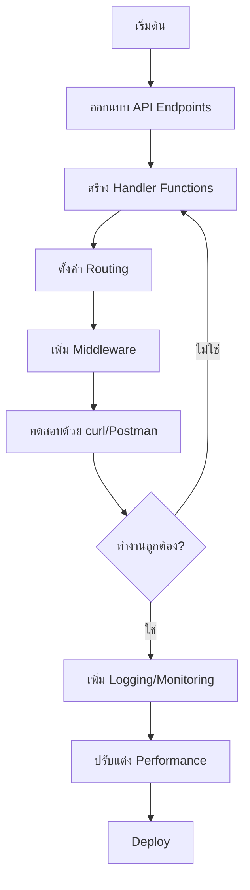
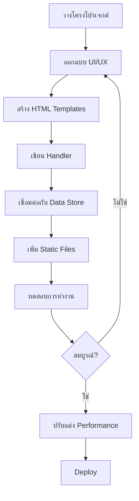
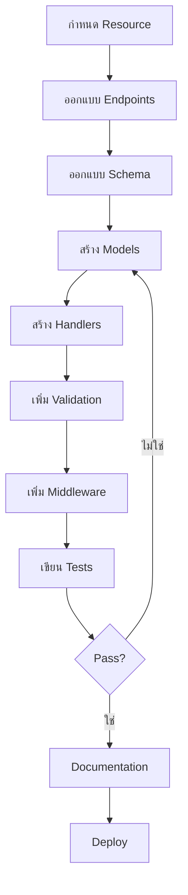
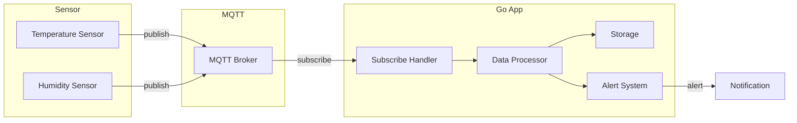
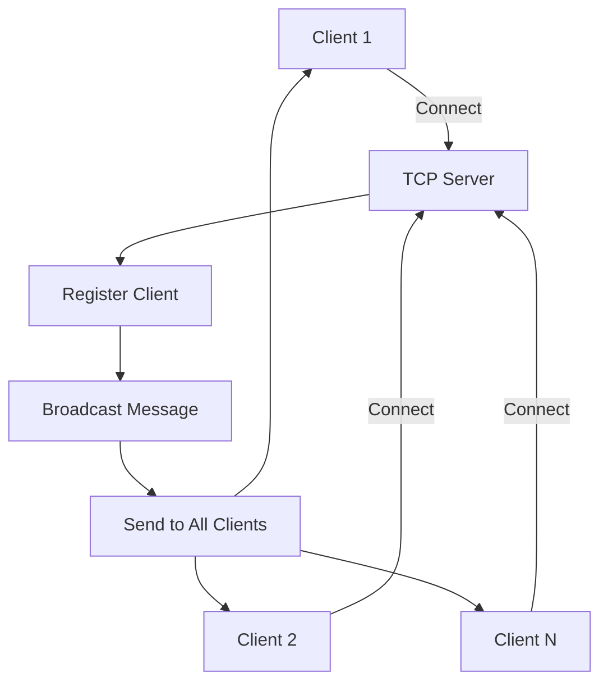
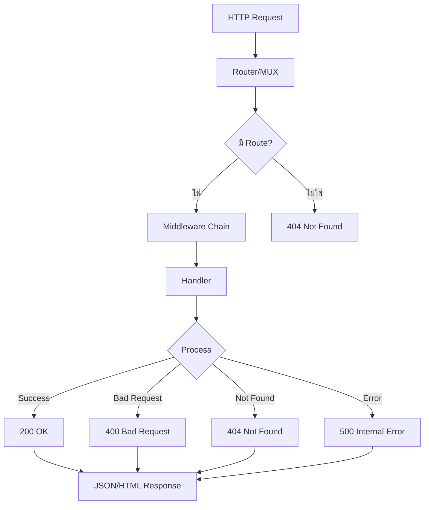

# 📘 เล่มที่ 4: การพัฒนาเว็บและเครือข่าย (Web & Network Development)

---

## 📖 บทนำ

ในยุคที่แอปพลิเคชันส่วนใหญ่ต้องเชื่อมต่อกับอินเทอร์เน็ต การพัฒนาเว็บและระบบเครือข่ายจึงเป็นทักษะที่จำเป็นสำหรับนักพัฒนาทุกคน ภาษา Go ถูกออกแบบมาพร้อมกับ **standard library** ที่ทรงพลังสำหรับการพัฒนาเครือข่าย ทำให้การสร้าง HTTP Server, HTTP Client, TCP Server, และระบบเรียลไทม์เป็นเรื่องง่ายและมีประสิทธิภาพ

เล่มนี้จะพาคุณเดินทางจาก **พื้นฐานการเขียน HTTP Server** ไปจนถึง **การสร้าง REST API และระบบ IoT** ที่พร้อมใช้งานจริง คุณจะได้เรียนรู้ทั้งทฤษฎีและปฏิบัติผ่านโปรเจกต์ที่หลากหลาย

### ทำไมต้องเลือก Go สำหรับการพัฒนาเว็บและเครือข่าย?

| คุณสมบัติ | คำอธิบาย |
|-----------|----------|
| **Standard Library ที่สมบูรณ์** | มี `net/http`, `net`, `encoding/json` ในตัว |
| **ประสิทธิภาพสูง** | รองรับการเชื่อมต่อพร้อมกันนับพันด้วย Goroutine |
| **ง่ายต่อการ** | Compile เป็นไฟล์เดียว ไม่มี dependency |
| **ความปลอดภัย** | กัน Memory Leak และมี built-in race detector |
| **ไลบรารี** | มีไลบรารีและเฟรมเวิร์กคุณภาพมากมาย |

### สิ่งที่คุณจะได้เรียนรู้

- สร้าง HTTP Server และจัดการ Request/Response
- เขียน HTTP Client เพื่อเรียก API ภายนอก
- พัฒนา Web Application แบบ Full-Stack ด้วย Go Templates
- สร้าง TCP Server และแอปพลิเคชันแชท
- ทำงานกับ MQTT และระบบ IoT
- ออกแบบ REST API ที่เป็นมืออาชีพ
- จัดการ Middleware, Error Handling, และ Authentication

### โครงสร้างของเล่ม

```
เล่มที่ 4: การพัฒนาเว็บและเครือข่าย
│
├── บทที่ 1: HTTP Server พื้นฐาน
│   └── เรียนรู้การสร้าง Web Server ด้วย net/http
│
├── บทที่ 2: HTTP Client
│   └── การเรียก API และจัดการ Response
│
├── บทที่ 3: Web Application ด้วย Go
│   └── สร้างเว็บแอปแบบ Full-Stack
│
├── บทที่ 4: TCP Server
│   └── สร้างโปรโตคอลและแอปพลิเคชันแบบ Real-time
│
├── บทที่ 5: MQTT และ IoT
│   └── เชื่อมต่อกับโลกของ IoT
│
└── บทที่ 6: REST API Design
    └── ออกแบบ API ระดับ Production
```

---

## 🔑 บทนิยาม (Key Definitions)

ก่อนเริ่มต้นเรียน มาทำความเข้าใจคำศัพท์สำคัญที่จะใช้ในเล่มนี้กัน

### คำศัพท์พื้นฐาน

| คำศัพท์ | คำจำกัดความ | ตัวอย่าง |
|---------|-------------|----------|
| **HTTP** | Hypertext Transfer Protocol — โปรโตคอลสำหรับสื่อสารบนเว็บ | `GET /users HTTP/1.1` |
| **HTTPS** | HTTP ที่เพิ่มความปลอดภัยด้วย SSL/TLS | `https://example.com` |
| **Server** | โปรแกรมที่รอรับและตอบสนองต่อคำขอจาก Client | Go HTTP Server |
| **Client** | โปรแกรมที่ส่งคำขอไปยัง Server | Browser, HTTP Client |
| **Request** | ข้อความที่ Client ส่งไปยัง Server | GET, POST, PUT, DELETE |
| **Response** | ข้อความที่ Server ตอบกลับ Client | Status 200, 404, 500 |
| **Header** | ข้อมูลเพิ่มเติมใน Request/Response | Content-Type, Authorization |
| **Body** | เนื้อหาหลักของ Request/Response | JSON, HTML, Form Data |
| **Endpoint** | URL ที่ใช้เข้าถึงทรัพยากรบน Server | `/api/users/123` |
| **Middleware** | ฟังก์ชันที่ทำงานก่อน/หลัง Handler | Logger, Auth, CORS |
| **Routing** | การจับคู่ URL กับ Handler Function | `/users` → `GetUsersHandler` |
| **JSON** | JavaScript Object Notation — รูปแบบข้อมูล | `{"name":"John"}` |
| **REST** | Representational State Transfer — สถาปัตยกรรม API | REST API |
| **WebSocket** | โปรโตคอลสำหรับการสื่อสารสองทางแบบ Real-time | Chat App |
| **MQTT** | Message Queuing Telemetry Transport — โปรโตคอล IoT | Sensor Data |
| **Broker** | ตัวกลางในการส่งข้อความ MQTT | Mosquitto, EMQX |
| **Topic** | หัวข้อในการส่งข้อความ MQTT | `sensors/temperature` |

### คำศัพท์ Go เฉพาะ

| คำศัพท์ | คำจำกัดความ |
|---------|-------------|
| `http.Handler` | Interface ที่มี method `ServeHTTP(ResponseWriter, *Request)` |
| `http.HandlerFunc` | ฟังก์ชันที่ implement `http.Handler` ได้โดยอัตโนมัติ |
| `http.ServeMux` | ตัวจัดการ Routing (Multiplexer) |
| `http.ResponseWriter` | Interface สำหรับเขียน Response กลับไปยัง Client |
| `*http.Request` | ตัวแทน Request ที่ได้รับจาก Client |
| `http.Client` | ตัวแทน HTTP Client สำหรับส่ง Request |
| `http.Transport` | จัดการ Connection Pool, Proxy, TLS |
| `http.Server` | HTTP Server ที่สามารถปรับแต่งได้ |

### รหัสสถานะ HTTP ที่สำคัญ

| รหัส | ความหมาย | ใช้เมื่อ |
|------|----------|---------|
| 200 | OK | สำเร็จ |
| 201 | Created | สร้างข้อมูลสำเร็จ |
| 204 | No Content | สำเร็จ แต่ไม่มีข้อมูลตอบ |
| 400 | Bad Request | Request ไม่ถูกต้อง |
| 401 | Unauthorized | ยังไม่ได้ Login |
| 403 | Forbidden | ไม่มีสิทธิ์ |
| 404 | Not Found | ไม่พบทรัพยากร |
| 405 | Method Not Allowed | Method ไม่ถูกต้อง |
| 500 | Internal Server Error | ข้อผิดพลาดภายใน Server |
| 502 | Bad Gateway | Proxy/เกตเวย์ผิดพลาด |
| 503 | Service Unavailable | Server ไม่พร้อมให้บริการ |

---

## 📋 บทหัวข้อ (Topic Breakdown)

### บทที่ 1: HTTP Server พื้นฐาน

<details>
<summary><b>1.1 HTTP Handler Introduction</b></summary>

- `http.Handler` Interface
- `ServeHTTP` Method
- `http.HandlerFunc` Type
- การเขียน Handler อย่างง่าย

```go
type MyHandler struct{}

func (h MyHandler) ServeHTTP(w http.ResponseWriter, r *http.Request) {
    fmt.Fprintf(w, "Hello, World!")
}
```
</details>

<details>
<summary><b>1.2 HTTP Listen and Serve</b></summary>

- `http.ListenAndServe()`
- การกำหนด Port และ Address
- การรัน Server

```go
http.ListenAndServe(":8080", handler)
```
</details>

<details>
<summary><b>1.3 HTTP Listen — Meet the Interface</b></summary>

- `http.Server` Struct
- การปรับแต่ง Timeout
- TLS/HTTPS

```go
srv := &http.Server{
    Addr:         ":8080",
    Handler:      handler,
    ReadTimeout:  5 * time.Second,
    WriteTimeout: 10 * time.Second,
}
srv.ListenAndServe()
```
</details>

<details>
<summary><b>1.4 Server Multiplexer (ServeMux)</b></summary>

- `http.NewServeMux()`
- การจับคู่ URL Pattern
- Pattern Matching Rules

```go
mux := http.NewServeMux()
mux.HandleFunc("/", homeHandler)
mux.HandleFunc("/users", usersHandler)
```
</details>

<details>
<summary><b>1.5 Default MUX</b></summary>

- `http.DefaultServeMux`
- ข้อดีและข้อเสีย
- เมื่อไหร่ควรใช้/ไม่ใช้

```go
http.HandleFunc("/", homeHandler)
http.ListenAndServe(":8080", nil) // ใช้ Default MUX
```
</details>

<details>
<summary><b>1.6 Continue to Complete API</b></summary>

- การสร้าง API ที่สมบูรณ์
- การแยก Handler
- การจัดการ Error

</details>

---

### บทที่ 2: HTTP Client

<details>
<summary><b>2.1 HTTP Client — การส่ง Request</b></summary>

- `http.Get()`, `http.Post()`
- `http.NewRequestWithContext()`
- การตั้งค่า Headers
- ตัวอย่าง:

```go
resp, err := http.Get("https://api.example.com/users")
if err != nil {
    // handle error
}
defer resp.Body.Close()
```
</details>

<details>
<summary><b>2.2 การใช้งาน JSON Unmarshal กับ HTTP GET</b></summary>

- การอ่าน Response Body
- การแปลง JSON เป็น Struct
- Error Handling

```go
var users []User
body, _ := io.ReadAll(resp.Body)
json.Unmarshal(body, &users)
```
</details>

<details>
<summary><b>2.3 HTTP Client — การจัดการ Response</b></summary>

- การตรวจสอบ Status Code
- การอ่านและปิด Body
- Timeout และ Retry

</details>

---

### บทที่ 3: Web Application ด้วย Go

<details>
<summary><b>3.1 ภาพรวมของโปรเจกต์</b></summary>

- โปรเจกต์: Note Taking App
- ฟีเจอร์: Create, Read, Update, Delete
- สถาปัตยกรรม: MVC-like

</details>

<details>
<summary><b>3.2 วางโครงโปรเจกต์</b></summary>

```
note-app/
├── main.go
├── handlers/
│   └── note.go
├── models/
│   └── note.go
├── templates/
│   ├── index.html
│   └── note.html
├── static/
│   ├── css/
│   └── js/
└── go.mod
```
</details>

<details>
<summary><b>3.3 Display View from Template</b></summary>

- การใช้ `html/template`
- การส่งข้อมูลไปยัง Template
- Template Parsing

```go
tmpl := template.Must(template.ParseFiles("templates/index.html"))
tmpl.Execute(w, data)
```
</details>

<details>
<summary><b>3.4 สร้าง Submit Form</b></summary>

- HTML Form
- CSRF Protection
- Form Validation

</details>

<details>
<summary><b>3.5 การดึงข้อมูลจาก Form</b></summary>

- `r.ParseForm()`
- `r.FormValue()`
- `r.PostFormValue()`

```go
title := r.FormValue("title")
content := r.FormValue("content")
```
</details>

<details>
<summary><b>3.6 การเขียนข้อมูลลงไฟล์</b></summary>

- `os.Create()`, `file.Write()`
- JSON Storage
- การจัดการ Error

</details>

<details>
<summary><b>3.7 Refactor Template</b></summary>

- การแยก Layout
- Template Inheritance
- การใช้ `block` และ `define`

</details>

<details>
<summary><b>3.8 เพิ่ม Bootstrap CSS</b></summary>

- การเพิ่ม CDN
- การออกแบบ UI
- Responsive Design

</details>

<details>
<summary><b>3.9 เพิ่ม Custom CSS และการสร้าง File Server</b></summary>

- `http.FileServer()`
- การ Serving Static Files
- การจัดระเบียบ Static Files

```go
fs := http.FileServer(http.Dir("static"))
mux.Handle("/static/", http.StripPrefix("/static/", fs))
```
</details>

---

### บทที่ 4: TCP Server

<details>
<summary><b>4.1 TCP Server — พื้นฐาน</b></summary>

- `net.Listen()`
- `net.Conn`
- การอ่าน/เขียนข้อมูล

```go
listener, _ := net.Listen("tcp", ":9000")
conn, _ := listener.Accept()
```
</details>

<details>
<summary><b>4.2 Chat Application — Main Structure</b></summary>

- Room/Chat Room Concept
- Client Management
- Message Broadcasting

</details>

<details>
<summary><b>4.3 Chat Application — Complete</b></summary>

- การสร้าง Chat Server ที่สมบูรณ์
- การจัดการผู้ใช้เข้า-ออก
- การส่งข้อความแบบ Real-time

</details>

---

### บทที่ 5: MQTT และ IoT

<details>
<summary><b>5.1 MQTT คืออะไร?</b></summary>

- MQTT Protocol
- Publish/Subscribe Model
- Quality of Service (QoS)
- เปรียบเทียบ MQTT vs HTTP

</details>

<details>
<summary><b>5.2 การเชื่อมต่อ MQTT Broker</b></summary>

- การติดตั้ง Mosquitto/EMQX
- ไลบรารี: `eclipse/paho.mqtt.golang`
- การเชื่อมต่อและตั้งค่า

```go
opts := mqtt.NewClientOptions()
opts.AddBroker("tcp://localhost:1883")
client := mqtt.NewClient(opts)
client.Connect()
```
</details>

<details>
<summary><b>5.3 การส่งและรับข้อความ MQTT</b></summary>

- `client.Publish()`
- `client.Subscribe()`
- Message Handler

</details>

<details>
<summary><b>5.4 Go IoT Platform — ภาพรวม</b></summary>

- สถาปัตยกรรม IoT Platform
- Component: MQTT, Database, API, Dashboard

</details>

<details>
<summary><b>5.5 MQTT Client Management</b></summary>

- การจัดการการเชื่อมต่อ
- Reconnect Logic
- Connection Pool

</details>

<details>
<summary><b>5.6 Data Storage</b></summary>

- Time-Series Database
- PostgreSQL + TimescaleDB
- การบันทึกข้อมูลจาก Sensor

</details>

<details>
<summary><b>5.7 Alarm Analysis</b></summary>

- Real-time Monitoring
- Threshold-based Alert
- การส่งการแจ้งเตือน

</details>

<details>
<summary><b>5.8 Data Visualization</b></summary>

- Real-time Dashboard
- Chart และ Graph
- WebSocket + Chart.js

</details>

---

### บทที่ 6: REST API Design

<details>
<summary><b>6.1 การออกแบบ REST API ด้วย Go</b></summary>

- RESTful Principles
- Resource Design
- HTTP Methods Mapping

| HTTP Method | CRUD Operation | Endpoint |
|-------------|----------------|----------|
| GET | Read | `/users` |
| POST | Create | `/users` |
| PUT | Update | `/users/{id}` |
| DELETE | Delete | `/users/{id}` |

</details>

<details>
<summary><b>6.2 Routing และ Handler</b></summary>

- การจัดระเบียบ Routing
- Path Parameters
- Query Parameters

```go
mux.HandleFunc("GET /users", GetUsers)
mux.HandleFunc("GET /users/{id}", GetUser)
mux.HandleFunc("POST /users", CreateUser)
```
</details>

<details>
<summary><b>6.3 การรับและส่ง JSON</b></summary>

- Request Body Parsing
- Response JSON Encoding
- Validation

</details>

<details>
<summary><b>6.4 Middleware</b></summary>

- Logging Middleware
- Authentication Middleware
- CORS Middleware
- Chain Middleware

```go
func loggingMiddleware(next http.Handler) http.Handler {
    return http.HandlerFunc(func(w http.ResponseWriter, r *http.Request) {
        log.Printf("%s %s", r.Method, r.URL.Path)
        next.ServeHTTP(w, r)
    })
}
```
</details>

<details>
<summary><b>6.5 Error Handling ใน API</b></summary>

- Error Response Format
- HTTP Status Codes
- Global Error Handler

```go
type ErrorResponse struct {
    Error   string `json:"error"`
    Code    int    `json:"code"`
    Details string `json:"details,omitempty"`
}
```
</details>

---

## 🔄 Workflow

### 1. Workflow การพัฒนา HTTP Server



### 2. Workflow การพัฒนา Web Application



### 3. Workflow การพัฒนา REST API



### 4. Workflow การทำงานกับ MQTT



### 5. Workflow การพัฒนา Real-time Chat



### 6. Workflow การ Handle Request



---

## 📝 Template

### Template 1: โครงสร้างโปรเจกต์ Web Application

```go
// main.go
package main

import (
    "log"
    "net/http"
    "note-app/handlers"
)

func main() {
    mux := http.NewServeMux()
    
    // Static files
    fs := http.FileServer(http.Dir("static"))
    mux.Handle("/static/", http.StripPrefix("/static/", fs))
    
    // Routes
    mux.HandleFunc("/", handlers.Home)
    mux.HandleFunc("/notes", handlers.Notes)
    mux.HandleFunc("/notes/create", handlers.CreateNote)
    mux.HandleFunc("/notes/{id}", handlers.ViewNote)
    
    log.Println("Server starting on :8080")
    log.Fatal(http.ListenAndServe(":8080", mux))
}
```

### Template 2: Handler Template

```go
// handlers/note.go
package handlers

import (
    "html/template"
    "net/http"
    "strconv"
)

var templates = template.Must(template.ParseGlob("templates/*.html"))

func Home(w http.ResponseWriter, r *http.Request) {
    data := struct {
        Title string
    }{
        Title: "Note App",
    }
    templates.ExecuteTemplate(w, "index.html", data)
}

func Notes(w http.ResponseWriter, r *http.Request) {
    // ดึงข้อมูล Notes
    notes := []Note{
        {ID: 1, Title: "Note 1", Content: "Content 1"},
        {ID: 2, Title: "Note 2", Content: "Content 2"},
    }
    templates.ExecuteTemplate(w, "notes.html", notes)
}

func CreateNote(w http.ResponseWriter, r *http.Request) {
    if r.Method != http.MethodPost {
        http.Error(w, "Method not allowed", http.StatusMethodNotAllowed)
        return
    }
    
    title := r.FormValue("title")
    content := r.FormValue("content")
    
    // บันทึกข้อมูล
    // ...
    
    http.Redirect(w, r, "/notes", http.StatusSeeOther)
}
```

### Template 3: REST API Handler Template

```go
// handlers/api/user.go
package api

import (
    "encoding/json"
    "net/http"
    "strconv"
)

type User struct {
    ID    int    `json:"id"`
    Name  string `json:"name"`
    Email string `json:"email"`
}

type Response struct {
    Success bool        `json:"success"`
    Data    interface{} `json:"data,omitempty"`
    Error   string      `json:"error,omitempty"`
}

func GetUsers(w http.ResponseWriter, r *http.Request) {
    users := []User{
        {ID: 1, Name: "John", Email: "john@example.com"},
        {ID: 2, Name: "Jane", Email: "jane@example.com"},
    }
    
    respondJSON(w, http.StatusOK, Response{
        Success: true,
        Data:    users,
    })
}

func GetUser(w http.ResponseWriter, r *http.Request) {
    // ดึง ID จาก Path Parameter
    idStr := r.PathValue("id")
    id, err := strconv.Atoi(idStr)
    if err != nil {
        respondError(w, http.StatusBadRequest, "Invalid ID")
        return
    }
    
    // ดึงข้อมูลจาก DB
    user := User{ID: id, Name: "John", Email: "john@example.com"}
    
    respondJSON(w, http.StatusOK, Response{
        Success: true,
        Data:    user,
    })
}

func CreateUser(w http.ResponseWriter, r *http.Request) {
    var user User
    err := json.NewDecoder(r.Body).Decode(&user)
    if err != nil {
        respondError(w, http.StatusBadRequest, "Invalid JSON")
        return
    }
    
    // Validate
    if user.Name == "" {
        respondError(w, http.StatusBadRequest, "Name is required")
        return
    }
    
    // บันทึก
    user.ID = 1 // Simulate
    
    respondJSON(w, http.StatusCreated, Response{
        Success: true,
        Data:    user,
    })
}

func respondJSON(w http.ResponseWriter, status int, data interface{}) {
    w.Header().Set("Content-Type", "application/json")
    w.WriteHeader(status)
    json.NewEncoder(w).Encode(data)
}

func respondError(w http.ResponseWriter, status int, message string) {
    respondJSON(w, status, Response{
        Success: false,
        Error:   message,
    })
}
```

### Template 4: Middleware Template

```go
// middleware.go
package middleware

import (
    "log"
    "net/http"
    "time"
)

// Logging Middleware
func Logging(next http.Handler) http.Handler {
    return http.HandlerFunc(func(w http.ResponseWriter, r *http.Request) {
        start := time.Now()
        next.ServeHTTP(w, r)
        log.Printf("%s %s %v", r.Method, r.URL.Path, time.Since(start))
    })
}

// Authentication Middleware
func Auth(next http.Handler) http.Handler {
    return http.HandlerFunc(func(w http.ResponseWriter, r *http.Request) {
        token := r.Header.Get("Authorization")
        if token == "" {
            http.Error(w, "Unauthorized", http.StatusUnauthorized)
            return
        }
        // Validate token
        // ...
        next.ServeHTTP(w, r)
    })
}

// CORS Middleware
func CORS(next http.Handler) http.Handler {
    return http.HandlerFunc(func(w http.ResponseWriter, r *http.Request) {
        w.Header().Set("Access-Control-Allow-Origin", "*")
        w.Header().Set("Access-Control-Allow-Methods", "GET, POST, PUT, DELETE, OPTIONS")
        w.Header().Set("Access-Control-Allow-Headers", "Content-Type, Authorization")
        
        if r.Method == "OPTIONS" {
            w.WriteHeader(http.StatusOK)
            return
        }
        
        next.ServeHTTP(w, r)
    })
}

// Chain Middleware
func Chain(middlewares ...func(http.Handler) http.Handler) func(http.Handler) http.Handler {
    return func(h http.Handler) http.Handler {
        for i := len(middlewares) - 1; i >= 0; i-- {
            h = middlewares[i](h)
        }
        return h
    }
}
```

### Template 5: WebSocket Handler Template

```go
// handlers/websocket.go
package handlers

import (
    "net/http"
    "sync"

    "github.com/gorilla/websocket"
)

var upgrader = websocket.Upgrader{
    CheckOrigin: func(r *http.Request) bool {
        return true
    },
}

type Client struct {
    Conn *websocket.Conn
    Send chan []byte
}

type Hub struct {
    Clients    map[*Client]bool
    Broadcast  chan []byte
    Register   chan *Client
    Unregister chan *Client
    Mutex      sync.Mutex
}

func NewHub() *Hub {
    return &Hub{
        Clients:    make(map[*Client]bool),
        Broadcast:  make(chan []byte),
        Register:   make(chan *Client),
        Unregister: make(chan *Client),
    }
}

func (h *Hub) Run() {
    for {
        select {
        case client := <-h.Register:
            h.Mutex.Lock()
            h.Clients[client] = true
            h.Mutex.Unlock()
            
        case client := <-h.Unregister:
            h.Mutex.Lock()
            if _, ok := h.Clients[client]; ok {
                delete(h.Clients, client)
                close(client.Send)
            }
            h.Mutex.Unlock()
            
        case message := <-h.Broadcast:
            h.Mutex.Lock()
            for client := range h.Clients {
                select {
                case client.Send <- message:
                default:
                    close(client.Send)
                    delete(h.Clients, client)
                }
            }
            h.Mutex.Unlock()
        }
    }
}

func ServeWS(hub *Hub, w http.ResponseWriter, r *http.Request) {
    conn, err := upgrader.Upgrade(w, r, nil)
    if err != nil {
        http.Error(w, "Could not open websocket connection", http.StatusBadRequest)
        return
    }
    
    client := &Client{
        Conn: conn,
        Send: make(chan []byte, 256),
    }
    
    hub.Register <- client
    
    // Read goroutine
    go func() {
        defer func() {
            hub.Unregister <- client
            conn.Close()
        }()
        for {
            _, message, err := conn.ReadMessage()
            if err != nil {
                break
            }
            hub.Broadcast <- message
        }
    }()
    
    // Write goroutine
    go func() {
        defer conn.Close()
        for message := range client.Send {
            err := conn.WriteMessage(websocket.TextMessage, message)
            if err != nil {
                break
            }
        }
    }()
}
```

### Template 6: MQTT Client Template

```go
// mqtt/client.go
package mqtt

import (
    "encoding/json"
    "log"
    "time"

    mqtt "github.com/eclipse/paho.mqtt.golang"
)

type Config struct {
    Broker   string
    ClientID string
    Username string
    Password string
}

type MessageHandler func(topic string, payload []byte)

type Client struct {
    mqtt.Client
    Handlers map[string]MessageHandler
}

func NewClient(cfg Config) *Client {
    opts := mqtt.NewClientOptions()
    opts.AddBroker(cfg.Broker)
    opts.SetClientID(cfg.ClientID)
    opts.SetUsername(cfg.Username)
    opts.SetPassword(cfg.Password)
    opts.SetAutoReconnect(true)
    opts.SetConnectRetry(true)
    opts.SetKeepAlive(60 * time.Second)
    
    client := &Client{
        Handlers: make(map[string]MessageHandler),
    }
    
    opts.SetOnConnectHandler(client.onConnect)
    opts.SetConnectionLostHandler(client.onConnectionLost)
    
    client.Client = mqtt.NewClient(opts)
    
    return client
}

func (c *Client) Connect() error {
    token := c.Client.Connect()
    token.Wait()
    return token.Error()
}

func (c *Client) onConnect(client mqtt.Client) {
    log.Println("Connected to MQTT Broker")
    // Subscribe to topics
    for topic := range c.Handlers {
        c.Subscribe(topic, 1, c.messageHandler)
    }
}

func (c *Client) onConnectionLost(client mqtt.Client, err error) {
    log.Printf("Connection lost: %v", err)
}

func (c *Client) messageHandler(client mqtt.Client, msg mqtt.Message) {
    topic := msg.Topic()
    payload := msg.Payload()
    
    if handler, ok := c.Handlers[topic]; ok {
        handler(topic, payload)
    }
}

func (c *Client) AddHandler(topic string, handler MessageHandler) {
    c.Handlers[topic] = handler
}

func (c *Client) PublishJSON(topic string, data interface{}) error {
    payload, err := json.Marshal(data)
    if err != nil {
        return err
    }
    token := c.Client.Publish(topic, 1, false, payload)
    token.Wait()
    return token.Error()
}
```

### Template 7: Error Handling Template

```go
// errors/errors.go
package errors

import (
    "encoding/json"
    "net/http"
)

type AppError struct {
    Code    int    `json:"code"`
    Message string `json:"message"`
    Details string `json:"details,omitempty"`
}

func (e AppError) Error() string {
    return e.Message
}

// Predefined errors
var (
    ErrNotFound     = AppError{Code: http.StatusNotFound, Message: "Resource not found"}
    ErrBadRequest   = AppError{Code: http.StatusBadRequest, Message: "Bad request"}
    ErrUnauthorized = AppError{Code: http.StatusUnauthorized, Message: "Unauthorized"}
    ErrInternal     = AppError{Code: http.StatusInternalServerError, Message: "Internal server error"}
)

func RespondError(w http.ResponseWriter, err AppError) {
    w.Header().Set("Content-Type", "application/json")
    w.WriteHeader(err.Code)
    json.NewEncoder(w).Encode(err)
}

func HandleError(w http.ResponseWriter, err error) {
    if appErr, ok := err.(AppError); ok {
        RespondError(w, appErr)
        return
    }
    RespondError(w, ErrInternal)
}
```

---

## 🎯 สรุป Workflow และ Template ที่สำคัญ

| หัวข้อ | Workflow | Template ที่เกี่ยวข้อง |
|--------|----------|----------------------|
| HTTP Server | Design → Handler → Route → Test | Template 1, 2 |
| REST API | Resource → Endpoint → Model → Handler | Template 2, 3 |
| Middleware | Logging → Auth → CORS → Chain | Template 4 |
| WebSocket | Connection → Hub → Broadcast | Template 5 |
| MQTT | Connect → Subscribe → Publish | Template 6 |
| Error Handling | Define → Respond → Handle | Template 7 |

---

## ✅ Checklist การพัฒนาเว็บด้วย Go

- [ ] ติดตั้ง Go และตั้งค่า Environment
- [ ] สร้าง `go.mod` และโครงสร้างโปรเจกต์
- [ ] เขียน HTTP Server ตัวแรก
- [ ] เพิ่ม Routing และ Handler
- [ ] จัดการ Static Files
- [ ] สร้าง Templates
- [ ] Implement Middleware
- [ ] เชื่อมต่อ Database
- [ ] เขียน REST API
- [ ] เพิ่ม Authentication
- [ ] เพิ่ม Error Handling
- [ ] ใช้ MQTT สำหรับ IoT
- [ ] เขียน WebSocket สำหรับ Real-time
- [ ] ทดสอบด้วย Unit Test
- [ ] Deploy ไป Production
--- 

