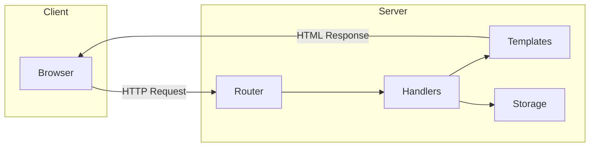

# 📘 เล่มที่ 4: การพัฒนาเว็บและเครือข่าย — เนื้อหาฉบับสมบูรณ์

---

## บทที่ 1: HTTP Server พื้นฐาน

---

### 1.1 HTTP Handler Introduction

#### HTTP Handler คืออะไร?

ใน Go, `http.Handler` เป็น interface ที่สำคัญที่สุดในการพัฒนาเว็บ:

```go
type Handler interface {
    ServeHTTP(ResponseWriter, *Request)
}
```

ทุกสิ่งที่สามารถตอบสนองต่อ HTTP request ได้ต้อง implement interface นี้

#### วิธีสร้าง Handler แบบต่างๆ

**แบบที่ 1: Struct ที่ implement Handler**

```go
package main

import (
    "fmt"
    "net/http"
)

type HelloHandler struct{}

func (h HelloHandler) ServeHTTP(w http.ResponseWriter, r *http.Request) {
    fmt.Fprintf(w, "Hello, World!")
}

func main() {
    handler := HelloHandler{}
    http.ListenAndServe(":8080", handler)
}
```

**แบบที่ 2: ใช้ HandlerFunc (วิธีที่นิยม)**

```go
package main

import (
    "fmt"
    "net/http"
)

func helloHandler(w http.ResponseWriter, r *http.Request) {
    fmt.Fprintf(w, "Hello, World!")
}

func main() {
    // HandlerFunc แปลงฟังก์ชันให้เป็น Handler
    http.HandleFunc("/", helloHandler)
    http.ListenAndServe(":8080", nil)
}
```

**แบบที่ 3: Anonymous Function**

```go
package main

import (
    "fmt"
    "net/http"
)

func main() {
    http.HandleFunc("/", func(w http.ResponseWriter, r *http.Request) {
        fmt.Fprintf(w, "Hello, World!")
    })
    http.ListenAndServe(":8080", nil)
}
```

#### การอ่านข้อมูลจาก Request

```go
func handler(w http.ResponseWriter, r *http.Request) {
    // อ่าน Method
    method := r.Method
    
    // อ่าน URL
    path := r.URL.Path
    
    // อ่าน Query Parameter
    name := r.URL.Query().Get("name")
    
    // อ่าน Header
    userAgent := r.Header.Get("User-Agent")
    
    // อ่าน Body
    body, _ := io.ReadAll(r.Body)
    defer r.Body.Close()
    
    fmt.Fprintf(w, "Method: %s, Path: %s, Name: %s, UA: %s, Body: %s", 
        method, path, name, userAgent, string(body))
}
```

#### การเขียน Response

```go
func handler(w http.ResponseWriter, r *http.Request) {
    // ตั้งค่า Header
    w.Header().Set("Content-Type", "application/json")
    w.Header().Set("X-Custom-Header", "my-value")
    
    // กำหนด Status Code
    w.WriteHeader(http.StatusCreated) // 201
    
    // เขียน Body
    w.Write([]byte(`{"status":"ok"}`))
}
```

---

### 1.2 HTTP Listen and Serve

#### `http.ListenAndServe` พื้นฐาน

```go
package main

import (
    "fmt"
    "net/http"
)

func main() {
    http.HandleFunc("/", func(w http.ResponseWriter, r *http.Request) {
        fmt.Fprintf(w, "Hello, Go Web!")
    })
    
    // เริ่ม Server ที่ port 8080
    // ถ้าใช้ nil จะใช้ DefaultServeMux
    err := http.ListenAndServe(":8080", nil)
    if err != nil {
        panic(err)
    }
}
```

#### การใช้ `http.Server` แบบปรับแต่งได้

```go
package main

import (
    "fmt"
    "net/http"
    "time"
)

func main() {
    mux := http.NewServeMux()
    mux.HandleFunc("/", func(w http.ResponseWriter, r *http.Request) {
        fmt.Fprintf(w, "Hello with custom server!")
    })
    
    server := &http.Server{
        Addr:              ":8080",
        Handler:           mux,
        ReadTimeout:       5 * time.Second,
        WriteTimeout:      10 * time.Second,
        IdleTimeout:       120 * time.Second,
        MaxHeaderBytes:    1 << 20, // 1MB
    }
    
    fmt.Println("Server starting on :8080")
    if err := server.ListenAndServe(); err != nil {
        panic(err)
    }
}
```

#### Graceful Shutdown (การปิด Server อย่างปลอดภัย)

```go
package main

import (
    "context"
    "fmt"
    "net/http"
    "os"
    "os/signal"
    "syscall"
    "time"
)

func main() {
    mux := http.NewServeMux()
    mux.HandleFunc("/", func(w http.ResponseWriter, r *http.Request) {
        fmt.Fprintf(w, "Hello with graceful shutdown!")
    })
    
    server := &http.Server{
        Addr:    ":8080",
        Handler: mux,
    }
    
    // เริ่ม Server ใน Goroutine
    go func() {
        fmt.Println("Server starting on :8080")
        if err := server.ListenAndServe(); err != nil && err != http.ErrServerClosed {
            panic(err)
        }
    }()
    
    // รอ Signal
    quit := make(chan os.Signal, 1)
    signal.Notify(quit, syscall.SIGINT, syscall.SIGTERM)
    <-quit
    
    fmt.Println("Shutting down server...")
    
    // ให้เวลาในการปิดการเชื่อมต่อ 5 วินาที
    ctx, cancel := context.WithTimeout(context.Background(), 5*time.Second)
    defer cancel()
    
    if err := server.Shutdown(ctx); err != nil {
        panic(err)
    }
    
    fmt.Println("Server stopped gracefully")
}
```

#### HTTPS ด้วย TLS

```go
// สร้าง certificates ด้วย: go run /usr/local/go/src/crypto/tls/generate_cert.go --host=localhost

func main() {
    mux := http.NewServeMux()
    mux.HandleFunc("/", func(w http.ResponseWriter, r *http.Request) {
        fmt.Fprintf(w, "Secure connection!")
    })
    
    server := &http.Server{
        Addr:    ":8443",
        Handler: mux,
    }
    
    // ใช้ ListenAndServeTLS สำหรับ HTTPS
    err := server.ListenAndServeTLS("server.crt", "server.key")
    if err != nil {
        panic(err)
    }
}
```

---

### 1.3 HTTP Listen — Meet the Interface

#### ทำความเข้าใจ `http.Server` Struct

```go
type Server struct {
    Addr              string
    Handler           Handler
    ReadTimeout       time.Duration
    ReadHeaderTimeout time.Duration
    WriteTimeout      time.Duration
    IdleTimeout       time.Duration
    MaxHeaderBytes    int
    TLSNextProto      map[string]func(*Server, *tls.Conn, Handler)
    ConnState         func(net.Conn, ConnState)
    ErrorLog          *log.Logger
    BaseContext       func(net.Listener) context.Context
    ConnContext       func(ctx context.Context, c net.Conn) context.Context
}
```

#### การปรับแต่ง Timeout

```go
func main() {
    mux := http.NewServeMux()
    mux.HandleFunc("/slow", func(w http.ResponseWriter, r *http.Request) {
        time.Sleep(8 * time.Second) // จำลองการทำงานนาน
        fmt.Fprintf(w, "Done!")
    })
    
    server := &http.Server{
        Addr:              ":8080",
        Handler:           mux,
        ReadTimeout:       5 * time.Second,   // อ่าน Request ได้สูงสุด 5 วินาที
        ReadHeaderTimeout: 2 * time.Second,   // อ่าน Header ได้สูงสุด 2 วินาที
        WriteTimeout:      10 * time.Second,  // เขียน Response ได้สูงสุด 10 วินาที
        IdleTimeout:       120 * time.Second, // Keep-Alive สูงสุด 120 วินาที
    }
    
    server.ListenAndServe()
}
```

#### การตั้งค่า ConnState (ติดตามสถานะการเชื่อมต่อ)

```go
func main() {
    server := &http.Server{
        Addr: ":8080",
        ConnState: func(conn net.Conn, state http.ConnState) {
            switch state {
            case http.StateNew:
                log.Println("New connection:", conn.RemoteAddr())
            case http.StateActive:
                log.Println("Active connection:", conn.RemoteAddr())
            case http.StateIdle:
                log.Println("Idle connection:", conn.RemoteAddr())
            case http.StateHijacked:
                log.Println("Hijacked connection:", conn.RemoteAddr())
            case http.StateClosed:
                log.Println("Closed connection:", conn.RemoteAddr())
            }
        },
    }
    
    http.HandleFunc("/", func(w http.ResponseWriter, r *http.Request) {
        fmt.Fprintf(w, "Check the logs for connection states!")
    })
    
    server.ListenAndServe()
}
```

---

### 1.4 Server Multiplexer (ServeMux)

#### การใช้ `http.NewServeMux`

```go
package main

import (
    "fmt"
    "net/http"
)

func main() {
    // สร้าง MUX ใหม่
    mux := http.NewServeMux()
    
    // เพิ่ม Routes
    mux.HandleFunc("/", homeHandler)
    mux.HandleFunc("/about", aboutHandler)
    mux.HandleFunc("/users", usersHandler)
    mux.HandleFunc("/users/{id}", userHandler) // Go 1.22+ Wildcard
    
    // เริ่ม Server
    http.ListenAndServe(":8080", mux)
}

func homeHandler(w http.ResponseWriter, r *http.Request) {
    fmt.Fprintf(w, "Home Page")
}

func aboutHandler(w http.ResponseWriter, r *http.Request) {
    fmt.Fprintf(w, "About Page")
}

func usersHandler(w http.ResponseWriter, r *http.Request) {
    fmt.Fprintf(w, "List of Users")
}

func userHandler(w http.ResponseWriter, r *http.Request) {
    // ดึงค่า ID จาก Path (Go 1.22+)
    id := r.PathValue("id")
    fmt.Fprintf(w, "User ID: %s", id)
}
```

#### Pattern Matching ใน Go 1.22+

Go 1.22+ มี pattern matching ที่ดีขึ้น:

```go
func main() {
    mux := http.NewServeMux()
    
    // Exact match
    mux.HandleFunc("GET /users", getUsers)
    
    // Path parameter
    mux.HandleFunc("GET /users/{id}", getUser)
    mux.HandleFunc("PUT /users/{id}", updateUser)
    mux.HandleFunc("DELETE /users/{id}", deleteUser)
    
    // Wildcard
    mux.HandleFunc("GET /files/{path...}", serveFiles)
    
    // Method และ Path พร้อมกัน
    mux.HandleFunc("POST /users", createUser)
    
    http.ListenAndServe(":8080", mux)
}

func getUser(w http.ResponseWriter, r *http.Request) {
    id := r.PathValue("id")
    fmt.Fprintf(w, "Get user: %s", id)
}

func serveFiles(w http.ResponseWriter, r *http.Request) {
    path := r.PathValue("path")
    fmt.Fprintf(w, "Serving file: %s", path)
}
```

#### การจัดกลุ่ม Routes (Sub-routing)

```go
func main() {
    mainMux := http.NewServeMux()
    
    // API Routes
    apiMux := http.NewServeMux()
    apiMux.HandleFunc("GET /users", getUsers)
    apiMux.HandleFunc("POST /users", createUser)
    apiMux.HandleFunc("GET /users/{id}", getUser)
    
    // Admin Routes
    adminMux := http.NewServeMux()
    adminMux.HandleFunc("/dashboard", adminDashboard)
    adminMux.HandleFunc("/settings", adminSettings)
    
    // Mount sub-routers
    mainMux.Handle("/api/", http.StripPrefix("/api", apiMux))
    mainMux.Handle("/admin/", http.StripPrefix("/admin", adminMux))
    
    // Public routes
    mainMux.HandleFunc("/", homeHandler)
    mainMux.HandleFunc("/about", aboutHandler)
    
    http.ListenAndServe(":8080", mainMux)
}
```

---

### 1.5 Default MUX

#### การใช้ DefaultServeMux

```go
package main

import (
    "fmt"
    "net/http"
)

func main() {
    // ใช้ DefaultServeMux โดยตรง
    http.HandleFunc("/", homeHandler)
    http.HandleFunc("/about", aboutHandler)
    
    // ส่ง nil เพื่อใช้ DefaultServeMux
    http.ListenAndServe(":8080", nil)
}

func homeHandler(w http.ResponseWriter, r *http.Request) {
    fmt.Fprintf(w, "Home with Default MUX")
}
```

#### ข้อดีและข้อเสียของ Default MUX

| ข้อดี | ข้อเสีย |
|-------|---------|
| ใช้งานง่าย ไม่ต้องสร้าง instance | Global state — อาจมี冲突 |
| เหมาะกับโปรเจกต์เล็ก | ไม่สามารถมีหลาย MUX พร้อมกัน |
| ใช้ร่วมกับ middleware ได้ | ยากต่อการทดสอบ (testing) |

#### การใช้ Default MUX อย่างปลอดภัย

```go
func main() {
    // ใช้ Default MUX แต่เพิ่ม middleware
    mux := http.DefaultServeMux
    
    // เพิ่ม recovery middleware
    handler := recoveryMiddleware(mux)
    
    http.HandleFunc("/", homeHandler)
    http.ListenAndServe(":8080", handler)
}

func recoveryMiddleware(next http.Handler) http.Handler {
    return http.HandlerFunc(func(w http.ResponseWriter, r *http.Request) {
        defer func() {
            if err := recover(); err != nil {
                log.Printf("Panic: %v", err)
                http.Error(w, "Internal Server Error", http.StatusInternalServerError)
            }
        }()
        next.ServeHTTP(w, r)
    })
}
```

---

### 1.6 Continue to Complete API

#### สร้าง REST API ที่สมบูรณ์

```go
package main

import (
    "encoding/json"
    "fmt"
    "log"
    "net/http"
    "strconv"
    "sync"
)

// Model
type User struct {
    ID    int    `json:"id"`
    Name  string `json:"name"`
    Email string `json:"email"`
    Age   int    `json:"age"`
}

// In-memory storage
type UserStore struct {
    mu    sync.RWMutex
    users map[int]User
    idGen int
}

func NewUserStore() *UserStore {
    return &UserStore{
        users: make(map[int]User),
        idGen: 1,
    }
}

func (s *UserStore) Create(user User) User {
    s.mu.Lock()
    defer s.mu.Unlock()
    user.ID = s.idGen
    s.idGen++
    s.users[user.ID] = user
    return user
}

func (s *UserStore) GetAll() []User {
    s.mu.RLock()
    defer s.mu.RUnlock()
    result := make([]User, 0, len(s.users))
    for _, user := range s.users {
        result = append(result, user)
    }
    return result
}

func (s *UserStore) Get(id int) (User, bool) {
    s.mu.RLock()
    defer s.mu.RUnlock()
    user, ok := s.users[id]
    return user, ok
}

func (s *UserStore) Update(id int, user User) (User, bool) {
    s.mu.Lock()
    defer s.mu.Unlock()
    if _, ok := s.users[id]; !ok {
        return User{}, false
    }
    user.ID = id
    s.users[id] = user
    return user, true
}

func (s *UserStore) Delete(id int) bool {
    s.mu.Lock()
    defer s.mu.Unlock()
    if _, ok := s.users[id]; !ok {
        return false
    }
    delete(s.users, id)
    return true
}

// Response Helpers
type Response struct {
    Success bool        `json:"success"`
    Data    interface{} `json:"data,omitempty"`
    Error   string      `json:"error,omitempty"`
}

func respondJSON(w http.ResponseWriter, status int, data interface{}) {
    w.Header().Set("Content-Type", "application/json")
    w.WriteHeader(status)
    json.NewEncoder(w).Encode(data)
}

func respondError(w http.ResponseWriter, status int, message string) {
    respondJSON(w, status, Response{Success: false, Error: message})
}

func respondSuccess(w http.ResponseWriter, status int, data interface{}) {
    respondJSON(w, status, Response{Success: true, Data: data})
}

// Handlers
func getUsers(store *UserStore) http.HandlerFunc {
    return func(w http.ResponseWriter, r *http.Request) {
        users := store.GetAll()
        respondSuccess(w, http.StatusOK, users)
    }
}

func createUser(store *UserStore) http.HandlerFunc {
    return func(w http.ResponseWriter, r *http.Request) {
        var user User
        if err := json.NewDecoder(r.Body).Decode(&user); err != nil {
            respondError(w, http.StatusBadRequest, "Invalid JSON: "+err.Error())
            return
        }
        
        // Validation
        if user.Name == "" {
            respondError(w, http.StatusBadRequest, "Name is required")
            return
        }
        if user.Email == "" {
            respondError(w, http.StatusBadRequest, "Email is required")
            return
        }
        if user.Age < 0 || user.Age > 150 {
            respondError(w, http.StatusBadRequest, "Age must be between 0 and 150")
            return
        }
        
        created := store.Create(user)
        respondSuccess(w, http.StatusCreated, created)
    }
}

func getUser(store *UserStore) http.HandlerFunc {
    return func(w http.ResponseWriter, r *http.Request) {
        idStr := r.PathValue("id")
        id, err := strconv.Atoi(idStr)
        if err != nil {
            respondError(w, http.StatusBadRequest, "Invalid ID")
            return
        }
        
        user, ok := store.Get(id)
        if !ok {
            respondError(w, http.StatusNotFound, "User not found")
            return
        }
        
        respondSuccess(w, http.StatusOK, user)
    }
}

func updateUser(store *UserStore) http.HandlerFunc {
    return func(w http.ResponseWriter, r *http.Request) {
        idStr := r.PathValue("id")
        id, err := strconv.Atoi(idStr)
        if err != nil {
            respondError(w, http.StatusBadRequest, "Invalid ID")
            return
        }
        
        var user User
        if err := json.NewDecoder(r.Body).Decode(&user); err != nil {
            respondError(w, http.StatusBadRequest, "Invalid JSON")
            return
        }
        
        updated, ok := store.Update(id, user)
        if !ok {
            respondError(w, http.StatusNotFound, "User not found")
            return
        }
        
        respondSuccess(w, http.StatusOK, updated)
    }
}

func deleteUser(store *UserStore) http.HandlerFunc {
    return func(w http.ResponseWriter, r *http.Request) {
        idStr := r.PathValue("id")
        id, err := strconv.Atoi(idStr)
        if err != nil {
            respondError(w, http.StatusBadRequest, "Invalid ID")
            return
        }
        
        if !store.Delete(id) {
            respondError(w, http.StatusNotFound, "User not found")
            return
        }
        
        respondSuccess(w, http.StatusNoContent, nil)
    }
}

// Middleware
func loggingMiddleware(next http.Handler) http.Handler {
    return http.HandlerFunc(func(w http.ResponseWriter, r *http.Request) {
        log.Printf("[%s] %s %s", r.Method, r.URL.Path, r.RemoteAddr)
        next.ServeHTTP(w, r)
    })
}

func corsMiddleware(next http.Handler) http.Handler {
    return http.HandlerFunc(func(w http.ResponseWriter, r *http.Request) {
        w.Header().Set("Access-Control-Allow-Origin", "*")
        w.Header().Set("Access-Control-Allow-Methods", "GET, POST, PUT, DELETE, OPTIONS")
        w.Header().Set("Access-Control-Allow-Headers", "Content-Type")
        
        if r.Method == "OPTIONS" {
            w.WriteHeader(http.StatusOK)
            return
        }
        
        next.ServeHTTP(w, r)
    })
}

func recoveryMiddleware(next http.Handler) http.Handler {
    return http.HandlerFunc(func(w http.ResponseWriter, r *http.Request) {
        defer func() {
            if err := recover(); err != nil {
                log.Printf("Panic: %v", err)
                respondError(w, http.StatusInternalServerError, "Internal server error")
            }
        }()
        next.ServeHTTP(w, r)
    })
}

func main() {
    store := NewUserStore()
    
    // Seed data
    store.Create(User{Name: "John Doe", Email: "john@example.com", Age: 30})
    store.Create(User{Name: "Jane Smith", Email: "jane@example.com", Age: 25})
    
    mux := http.NewServeMux()
    
    // User routes
    mux.HandleFunc("GET /users", getUsers(store))
    mux.HandleFunc("POST /users", createUser(store))
    mux.HandleFunc("GET /users/{id}", getUser(store))
    mux.HandleFunc("PUT /users/{id}", updateUser(store))
    mux.HandleFunc("DELETE /users/{id}", deleteUser(store))
    
    // Health check
    mux.HandleFunc("GET /health", func(w http.ResponseWriter, r *http.Request) {
        respondSuccess(w, http.StatusOK, map[string]string{"status": "ok"})
    })
    
    // Chain middlewares
    handler := recoveryMiddleware(corsMiddleware(loggingMiddleware(mux)))
    
    server := &http.Server{
        Addr:         ":8080",
        Handler:      handler,
        ReadTimeout:  5 * time.Second,
        WriteTimeout: 10 * time.Second,
    }
    
    log.Println("Server starting on :8080")
    if err := server.ListenAndServe(); err != nil && err != http.ErrServerClosed {
        log.Fatal(err)
    }
}
```

#### ทดสอบ API ด้วย curl

```bash
# GET all users
curl http://localhost:8080/users

# GET user by ID
curl http://localhost:8080/users/1

# POST create user
curl -X POST http://localhost:8080/users \
  -H "Content-Type: application/json" \
  -d '{"name":"Alice","email":"alice@example.com","age":28}'

# PUT update user
curl -X PUT http://localhost:8080/users/1 \
  -H "Content-Type: application/json" \
  -d '{"name":"John Updated","email":"john.new@example.com","age":31}'

# DELETE user
curl -X DELETE http://localhost:8080/users/1

# Health check
curl http://localhost:8080/health
```

---

## บทที่ 2: HTTP Client

---

### 2.1 HTTP Client — การส่ง Request

#### HTTP Client พื้นฐาน

```go
package main

import (
    "fmt"
    "io"
    "net/http"
)

func main() {
    // GET request อย่างง่าย
    resp, err := http.Get("https://api.github.com/users/golang")
    if err != nil {
        panic(err)
    }
    defer resp.Body.Close()
    
    body, err := io.ReadAll(resp.Body)
    if err != nil {
        panic(err)
    }
    
    fmt.Println("Status:", resp.Status)
    fmt.Println("Body:", string(body))
}
```

#### การใช้ `http.NewRequest`

```go
func main() {
    // สร้าง Request
    req, err := http.NewRequest("GET", "https://api.github.com/users/golang", nil)
    if err != nil {
        panic(err)
    }
    
    // เพิ่ม Headers
    req.Header.Set("User-Agent", "Go-Client/1.0")
    req.Header.Set("Accept", "application/json")
    
    // ส่ง Request
    client := &http.Client{}
    resp, err := client.Do(req)
    if err != nil {
        panic(err)
    }
    defer resp.Body.Close()
    
    body, _ := io.ReadAll(resp.Body)
    fmt.Println(string(body))
}
```

#### POST Request

```go
func main() {
    // JSON body
    jsonBody := `{"name":"John","email":"john@example.com"}`
    
    // POST request
    resp, err := http.Post(
        "https://httpbin.org/post",
        "application/json",
        strings.NewReader(jsonBody),
    )
    if err != nil {
        panic(err)
    }
    defer resp.Body.Close()
    
    body, _ := io.ReadAll(resp.Body)
    fmt.Println(string(body))
}
```

#### PUT และ DELETE Request

```go
func main() {
    client := &http.Client{}
    
    // PUT Request
    jsonBody := `{"name":"Updated Name"}`
    req, _ := http.NewRequest(
        "PUT",
        "https://httpbin.org/put",
        strings.NewReader(jsonBody),
    )
    req.Header.Set("Content-Type", "application/json")
    
    resp, err := client.Do(req)
    if err != nil {
        panic(err)
    }
    defer resp.Body.Close()
    
    // DELETE Request
    req, _ = http.NewRequest("DELETE", "https://httpbin.org/delete", nil)
    resp, err = client.Do(req)
    if err != nil {
        panic(err)
    }
    defer resp.Body.Close()
}
```

#### Request with Context (Timeout, Cancel)

```go
func main() {
    // สร้าง Context ด้วย Timeout
    ctx, cancel := context.WithTimeout(context.Background(), 3*time.Second)
    defer cancel()
    
    req, err := http.NewRequestWithContext(
        ctx,
        "GET",
        "https://api.github.com/users/golang",
        nil,
    )
    if err != nil {
        panic(err)
    }
    
    client := &http.Client{}
    resp, err := client.Do(req)
    if err != nil {
        if errors.Is(err, context.DeadlineExceeded) {
            fmt.Println("Request timeout!")
        }
        panic(err)
    }
    defer resp.Body.Close()
    
    body, _ := io.ReadAll(resp.Body)
    fmt.Println(string(body))
}
```

---

### 2.2 การใช้งาน JSON Unmarshal กับ HTTP GET

#### การแปลง JSON Response เป็น Struct

```go
package main

import (
    "encoding/json"
    "fmt"
    "io"
    "net/http"
)

// GitHub User Response
type GitHubUser struct {
    Login      string `json:"login"`
    ID         int    `json:"id"`
    AvatarURL  string `json:"avatar_url"`
    Name       string `json:"name"`
    Company    string `json:"company"`
    Blog       string `json:"blog"`
    Location   string `json:"location"`
    Email      string `json:"email"`
    Bio        string `json:"bio"`
    PublicRepos int   `json:"public_repos"`
    Followers  int    `json:"followers"`
    Following  int    `json:"following"`
    CreatedAt  string `json:"created_at"`
}

func getUser(username string) (*GitHubUser, error) {
    url := fmt.Sprintf("https://api.github.com/users/%s", username)
    
    resp, err := http.Get(url)
    if err != nil {
        return nil, err
    }
    defer resp.Body.Close()
    
    if resp.StatusCode != http.StatusOK {
        return nil, fmt.Errorf("status: %s", resp.Status)
    }
    
    body, err := io.ReadAll(resp.Body)
    if err != nil {
        return nil, err
    }
    
    var user GitHubUser
    if err := json.Unmarshal(body, &user); err != nil {
        return nil, err
    }
    
    return &user, nil
}

func main() {
    user, err := getUser("golang")
    if err != nil {
        panic(err)
    }
    
    fmt.Printf("Name: %s\n", user.Name)
    fmt.Printf("Login: %s\n", user.Login)
    fmt.Printf("Bio: %s\n", user.Bio)
    fmt.Printf("Repositories: %d\n", user.PublicRepos)
    fmt.Printf("Followers: %d\n", user.Followers)
}
```

#### การจัดการกับ Dynamic JSON

```go
// กรณีที่โครงสร้าง JSON ไม่แน่นอน
func parseDynamicJSON() {
    resp, _ := http.Get("https://httpbin.org/json")
    defer resp.Body.Close()
    
    body, _ := io.ReadAll(resp.Body)
    
    // ใช้ map[string]interface{}
    var data map[string]interface{}
    json.Unmarshal(body, &data)
    
    // ดึงค่าแบบปลอดภัย
    if slideshow, ok := data["slideshow"].(map[string]interface{}); ok {
        if title, ok := slideshow["title"].(string); ok {
            fmt.Println("Title:", title)
        }
    }
}
```

#### Decode JSON Stream โดยตรง

```go
func decodeStream() {
    resp, _ := http.Get("https://api.github.com/users/golang/repos")
    defer resp.Body.Close()
    
    var repos []struct {
        Name string `json:"name"`
        URL  string `json:"html_url"`
        Stars int   `json:"stargazers_count"`
    }
    
    // Decode โดยตรงจาก Body
    decoder := json.NewDecoder(resp.Body)
    if err := decoder.Decode(&repos); err != nil {
        panic(err)
    }
    
    for _, repo := range repos {
        fmt.Printf("%s - %d stars\n", repo.Name, repo.Stars)
    }
}
```

---

### 2.3 HTTP Client — การจัดการ Response

#### การตรวจสอบ Status และ Error

```go
func handleResponse() {
    resp, err := http.Get("https://api.github.com/users/unknownuser")
    if err != nil {
        panic(err)
    }
    defer resp.Body.Close()
    
    switch resp.StatusCode {
    case http.StatusOK:
        fmt.Println("Success!")
    case http.StatusNotFound:
        fmt.Println("User not found")
    case http.StatusUnauthorized:
        fmt.Println("Unauthorized")
    case http.StatusForbidden:
        fmt.Println("Forbidden")
    case http.StatusInternalServerError:
        fmt.Println("Server error")
    default:
        fmt.Printf("Unknown status: %s\n", resp.Status)
    }
}
```

#### การอ่านและจัดการ Headers

```go
func readHeaders() {
    resp, _ := http.Get("https://api.github.com")
    defer resp.Body.Close()
    
    // อ่าน Headers
    fmt.Println("Content-Type:", resp.Header.Get("Content-Type"))
    fmt.Println("Server:", resp.Header.Get("Server"))
    fmt.Println("Rate Limit:", resp.Header.Get("X-RateLimit-Limit"))
    fmt.Println("Rate Remaining:", resp.Header.Get("X-RateLimit-Remaining"))
    
    // วนลูป Headers ทั้งหมด
    for key, values := range resp.Header {
        fmt.Printf("%s: %v\n", key, values)
    }
}
```

#### Custom HTTP Client

```go
func customClient() {
    // สร้าง Custom Transport
    transport := &http.Transport{
        MaxIdleConns:        100,
        MaxIdleConnsPerHost: 10,
        IdleConnTimeout:     90 * time.Second,
        TLSClientConfig: &tls.Config{
            InsecureSkipVerify: false,
            MinVersion:         tls.VersionTLS12,
        },
        Proxy: http.ProxyFromEnvironment,
    }
    
    // สร้าง Client
    client := &http.Client{
        Transport: transport,
        Timeout:   10 * time.Second,
        CheckRedirect: func(req *http.Request, via []*http.Request) error {
            if len(via) >= 10 {
                return fmt.Errorf("too many redirects")
            }
            return nil
        },
    }
    
    resp, err := client.Get("https://api.github.com")
    if err != nil {
        panic(err)
    }
    defer resp.Body.Close()
    
    fmt.Println("Status:", resp.Status)
}
```

#### Retry Mechanism

```go
func doWithRetry(method, url string, body io.Reader, maxRetries int) (*http.Response, error) {
    var lastErr error
    
    for i := 0; i < maxRetries; i++ {
        req, err := http.NewRequest(method, url, body)
        if err != nil {
            return nil, err
        }
        
        client := &http.Client{
            Timeout: 5 * time.Second,
        }
        
        resp, err := client.Do(req)
        if err == nil {
            // ถ้าสำเร็จ (2xx) คืนค่า
            if resp.StatusCode < 500 {
                return resp, nil
            }
            // ถ้าเป็น 5xx ให้ retry
            resp.Body.Close()
            lastErr = fmt.Errorf("status: %s", resp.Status)
        } else {
            lastErr = err
        }
        
        // Exponential backoff
        time.Sleep(time.Duration(1<<i) * 100 * time.Millisecond)
    }
    
    return nil, fmt.Errorf("max retries exceeded: %w", lastErr)
}
```

#### การจัดการกับ Connection Pool

```go
func connectionPoolExample() {
    // สร้าง Transport แบบ Singleton
    var transport = &http.Transport{
        MaxIdleConns:        100,
        MaxIdleConnsPerHost: 10,
        IdleConnTimeout:     90 * time.Second,
        DisableCompression:  false,
        DisableKeepAlives:   false,
    }
    
    // ใช้ Client เดียวกันทุกครั้ง
    client := &http.Client{
        Transport: transport,
        Timeout:   30 * time.Second,
    }
    
    // ทำหลายๆ Request โดยใช้ Client เดียวกัน
    urls := []string{
        "https://api.github.com",
        "https://api.github.com/users/golang",
        "https://api.github.com/repos/golang/go",
    }
    
    var wg sync.WaitGroup
    for _, url := range urls {
        wg.Add(1)
        go func(url string) {
            defer wg.Done()
            resp, err := client.Get(url)
            if err != nil {
                fmt.Println("Error:", err)
                return
            }
            defer resp.Body.Close()
            fmt.Println(url, "Status:", resp.Status)
        }(url)
    }
    wg.Wait()
}
```

---

## บทที่ 3: Web Application ด้วย Go

---

### 3.1 ภาพรวมของโปรเจกต์

#### โปรเจกต์: Note Taking Application

เราจะสร้างแอปพลิเคชันจดบันทึกที่มีฟีเจอร์:

1. **แสดงรายการโน้ต** — ดูโน้ตทั้งหมด
2. **สร้างโน้ตใหม่** — เพิ่มโน้ต
3. **ดูโน้ต** — แสดงรายละเอียด
4. **แก้ไขโน้ต** — อัปเดตโน้ต
5. **ลบโน้ต** — ลบโน้ต

#### เทคโนโลยีที่ใช้

| Component | Technology |
|-----------|------------|
| Backend | Go + net/http |
| Template | html/template |
| Storage | JSON File (เริ่มต้น) → SQLite |
| Styling | Bootstrap 5 + Custom CSS |
| JavaScript | Vanilla JS (เล็กน้อย) |

#### สถาปัตยกรรม



---

### 3.2 วางโครงโปรเจกต์

#### โครงสร้างไดเรกทอรี

```
note-app/
├── go.mod
├── go.sum
├── main.go
├── config/
│   └── config.go
├── handlers/
│   ├── home.go
│   ├── note.go
│   └── api.go
├── models/
│   └── note.go
├── storage/
│   ├── storage.go
│   └── json.go
├── templates/
│   ├── layout.html
│   ├── index.html
│   ├── notes.html
│   ├── create.html
│   ├── view.html
│   └── edit.html
├── static/
│   ├── css/
│   │   └── style.css
│   └── js/
│       └── app.js
├── data/
│   └── notes.json
└── middleware/
    ├── logging.go
    └── auth.go
```

#### โค้ดเริ่มต้น: `go.mod`

```go
module note-app

go 1.21
```

#### โค้ดเริ่มต้น: `config/config.go`

```go
package config

type Config struct {
    Port        string
    StorageType string
    DataDir     string
}

func Load() Config {
    return Config{
        Port:        getEnv("PORT", "8080"),
        StorageType: getEnv("STORAGE_TYPE", "json"),
        DataDir:     getEnv("DATA_DIR", "./data"),
    }
}

func getEnv(key, defaultValue string) string {
    if value := os.Getenv(key); value != "" {
        return value
    }
    return defaultValue
}
```

#### โค้ดเริ่มต้น: `models/note.go`

```go
package models

import (
    "time"
)

type Note struct {
    ID        int       `json:"id"`
    Title     string    `json:"title"`
    Content   string    `json:"content"`
    CreatedAt time.Time `json:"created_at"`
    UpdatedAt time.Time `json:"updated_at"`
}

type CreateNoteRequest struct {
    Title   string `json:"title"`
    Content string `json:"content"`
}

type UpdateNoteRequest struct {
    Title   string `json:"title"`
    Content string `json:"content"`
}
```

---

### 3.3 Display View from Template

#### การใช้งาน `html/template`

**templates/index.html**

```html
<!DOCTYPE html>
<html>
<head>
    <title>Note App</title>
    <link href="https://cdn.jsdelivr.net/npm/bootstrap@5.3.0/css/bootstrap.min.css" rel="stylesheet">
    <link rel="stylesheet" href="/static/css/style.css">
</head>
<body>
    <nav class="navbar navbar-expand-lg navbar-dark bg-primary">
        <div class="container">
            <a class="navbar-brand" href="/">📝 Note App</a>
            <div class="navbar-nav ms-auto">
                <a class="nav-link" href="/notes">All Notes</a>
                <a class="nav-link" href="/notes/create">New Note</a>
            </div>
        </div>
    </nav>

    <div class="container mt-4">
        <div class="row">
            <div class="col-md-8 offset-md-2">
                <div class="text-center">
                    <h1>Welcome to Note App</h1>
                    <p class="lead">Your simple note-taking application</p>
                    <a href="/notes" class="btn btn-primary btn-lg">View Notes</a>
                    <a href="/notes/create" class="btn btn-success btn-lg">Create Note</a>
                </div>
            </div>
        </div>
    </div>

    <footer class="text-center mt-5 py-3 text-muted">
        Note App &copy; 2024
    </footer>

    <script src="https://cdn.jsdelivr.net/npm/bootstrap@5.3.0/js/bootstrap.bundle.min.js"></script>
</body>
</html>
```

#### Handler สำหรับแสดง Template

**handlers/home.go**

```go
package handlers

import (
    "html/template"
    "net/http"
    "path/filepath"
)

var templates *template.Template

func init() {
    // Load templates
    templateDir := "templates"
    pattern := filepath.Join(templateDir, "*.html")
    templates = template.Must(template.ParseGlob(pattern))
}

func Home(w http.ResponseWriter, r *http.Request) {
    if r.URL.Path != "/" {
        http.NotFound(w, r)
        return
    }
    
    if err := templates.ExecuteTemplate(w, "index.html", nil); err != nil {
        http.Error(w, err.Error(), http.StatusInternalServerError)
    }
}
```

#### Template with Data

```go
func Home(w http.ResponseWriter, r *http.Request) {
    data := struct {
        Title   string
        Message string
        User    string
    }{
        Title:   "Note App",
        Message: "Welcome to Note App",
        User:    "John Doe",
    }
    
    templates.ExecuteTemplate(w, "index.html", data)
}
```

```html
<!-- templates/index.html -->
{{define "index.html"}}
<!DOCTYPE html>
<html>
<head>
    <title>{{.Title}}</title>
</head>
<body>
    <h1>{{.Message}}</h1>
    <p>Hello, {{.User}}!</p>
</body>
</html>
{{end}}
```

#### ใช้ Layout Template

**templates/layout.html**

```html
{{define "layout"}}
<!DOCTYPE html>
<html>
<head>
    <title>{{block "title" .}}Note App{{end}}</title>
    <link href="https://cdn.jsdelivr.net/npm/bootstrap@5.3.0/css/bootstrap.min.css" rel="stylesheet">
</head>
<body>
    <!-- Navbar -->
    <nav class="navbar navbar-expand-lg navbar-dark bg-primary">
        <div class="container">
            <a class="navbar-brand" href="/">📝 Note App</a>
            <div class="navbar-nav ms-auto">
                <a class="nav-link" href="/notes">All Notes</a>
                <a class="nav-link" href="/notes/create">New Note</a>
            </div>
        </div>
    </nav>

    <div class="container mt-4">
        {{block "content" .}}{{end}}
    </div>

    <footer class="text-center mt-5 py-3 text-muted">
        Note App &copy; 2024
    </footer>

    <script src="https://cdn.jsdelivr.net/npm/bootstrap@5.3.0/js/bootstrap.bundle.min.js"></script>
</body>
</html>
{{end}}
```

**templates/index.html**

```html
{{define "title"}}Home - Note App{{end}}

{{define "content"}}
<div class="row">
    <div class="col-md-8 offset-md-2">
        <div class="text-center">
            <h1>Welcome to Note App</h1>
            <p class="lead">Your simple note-taking application</p>
            <a href="/notes" class="btn btn-primary btn-lg">View Notes</a>
            <a href="/notes/create" class="btn btn-success btn-lg">Create Note</a>
        </div>
    </div>
</div>
{{end}}
```

---

### 3.4 สร้าง Submit Form

#### HTML Form

**templates/create.html**

```html
{{define "title"}}Create Note - Note App{{end}}

{{define "content"}}
<div class="row">
    <div class="col-md-8 offset-md-2">
        <h2>Create New Note</h2>
        <hr>
        
        <form action="/notes/create" method="POST" id="noteForm">
            <div class="mb-3">
                <label for="title" class="form-label">Title</label>
                <input type="text" class="form-control" id="title" name="title" required>
            </div>
            
            <div class="mb-3">
                <label for="content" class="form-label">Content</label>
                <textarea class="form-control" id="content" name="content" rows="6" required></textarea>
            </div>
            
            <div class="d-flex gap-2">
                <button type="submit" class="btn btn-primary">Save Note</button>
                <a href="/notes" class="btn btn-secondary">Cancel</a>
            </div>
        </form>
    </div>
</div>
{{end}}
```

#### CSRF Protection (Security)

```go
// middleware/csrf.go
package middleware

import (
    "crypto/rand"
    "encoding/base64"
    "net/http"
)

func CSRF(next http.Handler) http.Handler {
    return http.HandlerFunc(func(w http.ResponseWriter, r *http.Request) {
        if r.Method == "GET" {
            // Generate CSRF token
            token := generateCSRFToken()
            // Store in session or cookie
            http.SetCookie(w, &http.Cookie{
                Name:     "csrf_token",
                Value:    token,
                HttpOnly: true,
                Secure:   true,
                Path:     "/",
            })
        }
        next.ServeHTTP(w, r)
    })
}

func generateCSRFToken() string {
    bytes := make([]byte, 32)
    rand.Read(bytes)
    return base64.URLEncoding.EncodeToString(bytes)
}
```

---

### 3.5 การดึงข้อมูลจาก Form

#### Basic Form Parsing

```go
func CreateNoteHandler(w http.ResponseWriter, r *http.Request) {
    if r.Method != http.MethodPost {
        http.Error(w, "Method not allowed", http.StatusMethodNotAllowed)
        return
    }
    
    // Parse form
    if err := r.ParseForm(); err != nil {
        http.Error(w, "Invalid form", http.StatusBadRequest)
        return
    }
    
    // Get form values
    title := r.FormValue("title")
    content := r.FormValue("content")
    
    // Validate
    if title == "" || content == "" {
        http.Error(w, "Title and content are required", http.StatusBadRequest)
        return
    }
    
    // Create note
    note := models.Note{
        Title:     title,
        Content:   content,
        CreatedAt: time.Now(),
        UpdatedAt: time.Now(),
    }
    
    // Save to storage
    if err := storage.Save(note); err != nil {
        http.Error(w, "Failed to save note", http.StatusInternalServerError)
        return
    }
    
    // Redirect
    http.Redirect(w, r, "/notes", http.StatusSeeOther)
}
```

#### Multipart Form (File Upload)

```go
func UploadHandler(w http.ResponseWriter, r *http.Request) {
    // Parse multipart form (max 10MB)
    if err := r.ParseMultipartForm(10 << 20); err != nil {
        http.Error(w, "File too large", http.StatusBadRequest)
        return
    }
    
    // Get file
    file, handler, err := r.FormFile("file")
    if err != nil {
        http.Error(w, "No file uploaded", http.StatusBadRequest)
        return
    }
    defer file.Close()
    
    // Save file
    dst, err := os.Create(filepath.Join("./uploads", handler.Filename))
    if err != nil {
        http.Error(w, "Failed to save file", http.StatusInternalServerError)
        return
    }
    defer dst.Close()
    
    if _, err := io.Copy(dst, file); err != nil {
        http.Error(w, "Failed to save file", http.StatusInternalServerError)
        return
    }
    
    w.Write([]byte("File uploaded successfully"))
}
```

---

### 3.6 การเขียนข้อมูลลงไฟล์

#### JSON Storage Implementation

**storage/storage.go**

```go
package storage

import "note-app/models"

type Storage interface {
    Save(note models.Note) error
    GetAll() ([]models.Note, error)
    GetByID(id int) (models.Note, error)
    Update(id int, note models.Note) error
    Delete(id int) error
}
```

**storage/json.go**

```go
package storage

import (
    "encoding/json"
    "io"
    "os"
    "path/filepath"
    "sync"
    
    "note-app/models"
)

type JSONStorage struct {
    filePath string
    mu       sync.RWMutex
}

func NewJSONStorage(dataDir string) (*JSONStorage, error) {
    filePath := filepath.Join(dataDir, "notes.json")
    
    // Create directory if not exists
    if err := os.MkdirAll(dataDir, 0755); err != nil {
        return nil, err
    }
    
    // Create file if not exists
    if _, err := os.Stat(filePath); os.IsNotExist(err) {
        if err := os.WriteFile(filePath, []byte("[]"), 0644); err != nil {
            return nil, err
        }
    }
    
    return &JSONStorage{
        filePath: filePath,
    }, nil
}

func (s *JSONStorage) readNotes() ([]models.Note, error) {
    s.mu.RLock()
    defer s.mu.RUnlock()
    
    data, err := os.ReadFile(s.filePath)
    if err != nil {
        return nil, err
    }
    
    var notes []models.Note
    if len(data) > 0 {
        if err := json.Unmarshal(data, &notes); err != nil {
            return nil, err
        }
    }
    
    return notes, nil
}

func (s *JSONStorage) writeNotes(notes []models.Note) error {
    s.mu.Lock()
    defer s.mu.Unlock()
    
    data, err := json.MarshalIndent(notes, "", "  ")
    if err != nil {
        return err
    }
    
    return os.WriteFile(s.filePath, data, 0644)
}

func (s *JSONStorage) Save(note models.Note) error {
    notes, err := s.readNotes()
    if err != nil {
        return err
    }
    
    // Generate ID
    maxID := 0
    for _, n := range notes {
        if n.ID > maxID {
            maxID = n.ID
        }
    }
    note.ID = maxID + 1
    
    notes = append(notes, note)
    return s.writeNotes(notes)
}

func (s *JSONStorage) GetAll() ([]models.Note, error) {
    return s.readNotes()
}

func (s *JSONStorage) GetByID(id int) (models.Note, error) {
    notes, err := s.readNotes()
    if err != nil {
        return models.Note{}, err
    }
    
    for _, note := range notes {
        if note.ID == id {
            return note, nil
        }
    }
    
    return models.Note{}, fmt.Errorf("note not found")
}

func (s *JSONStorage) Update(id int, updated models.Note) error {
    notes, err := s.readNotes()
    if err != nil {
        return err
    }
    
    for i, note := range notes {
        if note.ID == id {
            updated.ID = id
            updated.CreatedAt = note.CreatedAt
            updated.UpdatedAt = time.Now()
            notes[i] = updated
            return s.writeNotes(notes)
        }
    }
    
    return fmt.Errorf("note not found")
}

func (s *JSONStorage) Delete(id int) error {
    notes, err := s.readNotes()
    if err != nil {
        return err
    }
    
    for i, note := range notes {
        if note.ID == id {
            notes = append(notes[:i], notes[i+1:]...)
            return s.writeNotes(notes)
        }
    }
    
    return fmt.Errorf("note not found")
}
```

---

### 3.7 Refactor Template

#### Template Inheritance (Layout)

**templates/layout.html**

```html
{{define "layout"}}
<!DOCTYPE html>
<html>
<head>
    <meta charset="UTF-8">
    <meta name="viewport" content="width=device-width, initial-scale=1.0">
    <title>{{block "title" .}}Note App{{end}}</title>
    <link href="https://cdn.jsdelivr.net/npm/bootstrap@5.3.0/css/bootstrap.min.css" rel="stylesheet">
    <link rel="stylesheet" href="/static/css/style.css">
    <script src="https://cdn.jsdelivr.net/npm/htmx.org@1.9.10"></script>
</head>
<body>
    <nav class="navbar navbar-expand-lg navbar-dark bg-primary">
        <div class="container">
            <a class="navbar-brand" href="/">📝 Note App</a>
            <button class="navbar-toggler" type="button" data-bs-toggle="collapse" data-bs-target="#navbarNav">
                <span class="navbar-toggler-icon"></span>
            </button>
            <div class="collapse navbar-collapse" id="navbarNav">
                <ul class="navbar-nav ms-auto">
                    <li class="nav-item">
                        <a class="nav-link" href="/notes">📋 Notes</a>
                    </li>
                    <li class="nav-item">
                        <a class="nav-link" href="/notes/create">➕ New</a>
                    </li>
                </ul>
            </div>
        </div>
    </nav>

    <div class="container mt-4">
        <!-- Flash Messages -->
        {{block "flash" .}}{{end}}
        
        <!-- Main Content -->
        {{block "content" .}}{{end}}
    </div>

    <footer class="text-center mt-5 py-3 text-muted border-top">
        Note App &copy; 2024 | Built with Go
    </footer>

    <script src="https://cdn.jsdelivr.net/npm/bootstrap@5.3.0/js/bootstrap.bundle.min.js"></script>
    {{block "scripts" .}}{{end}}
</body>
</html>
{{end}}
```

#### Partial Templates

**templates/_form.html** (Partial)

```html
{{define "noteForm"}}
<form action="/notes/create" method="POST" class="needs-validation" novalidate>
    <div class="mb-3">
        <label for="title" class="form-label">Title</label>
        <input type="text" 
               class="form-control {{if .TitleError}}is-invalid{{end}}" 
               id="title" 
               name="title" 
               value="{{.Title}}"
               required>
        {{if .TitleError}}
        <div class="invalid-feedback">{{.TitleError}}</div>
        {{end}}
    </div>
    
    <div class="mb-3">
        <label for="content" class="form-label">Content</label>
        <textarea class="form-control {{if .ContentError}}is-invalid{{end}}" 
                  id="content" 
                  name="content" 
                  rows="6"
                  required>{{.Content}}</textarea>
        {{if .ContentError}}
        <div class="invalid-feedback">{{.ContentError}}</div>
        {{end}}
    </div>
    
    <div class="d-flex gap-2">
        <button type="submit" class="btn btn-primary">💾 Save</button>
        <a href="/notes" class="btn btn-secondary">Cancel</a>
    </div>
</form>
{{end}}
```

#### Using Templates in Handler

```go
func CreateNoteHandler(w http.ResponseWriter, r *http.Request) {
    if r.Method == http.MethodGet {
        templates.ExecuteTemplate(w, "create.html", nil)
        return
    }
    
    if r.Method == http.MethodPost {
        // Process form...
    }
}
```

---

### 3.8 เพิ่ม Bootstrap CSS

#### การเพิ่ม Bootstrap via CDN

```html
<!-- Bootstrap 5 CSS -->
<link href="https://cdn.jsdelivr.net/npm/bootstrap@5.3.0/dist/css/bootstrap.min.css" rel="stylesheet">

<!-- Bootstrap Icons -->
<link rel="stylesheet" href="https://cdn.jsdelivr.net/npm/bootstrap-icons@1.11.1/font/bootstrap-icons.css">

<!-- Bootstrap JS Bundle -->
<script src="https://cdn.jsdelivr.net/npm/bootstrap@5.3.0/dist/js/bootstrap.bundle.min.js"></script>
```

#### Responsive Grid Layout

**templates/notes.html**

```html
{{define "title"}}All Notes - Note App{{end}}

{{define "content"}}
<div class="row mb-4">
    <div class="col">
        <h2>📋 All Notes</h2>
    </div>
    <div class="col-auto">
        <a href="/notes/create" class="btn btn-primary">Create New Note</a>
    </div>
</div>

{{if .Notes}}
<div class="row">
    {{range .Notes}}
    <div class="col-md-6 col-lg-4 mb-4">
        <div class="card h-100 shadow-sm hover-card">
            <div class="card-body">
                <h5 class="card-title">{{.Title}}</h5>
                <p class="card-text text-muted">{{truncate .Content 100}}</p>
                <p class="card-text">
                    <small class="text-muted">Updated: {{formatTime .UpdatedAt}}</small>
                </p>
            </div>
            <div class="card-footer bg-transparent">
                <a href="/notes/{{.ID}}" class="btn btn-outline-primary btn-sm">View</a>
                <a href="/notes/{{.ID}}/edit" class="btn btn-outline-secondary btn-sm">Edit</a>
                <button class="btn btn-outline-danger btn-sm float-end" 
                        onclick="deleteNote({{.ID}})">Delete</button>
            </div>
        </div>
    </div>
    {{end}}
</div>
{{else}}
<div class="text-center py-5">
    <h3>No notes yet</h3>
    <p>Create your first note!</p>
    <a href="/notes/create" class="btn btn-primary">Create Note</a>
</div>
{{end}}
{{end}}
```

#### Template Functions

```go
// main.go
func main() {
    // Add custom template functions
    funcMap := template.FuncMap{
        "truncate": func(s string, n int) string {
            if len(s) <= n {
                return s
            }
            return s[:n] + "..."
        },
        "formatTime": func(t time.Time) string {
            return t.Format("Jan 2, 2006 15:04")
        },
    }
    
    templates = template.New("").Funcs(funcMap)
    templates = template.Must(templates.ParseGlob("templates/*.html"))
}
```

---

### 3.9 เพิ่ม Custom CSS และการสร้าง File Server

#### Custom CSS

**static/css/style.css**

```css
/* Custom Styles for Note App */

/* Hover effects */
.hover-card {
    transition: transform 0.2s, box-shadow 0.2s;
}

.hover-card:hover {
    transform: translateY(-4px);
    box-shadow: 0 8px 16px rgba(0,0,0,0.15) !important;
}

/* Note content styling */
.note-content {
    white-space: pre-wrap;
    word-wrap: break-word;
    line-height: 1.8;
    font-size: 1.1rem;
}

/* Flash messages */
.flash-message {
    animation: slideDown 0.5s ease-out;
}

@keyframes slideDown {
    from {
        opacity: 0;
        transform: translateY(-20px);
    }
    to {
        opacity: 1;
        transform: translateY(0);
    }
}

/* Custom buttons */
.btn-outline-primary:hover {
    transform: scale(1.02);
}

/* Form styling */
.needs-validation .is-invalid {
    border-color: #dc3545;
}

/* Responsive */
@media (max-width: 768px) {
    .note-content {
        font-size: 0.95rem;
    }
}
```

#### การตั้งค่า File Server

```go
func main() {
    mux := http.NewServeMux()
    
    // Serve static files
    // http.StripPrefix("/static/", ...) - ลบ "/static/" ออกจาก URL ก่อนหาไฟล์
    // http.FileServer(http.Dir("static")) - ให้บริการไฟล์จากไดเรกทอรี "static"
    fs := http.FileServer(http.Dir("static"))
    mux.Handle("/static/", http.StripPrefix("/static/", fs))
    
    // Routes
    mux.HandleFunc("/", handlers.Home)
    mux.HandleFunc("/notes", handlers.ListNotes)
    mux.HandleFunc("/notes/create", handlers.CreateNote)
    mux.HandleFunc("/notes/{id}", handlers.ViewNote)
    mux.HandleFunc("/notes/{id}/edit", handlers.EditNote)
    mux.HandleFunc("/notes/{id}/delete", handlers.DeleteNote)
    
    server := &http.Server{
        Addr:    ":8080",
        Handler: mux,
    }
    
    log.Println("Server starting on http://localhost:8080")
    log.Fatal(server.ListenAndServe())
}
```

#### File Server with Caching

```go
func serveStatic(w http.ResponseWriter, r *http.Request) {
    // Add cache headers
    w.Header().Set("Cache-Control", "public, max-age=86400") // 24 hours
    
    // Serve file
    fs := http.FileServer(http.Dir("static"))
    http.StripPrefix("/static/", fs).ServeHTTP(w, r)
}
```

#### Complete Main Entry

**main.go** (Full Version)

```go
package main

import (
    "html/template"
    "log"
    "net/http"
    "os"
    "time"
    
    "note-app/config"
    "note-app/handlers"
    "note-app/middleware"
    "note-app/storage"
)

func main() {
    // Load config
    cfg := config.Load()
    
    // Initialize storage
    store, err := storage.NewJSONStorage(cfg.DataDir)
    if err != nil {
        log.Fatal("Failed to initialize storage:", err)
    }
    
    // Setup template functions
    funcMap := template.FuncMap{
        "truncate": func(s string, n int) string {
            runes := []rune(s)
            if len(runes) <= n {
                return s
            }
            return string(runes[:n]) + "..."
        },
        "formatTime": func(t time.Time) string {
            return t.Format("Jan 2, 2006 15:04")
        },
    }
    
    // Load templates
    templates := template.New("").Funcs(funcMap)
    templates = template.Must(templates.ParseGlob("templates/*.html"))
    
    // Create handlers with dependencies
    noteHandler := handlers.NewNoteHandler(store, templates)
    homeHandler := handlers.NewHomeHandler(templates)
    
    // Setup router
    mux := http.NewServeMux()
    
    // Static files
    fs := http.FileServer(http.Dir("static"))
    mux.Handle("/static/", http.StripPrefix("/static/", fs))
    
    // Routes
    mux.HandleFunc("GET /", homeHandler.Index)
    mux.HandleFunc("GET /notes", noteHandler.List)
    mux.HandleFunc("GET /notes/create", noteHandler.CreateForm)
    mux.HandleFunc("POST /notes/create", noteHandler.Create)
    mux.HandleFunc("GET /notes/{id}", noteHandler.View)
    mux.HandleFunc("GET /notes/{id}/edit", noteHandler.EditForm)
    mux.HandleFunc("POST /notes/{id}/edit", noteHandler.Update)
    mux.HandleFunc("POST /notes/{id}/delete", noteHandler.Delete)
    mux.HandleFunc("GET /health", healthCheck)
    
    // Apply middlewares
    handler := middleware.Logging(
        middleware.Recovery(
            middleware.WithHeaders(mux),
        ),
    )
    
    // Start server
    server := &http.Server{
        Addr:         ":" + cfg.Port,
        Handler:      handler,
        ReadTimeout:  5 * time.Second,
        WriteTimeout: 10 * time.Second,
        IdleTimeout:  120 * time.Second,
    }
    
    log.Printf("Server starting on http://localhost:%s", cfg.Port)
    if err := server.ListenAndServe(); err != nil {
        log.Fatal(err)
    }
}

func healthCheck(w http.ResponseWriter, r *http.Request) {
    w.Header().Set("Content-Type", "application/json")
    w.Write([]byte(`{"status":"ok","timestamp":"` + time.Now().Format(time.RFC3339) + `"}`))
}
```

---

## 📝 สรุปบทที่ 3

ในบทนี้เราได้เรียนรู้:

1. **โครงสร้างโปรเจกต์ Web Application** — การจัดระเบียบโค้ดอย่างมืออาชีพ
2. **Template System** — การใช้ `html/template` และ Template Inheritance
3. **Form Handling** — การรับและ Validate ข้อมูลจาก Form
4. **File Storage** — การเก็บข้อมูลในไฟล์ JSON
5. **Static Files** — การให้บริการ CSS, JS ด้วย `http.FileServer`
6. **Bootstrap Integration** — การใช้ UI Framework เพื่อความสวยงาม

---
 