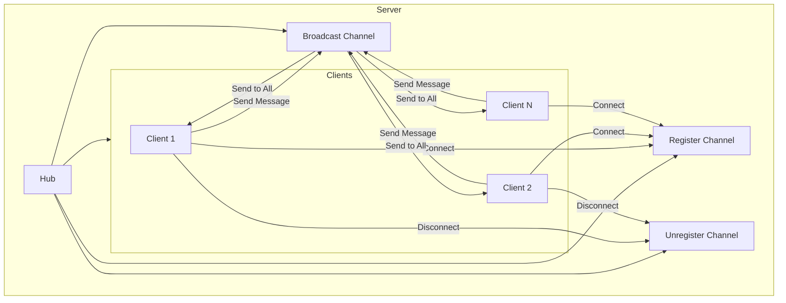

# 📘 เล่มที่ 4: การพัฒนาเว็บและเครือข่าย — บทที่ 4: TCP Server

---

## บทที่ 4: TCP Server

---

### 4.1 TCP Server — พื้นฐาน

#### TCP คืออะไร?

**TCP (Transmission Control Protocol)** เป็นโปรโตคอลการสื่อสารที่:
- เชื่อมต่อแบบ **Connection-oriented** — ต้องสร้างการเชื่อมต่อก่อนส่งข้อมูล
- **Reliable** — รับประกันว่าข้อมูลจะส่งถึงปลายทางครบถ้วน
- **Ordered** — ข้อมูลจะถูกส่งตามลำดับ
- **Full-duplex** — ส่งและรับข้อมูลพร้อมกันได้

#### โครงสร้างพื้นฐานของ TCP Server

```go
package main

import (
    "bufio"
    "fmt"
    "net"
    "os"
)

func main() {
    // 1. Listen บน Port
    listener, err := net.Listen("tcp", ":9000")
    if err != nil {
        fmt.Println("Error starting server:", err)
        os.Exit(1)
    }
    defer listener.Close()
    
    fmt.Println("TCP Server listening on :9000")
    
    // 2. รับการเชื่อมต่อแบบ Infinite Loop
    for {
        conn, err := listener.Accept()
        if err != nil {
            fmt.Println("Error accepting connection:", err)
            continue
        }
        
        // 3. จัดการแต่ละ connection ใน Goroutine
        go handleConnection(conn)
    }
}

func handleConnection(conn net.Conn) {
    defer conn.Close()
    
    fmt.Printf("New connection from: %s\n", conn.RemoteAddr())
    
    // อ่านข้อมูล
    reader := bufio.NewReader(conn)
    for {
        message, err := reader.ReadString('\n')
        if err != nil {
            fmt.Println("Client disconnected:", conn.RemoteAddr())
            return
        }
        
        // ตอบกลับ
        response := fmt.Sprintf("Server received: %s", message)
        conn.Write([]byte(response))
    }
}
```

#### ทดสอบด้วย Telnet

```bash
# Terminal 1: เปิด Server
go run main.go

# Terminal 2: เชื่อมต่อด้วย Telnet
telnet localhost 9000
# พิมพ์ข้อความแล้วกด Enter
Hello Server!
# จะได้รับตอบกลับ: Server received: Hello Server!
```

---

### 4.2 Chat Application — Main Structure

#### การออกแบบ Chat Application



#### โครงสร้างหลัก

**main.go**

```go
package main

import (
    "bufio"
    "fmt"
    "net"
    "os"
    "strings"
    "time"
)

const (
    PORT = ":9000"
    MAX_CLIENTS = 100
)

func main() {
    // สร้าง Hub
    hub := NewHub()
    go hub.Run()
    
    // เริ่ม TCP Server
    listener, err := net.Listen("tcp", PORT)
    if err != nil {
        fmt.Println("Error starting server:", err)
        os.Exit(1)
    }
    defer listener.Close()
    
    fmt.Printf("Chat Server started on %s\n", PORT)
    fmt.Println("Waiting for connections...")
    
    for {
        conn, err := listener.Accept()
        if err != nil {
            fmt.Println("Error accepting connection:", err)
            continue
        }
        
        // จำกัดจำนวนผู้ใช้
        if hub.GetClientCount() >= MAX_CLIENTS {
            conn.Write([]byte("Server is full. Please try again later.\n"))
            conn.Close()
            continue
        }
        
        // สร้าง Client ใหม่
        client := NewClient(conn, hub)
        go client.ReadMessages()
        go client.WriteMessages()
    }
}
```

#### Hub (Message Center)

```go
// hub.go
package main

import (
    "fmt"
    "sync"
    "time"
)

type Hub struct {
    // Client management
    clients    map[*Client]bool
    clientsMu  sync.RWMutex
    
    // Channels for communication
    broadcast  chan Message
    register   chan *Client
    unregister chan *Client
    
    // Statistics
    messageCount int
    startTime    time.Time
}

type Message struct {
    Sender    string
    Content   string
    Timestamp time.Time
}

func NewHub() *Hub {
    return &Hub{
        clients:    make(map[*Client]bool),
        broadcast:  make(chan Message),
        register:   make(chan *Client),
        unregister: make(chan *Client),
        startTime:  time.Now(),
    }
}

func (h *Hub) Run() {
    fmt.Println("Hub started")
    
    for {
        select {
        case client := <-h.register:
            h.clientsMu.Lock()
            h.clients[client] = true
            h.clientsMu.Unlock()
            
            // Send welcome message
            welcome := Message{
                Sender:    "System",
                Content:   fmt.Sprintf("Welcome %s! There are %d users online.", 
                    client.name, len(h.clients)),
                Timestamp: time.Now(),
            }
            h.broadcast <- welcome
            
            // Announce new user
            announce := Message{
                Sender:    "System",
                Content:   fmt.Sprintf("%s has joined the chat", client.name),
                Timestamp: time.Now(),
            }
            h.broadcast <- announce
            
            fmt.Printf("[%s] %s joined. Total: %d\n", 
                time.Now().Format("15:04:05"), client.name, len(h.clients))
            
        case client := <-h.unregister:
            h.clientsMu.Lock()
            if _, ok := h.clients[client]; ok {
                delete(h.clients, client)
                close(client.send)
            }
            h.clientsMu.Unlock()
            
            // Announce user left
            leave := Message{
                Sender:    "System",
                Content:   fmt.Sprintf("%s has left the chat", client.name),
                Timestamp: time.Now(),
            }
            h.broadcast <- leave
            
            fmt.Printf("[%s] %s left. Total: %d\n", 
                time.Now().Format("15:04:05"), client.name, len(h.clients))
            
        case message := <-h.broadcast:
            h.clientsMu.RLock()
            for client := range h.clients {
                select {
                case client.send <- message:
                    // Message sent successfully
                default:
                    // Client's send buffer is full
                    // Close connection
                    close(client.send)
                    delete(h.clients, client)
                }
            }
            h.clientsMu.RUnlock()
            
            h.messageCount++
        }
    }
}

func (h *Hub) GetClientCount() int {
    h.clientsMu.RLock()
    defer h.clientsMu.RUnlock()
    return len(h.clients)
}

func (h *Hub) GetStats() string {
    return fmt.Sprintf("Users: %d, Messages: %d, Uptime: %s",
        h.GetClientCount(),
        h.messageCount,
        time.Since(h.startTime).Round(time.Second))
}
```

#### Client

```go
// client.go
package main

import (
    "bufio"
    "fmt"
    "net"
    "strings"
    "time"
)

type Client struct {
    conn     net.Conn
    name     string
    hub      *Hub
    send     chan Message
    reader   *bufio.Reader
    writer   *bufio.Writer
    lastPing time.Time
}

func NewClient(conn net.Conn, hub *Hub) *Client {
    client := &Client{
        conn:     conn,
        hub:      hub,
        send:     make(chan Message, 256),
        reader:   bufio.NewReader(conn),
        writer:   bufio.NewWriter(conn),
        lastPing: time.Now(),
    }
    
    // Register with hub
    hub.register <- client
    
    return client
}

// ReadMessages: รับข้อความจาก Client
func (c *Client) ReadMessages() {
    defer func() {
        c.hub.unregister <- c
        c.conn.Close()
    }()
    
    // รับชื่อผู้ใช้
    c.conn.Write([]byte("Enter your name: "))
    name, err := c.reader.ReadString('\n')
    if err != nil {
        return
    }
    c.name = strings.TrimSpace(name)
    
    if c.name == "" {
        c.name = "Anonymous"
    }
    
    fmt.Printf("[%s] User %s connected\n", time.Now().Format("15:04:05"), c.name)
    
    // ส่งข้อความต้อนรับส่วนตัว
    welcome := fmt.Sprintf("Welcome %s! Type /help for commands.\n", c.name)
    c.conn.Write([]byte(welcome))
    
    // ตั้งค่า Read Deadline
    c.conn.SetReadDeadline(time.Now().Add(5 * time.Minute))
    
    // รับข้อความ
    for {
        message, err := c.reader.ReadString('\n')
        if err != nil {
            fmt.Printf("[%s] Error reading from %s: %v\n", 
                time.Now().Format("15:04:05"), c.name, err)
            return
        }
        
        // Trim newline
        message = strings.TrimSpace(message)
        if message == "" {
            continue
        }
        
        // Reset deadline
        c.conn.SetReadDeadline(time.Now().Add(5 * time.Minute))
        
        // Process commands
        if strings.HasPrefix(message, "/") {
            c.handleCommand(message)
            continue
        }
        
        // Broadcast message
        msg := Message{
            Sender:    c.name,
            Content:   message,
            Timestamp: time.Now(),
        }
        c.hub.broadcast <- msg
    }
}

// WriteMessages: ส่งข้อความไปยัง Client
func (c *Client) WriteMessages() {
    defer c.conn.Close()
    
    for message := range c.send {
        // Format: [HH:MM] Sender: Content
        formatted := fmt.Sprintf("[%s] %s: %s\n", 
            message.Timestamp.Format("15:04"),
            message.Sender,
            message.Content)
        
        _, err := c.conn.Write([]byte(formatted))
        if err != nil {
            return
        }
    }
}

// handleCommand: จัดการคำสั่งพิเศษ
func (c *Client) handleCommand(cmd string) {
    parts := strings.SplitN(cmd, " ", 2)
    command := parts[0]
    
    switch command {
    case "/help":
        help := `
Available commands:
  /help           - Show this help
  /users          - List online users
  /me <message>   - Send action message
  /msg <user> <msg> - Send private message
  /stats          - Show server stats
  /quit           - Leave the chat
`
        c.conn.Write([]byte(help))
        
    case "/users":
        c.hub.clientsMu.RLock()
        users := make([]string, 0, len(c.hub.clients))
        for client := range c.hub.clients {
            users = append(users, client.name)
        }
        c.hub.clientsMu.RUnlock()
        
        response := fmt.Sprintf("Online users (%d): %s\n", 
            len(users), strings.Join(users, ", "))
        c.conn.Write([]byte(response))
        
    case "/me":
        if len(parts) < 2 {
            c.conn.Write([]byte("Usage: /me <message>\n"))
            return
        }
        msg := Message{
            Sender:    "* " + c.name,
            Content:   parts[1],
            Timestamp: time.Now(),
        }
        c.hub.broadcast <- msg
        
    case "/msg":
        if len(parts) < 2 {
            c.conn.Write([]byte("Usage: /msg <user> <message>\n"))
            return
        }
        
        // Parse target and message
        msgParts := strings.SplitN(parts[1], " ", 2)
        if len(msgParts) < 2 {
            c.conn.Write([]byte("Usage: /msg <user> <message>\n"))
            return
        }
        
        target := msgParts[0]
        content := msgParts[1]
        
        // Find target client
        c.hub.clientsMu.RLock()
        var targetClient *Client
        for client := range c.hub.clients {
            if client.name == target && client != c {
                targetClient = client
                break
            }
        }
        c.hub.clientsMu.RUnlock()
        
        if targetClient == nil {
            c.conn.Write([]byte(fmt.Sprintf("User '%s' not found or is yourself\n", target)))
            return
        }
        
        // Send private message
        privateMsg := Message{
            Sender:    fmt.Sprintf("(private) %s", c.name),
            Content:   content,
            Timestamp: time.Now(),
        }
        targetClient.send <- privateMsg
        c.conn.Write([]byte(fmt.Sprintf("Message sent to %s\n", target)))
        
    case "/stats":
        stats := c.hub.GetStats()
        c.conn.Write([]byte(stats + "\n"))
        
    case "/quit":
        c.conn.Write([]byte("Goodbye!\n"))
        c.hub.unregister <- c
        c.conn.Close()
        
    default:
        c.conn.Write([]byte(fmt.Sprintf("Unknown command: %s. Type /help for commands.\n", command)))
    }
}
```

---

### 4.3 Chat Application — Complete

#### การเพิ่มฟีเจอร์เพิ่มเติม

**1. Message History**

```go
// hub.go
type Hub struct {
    // ... existing fields
    history    []Message
    maxHistory int
}

func NewHub() *Hub {
    return &Hub{
        // ... existing fields
        history:    make([]Message, 0),
        maxHistory: 100,
    }
}

// ในฟังก์ชัน Run()
case message := <-h.broadcast:
    // เก็บประวัติ
    h.history = append(h.history, message)
    if len(h.history) > h.maxHistory {
        h.history = h.history[1:]
    }
    // ... broadcast
```

**2. ระบบแจ้งเตือน "กำลังพิมพ์"**

```go
// client.go
func (c *Client) handleTyping() {
    // ส่ง typing indicator ให้ผู้อื่น
    msg := Message{
        Sender:    "System",
        Content:   fmt.Sprintf("%s is typing...", c.name),
        Timestamp: time.Now(),
    }
    // แสดงเฉพาะที่เซิร์ฟเวอร์
    fmt.Printf("[%s] %s is typing\n", time.Now().Format("15:04:05"), c.name)
}
```

**3. การบันทึก Log**

```go
// logger.go
package main

import (
    "fmt"
    "os"
    "time"
)

type Logger struct {
    file *os.File
}

func NewLogger(filename string) *Logger {
    file, err := os.OpenFile(filename, os.O_CREATE|os.O_APPEND|os.O_WRONLY, 0644)
    if err != nil {
        fmt.Println("Warning: Could not create log file")
        return &Logger{file: nil}
    }
    return &Logger{file: file}
}

func (l *Logger) Log(message string) {
    timestamp := time.Now().Format("2006-01-02 15:04:05")
    logMsg := fmt.Sprintf("[%s] %s\n", timestamp, message)
    
    fmt.Print(logMsg)
    if l.file != nil {
        l.file.WriteString(logMsg)
    }
}

func (l *Logger) Close() {
    if l.file != nil {
        l.file.Close()
    }
}
```

---

#### Chat Application — Full Code

**main.go** (Complete)

```go
package main

import (
    "fmt"
    "net"
    "os"
    "os/signal"
    "syscall"
)

const PORT = ":9000"

func main() {
    // Create logger
    logger := NewLogger("chat.log")
    defer logger.Close()
    
    logger.Log("Starting Chat Server...")
    
    // Create hub
    hub := NewHub(logger)
    go hub.Run()
    
    // Start TCP server
    listener, err := net.Listen("tcp", PORT)
    if err != nil {
        logger.Log(fmt.Sprintf("Error starting server: %v", err))
        os.Exit(1)
    }
    defer listener.Close()
    
    logger.Log(fmt.Sprintf("Server listening on %s", PORT))
    
    // Handle graceful shutdown
    sigChan := make(chan os.Signal, 1)
    signal.Notify(sigChan, syscall.SIGINT, syscall.SIGTERM)
    
    go func() {
        <-sigChan
        logger.Log("Shutting down server...")
        listener.Close()
        os.Exit(0)
    }()
    
    // Accept connections
    clientID := 1
    for {
        conn, err := listener.Accept()
        if err != nil {
            logger.Log(fmt.Sprintf("Error accepting connection: %v", err))
            continue
        }
        
        client := NewClient(conn, hub, logger, clientID)
        clientID++
        
        logger.Log(fmt.Sprintf("New client connected: %s", conn.RemoteAddr()))
        
        go client.ReadMessages()
        go client.WriteMessages()
    }
}
```

**hub.go** (Complete)

```go
package main

import (
    "fmt"
    "sync"
    "time"
)

type Hub struct {
    clients      map[*Client]bool
    clientsMu    sync.RWMutex
    broadcast    chan Message
    register     chan *Client
    unregister   chan *Client
    messageCount int
    startTime    time.Time
    logger       *Logger
    history      []Message
    maxHistory   int
    private      chan PrivateMessage
}

type Message struct {
    Sender    string
    Content   string
    Timestamp time.Time
    IsPrivate bool
    Target    string
}

type PrivateMessage struct {
    From    *Client
    To      *Client
    Content string
}

func NewHub(logger *Logger) *Hub {
    return &Hub{
        clients:      make(map[*Client]bool),
        broadcast:    make(chan Message),
        register:     make(chan *Client),
        unregister:   make(chan *Client),
        private:      make(chan PrivateMessage),
        startTime:    time.Now(),
        logger:       logger,
        history:      make([]Message, 0, 100),
        maxHistory:   100,
    }
}

func (h *Hub) Run() {
    h.logger.Log("Hub started")
    
    for {
        select {
        case client := <-h.register:
            h.handleRegister(client)
            
        case client := <-h.unregister:
            h.handleUnregister(client)
            
        case message := <-h.broadcast:
            h.handleBroadcast(message)
            
        case pm := <-h.private:
            h.handlePrivateMessage(pm)
        }
    }
}

func (h *Hub) handleRegister(client *Client) {
    h.clientsMu.Lock()
    h.clients[client] = true
    h.clientsMu.Unlock()
    
    h.logger.Log(fmt.Sprintf("%s joined (ID: %d)", client.name, client.id))
    
    // Send welcome
    h.broadcast <- Message{
        Sender:  "System",
        Content: fmt.Sprintf("Welcome %s! Type /help for commands", client.name),
    }
    
    // Announce new user
    h.broadcast <- Message{
        Sender:  "System",
        Content: fmt.Sprintf("%s has joined the chat (%d users online)", 
            client.name, len(h.clients)),
    }
}

func (h *Hub) handleUnregister(client *Client) {
    h.clientsMu.Lock()
    if _, ok := h.clients[client]; ok {
        delete(h.clients, client)
        close(client.send)
    }
    h.clientsMu.Unlock()
    
    h.logger.Log(fmt.Sprintf("%s left", client.name))
    
    h.broadcast <- Message{
        Sender:  "System",
        Content: fmt.Sprintf("%s has left the chat (%d users remaining)", 
            client.name, len(h.clients)),
    }
}

func (h *Hub) handleBroadcast(message Message) {
    // Store history
    h.history = append(h.history, message)
    if len(h.history) > h.maxHistory {
        h.history = h.history[1:]
    }
    
    h.messageCount++
    h.logger.Log(fmt.Sprintf("[%s] %s: %s", 
        message.Timestamp.Format("15:04:05"), message.Sender, message.Content))
    
    // Broadcast to all clients
    h.clientsMu.RLock()
    defer h.clientsMu.RUnlock()
    
    for client := range h.clients {
        select {
        case client.send <- message:
        default:
            close(client.send)
            delete(h.clients, client)
        }
    }
}

func (h *Hub) handlePrivateMessage(pm PrivateMessage) {
    h.logger.Log(fmt.Sprintf("[Private] %s -> %s: %s", 
        pm.From.name, pm.To.name, pm.Content))
    
    pm.To.send <- Message{
        Sender:    fmt.Sprintf("(Private) %s", pm.From.name),
        Content:   pm.Content,
        Timestamp: time.Now(),
        IsPrivate: true,
        Target:    pm.To.name,
    }
    
    pm.From.send <- Message{
        Sender:    "System",
        Content:   fmt.Sprintf("Message sent to %s", pm.To.name),
        Timestamp: time.Now(),
    }
}

func (h *Hub) GetClientCount() int {
    h.clientsMu.RLock()
    defer h.clientsMu.RUnlock()
    return len(h.clients)
}

func (h *Hub) GetStats() string {
    return fmt.Sprintf("Users: %d, Messages: %d, Uptime: %s",
        h.GetClientCount(),
        h.messageCount,
        time.Since(h.startTime).Round(time.Second))
}

func (h *Hub) GetClientByName(name string) *Client {
    h.clientsMu.RLock()
    defer h.clientsMu.RUnlock()
    
    for client := range h.clients {
        if client.name == name {
            return client
        }
    }
    return nil
}
```

**client.go** (Complete)

```go
package main

import (
    "bufio"
    "fmt"
    "net"
    "strings"
    "time"
)

type Client struct {
    conn     net.Conn
    name     string
    id       int
    hub      *Hub
    send     chan Message
    reader   *bufio.Reader
    writer   *bufio.Writer
    logger   *Logger
    lastPing time.Time
}

func NewClient(conn net.Conn, hub *Hub, logger *Logger, id int) *Client {
    return &Client{
        conn:     conn,
        id:       id,
        hub:      hub,
        send:     make(chan Message, 256),
        reader:   bufio.NewReader(conn),
        writer:   bufio.NewWriter(conn),
        logger:   logger,
        lastPing: time.Now(),
    }
}

func (c *Client) ReadMessages() {
    defer func() {
        c.hub.unregister <- c
        c.conn.Close()
    }()
    
    // Get username
    c.conn.Write([]byte("Enter your name: "))
    name, err := c.reader.ReadString('\n')
    if err != nil {
        return
    }
    c.name = strings.TrimSpace(name)
    if c.name == "" {
        c.name = fmt.Sprintf("User%d", c.id)
    }
    
    // Register
    c.hub.register <- c
    
    // Send history
    c.sendHistory()
    
    // Set deadline
    c.conn.SetReadDeadline(time.Now().Add(5 * time.Minute))
    
    // Read messages
    for {
        message, err := c.reader.ReadString('\n')
        if err != nil {
            c.logger.Log(fmt.Sprintf("Error reading from %s: %v", c.name, err))
            return
        }
        
        message = strings.TrimSpace(message)
        if message == "" {
            continue
        }
        
        c.conn.SetReadDeadline(time.Now().Add(5 * time.Minute))
        
        if strings.HasPrefix(message, "/") {
            c.handleCommand(message)
            continue
        }
        
        // Broadcast
        c.hub.broadcast <- Message{
            Sender:    c.name,
            Content:   message,
            Timestamp: time.Now(),
        }
    }
}

func (c *Client) WriteMessages() {
    defer c.conn.Close()
    
    for message := range c.send {
        var formatted string
        if message.IsPrivate {
            formatted = fmt.Sprintf("[%s] %s: %s\n", 
                message.Timestamp.Format("15:04"), message.Sender, message.Content)
        } else if message.Sender == "System" {
            formatted = fmt.Sprintf("\033[36m[%s] %s\033[0m\n", 
                message.Timestamp.Format("15:04"), message.Content)
        } else {
            formatted = fmt.Sprintf("[%s] %s: %s\n", 
                message.Timestamp.Format("15:04"), message.Sender, message.Content)
        }
        
        _, err := c.conn.Write([]byte(formatted))
        if err != nil {
            return
        }
    }
}

func (c *Client) handleCommand(cmd string) {
    parts := strings.SplitN(cmd, " ", 2)
    command := parts[0]
    
    switch command {
    case "/help":
        c.showHelp()
        
    case "/users":
        c.showUsers()
        
    case "/me":
        if len(parts) < 2 {
            c.conn.Write([]byte("Usage: /me <message>\n"))
            return
        }
        c.hub.broadcast <- Message{
            Sender:    "* " + c.name,
            Content:   parts[1],
            Timestamp: time.Now(),
        }
        
    case "/msg":
        c.handlePrivateMessage(parts)
        
    case "/stats":
        c.conn.Write([]byte(c.hub.GetStats() + "\n"))
        
    case "/history":
        c.sendHistory()
        
    case "/nick":
        if len(parts) < 2 {
            c.conn.Write([]byte("Usage: /nick <new_name>\n"))
            return
        }
        oldName := c.name
        c.name = strings.TrimSpace(parts[1])
        c.hub.broadcast <- Message{
            Sender:  "System",
            Content: fmt.Sprintf("%s changed name to %s", oldName, c.name),
        }
        
    case "/quit":
        c.conn.Write([]byte("Goodbye!\n"))
        c.hub.unregister <- c
        
    default:
        c.conn.Write([]byte(fmt.Sprintf("Unknown command: %s. Type /help for commands.\n", command)))
    }
}

func (c *Client) showHelp() {
    help := `
╔═══════════════════════════════════════════╗
║          Chat Commands                    ║
╠═══════════════════════════════════════════╣
║ /help           - Show this help          ║
║ /users          - List online users       ║
║ /me <msg>       - Send action message     ║
║ /msg <user> <msg> - Private message       ║
║ /stats          - Show server stats       ║
║ /history        - Show last messages      ║
║ /nick <name>    - Change your name        ║
║ /quit           - Leave the chat          ║
╚═══════════════════════════════════════════╝
`
    c.conn.Write([]byte(help))
}

func (c *Client) showUsers() {
    c.hub.clientsMu.RLock()
    users := make([]string, 0, len(c.hub.clients))
    for client := range c.hub.clients {
        if client == c {
            users = append(users, client.name+" (you)")
        } else {
            users = append(users, client.name)
        }
    }
    c.hub.clientsMu.RUnlock()
    
    response := fmt.Sprintf("Online users (%d): %s\n", len(users), strings.Join(users, ", "))
    c.conn.Write([]byte(response))
}

func (c *Client) handlePrivateMessage(parts []string) {
    if len(parts) < 2 {
        c.conn.Write([]byte("Usage: /msg <user> <message>\n"))
        return
    }
    
    msgParts := strings.SplitN(parts[1], " ", 2)
    if len(msgParts) < 2 {
        c.conn.Write([]byte("Usage: /msg <user> <message>\n"))
        return
    }
    
    target := msgParts[0]
    content := msgParts[1]
    
    targetClient := c.hub.GetClientByName(target)
    if targetClient == nil {
        c.conn.Write([]byte(fmt.Sprintf("User '%s' not found\n", target)))
        return
    }
    
    if targetClient == c {
        c.conn.Write([]byte("You cannot send a private message to yourself\n"))
        return
    }
    
    c.hub.private <- PrivateMessage{
        From:    c,
        To:      targetClient,
        Content: content,
    }
}

func (c *Client) sendHistory() {
    if len(c.hub.history) == 0 {
        c.conn.Write([]byte("No recent messages\n"))
        return
    }
    
    c.conn.Write([]byte("=== Last messages ===\n"))
    for _, msg := range c.hub.history[len(c.hub.history)-10:] {
        line := fmt.Sprintf("[%s] %s: %s\n", 
            msg.Timestamp.Format("15:04"), msg.Sender, msg.Content)
        c.conn.Write([]byte(line))
    }
    c.conn.Write([]byte("=== End of history ===\n"))
}
```

---

## 📝 สรุปบทที่ 4: TCP Server

### สิ่งที่เราเรียนรู้

| หัวข้อ | รายละเอียด |
|--------|------------|
| **TCP Server พื้นฐาน** | `net.Listen()`, `Accept()`, `handleConnection()` |
| **Concurrency** | การใช้ Goroutine จัดการแต่ละ Client |
| **Hub Pattern** | ตัวกลางในการจัดการ Clients และ Broadcast |
| **Channels** | `register`, `unregister`, `broadcast` |
| **Commands** | `/help`, `/users`, `/msg`, `/me`, `/quit` |
| **Graceful Shutdown** | การปิด Server อย่างปลอดภัย |

### การทดสอบ Chat Application

```bash
# Terminal 1: เริ่ม Server
go run .

# Terminal 2-4: เปิด Clients
telnet localhost 9000
# หรือใช้ netcat
nc localhost 9000

# ทดสอบคำสั่ง
/help          # แสดงคำสั่งทั้งหมด
/users         # แสดงผู้ใช้ออนไลน์
/msg John Hello # ส่งข้อความส่วนตัว
/me is happy   # ส่ง action message
/stats         # ดูสถิติ
/nick NewName  # เปลี่ยนชื่อ
/quit          # ออกจากแชท
```

---

## บทถัดไป: MQTT และ IoT

ในบทที่ 5 เราจะเรียนรู้เกี่ยวกับ:
- MQTT Protocol และการทำงาน
- การเชื่อมต่อกับ MQTT Broker
- การส่งและรับข้อมูลแบบ Real-time
- การสร้าง IoT Platform ด้วย Go

 