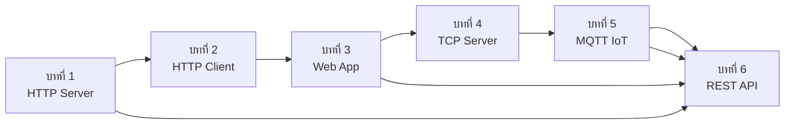

# 📘 เล่มที่ 4: การพัฒนาเว็บและเครือข่าย — บทที่ 6: REST API Design

---

## บทที่ 6: REST API Design

---

### 6.1 การออกแบบ REST API ด้วย Go

#### REST API คืออะไร?

**REST (Representational State Transfer)** เป็นสถาปัตยกรรมสำหรับการออกแบบ API ที่:
- ใช้ HTTP Protocol เป็นพื้นฐาน
- ใช้ทรัพยากร (Resources) เป็นหลัก
- ใช้ HTTP Methods เพื่อระบุการกระทำ
- สถานะไม่ถูกเก็บที่ Server (Stateless)
- สื่อสารด้วย JSON เป็นหลัก

#### หลักการ RESTful API

| หลักการ | คำอธิบาย |
|---------|----------|
| **Resources** | ทุกอย่างเป็นทรัพยากร (Users, Products, Orders) |
| **HTTP Methods** | GET, POST, PUT, DELETE, PATCH |
| **Stateless** | ไม่เก็บสถานะ Client ไว้ที่ Server |
| **Cacheable** | Response ควรระบุว่าสามารถ Cache ได้หรือไม่ |
| **Uniform Interface** | URLs มีรูปแบบที่สอดคล้องกัน |

#### การออกแบบ URLs

```go
// ตัวอย่าง URLs ที่ดี
GET    /api/v1/users           // รายการผู้ใช้
GET    /api/v1/users/123       // ผู้ใช้ ID 123
POST   /api/v1/users           // สร้างผู้ใช้ใหม่
PUT    /api/v1/users/123       // แก้ไขผู้ใช้ ID 123 (ทั้งหมด)
PATCH  /api/v1/users/123       // แก้ไขผู้ใช้ ID 123 (บางส่วน)
DELETE /api/v1/users/123       // ลบผู้ใช้ ID 123

GET    /api/v1/users/123/posts // โพสต์ของผู้ใช้ ID 123
GET    /api/v1/posts/456       // โพสต์ ID 456

// การ Query Parameters
GET    /api/v1/users?page=2&limit=10&sort=name
GET    /api/v1/users?status=active&role=admin
GET    /api/v1/posts?author=123&from=2024-01-01
```

#### HTTP Methods และความหมาย

| Method | ความหมาย | Idempotent | Safe |
|--------|----------|------------|------|
| GET | อ่านข้อมูล | ✅ | ✅ |
| HEAD | อ่านเฉพาะ Header | ✅ | ✅ |
| OPTIONS | ดู Methods ที่รองรับ | ✅ | ✅ |
| POST | สร้างข้อมูลใหม่ | ❌ | ❌ |
| PUT | แก้ไขทั้งหมด | ✅ | ❌ |
| PATCH | แก้ไขบางส่วน | ❌ | ❌ |
| DELETE | ลบข้อมูล | ✅ | ❌ |

---

### 6.2 Routing และ Handler

#### โครงสร้างโปรเจกต์ API

```
api-project/
├── cmd/
│   └── api/
│       └── main.go
├── internal/
│   ├── config/
│   │   └── config.go
│   ├── handler/
│   │   ├── user.go
│   │   ├── product.go
│   │   ├── order.go
│   │   └── health.go
│   ├── middleware/
│   │   ├── auth.go
│   │   ├── logging.go
│   │   ├── cors.go
│   │   └── rate_limit.go
│   ├── model/
│   │   ├── user.go
│   │   ├── product.go
│   │   └── order.go
│   ├── service/
│   │   ├── user_service.go
│   │   ├── product_service.go
│   │   └── order_service.go
│   ├── repository/
│   │   ├── user_repo.go
│   │   ├── product_repo.go
│   │   └── order_repo.go
│   └── router/
│       └── router.go
├── pkg/
│   ├── errors/
│   │   └── errors.go
│   └── response/
│       └── response.go
├── migrations/
│   └── 001_create_tables.sql
├── go.mod
└── .env
```

#### Router Implementation

```go
// internal/router/router.go
package router

import (
    "net/http"

    "api-project/internal/handler"
    "api-project/internal/middleware"
)

type Router struct {
    mux *http.ServeMux
}

func NewRouter() *Router {
    return &Router{
        mux: http.NewServeMux(),
    }
}

func (r *Router) Setup() http.Handler {
    // Health check
    r.mux.HandleFunc("GET /health", handler.HealthCheck)
    
    // API v1
    r.setupV1Routes()
    
    // Apply middlewares
    handler := middleware.Chain(
        r.mux,
        middleware.Recovery,
        middleware.Logging,
        middleware.CORS,
        middleware.RateLimit(100, 60), // 100 requests per minute
    )
    
    return handler
}

func (r *Router) setupV1Routes() {
    // User routes
    userHandler := handler.NewUserHandler()
    
    r.mux.HandleFunc("GET /api/v1/users", userHandler.GetUsers)
    r.mux.HandleFunc("GET /api/v1/users/{id}", userHandler.GetUser)
    r.mux.HandleFunc("POST /api/v1/users", userHandler.CreateUser)
    r.mux.HandleFunc("PUT /api/v1/users/{id}", userHandler.UpdateUser)
    r.mux.HandleFunc("PATCH /api/v1/users/{id}", userHandler.PatchUser)
    r.mux.HandleFunc("DELETE /api/v1/users/{id}", userHandler.DeleteUser)
    
    // Product routes
    productHandler := handler.NewProductHandler()
    
    r.mux.HandleFunc("GET /api/v1/products", productHandler.GetProducts)
    r.mux.HandleFunc("GET /api/v1/products/{id}", productHandler.GetProduct)
    r.mux.HandleFunc("POST /api/v1/products", productHandler.CreateProduct)
    r.mux.HandleFunc("PUT /api/v1/products/{id}", productHandler.UpdateProduct)
    r.mux.HandleFunc("DELETE /api/v1/products/{id}", productHandler.DeleteProduct)
    
    // Order routes (require auth)
    orderHandler := handler.NewOrderHandler()
    
    r.mux.HandleFunc("GET /api/v1/orders", middleware.Auth(orderHandler.GetOrders))
    r.mux.HandleFunc("GET /api/v1/orders/{id}", middleware.Auth(orderHandler.GetOrder))
    r.mux.HandleFunc("POST /api/v1/orders", middleware.Auth(orderHandler.CreateOrder))
    r.mux.HandleFunc("PUT /api/v1/orders/{id}", middleware.Auth(orderHandler.UpdateOrder))
    r.mux.HandleFunc("DELETE /api/v1/orders/{id}", middleware.Auth(orderHandler.DeleteOrder))
}

func (r *Router) ServeHTTP(w http.ResponseWriter, req *http.Request) {
    r.mux.ServeHTTP(w, req)
}
```

#### Handler Implementation

```go
// internal/handler/user.go
package handler

import (
    "encoding/json"
    "net/http"
    "strconv"

    "api-project/internal/model"
    "api-project/internal/service"
    "api-project/pkg/response"
)

type UserHandler struct {
    service *service.UserService
}

func NewUserHandler() *UserHandler {
    return &UserHandler{
        service: service.NewUserService(),
    }
}

func (h *UserHandler) GetUsers(w http.ResponseWriter, r *http.Request) {
    // Get query parameters
    page, _ := strconv.Atoi(r.URL.Query().Get("page"))
    if page < 1 {
        page = 1
    }
    
    limit, _ := strconv.Atoi(r.URL.Query().Get("limit"))
    if limit < 1 || limit > 100 {
        limit = 20
    }
    
    status := r.URL.Query().Get("status")
    role := r.URL.Query().Get("role")
    
    // Call service
    users, total, err := h.service.ListUsers(page, limit, status, role)
    if err != nil {
        response.Error(w, http.StatusInternalServerError, "Failed to fetch users")
        return
    }
    
    response.Paginated(w, http.StatusOK, users, page, limit, total)
}

func (h *UserHandler) GetUser(w http.ResponseWriter, r *http.Request) {
    id, err := strconv.Atoi(r.PathValue("id"))
    if err != nil {
        response.Error(w, http.StatusBadRequest, "Invalid user ID")
        return
    }
    
    user, err := h.service.GetUser(id)
    if err != nil {
        response.NotFound(w, "User not found")
        return
    }
    
    response.Success(w, http.StatusOK, user)
}

func (h *UserHandler) CreateUser(w http.ResponseWriter, r *http.Request) {
    var req model.CreateUserRequest
    if err := json.NewDecoder(r.Body).Decode(&req); err != nil {
        response.Error(w, http.StatusBadRequest, "Invalid request body")
        return
    }
    
    // Validate
    if req.Name == "" {
        response.Error(w, http.StatusBadRequest, "Name is required")
        return
    }
    if req.Email == "" {
        response.Error(w, http.StatusBadRequest, "Email is required")
        return
    }
    if req.Password == "" || len(req.Password) < 6 {
        response.Error(w, http.StatusBadRequest, "Password must be at least 6 characters")
        return
    }
    
    user, err := h.service.CreateUser(req)
    if err != nil {
        if err == service.ErrEmailAlreadyExists {
            response.Error(w, http.StatusConflict, "Email already exists")
            return
        }
        response.Error(w, http.StatusInternalServerError, "Failed to create user")
        return
    }
    
    response.Success(w, http.StatusCreated, user)
}

func (h *UserHandler) UpdateUser(w http.ResponseWriter, r *http.Request) {
    id, err := strconv.Atoi(r.PathValue("id"))
    if err != nil {
        response.Error(w, http.StatusBadRequest, "Invalid user ID")
        return
    }
    
    var req model.UpdateUserRequest
    if err := json.NewDecoder(r.Body).Decode(&req); err != nil {
        response.Error(w, http.StatusBadRequest, "Invalid request body")
        return
    }
    
    user, err := h.service.UpdateUser(id, req)
    if err != nil {
        if err == service.ErrUserNotFound {
            response.NotFound(w, "User not found")
            return
        }
        response.Error(w, http.StatusInternalServerError, "Failed to update user")
        return
    }
    
    response.Success(w, http.StatusOK, user)
}

func (h *UserHandler) PatchUser(w http.ResponseWriter, r *http.Request) {
    id, err := strconv.Atoi(r.PathValue("id"))
    if err != nil {
        response.Error(w, http.StatusBadRequest, "Invalid user ID")
        return
    }
    
    var req map[string]interface{}
    if err := json.NewDecoder(r.Body).Decode(&req); err != nil {
        response.Error(w, http.StatusBadRequest, "Invalid request body")
        return
    }
    
    user, err := h.service.PatchUser(id, req)
    if err != nil {
        if err == service.ErrUserNotFound {
            response.NotFound(w, "User not found")
            return
        }
        response.Error(w, http.StatusInternalServerError, "Failed to patch user")
        return
    }
    
    response.Success(w, http.StatusOK, user)
}

func (h *UserHandler) DeleteUser(w http.ResponseWriter, r *http.Request) {
    id, err := strconv.Atoi(r.PathValue("id"))
    if err != nil {
        response.Error(w, http.StatusBadRequest, "Invalid user ID")
        return
    }
    
    if err := h.service.DeleteUser(id); err != nil {
        if err == service.ErrUserNotFound {
            response.NotFound(w, "User not found")
            return
        }
        response.Error(w, http.StatusInternalServerError, "Failed to delete user")
        return
    }
    
    response.Success(w, http.StatusNoContent, nil)
}
```

#### Service Layer

```go
// internal/service/user_service.go
package service

import (
    "errors"
    "time"

    "api-project/internal/model"
    "api-project/internal/repository"
    "golang.org/x/crypto/bcrypt"
)

var (
    ErrUserNotFound        = errors.New("user not found")
    ErrEmailAlreadyExists  = errors.New("email already exists")
    ErrInvalidCredentials  = errors.New("invalid credentials")
)

type UserService struct {
    repo *repository.UserRepository
}

func NewUserService() *UserService {
    return &UserService{
        repo: repository.NewUserRepository(),
    }
}

func (s *UserService) ListUsers(page, limit int, status, role string) ([]model.User, int, error) {
    offset := (page - 1) * limit
    return s.repo.List(offset, limit, status, role)
}

func (s *UserService) GetUser(id int) (*model.User, error) {
    user, err := s.repo.FindByID(id)
    if err != nil {
        return nil, ErrUserNotFound
    }
    return user, nil
}

func (s *UserService) CreateUser(req model.CreateUserRequest) (*model.User, error) {
    // Check if email exists
    exists, err := s.repo.EmailExists(req.Email)
    if err != nil {
        return nil, err
    }
    if exists {
        return nil, ErrEmailAlreadyExists
    }
    
    // Hash password
    hashedPassword, err := bcrypt.GenerateFromPassword([]byte(req.Password), bcrypt.DefaultCost)
    if err != nil {
        return nil, err
    }
    
    user := &model.User{
        Name:      req.Name,
        Email:     req.Email,
        Password:  string(hashedPassword),
        Role:      req.Role,
        Status:    "active",
        CreatedAt: time.Now(),
        UpdatedAt: time.Now(),
    }
    
    if err := s.repo.Create(user); err != nil {
        return nil, err
    }
    
    return user, nil
}

func (s *UserService) UpdateUser(id int, req model.UpdateUserRequest) (*model.User, error) {
    user, err := s.repo.FindByID(id)
    if err != nil {
        return nil, ErrUserNotFound
    }
    
    if req.Name != nil {
        user.Name = *req.Name
    }
    if req.Email != nil {
        // Check if new email already exists
        exists, err := s.repo.EmailExists(*req.Email)
        if err != nil {
            return nil, err
        }
        if exists && user.Email != *req.Email {
            return nil, ErrEmailAlreadyExists
        }
        user.Email = *req.Email
    }
    if req.Role != nil {
        user.Role = *req.Role
    }
    if req.Status != nil {
        user.Status = *req.Status
    }
    
    user.UpdatedAt = time.Now()
    
    if err := s.repo.Update(user); err != nil {
        return nil, err
    }
    
    return user, nil
}

func (s *UserService) PatchUser(id int, updates map[string]interface{}) (*model.User, error) {
    user, err := s.repo.FindByID(id)
    if err != nil {
        return nil, ErrUserNotFound
    }
    
    // Apply partial updates
    if name, ok := updates["name"].(string); ok {
        user.Name = name
    }
    if email, ok := updates["email"].(string); ok {
        exists, err := s.repo.EmailExists(email)
        if err != nil {
            return nil, err
        }
        if exists && user.Email != email {
            return nil, ErrEmailAlreadyExists
        }
        user.Email = email
    }
    if role, ok := updates["role"].(string); ok {
        user.Role = role
    }
    if status, ok := updates["status"].(string); ok {
        user.Status = status
    }
    if password, ok := updates["password"].(string); ok && password != "" {
        hashedPassword, err := bcrypt.GenerateFromPassword([]byte(password), bcrypt.DefaultCost)
        if err != nil {
            return nil, err
        }
        user.Password = string(hashedPassword)
    }
    
    user.UpdatedAt = time.Now()
    
    if err := s.repo.Update(user); err != nil {
        return nil, err
    }
    
    return user, nil
}

func (s *UserService) DeleteUser(id int) error {
    exists, err := s.repo.Exists(id)
    if err != nil {
        return err
    }
    if !exists {
        return ErrUserNotFound
    }
    return s.repo.Delete(id)
}
```

---

### 6.3 การรับและส่ง JSON

#### Response Helpers

```go
// pkg/response/response.go
package response

import (
    "encoding/json"
    "net/http"
)

type Response struct {
    Success bool        `json:"success"`
    Data    interface{} `json:"data,omitempty"`
    Error   string      `json:"error,omitempty"`
    Code    int         `json:"code,omitempty"`
}

type PaginatedResponse struct {
    Success bool        `json:"success"`
    Data    interface{} `json:"data"`
    Meta    Meta        `json:"meta"`
}

type Meta struct {
    Page       int `json:"page"`
    Limit      int `json:"limit"`
    Total      int `json:"total"`
    TotalPages int `json:"total_pages"`
}

func Success(w http.ResponseWriter, status int, data interface{}) {
    w.Header().Set("Content-Type", "application/json")
    w.WriteHeader(status)
    json.NewEncoder(w).Encode(Response{
        Success: true,
        Data:    data,
    })
}

func Error(w http.ResponseWriter, status int, message string) {
    w.Header().Set("Content-Type", "application/json")
    w.WriteHeader(status)
    json.NewEncoder(w).Encode(Response{
        Success: false,
        Error:   message,
        Code:    status,
    })
}

func NotFound(w http.ResponseWriter, message string) {
    if message == "" {
        message = "Resource not found"
    }
    Error(w, http.StatusNotFound, message)
}

func BadRequest(w http.ResponseWriter, message string) {
    if message == "" {
        message = "Bad request"
    }
    Error(w, http.StatusBadRequest, message)
}

func Unauthorized(w http.ResponseWriter, message string) {
    if message == "" {
        message = "Unauthorized"
    }
    Error(w, http.StatusUnauthorized, message)
}

func Forbidden(w http.ResponseWriter, message string) {
    if message == "" {
        message = "Forbidden"
    }
    Error(w, http.StatusForbidden, message)
}

func InternalError(w http.ResponseWriter, message string) {
    if message == "" {
        message = "Internal server error"
    }
    Error(w, http.StatusInternalServerError, message)
}

func Paginated(w http.ResponseWriter, status int, data interface{}, page, limit, total int) {
    totalPages := (total + limit - 1) / limit
    if totalPages == 0 {
        totalPages = 1
    }
    
    w.Header().Set("Content-Type", "application/json")
    w.WriteHeader(status)
    json.NewEncoder(w).Encode(PaginatedResponse{
        Success: true,
        Data:    data,
        Meta: Meta{
            Page:       page,
            Limit:      limit,
            Total:      total,
            TotalPages: totalPages,
        },
    })
}

func WithHeaders(w http.ResponseWriter, headers map[string]string, status int, data interface{}) {
    for key, value := range headers {
        w.Header().Set(key, value)
    }
    Success(w, status, data)
}

func JSON(w http.ResponseWriter, status int, data interface{}) {
    w.Header().Set("Content-Type", "application/json")
    w.WriteHeader(status)
    json.NewEncoder(w).Encode(data)
}
```

#### Request Validation

```go
// internal/model/user.go
package model

import (
    "time"
)

type User struct {
    ID        int       `json:"id"`
    Name      string    `json:"name"`
    Email     string    `json:"email"`
    Password  string    `json:"-"` // ไม่แสดงใน JSON
    Role      string    `json:"role"`
    Status    string    `json:"status"`
    CreatedAt time.Time `json:"created_at"`
    UpdatedAt time.Time `json:"updated_at"`
}

type CreateUserRequest struct {
    Name     string `json:"name"`
    Email    string `json:"email"`
    Password string `json:"password"`
    Role     string `json:"role"`
}

func (r CreateUserRequest) Validate() error {
    if r.Name == "" {
        return errors.New("name is required")
    }
    if r.Email == "" {
        return errors.New("email is required")
    }
    if !isValidEmail(r.Email) {
        return errors.New("invalid email format")
    }
    if r.Password == "" || len(r.Password) < 6 {
        return errors.New("password must be at least 6 characters")
    }
    if r.Role != "" && !isValidRole(r.Role) {
        return errors.New("invalid role")
    }
    return nil
}

type UpdateUserRequest struct {
    Name   *string `json:"name"`
    Email  *string `json:"email"`
    Role   *string `json:"role"`
    Status *string `json:"status"`
}

func (r UpdateUserRequest) Validate() error {
    if r.Email != nil && !isValidEmail(*r.Email) {
        return errors.New("invalid email format")
    }
    if r.Role != nil && !isValidRole(*r.Role) {
        return errors.New("invalid role")
    }
    if r.Status != nil && !isValidStatus(*r.Status) {
        return errors.New("invalid status")
    }
    return nil
}

func isValidEmail(email string) bool {
    // Simple email validation
    return strings.Contains(email, "@") && strings.Contains(email, ".")
}

func isValidRole(role string) bool {
    validRoles := []string{"user", "admin", "moderator"}
    for _, r := range validRoles {
        if r == role {
            return true
        }
    }
    return false
}

func isValidStatus(status string) bool {
    validStatuses := []string{"active", "inactive", "suspended"}
    for _, s := range validStatuses {
        if s == status {
            return true
        }
    }
    return false
}
```

#### Custom JSON Marshal/Unmarshal

```go
// internal/model/time.go
package model

import (
    "encoding/json"
    "time"
)

// Custom time format
const timeFormat = "2006-01-02T15:04:05Z07:00"

type CustomTime time.Time

func (ct CustomTime) MarshalJSON() ([]byte, error) {
    t := time.Time(ct)
    return json.Marshal(t.Format(timeFormat))
}

func (ct *CustomTime) UnmarshalJSON(data []byte) error {
    var s string
    if err := json.Unmarshal(data, &s); err != nil {
        return err
    }
    t, err := time.Parse(timeFormat, s)
    if err != nil {
        return err
    }
    *ct = CustomTime(t)
    return nil
}

// Nullable types for JSON
type NullableInt struct {
    Value int
    Valid bool
}

func (ni NullableInt) MarshalJSON() ([]byte, error) {
    if !ni.Valid {
        return []byte("null"), nil
    }
    return json.Marshal(ni.Value)
}

func (ni *NullableInt) UnmarshalJSON(data []byte) error {
    if string(data) == "null" {
        ni.Valid = false
        return nil
    }
    if err := json.Unmarshal(data, &ni.Value); err != nil {
        return err
    }
    ni.Valid = true
    return nil
}
```

---

### 6.4 Middleware

#### Auth Middleware

```go
// internal/middleware/auth.go
package middleware

import (
    "context"
    "net/http"
    "strings"

    "api-project/pkg/jwt"
    "api-project/pkg/response"
)

type contextKey string

const UserKey contextKey = "user"

func Auth(next http.Handler) http.Handler {
    return http.HandlerFunc(func(w http.ResponseWriter, r *http.Request) {
        // Get token from Authorization header
        authHeader := r.Header.Get("Authorization")
        if authHeader == "" {
            response.Unauthorized(w, "Missing authorization header")
            return
        }
        
        // Extract token (Bearer <token>)
        parts := strings.Split(authHeader, " ")
        if len(parts) != 2 || parts[0] != "Bearer" {
            response.Unauthorized(w, "Invalid authorization header format")
            return
        }
        
        token := parts[1]
        
        // Validate token
        claims, err := jwt.ValidateToken(token)
        if err != nil {
            response.Unauthorized(w, "Invalid or expired token")
            return
        }
        
        // Add user to context
        ctx := context.WithValue(r.Context(), UserKey, claims)
        next.ServeHTTP(w, r.WithContext(ctx))
    })
}

func RequireRole(roles ...string) func(http.Handler) http.Handler {
    return func(next http.Handler) http.Handler {
        return http.HandlerFunc(func(w http.ResponseWriter, r *http.Request) {
            claims, ok := r.Context().Value(UserKey).(*jwt.Claims)
            if !ok {
                response.Unauthorized(w, "User not authenticated")
                return
            }
            
            for _, role := range roles {
                if claims.Role == role {
                    next.ServeHTTP(w, r)
                    return
                }
            }
            
            response.Forbidden(w, "Insufficient permissions")
        })
    }
}

func GetUserFromContext(r *http.Request) (*jwt.Claims, bool) {
    claims, ok := r.Context().Value(UserKey).(*jwt.Claims)
    return claims, ok
}
```

#### Logging Middleware

```go
// internal/middleware/logging.go
package middleware

import (
    "log"
    "net/http"
    "time"
)

type ResponseWriter struct {
    http.ResponseWriter
    statusCode int
    size       int
}

func (rw *ResponseWriter) WriteHeader(statusCode int) {
    rw.statusCode = statusCode
    rw.ResponseWriter.WriteHeader(statusCode)
}

func (rw *ResponseWriter) Write(b []byte) (int, error) {
    size, err := rw.ResponseWriter.Write(b)
    rw.size += size
    return size, err
}

func Logging(next http.Handler) http.Handler {
    return http.HandlerFunc(func(w http.ResponseWriter, r *http.Request) {
        start := time.Now()
        
        rw := &ResponseWriter{
            ResponseWriter: w,
            statusCode:     http.StatusOK,
        }
        
        next.ServeHTTP(rw, r)
        
        log.Printf("[%s] %s %s - %d %d bytes - %v",
            r.Method,
            r.URL.Path,
            r.RemoteAddr,
            rw.statusCode,
            rw.size,
            time.Since(start),
        )
    })
}
```

#### Rate Limiting Middleware

```go
// internal/middleware/rate_limit.go
package middleware

import (
    "net/http"
    "sync"
    "time"

    "api-project/pkg/response"
)

type RateLimiter struct {
    requests map[string][]time.Time
    mu       sync.RWMutex
    limit    int
    window   time.Duration
}

func NewRateLimiter(limit int, window time.Duration) *RateLimiter {
    return &RateLimiter{
        requests: make(map[string][]time.Time),
        limit:    limit,
        window:   window,
    }
}

func (rl *RateLimiter) Allow(ip string) bool {
    rl.mu.Lock()
    defer rl.mu.Unlock()
    
    now := time.Now()
    
    // Clean old requests
    if requests, ok := rl.requests[ip]; ok {
        filtered := make([]time.Time, 0)
        for _, t := range requests {
            if now.Sub(t) < rl.window {
                filtered = append(filtered, t)
            }
        }
        rl.requests[ip] = filtered
    }
    
    // Check limit
    if len(rl.requests[ip]) >= rl.limit {
        return false
    }
    
    // Add request
    rl.requests[ip] = append(rl.requests[ip], now)
    return true
}

func RateLimit(limit int, windowSeconds int) func(http.Handler) http.Handler {
    limiter := NewRateLimiter(limit, time.Duration(windowSeconds)*time.Second)
    
    return func(next http.Handler) http.Handler {
        return http.HandlerFunc(func(w http.ResponseWriter, r *http.Request) {
            ip := r.RemoteAddr
            if forwarded := r.Header.Get("X-Forwarded-For"); forwarded != "" {
                ips := strings.Split(forwarded, ",")
                ip = strings.TrimSpace(ips[0])
            }
            
            if !limiter.Allow(ip) {
                response.Error(w, http.StatusTooManyRequests, "Rate limit exceeded")
                return
            }
            
            next.ServeHTTP(w, r)
        })
    }
}
```

#### CORS Middleware

```go
// internal/middleware/cors.go
package middleware

import "net/http"

func CORS(next http.Handler) http.Handler {
    return http.HandlerFunc(func(w http.ResponseWriter, r *http.Request) {
        // Set CORS headers
        w.Header().Set("Access-Control-Allow-Origin", "*")
        w.Header().Set("Access-Control-Allow-Methods", "GET, POST, PUT, PATCH, DELETE, OPTIONS")
        w.Header().Set("Access-Control-Allow-Headers", "Content-Type, Authorization, X-Requested-With")
        w.Header().Set("Access-Control-Expose-Headers", "Content-Length, X-Total-Count")
        w.Header().Set("Access-Control-Allow-Credentials", "true")
        w.Header().Set("Access-Control-Max-Age", "86400")
        
        // Handle preflight
        if r.Method == "OPTIONS" {
            w.WriteHeader(http.StatusOK)
            return
        }
        
        next.ServeHTTP(w, r)
    })
}
```

#### Chain Middleware

```go
// internal/middleware/chain.go
package middleware

import "net/http"

type Middleware func(http.Handler) http.Handler

func Chain(handler http.Handler, middlewares ...Middleware) http.Handler {
    // Apply in reverse order
    for i := len(middlewares) - 1; i >= 0; i-- {
        handler = middlewares[i](handler)
    }
    return handler
}

// Helper to create middleware chains
func NewChain(middlewares ...Middleware) Middleware {
    return func(final http.Handler) http.Handler {
        for i := len(middlewares) - 1; i >= 0; i-- {
            final = middlewares[i](final)
        }
        return final
    }
}

// Example: Apply selectively
func ApplyToRoutes(mux *http.ServeMux, routes map[string][]Middleware) {
    // Implementation for selective middleware application
}
```

---

### 6.5 Error Handling ใน API

#### Custom Error Types

```go
// pkg/errors/errors.go
package errors

import (
    "fmt"
    "net/http"
)

type APIError struct {
    Code    int    `json:"code"`
    Message string `json:"message"`
    Details string `json:"details,omitempty"`
    Err     error  `json:"-"`
}

func (e APIError) Error() string {
    if e.Err != nil {
        return fmt.Sprintf("%s: %v", e.Message, e.Err)
    }
    return e.Message
}

func (e APIError) StatusCode() int {
    return e.Code
}

// Predefined errors
var (
    ErrNotFound = APIError{
        Code:    http.StatusNotFound,
        Message: "Resource not found",
    }
    
    ErrBadRequest = APIError{
        Code:    http.StatusBadRequest,
        Message: "Bad request",
    }
    
    ErrUnauthorized = APIError{
        Code:    http.StatusUnauthorized,
        Message: "Unauthorized",
    }
    
    ErrForbidden = APIError{
        Code:    http.StatusForbidden,
        Message: "Forbidden",
    }
    
    ErrInternalServer = APIError{
        Code:    http.StatusInternalServerError,
        Message: "Internal server error",
    }
    
    ErrConflict = APIError{
        Code:    http.StatusConflict,
        Message: "Resource conflict",
    }
    
    ErrValidation = APIError{
        Code:    http.StatusUnprocessableEntity,
        Message: "Validation failed",
    }
)

func NewError(code int, message string) APIError {
    return APIError{
        Code:    code,
        Message: message,
    }
}

func WrapError(err error, code int, message string) APIError {
    return APIError{
        Code:    code,
        Message: message,
        Err:     err,
    }
}

func ValidationError(details string) APIError {
    return APIError{
        Code:    http.StatusUnprocessableEntity,
        Message: "Validation failed",
        Details: details,
    }
}

func IsNotFound(err error) bool {
    if apiErr, ok := err.(APIError); ok {
        return apiErr.Code == http.StatusNotFound
    }
    return false
}

func IsConflict(err error) bool {
    if apiErr, ok := err.(APIError); ok {
        return apiErr.Code == http.StatusConflict
    }
    return false
}
```

#### Global Error Handler

```go
// internal/middleware/error.go
package middleware

import (
    "net/http"

    "api-project/pkg/errors"
    "api-project/pkg/response"
)

func ErrorHandler(next http.Handler) http.Handler {
    return http.HandlerFunc(func(w http.ResponseWriter, r *http.Request) {
        defer func() {
            if err := recover(); err != nil {
                // Handle panic
                response.Error(w, http.StatusInternalServerError, "Internal server error")
                return
            }
        }()
        
        next.ServeHTTP(w, r)
    })
}

// Error wrapper for handlers
func HandleError(handler func(http.ResponseWriter, *http.Request) error) http.HandlerFunc {
    return func(w http.ResponseWriter, r *http.Request) {
        err := handler(w, r)
        if err == nil {
            return
        }
        
        // Convert to APIError
        apiErr, ok := err.(errors.APIError)
        if !ok {
            apiErr = errors.WrapError(err, http.StatusInternalServerError, err.Error())
        }
        
        response.Error(w, apiErr.Code, apiErr.Message)
    }
}

// Example usage in handler
func (h *UserHandler) GetUserSafe(w http.ResponseWriter, r *http.Request) error {
    id, err := strconv.Atoi(r.PathValue("id"))
    if err != nil {
        return errors.BadRequest
    }
    
    user, err := h.service.GetUser(id)
    if err != nil {
        if err == service.ErrUserNotFound {
            return errors.NotFound
        }
        return errors.ErrInternalServer
    }
    
    response.Success(w, http.StatusOK, user)
    return nil
}
```

---

### 6.6 API Documentation (OpenAPI/Swagger)

```go
// docs/swagger.yaml
openapi: 3.0.0
info:
  title: API Project
  description: RESTful API with Go
  version: 1.0.0
servers:
  - url: http://localhost:8080
    description: Development server

paths:
  /api/v1/users:
    get:
      summary: List users
      parameters:
        - name: page
          in: query
          schema:
            type: integer
            default: 1
        - name: limit
          in: query
          schema:
            type: integer
            default: 20
            maximum: 100
        - name: status
          in: query
          schema:
            type: string
            enum: [active, inactive, suspended]
      responses:
        '200':
          description: Success
          content:
            application/json:
              schema:
                $ref: '#/components/schemas/PaginatedResponse'
    post:
      summary: Create user
      requestBody:
        required: true
        content:
          application/json:
            schema:
              $ref: '#/components/schemas/CreateUserRequest'
      responses:
        '201':
          description: Created
          content:
            application/json:
              schema:
                $ref: '#/components/schemas/User'
        '400':
          description: Bad request
        '409':
          description: Email already exists

  /api/v1/users/{id}:
    get:
      summary: Get user by ID
      parameters:
        - name: id
          in: path
          required: true
          schema:
            type: integer
      responses:
        '200':
          description: Success
          content:
            application/json:
              schema:
                $ref: '#/components/schemas/User'
        '404':
          description: User not found
    put:
      summary: Update user
      parameters:
        - name: id
          in: path
          required: true
          schema:
            type: integer
      requestBody:
        required: true
        content:
          application/json:
            schema:
              $ref: '#/components/schemas/UpdateUserRequest'
      responses:
        '200':
          description: Updated
        '404':
          description: User not found
    delete:
      summary: Delete user
      parameters:
        - name: id
          in: path
          required: true
          schema:
            type: integer
      responses:
        '204':
          description: Deleted
        '404':
          description: User not found

components:
  schemas:
    User:
      type: object
      properties:
        id:
          type: integer
        name:
          type: string
        email:
          type: string
        role:
          type: string
          enum: [user, admin, moderator]
        status:
          type: string
          enum: [active, inactive, suspended]
        created_at:
          type: string
          format: date-time
        updated_at:
          type: string
          format: date-time
    
    CreateUserRequest:
      type: object
      required:
        - name
        - email
        - password
      properties:
        name:
          type: string
          minLength: 1
        email:
          type: string
          format: email
        password:
          type: string
          minLength: 6
        role:
          type: string
          enum: [user, admin, moderator]
          default: user
    
    UpdateUserRequest:
      type: object
      properties:
        name:
          type: string
        email:
          type: string
          format: email
        role:
          type: string
          enum: [user, admin, moderator]
        status:
          type: string
          enum: [active, inactive, suspended]
    
    PaginatedResponse:
      type: object
      properties:
        success:
          type: boolean
        data:
          type: array
          items:
            $ref: '#/components/schemas/User'
        meta:
          type: object
          properties:
            page:
              type: integer
            limit:
              type: integer
            total:
              type: integer
            total_pages:
              type: integer
    
    ErrorResponse:
      type: object
      properties:
        success:
          type: boolean
        error:
          type: string
        code:
          type: integer
```

#### Swagger Integration

```go
// cmd/api/main.go
package main

import (
    "fmt"
    "log"
    "net/http"
    "os"

    "api-project/internal/config"
    "api-project/internal/router"
)

// @title API Project
// @version 1.0.0
// @description RESTful API with Go
// @host localhost:8080
// @BasePath /api/v1
// @securityDefinitions.apikey Bearer
// @in header
// @name Authorization

func main() {
    cfg := config.Load()
    
    r := router.NewRouter()
    handler := r.Setup()
    
    server := &http.Server{
        Addr:    fmt.Sprintf(":%s", cfg.Port),
        Handler: handler,
    }
    
    log.Printf("Server starting on http://localhost:%s", cfg.Port)
    log.Printf("Swagger UI available at http://localhost:%s/swagger", cfg.Port)
    
    if err := server.ListenAndServe(); err != nil {
        log.Fatal(err)
    }
}
```

---

## 📝 สรุปบทที่ 6: REST API Design

### สิ่งที่เราเรียนรู้

| หัวข้อ | รายละเอียด |
|--------|------------|
| **REST Principles** | Resources, HTTP Methods, Stateless |
| **URL Design** | การออกแบบ URLs ที่สอดคล้องกัน |
| **Handler Pattern** | การแยก Handler ตาม Resource |
| **Service Layer** | Business Logic แยกจาก Handler |
| **Response Helpers** | การส่ง Response ที่เป็นมาตรฐาน |
| **Validation** | การ Validate Request |
| **Middleware** | Auth, Logging, Rate Limit, CORS |
| **Error Handling** | Custom Errors, Global Handler |
| **Documentation** | OpenAPI/Swagger |

### มาตรฐาน API ที่ควรปฏิบัติ

1. **ใช้ Version ใน URL** — `/api/v1/users`
2. **ใช้ HTTP Methods อย่างถูกต้อง** — GET, POST, PUT, DELETE
3. **ส่ง Status Codes ที่เหมาะสม** — 200, 201, 400, 404, 500
4. **ใช้ JSON สำหรับ Request/Response**
5. **Validate ทุก Request** — ฝั่ง Server เสมอ
6. **Log ทุก Request** — เพื่อการ Debug
7. **มี Rate Limiting** — ป้องกัน DoS
8. **มี Authentication** — JWT, OAuth2
9. **Document API** — OpenAPI/Swagger
10. **Version Control** — ใช้ Git

---

## 🎯 สรุปภาพรวมเล่มที่ 4

| บทที่ | หัวข้อ | สิ่งที่ได้เรียนรู้ |
|-------|--------|-------------------|
| 1 | HTTP Server | Handler, ServeMux, Server Config |
| 2 | HTTP Client | Request, Response, JSON |
| 3 | Web Application | Templates, Forms, Static Files |
| 4 | TCP Server | Chat Application, Hub Pattern |
| 5 | MQTT และ IoT | Device Manager, Alert Engine |
| 6 | REST API | Design, Middleware, Error Handling |

### แผนการเรียนรู้เล่มที่ 4



### โปรเจกต์ที่ทำได้หลังเรียนจบ

1. **Web API** — CRUD REST API
2. **Real-time Chat** — TCP/WebSocket Chat
3. **IoT Platform** — Device Management
4. **Full-Stack App** — Go + Templates
5. **Microservice** — API Gateway

---

## 📚 แหล่งข้อมูลเพิ่มเติม

- [Go net/http](https://pkg.go.dev/net/http)
- [REST API Tutorial](https://restfulapi.net)
- [MQTT Protocol](https://mqtt.org)
- [OpenAPI Specification](https://swagger.io/specification/)
- [TimescaleDB](https://docs.timescale.com)

---
 