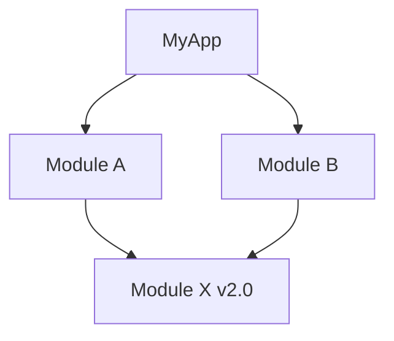

# 📘 เล่มที่ 5: การทดสอบและการปรับปรุงประสิทธิภาพ (Testing & Performance)

---

## 📖 บทนำ

การเขียนโค้ดให้ทำงานได้อย่างถูกต้องเป็นเพียงครึ่งเดียวของงานพัฒนา ซอฟต์แวร์ระดับ Production จำเป็นต้องมี **การทดสอบ** ที่ครอบคลุมและ **การปรับปรุงประสิทธิภาพ** อย่างต่อเนื่อง Go มาพร้อมกับเครื่องมือ Testing และ Benchmarking ใน Standard Library ที่ทรงพลัง ทำให้การเขียน Test และการวัดประสิทธิภาพเป็นเรื่องง่าย

### ทำไมต้องทดสอบ?

| เหตุผล | คำอธิบาย |
|--------|----------|
| **ความมั่นใจ** | รู้ว่าโค้ดทำงานถูกต้อง |
| **ป้องกัน Regression** | การเปลี่ยนแปลงไม่ทำให้ฟีเจอร์เดิมพัง |
| **Documentation** | Test คือตัวอย่างการใช้งานที่ดี |
| **Refactor อย่างปลอดภัย** | ปรับปรุงโค้ดโดยไม่กลัวพัง |
| **CI/CD** | ทดสอบอัตโนมัติก่อน Deploy |

### สิ่งที่คุณจะได้เรียนรู้

- เขียน Unit Test และ Table-Driven Test
- วัด Test Coverage
- เขียน Benchmark เพื่อวัดประสิทธิภาพ
- ใช้ Profiling เพื่อหา Performance Bottleneck
- จัดการ Dependencies ด้วย Go Modules
- ใช้ Go Tools ในการพัฒนา

---

## สารบัญ เล่มที่ 5

### บทที่ 1: การทดสอบ (Testing)
- 1.1 Introduction to Golang Testing
- 1.2 First Test
- 1.3 Table-Driven Test
- 1.4 White Box Testing
- 1.5 About Test Coverage
- 1.6 Test Coverage in Action

### บทที่ 2: Benchmark
- 2.1 Benchmark Testing
- 2.2 การเขียน Benchmark
- 2.3 การรัน Benchmark ด้วย `go test -bench`

### บทที่ 3: Profiling
- 3.1 Profiling — Why and What
- 3.2 Profile and View Report
- 3.3 Profile — Further Reading

### บทที่ 4: Go Modules
- 4.1 ภาพรวมของ Go Modules
- 4.2 เขียน Go Module อย่างง่าย และเขียน Test รองรับ
- 4.3 เรียกใช้ Go Module จาก Local
- 4.4 ปัญหา Diamond Dependency
- 4.5 Push Module to Github
- 4.6 แก้ไขปัญหา Module Cache
- 4.7 Downgrade Version
- 4.8 Upgrade Major Version

### บทที่ 5: Go Tools
- 5.1 Upgrade Go Tools
- 5.2 การติดตั้ง Ethereum/go-ethereum บน Windows
- 5.3 การลง Go หลายเวอร์ชันพร้อมกัน

---

## บทที่ 1: การทดสอบ (Testing)

---

### 1.1 Introduction to Golang Testing

#### โครงสร้างการทดสอบใน Go

Go มีระบบ Testing ในตัวที่ใช้งานง่าย:

```go
// math.go
package math

func Add(a, b int) int {
    return a + b
}

func Multiply(a, b int) int {
    return a * b
}
```

```go
// math_test.go
package math

import "testing"

func TestAdd(t *testing.T) {
    result := Add(2, 3)
    expected := 5
    if result != expected {
        t.Errorf("Add(2, 3) = %d; want %d", result, expected)
    }
}

func TestMultiply(t *testing.T) {
    result := Multiply(2, 3)
    expected := 6
    if result != expected {
        t.Errorf("Multiply(2, 3) = %d; want %d", result, expected)
    }
}
```

#### กฎสำคัญ

| กฎ | คำอธิบาย |
|----|----------|
| **ชื่อไฟล์** | ต้องลงท้ายด้วย `_test.go` |
| **ชื่อฟังก์ชัน** | ต้องขึ้นต้นด้วย `Test` |
| **พารามิเตอร์** | รับ `*testing.T` เท่านั้น |
| **Package** | สามารถเป็น same package หรือ `_test` |

#### รันการทดสอบ

```bash
# รัน Test ทั้งหมด
go test

# รัน Test พร้อมรายละเอียด
go test -v

# รัน Test เฉพาะฟังก์ชัน
go test -run TestAdd

# รัน Test เฉพาะ package
go test ./internal/...

# รัน Test หลายครั้ง
go test -count=5

# รัน Test แบบขนาน
go test -parallel=4
```

---

### 1.2 First Test

#### การทดสอบฟังก์ชันพื้นฐาน

```go
// calculator/calculator.go
package calculator

import (
    "errors"
    "math"
)

func Add(a, b float64) float64 {
    return a + b
}

func Subtract(a, b float64) float64 {
    return a - b
}

func Multiply(a, b float64) float64 {
    return a * b
}

func Divide(a, b float64) (float64, error) {
    if b == 0 {
        return 0, errors.New("division by zero")
    }
    return a / b, nil
}

func Power(base, exp float64) float64 {
    return math.Pow(base, exp)
}

func Sqrt(x float64) (float64, error) {
    if x < 0 {
        return 0, errors.New("square root of negative number")
    }
    return math.Sqrt(x), nil
}
```

```go
// calculator/calculator_test.go
package calculator

import (
    "testing"
)

func TestAdd(t *testing.T) {
    result := Add(2.5, 3.5)
    expected := 6.0
    if result != expected {
        t.Errorf("Add(2.5, 3.5) = %f; want %f", result, expected)
    }
}

func TestSubtract(t *testing.T) {
    result := Subtract(10.5, 3.2)
    expected := 7.3
    if result != expected {
        t.Errorf("Subtract(10.5, 3.2) = %f; want %f", result, expected)
    }
}

func TestDivide(t *testing.T) {
    // Normal case
    result, err := Divide(10, 2)
    if err != nil {
        t.Errorf("Divide(10, 2) returned error: %v", err)
    }
    expected := 5.0
    if result != expected {
        t.Errorf("Divide(10, 2) = %f; want %f", result, expected)
    }
    
    // Error case
    _, err = Divide(10, 0)
    if err == nil {
        t.Error("Divide(10, 0) expected error, got nil")
    }
}

func TestSqrt(t *testing.T) {
    // Normal case
    result, err := Sqrt(16)
    if err != nil {
        t.Errorf("Sqrt(16) returned error: %v", err)
    }
    expected := 4.0
    if result != expected {
        t.Errorf("Sqrt(16) = %f; want %f", result, expected)
    }
    
    // Error case
    _, err = Sqrt(-1)
    if err == nil {
        t.Error("Sqrt(-1) expected error, got nil")
    }
}
```

#### การใช้ Subtest (t.Run)

```go
func TestCalculator(t *testing.T) {
    t.Run("Add", func(t *testing.T) {
        result := Add(2, 3)
        if result != 5 {
            t.Errorf("Add(2, 3) = %d; want 5", result)
        }
    })
    
    t.Run("Subtract", func(t *testing.T) {
        result := Subtract(5, 3)
        if result != 2 {
            t.Errorf("Subtract(5, 3) = %d; want 2", result)
        }
    })
    
    t.Run("Multiply", func(t *testing.T) {
        result := Multiply(2, 3)
        if result != 6 {
            t.Errorf("Multiply(2, 3) = %d; want 6", result)
        }
    })
    
    t.Run("Divide", func(t *testing.T) {
        t.Run("Normal", func(t *testing.T) {
            result, err := Divide(10, 2)
            if err != nil {
                t.Errorf("Unexpected error: %v", err)
            }
            if result != 5 {
                t.Errorf("Divide(10, 2) = %f; want 5", result)
            }
        })
        
        t.Run("ByZero", func(t *testing.T) {
            _, err := Divide(10, 0)
            if err == nil {
                t.Error("Expected error, got nil")
            }
        })
    })
}
```

#### การใช้ Helper Functions

```go
func TestComplexCalculation(t *testing.T) {
    // Helper function
    assertEqual := func(t *testing.T, actual, expected float64, message string) {
        t.Helper()
        if actual != expected {
            t.Errorf("%s: got %f, want %f", message, actual, expected)
        }
    }
    
    assertNoError := func(t *testing.T, err error, message string) {
        t.Helper()
        if err != nil {
            t.Errorf("%s: unexpected error: %v", message, err)
        }
    }
    
    result1 := Add(2, 3)
    assertEqual(t, result1, 5, "Add")
    
    result2, err := Divide(10, 2)
    assertNoError(t, err, "Divide")
    assertEqual(t, result2, 5, "Divide")
}
```

---

### 1.3 Table-Driven Test

#### พื้นฐาน Table-Driven Test

```go
// stringutil/stringutil.go
package stringutil

import (
    "strings"
    "unicode"
)

func Reverse(s string) string {
    runes := []rune(s)
    for i, j := 0, len(runes)-1; i < j; i, j = i+1, j-1 {
        runes[i], runes[j] = runes[j], runes[i]
    }
    return string(runes)
}

func IsPalindrome(s string) bool {
    cleaned := strings.ToLower(s)
    cleaned = strings.Map(func(r rune) rune {
        if unicode.IsLetter(r) || unicode.IsDigit(r) {
            return r
        }
        return -1
    }, cleaned)
    return cleaned == Reverse(cleaned)
}

func CountVowels(s string) int {
    vowels := "aeiouAEIOU"
    count := 0
    for _, r := range s {
        if strings.ContainsRune(vowels, r) {
            count++
        }
    }
    return count
}
```

```go
// stringutil/stringutil_test.go
package stringutil

import "testing"

func TestReverse(t *testing.T) {
    tests := []struct {
        name     string
        input    string
        expected string
    }{
        {
            name:     "empty string",
            input:    "",
            expected: "",
        },
        {
            name:     "single character",
            input:    "a",
            expected: "a",
        },
        {
            name:     "simple word",
            input:    "hello",
            expected: "olleh",
        },
        {
            name:     "palindrome",
            input:    "racecar",
            expected: "racecar",
        },
        {
            name:     "with spaces",
            input:    "hello world",
            expected: "dlrow olleh",
        },
        {
            name:     "with unicode",
            input:    "สวัสดี",
            expected: "ดีสวัส",
        },
    }
    
    for _, tt := range tests {
        t.Run(tt.name, func(t *testing.T) {
            result := Reverse(tt.input)
            if result != tt.expected {
                t.Errorf("Reverse(%q) = %q; want %q", tt.input, result, tt.expected)
            }
        })
    }
}

func TestIsPalindrome(t *testing.T) {
    tests := []struct {
        name     string
        input    string
        expected bool
    }{
        {
            name:     "empty string",
            input:    "",
            expected: true,
        },
        {
            name:     "single character",
            input:    "a",
            expected: true,
        },
        {
            name:     "simple palindrome",
            input:    "racecar",
            expected: true,
        },
        {
            name:     "not palindrome",
            input:    "hello",
            expected: false,
        },
        {
            name:     "with spaces",
            input:    "never odd or even",
            expected: true,
        },
        {
            name:     "with punctuation",
            input:    "A man, a plan, a canal: Panama",
            expected: true,
        },
        {
            name:     "with numbers",
            input:    "12321",
            expected: true,
        },
        {
            name:     "mixed case",
            input:    "RaceCar",
            expected: true,
        },
    }
    
    for _, tt := range tests {
        t.Run(tt.name, func(t *testing.T) {
            result := IsPalindrome(tt.input)
            if result != tt.expected {
                t.Errorf("IsPalindrome(%q) = %v; want %v", tt.input, result, tt.expected)
            }
        })
    }
}
```

#### Table-Driven Test ที่ซับซ้อนขึ้น

```go
// validation/validation.go
package validation

import (
    "regexp"
    "strings"
)

type ValidationResult struct {
    Valid  bool
    Errors map[string]string
}

func ValidateEmail(email string) bool {
    // Simple email validation
    regex := regexp.MustCompile(`^[a-zA-Z0-9._%+-]+@[a-zA-Z0-9.-]+\.[a-zA-Z]{2,}$`)
    return regex.MatchString(email)
}

func ValidatePassword(password string) ValidationResult {
    errors := make(map[string]string)
    
    if len(password) < 8 {
        errors["length"] = "Password must be at least 8 characters"
    }
    
    hasUpper := false
    hasLower := false
    hasDigit := false
    hasSpecial := false
    
    for _, r := range password {
        switch {
        case r >= 'A' && r <= 'Z':
            hasUpper = true
        case r >= 'a' && r <= 'z':
            hasLower = true
        case r >= '0' && r <= '9':
            hasDigit = true
        case strings.ContainsRune("!@#$%^&*()_+-=", r):
            hasSpecial = true
        }
    }
    
    if !hasUpper {
        errors["uppercase"] = "Password must contain uppercase letter"
    }
    if !hasLower {
        errors["lowercase"] = "Password must contain lowercase letter"
    }
    if !hasDigit {
        errors["digit"] = "Password must contain digit"
    }
    if !hasSpecial {
        errors["special"] = "Password must contain special character"
    }
    
    return ValidationResult{
        Valid:  len(errors) == 0,
        Errors: errors,
    }
}
```

```go
// validation/validation_test.go
package validation

import "testing"

func TestValidateEmail(t *testing.T) {
    tests := []struct {
        name     string
        email    string
        expected bool
    }{
        {
            name:     "valid email",
            email:    "test@example.com",
            expected: true,
        },
        {
            name:     "valid with plus",
            email:    "test+filter@example.com",
            expected: true,
        },
        {
            name:     "valid subdomain",
            email:    "test@mail.example.com",
            expected: true,
        },
        {
            name:     "missing @",
            email:    "testexample.com",
            expected: false,
        },
        {
            name:     "missing domain",
            email:    "test@.com",
            expected: false,
        },
        {
            name:     "missing tld",
            email:    "test@example",
            expected: false,
        },
        {
            name:     "with spaces",
            email:    "test @example.com",
            expected: false,
        },
        {
            name:     "empty",
            email:    "",
            expected: false,
        },
    }
    
    for _, tt := range tests {
        t.Run(tt.name, func(t *testing.T) {
            result := ValidateEmail(tt.email)
            if result != tt.expected {
                t.Errorf("ValidateEmail(%q) = %v; want %v", tt.email, result, tt.expected)
            }
        })
    }
}

func TestValidatePassword(t *testing.T) {
    tests := []struct {
        name        string
        password    string
        shouldValid bool
        errorKeys   []string
    }{
        {
            name:        "valid password",
            password:    "Password123!",
            shouldValid: true,
            errorKeys:   []string{},
        },
        {
            name:        "too short",
            password:    "Pass1!",
            shouldValid: false,
            errorKeys:   []string{"length"},
        },
        {
            name:        "no uppercase",
            password:    "password123!",
            shouldValid: false,
            errorKeys:   []string{"uppercase"},
        },
        {
            name:        "no lowercase",
            password:    "PASSWORD123!",
            shouldValid: false,
            errorKeys:   []string{"lowercase"},
        },
        {
            name:        "no digit",
            password:    "Password!!!",
            shouldValid: false,
            errorKeys:   []string{"digit"},
        },
        {
            name:        "no special",
            password:    "Password123",
            shouldValid: false,
            errorKeys:   []string{"special"},
        },
        {
            name:        "multiple errors",
            password:    "pass",
            shouldValid: false,
            errorKeys:   []string{"length", "uppercase", "digit", "special"},
        },
    }
    
    for _, tt := range tests {
        t.Run(tt.name, func(t *testing.T) {
            result := ValidatePassword(tt.password)
            
            if result.Valid != tt.shouldValid {
                t.Errorf("ValidatePassword(%q).Valid = %v; want %v", tt.password, result.Valid, tt.shouldValid)
            }
            
            // Check error keys
            for _, key := range tt.errorKeys {
                if _, ok := result.Errors[key]; !ok {
                    t.Errorf("ValidatePassword(%q).Errors missing key %q", tt.password, key)
                }
            }
            
            // Check no extra errors
            if len(result.Errors) != len(tt.errorKeys) {
                t.Errorf("ValidatePassword(%q) has %d errors; want %d", tt.password, len(result.Errors), len(tt.errorKeys))
            }
        })
    }
}
```

#### Golden Files

```go
// golden/golden_test.go
package golden

import (
    "encoding/json"
    "os"
    "path/filepath"
    "testing"

    "github.com/google/go-cmp/cmp"
)

// Use testdata/golden/expected.json for golden files

func TestWithGoldenFile(t *testing.T) {
    // Generate output
    result := map[string]interface{}{
        "name":  "John",
        "age":   30,
        "email": "john@example.com",
    }
    
    got, err := json.MarshalIndent(result, "", "  ")
    if err != nil {
        t.Fatal(err)
    }
    
    // Update golden file if needed
    if *update {
        if err := os.WriteFile("testdata/golden/expected.json", got, 0644); err != nil {
            t.Fatal(err)
        }
    }
    
    // Read expected
    expected, err := os.ReadFile("testdata/golden/expected.json")
    if err != nil {
        t.Fatal(err)
    }
    
    if diff := cmp.Diff(string(expected), string(got)); diff != "" {
        t.Errorf("mismatch (-want +got):\n%s", diff)
    }
}

var update = flag.Bool("update", false, "update golden files")

func TestMain(m *testing.M) {
    flag.Parse()
    os.Exit(m.Run())
}
```

---

### 1.4 White Box Testing

#### Black Box vs White Box

| Black Box Testing | White Box Testing |
|-------------------|-------------------|
| ทดสอบจากภายนอก | ทดสอบจากภายใน |
| ใช้ package `_test` | ใช้ package เดียวกัน |
| ทดสอบ Public API | ทดสอบ Private functions |
| ไม่รู้ implementation | รู้ implementation |

#### ตัวอย่าง White Box Testing

```go
// user/user.go
package user

import (
    "crypto/sha256"
    "encoding/hex"
    "errors"
    "sync"
)

type User struct {
    ID       string
    Username string
    Email    string
    Password string // hashed
}

type Repository interface {
    Save(user *User) error
    FindByID(id string) (*User, error)
    FindByUsername(username string) (*User, error)
    Update(user *User) error
    Delete(id string) error
}

type Service struct {
    repo Repository
    mu   sync.RWMutex
}

func NewService(repo Repository) *Service {
    return &Service{
        repo: repo,
    }
}

// Private function (white box testing)
func hashPassword(password string) string {
    hash := sha256.Sum256([]byte(password))
    return hex.EncodeToString(hash[:])
}

// Private function (white box testing)
func validateUsername(username string) error {
    if len(username) < 3 || len(username) > 20 {
        return errors.New("username must be between 3 and 20 characters")
    }
    return nil
}

func (s *Service) CreateUser(username, email, password string) (*User, error) {
    // Validate
    if err := validateUsername(username); err != nil {
        return nil, err
    }
    
    // Check if username exists
    existing, _ := s.repo.FindByUsername(username)
    if existing != nil {
        return nil, errors.New("username already exists")
    }
    
    user := &User{
        ID:       generateID(),
        Username: username,
        Email:    email,
        Password: hashPassword(password),
    }
    
    if err := s.repo.Save(user); err != nil {
        return nil, err
    }
    
    return user, nil
}

func generateID() string {
    // Implementation
    return "user_" + randomString(8)
}
```

```go
// user/user_test.go (White Box Testing - same package)
package user

import (
    "testing"
)

// Test private function
func TestHashPassword(t *testing.T) {
    tests := []struct {
        name     string
        password string
        wantLen  int
    }{
        {
            name:     "simple password",
            password: "password123",
            wantLen:  64, // SHA256 hex length
        },
        {
            name:     "empty password",
            password: "",
            wantLen:  64,
        },
    }
    
    for _, tt := range tests {
        t.Run(tt.name, func(t *testing.T) {
            got := hashPassword(tt.password)
            if len(got) != tt.wantLen {
                t.Errorf("hashPassword() length = %d; want %d", len(got), tt.wantLen)
            }
            // Same password should produce same hash
            got2 := hashPassword(tt.password)
            if got != got2 {
                t.Error("hashPassword() not deterministic")
            }
        })
    }
}

// Test private validation function
func TestValidateUsername(t *testing.T) {
    tests := []struct {
        name     string
        username string
        wantErr  bool
    }{
        {
            name:     "valid username",
            username: "john_doe",
            wantErr:  false,
        },
        {
            name:     "too short",
            username: "jo",
            wantErr:  true,
        },
        {
            name:     "too long",
            username: "this_is_a_very_long_username",
            wantErr:  true,
        },
        {
            name:     "exact min",
            username: "123",
            wantErr:  false,
        },
        {
            name:     "exact max",
            username: "12345678901234567890",
            wantErr:  false,
        },
    }
    
    for _, tt := range tests {
        t.Run(tt.name, func(t *testing.T) {
            err := validateUsername(tt.username)
            if (err != nil) != tt.wantErr {
                t.Errorf("validateUsername() error = %v; wantErr %v", err, tt.wantErr)
            }
        })
    }
}

// Test with mock repository (white box)
type mockRepo struct {
    users map[string]*User
}

func (m *mockRepo) Save(user *User) error {
    m.users[user.ID] = user
    return nil
}

func (m *mockRepo) FindByID(id string) (*User, error) {
    if user, ok := m.users[id]; ok {
        return user, nil
    }
    return nil, nil
}

func (m *mockRepo) FindByUsername(username string) (*User, error) {
    for _, user := range m.users {
        if user.Username == username {
            return user, nil
        }
    }
    return nil, nil
}

func (m *mockRepo) Update(user *User) error {
    m.users[user.ID] = user
    return nil
}

func (m *mockRepo) Delete(id string) error {
    delete(m.users, id)
    return nil
}

func TestService_CreateUser(t *testing.T) {
    repo := &mockRepo{
        users: make(map[string]*User),
    }
    service := NewService(repo)
    
    tests := []struct {
        name     string
        username string
        email    string
        password string
        wantErr  bool
        errMsg   string
    }{
        {
            name:     "valid user",
            username: "john_doe",
            email:    "john@example.com",
            password: "password123",
            wantErr:  false,
        },
        {
            name:     "invalid username",
            username: "jo",
            email:    "john@example.com",
            password: "password123",
            wantErr:  true,
            errMsg:   "username must be between 3 and 20 characters",
        },
        {
            name:     "duplicate username",
            username: "john_doe",
            email:    "john2@example.com",
            password: "password123",
            wantErr:  true,
            errMsg:   "username already exists",
        },
    }
    
    for _, tt := range tests {
        t.Run(tt.name, func(t *testing.T) {
            user, err := service.CreateUser(tt.username, tt.email, tt.password)
            
            if tt.wantErr {
                if err == nil {
                    t.Error("expected error, got nil")
                }
                if err.Error() != tt.errMsg {
                    t.Errorf("error = %v; want %v", err.Error(), tt.errMsg)
                }
                return
            }
            
            if err != nil {
                t.Errorf("unexpected error: %v", err)
            }
            
            if user == nil {
                t.Error("user is nil")
            }
            
            if user.Username != tt.username {
                t.Errorf("Username = %s; want %s", user.Username, tt.username)
            }
            
            // Check password was hashed
            if user.Password == tt.password {
                t.Error("password not hashed")
            }
        })
    }
}
```

---

### 1.5 About Test Coverage

#### Test Coverage คืออะไร?

**Test Coverage** คือเปอร์เซ็นต์ของโค้ดที่ถูกทดสอบโดย Test Suite

| Type | คำอธิบาย |
|------|----------|
| **Statement Coverage** | จำนวน statement ที่ถูก execute |
| **Branch Coverage** | จำนวน branch ที่ถูกทดสอบ |
| **Function Coverage** | จำนวนฟังก์ชันที่ถูกเรียก |

#### การวัด Coverage

```bash
# วัด coverage
go test -cover

# วัด coverage พร้อมรายละเอียด
go test -coverprofile=coverage.out
go tool cover -func=coverage.out

# ดู coverage เป็น HTML
go tool cover -html=coverage.out

# วัด coverage ทุก package
go test -cover ./...

# กำหนด minimum coverage
go test -cover -covermode=count -coverprofile=coverage.out
go tool cover -func=coverage.out | grep total | awk '{print $3}'
```

#### ตัวอย่าง Coverage Report

```bash
$ go test -coverprofile=coverage.out
PASS
coverage: 85.7% of statements

$ go tool cover -func=coverage.out
package/function.go:12:  Add            100.0%
package/function.go:18:  Subtract       100.0%
package/function.go:24:  Multiply       100.0%
package/function.go:30:  Divide          75.0%
package/function.go:37:  Power           80.0%
total:                   (statements)    85.7%
```

---

### 1.6 Test Coverage in Action

#### การเขียน Test ให้ Coverage 100%

```go
// coverage/calculator.go
package coverage

import "errors"

type Calculator struct {
    history []float64
}

func NewCalculator() *Calculator {
    return &Calculator{
        history: make([]float64, 0),
    }
}

func (c *Calculator) Add(a, b float64) float64 {
    result := a + b
    c.history = append(c.history, result)
    return result
}

func (c *Calculator) Subtract(a, b float64) float64 {
    result := a - b
    c.history = append(c.history, result)
    return result
}

func (c *Calculator) Multiply(a, b float64) float64 {
    result := a * b
    c.history = append(c.history, result)
    return result
}

func (c *Calculator) Divide(a, b float64) (float64, error) {
    if b == 0 {
        return 0, errors.New("division by zero")
    }
    result := a / b
    c.history = append(c.history, result)
    return result, nil
}

func (c *Calculator) GetHistory() []float64 {
    return c.history
}

func (c *Calculator) ClearHistory() {
    c.history = make([]float64, 0)
}

func (c *Calculator) GetLastResult() (float64, error) {
    if len(c.history) == 0 {
        return 0, errors.New("no history")
    }
    return c.history[len(c.history)-1], nil
}
```

```go
// coverage/calculator_test.go
package coverage

import (
    "testing"
)

func TestCalculator(t *testing.T) {
    calc := NewCalculator()
    
    t.Run("Add", func(t *testing.T) {
        result := calc.Add(2, 3)
        if result != 5 {
            t.Errorf("Add(2,3) = %f; want 5", result)
        }
    })
    
    t.Run("Subtract", func(t *testing.T) {
        result := calc.Subtract(10, 4)
        if result != 6 {
            t.Errorf("Subtract(10,4) = %f; want 6", result)
        }
    })
    
    t.Run("Multiply", func(t *testing.T) {
        result := calc.Multiply(3, 4)
        if result != 12 {
            t.Errorf("Multiply(3,4) = %f; want 12", result)
        }
    })
    
    t.Run("Divide", func(t *testing.T) {
        t.Run("Normal", func(t *testing.T) {
            result, err := calc.Divide(10, 2)
            if err != nil {
                t.Errorf("unexpected error: %v", err)
            }
            if result != 5 {
                t.Errorf("Divide(10,2) = %f; want 5", result)
            }
        })
        
        t.Run("ByZero", func(t *testing.T) {
            _, err := calc.Divide(10, 0)
            if err == nil {
                t.Error("expected error, got nil")
            }
        })
    })
    
    t.Run("History", func(t *testing.T) {
        // Get history
        history := calc.GetHistory()
        if len(history) == 0 {
            t.Error("history is empty")
        }
        
        // Get last result
        last, err := calc.GetLastResult()
        if err != nil {
            t.Errorf("unexpected error: %v", err)
        }
        if last != history[len(history)-1] {
            t.Error("last result mismatch")
        }
        
        // Clear history
        calc.ClearHistory()
        if len(calc.GetHistory()) != 0 {
            t.Error("history not cleared")
        }
        
        // Get last result on empty history
        _, err = calc.GetLastResult()
        if err == nil {
            t.Error("expected error on empty history")
        }
    })
}
```

#### Coverage Analysis

```bash
# Generate coverage report
go test -coverprofile=coverage.out -covermode=count

# View coverage details
go tool cover -func=coverage.out

# Visual coverage
go tool cover -html=coverage.out
```

---

## บทที่ 2: Benchmark

---

### 2.1 Benchmark Testing

#### Benchmark คืออะไร?

**Benchmark** คือการทดสอบประสิทธิภาพของโค้ด:
- วัด Execution Time
- วัด Memory Usage
- เปรียบเทียบ Algorithm
- ตรวจจับ Performance Regression

#### กฎของ Benchmark

| กฎ | คำอธิบาย |
|----|----------|
| **ชื่อฟังก์ชัน** | ขึ้นต้นด้วย `Benchmark` |
| **พารามิเตอร์** | รับ `*testing.B` |
| **Loop** | ใช้ `b.N` สำหรับการวนซ้ำ |
| **รัน** | `go test -bench` |

---

### 2.2 การเขียน Benchmark

#### Benchmark พื้นฐาน

```go
// benchmark/string_benchmark.go
package benchmark

import (
    "bytes"
    "strings"
)

func ConcatWithPlus(a, b string) string {
    return a + b
}

func ConcatWithSprintf(a, b string) string {
    return fmt.Sprintf("%s%s", a, b)
}

func ConcatWithBuffer(a, b string) string {
    var buf bytes.Buffer
    buf.WriteString(a)
    buf.WriteString(b)
    return buf.String()
}

func ConcatWithBuilder(a, b string) string {
    var builder strings.Builder
    builder.WriteString(a)
    builder.WriteString(b)
    return builder.String()
}

func JoinWithSlash(elements []string) string {
    return strings.Join(elements, "/")
}
```

```go
// benchmark/string_benchmark_test.go
package benchmark

import (
    "bytes"
    "testing"
)

func BenchmarkConcatWithPlus(b *testing.B) {
    a := "Hello"
    c := "World"
    
    for i := 0; i < b.N; i++ {
        _ = ConcatWithPlus(a, c)
    }
}

func BenchmarkConcatWithSprintf(b *testing.B) {
    a := "Hello"
    c := "World"
    
    for i := 0; i < b.N; i++ {
        _ = ConcatWithSprintf(a, c)
    }
}

func BenchmarkConcatWithBuffer(b *testing.B) {
    a := "Hello"
    c := "World"
    
    for i := 0; i < b.N; i++ {
        _ = ConcatWithBuffer(a, c)
    }
}

func BenchmarkConcatWithBuilder(b *testing.B) {
    a := "Hello"
    c := "World"
    
    for i := 0; i < b.N; i++ {
        _ = ConcatWithBuilder(a, c)
    }
}

// Benchmark with multiple elements
func BenchmarkJoinWithSlash(b *testing.B) {
    elements := []string{"api", "v1", "users", "123", "posts"}
    
    for i := 0; i < b.N; i++ {
        _ = JoinWithSlash(elements)
    }
}
```

#### Benchmark ที่ซับซ้อนขึ้น

```go
// benchmark/sort_benchmark.go
package benchmark

import (
    "math/rand"
    "sort"
    "time"
)

func GenerateRandomSlice(size int) []int {
    rand.Seed(time.Now().UnixNano())
    slice := make([]int, size)
    for i := range slice {
        slice[i] = rand.Intn(1000000)
    }
    return slice
}

func SortInts(slice []int) {
    sort.Ints(slice)
}

func SortSlice(slice []int) {
    sort.Slice(slice, func(i, j int) bool {
        return slice[i] < slice[j]
    })
}

func SortStable(slice []int) {
    sort.SliceStable(slice, func(i, j int) bool {
        return slice[i] < slice[j]
    })
}
```

```go
// benchmark/sort_benchmark_test.go
package benchmark

import (
    "testing"
)

func BenchmarkSortInts_100(b *testing.B) {
    for i := 0; i < b.N; i++ {
        slice := GenerateRandomSlice(100)
        SortInts(slice)
    }
}

func BenchmarkSortInts_1000(b *testing.B) {
    for i := 0; i < b.N; i++ {
        slice := GenerateRandomSlice(1000)
        SortInts(slice)
    }
}

func BenchmarkSortInts_10000(b *testing.B) {
    for i := 0; i < b.N; i++ {
        slice := GenerateRandomSlice(10000)
        SortInts(slice)
    }
}

func BenchmarkSortSlice_100(b *testing.B) {
    for i := 0; i < b.N; i++ {
        slice := GenerateRandomSlice(100)
        SortSlice(slice)
    }
}

func BenchmarkSortSlice_1000(b *testing.B) {
    for i := 0; i < b.N; i++ {
        slice := GenerateRandomSlice(1000)
        SortSlice(slice)
    }
}

func BenchmarkSortSlice_10000(b *testing.B) {
    for i := 0; i < b.N; i++ {
        slice := GenerateRandomSlice(10000)
        SortSlice(slice)
    }
}

// Benchmark different algorithms against each other
func BenchmarkCompareSortMethods(b *testing.B) {
    sizes := []int{100, 1000, 10000}
    
    for _, size := range sizes {
        b.Run(fmt.Sprintf("SortInts_%d", size), func(b *testing.B) {
            for i := 0; i < b.N; i++ {
                slice := GenerateRandomSlice(size)
                SortInts(slice)
            }
        })
        
        b.Run(fmt.Sprintf("SortSlice_%d", size), func(b *testing.B) {
            for i := 0; i < b.N; i++ {
                slice := GenerateRandomSlice(size)
                SortSlice(slice)
            }
        })
    }
}

// Benchmark with reset timer
func BenchmarkWithResetTimer(b *testing.B) {
    for i := 0; i < b.N; i++ {
        // Setup
        data := GenerateRandomSlice(1000)
        
        b.ResetTimer() // Reset timer after setup
        
        // Code to benchmark
        SortInts(data)
    }
}

// Benchmark with parallel execution
func BenchmarkParallel(b *testing.B) {
    b.RunParallel(func(pb *testing.PB) {
        for pb.Next() {
            data := GenerateRandomSlice(1000)
            SortInts(data)
        }
    })
}
```

#### Memory Benchmark

```go
// benchmark/memory_benchmark_test.go
package benchmark

import (
    "testing"
)

// Report allocations
func BenchmarkMemoryAllocation(b *testing.B) {
    b.ReportAllocs()
    
    for i := 0; i < b.N; i++ {
        slice := make([]int, 1000)
        for j := range slice {
            slice[j] = j
        }
    }
}

func BenchmarkMemoryAppend(b *testing.B) {
    b.ReportAllocs()
    
    for i := 0; i < b.N; i++ {
        slice := make([]int, 0, 1000)
        for j := 0; j < 1000; j++ {
            slice = append(slice, j)
        }
    }
}

// Benchmark with different capacities
func BenchmarkPreallocated(b *testing.B) {
    b.ReportAllocs()
    
    for i := 0; i < b.N; i++ {
        // Pre-allocate capacity
        slice := make([]int, 0, 1000000)
        for j := 0; j < 1000000; j++ {
            slice = append(slice, j)
        }
    }
}

func BenchmarkNonPreallocated(b *testing.B) {
    b.ReportAllocs()
    
    for i := 0; i < b.N; i++ {
        // No pre-allocation
        slice := make([]int, 0)
        for j := 0; j < 1000000; j++ {
            slice = append(slice, j)
        }
    }
}
```

---

### 2.3 การรัน Benchmark

#### การรัน Benchmark

```bash
# รัน Benchmark ทั้งหมด
go test -bench=.

# รัน Benchmark เฉพาะฟังก์ชัน
go test -bench=BenchmarkConcat

# รัน Benchmark หลายรอบ
go test -bench=. -count=5

# รัน Benchmark พร้อมรายละเอียด Memory
go test -bench=. -benchmem

# รัน Benchmark เฉพาะ package
go test -bench=. ./benchmark/...

# เปรียบเทียบ Benchmark (ก่อน/หลัง)
go test -bench=. -count=5 > old.txt
# แก้ไขโค้ด
go test -bench=. -count=5 > new.txt
benchcmp old.txt new.txt
```

#### การตีความผล Benchmark

```
BenchmarkConcatWithPlus-8         10000000    123 ns/op    0 B/op    0 allocs/op
BenchmarkConcatWithSprintf-8       5000000    245 ns/op   16 B/op    2 allocs/op
BenchmarkConcatWithBuffer-8       20000000    78.5 ns/op   0 B/op    0 allocs/op
BenchmarkConcatWithBuilder-8      30000000    45.2 ns/op   0 B/op    0 allocs/op
```

| ค่า | ความหมาย |
|-----|----------|
| `BenchmarkConcatWithPlus-8` | ชื่อ + จำนวน CPU cores |
| `10000000` | จำนวนครั้งที่รัน (`b.N`) |
| `123 ns/op` | เวลาต่อการดำเนินการ |
| `0 B/op` | จำนวนไบต์ที่ใช้ต่อการดำเนินการ |
| `0 allocs/op` | จำนวนการ allocate ต่อการดำเนินการ |

#### go test -bench Flags

```bash
# กำหนดเวลารันขั้นต่ำ
go test -bench=. -benchtime=10s

# กำหนดจำนวนครั้ง
go test -bench=. -count=10

# เปรียบเทียบ CPU
go test -bench=. -cpu=1,2,4,8

# แสดง Benchmark Matrix
go test -bench=. -benchmem -cpuprofile=cpu.prof

# Benchmark เฉพาะที่ match pattern
go test -bench='Sort.*1000'

# เปรียบเทียบ Branch
go test -bench=. -branchprob=0.1
```

---

## บทที่ 3: Profiling

---

### 3.1 Profiling — Why and What

#### Profiling คืออะไร?

**Profiling** คือการวิเคราะห์โค้ดเพื่อหา Performance Bottleneck:

| ประเภท | คำอธิบาย | เครื่องมือ |
|--------|----------|-----------|
| **CPU Profiling** | วิเคราะห์ CPU usage | `go test -cpuprofile` |
| **Memory Profiling** | วิเคราะห์ Memory usage | `go test -memprofile` |
| **Block Profiling** | วิเคราะห์การบล็อก | `go test -blockprofile` |
| **Goroutine Profiling** | วิเคราะห์ Goroutines | `go test -trace` |
| **Mutex Profiling** | วิเคราะห์การล็อก | `go test -mutexprofile` |

#### เมื่อไหร่ควรใช้ Profiling?

1. **โค้ดทำงานช้า** — ต้องการหา Bottleneck
2. **Memory Usage สูง** — ต้องการลด Memory
3. **Goroutine Leak** — Goroutine ไม่ถูกปิด
4. **การ Optimize** — ต้องการปรับปรุงประสิทธิภาพ

---

### 3.2 Profile and View Report

#### CPU Profiling

```go
// profile/profile.go
package profile

import (
    "math"
    "sort"
)

func CalculatePrimes(max int) []int {
    primes := make([]int, 0)
    for i := 2; i <= max; i++ {
        if isPrime(i) {
            primes = append(primes, i)
        }
    }
    return primes
}

func isPrime(n int) bool {
    if n < 2 {
        return false
    }
    for i := 2; i <= int(math.Sqrt(float64(n))); i++ {
        if n%i == 0 {
            return false
        }
    }
    return true
}

func SortAndFilter(data []int) []int {
    sort.Ints(data)
    result := make([]int, 0)
    for _, v := range data {
        if v%2 == 0 {
            result = append(result, v)
        }
    }
    return result
}

func HeavyCalculation(n int) float64 {
    result := 0.0
    for i := 0; i < n; i++ {
        result += math.Sin(float64(i)) * math.Cos(float64(i))
    }
    return result
}
```

```go
// profile/profile_test.go
package profile

import "testing"

func BenchmarkCalculatePrimes(b *testing.B) {
    for i := 0; i < b.N; i++ {
        CalculatePrimes(1000)
    }
}

func BenchmarkSortAndFilter(b *testing.B) {
    data := make([]int, 1000)
    for i := range data {
        data[i] = i
    }
    
    for i := 0; i < b.N; i++ {
        SortAndFilter(data)
    }
}

func BenchmarkHeavyCalculation(b *testing.B) {
    for i := 0; i < b.N; i++ {
        HeavyCalculation(1000)
    }
}
```

#### การสร้างและวิเคราะห์ Profile

```bash
# 1. สร้าง CPU Profile
go test -bench=. -cpuprofile=cpu.prof

# 2. วิเคราะห์ด้วย go tool pprof
go tool pprof cpu.prof

# 3. คำสั่งใน pprof
(pprof) top              # แสดงฟังก์ชันที่ใช้ CPU มากที่สุด
(pprof) top -cum         # แสดง cumulative
(pprof) list function    # แสดงโค้ดของฟังก์ชัน
(pprof) web              # แสดงกราฟ (ต้องมี graphviz)
(pprof) pdf              # สร้าง PDF
(pprof) svg              # สร้าง SVG

# 4. ดูแบบ Web UI
go tool pprof -http=:8080 cpu.prof

# 5. ดูแบบ Flame Graph
go tool pprof -http=:8080 -flame cpu.prof
```

#### Memory Profiling

```bash
# สร้าง Memory Profile
go test -bench=. -memprofile=mem.prof

# วิเคราะห์ Memory
go tool pprof mem.prof
(pprof) top
(pprof) list function

# ดูแบบ Web UI
go tool pprof -http=:8080 mem.prof
```

#### ตัวอย่างการวิเคราะห์ Profile

```bash
$ go tool pprof cpu.prof
(pprof) top
Showing nodes accounting for 2.50s, 78.12% of 3.20s total
Dropped 32 nodes (cum <= 0.02s)
Showing top 10 nodes out of 48
      flat  flat%   sum%        cum   cum%
     1.20s 37.50% 37.50%      1.20s 37.50%  math.Sin
     0.80s 25.00% 62.50%      0.80s 25.00%  math.Cos
     0.30s  9.38% 71.88%      2.10s 65.62%  HeavyCalculation
     0.20s  6.25% 78.12%      0.40s 12.50%  isPrime
```

#### Trace Profiling

```go
// trace/trace_test.go
package trace

import (
    "testing"
    "time"
)

func TestWithTrace(t *testing.T) {
    // สร้าง trace file
    f, err := os.Create("trace.out")
    if err != nil {
        t.Fatal(err)
    }
    defer f.Close()
    
    if err := trace.Start(f); err != nil {
        t.Fatal(err)
    }
    defer trace.Stop()
    
    // โค้ดที่จะ trace
    var wg sync.WaitGroup
    for i := 0; i < 10; i++ {
        wg.Add(1)
        go func(id int) {
            defer wg.Done()
            time.Sleep(10 * time.Millisecond)
        }(i)
    }
    wg.Wait()
}

// รัน trace
// go test -trace=trace.out
// go tool trace trace.out
```

---

### 3.3 Profile — Further Reading

#### การ Profile แอปพลิเคชัน (ไม่ใช่ Test)

```go
// main.go
package main

import (
    "log"
    "net/http"
    _ "net/http/pprof"
    "runtime"
)

func main() {
    // เปิด pprof HTTP endpoint
    go func() {
        log.Println(http.ListenAndServe("localhost:6060", nil))
    }()
    
    // หรือใช้ runtime/pprof สำหรับ manual
    f, _ := os.Create("cpu.prof")
    pprof.StartCPUProfile(f)
    defer pprof.StopCPUProfile()
    
    // โค้ดของคุณ
    heavyFunction()
}
```

```bash
# ดู Profile จาก running application
go tool pprof http://localhost:6060/debug/pprof/profile

# ดู Heap Profile
go tool pprof http://localhost:6060/debug/pprof/heap

# ดู Goroutine
go tool pprof http://localhost:6060/debug/pprof/goroutine

# ดู Block Profile
go tool pprof http://localhost:6060/debug/pprof/block

# ดู Mutex Profile
go tool pprof http://localhost:6060/debug/pprof/mutex
```

#### Tools for Profiling

| Tool | การใช้งาน |
|------|-----------|
| `go tool pprof` | วิเคราะห์ Profile |
| `go tool trace` | วิเคราะห์ Trace |
| `go test -bench` | Benchmark |
| `go test -cover` | Coverage |
| `go test -race` | Data Race |
| `pprof` Web UI | Flame Graph |

#### Performance Optimization Tips

1. **วัดก่อน optimize** — ใช้ Profiling หา Bottleneck
2. **Optimize algorithm** — Big O matters
3. **ลด allocations** — ใช้ `sync.Pool`
4. **ใช้ buffered channels** — ลด blocking
5. **ตั้งค่า GOMAXPROCS** — ตาม Hardware
6. **ใช้ connection pooling** — HTTP, Database
7. **Cache results** — LRU Cache
8. **Use pointers wisely** — ไม่ใช้ช้าเกินไป
9. **Use `strings.Builder`** — แทน `+`
10. **Avoid reflection** — ช้า

---

## บทที่ 4: Go Modules

---

### 4.1 ภาพรวมของ Go Modules

#### Go Modules คืออะไร?

**Go Modules** คือระบบจัดการ Dependency ของ Go:
- เปิดตัวใน Go 1.11
- แทนที่ GOPATH
- จัดการ Versioning
- มี Semantic Versioning
- ใช้ `go.mod` และ `go.sum`

#### โครงสร้าง Go Module

```bash
myproject/
├── go.mod          # Module definition
├── go.sum          # Checksums
├── main.go
├── internal/
│   └── ...
├── pkg/
│   └── ...
└── vendor/         # Optional
```

#### go.mod

```go
module github.com/username/project

go 1.21

require (
    github.com/gorilla/mux v1.8.1
    github.com/jinzhu/gorm v1.9.16
)

require (
    github.com/jinzhu/inflection v1.0.0 // indirect
)
```

---

### 4.2 เขียน Go Module อย่างง่าย และเขียน Test รองรับ

#### สร้าง Module ใหม่

```bash
# 1. สร้างไดเรกทอรี
mkdir greetings
cd greetings

# 2. Initialize module
go mod init github.com/yourname/greetings

# 3. สร้างโค้ด
```

```go
// greetings/greetings.go
package greetings

import (
    "fmt"
    "strings"
)

func Hello(name string) (string, error) {
    if name == "" {
        return "", fmt.Errorf("empty name")
    }
    return fmt.Sprintf("Hello, %s!", strings.TrimSpace(name)), nil
}

func Goodbye(name string) string {
    return fmt.Sprintf("Goodbye, %s!", name)
}

func GreetMultiple(names []string) []string {
    results := make([]string, len(names))
    for i, name := range names {
        greeting, _ := Hello(name)
        results[i] = greeting
    }
    return results
}
```

```go
// greetings/greetings_test.go
package greetings

import "testing"

func TestHello(t *testing.T) {
    tests := []struct {
        name    string
        input   string
        want    string
        wantErr bool
    }{
        {
            name:    "valid name",
            input:   "John",
            want:    "Hello, John!",
            wantErr: false,
        },
        {
            name:    "empty name",
            input:   "",
            want:    "",
            wantErr: true,
        },
        {
            name:    "name with spaces",
            input:   "  Jane  ",
            want:    "Hello, Jane!",
            wantErr: false,
        },
    }
    
    for _, tt := range tests {
        t.Run(tt.name, func(t *testing.T) {
            got, err := Hello(tt.input)
            if (err != nil) != tt.wantErr {
                t.Errorf("Hello() error = %v; wantErr %v", err, tt.wantErr)
                return
            }
            if got != tt.want {
                t.Errorf("Hello() = %q; want %q", got, tt.want)
            }
        })
    }
}

func TestGoodbye(t *testing.T) {
    tests := []struct {
        name  string
        input string
        want  string
    }{
        {
            name:  "valid name",
            input: "John",
            want:  "Goodbye, John!",
        },
        {
            name:  "empty name",
            input: "",
            want:  "Goodbye, !",
        },
    }
    
    for _, tt := range tests {
        t.Run(tt.name, func(t *testing.T) {
            got := Goodbye(tt.input)
            if got != tt.want {
                t.Errorf("Goodbye() = %q; want %q", got, tt.want)
            }
        })
    }
}

func TestGreetMultiple(t *testing.T) {
    names := []string{"John", "Jane", "Bob"}
    got := GreetMultiple(names)
    
    expected := []string{"Hello, John!", "Hello, Jane!", "Hello, Bob!"}
    
    if len(got) != len(expected) {
        t.Errorf("len(GreetMultiple) = %d; want %d", len(got), len(expected))
    }
    
    for i := range got {
        if got[i] != expected[i] {
            t.Errorf("GreetMultiple[%d] = %q; want %q", i, got[i], expected[i])
        }
    }
}

// Benchmark
func BenchmarkHello(b *testing.B) {
    for i := 0; i < b.N; i++ {
        Hello("John")
    }
}
```

---

### 4.3 เรียกใช้ Go Module จาก Local

#### การเรียกใช้ Module ท้องถิ่น

```bash
# 1. สร้างโปรเจกต์หลัก
mkdir myapp
cd myapp
go mod init myapp

# 2. กำหนดให้ใช้ local module
go mod edit -replace github.com/yourname/greetings=../greetings

# 3. หรือใช้ go work (Go 1.18+)
go work init
go work use ../greetings
```

```go
// myapp/main.go
package main

import (
    "fmt"
    "log"

    "github.com/yourname/greetings"
)

func main() {
    greeting, err := greetings.Hello("John")
    if err != nil {
        log.Fatal(err)
    }
    fmt.Println(greeting)
    
    goodbye := greetings.Goodbye("John")
    fmt.Println(goodbye)
    
    names := []string{"John", "Jane", "Bob"}
    greetings := greetings.GreetMultiple(names)
    for _, g := range greetings {
        fmt.Println(g)
    }
}
```

#### การใช้ go.work

```bash
# go.work
go 1.21

use (
    ./greetings
    ./myapp
)

# ใช้งาน
cd myapp
go run main.go
```

---

### 4.4 ปัญหา Diamond Dependency

#### Diamond Dependency คืออะไร?



#### การจัดการใน Go Modules

```go
// go.mod
module myapp

require (
    module-a v1.2.3
    module-b v1.0.0
)

// Module A ใช้ X v1.0
// Module B ใช้ X v2.0
// Go จะเลือกเวอร์ชันที่สูงที่สุด (v2.0)
```

#### การแก้ไข Conflict

```bash
# ดู dependency graph
go mod graph

# ตรวจสอบ why
go mod why -m module-x

# บังคับใช้เวอร์ชัน
go mod edit -replace module-x@v1.0.0=module-x@v2.0.0

# หรือใช้ require directive
require module-x v2.0.0 // indirect
```

---

### 4.5 Push Module to Github

#### การเผยแพร่ Module

```bash
# 1. เช็คโค้ด
git init
git add .
git commit -m "Initial commit"

# 2. สร้าง Repository บน GitHub
# 3. Push
git remote add origin https://github.com/yourname/greetings
git push -u origin main

# 4. Tag Version (Semantic Versioning)
git tag v0.1.0
git push origin v0.1.0

# 5. Version v1.0.0
git tag v1.0.0
git push origin v1.0.0
```

#### Semantic Versioning

| Version | ความหมาย |
|---------|----------|
| **v1.0.0** | Major.Minor.Patch |
| **v1.0.1** | Patch (bug fix) |
| **v1.1.0** | Minor (new feature) |
| **v2.0.0** | Major (breaking change) |

#### การอัปเดต Module

```bash
# ใช้งาน module
go get github.com/yourname/greetings@v1.0.0

# อัปเดตเป็น minor
go get -u github.com/yourname/greetings

# อัปเดตเฉพาะ patch
go get -u=patch github.com/yourname/greetings
```

---

### 4.6 แก้ไขปัญหา Module Cache

#### Module Cache

```bash
# โฟลเดอร์ cache: $GOPATH/pkg/mod

# ดู cached modules
go list -m -u all

# ลบ cache
go clean -modcache

# ตรวจสอบ checksum
go mod verify

# ดาวน์โหลด modules
go mod download

# แก้ไข go.sum
go mod tidy
```

#### ปัญหาที่พบบ่อย

```bash
# 1. Checksum mismatch
go clean -modcache
go mod download

# 2. Missing module
go mod tidy

# 3. Module not found
go get -u ./...

# 4. Proxy issues
go env -w GOPROXY=https://proxy.golang.org,direct

# 5. Private repository
go env -w GOPRIVATE=github.com/yourcompany/*
```

---

### 4.7 Downgrade Version

```bash
# ตรวจสอบเวอร์ชันที่มี
go list -m -versions github.com/gorilla/mux

# Downgrade
go get github.com/gorilla/mux@v1.7.0

# Downgrade ทั้งหมด
go get -u=patch ./...

# ตรวจสอบ
go mod tidy
go mod verify
```

---

### 4.8 Upgrade Major Version

```bash
# 1. อัปเดต go.mod
# v2: module github.com/username/project/v2

# 2. อัปเดต import paths
# import "github.com/username/project/v2/internal"

# 3. ทดสอบ
go test ./...

# 4. Tag
git tag v2.0.0
git push origin v2.0.0

# 5. ใช้งาน
go get github.com/username/project/v2@latest
```

---

## บทที่ 5: Go Tools

---

### 5.1 Upgrade Go Tools

```bash
# ตรวจสอบ Go version
go version

# อัปเกรด Go
# Windows: ดาวน์โหลดใหม่
# macOS: brew upgrade go
# Linux: ใช้ snap หรือ apt

# อัปเกรด Tools
go install golang.org/x/tools/gopls@latest
go install github.com/go-delve/delve/cmd/dlv@latest
go install honnef.co/go/tools/cmd/staticcheck@latest
```

#### Essential Go Tools

| Tool | การใช้งาน |
|------|-----------|
| `go fmt` | จัดรูปแบบโค้ด |
| `go vet` | ตรวจสอบโค้ด |
| `staticcheck` | Static analysis |
| `golangci-lint` | Linter รวม |
| `go mod` | จัดการ modules |
| `go test` | Testing |
| `go build` | Compile |
| `go run` | Run |
| `go install` | Install binaries |
| `go generate` | Generate code |
| `go mod tidy` | Clean modules |
| `go mod vendor` | Vendor dependencies |

---

### 5.2 การติดตั้ง Ethereum/go-ethereum บน Windows

```bash
# 1. ติดตั้ง Git
# 2. ติดตั้ง Go
# 3. Clone repository
git clone https://github.com/ethereum/go-ethereum
cd go-ethereum

# 4. Build
go build ./cmd/geth

# 5. หรือ Install
go install ./cmd/geth

# 6. ตรวจสอบ
geth version
```

#### การแก้ปัญหา

```bash
# CGO issue
go env -w CGO_ENABLED=0

# หรือติดตั้ง GCC
# MinGW-w64: https://www.mingw-w64.org/
```

---

### 5.3 การลง Go หลายเวอร์ชันพร้อมกัน

#### ใช้ go version manager

```bash
# 1. gvm (Go Version Manager)
bash < <(curl -s -S -L https://raw.githubusercontent.com/moovweb/gvm/master/binscripts/gvm-installer)

gvm install go1.21
gvm use go1.21 --default

# 2. ใช้ multiple Go versions
# Windows: ติดตั้งหลายเวอร์ชันในโฟลเดอร์ต่างกัน
# เปลี่ยน PATH

# 3. ใช้ goenv
brew install goenv
goenv install 1.21.0
goenv global 1.21.0
```

#### การใช้ Go Version ในโปรเจกต์

```go
// go.mod
go 1.21

// หรือใช้ toolchain
toolchain go1.21.0
```

---

## 📝 สรุปเล่มที่ 5

### สิ่งที่เราเรียนรู้

| หัวข้อ | รายละเอียด |
|--------|------------|
| **Testing** | Unit Test, Table-Driven, Coverage |
| **Benchmark** | Performance Testing, Memory Usage |
| **Profiling** | CPU, Memory, Block, Trace |
| **Modules** | Dependency Management, Versioning |
| **Tools** | Go Tools, Linting, Build |

### Checklist การพัฒนา

- [ ] เขียน Unit Test ทุกฟังก์ชัน
- [ ] ใช้ Table-Driven Test
- [ ] วัด Test Coverage (>80%)
- [ ] เขียน Benchmark สำหรับฟังก์ชันสำคัญ
- [ ] ใช้ Profiling ก่อน Optimize
- [ ] ใช้ Go Modules
- [ ] Semantic Versioning
- [ ] CI/CD Integration
- [ ] Linting (staticcheck, golangci-lint)
- [ ] Go Mod Tidy ก่อน Commit

---
 