# 🎨 PART 8 / 7 — UML & SEQUENCE DIAGRAMS

> **ขนาด**: ใหญ่ — แยก 6 ตอนย่อย
> **Part 8A**: System Context + Container Diagram (C4 Model)
> **Part 8B**: Sequence Diagrams (6 critical flows)
> **Part 8C**: State Machine Diagrams (5 lifecycles)
> **Part 8D**: Entity Relationship Diagram (47 tables)
> **Part 8E**: Kafka Topic Map (Producers × Consumers matrix)
> **Part 8F**: Deployment & Component Diagrams

> **เครื่องมือ**: ทุก diagram ใช้ **Mermaid** syntax รองรับ GitHub, GitLab, VSCode, Notion, Obsidian, MkDocs

---

## 🅰️ PART 8A — SYSTEM CONTEXT & CONTAINER DIAGRAMS

### A.1 System Context Diagram (C4 Level 1)

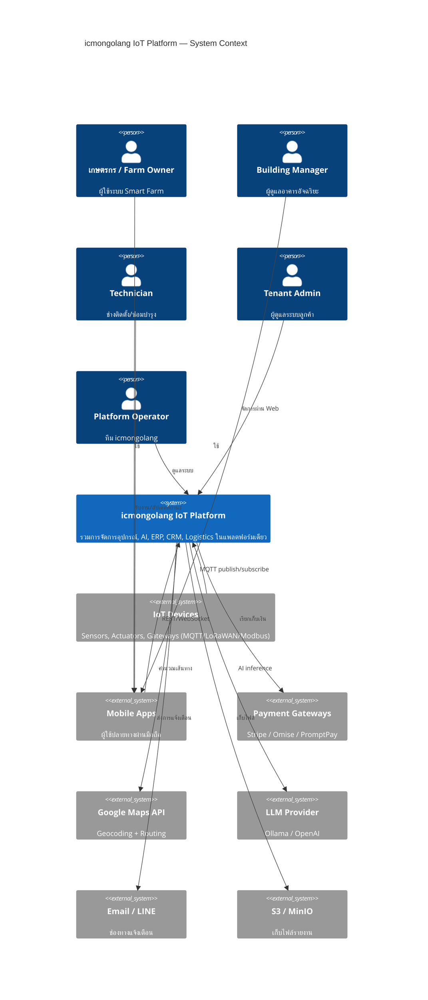
```mermaid
C4Context
    title icmongolang IoT Platform — System Context

    Person(farmer, "เกษตรกร / Farm Owner", "ผู้ใช้ระบบ Smart Farm")
    Person(building, "Building Manager", "ผู้ดูแลอาคารอัจฉริยะ")
    Person(tech, "Technician", "ช่างติดตั้ง/ซ่อมบำรุง")
    Person(admin, "Tenant Admin", "ผู้ดูแลระบบลูกค้า")
    Person(ops, "Platform Operator", "ทีม icmongolang")

    System(platform, "icmongolang IoT Platform", "รวมการจัดการอุปกรณ์, AI, ERP, CRM, Logistics ในแพลตฟอร์มเดียว")

    System_Ext(devices, "IoT Devices", "Sensors, Actuators, Gateways (MQTT/LoRaWAN/Modbus)")
    System_Ext(mobile, "Mobile Apps", "ผู้ใช้ปลายทางผ่านมือถือ")
    System_Ext(payment, "Payment Gateways", "Stripe / Omise / PromptPay")
    System_Ext(maps, "Google Maps API", "Geocoding + Routing")
    System_Ext(llm, "LLM Provider", "Ollama / OpenAI")
    System_Ext(email, "Email / LINE", "ช่องทางแจ้งเตือน")
    System_Ext(storage, "S3 / MinIO", "เก็บไฟล์รายงาน")

    Rel(farmer, mobile, "ใช้")
    Rel(building, mobile, "ใช้")
    Rel(tech, mobile, "รับงาน/อัปเดตสถานะ")
    Rel(admin, platform, "จัดการผ่าน Web")
    Rel(ops, platform, "ดูแลระบบ")
    Rel(mobile, platform, "REST/WebSocket")
    Rel(devices, platform, "MQTT publish/subscribe")
    Rel(platform, payment, "เรียกเก็บเงิน")
    Rel(platform, maps, "คำนวณเส้นทาง")
    Rel(platform, llm, "AI inference")
    Rel(platform, email, "ส่งการแจ้งเตือน")
    Rel(platform, storage, "เก็บไฟล์")
```

### A.2 Container Diagram (C4 Level 2)

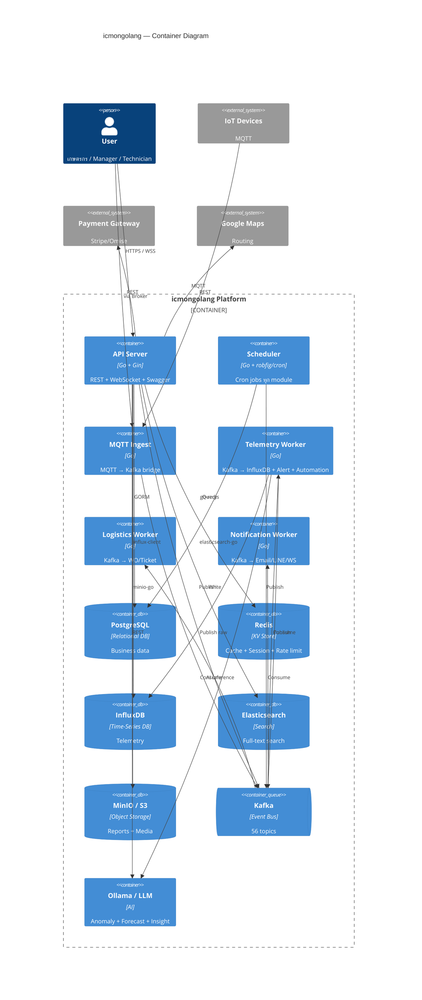
```mermaid
C4Container
    title icmongolang — Container Diagram

    Person(user, "User", "เกษตรกร / Manager / Technician")
    System_Ext(devices, "IoT Devices", "MQTT")

    Container_Boundary(platform, "icmongolang Platform") {
        Container(api, "API Server", "Go + Gin", "REST + WebSocket + Swagger")
        Container(scheduler, "Scheduler", "Go + robfig/cron", "Cron jobs ทุก module")
        Container(mqttIngest, "MQTT Ingest", "Go", "MQTT → Kafka bridge")
        Container(wTelemetry, "Telemetry Worker", "Go", "Kafka → InfluxDB + Alert + Automation")
        Container(wLogistics, "Logistics Worker", "Go", "Kafka → WO/Ticket")
        Container(wNotif, "Notification Worker", "Go", "Kafka → Email/LINE/WS")

        ContainerDb(pg, "PostgreSQL", "Relational DB", "Business data")
        ContainerDb(redis, "Redis", "KV Store", "Cache + Session + Rate limit")
        ContainerDb(influx, "InfluxDB", "Time-Series DB", "Telemetry")
        ContainerDb(es, "Elasticsearch", "Search", "Full-text search")
        ContainerDb(minio, "MinIO / S3", "Object Storage", "Reports + Media")

        ContainerQueue(kafka, "Kafka", "Event Bus", "56 topics")

        Container(llm, "Ollama / LLM", "AI", "Anomaly + Forecast + Insight")
    }

    System_Ext(payment, "Payment Gateway", "Stripe/Omise")
    System_Ext(maps, "Google Maps", "Routing")

    Rel(user, api, "HTTPS / WSS")
    Rel(user, mqttIngest, "via Broker")

    Rel(devices, mqttIngest, "MQTT")
    Rel(mqttIngest, kafka, "Publish raw")
    Rel(kafka, wTelemetry, "Consume")
    Rel(kafka, wLogistics, "Consume")
    Rel(kafka, wNotif, "Consume")

    Rel(api, pg, "GORM")
    Rel(api, redis, "go-redis")
    Rel(api, influx, "influx-client")
    Rel(api, es, "elasticsearch-go")
    Rel(api, minio, "minio-go")
    Rel(api, kafka, "Publish")
    Rel(api, payment, "REST")
    Rel(api, maps, "REST")
    Rel(api, llm, "REST")

    Rel(wTelemetry, influx, "Write")
    Rel(wTelemetry, kafka, "Publish")
    Rel(wTelemetry, llm, "AI inference")

    Rel(scheduler, pg, "Query")
    Rel(scheduler, kafka, "Publish")
```

### A.3 Component Diagram — `device` Module (ตัวอย่าง)

```mermaid
graph TB
    subgraph "Device Module"
        subgraph "Interface Layer"
            DevHandler[DeviceHandler]
            TelHandler[TelemetryHandler]
            CmdHandler[CommandHandler]
            ShadowHandler[ShadowHandler]
            AlertHandler[AlertHandler]
            MQTTRouter[MQTT Topic Router]
            WSHub[WebSocket Hub]
        end

        subgraph "Application Layer"
            RegUC[RegisterDeviceUseCase]
            ProvUC[ProvisionDeviceUseCase]
            IngestUC[IngestTelemetryUseCase]
            SendCmdUC[SendCommandUseCase]
            AckCmdUC[AckCommandUseCase]
            ShadowUC[UpdateShadowUseCase]
            CreateAlertUC[CreateAlertRuleUseCase]
        end

        subgraph "Domain Layer"
            Device[Device AR]
            Shadow[DeviceShadow AR]
            Command[Command AR]
            AlertRule[AlertRule AR]
            Automation[Automation AR]
            AutoSvc[AutomationService]
            AlertEval[AlertEvaluator]
            ShadowMerge[ShadowMergeService]
            HealthMon[HealthMonitorService]
        end

        subgraph "Infrastructure Layer"
            DeviceRepo[(DeviceRepo)]
            ShadowRepo[(ShadowRepo)]
            CmdRepo[(CommandRepo)]
            TelRepo[(TelemetryRepo)]
            InfluxAdapter[InfluxDB Adapter]
            MQTTPub[MQTT Publisher]
            KafkaProducer[Kafka Producer]
            RedisCache[Redis State Cache]
        end
    end

    DevHandler --> RegUC
    DevHandler --> ProvUC
    TelHandler --> IngestUC
    CmdHandler --> SendCmdUC
    ShadowHandler --> ShadowUC
    AlertHandler --> CreateAlertUC
    MQTTRouter --> IngestUC
    MQTTRouter --> AckCmdUC
    MQTTRouter --> ShadowUC

    RegUC --> Device
    ProvUC --> Device
    IngestUC --> TelRepo
    IngestUC --> AutoSvc
    IngestUC --> WSHub
    SendCmdUC --> Command
    SendCmdUC --> Device
    ShadowUC --> Shadow

    Device -.uses.-> DeviceRepo
    Shadow -.uses.-> ShadowRepo
    Command -.uses.-> CmdRepo

    DeviceRepo --> Postgres[(PostgreSQL)]
    ShadowRepo --> Postgres
    CmdRepo --> Postgres
    TelRepo --> InfluxAdapter
    InfluxAdapter --> Influx[(InfluxDB)]
    SendCmdUC --> MQTTPub
    MQTTPub --> Broker[MQTT Broker]
    IngestUC --> KafkaProducer
    KafkaProducer --> Kafka[(Kafka)]
    IngestUC --> RedisCache
    RedisCache --> Redis[(Redis)]

    AlertEval --> AlertRule
    AutoSvc --> Automation
    ShadowMerge --> Shadow
    HealthMon --> Device
```

---

## 🅱️ PART 8B — SEQUENCE DIAGRAMS (6 Critical Flows)

### B.1 Flow #1 — Customer Onboarding Saga (End-to-End)

> ครอบคลุม: Lead → Customer → Subscription → Shipment → Installation → Device Provisioning

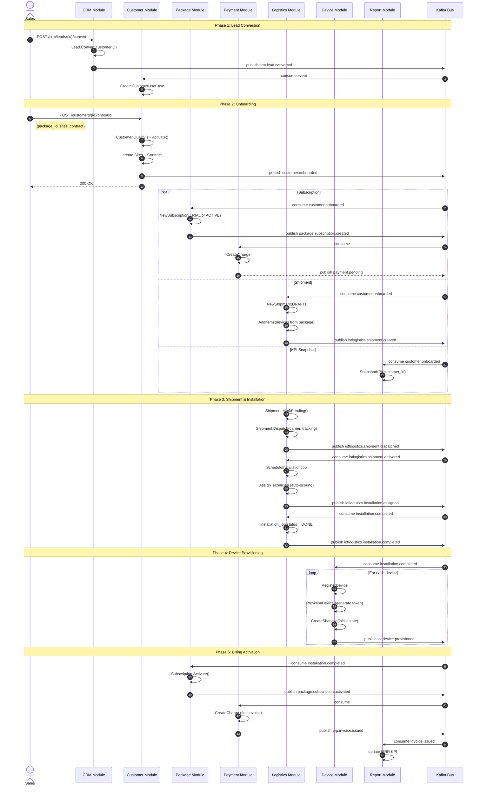
```mermaid
sequenceDiagram
    autonumber
    actor Sales
    participant CRM as CRM Module
    participant Cust as Customer Module
    participant Pkg as Package Module
    participant Pay as Payment Module
    participant Log as Logistics Module
    participant Dev as Device Module
    participant Rep as Report Module
    participant Kafka as Kafka Bus

    Note over Sales,Kafka: Phase 1: Lead Conversion
    Sales->>CRM: POST /crm/leads/{id}/convert
    CRM->>CRM: Lead.Convert(customerID)
    CRM->>Kafka: publish crm.lead.converted
    Kafka->>Cust: consume event
    Cust->>Cust: CreateCustomerUseCase

    Note over Sales,Kafka: Phase 2: Onboarding
    Sales->>Cust: POST /customers/{id}/onboard
    Note right of Sales: {package_id, sites, contract}
    Cust->>Cust: Customer.Qualify() + Activate()
    Cust->>Cust: create Sites + Contract
    Cust->>Kafka: publish customer.onboarded
    Cust-->>Sales: 200 OK

    par Subscription
        Kafka->>Pkg: consume customer.onboarded
        Pkg->>Pkg: NewSubscription(TRIAL or ACTIVE)
        Pkg->>Kafka: publish package.subscription.created
        Kafka->>Pay: consume
        Pay->>Pay: CreateCharge
        Pay-->>Kafka: publish payment.pending
    and Shipment
        Kafka->>Log: consume customer.onboarded
        Log->>Log: NewShipment(DRAFT)
        Log->>Log: AddItems(devices from package)
        Log->>Kafka: publish iotlogistics.shipment.created
    and KPI Snapshot
        Kafka->>Rep: consume customer.onboarded
        Rep->>Rep: SnapshotKPI(customer_id)
    end

    Note over Sales,Kafka: Phase 3: Shipment & Installation
    Log->>Log: Shipment.MarkPending()
    Log->>Log: Shipment.Dispatch(carrier, tracking)
    Log->>Kafka: publish iotlogistics.shipment.dispatched
    Kafka->>Log: consume iotlogistics.shipment.delivered
    Log->>Log: ScheduleInstallationJob
    Log->>Log: AssignTechnician (auto-scoring)
    Log->>Kafka: publish iotlogistics.installation.assigned
    Kafka->>Log: consume installation.completed
    Log->>Log: installation_job.status = DONE
    Log->>Kafka: publish iotlogistics.installation.completed

    Note over Sales,Kafka: Phase 4: Device Provisioning
    Kafka->>Dev: consume installation.completed
    loop For each device
        Dev->>Dev: RegisterDevice
        Dev->>Dev: ProvisionDevice (generate token)
        Dev->>Dev: CreateShadow (initial state)
        Dev->>Kafka: publish iot.device.provisioned
    end

    Note over Sales,Kafka: Phase 5: Billing Activation
    Kafka->>Pkg: consume installation.completed
    Pkg->>Pkg: Subscription.Activate()
    Pkg->>Kafka: publish package.subscription.activated
    Kafka->>Pay: consume
    Pay->>Pay: CreateCharge (first invoice)
    Pay->>Kafka: publish erp.invoice.issued
    Kafka->>Rep: consume invoice.issued
    Rep->>Rep: update MRR KPI
```

### B.2 Flow #2 — Telemetry Hot Path

> ลำดับ: MQTT → Kafka → InfluxDB + WS + Alert + Automation

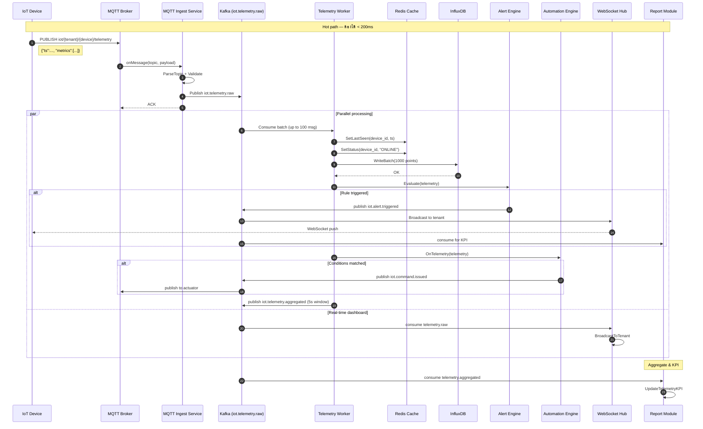
```mermaid
sequenceDiagram
    autonumber
    participant Device as IoT Device
    participant MQTT as MQTT Broker
    participant Ingest as MQTT Ingest Service
    participant Kafka as Kafka (iot.telemetry.raw)
    participant Worker as Telemetry Worker
    participant Redis as Redis Cache
    participant Influx as InfluxDB
    participant Alert as Alert Engine
    participant Auto as Automation Engine
    participant WS as WebSocket Hub
    participant Rep as Report Module

    Note over Device,Rep: Hot path — ต้องได้ < 200ms

    Device->>MQTT: PUBLISH iot/{tenant}/{device}/telemetry
    Note right of Device: {"ts":..., "metrics":[...]}

    MQTT->>Ingest: onMessage(topic, payload)
    Ingest->>Ingest: ParseTopic + Validate
    Ingest->>Kafka: Publish iot.telemetry.raw
    Ingest-->>MQTT: ACK

    par Parallel processing
        Kafka->>Worker: Consume batch (up to 100 msg)

        Worker->>Redis: SetLastSeen(device_id, ts)
        Worker->>Redis: SetStatus(device_id, "ONLINE")

        Worker->>Influx: WriteBatch(1000 points)
        Influx-->>Worker: OK

        Worker->>Alert: Evaluate(telemetry)
        alt Rule triggered
            Alert->>Kafka: publish iot.alert.triggered
            Kafka->>WS: Broadcast to tenant
            WS-->>Device: WebSocket push
            Kafka->>Rep: consume for KPI
        end

        Worker->>Auto: OnTelemetry(telemetry)
        alt Conditions matched
            Auto->>Kafka: publish iot.command.issued
            Kafka->>MQTT: publish to actuator
        end

        Worker->>Kafka: publish iot.telemetry.aggregated (5s window)
    and Real-time dashboard
        Kafka->>WS: consume telemetry.raw
        WS->>WS: BroadcastToTenant
    end

    Note over Rep: Aggregate & KPI
    Kafka->>Rep: consume telemetry.aggregated
    Rep->>Rep: UpdateTelemetryKPI
```

### B.3 Flow #3 — Order-to-Cash (ERP)

> SO → Confirm → Ship → Invoice → Payment → Close

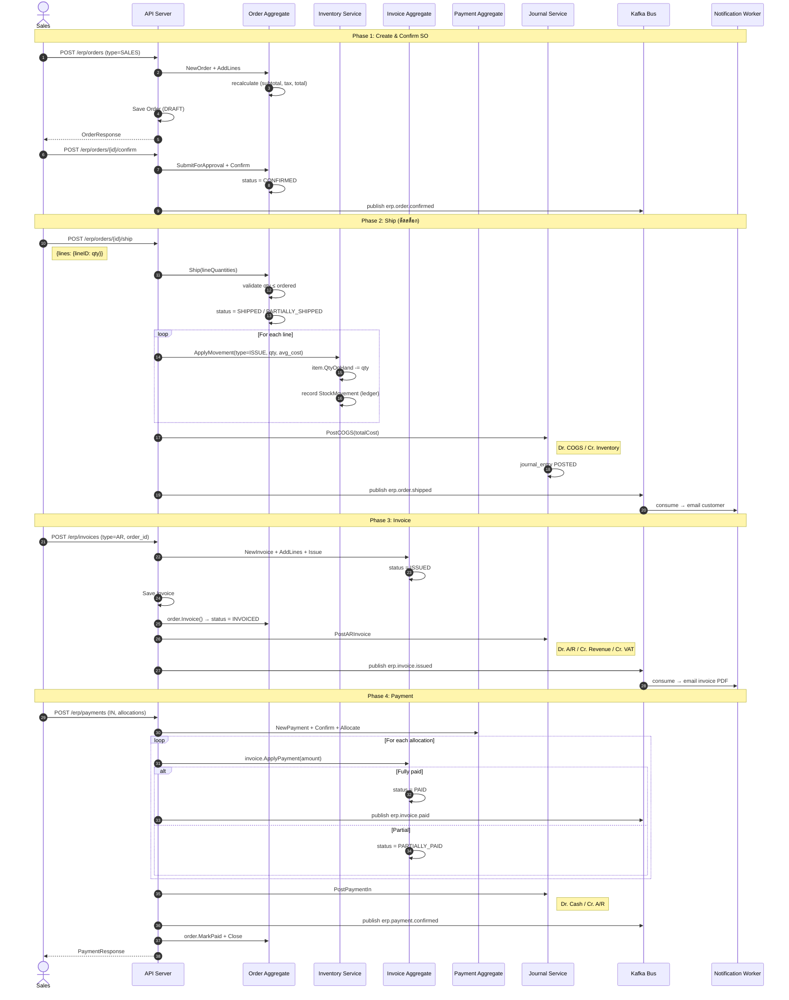
```mermaid
sequenceDiagram
    autonumber
    actor Sales
    participant API as API Server
    participant Ord as Order Aggregate
    participant Inv as Inventory Service
    participant InvAgg as Invoice Aggregate
    participant Pay as Payment Aggregate
    participant Journal as Journal Service
    participant Kafka as Kafka Bus
    participant Notif as Notification Worker

    Note over Sales,Notif: Phase 1: Create & Confirm SO
    Sales->>API: POST /erp/orders (type=SALES)
    API->>Ord: NewOrder + AddLines
    Ord->>Ord: recalculate (subtotal, tax, total)
    API->>API: Save Order (DRAFT)
    API-->>Sales: OrderResponse

    Sales->>API: POST /erp/orders/{id}/confirm
    API->>Ord: SubmitForApproval + Confirm
    Ord->>Ord: status = CONFIRMED
    API->>Kafka: publish erp.order.confirmed

    Note over Sales,Notif: Phase 2: Ship (ตัดสต็อก)
    Sales->>API: POST /erp/orders/{id}/ship
    Note right of Sales: {lines: {lineID: qty}}
    API->>Ord: Ship(lineQuantities)
    Ord->>Ord: validate qty ≤ ordered
    Ord->>Ord: status = SHIPPED / PARTIALLY_SHIPPED

    loop For each line
        API->>Inv: ApplyMovement(type=ISSUE, qty, avg_cost)
        Inv->>Inv: item.QtyOnHand -= qty
        Inv->>Inv: record StockMovement (ledger)
    end

    API->>Journal: PostCOGS(totalCost)
    Note right of Journal: Dr. COGS / Cr. Inventory
    Journal->>Journal: journal_entry POSTED

    API->>Kafka: publish erp.order.shipped
    Kafka->>Notif: consume → email customer

    Note over Sales,Notif: Phase 3: Invoice
    Sales->>API: POST /erp/invoices (type=AR, order_id)
    API->>InvAgg: NewInvoice + AddLines + Issue
    InvAgg->>InvAgg: status = ISSUED
    API->>API: Save Invoice
    API->>Ord: order.Invoice() → status = INVOICED
    API->>Journal: PostARInvoice
    Note right of Journal: Dr. A/R / Cr. Revenue / Cr. VAT
    API->>Kafka: publish erp.invoice.issued
    Kafka->>Notif: consume → email invoice PDF

    Note over Sales,Notif: Phase 4: Payment
    Sales->>API: POST /erp/payments (IN, allocations)
    API->>Pay: NewPayment + Confirm + Allocate
    loop For each allocation
        API->>InvAgg: invoice.ApplyPayment(amount)
        alt Fully paid
            InvAgg->>InvAgg: status = PAID
            API->>Kafka: publish erp.invoice.paid
        else Partial
            InvAgg->>InvAgg: status = PARTIALLY_PAID
        end
    end
    API->>Journal: PostPaymentIn
    Note right of Journal: Dr. Cash / Cr. A/R
    API->>Kafka: publish erp.payment.confirmed
    API->>Ord: order.MarkPaid + Close
    API-->>Sales: PaymentResponse
```

### B.4 Flow #4 — Procure-to-Pay (ERP)

> Reorder → PO → Receive → Bill → Payment

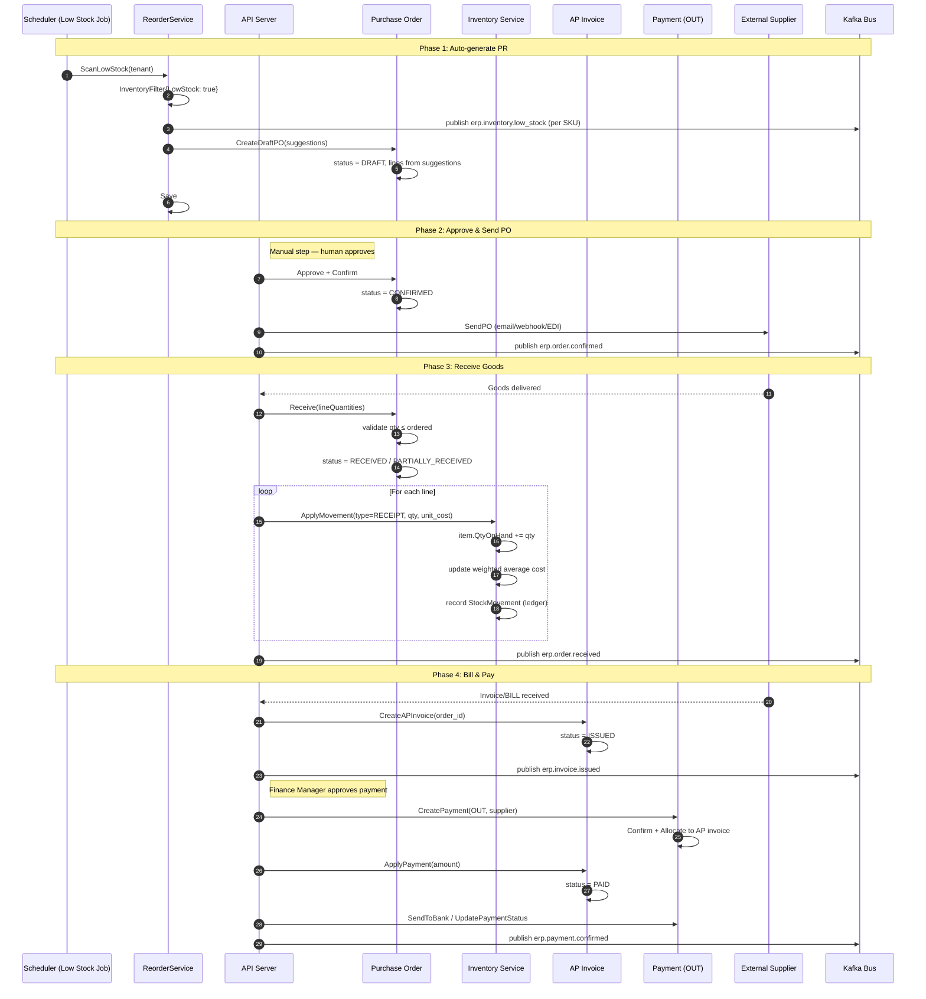
```mermaid
sequenceDiagram
    autonumber
    participant Sched as Scheduler (Low Stock Job)
    participant Reorder as ReorderService
    participant API as API Server
    participant PO as Purchase Order
    participant Inv as Inventory Service
    participant InvAgg as AP Invoice
    participant Pay as Payment (OUT)
    participant Supplier as External Supplier
    participant Kafka as Kafka Bus

    Note over Sched,Kafka: Phase 1: Auto-generate PR
    Sched->>Reorder: ScanLowStock(tenant)
    Reorder->>Reorder: InventoryFilter{LowStock: true}
    Reorder->>Kafka: publish erp.inventory.low_stock (per SKU)
    Reorder->>PO: CreateDraftPO(suggestions)
    PO->>PO: status = DRAFT, lines from suggestions
    Reorder->>Reorder: Save

    Note over Sched,Kafka: Phase 2: Approve & Send PO
    Note right of API: Manual step — human approves
    API->>PO: Approve + Confirm
    PO->>PO: status = CONFIRMED
    API->>Supplier: SendPO (email/webhook/EDI)
    API->>Kafka: publish erp.order.confirmed

    Note over Sched,Kafka: Phase 3: Receive Goods
    Supplier-->>API: Goods delivered
    API->>PO: Receive(lineQuantities)
    PO->>PO: validate qty ≤ ordered
    PO->>PO: status = RECEIVED / PARTIALLY_RECEIVED

    loop For each line
        API->>Inv: ApplyMovement(type=RECEIPT, qty, unit_cost)
        Inv->>Inv: item.QtyOnHand += qty
        Inv->>Inv: update weighted average cost
        Inv->>Inv: record StockMovement (ledger)
    end

    API->>Kafka: publish erp.order.received

    Note over Sched,Kafka: Phase 4: Bill & Pay
    Supplier-->>API: Invoice/BILL received
    API->>InvAgg: CreateAPInvoice(order_id)
    InvAgg->>InvAgg: status = ISSUED
    API->>Kafka: publish erp.invoice.issued

    Note right of API: Finance Manager approves payment
    API->>Pay: CreatePayment(OUT, supplier)
    Pay->>Pay: Confirm + Allocate to AP invoice
    API->>InvAgg: ApplyPayment(amount)
    InvAgg->>InvAgg: status = PAID
    API->>Pay: SendToBank / UpdatePaymentStatus
    API->>Kafka: publish erp.payment.confirmed
```

### B.5 Flow #5 — Report Generation (Scheduled)

> Cron → Query → Render → Upload → Deliver

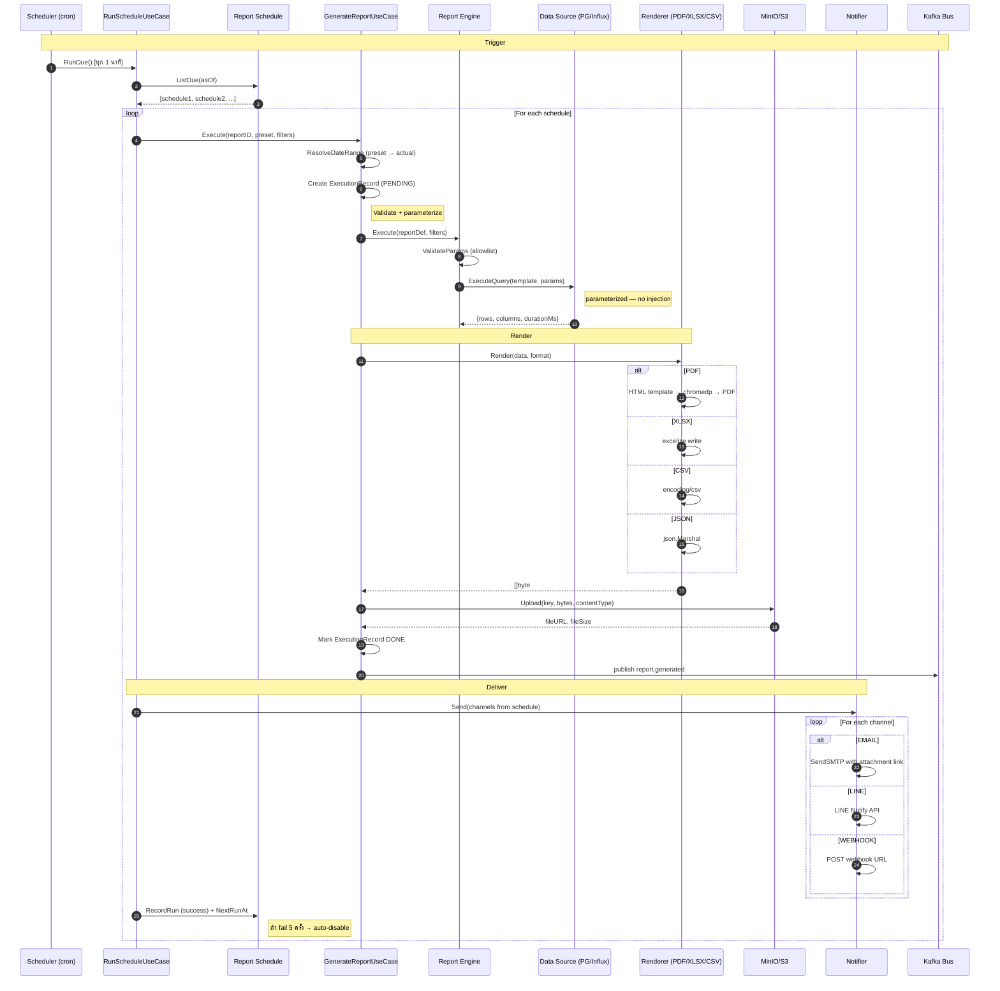
```mermaid
sequenceDiagram
    autonumber
    participant Cron as Scheduler (cron)
    participant Run as RunScheduleUseCase
    participant Sched as Report Schedule
    participant Gen as GenerateReportUseCase
    participant Engine as Report Engine
    participant DS as Data Source (PG/Influx)
    participant Render as Renderer (PDF/XLSX/CSV)
    participant Store as MinIO/S3
    participant Notif as Notifier
    participant Kafka as Kafka Bus

    Note over Cron,Kafka: Trigger
    Cron->>Run: RunDue() [ทุก 1 นาที]
    Run->>Sched: ListDue(asOf)
    Sched-->>Run: [schedule1, schedule2, ...]

    loop For each schedule
        Run->>Gen: Execute(reportID, preset, filters)
        Gen->>Gen: ResolveDateRange (preset → actual)
        Gen->>Gen: Create ExecutionRecord (PENDING)

        Note right of Gen: Validate + parameterize
        Gen->>Engine: Execute(reportDef, filters)
        Engine->>Engine: ValidateParams (allowlist)
        Engine->>DS: ExecuteQuery(template, params)
        Note right of DS: parameterized — no injection
        DS-->>Engine: {rows, columns, durationMs}

        Note over Gen,Render: Render
        Gen->>Render: Render(data, format)
        alt PDF
            Render->>Render: HTML template → chromedp → PDF
        else XLSX
            Render->>Render: excelize write
        else CSV
            Render->>Render: encoding/csv
        else JSON
            Render->>Render: json.Marshal
        end
        Render-->>Gen: []byte

        Gen->>Store: Upload(key, bytes, contentType)
        Store-->>Gen: fileURL, fileSize

        Gen->>Gen: Mark ExecutionRecord DONE
        Gen->>Kafka: publish report.generated

        Note over Run,Notif: Deliver
        Run->>Notif: Send(channels from schedule)
        loop For each channel
            alt EMAIL
                Notif->>Notif: SendSMTP with attachment link
            else LINE
                Notif->>Notif: LINE Notify API
            else WEBHOOK
                Notif->>Notif: POST webhook URL
            end
        end

        Run->>Sched: RecordRun (success) + NextRunAt
        Note right of Sched: ถ้า fail 5 ครั้ง → auto-disable
    end
```

### B.6 Flow #6 — Device Shadow Sync (Digital Twin)

> User sets desired → Device reports → Delta resolved

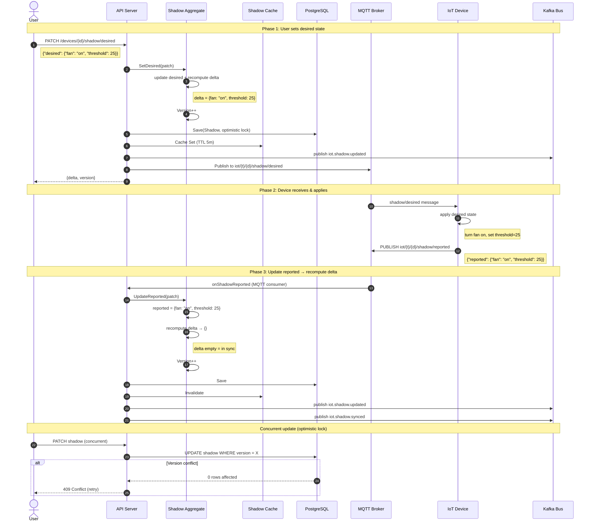
```mermaid
sequenceDiagram
    autonumber
    actor User
    participant API as API Server
    participant Shadow as Shadow Aggregate
    participant Redis as Shadow Cache
    participant PG as PostgreSQL
    participant MQTT as MQTT Broker
    participant Device as IoT Device
    participant Kafka as Kafka Bus

    Note over User,Kafka: Phase 1: User sets desired state
    User->>API: PATCH /devices/{id}/shadow/desired
    Note right of User: {"desired": {"fan": "on", "threshold": 25}}
    API->>Shadow: SetDesired(patch)
    Shadow->>Shadow: update desired + recompute delta
    Note right of Shadow: delta = {fan: "on", threshold: 25}
    Shadow->>Shadow: Version++
    API->>PG: Save(Shadow, optimistic lock)
    API->>Redis: Cache Set (TTL 5m)
    API->>Kafka: publish iot.shadow.updated
    API->>MQTT: Publish to iot/{t}/{d}/shadow/desired
    API-->>User: {delta, version}

    Note over User,Kafka: Phase 2: Device receives & applies
    MQTT->>Device: shadow/desired message
    Device->>Device: apply desired state
    Note right of Device: turn fan on, set threshold=25
    Device->>MQTT: PUBLISH iot/{t}/{d}/shadow/reported
    Note right of Device: {"reported": {"fan": "on", "threshold": 25}}

    Note over User,Kafka: Phase 3: Update reported → recompute delta
    MQTT->>API: onShadowReported (MQTT consumer)
    API->>Shadow: UpdateReported(patch)
    Shadow->>Shadow: reported = {fan: "on", threshold: 25}
    Shadow->>Shadow: recompute delta → {}
    Note right of Shadow: delta empty = in sync
    Shadow->>Shadow: Version++
    API->>PG: Save
    API->>Redis: Invalidate
    API->>Kafka: publish iot.shadow.updated
    API->>Kafka: publish iot.shadow.synced

    Note over User,Kafka: Concurrent update (optimistic lock)
    User->>API: PATCH shadow (concurrent)
    API->>PG: UPDATE shadow WHERE version = X
    alt Version conflict
        PG-->>API: 0 rows affected
        API-->>User: 409 Conflict (retry)
    end
```

---

## 🅲 PART 8C — STATE MACHINE DIAGRAMS

### C.1 Customer Lifecycle

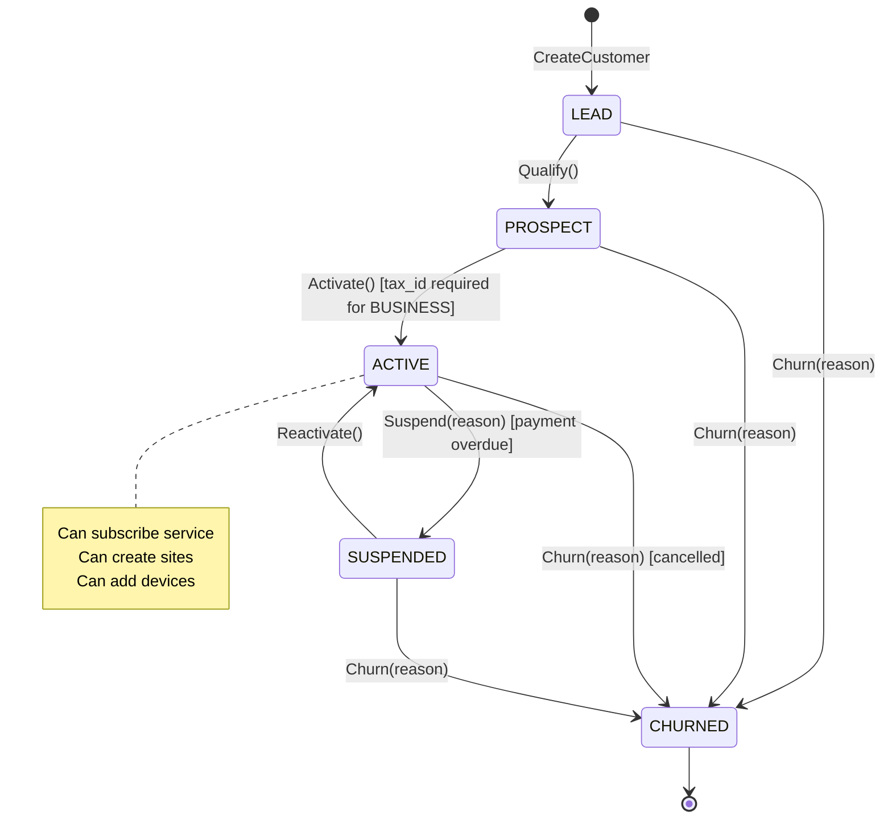
```mermaid
stateDiagram-v2
    [*] --> LEAD: CreateCustomer
    LEAD --> PROSPECT: Qualify()
    LEAD --> CHURNED: Churn(reason)
    PROSPECT --> ACTIVE: Activate() [tax_id required for BUSINESS]
    PROSPECT --> CHURNED: Churn(reason)
    ACTIVE --> SUSPENDED: Suspend(reason) [payment overdue]
    ACTIVE --> CHURNED: Churn(reason) [cancelled]
    SUSPENDED --> ACTIVE: Reactivate()
    SUSPENDED --> CHURNED: Churn(reason)
    CHURNED --> [*]

    note right of ACTIVE
        Can subscribe service
        Can create sites
        Can add devices
    end note
```

### C.2 Subscription Lifecycle

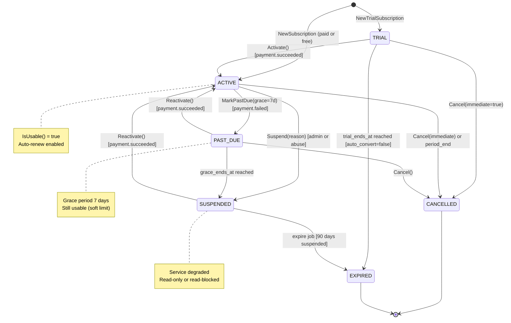
```mermaid
stateDiagram-v2
    [*] --> TRIAL: NewTrialSubscription
    [*] --> ACTIVE: NewSubscription (paid or free)

    TRIAL --> ACTIVE: Activate() [payment.succeeded]
    TRIAL --> CANCELLED: Cancel(immediate=true)
    TRIAL --> EXPIRED: trial_ends_at reached [auto_convert=false]

    ACTIVE --> PAST_DUE: MarkPastDue(grace=7d) [payment.failed]
    ACTIVE --> SUSPENDED: Suspend(reason) [admin or abuse]
    ACTIVE --> CANCELLED: Cancel(immediate) or period_end

    PAST_DUE --> ACTIVE: Reactivate() [payment.succeeded]
    PAST_DUE --> SUSPENDED: grace_ends_at reached
    PAST_DUE --> CANCELLED: Cancel()

    SUSPENDED --> ACTIVE: Reactivate() [payment.succeeded]
    SUSPENDED --> EXPIRED: expire job [90 days suspended]

    CANCELLED --> [*]
    EXPIRED --> [*]

    note right of ACTIVE
        IsUsable() = true
        Auto-renew enabled
    end note
    note right of PAST_DUE
        Grace period 7 days
        Still usable (soft limit)
    end note
    note right of SUSPENDED
        Service degraded
        Read-only or read-blocked
    end note
```

### C.3 Device Lifecycle

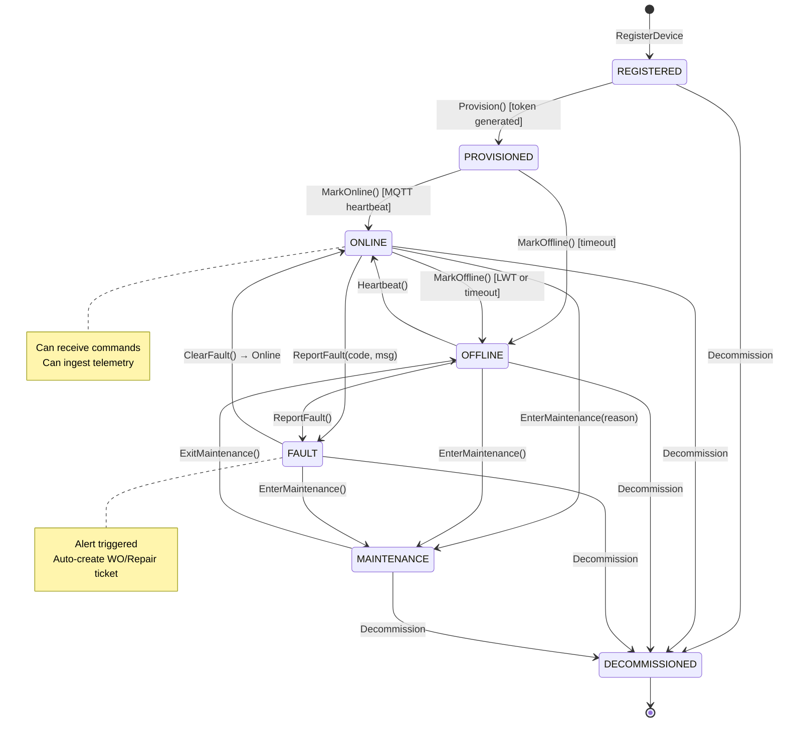
```mermaid
stateDiagram-v2
    [*] --> REGISTERED: RegisterDevice
    REGISTERED --> PROVISIONED: Provision() [token generated]
    REGISTERED --> DECOMMISSIONED: Decommission

    PROVISIONED --> ONLINE: MarkOnline() [MQTT heartbeat]
    PROVISIONED --> OFFLINE: MarkOffline() [timeout]

    ONLINE --> OFFLINE: MarkOffline() [LWT or timeout]
    ONLINE --> FAULT: ReportFault(code, msg)
    ONLINE --> MAINTENANCE: EnterMaintenance(reason)
    ONLINE --> DECOMMISSIONED: Decommission

    OFFLINE --> ONLINE: Heartbeat()
    OFFLINE --> FAULT: ReportFault()
    OFFLINE --> MAINTENANCE: EnterMaintenance()
    OFFLINE --> DECOMMISSIONED: Decommission

    FAULT --> ONLINE: ClearFault() → Online
    FAULT --> MAINTENANCE: EnterMaintenance()
    FAULT --> DECOMMISSIONED: Decommission

    MAINTENANCE --> OFFLINE: ExitMaintenance()
    MAINTENANCE --> DECOMMISSIONED: Decommission

    DECOMMISSIONED --> [*]

    note right of ONLINE
        Can receive commands
        Can ingest telemetry
    end note
    note right of FAULT
        Alert triggered
        Auto-create WO/Repair ticket
    end note
```

### C.4 Order Lifecycle (SO + PO)

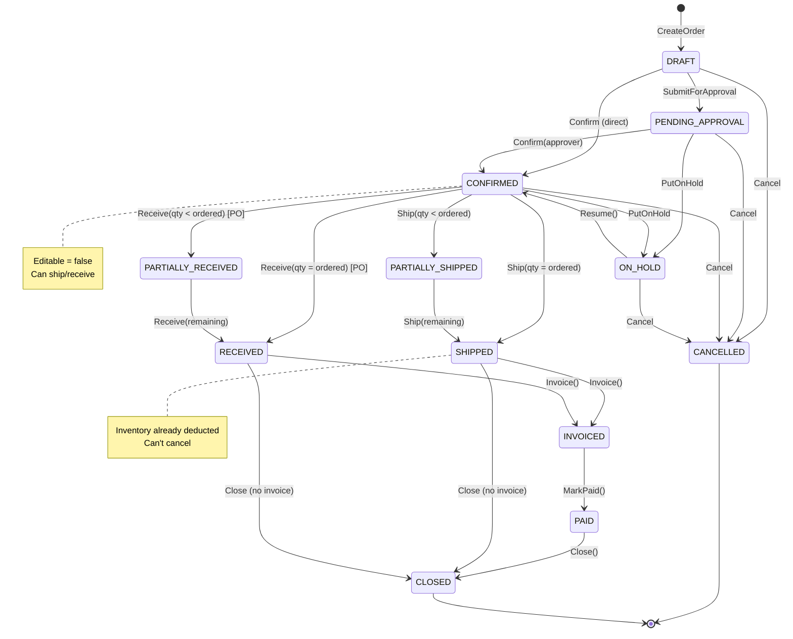
```mermaid
stateDiagram-v2
    [*] --> DRAFT: CreateOrder
    DRAFT --> PENDING_APPROVAL: SubmitForApproval
    DRAFT --> CONFIRMED: Confirm (direct)
    DRAFT --> CANCELLED: Cancel

    PENDING_APPROVAL --> CONFIRMED: Confirm(approver)
    PENDING_APPROVAL --> ON_HOLD: PutOnHold
    PENDING_APPROVAL --> CANCELLED: Cancel

    CONFIRMED --> PARTIALLY_SHIPPED: Ship(qty < ordered)
    CONFIRMED --> SHIPPED: Ship(qty = ordered)
    CONFIRMED --> PARTIALLY_RECEIVED: Receive(qty < ordered) [PO]
    CONFIRMED --> RECEIVED: Receive(qty = ordered) [PO]
    CONFIRMED --> ON_HOLD: PutOnHold
    CONFIRMED --> CANCELLED: Cancel

    PARTIALLY_SHIPPED --> SHIPPED: Ship(remaining)
    PARTIALLY_RECEIVED --> RECEIVED: Receive(remaining)

    SHIPPED --> INVOICED: Invoice()
    RECEIVED --> INVOICED: Invoice()

    INVOICED --> PAID: MarkPaid()
    PAID --> CLOSED: Close()

    SHIPPED --> CLOSED: Close (no invoice)
    RECEIVED --> CLOSED: Close (no invoice)

    ON_HOLD --> CONFIRMED: Resume()
    ON_HOLD --> CANCELLED: Cancel

    CANCELLED --> [*]
    CLOSED --> [*]

    note right of CONFIRMED
        Editable = false
        Can ship/receive
    end note
    note right of SHIPPED
        Inventory already deducted
        Can't cancel
    end note
```

### C.5 Invoice Lifecycle

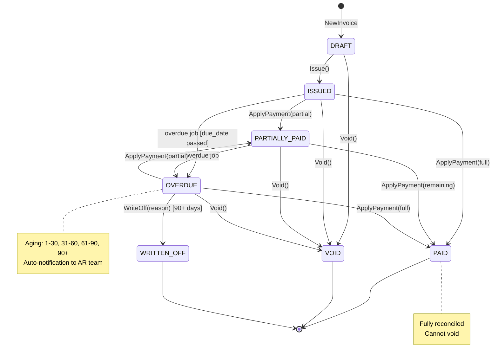
```mermaid
stateDiagram-v2
    [*] --> DRAFT: NewInvoice
    DRAFT --> ISSUED: Issue()
    DRAFT --> VOID: Void()

    ISSUED --> PARTIALLY_PAID: ApplyPayment(partial)
    ISSUED --> PAID: ApplyPayment(full)
    ISSUED --> OVERDUE: overdue job [due_date passed]
    ISSUED --> VOID: Void()

    PARTIALLY_PAID --> PAID: ApplyPayment(remaining)
    PARTIALLY_PAID --> OVERDUE: overdue job
    PARTIALLY_PAID --> VOID: Void()

    OVERDUE --> PARTIALLY_PAID: ApplyPayment(partial)
    OVERDUE --> PAID: ApplyPayment(full)
    OVERDUE --> WRITTEN_OFF: WriteOff(reason) [90+ days]
    OVERDUE --> VOID: Void()

    PAID --> [*]
    VOID --> [*]
    WRITTEN_OFF --> [*]

    note right of PAID
        Fully reconciled
        Cannot void
    end note
    note right of OVERDUE
        Aging: 1-30, 31-60, 61-90, 90+
        Auto-notification to AR team
    end note
```

### C.6 Installation Job Lifecycle

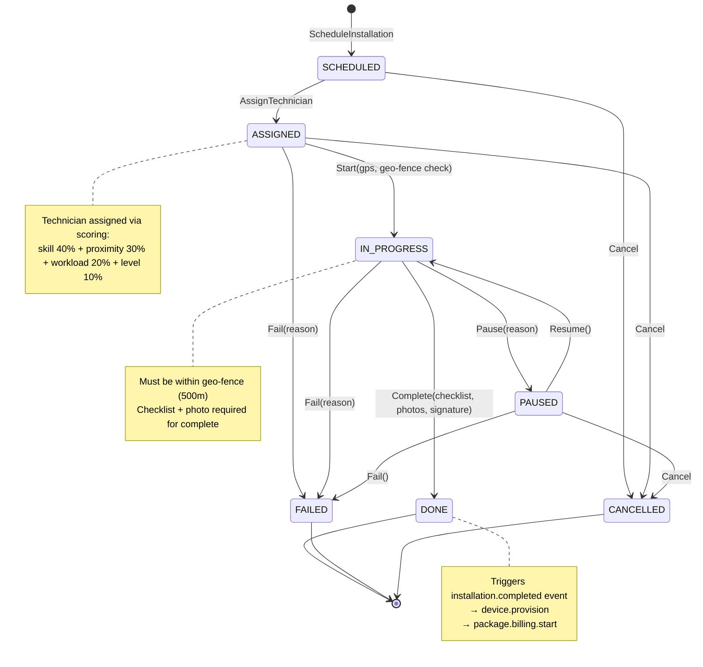
```mermaid
stateDiagram-v2
    [*] --> SCHEDULED: ScheduleInstallation
    SCHEDULED --> ASSIGNED: AssignTechnician
    SCHEDULED --> CANCELLED: Cancel

    ASSIGNED --> IN_PROGRESS: Start(gps, geo-fence check)
    ASSIGNED --> FAILED: Fail(reason)
    ASSIGNED --> CANCELLED: Cancel

    IN_PROGRESS --> PAUSED: Pause(reason)
    IN_PROGRESS --> DONE: Complete(checklist, photos, signature)
    IN_PROGRESS --> FAILED: Fail(reason)

    PAUSED --> IN_PROGRESS: Resume()
    PAUSED --> FAILED: Fail()
    PAUSED --> CANCELLED: Cancel

    DONE --> [*]
    FAILED --> [*]
    CANCELLED --> [*]

    note right of ASSIGNED
        Technician assigned via scoring:
        skill 40% + proximity 30% + workload 20% + level 10%
    end note
    note right of IN_PROGRESS
        Must be within geo-fence (500m)
        Checklist + photo required for complete
    end note
    note right of DONE
        Triggers installation.completed event
        → device.provision
        → package.billing.start
    end note
```

### C.7 Shipment Lifecycle

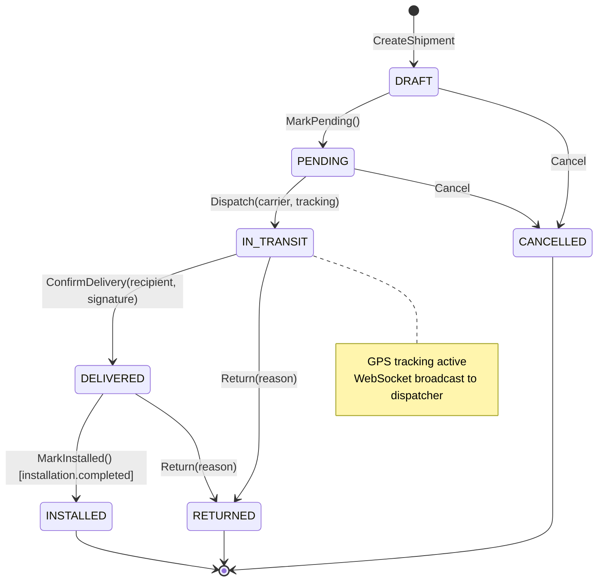
```mermaid
stateDiagram-v2
    [*] --> DRAFT: CreateShipment
    DRAFT --> PENDING: MarkPending()
    DRAFT --> CANCELLED: Cancel

    PENDING --> IN_TRANSIT: Dispatch(carrier, tracking)
    PENDING --> CANCELLED: Cancel

    IN_TRANSIT --> DELIVERED: ConfirmDelivery(recipient, signature)
    IN_TRANSIT --> RETURNED: Return(reason)

    DELIVERED --> INSTALLED: MarkInstalled() [installation.completed]
    DELIVERED --> RETURNED: Return(reason)

    INSTALLED --> [*]
    CANCELLED --> [*]
    RETURNED --> [*]

    note right of IN_TRANSIT
        GPS tracking active
        WebSocket broadcast to dispatcher
    end note
```

### C.8 RMA Lifecycle

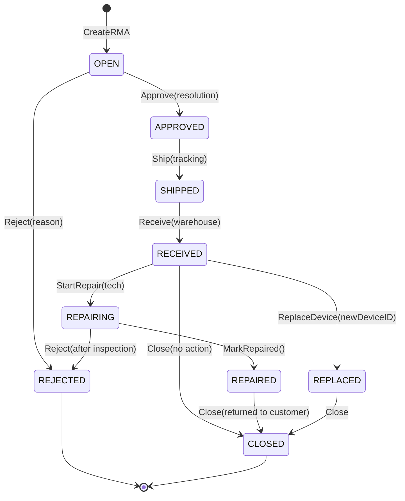
```mermaid
stateDiagram-v2
    [*] --> OPEN: CreateRMA
    OPEN --> APPROVED: Approve(resolution)
    OPEN --> REJECTED: Reject(reason)

    APPROVED --> SHIPPED: Ship(tracking)
    SHIPPED --> RECEIVED: Receive(warehouse)
    RECEIVED --> REPAIRING: StartRepair(tech)
    RECEIVED --> REPLACED: ReplaceDevice(newDeviceID)
    RECEIVED --> CLOSED: Close(no action)

    REPAIRING --> REPAIRED: MarkRepaired()
    REPAIRING --> REJECTED: Reject(after inspection)
    REPAIRED --> CLOSED: Close(returned to customer)

    REPLACED --> CLOSED: Close
    REJECTED --> [*]
    CLOSED --> [*]
```

---

## 🅳 PART 8D — ENTITY RELATIONSHIP DIAGRAM

### D.1 High-Level ERD (Cross-Module)

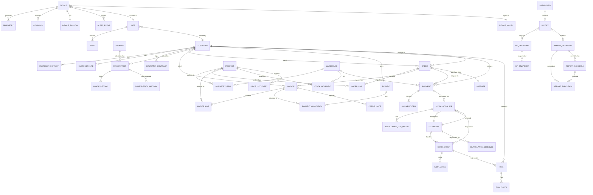
```mermaid
erDiagram
    CUSTOMER ||--o{ CUSTOMER_CONTACT : has
    CUSTOMER ||--o{ CUSTOMER_SITE : has
    CUSTOMER ||--o{ CUSTOMER_CONTRACT : signs
    CUSTOMER ||--o{ SUBSCRIPTION : subscribes
    CUSTOMER ||--o{ ORDER : places
    CUSTOMER ||--o{ INVOICE : billed
    CUSTOMER ||--o{ PAYMENT : pays
    CUSTOMER ||--o{ SHIPMENT : receives
    CUSTOMER ||--o{ RMA : requests

    PACKAGE ||--o{ SUBSCRIPTION : "subscribed as"

    SUBSCRIPTION ||--o{ USAGE_RECORD : tracks
    SUBSCRIPTION ||--o{ SUBSCRIPTION_HISTORY : "state changed"

    ORDER ||--|{ ORDER_LINE : contains
    ORDER ||--o{ INVOICE : "invoiced as"
    ORDER ||--o{ SHIPMENT : "shipped via"
    ORDER }o--|| CUSTOMER : "belongs to"
    ORDER }o--|| SUPPLIER : "purchase from"

    INVOICE ||--|{ INVOICE_LINE : contains
    INVOICE ||--o{ PAYMENT_ALLOCATION : "allocated by"
    INVOICE ||--o{ CREDIT_NOTE : adjusted

    PAYMENT ||--|{ PAYMENT_ALLOCATION : has

    PRODUCT ||--o{ INVENTORY_ITEM : "stocked at"
    PRODUCT ||--o{ ORDER_LINE : "ordered as"
    PRODUCT ||--o{ INVOICE_LINE : "invoiced as"
    PRODUCT ||--o{ STOCK_MOVEMENT : "moved as"
    PRODUCT ||--o{ PRICE_LIST_ENTRY : "priced in"

    WAREHOUSE ||--o{ INVENTORY_ITEM : stores
    WAREHOUSE ||--o{ STOCK_MOVEMENT : "at"
    WAREHOUSE ||--o{ SHIPMENT : "ships from"

    DEVICE ||--o{ TELEMETRY : generates
    DEVICE ||--o{ COMMAND : receives
    DEVICE ||--|| DEVICE_SHADOW : has
    DEVICE ||--o{ ALERT_EVENT : triggers
    DEVICE }o--|| SITE : "installed at"
    DEVICE }o--|| DEVICE_MODEL : "typed as"

    SITE ||--o{ ZONE : contains
    SITE }o--|| CUSTOMER : "owned by"

    SHIPMENT ||--|{ SHIPMENT_ITEM : contains
    SHIPMENT ||--o{ INSTALLATION_JOB : "installation via"

    INSTALLATION_JOB ||--o{ INSTALLATION_JOB_PHOTO : has
    INSTALLATION_JOB }o--|| TECHNICIAN : "assigned to"
    INSTALLATION_JOB ||--o{ WORK_ORDER : "may create"

    TECHNICIAN ||--o{ WORK_ORDER : "handles"
    TECHNICIAN ||--o{ INSTALLATION_JOB : "assigned"
    TECHNICIAN ||--o{ MAINTENANCE_SCHEDULE : "responsible for"

    WORK_ORDER ||--o{ PART_USAGE : uses
    WORK_ORDER ||--o{ RMA : "may create"

    RMA ||--o{ RMA_PHOTO : has

    REPORT_DEFINITION ||--o{ REPORT_EXECUTION : "executed as"
    REPORT_DEFINITION ||--o{ REPORT_SCHEDULE : "scheduled as"
    REPORT_SCHEDULE ||--o{ REPORT_EXECUTION : "triggered"
    KPI_DEFINITION ||--o{ KPI_SNAPSHOT : "snapshotted"

    DASHBOARD ||--|{ WIDGET : contains
    WIDGET }o--o{ KPI_DEFINITION : displays
    WIDGET }o--o| REPORT_DEFINITION : embeds
```

### D.2 Customer Module ERD (Detailed)

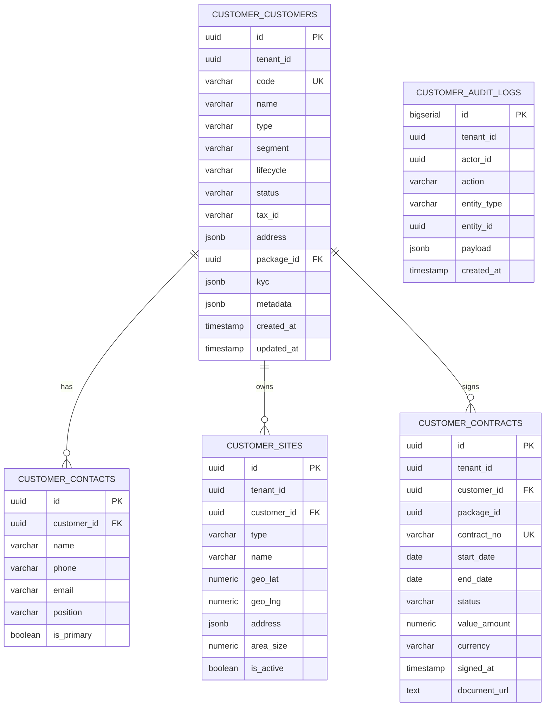
```mermaid
erDiagram
    CUSTOMER_CUSTOMERS {
        uuid id PK
        uuid tenant_id
        varchar code UK
        varchar name
        varchar type
        varchar segment
        varchar lifecycle
        varchar status
        varchar tax_id
        jsonb address
        uuid package_id FK
        jsonb kyc
        jsonb metadata
        timestamp created_at
        timestamp updated_at
    }

    CUSTOMER_CONTACTS {
        uuid id PK
        uuid customer_id FK
        varchar name
        varchar phone
        varchar email
        varchar position
        boolean is_primary
    }

    CUSTOMER_SITES {
        uuid id PK
        uuid tenant_id
        uuid customer_id FK
        varchar type
        varchar name
        numeric geo_lat
        numeric geo_lng
        jsonb address
        numeric area_size
        boolean is_active
    }

    CUSTOMER_CONTRACTS {
        uuid id PK
        uuid tenant_id
        uuid customer_id FK
        uuid package_id
        varchar contract_no UK
        date start_date
        date end_date
        varchar status
        numeric value_amount
        varchar currency
        timestamp signed_at
        text document_url
    }

    CUSTOMER_AUDIT_LOGS {
        bigserial id PK
        uuid tenant_id
        uuid actor_id
        varchar action
        varchar entity_type
        uuid entity_id
        jsonb payload
        timestamp created_at
    }

    CUSTOMER_CUSTOMERS ||--o{ CUSTOMER_CONTACTS : has
    CUSTOMER_CUSTOMERS ||--o{ CUSTOMER_SITES : owns
    CUSTOMER_CUSTOMERS ||--o{ CUSTOMER_CONTRACTS : signs
```

### D.3 ERP Module ERD (Order-to-Cash + Procure-to-Pay)

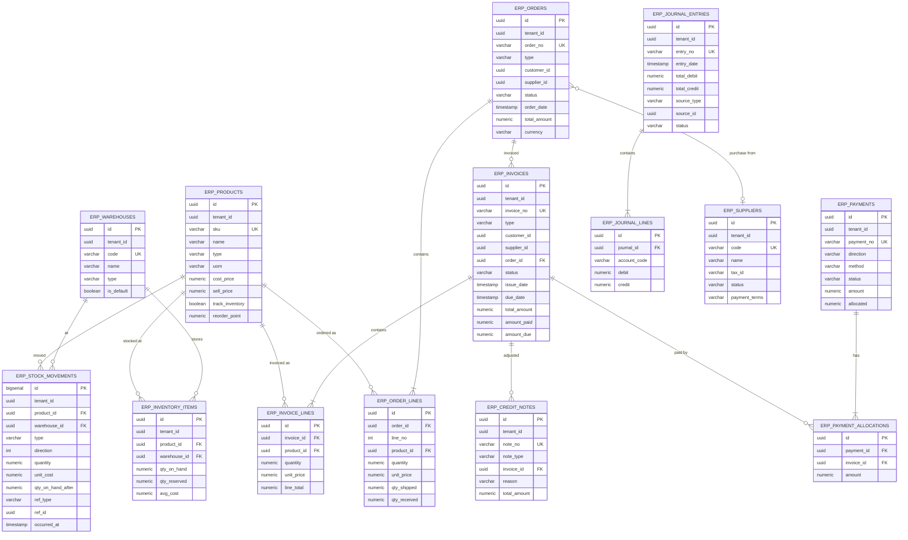
```mermaid
erDiagram
    ERP_PRODUCTS {
        uuid id PK
        uuid tenant_id
        varchar sku UK
        varchar name
        varchar type
        varchar uom
        numeric cost_price
        numeric sell_price
        boolean track_inventory
        numeric reorder_point
    }

    ERP_WAREHOUSES {
        uuid id PK
        uuid tenant_id
        varchar code UK
        varchar name
        varchar type
        boolean is_default
    }

    ERP_INVENTORY_ITEMS {
        uuid id PK
        uuid tenant_id
        uuid product_id FK
        uuid warehouse_id FK
        numeric qty_on_hand
        numeric qty_reserved
        numeric avg_cost
    }

    ERP_STOCK_MOVEMENTS {
        bigserial id PK
        uuid tenant_id
        uuid product_id FK
        uuid warehouse_id FK
        varchar type
        int direction
        numeric quantity
        numeric unit_cost
        numeric qty_on_hand_after
        varchar ref_type
        uuid ref_id
        timestamp occurred_at
    }

    ERP_ORDERS {
        uuid id PK
        uuid tenant_id
        varchar order_no UK
        varchar type
        uuid customer_id
        uuid supplier_id
        varchar status
        timestamp order_date
        numeric total_amount
        varchar currency
    }

    ERP_ORDER_LINES {
        uuid id PK
        uuid order_id FK
        int line_no
        uuid product_id FK
        numeric quantity
        numeric unit_price
        numeric qty_shipped
        numeric qty_received
    }

    ERP_INVOICES {
        uuid id PK
        uuid tenant_id
        varchar invoice_no UK
        varchar type
        uuid customer_id
        uuid supplier_id
        uuid order_id FK
        varchar status
        timestamp issue_date
        timestamp due_date
        numeric total_amount
        numeric amount_paid
        numeric amount_due
    }

    ERP_INVOICE_LINES {
        uuid id PK
        uuid invoice_id FK
        uuid product_id FK
        numeric quantity
        numeric unit_price
        numeric line_total
    }

    ERP_PAYMENTS {
        uuid id PK
        uuid tenant_id
        varchar payment_no UK
        varchar direction
        varchar method
        varchar status
        numeric amount
        numeric allocated
    }

    ERP_PAYMENT_ALLOCATIONS {
        uuid id PK
        uuid payment_id FK
        uuid invoice_id FK
        numeric amount
    }

    ERP_CREDIT_NOTES {
        uuid id PK
        uuid tenant_id
        varchar note_no UK
        varchar note_type
        uuid invoice_id FK
        varchar reason
        numeric total_amount
    }

    ERP_JOURNAL_ENTRIES {
        uuid id PK
        uuid tenant_id
        varchar entry_no UK
        timestamp entry_date
        numeric total_debit
        numeric total_credit
        varchar source_type
        uuid source_id
        varchar status
    }

    ERP_JOURNAL_LINES {
        uuid id PK
        uuid journal_id FK
        varchar account_code
        numeric debit
        numeric credit
    }

    ERP_SUPPLIERS {
        uuid id PK
        uuid tenant_id
        varchar code UK
        varchar name
        varchar tax_id
        varchar status
        varchar payment_terms
    }

    ERP_PRODUCTS ||--o{ ERP_INVENTORY_ITEMS : "stocked at"
    ERP_PRODUCTS ||--o{ ERP_ORDER_LINES : "ordered as"
    ERP_PRODUCTS ||--o{ ERP_INVOICE_LINES : "invoiced as"
    ERP_PRODUCTS ||--o{ ERP_STOCK_MOVEMENTS : "moved"

    ERP_WAREHOUSES ||--o{ ERP_INVENTORY_ITEMS : stores
    ERP_WAREHOUSES ||--o{ ERP_STOCK_MOVEMENTS : "at"

    ERP_ORDERS ||--|{ ERP_ORDER_LINES : contains
    ERP_ORDERS ||--o{ ERP_INVOICES : "invoiced"
    ERP_ORDERS }o--o| ERP_SUPPLIERS : "purchase from"

    ERP_INVOICES ||--|{ ERP_INVOICE_LINES : contains
    ERP_INVOICES ||--o{ ERP_PAYMENT_ALLOCATIONS : "paid by"
    ERP_INVOICES ||--o{ ERP_CREDIT_NOTES : "adjusted"

    ERP_PAYMENTS ||--|{ ERP_PAYMENT_ALLOCATIONS : has

    ERP_JOURNAL_ENTRIES ||--|{ ERP_JOURNAL_LINES : contains
```

### D.4 Device Module ERD

```mermaid
erDiagram
    DEVICE_SITES {
        uuid id PK
        uuid tenant_id
        uuid customer_id
        varchar name
        varchar type
        numeric geo_lat
        numeric geo_lng
        boolean is_active
    }

    DEVICE_ZONES {
        uuid id PK
        uuid tenant_id
        uuid site_id FK
        uuid parent_id FK
        varchar name
        varchar zone_type
    }

    DEVICE_MODELS {
        uuid id PK
        varchar vendor
        varchar model_no UK
        varchar name
        varchar device_type
        varchar protocol
        jsonb capabilities
    }

    DEVICE_DEVICES {
        uuid id PK
        uuid tenant_id
        uuid customer_id
        uuid site_id FK
        uuid zone_id FK
        uuid model_id FK
        varchar serial_no UK
        varchar name
        varchar type
        varchar protocol
        varchar status
        varchar mqtt_client_id
        varchar device_token_hash
        timestamp last_seen_at
        jsonb capabilities
    }

    DEVICE_SHADOWS {
        uuid device_id PK,FK
        uuid tenant_id
        jsonb state
        bigint version
        timestamp updated_at
    }

    DEVICE_COMMANDS {
        uuid id PK
        uuid tenant_id
        uuid device_id FK
        varchar command
        jsonb payload
        varchar status
        timestamp issued_at
        timestamp expires_at
        timestamp acked_at
    }

    DEVICE_ALERT_RULES {
        uuid id PK
        uuid tenant_id
        varchar name
        uuid device_id FK
        uuid group_id FK
        varchar metric
        varchar operator
        numeric threshold
        varchar severity
        boolean is_active
    }

    DEVICE_ALERT_EVENTS {
        bigserial id PK
        uuid tenant_id
        uuid rule_id FK
        uuid device_id FK
        varchar metric
        numeric value
        varchar severity
        boolean acknowledged
        timestamp triggered_at
    }

    DEVICE_AUTOMATIONS {
        uuid id PK
        uuid tenant_id
        varchar name
        jsonb trigger
        jsonb conditions
        jsonb actions
        boolean is_active
    }

    DEVICE_FIRMWARES {
        uuid id PK
        uuid model_id FK
        varchar version
        varchar channel
        varchar file_url
        varchar checksum
    }

    DEVICE_SITES ||--o{ DEVICE_ZONES : contains
    DEVICE_SITES ||--o{ DEVICE_DEVICES : "installed at"
    DEVICE_ZONES ||--o{ DEVICE_DEVICES : "grouped in"
    DEVICE_MODELS ||--o{ DEVICE_DEVICES : "typed as"
    DEVICE_MODELS ||--o{ DEVICE_FIRMWARES : "firmware for"
    DEVICE_DEVICES ||--|| DEVICE_SHADOWS : has
    DEVICE_DEVICES ||--o{ DEVICE_COMMANDS : receives
    DEVICE_DEVICES ||--o{ DEVICE_ALERT_EVENTS : triggers
    DEVICE_ALERT_RULES ||--o{ DEVICE_ALERT_EVENTS : "fires as"
    DEVICE_ALERT_RULES }o--o| DEVICE_DEVICES : monitors
```

---

## 🅴 PART 8E — KAFKA TOPIC MAP

### E.1 Producer → Topic → Consumer Matrix

```mermaid
graph LR
    subgraph Producers
        CustM[Customer Module]
        PkgM[Package Module]
        ErpM[ERP Module]
        CrmM[CRM Module]
        DevM[Device Module]
        LogM[Logistics Module]
        RepM[Report Module]
    end

    subgraph Topics
        TCust((customer.*))
        TPkg((package.*))
        TErp((erp.*))
        TCrm((crm.*))
        TDev((iot.*))
        TLog((iotlogistics.*))
        TRep((report.*))
    end

    subgraph Consumers
        CNotif[Notification Worker]
        CKpi[KPI Worker]
        CDev[Device Worker]
        CLog[Logistics Worker]
        CErp[ERP Worker]
        CRep[Report Worker]
        CWs[WS Broadcaster]
    end

    CustM --> TCust
    CustM --> TDev
    PkgM --> TPkg
    ErpM --> TErp
    CrmM --> TCrm
    DevM --> TDev
    LogM --> TLog
    RepM --> TRep

    TCust --> CNotif
    TCust --> CLog
    TCust --> CKpi
    TCust --> CErp

    TPkg --> CNotif
    TPkg --> CDev
    TPkg --> CKpi

    TCrm --> CNotif
    TCrm --> CErp

    TErp --> CNotif
    TErp --> CKpi
    TErp --> CLog

    TDev --> CNotif
    TDev --> CLog
    TDev --> CErp
    TDev --> CWs
    TDev --> CKpi
    TDev --> CRep

    TLog --> CNotif
    TLog --> CDev
    TLog --> CKpi
    TLog --> CErp

    TRep --> CNotif
    TRep --> CWs
```

### E.2 Topic Catalogue (56 topics)

| Domain | Topic | Producer | Consumers | Retention | Partition Key |
|---|---|---|---|:-:|---|
| **customer** | `customer.created` | customer | crm, pkg, erp, report | 7d | customer_id |
| | `customer.updated` | customer | crm, report | 7d | customer_id |
| | `customer.onboarded` | customer | pkg, logistics, report | 30d | customer_id |
| | `customer.status.changed` | customer | pkg, notifier, crm | 7d | customer_id |
| | `customer.churned` | customer | pkg, crm, report | 30d | customer_id |
| | `customer.contract.signed` | customer | pkg, notifier | 30d | customer_id |
| **package** | `package.created` | pkg | report | 7d | package_id |
| | `package.updated` | pkg | report | 7d | package_id |
| | `package.deprecated` | pkg | report | 7d | package_id |
| | `package.price.changed` | pkg | report | 7d | package_id |
| | `package.subscription.created` | pkg | payment, device, notifier, report | 30d | subscription_id |
| | `package.subscription.activated` | pkg | payment, device | 30d | subscription_id |
| | `package.subscription.trial.started` | pkg | notifier | 7d | subscription_id |
| | `package.subscription.trial.ending` | pkg | notifier | 7d | subscription_id |
| | `package.subscription.upgraded` | pkg | payment, notifier | 30d | subscription_id |
| | `package.subscription.downgraded` | pkg | notifier | 30d | subscription_id |
| | `package.subscription.renewed` | pkg | payment | 30d | subscription_id |
| | `package.subscription.past_due` | pkg | notifier, crm | 30d | subscription_id |
| | `package.subscription.suspended` | pkg | device, notifier | 30d | subscription_id |
| | `package.subscription.cancelled` | pkg | notifier, report | 30d | subscription_id |
| | `package.subscription.expired` | pkg | device, notifier | 30d | subscription_id |
| | `package.quota.exceeded` | pkg | notifier, crm | 7d | subscription_id |
| | `package.quota.reset` | pkg | report | 7d | subscription_id |
| **erp** | `erp.product.created` | erp | report | 7d | product_id |
| | `erp.product.updated` | erp | report | 7d | product_id |
| | `erp.order.created` | erp | report, notifier | 30d | order_id |
| | `erp.order.confirmed` | erp | logistics, notifier | 30d | order_id |
| | `erp.order.shipped` | erp | logistics, notifier, report | 30d | order_id |
| | `erp.order.received` | erp | report | 30d | order_id |
| | `erp.order.invoiced` | erp | report | 30d | order_id |
| | `erp.order.cancelled` | erp | notifier | 30d | order_id |
| | `erp.order.closed` | erp | report | 30d | order_id |
| | `erp.invoice.draft` | erp | — | 7d | invoice_id |
| | `erp.invoice.issued` | erp | payment, notifier, report, logistics | 90d | invoice_id |
| | `erp.invoice.paid` | erp | report, notifier | 90d | invoice_id |
| | `erp.invoice.overdue` | erp | notifier, crm | 90d | invoice_id |
| | `erp.invoice.voided` | erp | report | 90d | invoice_id |
| | `erp.payment.created` | erp | — | 30d | payment_id |
| | `erp.payment.confirmed` | erp | notifier, report | 90d | payment_id |
| | `erp.payment.applied` | erp | report | 90d | payment_id |
| | `erp.payment.reversed` | erp | notifier | 90d | payment_id |
| | `erp.inventory.low_stock` | erp | notifier, logistics | 7d | product_id |
| | `erp.inventory.out_of_stock` | erp | notifier, logistics | 7d | product_id |
| | `erp.inventory.adjusted` | erp | report | 30d | product_id |
| | `erp.inventory.transferred` | erp | report | 30d | product_id |
| **crm** | `crm.lead.created` | crm | report | 30d | lead_id |
| | `crm.lead.converted` | crm | customer | 30d | lead_id |
| | `crm.opportunity.won` | crm | pkg, erp | 30d | opportunity_id |
| | `crm.ticket.created` | crm | notifier | 30d | ticket_id |
| | `crm.ticket.sla.breach` | crm | notifier | 30d | ticket_id |
| | `crm.ticket.resolved` | crm | report | 30d | ticket_id |
| **device** | `iot.telemetry.raw` | mqtt-ingest | device-worker | 24h | device_id |
| | `iot.telemetry.aggregated` | device | report, pkg | 7d | device_id |
| | `iot.device.registered` | device | pkg, report | 30d | device_id |
| | `iot.device.provisioned` | device | notifier, report | 30d | device_id |
| | `iot.device.online` | device | report | 7d | device_id |
| | `iot.device.offline` | device | logistics, crm, notifier | 7d | device_id |
| | `iot.device.fault` | device | logistics, crm, notifier | 30d | device_id |
| | `iot.device.decommissioned` | device | report | 30d | device_id |
| | `iot.device.firmware.updated` | device | report | 7d | device_id |
| | `iot.alert.triggered` | device | crm, notifier, logistics, report | 30d | device_id |
| | `iot.alert.acknowledged` | device | report | 30d | device_id |
| | `iot.alert.resolved` | device | report | 30d | device_id |
| | `iot.command.issued` | device | report | 7d | device_id |
| | `iot.command.acked` | device | logistics, notifier | 7d | device_id |
| | `iot.command.failed` | device | logistics, notifier | 7d | device_id |
| | `iot.command.timeout` | device | logistics, notifier | 7d | device_id |
| | `iot.automation.triggered` | device | report | 7d | automation_id |
| | `iot.shadow.updated` | device | report | 7d | device_id |
| | `iot.shadow.synced` | device | report | 7d | device_id |
| **logistics** | `iotlogistics.shipment.created` | logistics | notifier | 30d | shipment_id |
| | `iotlogistics.shipment.dispatched` | logistics | notifier | 30d | shipment_id |
| | `iotlogistics.shipment.delivered` | logistics | notifier, report | 30d | shipment_id |
| | `iotlogistics.shipment.installed` | logistics | report | 30d | shipment_id |
| | `iotlogistics.shipment.cancelled` | logistics | notifier | 30d | shipment_id |
| | `iotlogistics.installation.scheduled` | logistics | notifier | 90d | job_id |
| | `iotlogistics.installation.assigned` | logistics | notifier | 90d | job_id |
| | `iotlogistics.installation.started` | logistics | report | 90d | job_id |
| | `iotlogistics.installation.completed` | logistics | device, pkg, report, notifier | 90d | job_id |
| | `iotlogistics.installation.failed` | logistics | notifier, crm | 90d | job_id |
| | `iotlogistics.installation.sla.breach` | logistics | notifier, crm | 90d | job_id |
| | `iotlogistics.maintenance.due` | logistics | crm, notifier | 90d | schedule_id |
| | `iotlogistics.maintenance.done` | logistics | report | 90d | schedule_id |
| | `iotlogistics.rma.created` | logistics | notifier | 90d | rma_id |
| | `iotlogistics.rma.approved` | logistics | notifier | 90d | rma_id |
| | `iotlogistics.rma.completed` | logistics | report | 90d | rma_id |
| **report** | `report.requested` | report | — | 7d | execution_id |
| | `report.generated` | report | notifier | 30d | execution_id |
| | `report.failed` | report | notifier | 30d | execution_id |
| | `report.schedule.triggered` | report | — | 7d | schedule_id |
| | `report.kpi.snapshot.done` | report | — | 90d | tenant_id |
| | `report.kpi.anomaly.detected` | report | notifier, crm | 90d | kpi_code |
| | `report.kpi.target.breached` | report | notifier, crm | 90d | kpi_code |
| | `report.insight.generated` | report | notifier, ws | 30d | insight_id |
| **notification** | `notification.email.send` | any | notif-worker | 3d | — |
| | `notification.line.send` | any | notif-worker | 3d | — |
| | `notification.ws.broadcast` | any | ws-hub | 1d | tenant_id |

---

## 🅵 PART 8F — DEPLOYMENT & COMPONENT DIAGRAMS

### F.1 Deployment Diagram (Docker Compose — Dev/Staging)

```mermaid
graph TB
    subgraph "Docker Host"
        subgraph "Application Tier"
            API[API Container<br/>:8080]
            SCH[Scheduler Container]
            MQTTI[MQTT Ingest Container]
            WT[Telemetry Worker x2]
            WL[Logistics Worker]
            WN[Notification Worker]
        end

        subgraph "Data Tier"
            PG[(PostgreSQL<br/>:5432)]
            RD[(Redis<br/>:6379)]
            KF[Kafka<br/>:9092]
            IN[(InfluxDB<br/>:8086)]
            ES[(Elasticsearch<br/>:9200)]
            MN[(MinIO<br/>:9000)]
        end

        subgraph "Support"
            MQ[Mosquitto<br/>:1883]
            OL[Ollama<br/>:11434]
            PR[Prometheus<br/>:9090]
            GF[Grafana<br/>:3000]
        end
    end

    subgraph "External"
        Devices[IoT Devices]
        Users[Users / Browsers]
        Ext[Payment / Maps / LINE]
    end

    Users -->|HTTPS :8080| API
    Users -->|WSS :8080| API
    Devices -->|MQTT :1883| MQ
    MQ --> MQTTI
    MQTTI --> KF
    KF --> WT
    KF --> WL
    KF --> WN
    API --> KF
    API --> PG
    API --> RD
    API --> IN
    API --> ES
    API --> MN
    API --> OL
    API --> Ext
    WT --> IN
    WT --> RD
    WT --> KF
    SCH --> PG
    SCH --> KF
    PR -.scrape.-> API
    GF --> PR
```

### F.2 Deployment Diagram (Kubernetes — Production)

```mermaid
graph TB
    subgraph "K8s Cluster"
        subgraph "Ingress"
            ING[Nginx Ingress]
        end

        subgraph "Application Namespace"
            subgraph "API Deployment"
                A1[api-0]
                A2[api-1]
                A3[api-2]
            end

            subgraph "Worker Deployments"
                M1[mqtt-ingest-0]
                M2[mqtt-ingest-1]
                T1[telemetry-worker-0..N<br/>HPA 2-20]
                L1[logistics-worker]
                N1[notification-worker]
            end

            subgraph "CronJobs"
                CJ1[report-scheduler]
                CJ2[kpi-snapshot]
                CJ3[invoice-overdue]
            end
        end

        subgraph "StatefulSets"
            PG[(PostgreSQL<br/>primary + replica)]
            RD[(Redis<br/>sentinel)]
            KF[Kafka<br/>3 brokers]
            IN[(InfluxDB)]
            ES[(Elasticsearch<br/>3 nodes)]
            MN[(MinIO<br/>distributed)]
        end

        subgraph "Observability"
            PROM[Prometheus]
            GRAF[Grafana]
            LOKI[Loki]
            OTEL[OTel Collector]
        end
    end

    ING --> A1
    ING --> A2
    ING --> A3

    External[External Traffic] --> ING
    Devices[IoT Devices] --> MQ[MQTT Broker<br/>EMQX Cluster]
    MQ --> M1
    MQ --> M2
    M1 --> KF
    M2 --> KF
    KF --> T1
    KF --> L1
    KF --> N1

    A1 --> PG
    A2 --> PG
    A3 --> PG
    A1 --> RD
    A2 --> RD
    A3 --> RD
    A1 --> KF
    A2 --> KF
    A3 --> KF
    T1 --> IN
    PROM --> A1
    OTEL --> PROM
```

### F.3 Module Dependency Graph

```mermaid
graph TD
    subgraph "P0 — Foundation"
        Auth[auth]
        Users[users]
        Customer[customer]
        Package[packagecatalog]
    end

    subgraph "P0 — IoT Core"
        Device[device]
        MQTT[mqtt bridge]
        Influx[influxdb adapter]
    end

    subgraph "P1 — Business"
        ERP[erp]
        CRM[crm]
        Payment[payment]
    end

    subgraph "P2 — Operations"
        Logistics[iotlogistics]
        Alarm[alarm]
        Notifier[notifier]
    end

    subgraph "P3 — Analytics"
        Report[report]
        Dashboard[dashboard]
    end

    subgraph "Shared Kernel"
        Kafka[pkg/kafka]
        Logger[pkg/logger]
        Transaction[pkg/transaction]
        Cache[pkg/cache]
    end

    Customer --> Package
    Package --> Payment
    Customer --> Device
    Device --> Logistics
    Logistics --> ERP
    Customer --> CRM
    CRM --> Customer
    Device --> Report
    ERP --> Report
    Logistics --> Report
    CRM --> Report

    Auth -.-> Customer
    Auth -.-> Device
    Auth -.-> ERP
    Users -.-> Customer

    Alarm --> Notifier
    Device --> Alarm
    Device --> Report
    Logistics --> Notifier
    Logistics --> Alarm

    Kafka -.- Customer
    Kafka -.- Package
    Kafka -.- Device
    Kafka -.- ERP
    Kafka -.- CRM
    Kafka -.- Logistics
    Kafka -.- Report
```

### F.4 Request Lifecycle (Cross-Cutting)

```mermaid
sequenceDiagram
    autonumber
    participant Client
    participant Ingress as Nginx Ingress
    participant API as Gin Router
    participant MW1 as RequestID
    participant MW2 as Logging
    participant MW3 as JWT Auth
    participant MW4 as Tenant Injector
    participant MW5 as Rate Limit
    participant MW6 as Prometheus
    participant Handler
    participant UC as UseCase
    participant Repo as Repository
    participant DB as PostgreSQL
    participant Kafka as Kafka
    participant Resp as Response

    Client->>Ingress: HTTPS request
    Ingress->>API: forward
    API->>MW1: generate req_id
    MW1->>MW2: log start
    MW2->>MW3: verify JWT
    MW3->>MW4: extract tenant_id
    MW4->>MW5: rate check (Redis)
    MW5->>MW6: start timer
    MW6->>Handler: invoke

    Handler->>Handler: bind + validate DTO
    Handler->>UC: Execute(ctx, input)
    UC->>Repo: Save/Find
    Repo->>DB: SQL (parameterized)
    DB-->>Repo: rows
    Repo-->>UC: entity
    UC->>Kafka: publish event
    UC-->>Handler: DTO
    Handler->>Resp: build envelope
    Resp-->>Client: 200 OK + meta

    Note over MW6: Record http_duration + status
    Note over MW2: log request completed
```

---

## 📊 PART 8 SUMMARY

### Diagrams Created (16 total)

| # | ประเภท | Diagram | Purpose |
|:-:|---|---|---|
| 1 | C4 Level 1 | System Context | ภาพรวมระบบ + external systems |
| 2 | C4 Level 2 | Container Diagram | services + databases |
| 3 | Component | Device Module | ภายใน module device |
| 4 | Sequence | Customer Onboarding Saga | end-to-end 6 module |
| 5 | Sequence | Telemetry Hot Path | MQTT → InfluxDB + alert |
| 6 | Sequence | Order-to-Cash (ERP) | SO → Payment |
| 7 | Sequence | Procure-to-Pay (ERP) | PO → Payment |
| 8 | Sequence | Report Generation | cron → deliver |
| 9 | Sequence | Shadow Sync | digital twin |
| 10 | State | Customer Lifecycle | LEAD → CHURNED |
| 11 | State | Subscription Lifecycle | TRIAL → EXPIRED |
| 12 | State | Device Lifecycle | REGISTERED → DECOMMISSIONED |
| 13 | State | Order Lifecycle | DRAFT → CLOSED |
| 14 | State | Invoice Lifecycle | DRAFT → PAID |
| 15 | State | Installation + Shipment + RMA | 3 lifecycles |
| 16 | ERD | Cross-module + ERP + Device | 47 tables |
| 17 | Deployment | Docker + K8s + Dependency + Request | 4 perspectives |

### Key Insights ที่ได้จาก Diagrams

1. **Loose Coupling** — modules สื่อสารผ่าน Kafka เท่านั้น (ไม่มี direct import ข้าม context)
2. **Hot Path Isolation** — telemetry ใช้ worker แยก, Redis cache, InfluxDB time-series
3. **Saga Orchestration** — onboarding กระจาย 6 modules ผ่าน events
4. **State Machine Clarity** — ทุก lifecycle มี CanTransitionTo() เป็น guard
5. **Idempotency** — stock movement ledger + payment allocation ป้องกัน double-count
6. **Double-Entry Accounting** — journal entries auto-generated จาก business events
7. **Optimistic Locking** — shadow ใช้ version field
8. **Graceful Degradation** — PAST_DUE ยัง usable, แค่ alert

---

# 🎯 ความคืบหน้า (ลำดับ B)

| # | งาน | สถานะ |
|:-:|---|:-:|
| 1 | `packagecatalog` deep dive | ✅ |
| 2 | `erp` deep dive | ✅ |
| 3 | UML / Sequence Diagrams | ✅ **เสร็จ (response นี้)** |
| 4 | Sample Data / Fixtures | ⏳ ถัดไป |
| 5 | Postman Collection | ⏳ |
| 6 | Executive Summary | ⏳ |

---

 