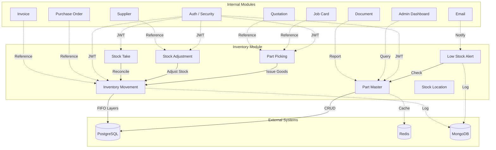

# Inventory Management Module — คู่มือการใช้งาน (Manual)

> **ภาษาไทย / English** – คู่มือฉบับสมบูรณ์ของโมดูลบริหารจัดการสินค้าคงคลัง (Inventory Management Module) สำหรับระบบ ICMS.

---

## สารบัญ (Table of Contents)

1. [Overview of Inventory Module](#1-overview-of-inventory-module)
2. [Module Structure (Directory Tree)](#2-module-structure-directory-tree)
3. [Database Tables](#3-database-tables)
4. [API Endpoints](#4-api-endpoints)
5. [Redis Cache Keys](#5-redis-cache-keys)
6. [Business Logic — FIFO Costing](#6-business-logic--fifo-costing)
7. [Batch Job — Low Stock Alert](#7-batch-job--low-stock-alert)
8. [Error Codes](#8-error-codes)
9. [Module Dependencies](#9-module-dependencies)

---

## 1. Overview of Inventory Module

### ภาพรวม (Thai)

โมดูลคลังสินค้า (Inventory Module) เป็นหัวใจหลักของระบบ ICMS สำหรับการจัดการอะไหล่และสินค้าคงคลังทั้งหมด ประกอบด้วย:

- **Part Master** — ข้อมูลหลักของอะไหล่ (รหัส, ชื่อ, ราคา, หมวดหมู่, ตำแหน่งจัดเก็บ)
- **Inventory Movement** — รับเข้า (Receive) / เบิกจ่าย (Issue) พร้อมบันทึกต้นทุนแบบ FIFO
- **Stock Adjustment** — ปรับปรุงสินค้าคงคลัง (เพิ่ม/ลด) กรณีสูญหาย, ชำรุด, หรือคืนซัพพลายเออร์
- **Stock Take** — ตรวจนับสินค้าจริงเทียบกับระบบ พร้อมบันทึกส่วนต่าง
- **Part Picking** — คำขอเบิกอะไหล่สำหรับ Job Card หรือ Quotation
- **Low Stock Alert** — แจ้งเตือนอัตโนมัติเมื่อสต็อกต่ำกว่า Reorder Level (รันทุกวัน 06:30)
- **Stock Location** — จัดการตำแหน่งจัดเก็บสินค้า (Zone / Shelf / Rack / Warehouse)

### Overview (English)

The Inventory Module is the core component of the ICMS for managing all spare parts and stock. It provides:

- **Part Master** — Master data for parts (code, name, price, category, location)
- **Inventory Movement** — Receive/Issue goods with FIFO costing
- **Stock Adjustment** — Adjust inventory for damage, loss, or supplier returns
- **Stock Take** — Physical count reconciliation against system records
- **Part Picking** — Picking requests linked to Job Cards or Quotations
- **Low Stock Alert** — Automated daily alerts (06:30 AM) when stock falls below reorder level
- **Stock Location** — Manage storage locations (Zone / Shelf / Rack / Warehouse)

---

## 2. Module Structure (Directory Tree)

```
src/main/java/com/icmon/module/inventory/
├── application/
│   ├── interfaces/
│   │   ├── InventoryAdjustmentService.java
│   │   ├── InventoryService.java
│   │   ├── PartMasterService.java
│   │   ├── PartPickingService.java
│   │   ├── StockAdjustmentService.java
│   │   ├── StockLocationService.java
│   │   ├── StockReportService.java
│   │   └── StocktakeService.java
│   ├── impl/
│   │   ├── InventoryAdjustmentServiceImpl.java
│   │   ├── InventoryServiceImpl.java
│   │   ├── PartMasterServiceImpl.java
│   │   ├── PartPickingServiceImpl.java
│   │   ├── StockAdjustmentServiceImpl.java
│   │   ├── StockLocationServiceImpl.java
│   │   ├── StockReportServiceImpl.java
│   │   └── StocktakeServiceImpl.java
│   └── usecase/
│       ├── CheckLowStockUseCase.java
│       ├── GenerateLowStockReportUseCase.java
│       ├── GeneratePartStockReportUseCase.java
│       ├── GenerateStockReportUseCase.java
│       ├── GenerateTransactionReportUseCase.java
│       ├── PickItemsUseCase.java
│       ├── ReceiveInventoryUseCase.java
│       ├── RecordTransactionUseCase.java
│       ├── SearchPartsUseCase.java
│       ├── SearchTransactionsUseCase.java
│       ├── UpdateLocationUseCase.java
│       ├── UpdatePartUseCase.java
│       └── UpdateStockQuantityUseCase.java
├── domain/
│   ├── enums/
│   │   ├── AdjustmentReason.java       // DAMAGE, LOST, RETURN, CORRECTION, OTHER
│   │   ├── AdjustmentType.java         // ADDITION, DEDUCTION, CORRECTION, WRITE_OFF, TRANSFER
│   │   ├── LocationType.java
│   │   ├── PartStatus.java             // ACTIVE, INACTIVE, DISCONTINUED, OUT_OF_STOCK, ON_ORDER
│   │   ├── PickingPriority.java        // LOW, NORMAL, HIGH, URGENT
│   │   ├── PickingStatus.java          // DRAFT, PENDING, PICKED, CONFIRMED, CANCELLED
│   │   ├── StocktakeStatus.java        // DRAFT, IN_PROGRESS, COMPLETED, CANCELLED
│   │   └── TransactionType.java        // RECEIVE, ISSUE, ADJUSTMENT, RETURN
│   ├── valueobjects/
│   │   ├── AdjustmentNo.java
│   │   ├── PartCode.java
│   │   ├── PickingNo.java
│   │   ├── ReorderLevel.java
│   │   ├── StockQuantity.java
│   │   ├── StocktakeNo.java
│   │   └── UnitCost.java
│   ├── Inventory.java
│   ├── InventoryAdjustmentDetail.java
│   ├── InventoryAdjustmentHeader.java
│   ├── MPartMaster.java
│   ├── MStockLocation.java
│   ├── PartMaster.java
│   ├── PartPickingDetail.java
│   ├── PartPickingRequest.java
│   ├── StockLocation.java
│   ├── StocktakeDetail.java
│   ├── StocktakeHeader.java
│   ├── TInventory.java
│   ├── TInventoryAdjustmentDetail.java
│   ├── TInventoryAdjustmentHeader.java
│   ├── TInventoryAlertHistory.java
│   ├── TInventoryLayer.java
│   ├── TPartPickingDetail.java
│   ├── TPartPickingRequest.java
│   ├── TStockTakeDetail.java
│   └── TStockTakeHeader.java
├── infrastructure/
│   ├── batch/
│   │   └── BatchLowStockAlertJob.java
│   ├── cache/
│   │   └── PartCacheService.java
│   ├── entity/
│   │   ├── InventoryAdjustmentDetailEntity.java
│   │   ├── InventoryAdjustmentHeaderEntity.java
│   │   ├── InventoryAlertEntity.java
│   │   ├── InventoryEntity.java
│   │   ├── InventoryLayerEntity.java
│   │   ├── PartMasterEntity.java
│   │   ├── PartPickingDetailEntity.java
│   │   ├── PartPickingRequestEntity.java
│   │   ├── StockAdjustmentDetailEntity.java
│   │   ├── StockAdjustmentHeaderEntity.java
│   │   ├── StockLocationEntity.java
│   │   ├── StocktakeDetailEntity.java
│   │   └── StocktakeHeaderEntity.java
│   ├── mapper/
│   │   ├── InventoryLayerMapper.java
│   │   ├── InventoryMapper.java
│   │   ├── PartMasterMapper.java
│   │   └── PartPickingMapper.java
│   └── repository/
│       ├── impl/
│       ├── InventoryAdjustmentDetailRepository.java
│       ├── InventoryAdjustmentHeaderRepository.java
│       ├── InventoryAlertRepository.java
│       ├── InventoryLayerRepository.java
│       ├── InventoryRepository.java
│       ├── PartMasterRepository.java
│       ├── PartPickingDetailRepository.java
│       ├── PartPickingRepository.java
│       ├── PartPickingRequestRepository.java
│       ├── StockAdjustmentRepository.java
│       ├── StockLocationRepository.java
│       ├── StocktakeDetailRepository.java
│       ├── StocktakeHeaderRepository.java
│       └── StockTakeRepository.java
└── presentation/
    ├── controller/
    │   ├── AdjustmentController.java
    │   ├── InventoryController.java
    │   ├── PartMasterController.java
    │   ├── PartPickingController.java
    │   ├── PartPickingPdfController.java
    │   ├── StockAdjustmentController.java
    │   ├── StockLocationController.java
    │   ├── StockReportController.java
    │   └── StocktakeController.java
    ├── dto/
    │   ├── request/
    │   │   ├── AdjustmentApproveRequestDTO.java
    │   │   ├── AdjustmentCreateRequestDTO.java
    │   │   ├── AdjustmentRequestDTO.java
    │   │   ├── InventoryIssueRequestDTO.java
    │   │   ├── InventoryReceiveRequestDTO.java
    │   │   ├── InventoryTransactionRequestDTO.java
    │   │   ├── PartCreateRequestDTO.java
    │   │   ├── PartMasterCreateRequestDTO.java
    │   │   ├── PartMasterUpdateRequestDTO.java
    │   │   ├── PartUpdateRequestDTO.java
    │   │   ├── PickingConfirmRequestDTO.java
    │   │   ├── PickingCreateRequestDTO.java
    │   │   ├── StockLocationCreateRequestDTO.java
    │   │   ├── StockLocationRequestDTO.java
    │   │   ├── StockLocationUpdateRequestDTO.java
    │   │   ├── StockTakeRequestDTO.java
    │   │   ├── StocktakeCreateRequestDTO.java
    │   │   └── StocktakeDetailRequestDTO.java
    │   └── response/
    │       ├── AdjustmentResponseDTO.java
    │       ├── InventoryResponseDTO.java
    │       ├── PartMasterResponseDTO.java
    │       ├── PartResponseDTO.java
    │       ├── PickingReportDTO.java
    │       ├── PickingResponseDTO.java
    │       ├── StockLocationResponseDTO.java
    │       ├── StockReportResponseDTO.java
    │       ├── StockSummaryDTO.java
    │       └── StocktakeResponseDTO.java
    └── validator/
        ├── CreateAdjustmentValidator.java
        ├── CreatePartValidator.java
        ├── CreatePickingValidator.java
        ├── InventoryValidator.java
        └── PartValidator.java
```

---

## 3. Database Tables

### 3.1 `m_part_master` — ข้อมูลอะไหล่หลัก (Part Master)

| Column | Type | Description |
|--------|------|-------------|
| `id` | UUID PK | Primary key |
| `part_code` | VARCHAR(50) UNIQUE | รหัสอะไหล่ / Part code |
| `part_name` | VARCHAR(200) | ชื่ออะไหล่ (ไทย) / Part name (Thai) |
| `part_name_en` | VARCHAR(200) | ชื่ออะไหล่ (อังกฤษ) / Part name (English) |
| `category_id` | UUID | หมวดหมู่ / Category |
| `brand` | VARCHAR(50) | ยี่ห้อ / Brand |
| `model` | VARCHAR(100) | รุ่น / Model |
| `oem_number` | VARCHAR(50) | เลข OEM / OEM number |
| `description` | TEXT | รายละเอียด / Description |
| `unit` | VARCHAR(20) | หน่วยนับ (PIECE / SET / LITER) |
| `reorder_level` | INTEGER | ระดับสต็อกที่ต้องสั่งซื้อ |
| `reorder_quantity` | INTEGER | จำนวนที่ต้องสั่งซื้อเมื่อถึงจุดสั่งซื้อ |
| `stock_quantity` | INTEGER | จำนวนสต็อกปัจจุบัน |
| `min_stock` | INTEGER | สต็อกขั้นต่ำ |
| `max_stock` | INTEGER | สต็อกสูงสุด |
| `unit_cost` | DECIMAL(15,2) | ต้นทุนต่อหน่วย |
| `selling_price` | DECIMAL(15,2) | ราคาขาย |
| `location_id` | UUID FK → `m_stock_location` | ตำแหน่งจัดเก็บ |
| `status` | VARCHAR(20) | สถานะ (ACTIVE / INACTIVE / DISCONTINUED / OUT_OF_STOCK / ON_ORDER) |
| `image_url` | TEXT | URL รูปภาพ |
| `notes` | TEXT | หมายเหตุ |
| `last_updated_stock` | TIMESTAMP | วันที่อัปเดตสต็อกล่าสุด |
| `created_at` | TIMESTAMP | วันที่สร้าง |
| `updated_at` | TIMESTAMP | วันที่แก้ไขล่าสุด |
| `deleted_at` | TIMESTAMP | วันที่ลบ (soft delete) |
| `deleted` | BOOLEAN | สถานะลบ |
| `user_id` | UUID | ผู้สร้าง |
| `whitelabel_id` | UUID | White-label identifier |

**Indexes:** `part_code`, `part_name`, `category_id`, `brand`, `oem_number`, `location_id`, `status`, `whitelabel_id`, `deleted`

---

### 3.2 `m_stock_location` — ตำแหน่งจัดเก็บสินค้า (Stock Location)

| Column | Type | Description |
|--------|------|-------------|
| `id` | UUID PK | Primary key |
| `location_code` | VARCHAR(20) UNIQUE | รหัสตำแหน่ง (เช่น A-01, B-03) |
| `location_name` | VARCHAR(100) | ชื่อตำแหน่ง |
| `location_type` | VARCHAR(20) | ประเภท (SHELF / RACK / WAREHOUSE) |
| `zone` | VARCHAR(50) | โซน |
| `capacity` | INTEGER | ความจุสูงสุด |
| `current_usage` | INTEGER | การใช้งานปัจจุบัน |
| `is_active` | BOOLEAN | เปิดใช้งาน |
| `notes` | TEXT | หมายเหตุ |
| `created_at` | TIMESTAMP | วันที่สร้าง |
| `updated_at` | TIMESTAMP | วันที่แก้ไข |
| `user_id` | UUID | ผู้สร้าง |
| `whitelabel_id` | UUID | White-label identifier |

**Indexes:** `location_code`, `zone`

---

### 3.3 `t_inventory` — ประวัติการเคลื่อนไหวสินค้า (Inventory Movement)

| Column | Type | Description |
|--------|------|-------------|
| `id` | UUID PK | Primary key |
| `part_id` | UUID FK → `m_part_master` | อะไหล่ |
| `transaction_type` | VARCHAR(20) | ประเภท (RECEIVE / ISSUE / ADJUSTMENT / RETURN) |
| `reference_type` | VARCHAR(30) | ประเภทเอกสารอ้างอิง (PO / JOB / ADJUSTMENT / STOCK_TAKE) |
| `reference_id` | UUID | ID เอกสารอ้างอิง |
| `quantity` | INTEGER | จำนวน (+ = เพิ่ม, - = ลด) |
| `previous_quantity` | INTEGER | จำนวนก่อนเคลื่อนไหว |
| `new_quantity` | INTEGER | จำนวนหลังเคลื่อนไหว |
| `unit_cost` | DECIMAL(15,2) | ต้นทุนต่อหน่วย ณ เวลานั้น |
| `total_cost` | DECIMAL(15,2) | ต้นทุนรวม |
| `transaction_date` | TIMESTAMP | วันที่ทำรายการ |
| `note` | TEXT | หมายเหตุ |
| `performed_by` | UUID | ผู้ทำรายการ |
| `created_at` | TIMESTAMP | วันที่สร้าง |
| `whitelabel_id` | UUID | White-label identifier |

**Indexes:** `part_id`, `transaction_type`, `reference_type+reference_id`, `transaction_date`, `whitelabel_id`

---

### 3.4 `t_inventory_adjustment_header` — หัวการปรับปรุงสต็อก (Stock Adjustment Header)

| Column | Type | Description |
|--------|------|-------------|
| `id` | UUID PK | Primary key |
| `adjustment_no` | VARCHAR(20) UNIQUE | เลขที่เอกสาร (ADJ-YYYY-NNNN, auto) |
| `adjustment_date` | TIMESTAMP | วันที่ปรับปรุง |
| `adjustment_type` | VARCHAR(20) | ประเภท (INCREASE / DECREASE) |
| `reason` | VARCHAR(50) | เหตุผล (DAMAGE / LOST / RETURN / CORRECTION / OTHER) |
| `status` | VARCHAR(20) | สถานะ (DRAFT / APPROVED / CANCELLED) |
| `description` | TEXT | คำอธิบาย |
| `approved_by` | UUID | ผู้อนุมัติ |
| `approved_at` | TIMESTAMP | วันที่อนุมัติ |
| `total_adjustment_value` | DECIMAL(15,2) | มูลค่ารวม |
| `created_at` | TIMESTAMP | วันที่สร้าง |
| `updated_at` | TIMESTAMP | วันที่แก้ไข |
| `user_id` | UUID | ผู้สร้าง |
| `whitelabel_id` | UUID | White-label identifier |

**Indexes:** `adjustment_no`, `status`

**Trigger:** `generate_adjustment_no()` — สร้างเลขที่ `ADJ-YYYY-NNNN` อัตโนมัติ

---

### 3.5 `t_inventory_adjustment_detail` — รายละเอียดการปรับปรุงสต็อก (Adjustment Detail)

| Column | Type | Description |
|--------|------|-------------|
| `id` | UUID PK | Primary key |
| `adjustment_header_id` | UUID FK → header | หัวเอกสารปรับปรุง |
| `part_id` | UUID FK → `m_part_master` | อะไหล่ |
| `quantity` | INTEGER | จำนวน |
| `unit_cost` | DECIMAL(15,2) | ต้นทุนต่อหน่วย |
| `total_cost` | DECIMAL(15,2) | ต้นทุนรวม |
| `note` | TEXT | หมายเหตุ |
| `created_at` | TIMESTAMP | วันที่สร้าง |
| `user_id` | UUID | ผู้สร้าง |
| `whitelabel_id` | UUID | White-label identifier |

**Indexes:** `adjustment_header_id`, `part_id`

---

### 3.6 `t_stocktake_header` — หัวการตรวจนับสต็อก (Stock Take Header)

| Column | Type | Description |
|--------|------|-------------|
| `id` | UUID PK | Primary key |
| `stocktake_no` | VARCHAR(20) UNIQUE | เลขที่เอกสาร (ST-YYYY-NNNN, auto) |
| `stocktake_date` | TIMESTAMP | วันที่ตรวจนับ |
| `status` | VARCHAR(20) | สถานะ (DRAFT / IN_PROGRESS / COMPLETED / CANCELLED) |
| `started_by` | UUID | ผู้เริ่มตรวจนับ |
| `started_at` | TIMESTAMP | วันที่เริ่ม |
| `completed_by` | UUID | ผู้สรุปผล |
| `completed_at` | TIMESTAMP | วันที่สรุป |
| `total_discrepancy` | INTEGER | ส่วนต่างรวม |
| `notes` | TEXT | หมายเหตุ |
| `created_at` | TIMESTAMP | วันที่สร้าง |
| `updated_at` | TIMESTAMP | วันที่แก้ไข |
| `user_id` | UUID | ผู้สร้าง |
| `whitelabel_id` | UUID | White-label identifier |

**Indexes:** `status`

**Trigger:** `generate_stocktake_no()` — สร้างเลขที่ `ST-YYYY-NNNN` อัตโนมัติ

---

### 3.7 `t_stocktake_detail` — รายละเอียดการตรวจนับ (Stock Take Detail)

| Column | Type | Description |
|--------|------|-------------|
| `id` | UUID PK | Primary key |
| `stocktake_header_id` | UUID FK → header | หัวเอกสารตรวจนับ |
| `part_id` | UUID FK → `m_part_master` | อะไหล่ |
| `system_quantity` | INTEGER | จำนวนในระบบ |
| `counted_quantity` | INTEGER | จำนวนที่นับได้จริง |
| `discrepancy` | INTEGER GENERATED | ส่วนต่าง (`counted_quantity - system_quantity`, auto) |
| `note` | TEXT | หมายเหตุ |
| `counted_by` | UUID | ผู้นับ |
| `counted_at` | TIMESTAMP | วันที่นับ |
| `created_at` | TIMESTAMP | วันที่สร้าง |
| `user_id` | UUID | ผู้สร้าง |
| `whitelabel_id` | UUID | White-label identifier |

**Indexes:** `stocktake_header_id`, `part_id`

---

### 3.8 `t_part_picking_request` — คำขอเบิกอะไหล่ (Part Picking Request)

| Column | Type | Description |
|--------|------|-------------|
| `id` | UUID PK | Primary key |
| `picking_no` | VARCHAR(20) UNIQUE | เลขที่เอกสาร (PK-YYYY-NNNN, auto) |
| `job_id` | UUID | Job ที่เกี่ยวข้อง |
| `quotation_id` | UUID | Quotation ที่เกี่ยวข้อง |
| `requested_date` | TIMESTAMP | วันที่ขอเบิก |
| `requested_by` | UUID | ผู้ขอเบิก |
| `status` | VARCHAR(20) | สถานะ (DRAFT / PENDING / PICKED / CONFIRMED / CANCELLED) |
| `priority` | VARCHAR(20) | ความสำคัญ (LOW / NORMAL / HIGH / URGENT) |
| `notes` | TEXT | หมายเหตุ |
| `picked_by` | UUID | ผู้หยิบสินค้า |
| `picked_date` | TIMESTAMP | วันที่หยิบ |
| `confirmed_by` | UUID | ผู้อนุมัติ |
| `confirmed_date` | TIMESTAMP | วันที่อนุมัติ |
| `created_at` | TIMESTAMP | วันที่สร้าง |
| `updated_at` | TIMESTAMP | วันที่แก้ไข |
| `whitelabel_id` | UUID | White-label identifier |

**Indexes:** `job_id`, `quotation_id`, `status`

**Trigger:** `generate_picking_no()` — สร้างเลขที่ `PK-YYYY-NNNN` อัตโนมัติ

---

### 3.9 `t_part_picking_detail` — รายละเอียดการเบิก (Picking Detail)

| Column | Type | Description |
|--------|------|-------------|
| `id` | UUID PK | Primary key |
| `picking_request_id` | UUID FK → request | หัวเอกสารเบิก |
| `part_id` | UUID FK → `m_part_master` | อะไหล่ |
| `requested_quantity` | INTEGER | จำนวนที่ขอเบิก |
| `picked_quantity` | INTEGER | จำนวนที่หยิบจริง |
| `unit_price` | DECIMAL(15,2) | ราคาต่อหน่วย |
| `total_price` | DECIMAL(15,2) | ราคารวม |
| `note` | TEXT | หมายเหตุ |
| `created_at` | TIMESTAMP | วันที่สร้าง |
| `user_id` | UUID | ผู้สร้าง |
| `whitelabel_id` | UUID | White-label identifier |

**Indexes:** `picking_request_id`, `part_id`

---

### 3.10 `t_inventory_layer` — ชั้นต้นทุน FIFO (FIFO Cost Layer)

| Column | Type | Description |
|--------|------|-------------|
| `id` | UUID PK | Primary key |
| `part_id` | UUID FK → `m_part_master` | อะไหล่ |
| `quantity` | INTEGER | จำนวนใน Layer นี้ |
| `unit_cost` | DECIMAL(15,2) | ต้นทุนต่อหน่วยของ Layer นี้ |
| `received_date` | TIMESTAMP | วันที่รับเข้า |
| `reference_type` | VARCHAR(30) | ประเภทเอกสารอ้างอิง |
| `reference_id` | UUID | ID เอกสารอ้างอิง |
| `is_active` | BOOLEAN | เปิดใช้งาน (TRUE = ยังมีสต็อกใน Layer นี้) |
| `created_at` | TIMESTAMP | วันที่สร้าง |
| `updated_at` | TIMESTAMP | วันที่แก้ไข |
| `whitelabel_id` | UUID | White-label identifier |

**Indexes:** `part_id`, `received_date`

---

### 3.11 `t_inventory_alert_history` — ประวัติการแจ้งเตือนสต็อกต่ำ (Low Stock Alert History)

| Column | Type | Description |
|--------|------|-------------|
| `id` | UUID PK | Primary key |
| `alert_date` | DATE | วันที่แจ้งเตือน |
| `part_id` | UUID FK → `m_part_master` | อะไหล่ |
| `part_code` | VARCHAR(50) | รหัสอะไหล่ |
| `part_name` | VARCHAR(200) | ชื่ออะไหล่ |
| `current_stock` | INTEGER | สต็อกปัจจุบัน |
| `reorder_level` | INTEGER | ระดับที่ต้องสั่งซื้อ |
| `reorder_quantity` | INTEGER | จำนวนที่ต้องสั่งซื้อ |
| `alert_sent` | BOOLEAN | ส่งการแจ้งเตือนแล้ว |
| `alert_sent_at` | TIMESTAMP | วันที่ส่ง |
| `resolved` | BOOLEAN | แก้ไขแล้ว |
| `resolved_at` | TIMESTAMP | วันที่แก้ไข |
| `note` | TEXT | หมายเหตุ |
| `whitelabel_id` | UUID | White-label identifier |

**Indexes:** `alert_date`, `part_id`

---

## 4. API Endpoints

### 4.1 Part Master CRUD

#### `POST /api/v1/parts`

**สร้างอะไหล่ใหม่ / Create a new part**

> **Rate Limit:** 20 requests per 60 seconds

**Request Body:**
```json
{
  "partCode": "OIL-001",
  "partName": "น้ำมันเครื่อง 5W-30",
  "partNameEn": "Engine Oil 5W-30",
  "categoryId": "3fa85f64-5717-4562-b3fc-2c963f66afa6",
  "brand": "Castrol",
  "model": "Passenger Car",
  "oemNumber": "OEM-12345",
  "description": "น้ำมันเครื่องสังเคราะห์ 5W-30",
  "unit": "LITER",
  "reorderLevel": 10,
  "reorderQuantity": 20,
  "minStock": 5,
  "maxStock": 100,
  "unitCost": 120.00,
  "sellingPrice": 250.00,
  "locationId": "a0000001-0000-0000-0000-000000000001"
}
```

**Response (201 Created):**
```json
{
  "id": "b0000001-0000-0000-0000-000000000001",
  "partCode": "OIL-001",
  "partName": "น้ำมันเครื่อง 5W-30",
  "partNameEn": "Engine Oil 5W-30",
  "categoryId": "3fa85f64-5717-4562-b3fc-2c963f66afa6",
  "brand": "Castrol",
  "model": "Passenger Car",
  "oemNumber": "OEM-12345",
  "description": "น้ำมันเครื่องสังเคราะห์ 5W-30",
  "unit": "LITER",
  "reorderLevel": 10,
  "reorderQuantity": 20,
  "stockQuantity": 0,
  "minStock": 5,
  "maxStock": 100,
  "unitCost": 120.00,
  "sellingPrice": 250.00,
  "locationId": "a0000001-0000-0000-0000-000000000001",
  "status": "ACTIVE",
  "lastUpdatedStock": null
}
```

**cURL:**
```bash
curl -X POST "http://localhost:5000/api/v1/parts" \
  -H "Authorization: Bearer <token>" \
  -H "Content-Type: application/json" \
  -d '{
    "partCode": "OIL-001",
    "partName": "น้ำมันเครื่อง 5W-30",
    "partNameEn": "Engine Oil 5W-30",
    "brand": "Castrol",
    "unit":"LITER",
    "reorderLevel": 10,
    "reorderQuantity": 20,
    "unitCost": 120.00,
    "sellingPrice": 250.00
  }'
```

---

#### `GET /api/v1/parts`

**รายการอะไหล่ทั้งหมด (แบ่งหน้า) / Get paginated list of parts**

> **Rate Limit:** 100 requests per 60 seconds

**Query Parameters:** `page` (default=0), `size` (default=20)

**Response (200 OK):**
```json
{
  "content": [
    {
      "id": "b0000001-0000-0000-0000-000000000001",
      "partCode": "OIL-001",
      "partName": "น้ำมันเครื่อง 5W-30",
      "stockQuantity": 50,
      "unitCost": 120.00,
      "sellingPrice": 250.00,
      "status": "ACTIVE"
    }
  ],
  "totalElements": 1,
  "totalPages": 1,
  "number": 0,
  "size": 20
}
```

**cURL:**
```bash
curl -X GET "http://localhost:5000/api/v1/parts?page=0&size=20" \
  -H "Authorization: Bearer <token>"
```

---

#### `GET /api/v1/parts/{id}`

**ดูอะไหล่ตาม ID / Get part by ID**

> **Rate Limit:** 100 requests per 60 seconds

**Response (200 OK):**
```json
{
  "id": "b0000001-0000-0000-0000-000000000001",
  "partCode": "OIL-001",
  "partName": "น้ำมันเครื่อง 5W-30",
  "partNameEn": "Engine Oil 5W-30",
  "stockQuantity": 50,
  "unitCost": 120.00,
  "sellingPrice": 250.00,
  "status": "ACTIVE"
}
```

**cURL:**
```bash
curl -X GET "http://localhost:5000/api/v1/parts/b0000001-0000-0000-0000-000000000001" \
  -H "Authorization: Bearer <token>"
```

---

#### `GET /api/v1/parts/code/{code}`

**ค้นหาอะไหล่ด้วยรหัส / Get part by part code**

> **Rate Limit:** 80 requests per 60 seconds

**Response (200 OK):**
```json
{
  "id": "b0000001-0000-0000-0000-000000000001",
  "partCode": "OIL-001",
  "partName": "น้ำมันเครื่อง 5W-30",
  "stockQuantity": 50,
  "status": "ACTIVE"
}
```

**cURL:**
```bash
curl -X GET "http://localhost:5000/api/v1/parts/code/OIL-001" \
  -H "Authorization: Bearer <token>"
```

---

#### `PUT /api/v1/parts/{id}`

**แก้ไขอะไหล่ / Update part information**

> **Rate Limit:** 15 requests per 60 seconds

**Request Body:**
```json
{
  "partName": "น้ำมันเครื่อง 5W-30 Fully Synthetic",
  "partNameEn": "Engine Oil 5W-30 Fully Synthetic",
  "brand": "Castrol",
  "model": "Passenger Car",
  "unitCost": 130.00,
  "sellingPrice": 280.00,
  "reorderLevel": 8,
  "reorderQuantity": 25,
  "minStock": 5,
  "maxStock": 120,
  "status": "ACTIVE",
  "locationId": "a0000001-0000-0000-0000-000000000002"
}
```

**Response (200 OK):**
```json
{
  "id": "b0000001-0000-0000-0000-000000000001",
  "partCode": "OIL-001",
  "partName": "น้ำมันเครื่อง 5W-30 Fully Synthetic",
  "partNameEn": "Engine Oil 5W-30 Fully Synthetic",
  "unitCost": 130.00,
  "sellingPrice": 280.00,
  "status": "ACTIVE"
}
```

**cURL:**
```bash
curl -X PUT "http://localhost:5000/api/v1/parts/b0000001-0000-0000-0000-000000000001" \
  -H "Authorization: Bearer <token>" \
  -H "Content-Type: application/json" \
  -d '{
    "partName": "น้ำมันเครื่อง 5W-30 Fully Synthetic",
    "unitCost": 130.00,
    "sellingPrice": 280.00
  }'
```

---

#### `DELETE /api/v1/parts/{id}`

**ลบอะไหล่ (soft delete) / Soft delete a part**

> **Rate Limit:** 10 requests per 3600 seconds (1 hour)

**Response (204 No Content)**

**cURL:**
```bash
curl -X DELETE "http://localhost:5000/api/v1/parts/b0000001-0000-0000-0000-000000000001" \
  -H "Authorization: Bearer <token>"
```

---

#### `GET /api/v1/parts/low-stock`

**สินค้าต่ำกว่าเกณฑ์ / Get list of low stock parts**

> **Rate Limit:** 30 requests per 60 seconds

**Query Parameters:** `page` (default=0), `size` (default=20)

**Response (200 OK):**
```json
{
  "content": [
    {
      "id": "b0000001-0000-0000-0000-000000000002",
      "partCode": "OIL-002",
      "partName": "น้ำมันเครื่อง 10W-40",
      "stockQuantity": 3,
      "reorderLevel": 10,
      "reorderQuantity": 20,
      "status": "ACTIVE"
    }
  ],
  "totalElements": 1,
  "totalPages": 1,
  "number": 0,
  "size": 20
}
```

**cURL:**
```bash
curl -X GET "http://localhost:5000/api/v1/parts/low-stock?page=0&size=20" \
  -H "Authorization: Bearer <token>"
```

---

### 4.2 Receive Goods

#### `POST /api/v1/inventory/receive`

**รับสินค้าเข้า / Receive goods into inventory**

> **Rate Limit:** 20 requests per 60 seconds

**Request Body:**
```json
{
  "partId": "b0000001-0000-0000-0000-000000000001",
  "quantity": 50,
  "unitCost": 120.00,
  "referenceType": "PO",
  "referenceId": "3fa85f64-5717-4562-b3fc-2c963f66afa6",
  "note": "รับสินค้าตาม PO-2025-0001"
}
```

**Response (201 Created):**
```json
{
  "id": "c0000001-0000-0000-0000-000000000001",
  "partId": "b0000001-0000-0000-0000-000000000001",
  "partCode": "OIL-001",
  "partName": "น้ำมันเครื่อง 5W-30",
  "transactionType": "RECEIVE",
  "referenceType": "PO",
  "referenceId": "3fa85f64-5717-4562-b3fc-2c963f66afa6",
  "quantity": 50,
  "previousQuantity": 0,
  "newQuantity": 50,
  "unitCost": 120.00,
  "totalCost": 6000.00,
  "transactionDate": "2025-07-06T10:30:00",
  "note": "รับสินค้าตาม PO-2025-0001"
}
```

**cURL:**
```bash
curl -X POST "http://localhost:5000/api/v1/inventory/receive" \
  -H "Authorization: Bearer <token>" \
  -H "Content-Type: application/json" \
  -d '{
    "partId": "b0000001-0000-0000-0000-000000000001",
    "quantity": 50,
    "unitCost": 120.00,
    "referenceType": "PO",
    "note": "รับสินค้าตาม PO-2025-0001"
  }'
```

---

### 4.3 Issue Goods

#### `POST /api/v1/inventory/issue`

**เบิกจ่ายสินค้า / Issue goods from inventory**

> **Rate Limit:** 30 requests per 60 seconds

> **Business Logic:** Uses FIFO costing — deducts from oldest cost layers first.

**Request Body:**
```json
{
  "partId": "b0000001-0000-0000-0000-000000000001",
  "quantity": 10,
  "referenceType": "JOB",
  "referenceId": "3fa85f64-5717-4562-b3fc-2c963f66afa6",
  "note": "เบิกจ่ายสำหรับ Job-2025-0001"
}
```

**Response (200 OK):**
```json
{
  "id": "c0000001-0000-0000-0000-000000000002",
  "partId": "b0000001-0000-0000-0000-000000000001",
  "partCode": "OIL-001",
  "partName": "น้ำมันเครื่อง 5W-30",
  "transactionType": "ISSUE",
  "referenceType": "JOB",
  "referenceId": "3fa85f64-5717-4562-b3fc-2c963f66afa6",
  "quantity": -10,
  "previousQuantity": 50,
  "newQuantity": 40,
  "unitCost": 120.00,
  "totalCost": 1200.00,
  "transactionDate": "2025-07-06T11:00:00",
  "note": "เบิกจ่ายสำหรับ Job-2025-0001"
}
```

**cURL:**
```bash
curl -X POST "http://localhost:5000/api/v1/inventory/issue" \
  -H "Authorization: Bearer <token>" \
  -H "Content-Type: application/json" \
  -d '{
    "partId": "b0000001-0000-0000-0000-000000000001",
    "quantity": 10,
    "referenceType": "JOB",
    "note": "เบิกจ่ายสำหรับ Job-2025-0001"
  }'
```

---

### 4.4 Movement History

#### `GET /api/v1/inventory/part/{partId}`

**ประวัติการเคลื่อนไหวของอะไหล่ / Get inventory movement history by part ID**

> **Rate Limit:** 50 requests per 60 seconds

**Response (200 OK):**
```json
[
  {
    "id": "c0000001-0000-0000-0000-000000000001",
    "partId": "b0000001-0000-0000-0000-000000000001",
    "partCode": "OIL-001",
    "partName": "น้ำมันเครื่อง 5W-30",
    "transactionType": "RECEIVE",
    "referenceType": "PO",
    "quantity": 50,
    "previousQuantity": 0,
    "newQuantity": 50,
    "unitCost": 120.00,
    "totalCost": 6000.00,
    "transactionDate": "2025-07-06T10:30:00",
    "note": "รับสินค้าตาม PO-2025-0001"
  },
  {
    "id": "c0000001-0000-0000-0000-000000000002",
    "partId": "b0000001-0000-0000-0000-000000000001",
    "transactionType": "ISSUE",
    "quantity": -10,
    "previousQuantity": 50,
    "newQuantity": 40,
    "unitCost": 120.00,
    "totalCost": 1200.00,
    "transactionDate": "2025-07-06T11:00:00"
  }
]
```

**cURL:**
```bash
curl -X GET "http://localhost:5000/api/v1/inventory/part/b0000001-0000-0000-0000-000000000001" \
  -H "Authorization: Bearer <token>"
```

---

### 4.5 Part Picking CRUD + Confirm

#### `POST /api/v1/part-picking`

**สร้างคำขอเบิกอะไหล่ / Create a part picking request**

> **Rate Limit:** 30 requests per 60 seconds

**Request Body:**
```json
{
  "jobId": "3fa85f64-5717-4562-b3fc-2c963f66afa6",
  "quotationId": null,
  "priority": "NORMAL",
  "notes": "เบิกอะไหล่สำหรับซ่อมรถ Toyota Corolla",
  "items": [
    {
      "partId": "b0000001-0000-0000-0000-000000000001",
      "quantity": 4,
      "unitPrice": 250.00
    },
    {
      "partId": "b0000001-0000-0000-0000-000000000003",
      "quantity": 1,
      "unitPrice": 180.00
    }
  ]
}
```

**Response (201 Created):**
```json
{
  "id": "e0000001-0000-0000-0000-000000000001",
  "pickingNo": "PK-2025-0001",
  "jobId": "3fa85f64-5717-4562-b3fc-2c963f66afa6",
  "quotationId": null,
  "requestedDate": "2025-07-06T11:30:00",
  "status": "DRAFT",
  "priority": "NORMAL",
  "notes": "เบิกอะไหล่สำหรับซ่อมรถ Toyota Corolla",
  "items": [
    {
      "id": "f0000001-0000-0000-0000-000000000001",
      "partId": "b0000001-0000-0000-0000-000000000001",
      "requestedQuantity": 4,
      "pickedQuantity": 0,
      "unitPrice": 250.00
    },
    {
      "id": "f0000001-0000-0000-0000-000000000002",
      "partId": "b0000001-0000-0000-0000-000000000003",
      "requestedQuantity": 1,
      "pickedQuantity": 0,
      "unitPrice": 180.00
    }
  ]
}
```

**cURL:**
```bash
curl -X POST "http://localhost:5000/api/v1/part-picking" \
  -H "Authorization: Bearer <token>" \
  -H "Content-Type: application/json" \
  -d '{
    "jobId": "3fa85f64-5717-4562-b3fc-2c963f66afa6",
    "priority": "NORMAL",
    "notes": "เบิกอะไหล่",
    "items": [
      {"partId": "b0000001-0000-0000-0000-000000000001", "quantity": 4, "unitPrice": 250.00}
    ]
  }'
```

---

#### `GET /api/v1/part-picking/{id}`

**ดูคำขอเบิกอะไหล่ตาม ID / Get picking request by ID**

> **Rate Limit:** 60 requests per 60 seconds

**Response (200 OK):** (same structure as create response)

**cURL:**
```bash
curl -X GET "http://localhost:5000/api/v1/part-picking/e0000001-0000-0000-0000-000000000001" \
  -H "Authorization: Bearer <token>"
```

---

#### `PUT /api/v1/part-picking/{id}/confirm`

**ยืนยันการเบิกอะไหล่ / Confirm a picking request**

> **Rate Limit:** 20 requests per 60 seconds

> **Note:** This endpoint issues goods from inventory using FIFO.

**Response (200 OK):**
```json
{
  "id": "e0000001-0000-0000-0000-000000000001",
  "pickingNo": "PK-2025-0001",
  "status": "CONFIRMED",
  "items": [
    {
      "id": "f0000001-0000-0000-0000-000000000001",
      "partId": "b0000001-0000-0000-0000-000000000001",
      "requestedQuantity": 4,
      "pickedQuantity": 4,
      "unitPrice": 250.00
    }
  ]
}
```

**cURL:**
```bash
curl -X PUT "http://localhost:5000/api/v1/part-picking/e0000001-0000-0000-0000-000000000001/confirm" \
  -H "Authorization: Bearer <token>"
```

---

#### `GET /api/v1/part-picking/job/{jobId}`

**ดึงคำขอเบิกตาม Job ID / Get picking requests by job ID**

> **Rate Limit:** 60 requests per 60 seconds

**cURL:**
```bash
curl -X GET "http://localhost:5000/api/v1/part-picking/job/3fa85f64-5717-4562-b3fc-2c963f66afa6" \
  -H "Authorization: Bearer <token>"
```

---

### 4.6 Picking PDF

#### `GET /api/v1/part-picking/{id}/pdf`

**สร้าง PDF เอกสารเบิกอะไหล่ / Generate picking document as PDF**

> **Rate Limit:** 15 requests per 300 seconds (5 minutes)

**Response (200 OK):** Binary PDF data

**Headers:**
```
Content-Type: application/pdf
Content-Disposition: inline; filename=picking_{id}.pdf
```

**cURL:**
```bash
curl -X GET "http://localhost:5000/api/v1/part-picking/e0000001-0000-0000-0000-000000000001/pdf" \
  -H "Authorization: Bearer <token>" \
  -o picking_document.pdf
```

---

### 4.7 Stock Adjustment Create + Approve

#### `POST /api/v1/stock-adjustments`

**สร้างปรับปรุงสต็อก / Create a stock adjustment**

> **Rate Limit:** 10 requests per 60 seconds

**Request Body:**
```json
{
  "partId": "b0000001-0000-0000-0000-000000000001",
  "quantity": -5,
  "unitCost": 120.00,
  "reason": "DAMAGE",
  "description": "น้ำมันเครื่องรั่วระหว่างขนส่ง จำนวน 5 ลิตร"
}
```

**Response (201 Created):**
```json
{
  "id": "g0000001-0000-0000-0000-000000000001",
  "adjustmentNo": "ADJ-2025-0001",
  "adjustmentDate": "2025-07-06T12:00:00",
  "adjustmentType": "DECREASE",
  "reason": "DAMAGE",
  "status": "DRAFT",
  "description": "น้ำมันเครื่องรั่วระหว่างขนส่ง จำนวน 5 ลิตร",
  "totalAdjustmentValue": 600.00
}
```

**cURL:**
```bash
curl -X POST "http://localhost:5000/api/v1/stock-adjustments" \
  -H "Authorization: Bearer <token>" \
  -H "Content-Type: application/json" \
  -d '{
    "partId": "b0000001-0000-0000-0000-000000000001",
    "quantity": -5,
    "unitCost": 120.00,
    "reason": "DAMAGE",
    "description": "ของเสียหาย 5 ชิ้น"
  }'
```

---

#### `PUT /api/v1/stock-adjustments/{id}/approve`

**อนุมัติปรับปรุงสต็อก / Approve a stock adjustment**

> **Rate Limit:** 10 requests per 60 seconds

**Response (200 OK):**
```json
{
  "id": "g0000001-0000-0000-0000-000000000001",
  "adjustmentNo": "ADJ-2025-0001",
  "status": "APPROVED",
  "adjustmentType": "DECREASE",
  "reason": "DAMAGE",
  "totalAdjustmentValue": 600.00
}
```

**cURL:**
```bash
curl -X PUT "http://localhost:5000/api/v1/stock-adjustments/g0000001-0000-0000-0000-000000000001/approve" \
  -H "Authorization: Bearer <token>"
```

---

### 4.8 Stock Take Create + Complete

#### `POST /api/v1/stock-takes`

**เริ่มตรวจนับสต็อก / Create a stock take**

> **Rate Limit:** 5 requests per 3600 seconds (1 hour)

**Request Body:**
```json
{
  "notes": "ตรวจนับสต็อกประจำเดือน กรกฎาคม 2025",
  "partId": "b0000001-0000-0000-0000-000000000001",
  "countedQuantity": 48
}
```

**Response (201 Created):**
```json
{
  "id": "h0000001-0000-0000-0000-000000000001",
  "stocktakeNo": "ST-2025-0001",
  "stocktakeDate": "2025-07-06T13:00:00",
  "status": "DRAFT",
  "startedBy": "00000000-0000-0000-0000-000000000001",
  "startedAt": "2025-07-06T13:00:00",
  "completedBy": null,
  "completedAt": null,
  "totalDiscrepancy": 0,
  "notes": "ตรวจนับสต็อกประจำเดือน กรกฎาคม 2025"
}
```

**cURL:**
```bash
curl -X POST "http://localhost:5000/api/v1/stock-takes" \
  -H "Authorization: Bearer <token>" \
  -H "Content-Type: application/json" \
  -d '{
    "notes": "ตรวจนับสต็อกประจำเดือน",
    "partId": "b0000001-0000-0000-0000-000000000001",
    "countedQuantity": 48
  }'
```

---

#### `PUT /api/v1/stock-takes/{id}/complete`

**สรุปการตรวจนับ / Complete a stock take**

> **Rate Limit:** 5 requests per 3600 seconds (1 hour)

**Response (200 OK):**
```json
{
  "id": "h0000001-0000-0000-0000-000000000001",
  "stocktakeNo": "ST-2025-0001",
  "status": "COMPLETED",
  "startedBy": "00000000-0000-0000-0000-000000000001",
  "startedAt": "2025-07-06T13:00:00",
  "completedBy": "00000000-0000-0000-0000-000000000001",
  "completedAt": "2025-07-06T14:00:00",
  "totalDiscrepancy": -2,
  "notes": "ตรวจนับสต็อกประจำเดือน กรกฎาคม 2025"
}
```

**cURL:**
```bash
curl -X PUT "http://localhost:5000/api/v1/stock-takes/h0000001-0000-0000-0000-000000000001/complete" \
  -H "Authorization: Bearer <token>"
```

---

### 4.9 Stock Location List + Create

#### `GET /api/v1/stock-locations`

**รายการตำแหน่งจัดเก็บทั้งหมด / Get all stock locations**

> **Rate Limit:** 30 requests per 60 seconds

**Response (200 OK):**
```json
[
  {
    "id": "a0000001-0000-0000-0000-000000000001",
    "locationCode": "A-01",
    "locationName": "ชั้นวาง A-01",
    "locationType": "SHELF",
    "zone": "Zone A",
    "capacity": 500,
    "currentUsage": 50,
    "isActive": true
  },
  {
    "id": "a0000001-0000-0000-0000-000000000003",
    "locationCode": "B-01",
    "locationName": "ชั้นวาง B-01",
    "locationType": "RACK",
    "zone": "Zone B",
    "capacity": 1000,
    "currentUsage": 23,
    "isActive": true
  }
]
```

**cURL:**
```bash
curl -X GET "http://localhost:5000/api/v1/stock-locations" \
  -H "Authorization: Bearer <token>"
```

---

#### `POST /api/v1/stock-locations`

**เพิ่มตำแหน่งจัดเก็บใหม่ / Create a new stock location**

> **Rate Limit:** 10 requests per 60 seconds

**Request Body:**
```json
{
  "locationCode": "C-01",
  "locationName": "ชั้นวาง C-01",
  "locationType": "SHELF",
  "zone": "Zone C",
  "capacity": 300
}
```

**Response (201 Created):**
```json
{
  "id": "a0000001-0000-0000-0000-000000000006",
  "locationCode": "C-01",
  "locationName": "ชั้นวาง C-01",
  "locationType": "SHELF",
  "zone": "Zone C",
  "capacity": 300,
  "currentUsage": 0,
  "isActive": true
}
```

**cURL:**
```bash
curl -X POST "http://localhost:5000/api/v1/stock-locations" \
  -H "Authorization: Bearer <token>" \
  -H "Content-Type: application/json" \
  -d '{
    "locationCode": "C-01",
    "locationName": "ชั้นวาง C-01",
    "locationType": "SHELF",
    "zone": "Zone C",
    "capacity": 300
  }'
```

---

### 4.10 Stock Reports

#### `GET /api/v1/reports/stock`

**รายงานสต็อกทั้งหมด / Full stock report**

> **Rate Limit:** 20 requests per 60 seconds (key: USER_ID)

**cURL:**
```bash
curl -X GET "http://localhost:5000/api/v1/reports/stock" \
  -H "Authorization: Bearer <token>" \
  -o stock_report.txt
```

---

#### `GET /api/v1/reports/stock/{partId}`

**รายงานสต็อกตามอะไหล่ / Part stock report**

> **Rate Limit:** 30 requests per 60 seconds (key: USER_ID)

**cURL:**
```bash
curl -X GET "http://localhost:5000/api/v1/reports/stock/b0000001-0000-0000-0000-000000000001" \
  -H "Authorization: Bearer <token>" \
  -o part_stock_report.txt
```

---

#### `GET /api/v1/reports/transactions/{partId}`

**รายงานเคลื่อนไหวสินค้า / Inventory transaction report**

> **Rate Limit:** 20 requests per 60 seconds (key: USER_ID)

**cURL:**
```bash
curl -X GET "http://localhost:5000/api/v1/reports/transactions/b0000001-0000-0000-0000-000000000001" \
  -H "Authorization: Bearer <token>" \
  -o transaction_report.txt
```

---

#### `GET /api/v1/reports/low-stock`

**รายงานสต็อกต่ำกว่าเกณฑ์ / Low stock report**

> **Rate Limit:** 20 requests per 60 seconds (key: USER_ID)

**cURL:**
```bash
curl -X GET "http://localhost:5000/api/v1/reports/low-stock" \
  -H "Authorization: Bearer <token>" \
  -o low_stock_report.txt
```

---

## 5. Redis Cache Keys

| Cache Name | Key Pattern | TTL | คำอธิบาย / Description |
|------------|-------------|-----|------------------------|
| `part` | `{partId}` | 1 hour | ข้อมูลอะไหล่ตาม ID / Part by ID |
| `part_code` | `{partCode}` | 1 hour | อะไหล่ตามรหัส / Part by code |
| `low_stock_list` | (all entries) | 5 min | รายการสินค้าต่ำกว่าเกณฑ์ (ล้างทุกครั้งที่ update) / Low stock list, evicted on any stock change |

**Redis Configuration (from `application.yml`):**
```yaml
spring:
  redis:
    host: localhost
    port: 6379
    password:
    timeout: 2000ms
    lettuce:
      pool:
        max-active: 8
        max-idle: 8
        min-idle: 0
```

**Docker Compose:**
```yaml
redis:
  image: redis:7-alpine
  container_name: icmon-redis
  ports:
    - "6379:6379"
```

**Cache Service (`PartCacheService.java`):**
- `getPart(UUID partId)` — `@Cacheable("part")`
- `getPartByCode(String partCode)` — `@Cacheable("part_code")`
- `savePart(MPartMaster part)` — `@CachePut(value = "part", key = "#part.id")`
- `evictPart(UUID partId)` — `@CacheEvict(value = {"part", "part_code"})`
- `evictLowStockCache()` — `@CacheEvict(value = "low_stock_list", allEntries = true)`

---

## 6. Business Logic — FIFO Costing

### หลักการคิดต้นทุนแบบ FIFO (First-In-First-Out)

**ไทย:** ระบบใช้วิธีคิดต้นทุนแบบ FIFO หมายความว่า อะไหล่ที่รับเข้ามาก่อนจะถูกเบิกจ่ายออกไปก่อน ทำให้ต้นทุนของสินค้าที่ขาย (COGS) สะท้อนต้นทุนจริง ณ เวลาที่รับเข้า

**English:** The system uses FIFO (First-In-First-Out) costing, meaning parts received first are issued first. This ensures the Cost of Goods Sold (COGS) reflects the actual cost at the time of receipt.

### Flow การรับเข้า (Receive Flow)

1. User calls `POST /api/v1/inventory/receive` with `{ partId, quantity, unitCost }`
2. System fetches the Part Master (from Redis cache if available)
3. System updates `stock_quantity` in `m_part_master`
4. System creates a new **FIFO layer** in `t_inventory_layer`:
   - `quantity`, `unit_cost`, `received_date`, `is_active = true`
5. System records the transaction in `t_inventory`
6. Saves part back to Redis cache

### Flow การเบิกจ่าย (Issue Flow)

1. User calls `POST /api/v1/inventory/issue` with `{ partId, quantity }`
2. System checks sufficiency: `stock_quantity >= quantity`
3. System fetches **active FIFO layers** ordered by `received_date ASC`:
   ```java
   List<InventoryLayerEntity> layers =
       inventoryLayerRepository.findActiveLayersByPartIdOrderByDateAsc(partId);
   ```
4. System iterates through layers, consuming from oldest first:
   ```
   remainingToIssue = request.quantity
   totalCost = 0
   for each active layer (oldest first):
       qtyFromLayer = min(remainingToIssue, layer.quantity)
       totalCost += layer.unitCost * qtyFromLayer
       layer.quantity -= qtyFromLayer
       if layer.quantity == 0: layer.isActive = false
       remainingToIssue -= qtyFromLayer
       if remainingToIssue == 0: break
   ```
5. System calculates average cost:
   ```
   avgCost = totalCost / request.quantity
   ```
6. Records the transaction with `transactionType = ISSUE`, `quantity = -request.quantity`
7. Updates `stock_quantity` in `m_part_master`
8. Saves updated layers and part

### ตัวอย่างการคำนวณ / Example Calculation

| Date | Transaction | Qty | Unit Cost | Layer (FIFO) |
|------|-------------|-----|-----------|---------------|
| 1 Jan | Receive | 10 | 100.00 | Layer 1: 10x @100 |
| 15 Jan | Receive | 20 | 120.00 | Layer 1: 10x @100, Layer 2: 20x @120 |
| 20 Jan | Issue 15 | -15 | COGS = 100×10 + 120×5 = 1,600 | Layer 2 remaining: 15x @120 |
| Avg cost = 1,600/15 = 106.67 ||||

---

## 7. Batch Job — Low Stock Alert

### คลาส: `BatchLowStockAlertJob.java`

**ที่อยู่:** `src/main/java/com/icmon/module/inventory/infrastructure/batch/BatchLowStockAlertJob.java`

### ตารางการทำงาน / Schedule

```java
@Scheduled(cron = "0 30 6 * * *")
```

รันทุกวันเวลา **06:30 น.** (Asia/Bangkok)

### ตรรกะ / Logic

1. Query all parts where `stock_quantity <= reorder_level`
2. For each low-stock part, check if an alert was already created today
3. If no alert exists for today, create a new `t_inventory_alert_history` record
4. Log summary of alerts created

### Pseudo-code:
```java
public void checkLowStockAndAlert() {
    List<PartMasterEntity> lowStockParts = partMasterRepository.findLowStockParts();
    for (PartMasterEntity part : lowStockParts) {
        if (!alertRepository.existsByAlertDateAndPartId(today, part.getId())) {
            InventoryAlertEntity alert = new InventoryAlertEntity();
            alert.setAlertDate(today);
            alert.setPartId(part.getId());
            alert.setPartCode(part.getPartCode());
            alert.setPartName(part.getPartName());
            alert.setCurrentStock(part.getStockQuantity());
            alert.setReorderLevel(part.getReorderLevel());
            alert.setReorderQuantity(part.getReorderQuantity());
            alertRepository.save(alert);
        }
    }
}
```

### SQL Query for Low Stock:
```sql
SELECT * FROM m_part_master
WHERE deleted = FALSE
  AND status = 'ACTIVE'
  AND stock_quantity <= reorder_level
  AND reorder_level > 0;
```

---

## 8. Error Codes

### Exception Hierarchy

```
SystemGlobalException (base)
├── AdapterException          → HTTP 500
├── ApplicationException      → HTTP 500
├── DomainException           → HTTP 500
├── InfrastructureException   → HTTP 500
├── FailedRequestException    → HTTP 400
└── (other runtime exceptions)
```

### Common Error Scenarios

| HTTP Status | Error Message (Example) | สาเหตุ / Cause | วิธีแก้ / Resolution |
|-------------|------------------------|----------------|----------------------|
| 400 | `Part ID is required` | ไม่ได้ส่ง Part ID | เพิ่ม field `partId` ใน request body |
| 400 | `Quantity must be positive` | จำนวน <= 0 | ส่งค่า quantity > 0 |
| 400 | `Unit cost must be positive` | ต้นทุน <= 0 | ส่งค่า unitCost > 0 |
| 400 | Validation error (field-specific) | ฟิลด์ไม่ผ่าน validation | ตรวจสอบ `@NotBlank`, `@Size`, `@NotNull` constraints |
| 404 | `Part not found: {uuid}` | อะไหล่ไม่พบในระบบ | ตรวจสอบ partId |
| 404 | `Stock take not found: {uuid}` | Stock take ไม่พบ | ตรวจสอบ stock take ID |
| 404 | `Adjustment not found: {uuid}` | Adjustment ไม่พบ | ตรวจสอบ adjustment ID |
| 409 | `Insufficient stock. Available: {n}` | สต็อกไม่พอจ่าย | ตรวจสอบ stock_quantity ปัจจุบัน |
| 429 | Rate limit exceeded | เรียก API เกิน限额 | รอจนกว่าช่วงเวลาจะรีเซ็ต |
| 500 | `Something went wrong...` | ข้อผิดพลาดทั่วไป | ติดต่อ Support / ตรวจสอบ logs |

### Validation Constraints (DTO-level)

| DTO | Field | Constraint |
|-----|-------|------------|
| `PartCreateRequestDTO` | `partCode` | `@NotBlank @Size(max=50)` |
| `PartCreateRequestDTO` | `partName` | `@NotBlank @Size(max=200)` |
| `InventoryReceiveRequestDTO` | `partId` | `@NotNull` |
| `InventoryReceiveRequestDTO` | `quantity` | `@NotNull @Min(1)` |
| `InventoryReceiveRequestDTO` | `unitCost` | `@NotNull` |
| `InventoryIssueRequestDTO` | `partId` | `@NotNull` |
| `InventoryIssueRequestDTO` | `quantity` | `@NotNull @Min(1)` |
| `PickingCreateRequestDTO` | `items` | `@NotEmpty` |
| `AdjustmentRequestDTO` | `partId` | `@NotNull` |
| `AdjustmentRequestDTO` | `quantity` | `@NotNull` |
| `AdjustmentRequestDTO` | `reason` | `@NotNull` |
| `StockLocationRequestDTO` | `locationCode` | `@NotBlank @Size(max=20)` |
| `StockLocationRequestDTO` | `locationName` | `@NotBlank @Size(max=100)` |

### Rate Limit Response

เมื่อเกิน Rate Limit (429 Too Many Requests):
```json
{
  "error": "Rate limit exceeded",
  "message": "Too many requests. Please try again later."
}
```

**Rate Limit Configuration:**
```java
@RateLimit(limit = 20, duration = 60)  // 20 requests per 60 seconds
```

| Parameter | Type | Default | Description |
|-----------|------|---------|-------------|
| `limit` | int | 100 | จำนวนครั้งที่อนุญาต / Allowed requests |
| `duration` | int | 60 | ระยะเวลา (วินาที) / Time window (seconds) |
| `keyType` | String | "IP" | ประเภท key ("IP" หรือ "USER_ID") |

---

## 9. Module Dependencies

### Internal Dependencies (ภายในระบบ ICMS)

| Module | Relationship | Description / คำอธิบาย |
|--------|-------------|------------------------|
| **Auth Module** | Required | JWT authentication, Rate limiting, User validation |
| **Job Card Module** | `t_job` → `t_part_picking_request.job_id` | Picking requests reference job cards |
| **Quotation Module** | `t_quotation` → `t_part_picking_request.quotation_id` | Picking requests reference quotations |
| **Purchase Order Module** | `t_purchase_order_header` → `t_inventory.reference_id` | Receive goods from PO |
| **Invoice Module** | `t_invoice_adjustment_part` → `m_part_master.id` | Invoice parts reduce stock |
| **Supplier Module** | `m_supplier` → `t_inventory_adjustment.reason` | Adjustments for supplier returns |
| **Dashboard Module** | Queries `m_part_master` for low-stock counts, stock values |
| **Email Module** | Sends low-stock alert notifications (via `t_inventory_alert_history`) |
| **Document Module** | Generates stock reports (PDF via JasperReports) |

### External Dependencies (ภายนอก)

| Technology | Purpose | Configuration |
|------------|---------|---------------|
| **PostgreSQL** | Primary database | `application.yml: spring.datasource` |
| **Redis** | Caching (Part, Part Code, Low Stock) | `application.yml: spring.redis` |
| **MongoDB** | Audit logs (Error logs, Request logs) | `application.yml: spring.data.mongodb` |
| **Neo4j** | Knowledge graph (optional, not used by inventory) | `application.yml: spring.neo4j` |
| **Docker** | Container orchestration | `compose.yaml` |
| **Spring Boot 3.4** | Framework | `pom.xml` |
| **Spring Data JPA** | ORM | `pom.xml` |
| **Spring Cache (Redis)** | Cache abstraction | `pom.xml` |
| **Spring Scheduling** | Batch jobs (`@Scheduled`) | `pom.xml` |
| **JasperReports** | PDF report generation | `pom.xml` |
| **Swagger/OpenAPI** | API documentation | `application.yml: springdoc` |
| **Lombok** | Boilerplate reduction | `pom.xml` |
| **MapStruct** | Object mapping | `pom.xml` |

### Maven Dependencies (pom.xml)

```xml
<!-- Key dependencies used by Inventory Module -->
<dependency>
    <groupId>org.springframework.boot</groupId>
    <artifactId>spring-boot-starter-data-jpa</artifactId>
</dependency>
<dependency>
    <groupId>org.springframework.boot</groupId>
    <artifactId>spring-boot-starter-data-redis</artifactId>
</dependency>
<dependency>
    <groupId>org.springframework.boot</groupId>
    <artifactId>spring-boot-starter-validation</artifactId>
</dependency>
<dependency>
    <groupId>org.springframework.boot</groupId>
    <artifactId>spring-boot-starter-web</artifactId>
</dependency>
<dependency>
    <groupId>org.postgresql</groupId>
    <artifactId>postgresql</artifactId>
</dependency>
<dependency>
    <groupId>org.projectlombok</groupId>
    <artifactId>lombok</artifactId>
</dependency>
```

### Module Dependency Diagram



---

> **Document Version:** 1.0.0
> **Last Updated:** July 2025
> **Author:** ICMS Development Team
> **Source:** `C:\github\javaspringicmon\src\main\java\com\icmon\module\inventory\`
> **Database Migrations:** `V6__inventory_schema.sql`, `V16__inventory_schema.sql`
