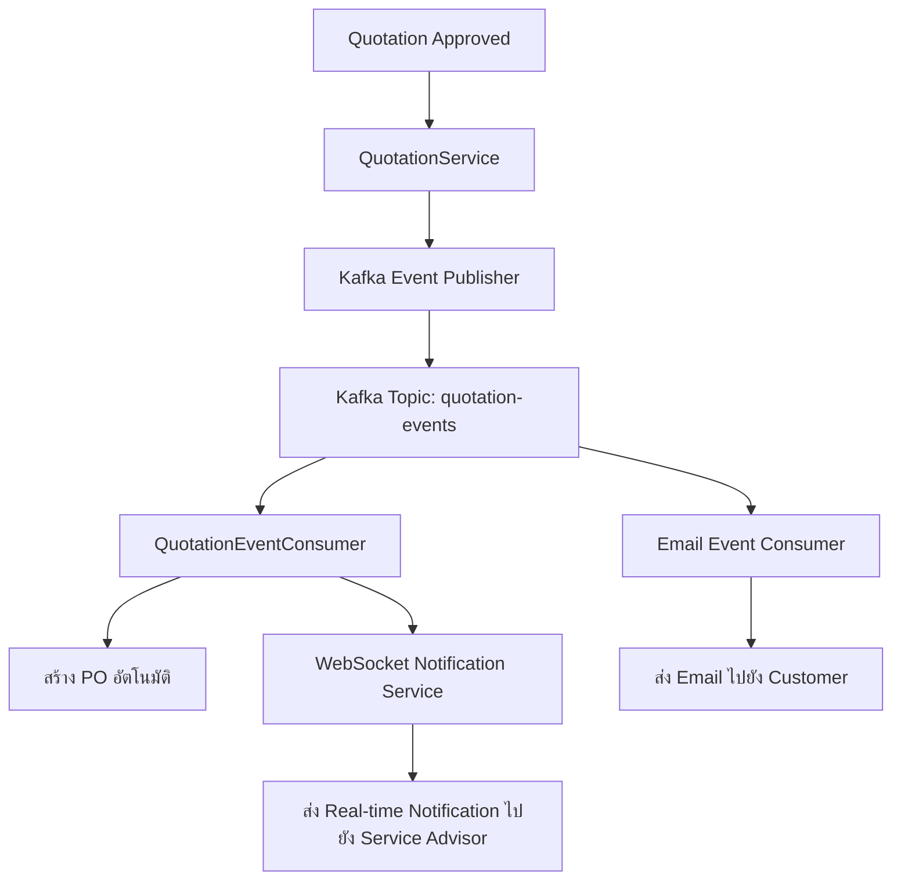

## 📁 โมดูลที่ 15: Kafka (Event-Driven Messaging)

โมดูลนี้เป็นระบบกลางสำหรับการส่งและรับ Event ระหว่างโมดูลต่างๆ ช่วยลดการ耦合 (Decoupling) และเพิ่มประสิทธิภาพในการประมวลผลงานที่ใช้เวลานาน (Async)

### 🏗️ โครงสร้างโมดูล Kafka (`modules/kafka`)

```
modules/kafka/
├── application/
│   ├── interfaces/
│   │   ├── EventPublisher.java
│   │   ├── EventConsumer.java
│   │   └── FailedEventService.java
│   ├── impl/
│   │   ├── EventPublisherImpl.java
│   │   ├── EventConsumerImpl.java
│   │   └── FailedEventServiceImpl.java
│   └── usecase/
│       ├── PublishEventUseCase.java
│       ├── ConsumeEventUseCase.java
│       ├── RetryFailedEventUseCase.java
│       └── GetEventStatusUseCase.java
├── domain/
│   ├── TEventFailure.java
│   ├── enums/
│   │   ├── EventType.java            // JOB_CREATED, QUOTATION_APPROVED, PO_CREATED, INVENTORY_UPDATED, EMAIL_SENT
│   │   └── EventStatus.java          // PENDING, PROCESSING, SUCCESS, FAILED
│   └── valueobjects/
│       ├── EventPayload.java
│       └── EventId.java
├── infrastructure/
│   ├── config/
│   │   ├── KafkaConfig.java           // Producer/Consumer Factory
│   │   └── KafkaTopicConfig.java      // สร้าง Topic อัตโนมัติ
│   ├── producer/
│   │   ├── KafkaEventPublisher.java
│   │   └── KafkaEventProducer.java
│   ├── consumer/
│   │   ├── KafkaEventConsumer.java
│   │   ├── JobEventConsumer.java      // ฟัง Event เฉพาะ Job
│   │   ├── QuotationEventConsumer.java
│   │   ├── InventoryEventConsumer.java
│   │   └── NotificationEventConsumer.java
│   ├── repository/
│   │   ├── EventFailureRepository.java
│   │   └── impl/
│   │       └── EventFailureRepositoryImpl.java
│   ├── cache/
│   │   └── EventCacheService.java
│   └── entity/
│       └── EventFailureEntity.java
└── presentation/
    ├── controller/
    │   ├── EventController.java       // ส่ง Event ด้วย REST (ทดสอบ)
    │   └── EventFailureController.java // จัดการ Event ที่ล้มเหลว
    ├── dto/
    │   ├── request/
    │   │   ├── PublishEventRequestDTO.java
    │   │   └── RetryEventRequestDTO.java
    │   └── response/
    │       ├── EventResponseDTO.java
    │       └── EventFailureResponseDTO.java
    └── validator/
        └── EventValidator.java
```

### 🗄️ Database Design (Kafka)

```sql
-- ตาราง: t_event_failure (Event ที่ส่งไม่สำเร็จ - Outbox Pattern)
CREATE TABLE IF NOT EXISTS t_event_failure (
    id UUID PRIMARY KEY DEFAULT gen_random_uuid(),
    event_id VARCHAR(50) UNIQUE NOT NULL,        -- ID ของ Event
    event_type VARCHAR(50) NOT NULL,             -- ประเภท Event
    topic VARCHAR(100) NOT NULL,                 -- Kafka Topic
    payload JSONB NOT NULL,                      -- ข้อมูล Event (JSON)
    status VARCHAR(20) DEFAULT 'PENDING',        -- PENDING, PROCESSING, SUCCESS, FAILED
    retry_count INTEGER DEFAULT 0,
    max_retry INTEGER DEFAULT 3,
    error_message TEXT,
    next_attempt_at TIMESTAMP DEFAULT NOW(),
    created_at TIMESTAMP NOT NULL DEFAULT NOW(),
    updated_at TIMESTAMP,
    whitelabel_id UUID NOT NULL
);

CREATE INDEX idx_t_event_failure_status ON t_event_failure(status);
CREATE INDEX idx_t_event_failure_next_attempt ON t_event_failure(next_attempt_at);
CREATE INDEX idx_t_event_failure_whitelabel ON t_event_failure(whitelabel_id);
```

### ⚙️ Kafka Configuration (`KafkaConfig.java`)

```java
package com.icmon.module.kafka.infrastructure.config;

import org.apache.kafka.clients.consumer.ConsumerConfig;
import org.apache.kafka.clients.producer.ProducerConfig;
import org.apache.kafka.common.serialization.StringDeserializer;
import org.apache.kafka.common.serialization.StringSerializer;
import org.springframework.beans.factory.annotation.Value;
import org.springframework.context.annotation.Bean;
import org.springframework.context.annotation.Configuration;
import org.springframework.kafka.config.ConcurrentKafkaListenerContainerFactory;
import org.springframework.kafka.core.*;
import org.springframework.kafka.listener.ContainerProperties;
import org.springframework.kafka.support.serializer.JsonDeserializer;
import org.springframework.kafka.support.serializer.JsonSerializer;

import java.util.HashMap;
import java.util.Map;

@Configuration
public class KafkaConfig {

    @Value("${spring.kafka.bootstrap-servers:localhost:9092}")
    private String bootstrapServers;

    @Value("${spring.kafka.consumer.group-id:icmon-group}")
    private String groupId;

    /*
        ฟังก์ชันนี้สร้าง ProducerFactory สำหรับส่งข้อความ JSON ไปยัง Kafka
        This function creates a ProducerFactory for sending JSON messages to Kafka.
    */
    @Bean
    public ProducerFactory<String, Object> producerFactory() {
        Map<String, Object> config = new HashMap<>();
        config.put(ProducerConfig.BOOTSTRAP_SERVERS_CONFIG, bootstrapServers);
        config.put(ProducerConfig.KEY_SERIALIZER_CLASS_CONFIG, StringSerializer.class);
        config.put(ProducerConfig.VALUE_SERIALIZER_CLASS_CONFIG, JsonSerializer.class);
        config.put(ProducerConfig.ACKS_CONFIG, "all");
        config.put(ProducerConfig.RETRIES_CONFIG, 3);
        return new DefaultKafkaProducerFactory<>(config);
    }

    @Bean
    public KafkaTemplate<String, Object> kafkaTemplate() {
        return new KafkaTemplate<>(producerFactory());
    }

    /*
        ฟังก์ชันนี้สร้าง ConsumerFactory สำหรับรับข้อความ JSON จาก Kafka
        This function creates a ConsumerFactory for receiving JSON messages from Kafka.
    */
    @Bean
    public ConsumerFactory<String, Object> consumerFactory() {
        Map<String, Object> config = new HashMap<>();
        config.put(ConsumerConfig.BOOTSTRAP_SERVERS_CONFIG, bootstrapServers);
        config.put(ConsumerConfig.GROUP_ID_CONFIG, groupId);
        config.put(ConsumerConfig.KEY_DESERIALIZER_CLASS_CONFIG, StringDeserializer.class);
        config.put(ConsumerConfig.VALUE_DESERIALIZER_CLASS_CONFIG, JsonDeserializer.class);
        config.put(JsonDeserializer.TRUSTED_PACKAGES, "*");
        config.put(ConsumerConfig.AUTO_OFFSET_RESET_CONFIG, "earliest");
        config.put(ConsumerConfig.ENABLE_AUTO_COMMIT_CONFIG, false);
        return new DefaultKafkaConsumerFactory<>(config);
    }

    @Bean
    public ConcurrentKafkaListenerContainerFactory<String, Object> kafkaListenerContainerFactory() {
        ConcurrentKafkaListenerContainerFactory<String, Object> factory = 
            new ConcurrentKafkaListenerContainerFactory<>();
        factory.setConsumerFactory(consumerFactory());
        factory.getContainerProperties().setAckMode(ContainerProperties.AckMode.MANUAL);
        return factory;
    }
}
```

### 📦 Kafka Producer (ตัวอย่าง)

```java
package com.icmon.module.kafka.infrastructure.producer;

import com.icmon.module.kafka.domain.enums.EventType;
import com.fasterxml.jackson.databind.ObjectMapper;
import lombok.RequiredArgsConstructor;
import lombok.extern.slf4j.Slf4j;
import org.springframework.kafka.core.KafkaTemplate;
import org.springframework.kafka.support.SendResult;
import org.springframework.stereotype.Service;

import java.util.UUID;
import java.util.concurrent.CompletableFuture;

@Slf4j
@Service
@RequiredArgsConstructor
public class KafkaEventProducer {

    private final KafkaTemplate<String, Object> kafkaTemplate;
    private final ObjectMapper objectMapper;

    /*
        ฟังก์ชันนี้ส่ง Event ไปยัง Kafka Topic
        This function sends an event to the specified Kafka topic.
    */
    public void publishEvent(String topic, String key, Object payload) {
        try {
            CompletableFuture<SendResult<String, Object>> future = 
                kafkaTemplate.send(topic, key, payload);
            
            future.whenComplete((result, ex) -> {
                if (ex == null) {
                    log.info("Event published to topic: {}, key: {}, offset: {}", 
                             topic, key, result.getRecordMetadata().offset());
                } else {
                    log.error("Failed to publish event to topic: {}", topic, ex);
                }
            });
        } catch (Exception e) {
            log.error("Error publishing event: {}", e.getMessage(), e);
            throw new RuntimeException("Failed to publish event", e);
        }
    }
}
```

---

## 📁 โมดูลที่ 16: WebSocket (Real-time Communication)

โมดูลนี้ใช้สำหรับการสื่อสารแบบ Real-time ระหว่าง Server และ Client (Browser, Mobile App) สำหรับฟังก์ชัน เช่น การแจ้งเตือนสด, ติดตามสถานะงาน, Dashboard แบบ Real-time

### 🏗️ โครงสร้างโมดูล WebSocket (`modules/websocket`)

```
modules/websocket/
├── application/
│   ├── interfaces/
│   │   ├── WebSocketService.java
│   │   ├── NotificationService.java
│   │   └── SessionManagerService.java
│   ├── impl/
│   │   ├── WebSocketServiceImpl.java
│   │   ├── NotificationServiceImpl.java
│   │   └── SessionManagerServiceImpl.java
│   └── usecase/
│       ├── SendNotificationUseCase.java
│       ├── BroadcastMessageUseCase.java
│       ├── SendToUserUseCase.java
│       └── GetActiveSessionsUseCase.java
├── domain/
│   ├── TWebSocketNotification.java
│   ├── TWebSocketSession.java
│   ├── enums/
│   │   ├── NotificationType.java    // JOB_UPDATE, QUOTATION_APPROVED, PAYMENT_CONFIRMED, SYSTEM_ALERT
│   │   └── NotificationPriority.java // LOW, NORMAL, HIGH, URGENT
│   └── valueobjects/
│       ├── MessagePayload.java
│       └── SessionId.java
├── infrastructure/
│   ├── config/
│   │   └── WebSocketConfig.java      // STOMP Config
│   ├── handler/
│   │   ├── WebSocketHandler.java     // @MessageMapping
│   │   └── WebSocketErrorHandler.java
│   ├── interceptor/
│   │   └── WebSocketAuthInterceptor.java // JWT Auth
│   ├── repository/
│   │   ├── NotificationRepository.java
│   │   ├── SessionRepository.java
│   │   └── impl/
│   │       ├── NotificationRepositoryImpl.java
│   │       └── SessionRepositoryImpl.java
│   ├── cache/
│   │   └── WebSocketCacheService.java // เก็บ Session ID
│   └── entity/
│       ├── WebSocketNotificationEntity.java
│       └── WebSocketSessionEntity.java
└── presentation/
    ├── controller/
    │   ├── WebSocketNotificationController.java // REST API ส่ง Notification
    │   └── WebSocketAdminController.java        // จัดการ Session
    ├── dto/
    │   ├── request/
    │   │   ├── SendNotificationRequestDTO.java
    │   │   └── BroadcastRequestDTO.java
    │   └── response/
    │       ├── NotificationResponseDTO.java
    │       └── SessionResponseDTO.java
    └── validator/
        └── NotificationValidator.java
```

### 🗄️ Database Design (WebSocket)

```sql
-- ตาราง: t_websocket_notification (ประวัติการแจ้งเตือน)
CREATE TABLE IF NOT EXISTS t_websocket_notification (
    id UUID PRIMARY KEY DEFAULT gen_random_uuid(),
    notification_id VARCHAR(50) UNIQUE NOT NULL,
    user_id UUID REFERENCES m_user(id) ON DELETE CASCADE,
    notification_type VARCHAR(50) NOT NULL,
    priority VARCHAR(20) DEFAULT 'NORMAL',
    title VARCHAR(255) NOT NULL,
    message TEXT NOT NULL,
    payload JSONB,                              -- ข้อมูลเพิ่มเติม (Job ID, Quotation ID)
    is_read BOOLEAN DEFAULT FALSE,
    read_at TIMESTAMP,
    delivered BOOLEAN DEFAULT FALSE,
    delivered_at TIMESTAMP,
    created_at TIMESTAMP NOT NULL DEFAULT NOW(),
    expires_at TIMESTAMP,                       -- หมดอายุ (ถ้ามี)
    whitelabel_id UUID NOT NULL
);

CREATE INDEX idx_t_ws_notification_user ON t_websocket_notification(user_id);
CREATE INDEX idx_t_ws_notification_type ON t_websocket_notification(notification_type);
CREATE INDEX idx_t_ws_notification_read ON t_websocket_notification(is_read);
CREATE INDEX idx_t_ws_notification_created ON t_websocket_notification(created_at);
CREATE INDEX idx_t_ws_notification_whitelabel ON t_websocket_notification(whitelabel_id);

-- ตาราง: t_websocket_session (บันทึก Session ที่เชื่อมต่อ - ใช้สำหรับ Analytics)
CREATE TABLE IF NOT EXISTS t_websocket_session (
    id UUID PRIMARY KEY DEFAULT gen_random_uuid(),
    session_id VARCHAR(100) UNIQUE NOT NULL,
    user_id UUID REFERENCES m_user(id) ON DELETE CASCADE,
    ip_address INET,
    user_agent TEXT,
    connected_at TIMESTAMP NOT NULL DEFAULT NOW(),
    disconnected_at TIMESTAMP,
    last_heartbeat TIMESTAMP,
    whitelabel_id UUID NOT NULL
);

CREATE INDEX idx_t_ws_session_user ON t_websocket_session(user_id);
CREATE INDEX idx_t_ws_session_connected ON t_websocket_session(connected_at);
CREATE INDEX idx_t_ws_session_whitelabel ON t_websocket_session(whitelabel_id);
```

### 🔌 WebSocket Configuration (`WebSocketConfig.java`)

```java
package com.icmon.module.websocket.infrastructure.config;

import com.icmon.module.websocket.infrastructure.interceptor.WebSocketAuthInterceptor;
import lombok.RequiredArgsConstructor;
import org.springframework.context.annotation.Configuration;
import org.springframework.messaging.simp.config.ChannelRegistration;
import org.springframework.messaging.simp.config.MessageBrokerRegistry;
import org.springframework.web.socket.config.annotation.EnableWebSocketMessageBroker;
import org.springframework.web.socket.config.annotation.StompEndpointRegistry;
import org.springframework.web.socket.config.annotation.WebSocketMessageBrokerConfigurer;

@Configuration
@EnableWebSocketMessageBroker
@RequiredArgsConstructor
public class WebSocketConfig implements WebSocketMessageBrokerConfigurer {

    private final WebSocketAuthInterceptor authInterceptor;

    /*
        ฟังก์ชันนี้กำหนด Endpoint สำหรับเชื่อมต่อ WebSocket และเปิดใช้งาน SockJS
        This function configures the WebSocket endpoint and enables SockJS fallback.
    */
    @Override
    public void registerStompEndpoints(StompEndpointRegistry registry) {
        registry.addEndpoint("/ws")
                .setAllowedOriginPatterns("*")
                .withSockJS();
        
        registry.addEndpoint("/ws")
                .setAllowedOriginPatterns("*");
    }

    /*
        ฟังก์ชันนี้กำหนด Message Broker และ Application Destination Prefix
        This function configures the Message Broker and Application Destination Prefix.
        - /topic: สำหรับ Broadcast ไปยังทุกคน
        - /queue: สำหรับส่งถึงผู้ใช้เฉพาะ (Private)
        - /app: สำหรับรับข้อความจาก Client
    */
    @Override
    public void configureMessageBroker(MessageBrokerRegistry registry) {
        registry.enableSimpleBroker("/topic", "/queue");
        registry.setApplicationDestinationPrefixes("/app");
        registry.setUserDestinationPrefix("/user");
    }

    /*
        ฟังก์ชันนี้เพิ่ม Interceptor สำหรับตรวจสอบ JWT Token
        This function adds an Interceptor for JWT Token validation.
    */
    @Override
    public void configureClientInboundChannel(ChannelRegistration registration) {
        registration.interceptors(authInterceptor);
    }
}
```

### 🔐 WebSocket Auth Interceptor (`WebSocketAuthInterceptor.java`)

```java
package com.icmon.module.websocket.infrastructure.interceptor;

import com.icmon.module.auth.infrastructure.security.JwtTokenProvider;
import lombok.RequiredArgsConstructor;
import lombok.extern.slf4j.Slf4j;
import org.springframework.messaging.Message;
import org.springframework.messaging.MessageChannel;
import org.springframework.messaging.simp.stomp.StompCommand;
import org.springframework.messaging.simp.stomp.StompHeaderAccessor;
import org.springframework.messaging.support.ChannelInterceptor;
import org.springframework.messaging.support.MessageHeaderAccessor;
import org.springframework.security.authentication.UsernamePasswordAuthenticationToken;
import org.springframework.security.core.context.SecurityContextHolder;
import org.springframework.security.core.userdetails.UserDetails;
import org.springframework.security.core.userdetails.UserDetailsService;
import org.springframework.stereotype.Component;

import java.util.UUID;

@Slf4j
@Component
@RequiredArgsConstructor
public class WebSocketAuthInterceptor implements ChannelInterceptor {

    private final JwtTokenProvider jwtTokenProvider;
    private final UserDetailsService userDetailsService;

    /*
        ฟังก์ชันนี้ตรวจสอบ Authorization Header ใน WebSocket Request
        This function validates the Authorization header in WebSocket requests.
    */
    @Override
    public Message<?> preSend(Message<?> message, MessageChannel channel) {
        StompHeaderAccessor accessor = MessageHeaderAccessor.getAccessor(message, StompHeaderAccessor.class);

        if (accessor != null && StompCommand.CONNECT.equals(accessor.getCommand())) {
            String token = accessor.getFirstNativeHeader("Authorization");
            if (token != null && token.startsWith("Bearer ")) {
                token = token.substring(7);
                try {
                    if (jwtTokenProvider.validateToken(token)) {
                        String username = jwtTokenProvider.getUsernameFromToken(token);
                        UserDetails userDetails = userDetailsService.loadUserByUsername(username);
                        UsernamePasswordAuthenticationToken authentication = 
                            new UsernamePasswordAuthenticationToken(
                                userDetails, null, userDetails.getAuthorities()
                            );
                        SecurityContextHolder.getContext().setAuthentication(authentication);
                        accessor.setUser(authentication);
                        
                        log.info("WebSocket authenticated: {}", username);
                    }
                } catch (Exception e) {
                    log.error("WebSocket authentication failed: {}", e.getMessage());
                }
            }
        }
        return message;
    }
}
```

### 📨 WebSocket Handler (`WebSocketHandler.java`)

```java
package com.icmon.module.websocket.infrastructure.handler;

import com.icmon.module.websocket.application.interfaces.NotificationService;
import com.icmon.module.websocket.presentation.dto.request.SendNotificationRequestDTO;
import lombok.RequiredArgsConstructor;
import lombok.extern.slf4j.Slf4j;
import org.springframework.messaging.handler.annotation.DestinationVariable;
import org.springframework.messaging.handler.annotation.MessageMapping;
import org.springframework.messaging.handler.annotation.Payload;
import org.springframework.messaging.handler.annotation.SendTo;
import org.springframework.messaging.simp.SimpMessagingTemplate;
import org.springframework.security.core.Authentication;
import org.springframework.stereotype.Controller;

import java.security.Principal;
import java.util.UUID;

@Slf4j
@Controller
@RequiredArgsConstructor
public class WebSocketHandler {

    private final SimpMessagingTemplate messagingTemplate;
    private final NotificationService notificationService;

    /*
        ฟังก์ชันนี้รับข้อความจาก Client และ Broadcast ไปยังทุกคน
        This function receives a message from the client and broadcasts it to everyone.
        Client ส่ง: /app/chat
        Server ส่ง: /topic/chat
    */
    @MessageMapping("/chat")
    @SendTo("/topic/chat")
    public String handleChatMessage(String message, Principal principal) {
        log.info("Chat message from {}: {}", principal.getName(), message);
        return principal.getName() + ": " + message;
    }

    /*
        ฟังก์ชันนี้รับข้อความจาก Client และส่งเฉพาะห้อง (Room)
        This function receives a message and sends it to a specific room.
        Client ส่ง: /app/room/{roomId}
        Server ส่ง: /topic/room/{roomId}
    */
    @MessageMapping("/room/{roomId}")
    @SendTo("/topic/room/{roomId}")
    public String handleRoomMessage(@DestinationVariable String roomId, 
                                    @Payload String message, 
                                    Principal principal) {
        return "[" + roomId + "] " + principal.getName() + ": " + message;
    }

    /*
        ฟังก์ชันนี้ส่งการแจ้งเตือนถึงผู้ใช้เฉพาะ (Private)
        This function sends a notification to a specific user.
        Client ส่ง: /app/notification
        Server ส่ง: /queue/notification/{userId}
    */
    @MessageMapping("/notification")
    public void handleNotification(@Payload SendNotificationRequestDTO request, 
                                   Authentication authentication) {
        String userId = authentication.getName();
        // บันทึก Notification ลง DB
        notificationService.saveNotification(
            UUID.fromString(userId), 
            request.getTitle(), 
            request.getMessage(), 
            request.getType()
        );
        
        // ส่งไปยัง User เฉพาะ
        messagingTemplate.convertAndSendToUser(
            userId, 
            "/queue/notification", 
            request
        );
        log.info("Notification sent to user: {}", userId);
    }
}
```

### 🔔 Notification Service (`NotificationServiceImpl.java`)

```java
package com.icmon.module.websocket.application.impl;

import com.icmon.module.websocket.application.interfaces.NotificationService;
import com.icmon.module.websocket.domain.TWebSocketNotification;
import com.icmon.module.websocket.domain.enums.NotificationPriority;
import com.icmon.module.websocket.domain.enums.NotificationType;
import com.icmon.module.websocket.infrastructure.repository.NotificationRepository;
import com.icmon.module.websocket.presentation.dto.request.SendNotificationRequestDTO;
import com.icmon.module.websocket.presentation.dto.response.NotificationResponseDTO;
import lombok.RequiredArgsConstructor;
import lombok.extern.slf4j.Slf4j;
import org.springframework.messaging.simp.SimpMessagingTemplate;
import org.springframework.stereotype.Service;

import java.time.LocalDateTime;
import java.util.UUID;

@Slf4j
@Service
@RequiredArgsConstructor
public class NotificationServiceImpl implements NotificationService {

    private final NotificationRepository notificationRepository;
    private final SimpMessagingTemplate messagingTemplate;

    /*
        ฟังก์ชันนี้ส่งการแจ้งเตือนแบบ Real-time ผ่าน WebSocket พร้อมบันทึกใน Database
        This function sends a real-time notification via WebSocket and saves it to the database.
    */
    @Override
    public NotificationResponseDTO sendRealTimeNotification(UUID userId, 
                                                            String title, 
                                                            String message, 
                                                            NotificationType type) {
        // 1. บันทึก Notification ลง DB
        TWebSocketNotification notification = new TWebSocketNotification();
        notification.setUserId(userId);
        notification.setNotificationType(type);
        notification.setTitle(title);
        notification.setMessage(message);
        notification.setPriority(NotificationPriority.NORMAL);
        notification.setCreatedAt(LocalDateTime.now());
        
        TWebSocketNotification saved = notificationRepository.save(notification);

        // 2. ส่งผ่าน WebSocket ไปยัง User เฉพาะ
        SendNotificationRequestDTO payload = new SendNotificationRequestDTO();
        payload.setTitle(title);
        payload.setMessage(message);
        payload.setType(type.name());
        payload.setTimestamp(LocalDateTime.now());
        
        messagingTemplate.convertAndSendToUser(
            userId.toString(), 
            "/queue/notification", 
            payload
        );
        
        log.info("Real-time notification sent to user: {}", userId);
        return NotificationResponseDTO.fromEntity(saved);
    }

    /*
        ฟังก์ชันนี้ส่งการแจ้งเตือนแบบ Broadcast ไปยังทุกคน
        This function broadcasts a notification to all connected clients.
    */
    @Override
    public void broadcastNotification(String title, String message, NotificationType type) {
        SendNotificationRequestDTO payload = new SendNotificationRequestDTO();
        payload.setTitle(title);
        payload.setMessage(message);
        payload.setType(type.name());
        payload.setTimestamp(LocalDateTime.now());
        payload.setIsBroadcast(true);
        
        messagingTemplate.convertAndSend("/topic/broadcast", payload);
        log.info("Broadcast notification sent to all clients");
    }
}
```

---

## 📊 Event Flow Diagram (Kafka + WebSocket ทำงานร่วมกัน)



---

## ⏱️ Rate Limit สำหรับ Kafka & WebSocket

### Event Controller (`/api/v1/events`)

| Method | Path | คำอธิบาย | Rate Limit |
|--------|------|----------|------------|
| POST | `/publish` | ทดสอบส่ง Event | 10/60s |
| GET | `/failures` | รายการ Event ที่ล้มเหลว | 20/60s |
| POST | `/failures/retry/{id}` | ส่ง Event ซ้ำ | 5/60s |

### Notification Controller (`/api/v1/notifications`)

| Method | Path | คำอธิบาย | Rate Limit |
|--------|------|----------|------------|
| GET | `/unread` | ข้อความที่ยังไม่ได้อ่าน | 30/60s |
| PUT | `/{id}/read` | ทำเครื่องหมายว่าอ่านแล้ว | 20/60s |
| GET | `/history` | ประวัติการแจ้งเตือน | 20/60s |
| POST | `/send` | ส่ง Notification (Admin) | 10/60s |

---

## 🧠 Redis Cache Keys (เพิ่มเติม)

| Cache Key | TTL | คำอธิบาย |
|-----------|-----|----------|
| `event_status:{eventId}` | 5 นาที | สถานะของ Event |
| `websocket_session:{userId}` | 1 ชั่วโมง | Session ID ของ User |
| `unread_notifications:{userId}` | 5 นาที | จำนวนข้อความที่ยังไม่ได้อ่าน |

---

## ✅ สรุปโมดูลที่เพิ่ม

| # | โมดูล | สถานะ | รายละเอียด |
|---|-------|--------|-----------|
| 15 | 📨 Kafka (Event-Driven) | ✅ ครบถ้วน | Producer, Consumer, Failure Table, Retry |
| 16 | 📡 WebSocket (Real-time) | ✅ ครบถ้วน | STOMP, Private/Public, Notification, Session |

---

## 🚀 การติดตั้งเพิ่มเติม

### 1. เพิ่ม Dependencies ใน `pom.xml`

```xml
<!-- Kafka -->
<dependency>
    <groupId>org.springframework.kafka</groupId>
    <artifactId>spring-kafka</artifactId>
</dependency>

<!-- WebSocket -->
<dependency>
    <groupId>org.springframework.boot</groupId>
    <artifactId>spring-boot-starter-websocket</artifactId>
</dependency>
```

### 2. กำหนดค่าใน `application.yml`

```yaml
spring:
  kafka:
    bootstrap-servers: localhost:9092
    consumer:
      group-id: icmon-group
      auto-offset-reset: earliest
    producer:
      retries: 3
      acks: all
```

### 3. ทดสอบ WebSocket (JavaScript Client)

```javascript
const socket = new SockJS('http://localhost:5000/ws');
const stompClient = Stomp.over(socket);

stompClient.connect({}, function(frame) {
    console.log('Connected: ' + frame);
    stompClient.subscribe('/user/queue/notification', function(response) {
        const data = JSON.parse(response.body);
        console.log('New notification:', data);
        alert(data.title + ': ' + data.message);
    });
});
```

--- 