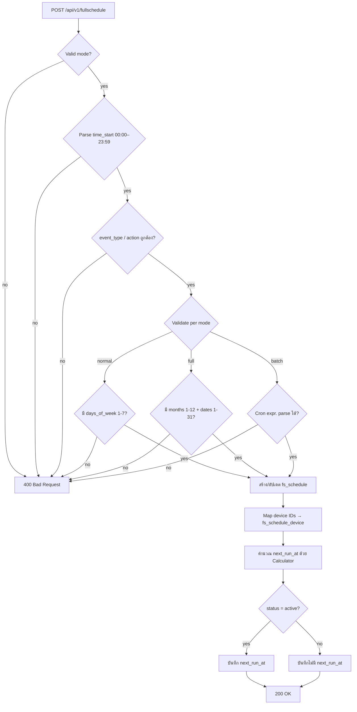
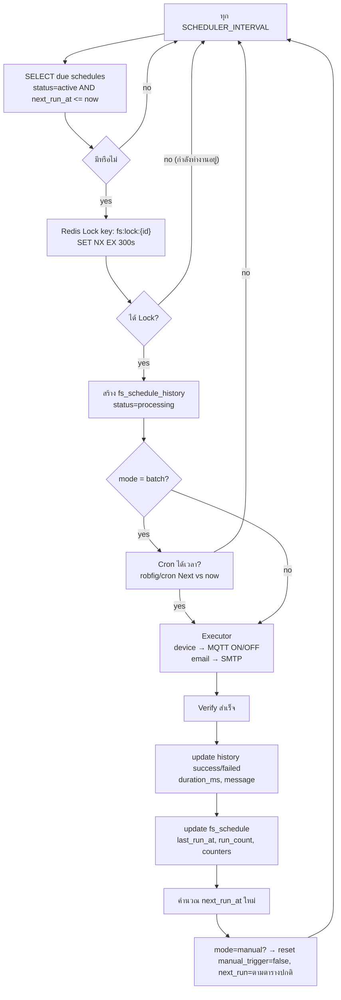
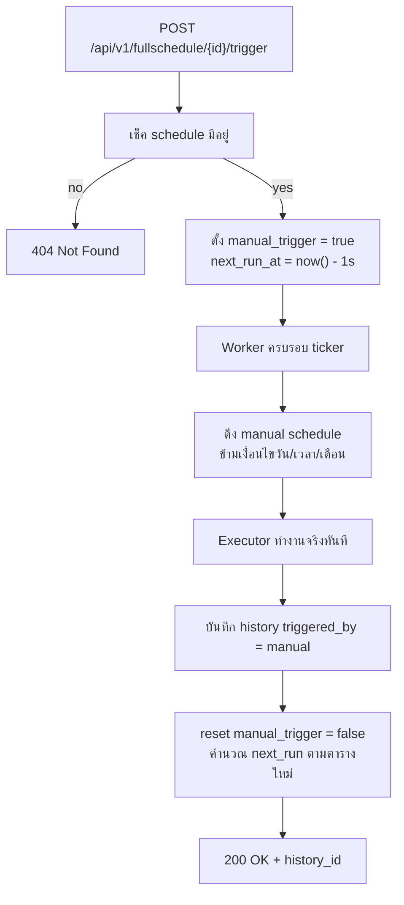
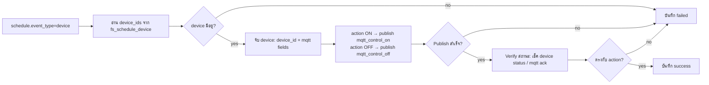

# Full Schedule Module — ระบบบริหารจัดการตารางงาน (แยกจากระบบเดิม)

โมดูล **Full Schedule** ถูกออกแบบใหม่ทั้งหมด แยกจากระบบ schedule เดิม (`sd_iot_schedule`)
โดยมีตารางฐานข้อมูล (database) ของตัวเอง (`fs_*`) และตรรกะการประมวลผลของตัวเอง
รองรับการทำงาน 3 โหมด (Mode) ตามที่กำหนด:

| โหมด | รหัส | คำอธิบาย | ตัวอย่าง |
| :--- | :--- | :--- | :--- |
| ปกติ (Weekly) | `normal` | ทำงานซ้ำตามวันในสัปดาห์ Sunday–Saturday | เปิดไฟสวนทุกวันจันทร์–ศุกร์ 18:00 |
| ปฏิทิน (Calendar) | `full` | ทำงานตามเดือน (1–12) + วันที่ (1–31) | ส่งอีเมลเตือนทุกวันที่ 1 และ 15 ของทุกเดือน |
| Batch (Cron) | `batch` | ทำงานตาม Cron Expression บน Server | `0 2 * * *` รันทุกวัน 02:00 |

Event type รองรับ `device` (ON/OFF) และ `email` (start/stop ส่ง email alert)

---

## 1. ภาพรวมระบบ

```
┌──────────────┐        ┌──────────────────────────────────────────────┐
│  User / API  │        │                  PostgreSQL                  │
│  Client      │─REST──▶│  fs_schedule / fs_schedule_device            │
└──────────────┘        │  fs_schedule_history / fs_schedule_settings  │
                        └──────────────┬───────────────────────────────┘
                                       │
       ┌───────────────┬───────────────┼───────────────┬───────────────┐
       ▼               ▼               ▼               ▼               ▼
 ┌──────────┐   ┌──────────────┐  ┌─────────────┐  ┌──────────┐  ┌─────────────┐
 │  CRUD    │   │ Manual Trg.  │  │  History    │  │ Report   │  │ Scheduler   │
 │  Create  │   │ Trigger Now  │  │  Log       │  │ Success/ │  │ Worker      │
 │  List    │   │ (skip cond)  │  │  system     │  │ Failed   │  │ (ticker     │
 │  Update  │   │              │  │  manual     │  │ summary  │  │  + cron)    │
 │  Delete  │   │              │  │             │  │          │  │             │
 └──────────┘   └──────────────┘  └─────────────┘  └──────────┘  └──────┬──────┘
                                                                        │
                                                              ┌─────────▼─────────┐
                                                              │  Executor         │
                                                              │  • device → MQTT  │
                                                              │  • email → SMTP   │
                                                              │  • verify success │
                                                              └───────────────────┘
```

**ส่วนประกอบหลัก**

1. **API Service** — CRUD schedule, settings, history, report, `POST /{id}/trigger` (สั่งงานเอง)
2. **Calculator (Recurrence)** — คำนวณ `next_run_at` จาก 3 โหมด (weekly / calendar / cron)
3. **Scheduler Worker** — ticker ทุก `SCHEDULER_INTERVAL` (ค่าเริ่มต้น 1 นาที) ดึงงานที่ถึงกำหนดมาทำ
   ใช้ Redis Lock (`SET NX EX`) เพื่อกันการสั่งงานซ้ำ (idempotency)
4. **Executor** — ส่งคำสั่งจริง (MQTT ON/OFF / ส่งอีเมล) แล้ว **ตรวจสอบผลสำเร็จ**
5. **Idempotency / Lock** — กันงานที่ทำไปแล้วไม่ถูกสั่งซ้ำ (due flag + dist lock)

---

## 2. Flow Diagram

### 2.1 Flow การสร้าง / แก้ไข Schedule



### 2.2 Flow การทำงานของ Scheduler Worker (อัตโนมัติ)



### 2.3 Flow สั่งงานด้วยตนเอง (Manual Trigger)



> หมายเหตุ: Manual trigger จะ **ข้ามเงื่อนไข** วัน/เวลา/เดือน/วันในสัปดาห์ แต่ยัง **เก็บประวัติ** และรายงานความสำเร็จเหมือนปกติ ระบบสั่งงานเองจะไม่ถูกสั่งซ้ำ (idempotency lock)

### 2.4 Flow การแมปอุปกรณ์ IoT + ตรวจสอบสถานะ



---

## 3. Logical Data Model

ตารางทั้งหมดใช้ prefix `fs_` (Full Schedule) เพื่อแยกจากระบบเดิมโดยสิ้นเชิง

### 3.1 `fs_schedule` — ตารางหลัก

| column | type | คำอธิบาย |
| :--- | :--- | :--- |
| id | UUID PK | รหัส schedule |
| name | VARCHAR(255) | ชื่อ event |
| mode | VARCHAR(20) | `normal` / `full` / `batch` |
| status | VARCHAR(20) | `active` / `inactive` |
| time_start | VARCHAR(5) | `00:00`–`23:59` (ไม่ใช้กับ batch) |
| event_type | VARCHAR(20) | `device` / `email` |
| event_action | VARCHAR(20) | `ON` / `OFF` / `start` / `stop` |
| days_of_week | INTEGER[] | normal: 1=Sunday … 7=Saturday |
| months | INTEGER[] | full: 1–12 |
| dates | INTEGER[] | full: 1–31 (ข้ามวันที่ไม่ตรงเดือนอัตโนมัติ) |
| cron_expr | VARCHAR(100) | batch: cron expression |
| manual_trigger | BOOLEAN | ธงสั่งงานเอง |
| last_run_at | TIMESTAMPTZ | ทำงานครั้งล่าสุด |
| next_run_at | TIMESTAMPTZ | กำหนดครั้งถัดไป (ใช้ index query) |
| run_count | BIGINT | จำนวนครั้งที่รัน |
| success_count | BIGINT | จำนวนสำเร็จ |
| failed_count | BIGINT | จำนวนล้มเหลว |
| created_by | UUID | ผู้สร้าง |
| created_at / updated_at / deleted_at | TIMESTAMPTZ | timestamps |

Index: `idx_fs_schedule_due (status, next_run_at) WHERE status='active' AND deleted_at IS NULL`
Index: `idx_fs_schedule_mode_mode (mode, status)`

### 3.2 `fs_schedule_device` — แมปอุปกรณ์ IoT

| column | type | คำอธิบาย |
| :--- | :--- | :--- |
| id | UUID PK | |
| schedule_id | UUID FK → fs_schedule | |
| device_id | INT | device ID จาก sd_iot_device |
| device_sn | VARCHAR(255) | SN อุปกรณ์ (กัน cache) |
| created_at | TIMESTAMPTZ | |

UNIQUE `(schedule_id, device_id)`

### 3.3 `fs_schedule_history` — ประวัติการทำงาน

| column | type | คำอธิบาย |
| :--- | :--- | :--- |
| id | UUID PK | |
| schedule_id | UUID FK → fs_schedule | |
| device_id | INT | target device (ถ้า event_type=device) |
| triggered_by | VARCHAR(20) | `system` / `manual` |
| trigger_source | VARCHAR(20) | `automatic` / `manual` / `cron` |
| status | VARCHAR(20) | `processing` / `success` / `failed` / `skipped` |
| event_action | VARCHAR(20) | action ที่ส่งจริง |
| payload | TEXT | JSON payload ที่ส่ง |
| message | TEXT | ผลลัพธ์ / error |
| duration_ms | BIGINT | เวลาที่ใช้ |
| retry_count | INT | จำนวน retry |
| executed_at | TIMESTAMPTZ | เวลาสำเร็จ/ล้มเหลว |
| timezone | VARCHAR(50) | timezone ที่รัน |
| date / time | VARCHAR(20) | วันที่/เวลา (สะดวก report) |
| created_at / updated_at | TIMESTAMPTZ | |

Index: `idx_fs_schedule_history_schedule (schedule_id, created_at DESC)`
Index: `idx_fs_schedule_history_status (status, created_at)`

### 3.4 `fs_schedule_settings` — ตั้งค่าของ schedule (เช่น recipient email, retry)

| column | type | คำอธิบาย |
| :--- | :--- | :--- |
| id | UUID PK | |
| schedule_id | UUID FK → fs_schedule | |
| key | VARCHAR(100) | เช่น `email_recipients`, `retry_policy`, `verify_timeout_s` |
| value | JSONB | ค่าแบบยืดหยุ่น |
| created_at / updated_at | TIMESTAMPTZ | |

UNIQUE `(schedule_id, key)`

---

### 3.5 Master Data — Group / Zone / Area (data แบบลำดับชั้น)

ตารางใหม่ 4 ตาราง (prefix `fs_` ทั้งหมด, soft delete ด้วย `deleted_at`)

| ตาราง | column | type | คำอธิบาย |
| :--- | :--- | :--- | :--- |
| `fs_groups` | id | UUID PK | กลุ่ม (ระดับสูงสุด) |
| | name | VARCHAR(255) NOT NULL | |
| | description | TEXT | |
| | status | VARCHAR(20) | `active` / `inactive` |
| | sort_id | INTEGER NOT NULL DEFAULT 0 | ลำดับการแสดงผล |
| | created_at / updated_at / deleted_at | TIMESTAMPTZ | |
| | created_by / updated_by / version | UUID / UUID / BIGINT | audit (default version 1) |
| `fs_zones` | id | UUID PK | โซน ใต้กลุ่ม |
| | group_id | UUID FK → fs_groups | ต้องมี parent จริง |
| | name / description / timestamps | | |
| | sort_id | INTEGER NOT NULL DEFAULT 0 | ลำดับการแสดงผล |
| `fs_areas` | id | UUID PK | พื้นที่ ใต้โซน |
| | zone_id | UUID FK → fs_zones | ต้องมี parent จริง |
| | name / description / timestamps | | |
| | sort_id | INTEGER NOT NULL DEFAULT 0 | ลำดับการแสดงผล |
| `fs_device_area` | id | UUID PK | แมปอุปกรณ์ลงพื้นที่ |
| | area_id | UUID FK → fs_areas (CASCADE) | |
| | device_id | INT NOT NULL | ref → `sd_iot_device` |
| | device_sn | VARCHAR(255) | snapshot SN ตอนแมป |
| | created_at | TIMESTAMPTZ | |

UNIQUE `(area_id, device_id)` / index `deleted_at` ทุกตาราง master

> **API list (groups/zones/areas):** เรียงตาม `sort_id ASC, created_at DESC` (default)
> โดย `/api/areas` รองรับ query `sort=asc|desc`; zones/areas จะ `INNER JOIN` ตาราง parent
> (ที่ยังไม่ถูกลบ) เพื่อคืน `group_name`/`zone_name` ใน response — record ที่ parent
> ถูกลบ (soft delete) จะไม่ถูกแสดง

การแก้ไข `fs_schedule` เพิ่มคอลัมน์ scope (optional ทั้งหมด, FK nullable)

| column | type | คำอธิบาย |
| :--- | :--- | :--- |
| group_id | UUID FK → fs_groups | |
| zone_id | UUID FK → fs_zones | |
| area_id | UUID FK → fs_areas | |

### 3.6 กลไก resolve อุปกรณ์เป้าหมาย (Target Device Resolution)

ลำดับความสำคัญ (เข้มสุดก่อน):

1. `device_ids` ที่ระบุโดยตรง (จาก `fs_schedule_device`)
2. Scope — พิจารณาจากระดับที่เจาะจงสุดก่อน:
   - `area_id` → อุปกรณ์จาก `fs_device_area.area_id`
   - `zone_id` → join `fs_areas` แล้วกรอง `zone_id`
   - `group_id` → join `fs_areas` + `fs_zones` แล้วกรอง `group_id`
   - Distinct ด้วย `device_id` (อุปกรณ์ที่อยู่ในหลาย area ไม่ถูก run ซ้ำ)
3. Fallback → `fs_schedule_device` (เท่ากับข้อ 1 เดิม)
4. ไม่มีอุปกรณ์ทั้งจากข้อ 1–3 → error `no target devices`

Validation scope เมื่อสร้าง/แก้ไข schedule (และเมื่อแก้ไข master data):

- `zone` ที่เลือกต้องอยู่ใน `group` ที่เลือก ไม่ใช่ → `zone_id does not belong to group_id`
- `area` ที่เลือกต้องอยู่ใน `zone` ที่เลือก ไม่ใช่ → `area_id does not belong to zone_id`
- ลบ `group` ได้เมื่อไม่มี `zone` / ลบ `zone` ได้เมื่อไม่มี `area` / ลบ `area` ได้เมื่อไม่มีการแมปอุปกรณ์

**Scope lock (กันการรันซ้ำ):** lock เดิม `fs:schedule:lock:{schedule_id}`; schedules
ที่ใช้ scope เดียวกันยังถือว่าแยกกันได้เพราะ suggestion = distinct device_id,
แต่ถ้าต้องการกัน schedule 2 ตัวทับขอบเขตเดียวกันให้ lock meta-key
`fs:schedule:scope-lock:{group_id}:{zone_id}:{area_id}` (เฉพาะที่มีค่า)

### 3.7 Scope Preview API

`GET /api/v1/fullschedule/scope/preview?group_id=&zone_id=&area_id=`
→ `{ group_id?, zone_id?, area_id?, device_count }` ใช้เช็คก่อนบันทึก schedule ว่า
ขอบเขตนี้ครอบคลุมอุปกรณ์กี่ตัว

### 3.8 Report + Scope Filter

`GET /api/v1/fullschedule/report?from=&to=&group_id=&zone_id=&area_id=`
กรองรายงานด้วย scope เดียวกับ schedule (ดูจาก column scope บน `fs_schedule`)

---

## 4. API Specification

Base: `/api/v1/fullschedule` (มาร์คที: mount ใต้ `/api`)

| Method | Path | คำอธิบาย |
| :--- | :--- | :--- |
| POST | `/api/v1/fullschedule` | สร้าง schedule |
| GET | `/api/v1/fullschedule` | รายการ schedule (filter mode/status, paging) |
| GET | `/api/v1/fullschedule/{id}` | ดู schedule |
| PUT | `/api/v1/fullschedule/{id}` | แก้ไข schedule |
| DELETE | `/api/v1/fullschedule/{id}` | ลบ schedule (soft delete) |
| POST | `/api/v1/fullschedule/{id}/trigger` | สั่งงานด้วยตนเอง (ข้ามเงื่อนไข) |
| POST | `/api/v1/fullschedule/{id}/settings` | ตั้งค่า schedule |
| GET | `/api/v1/fullschedule/{id}/settings` | ดูตั้งค่า |
| GET | `/api/v1/fullschedule/{id}/history` | ประวัติของ schedule |
| GET | `/api/v1/fullschedule/history` | ประวัติทั้งหมด (paging + filter) |
| GET | `/api/v1/fullschedule/report` | รายงานสรุป (from/to, schedule_id, + scope filter) |
| GET | `/api/v1/fullschedule/scope/preview` | preview จำนวนอุปกรณ์ของ scope |
| GET | `/api/v1/fullschedule/devices` | รายการอุปกรณ์ IoT ที่แมปได้ |
| POST | `/api/v1/groups` | สร้าง group |
| GET | `/api/v1/groups` | รายการ group |
| GET / PUT / DELETE | `/api/v1/groups/{id}` | ดู / แก้ / ลบ group |
| POST | `/api/v1/zones` | สร้าง zone (ต้องระบุ group_id) |
| GET | `/api/v1/zones?group_id=` | รายการ zone (กรองตาม group_id ได้) |
| GET / PUT / DELETE | `/api/v1/zones/{id}` | ดู / แก้ / ลบ zone |
| POST | `/api/v1/areas` | สร้าง area (ต้องระบุ zone_id) |
| GET | `/api/v1/areas?zone_id=` | รายการ area (กรองตาม zone_id ได้) |
| GET / PUT / DELETE | `/api/v1/areas/{id}` | ดู / แก้ / ลบ area |
| POST | `/api/v1/areas/{id}/devices` | แทนที่ชุดอุปกรณ์ของ area (`{"device_ids":[...]}`) |
| GET | `/api/v1/areas/{id}/devices` | ดูอุปกรณ์ที่แมปกับ area |

### ตัวอย่าง Request — สร้าง (mode = normal)

```json
{
  "name": "เปิดไฟสวนกลางคืน",
  "mode": "normal",
  "status": "active",
  "time_start": "18:00",
  "event_type": "device",
  "event_action": "ON",
  "days_of_week": [2, 3, 4, 5, 6],
  "device_ids": [1, 2],
  "settings": { "verify_timeout_s": 5 }
}
```

### ตัวอย่าง Request — สร้าง (mode = full / calendar)

```json
{
  "name": "ส่งอีเมลสรุปรายเดือน",
  "mode": "full",
  "status": "active",
  "time_start": "09:30",
  "event_type": "email",
  "event_action": "start",
  "months": [1, 2, 3, 4, 5, 6, 7, 8, 9, 10, 11, 12],
  "dates": [1, 15]
}
```

> หมายเหตุ: วันที่ 29/30/31 ที่ไม่มีในเดือน (เช่น 31 ก.พ.) จะถูกข้ามอัตโนมัติโดย Calculator

### ตัวอย่าง Request — สร้าง (mode = batch / cron)

```json
{
  "name": "ล้าง log ทุกวัน 02:00",
  "mode": "batch",
  "status": "active",
  "cron_expr": "0 2 * * *",
  "event_type": "email",
  "event_action": "stop"
}
```

### ตัวอย่าง Request — สร้าง (ใช้ scope แทน device_ids)

```json
{
  "name": "เปิดไฟโซนขาย = A1 (กลุ่ม อาคารหลัก)",
  "mode": "normal",
  "status": "active",
  "time_start": "08:00",
  "event_type": "device",
  "event_action": "ON",
  "days_of_week": [1, 2, 3, 4, 5, 6, 7],
  "group_id": "<uuid กลุ่ม>",
  "zone_id": "<uuid โซน>",
  "area_id": "<uuid พื้นที่>"
}
```

> scope validation: `area` ต้องอยู่ใน `zone` ที่ระบุ และ `zone` ต้องอยู่ใน `group` ที่ระบุ
> (ระบุเฉพาะ `area_id` ก็พอ — chain ถูกตรวจจาก parent จริงของมัน)

### Manual Trigger

```
POST /api/v1/fullschedule/{id}/trigger
→ { "message": "triggered", "history_id": "<uuid>" }
```

---

## 5. Core Logic — การคำนวณ `next_run_at`

### 5.1 Normal (weekly)

```
candidate = วันถัดไปจาก now (วนสูงสุด 366 วัน)
ถ้า weekday(candidate) ∈ days_of_week และ time(candidate) != ปัจจุบัน
   → next_run = candidate + time_start
```

### 5.2 Full (calendar)

```
candidate = วันถัดไปจาก now (วนสูงสุด 366 วัน)
ถ้า month(candidate) ∈ months และ day(candidate) ∈ dates
   และวันที่ candidate ตรงกับ time.Date จริง (กัน 29/30/31 ก.พ.)
   → next_run = candidate + time_start
```

### 5.3 Batch (cron)

```
ใช้ robfig/cron/v3
next_run = parser.Parse(cron_expr).Next(now)
```

### การกันทำงานซ้ำ (Idempotency)

1. **Redis Distributd Lock**: `SET fs:lock:{schedule_id} <uuid> NX EX 300`
   - ได้ lock → ทำ, ไม่ได้ → ข้าม
2. **due flag**: หลัง worker รัน schedule แล้วตั้ง `next_run_at` ให้เป็นค่านวณถัดไปทันที
   ดังนั้น query `next_run_at <= now` จะไม่เจองานเดิมซ้ำ
3. **history guard**: worker ตรวจ `status='processing'` เก่าที่ค้างเกิน timeout → กันไม่สร้างซ้ำ

---

## 6. โครงสร้างโปรเจกต์ (Golang)

```
internal/modules/fullschedule/
├── model.go                  # GORM models + TableName (fs_*) (+ Group/Zone/Area/AreaDevice, ScopeFilter)
├── master.go                 # errors + MasterPgRepository/MasterUseCaseI/MasterHandlers interfaces
├── handler.go                # HTTP handler interface
├── usecase.go                # FullScheduleUseCaseI interface
├── pg_repository.go          # repository interface
├── delivery/http/
│   ├── routes.go             # chi router (+ MapMasterRoutes)
│   ├── handlers.go           # HTTP handlers
│   └── master_handlers.go    # group/zone/area handlers + scope preview
├── presenter/
│   ├── presenters.go         # request/response DTO
│   └── master_presenters.go  # master DTO + scope fields
├── repository/
│   ├── pg_repository.go      # PgRepo implementation (+ scope filter ใน report)
│   └── master_pg_repository.go  # master CRUD + GetDeviceIDsByScope
├── usecase/
│   ├── usecase.go            # business logic (+ scope resolution/lock)
│   ├── master_usecase.go     # master validation + delete guards + preview
│   ├── calculator.go         # next_run computation
│   └── calculator_test.go
├── executor/
│   └── executor.go           # device MQTT / email SMTP
└── scheduler/
    └── scheduler.go          # ticker worker + redis lock
```

**Command**
- `cmd/api` (main `cmd/serve.go`) — เปิด scheduler goroutine พร้อม API server
- `cmd/worker` — processor เดิม (ยังคงอยู่) + scheduler ที่แยก process ได้

---

## 7. โครงสร้างโปรเจกต์ (FastAPI Python)

```
fullschedule-py/
├── app/
│   ├── main.py               # FastAPI entrypoint + include routers + start worker
│   ├── core/
│   │   ├── config.py         # pydantic-settings
│   │   ├── calculator.py     # next_run computation
│   │   ├── executor.py       # device/email execution
│   │   └── scheduler.py      # APScheduler worker
│   ├── db/
│   │   ├── base.py           # SQLAlchemy Base
│   │   └── session.py        # engine/session
│   ├── models/
│   │   └── schedule.py       # Schedule/History/Settings/DeviceMap + Group/Zone/Area/AreaDevice
│   ├── schemas/
│   │   └── schedule.py       # Pydantic request/response (+ master DTO)
│   ├── services/
│   │   ├── schedule.py       # ScheduleService (CRUD/run/report/tz fix)
│   │   └── master.py         # MasterService + validate_scope + resolve_scope_device_ids
│   ├── api/v1/
│   │   ├── routes.py         # /fullschedule router
│   │   └── master_routes.py  # /groups /zones /areas /scope/preview
│   └── utils/
│       └── redis_lock.py     # idempotency lock
├── worker.py                 # รัน APScheduler แยก process
├── requirements.txt
├── .env.example
└── README.md
```

---

## 8. โหมดการทำงาน (Mode Selection)

| ความต้องการ | ใช้โหมด |
| :--- | :--- |
| ทำงานซ้ำวันในสัปดาห์ (เปิดไฟทุกจันทร์–ศุกร์) | `normal` |
| ทำงานตามวันที่ปฏิทิน (วันที่ 1-15 ทุกเดือน) | `full` |
| ทำงานตาม Cron บน Server (ล้าง log คืนละครั้ง) | `batch` |
| อยากสั่งตอนนี้เลย โดยไม่รอเงื่อนไข | `POST /{id}/trigger` |
| เปลี่ยนสถานะเปิด/ปิดชั่วคราว | ตั้ง `status = inactive` |

---

## 9. Security / Best Practices

- Soft delete (`deleted_at`) ทุกตารางหลัก → ไม่ลบข้อมูลจริง
- Redis lock TTL ช่วยให้ worker ที่ crash ไม่ค้างงาน
- ตรวจสอบ device_id ว่ามีอยู่จริงก่อน map (กัน stale device)
- `next_run_at <= now` + `status='active'` ทำเป็น partial index เพื่อ query เร็ว
- ทุกการรัน (อัตโนมัติ/ด้วยตนเอง/cron) ถูกบันทึกเป็น history + นับใน report