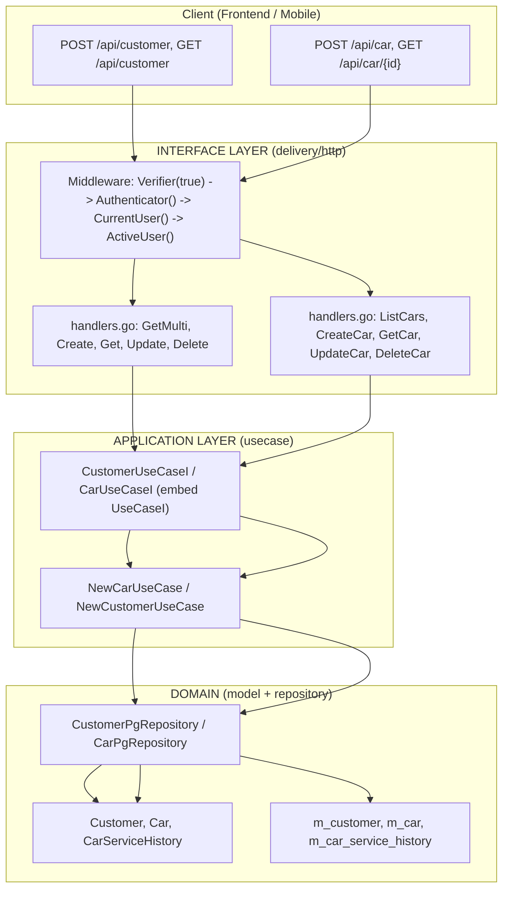

# Customer Management Module 

1. Auth  => C:\github\icmongolang\internal\modules\auth
2. Users => C:\github\icmongolang\internal\modules\users
3. Customer Management => C:\github\icmongolang\internal\modules\customer
4. Access Management Module

> **เป้าหมาย:** อธิบายโมดูล Customer Management ทั้งหมด ตั้งแต่โครงสร้างไฟล์, ข้อมูลหลัก (Entity), ตัวจัดการข้อมูลในแต่ละชั้น, เส้นทางเรียกใช้งาน HTTP API, ตารางฐานข้อมูล พร้อมตัวอย่างโค้ดจริงในระบบ เพื่อให้ทีมพัฒนาเข้าใจและต่อยอดได้ทันที

> **เหมาะสำหรับ:** นักพัฒนา Backend, Frontend, DevOps และผู้ที่ต้องการทำความเข้าใจระบบ

---

## สารบัญ

- [#1-ภาพรวมระบบ](#1-ภาพรวมระบบ)
- [#2-โครงสร้าง-Module](#2-โครงสร้าง-Module)
- [#3-DOMAIN-LAYER](#3-DOMAIN-LAYER)
  - [3.1 Entities](#31-entities)
  - [3.2 Value Objects](#32-value-objects)
  - [3.3 Repository Interfaces](#33-repository-interfaces)
  - [3.4 Domain Services](#34-domain-services)
  - [3.5 Domain Errors](#35-domain-errors)
- [#4-APPLICATION-LAYER](#4-APPLICATION-LAYER)
  - [4.1 Use Cases](#41-use-cases)
  - [4.2 DTOs](#42-dtos)
- [#5-INFRASTRUCTURE-LAYER](#5-INFRASTRUCTURE-LAYER)
- [#6-INTERFACE-LAYER](#6-INTERFACE-LAYER)
  - [6.1 HTTP Handlers](#61-http-handlers)
  - [6.2 Routes](#62-routes)
  - [6.3 Middleware](#63-middleware)
- [#7-Database-Migrations](#7-database-migrations)
- [#8-System-Flow](#8-system-flow)
- [#9-ภาคผนวก](#9-ภาคผนวก)

---

## 1. ภาพรวมระบบ

โมดูล Customer Management เป็นโมดูลกลางสำหรับจัดการข้อมูลลูกค้า (Customer) และรถยนต์ของลูกค้า (Car) ในระบบ โดยออกแบบให้ทุกตารางผูกกับ White label และผู้ใช้ (User) เพื่อรองรับการใช้งานหลายระบบ/หลายผู้ใช้ตั้งแต่ต้น

✅ **ฟีเจอร์หลัก**

- จัดการข้อมูลลูกค้า (Customer) ครบวงจร: เพิ่ม, ดูรายการ, ดูรายละเอียด, แก้ไข, ลบ
- จัดการข้อมูลรถยนต์ของลูกค้า (Car) ครบวงจร: เพิ่ม, ดูรายการ, ดูรายละเอียด, แก้ไข, ลบ
- บันทึกประวัติการเข้ารับบริการของรถยนต์ (CarServiceHistory) เชื่อมโยงกับงานบริการ (Job) ในระบบ
- ทุกตารางเก็บ WhitelabelID + UserID รองรับหลายระบบ/หลายผู้ใช้ โดยข้อมูลไม่ปะปนกัน
- ผู้ใช้ทั่วไปเห็นเฉพาะข้อมูลของตัวเอง (GetMultiByUserID) ขณะที่ Super User เห็นข้อมูลทั้งหมด (GetMulti)
- ใช้ UUID เป็นคีย์หลัก จากการสุ่มด้วย `gen_random_uuid()` รองรับการกระจายข้อมูลหลาย instance
- เก็บสถิติลูกค้า เช่น จำนวนครั้งที่มาใช้บริการ (TotalVisitCount) และยอดใช้จ่ายรวม (TotalSpent)

---

## 2. โครงสร้าง Module

โมดูลนี้จัดเก็บอยู่ที่ `internal\modules\customer` โดยแยกตามบทบาท (Clean Architecture) แต่โครงสร้างจริงในโปรเจกต์เป็นแบบแบน (flat) ตามนี้

```text
internal/modules/customer/
├── delivery/http/
│   ├── routes.go          (42 บรรทัด)   # ลงทะเบียนเส้นทาง HTTP ของโมดูล
│   └── handlers.go        (837 บรรทัด)  # ตัวจัดการ HTTP (handler) ของทุก endpoint
├── handler.go                            # นิยาม interface ของ Customer + Car handler
├── pg_repository.go                      # นิยาม interface ของ repository ในโมดูล
├── usecase.go                            # นิยาม interface ของ use case ในโมดูล
├── presenter/
│   └── presenters.go      (168 บรรทัด)   # DTO สำหรับรับ/ส่งข้อมูล (request/response)
├── repository/
│   └── pg_repository.go   (70 บรรทัด)    # repository ที่เชื่อมฐานข้อมูลจริง (GORM)
└── usecase/
    └── usecase.go         (69 บรรทัด)    # use case / business logic ของโมดูล
```

หมายเหตุ: โมดูลนี้ใช้ `chi` router (ไม่ใช่ gorilla) และไม่มี `router.go` ภายในโมดูล เพราะเส้นทางทั้งหมดถูกลงทะเบียนผ่าน `MapCustomerRoute` ซึ่งรับ `*chi.Mux` จากภายนอกเข้ามา

---

## 3. DOMAIN LAYER

### 3.1 Entities

#### 3.1.1 Customer (Aggregate Root)

Customer คือข้อมูลลูกค้าที่เป็นแกนกลางของโมดูล ถูกนิยามไว้ที่ `internal/models/models.go` บรรทัด 2076–2107 โดยทำหน้าที่เป็น Aggregate Root ของข้อมูลลูกค้า

| ฟิลด์ (Field) | ประเภทใน Go | tag / รายละเอียด |
| --- | --- | --- |
| ID | uuid | `default:gen_random_uuid();primaryKey` |
| CustomerCode | string | `varchar; not null` รหัสลูกค้า |
| FullName | string | `varchar; not null` ชื่อ-นามสกุล (เต็ม) |
| DisplayName | string | ชื่อที่แสดง |
| CustomerType | string | ประเภทลูกค้า (บุคคล / นิติบุคคล ฯลฯ) |
| Status | string | สถานะลูกค้า |
| TaxID | string | เลขผู้เสียภาษี |
| Email | string | อีเมล |
| PhoneNumber | string | เบอร์โทร |
| Province / City / District / PostalCode / Country | string | ที่อยู่ (`varchar(50)`, Country default `'Thailand'`) |
| ContactPerson / ContactPhone / Notes | string | ผู้ติดต่อ / เบอร์ติดต่อ / หมายเหตุ |
| LastVisitDate | *time.Time | วันมาใช้บริการครั้งล่าสุด (nullable) |
| TotalVisitCount | int | จำนวนครั้งที่มาใช้บริการ (`default:0`) |
| TotalSpent | float64 | ยอดใช้จ่ายรวม (`decimal(15,2); default:0`) |
| UserID / WhitelabelID | uuid | ผู้สร้าง / White label (`not null`) |
| CreatedAt | time.Time | วันที่สร้าง |
| UpdatedAt / DeletedAt | *time.Time | วันที่แก้ไข / ลบ (nullable) |
| Deleted | bool | flag ลบแบบ soft delete (`default:false`) |

- ตารางฐานข้อมูล: `m_customer`
- ฟังก์ชัน: `func (Customer) TableName() string { return "m_customer" }` (บรรทัด 2107)

#### 3.1.2 Car (รถยนต์ของลูกค้า)

Car เก็บข้อมูลรถแต่ละคันที่ผูกกับลูกค้า 1 คน ถูกนิยามไว้ที่ `models.go` บรรทัด 2109–2139 โดยมีคอมเมนต์ `// Car represents a customer's vehicle.` (บรรทัด 2109)

| ฟิลด์ (Field) | ประเภทใน Go | tag / รายละเอียด |
| --- | --- | --- |
| ID | uuid | `type:uuid; default:gen_random_uuid(); primaryKey` |
| CustomerID | uuid | `column:customer_id; type:uuid; not null` ผูกกับตาราง m_customer |
| LicensePlate | string | `column:license_plate; type:varchar(20); unique; not null` ทะเบียนรถ (ห้ามซ้ำกัน) |
| Province | *string | จังหวัดของทะเบียน (`varchar(50)`, nullable) |
| Brand | string | ยี่ห้อรถ (`varchar(50); not null`) |
| Model | string | รุ่น (`varchar(100); not null`) |
| SubModel | *string | รุ่นย่อย (`varchar(100)`, nullable) |
| Year | *int | ปีผลิต (nullable) |
| Color | *string | สี (`varchar(30)`, nullable) |
| EngineNumber / ChassisNumber | *string | เลขเครื่อง / เลขตัวถัง (`varchar(50)`, nullable) |
| FuelType / TransmissionType | *string | ประเภทน้ำมัน / เกียร์ (`varchar(20)`, nullable) |
| EngineCC / SeatingCapacity | *int | ขนาดเครื่อง (cc) / จำนวนที่นั่ง (nullable) |
| Mileage | int | ระยะไมล์สะสม (`default:0`) |
| LastServiceDate | *time.Time | วันที่เข้ารับบริการล่าสุด (nullable) |
| NextServiceMileage | *int | ระยะไมล์ที่ต้องเข้ารับบริการครั้งหน้า (nullable) |
| Notes | *string | หมายเหตุ (`text`, nullable) |
| IsActive | bool | สถานะใช้งาน / เลิกใช้ (`default:true`) |
| UserID / WhitelabelID | uuid | ผู้สร้าง / White label (`not null`) |
| CreatedAt | time.Time | วันที่สร้าง |
| UpdatedAt | *time.Time | วันที่แก้ไข (`column:updated_at`) |
| DeletedAt | *time.Time | วันที่ลบ (`column:deleted_at`) |
| Deleted | bool | flag ลบแบบ soft delete (`default:false`) |

- ตารางฐานข้อมูล: `m_car`
- ฟังก์ชัน: `func (Car) TableName() string { return "m_car" }` (บรรทัด 2139)

#### 3.1.3 CarServiceHistory (ประวัติการเข้ารับบริการของรถ)

CarServiceHistory บันทึกประวัติการเข้ารับบริการของรถแต่ละคัน ถูกนิยามไว้ที่ `models.go` บรรทัด 2142–2156 โดยมีคอมเมนต์ `// CarServiceHistory records vehicle service history.` (บรรทัด 2141)

| ฟิลด์ (Field) | ประเภทใน Go | tag / รายละเอียด |
| --- | --- | --- |
| ID | uuid | `type:uuid; default:gen_random_uuid(); primaryKey` |
| CarID | uuid | `column:car_id; type:uuid; not null` รถที่เข้ารับบริการ |
| JobID | uuid | `column:job_id; type:uuid; not null` งานบริการ (Job) ที่เกี่ยวข้อง |
| ServiceDate | time.Time | `column:service_date; not null` วันที่เข้ารับบริการ |
| ServiceType | *string | ประเภทบริการ (`varchar(50)`, nullable) |
| Description | *string | รายละเอียดบริการ (`text`, nullable) |
| TotalCost | *float64 | ค่าใช้จ่ายรวม (`decimal(15,2)`, nullable) |
| MileageAtService | *int | ไมล์ ณ วันที่เข้ารับบริการ (nullable) |
| MechanicName | *string | ช่างผู้ให้บริการ (`varchar(100)`, nullable) |
| WhitelabelID | uuid | White label (`not null`) |
| CreatedAt | time.Time | วันที่สร้าง |

- ตารางฐานข้อมูล: `m_car_service_history`
- ฟังก์ชัน: `func (CarServiceHistory) TableName() string { return "m_car_service_history" }` (บรรทัด 2156)

### 3.2 Value Objects

ในโมดูลนี้ ค่าที่เป็นข้อมูลเสริม (เช่น ที่อยู่, ข้อมูลติดต่อ, ประเภท/สถานะ) ถูกเก็บเป็นฟิลด์ปกติใน Entity โดยใช้ชนิดแบบ nullable (pointer) สำหรับค่าที่ไม่จำเป็นต้องระบุ จึงไม่จำเป็นต้องสร้าง Value Object แยกเพิ่มเติม และสามารถขยายได้ภายหลังเมื่อมีกฎของค่าที่ซับซ้อนขึ้น (เช่น validation ของ `LicensePlate` หรือ `TaxID`)

### 3.3 Repository Interfaces

interface ของ repository ถูกนิยามไว้ที่ไฟล์ `pg_repository.go` (โฟลเดอร์รากของโมดูล) โดยมี 2 interface หลักที่ฝัง (embed) repository มาตรฐานของระบบมาใช้งาน

- `CustomerPgRepository` — สำหรับจัดการข้อมูล Customer
  - ฝัง `internal.PgRepository[Customer]` ไว้ได้ CRUD มาตรฐานมาใช้
  - เพิ่ม `GetMultiByUserID` และ `Count`, `CountByUserID` สำหรับค้นแบบแบ่งตามผู้ใช้ และการแบ่งหน้า
- `CarPgRepository` — สำหรับจัดการข้อมูล Car
  - ฝัง `internal.PgRepository[Car]` ไว้ได้ CRUD มาตรฐานมาใช้
  - เพิ่ม `GetMultiByCustomerID` และ `CountByCustomerID` สำหรับค้นรถของลูกค้า และนับจำนวน

### 3.4 Domain Services

โมดูลนี้เน้นให้ business logic ทำงานผ่าน Use Case layer (ดูหัวข้อ 4.1) แทนการสร้าง Domain Service แยก หากมีกระบวนการที่ต้องใช้หลาย repository ร่วมกันภายหลัง (เช่น ตรวจสอบลูกค้าก่อนสร้างรถ) แนะนำให้เพิ่มเป็น Use Case ที่ชั้น Application แทน เพื่อให้โค้ดตรวจสอบง่ายและเป็นระเบียบ

### 3.5 Domain Errors

โมดูลใช้ชุด error กลางของระบบผ่านแพ็กเกจ `httpErrors`

- เมื่อ `{id}` ใน URL เป็น UUID ที่ไม่ถูกต้อง → ส่ง `httpErrors.ErrValidation` → ผลลัพธ์ HTTP 400
- error ของชั้น persistence (GORM) จะถูกแปลงโดย framework กลางของระบบให้อยู่ในรูปแบบ envelope `{ data, error, is_success }` พร้อม status code ที่เหมาะสม

---

## 4. APPLICATION LAYER

### 4.1 Use Cases

interface ของ use case ถูกนิยามไว้ที่ `usecase.go` (โฟลเดอร์ราก) มี 2 ตัวหลัก

- `CustomerUseCaseI` — ฝัง `internal.UseCaseI[Customer]` (CRUD มาตรฐาน) + `GetMultiByUserID` / `Count` / `CountByUserID`
- `CarUseCaseI` — ฝัง `internal.UseCaseI[Car]` + `GetMultiByCustomerID` / `CountByCustomerID`

การสร้างจริงใน `usecase/usecase.go` (69 บรรทัด)

```go
// ตัวอย่าง: การสร้าง Car Use Case
carUseCase := usecase.NewCarUseCase(pgRepo, cfg, logger)
// ภายใน NewCarUseCase จะฝัง usecase.CreateUseCase[models.Car](pgRepo, cfg, logger)
// ทำให้ได้ CRUD มาตรฐาน + ฟังก์ชันดึงรถตาม CustomerID ตาม interface CarUseCaseI ทันที
```

(อ้างอิง `usecase\usecase.go`)

### 4.2 DTOs

DTO อยู่ใน `presenter/presenters.go` (168 บรรทัด)

`CustomerUpdate` (บรรทัด 33–52) — ใช้สำหรับการแก้ไขลูกค้า โดยทุกฟิลด์เป็น pointer + `omitempty` เพื่อให้รู้ว่าฟิลด์ไหนถูกส่งเข้ามา (nil-guard)

| ฟิลด์ (Field) | ประเภท | หมายเหตุ |
| --- | --- | --- |
| customerCode | *string | รหัสลูกค้า |
| fullName | *string | ชื่อ-นามสกุล |
| displayName | *string | ชื่อที่แสดง |
| customerType / status | *string | ประเภท / สถานะ |
| taxId | *string | เลขผู้เสียภาษี |
| email / phoneNumber / secondaryPhone | *string | อีเมล / เบอร์หลัก / เบอร์รอง |
| address | *string | ที่อยู่ |
| province / city / district / postalCode / country | *string | ที่อยู่ย่อย |
| contactPerson / contactPhone | *string | ผู้ติดต่อ / เบอร์ติดต่อ |
| notes | *string | หมายเหตุ |

`CustomerResponse` (บรรทัด 54 เป็นต้นไป) — ใช้สำหรับส่งข้อมูลลูกค้ากลับ

- ID, CustomerCode, FullName, CustomerType, Status, PhoneNumber
- DisplayName, TaxID, Email, SecondaryPhone, Address, Province, City, District — ชนิด pointer
- พร้อม timestamp ที่เกี่ยวข้อง

รูปแบบการส่งข้อมูล (JSON) ตามมาตรฐานของระบบคือ camelCase และทุก response ถูกห่อด้วย envelope `{ "data": ..., "error": ..., "is_success": ... }`

---

## 5. INFRASTRUCTURE LAYER

คือส่วนที่เชื่อมกับฐานข้อมูลจริง อยู่ใน `repository/pg_repository.go` (70 บรรทัด) โดยสร้าง repository ผ่านตัวช่วยกลางของระบบ

```go
// ตัวอย่าง: การสร้าง repository ของ Car
carPgRepo := repository.CreatePgRepo[models.Car](db)

// การดึงรายการรถของลูกค้าตาม CustomerID (แบ่งหน้า)
//   Where("customer_id = ?", customerID.String()).Limit(limit).Offset(offset).Find(&objs)
// การนับจำนวนรถของลูกค้า
//   Model(&models.Car{}).Where("customer_id = ?", customerID.String()).Count(&count)
```

(อ้างอิง `repository\pg_repository.go`)

---

## 6. INTERFACE LAYER

### 6.1 HTTP Handlers

interface ของ handler ถูกนิยามไว้ที่ `handler.go` (โฟลเดอร์ราก) โดยมี 10 เมธอด ที่คืนค่าเป็น `func(w http.ResponseWriter, r *http.Request)` (pattern พื้นฐานของ net/http)

```text
Customer:
  - GetMulti   # GET    /customer      : ดึงรายการลูกค้า (แบ่งหน้า + ตามสิทธิ์ผู้ใช้)
  - Create     # POST   /customer      : สร้างลูกค้าใหม่
  - Get        # GET    /customer/{id} : ดึงรายละเอียดลูกค้า
  - Update     # PUT    /customer/{id} : แก้ไขลูกค้า
  - Delete     # DELETE /customer/{id} : ลบลูกค้า

Car:
  - ListCars   # GET    /car           : ดึงรายการรถ
  - CreateCar  # POST   /car           : สร้างรถใหม่
  - GetCar     # GET    /car/{id}      : ดึงรายละเอียดรถ
  - UpdateCar  # PUT    /car/{id}      : แก้ไขรถ
  - DeleteCar  # DELETE /car/{id}      : ลบรถ
```

ตัว implement อยู่ใน `delivery/http/handlers.go` (837 บรรทัด)

### 6.2 Routes

การลงทะเบียนเส้นทางอยู่ใน `delivery/http/routes.go` (42 บรรทัด) ผ่านฟังก์ชันที่รับ `*chi.Mux` และ `*middleware.MiddlewareManager` จากภายนอก

```go
func MapCustomerRoute(router *chi.Mux, h customer.Handlers, mw *middleware.MiddlewareManager)
```

เส้นทางทั้งหมด (ภายใต้ `/api`)

| Method | Path | Handler | คำอธิบาย |
| --- | --- | --- | --- |
| GET | /api/customer | GetMulti | รายการลูกค้า (แบ่งหน้า) |
| POST | /api/customer | Create | สร้างลูกค้า |
| GET | /api/customer/{id} | Get | ดูรายละเอียดลูกค้า |
| PUT | /api/customer/{id} | Update | แก้ไขลูกค้า |
| DELETE | /api/customer/{id} | Delete | ลบลูกค้า |
| GET | /api/car | ListCars | รายการรถ (แบ่งหน้า) |
| POST | /api/car | CreateCar | สร้างรถ |
| GET | /api/car/{id} | GetCar | ดูรายละเอียดรถ |
| PUT | /api/car/{id} | UpdateCar | แก้ไขรถ |
| DELETE | /api/car/{id} | DeleteCar | ลบรถ |

> หมายเหตุข้ามโมดูล: ยอดค้างชำระของลูกค้าดูได้จาก `GET /api/payments/outstanding/{customerId}` ซึ่งอธิบายไว้ในเอกสาร `4-Utility_and_Service_Modules.md`

### 6.3 Middleware

ทุกเส้นทางในโมดูลถูกป้องกันด้วย chain ของ middleware (เรียงลำดับการทำงาน)

```text
mw.Verifier(true)        # ตรวจ token / header ระดับต้นทาง
  → mw.Authenticator()   # ยืนยันตัวตนผู้ใช้จาก token
  → mw.CurrentUser()     # โหลดข้อมูลผู้ใช้ปัจจุบันเข้าสู่ context
  → mw.ActiveUser()      # ตรวจว่าผู้ใช้ยัง active อยู่หรือไม่
```

นอกจากนี้ภายใน handler ยังตรวจสิทธิ์เพื่อจำกัดขอบเขตข้อมูล

- ผู้ใช้ทั่วไป (`!user.IsSuperUser`) → ใช้ `GetMultiByUserID` + `CountByUserID` เพื่อดูเฉพาะข้อมูลตัวเอง
- Super User → ใช้ `GetMulti` + `Count` เพื่อดูข้อมูลทั้งหมด

---

## 7. Database Migrations

คำนิยามโครงสร้างตารางทั้งหมดของโมดูลนี้อยู่ในไฟล์ `migrations/20260712_new_modules_schema.sql` (และ seed ตัวอย่างใน `migrations/20260712_seed_data.sql`)

### ตารางหลักของโมดูล

```sql
-- m_customer  : ข้อมูลลูกค้า (บรรทัด 137)
--   id              UUID  DEFAULT gen_random_uuid() PRIMARY KEY
--   customer_code   VARCHAR NOT NULL
--   full_name       VARCHAR NOT NULL
--   user_id, whitelabel_id  UUID NOT NULL
--   ...

-- m_car  : ข้อมูลรถยนต์ของลูกค้า (บรรทัด 175)
--   customer_id    UUID NOT NULL REFERENCES m_customer(id) ON DELETE CASCADE
--   license_plate  VARCHAR(20) NOT NULL UNIQUE
--   ...
-- INDEX: idx_m_car_customer (บรรทัด 203)

-- m_car_service_history  : ประวัติการเข้ารับบริการของรถ (บรรทัด 210)
--   car_id        UUID NOT NULL REFERENCES m_car(id)
--   job_id        UUID NOT NULL
--   service_date  TIMESTAMP NOT NULL
--   ...
```

(อ้างอิง `migrations\20260712_new_modules_schema.sql`)

### ตารางที่เกี่ยวข้อง (ข้ามโมดูล)

โมดูลนี้เชื่อมโยงกับโมดูลอื่นในชุด schema เดียวกัน ได้แก่

| ตาราง | บรรทัด | ความเกี่ยวข้อง |
| --- | --- | --- |
| t_job_service_car_symptom | 92 | อาการรถที่บันทึกในงานบริการ (ผูกกับข้อมูลรถ) |
| t_quotation | 234 (idx 262) | ใบเสนอราคา; `RESTRICT` การลบ |
| t_payment | 400 (idx 417) | การชำระเงินของงานบริการ |
| t_payment_history | 442 (idx 452) | ประวัติการชำระเงิน |
| t_outstanding_balance | 457 (idx 469) | ยอดค้างชำระ (ใช้สำหรับ outstanding ของลูกค้า) |

### ข้อมูล seed

ใน `migrations/20260712_seed_data.sql` มีข้อมูลตัวอย่างที่เกี่ยวข้อง

- seed `m_car` (บรรทัด 99)
- seed `t_job` (บรรทัด 110)
- seed `t_quotation` (บรรทัด 141)
- seed `t_payment` (บรรทัด 180)

### หมายเหตุอื่น ๆ

- ตาราง `m_car` เดิมเคยมีอยู่ใน `icmon_database.sql` (บรรทัด 144246) และถูกย้ายมาเป็น schema ใหม่ของ `20260712_new_modules_schema.sql` นี้
- Template สำหรับสร้าง migration อ้างอิงจาก `internal\template\migration.sql`

---

## 8. System Flow

ภาพรวมการทำงานของโมดูล (Client → Interface → Application → Domain)



---

## 9. ภาคผนวก

ตัวอย่างโค้ดจริงที่เกี่ยวข้องกับโมดูลนี้ (อ้างอิงจากผลการตรวจสอบโค้ดในระบบ)

### 9.1 การค้นรถตาม CustomerID (repository)

`repository/pg_repository.go` (70 บรรทัด)

```go
// การสร้าง repository ผ่านตัวช่วยกลาง
carPgRepo := repository.CreatePgRepo[models.Car](db)

// การดึงรายการรถของลูกค้า (พร้อมแบ่งหน้า)
//   Where("customer_id = ?", customerID.String()).Limit(limit).Offset(offset).Find(&objs)
// การนับจำนวนรถของลูกค้า
//   Model(&models.Car{}).Where("customer_id = ?", customerID.String()).Count(&count)
```

### 9.2 TableName ของ Entity

`internal/models/models.go`

```go
func (Customer) TableName() string          { return "m_customer" }            // บรรทัด 2107
func (Car) TableName() string               { return "m_car" }                 // บรรทัด 2139
func (CarServiceHistory) TableName() string { return "m_car_service_history" } // บรรทัด 2156
```

### 9.3 รูปแบบการตอบกลับ (Envelope)

ทุก endpoint ตอบกลับในรูปแบบเดียวกันทั้งระบบ

```json
{
  "data": {},
  "error": null,
  "is_success": true
}
```

---

เอกสารฉบับนี้จัดทำขึ้นเพื่อเป็นข้อมูลอ้างอิงของโมดูล Customer Management โดยภาพรวมและสถาปัตยกรรมของโมดูลอื่น ๆ อ้างอิงจาก index ในตอนต้นเอกสาร