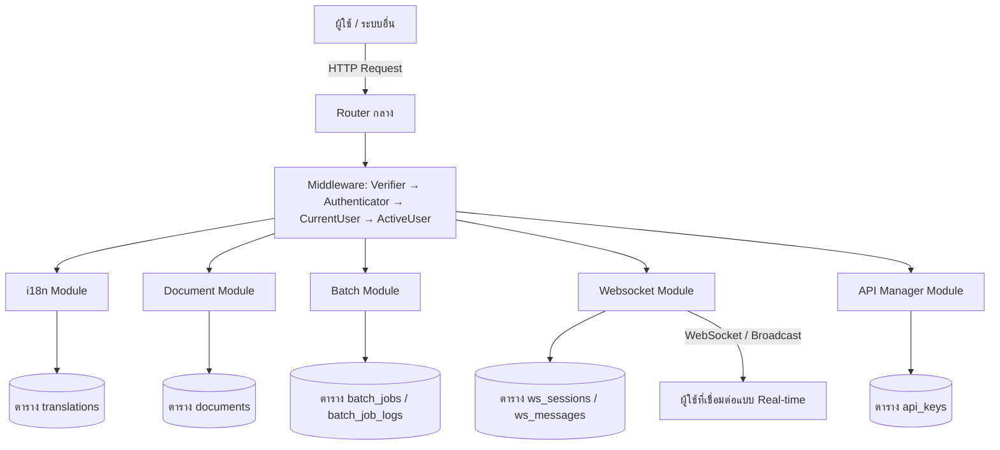
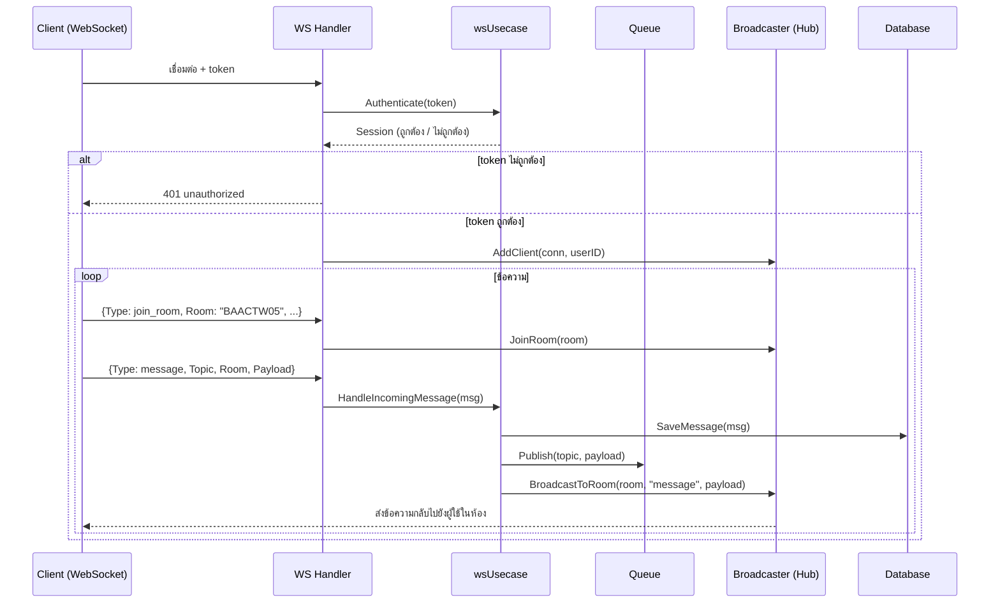
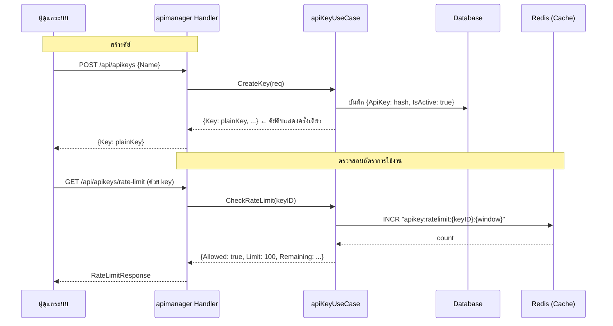

# 🧰 Utility & Service Modules (Documentation for Utility and Service Modules)

> โมดูลยูทิลิตี้และบริการของระบบ ประกอบด้วย 5 โมดูลย่อย ได้แก่
> 1. `i18n` — ระบบแปลภาษา (Internationalization)
> 2. `document` — ระบบจัดการเอกสาร
> 3. `batch` — ระบบงานประจำ / งานเบื้องหลัง (Scheduled Jobs)
> 4. `websocket` — ระบบเชื่อมต่อแบบ Real-time
> 5. `apimanager` — ระบบจัดการคีย์ของ API (API Key Management)

---

## สารบัญ

1. [ภาพรวมระบบ](#1-ภาพรวมระบบ)
2. [โครงสร้าง Module Utility & Service](#2-โครงสร้าง-module-utility--service)
3. [DOMAIN LAYER](#3-domain-layer)
4. [APPLICATION LAYER](#4-application-layer)
5. [INFRASTRUCTURE LAYER](#5-infrastructure-layer)
6. [INTERFACE LAYER](#6-interface-layer)
7. [Database Migrations](#7-database-migrations)
8. [Workflow Diagram](#8-workflow-diagram)
9. [ภาคผนวก: โค้ดที่มีอยู่ในโปรเจกต์ปัจจุบัน](#9-ภาคผนวก-โค้ดที่มีอยู่ในโปรเจกต์ปัจจุบัน)

---

## 1. ภาพรวมระบบ

### หลักการออกแบบ (สถาปัตยกรรม)

โมดูลยูทิลิตี้และบริการทั้ง 5 โมดูล ถูกออกแบบตาม **Clean Architecture** และแนวคิด **Domain-Driven Design (DDD)** เพื่อให้:

- ✅ **แยกความรับผิดชอบ** — แต่ละเลเยอร์ (Domain / Application / Infrastructure / Interface) มีหน้าที่ของตัวเอง ชัดเจน ไม่ปะปนกัน
- ✅ **ทดสอบได้ง่าย** — เพราะ dependency ถูกฉีดผ่าน Interface ทำให้เขียน Unit Test ได้สะดวก
- ✅ **บำรุงรักษาง่าย** — โค้ดเป็นระเบียบ เป็นไปตามรูปแบบเดียวกันทั้งระบบ
- ✅ **ยืดหยุ่นต่อการเปลี่ยนแปลง** — สามารถเปลี่ยนฐานข้อมูล / เพิ่มฟีเจอร์ใหม่ได้โดยไม่ต้องแก้งานหลัก

### คุณสมบัติหลักของแต่ละโมดูล

**1. โมดูล i18n (ระบบแปลภาษา)**

- ✅ จัดการข้อความแปลภาษาตาม `locale` และ `key`
- ✅ ดึงข้อความแปลภาษาทั้งหมดตาม locale
- ✅ สร้าง / แก้ไข / ลบรายการแปลภาษา
- ✅ ค้นหาข้อความแปลภาษาด้วย key

**2. โมดูล document (ระบบจัดการเอกสาร)**

- ✅ อัปโหลดเอกสาร (Upload)
- ✅ ดาวน์โหลดเอกสาร (Download)
- ✅ แสดงรายการเอกสาร (List)
- ✅ ลบเอกสาร (Delete)
- ✅ ค้นหาเอกสารด้วยชื่อไฟล์ (filename)

**3. โมดูล batch (ระบบงานประจำ / งานเบื้องหลัง)**

- ✅ สร้าง / แก้ไข / ลบงานประจำ (Batch Job)
- ✅ แสดงรายการและสถานะของงาน
- ✅ รันงานได้ทันที (Run Job Now)
- ✅ ดูบันทึกการทำงานของงาน (Job Logs)

**4. โมดูล websocket (ระบบเชื่อมต่อแบบ Real-time)**

- ✅ สร้างการเชื่อมต่อแบบ WebSocket กับเซิร์ฟเวอร์
- ✅ รับ-ส่งข้อความผ่านหัวข้อ (Topic) และห้อง (Room)
- ✅ สมัคร/เลิกสมัครห้อง (Subscribe / Unsubscribe)
- ✅ เข้าร่วม / ออกจากห้อง (Join Room / Leave Room)
- ✅ ส่งข้อความไปยังห้อง (Broadcast)
- ✅ ดูประวัติข้อความของหัวข้อ
- ✅ ดูห้องและสถิติของผู้ใช้งานในแต่ละห้อง
- ✅ ตรวจสอบสิทธิ์ผู้ใช้ (Session Validation)

**5. โมดูล apimanager (ระบบจัดการคีย์ของ API)**

- ✅ สร้าง API Key ใหม่
- ✅ เพิกถอน (Revoke) API Key
- ✅ ตรวจสอบอัตราการใช้งาน (Rate Limit)
- ✅ ดูรายงานการใช้งาน API Key
- ✅ แฮชคีย์ (Hash) เพื่อความปลอดภัย ไม่เก็บคีย์ตรง ๆ

---

## 2. โครงสร้าง Module Utility & Service

### โครงสร้างโมดูลย่อย

```
internal/modules/
│
├── i18n/                          # โมดูลแปลภาษา
│   ├── usecase.go                 # กำหนด Interface (I18nUseCaseI)
│   ├── pg_repository.go           # กำหนด Interface (I18nPgRepository)
│   ├── handler.go                 # ตัวจัดการ Handler (i18nHandler) + เขียนโมดูล
│   ├── delivery/
│   │   └── http/
│   │       ├── routes.go          # การตั้งเส้นทาง (MapI18nRoute)
│   │       └── handlers.go        # ฟังก์ชัน Handler ต่าง ๆ
│   ├── usecase/
│   │   └── usecase.go             # การ Implement Use Case (i18nUseCase)
│   ├── repository/
│   │   └── pg_repository.go       # การ Implement Repository (I18nPgRepo)
│   └── presenter/
│       └── presenters.go          # Request / Response ที่ใช้กับ API
│
├── document/                      # โมดูลจัดการเอกสาร
│   └── (โครงสร้างคล้ายกับ i18n)
│
├── batch/                         # โมดูลงานประจำ / งานเบื้องหลัง
│   └── (โครงสร้างคล้ายกับ i18n)
│
├── websocket/                     # โมดูลเชื่อมต่อแบบ Real-time
│   ├── interface.go               # กำหนด Interface (Broadcaster, WSUsecase)
│   ├── models/
│   │   └── ws_models.go           # โมเดลข้อมูล (WSMessage, Session)
│   ├── usecase/
│   │   ├── ws_usecase.go          # การ Implement Use Case (wsUsecase)
│   │   └── ws_usecase_test.go     # ไฟล์ทดสอบ
│   ├── repository/
│   │   ├── ws_repo.go             # กำหนด Interface Repository
│   │   └── postgres/
│   │       └── ws_repo_pg.go      # การ Implement Repository แบบ Postgres
│   ├── presenter/
│   │   └── ws_presenter.go        # Request / Response
│   └── delivery/
│       ├── ws/
│       │   └── handler.go         # Handler สำหรับการเชื่อมต่อ WebSocket
│       └── http/
│           └── handler.go         # Handler สำหรับ REST API (ส่งข้อความ ฯลฯ)
│
└── apimanager/                    # โมดูลจัดการคีย์ของ API
    ├── usecase/
    │   ├── usecase.go             # การ Implement Use Case + ฟังก์ชันช่วย
    │   └── usecase_test.go        # ไฟล์ทดสอบ
    ├── repository/
    │   └── pg_repository.go       # การ Implement Repository
    ├── presenter/
    │   └── presenter.go           # Request / Response
    └── delivery/
        └── http/
            ├── routes.go          # การตั้งเส้นทาง (MapApiManagerRoute)
            └── handler.go         # ฟังก์ชัน Handler ต่าง ๆ
```

---

## 3. DOMAIN LAYER

### โมดูล i18n

โมเดล `Translation` (ตาราง `translations`)

| ฟิลด์ | ประเภท | คำอธิบาย |
|------|--------|----------|
| `id` | int | รหัสประจำรายการแปลภาษา |
| `locale` | string | ภาษา เช่น `th`, `en` |
| `key` | string | คีย์ของข้อความ (ใช้ค้นหา) |
| `value` | string | ข้อความที่แปลแล้ว |
| `created_at` / `updated_at` | time | เวลาสร้าง / แก้ไข |

---

### โมดูล document

โมเดล `Document` (ตาราง `documents`)

| ฟิลด์ | ประเภท | คำอธิบาย |
|------|--------|----------|
| `id` | uuid.UUID | รหัสประจำเอกสาร |
| `filename` | string | ชื่อไฟล์ (ภายในระบบ) |
| `original_name` | string | ชื่อไฟล์ต้นฉบับ |
| `mime_type` | string | ประเภทไฟล์ เช่น `application/pdf` |
| `size` | int64 | ขนาดไฟล์ (ไบต์) |
| `created_at` | time | เวลาอัปโหลด |

---

### โมดูล batch

โมเดล `BatchJob` (ตาราง `batch_jobs`)

| ฟิลด์ | ประเภท | คำอธิบาย |
|------|--------|----------|
| `id` | uuid.UUID | รหัสประจำงาน |
| `name` | string | ชื่องาน |
| `type` | string | ประเภทงาน |
| `status` | string | สถานะ (เช่น running, completed, failed) |
| `config` | JSON | การตั้งค่างาน |
| `schedule` | *string | ตารางเวลารันงาน (ถ้ามี) |
| `total_count` / `success_count` / `fail_count` | int | จำนวนทั้งหมด / สำเร็จ / ล้มเหลว |
| `started_at` / `finished_at` | *time | เวลาเริ่ม / เสร็จสิ้น |
| `created_at` | LocalTime | เวลาสร้าง |

โมเดล `BatchJobLog` (ตาราง `batch_job_logs`)

| ฟิลด์ | ประเภท | คำอธิบาย |
|------|--------|----------|
| `id` | int | รหัสประจำบันทึก |
| `job_id` | uuid.UUID | รหัสของงาน |
| `message` | string | ข้อความบันทึก |
| `level` | string | ระดับ (เช่น info, warning, error) |
| `created_at` | LocalTime | เวลาบันทึก |

---

### โมดูล apimanager

```go
// SdApiKey: โครงสร้างคีย์ API ภายในระบบ
type SdApiKey struct {
    ID         int
    Name       string
    ApiKey     string   // คีย์ที่ถูกแฮช (hash) แล้ว
    ApiSecret  string   // คีย์ลับที่ถูกแฮชแล้ว
    IsActive   bool
    UsageCount int
    LastUsedAt *time.Time
    CreatedAt  *time.Time
}
```

---

## 4. APPLICATION LAYER

### โมดูล i18n

```go
// i18nUseCaseI: interface หลักของโมดูลแปลภาษา
type I18nUseCaseI interface {
    internal.UseCaseI[models.Translation] // ความสามารถ CRUD ทั่วไป

    // ดึงข้อความแปลตาม locale และ key
    GetByLocaleAndKey(ctx context.Context, locale, key string) (*models.Translation, error)

    // ดึงข้อความแปลทั้งหมดตาม locale
    GetByLocale(ctx context.Context, locale string) ([]*models.Translation, error)
}
```

**การ Implement (`i18nUseCase`)**

- ฝัง `usecase.UseCase[models.Translation]` เพื่อใช้ความสามารถ CRUD จากฐาน
- มี `pgRepo i18n.I18nPgRepository` สำหรับติดต่อฐานข้อมูล
- ฟังก์ชัน `CreateI18nUseCaseI(pgRepo, cfg, logger)` ใช้สร้าง Use Case ขึ้นมา

---

### โมดูล document

```go
// DocumentUseCaseI: interface หลักของโมดูลจัดการเอกสาร
type DocumentUseCaseI interface {
    // ... ความสามารถ CRUD ทั่วไป (ฝัง generics)

    // ค้นหาเอกสารด้วยชื่อไฟล์
    GetByFilename(ctx context.Context, filename string) (*models.Document, error)
}
```

**การ Implement (`documentUseCase`)**

- ฝัง `usecase.UseCase[models.Document]` เพื่อใช้ความสามารถ CRUD จากฐาน
- มี `pgRepo` สำหรับติดต่อฐานข้อมูล
- ฟังก์ชัน `CreateDocumentUseCaseI(pgRepo, cfg, logger)` ใช้สร้าง Use Case

---

### โมดูล batch

```go
// BatchUseCaseI: interface หลักของโมดูลงานประจำ
type BatchUseCaseI interface {
    internal.UseCaseI[models.BatchJob] // ความสามารถ CRUD ทั่วไป

    // รันงาน
    RunJob(ctx context.Context, id uuid.UUID) error

    // ดึงบันทึกการทำงานของงาน
    GetJobLogs(ctx context.Context, jobID uuid.UUID) ([]*models.BatchJobLog, error)
}
```

**การ Implement (`batchUseCase`)**

- ฝัง `usecase.UseCase[models.BatchJob]` เพื่อใช้ความสามารถ CRUD จากฐาน
- ฟังก์ชัน `RunJob` — ในโค้ดปัจจุบันยังเป็นฟีเจอร์แบบ TODO ที่จะสร้างบันทึกการทำงานด้วยข้อความ `"Job triggered manually"` ระดับ `info`
- ฟังก์ชัน `CreateBatchUseCaseI(pgRepo, cfg, logger)` ใช้สร้าง Use Case

---

### โมดูล websocket

```go
// WSUsecase: interface หลักของโมดูล Real-time
type WSUsecase interface {
    Authenticate(ctx context.Context, token string) (*models.Session, error)
    SaveMessage(ctx context.Context, msg *models.WSMessage) error
    GetTopicHistory(ctx context.Context, topic string, limit int) ([]*models.WSMessage, error)
    HandleIncomingMessage(ctx context.Context, msg *models.WSMessage) error
}

// Broadcaster: interface สำหรับกระจายข้อความไปยังผู้ใช้งาน
type Broadcaster interface {
    BroadcastToRoom(room, event string, payload interface{})
    BroadcastMessage(event string, payload interface{})
    GetRooms() []string
    GetClientsInRoom(room string) []string
}
```

**การ Implement (`wsUsecase`)**

- ประกอบด้วย `repo` (ฐานข้อมูล), `queue` (คิวข้อความ), `hub` (ตัวจัดการการเชื่อมต่อ)
- `GetTopicHistory` — ถ้าไม่ระบุจำนวน (หรือมากกว่า 100) จะใช้ค่าเริ่มต้นเป็น 50
- `HandleIncomingMessage` — บันทึกข้อความ แล้ว:
  - ถ้ามี `topic` จะส่งข้อความไปยังคิว (`queue.Publish`)
  - ถ้ามี `room` จะกระจายข้อความไปยังห้อง (`hub.BroadcastToRoom`)
- `ValidateSession` — ตรวจสอบ token ในตาราง `ws_sessions` ว่ายังไม่หมดอายุ

---

### โมดูล apimanager

ฟังก์ชันหลักของ `apimanager` ใช้ Case:

- **`CreateKey(ctx, req)`** — สร้าง API Key ใหม่:
  - `Name` ไม่มี → คืนค่า `ErrInvalidRequest`
  - สร้างคีย์ดิบ (`plainKey`) แล้วแฮช (`hashKey`) เก็บไว้
  - คืนค่าคีย์ดิบให้ผู้เรียกเพียงครั้งเดียว
- **`RevokeKey(ctx, keyID)`** — เพิกถอน API Key (ตั้ง `IsActive = false`)
  - หาไม่เจอ → `ErrKeyNotFound`
- **`CheckRateLimit(ctx, keyID)`** — ตรวจสอบอัตราการใช้งาน:
  - ถ้าไม่มี cache → อนุญาตเสมอ (Limit 100, Remaining 100)
  - ใช้ Redis `INCR` เพื่อนับจำนวนครั้งในรอบ 60 วินาที
  - `remaining = 100 - count` (ไม่ต่ำกว่า 0)
- **`Usage(ctx)`** — ดึงรายงานการใช้งานของทุก API Key

ฟังก์ชันช่วย (Helper):

```go
func parseIntID(s string) (int, error) // แปลง string → int (ตรวจสอบว่ามากกว่า 0)

func randomKey() string                // สร้างคีย์สุ่ม 24 ไบต์ → "apk_" + hex
                                     // (กรณีเกิด error จะใช้ "apk_" + base36 ของเวลา)

func hashKey(plain string) string      // แฮชด้วย sha256 → hex string
```

---

## 5. INFRASTRUCTURE LAYER

### โมดูล i18n

```go
// I18nPgRepository: interface สำหรับติดต่อฐานข้อมูล
type I18nPgRepository interface {
    repository.PgRepo[models.Translation] // ความสามารถ CRUD ทั่วไป

    // ดึงข้อความแปลตาม locale และ key
    GetByLocaleAndKey(ctx context.Context, locale, key string) (*models.Translation, error)

    // ดึงข้อความแปลทั้งหมดตาม locale
    GetByLocale(ctx context.Context, locale string) ([]*models.Translation, error)
}
```

**การ Implement (`I18nPgRepo`)**

- ฝัง `repository.PgRepo[models.Translation]` เพื่อใช้ความสามารถ CRUD จากฐาน
- มีฟิลด์ `DB *gorm.DB` (เชื่อมต่อฐานข้อมูล GORM)
- `GetByLocaleAndKey` → `Where("locale = ? AND key = ?", locale, key).First(&t)`
- `GetByLocale` → `Where("locale = ?", locale).Find(&translations)`
- ฟังก์ชัน `CreateI18nPgRepository(db)` ใช้สร้าง Repository

---

### โมดูล document

**การ Implement (`DocumentPgRepo`)**

- ฝัง `repository.PgRepo[models.Document]` เพื่อใช้ความสามารถ CRUD จากฐาน
- ฟังก์ชัน `GetByFilename` → `Where("filename = ?", filename).First(&doc)`

---

### โมดูล batch

```go
// BatchPgRepository: interface สำหรับติดต่อฐานข้อมูลของงานประจำ
type BatchPgRepository interface {
    internal.PgRepository[models.BatchJob] // ความสามารถ CRUD ทั่วไป

    GetLogsByJobId(ctx context.Context, jobID uuid.UUID) ([]*models.BatchJobLog, error)
    CreateLog(ctx context.Context, log *models.BatchJobLog) error
}
```

**การ Implement (`BatchPgRepo`)**

- ฝัง `internal.PgRepository[models.BatchJob]` + มีฟิลด์ `DB *gorm.DB` แยกชัดเจน
- `GetLogsByJobId` → `Where("job_id = ?", jobID).Order("created_at ASC").Find(&logs)` (เรียงจากเก่าไปใหม่)
- `CreateLog` → `DB.Create(log)`

---

### โมดูล websocket

โครงสร้างข้อมูลในฐานข้อมูล:

```go
// WSMessage: ข้อความที่ส่งภายในระบบ Real-time
type WSMessage struct {
    ID        int
    Topic     string
    Payload   string
    SenderID  string
    SentAt    time.Time
}

// Session: เซสชันการเชื่อมต่อ
type Session struct {
    ID        int
    UserID    string
    Token     string
    CreatedAt time.Time
    ExpiresAt time.Time
}
```

- `ws_repo.go` กำหนด Interface ของ Repository
- `repository/postgres/ws_repo_pg.go` คือการ Implement แบบ Postgres
- `ValidateSession` ใช้คำสั่ง SQL:
  ```sql
  SELECT id, user_id, token, created_at, expires_at
  FROM ws_sessions
  WHERE token = $1 AND expires_at > NOW()
  ```

---

### โมดูล apimanager

- Repository ติดต่อฐานข้อมูลผ่าน `repository/pg_repository.go`
- `repo` หรือ `cache` อาจเป็น `nil` ได้ — ในกรณีนั้นฟังก์ชันจะกลายเป็น no-op (ไม่ทำงาน) และใช้ค่าเริ่มต้น

---

## 6. INTERFACE LAYER

### การตั้งค่าความปลอดภัย (Security)

- โมดูล **i18n, document, batch, websocket** ใช้ Swagger annotation:
  - `@Security OAuth2Password`
  - `@Security BearerAuth`
- โมดูล **apimanager** ใช้เฉพาะ `@Security BearerAuth`

**Middleware chain (ลำดับการตรวจสอบสิทธิ์) ที่ใช้ร่วมกัน:**

```go
mw.Verifier(true)     // ตรวจสอบ JWT
  → mw.Authenticator() // ยืนยันตัวตน
  → mw.CurrentUser()   // ดึงข้อมูลผู้ใช้ปัจจุบัน
  → mw.ActiveUser()    // ตรวจสอบว่าผู้ใช้ยัง Active
```

---

### โมดูล i18n

**เส้นทาง API (`/api/i18n`)**

| เมธอด | เส้นทาง | คำอธิบาย |
|-------|---------|----------|
| `GET` | `/api/i18n/translations` | ดึงรายการแปลภาษา (มี query `locale` ไม่บังคับ) |
| `POST` | `/api/i18n/translations` | สร้างรายการแปลภาษาใหม่ |
| `GET` | `/api/i18n/translations/{key}` | ดึงรายการแปลตาม key |
| `PUT` | `/api/i18n/translations/{key}` | แก้ไขรายการแปลตาม key |
| `DELETE` | `/api/i18n/translations/{key}` | ลบรายการแปลตาม key |

**Request / Response (`presenter`)**

```go
// TranslationRequest: ข้อมูลที่ใช้สร้าง/แก้ไข
type TranslationRequest struct {
    Locale string `json:"locale" validate:"required,min=2,max=10"` // ภาษาที่กำหนด
    Key    string `json:"key"    validate:"required,min=1,max=255"` // คีย์ข้อความ
    Value  string `json:"value"  validate:"required"`               // ข้อความแปล
}

// TranslationResponse: ข้อมูลที่คืนกลับ
type TranslationResponse struct {
    ID        int
    Locale    string
    Key       string
    Value     string
    CreatedAt string
    UpdatedAt string
}
```

**ตัวอย่างฟังก์ชัน Handler — `GetTranslations`**

```go
// @Tags i18n
// @Router /api/i18n/translations [get]
func (h *i18nHandler) GetTranslations(w http.ResponseWriter, r *http.Request) {
    locale := r.URL.Query().Get("locale") // อ่าน query "locale"
    if locale != "" {
        // ถ้ามี locale → ดึงเฉพาะภาษานั้น
        translations, err := h.i18nUC.GetByLocale(r.Context(), locale)
        // ... ส่งผลลัพธ์กลับ
    } else {
        // ถ้าไม่มี locale → ดึงทั้งหมด (สูงสุด 1000 รายการ)
        translations, err := h.i18nUC.GetMulti(r.Context(), 1000, 0)
        // ... ส่งผลลัพธ์กลับ
    }
}
```

---

### โมดูล document

**เส้นทาง API (`/api/documents`)**

| เมธอด | เส้นทาง | คำอธิบาย |
|-------|---------|----------|
| `POST` | `/api/documents/` | อัปโหลดเอกสาร |
| `GET` | `/api/documents/` | แสดงรายการเอกสาร |
| `GET` | `/api/documents/{id}` | ดาวน์โหลดเอกสารตาม id |
| `DELETE` | `/api/documents/{id}` | ลบเอกสารตาม id |

**Request / Response (`presenter`)**

```go
// DocumentUploadRequest: ข้อมูลที่ใช้เมื่ออัปโหลด
type DocumentUploadRequest struct {
    Filename string `validate:"required"` // ชื่อไฟล์ในระบบ
    MimeType string `validate:"required"` // ประเภทไฟล์
    Size     int64  `validate:"required"` // ขนาดไฟล์ (ไบต์)
}

// DocumentResponse: ข้อมูลที่คืนกลับ
type DocumentResponse struct {
    ID           uuid.UUID
    Filename     string
    OriginalName string
    MimeType     string
    Size         int64
    CreatedAt    string
}
```

**Swagger** — `@Tags documents`, `@Router /api/documents [post]` (อัปโหลด)

---

### โมดูล batch

**เส้นทาง API (`/api/batch`)**

| เมธอด | เส้นทาง | คำอธิบาย |
|-------|---------|----------|
| `POST` | `/api/batch/jobs` | สร้างงานใหม่ |
| `GET` | `/api/batch/jobs` | แสดงรายการงาน |
| `GET` | `/api/batch/jobs/{id}` | แสดงรายละเอียดงาน |
| `PUT` | `/api/batch/jobs/{id}` | แก้ไขงาน |
| `DELETE` | `/api/batch/jobs/{id}` | ลบงาน |
| `POST` | `/api/batch/jobs/{id}/run` | รันงานทันที |
| `GET` | `/api/batch/jobs/{id}/logs` | แสดงบันทึกการทำงาน |

**Request / Response (`presenter`)**

```go
type BatchJobRequest struct {
    Name     string  `validate:"required"`
    Type     string  `validate:"required"`
    Config   string
    Schedule *string
}

type BatchJobResponse struct {
    ID           uuid.UUID
    Name         string
    Type         string
    Status       string
    Config       string
    Schedule     *string
    TotalCount   int
    SuccessCount int
    FailCount    int
    StartedAt    *time.Time
    FinishedAt   *time.Time
    CreatedAt    helpers.LocalTime
}

type BatchJobLogResponse struct {
    ID        int
    JobID     uuid.UUID
    Message   string
    Level     string
    CreatedAt helpers.LocalTime
}
```

**Swagger** — `@Tags batch`, `@Router /api/batch/jobs [post]` (สร้างงาน)

---

### โมดูล websocket

**การเชื่อมต่อ WebSocket**

- เส้นทางเชื่อมต่อรองรับ 2 วิธีเพื่อส่ง token:
  - ผ่าน query parameter: `?token=...`
  - ผ่าน HTTP header: `Authorization: Bearer ...`
- เมื่อไม่มี `usecase` (โหมดทดสอบ) ผู้ใช้จะถูกตั้งเป็น `anonymous`
- ถ้า token ไม่ถูกต้อง → คืนค่า HTTP `401 unauthorized`
- เมื่อเชื่อมต่อสำเร็จ → ระบบทำงาน `WritePump` เพื่อส่งข้อความให้ผู้ใช้

**โครงสร้างข้อความ (envelope)**

```go
type Envelope struct {
    Type    string          `json:"type"`
    Topic   string          `json:"topic,omitempty"`
    Room    string          `json:"room,omitempty"`
    Payload json.RawMessage `json:"payload,omitempty"`
}
```

**ประเภทข้อความที่รองรับ:**

| ประเภท | รายละเอียด |
|--------|------------|
| `subscribe` | สมัครติดตามหัวข้อ |
| `unsubscribe` | เลิกติดตามหัวข้อ |
| `join_room` | เข้าร่วมห้อง (ต้องมี `room`) |
| `leave_room` | ออกจากห้อง |
| `message` | ส่งข้อความ (ต้องมี `topic` หรือ `room`) |
| อื่น ๆ | ถูกมองว่าไม่รู้จัก (unknown) |

**REST API (`/api/ws`)**

| เมธอด | เส้นทาง | คำอธิบาย |
|-------|---------|----------|
| `POST` | `/api/ws/messages` | ส่งข้อความ (ต้องมี `room` และ `event` ไม่เช่นนั้น error 400) |
| `GET` | `/api/ws/messages` | ดึงข้อความ (query `room`, `limit` — ค่าเริ่มต้น 20) |
| `GET` | `/api/ws/rooms` | แสดงรายการห้อง (`RoomsResponse{Rooms, Count}`) |
| `GET` | `/api/ws/rooms/{room}/stats` | แสดงสถิติของห้อง (`RoomStatsResponse{Room, Clients}`) |

**การ maps หัวข้อ MQTT ไปยังห้อง (Room)**

- MQTT topic `BAACTW05/DATA` → ห้อง (room) คือส่วนแรก `BAACTW05`

---

### โมดูล apimanager

**เส้นทาง API**

| เมธอด | เส้นทาง | คำอธิบาย |
|-------|---------|----------|
| `POST` | `/api/apikeys` | สร้าง API Key |
| `DELETE` | `/api/apikeys/{key_id}` | เพิกถอน API Key (คืนค่า `{"status":"ok"}`) |
| `GET` | `/api/apikeys/rate-limit` | ตรวจสอบอัตราการใช้งาน (Rate Limit) |
| `GET` | `/api/apikeys/usage` | แสดงรายงานการใช้งาน |

**Request / Response (`presenter`)**

```go
type APIKeyRequest struct {
    Name    string
    Scopes  []string
    Revoke  bool
}

type APIKeyResponse struct {
    Key       string // คีย์ดิบ (แสดงครั้งเดียว)
    KeyID     string
    HashedKey string
    Name      string
    CreatedAt string
    Revoked   bool
}

type RateLimitResponse struct {
    Allowed   bool
    Limit     int
    Remaining int
    ResetIn   int64
}

type UsageEntry struct {
    KeyID     string
    Route     string
    Status    int
    LatencyMs int64
    At        string
}
```

**ตัวอย่างการสร้าง API Key (`CreateKey`)**

```go
func (uc *apiKeyUseCase) CreateKey(ctx context.Context, req presenter.APIKeyRequest) (*presenter.APIKeyResponse, error) {
    if req.Name == "" {
        return nil, ErrInvalidRequest
    }

    plainKey := randomKey()                        // สร้างคีย์ดิบ
    hashed := hashKey(plainKey)                    // แฮชคีย์
    sd := &SdApiKey{
        Name:      req.Name,
        ApiKey:    hashed,                          // เก็บเฉพาะคีย์ที่แฮชแล้ว
        ApiSecret: hashKey(plainKey + ":" + req.Name),
        IsActive:  true,
    }
    // ... บันทึกลงฐานข้อมูล และคืนค่า {Key: plainKey, ...}
}
```

---

## 7. Database Migrations

ในโครงสร้างของโมดูลทั้ง 5 (i18n, document, batch, websocket, apimanager) **ไม่พบไฟล์ Migration แยก** ภายในโฟลเดอร์โมดูล — ตารางข้อมูลต่างๆ ถูกจัดการผ่านการ Migration หรือ Schema ร่วมของระบบโดยรวมอยู่แล้ว (เช่น ตาราง `translations`, `documents`, `batch_jobs`, `batch_job_logs`, `ws_sessions`)

> ℹ️ ถ้าจำเป็นต้องสร้างหรือแก้ไขตารางเพิ่มเติม ให้ปรับที่จุดจัดการ Database Schema กลางของระบบ

---

## 8. Workflow Diagram

### 8.1 ภาพรวมการทำงานของ 5 โมดูล



### 8.2 โฟลว์การส่งข้อความแบบ Real-time (Websocket)



### 8.3 โฟลว์การสร้างและตรวจสอบ API Key (API Manager)



---

## 9. ภาคผนวก: โค้ดที่มีอยู่ในโปรเจกต์ปัจจุบัน

เนื้อหาส่วนนี้รวบรวมโค้ดสำคัญที่พบในโปรเจกต์ปัจจุบัน เพื่อเป็นข้อมูลอ้างอิงสำหรับนักพัฒนา

### 9.1 Interface ของโมดูล i18n (`internal/modules/i18n/usecase.go`)

```go
package i18n

import (
    "context"

    "github.com/khunponjampa/icmongolang/internal/models"
    "github.com/khunponjampa/icmongolang/internal/usecase"
)

// I18nUseCaseI defines the interface for the i18n use case
type I18nUseCaseI interface {
    usecase.UseCaseI[models.Translation]

    GetByLocaleAndKey(ctx context.Context, locale, key string) (*models.Translation, error)
    GetByLocale(ctx context.Context, locale string) ([]*models.Translation, error)
}
```

### 9.2 การ Implement Use Case i18n (`internal/modules/i18n/usecase/usecase.go`)

```go
package usecase

import (
    "github.com/khunponjampa/icmongolang/internal/config"
    "github.com/khunponjampa/icmongolang/internal/models"
    "github.com/khunponjampa/icmongolang/internal/modules/i18n"

    "go.uber.org/zap"
    "gorm.io/gorm"
)

type i18nUseCase struct {
    *usecase.UseCase[models.Translation]
    pgRepo i18n.I18nPgRepository
}

func (uc *i18nUseCase) GetByLocaleAndKey(ctx context.Context, locale, key string) (*models.Translation, error) {
    return uc.pgRepo.GetByLocaleAndKey(ctx, locale, key)
}

func (uc *i18nUseCase) GetByLocale(ctx context.Context, locale string) ([]*models.Translation, error) {
    return uc.pgRepo.GetByLocale(ctx, locale)
}

func CreateI18nUseCaseI(pgRepo i18n.I18nPgRepository, config *config.Config, logger *zap.Logger) i18n.I18nUseCaseI {
    return &i18nUseCase{
        UseCase: usecase.NewUseCase[models.Translation](pgRepo, config, logger),
        pgRepo:  pgRepo,
    }
}
```

### 9.3 Repository i18n (`internal/modules/i18n/repository/pg_repository.go`)

```go
package repository

import (
    "context"

    "github.com/khunponjampa/icmongolang/internal/models"
    "github.com/khunponjampa/icmongolang/internal/repository"
    "gorm.io/gorm"
)

type I18nPgRepo struct {
    *repository.PgRepo[models.Translation]
    DB *gorm.DB
}

func (r *I18nPgRepo) GetByLocaleAndKey(ctx context.Context, locale, key string) (*models.Translation, error) {
    var t models.Translation
    if err := r.DB.Where("locale = ? AND key = ?", locale, key).First(&t).Error; err != nil {
        return nil, err
    }
    return &t, nil
}

func (r *I18nPgRepo) GetByLocale(ctx context.Context, locale string) ([]*models.Translation, error) {
    var translations []*models.Translation
    if err := r.DB.Where("locale = ?", locale).Find(&translations).Error; err != nil {
        return nil, err
    }
    return translations, nil
}

func CreateI18nPgRepository(db *gorm.DB) i18n.I18nPgRepository {
    return &I18nPgRepo{
        PgRepo: repository.NewPgRepo[models.Translation](db),
        DB:     db,
    }
}
```

### 9.4 Handler และเส้นทาง i18n (`internal/modules/i18n/delivery/http/`)

```go
// routes.go
func MapI18nRoute(router chi.Router, h *i18nHandler, mw ...func(http.Handler) http.Handler) {
    router.Group(func(r chi.Router) {
        r.Use(mw...)
        r.Get("/translations", h.GetTranslations)
        r.Post("/translations", h.CreateTranslation)
        r.Get("/translations/{key}", h.GetTranslationByKey)
        r.Put("/translations/{key}", h.UpdateTranslation)
        r.Delete("/translations/{key}", h.DeleteTranslation)
    })
}
```

### 9.5 โมดูล document

**Use Case (`internal/modules/document/usecase.go`)**

```go
type DocumentUseCaseI interface {
    // ... CRUD ทั่วไป
    GetByFilename(ctx context.Context, filename string) (*models.Document, error)
}
```

**เส้นทาง API (`internal/modules/document/delivery/http/routes.go`)**

```go
func MapDocumentRoute(router chi.Router, h *documentHandler, mw ...func(http.Handler) http.Handler) {
    router.Group(func(r chi.Router) {
        r.Use(mw...)
        r.Post("/", h.Upload)     // POST /api/documents/
        r.Get("/", h.List)        // GET  /api/documents/
        r.Get("/{id}", h.Download) // GET  /api/documents/{id}
        r.Delete("/{id}", h.Delete) // DELETE /api/documents/{id}
    })
}
```

### 9.6 โมดูล batch

**Use Case (`internal/modules/batch/usecase.go`)**

```go
type BatchUseCaseI interface {
    internal.UseCaseI[models.BatchJob]
    RunJob(ctx context.Context, id uuid.UUID) error
    GetJobLogs(ctx context.Context, jobID uuid.UUID) ([]*models.BatchJobLog, error)
}
```

**เส้นทาง API (`internal/modules/batch/delivery/http/routes.go`)**

```go
func MapBatchRoute(router chi.Router, h *batchHandler, mw ...func(http.Handler) http.Handler) {
    router.Group(func(r chi.Router) {
        r.Use(mw...)
        r.Post("/jobs", h.CreateJob)          // POST   /api/batch/jobs
        r.Get("/jobs", h.ListJobs)            // GET    /api/batch/jobs
        r.Get("/jobs/{id}", h.GetJob)         // GET    /api/batch/jobs/{id}
        r.Put("/jobs/{id}", h.UpdateJob)      // PUT    /api/batch/jobs/{id}
        r.Delete("/jobs/{id}", h.DeleteJob)   // DELETE /api/batch/jobs/{id}
        r.Post("/jobs/{id}/run", h.RunJobNow) // POST   /api/batch/jobs/{id}/run
        r.Get("/jobs/{id}/logs", h.GetJobLogs) // GET   /api/batch/jobs/{id}/logs
    })
}
```

### 9.7 โมดูล websocket

**Interface (`internal/modules/websocket/interface.go`)**

```go
// Broadcaster: กระจายข้อความ
type Broadcaster interface {
    BroadcastToRoom(room, event string, payload interface{})
    BroadcastMessage(event string, payload interface{})
    GetRooms() []string
    GetClientsInRoom(room string) []string
}

// WSUsecase: ตรรกะหลักของ Real-time
type WSUsecase interface {
    Authenticate(ctx context.Context, token string) (*models.Session, error)
    SaveMessage(ctx context.Context, msg *models.WSMessage) error
    GetTopicHistory(ctx context.Context, topic string, limit int) ([]*models.WSMessage, error)
    HandleIncomingMessage(ctx context.Context, msg *models.WSMessage) error
}
```

**ส่วนหนึ่งของ `wsUsecase` (`internal/modules/websocket/usecase/ws_usecase.go`)**

```go
func (uc *wsUsecase) GetTopicHistory(ctx context.Context, topic string, limit int) ([]*models.WSMessage, error) {
    if limit <= 0 || limit > 100 {
        limit = 50 // ค่าเริ่มต้น
    }
    return uc.repo.GetTopicHistory(ctx, topic, limit)
}

func (uc *wsUsecase) HandleIncomingMessage(ctx context.Context, msg *models.WSMessage) error {
    // บันทึกข้อความ
    if err := uc.SaveMessage(ctx, msg); err != nil {
        return err
    }
    // ส่งไปยังคิว ถ้ามี topic
    if msg.Topic != "" {
        if err := uc.queue.Publish(ctx, msg.Topic, json.RawMessage(msg.Payload)); err != nil {
            return err
        }
    }
    // กระจายไปยังห้อง ถ้ามี room
    if msg.Room != "" {
        uc.hub.BroadcastToRoom(msg.Room, "message", msg.Payload)
    }
    return nil
}
```

### 9.8 โมดูล apimanager

**การ Implement Use Case (`internal/modules/apimanager/usecase/usecase.go`) — ส่วนสำคัญ**

```go
func (uc *apiKeyUseCase) CheckRateLimit(ctx context.Context, keyID string) (presenter.RateLimitResponse, error) {
    if keyID == "" {
        return presenter.RateLimitResponse{}, ErrInvalidRequest
    }

    // ถ้าไม่มี cache → อนุญาตเสมอด้วยค่าเริ่มต้น
    if uc.cache == nil {
        return presenter.RateLimitResponse{
            Allowed:   true,
            Limit:     100,
            Remaining: 100,
            ResetIn:   int64(rateLimitWindow.Seconds()),
        }, nil
    }

    key := "apikey:ratelimit:" + keyID
    window := time.Now().Unix() / 60 // รอบละ 60 วินาที
    windowKey := fmt.Sprintf("%s:%d", key, window)

    count, err := uc.cache.Incr(ctx, windowKey).Result()
    if err != nil {
        return presenter.RateLimitResponse{Allowed: true}, nil // no-op เมื่อ error
    }
    // ตั้งค่าให้หมดอายุเมื่อจบรอบ
    _ = uc.cache.Set(ctx, windowKey, count, rateLimitWindow)

    remaining := 100 - int(count)
    if remaining < 0 {
        remaining = 0
    }

    resetIn := (window+1)*60 - time.Now().Unix()
    if resetIn < 0 {
        resetIn = 0
    }

    return presenter.RateLimitResponse{
        Allowed:   count <= 100,
        Limit:     100,
        Remaining: remaining,
        ResetIn:   resetIn,
    }, nil
}
```

---

**เอกสารฉบับนี้เป็นส่วนหนึ่งของชุดเอกสารโมดูลของระบบ — ดูโมดูลอื่น ๆ ได้ที่โฟลเดอร์ `docs/modules/`**
