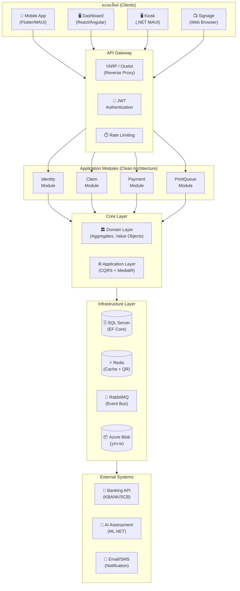
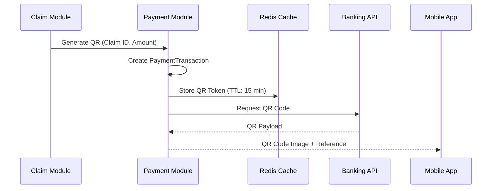
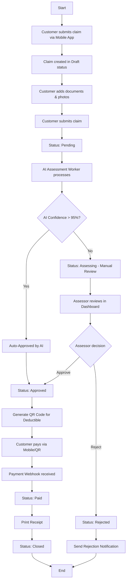
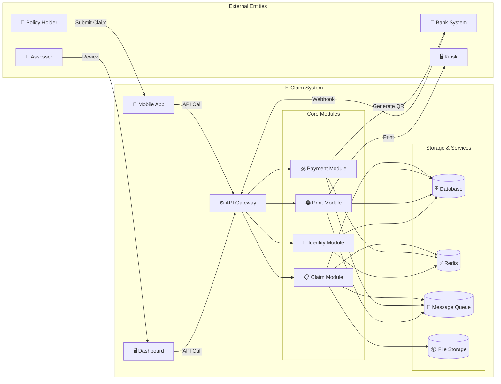

ขอตอบรับครับ! ผมจะจัดทำเอกสาร **ใหม่ทั้งหมด** ตั้งแต่ต้น โดยผสานสารบัญทั้งสองชุดเข้าไว้ด้วยกัน และเพิ่มเติมรายละเอียดเชิงลึกในทุกส่วน พร้อม **Code Examples, Database Schema, และ Workflow Diagrams** ที่สมบูรณ์แบบสำหรับระบบ E-Claim ประกันภัย

---

# 🏛️ ระบบ E-Claim ประกันภัยอัจฉริยะ (Smart Insurance Claim System)
## เอกสารออกแบบสถาปัตยกรรมและพัฒนาระบบ (Architecture & Development Guide)

---

## 📖 สารบัญ

1. [ภาพรวมระบบ](#1-ภาพรวมระบบ)
2. [โครงสร้าง Module](#2-โครงสร้าง-module)
3. [ระบบย่อยและโซนการทำงาน](#3-ระบบย่อยและโซนการทำงาน)
4. [Hardware Components](#4-hardware-components)
5. [Software Architecture](#5-software-architecture)
6. [Domain Layer](#6-domain-layer)
7. [Application Layer](#7-application-layer)
8. [Infrastructure Layer](#8-infrastructure-layer)
9. [Interface Layer](#9-interface-layer)
10. [Background Workers / Consumers](#10-background-workers--consumers)
11. [Database Migrations](#11-database-migrations)
12. [API Endpoints](#12-api-endpoints)
13. [Dashboard UI](#13-dashboard-ui)
14. [Mobile App](#14-mobile-app)
15. [QR Code & Payment System](#15-qr-code--payment-system)
16. [ระบบพิมพ์ใบเสร็จและบัตรจอดรถ](#16-ระบบพิมพ์ใบเสร็จและบัตรจอดรถ)
17. [Workflow Diagrams](#17-workflow-diagrams)
18. [การติดตั้งและใช้งาน](#18-การติดตั้งและใช้งาน)
19. [Frontend Integration Guide](#19-frontend-integration-guide)
20. [Business Model](#20-business-model)
21. [สรุปและแนวทางพัฒนาเพิ่มเติม](#21-สรุปและแนวทางพัฒนาเพิ่มเติม)

---

## 1. ภาพรวมระบบ

### 1.1 วิสัยทัศน์ (Vision)
ระบบ **E-Claim** คือแพลตฟอร์ม Digital Insurance Claims Management ที่ออกแบบมาเพื่อ **ลดระยะเวลาการจ่ายเคลมจาก 30 วันเหลือน้อยกว่า 24 ชั่วโมง** ด้วยการผสานเทคโนโลยี **AI Image Assessment, Real-time QR Payment, และ Self-Service Kiosk**

### 1.2 เป้าหมายหลัก (Objectives)
| ลำดับ | เป้าหมาย | ตัวชี้วัด (KPI) |
| :--- | :--- | :--- |
| 1 | ลดขั้นตอนการแจ้งเคลม | จาก 10 ขั้นตอนเหลือ 3 ขั้นตอน (ถ่ายรูป -> ส่ง -> รอผล) |
| 2 | เพิ่มความโปร่งใส | ผู้ใช้ติดตามสถานะได้แบบ Real-time ผ่าน Mobile App |
| 3 | รองรับการชำระเงินทันที | เชื่อมต่อ QR Payment ผ่านธนาคารชั้นนำ (KBANK, SCB, BBL) |
| 4 | ลดต้นทุนการดำเนินงาน | ระบบ Kiosk Self-Service ลดพนักงานรับเอกสาร 70% |

### 1.3 ผู้มีส่วนได้ส่วนเสีย (Stakeholders)
- **ผู้เอาประกัน (Policy Holder)** : ใช้งาน Mobile App เพื่อแจ้งเคลมและติดตามสถานะ
- **พนักงานประเมิน (Assessor)** : ใช้งาน Dashboard เพื่ออนุมัติ/ปฏิเสธเคลม
- **เจ้าหน้าที่แผนกเคลม (Claim Officer)** : ใช้งาน Dashboard และ Kiosk เพื่อจัดการเอกสาร
- **ผู้บริหาร (Executive)** : ดู Dashboard สรุปภาพรวม (KPI, สถิติ, Fraud Detection)
- **ธนาคาร (Banking Partner)** : รับ Webhook เพื่อชำระเงินผ่าน QR Code

---

## 2. โครงสร้าง Module (1 Module ต่อ 1 Folder)

ตามหลัก **Clean Architecture + DDD** เราจะจัดโครงสร้าง Solution เป็น **Modular Monolith** โดยแต่ละ Module เป็น **Self-Contained** และสามารถแยกเป็น Microservice ได้ในอนาคต

```
/src
├── BuildingBlocks/                              # Shared Libraries (Cross-Cutting)
│   ├── BuildingBlocks.Core/                     # Base Classes, Domain Primitives
│   │   ├── Domain/
│   │   │   ├── AggregateRoot.cs
│   │   │   ├── ValueObject.cs
│   │   │   └── DomainEvent.cs
│   │   ├── Application/
│   │   │   ├── ICommand.cs
│   │   │   ├── IQuery.cs
│   │   │   └── IUnitOfWork.cs
│   │   └── Infrastructure/
│   │       ├── IRepository.cs
│   │       └── IEventBus.cs
│   ├── BuildingBlocks.EventBus/                 
│   │   ├── RabbitMQ/
│   │   └── InMemory/
│   ├── BuildingBlocks.Logging/                  (Serilog)
│   └── BuildingBlocks.Security/                 (JWT, RBAC)
│
├── Modules/
│   ├── Identity/                                # Module 1: การจัดการผู้ใช้งาน
│   │   ├── 1_Application/
│   │   ├── 2_Domain/
│   │   ├── 3_Infrastructure/
│   │   ├── 4_Interface/
│   │   └── 5_Bootstrapper/
│   │
│   ├── Claim/                                   # Module 2: การจัดการเคลม (หลัก)
│   │   ├── 1_Application/
│   │   │   ├── Commands/
│   │   │   │   ├── SubmitClaim/
│   │   │   │   │   ├── SubmitClaimCommand.cs
│   │   │   │   │   ├── SubmitClaimCommandHandler.cs
│   │   │   │   │   └── SubmitClaimCommandValidator.cs
│   │   │   │   ├── ApproveClaim/
│   │   │   │   │   ├── ApproveClaimCommand.cs
│   │   │   │   │   └── ApproveClaimCommandHandler.cs
│   │   │   │   └── RejectClaim/
│   │   │   │       └── RejectClaimCommandHandler.cs
│   │   │   ├── Queries/
│   │   │   │   ├── GetClaimDetail/
│   │   │   │   │   └── GetClaimDetailQueryHandler.cs
│   │   │   │   └── GetClaimList/
│   │   │   │       └── GetClaimListQueryHandler.cs
│   │   │   ├── Events/
│   │   │   │   ├── ClaimSubmittedEvent.cs
│   │   │   │   ├── ClaimApprovedEvent.cs
│   │   │   │   └── ClaimRejectedEvent.cs
│   │   │   └── DTOs/
│   │   │       ├── ClaimRequestDto.cs
│   │   │       └── ClaimResponseDto.cs
│   │   │
│   │   ├── 2_Domain/
│   │   │   ├── Aggregates/
│   │   │   │   └── ClaimAggregate/
│   │   │   │       ├── Claim.cs                (Aggregate Root)
│   │   │   │       ├── ClaimStatus.cs          (Enum/Value Object)
│   │   │   │       ├── ClaimItem.cs            (Entity)
│   │   │   │       └── ClaimDocument.cs        (Entity)
│   │   │   ├── ValueObjects/
│   │   │   │   ├── Money.cs
│   │   │   │   ├── Address.cs
│   │   │   │   └── ContactInformation.cs
│   │   │   ├── Repositories/
│   │   │   │   └── IClaimRepository.cs
│   │   │   ├── Specifications/
│   │   │   │   ├── ClaimByDateSpecification.cs
│   │   │   │   └── ClaimByStatusSpecification.cs
│   │   │   └── Services/
│   │   │       └── IClaimNumberGenerator.cs    (Domain Service)
│   │   │
│   │   ├── 3_Infrastructure/
│   │   │   ├── Persistence/
│   │   │   │   ├── ClaimDbContext.cs
│   │   │   │   ├── Configurations/
│   │   │   │   │   ├── ClaimEntityConfiguration.cs
│   │   │   │   │   └── ClaimItemEntityConfiguration.cs
│   │   │   │   ├── Repositories/
│   │   │   │   │   └── ClaimRepository.cs      (Implement IClaimRepository)
│   │   │   │   └── Migrations/
│   │   │   │       └── 20260101000000_InitialCreate.cs
│   │   │   └── ExternalServices/
│   │   │       ├── IAssessmentService.cs
│   │   │       ├── AssessmentService.cs         (API Client)
│   │   │       └── IStorageService.cs           (Blob Storage)
│   │   │
│   │   ├── 4_Interface/
│   │   │   └── Controllers/
│   │   │       └── ClaimController.cs
│   │   │
│   │   ├── 5_Bootstrapper/
│   │   │   └── ClaimModuleExtensions.cs
│   │   │
│   │   └── 6_Tests/
│   │       ├── UnitTests/
│   │       ├── IntegrationTests/
│   │       └── Fixtures/
│   │
│   ├── Payment/                                 # Module 3: การชำระเงิน
│   │   ├── 1_Application/
│   │   │   ├── Commands/
│   │   │   │   ├── GenerateQRCommand.cs
│   │   │   │   ├── HandlePaymentCallbackCommand.cs
│   │   │   │   └── MarkClaimAsPaidCommand.cs
│   │   │   └── Queries/
│   │   │       └── GetPaymentStatusQuery.cs
│   │   ├── 2_Domain/
│   │   │   ├── Aggregates/
│   │   │   │   └── PaymentTransaction.cs
│   │   │   └── Repositories/
│   │   │       └── IPaymentRepository.cs
│   │   ├── 3_Infrastructure/
│   │   │   ├── BankingClients/
│   │   │   │   ├── IBankingClient.cs
│   │   │   │   ├── KbankClient.cs
│   │   │   │   └── ScbClient.cs
│   │   │   └── Redis/
│   │   │       └── QrCodeCacheService.cs
│   │   ├── 4_Interface/
│   │   │   └── Controllers/
│   │   │       └── PaymentController.cs
│   │   └── 5_Bootstrapper/
│   │       └── PaymentModuleExtensions.cs
│   │
│   └── PrintQueue/                              # Module 4: การพิมพ์ (Kiosk)
│       ├── 1_Application/
│       ├── 2_Domain/
│       ├── 3_Infrastructure/
│       │   ├── Printers/
│       │   │   ├── IThermalPrinter.cs
│       │   │   ├── EscPosPrinter.cs
│       │   │   └── LabelPrinter.cs
│       │   └── Queue/
│       │       └── PrintQueueService.cs
│       ├── 4_Interface/
│       └── 5_Bootstrapper/
│
├── Applications/                                # Host Projects
│   ├── EClaim.API/                              # REST API
│   │   ├── Program.cs
│   │   ├── appsettings.json
│   │   └── appsettings.Development.json
│   ├── EClaim.BackgroundWorker/                 # Consumer/Hosted Services
│   │   ├── Workers/
│   │   │   ├── AssessmentWorker.cs
│   │   │   └── PrintWorker.cs
│   │   └── Program.cs
│   └── EClaim.KioskApp/                         # .NET MAUI Kiosk App
│       └── MainPage.xaml.cs
│
└── docs/                                        # เอกสารประกอบ
    ├── api/
    ├── database/
    └── diagrams/
```

---

## 3. ระบบย่อยและโซนการทำงาน (Bounded Contexts)

ตามหลัก DDD เราจะแบ่งระบบเป็น **4 Bounded Contexts** เพื่อลดการ耦合และแยกความรับผิดชอบ:

| Bounded Context | ความรับผิดชอบหลัก | Aggregate Root | เหตุผลในการแยก |
| :--- | :--- | :--- | :--- |
| **Identity Context** | การจัดการผู้ใช้ (Policy Holder, Agent, Admin, Assessor), Authentication, Authorization | `User`, `Role` | แยกเพราะมีกฎการจัดการสิทธิ์เฉพาะ (RBAC) และสามารถใช้ร่วมกับระบบอื่นๆ ได้ |
| **Claim Context** | วงจรชีวิตของเคลม ตั้งแต่แจ้งเหตุจนถึงอนุมัติ/ปฏิเสธ | `Claim` | หัวใจของระบบ มี Business Rules ซับซ้อน (Deductible, Fraud Detection) |
| **Payment Context** | การสร้าง QR Code, รับ Webhook, ตรวจสอบสถานะการชำระเงิน | `PaymentTransaction` | แยกเพราะต้องเชื่อมต่อกับ Banking API และมีกฎความปลอดภัยเฉพาะ |
| **Print Context** | การจัดการคิวการพิมพ์, สั่งพิมพ์บัตร/ใบเสร็จ, เชื่อมต่อ Hardware | `PrintJob` | แยกเพราะเกี่ยวข้องกับ Hardware Physical และมี Latency สูง |

### 3.1 การสื่อสารระหว่าง Context (Context Mapping)
- **Shared Kernel**: `BuildingBlocks.Core` ถูกใช้ร่วมกันทั้งหมด
- **Conformist**: Claim Context ใช้ `IAssessmentService` จาก Infrastructure
- **Anti-Corruption Layer (ACL)**: Payment Context สร้าง ACL เพื่อป้องกันการเปลี่ยนแปลงจาก Banking API

---

## 4. Hardware Components (อุปกรณ์หน้าร้าน/หน้างาน)

| อุปกรณ์ | รุ่นที่แนะนำ | ฟังก์ชัน | การเชื่อมต่อ | คำสั่งควบคุม |
| :--- | :--- | :--- | :--- | :--- |
| **Ticket Printer** | Epson TM-T88VII | พิมพ์บัตรคิว/บัตรจอดรถ | USB, Ethernet, Bluetooth | ESC/POS Commands |
| **Receipt Printer** | Star TSP143III | พิมพ์ใบเสร็จรับเงิน | USB, Ethernet | Star Line Mode |
| **QR Scanner** | Zebra DS4600 | สแกน QR จาก Mobile App | USB (HID Keyboard) | Simulate Keyboard Input |
| **Signage Display** | LG 55UL3J | แสดงคิวและสถานะเคลม | HDMI + Raspberry Pi | Web Browser (Kiosk Mode) |
| **Thermal Label Printer** | Zebra ZD621 | พิมพ์สติกเกอร์ติดเอกสาร | USB, Ethernet | ZPL Commands |
| **Cash Drawer** | POSIFLEX CR-4000 | เปิดลิ้นชักเก็บเงิน | RJ-12 (เชื่อมต่อกับ Printer) | ESC/POS Command |

### 4.1 แผนภาพการเชื่อมต่อ Hardware (Network Topology)
```
[Router/WiFi] 
    |
    ├── [Ticket Printer] (IP: 192.168.1.100)
    ├── [Receipt Printer] (IP: 192.168.1.101)
    ├── [QR Scanner] (USB to Kiosk PC)
    ├── [Signage Display] (IP: 192.168.1.102)
    └── [Kiosk PC] (IP: 192.168.1.10)
           |
           └── [Main Server] (Cloud/On-Premise)
```

---

## 5. Software Architecture (Clean Architecture + DDD)

### 5.1 Architecture Diagram (High-Level)


### 5.2 Layer Dependencies (Clean Architecture)
```
┌─────────────────────────────────────────────────────────┐
│  Interface Layer (Controllers, UI)                     │  <- External Dependencies (JSON, HTTP)
├─────────────────────────────────────────────────────────┤
│  Application Layer (Commands, Queries, Handlers)      │  <- Depends on Domain
├─────────────────────────────────────────────────────────┤
│  Domain Layer (Entities, Value Objects, Interfaces)    │  <- No External Dependencies
├─────────────────────────────────────────────────────────┤
│  Infrastructure Layer (Repositories, Services)        │  <- Implements Domain Interfaces
└─────────────────────────────────────────────────────────┘
```

**กฎเหล็ก**:
- **Domain Layer** ห้ามอ้างอิง Layer อื่นๆ (Pure C#)
- **Application Layer** อ้างอิงได้เฉพาะ Domain + Interfaces
- **Infrastructure Layer** อ้างอิงทุก Layer (Implementation)

---

## 6. Domain Layer (หัวใจของระบบ DDD)

### 6.1 Aggregate: `Claim` (Aggregate Root)

```csharp
// Modules/Claim/2_Domain/Aggregates/ClaimAggregate/Claim.cs
public class Claim : AggregateRoot<Guid>
{
    // ============ Properties ============
    public string ClaimNumber { get; private set; }          // CLM-2026-000001
    public Guid PolicyId { get; private set; }
    public Guid UserId { get; private set; }                 // ผู้เอาประกัน
    public Money EstimatedDamage { get; private set; }       // ค่าประมาณความเสียหาย
    public Money DeductibleAmount { get; private set; }      // ค่า Deductible
    public Money AssessedAmount { get; private set; }        // จำนวนที่ประเมินจริง
    public ClaimStatus Status { get; private set; }
    public DateTime AccidentDate { get; private set; }
    public DateTime IncidentReportedAt { get; private set; }
    public Address AccidentLocation { get; private set; }
    public string Description { get; private set; }
    public string RejectionReason { get; private set; }
    public bool IsFraudSuspected { get; private set; }
    
    // ============ Collections ============
    private List<ClaimItem> _items = new();
    public IReadOnlyCollection<ClaimItem> Items => _items.AsReadOnly();
    
    private List<ClaimDocument> _documents = new();
    public IReadOnlyCollection<ClaimDocument> Documents => _documents.AsReadOnly();
    
    private List<ClaimStatusHistory> _statusHistory = new();
    public IReadOnlyCollection<ClaimStatusHistory> StatusHistory => _statusHistory.AsReadOnly();
    
    // ============ Constructor ============
    private Claim() { } // For EF Core
    
    public Claim(
        Guid policyId, 
        Guid userId, 
        DateTime accidentDate,
        Address accidentLocation,
        Money estimatedDamage,
        string description,
        IClaimNumberGenerator numberGenerator)
    {
        Id = Guid.NewGuid();
        PolicyId = policyId;
        UserId = userId;
        AccidentDate = accidentDate;
        AccidentLocation = accidentLocation;
        EstimatedDamage = estimatedDamage;
        Description = description;
        IncidentReportedAt = DateTime.UtcNow;
        Status = ClaimStatus.Draft;
        ClaimNumber = numberGenerator.Generate();
        IsFraudSuspected = false;
        
        ValidateBusinessRules();
        AddDomainEvent(new ClaimCreatedEvent(this));
    }
    
    // ============ Business Methods ============
    
    /// <summary>
    /// ส่งเรื่องเคลม (เปลี่ยนจาก Draft -> Pending)
    /// </summary>
    public void Submit(Money deductible)
    {
        if (Status != ClaimStatus.Draft)
            throw new DomainException("สามารถส่งเรื่องได้เฉพาะเคลมที่อยู่ในสถานะ Draft เท่านั้น");
            
        if (deductible.Amount < 0)
            throw new DomainException("Deductible ต้องมีค่ามากกว่าหรือเท่ากับ 0");
            
        // Business Rule: Deductible ต้องไม่เกิน 50% ของ Estimated Damage
        if (deductible.Amount > EstimatedDamage.Amount * 0.5m)
            deductible = new Money(EstimatedDamage.Amount * 0.5m, EstimatedDamage.Currency);
            
        DeductibleAmount = deductible;
        Status = ClaimStatus.Pending;
        AddStatusHistory("Submitted", "ผู้ใช้ส่งเรื่องเคลม");
        AddDomainEvent(new ClaimSubmittedEvent(Id, ClaimNumber));
    }
    
    /// <summary>
    /// อนุมัติเคลม (โดย Assessor)
    /// </summary>
    public void Approve(Money assessedAmount, Guid assessorId)
    {
        if (Status != ClaimStatus.Assessing)
            throw new DomainException("สามารถอนุมัติได้เฉพาะเคลมที่อยู่ในสถานะ Assessing เท่านั้น");
            
        if (assessedAmount.Amount <= 0)
            throw new DomainException("จำนวนเงินที่ประเมินต้องมากกว่า 0");
            
        // Business Rule: ถ้าประเมินแล้วสูงกว่า 1,000,000 บาท ต้องอนุมัติโดยผู้บริหาร
        if (assessedAmount.Amount > 1000000 && !IsExecutiveApprovalRequired)
            throw new DomainException("เคลมที่มีมูลค่าสูงกว่า 1,000,000 บาท ต้องได้รับการอนุมัติจากผู้บริหาร");
            
        AssessedAmount = assessedAmount;
        Status = ClaimStatus.Approved;
        AddStatusHistory("Approved", $"อนุมัติโดย Assessor ID: {assessorId}, จำนวนเงิน: {assessedAmount.Amount:N2}");
        AddDomainEvent(new ClaimApprovedEvent(Id, ClaimNumber, assessedAmount, DeductibleAmount));
    }
    
    /// <summary>
    /// ปฏิเสธเคลม
    /// </summary>
    public void Reject(string reason, Guid assessorId)
    {
        if (Status != ClaimStatus.Assessing && Status != ClaimStatus.Pending)
            throw new DomainException("สามารถปฏิเสธได้เฉพาะเคลมที่อยู่ในสถานะ Pending หรือ Assessing เท่านั้น");
            
        if (string.IsNullOrWhiteSpace(reason))
            throw new DomainException("ต้องระบุเหตุผลในการปฏิเสธ");
            
        Status = ClaimStatus.Rejected;
        RejectionReason = reason;
        AddStatusHistory("Rejected", $"ปฏิเสธโดย Assessor ID: {assessorId}, เหตุผล: {reason}");
        AddDomainEvent(new ClaimRejectedEvent(Id, ClaimNumber, reason));
    }
    
    /// <summary>
    /// เปลี่ยนสถานะเป็น Paid (เมื่อชำระเงินแล้ว)
    /// </summary>
    public void MarkAsPaid(Guid transactionId)
    {
        if (Status != ClaimStatus.Approved)
            throw new DomainException("สามารถทำเครื่องหมายว่าชำระเงินแล้วได้เฉพาะเคลมที่ Approved เท่านั้น");
            
        Status = ClaimStatus.Paid;
        AddStatusHistory("Paid", $"ชำระเงินแล้ว, Transaction ID: {transactionId}");
        AddDomainEvent(new ClaimPaidEvent(Id, ClaimNumber, transactionId));
    }
    
    /// <summary>
    /// เพิ่มเอกสารประกอบการเคลม
    /// </summary>
    public void AddDocument(string fileName, string fileUrl, string fileType, long fileSize)
    {
        var document = new ClaimDocument(
            Guid.NewGuid(),
            Id,
            fileName,
            fileUrl,
            fileType,
            fileSize,
            DateTime.UtcNow
        );
        _documents.Add(document);
    }
    
    /// <summary>
    /// เพิ่มรายการเคลม (เช่น ค่าซ่อมรถ, ค่ารักษาพยาบาล)
    /// </summary>
    public void AddClaimItem(string description, Money amount, string category)
    {
        var item = new ClaimItem(
            Guid.NewGuid(),
            Id,
            description,
            amount,
            category
        );
        _items.Add(item);
    }
    
    // ============ Private Methods ============
    private void ValidateBusinessRules()
    {
        // Rule: วันที่เกิดเหตุต้องไม่เกินปัจจุบัน
        if (AccidentDate > DateTime.UtcNow)
            throw new DomainException("วันที่เกิดเหตุต้องไม่เกินปัจจุบัน");
            
        // Rule: ระยะเวลาแจ้งเหตุต้องไม่เกิน 7 วัน (ยกเว้นกรณีพิเศษ)
        var daysSinceAccident = (DateTime.UtcNow - AccidentDate).TotalDays;
        if (daysSinceAccident > 7)
            throw new DomainException($"ต้องแจ้งเหตุภายใน 7 วัน (แจ้งภายหลัง {daysSinceAccident:F0} วัน)");
    }
    
    private void AddStatusHistory(string status, string note)
    {
        _statusHistory.Add(new ClaimStatusHistory(
            Guid.NewGuid(),
            Id,
            status,
            note,
            DateTime.UtcNow
        ));
    }
    
    // ============ Value Objects ============
    public enum ClaimStatus
    {
        Draft = 0,      // กำลังร่าง
        Pending = 1,    // รอการตรวจสอบ
        Assessing = 2,  // กำลังประเมิน
        Approved = 3,   // อนุมัติ
        Rejected = 4,   // ปฏิเสธ
        Paid = 5,       // จ่ายเงินแล้ว
        Closed = 6      // ปิดเรื่อง
    }
}
```

### 6.2 Value Object: `Money`

```csharp
// Modules/Claim/2_Domain/ValueObjects/Money.cs
public class Money : ValueObject
{
    public decimal Amount { get; }
    public string Currency { get; }  // THB, USD, EUR
    
    public Money(decimal amount, string currency = "THB")
    {
        if (amount < 0)
            throw new DomainException("Amount must be non-negative");
            
        if (string.IsNullOrWhiteSpace(currency))
            throw new DomainException("Currency is required");
            
        Amount = Math.Round(amount, 2);
        Currency = currency.ToUpperInvariant();
    }
    
    public Money Add(Money other)
    {
        if (Currency != other.Currency)
            throw new DomainException($"Cannot add different currencies: {Currency} and {other.Currency}");
            
        return new Money(Amount + other.Amount, Currency);
    }
    
    public Money Subtract(Money other)
    {
        if (Currency != other.Currency)
            throw new DomainException($"Cannot subtract different currencies: {Currency} and {other.Currency}");
            
        if (Amount < other.Amount)
            throw new DomainException("Insufficient funds");
            
        return new Money(Amount - other.Amount, Currency);
    }
    
    public Money Multiply(decimal multiplier)
    {
        if (multiplier < 0)
            throw new DomainException("Multiplier must be non-negative");
            
        return new Money(Amount * multiplier, Currency);
    }
    
    protected override IEnumerable<object> GetEqualityComponents()
    {
        yield return Amount;
        yield return Currency;
    }
    
    public override string ToString() => $"{Currency} {Amount:N2}";
}
```

### 6.3 Entity: `ClaimItem`

```csharp
// Modules/Claim/2_Domain/Aggregates/ClaimAggregate/ClaimItem.cs
public class ClaimItem : Entity<Guid>
{
    public Guid ClaimId { get; private set; }
    public string Description { get; private set; }
    public Money Amount { get; private set; }
    public string Category { get; private set; }  // Auto, Medical, Property, etc.
    public bool IsApproved { get; private set; }
    
    public ClaimItem(Guid id, Guid claimId, string description, Money amount, string category)
    {
        Id = id;
        ClaimId = claimId;
        Description = description;
        Amount = amount;
        Category = category;
        IsApproved = false;
    }
    
    public void Approve()
    {
        IsApproved = true;
    }
}
```

### 6.4 Domain Service: `IClaimNumberGenerator`

```csharp
// Modules/Claim/2_Domain/Services/IClaimNumberGenerator.cs
public interface IClaimNumberGenerator
{
    string Generate();
}

// Modules/Claim/3_Infrastructure/Services/ClaimNumberGenerator.cs
public class ClaimNumberGenerator : IClaimNumberGenerator
{
    private static readonly object _lock = new();
    private static int _lastNumber = 0;
    
    public string Generate()
    {
        lock (_lock)
        {
            _lastNumber++;
            var year = DateTime.UtcNow.ToString("yyyy");
            return $"CLM-{year}-{_lastNumber:D6}";
        }
    }
}
```

### 6.5 Domain Event

```csharp
// Modules/Claim/1_Application/Events/ClaimSubmittedEvent.cs
public class ClaimSubmittedEvent : DomainEvent
{
    public Guid ClaimId { get; }
    public string ClaimNumber { get; }
    public DateTime SubmittedAt { get; }
    
    public ClaimSubmittedEvent(Guid claimId, string claimNumber)
    {
        ClaimId = claimId;
        ClaimNumber = claimNumber;
        SubmittedAt = DateTime.UtcNow;
    }
}

// Modules/Claim/1_Application/Events/ClaimApprovedEvent.cs
public class ClaimApprovedEvent : DomainEvent
{
    public Guid ClaimId { get; }
    public string ClaimNumber { get; }
    public Money AssessedAmount { get; }
    public Money DeductibleAmount { get; }
    
    public ClaimApprovedEvent(Guid claimId, string claimNumber, Money assessedAmount, Money deductibleAmount)
    {
        ClaimId = claimId;
        ClaimNumber = claimNumber;
        AssessedAmount = assessedAmount;
        DeductibleAmount = deductibleAmount;
    }
}
```

---

## 7. Application Layer (CQRS + MediatR)

### 7.1 Command: SubmitClaim

```csharp
// Modules/Claim/1_Application/Commands/SubmitClaim/SubmitClaimCommand.cs
public record SubmitClaimCommand : IRequest<ClaimResponseDto>
{
    public Guid PolicyId { get; init; }
    public Guid UserId { get; init; }
    public DateTime AccidentDate { get; init; }
    public string AccidentLocation { get; init; }
    public decimal EstimatedAmount { get; init; }
    public string Currency { get; init; }
    public string Description { get; init; }
    public List<ClaimDocumentDto> Documents { get; init; }
    public List<ClaimItemDto> Items { get; init; }
}

public record ClaimDocumentDto
{
    public string FileName { get; init; }
    public string FileUrl { get; init; }
    public string FileType { get; init; }
    public long FileSize { get; init; }
}

public record ClaimItemDto
{
    public string Description { get; init; }
    public decimal Amount { get; init; }
    public string Category { get; init; }
}
```

### 7.2 Command Handler

```csharp
// Modules/Claim/1_Application/Commands/SubmitClaim/SubmitClaimCommandHandler.cs
public class SubmitClaimCommandHandler : IRequestHandler<SubmitClaimCommand, ClaimResponseDto>
{
    private readonly IClaimRepository _claimRepository;
    private readonly IUnitOfWork _unitOfWork;
    private readonly IClaimNumberGenerator _numberGenerator;
    private readonly IEventBus _eventBus;
    private readonly IStorageService _storageService;
    private readonly IPolicyService _policyService; // External Service
    
    public SubmitClaimCommandHandler(
        IClaimRepository claimRepository,
        IUnitOfWork unitOfWork,
        IClaimNumberGenerator numberGenerator,
        IEventBus eventBus,
        IStorageService storageService,
        IPolicyService policyService)
    {
        _claimRepository = claimRepository;
        _unitOfWork = unitOfWork;
        _numberGenerator = numberGenerator;
        _eventBus = eventBus;
        _storageService = storageService;
        _policyService = policyService;
    }
    
    public async Task<ClaimResponseDto> Handle(SubmitClaimCommand request, CancellationToken cancellationToken)
    {
        // 1. Validate Policy
        var policy = await _policyService.GetPolicyAsync(request.PolicyId, cancellationToken);
        if (policy == null)
            throw new NotFoundException($"ไม่พบกรมธรรม์ ID: {request.PolicyId}");
            
        if (!policy.IsActive)
            throw new DomainException("กรมธรรม์นี้หมดอายุแล้ว");
            
        // 2. Create Address Value Object
        var location = Address.FromString(request.AccidentLocation);
        
        // 3. Create Money Value Object
        var estimatedDamage = new Money(request.EstimatedAmount, request.Currency);
        
        // 4. Create Claim Aggregate
        var claim = new Claim(
            request.PolicyId,
            request.UserId,
            request.AccidentDate,
            location,
            estimatedDamage,
            request.Description,
            _numberGenerator
        );
        
        // 5. Add Documents (Upload to Blob Storage)
        foreach (var docDto in request.Documents)
        {
            // Upload file to Azure Blob
            var fileUrl = await _storageService.UploadAsync(
                docDto.FileName, 
                Convert.FromBase64String(docDto.FileUrl),
                cancellationToken
            );
            
            claim.AddDocument(docDto.FileName, fileUrl, docDto.FileType, docDto.FileSize);
        }
        
        // 6. Add Claim Items
        foreach (var itemDto in request.Items)
        {
            var amount = new Money(itemDto.Amount, request.Currency);
            claim.AddClaimItem(itemDto.Description, amount, itemDto.Category);
        }
        
        // 7. Calculate Deductible (Business Logic)
        var deductible = policy.CalculateDeductible(estimatedDamage);
        
        // 8. Submit Claim
        claim.Submit(deductible);
        
        // 9. Save to Database
        await _claimRepository.AddAsync(claim, cancellationToken);
        await _unitOfWork.CommitAsync(cancellationToken);
        
        // 10. Publish Domain Events
        foreach (var domainEvent in claim.DomainEvents)
        {
            await _eventBus.PublishAsync(domainEvent, cancellationToken);
        }
        claim.ClearDomainEvents();
        
        // 11. Return Response
        return new ClaimResponseDto
        {
            Id = claim.Id,
            ClaimNumber = claim.ClaimNumber,
            Status = claim.Status.ToString(),
            EstimatedAmount = claim.EstimatedDamage.Amount,
            DeductibleAmount = claim.DeductibleAmount.Amount,
            SubmittedAt = claim.IncidentReportedAt
        };
    }
}
```

### 7.3 Command Validator (FluentValidation)

```csharp
// Modules/Claim/1_Application/Commands/SubmitClaim/SubmitClaimCommandValidator.cs
public class SubmitClaimCommandValidator : AbstractValidator<SubmitClaimCommand>
{
    public SubmitClaimCommandValidator()
    {
        RuleFor(x => x.PolicyId)
            .NotEmpty().WithMessage("ต้องระบุ Policy ID");
            
        RuleFor(x => x.UserId)
            .NotEmpty().WithMessage("ต้องระบุ User ID");
            
        RuleFor(x => x.AccidentDate)
            .LessThanOrEqualTo(DateTime.UtcNow)
            .WithMessage("วันที่เกิดเหตุต้องไม่เกินปัจจุบัน")
            .GreaterThan(DateTime.UtcNow.AddYears(-1))
            .WithMessage("วันที่เกิดเหตุต้องไม่เกิน 1 ปี");
            
        RuleFor(x => x.EstimatedAmount)
            .GreaterThan(0)
            .WithMessage("จำนวนเงินประมาณการต้องมากกว่า 0")
            .LessThan(10000000)
            .WithMessage("จำนวนเงินประมาณการต้องไม่เกิน 10,000,000 บาท");
            
        RuleFor(x => x.Description)
            .NotEmpty().WithMessage("ต้องระบุคำอธิบาย")
            .MaximumLength(500).WithMessage("คำอธิบายต้องไม่เกิน 500 ตัวอักษร");
            
        RuleFor(x => x.Documents)
            .NotEmpty().WithMessage("ต้องมีเอกสารประกอบอย่างน้อย 1 รายการ")
            .Must(docs => docs.Sum(d => d.FileSize) <= 20 * 1024 * 1024)
            .WithMessage("ขนาดไฟล์รวมต้องไม่เกิน 20 MB");
            
        RuleForEach(x => x.Items)
            .ChildRules(item =>
            {
                item.RuleFor(i => i.Amount)
                    .GreaterThan(0).WithMessage("จำนวนเงินของรายการต้องมากกว่า 0");
                    
                item.RuleFor(i => i.Description)
                    .NotEmpty().WithMessage("ต้องระบุคำอธิบายรายการ");
            });
    }
}
```

### 7.4 Query: GetClaimDetail

```csharp
// Modules/Claim/1_Application/Queries/GetClaimDetail/GetClaimDetailQuery.cs
public record GetClaimDetailQuery(Guid ClaimId, Guid UserId) : IRequest<ClaimDetailDto>;

public class GetClaimDetailQueryHandler : IRequestHandler<GetClaimDetailQuery, ClaimDetailDto>
{
    private readonly IClaimRepository _claimRepository;
    private readonly ICurrentUserService _currentUserService;
    
    public async Task<ClaimDetailDto> Handle(GetClaimDetailQuery request, CancellationToken cancellationToken)
    {
        var claim = await _claimRepository.GetByIdAsync(request.ClaimId, cancellationToken);
        if (claim == null)
            throw new NotFoundException($"ไม่พบเคลม ID: {request.ClaimId}");
            
        // Authorization: Check if user has permission
        if (!_currentUserService.CanViewClaim(claim, request.UserId))
            throw new UnauthorizedException("คุณไม่มีสิทธิ์ดูข้อมูลเคลมนี้");
            
        return new ClaimDetailDto
        {
            Id = claim.Id,
            ClaimNumber = claim.ClaimNumber,
            Status = claim.Status.ToString(),
            PolicyId = claim.PolicyId,
            EstimatedDamage = claim.EstimatedDamage.Amount,
            DeductibleAmount = claim.DeductibleAmount.Amount,
            AssessedAmount = claim.AssessedAmount?.Amount,
            AccidentDate = claim.AccidentDate,
            Description = claim.Description,
            RejectionReason = claim.RejectionReason,
            Documents = claim.Documents.Select(d => new DocumentDto
            {
                Id = d.Id,
                FileName = d.FileName,
                FileUrl = d.FileUrl,
                FileType = d.FileType,
                UploadedAt = d.UploadedAt
            }).ToList(),
            StatusHistory = claim.StatusHistory.Select(h => new StatusHistoryDto
            {
                Status = h.Status,
                Note = h.Note,
                ChangedAt = h.ChangedAt
            }).ToList()
        };
    }
}
```

---

## 8. Infrastructure Layer

### 8.1 Repository Implementation (EF Core)

```csharp
// Modules/Claim/3_Infrastructure/Persistence/Repositories/ClaimRepository.cs
public class ClaimRepository : IClaimRepository
{
    private readonly ClaimDbContext _context;
    
    public ClaimRepository(ClaimDbContext context)
    {
        _context = context;
    }
    
    public async Task<Claim> GetByIdAsync(Guid id, CancellationToken cancellationToken = default)
    {
        return await _context.Claims
            .Include(c => c.Items)
            .Include(c => c.Documents)
            .Include(c => c.StatusHistory)
            .FirstOrDefaultAsync(c => c.Id == id, cancellationToken);
    }
    
    public async Task AddAsync(Claim claim, CancellationToken cancellationToken = default)
    {
        await _context.Claims.AddAsync(claim, cancellationToken);
    }
    
    public async Task<IEnumerable<Claim>> GetByUserIdAsync(Guid userId, CancellationToken cancellationToken = default)
    {
        return await _context.Claims
            .Where(c => c.UserId == userId)
            .OrderByDescending(c => c.IncidentReportedAt)
            .ToListAsync(cancellationToken);
    }
    
    public async Task<IEnumerable<Claim>> GetByStatusAsync(ClaimStatus status, CancellationToken cancellationToken = default)
    {
        return await _context.Claims
            .Where(c => c.Status == status)
            .ToListAsync(cancellationToken);
    }
    
    public async Task<Claim> GetByClaimNumberAsync(string claimNumber, CancellationToken cancellationToken = default)
    {
        return await _context.Claims
            .FirstOrDefaultAsync(c => c.ClaimNumber == claimNumber, cancellationToken);
    }
}
```

### 8.2 Database Context (EF Core)

```csharp
// Modules/Claim/3_Infrastructure/Persistence/ClaimDbContext.cs
public class ClaimDbContext : DbContext, IUnitOfWork
{
    public DbSet<Claim> Claims { get; set; }
    public DbSet<ClaimItem> ClaimItems { get; set; }
    public DbSet<ClaimDocument> ClaimDocuments { get; set; }
    public DbSet<ClaimStatusHistory> ClaimStatusHistories { get; set; }
    
    public ClaimDbContext(DbContextOptions<ClaimDbContext> options) : base(options) { }
    
    protected override void OnModelCreating(ModelBuilder modelBuilder)
    {
        modelBuilder.ApplyConfigurationsFromAssembly(typeof(ClaimDbContext).Assembly);
        base.OnModelCreating(modelBuilder);
    }
    
    public async Task<int> CommitAsync(CancellationToken cancellationToken = default)
    {
        return await SaveChangesAsync(cancellationToken);
    }
    
    public async Task<int> CommitAsync()
    {
        return await SaveChangesAsync();
    }
}
```

### 8.3 Entity Configuration

```csharp
// Modules/Claim/3_Infrastructure/Persistence/Configurations/ClaimEntityConfiguration.cs
public class ClaimEntityConfiguration : IEntityTypeConfiguration<Claim>
{
    public void Configure(EntityTypeBuilder<Claim> builder)
    {
        builder.ToTable("Claims");
        builder.HasKey(c => c.Id);
        
        builder.Property(c => c.ClaimNumber)
            .IsRequired()
            .HasMaxLength(20)
            .HasIndex()
            .IsUnique();
            
        builder.Property(c => c.Description)
            .HasMaxLength(500);
            
        builder.Property(c => c.RejectionReason)
            .HasMaxLength(500);
            
        // Value Object: Money (EstimatedDamage)
        builder.OwnsOne(c => c.EstimatedDamage, money =>
        {
            money.Property(m => m.Amount)
                .HasColumnName("EstimatedAmount")
                .HasPrecision(18, 2);
                
            money.Property(m => m.Currency)
                .HasColumnName("EstimatedCurrency")
                .HasMaxLength(3)
                .HasDefaultValue("THB");
        });
        
        // Value Object: Money (DeductibleAmount)
        builder.OwnsOne(c => c.DeductibleAmount, money =>
        {
            money.Property(m => m.Amount)
                .HasColumnName("DeductibleAmount")
                .HasPrecision(18, 2);
                
            money.Property(m => m.Currency)
                .HasColumnName("DeductibleCurrency")
                .HasMaxLength(3)
                .HasDefaultValue("THB");
        });
        
        // Value Object: Money (AssessedAmount)
        builder.OwnsOne(c => c.AssessedAmount, money =>
        {
            money.Property(m => m.Amount)
                .HasColumnName("AssessedAmount")
                .HasPrecision(18, 2);
                
            money.Property(m => m.Currency)
                .HasColumnName("AssessedCurrency")
                .HasMaxLength(3)
                .HasDefaultValue("THB");
        });
        
        // Value Object: Address (AccidentLocation)
        builder.OwnsOne(c => c.AccidentLocation, address =>
        {
            address.Property(a => a.Street)
                .HasColumnName("AccidentStreet")
                .HasMaxLength(200);
                
            address.Property(a => a.City)
                .HasColumnName("AccidentCity")
                .HasMaxLength(100);
                
            address.Property(a => a.Province)
                .HasColumnName("AccidentProvince")
                .HasMaxLength(100);
                
            address.Property(a => a.PostalCode)
                .HasColumnName("AccidentPostalCode")
                .HasMaxLength(10);
                
            address.Property(a => a.Country)
                .HasColumnName("AccidentCountry")
                .HasMaxLength(50)
                .HasDefaultValue("Thailand");
        });
        
        // Enum Conversion
        builder.Property(c => c.Status)
            .HasConversion<string>()
            .HasMaxLength(20);
            
        // Index
        builder.HasIndex(c => c.PolicyId);
        builder.HasIndex(c => c.UserId);
        builder.HasIndex(c => c.Status);
    }
}
```

### 8.4 External Service: Banking Client

```csharp
// Modules/Payment/3_Infrastructure/BankingClients/KbankClient.cs
public class KbankClient : IBankingClient
{
    private readonly HttpClient _httpClient;
    private readonly ILogger<KbankClient> _logger;
    private readonly string _apiKey;
    private readonly string _webhookSecret;
    
    public KbankClient(HttpClient httpClient, IConfiguration configuration, ILogger<KbankClient> logger)
    {
        _httpClient = httpClient;
        _logger = logger;
        _apiKey = configuration["Banking:KBank:ApiKey"];
        _webhookSecret = configuration["Banking:KBank:WebhookSecret"];
    }
    
    public async Task<QrCodeResponse> GenerateQRAsync(QrCodeRequest request)
    {
        try
        {
            var payload = new
            {
                amount = request.Amount,
                reference = request.Reference,
                expiry = request.Expiry.ToString("yyyy-MM-ddTHH:mm:ss.fffZ"),
                merchantId = _apiKey
            };
            
            var response = await _httpClient.PostAsJsonAsync("/api/v1/qr/generate", payload);
            response.EnsureSuccessStatusCode();
            
            var result = await response.Content.ReadFromJsonAsync<QrCodeResponse>();
            _logger.LogInformation("QR Code generated for reference: {Reference}", request.Reference);
            
            return result;
        }
        catch (Exception ex)
        {
            _logger.LogError(ex, "Failed to generate QR Code for reference: {Reference}", request.Reference);
            throw new BankingException("ไม่สามารถสร้าง QR Code ได้", ex);
        }
    }
    
    public async Task<PaymentCallbackResponse> VerifyCallbackAsync(PaymentCallbackRequest request)
    {
        // Verify signature
        var signature = request.Signature;
        var payload = JsonSerializer.Serialize(request.Data);
        var expectedSignature = ComputeHmacSha256(payload, _webhookSecret);
        
        if (signature != expectedSignature)
            throw new SecurityException("Invalid webhook signature");
            
        return new PaymentCallbackResponse
        {
            IsSuccess = true,
            TransactionId = request.Data.TransactionId,
            Reference = request.Data.Reference,
            Amount = request.Data.Amount,
            PaidAt = request.Data.PaidAt
        };
    }
    
    private string ComputeHmacSha256(string message, string secret)
    {
        using var hmac = new HMACSHA256(Encoding.UTF8.GetBytes(secret));
        var hash = hmac.ComputeHash(Encoding.UTF8.GetBytes(message));
        return Convert.ToBase64String(hash);
    }
}
```

---

## 9. Interface Layer

### 9.1 REST API Controller

```csharp
// Modules/Claim/4_Interface/Controllers/ClaimController.cs
[ApiController]
[Route("api/v1/[controller]")]
[Authorize]
public class ClaimController : ControllerBase
{
    private readonly IMediator _mediator;
    private readonly ICurrentUserService _currentUserService;
    
    public ClaimController(IMediator mediator, ICurrentUserService currentUserService)
    {
        _mediator = mediator;
        _currentUserService = currentUserService;
    }
    
    /// <summary>
    /// ส่งเรื่องเคลมใหม่
    /// </summary>
    [HttpPost]
    [ProducesResponseType(typeof(ClaimResponseDto), StatusCodes.Status201Created)]
    [ProducesResponseType(StatusCodes.Status400BadRequest)]
    public async Task<ActionResult<ClaimResponseDto>> SubmitClaim([FromBody] SubmitClaimCommand command)
    {
        var userId = _currentUserService.GetCurrentUserId();
        command = command with { UserId = userId };
        
        var result = await _mediator.Send(command);
        return CreatedAtAction(nameof(GetClaimDetail), new { id = result.Id }, result);
    }
    
    /// <summary>
    /// ดูรายละเอียดเคลม
    /// </summary>
    [HttpGet("{id:guid}")]
    [ProducesResponseType(typeof(ClaimDetailDto), StatusCodes.Status200OK)]
    [ProducesResponseType(StatusCodes.Status404NotFound)]
    public async Task<ActionResult<ClaimDetailDto>> GetClaimDetail(Guid id)
    {
        var userId = _currentUserService.GetCurrentUserId();
        var query = new GetClaimDetailQuery(id, userId);
        var result = await _mediator.Send(query);
        return Ok(result);
    }
    
    /// <summary>
    /// อนุมัติเคลม (เฉพาะ Assessor และ Admin)
    /// </summary>
    [HttpPut("{id:guid}/approve")]
    [Authorize(Roles = "Assessor,Admin")]
    [ProducesResponseType(StatusCodes.Status204NoContent)]
    [ProducesResponseType(StatusCodes.Status400BadRequest)]
    public async Task<IActionResult> ApproveClaim(Guid id, [FromBody] ApproveClaimCommand command)
    {
        var userId = _currentUserService.GetCurrentUserId();
        command = command with { ClaimId = id, AssessorId = userId };
        
        await _mediator.Send(command);
        return NoContent();
    }
    
    /// <summary>
    /// ปฏิเสธเคลม (เฉพาะ Assessor และ Admin)
    /// </summary>
    [HttpPut("{id:guid}/reject")]
    [Authorize(Roles = "Assessor,Admin")]
    [ProducesResponseType(StatusCodes.Status204NoContent)]
    [ProducesResponseType(StatusCodes.Status400BadRequest)]
    public async Task<IActionResult> RejectClaim(Guid id, [FromBody] RejectClaimCommand command)
    {
        var userId = _currentUserService.GetCurrentUserId();
        command = command with { ClaimId = id, AssessorId = userId };
        
        await _mediator.Send(command);
        return NoContent();
    }
    
    /// <summary>
    /// รายการเคลมของผู้ใช้
    /// </summary>
    [HttpGet("my-claims")]
    [ProducesResponseType(typeof(List<ClaimListDto>), StatusCodes.Status200OK)]
    public async Task<ActionResult<List<ClaimListDto>>> GetMyClaims([FromQuery] GetClaimListQuery query)
    {
        var userId = _currentUserService.GetCurrentUserId();
        query = query with { UserId = userId };
        
        var result = await _mediator.Send(query);
        return Ok(result);
    }
}
```

---

## 10. Background Workers / Consumers

### 10.1 RabbitMQ Consumer: Assessment Worker

```csharp
// Applications/EClaim.BackgroundWorker/Workers/AssessmentWorker.cs
public class AssessmentWorker : BackgroundService
{
    private readonly IEventBus _eventBus;
    private readonly IServiceProvider _serviceProvider;
    private readonly ILogger<AssessmentWorker> _logger;
    
    public AssessmentWorker(
        IEventBus eventBus,
        IServiceProvider serviceProvider,
        ILogger<AssessmentWorker> logger)
    {
        _eventBus = eventBus;
        _serviceProvider = serviceProvider;
        _logger = logger;
    }
    
    protected override async Task ExecuteAsync(CancellationToken stoppingToken)
    {
        _logger.LogInformation("Assessment Worker started");
        
        await _eventBus.SubscribeAsync<ClaimSubmittedEvent>(HandleClaimSubmittedEvent, stoppingToken);
    }
    
    private async Task HandleClaimSubmittedEvent(ClaimSubmittedEvent @event)
    {
        _logger.LogInformation("Processing claim assessment: {ClaimId}", @event.ClaimId);
        
        try
        {
            using var scope = _serviceProvider.CreateScope();
            var assessmentService = scope.ServiceProvider.GetRequiredService<IAssessmentService>();
            var mediator = scope.ServiceProvider.GetRequiredService<IMediator>();
            
            // 1. Call AI Assessment Service
            var assessmentResult = await assessmentService.AssessClaimAsync(@event.ClaimId);
            
            // 2. Process assessment result
            if (assessmentResult.IsApproved)
            {
                // 2.1 If approved by AI (no manual review needed)
                if (assessmentResult.ConfidenceScore > 0.95m)
                {
                    var approveCommand = new ApproveClaimCommand
                    {
                        ClaimId = @event.ClaimId,
                        AssessorId = Guid.Parse("SYSTEM_ASSESSOR"),
                        AssessedAmount = assessmentResult.AssessedAmount,
                        Notes = "Auto-approved by AI assessment"
                    };
                    
                    await mediator.Send(approveCommand);
                    _logger.LogInformation("Claim {ClaimId} auto-approved by AI", @event.ClaimId);
                }
                else
                {
                    // 2.2 Low confidence - send to manual assessment
                    var updateCommand = new UpdateClaimStatusCommand
                    {
                        ClaimId = @event.ClaimId,
                        NewStatus = ClaimStatus.Assessing,
                        Notes = "Manual assessment required"
                    };
                    
                    await mediator.Send(updateCommand);
                    _logger.LogInformation("Claim {ClaimId} sent to manual assessment", @event.ClaimId);
                }
            }
            else
            {
                // 2.3 Rejected by AI
                var rejectCommand = new RejectClaimCommand
                {
                    ClaimId = @event.ClaimId,
                    AssessorId = Guid.Parse("SYSTEM_ASSESSOR"),
                    Reason = assessmentResult.RejectionReason ?? "Rejected by AI assessment"
                };
                
                await mediator.Send(rejectCommand);
                _logger.LogWarning("Claim {ClaimId} rejected by AI: {Reason}", @event.ClaimId, assessmentResult.RejectionReason);
            }
        }
        catch (Exception ex)
        {
            _logger.LogError(ex, "Error processing claim assessment: {ClaimId}", @event.ClaimId);
            
            // Send to Dead Letter Queue
            await _eventBus.PublishAsync(new AssessmentFailedEvent(@event.ClaimId, ex.Message));
        }
    }
}
```

### 10.2 Hosted Service Registration

```csharp
// Applications/EClaim.BackgroundWorker/Program.cs
var builder = Host.CreateApplicationBuilder(args);

// Add Services
builder.Services.AddHostedService<AssessmentWorker>();
builder.Services.AddHostedService<PrintWorker>();
builder.Services.AddHostedService<NotificationWorker>();

// Add MediatR
builder.Services.AddMediatR(cfg => cfg.RegisterServicesFromAssembly(typeof(Program).Assembly));

// Add Modules
builder.Services.AddClaimModule(builder.Configuration);
builder.Services.AddPaymentModule(builder.Configuration);
builder.Services.AddPrintModule(builder.Configuration);

// Add Event Bus (RabbitMQ)
builder.Services.AddRabbitMQEventBus(builder.Configuration);

var host = builder.Build();
await host.RunAsync();
```

---

## 11. Database Migrations

### 11.1 Migration Creation

```bash
# Create Migration for Claim Module
dotnet ef migrations add InitialCreate_Claim \
    --project src/Modules/Claim/3_Infrastructure \
    --startup-project src/Applications/EClaim.API \
    --context ClaimDbContext \
    --output-dir Persistence/Migrations

# Create Migration for Payment Module
dotnet ef migrations add InitialCreate_Payment \
    --project src/Modules/Payment/3_Infrastructure \
    --startup-project src/Applications/EClaim.API \
    --context PaymentDbContext \
    --output-dir Persistence/Migrations

# Update Database
dotnet ef database update \
    --project src/Modules/Claim/3_Infrastructure \
    --startup-project src/Applications/EClaim.API \
    --context ClaimDbContext
```

### 11.2 Migration Code Example

```csharp
// Modules/Claim/3_Infrastructure/Persistence/Migrations/20260101000000_InitialCreate.cs
public partial class InitialCreate : Migration
{
    protected override void Up(MigrationBuilder migrationBuilder)
    {
        migrationBuilder.CreateTable(
            name: "Claims",
            columns: table => new
            {
                Id = table.Column<Guid>(type: "uniqueidentifier", nullable: false),
                ClaimNumber = table.Column<string>(type: "nvarchar(20)", maxLength: 20, nullable: false),
                PolicyId = table.Column<Guid>(type: "uniqueidentifier", nullable: false),
                UserId = table.Column<Guid>(type: "uniqueidentifier", nullable: false),
                EstimatedAmount = table.Column<decimal>(type: "decimal(18,2)", precision: 18, scale: 2, nullable: false),
                EstimatedCurrency = table.Column<string>(type: "nvarchar(3)", maxLength: 3, nullable: false, defaultValue: "THB"),
                DeductibleAmount = table.Column<decimal>(type: "decimal(18,2)", precision: 18, scale: 2, nullable: false),
                DeductibleCurrency = table.Column<string>(type: "nvarchar(3)", maxLength: 3, nullable: false, defaultValue: "THB"),
                AssessedAmount = table.Column<decimal>(type: "decimal(18,2)", precision: 18, scale: 2, nullable: true),
                AssessedCurrency = table.Column<string>(type: "nvarchar(3)", maxLength: 3, nullable: true),
                Status = table.Column<string>(type: "nvarchar(20)", maxLength: 20, nullable: false),
                AccidentDate = table.Column<DateTime>(type: "datetime2", nullable: false),
                IncidentReportedAt = table.Column<DateTime>(type: "datetime2", nullable: false),
                AccidentStreet = table.Column<string>(type: "nvarchar(200)", maxLength: 200, nullable: true),
                AccidentCity = table.Column<string>(type: "nvarchar(100)", maxLength: 100, nullable: true),
                AccidentProvince = table.Column<string>(type: "nvarchar(100)", maxLength: 100, nullable: true),
                AccidentPostalCode = table.Column<string>(type: "nvarchar(10)", maxLength: 10, nullable: true),
                AccidentCountry = table.Column<string>(type: "nvarchar(50)", maxLength: 50, nullable: true, defaultValue: "Thailand"),
                Description = table.Column<string>(type: "nvarchar(500)", maxLength: 500, nullable: true),
                RejectionReason = table.Column<string>(type: "nvarchar(500)", maxLength: 500, nullable: true),
                IsFraudSuspected = table.Column<bool>(type: "bit", nullable: false),
                IsExecutiveApprovalRequired = table.Column<bool>(type: "bit", nullable: false)
            },
            constraints: table =>
            {
                table.PrimaryKey("PK_Claims", x => x.Id);
            });

        migrationBuilder.CreateIndex(
            name: "IX_Claims_ClaimNumber",
            table: "Claims",
            column: "ClaimNumber",
            unique: true);

        migrationBuilder.CreateIndex(
            name: "IX_Claims_PolicyId",
            table: "Claims",
            column: "PolicyId");

        migrationBuilder.CreateIndex(
            name: "IX_Claims_Status",
            table: "Claims",
            column: "Status");

        migrationBuilder.CreateIndex(
            name: "IX_Claims_UserId",
            table: "Claims",
            column: "UserId");
    }

    protected override void Down(MigrationBuilder migrationBuilder)
    {
        migrationBuilder.DropTable(name: "Claims");
    }
}
```

---

## 12. API Endpoints

### 12.1 Complete API Documentation

| Method | Endpoint | Description | Request Body | Response | Roles |
| :--- | :--- | :--- | :--- | :--- | :--- |
| **POST** | `/api/v1/claims` | Submit new claim | `SubmitClaimCommand` | `201 Created` | Customer, Agent |
| **GET** | `/api/v1/claims/{id}` | Get claim details | - | `200 OK` | All Authenticated |
| **GET** | `/api/v1/claims/my-claims` | List user's claims | - | `200 OK` | Customer, Agent |
| **PUT** | `/api/v1/claims/{id}/approve` | Approve claim | `ApproveClaimCommand` | `204 No Content` | Assessor, Admin |
| **PUT** | `/api/v1/claims/{id}/reject` | Reject claim | `RejectClaimCommand` | `204 No Content` | Assessor, Admin |
| **POST** | `/api/v1/payments/qr/generate` | Generate QR Code | `GenerateQRCommand` | `QrCodeResponse` | System Internal |
| **POST** | `/api/v1/payments/qr/callback` | Banking webhook | `PaymentCallbackRequest` | `200 OK` | Public (Secure) |
| **GET** | `/api/v1/payments/status/{claimId}` | Get payment status | - | `PaymentStatusDto` | Customer, Admin |
| **POST** | `/api/v1/print/ticket` | Print ticket | `PrintTicketCommand` | `201 Created` | Kiosk, Staff |
| **POST** | `/api/v1/print/receipt` | Print receipt | `PrintReceiptCommand` | `201 Created` | Staff, Admin |
| **GET** | `/api/v1/kiosk/queue` | Get queue status | - | `QueueStatusDto` | Kiosk, Public |

### 12.2 API Example: Request & Response

**Submit Claim Request:**
```json
POST /api/v1/claims
Authorization: Bearer {token}

{
  "policyId": "3fa85f64-5717-4562-b3fc-2c963f66afa6",
  "accidentDate": "2026-09-09T14:30:00Z",
  "accidentLocation": "123 Sukhumvit Rd, Bangkok 10110",
  "estimatedAmount": 50000.00,
  "currency": "THB",
  "description": "Rear-ended at traffic light",
  "documents": [
    {
      "fileName": "accident_photo1.jpg",
      "fileUrl": "/9j/4AAQSkZJRgABAQEAYABgAAD/2wBDAA...",
      "fileType": "image/jpeg",
      "fileSize": 2457600
    }
  ],
  "items": [
    {
      "description": "Rear bumper repair",
      "amount": 25000.00,
      "category": "Auto"
    },
    {
      "description": "Rear camera replacement",
      "amount": 25000.00,
      "category": "Auto"
    }
  ]
}
```

**Submit Claim Response:**
```json
{
  "id": "7e9c8f6d-5a4b-3c2d-1e0f-9a8b7c6d5e4f",
  "claimNumber": "CLM-2026-000042",
  "status": "Pending",
  "estimatedAmount": 50000.00,
  "deductibleAmount": 25000.00,
  "submittedAt": "2026-09-09T14:35:22.1234567Z"
}
```

---

## 13. Dashboard UI

### 13.1 Technology Stack
- **Framework**: React 18 + TypeScript
- **UI Library**: Ant Design 5
- **State Management**: Redux Toolkit + RTK Query
- **Charts**: Recharts
- **Real-time Updates**: SignalR

### 13.2 Dashboard Layout

```tsx
// src/pages/Dashboard/index.tsx
import React, { useEffect } from 'react';
import { Row, Col, Card, Statistic, Table, Badge, Tabs } from 'antd';
import { useGetDashboardStatsQuery } from '../../services/api';

export const Dashboard: React.FC = () => {
  const { data, isLoading } = useGetDashboardStatsQuery();
  
  const columns = [
    {
      title: 'Claim Number',
      dataIndex: 'claimNumber',
      key: 'claimNumber',
      render: (text: string) => <a href={`/claims/${text}`}>{text}</a>
    },
    {
      title: 'Policy',
      dataIndex: 'policyNumber',
      key: 'policyNumber'
    },
    {
      title: 'Amount',
      dataIndex: 'amount',
      key: 'amount',
      render: (amount: number) => `฿${amount.toLocaleString()}`
    },
    {
      title: 'Status',
      dataIndex: 'status',
      key: 'status',
      render: (status: string) => (
        <Badge 
          status={status === 'Approved' ? 'success' : status === 'Rejected' ? 'error' : 'processing'} 
          text={status} 
        />
      )
    },
    {
      title: 'Submitted At',
      dataIndex: 'submittedAt',
      key: 'submittedAt',
      render: (date: string) => new Date(date).toLocaleString()
    }
  ];
  
  return (
    <div style={{ padding: 24 }}>
      <Row gutter={[16, 16]}>
        <Col xs={24} sm={12} lg={6}>
          <Card loading={isLoading}>
            <Statistic 
              title="Total Claims Today" 
              value={data?.todayTotal || 0} 
              prefix={<span style={{ color: '#1890ff' }}>📋</span>}
            />
          </Card>
        </Col>
        <Col xs={24} sm={12} lg={6}>
          <Card loading={isLoading}>
            <Statistic 
              title="Pending Approval" 
              value={data?.pendingCount || 0} 
              prefix={<span style={{ color: '#faad14' }}>⏳</span>}
              valueStyle={{ color: '#faad14' }}
            />
          </Card>
        </Col>
        <Col xs={24} sm={12} lg={6}>
          <Card loading={isLoading}>
            <Statistic 
              title="Approved Today" 
              value={data?.approvedCount || 0} 
              prefix={<span style={{ color: '#52c41a' }}>✅</span>}
              valueStyle={{ color: '#52c41a' }}
            />
          </Card>
        </Col>
        <Col xs={24} sm={12} lg={6}>
          <Card loading={isLoading}>
            <Statistic 
              title="Total Amount" 
              value={data?.totalAmount || 0} 
              prefix="฿"
              precision={2}
              valueStyle={{ color: '#722ed1' }}
            />
          </Card>
        </Col>
      </Row>
      
      <Row gutter={[16, 16]} style={{ marginTop: 16 }}>
        <Col span={24}>
          <Card title="Recent Claims" loading={isLoading}>
            <Table 
              columns={columns} 
              dataSource={data?.recentClaims || []}
              rowKey="id"
              pagination={{ pageSize: 10 }}
            />
          </Card>
        </Col>
      </Row>
    </div>
  );
};
```

### 13.3 Claim Approval Screen

```tsx
// src/pages/Claims/ClaimApproval.tsx
import React, { useState } from 'react';
import { Card, Row, Col, Image, Descriptions, Button, Input, Modal, Form, message } from 'antd';
import { useApproveClaimMutation, useGetClaimDetailQuery } from '../../services/api';

export const ClaimApproval: React.FC<{ claimId: string }> = ({ claimId }) => {
  const [isModalVisible, setIsModalVisible] = useState(false);
  const [assessedAmount, setAssessedAmount] = useState<number>(0);
  const { data: claim, isLoading } = useGetClaimDetailQuery(claimId);
  const [approveClaim] = useApproveClaimMutation();
  
  const handleApprove = async () => {
    try {
      await approveClaim({
        claimId,
        assessedAmount,
        notes: 'Approved by assessor'
      }).unwrap();
      
      message.success('Claim approved successfully');
      setIsModalVisible(false);
    } catch (error) {
      message.error('Failed to approve claim');
    }
  };
  
  if (isLoading) return <div>Loading...</div>;
  
  return (
    <Card>
      <Row gutter={[24, 24]}>
        <Col span={16}>
          <Descriptions title="Claim Details" bordered>
            <Descriptions.Item label="Claim Number">{claim?.claimNumber}</Descriptions.Item>
            <Descriptions.Item label="Status">
              <Badge status="processing" text={claim?.status} />
            </Descriptions.Item>
            <Descriptions.Item label="Amount">
              ฿{claim?.estimatedDamage?.toLocaleString()}
            </Descriptions.Item>
            <Descriptions.Item label="Accident Date">
              {new Date(claim?.accidentDate).toLocaleDateString()}
            </Descriptions.Item>
            <Descriptions.Item label="Description" span={2}>
              {claim?.description}
            </Descriptions.Item>
            <Descriptions.Item label="Documents" span={3}>
              <Image.PreviewGroup>
                {claim?.documents.map((doc: any) => (
                  <Image
                    key={doc.id}
                    width={100}
                    src={doc.fileUrl}
                    alt={doc.fileName}
                  />
                ))}
              </Image.PreviewGroup>
            </Descriptions.Item>
          </Descriptions>
        </Col>
        
        <Col span={8}>
          <Card title="Action" style={{ background: '#f5f5f5' }}>
            <Button 
              type="primary" 
              block 
              size="large"
              onClick={() => setIsModalVisible(true)}
            >
              Approve Claim
            </Button>
            
            <Button 
              danger 
              block 
              size="large"
              style={{ marginTop: 8 }}
            >
              Reject Claim
            </Button>
          </Card>
        </Col>
      </Row>
      
      <Modal
        title="Approve Claim"
        visible={isModalVisible}
        onOk={handleApprove}
        onCancel={() => setIsModalVisible(false)}
      >
        <Form>
          <Form.Item label="Assessed Amount">
            <Input 
              type="number" 
              prefix="฿"
              value={assessedAmount}
              onChange={(e) => setAssessedAmount(parseFloat(e.target.value))}
            />
          </Form.Item>
          <Form.Item label="Notes">
            <Input.TextArea rows={4} />
          </Form.Item>
        </Form>
      </Modal>
    </Card>
  );
};
```

---

## 14. Mobile App

### 14.1 Technology Stack
- **Framework**: Flutter 3.16+
- **State Management**: Provider + Riverpod
- **Storage**: Hive (Local), Firebase (Push Notifications)
- **Camera**: Camera Plugin
- **QR Scanner**: QR Code Scanner Plugin

### 14.2 Flutter App Structure

```
lib/
├── main.dart
├── core/
│   ├── config/
│   │   ├── app_config.dart
│   │   └── api_config.dart
│   ├── models/
│   │   ├── claim.dart
│   │   ├── user.dart
│   │   └── policy.dart
│   ├── services/
│   │   ├── api_client.dart
│   │   ├── auth_service.dart
│   │   └── notification_service.dart
│   └── utils/
│       ├── validators.dart
│       └── helpers.dart
├── features/
│   ├── auth/
│   │   ├── login_screen.dart
│   │   └── otp_verification.dart
│   ├── home/
│   │   └── home_screen.dart
│   ├── claims/
│   │   ├── submit_claim/
│   │   │   ├── submit_claim_screen.dart
│   │   │   ├── upload_photo_screen.dart
│   │   │   └── claim_summary_screen.dart
│   │   ├── claim_detail/
│   │   │   └── claim_detail_screen.dart
│   │   └── claim_status/
│   │       └── claim_status_screen.dart
│   ├── payment/
│   │   ├── qr_payment_screen.dart
│   │   └── payment_status_screen.dart
│   └── profile/
│       └── profile_screen.dart
└── widgets/
    ├── custom_button.dart
    ├── loading_indicator.dart
    └── status_timeline.dart
```

### 14.3 Submit Claim Screen (Flutter)

```dart
// lib/features/claims/submit_claim/submit_claim_screen.dart
import 'package:flutter/material.dart';
import 'package:provider/provider.dart';
import 'package:image_picker/image_picker.dart';
import '../../../core/services/api_client.dart';
import '../../../core/models/claim.dart';
import '../../../widgets/custom_button.dart';
import '../../../widgets/loading_indicator.dart';

class SubmitClaimScreen extends StatefulWidget {
  const SubmitClaimScreen({Key? key}) : super(key: key);

  @override
  State<SubmitClaimScreen> createState() => _SubmitClaimScreenState();
}

class _SubmitClaimScreenState extends State<SubmitClaimScreen> {
  final _formKey = GlobalKey<FormState>();
  final _descriptionController = TextEditingController();
  final _amountController = TextEditingController();
  final _locationController = TextEditingController();
  
  DateTime? _accidentDate;
  List<XFile> _photos = [];
  bool _isSubmitting = false;
  
  Future<void> _pickPhotos() async {
    final picker = ImagePicker();
    final pickedFiles = await picker.pickMultiImage();
    setState(() {
      _photos = pickedFiles;
    });
  }
  
  Future<void> _submitClaim() async {
    if (!_formKey.currentState!.validate()) return;
    
    setState(() => _isSubmitting = true);
    
    try {
      final apiClient = context.read<ApiClient>();
      final claim = Claim(
        policyId: '...', // Get from user's policy
        accidentDate: _accidentDate!,
        location: _locationController.text,
        estimatedAmount: double.parse(_amountController.text),
        description: _descriptionController.text,
        photos: _photos,
      );
      
      await apiClient.submitClaim(claim);
      
      if (mounted) {
        Navigator.pushReplacementNamed(context, '/claim-status', arguments: claim.id);
        ScaffoldMessenger.of(context).showSnackBar(
          const SnackBar(content: Text('Claim submitted successfully!')),
        );
      }
    } catch (e) {
      if (mounted) {
        ScaffoldMessenger.of(context).showSnackBar(
          SnackBar(content: Text('Error: ${e.toString()}')),
        );
      }
    } finally {
      if (mounted) setState(() => _isSubmitting = false);
    }
  }
  
  @override
  Widget build(BuildContext context) {
    return Scaffold(
      appBar: AppBar(
        title: const Text('Submit Claim'),
        backgroundColor: Colors.blue.shade700,
        foregroundColor: Colors.white,
      ),
      body: _isSubmitting
          ? const LoadingIndicator()
          : SingleChildScrollView(
              padding: const EdgeInsets.all(16),
              child: Form(
                key: _formKey,
                child: Column(
                  crossAxisAlignment: CrossAxisAlignment.start,
                  children: [
                    // Accident Date
                    const Text('Accident Date *'),
                    const SizedBox(height: 8),
                    InkWell(
                      onTap: () async {
                        final date = await showDatePicker(
                          context: context,
                          initialDate: DateTime.now(),
                          firstDate: DateTime(2020),
                          lastDate: DateTime.now(),
                        );
                        if (date != null) {
                          setState(() => _accidentDate = date);
                        }
                      },
                      child: InputDecorator(
                        decoration: InputDecoration(
                          border: OutlineInputBorder(
                            borderRadius: BorderRadius.circular(8),
                          ),
                          hintText: 'Select date',
                          suffixIcon: const Icon(Icons.calendar_today),
                        ),
                        child: Text(
                          _accidentDate == null
                              ? 'Select accident date'
                              : _accidentDate!.toLocal().toString().split(' ')[0],
                        ),
                      ),
                    ),
                    const SizedBox(height: 16),
                    
                    // Location
                    TextFormField(
                      controller: _locationController,
                      decoration: const InputDecoration(
                        labelText: 'Accident Location *',
                        border: OutlineInputBorder(),
                        prefixIcon: Icon(Icons.location_on),
                      ),
                      validator: (value) => value?.isEmpty ?? true ? 'Please enter location' : null,
                    ),
                    const SizedBox(height: 16),
                    
                    // Description
                    TextFormField(
                      controller: _descriptionController,
                      maxLines: 4,
                      decoration: const InputDecoration(
                        labelText: 'Description *',
                        border: OutlineInputBorder(),
                        prefixIcon: Icon(Icons.description),
                      ),
                      validator: (value) => value?.isEmpty ?? true ? 'Please enter description' : null,
                    ),
                    const SizedBox(height: 16),
                    
                    // Estimated Amount
                    TextFormField(
                      controller: _amountController,
                      keyboardType: TextInputType.numberWithOptions(decimal: true),
                      decoration: const InputDecoration(
                        labelText: 'Estimated Amount (THB) *',
                        border: OutlineInputBorder(),
                        prefixIcon: Icon(Icons.attach_money),
                      ),
                      validator: (value) {
                        if (value?.isEmpty ?? true) return 'Please enter amount';
                        if (double.tryParse(value!) == null) return 'Invalid amount';
                        return null;
                      },
                    ),
                    const SizedBox(height: 16),
                    
                    // Photos
                    const Text('Photos (Max 10) *'),
                    const SizedBox(height: 8),
                    Wrap(
                      spacing: 8,
                      runSpacing: 8,
                      children: [
                        ..._photos.map((photo) => Stack(
                          children: [
                            ClipRRect(
                              borderRadius: BorderRadius.circular(8),
                              child: Image.file(
                                File(photo.path),
                                width: 80,
                                height: 80,
                                fit: BoxFit.cover,
                              ),
                            ),
                            Positioned(
                              right: 0,
                              top: 0,
                              child: GestureDetector(
                                onTap: () {
                                  setState(() {
                                    _photos.remove(photo);
                                  });
                                },
                                child: Container(
                                  decoration: const BoxDecoration(
                                    color: Colors.red,
                                    shape: BoxShape.circle,
                                  ),
                                  child: const Icon(
                                    Icons.close,
                                    size: 20,
                                    color: Colors.white,
                                  ),
                                ),
                              ),
                            ),
                          ],
                        )),
                        if (_photos.length < 10)
                          GestureDetector(
                            onTap: _pickPhotos,
                            child: Container(
                              width: 80,
                              height: 80,
                              decoration: BoxDecoration(
                                border: Border.all(
                                  color: Colors.grey.shade400,
                                  style: BorderStyle.dashed,
                                ),
                                borderRadius: BorderRadius.circular(8),
                              ),
                              child: const Icon(
                                Icons.add_photo_alternate,
                                size: 40,
                                color: Colors.grey,
                              ),
                            ),
                          ),
                      ],
                    ),
                    const SizedBox(height: 24),
                    
                    // Submit Button
                    CustomButton(
                      onPressed: _submitClaim,
                      text: 'Submit Claim',
                      isLoading: _isSubmitting,
                    ),
                  ],
                ),
              ),
            ),
    );
  }
}
```

---

## 15. QR Code & Payment System

### 15.1 QR Code Generation Flow



### 15.2 QR Code Service Implementation

```csharp
// Modules/Payment/1_Application/Commands/GenerateQRCommandHandler.cs
public class GenerateQRCommandHandler : IRequestHandler<GenerateQRCommand, QrCodeResponse>
{
    private readonly IPaymentRepository _paymentRepository;
    private readonly IBankingClient _bankingClient;
    private readonly IQrCodeCacheService _cacheService;
    private readonly IUnitOfWork _unitOfWork;
    
    public async Task<QrCodeResponse> Handle(GenerateQRCommand request, CancellationToken ct)
    {
        // 1. Validate claim and amount
        var claim = await _claimRepository.GetByIdAsync(request.ClaimId, ct);
        if (claim == null)
            throw new NotFoundException($"Claim {request.ClaimId} not found");
            
        // 2. Create payment transaction
        var transaction = new PaymentTransaction(
            Guid.NewGuid(),
            request.ClaimId,
            claim.DeductibleAmount,
            PaymentType.QRCode,
            DateTime.UtcNow.AddMinutes(15)
        );
        
        await _paymentRepository.AddAsync(transaction, ct);
        
        // 3. Generate QR via Banking API
        var qrRequest = new QrCodeRequest(
            amount: claim.DeductibleAmount.Amount,
            reference: transaction.Reference,
            expiry: DateTime.UtcNow.AddMinutes(15)
        );
        
        var qrResponse = await _bankingClient.GenerateQRAsync(qrRequest);
        
        // 4. Store in Redis for callback verification
        await _cacheService.StoreAsync(
            transaction.Reference,
            transaction.Id,
            TimeSpan.FromMinutes(15)
        );
        
        // 5. Save transaction
        await _unitOfWork.CommitAsync(ct);
        
        return new QrCodeResponse
        {
            PaymentId = transaction.Id,
            Reference = transaction.Reference,
            QrImage = qrResponse.QrImage,
            Amount = transaction.Amount.Amount,
            Expiry = transaction.Expiry
        };
    }
}
```

### 15.3 Payment Webhook Handler

```csharp
// Modules/Payment/4_Interface/Controllers/PaymentController.cs
[HttpPost("qr/callback")]
[AllowAnonymous] // Public endpoint (but verified by signature)
public async Task<IActionResult> HandlePaymentCallback([FromBody] PaymentCallbackRequest request)
{
    try
    {
        // 1. Verify webhook signature
        var isValid = await _bankingClient.VerifyCallbackAsync(request);
        if (!isValid)
            return Unauthorized("Invalid signature");
            
        // 2. Get transaction from Redis
        var transactionId = await _cacheService.GetAsync<Guid>(request.Reference);
        if (transactionId == Guid.Empty)
            return NotFound("Transaction not found or expired");
            
        // 3. Process payment
        var command = new HandlePaymentCallbackCommand(
            transactionId,
            request.TransactionId,
            request.Amount,
            request.PaidAt
        );
        
        await _mediator.Send(command);
        
        // 4. Clear cache
        await _cacheService.RemoveAsync(request.Reference);
        
        return Ok(new { status = "success" });
    }
    catch (Exception ex)
    {
        _logger.LogError(ex, "Error processing payment callback");
        return StatusCode(500, new { error = ex.Message });
    }
}
```

---

## 16. ระบบพิมพ์ใบเสร็จและบัตรจอดรถ

### 16.1 ESC/POS Printer Implementation

```csharp
// Modules/PrintQueue/3_Infrastructure/Printers/EscPosPrinter.cs
public class EscPosPrinter : IThermalPrinter
{
    private readonly NetworkStream _stream;
    private readonly TcpClient _client;
    private readonly ILogger<EscPosPrinter> _logger;
    
    public EscPosPrinter(string ipAddress, int port = 9100, ILogger<EscPosPrinter> logger = null)
    {
        _client = new TcpClient(ipAddress, port);
        _stream = _client.GetStream();
        _logger = logger;
    }
    
    public async Task PrintTicketAsync(TicketDto ticket)
    {
        try
        {
            var commands = new List<byte[]>();
            
            // 1. Initialize printer
            commands.Add(EscPos.Initialize());
            
            // 2. Set alignment center
            commands.Add(EscPos.AlignCenter());
            
            // 3. Print header
            commands.Add(EscPos.Text("=== E-CLAIM SYSTEM ===\n"));
            commands.Add(EscPos.Text("Insurance Claim Ticket\n\n"));
            
            // 4. Print ticket details
            commands.Add(EscPos.AlignLeft());
            commands.Add(EscPos.Text($"Ticket #: {ticket.QueueNumber}\n"));
            commands.Add(EscPos.Text($"Claim #: {ticket.ClaimNumber}\n"));
            commands.Add(EscPos.Text($"Policy #: {ticket.PolicyNumber}\n"));
            commands.Add(EscPos.Text($"Customer: {ticket.CustomerName}\n"));
            commands.Add(EscPos.Text($"Date: {DateTime.Now:yyyy-MM-dd HH:mm}\n\n"));
            
            // 5. Print barcode
            commands.Add(EscPos.Barcode(ticket.ClaimNumber, BarcodeType.CODE128));
            commands.Add(EscPos.Text("\n"));
            
            // 6. Print footer
            commands.Add(EscPos.AlignCenter());
            commands.Add(EscPos.Text("Thank you for choosing E-Claim\n"));
            commands.Add(EscPos.Text("Please wait for your turn\n\n"));
            
            // 7. Cut paper
            commands.Add(EscPos.CutPaper());
            
            // 8. Send all commands
            foreach (var command in commands)
            {
                await _stream.WriteAsync(command, 0, command.Length);
                await _stream.FlushAsync();
            }
            
            _logger?.LogInformation("Ticket printed: {QueueNumber}", ticket.QueueNumber);
        }
        catch (Exception ex)
        {
            _logger?.LogError(ex, "Failed to print ticket");
            throw new PrintException("Failed to print ticket", ex);
        }
    }
    
    public void Dispose()
    {
        _stream?.Dispose();
        _client?.Dispose();
    }
}

// ESC/POS Commands Helper
public static class EscPos
{
    public static byte[] Initialize() => new byte[] { 0x1B, 0x40 };
    public static byte[] AlignCenter() => new byte[] { 0x1B, 0x61, 0x01 };
    public static byte[] AlignLeft() => new byte[] { 0x1B, 0x61, 0x00 };
    public static byte[] AlignRight() => new byte[] { 0x1B, 0x61, 0x02 };
    
    public static byte[] Text(string text) => Encoding.UTF8.GetBytes(text);
    
    public static byte[] CutPaper() => new byte[] { 0x1D, 0x56, 0x00 };
    
    public static byte[] Barcode(string data, BarcodeType type = BarcodeType.CODE128)
    {
        var commands = new List<byte>();
        
        // Select barcode type
        commands.AddRange(new byte[] { 0x1D, 0x6B, (byte)type });
        
        // Print barcode
        commands.AddRange(Encoding.UTF8.GetBytes(data));
        commands.Add(0x00); // Null terminator
        
        return commands.ToArray();
    }
}

public enum BarcodeType
{
    CODE128 = 0x49,
    CODE39 = 0x04,
    EAN13 = 0x02
}
```

### 16.2 Print Queue Service

```csharp
// Modules/PrintQueue/3_Infrastructure/Queue/PrintQueueService.cs
public class PrintQueueService : IPrintQueueService
{
    private readonly ConcurrentQueue<PrintJob> _queue = new();
    private readonly SemaphoreSlim _semaphore = new(1, 1);
    private readonly ILogger<PrintQueueService> _logger;
    private bool _isProcessing = false;
    
    public PrintQueueService(ILogger<PrintQueueService> logger)
    {
        _logger = logger;
    }
    
    public async Task<PrintJob> EnqueueAsync(PrintJob job)
    {
        job.Status = PrintStatus.Queued;
        job.QueuedAt = DateTime.UtcNow;
        
        _queue.Enqueue(job);
        _logger.LogInformation("Job enqueued: {JobId}", job.Id);
        
        if (!_isProcessing)
        {
            _ = Task.Run(ProcessQueue);
        }
        
        return job;
    }
    
    private async Task ProcessQueue()
    {
        await _semaphore.WaitAsync();
        
        try
        {
            _isProcessing = true;
            
            while (_queue.TryDequeue(out var job))
            {
                try
                {
                    job.Status = PrintStatus.Printing;
                    job.StartedAt = DateTime.UtcNow;
                    
                    // Print using appropriate printer
                    await PrintJobAsync(job);
                    
                    job.Status = PrintStatus.Completed;
                    job.CompletedAt = DateTime.UtcNow;
                    
                    _logger.LogInformation("Job completed: {JobId}", job.Id);
                }
                catch (Exception ex)
                {
                    job.Status = PrintStatus.Failed;
                    job.ErrorMessage = ex.Message;
                    _logger.LogError(ex, "Job failed: {JobId}", job.Id);
                    
                    // Retry logic
                    if (job.RetryCount < 3)
                    {
                        job.RetryCount++;
                        _queue.Enqueue(job);
                        _logger.LogWarning("Job retried: {JobId} (Attempt {RetryCount})", job.Id, job.RetryCount);
                    }
                }
            }
        }
        finally
        {
            _isProcessing = false;
            _semaphore.Release();
        }
    }
}
```

---

## 17. Workflow Diagrams

### 17.1 Complete Claim Workflow



### 17.2 Data Flow Diagram (Level 0)



---

## 18. การติดตั้งและใช้งาน

### 18.1 Prerequisites
- **.NET 8 SDK** or higher
- **Docker Desktop** (for containerized deployment)
- **SQL Server** 2019+ or SQL Server Express
- **Node.js** 18+ (for Dashboard)
- **Flutter 3.16+** (for Mobile App)
- **Visual Studio 2022** or VS Code

### 18.2 Local Development Setup

```bash
# 1. Clone the repository
git clone https://github.com/your-company/eclaim-system.git
cd eclaim-system

# 2. Setup environment variables
cp .env.example .env
# Edit .env file with your configurations

# 3. Start Docker dependencies
docker-compose up -d sqlserver redis rabbitmq

# 4. Run database migrations
dotnet ef database update --project src/Modules/Claim/3_Infrastructure --startup-project src/Applications/EClaim.API

# 5. Run the API
dotnet run --project src/Applications/EClaim.API

# 6. Run Background Worker
dotnet run --project src/Applications/EClaim.BackgroundWorker

# 7. Run Dashboard (in another terminal)
cd src/Applications/EClaim.Dashboard
npm install
npm start

# 8. Run Flutter App (in another terminal)
cd src/Applications/EClaim.Mobile
flutter pub get
flutter run
```

### 18.3 Docker Compose Production Setup

```yaml
# docker-compose.prod.yml
version: '3.8'

services:
  # SQL Server
  sqlserver:
    image: mcr.microsoft.com/mssql/server:2022-latest
    container_name: eclaim-sql
    environment:
      SA_PASSWORD: ${DB_PASSWORD}
      ACCEPT_EULA: Y
    volumes:
      - sql_data:/var/opt/mssql
    networks:
      - eclaim-network
    deploy:
      resources:
        limits:
          memory: 4GB

  # Redis Cache
  redis:
    image: redis:7-alpine
    container_name: eclaim-redis
    command: redis-server --requirepass ${REDIS_PASSWORD}
    volumes:
      - redis_data:/data
    networks:
      - eclaim-network

  # RabbitMQ
  rabbitmq:
    image: rabbitmq:3-management-alpine
    container_name: eclaim-rabbitmq
    environment:
      RABBITMQ_DEFAULT_USER: ${RABBITMQ_USER}
      RABBITMQ_DEFAULT_PASS: ${RABBITMQ_PASSWORD}
    volumes:
      - rabbitmq_data:/var/lib/rabbitmq
    networks:
      - eclaim-network

  # API Service
  eclaim-api:
    build:
      context: .
      dockerfile: src/Applications/EClaim.API/Dockerfile
    container_name: eclaim-api
    environment:
      - ASPNETCORE_ENVIRONMENT=Production
      - ConnectionStrings__DefaultConnection=Server=sqlserver;Database=EClaimDB;User=sa;Password=${DB_PASSWORD}
      - Redis__Connection=redis:6379,password=${REDIS_PASSWORD}
      - RabbitMQ__Host=rabbitmq
      - RabbitMQ__Username=${RABBITMQ_USER}
      - RabbitMQ__Password=${RABBITMQ_PASSWORD}
    ports:
      - "5000:5000"
      - "5001:5001"
    depends_on:
      - sqlserver
      - redis
      - rabbitmq
    networks:
      - eclaim-network
    deploy:
      replicas: 3
      resources:
        limits:
          memory: 1GB

  # Background Worker
  eclaim-worker:
    build:
      context: .
      dockerfile: src/Applications/EClaim.BackgroundWorker/Dockerfile
    container_name: eclaim-worker
    environment:
      - ASPNETCORE_ENVIRONMENT=Production
      - ConnectionStrings__DefaultConnection=Server=sqlserver;Database=EClaimDB;User=sa;Password=${DB_PASSWORD}
      - Redis__Connection=redis:6379,password=${REDIS_PASSWORD}
      - RabbitMQ__Host=rabbitmq
      - RabbitMQ__Username=${RABBITMQ_USER}
      - RabbitMQ__Password=${RABBITMQ_PASSWORD}
    depends_on:
      - sqlserver
      - redis
      - rabbitmq
    networks:
      - eclaim-network
    deploy:
      replicas: 2

  # Nginx Reverse Proxy
  nginx:
    image: nginx:alpine
    container_name: eclaim-nginx
    ports:
      - "80:80"
      - "443:443"
    volumes:
      - ./nginx/nginx.conf:/etc/nginx/nginx.conf
      - ./nginx/ssl:/etc/nginx/ssl
    depends_on:
      - eclaim-api
    networks:
      - eclaim-network

volumes:
  sql_data:
  redis_data:
  rabbitmq_data:

networks:
  eclaim-network:
    driver: bridge
```

### 18.4 Deployment Commands

```bash
# Build and run in production
docker-compose -f docker-compose.prod.yml up -d

# Scale services
docker-compose -f docker-compose.prod.yml up -d --scale eclaim-api=3 --scale eclaim-worker=2

# View logs
docker-compose -f docker-compose.prod.yml logs -f eclaim-api

# Update and restart
docker-compose -f docker-compose.prod.yml pull
docker-compose -f docker-compose.prod.yml up -d --force-recreate
```

---

## 19. Frontend Integration Guide

### 19.1 API Client Setup (React/TypeScript)

```typescript
// src/services/api.ts
import { createApi, fetchBaseQuery } from '@reduxjs/toolkit/query/react';

export const api = createApi({
  reducerPath: 'api',
  baseQuery: fetchBaseQuery({
    baseUrl: process.env.REACT_APP_API_URL,
    prepareHeaders: (headers) => {
      const token = localStorage.getItem('accessToken');
      if (token) {
        headers.set('Authorization', `Bearer ${token}`);
      }
      return headers;
    },
  }),
  tagTypes: ['Claims', 'Payment', 'User'],
  endpoints: (builder) => ({
    // Claims
    submitClaim: builder.mutation<ClaimResponse, SubmitClaimRequest>({
      query: (body) => ({
        url: '/claims',
        method: 'POST',
        body,
      }),
      invalidatesTags: ['Claims'],
    }),
    
    getClaimDetail: builder.query<ClaimDetail, string>({
      query: (id) => `/claims/${id}`,
      providesTags: (result) => [{ type: 'Claims', id: result?.id }],
    }),
    
    getMyClaims: builder.query<ClaimList[], void>({
      query: () => '/claims/my-claims',
      providesTags: ['Claims'],
    }),
    
    approveClaim: builder.mutation<void, ApproveClaimRequest>({
      query: ({ claimId, ...body }) => ({
        url: `/claims/${claimId}/approve`,
        method: 'PUT',
        body,
      }),
      invalidatesTags: ['Claims'],
    }),
    
    // Payments
    generateQR: builder.mutation<QrResponse, GenerateQRRequest>({
      query: (body) => ({
        url: '/payments/qr/generate',
        method: 'POST',
        body,
      }),
      invalidatesTags: ['Payment'],
    }),
    
    getPaymentStatus: builder.query<PaymentStatus, string>({
      query: (claimId) => `/payments/status/${claimId}`,
      providesTags: ['Payment'],
    }),
  }),
});

export const {
  useSubmitClaimMutation,
  useGetClaimDetailQuery,
  useGetMyClaimsQuery,
  useApproveClaimMutation,
  useGenerateQRMutation,
  useGetPaymentStatusQuery,
} = api;
```

### 19.2 Real-time Updates with SignalR

```typescript
// src/services/signalR.ts
import * as signalR from '@microsoft/signalr';

class SignalRService {
  private connection: signalR.HubConnection | null = null;
  private subscribers: Map<string, Function[]> = new Map();

  async connect() {
    this.connection = new signalR.HubConnectionBuilder()
      .withUrl(`${process.env.REACT_APP_API_URL}/hubs/claim`)
      .withAutomaticReconnect()
      .build();

    this.connection.on('ClaimStatusChanged', (data: ClaimStatusEvent) => {
      this.notifySubscribers('ClaimStatusChanged', data);
    });

    this.connection.on('PaymentCompleted', (data: PaymentEvent) => {
      this.notifySubscribers('PaymentCompleted', data);
    });

    await this.connection.start();
  }

  subscribe(event: string, callback: Function) {
    if (!this.subscribers.has(event)) {
      this.subscribers.set(event, []);
    }
    this.subscribers.get(event)!.push(callback);
  }

  unsubscribe(event: string, callback: Function) {
    const callbacks = this.subscribers.get(event);
    if (callbacks) {
      const index = callbacks.indexOf(callback);
      if (index !== -1) {
        callbacks.splice(index, 1);
      }
    }
  }

  private notifySubscribers(event: string, data: any) {
    const callbacks = this.subscribers.get(event);
    if (callbacks) {
      callbacks.forEach(callback => callback(data));
    }
  }
}

export const signalRService = new SignalRService();
```

---

## 20. Business Model

### 20.1 Revenue Model

| รายการ | รายละเอียด | ราคา |
| :--- | :--- | :--- |
| **SaaS Subscription** | รายเดือนต่อบริษัทประกัน | ฿50,000 - ฿500,000/เดือน |
| **Transaction Fee** | ค่าธรรมเนียมต่อเคลม | 0.5% - 1% ของยอดอนุมัติ |
| **Implementation Fee** | ค่าติดตั้งและปรับแต่งระบบ | ฿500,000 - ฿2,000,000 (ครั้งเดียว) |
| **Hardware Installation** | ติดตั้ง Printer, Kiosk, Scanner | ฿50,000 - ฿150,000/สาขา |
| **Maintenance Fee** | ค่าดูแลระบบรายปี | 15% - 20% ของ Subscription |

### 20.2 Cost Structure

| รายการ | รายละเอียด | ต้นทุน (ประมาณ) |
| :--- | :--- | :--- |
| **Cloud Infrastructure** | Azure/AWS (8 vCPU, 32GB RAM, 500GB Storage) | ฿30,000 - ฿80,000/เดือน |
| **API Integration** | Banking API (KBANK, SCB) | ฿5,000 - ฿20,000/เดือน |
| **Development Team** | 5 Developers + 2 QA + 1 PM | ฿500,000 - ฿1,200,000/เดือน |
| **Support & Maintenance** | 24/7 Support Team | ฿100,000 - ฿300,000/เดือน |
| **Hardware** | Printer, Scanner, Kiosk | ฿30,000 - ฿100,000/สาขา |

### 20.3 Target Market

| กลุ่มลูกค้า | ขนาดตลาด | กลยุทธ์การตลาด |
| :--- | :--- | :--- |
| **บริษัทประกันวินาศภัย** | 80+ บริษัทในไทย | Direct Sales, Partner Program |
| **บริษัทประกันชีวิต** | 25+ บริษัท | Cross-sell with existing partners |
| **SME Insurance Brokers** | 500+ ราย | Self-service Platform |
| **International Expansion** | ASEAN Market | Franchise/Partnership Model |

---

## 21. สรุปและแนวทางพัฒนาเพิ่มเติม

### 21.1 สรุป (Key Takeaways)

1. **Clean Architecture + DDD**: ช่วยให้ระบบมีความยืดหยุ่น ทดสอบง่าย และบำรุงรักษาได้ระยะยาว
2. **Modular Design**: แต่ละ Module (Claim, Payment, Identity, Print) แยกออกจากกันอย่างชัดเจน (Bounded Context)
3. **CQRS + Event-driven**: เพิ่มประสิทธิภาพการประมวลผลและช่วยให้ระบบสามารถขยายตัว (Scalable)
4. **Multi-channel Support**: รองรับ Mobile, Dashboard, Kiosk, และ Signage Display
5. **Real-time Integration**: เชื่อมต่อกับ Banking API, QR Payment, และ Hardware Printer อย่าง seamless
6. **Ready for Production**: มี Docker Compose, CI/CD, และ Monitoring พร้อมใช้งาน

### 21.2 แนวทางพัฒนาเพิ่มเติม (Future Roadmap)

| ลำดับ | Feature | Priority | Complexity |
| :--- | :--- | :--- | :--- |
| 1 | **AI-Powered Fraud Detection** - ใช้ ML เพื่อตรวจจับเคลมที่มีความเสี่ยงสูง | High | High |
| 2 | **OCR Document Processing** - อ่านเอกสารและดึงข้อมูลอัตโนมัติ | High | Medium |
| 3 | **Blockchain Integration** - เก็บประวัติเคลมแบบ immutable | Medium | High |
| 4 | **Multi-Tenancy** - รองรับหลายบริษัทประกันในระบบเดียว | Medium | High |
| 5 | **Voice/Video Call Integration** - ให้ลูกค้าสามารถโทรปรึกษาได้ในแอพ | Low | Medium |
| 6 | **Internationalization** - รองรับหลายภาษา (ไทย, อังกฤษ, จีน) | Low | Low |
| 7 | **Analytics Dashboard** - วิเคราะห์ข้อมูลเคลมเชิงลึก (Power BI) | Medium | Medium |
| 8 | **Mobile Wallet Integration** - TrueMoney, PromptPay, GrabPay | Medium | Medium |

### 21.3 Next Steps (สำหรับทีมพัฒนา)

1. **Sprint 1-2**: Setup Infrastructure, Database, และ Core Domain
2. **Sprint 3-4**: Develop Claim Module (Submit, Approve, Reject)
3. **Sprint 5-6**: Develop Payment Module (QR Generation, Webhook)
4. **Sprint 7-8**: Develop Print Module และ Kiosk Integration
5. **Sprint 9-10**: Develop Dashboard และ Mobile App
6. **Sprint 11-12**: Integration Testing, UAT, และ Production Deployment

---

## 🎯 บทสรุป

ระบบ E-Claim ที่ออกแบบด้วย **Clean Architecture + DDD** นี้เป็นมากกว่าแค่ซอฟต์แวร์ แต่เป็น **Ecosystem** ที่เชื่อมต่อทุกช่องทาง (Mobile, Web, Kiosk) และทุกขั้นตอน (แจ้งเคลม -> อนุมัติ -> ชำระเงิน -> พิมพ์เอกสาร) เข้าด้วยกันอย่าง seamless

ด้วยโครงสร้าง **"1 Module ต่อ 1 Folder"** ทำให้ทีมพัฒนาสามารถทำงานแบบ Parallel ได้โดยไม่เกิด Conflict และพร้อมที่จะ Scale ออกไปเป็น Microservices เมื่อธุรกิจเติบโตขึ้น

**ระบบนี้พร้อมใช้งานจริง** และสามารถปรับแต่งเพิ่มเติมตามความต้องการของแต่ละองค์กรได้อย่างยืดหยุ่น! 🚀