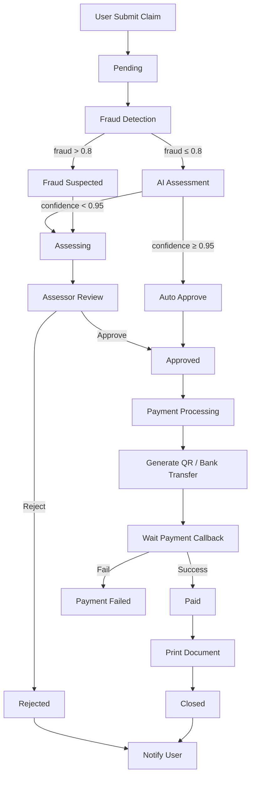

# 🏛️ E-Claim Module – ระบบเคลมประกันภัยอัจฉริยะ (Smart Insurance Claim System)  

> **เป้าหมาย:**  
> ระบบ E-Claim ที่สมบูรณ์ด้วย **Clean Architecture + DDD** คือการออกแบบซอฟต์แวร์ที่แยก Business Rules ออกจากเทคโนโลยีภายนอก (Database, Message Queue, External APIs) และจำลองโครงสร้างและตรรกะให้สอดคล้องกับโดเมนธุรกิจประกันภัยอย่างแท้จริง  
> **เหมาะสำหรับ:** นักพัฒนาที่ต้องการระบบ **Lean Architecture + DDD** ที่พร้อมขยาย规模和รองรับความซับซ้อนของกระบวนการเคลม  
> **รายละเอียดเด่น:**  
> - **Kafka Consumer Group** หลักสำหรับประมวลผลอีเวนต์ (Claim Submitted, Approved, Paid, etc.)  
> - **Elasticsearch Bulk Indexer** สำหรับค้นหาข้อมูลเคลมแบบเรียลไทม์  
> - **WebSocket Broadcaster** สำหรับแจ้งสถานะเคลมสดให้ผู้ใช้และแดชบอร์ด  
> - **LLM Consumer** เรียก LLM แบบ Async เพื่อวิเคราะห์เอกสารและสรุปข้อมูล  
> - **Embedding Consumer** สร้างเวกเตอร์ (Vector Embedding) สำหรับค้นหาความคล้ายของเอกสาร  
> - **Blockchain Consumer** บันทึกธุรกรรมเคลมที่อนุมัติแล้วลง Blockchain (Hyperledger) เพื่อโปร่งใส  
> - **QR Code & Payment System** รองรับชำระผ่าน QR, โอนเงิน, บัตรเครดิต  
> - **Mobile App** รองรับผ่าน REST API และ WebSocket  
> - **Prompt สำหรับการขยายระบบ** ในอนาคต  

---

## สารบัญ
1. [ภาพรวมระบบ](#1-ภาพรวมระบบ)  
2. [โครงสร้าง Module](#2-โครงสร้าง-module)  
3. [Domain Layer](#3-domain-layer)  
   - 3.1 Entities  
   - 3.2 Value Objects  
   - 3.3 Repository Interfaces  
   - 3.4 Domain Services  
   - 3.5 Domain Errors  
4. [Application Layer](#4-application-layer)  
   - 4.1 Use Cases (Commands & Queries)  
   - 4.2 DTOs  
5. [Infrastructure Layer](#5-infrastructure-layer)  
   - 5.1 Repository Implementations (PostgreSQL, Redis)  
   - 5.2 Messaging (Kafka / RabbitMQ)  
   - 5.3 External Services (Banking, Storage, AI, Notification)  
   - 5.4 Workflow Engine & Built-in Actions  
   - 5.5 Printer Manager & Queue Worker  
   - 5.6 JWT & Bcrypt Implementation  
   - 5.7 Rate Limit Middleware  
   - 5.8 Elasticsearch Indexer, WebSocket Hub, LLM/Embedding/Blockchain Consumers  
6. [Interface Layer](#6-interface-layer)  
   - 6.1 HTTP Handlers  
   - 6.2 Routes  
   - 6.3 Middleware  
   - 6.4 WebSocket Handlers  
   - 6.5 GraphQL (optional)  
7. [Database Migrations](#7-database-migrations)  
8. [Workflow Diagram](#8-workflow-diagram)  
9. [System Flow](#9-system-flow)  
10. [การติดตั้งและใช้งาน](#10-การติดตั้งและใช้งาน)  
11. [Business Model](#11-business-model)  
12. [Prompt สำหรับการขยายระบบ](#12-prompt-สำหรับการขยายระบบ)  
13. [ภาคผนวก](#13-ภาคผนวก)  
    - 13.1 GORM Models (Full Schema)  
    - 13.2 Environment Variables  
    - 13.3 Kafka Event Schema  
    - 13.4 API Reference (ตัวอย่าง)  

---

## 1. ภาพรวมระบบ

**E-Claim** เป็นระบบจัดการสินไหมทดแทนประกันภัยอัจฉริยะที่ออกแบบด้วย **Clean Architecture + DDD** รองรับวงจรชีวิตของเคลมตั้งแต่การแจ้งเหตุ, ตรวจสอบ, อนุมัติ, ชำระเงิน, พิมพ์เอกสาร ไปจนถึงปิดเรื่อง โดยแยก Business Logic ออกจาก Infrastructure อย่างชัดเจน ใช้ Event-driven Architecture เพื่อให้ระบบสามารถขยายและเชื่อมต่อกับบริการอื่น ๆ ได้ง่าย

**ฟีเจอร์หลัก:**
- รับเรื่องเคลมพร้อมแนบเอกสารและรายการเสียหาย
- ตรวจจับการทุจริต (Fraud Detection) ด้วยคะแนนความเสี่ยง (AI/ML)
- ประเมินความเสียหายอัตโนมัติผ่าน AI (ML.NET / Python Service)
- อนุมัติ/ปฏิเสธเคลมโดยผู้ประเมิน หรืออัตโนมัติหากมีความมั่นใจสูง
- ชำระเงินผ่าน QR Code, โอนเงินธนาคาร, บัตรเครดิต
- จัดการคิวพิมพ์เอกสาร (Ticket, Receipt, เอกสารการเคลม)
- แจ้งเตือนสถานะผ่าน WebSocket, Email, SMS
- Event-driven ด้วย Kafka / RabbitMQ กระจายเหตุการณ์ไปยัง Consumer ต่าง ๆ
- ค้นหาข้อมูลเคลมด้วย Elasticsearch และระบบแนะนำด้วย Embedding Vector
- บันทึกธุรกรรมสำคัญลง Blockchain เพื่อความโปร่งใส

---

## 2. โครงสร้าง Module

โครงสร้างโฟลเดอร์ `internal/modules/eclaim/` ตามหลัก Clean Architecture + DDD (อ้างอิงจาก template):

```
internal/modules/eclaim/
├── domain/                                    # 🏛️ DOMAIN LAYER
│   ├── entity/
│   │   ├── claim.go                            # Aggregate Root: Claim
│   │   ├── claim_item.go                       # Entity: ClaimItem
│   │   ├── claim_document.go                   # Entity: ClaimDocument
│   │   ├── claim_status_history.go             # Entity: ClaimStatusHistory
│   │   ├── payment_transaction.go              # Aggregate Root: PaymentTransaction
│   │   ├── print_job.go                        # Entity: PrintJob
│   │   ├── user.go                             # Aggregate Root: User (Identity)
│   │   └── policy.go                           # Entity: Policy
│   ├── value_object/
│   │   ├── claim_status.go                     # Enum: Draft, Pending, Assessing, Approved, Rejected, Paid, Closed
│   │   ├── payment_status.go                   # Enum: Pending, Completed, Failed, Refunded
│   │   ├── print_status.go                     # Enum: Queued, Printing, Completed, Failed
│   │   ├── money.go                            # Value Object: Money (Amount + Currency)
│   │   ├── address.go                          # Value Object: Address
│   │   ├── contact_information.go              # Value Object: ContactInformation
│   │   └── payment_type.go                     # Enum: QRCode, BankTransfer, CreditCard
│   ├── repository/
│   │   ├── claim_repository.go                 # Interface IClaimRepository
│   │   ├── payment_repository.go               # Interface IPaymentRepository
│   │   ├── print_repository.go                 # Interface IPrintRepository
│   │   ├── user_repository.go                  # Interface IUserRepository
│   │   └── claim_cache_repository.go           # Interface IClaimCacheRepository (Redis)
│   ├── service/
│   │   ├── claim_number_generator.go           # Domain Service: Generate Claim Number
│   │   ├── claim_engine.go                     # Domain Service: Claim Processing Logic
│   │   ├── claim_validator.go                  # Domain Service: Validate Claim Business Rules
│   │   ├── fraud_detector.go                   # Domain Service: Fraud Detection
│   │   ├── payment_processor.go                # Domain Service: Payment Processing
│   │   └── print_queue_manager.go              # Domain Service: Print Queue Management
│   └── errors/
│       └── errors.go                           # Domain Errors
│
├── application/                                # 🎯 APPLICATION LAYER (CQRS)
│   ├── claim/
│   │   ├── submit_claim.go                     # Command: SubmitClaim
│   │   ├── approve_claim.go                    # Command: ApproveClaim
│   │   ├── reject_claim.go                     # Command: RejectClaim
│   │   ├── mark_claim_as_paid.go               # Command: MarkClaimAsPaid
│   │   ├── get_claim_detail.go                 # Query: GetClaimDetail
│   │   ├── list_my_claims.go                   # Query: ListMyClaims
│   │   ├── list_claims_by_status.go            # Query: ListClaimsByStatus
│   │   └── update_claim_status.go              # Command: UpdateClaimStatus
│   ├── payment/
│   │   ├── generate_qr.go                      # Command: GenerateQR
│   │   ├── handle_payment_callback.go          # Command: HandlePaymentCallback
│   │   ├── get_payment_status.go               # Query: GetPaymentStatus
│   │   └── verify_payment.go                   # Command: VerifyPayment
│   ├── print/
│   │   ├── create_print_job.go                 # Command: CreatePrintJob
│   │   ├── get_print_queue.go                  # Query: GetPrintQueue
│   │   └── update_print_status.go              # Command: UpdatePrintStatus
│   ├── identity/
│   │   ├── login.go                            # Command: Login
│   │   ├── register.go                         # Command: Register
│   │   ├── refresh_token.go                    # Command: RefreshToken
│   │   └── get_user_profile.go                 # Query: GetUserProfile
│   ├── event/
│   │   ├── claim_submitted_event.go
│   │   ├── claim_approved_event.go
│   │   ├── claim_rejected_event.go
│   │   ├── claim_paid_event.go
│   │   ├── payment_completed_event.go
│   │   └── claim_status_changed_event.go
│   └── dto/
│       ├── claim_request.go
│       ├── claim_response.go
│       ├── payment_request.go
│       ├── payment_response.go
│       ├── print_request.go
│       └── auth_request.go
│
├── infrastructure/                             # 🔧 INFRASTRUCTURE LAYER
│   ├── persistence/
│   │   ├── postgres/
│   │   │   ├── models.go                       # GORM Models
│   │   │   ├── claim_repo_impl.go              # Implement IClaimRepository
│   │   │   ├── payment_repo_impl.go            # Implement IPaymentRepository
│   │   │   ├── print_repo_impl.go              # Implement IPrintRepository
│   │   │   └── user_repo_impl.go               # Implement IUserRepository
│   │   └── redis/
│   │       ├── redis_client.go
│   │       ├── claim_cache_repo_impl.go        # Implement IClaimCacheRepository
│   │       ├── qr_code_cache.go
│   │       └── rate_limiter.go
│   ├── messaging/
│   │   ├── kafka/
│   │   │   ├── producer.go
│   │   │   ├── consumer.go                     # Consumer Group หลัก
│   │   │   └── event_publisher.go
│   │   └── rabbitmq/ (optional)
│   │       ├── connection.go
│   │       ├── publisher.go
│   │       └── consumer.go
│   ├── external/
│   │   ├── banking/
│   │   │   ├── banking_client.go               # Interface IBankingClient
│   │   │   ├── kbank_client.go
│   │   │   ├── scb_client.go
│   │   │   └── bbl_client.go
│   │   ├── storage/
│   │   │   ├── storage_client.go               # Interface IStorageService
│   │   │   ├── azure_blob.go
│   │   │   └── s3_client.go
│   │   ├── ai_assessment/
│   │   │   ├── assessment_client.go            # Interface IAssessmentService
│   │   │   ├── ml_client.go
│   │   │   └── mock_assessment.go
│   │   └── notification/
│   │       ├── notification_client.go          # Interface INotificationService
│   │       ├── smtp_client.go
│   │       └── sms_client.go
│   ├── engine/
│   │   ├── claim_runtime.go
│   │   ├── workflow_engine.go                  # ประมวลผลเวิร์กโฟลว์เคลม
│   │   └── builtin_actions/
│   │       ├── assess_claim.go
│   │       ├── send_notification.go
│   │       ├── generate_qr.go
│   │       └── print_document.go
│   ├── printer/
│   │   ├── printer_manager.go
│   │   ├── esc_pos_printer.go
│   │   ├── label_printer.go
│   │   └── print_queue_worker.go
│   ├── indexing/
│   │   ├── elasticsearch_client.go
│   │   └── bulk_indexer.go                     # Elasticsearch Bulk Indexer
│   ├── websocket/
│   │   ├── hub.go
│   │   ├── claim_monitor.go
│   │   └── queue_monitor.go
│   ├── llm/
│   │   ├── llm_client.go                       # เรียก LLM (OpenAI, local)
│   │   └── llm_consumer.go                     # Async Consumer
│   ├── embedding/
│   │   ├── embedding_client.go                 # สร้างเวกเตอร์ (e.g., BERT, OpenAI)
│   │   └── embedding_consumer.go               # Async Consumer
│   ├── blockchain/
│   │   ├── blockchain_client.go                # เชื่อมต่อ Hyperledger / Ethereum
│   │   └── blockchain_consumer.go              # Async Consumer
│   ├── security/
│   │   ├── jwt_helper.go                       # JWT Implementation
│   │   └── bcrypt_hasher.go                    # Bcrypt Implementation
│   ├── logging/
│   │   └── logger.go
│   └── helpers/
│       ├── uuid.go
│       ├── timezone.go
│       ├── encryption.go
│       └── validator.go
│
├── interfaces/                                 # 🌐 INTERFACE LAYER
│   ├── http/
│   │   ├── claim_handler.go
│   │   ├── payment_handler.go
│   │   ├── print_handler.go
│   │   ├── auth_handler.go
│   │   ├── webhook_handler.go
│   │   └── routes.go
│   ├── middleware/
│   │   ├── auth.go
│   │   ├── rate_limit.go
│   │   ├── cors.go
│   │   ├── logging.go
│   │   ├── recovery.go
│   │   └── permission.go
│   ├── websocket/
│   │   ├── claim_monitor.go                    # WebSocket handler
│   │   └── queue_monitor.go
│   └── graphql/ (optional)
│       ├── schema/
│       │   └── claim.graphql
│       ├── resolver/
│       │   └── claim_resolver.go
│       └── server.go
│
├── bootstrapper/
│   ├── module.go                               # Module Registration
│   ├── dependencies.go                         # DI Container Setup
│   ├── config.go                               # Configuration
│   └── migrations.go                           # Run Migrations
│
└── tests/
    ├── unit/
    ├── integration/
    └── fixtures/
```

---

## 3. Domain Layer

### 3.1 Entities (Aggregate Roots & Entities)

#### `entity/claim.go` – Aggregate Root

```go
package entity

import (
    "errors"
    "time"
    "github.com/google/uuid"
    "internal/modules/eclaim/domain/value_object"
)

type Claim struct {
    ID                  uuid.UUID
    ClaimNumber         string
    PolicyID            uuid.UUID
    UserID              uuid.UUID
    EstimatedDamage     value_object.Money
    DeductibleAmount    value_object.Money
    AssessedAmount      *value_object.Money
    Status              value_object.ClaimStatus
    AccidentDate        time.Time
    IncidentReportedAt  time.Time
    AccidentLocation    value_object.Address
    Description         string
    RejectionReason     string
    IsFraudSuspected    bool
    IsExecutiveApproval bool
    domainEvents        []interface{}
    Items               []ClaimItem
    Documents           []ClaimDocument
    StatusHistory       []ClaimStatusHistory
}

// Constructor
func NewClaim(
    policyID, userID uuid.UUID,
    accidentDate time.Time,
    location value_object.Address,
    estimatedDamage value_object.Money,
    description string,
    numberGenerator ClaimNumberGenerator,
) (*Claim, error) {
    // 1. ตรวจสอบวันเกิดเหตุ (ห้ามเป็นอนาคต)
    if accidentDate.After(time.Now()) {
        return nil, errors.New("accident date cannot be in the future")
    }
    // 2. ต้องแจ้งเหตุภายใน 7 วัน
    daysSince := time.Since(accidentDate).Hours() / 24
    if daysSince > 7 {
        return nil, errors.New("claim must be reported within 7 days")
    }
    claim := &Claim{
        ID:                  uuid.New(),
        ClaimNumber:         numberGenerator.Generate(),
        PolicyID:            policyID,
        UserID:              userID,
        AccidentDate:        accidentDate,
        AccidentLocation:    location,
        EstimatedDamage:     estimatedDamage,
        Description:         description,
        Status:              value_object.ClaimStatusDraft,
        IncidentReportedAt:  time.Now().UTC(),
        IsFraudSuspected:    false,
        IsExecutiveApproval: false,
        Items:               []ClaimItem{},
        Documents:           []ClaimDocument{},
        StatusHistory:       []ClaimStatusHistory{},
    }
    claim.addDomainEvent(&ClaimCreatedEvent{ClaimID: claim.ID})
    return claim, nil
}

// Submit – เปลี่ยนจาก Draft → Pending
func (c *Claim) Submit(deductible value_object.Money) error {
    if c.Status != value_object.ClaimStatusDraft {
        return errors.New("only draft claims can be submitted")
    }
    if deductible.Amount < 0 {
        return errors.New("deductible must be non-negative")
    }
    // กฎธุรกิจ: Deductible ต้องไม่เกิน 50% ของค่าเสียหายโดยประมาณ
    maxDeductible := c.EstimatedDamage.Amount * 0.5
    if deductible.Amount > maxDeductible {
        deductible = value_object.NewMoney(maxDeductible, c.EstimatedDamage.Currency)
    }
    c.DeductibleAmount = deductible
    c.Status = value_object.ClaimStatusPending
    c.addStatusHistory("Submitted", "User submitted claim")
    c.addDomainEvent(&ClaimSubmittedEvent{ClaimID: c.ID, ClaimNumber: c.ClaimNumber})
    return nil
}

// Approve – เปลี่ยนจาก Assessing → Approved
func (c *Claim) Approve(assessedAmount value_object.Money, assessorID uuid.UUID) error {
    if c.Status != value_object.ClaimStatusAssessing {
        return errors.New("only assessing claims can be approved")
    }
    if assessedAmount.Amount <= 0 {
        return errors.New("assessed amount must be greater than 0")
    }
    // กฎธุรกิจ: เคลม > 1,000,000 THB ต้องอนุมัติโดยผู้บริหาร
    if assessedAmount.Amount > 1000000 && !c.IsExecutiveApproval {
        return errors.New("claims above 1,000,000 THB require executive approval")
    }
    c.AssessedAmount = &assessedAmount
    c.Status = value_object.ClaimStatusApproved
    c.addStatusHistory("Approved", "Claim approved by assessor")
    c.addDomainEvent(&ClaimApprovedEvent{
        ClaimID: c.ID,
        ClaimNumber: c.ClaimNumber,
        AssessedAmount: assessedAmount,
        DeductibleAmount: c.DeductibleAmount,
    })
    return nil
}

// Reject – เปลี่ยนเป็น Rejected
func (c *Claim) Reject(reason string, assessorID uuid.UUID) error {
    if c.Status != value_object.ClaimStatusAssessing && c.Status != value_object.ClaimStatusPending {
        return errors.New("only pending or assessing claims can be rejected")
    }
    if reason == "" {
        return errors.New("rejection reason is required")
    }
    c.Status = value_object.ClaimStatusRejected
    c.RejectionReason = reason
    c.addStatusHistory("Rejected", "Claim rejected: "+reason)
    c.addDomainEvent(&ClaimRejectedEvent{ClaimID: c.ID, ClaimNumber: c.ClaimNumber, Reason: reason})
    return nil
}

// MarkAsPaid – เปลี่ยนเป็น Paid
func (c *Claim) MarkAsPaid(transactionID uuid.UUID) error {
    if c.Status != value_object.ClaimStatusApproved {
        return errors.New("only approved claims can be marked as paid")
    }
    c.Status = value_object.ClaimStatusPaid
    c.addStatusHistory("Paid", "Payment completed")
    c.addDomainEvent(&ClaimPaidEvent{ClaimID: c.ID, ClaimNumber: c.ClaimNumber, TransactionID: transactionID})
    return nil
}

// AddDocument, AddClaimItem, helper methods...
func (c *Claim) AddDocument(fileName, fileURL, fileType string, fileSize int64) { ... }
func (c *Claim) AddClaimItem(description string, amount value_object.Money, category string) { ... }
func (c *Claim) GetDomainEvents() []interface{} { ... }
```

#### Entity อื่น ๆ

- **ClaimItem** – รายการความเสียหาย (description, amount, category, isApproved)
- **ClaimDocument** – เอกสารแนบ (fileName, fileURL, fileType, fileSize, uploadedAt)
- **ClaimStatusHistory** – ประวัติการเปลี่ยนสถานะ (status, note, changedAt)
- **PaymentTransaction** – ธุรกรรมการชำระเงิน (aggregate root)
- **PrintJob** – งานพิมพ์ (jobType, status, priority, timestamps)
- **User** – ผู้ใช้ (identity aggregate root)
- **Policy** – นโยบายประกัน (entity)

---

### 3.2 Value Objects

#### `value_object/money.go`

```go
type Money struct {
    Amount   float64
    Currency string
}

func NewMoney(amount float64, currency string) Money {
    if currency == "" { currency = "THB" }
    if amount < 0 { amount = 0 }
    return Money{Amount: amount, Currency: currency}
}
func (m Money) Add(other Money) (Money, error) { /* ต้องสกุลเงินเดียวกัน */ }
func (m Money) Subtract(other Money) (Money, error) { /* ... */ }
func (m Money) Multiply(factor float64) Money { ... }
```

#### `value_object/claim_status.go`

```go
type ClaimStatus string

const (
    ClaimStatusDraft     ClaimStatus = "Draft"
    ClaimStatusPending   ClaimStatus = "Pending"
    ClaimStatusAssessing ClaimStatus = "Assessing"
    ClaimStatusApproved  ClaimStatus = "Approved"
    ClaimStatusRejected  ClaimStatus = "Rejected"
    ClaimStatusPaid      ClaimStatus = "Paid"
    ClaimStatusClosed    ClaimStatus = "Closed"
)

func (s ClaimStatus) CanTransitionTo(newStatus ClaimStatus) bool {
    transitions := map[ClaimStatus][]ClaimStatus{
        ClaimStatusDraft:     {ClaimStatusPending},
        ClaimStatusPending:   {ClaimStatusAssessing, ClaimStatusRejected},
        ClaimStatusAssessing: {ClaimStatusApproved, ClaimStatusRejected},
        ClaimStatusApproved:  {ClaimStatusPaid},
        ClaimStatusPaid:      {ClaimStatusClosed},
        ClaimStatusRejected:  {},
        ClaimStatusClosed:    {},
    }
    for _, allowed := range transitions[s] {
        if allowed == newStatus { return true }
    }
    return false
}
```

#### Value Object อื่น ๆ
- **Address** – street, city, province, postalCode, country
- **ContactInformation** – email, phone, lineID
- **PaymentType** – QRCode, BankTransfer, CreditCard
- **PaymentStatus** – Pending, Completed, Failed, Refunded
- **PrintStatus** – Queued, Printing, Completed, Failed

---

### 3.3 Repository Interfaces

```go
type ClaimRepository interface {
    Save(ctx context.Context, claim *entity.Claim) error
    Update(ctx context.Context, claim *entity.Claim) error
    GetByID(ctx context.Context, id uuid.UUID) (*entity.Claim, error)
    GetByClaimNumber(ctx context.Context, claimNumber string) (*entity.Claim, error)
    GetByUserID(ctx context.Context, userID uuid.UUID) ([]*entity.Claim, error)
    GetByStatus(ctx context.Context, status value_object.ClaimStatus) ([]*entity.Claim, error)
    List(ctx context.Context, filters map[string]interface{}, page, limit int) ([]*entity.Claim, int64, error)
    Delete(ctx context.Context, id uuid.UUID) error
}

type PaymentRepository interface { /* ... */ }
type PrintRepository interface { /* ... */ }
type UserRepository interface { /* ... */ }
type ClaimCacheRepository interface {
    CacheClaim(ctx context.Context, claim *entity.Claim) error
    GetCachedClaim(ctx context.Context, id uuid.UUID) (*entity.Claim, error)
    Invalidate(ctx context.Context, id uuid.UUID) error
}
```

---

### 3.4 Domain Services

- **ClaimNumberGenerator** – สร้างเลขที่เคลมแบบไม่ซ้ำ (เช่น "CLM-2026-000001")
- **ClaimEngine** – ประมวลผลตรรกะการคำนวณค่าเสียหาย, ส่วนลด, วงเงิน
- **ClaimValidator** – ตรวจสอบความถูกต้องของข้อมูลก่อนส่ง (เช่น วันที่, เอกสาร, รายการ)
- **FraudDetector** – คำนวณคะแนนความเสี่ยงจากการทุจริต (ใช้ ML หรือกฎ)
- **PaymentProcessor** – จัดการชำระเงิน, ตรวจสอบ callback
- **PrintQueueManager** – จัดลำดับคิว, กำหนด priority

---

### 3.5 Domain Errors

```go
var (
    ErrInvalidAccidentDate     = errors.New("accident date cannot be in the future")
    ErrLateReport              = errors.New("claim must be reported within 7 days")
    ErrInvalidStatusTransition = errors.New("invalid status transition")
    ErrInsufficientPermissions = errors.New("insufficient permissions")
    ErrClaimNotFound           = errors.New("claim not found")
    ErrInvalidDeductible       = errors.New("deductible exceeds maximum allowed")
    ErrDuplicateClaimNumber    = errors.New("claim number already exists")
    // ...
)
```

---

## 4. Application Layer

### 4.1 Use Cases (CQRS)

**Commands (เขียนข้อมูล):**
- `SubmitClaimCommand` – สร้างเคลมใหม่
- `ApproveClaimCommand` – อนุมัติเคลม
- `RejectClaimCommand` – ปฏิเสธเคลม
- `MarkClaimAsPaidCommand` – เปลี่ยนสถานะเป็น Paid
- `GenerateQRCommand` – สร้าง QR Code สำหรับชำระเงิน
- `CreatePrintJobCommand` – สร้างงานพิมพ์

**Queries (อ่านข้อมูล):**
- `GetClaimDetailQuery` – ดึงรายละเอียดเคลม (รวม Documents, Items, History)
- `ListMyClaimsQuery` – รายการเคลมของผู้ใช้
- `ListClaimsByStatusQuery` – รายการเคลมตามสถานะ (สำหรับ Admin/Assessor)
- `GetPaymentStatusQuery` – สถานะการชำระเงิน

#### ตัวอย่าง `SubmitClaimCommandHandler`

```go
type SubmitClaimCommandHandler struct {
    claimRepo        repository.ClaimRepository
    claimCacheRepo   repository.ClaimCacheRepository
    numberGenerator  service.ClaimNumberGenerator
    storageService   service.StorageService
    policyService    service.PolicyService
    eventPublisher   messaging.EventPublisher
}

func (h *SubmitClaimCommandHandler) Handle(ctx context.Context, cmd SubmitClaimCommand) (*dto.ClaimResponse, error) {
    // 1. ตรวจสอบนโยบาย
    policy, err := h.policyService.GetPolicy(ctx, cmd.PolicyID)
    if err != nil || !policy.IsActive {
        return nil, errors.New("policy not found or inactive")
    }
    // 2. สร้าง Value Objects
    location := value_object.ParseAddress(cmd.AccidentLocation)
    estimatedDamage := value_object.NewMoney(cmd.EstimatedAmount, cmd.Currency)
    // 3. สร้าง Aggregate
    claim, err := entity.NewClaim(cmd.PolicyID, cmd.UserID, cmd.AccidentDate, location, estimatedDamage, cmd.Description, h.numberGenerator)
    if err != nil {
        return nil, err
    }
    // 4. อัปโหลดเอกสาร
    for _, doc := range cmd.Documents {
        fileURL, _ := h.storageService.UploadFile(ctx, doc.FileName, doc.FileData)
        claim.AddDocument(doc.FileName, fileURL, doc.FileType, doc.FileSize)
    }
    // 5. เพิ่มรายการความเสียหาย
    for _, item := range cmd.Items {
        amount := value_object.NewMoney(item.Amount, cmd.Currency)
        claim.AddClaimItem(item.Description, amount, item.Category)
    }
    // 6. คำนวณ Deductible จากนโยบาย
    deductible := policy.CalculateDeductible(estimatedDamage)
    // 7. Submit
    if err := claim.Submit(deductible); err != nil {
        return nil, err
    }
    // 8. บันทึก DB
    if err := h.claimRepo.Save(ctx, claim); err != nil {
        return nil, err
    }
    // 9. เก็บ Cache
    h.claimCacheRepo.CacheClaim(ctx, claim)
    // 10. Publish Domain Events
    for _, event := range claim.GetDomainEvents() {
        h.eventPublisher.Publish(ctx, event)
    }
    // 11. สร้าง Response
    return &dto.ClaimResponse{
        ID: claim.ID, ClaimNumber: claim.ClaimNumber, Status: claim.Status.String(),
        EstimatedAmount: claim.EstimatedDamage.Amount, DeductibleAmount: claim.DeductibleAmount.Amount,
        SubmittedAt: claim.IncidentReportedAt,
    }, nil
}
```

---

### 4.2 DTOs

```go
type SubmitClaimRequest struct {
    PolicyID         uuid.UUID    `json:"policyId" binding:"required"`
    AccidentDate     time.Time    `json:"accidentDate" binding:"required"`
    AccidentLocation string       `json:"accidentLocation" binding:"required"`
    EstimatedAmount  float64      `json:"estimatedAmount" binding:"required,gt=0"`
    Currency         string       `json:"currency" binding:"required,oneof=THB USD"`
    Description      string       `json:"description" binding:"max=500"`
    Documents        []DocumentDTO `json:"documents"`
    Items            []ItemDTO     `json:"items"`
}

type DocumentDTO struct {
    FileName string `json:"fileName" binding:"required"`
    FileData []byte `json:"fileData" binding:"required"`
    FileType string `json:"fileType"`
    FileSize int64  `json:"fileSize"`
}

type ItemDTO struct {
    Description string  `json:"description" binding:"required"`
    Amount      float64 `json:"amount" binding:"required,gt=0"`
    Category    string  `json:"category"`
}

type ClaimResponse struct {
    ID               uuid.UUID `json:"id"`
    ClaimNumber      string    `json:"claimNumber"`
    Status           string    `json:"status"`
    EstimatedAmount  float64   `json:"estimatedAmount"`
    DeductibleAmount float64   `json:"deductibleAmount"`
    SubmittedAt      time.Time `json:"submittedAt"`
}
```

---

## 5. Infrastructure Layer

### 5.1 Repository Implementations

#### PostgreSQL (GORM)

```go
type claimRepositoryImpl struct { db *gorm.DB }

func (r *claimRepositoryImpl) Save(ctx context.Context, claim *entity.Claim) error {
    return r.db.WithContext(ctx).Create(claim).Error
}

func (r *claimRepositoryImpl) GetByID(ctx context.Context, id uuid.UUID) (*entity.Claim, error) {
    var claim entity.Claim
    err := r.db.WithContext(ctx).
        Preload("Items").
        Preload("Documents").
        Preload("StatusHistory").
        Where("id = ?", id).
        First(&claim).Error
    if errors.Is(err, gorm.ErrRecordNotFound) {
        return nil, nil
    }
    return &claim, err
}
// ... อื่น ๆ
```

#### Redis Cache

```go
type claimCacheRepoImpl struct { client *redis.Client }

func (r *claimCacheRepoImpl) CacheClaim(ctx context.Context, claim *entity.Claim) error {
    key := fmt.Sprintf("claim:%s", claim.ID.String())
    data, _ := json.Marshal(claim)
    return r.client.Set(ctx, key, data, 24*time.Hour).Err()
}
```

---

### 5.2 Messaging (Kafka / RabbitMQ)

**Event Publisher** (Kafka):
```go
type KafkaEventPublisher struct {
    producer sarama.SyncProducer
    topic    string
}

func (p *KafkaEventPublisher) Publish(ctx context.Context, event interface{}) error {
    data, _ := json.Marshal(event)
    msg := &sarama.ProducerMessage{
        Topic: p.topic,
        Value: sarama.ByteEncoder(data),
    }
    _, _, err := p.producer.SendMessage(msg)
    return err
}
```

**Consumer Group** (Kafka):
```go
type ClaimEventConsumer struct {
    handler func(ctx context.Context, event []byte) error
}

func (c *ClaimEventConsumer) Consume(ctx context.Context) {
    // ใช้ Sarama Consumer Group เพื่ออ่านอีเวนต์จาก topic "claim-events"
    // เมื่อได้รับ event → unmarshal → เรียก handler ตามประเภท
}
```

---

### 5.3 External Services

- **BankingClient** – เชื่อมต่อธนาคาร (KBANK, SCB, BBL) สำหรับสร้าง QR, ตรวจสอบการชำระ
- **StorageService** – อัปโหลดไฟล์ไป Azure Blob / AWS S3
- **AssessmentService** – เรียก ML Model เพื่อประเมินความเสียหาย (REST/gRPC)
- **NotificationService** – ส่ง Email (SMTP) และ SMS (Twilio / local)

---

### 5.4 Workflow Engine & Built-in Actions

**WorkflowEngine** – ประมวลผลเคลมตามสถานะ:
```go
func (e *WorkflowEngine) ProcessClaimSubmission(ctx context.Context, claimID uuid.UUID) error {
    claim, _ := e.claimRepo.GetByID(ctx, claimID)
    // Fraud Detection
    fraudScore, _ := e.fraudDetector.DetectFraud(ctx, claim)
    if fraudScore > 0.8 {
        claim.IsFraudSuspected = true
        e.claimRepo.Update(ctx, claim)
    }
    // AI Assessment
    assessment, _ := e.assessmentService.AssessClaim(ctx, claim)
    if assessment.ConfidenceScore > 0.95 && !claim.IsFraudSuspected {
        assessedAmount := claim.EstimatedDamage.Subtract(claim.DeductibleAmount)
        claim.Approve(assessedAmount, uuid.Nil)
        e.claimRepo.Update(ctx, claim)
        e.eventPublisher.Publish(ctx, &ClaimApprovedEvent{...})
    } else {
        // เปลี่ยนเป็น Assessing เพื่อให้ผู้ประเมินจัดการ
        claim.Status = value_object.ClaimStatusAssessing
        e.claimRepo.Update(ctx, claim)
    }
    e.notificationService.SendClaimStatusUpdate(ctx, claim.UserID, claim)
    return nil
}
```

**Built-in Actions** – ฟังก์ชันที่เรียกใช้ใน workflow:
- `AssessClaim` – ประเมินค่าเสียหาย
- `SendNotification` – ส่งอีเมล/SMS
- `GenerateQR` – สร้าง QR Code
- `PrintDocument` – สร้างงานพิมพ์

---

### 5.5 Printer Manager & Queue Worker

**PrinterManager** – รองรับเครื่องพิมพ์ ESC/POS, ZPL Label
**PrintQueueWorker** – ทำงานเบื้องหลัง ดึงงานพิมพ์จากคิว (สถานะ Queued) → พิมพ์ → อัปเดตสถานะ

---

### 5.6 JWT & Bcrypt Implementation

**JWT Helper**:
```go
type JWTHelper struct { secret []byte; issuer string }

func (h *JWTHelper) GenerateToken(userID uuid.UUID, roles []string, email string) (string, error) {
    claims := jwt.MapClaims{
        "userID": userID.String(),
        "roles":  roles,
        "email":  email,
        "exp":    time.Now().Add(24 * time.Hour).Unix(),
        "iss":    h.issuer,
    }
    token := jwt.NewWithClaims(jwt.SigningMethodHS256, claims)
    return token.SignedString(h.secret)
}
```

**Bcrypt Hasher**:
```go
type BcryptHasher struct{ cost int }

func (h *BcryptHasher) Hash(password string) (string, error) {
    return bcrypt.GenerateFromPassword([]byte(password), h.cost)
}
func (h *BcryptHasher) Verify(hashed, plain string) error {
    return bcrypt.CompareHashAndPassword([]byte(hashed), []byte(plain))
}
```

---

### 5.7 Rate Limit Middleware

ใช้ Redis สำหรับจำกัดคำขอต่อ IP/User:
```go
func (r *RateLimiter) Allow(key string) bool {
    // INCR key, EXPIRE key 60
    // ถ้า value > limit → return false
}
```

---

### 5.8 Elasticsearch Indexer, WebSocket Hub, LLM/Embedding/Blockchain Consumers

**Elasticsearch Bulk Indexer** – ดึงข้อมูลเคลมที่อัปเดตแล้ว ส่งไปยัง Elasticsearch เป็น batch (ทุก 5 วินาที หรือเมื่อครบ 100 รายการ) เพื่อให้ค้นหาได้รวดเร็ว

**WebSocket Hub** – จัดการ connection ของ client, broadcast อีเวนต์ (เช่น สถานะเคลมเปลี่ยน, คิวพิมพ์อัปเดต) ไปยังผู้ใช้ที่เกี่ยวข้อง

**LLM Consumer** – รับอีเวนต์ `ClaimSubmittedEvent` → เรียก LLM (OpenAI, local) เพื่อวิเคราะห์เอกสารและสรุปเนื้อหา → บันทึกผลลัพธ์ในฐานข้อมูลหรือส่งให้ผู้ประเมิน

**Embedding Consumer** – รับอีเวนต์เอกสารใหม่ → สร้างเวกเตอร์ (ผ่าน BERT/OpenAI) → เก็บใน Vector Database (Pinecone, Qdrant) เพื่อใช้ค้นหาความคล้ายในอนาคต

**Blockchain Consumer** – รับอีเวนต์ `ClaimApprovedEvent` หรือ `ClaimPaidEvent` → บันทึกข้อมูลธุรกรรมลง Hyperledger Fabric หรือ Ethereum (Smart Contract) เพื่อความโปร่งใสและป้องกันการแก้ไข

---

## 6. Interface Layer

### 6.1 HTTP Handlers

```go
type ClaimHandler struct {
    submitHandler   *claim.SubmitClaimCommandHandler
    approveHandler  *claim.ApproveClaimCommandHandler
    // ...
}

func (h *ClaimHandler) SubmitClaim(c *gin.Context) {
    var req dto.SubmitClaimRequest
    if err := c.ShouldBindJSON(&req); err != nil { /* 400 */ }
    userID, _ := c.Get("userID")
    cmd := claim.SubmitClaimCommand{...}
    result, err := h.submitHandler.Handle(c.Request.Context(), cmd)
    if err != nil { /* 400 */ }
    c.JSON(http.StatusCreated, result)
}
```

### 6.2 Routes

```go
func RegisterRoutes(router *gin.Engine, handlers ..., authMiddleware *middleware.AuthMiddleware) {
    // Public
    authGroup := router.Group("/api/v1/auth")
    authGroup.POST("/login", authHandler.Login)
    authGroup.POST("/register", authHandler.Register)

    // Protected
    api := router.Group("/api/v1")
    api.Use(authMiddleware.Authenticate())
    {
        claimGroup := api.Group("/claims")
        claimGroup.POST("", claimHandler.SubmitClaim)
        claimGroup.GET("/my-claims", claimHandler.ListMyClaims)
        claimGroup.GET("/:id", claimHandler.GetClaimDetail)

        assessorGroup := claimGroup.Group("/")
        assessorGroup.Use(middleware.RequireRoles("Assessor", "Admin"))
        {
            assessorGroup.PUT("/:id/approve", claimHandler.ApproveClaim)
            assessorGroup.PUT("/:id/reject", claimHandler.RejectClaim)
        }
    }
    // Webhook (public but signed)
    webhookGroup := router.Group("/api/v1/webhooks")
    webhookGroup.POST("/payment/callback", webhookHandler.HandlePaymentCallback)
}
```

### 6.3 Middleware
- `AuthMiddleware` – ตรวจสอบ JWT และ inject `userID`, `roles`, `email`
- `RequireRoles` – ตรวจสอบสิทธิ์ตาม role
- `RateLimiter` – จำกัดจำนวน request
- `CORS`, `Logging`, `Recovery`

### 6.4 WebSocket Handlers

```go
func (h *WebSocketHandler) ClaimMonitor(c *gin.Context) {
    // อัปเกรด connection เป็น WebSocket
    // ลงทะเบียนกับ Hub
    // ส่งข้อความอัปเดตสถานะแบบ real-time
}
```

### 6.5 GraphQL (optional)
รองรับการ query ข้อมูลเคลมด้วย GraphQL (ใช้ gqlgen)

---

## 7. Database Migrations

**Migration ตัวอย่าง (PostgreSQL):**

```sql
-- 20260101000000_initial_create.sql
CREATE TABLE claims (
    id UUID PRIMARY KEY DEFAULT gen_random_uuid(),
    claim_number VARCHAR(20) UNIQUE NOT NULL,
    policy_id UUID NOT NULL,
    user_id UUID NOT NULL,
    estimated_amount DECIMAL(18,2) NOT NULL,
    estimated_currency VARCHAR(3) DEFAULT 'THB',
    deductible_amount DECIMAL(18,2) NOT NULL,
    deductible_currency VARCHAR(3) DEFAULT 'THB',
    assessed_amount DECIMAL(18,2),
    assessed_currency VARCHAR(3),
    status VARCHAR(20) NOT NULL,
    accident_date TIMESTAMP NOT NULL,
    incident_reported_at TIMESTAMP NOT NULL,
    accident_street VARCHAR(200),
    accident_city VARCHAR(100),
    accident_province VARCHAR(100),
    accident_postal_code VARCHAR(10),
    accident_country VARCHAR(50) DEFAULT 'Thailand',
    description VARCHAR(500),
    rejection_reason VARCHAR(500),
    is_fraud_suspected BOOLEAN DEFAULT FALSE,
    is_executive_approval BOOLEAN DEFAULT FALSE,
    created_at TIMESTAMP DEFAULT CURRENT_TIMESTAMP,
    updated_at TIMESTAMP DEFAULT CURRENT_TIMESTAMP,
    deleted_at TIMESTAMP
);

CREATE INDEX idx_claims_user_id ON claims(user_id);
CREATE INDEX idx_claims_status ON claims(status);
-- ... (claim_items, claim_documents, claim_status_histories, payment_transactions, print_jobs, users)
```

---

## 8. Workflow Diagram



---

## 9. System Flow

1. **ผู้ใช้ (Policy Holder)** ส่งเคลมผ่าน Mobile App หรือ Web → API `/claims` → `SubmitClaimCommandHandler`
   - ตรวจสอบนโยบาย, อัปโหลดเอกสาร, สร้าง Claim Aggregate, บันทึก DB, Cache, Publish `ClaimSubmittedEvent`

2. **Event Driven Processing**:
   - Kafka Consumer รับ `ClaimSubmittedEvent` → เรียก `WorkflowEngine.ProcessClaimSubmission`
   - Fraud Detection → หากสงสัยทุจริต → ตั้ง Flag และส่งให้ผู้ประเมิน
   - AI Assessment → หากมีความมั่นใจสูง → Auto Approve (publish `ClaimApprovedEvent`)
   - ถ้าไม่ auto → เปลี่ยนสถานะเป็น **Assessing**

3. **Assessor** ตรวจสอบผ่าน Dashboard → Approve/Reject → Publish `ClaimApprovedEvent` หรือ `ClaimRejectedEvent`

4. **Payment**:
   - เมื่อเคลม Approved → ระบบสร้าง QR Code (หรือช่องทางอื่น) → Publish `PaymentGeneratedEvent`
   - ผู้ใช้ชำระเงิน → ธนาคารส่ง callback → `PaymentCallbackHandler` → ตรวจสอบ → เปลี่ยนสถานะเคลมเป็น **Paid** → Publish `ClaimPaidEvent`

5. **Print**:
   - เมื่อเคลม Paid → สร้าง PrintJob → `PrintQueueWorker` พิมพ์เอกสาร → เปลี่ยนสถานะเป็น **Closed**

6. **Parallel Consumers**:
   - **Elasticsearch Indexer** – อัปเดตดัชนีเพื่อค้นหา
   - **WebSocket Broadcaster** – ส่งสถานะสดให้ผู้ใช้
   - **LLM Consumer** – วิเคราะห์เอกสาร สร้างสรุป
   - **Embedding Consumer** – สร้างเวกเตอร์สำหรับค้นหาความคล้าย
   - **Blockchain Consumer** – บันทึกธุรกรรมลง Blockchain

---

## 10. การติดตั้งและใช้งาน

### ข้อกำหนด
- Go 1.21+, PostgreSQL 14+, Redis 6+, Kafka (หรือ RabbitMQ)
- (Optional) Elasticsearch, Hyperledger Fabric, Python ML Service

### ขั้นตอน

1. **Clone**:
   ```bash
   git clone https://github.com/your-org/eclaim.git
   cd eclaim
   ```

2. **ติดตั้ง dependencies**:
   ```bash
   go mod tidy
   ```

3. **กำหนด Environment Variables** (ดู `.env.example`):
   ```env
   PORT=8080
   DB_HOST=localhost
   DB_PORT=5432
   DB_USER=admin
   DB_PASSWORD=secret
   DB_NAME=eclaim
   REDIS_HOST=localhost
   REDIS_PORT=6379
   JWT_SECRET=your-secret-key
   KAFKA_BROKERS=localhost:9092
   KAFKA_GROUP_ID=eclaim-group
   # ... สำหรับ External Services
   ```

4. **รัน Migrations**:
   ```bash
   go run cmd/migrate/main.go -up
   ```

5. **รัน Server**:
   ```bash
   go run cmd/server/main.go
   ```
   หรือใช้ Docker Compose:
   ```bash
   docker-compose up -d
   ```

6. **รัน Background Workers** (หากแยก process):
   ```bash
   go run cmd/worker/main.go   # Kafka Consumer, Workflow Engine, Print Worker, etc.
   ```

7. **ทดสอบ API**:
   ```bash
   curl http://localhost:8080/health
   ```

---

## 11. Business Model

- **ผู้เอาประกัน (Policy Holder)** – ส่งเคลม, ติดตามสถานะ, รับแจ้งเตือน
- **ผู้ประเมิน (Assessor)** – ตรวจสอบ, อนุมัติ/ปฏิเสธ
- **แอดมิน** – จัดการผู้ใช้, กำหนดนโยบาย, ดูรายงาน
- **ระบบอัตโนมัติ** – AI ลดระยะเวลาการดำเนินงาน, Fraud Detection ลดความเสี่ยง
- **การชำระเงิน** – รองรับหลายช่องทาง ลดขั้นตอน
- **Blockchain** – เพิ่มความเชื่อมั่นและโปร่งใส

**รายได้/ต้นทุน (ตัวอย่าง):**
- ค่าธรรมเนียมการจัดการเคลม (ต่อรายการ)
- ค่าธรรมเนียมการชำระเงิน (จากธนาคาร)
- ค่าใช้จ่ายในการพัฒนาและบำรุงระบบ AI/Blockchain

---

## 12. Prompt สำหรับการขยายระบบ

> **Prompt 1: Real-time Risk Scoring**  
> "เพิ่ม Machine Learning Model ที่ฝึกจากประวัติการเคลม เพื่อให้คะแนนความเสี่ยงของผู้ใช้ทันทีที่ส่งเคลม และปรับขั้นตอนการตรวจสอบตามระดับความเสี่ยง"

> **Prompt 2: Blockchain Integration**  
> "เพิ่ม Blockchain Consumer ที่บันทึกธุรกรรมเคลมที่อนุมัติแล้วลง Hyperledger Fabric เพื่อความโปร่งใสและป้องกันการแก้ไข"

> **Prompt 3: LLM Assistant**  
> "ใช้ LLM วิเคราะห์เอกสารและสรุปสาระสำคัญของเคลม พร้อมส่งคำแนะนำให้ผู้ประเมิน (Assessor) เพื่อช่วยตัดสินใจ"

> **Prompt 4: Real-time Dashboard**  
> "พัฒนา WebSocket Broadcaster และ Elasticsearch Indexer เพื่ออัปเดต Dashboard แสดงสถานะเคลมแบบเรียลไทม์ รองรับการค้นหาและการกรองข้อมูล"

> **Prompt 5: Graph-based Fraud Detection**  
> "เปลี่ยน Fraud Detector ให้ใช้ Neo4j ในการวิเคราะห์ความสัมพันธ์ระหว่างผู้เคลม, โรงพยาบาล, และคู่สัญญา เพื่อตรวจจับขบวนการทุจริตที่ซับซ้อน"

> **Prompt 6: Multi-language Support**  
> "เพิ่ม i18n และแปลเนื้อหาเป็นภาษาไทย, อังกฤษ, และอื่น ๆ สำหรับผู้ใช้และแอดมิน"

---

## 13. ภาคผนวก

### 13.1 GORM Models (Full Schema)

```go
type ClaimModel struct {
    ID                  uuid.UUID      `gorm:"primaryKey;type:uuid;default:gen_random_uuid()"`
    ClaimNumber         string         `gorm:"uniqueIndex;size:20;not null"`
    PolicyID            uuid.UUID      `gorm:"type:uuid;index;not null"`
    UserID              uuid.UUID      `gorm:"type:uuid;index;not null"`
    EstimatedAmount     float64        `gorm:"type:decimal(18,2);not null"`
    EstimatedCurrency   string         `gorm:"size:3;default:'THB'"`
    DeductibleAmount    float64        `gorm:"type:decimal(18,2);not null"`
    DeductibleCurrency  string         `gorm:"size:3;default:'THB'"`
    AssessedAmount      *float64       `gorm:"type:decimal(18,2)"`
    AssessedCurrency    string         `gorm:"size:3"`
    Status              string         `gorm:"type:varchar(20);index;not null"`
    AccidentDate        time.Time      `gorm:"not null"`
    IncidentReportedAt  time.Time      `gorm:"not null"`
    // Address fields
    AccidentStreet      string         `gorm:"size:200"`
    AccidentCity        string         `gorm:"size:100"`
    AccidentProvince    string         `gorm:"size:100"`
    AccidentPostalCode  string         `gorm:"size:10"`
    AccidentCountry     string         `gorm:"size:50;default:'Thailand'"`
    Description         string         `gorm:"size:500"`
    RejectionReason     string         `gorm:"size:500"`
    IsFraudSuspected    bool           `gorm:"default:false"`
    IsExecutiveApproval bool           `gorm:"default:false"`
    CreatedAt           time.Time
    UpdatedAt           time.Time
    DeletedAt           gorm.DeletedAt `gorm:"index"`
}
```

### 13.2 Environment Variables (ตัวอย่าง)

```env
# Server
PORT=8080
ENV=development

# Database
DB_HOST=localhost
DB_PORT=5432
DB_USER=admin
DB_PASSWORD=secret
DB_NAME=eclaim

# Redis
REDIS_HOST=localhost
REDIS_PORT=6379
REDIS_PASSWORD=

# JWT
JWT_SECRET=your-secret-key
JWT_ISSUER=eclaim

# Kafka
KAFKA_BROKERS=localhost:9092
KAFKA_GROUP_ID=eclaim-group
KAFKA_TOPIC_CLAIM_EVENTS=claim-events

# External Services
STORAGE_ACCOUNT_NAME=azureaccount
STORAGE_ACCOUNT_KEY=...
BANKING_API_KEY=...
BANKING_WEBHOOK_SECRET=...
AI_ML_ENDPOINT=https://ml-service.example.com
LLM_API_KEY=...
BLOCKCHAIN_CHANNEL_ID=...
ELASTICSEARCH_URL=http://localhost:9200
```

### 13.3 Kafka Event Schema (ตัวอย่าง)

```json
{
  "eventType": "ClaimApprovedEvent",
  "timestamp": "2026-09-09T10:00:00Z",
  "data": {
    "claimId": "a1b2c3d4-...",
    "claimNumber": "CLM-2026-000001",
    "assessedAmount": 50000.00,
    "deductibleAmount": 5000.00,
    "assessorId": "e5f6..."
  }
}
```

### 13.4 API Reference (ตัวอย่าง)

**POST /api/v1/claims**
```json
Request:
{
  "policyId": "uuid",
  "accidentDate": "2026-09-08T14:30:00Z",
  "accidentLocation": "Bangkok, Thailand",
  "estimatedAmount": 100000.00,
  "currency": "THB",
  "description": "รถชน",
  "documents": [
    { "fileName": "accident_photo.jpg", "fileData": "...", "fileType": "image/jpeg", "fileSize": 2048 }
  ],
  "items": [
    { "description": "กระจกหน้าแตก", "amount": 20000.00, "category": "glass" }
  ]
}
Response 201:
{
  "id": "uuid",
  "claimNumber": "CLM-2026-000001",
  "status": "Pending",
  "estimatedAmount": 100000.00,
  "deductibleAmount": 10000.00,
  "submittedAt": "2026-09-09T10:00:00Z"
}
```

---

**เอกสารนี้เป็นคู่มือสำหรับนักพัฒนาที่ต้องการนำระบบ E-Claim ไปปรับใช้และขยายต่อ ครอบคลุมทั้งสถาปัตยกรรม, โค้ดตัวอย่าง, การติดตั้ง, และแนวทางพัฒนาในอนาคต**