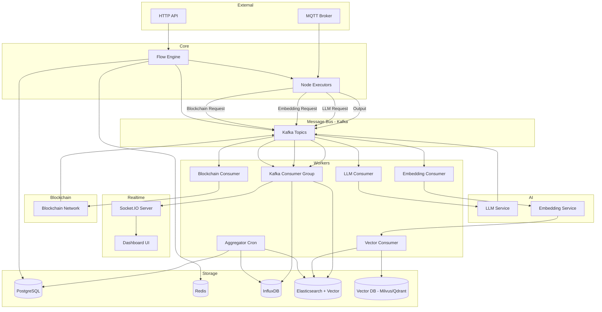
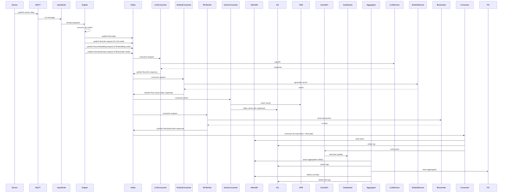

# คู่มือระบบออกแบบระบบ IoT Flow Management Module  

**พร้อม Kafka, InfluxDB, Elasticsearch, Socket.IO, Logging, LLM, AI Embedding, Blockchain, Vector Database และระบบ Logging Management**

---

## สารบัญ

1. [ภาพรวมระบบ](#1-ภาพรวมระบบ)
2. [โครงสร้าง Module](#2-โครงสร้าง-module)
3. [Domain Layer](#3-domain-layer)
4. [Application Layer](#4-application-layer)
   - 4.1 Use Cases
   - 4.2 DTOs
5. [Infrastructure Layer](#5-infrastructure-layer)
   - 5.1 Persistence (PostgreSQL)
   - 5.2 Redis Integration
   - 5.3 Kafka Integration
   - 5.4 InfluxDB Integration
   - 5.5 Elasticsearch Integration (รวม Vector Store)
   - 5.6 Vector Database (Milvus/Qdrant)
   - 5.7 Structured Logging
   - 5.8 Flow Runtime Engine
   - 5.9 Built‑in Node Executors
   - 5.10 LLM Integration
   - 5.11 AI Embedding Integration
   - 5.12 Blockchain Integration
   - 5.13 MQTT Adapter
   - 5.14 Aggregator & Cleanup (Logging Management)
   - 5.15 Helpers
6. [Interface Layer](#6-interface-layer)
   - 6.1 HTTP Handlers
   - 6.2 Routes
   - 6.3 Socket.IO Handler
   - 6.4 Rate Limit Middleware
7. [Background Workers / Consumers](#7-background-workers--consumers)
   - 7.1 Kafka Consumer Group (หลัก)
   - 7.2 InfluxDB Batch Writer
   - 7.3 Elasticsearch Bulk Indexer
   - 7.4 WebSocket Broadcaster
   - 7.5 LLM Consumer
   - 7.6 Embedding Consumer (สำหรับ Vector DB)
   - 7.7 Blockchain Consumer
   - 7.8 Vector Consumer (บันทึกเวกเตอร์ลง Vector DB)
   - 7.9 Aggregation Scheduler (Cron)
   - 7.10 Data Cleanup Worker
8. [Database Migrations](#8-database-migrations)
9. [Workflow Diagrams](#9-workflow-diagrams)
10. [การติดตั้งและใช้งาน](#10-การติดตั้งและใช้งาน)
11. [สรุปและแนวทางพัฒนาเพิ่มเติม](#11-สรุปและแนวทางพัฒนาเพิ่มเติม)

---

## 1. ภาพรวมระบบ

ระบบ IoT Flow Management Module เป็นแพลตฟอร์มประมวลผลข้อมูลแบบเรียลไทม์ สำหรับอุปกรณ์ IoT ด้วยสถาปัตยกรรม Event‑Driven และ Clean Architecture โดยมีเป้าหมายหลัก:

- รองรับข้อมูลปริมาณสูง (High Throughput)
- แยกส่วนการประมวลผล (Decoupling) ด้วย Kafka
- จัดเก็บข้อมูลอนุกรมเวลา (Time‑series) ด้วย InfluxDB
- ค้นหาและจัดเก็บ Logs ด้วย Elasticsearch
- แสดงผลแบบ Real‑time ผ่าน Socket.IO
- เสริมความอัจฉริยะด้วย LLM (สำหรับสรุป, ตอบคำถาม, รายงาน)
- ใช้ AI Embedding เพื่อค้นหาเชิงความหมาย (Semantic Search) และ RAG
- ใช้ Blockchain เพื่อบันทึกหลักฐานที่ไม่สามารถแก้ไขได้ (Immutable Audit Trail)
- ใช้ Vector Database เฉพาะทาง (Milvus/Qdrant) สำหรับการค้นหาเวกเตอร์ประสิทธิภาพสูง
- ระบบ Logging Management ที่เก็บผลเฉลี่ยรายปีและลบข้อมูลเก่าโดยอัตโนมัติ

### 1.1 สถาปัตยกรรมหลัก (ปรับปรุง)

```
External Input (MQTT/HTTP)
       │
       ▼
┌──────────────┐
│  Flow Engine │  (Goroutines, Channels)
└──────────────┘
       │
       ▼
┌──────────────┐
│Node Executors│  (Filter, Function, LLM, Embedding, Blockchain, etc.)
└──────────────┘
       │
       ▼
   Kafka Topics
  ┌────────────┐
  │ flow.data  │──────► Consumer Group ──► InfluxDB, ES, Socket.IO
  │ flow.alarm │──────► Consumer Group ──► ES, Socket.IO, LLM Request
  │ flow.llm.request  │──► LLM Consumer ──► LLM Service ──► flow.llm.response
  │ flow.embedding.request │──► Embedding Consumer ──► Embedding Service ──► Vector DB (+ES)
  │ flow.blockchain.request │──► Blockchain Consumer ──► Blockchain Network
  └────────────┘
       │
       ▼
  Admin API (HTTP) + Socket.IO Dashboard
```

### 1.2 ส่วนประกอบใหม่ที่เพิ่มเติม

| ส่วนประกอบ | บทบาท |
|------------|--------|
| **Kafka** | Message Bus หลัก แยก Producer และ Consumer |
| **InfluxDB** | เก็บ Time‑series data (ค่า sensor, metrics) |
| **Elasticsearch** | เก็บ Logs, Audit, และ Vector (dense_vector) สำหรับ全文检索 |
| **Vector Database** (Milvus/Qdrant) | เก็บ Embedding vectors สำหรับ similarity search ประสิทธิภาพสูง |
| **Socket.IO** | Real‑time Dashboard |
| **LLM** | สรุป, ตอบคำถาม, สร้างรายงานอัตโนมัติ |
| **AI Embedding** | สร้างเวกเตอร์จากข้อมูล sensor/ข้อความ |
| **Blockchain** | เก็บ hash ของข้อมูลสำคัญใน Smart Contract |
| **Aggregator** | คำนวณสถิติรายปี (avg, max, min, count) และลบ raw data เก่า |
| **Cron Scheduler** | เรียกใช้งาน Aggregator และ Cleanup เป็นระยะ |

---

## 2. โครงสร้าง Module

โครงสร้างโค้ดภายใน `internal/modules/iotflow/` (Clean Architecture):

```
internal/modules/iotflow/
├── domain/
│   ├── entity/
│   │   ├── flow.go
│   │   ├── node.go
│   │   └── wire.go
│   ├── value_object/
│   │   ├── node_type.go          // รวม NodeTypeLLM, NodeTypeEmbedding, NodeTypeBlockchain
│   │   ├── node_status.go
│   │   ├── flow_status.go
│   │   ├── data_payload.go
│   │   └── port.go
│   ├── repository/
│   │   ├── flow_repository.go
│   │   └── flow_cache_repository.go
│   ├── service/
│   │   ├── flow_engine.go
│   │   ├── node_executor.go
│   │   └── flow_validator.go
│   └── errors/
│       └── errors.go
├── application/
│   ├── create_flow.go
│   ├── deploy_flow.go
│   ├── start_flow.go
│   ├── stop_flow.go
│   ├── get_flow.go
│   ├── list_flows.go
│   ├── update_flow.go
│   ├── delete_flow.go
│   ├── add_node.go
│   ├── add_wire.go
│   ├── remove_node.go
│   ├── remove_wire.go
│   ├── generate_aggregates.go   // ใหม่
│   └── dto.go                    // รวม DTO ใหม่
├── infrastructure/
│   ├── persistence/
│   │   └── postgres/
│   │       ├── models.go
│   │       └── flow_repo_impl.go
│   ├── cache/
│   │   └── redis/
│   │       ├── redis_client.go
│   │       ├── flow_cache_repo_impl.go
│   │       ├── rate_limiter.go
│   │       └── flow_instance_store.go
│   ├── messaging/                 # Kafka
│   │   ├── kafka_client.go
│   │   ├── producer.go
│   │   └── consumer.go
│   ├── timeseries/                # InfluxDB
│   │   ├── influx_client.go
│   │   └── writer.go
│   ├── search/                    # Elasticsearch
│   │   ├── es_client.go
│   │   ├── indexer.go
│   │   └── vector_store.go       // สำหรับ ES vector
│   ├── vectordb/                  # ใหม่: Vector Database เฉพาะทาง
│   │   ├── interface.go
│   │   ├── milvus_client.go      // หรือ qdrant_client.go
│   │   ├── consumer.go           // Kafka consumer สำหรับ vector
│   │   └── index_manager.go
│   ├── llm/
│   │   ├── client.go
│   │   └── consumer.go
│   ├── embedding/
│   │   ├── client.go
│   │   └── consumer.go
│   ├── blockchain/
│   │   ├── client.go
│   │   └── consumer.go
│   ├── aggregator/                # ใหม่: Logging Management
│   │   ├── aggregator.go
│   │   ├── scheduler.go
│   │   └── cleanup.go
│   ├── engine/
│   │   ├── runtime.go
│   │   ├── node_runner.go
│   │   └── builtin_nodes/
│   │       ├── mqtt_input.go
│   │       ├── filter.go
│   │       ├── function.go
│   │       ├── http_output.go
│   │       ├── debug.go
│   │       ├── delay.go
│   │       ├── schedule_trigger.go
│   │       ├── kafka_output.go
│   │       ├── influx_output.go
│   │       ├── es_output.go
│   │       ├── llm_query.go
│   │       ├── embedding.go
│   │       └── blockchain_record.go
│   ├── mqtt/
│   │   └── mqtt_adapter.go
│   ├── logging/
│   │   └── logger.go
│   └── helpers/
│       ├── timezone.go
│       ├── alarm_validator.go
│       └── utils.go
└── interfaces/
    ├── http/
    │   ├── flow_handler.go
    │   └── routes.go
    ├── middleware/
    │   └── rate_limit.go
    ├── socketio/
    │   ├── server.go
    │   └── handlers.go
    └── websocket/
        └── flow_monitor.go
```

---

## 3. Domain Layer

Domain Layer ยังคงไม่เปลี่ยนแปลงจากเดิม เพราะเราไม่ต้องการให้เอนทิตีหลักต้องพึ่งพาเทคโนโลยีภายนอก เราอาจเพิ่ม **Value Object** เพื่อเก็บ Configuration ของ Node ประเภทใหม่ เช่น:

```go
// domain/value_object/node_type.go
const (
    NodeTypeMQTTInput       NodeType = "mqtt_input"
    NodeTypeFilter          NodeType = "filter"
    NodeTypeFunction        NodeType = "function"
    NodeTypeHTTPOutput      NodeType = "http_output"
    NodeTypeDebug           NodeType = "debug"
    NodeTypeDelay           NodeType = "delay"
    NodeTypeScheduleTrigger NodeType = "schedule_trigger"
    NodeTypeKafkaOutput     NodeType = "kafka_output"
    NodeTypeInfluxOutput    NodeType = "influx_output"
    NodeTypeESOutput        NodeType = "es_output"
    NodeTypeLLM             NodeType = "llm"
    NodeTypeEmbedding       NodeType = "embedding"
    NodeTypeBlockchain      NodeType = "blockchain"
)
```

Entity `Node` ยังคงใช้ `Config map[string]interface{}` เพื่อเก็บพารามิเตอร์เฉพาะของแต่ละประเภท

---

## 4. Application Layer

### 4.1 Use Cases

Use Cases เดิม (CRUD, Deploy, Start, Stop, Add/Remove Node/Wire) ทำงานเหมือนเดิม แต่เราจะเพิ่มการส่ง Event ไปยัง Kafka เมื่อเกิดการเปลี่ยนแปลงสถานะ เพื่อให้ Blockchain Consumer บันทึกหลักฐาน

**ตัวอย่าง `StartFlowUseCase` (ปรับปรุง):**

```go
func (uc *StartFlowUseCase) Execute(ctx context.Context, flowID int64) error {
    // 1. โหลด Flow จาก DB
    flow, err := uc.repo.FindByID(ctx, flowID)
    if err != nil { return err }

    // 2. ตรวจสอบสถานะ
    if flow.Status != value_object.FlowStatusDeployed {
        return errors.ErrFlowNotDeployed
    }

    // 3. เรียก Engine เพื่อเริ่มทำงาน
    if err := uc.engine.StartFlow(ctx, flow); err != nil {
        return err
    }

    // 4. อัปเดตสถานะใน DB และ Cache
    flow.Status = value_object.FlowStatusRunning
    uc.repo.Update(ctx, flow)
    uc.cacheRepo.SetFlowStatus(ctx, flowID, flow.Status)

    // 5. ส่ง Event ไป Kafka
    event := map[string]interface{}{
        "type":      "flow.started",
        "flow_id":   flowID,
        "user_id":   flow.UserID,
        "timestamp": time.Now(),
    }
    _ = uc.kafkaProducer.Publish(ctx, "flow.events", event)
    _ = uc.kafkaProducer.Publish(ctx, "flow.blockchain.request", event)

    return nil
}
```

**Use Case ใหม่: `GenerateAggregatesUseCase`** – ถูกเรียกโดย Cron Job เพื่อคำนวณสถิติรายปีและลบข้อมูลเก่า

```go
type GenerateAggregatesUseCase struct {
    influxClient *timeseries.InfluxClient
    esClient     *search.ESClient
    db           *gorm.DB
}

func (uc *GenerateAggregatesUseCase) Execute(ctx context.Context) error {
    // 1. คำนวณ aggregate จาก InfluxDB และ ES
    aggregates := uc.computeAggregates(ctx)
    // 2. บันทึกลง PostgreSQL
    uc.saveAggregates(ctx, aggregates)
    // 3. ลบ raw data ที่เก่ากว่า 1 ปี
    uc.cleanupOldData(ctx)
    return nil
}
```

### 4.2 DTOs

เพิ่ม DTO สำหรับการทำงานกับส่วนประกอบใหม่:

```go
// application/dto.go

type LLMRequest struct {
    FlowID      int64                  `json:"flow_id"`
    NodeID      int64                  `json:"node_id"`
    Prompt      string                 `json:"prompt"`
    Model       string                 `json:"model"`
    Temperature float32                `json:"temperature"`
    Payload     map[string]interface{} `json:"payload"`
}

type EmbeddingRequest struct {
    FlowID      int64                  `json:"flow_id"`
    NodeID      int64                  `json:"node_id"`
    InputFields []string               `json:"input_fields"`
    Payload     map[string]interface{} `json:"payload"`
}

type BlockchainRequest struct {
    FlowID   int64                  `json:"flow_id"`
    NodeID   int64                  `json:"node_id"`
    DataHash string                 `json:"data_hash"`
    Payload  map[string]interface{} `json:"payload"`
}

type VectorIndexRequest struct {
    FlowID     int64                  `json:"flow_id"`
    NodeID     int64                  `json:"node_id"`
    Collection string                 `json:"collection"`
    Vector     []float64              `json:"vector"`
    Metadata   map[string]interface{} `json:"metadata"`
}
```

---

## 5. Infrastructure Layer

### 5.1 Persistence (PostgreSQL)

ไม่มีการเปลี่ยนแปลง Schema หลัก ยังคงใช้ `BIGSERIAL` เป็น Primary Key และเก็บข้อมูล Flow, Node, Wire

**เพิ่มตารางสำหรับ Aggregates** (ถ้าต้องการเก็บใน PostgreSQL):

```sql
CREATE TABLE sensor_aggregates (
    id          BIGSERIAL PRIMARY KEY,
    flow_id     BIGINT NOT NULL,
    device_id   TEXT NOT NULL,
    metric      TEXT NOT NULL,
    period      TEXT NOT NULL,   -- 'year', 'month', 'day'
    year        INTEGER NOT NULL,
    avg_value   DOUBLE PRECISION,
    max_value   DOUBLE PRECISION,
    min_value   DOUBLE PRECISION,
    count       BIGINT,
    updated_at  TIMESTAMP DEFAULT CURRENT_TIMESTAMP
);
```

### 5.2 Redis Integration

ไม่เปลี่ยนแปลง – ใช้สำหรับ Cache, Rate Limit, และ Distributed State ของ Flow Instances

### 5.3 Kafka Integration

**Producer** – เพิ่มฟังก์ชันสำหรับส่งข้อความไปยัง topics ใหม่:

```go
// infrastructure/messaging/producer.go
func PublishLLMRequest(ctx context.Context, kc *KafkaClient, req *dto.LLMRequest) error {
    return kc.Publish(ctx, "flow.llm.request", req)
}

func PublishEmbeddingRequest(ctx context.Context, kc *KafkaClient, req *dto.EmbeddingRequest) error {
    return kc.Publish(ctx, "flow.embedding.request", req)
}

func PublishBlockchainRequest(ctx context.Context, kc *KafkaClient, req *dto.BlockchainRequest) error {
    return kc.Publish(ctx, "flow.blockchain.request", req)
}
```

**Consumer Group** – ส่วนนี้ใช้สำหรับประมวลผลข้อความจาก topics หลัก (`flow.data`, `flow.alarm`) และเขียนไปยัง InfluxDB, Elasticsearch, Socket.IO

### 5.4 InfluxDB Integration

เหมือนเดิม: ใช้ InfluxDB Client เขียนข้อมูลแบบ Batch

### 5.5 Elasticsearch Integration (รวม Vector Store)

**ESClient** – เพิ่มฟังก์ชันสำหรับจัดการดัชนีเวกเตอร์:

```go
type ESClient struct {
    client *elasticsearch.Client
}

func (e *ESClient) CreateVectorIndex(index string, dims int) error {
    mapping := fmt.Sprintf(`{
        "mappings": {
            "properties": {
                "embedding": {
                    "type": "dense_vector",
                    "dims": %d,
                    "index": true,
                    "similarity": "cosine"
                },
                "text": { "type": "text" },
                "flow_id": { "type": "long" },
                "timestamp": { "type": "date" }
            }
        }
    }`, dims)
    req := bytes.NewReader([]byte(mapping))
    _, err := e.client.Indices.Create(index, e.client.Indices.Create.WithBody(req))
    return err
}

func (e *ESClient) VectorSearch(index string, queryVector []float64, size int) ([]map[string]interface{}, error) {
    // ใช้ ES 8.x knn query
    var b map[string]interface{}
    // ...
}
```

### 5.6 Vector Database (Milvus/Qdrant)

เพื่อประสิทธิภาพการค้นหาเชิงความหมายที่ดีกว่า Elasticsearch สำหรับเวกเตอร์จำนวนมาก เราเพิ่ม Vector DB เฉพาะทาง

**Interface `VectorStore`:**

```go
// infrastructure/vectordb/interface.go
type VectorStore interface {
    Insert(ctx context.Context, collection string, vector []float64, metadata map[string]interface{}) error
    Search(ctx context.Context, collection string, queryVector []float64, topK int) ([]SearchResult, error)
    Delete(ctx context.Context, collection string, ids ...string) error
    CreateCollection(ctx context.Context, name string, dims int) error
}
```

**Implementation ด้วย Milvus:**

```go
// infrastructure/vectordb/milvus_client.go
import "github.com/milvus-io/milvus-sdk-go/v2/client"

type MilvusClient struct {
    client client.Client
}

func (m *MilvusClient) Insert(ctx context.Context, collection string, vector []float64, metadata map[string]interface{}) error {
    // แปลง metadata เป็น fields ที่ Milvus รองรับ
    // ...
}
```

**Kafka Consumer สำหรับ Vector DB:**

```go
// infrastructure/vectordb/consumer.go
type VectorConsumer struct {
    vectorStore VectorStore
    embedClient embedding.EmbeddingClient
}

func (c *VectorConsumer) ConsumeClaim(sess sarama.ConsumerGroupSession, claim sarama.ConsumerGroupClaim) error {
    for msg := range claim.Messages() {
        var req dto.EmbeddingRequest
        json.Unmarshal(msg.Value, &req)
        text := buildTextFromFields(req.Payload, req.InputFields)
        vec, err := c.embedClient.Embed(context.Background(), text)
        if err != nil {
            slog.Error("Embedding error", "err", err)
            continue
        }
        err = c.vectorStore.Insert(context.Background(), "sensor_vectors", vec, req.Payload)
        if err != nil {
            slog.Error("Vector insert error", "err", err)
        }
        sess.MarkMessage(msg, "")
    }
    return nil
}
```

### 5.7 Structured Logging

ใช้ `log/slog` สำหรับบันทึก日志แบบโครงสร้าง พร้อมส่งไปยัง Elasticsearch ผ่าน Filebeat หรือโดยตรง

```go
// infrastructure/logging/logger.go
var Logger *slog.Logger

func InitLogger(esClient *search.ESClient) {
    opts := &slog.HandlerOptions{Level: slog.LevelInfo}
    // สามารถเพิ่ม hook เพื่อส่งไป ES
    Logger = slog.New(slog.NewJSONHandler(os.Stdout, opts))
}
```

### 5.8 Flow Runtime Engine

**Engine** ยังคงใช้ Goroutines และ Channels ในการไหลของข้อมูล ใน `distributeOutput` จะส่งข้อมูลไปยัง Kafka และ target nodes ตามปกติ

**การเพิ่ม Node Type ใหม่** ทำได้โดยการลงทะเบียน Executor ใน Engine:

```go
engine.RegisterExecutor(value_object.NodeTypeLLM, builtin_nodes.NewLLMExecutor(kafkaClient))
engine.RegisterExecutor(value_object.NodeTypeEmbedding, builtin_nodes.NewEmbeddingExecutor(kafkaClient))
engine.RegisterExecutor(value_object.NodeTypeBlockchain, builtin_nodes.NewBlockchainExecutor(kafkaClient))
```

### 5.9 Built‑in Node Executors

#### 5.9.1 LLM Executor

```go
// infrastructure/engine/builtin_nodes/llm_query.go
type LLMExecutor struct {
    kafkaProducer *messaging.KafkaClient
}

func (e *LLMExecutor) Execute(ctx context.Context, node *entity.Node, input <-chan value_object.DataPayload) (<-chan value_object.DataPayload, error) {
    output := make(chan value_object.DataPayload)
    go func() {
        defer close(output)
        for payload := range input {
            promptTemplate, _ := node.Config["prompt_template"].(string)
            model, _ := node.Config["model"].(string)
            temp, _ := node.Config["temperature"].(float64)
            prompt := renderTemplate(promptTemplate, payload.Payload)
            req := &dto.LLMRequest{
                FlowID:      payload.FlowID,
                NodeID:      node.ID,
                Prompt:      prompt,
                Model:       model,
                Temperature: float32(temp),
                Payload:     payload.Payload,
            }
            _ = e.kafkaProducer.Publish(ctx, "flow.llm.request", req)
            output <- payload // non-blocking
        }
    }()
    return output, nil
}
```

#### 5.9.2 Embedding Executor

```go
// infrastructure/engine/builtin_nodes/embedding.go
type EmbeddingExecutor struct {
    kafkaProducer *messaging.KafkaClient
}

func (e *EmbeddingExecutor) Execute(ctx context.Context, node *entity.Node, input <-chan value_object.DataPayload) (<-chan value_object.DataPayload, error) {
    output := make(chan value_object.DataPayload)
    go func() {
        defer close(output)
        for payload := range input {
            inputFields, _ := node.Config["input_fields"].([]interface{})
            req := &dto.EmbeddingRequest{
                FlowID:      payload.FlowID,
                NodeID:      node.ID,
                InputFields: toStringSlice(inputFields),
                Payload:     payload.Payload,
            }
            _ = e.kafkaProducer.Publish(ctx, "flow.embedding.request", req)
            output <- payload
        }
    }()
    return output, nil
}
```

#### 5.9.3 Blockchain Executor

```go
// infrastructure/engine/builtin_nodes/blockchain_record.go
type BlockchainExecutor struct {
    kafkaProducer *messaging.KafkaClient
}

func (e *BlockchainExecutor) Execute(ctx context.Context, node *entity.Node, input <-chan value_object.DataPayload) (<-chan value_object.DataPayload, error) {
    output := make(chan value_object.DataPayload)
    go func() {
        defer close(output)
        for payload := range input {
            fieldsToHash, _ := node.Config["fields_to_hash"].([]interface{})
            hash := computeHashFromFields(payload.Payload, fieldsToHash)
            req := &dto.BlockchainRequest{
                FlowID:   payload.FlowID,
                NodeID:   node.ID,
                DataHash: hash,
                Payload:  payload.Payload,
            }
            _ = e.kafkaProducer.Publish(ctx, "flow.blockchain.request", req)
            output <- payload
        }
    }()
    return output, nil
}
```

### 5.10 LLM Integration

**Client** – รองรับ OpenAI, Gemini, หรือ Local Models (ผ่าน Ollama)

```go
// infrastructure/llm/client.go
type LLMClient interface {
    Generate(ctx context.Context, prompt string, model string, temp float32) (string, error)
}

type OpenAIClient struct {
    client *openai.Client
}

func (c *OpenAIClient) Generate(ctx context.Context, prompt string, model string, temp float32) (string, error) {
    resp, err := c.client.CreateChatCompletion(ctx, openai.ChatCompletionRequest{
        Model:       model,
        Messages:    []openai.ChatCompletionMessage{{Role: "user", Content: prompt}},
        Temperature: temp,
    })
    if err != nil {
        return "", err
    }
    return resp.Choices[0].Message.Content, nil
}
```

**Consumer** – อ่าน `flow.llm.request` และส่งผลลัพธ์ไป `flow.llm.response`

```go
// infrastructure/llm/consumer.go
type LLMConsumer struct {
    client   LLMClient
    producer *messaging.KafkaClient
}

func (c *LLMConsumer) ConsumeClaim(sess sarama.ConsumerGroupSession, claim sarama.ConsumerGroupClaim) error {
    for msg := range claim.Messages() {
        var req dto.LLMRequest
        json.Unmarshal(msg.Value, &req)
        result, err := c.client.Generate(context.Background(), req.Prompt, req.Model, req.Temperature)
        if err != nil {
            slog.Error("LLM error", "err", err)
            continue
        }
        response := map[string]interface{}{
            "flow_id":  req.FlowID,
            "node_id":  req.NodeID,
            "result":   result,
            "original": req.Payload,
        }
        _ = c.producer.Publish(context.Background(), "flow.llm.response", response)
        sess.MarkMessage(msg, "")
    }
    return nil
}
```

### 5.11 AI Embedding Integration

**Client** – เรียกใช้บริการสร้าง Embedding (อาจเป็น Python sidecar หรือ API)

```go
// infrastructure/embedding/client.go
type EmbeddingClient interface {
    Embed(ctx context.Context, text string) ([]float64, error)
}

type RESTEmbeddingClient struct {
    url string
    httpClient *http.Client
}

func (c *RESTEmbeddingClient) Embed(ctx context.Context, text string) ([]float64, error) {
    // POST ไปยัง embedding service
}
```

**Consumer** – (อาจรวมกับ Vector Consumer) อ่าน `flow.embedding.request` สร้างเวกเตอร์และบันทึกลง Vector DB

### 5.12 Blockchain Integration

**Client** – เชื่อมต่อกับ Ethereum หรือ Hyperledger

```go
// infrastructure/blockchain/client.go
type BlockchainClient struct {
    client   *ethclient.Client
    contract *AuditContract
    auth     *bind.TransactOpts
}

func (b *BlockchainClient) StoreDataHash(ctx context.Context, dataHash [32]byte) (string, error) {
    tx, err := b.contract.StoreData(b.auth, dataHash)
    if err != nil {
        return "", err
    }
    return tx.Hash().Hex(), nil
}
```

**Consumer** – อ่าน `flow.blockchain.request` และส่ง transaction

```go
// infrastructure/blockchain/consumer.go
type BlockchainConsumer struct {
    client   *BlockchainClient
    producer *messaging.KafkaClient
}

func (c *BlockchainConsumer) ConsumeClaim(sess sarama.ConsumerGroupSession, claim sarama.ConsumerGroupClaim) error {
    for msg := range claim.Messages() {
        var req dto.BlockchainRequest
        json.Unmarshal(msg.Value, &req)
        hashBytes, _ := hex.DecodeString(req.DataHash)
        var hashArr [32]byte
        copy(hashArr[:], hashBytes)
        txHash, err := c.client.StoreDataHash(context.Background(), hashArr)
        if err != nil {
            slog.Error("Blockchain error", "err", err)
            continue
        }
        response := map[string]interface{}{
            "flow_id":  req.FlowID,
            "node_id":  req.NodeID,
            "tx_hash":  txHash,
            "original": req.Payload,
        }
        _ = c.producer.Publish(context.Background(), "flow.blockchain.response", response)
        sess.MarkMessage(msg, "")
    }
    return nil
}
```

### 5.13 MQTT Adapter

ไม่เปลี่ยนแปลง – ใช้เชื่อมต่อกับ MQTT Broker เพื่อรับข้อมูลจากอุปกรณ์

### 5.14 Aggregator & Cleanup (Logging Management)

**Aggregator** – คำนวณสถิติรายปีจากข้อมูลใน InfluxDB และ Elasticsearch

```go
// infrastructure/aggregator/aggregator.go
type Aggregator struct {
    influxClient *timeseries.InfluxClient
    esClient     *search.ESClient
    db           *gorm.DB
}

func (a *Aggregator) ComputeYearlyAggregates(ctx context.Context) ([]AggregateResult, error) {
    // 1. Query InfluxDB เพื่อหาค่าเฉลี่ย, สูงสุด, ต่ำสุด, count ของแต่ละ metric ในรอบ 1 ปี
    query := `from(bucket:"iotflow")
              |> range(start: -1y)
              |> filter(fn: (r) => r._measurement == "sensor")
              |> aggregateWindow(every: 1y, fn: mean)`
    // ... ดำเนินการ
    // 2. บันทึกผลลัพธ์ลง PostgreSQL
}

func (a *Aggregator) CleanupOldData(ctx context.Context) error {
    // ลบ raw data ที่เก่ากว่า 1 ปีออกจาก InfluxDB (ใช้ retention policy หรือ delete)
    // ลบ logs ที่เก่ากว่า 1 ปีออกจาก Elasticsearch
    _, err := a.esClient.DeleteByQuery(ctx, "logs-*", `{"query": {"range": {"timestamp": {"lt": "now-365d"}}}}`)
    return err
}
```

**Scheduler** – ใช้ Cron เพื่อเรียก Aggregator เป็นระยะ

```go
// infrastructure/aggregator/scheduler.go
import "github.com/robfig/cron/v3"

func StartAggregationScheduler(influx *timeseries.InfluxClient, es *search.ESClient, db *gorm.DB) {
    agg := &Aggregator{influxClient: influx, esClient: es, db: db}
    c := cron.New()
    // ทำงานทุกวัน เวลา 02:00
    c.AddFunc("0 2 * * *", func() {
        ctx := context.Background()
        if err := agg.ComputeYearlyAggregates(ctx); err != nil {
            slog.Error("Aggregation failed", "err", err)
        }
        if err := agg.CleanupOldData(ctx); err != nil {
            slog.Error("Cleanup failed", "err", err)
        }
    })
    c.Start()
}
```

### 5.15 Helpers

ฟังก์ชันช่วยเหลือ เช่น การแปลงเวลา, การตรวจสอบ Alarm, การสร้าง Hash

---

## 6. Interface Layer

### 6.1 HTTP Handlers

ไม่เปลี่ยนแปลง – ยังคงมี Handler สำหรับ CRUD Flow, Deploy, Start, Stop, Get Status ฯลฯ

### 6.2 Routes

ไม่เปลี่ยนแปลง – ใช้ Gin หรือ Echo ตามเดิม

### 6.3 Socket.IO Handler

**Socket.IO Server** – ใช้สำหรับส่งข้อมูล Real‑time ไปยัง Dashboard

```go
// interfaces/socketio/server.go
import "github.com/googollee/go-socket.io"

func NewSocketIOServer() (*socketio.Server, error) {
    server := socketio.NewServer(nil)
    server.OnConnect("/", func(s socketio.Conn) error {
        s.SetContext("")
        return nil
    })
    server.OnEvent("/", "subscribe", func(s socketio.Conn, flowID string) {
        // เก็บ room
    })
    return server, nil
}
```

### 6.4 Rate Limit Middleware

ใช้ Redis สำหรับ Rate Limiting ตาม IP หรือ API Key

---

## 7. Background Workers / Consumers

### 7.1 Kafka Consumer Group (หลัก)

ประมวลผล `flow.data` และ `flow.alarm` – เขียนลง InfluxDB, Elasticsearch, และส่ง Socket.IO

### 7.2 InfluxDB Batch Writer

รับข้อมูลจาก Consumer และเขียนเป็น Batch ไปยัง InfluxDB

### 7.3 Elasticsearch Bulk Indexer

รับข้อมูลและทำ Bulk Index ลง Elasticsearch

### 7.4 WebSocket Broadcaster

ส่งข้อมูลไปยัง WebSocket/Socket.IO clients

### 7.5 LLM Consumer

อ่าน `flow.llm.request` เรียก LLM และส่งผลลัพธ์กลับไปยัง `flow.llm.response`

### 7.6 Embedding Consumer (สำหรับ Vector DB)

อ่าน `flow.embedding.request` สร้างเวกเตอร์และบันทึกใน Vector Database (และอาจบันทึกใน Elasticsearch ด้วย)

### 7.7 Blockchain Consumer

อ่าน `flow.blockchain.request` และส่ง Transaction ไปยัง Blockchain

### 7.8 Vector Consumer (บันทึกเวกเตอร์ลง Vector DB)

หากแยก Embedding Consumer ออกจาก Vector Consumer จะทำหน้าที่รับ embedding ที่สร้างแล้วไปบันทึกใน Vector DB โดยตรง

### 7.9 Aggregation Scheduler (Cron)

ทำงานตามกำหนดเวลา (เช่น ทุกวันตี 2) เพื่อคำนวณ aggregates และลบข้อมูลเก่า

### 7.10 Data Cleanup Worker

อาจแยกออกจาก Aggregator เพื่อลบข้อมูลเก่าตาม Retention Policy (หรือใช้ ILM ของ Elasticsearch)

---

## 8. Database Migrations

ใช้เครื่องมือ Migration (เช่น `golang-migrate`) สำหรับ PostgreSQL

**ตารางหลัก**:
- `flows`
- `nodes`
- `wires`
- `flow_instances` (อาจไม่จำเป็น)

**ตารางเพิ่มเติม** (สำหรับ Aggregates):
- `sensor_aggregates`

**ตัวอย่าง Migration**:

```sql
-- 001_create_flows.up.sql
CREATE TABLE flows (
    id BIGSERIAL PRIMARY KEY,
    name TEXT NOT NULL,
    status TEXT NOT NULL,
    user_id UUID NOT NULL,
    created_at TIMESTAMP DEFAULT NOW(),
    updated_at TIMESTAMP
);

-- 002_create_nodes.up.sql
CREATE TABLE nodes (
    id BIGSERIAL PRIMARY KEY,
    flow_id BIGINT REFERENCES flows(id) ON DELETE CASCADE,
    name TEXT NOT NULL,
    type TEXT NOT NULL,
    config JSONB,
    status TEXT,
    created_at TIMESTAMP DEFAULT NOW()
);

-- 003_create_wires.up.sql
CREATE TABLE wires (
    id BIGSERIAL PRIMARY KEY,
    flow_id BIGINT REFERENCES flows(id) ON DELETE CASCADE,
    source_node_id BIGINT REFERENCES nodes(id),
    target_node_id BIGINT REFERENCES nodes(id),
    created_at TIMESTAMP DEFAULT NOW()
);

-- 004_create_aggregates.up.sql
CREATE TABLE sensor_aggregates (
    id BIGSERIAL PRIMARY KEY,
    flow_id BIGINT NOT NULL,
    device_id TEXT NOT NULL,
    metric TEXT NOT NULL,
    period TEXT NOT NULL,
    year INTEGER NOT NULL,
    avg_value DOUBLE PRECISION,
    max_value DOUBLE PRECISION,
    min_value DOUBLE PRECISION,
    count BIGINT,
    updated_at TIMESTAMP DEFAULT CURRENT_TIMESTAMP
);
```

---

## 9. Workflow Diagrams

### 9.1 สถาปัตยกรรมโดยรวม (พร้อมส่วนเสริมทั้งหมด)



### 9.2 Sequence Diagram: ข้อมูลจาก Sensor สู่ Dashboard + LLM + Embedding + Blockchain + Aggregator



---

## 10. การติดตั้งและใช้งาน

### 10.1 Dependencies

ติดตั้ง Go packages:

```bash
go get github.com/IBM/sarama
go get github.com/influxdata/influxdb-client-go/v2
go get github.com/elastic/go-elasticsearch/v8
go get github.com/googollee/go-socket.io
go get github.com/sashabaranov/go-openai
go get github.com/ethereum/go-ethereum
go get github.com/milvus-io/milvus-sdk-go/v2
go get github.com/robfig/cron/v3
go get github.com/redis/go-redis/v9
go get github.com/lib/pq
```

### 10.2 Environment Variables

```env
# Database
DB_HOST=localhost
DB_PORT=5432
DB_USER=postgres
DB_PASSWORD=password
DB_NAME=iotflow

# Redis
REDIS_HOST=localhost:6379
REDIS_PASSWORD=

# Kafka
KAFKA_BROKERS=localhost:9092
KAFKA_GROUP_ID=iotflow-consumer

# InfluxDB
INFLUX_URL=http://localhost:8086
INFLUX_TOKEN=my-token
INFLUX_ORG=my-org
INFLUX_BUCKET=iotflow

# Elasticsearch
ES_ADDRESSES=http://localhost:9200
ES_USERNAME=elastic
ES_PASSWORD=changeme

# Socket.IO
SOCKETIO_PORT=3000

# LLM (OpenAI)
OPENAI_API_KEY=sk-...
LLM_MODEL=gpt-4o-mini
LLM_PROVIDER=openai

# Embedding Service
EMBEDDING_SERVICE_URL=http://embedding-service:5000/embed

# Blockchain
ETH_RPC_URL=https://mainnet.infura.io/v3/...
ETH_PRIVATE_KEY=0x...
BLOCKCHAIN_CONTRACT_ADDRESS=0x...

# Vector DB (Milvus)
MILVUS_HOST=localhost
MILVUS_PORT=19530
VECTOR_COLLECTION=sensor_vectors
VECTOR_DIM=384

# Aggregation
AGGREGATION_CRON="0 2 * * *"
RETENTION_DAYS=365
```

### 10.3 การเริ่มต้นระบบ (Wire Up ใน `main.go`)

```go
package main

import (
    "context"
    "log"
    "os"
    "strings"

    "github.com/yourproject/internal/modules/iotflow/infrastructure/messaging"
    "github.com/yourproject/internal/modules/iotflow/infrastructure/timeseries"
    "github.com/yourproject/internal/modules/iotflow/infrastructure/search"
    "github.com/yourproject/internal/modules/iotflow/infrastructure/vectordb"
    "github.com/yourproject/internal/modules/iotflow/infrastructure/llm"
    "github.com/yourproject/internal/modules/iotflow/infrastructure/embedding"
    "github.com/yourproject/internal/modules/iotflow/infrastructure/blockchain"
    "github.com/yourproject/internal/modules/iotflow/infrastructure/aggregator"
    // ... imports อื่น ๆ
)

func main() {
    ctx := context.Background()

    // 1. Kafka
    kafkaClient, err := messaging.NewKafkaClient(
        strings.Split(os.Getenv("KAFKA_BROKERS"), ","),
        os.Getenv("KAFKA_GROUP_ID"),
    )
    if err != nil {
        log.Fatal(err)
    }

    // 2. InfluxDB
    influxClient := timeseries.NewInfluxClient(
        os.Getenv("INFLUX_URL"),
        os.Getenv("INFLUX_TOKEN"),
        os.Getenv("INFLUX_ORG"),
        os.Getenv("INFLUX_BUCKET"),
    )

    // 3. Elasticsearch
    esClient, err := search.NewESClient(
        strings.Split(os.Getenv("ES_ADDRESSES"), ","),
        os.Getenv("ES_USERNAME"),
        os.Getenv("ES_PASSWORD"),
    )
    if err != nil {
        log.Fatal(err)
    }

    // 4. Vector DB (Milvus)
    milvusClient, err := vectordb.NewMilvusClient(
        os.Getenv("MILVUS_HOST"),
        os.Getenv("MILVUS_PORT"),
    )
    if err != nil {
        log.Fatal(err)
    }

    // 5. Socket.IO
    socketServer, err := socketio.NewSocketIOServer()
    if err != nil {
        log.Fatal(err)
    }
    go socketServer.Serve()

    // 6. LLM Client
    llmClient := llm.NewOpenAIClient(os.Getenv("OPENAI_API_KEY"))

    // 7. Embedding Client
    embedClient := embedding.NewRESTEmbeddingClient(os.Getenv("EMBEDDING_SERVICE_URL"))

    // 8. Blockchain Client
    bcClient, err := blockchain.NewBlockchainClient(
        os.Getenv("ETH_RPC_URL"),
        os.Getenv("ETH_PRIVATE_KEY"),
        os.Getenv("BLOCKCHAIN_CONTRACT_ADDRESS"),
    )
    if err != nil {
        log.Fatal(err)
    }

    // 9. Engine
    instanceStore := cache.NewFlowInstanceStore(redisClient)
    engine := engine.NewRuntime(instanceStore, "instance-1", kafkaClient)

    // 10. Register Executors
    engine.RegisterExecutor(value_object.NodeTypeKafkaOutput, builtin_nodes.NewKafkaOutputExecutor(kafkaClient))
    engine.RegisterExecutor(value_object.NodeTypeInfluxOutput, builtin_nodes.NewInfluxOutputExecutor(influxClient))
    engine.RegisterExecutor(value_object.NodeTypeESOutput, builtin_nodes.NewESOutputExecutor(esClient))
    engine.RegisterExecutor(value_object.NodeTypeLLM, builtin_nodes.NewLLMExecutor(kafkaClient))
    engine.RegisterExecutor(value_object.NodeTypeEmbedding, builtin_nodes.NewEmbeddingExecutor(kafkaClient))
    engine.RegisterExecutor(value_object.NodeTypeBlockchain, builtin_nodes.NewBlockchainExecutor(kafkaClient))

    // 11. Start Consumers

    // 11.1 Main Consumer (Influx, ES, Socket)
    mainConsumer := &messaging.FlowConsumer{
        Influx: influxClient,
        ES:     esClient,
        Socket: socketServer,
    }
    go kafkaClient.Consume(ctx, []string{"flow.data", "flow.alarm"}, mainConsumer)

    // 11.2 LLM Consumer
    llmConsumer := &llm.LLMConsumer{
        Client:   llmClient,
        Producer: kafkaClient,
    }
    go kafkaClient.Consume(ctx, []string{"flow.llm.request"}, llmConsumer)

    // 11.3 Embedding Consumer (สร้าง vector และส่งไปยัง Vector DB)
    embedConsumer := &embedding.EmbeddingConsumer{
        EmbedClient: embedClient,
        VectorStore: milvusClient,
        Producer:    kafkaClient,
    }
    go kafkaClient.Consume(ctx, []string{"flow.embedding.request"}, embedConsumer)

    // 11.4 Blockchain Consumer
    bcConsumer := &blockchain.BlockchainConsumer{
        Client:   bcClient,
        Producer: kafkaClient,
    }
    go kafkaClient.Consume(ctx, []string{"flow.blockchain.request"}, bcConsumer)

    // 12. Start Aggregation Scheduler
    db := initDB() // PostgreSQL connection
    go aggregator.StartAggregationScheduler(influxClient, esClient, db)

    // 13. Start HTTP Server
    r := gin.Default()
    setupRoutes(r, engine, kafkaClient)
    r.Run(":8080")
}
```

### 10.4 ตัวอย่างการสร้าง Flow ด้วย Node ประเภทต่าง ๆ

**LLM Node** (สรุปข้อความแจ้งเตือน):
```json
{
  "type": "llm",
  "name": "Alarm Summarizer",
  "config": {
    "prompt_template": "Summarize this alarm in Thai: {{.message}}",
    "model": "gpt-4o-mini",
    "temperature": 0.3
  }
}
```

**Embedding Node** (สร้างเวกเตอร์จากข้อมูล sensor):
```json
{
  "type": "embedding",
  "name": "Sensor2Vec",
  "config": {
    "input_fields": ["temperature", "humidity", "vibration"],
    "output_collection": "sensor_vectors"
  }
}
```

**Blockchain Node** (บันทึก hash ลง Blockchain):
```json
{
  "type": "blockchain",
  "name": "Audit Logger",
  "config": {
    "fields_to_hash": ["device_id", "value", "timestamp"]
  }
}
```

---

## 11. สรุปและแนวทางพัฒนาเพิ่มเติม

### 11.1 สรุป

เราได้สร้างระบบ IoT Flow Management Module ที่สมบูรณ์พร้อมความสามารถ:

- **Event‑Driven Architecture** ด้วย Kafka ช่วยให้แยกส่วนและขยายขนาดได้
- **Time‑series Storage** ด้วย InfluxDB สำหรับการวิเคราะห์และแสดงผล
- **Search & Logging** ด้วย Elasticsearch พร้อมความสามารถ Vector Search
- **Vector Database** เฉพาะทาง (Milvus) สำหรับ Semantic Search ประสิทธิภาพสูง
- **Real‑time Dashboard** ผ่าน Socket.IO
- **AI‑Powered** ด้วย LLM และ Embedding สำหรับการสรุป, ตอบคำถาม, และค้นหาเชิงความหมาย
- **Immutable Audit** ด้วย Blockchain สำหรับบันทึกหลักฐานที่ไม่สามารถแก้ไขได้
- **Logging Management** ที่เก็บสถิติรายปีและลบข้อมูลเก่าโดยอัตโนมัติ

โครงสร้างยังคงยึดหลัก Clean Architecture และ DDD ทำให้สามารถปรับเปลี่ยนหรือเพิ่มเติมส่วนประกอบใหม่ ๆ ได้โดยไม่กระทบต่อโดเมนหลัก

### 11.2 แนวทางพัฒนาเพิ่มเติม

1. **Dashboard UI** – สร้างหน้าแสดงผลแบบ Real‑time โดยใช้ Socket.IO เพื่อแสดงกราฟ, ผลลัพธ์ LLM, และการค้นหาเวกเตอร์
2. **Kibana Integration** – ใช้ Kibana สำหรับ visualize logs และทำ vector search
3. **Batch Blockchain Transactions** – รวมหลาย ๆ requests เข้าด้วยกันเพื่อลดค่า Gas
4. **Caching Embeddings** – ใช้ Redis แคชเวกเตอร์ที่สร้างแล้วเพื่อลดภาระการคำนวณ
5. **Circuit Breaker & Retry** – สำหรับการเรียก LLM/Embedding API เพื่อเพิ่มความเสถียร
6. **Auto‑scaling** – ปรับจำนวน Kafka Consumers และ Workers ตามโหลด
7. **Multi‑tenant** – รองรับหลายองค์กร/ผู้ใช้ ด้วยการแยกข้อมูลผ่าน `flow_id` และ `user_id`
8. **Integration Tests** – เขียนทดสอบการทำงานร่วมกันของทุก component
9. **Monitoring** – ใช้ Prometheus + Grafana เพื่อตรวจสอบสถานะของระบบและ Kafka Lag
10. **Data Retention Policy** – ปรับแต่ง Retention ของ InfluxDB และ ILM ของ Elasticsearch ให้เหมาะสมกับความต้องการทางธุรกิจ

---
 # ความสัมพันธ์ของ WebSocket, Dashboard, InfluxDB, Grafana และ MQTT ในระบบ IoT Flow Management

ในระบบ IoT Flow Management Module ที่เราได้ออกแบบไว้ **ทุกส่วนทำงานสอดประสานกัน** ผ่านสถาปัตยกรรม Event‑Driven โดยมี **Kafka เป็นศูนย์กลาง** ในการกระจายข้อมูล แต่ละองค์ประกอบมีบทบาทและจุดเชื่อมต่อดังนี้

---

## 1. บทบาทของแต่ละส่วน

| ส่วนประกอบ | บทบาทหลัก |
|------------|-----------|
| **MQTT** | รับข้อมูลจากอุปกรณ์ IoT (sensor, actuator) ส่งเข้ามายังระบบผ่าน MQTT Broker |
| **InfluxDB** | เก็บข้อมูลอนุกรมเวลา (time‑series data) เช่น ค่า temperature, humidity, counts, alarms เพื่อใช้วิเคราะห์และแสดงผลกราฟ |
| **Grafana** | เครื่องมือแสดงผล Dashboard ที่เชื่อมต่อกับ InfluxDB โดยตรง ใช้วาดกราฟ สร้าง Alert และดูข้อมูลย้อนหลัง |
| **WebSocket / Socket.IO** | ช่องทางสื่อสารแบบ Real‑time ระหว่างเซิร์ฟเวอร์กับ Dashboard UI ที่เราพัฒนาเอง ใช้อัปเดตข้อมูลสด (second‑by‑second) |
| **Dashboard (ของเรา)** | หน้า UI ที่แสดงสถานะ Flow, ค่า sensor ล่าสุด, การแจ้งเตือน, ผลลัพธ์จาก LLM, และการค้นหาเชิงความหมาย (ใช้ WebSocket) |

---

## 2. เส้นทางการไหลของข้อมูล

```
[อุปกรณ์ IoT] ──MQTT──> [MQTT Broker] ──> [MQTT Input Node] ──> [Flow Engine]
                                                                        │
                                                                        ▼
                                                                   [Node Executors]
                                                                        │
                                                                        ▼
                                                                   [Kafka Topics]
                                                                        │
                        ┌───────────────────────────────────────────────┼───────────────────────────────────────────────┐
                        │                                               │                                               │
                        ▼                                               ▼                                               ▼
                 [Consumer Group]                              [LLM/Embedding/Blockchain]                      [Aggregator Cron]
                        │                                               │                                               │
                        ▼                                               ▼                                               ▼
              ┌─────────────────┐                          ┌─────────────────────┐                      ┌────────────────────┐
              │  InfluxDB       │                          │  Elasticsearch,     │                      │  PostgreSQL        │
              │  (time‑series)  │                          │  Vector DB,         │                      │  (aggregates)      │
              └─────────────────┘                          │  Blockchain         │                      └────────────────────┘
                       │                                    └─────────────────────┘
                       │                                               │
                       ▼                                               ▼
              ┌─────────────────┐                          ┌─────────────────────┐
              │   Grafana       │                          │   WebSocket/        │
              │   (Dashboard)   │                          │   Socket.IO         │
              └─────────────────┘                          └─────────────────────┘
                                                                        │
                                                                        ▼
                                                                   [Dashboard UI]
                                                                   (Real‑time data)
```

---

## 3. รายละเอียดการเชื่อมต่อแต่ละคู่

### 3.1 MQTT → InfluxDB (ผ่าน Kafka)

1. อุปกรณ์ส่งข้อมูลผ่าน MQTT ไปยัง Broker
2. **MQTT Input Node** ใน Flow Engine รับข้อมูลและส่งต่อไปยัง Node อื่น ๆ
3. หากมี **Kafka Output Node** หรือ **Influx Output Node** ข้อมูลจะถูกส่งไปยัง Kafka topic `flow.data`
4. **Kafka Consumer Group** อ่าน `flow.data` และเขียนลง **InfluxDB** แบบ Batch
5. **Grafana** สามารถตั้ง Data Source เป็น InfluxDB และสร้าง Dashboard แสดงกราฟจากข้อมูลที่เก็บไว้

**ข้อดี:** แยกส่วนการรับข้อมูล (MQTT) ออกจากการจัดเก็บ (InfluxDB) ทำให้สามารถปรับขนาดและจัดการข้อผิดพลาดได้ง่าย

### 3.2 MQTT → WebSocket → Dashboard (Real‑time)

1. ข้อมูลจาก MQTT ไหลผ่าน Flow Engine และ Kafka เหมือนเดิม
2. **Kafka Consumer Group** นอกจากการเขียน InfluxDB แล้ว ยังส่งข้อมูลไปยัง **Socket.IO Server** (WebSocket) ผ่าน event เช่น `flow:data`
3. **Dashboard UI** (ที่เราพัฒนา) เชื่อมต่อกับ Socket.IO และรับข้อมูลสด ๆ ทันทีที่เกิดเหตุการณ์
4. Dashboard สามารถแสดงค่า sensor ปัจจุบัน, สถานะ Flow, การแจ้งเตือน, ผลลัพธ์จาก LLM (ผ่าน `flow.llm.response`), และการค้นหาเวกเตอร์แบบเรียลไทม์

**ข้อดี:** ให้ประสบการณ์แบบเรียลไทม์ ไม่ต้อง Refresh หน้า, รองรับการอัปเดตหลายแหล่งพร้อมกัน

### 3.3 InfluxDB → Grafana (Dashboard แบบดั้งเดิม)

1. **Grafana** เชื่อมต่อโดยตรงกับ InfluxDB ผ่าน **InfluxDB Data Source** (ใช้ Flux หรือ InfluxQL)
2. สร้าง Panel แสดงกราฟของค่า sensor ย้อนหลัง (hourly, daily, monthly)
3. ตั้ง Alert Rule ใน Grafana เพื่อแจ้งเตือนเมื่อค่าเกิน阈值
4. Grafana ยังสามารถรวมข้อมูลจาก Elasticsearch หรือ PostgreSQL มาแสดงร่วมกันได้

**ข้อดี:** Grafana มีเครื่องมือ Visualisation ที่หลากหลาย, รองรับการสร้าง Dashboard แบบ Drag‑and‑drop, มีระบบ Alerting ในตัว, และสามารถแชร์ Dashboard ได้ง่าย

---

## 4. การทำงานร่วมกันระหว่าง WebSocket Dashboard และ Grafana

ทั้งสองอย่าง **ไม่ใช่ทางเลือกที่ต้องเลือกอย่างใดอย่างหนึ่ง** แต่สามารถใช้ร่วมกันได้:

| การใช้งาน | WebSocket Dashboard (ของเรา) | Grafana |
|-----------|------------------------------|---------|
| **ข้อมูลสด (Real‑time)** | ✅ เหมาะที่สุด – อัปเดตทันที | ❌ ไม่เหมาะ (ต้อง Refresh หรือตั้ง Auto‑refresh ทุก 5-10 วินาที) |
| **ข้อมูลย้อนหลัง (History)** | ❌ ไม่มีฟีเจอร์กราฟย้อนหลัง | ✅ เหมาะ – แสดงกราฟช่วงเวลาใดก็ได้ |
| **การแจ้งเตือนทันที** | ✅ แสดง Popup/Toast ทันที | ✅ Alert Rules + Notification |
| **การปรับแต่ง UI** | ✅ ทำตามต้องการได้เต็มที่ | ❌ จำกัดเฉพาะ Widget ของ Grafana |
| **การแสดงผลจาก LLM / Vector Search** | ✅ แสดงผลลัพธ์แบบโต้ตอบได้ | ❌ ทำได้ยาก (ต้องใช้ API ภายนอก) |

**ตัวอย่างการใช้งานร่วมกัน:**
- **Grafana** ใช้สำหรับดูแนวโน้มข้อมูล (trend) และวิเคราะห์ย้อนหลัง
- **WebSocket Dashboard** ใช้สำหรับดูค่า current, สถานะล่าสุด, การแจ้งเตือนทันที, และผลลัพธ์จาก AI

---

## 5. ตัวอย่างการตั้งค่าในระบบจริง

### 5.1 การเชื่อมต่อ MQTT Input Node

```json
{
  "type": "mqtt_input",
  "name": "Temperature Sensor",
  "config": {
    "broker": "tcp://mqtt-broker:1883",
    "topic": "sensors/temperature",
    "qos": 1
  }
}
```

### 5.2 การเขียนข้อมูลลง InfluxDB (ผ่าน Kafka Consumer)

```go
// ใน FlowConsumer
func (c *FlowConsumer) handleData(msg []byte) {
    var payload DataPayload
    json.Unmarshal(msg, &payload)
    point := influxdb2.NewPoint(
        "sensor",
        map[string]string{"device": payload.DeviceID},
        map[string]interface{}{"value": payload.Value},
        time.Now(),
    )
    c.Influx.WritePoint(point)
}
```

### 5.3 การส่งข้อมูลไปยัง WebSocket (Socket.IO)

```go
// ใน FlowConsumer
func (c *FlowConsumer) handleData(msg []byte) {
    // ... เขียน InfluxDB แล้ว
    c.Socket.BroadcastToRoom("flow:"+payload.FlowID, "data", payload)
}
```

### 5.4 การตั้งค่า Grafana Data Source

1. เข้า Grafana → Configuration → Data Sources → Add data source
2. เลือก **InfluxDB**
3. ตั้งค่า URL: `http://influxdb:8086`
4. ตั้งค่า Organization, Token, Bucket
5. สร้าง Dashboard ด้วย Query:
   ```flux
   from(bucket: "iotflow")
     |> range(start: -24h)
     |> filter(fn: (r) => r._measurement == "sensor" and r.device == "temp-01")
     |> aggregateWindow(every: 1m, fn: mean)
   ```

---

## 6. สรุป

- **MQTT** เป็นช่องทางรับข้อมูลจากอุปกรณ์ IoT เข้าสู่ระบบ
- **InfluxDB** เก็บข้อมูลอนุกรมเวลาทั้งหมด เพื่อใช้ในการวิเคราะห์และแสดงผล
- **Grafana** เป็นเครื่องมือแสดงผล Dashboard ที่เชื่อมต่อกับ InfluxDB โดยตรง เหมาะสำหรับการดูแนวโน้ม和历史ข้อมูล
- **WebSocket (Socket.IO)** เป็นช่องทางสื่อสาร Real‑time ระหว่างเซิร์ฟเวอร์กับ Dashboard UI ที่เราพัฒนาเอง ใช้อัปเดตข้อมูลสดและแสดงผลลัพธ์จาก AI/Blockchain

**ทั้งสอง Dashboard ทำงานเสริมกัน** – Grafana สำหรับภาพรวมระยะยาว และ WebSocket Dashboard สำหรับการตรวจสอบสถานะปัจจุบันแบบเรียลไทม์ พร้อมฟังก์ชันขั้นสูงจาก LLM และ Vector Search

ถ้าต้องการให้ระบบส่งข้อมูลจาก MQTT ไปยังทั้ง InfluxDB และ WebSocket อย่างมีประสิทธิภาพ **Kafka** เป็นตัวกลางที่ช่วยให้การแจกจ่ายข้อมูลทำได้ง่ายและรองรับการขยายขนาดในอนาคต

การสร้าง **WebSocket Dashboard** บน Angular ที่รองรับ **History, Popup/Toast** และเชื่อมต่อกับทั้ง **REST API** และ **WebSocket** ภายใต้สถาปัตยกรรม **Clean Architecture** และ **Domain-Driven Design (DDD)** สามารถทำได้โดยแยกชั้น (layers) อย่างชัดเจน ดังนี้

---

## 1. สถาปัตยกรรม Angular (Clean Architecture + DDD)

ตามหลัก Clean Architecture และ DDD โครงสร้างจะแบ่งออกเป็น 4 ชั้นหลัก:

```
src/app/
├── core/                         # แกนหลักของแอปพลิเคชัน
│   ├── domain/                   # ชั้น Domain (บริสุทธิ์ ไม่พึ่ง Framework)
│   │   ├── entities/             # Entity (มี identity)
│   │   ├── value-objects/        # Value Object (immutable)
│   │   ├── aggregates/           # Aggregate Root
│   │   ├── repositories/         # Interface Repository
│   │   └── use-cases/            # Use Case / Interactor
│   ├── application/              # ชั้น Application ( orchestration )
│   │   ├── services/             # Application Services
│   │   └── dtos/                 # Data Transfer Objects
│   └── infrastructure/           # ชั้น Infrastructure (implement ของ repository)
│       ├── repositories/         # Repository Implementation
│       ├── api/                  # HTTP Client (REST API)
│       └── websocket/            # WebSocket / Socket.IO
└── features/                     # Feature Modules (Presentation Layer)
    ├── dashboard/
    │   ├── components/           # UI Components
    │   ├── pages/                # Page Components
    │   └── store/                # State Management (NgRx/SignalStore)
    └── shared/                   # Shared Components
```

**กฎการ依赖 (Dependency Rule)**:
- **Presentation** → **Application** → **Domain** ← **Infrastructure**
- **Domain** ต้องบริสุทธิ์ **ไม่มี** Framework dependency
- **Infrastructure** implement interface ที่กำหนดใน **Domain**

---

## 2. Domain Layer (โมเดลหลัก)

### 2.1 Entity: `SensorData`

```typescript
// core/domain/entities/sensor-data.entity.ts
export class SensorData {
  private constructor(
    public readonly id: string,
    public readonly deviceId: string,
    public readonly value: number,
    public readonly timestamp: Date,
    public readonly flowId: string,
    public readonly metadata?: Record<string, unknown>
  ) {}

  // Factory method สำหรับสร้าง Entity
  static create(props: SensorDataProps): SensorData {
    this.validate(props);
    return new SensorData(
      props.id,
      props.deviceId,
      props.value,
      props.timestamp,
      props.flowId,
      props.metadata
    );
  }

  private static validate(props: SensorDataProps): void {
    if (!props.deviceId) throw new Error('Device ID is required');
    if (props.value === undefined || props.value === null) {
      throw new Error('Value is required');
    }
  }

  // business logic method
  isAbnormal(threshold: number): boolean {
    return this.value > threshold;
  }

  toJSON(): SensorDataDTO {
    return {
      id: this.id,
      deviceId: this.deviceId,
      value: this.value,
      timestamp: this.timestamp.toISOString(),
      flowId: this.flowId,
      metadata: this.metadata,
    };
  }
}

export interface SensorDataProps {
  id: string;
  deviceId: string;
  value: number;
  timestamp: Date;
  flowId: string;
  metadata?: Record<string, unknown>;
}
```

### 2.2 Value Object: `Alert`

```typescript
// core/domain/value-objects/alert.value-object.ts
export class Alert {
  private constructor(
    public readonly message: string,
    public readonly severity: AlertSeverity,
    public readonly timestamp: Date,
    public readonly source: string
  ) {}

  static create(message: string, severity: AlertSeverity, source: string): Alert {
    if (!message || message.trim().length === 0) {
      throw new Error('Alert message is required');
    }
    return new Alert(message, severity, new Date(), source);
  }

  equals(other: Alert): boolean {
    return this.message === other.message &&
           this.severity === other.severity &&
           this.source === other.source;
  }
}

export type AlertSeverity = 'info' | 'warning' | 'error' | 'success';
```

### 2.3 Repository Interface

```typescript
// core/domain/repositories/sensor-data.repository.ts
import { Observable } from 'rxjs';
import { SensorData } from '../entities/sensor-data.entity';

export interface SensorDataRepository {
  // REST API: ดึงประวัติข้อมูล
  getHistory(flowId: string, from: Date, to: Date): Observable<SensorData[]>;
  getLatest(flowId: string): Observable<SensorData>;
  
  // WebSocket: รับข้อมูล Real-time
  connect(flowId: string): Observable<SensorData>;
  disconnect(): void;
}
```

### 2.4 Use Case

```typescript
// core/domain/use-cases/get-dashboard-data.use-case.ts
import { Injectable } from '@angular/core';
import { Observable, combineLatest, map } from 'rxjs';
import { SensorDataRepository } from '../repositories/sensor-data.repository';
import { SensorData } from '../entities/sensor-data.entity';

@Injectable({ providedIn: 'root' })
export class GetDashboardDataUseCase {
  constructor(private repository: SensorDataRepository) {}

  execute(flowId: string): Observable<{
    history: SensorData[];
    latest: SensorData | null;
  }> {
    const now = new Date();
    const oneHourAgo = new Date(now.getTime() - 60 * 60 * 1000);
    
    return combineLatest({
      history: this.repository.getHistory(flowId, oneHourAgo, now),
      latest: this.repository.getLatest(flowId),
    });
  }

  // WebSocket stream
  getRealtimeStream(flowId: string): Observable<SensorData> {
    return this.repository.connect(flowId);
  }
}
```

---

## 3. Infrastructure Layer (REST API + WebSocket)

### 3.1 REST API Service

```typescript
// core/infrastructure/api/sensor-data.api.ts
import { Injectable } from '@angular/core';
import { HttpClient } from '@angular/common/http';
import { Observable, map } from 'rxjs';
import { SensorData } from '../../domain/entities/sensor-data.entity';
import { environment } from '../../../environments/environment';

@Injectable({ providedIn: 'root' })
export class SensorDataApi {
  private readonly baseUrl = environment.apiUrl;

  constructor(private http: HttpClient) {}

  getHistory(flowId: string, from: Date, to: Date): Observable<SensorData[]> {
    const params = {
      flowId,
      from: from.toISOString(),
      to: to.toISOString(),
    };
    return this.http.get<SensorDataDTO[]>(`${this.baseUrl}/api/sensor-data/history`, { params })
      .pipe(
        map(dtos => dtos.map(dto => SensorData.create({
          id: dto.id,
          deviceId: dto.deviceId,
          value: dto.value,
          timestamp: new Date(dto.timestamp),
          flowId: dto.flowId,
          metadata: dto.metadata,
        })))
      );
  }

  getLatest(flowId: string): Observable<SensorData> {
    return this.http.get<SensorDataDTO>(`${this.baseUrl}/api/sensor-data/latest`, { params: { flowId } })
      .pipe(
        map(dto => SensorData.create({
          id: dto.id,
          deviceId: dto.deviceId,
          value: dto.value,
          timestamp: new Date(dto.timestamp),
          flowId: dto.flowId,
          metadata: dto.metadata,
        }))
      );
  }
}

// DTO สำหรับ REST API
export interface SensorDataDTO {
  id: string;
  deviceId: string;
  value: number;
  timestamp: string;
  flowId: string;
  metadata?: Record<string, unknown>;
}
```

### 3.2 WebSocket Service (Socket.IO)

```typescript
// core/infrastructure/websocket/socket.service.ts
import { Injectable } from '@angular/core';
import { Observable, Subject, filter, map } from 'rxjs';
import { io, Socket } from 'socket.io-client';
import { SensorData } from '../../domain/entities/sensor-data.entity';
import { Alert } from '../../domain/value-objects/alert.value-object';

@Injectable({ providedIn: 'root' })
export class SocketService {
  private socket: Socket | null = null;
  private dataSubject = new Subject<SensorData>();
  private alertSubject = new Subject<Alert>();

  connect(flowId: string): void {
    if (this.socket?.connected) return;

    this.socket = io(environment.socketUrl, {
      query: { flowId },
      transports: ['websocket'], // บังคับใช้ WebSocket
    });

    // รับ event 'flow:data'
    this.socket.on('flow:data', (payload: SensorDataDTO) => {
      const sensorData = SensorData.create({
        id: payload.id,
        deviceId: payload.deviceId,
        value: payload.value,
        timestamp: new Date(payload.timestamp),
        flowId: payload.flowId,
        metadata: payload.metadata,
      });
      this.dataSubject.next(sensorData);
    });

    // รับ event 'flow:alert'
    this.socket.on('flow:alert', (payload: AlertDTO) => {
      const alert = Alert.create(
        payload.message,
        payload.severity as AlertSeverity,
        payload.source
      );
      this.alertSubject.next(alert);
    });

    // รับ event 'flow:history' (โหลด history ผ่าน WebSocket)
    this.socket.on('flow:history', (payload: { messages: SensorDataDTO[] }) => {
      payload.messages.forEach(dto => {
        const sensorData = SensorData.create({
          id: dto.id,
          deviceId: dto.deviceId,
          value: dto.value,
          timestamp: new Date(dto.timestamp),
          flowId: dto.flowId,
          metadata: dto.metadata,
        });
        this.dataSubject.next(sensorData);
      });
    });

    this.socket.on('connect', () => {
      console.log('Socket.IO connected');
    });

    this.socket.on('disconnect', () => {
      console.log('Socket.IO disconnected');
    });
  }

  disconnect(): void {
    this.socket?.disconnect();
    this.socket = null;
  }

  get onData(): Observable<SensorData> {
    return this.dataSubject.asObservable();
  }

  get onAlert(): Observable<Alert> {
    return this.alertSubject.asObservable();
  }

  // ส่ง Event กลับไปยัง Server
  send(event: string, data: unknown): void {
    this.socket?.emit(event, data);
  }
}
```

### 3.3 Repository Implementation

```typescript
// core/infrastructure/repositories/sensor-data.repository.impl.ts
import { Injectable } from '@angular/core';
import { Observable, map } from 'rxjs';
import { SensorDataRepository } from '../../domain/repositories/sensor-data.repository';
import { SensorData } from '../../domain/entities/sensor-data.entity';
import { SensorDataApi } from '../api/sensor-data.api';
import { SocketService } from '../websocket/socket.service';

@Injectable({ providedIn: 'root' })
export class SensorDataRepositoryImpl implements SensorDataRepository {
  constructor(
    private api: SensorDataApi,
    private socket: SocketService
  ) {}

  getHistory(flowId: string, from: Date, to: Date): Observable<SensorData[]> {
    return this.api.getHistory(flowId, from, to);
  }

  getLatest(flowId: string): Observable<SensorData> {
    return this.api.getLatest(flowId);
  }

  connect(flowId: string): Observable<SensorData> {
    this.socket.connect(flowId);
    return this.socket.onData;
  }

  disconnect(): void {
    this.socket.disconnect();
  }
}
```

---

## 4. Application Layer (Service)

```typescript
// core/application/services/dashboard.service.ts
import { Injectable, inject } from '@angular/core';
import { Observable, BehaviorSubject, scan, map, tap } from 'rxjs';
import { GetDashboardDataUseCase } from '../../domain/use-cases/get-dashboard-data.use-case';
import { SensorData } from '../../domain/entities/sensor-data.entity';
import { Alert } from '../../domain/value-objects/alert.value-object';

export interface DashboardState {
  history: SensorData[];
  latest: SensorData | null;
  alerts: Alert[];
  isConnected: boolean;
}

@Injectable({ providedIn: 'root' })
export class DashboardService {
  private useCase = inject(GetDashboardDataUseCase);
  
  // State Management ด้วย BehaviorSubject
  private stateSubject = new BehaviorSubject<DashboardState>({
    history: [],
    latest: null,
    alerts: [],
    isConnected: false,
  });

  state$ = this.stateSubject.asObservable();

  // Expose specific streams
  history$ = this.state$.pipe(map(state => state.history));
  latest$ = this.state$.pipe(map(state => state.latest));
  alerts$ = this.state$.pipe(map(state => state.alerts));

  private flowId: string | null = null;

  initialize(flowId: string): void {
    this.flowId = flowId;
    
    // 1. โหลด History ผ่าน REST API
    this.useCase.execute(flowId).subscribe(({ history, latest }) => {
      this.stateSubject.next({
        ...this.stateSubject.value,
        history,
        latest,
      });
    });

    // 2. เชื่อมต่อ WebSocket สำหรับ Real-time
    this.useCase.getRealtimeStream(flowId).pipe(
      tap(() => {
        // อัปเดตสถานะการเชื่อมต่อ
        this.stateSubject.next({
          ...this.stateSubject.value,
          isConnected: true,
        });
      }),
      // ใช้ scan เพื่อสะสม history
      scan((acc: SensorData[], data: SensorData) => {
        // เก็บ history สูงสุด 1000 รายการ
        const newHistory = [data, ...acc].slice(0, 1000);
        return newHistory;
      }, [])
    ).subscribe((history) => {
      this.stateSubject.next({
        ...this.stateSubject.value,
        history,
        latest: history[0] || null,
      });
    });

    // 3. รับ Alert
    this.socketService.onAlert.subscribe((alert) => {
      const currentAlerts = this.stateSubject.value.alerts;
      this.stateSubject.next({
        ...this.stateSubject.value,
        alerts: [alert, ...currentAlerts].slice(0, 100),
      });
    });
  }

  disconnect(): void {
    this.socketService.disconnect();
    this.stateSubject.next({
      ...this.stateSubject.value,
      isConnected: false,
    });
  }

  clearAlerts(): void {
    this.stateSubject.next({
      ...this.stateSubject.value,
      alerts: [],
    });
  }

  private get socketService(): SocketService {
    return inject(SocketService);
  }
}
```

---

## 5. Presentation Layer (Dashboard Component)

### 5.1 Dashboard Component

```typescript
// features/dashboard/pages/dashboard/dashboard.component.ts
import { Component, OnInit, OnDestroy, inject } from '@angular/core';
import { Subject, takeUntil } from 'rxjs';
import { DashboardService } from '../../../../core/application/services/dashboard.service';
import { SensorData } from '../../../../core/domain/entities/sensor-data.entity';
import { Alert } from '../../../../core/domain/value-objects/alert.value-object';
import { ToastService } from '../services/toast.service'; // Notification Service

@Component({
  selector: 'app-dashboard',
  templateUrl: './dashboard.component.html',
  styleUrls: ['./dashboard.component.scss'],
})
export class DashboardComponent implements OnInit, OnDestroy {
  private dashboardService = inject(DashboardService);
  private toastService = inject(ToastService);
  private destroy$ = new Subject<void>();

  // State จาก Service
  history$ = this.dashboardService.history$;
  latest$ = this.dashboardService.latest$;
  alerts$ = this.dashboardService.alerts$;
  isConnected$ = this.dashboardService.state$.pipe(
    map(state => state.isConnected)
  );

  // สำหรับแสดงบน Template
  latestData: SensorData | null = null;
  alertCount = 0;

  ngOnInit(): void {
    // เริ่มต้น Dashboard ด้วย flowId
    this.dashboardService.initialize('flow-123');

    // Subscribe เพื่อแสดง Popup/Toast เมื่อมี Alert ใหม่
    this.dashboardService.alerts$
      .pipe(takeUntil(this.destroy$))
      .subscribe((alerts) => {
        this.alertCount = alerts.length;
        // แสดง Toast สำหรับ Alert ใหม่ล่าสุด
        if (alerts.length > 0) {
          const latestAlert = alerts[0];
          this.toastService.show({
            message: latestAlert.message,
            severity: latestAlert.severity,
            duration: 5000, // หายไปอัตโนมัติหลังจาก 5 วินาที
          });
        }
      });

    // อัปเดตข้อมูลล่าสุด
    this.dashboardService.latest$
      .pipe(takeUntil(this.destroy$))
      .subscribe((data) => {
        this.latestData = data;
      });
  }

  ngOnDestroy(): void {
    this.destroy$.next();
    this.destroy$.complete();
    this.dashboardService.disconnect();
  }

  clearAlerts(): void {
    this.dashboardService.clearAlerts();
  }

  // ใช้ trackBy เพื่อประสิทธิภาพในการ render
  trackById(index: number, item: SensorData): string {
    return item.id;
  }
}
```

### 5.2 Dashboard Template

```html
<!-- features/dashboard/pages/dashboard/dashboard.component.html -->
<div class="dashboard-container">
  <!-- Header -->
  <header class="dashboard-header">
    <h1>IoT Dashboard</h1>
    <div class="connection-status">
      <span [class.connected]="(isConnected$ | async)">
        {{ (isConnected$ | async) ? '🟢 Online' : '🔴 Offline' }}
      </span>
    </div>
  </header>

  <!-- Latest Data Card -->
  <div class="latest-data" *ngIf="latestData">
    <h2>Latest Reading</h2>
    <div class="sensor-card">
      <div class="sensor-value">{{ latestData.value }}</div>
      <div class="sensor-meta">
        <span>Device: {{ latestData.deviceId }}</span>
        <span>Time: {{ latestData.timestamp | date:'HH:mm:ss' }}</span>
      </div>
    </div>
  </div>

  <!-- Alert Count -->
  <div class="alert-banner" *ngIf="alertCount > 0" (click)="clearAlerts()">
    ⚠️ {{ alertCount }} alert(s) - Click to clear
  </div>

  <!-- History Chart -->
  <div class="history-section">
    <h2>History (Last 50 readings)</h2>
    <div class="chart-container">
      <!-- ใช้ Chart.js หรือ ECharts -->
      <canvas id="historyChart"></canvas>
    </div>
    <div class="history-list">
      <div *ngFor="let item of (history$ | async) | slice:0:50; trackBy: trackById" 
           class="history-item">
        <span class="time">{{ item.timestamp | date:'HH:mm:ss' }}</span>
        <span class="value">{{ item.value }}</span>
        <span class="device">{{ item.deviceId }}</span>
      </div>
    </div>
  </div>
</div>
```

---

## 6. Toast / Popup Notification Service

```typescript
// features/dashboard/services/toast.service.ts
import { Injectable, inject, Injector } from '@angular/core';
import { Subject } from 'rxjs';

export interface ToastMessage {
  id?: string;
  message: string;
  severity: 'info' | 'warning' | 'error' | 'success';
  duration?: number; // milliseconds
  title?: string;
}

@Injectable({ providedIn: 'root' })
export class ToastService {
  private toastSubject = new Subject<ToastMessage>();
  toasts$ = this.toastSubject.asObservable();

  show(toast: ToastMessage): void {
    const id = crypto.randomUUID();
    this.toastSubject.next({ ...toast, id });
  }

  success(message: string, title?: string): void {
    this.show({ message, severity: 'success', title });
  }

  error(message: string, title?: string): void {
    this.show({ message, severity: 'error', title });
  }

  warning(message: string, title?: string): void {
    this.show({ message, severity: 'warning', title });
  }

  info(message: string, title?: string): void {
    this.show({ message, severity: 'info', title });
  }
}
```

### Toast Component

```typescript
// features/dashboard/components/toast-container/toast-container.component.ts
import { Component, OnInit, OnDestroy, inject } from '@angular/core';
import { Subject, takeUntil } from 'rxjs';
import { ToastService, ToastMessage } from '../../services/toast.service';

@Component({
  selector: 'app-toast-container',
  template: `
    <div class="toast-container">
      <div *ngFor="let toast of toasts" 
           class="toast toast-{{ toast.severity }}"
           [class.entering]="toast.entering"
           [class.exiting]="toast.exiting">
        <div class="toast-header" *ngIf="toast.title">
          <strong>{{ toast.title }}</strong>
          <button (click)="dismiss(toast.id)">×</button>
        </div>
        <div class="toast-body">{{ toast.message }}</div>
        <div class="toast-progress" [style.animation-duration]="toast.duration + 'ms'"></div>
      </div>
    </div>
  `,
  styles: [`
    .toast-container {
      position: fixed;
      top: 20px;
      right: 20px;
      z-index: 9999;
      display: flex;
      flex-direction: column;
      gap: 10px;
      max-width: 400px;
    }
    .toast {
      background: white;
      border-radius: 8px;
      padding: 16px;
      box-shadow: 0 4px 12px rgba(0,0,0,0.15);
      animation: slideIn 0.3s ease-out;
      border-left: 4px solid #888;
    }
    .toast-success { border-left-color: #28a745; }
    .toast-error { border-left-color: #dc3545; }
    .toast-warning { border-left-color: #ffc107; }
    .toast-info { border-left-color: #17a2b8; }
    .toast-header {
      display: flex;
      justify-content: space-between;
      margin-bottom: 8px;
    }
    .toast-header button {
      background: none;
      border: none;
      font-size: 20px;
      cursor: pointer;
    }
    .toast-progress {
      height: 3px;
      background: #007bff;
      width: 100%;
      animation: progress linear forwards;
    }
    @keyframes slideIn {
      from { transform: translateX(100%); opacity: 0; }
      to { transform: translateX(0); opacity: 1; }
    }
    @keyframes progress {
      from { width: 100%; }
      to { width: 0%; }
    }
    .toast.exiting {
      animation: slideOut 0.3s ease-in forwards;
    }
    @keyframes slideOut {
      from { transform: translateX(0); opacity: 1; }
      to { transform: translateX(100%); opacity: 0; }
    }
  `],
})
export class ToastContainerComponent implements OnInit, OnDestroy {
  private toastService = inject(ToastService);
  private destroy$ = new Subject<void>();
  
  toasts: (ToastMessage & { entering: boolean; exiting: boolean })[] = [];

  ngOnInit(): void {
    this.toastService.toasts$
      .pipe(takeUntil(this.destroy$))
      .subscribe((toast) => {
        const newToast = { ...toast, entering: true, exiting: false };
        this.toasts.push(newToast);
        
        // เริ่ม animation
        setTimeout(() => { newToast.entering = false; }, 300);
        
        // Auto dismiss
        if (toast.duration && toast.duration > 0) {
          setTimeout(() => {
            this.dismiss(toast.id!);
          }, toast.duration);
        }
      });
  }

  dismiss(id: string): void {
    const index = this.toasts.findIndex(t => t.id === id);
    if (index === -1) return;
    
    this.toasts[index].exiting = true;
    setTimeout(() => {
      this.toasts = this.toasts.filter(t => t.id !== id);
    }, 300);
  }

  ngOnDestroy(): void {
    this.destroy$.next();
    this.destroy$.complete();
  }
}
```

---

## 7. JSON Format สำหรับ REST API และ WebSocket

### 7.1 REST API Response (GET /api/sensor-data/history)

```json
{
  "data": [
    {
      "id": "sensor-001",
      "deviceId": "temp-sensor-01",
      "value": 25.6,
      "timestamp": "2026-09-08T14:30:00.000Z",
      "flowId": "flow-123",
      "metadata": {
        "unit": "°C",
        "location": "Room A"
      }
    }
  ],
  "pagination": {
    "page": 1,
    "limit": 100,
    "total": 1250
  }
}
```

### 7.2 WebSocket Event: `flow:data` (Real-time)

```json
{
  "id": "sensor-002",
  "deviceId": "temp-sensor-01",
  "value": 26.1,
  "timestamp": "2026-09-08T14:31:05.123Z",
  "flowId": "flow-123",
  "metadata": {
    "unit": "°C",
    "location": "Room A"
  }
}
```

### 7.3 WebSocket Event: `flow:alert` (Toast Notification)

```json
{
  "id": "alert-001",
  "message": "Temperature exceeded threshold: 26.1°C > 25.0°C",
  "severity": "warning",
  "source": "temp-sensor-01",
  "timestamp": "2026-09-08T14:31:05.123Z"
}
```

### 7.4 WebSocket Event: `flow:history` (Load History via WS)

```json
{
  "type": "history",
  "messages": [
    {
      "id": "sensor-001",
      "deviceId": "temp-sensor-01",
      "value": 25.6,
      "timestamp": "2026-09-08T14:30:00.000Z",
      "flowId": "flow-123"
    }
  ]
}
```

---

## 8. การตั้งค่า Environment

```typescript
// environments/environment.ts
export const environment = {
  production: false,
  apiUrl: 'http://localhost:8080',
  socketUrl: 'http://localhost:3000',
};
```

---

## 9. สรุป

| Layer | บทบาท | ตัวอย่าง |
|-------|-------|----------|
| **Domain** | Entity, Value Object, Repository Interface, Use Case | `SensorData`, `Alert`, `SensorDataRepository` |
| **Application** | Orchestration, State Management | `DashboardService` |
| **Infrastructure** | REST API, WebSocket, Repository Implementation | `SensorDataApi`, `SocketService` |
| **Presentation** | UI Components, Pages, Toast | `DashboardComponent`, `ToastContainerComponent` |

**การไหลของข้อมูล**:
1. **REST API** → โหลด History ครั้งแรก
2. **WebSocket (Socket.IO)** → รับข้อมูล Real-time, Alert
3. **State Management** (BehaviorSubject) → เก็บและกระจายข้อมูล
4. **Toast/Popup** → แสดง Alert แบบ Non-blocking

