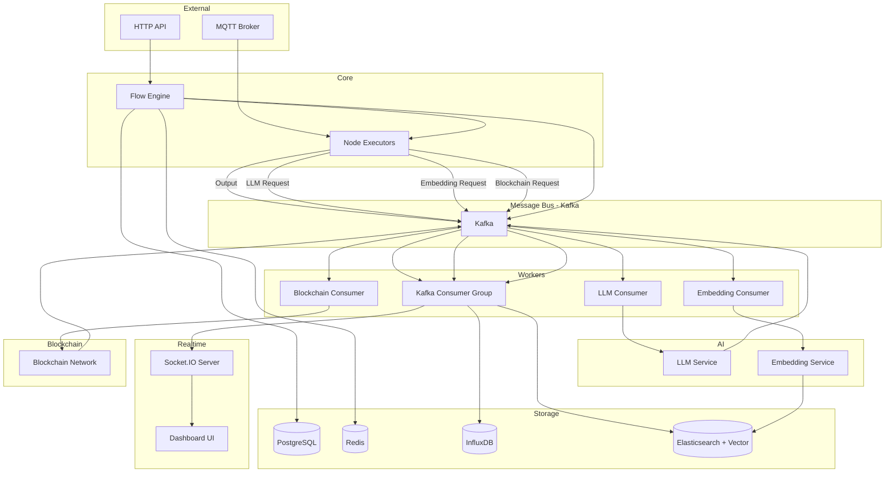
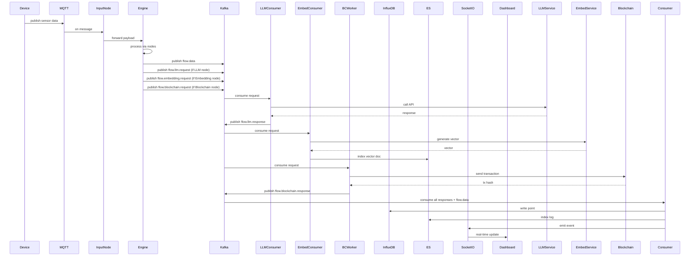

# IoT Flow Management Module  
**พร้อม Kafka, InfluxDB, Elasticsearch, Socket.IO, Logging, LLM, AI Embedding และ Blockchain**

> **เป้าหมาย:** สร้างระบบจัดการ Flow สำหรับ IoT แบบเรียลไทม์ รองรับการประมวลผลข้อมูลปริมาณสูง ด้วยสถาปัตยกรรมแบบ Event‑Driven และ Clean Architecture พร้อมเพิ่มความสามารถอัจฉริยะด้วย **LLM, AI Embedding** และ **Blockchain** เพื่อการวิเคราะห์, การค้นหาเชิงความหมาย, และการบันทึกหลักฐานที่ไม่สามารถแก้ไขได้  
> **เทคโนโลยีหลัก:**  
> - **Go** (Goroutines, Channels, `slog`)  
> - **PostgreSQL** (ข้อมูลหลัก, BIGSERIAL)  
> - **Redis** (Cache, Rate Limit, Distributed State)  
> - **Kafka** (Message Queue, Event Sourcing, Decoupling)  
> - **InfluxDB** (Time‑series Data, Metrics)  
> - **Elasticsearch** (Search, Logging, Audit, **Vector Search**)  
> - **Socket.IO** (Real‑time Dashboard, ใช้ WebSocket)  
> - **MQTT** (IoT Device Communication)  
> - **Cron** (Schedule Trigger)  
> - **LLM** (OpenAI, Gemini, หรือ Local Models) – สำหรับสรุปข้อความ, ตอบคำถาม, สร้างรายงาน  
> - **AI Embedding** (Sentence‑Transformers, OpenAI Embedding) – สำหรับแปลงข้อมูลเป็นเวกเตอร์ ค้นหาความคล้าย  
> - **Blockchain** (Ethereum, Hyperledger, หรือ BSC) – สำหรับบันทึกหลักฐานและ Smart Contract อัตโนมัติ

---

## สารบัญ

1. [ภาพรวมระบบ (ปรับปรุง)](#1-ภาพรวมระบบ-ปรับปรุง)  
2. [โครงสร้าง Module (ปรับปรุง)](#2-โครงสร้าง-module-ปรับปรุง)  
3. [Domain Layer](#3-domain-layer)  
4. [Application Layer](#4-application-layer)  
   - 4.1 Use Cases (ปรับปรุง)  
   - 4.2 DTOs  
5. [Infrastructure Layer (เพิ่มเติม)](#5-infrastructure-layer-เพิ่มเติม)  
   - 5.1 Persistence (PostgreSQL)  
   - 5.2 Redis Integration  
   - 5.3 Kafka Integration (Producer & Consumer)  
   - 5.4 InfluxDB Integration (Time‑Series Writer)  
   - 5.5 Elasticsearch Integration (Indexer, Logger, **Vector Store**)  
   - 5.6 Logging (Structured Logging with `slog`)  
   - 5.7 Flow Runtime Engine (ปรับปรุง)  
   - 5.8 Built‑in Node Executors (เพิ่ม Kafka/InfluxDB/ES Output, **LLM, Embedding, Blockchain**)  
   - 5.9 **LLM Integration** (Client, Consumer)  
   - 5.10 **AI Embedding Integration** (Client, Consumer, Vector Index)  
   - 5.11 **Blockchain Integration** (Client, Consumer, Smart Contract)  
   - 5.12 MQTT Adapter  
   - 5.13 Helpers (Alarm, Timezone)  
6. [Interface Layer (ปรับปรุง)](#6-interface-layer-ปรับปรุง)  
   - 6.1 HTTP Handlers  
   - 6.2 Routes  
   - 6.3 Socket.IO Handler (Real‑time)  
   - 6.4 Rate Limit Middleware  
7. [Background Workers / Consumers](#7-background-workers--consumers)  
   - 7.1 Kafka Consumer Group (หลัก)  
   - 7.2 InfluxDB Batch Writer  
   - 7.3 Elasticsearch Bulk Indexer  
   - 7.4 WebSocket Broadcaster  
   - 7.5 **LLM Consumer** (เรียก LLM แบบ Async)  
   - 7.6 **Embedding Consumer** (สร้างเวกเตอร์)  
   - 7.7 **Blockchain Consumer** (บันทึกข้อมูลลง Blockchain)  
8. [Database Migrations](#8-database-migrations)  
9. [Workflow Diagrams (ปรับปรุง)](#9-workflow-diagrams-ปรับปรุง)  
10. [การติดตั้งและใช้งาน](#10-การติดตั้งและใช้งาน)  
11. [สรุป](#11-สรุป)

---

## 1. ภาพรวมระบบ (ปรับปรุง)

ระบบ IoT Flow Management เดิมมี:
- **Flow Engine** ใช้ Goroutines และ Channels ในการประมวลผล
- **Nodes** (MQTT Input, Filter, Function, HTTP Output, Schedule Trigger, ฯลฯ)
- **PostgreSQL** + **Redis** (Cache, Rate Limit, State)

**ของใหม่ที่เพิ่มเข้ามา:**

1. **Kafka** – เป็นศูนย์กลางการสื่อสารแบบ异步ระหว่างโมดูลต่าง ๆ  
   - Node Executors ส่งข้อมูล (payload) ไปยัง Kafka topic (เช่น `flow.data`, `flow.alarm`, `flow.metrics`, `flow.llm.request`, `flow.embedding.request`, `flow.blockchain.request`)  
   - Consumer Workers อ่านจาก Kafka เพื่อนำไปจัดเก็บใน InfluxDB, Elasticsearch, ส่งไปยัง WebSocket, เรียก LLM, สร้าง Embedding, และบันทึก Blockchain

2. **InfluxDB** – เก็บข้อมูลอนุกรมเวลา (sensor values, counts, alarms) เพื่อการวิเคราะห์และแสดงผลกราฟ

3. **Elasticsearch** – ใช้สำหรับค้นหาข้อมูล (logs, events, audit) และสร้างดัชนีสำหรับการค้นหาขั้นสูง รวมถึง **การเก็บเวกเตอร์ (dense_vector)** เพื่อค้นหาเชิงความหมาย

4. **Socket.IO** – แทนที่ WebSocket เดิม (หรือเพิ่มเติม) เพื่อให้ Dashboard สามารถรับข้อมูลแบบ real‑time ผ่าน events (เช่น `flow:status`, `node:data`, `alarm:trigger`)

5. **Structured Logging** – ใช้ `log/slog` เพื่อบันทึกทุกการทำงาน พร้อมระดับ (Debug, Info, Warn, Error) และส่งไปยัง Elasticsearch ผ่าน Filebeat หรือโดยตรง

6. **LLM (Large Language Model)** – ใช้สำหรับ:
   - สรุปข้อความแจ้งเตือน (alarm) และแนะนำการดำเนินการ
   - ตอบคำถามเกี่ยวกับสถานะอุปกรณ์จากข้อมูลที่เก็บไว้
   - สร้างรายงานอัตโนมัติจากข้อมูลอนุกรมเวลา

7. **AI Embedding** – ใช้สำหรับ:
   - แปลงข้อมูล sensor หรือข้อความเป็นเวกเตอร์ (vector embedding)
   - เก็บไว้ใน Elasticsearch เพื่อค้นหาความคล้ายของเหตุการณ์ (similarity search)
   - ใช้เป็นส่วนหนึ่งของ RAG (Retrieval-Augmented Generation) ร่วมกับ LLM

8. **Blockchain** – ใช้สำหรับ:
   - บันทึกหลักฐานที่ไม่สามารถแก้ไขได้ (immutable audit trail) ของการเปลี่ยนแปลง Flow, ค่า sensor ที่สำคัญ, และการแจ้งเตือน
   - ใช้ Smart Contract เพื่อดำเนินการอัตโนมัติเมื่อเงื่อนไขถูก触发 (เช่น shutdown อุปกรณ์)

**รูปแบบการไหลของข้อมูล:**

```
MQTT/HTTP → Input Node → Flow Engine → Node Executors
                                         │
                                         ├─> Output Node → Kafka (flow.data, flow.alarm, ...)
                                         │
                                         ▼
                              Kafka Topics (หลายตัว)
                              ├─ flow.data           → Consumer → InfluxDB, ES, Socket.IO
                              ├─ flow.alarm          → Consumer → ES, Socket.IO, LLM Request
                              ├─ flow.llm.request    → Consumer → LLM Service → flow.llm.response
                              ├─ flow.embedding.request → Consumer → Embedding Service → ES (vector)
                              └─ flow.blockchain.request → Consumer → Blockchain (TX)
```

นอกจากนี้ยังมี **Admin API** สำหรับจัดการ Flow และ **Socket.IO** สำหรับ Dashboard แสดงสถานะแบบ Real‑time

---

## 2. โครงสร้าง Module (ปรับปรุง)

```
internal/modules/iotflow/
├── domain/
│   ├── entity/
│   │   ├── flow.go
│   │   ├── node.go
│   │   └── wire.go
│   ├── value_object/
│   │   ├── node_type.go          // เพิ่ม NodeTypeLLM, NodeTypeEmbedding, NodeTypeBlockchain
│   │   ├── node_status.go
│   │   ├── flow_status.go
│   │   ├── data_payload.go
│   │   └── port.go
│   ├── repository/
│   │   ├── flow_repository.go
│   │   └── flow_cache_repository.go
│   ├── service/
│   │   ├── flow_engine.go
│   │   ├── node_executor.go
│   │   └── flow_validator.go
│   └── errors/
│       └── errors.go
├── application/
│   ├── create_flow.go
│   ├── deploy_flow.go
│   ├── start_flow.go
│   ├── stop_flow.go
│   ├── get_flow.go
│   ├── list_flows.go
│   ├── update_flow.go
│   ├── delete_flow.go
│   ├── add_node.go
│   ├── add_wire.go
│   ├── remove_node.go
│   ├── remove_wire.go
│   └── dto.go
├── infrastructure/
│   ├── persistence/
│   │   └── postgres/
│   │       ├── models.go
│   │       └── flow_repo_impl.go
│   ├── cache/
│   │   └── redis/
│   │       ├── redis_client.go
│   │       ├── flow_cache_repo_impl.go
│   │       ├── rate_limiter.go
│   │       └── flow_instance_store.go
│   ├── messaging/                           # Kafka
│   │   ├── kafka_client.go                  # Producer + Consumer
│   │   ├── producer.go                      # Publish events
│   │   └── consumer.go                      # Worker logic (หลัก)
│   ├── timeseries/                          # InfluxDB
│   │   ├── influx_client.go
│   │   └── writer.go                        # Batch write
│   ├── search/                              # Elasticsearch
│   │   ├── es_client.go
│   │   ├── indexer.go                       # Bulk index
│   │   └── vector_store.go                  # ค้นหา/เก็บเวกเตอร์
│   ├── llm/                                 # ใหม่: LLM
│   │   ├── client.go                        # OpenAI / Gemini / Ollama
│   │   └── consumer.go                      # Kafka consumer สำหรับ LLM request
│   ├── embedding/                           # ใหม่: AI Embedding
│   │   ├── client.go                        # เรียก service สร้าง embedding
│   │   └── consumer.go                      # Kafka consumer สำหรับ embedding request
│   ├── blockchain/                          # ใหม่: Blockchain
│   │   ├── client.go                        # Ethereum client, contract binding
│   │   └── consumer.go                      # Kafka consumer สำหรับ blockchain request
│   ├── engine/
│   │   ├── runtime.go
│   │   ├── node_runner.go
│   │   └── builtin_nodes/
│   │       ├── mqtt_input.go
│   │       ├── filter.go
│   │       ├── function.go
│   │       ├── http_output.go
│   │       ├── debug.go
│   │       ├── delay.go
│   │       ├── schedule_trigger.go
│   │       ├── kafka_output.go              # ส่งไป Kafka
│   │       ├── influx_output.go             # เขียน InfluxDB โดยตรง (optional)
│   │       ├── es_output.go                 # Index ลง Elasticsearch
│   │       ├── llm_query.go                 # ใหม่: เรียก LLM (แบบ sync หรือ async)
│   │       ├── embedding.go                 # ใหม่: สร้าง embedding
│   │       └── blockchain_record.go         # ใหม่: บันทึก Blockchain
│   ├── mqtt/
│   │   └── mqtt_adapter.go
│   ├── logging/
│   │   └── logger.go                         # ใช้ slog + Elasticsearch Hook
│   └── helpers/
│       ├── timezone.go
│       ├── alarm_validator.go
│       └── utils.go
└── interfaces/
    ├── http/
    │   ├── flow_handler.go
    │   └── routes.go
    ├── middleware/
    │   └── rate_limit.go
    ├── socketio/
    │   ├── server.go                         # ตั้งค่า Socket.IO
    │   └── handlers.go                       # Event handlers
    └── websocket/                            # (保留 WebSocket สำหรับ backward)
        └── flow_monitor.go
```

---

## 3. Domain Layer

**ไม่มีการเปลี่ยนแปลง** เนื่องจากเราจะไม่เพิ่มเอนทิตีหลักใหม่ใน Domain ยกเว้นอาจเพิ่ม **Value Object** เช่น `LLMConfig`, `EmbeddingConfig`, `BlockchainConfig` เพื่อใช้ใน Node.Config แต่ก็สามารถเก็บเป็น `map[string]interface{}` ได้ตามเดิม

เรายังคงรักษา Clean Architecture ไว้ โดย Domain ไม่รู้จักเทคโนโลยีภายนอก

---

## 4. Application Layer

### 4.1 Use Cases (ปรับปรุง)

**Use Cases เดิม** (CRUD, Deploy, Start, Stop, Add/Remove Node/Wire) ยังคงเหมือนเดิม แต่เราจะเพิ่ม **การส่ง event ไปยัง Kafka** เมื่อเกิดการเปลี่ยนแปลงสถานะ Flow หรือ Node เพื่อให้ Blockchain Consumer สามารถบันทึกหลักฐานได้

**ตัวอย่าง `StartFlowUseCase` (ปรับปรุง):**
```go
func (uc *StartFlowUseCase) Execute(ctx context.Context, flowID int64) error {
    // 1-4 เหมือนเดิม (DB, Cache, Engine)
    // 5. Publish event ไป Kafka (สำหรับ audit และ blockchain)
    event := map[string]interface{}{
        "type":      "flow.started",
        "flow_id":   flowID,
        "user_id":   flow.UserID.String(),
        "timestamp": time.Now(),
    }
    _ = uc.kafkaProducer.Publish(ctx, "flow.events", event)
    // 6. ส่งไปยัง Blockchain topic เพื่อบันทึก (แยกต่างหาก)
    _ = uc.kafkaProducer.Publish(ctx, "flow.blockchain.request", event)
    return nil
}
```

**Use Case ใหม่: `PublishDataUseCase`** สำหรับส่งข้อมูลที่มาจาก Node ไปยัง Kafka (จะถูกเรียกจาก Executor)

**Use Case ใหม่: `QueryLLMUseCase`** (ถ้าต้องการเรียก LLM ผ่าน API โดยตรง) – แต่เราจะใช้ Executor และ Consumer แทน

### 4.2 DTOs

เพิ่ม DTO สำหรับ LLM Request/Response, Embedding Request/Response, Blockchain Transaction Request

```go
// application/dto.go
type LLMRequest struct {
    FlowID      int64                  `json:"flow_id"`
    NodeID      int64                  `json:"node_id"`
    Prompt      string                 `json:"prompt"`
    Model       string                 `json:"model"`
    Temperature float32                `json:"temperature"`
    Payload     map[string]interface{} `json:"payload"` // ข้อมูลต้นฉบับ
}

type EmbeddingRequest struct {
    FlowID      int64                  `json:"flow_id"`
    NodeID      int64                  `json:"node_id"`
    InputFields []string               `json:"input_fields"` // ชื่อฟิลด์ที่จะนำมาสร้างข้อความ
    Payload     map[string]interface{} `json:"payload"`
}

type BlockchainRequest struct {
    FlowID      int64                  `json:"flow_id"`
    NodeID      int64                  `json:"node_id"`
    DataHash    string                 `json:"data_hash"`
    Payload     map[string]interface{} `json:"payload"`
}
```

---

## 5. Infrastructure Layer (เพิ่มเติม)

### 5.1 Persistence (PostgreSQL) – ไม่เปลี่ยนแปลง

### 5.2 Redis Integration – ไม่เปลี่ยนแปลง

### 5.3 Kafka Integration

เหมือนเดิม แต่เพิ่ม **Producer functions** สำหรับ publish ไปยัง topics ใหม่

**`infrastructure/messaging/producer.go`** เพิ่ม:
```go
func PublishLLMRequest(ctx context.Context, kc *KafkaClient, req *dto.LLMRequest) error {
    return kc.Publish(ctx, "flow.llm.request", req)
}

func PublishEmbeddingRequest(ctx context.Context, kc *KafkaClient, req *dto.EmbeddingRequest) error {
    return kc.Publish(ctx, "flow.embedding.request", req)
}

func PublishBlockchainRequest(ctx context.Context, kc *KafkaClient, req *dto.BlockchainRequest) error {
    return kc.Publish(ctx, "flow.blockchain.request", req)
}
```

### 5.4 InfluxDB Integration – เหมือนเดิม

### 5.5 Elasticsearch Integration (เพิ่ม Vector Store)

**`infrastructure/search/es_client.go`** – เพิ่มฟังก์ชันสำหรับสร้าง index พร้อม mapping ของ `dense_vector`

```go
func (e *ESClient) CreateVectorIndex(index string) error {
    mapping := `{
        "mappings": {
            "properties": {
                "embedding": {
                    "type": "dense_vector",
                    "dims": 384,  // ขึ้นอยู่กับโมเดล
                    "index": true,
                    "similarity": "cosine"
                },
                "text": { "type": "text" },
                "flow_id": { "type": "long" },
                "timestamp": { "type": "date" }
            }
        }
    }`
    req := bytes.NewReader([]byte(mapping))
    _, err := e.client.Indices.Create(index, e.client.Indices.Create.WithBody(req))
    return err
}

func (e *ESClient) VectorSearch(index string, queryVector []float64, size int) ([]map[string]interface{}, error) {
    // ใช้ script_score หรือ knn query (ES 8.x)
    // ...
}
```

### 5.6 Logging (Structured) – เหมือนเดิม

### 5.7 Flow Runtime Engine (ปรับปรุง)

ใน `distributeOutput` เราส่งข้อมูลไปยัง Kafka ตามเดิม และยังคงส่งต่อไปยัง target nodes

**เพิ่มการตรวจสอบ Node Type** ถ้าเป็น `NodeTypeLLM`, `NodeTypeEmbedding`, `NodeTypeBlockchain` จะเรียก Executor ที่เกี่ยวข้อง

### 5.8 Built‑in Node Executors (เพิ่ม LLM, Embedding, Blockchain)

#### 5.8.1 `llm_query.go` – Node ประเภท LLM

```go
type LLMExecutor struct {
    kafkaProducer *messaging.KafkaClient
    // ไม่ต้องมี LLM client โดยตรง ใช้ Kafka async
}

func (e *LLMExecutor) Execute(ctx context.Context, node *entity.Node, input <-chan value_object.DataPayload) (<-chan value_object.DataPayload, error) {
    output := make(chan value_object.DataPayload)
    go func() {
        defer close(output)
        for payload := range input {
            // อ่าน config
            promptTemplate, _ := node.Config["prompt_template"].(string)
            model, _ := node.Config["model"].(string)
            temp, _ := node.Config["temperature"].(float64)
            
            // render template
            prompt := renderTemplate(promptTemplate, payload.Payload)
            req := &dto.LLMRequest{
                FlowID:      payload.FlowID,
                NodeID:      node.ID,
                Prompt:      prompt,
                Model:       model,
                Temperature: float32(temp),
                Payload:     payload.Payload,
            }
            // ส่งไป Kafka topic flow.llm.request
            _ = e.kafkaProducer.Publish(ctx, "flow.llm.request", req)
            // ไม่ต้องรอผลลัพธ์ ส่ง payload ไปต่อ (หรืออาจรอ response ผ่าน topic อื่นก็ได้)
            // เราเลือกที่จะส่ง payload ไปต่อทันที (non-blocking)
            output <- payload
        }
    }()
    return output, nil
}
```

#### 5.8.2 `embedding.go` – Node ประเภท Embedding

```go
type EmbeddingExecutor struct {
    kafkaProducer *messaging.KafkaClient
}

func (e *EmbeddingExecutor) Execute(ctx context.Context, node *entity.Node, input <-chan value_object.DataPayload) (<-chan value_object.DataPayload, error) {
    output := make(chan value_object.DataPayload)
    go func() {
        defer close(output)
        for payload := range input {
            inputFields, _ := node.Config["input_fields"].([]interface{})
            // สร้างข้อความจากฟิลด์ที่กำหนด
            var textParts []string
            for _, f := range inputFields {
                fieldName := f.(string)
                if val, ok := payload.Payload[fieldName]; ok {
                    textParts = append(textParts, fmt.Sprintf("%v", val))
                }
            }
            text := strings.Join(textParts, " ")
            req := &dto.EmbeddingRequest{
                FlowID:      payload.FlowID,
                NodeID:      node.ID,
                InputFields: inputFieldsToStrings(inputFields),
                Payload:     payload.Payload,
            }
            _ = e.kafkaProducer.Publish(ctx, "flow.embedding.request", req)
            // ส่งต่อ payload (ไม่รอ)
            output <- payload
        }
    }()
    return output, nil
}
```

#### 5.8.3 `blockchain_record.go` – Node ประเภท Blockchain

```go
type BlockchainExecutor struct {
    kafkaProducer *messaging.KafkaClient
}

func (e *BlockchainExecutor) Execute(ctx context.Context, node *entity.Node, input <-chan value_object.DataPayload) (<-chan value_object.DataPayload, error) {
    output := make(chan value_object.DataPayload)
    go func() {
        defer close(output)
        for payload := range input {
            fieldsToHash, _ := node.Config["fields_to_hash"].([]interface{})
            // สร้าง hash จากฟิลด์ที่กำหนด
            hash := computeHashFromFields(payload.Payload, fieldsToHash)
            req := &dto.BlockchainRequest{
                FlowID:   payload.FlowID,
                NodeID:   node.ID,
                DataHash: hash,
                Payload:  payload.Payload,
            }
            _ = e.kafkaProducer.Publish(ctx, "flow.blockchain.request", req)
            output <- payload
        }
    }()
    return output, nil
}
```

### 5.9 LLM Integration

**`infrastructure/llm/client.go`** – รองรับ OpenAI / Gemini / Ollama

```go
type LLMClient interface {
    Generate(ctx context.Context, prompt string, model string, temp float32) (string, error)
}

type OpenAIClient struct { client *openai.Client }
func (c *OpenAIClient) Generate(ctx context.Context, prompt string, model string, temp float32) (string, error) {
    // ...
}
```

**`infrastructure/llm/consumer.go`** – Kafka consumer ที่อ่าน `flow.llm.request` และส่งผลลัพธ์ไปยัง `flow.llm.response`

```go
type LLMConsumer struct {
    client   LLMClient
    producer *messaging.KafkaClient
}

func (c *LLMConsumer) ConsumeClaim(sess sarama.ConsumerGroupSession, claim sarama.ConsumerGroupClaim) error {
    for msg := range claim.Messages() {
        var req dto.LLMRequest
        json.Unmarshal(msg.Value, &req)
        result, err := c.client.Generate(context.Background(), req.Prompt, req.Model, req.Temperature)
        if err != nil {
            slog.Error("LLM error", "err", err)
            continue
        }
        response := map[string]interface{}{
            "flow_id":   req.FlowID,
            "node_id":   req.NodeID,
            "result":    result,
            "original":  req.Payload,
        }
        _ = c.producer.Publish(context.Background(), "flow.llm.response", response)
        sess.MarkMessage(msg, "")
    }
    return nil
}
```

### 5.10 AI Embedding Integration

**`infrastructure/embedding/client.go`** – ใช้ Python sidecar หรือ API

```go
type EmbeddingClient interface {
    Embed(ctx context.Context, text string) ([]float64, error)
}

type RESTEmbeddingClient struct { url string }
func (c *RESTEmbeddingClient) Embed(ctx context.Context, text string) ([]float64, error) {
    // POST request to embedding service
}
```

**`infrastructure/embedding/consumer.go`** – อ่าน `flow.embedding.request` สร้างเวกเตอร์ แล้วเก็บลง Elasticsearch (หรือส่งต่อ)

```go
type EmbeddingConsumer struct {
    client   EmbeddingClient
    esClient *search.ESClient
    producer *messaging.KafkaClient
}

func (c *EmbeddingConsumer) ConsumeClaim(sess sarama.ConsumerGroupSession, claim sarama.ConsumerGroupClaim) error {
    for msg := range claim.Messages() {
        var req dto.EmbeddingRequest
        json.Unmarshal(msg.Value, &req)
        // สร้างข้อความจาก input fields
        text := buildTextFromFields(req.Payload, req.InputFields)
        vec, err := c.client.Embed(context.Background(), text)
        if err != nil {
            slog.Error("Embedding error", "err", err)
            continue
        }
        // บันทึกลง Elasticsearch ด้วย vector field
        doc := map[string]interface{}{
            "flow_id":    req.FlowID,
            "node_id":    req.NodeID,
            "text":       text,
            "embedding":  vec,
            "timestamp":  time.Now(),
            "payload":    req.Payload,
        }
        _ = c.esClient.IndexDocument("sensor_vectors", doc)
        sess.MarkMessage(msg, "")
    }
    return nil
}
```

### 5.11 Blockchain Integration

**`infrastructure/blockchain/client.go`** – เชื่อมต่อ Ethereum

```go
type BlockchainClient struct {
    client    *ethclient.Client
    contract  *AuditContract
    auth      *bind.TransactOpts
}

func (b *BlockchainClient) StoreDataHash(ctx context.Context, dataHash [32]byte) (string, error) {
    tx, err := b.contract.StoreData(b.auth, dataHash)
    if err != nil {
        return "", err
    }
    return tx.Hash().Hex(), nil
}
```

**`infrastructure/blockchain/consumer.go`** – อ่าน `flow.blockchain.request` และส่ง transaction

```go
type BlockchainConsumer struct {
    client   *BlockchainClient
    producer *messaging.KafkaClient
}

func (c *BlockchainConsumer) ConsumeClaim(sess sarama.ConsumerGroupSession, claim sarama.ConsumerGroupClaim) error {
    for msg := range claim.Messages() {
        var req dto.BlockchainRequest
        json.Unmarshal(msg.Value, &req)
        hashBytes, _ := hex.DecodeString(req.DataHash)
        var hashArr [32]byte
        copy(hashArr[:], hashBytes)
        txHash, err := c.client.StoreDataHash(context.Background(), hashArr)
        if err != nil {
            slog.Error("Blockchain error", "err", err)
            continue
        }
        // บันทึก txHash กลับไปยัง payload หรือส่งไปยัง topic อื่น
        response := map[string]interface{}{
            "flow_id": req.FlowID,
            "node_id": req.NodeID,
            "tx_hash": txHash,
            "original": req.Payload,
        }
        _ = c.producer.Publish(context.Background(), "flow.blockchain.response", response)
        sess.MarkMessage(msg, "")
    }
    return nil
}
```

### 5.12 MQTT Adapter – ไม่เปลี่ยนแปลง

### 5.13 Helpers – ไม่เปลี่ยนแปลง

---

## 6. Interface Layer (ปรับปรุง)

### 6.1 HTTP Handlers – ไม่เปลี่ยนแปลง

### 6.2 Routes – ไม่เปลี่ยนแปลง

### 6.3 Socket.IO Handler (ใหม่) – เหมือนเดิม

### 6.4 Rate Limit Middleware – ไม่เปลี่ยนแปลง

---

## 7. Background Workers / Consumers

### 7.1 Kafka Consumer Group (หลัก)

**`infrastructure/messaging/consumer.go`** – รับ event จาก Kafka และประมวลผล (InfluxDB, ES, Socket.IO) เหมือนเดิม

### 7.2 InfluxDB Batch Writer – เหมือนเดิม

### 7.3 Elasticsearch Bulk Indexer – เหมือนเดิม

### 7.4 WebSocket Broadcaster – เหมือนเดิม

### 7.5 LLM Consumer – ตามที่อธิบายใน 5.9

### 7.6 Embedding Consumer – ตามที่อธิบายใน 5.10

### 7.7 Blockchain Consumer – ตามที่อธิบายใน 5.11

---

## 8. Database Migrations

เหมือนเดิม (BIGSERIAL) – ไม่มีการเปลี่ยนแปลง Schema

---

## 9. Workflow Diagrams (ปรับปรุง)

### 9.1 สถาปัตยกรรมโดยรวม (พร้อม Kafka/InfluxDB/ES/Socket.IO/LLM/Embedding/Blockchain)



### 9.2 Sequence Diagram: ข้อมูลจาก Sensor สู่ Dashboard + LLM + Embedding + Blockchain



---

## 10. การติดตั้งและใช้งาน

### 10.1 Dependencies เพิ่มเติม

```bash
go get github.com/IBM/sarama
go get github.com/influxdata/influxdb-client-go/v2
go get github.com/elastic/go-elasticsearch/v8
go get github.com/googollee/go-socket.io
go get log/slog
go get github.com/sashabaranov/go-openai          # สำหรับ OpenAI
go get github.com/ethereum/go-ethereum            # สำหรับ Blockchain
```

### 10.2 Environment Variables

```env
# ... existing ...
KAFKA_BROKERS=localhost:9092
KAFKA_GROUP_ID=iotflow-consumer
INFLUX_URL=http://localhost:8086
INFLUX_TOKEN=my-token
INFLUX_ORG=my-org
INFLUX_BUCKET=iotflow
ES_ADDRESSES=http://localhost:9200
ES_USERNAME=elastic
ES_PASSWORD=changeme
SOCKETIO_PORT=3000

# LLM
OPENAI_API_KEY=sk-...
LLM_MODEL=gpt-4o-mini
LLM_PROVIDER=openai   # หรือ gemini, ollama

# Embedding
EMBEDDING_SERVICE_URL=http://embedding-service:5000/embed

# Blockchain
ETH_RPC_URL=https://mainnet.infura.io/v3/...
ETH_PRIVATE_KEY=0x...
BLOCKCHAIN_CONTRACT_ADDRESS=0x...
```

### 10.3 Wire Up (ใน `main.go`)

```go
// 1. Kafka
kafkaClient, _ := messaging.NewKafkaClient(strings.Split(os.Getenv("KAFKA_BROKERS"), ","), os.Getenv("KAFKA_GROUP_ID"))

// 2. InfluxDB
influxClient := timeseries.NewInfluxClient(os.Getenv("INFLUX_URL"), os.Getenv("INFLUX_TOKEN"), os.Getenv("INFLUX_ORG"), os.Getenv("INFLUX_BUCKET"))

// 3. Elasticsearch
esClient, _ := search.NewESClient(strings.Split(os.Getenv("ES_ADDRESSES"), ","), os.Getenv("ES_USERNAME"), os.Getenv("ES_PASSWORD"))

// 4. Socket.IO
socketServer, _ := socketio.NewSocketIOServer()
go socketServer.Serve()

// 5. LLM Client
llmClient := llm.NewOpenAIClient(os.Getenv("OPENAI_API_KEY"))

// 6. Embedding Client
embedClient := embedding.NewRESTEmbeddingClient(os.Getenv("EMBEDDING_SERVICE_URL"))

// 7. Blockchain Client
bcClient, _ := blockchain.NewBlockchainClient(os.Getenv("ETH_RPC_URL"), os.Getenv("ETH_PRIVATE_KEY"), os.Getenv("BLOCKCHAIN_CONTRACT_ADDRESS"))

// 8. Engine (ส่ง Kafka producer เข้าไป)
engine := engine.NewRuntime(instanceStore, instanceID, kafkaClient)

// 9. Register executors (รวม LLM, Embedding, Blockchain)
engine.RegisterExecutor(value_object.NodeTypeKafkaOutput, builtin_nodes.NewKafkaOutputExecutor(kafkaClient))
engine.RegisterExecutor(value_object.NodeTypeInfluxOutput, builtin_nodes.NewInfluxOutputExecutor(influxClient))
engine.RegisterExecutor(value_object.NodeTypeESOutput, builtin_nodes.NewESOutputExecutor(esClient))
engine.RegisterExecutor(value_object.NodeTypeLLM, builtin_nodes.NewLLMExecutor(kafkaClient))
engine.RegisterExecutor(value_object.NodeTypeEmbedding, builtin_nodes.NewEmbeddingExecutor(kafkaClient))
engine.RegisterExecutor(value_object.NodeTypeBlockchain, builtin_nodes.NewBlockchainExecutor(kafkaClient))
// ... existing executors

// 10. เริ่ม Consumer Workers
// 10.1 หลัก (Influx, ES, Socket)
mainConsumer := &messaging.FlowConsumer{
    Influx: influxClient,
    ES:     esClient,
    Socket: socketServer,
}
go kafkaClient.Consume(context.Background(), []string{"flow.data", "flow.alarm"}, mainConsumer)

// 10.2 LLM Consumer
llmConsumer := &llm.LLMConsumer{
    Client:   llmClient,
    Producer: kafkaClient,
}
go kafkaClient.Consume(context.Background(), []string{"flow.llm.request"}, llmConsumer)

// 10.3 Embedding Consumer
embedConsumer := &embedding.EmbeddingConsumer{
    Client:   embedClient,
    ESClient: esClient,
    Producer: kafkaClient,
}
go kafkaClient.Consume(context.Background(), []string{"flow.embedding.request"}, embedConsumer)

// 10.4 Blockchain Consumer
bcConsumer := &blockchain.BlockchainConsumer{
    Client:   bcClient,
    Producer: kafkaClient,
}
go kafkaClient.Consume(context.Background(), []string{"flow.blockchain.request"}, bcConsumer)

// 11. เริ่ม HTTP Server
// ...
```

### 10.4 ตัวอย่างการใช้งาน Node ประเภทต่าง ๆ

**LLM Node**
```json
{
  "type": "llm",
  "name": "Alarm Summarizer",
  "config": {
    "prompt_template": "Summarize this alarm in Thai: {{.message}}",
    "model": "gpt-4o-mini",
    "temperature": 0.3
  }
}
```

**Embedding Node**
```json
{
  "type": "embedding",
  "name": "Sensor2Vec",
  "config": {
    "input_fields": ["temperature", "humidity", "vibration"],
    "output_index": "sensor_vectors"
  }
}
```

**Blockchain Node**
```json
{
  "type": "blockchain",
  "name": "Audit Logger",
  "config": {
    "fields_to_hash": ["device_id", "value", "timestamp"]
  }
}
```

---

## 11. สรุป

เราได้เพิ่มระบบย่อยที่ช่วยให้ IoT Flow Management Module กลายเป็นแพลตฟอร์มที่สมบูรณ์และทันสมัยสำหรับการประมวลผลข้อมูลแบบเรียลไทม์ พร้อมความสามารถอัจฉริยะและความน่าเชื่อถือ:

- **Kafka** – ช่วยแยกส่วน (decouple) การประมวลผลออกจาก Engine ช่วยให้ขยายขนาดได้
- **InfluxDB** – เก็บข้อมูลอนุกรมเวลาสำหรับการวิเคราะห์และแสดงผล
- **Elasticsearch** – ให้ความสามารถในการค้นหาและจัดทำดัชนีข้อมูล logs/events และเก็บเวกเตอร์สำหรับ similarity search
- **Socket.IO** – สื่อสารแบบเรียลไทม์กับ Dashboard
- **Structured Logging** – ทำให้การติดตามและแก้ไขปัญหาง่ายขึ้น
- **LLM** – ให้ความสามารถในการประมวลผลภาษาธรรมชาติ สรุป และตอบคำถาม
- **AI Embedding** – ช่วยค้นหารูปแบบที่ซับซ้อนและตรวจจับความผิดปกติผ่านการค้นหาเวกเตอร์
- **Blockchain** – สร้างหลักฐานที่ไม่สามารถแก้ไขได้ เพิ่มความน่าเชื่อถือและการตรวจสอบย้อนกลับ

ระบบยังคงรักษา Clean Architecture และ DDD ไว้ ทำให้ขยายหรือปรับเปลี่ยนส่วนประกอบต่าง ๆ ได้อย่างยืดหยุ่น โดยไม่กระทบต่อโดเมนหลัก

**แนะนำขั้นตอนต่อไป:**
- สร้าง Dashboard ที่ใช้ Socket.IO เพื่อแสดงกราฟ, ผลลัพธ์ LLM, และการค้นหาเวกเตอร์
- ใช้ Kibana สำหรับ visualize logs และ vector search
- ปรับปรุง Blockchain Consumer ให้ batch transactions เพื่อลดค่า gas
- เพิ่ม caching สำหรับ embeddings ใน Redis เพื่อลดการคำนวณซ้ำ
- ใช้ Circuit Breaker และ Retry ในการเรียก LLM/Embedding API เพื่อความเสถียร

---
 # การเพิ่ม Vector Database และระบบ Logging Management (เก็บผลเฉลี่ย 1 ปี + ลบข้อมูลเก่า)

จากเอกสารปัจจุบันของคุณ **IoT Flow Management Module** มีการใช้ **Elasticsearch** เป็นทั้ง Search Engine และ **Vector Store** (ผ่าน `dense_vector`) อยู่แล้ว การเพิ่ม **Vector Database เฉพาะทาง** (เช่น Milvus, Qdrant, Pinecone) และ **ระบบ Logging Management** ที่เก็บผลเฉลี่ยรายปีพร้อมลบข้อมูลเก่า **ยังคงใช้โครงสร้าง Clean Architecture เดิมได้อย่างสมบูรณ์** โดยเพิ่มเติมเฉพาะ Infrastructure Layer และ Background Workers เท่านั้น

---

## 1. การเพิ่ม Vector Database (แยกจาก Elasticsearch)

### 1.1 ทำไมต้องแยก Vector DB?
- Elasticsearch รองรับ `dense_vector` แต่ประสิทธิภาพในการค้นหาแบบ Approximate Nearest Neighbor (ANN) อาจด้อยกว่า Vector DB เฉพาะทาง (Milvus, Qdrant) เมื่อมีเวกเตอร์จำนวนมาก (หลายล้านตัว)
- การแยกช่วยลดภาระของ Elasticsearch และทำให้ปรับขนาด (scale) แต่ละส่วนได้อิสระ
- ยังคงใช้ Elasticsearch สำหรับ全文检索และ logs ส่วน Vector DB สำหรับ similarity search โดยเฉพาะ

### 1.2 ปรับโครงสร้าง (ยังคง Clean Architecture)

**เพิ่มใน `infrastructure/`**:
```
infrastructure/
├── vectordb/                        # ใหม่
│   ├── interface.go                 # VectorStore interface (ค้นหา, เพิ่ม, ลบ)
│   ├── milvus_client.go             # ใช้ Milvus (หรือ Qdrant, Pinecone)
│   ├── consumer.go                  # Kafka consumer สำหรับสร้าง/อัปเดตเวกเตอร์
│   └── index_manager.go             # สร้าง collection, จัดการ index
```

**แก้ไข `domain/`** (ถ้าจำเป็น):
- เพิ่ม Value Object เช่น `VectorConfig` (มิติ, ระยะทาง) แต่สามารถเก็บใน `map[string]interface{}` ได้ตามเดิม

**แก้ไข `application/dto.go`**:
```go
type VectorIndexRequest struct {
    FlowID     int64                  `json:"flow_id"`
    NodeID     int64                  `json:"node_id"`
    Collection string                 `json:"collection"`  // ชื่อ table/collection
    Vector     []float64              `json:"vector"`
    Metadata   map[string]interface{} `json:"metadata"`
}
```

**ปรับปรุง Infrastructure Layer**:
- ย้ายฟังก์ชันสร้างเวกเตอร์จาก `embedding/consumer.go` มาใช้ `vectordb` แทนการเขียนลง Elasticsearch (หรือเขียนทั้งสองที่)
- Node ประเภท `embedding` ยังคงส่ง Kafka request เหมือนเดิม แต่ Consumer ตัวใหม่จะรับ `flow.embedding.request` และบันทึกลง Vector DB โดยตรง

**ตัวอย่าง `vectordb/consumer.go`**:
```go
type VectorConsumer struct {
    vectorStore VectorStore
    producer    *messaging.KafkaClient
}

func (c *VectorConsumer) ConsumeClaim(sess sarama.ConsumerGroupSession, claim sarama.ConsumerGroupClaim) error {
    for msg := range claim.Messages() {
        var req dto.EmbeddingRequest
        json.Unmarshal(msg.Value, &req)
        // สร้างเวกเตอร์ (เรียก Embedding Client)
        vec, _ := c.embedClient.Embed(ctx, text)
        // บันทึกลง Vector DB
        err := c.vectorStore.Insert(ctx, &VectorDoc{
            Collection: "sensor_vectors",
            Vector:     vec,
            Metadata:   req.Payload,
            FlowID:     req.FlowID,
        })
        // ...
    }
}
```

**ยังคงเก็บเวกเตอร์ใน Elasticsearch หรือไม่?**  
- หากต้องการค้นหาควบคู่กับ full-text search ให้เก็บทั้งสองที่ (dual-write)  
- หรือใช้ Elasticsearch เพียงสำหรับ logs และใช้ Vector DB สำหรับ similarity search โดยเฉพาะ

---

## 2. ระบบ Logging Management (เก็บผลเฉลี่ย 1 ปี + ลบข้อมูลเก่า)

### 2.1 ความต้องการ
- ต้องการเก็บ **aggregated statistics** (ค่าเฉลี่ย, สูงสุด, ต่ำสุด, นับ) ของข้อมูล sensor และ events **ในช่วง 1 ปีที่ผ่านมา**  
- **ลบข้อมูล raw (รายละเอียด)** ที่เก่ากว่า 1 ปี เพื่อประหยัดพื้นที่เก็บข้อมูล  
- ควรทำเป็น Background Job (Cron) หรือใช้ Kafka Streams เพื่อคำนวณแบบ incremental

### 2.2 แนวทางโดยไม่เปลี่ยนโครงสร้างหลัก

**เพิ่มตาราง/collection ใหม่**:
- ใน **PostgreSQL** หรือ **InfluxDB** (bucket แยก) สำหรับเก็บผลลัพธ์ที่สรุปแล้ว เช่น:
  ```sql
  CREATE TABLE sensor_aggregates (
      flow_id    BIGINT,
      device_id  TEXT,
      metric     TEXT,          -- เช่น temperature, humidity
      period     TEXT,          -- 'year', 'month', 'day'
      year       INTEGER,
      avg_value  DOUBLE PRECISION,
      max_value  DOUBLE PRECISION,
      min_value  DOUBLE PRECISION,
      count      BIGINT,
      updated_at TIMESTAMP
  );
  ```

**เพิ่ม Background Worker** (Cron หรือ Kafka Consumer):
- ใช้ **Cron** (จาก package `robfig/cron`) เพื่อเรียกฟังก์ชันคำนวณทุกวันหรือทุกชั่วโมง
- อ่านข้อมูลจาก **InfluxDB** หรือ **Elasticsearch** (logs) สำหรับช่วงเวลาที่ต้องการ (เช่น 1 ปีล่าสุด)
- คำนวณ aggregate (AVG, MAX, MIN, COUNT) แล้วบันทึกลง PostgreSQL/InfluxDB
- หลังจากคำนวณเสร็จ **ลบ raw data** ที่เก่ากว่า 1 ปีออกจาก InfluxDB (ใช้ retention policy หรือ delete query) และจาก Elasticsearch (ใช้ delete by query)

**ตัวอย่างโครงสร้างใหม่ใน `infrastructure/`**:
```
infrastructure/
├── aggregator/
│   ├── aggregator.go           # ฟังก์ชันคำนวณ aggregates
│   ├── scheduler.go            # Cron job scheduler
│   └── cleanup.go              # ลบข้อมูลเก่า
```

**ปรับปรุง `application/`**:
- เพิ่ม Use Case `GenerateYearlyAggregatesUseCase` (เรียกจาก Cron)  
- ใช้ Repository สำหรับอ่าน raw data และเขียน aggregate

**ตัวอย่าง `aggregator/scheduler.go`**:
```go
func StartAggregationScheduler(
    influx *timeseries.InfluxClient,
    esClient *search.ESClient,
    db *gorm.DB,
) {
    c := cron.New()
    // ทำงานทุกวัน เวลา 02:00
    c.AddFunc("0 2 * * *", func() {
        ctx := context.Background()
        // 1. คำนวณ aggregates สำหรับปีที่ผ่านมา
        aggregates := computeYearlyAggregates(ctx, influx, esClient)
        // 2. บันทึก aggregates ลง PostgreSQL
        saveAggregates(db, aggregates)
        // 3. ลบ raw data ที่เก่ากว่า 1 ปี
        deleteOldData(ctx, influx, esClient)
    })
    c.Start()
}
```

**การลบข้อมูลเก่า**:
- InfluxDB: ใช้ **Retention Policy** ที่กำหนดไว้ล่วงหน้า (เช่น 365d) จะลบอัตโนมัติ (ไม่ต้องเขียนโค้ด)
- Elasticsearch: ใช้ **ILM (Index Lifecycle Management)** หรือใช้ Delete By Query
  ```go
  esClient.DeleteByQuery(ctx, "logs-*", 
      `{"query": {"range": {"timestamp": {"lt": "now-365d"}}}}`)
  ```

---

## 3. สรุปการปรับเปลี่ยน (ยังคงโครงสร้างเดิม)

| Component | การเปลี่ยนแปลง | เหตุผล |
|-----------|----------------|--------|
| **Domain** | ไม่เปลี่ยนแปลง หรือเพิ่ม Value Object เล็กน้อย | คงความบริสุทธิ์ |
| **Application** | เพิ่ม UseCase สำหรับ Aggregate และ DTOs ใหม่ | จัดการ business logic |
| **Infrastructure** | เพิ่ม `vectordb/` และ `aggregator/` | แยกเทคโนโลยีเฉพาะ |
| **Interface** | ไม่เปลี่ยนแปลง | API และ Socket.IO ยังคงเดิม |
| **Workers** | เพิ่ม Vector Consumer และ Aggregation Scheduler | ดำเนินการแบบ async |

**ข้อดี**: ไม่ต้องแก้ไข Flow Engine หรือ Node Executor ที่มีอยู่ – แค่เพิ่ม Kafka consumers และ cron jobs ใหม่

---

## 4. การติดตั้ง/ใช้งานเพิ่มเติม

### 4.1 Dependencies
```bash
go get github.com/milvus-io/milvus-sdk-go/v2   # หรือ client for Qdrant/Pinecone
go get github.com/robfig/cron/v3
```

### 4.2 Environment Variables
```env
# Vector DB (Milvus)
MILVUS_HOST=localhost
MILVUS_PORT=19530
VECTOR_COLLECTION=sensor_vectors
VECTOR_DIM=384

# Aggregation
AGGREGATION_CRON="0 2 * * *"   # ทุกวันตี 2
RETENTION_DAYS=365
```

### 4.3 Wire Up ใน `main.go`
```go
// 1. Vector DB Client
milvusClient, _ := vectordb.NewMilvusClient(os.Getenv("MILVUS_HOST"), os.Getenv("MILVUS_PORT"))
vectorConsumer := &vectordb.VectorConsumer{
    VectorStore: milvusClient,
    EmbedClient: embedClient,
    Producer:    kafkaClient,
}
go kafkaClient.Consume(ctx, []string{"flow.embedding.request"}, vectorConsumer)

// 2. Aggregation Scheduler
go aggregator.StartAggregationScheduler(influxClient, esClient, db)
```

---

## 5. สรุป

- **Vector Database**: แยกออกจาก Elasticsearch เพื่อประสิทธิภาพการค้นหาเชิงความหมายที่ดีขึ้น โดยคงโครงสร้าง Clean Architecture และใช้ Kafka เป็นตัวเชื่อม
- **Logging Management**: ใช้ Cron Job เพื่อคำนวณสถิติรายปี (aggregates) และลบ raw data เก่าออก โดยใช้ retention policy ของ InfluxDB และ ILM/Delete Query ของ Elasticsearch

ทั้งสองส่วนนี้ **ไม่กระทบต่อโครงสร้างหลักของระบบ** และสามารถเพิ่มเติมได้อย่างยืดหยุ่นตามหลักการที่เอกสารเดิมวางไว้