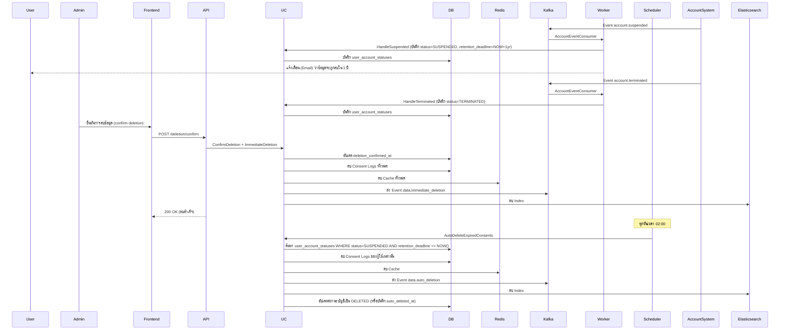
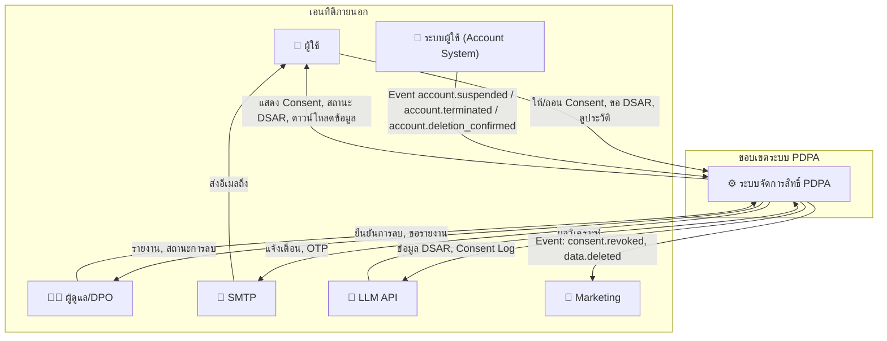

### ระบบจัดการสิทธิ์ส่วนบุคคล (PDPA Module)  

> **Version 3.0** – รองรับการลบข้อมูลทันทีเมื่อยกเลิกการใช้งาน (Termination) และการลบอัตโนมัติหลัง 1 ปีนับจากวันที่ระงับการใช้งาน (Suspension) พร้อมระบบยืนยันการลบ

---

## สารบัญ

1. [ภาพรวมระบบ](#1-ภาพรวมระบบ)
2. [โครงสร้างโมดูล](#2-โครงสร้างโมดูล)
3. [Domain Layer](#3-domain-layer)
   - 3.1 Entities (ปรับปรุง)
   - 3.2 Value Objects
   - 3.3 Repository Interfaces
   - 3.4 Domain Services
   - 3.5 Domain Errors
4. [Application Layer](#4-application-layer)
   - 4.1 Use Cases (เพิ่ม ImmediateDeletion, ปรับ AutoDelete)
   - 4.2 DTOs
5. [Infrastructure Layer](#5-infrastructure-layer)
   - 5.1 Repository Implementations
   - 5.2 Localization (i18n)
   - 5.3 Scheduler / Cron Job
   - 5.4 Event Publishers & Consumers
6. [Interface Layer](#6-interface-layer)
   - 6.1 HTTP Handlers
   - 6.2 Routes
   - 6.3 Middleware
7. [Database Migrations (ปรับปรุง)](#7-database-migrations)
8. [Workflow Diagram (เพิ่ม Immediate Delete & Auto-Delete)](#8-workflow-diagram)
9. [System Flow (อธิบายเพิ่ม)](#9-system-flow)
10. [การติดตั้งและใช้งาน](#10-การติดตั้งและใช้งาน)
11. [Business Model](#11-business-model)
12. [ภาคผนวก – Docker Compose](#12-ภาคผนวก--docker-compose)
13. [Prompt สำหรับการขยายระบบในอนาคต](#13-prompt-สำหรับการขยายระบบในอนาคต)
14. [Data Flow Diagram (DFD) ระดับ 0 และ 1](#14-data-flow-diagram-dfd-ระดับ-0-และ-1)

---

## 1. ภาพรวมระบบ

โมดูล `pdpa` จัดการสิทธิ์ส่วนบุคคลตาม พ.ร.บ. คุ้มครองข้อมูลส่วนบุคคล (PDPA) โดยมีฟังก์ชันหลัก:

- **บันทึกความยินยอม** (Consent Logging) แบบ granular (แยกตามวัตถุประสงค์)
- **จัดการคำร้องขอใช้สิทธิ์** (DSAR – Data Subject Access Request) ได้แก่ การเข้าถึง (ACCESS), การลบ (ERASURE), การถอนความยินยอม (WITHDRAW_CONSENT)
- **ถอนความยินยอม** (Revoke) – ผู้ใช้สามารถถอนความยินยอมสำหรับวัตถุประสงค์ใด ๆ ได้ตลอดเวลา โดยระบบจะบันทึกการถอนและหยุดส่งอีเมล/บริการที่เกี่ยวข้องทันที
- **การลบข้อมูลเมื่อยกเลิกหรือระงับการใช้งาน** – ระบบสนับสนุนการลบข้อมูลส่วนบุคคลตามสถานะบัญชีผู้ใช้:
  - **กรณียกเลิกการใช้งาน (Termination)** และมีการยืนยันการลบ → **ลบข้อมูลทันที** (Immediate Deletion)
  - **กรณีระงับการใช้งาน (Suspension)** โดยไม่มีการยืนยันลบทันที → **ลบข้อมูลอัตโนมัติหลัง 1 ปี** นับจากวันที่ระงับ (SuspendedAt + 1 ปี)
- **รายงานและวิเคราะห์** ด้วย LLM
- **แจ้งเตือนทางอีเมล** และ **Real-time ผ่าน WebSocket**
- **รองรับหลายภาษา** (Thai, English) – API Response, Email Template, และ Error Messages

**เทคโนโลยีที่ใช้:**

| องค์ประกอบ | เทคโนโลยี | บทบาท |
| :--- | :--- | :--- |
| Frontend | Angular 16+ (Standalone + NgRx) | แสดง Cookie Banner, ฟอร์ม DSAR, Dashboard Admin, แจ้งเตือนแบบ Real-time |
| API Gateway | Go + Gin | รับ HTTP Request, ตรวจสอบ JWT, เรียก Use Cases, รองรับการแปลภาษา |
| Application Core | Go (Clean Architecture) | ดำเนินการตามกฎธุรกิจ |
| Cache Layer | Redis | เก็บสถานะการยินยอมล่าสุด (TTL 30 วัน) |
| Database | PostgreSQL | เก็บ Consent Log, DSAR Request, Audit Trail, User Account Status อย่างถาวร |
| Message Queue | Kafka | สื่อสารแบบ Async ระหว่าง API กับ Workers (DSAR, LLM, Email, Revoke, Account Event) |
| Search Engine | Elasticsearch | เก็บ Index สำหรับค้นหา Consent Log และสร้างรายงานเร็ว |
| Real-time | WebSocket (Gorilla) | ส่งอัปเดตสถานะ DSAR ไปยัง Frontend |
| Async Workers | Go Routines + Kafka Consumer Group | ประมวลผล DSAR, เรียก LLM, สร้าง Embedding, จัดการการลบอัตโนมัติ, รับ Event การระงับ/ยกเลิก |
| Scheduler | Cron (robfig/cron/v3) | ทำงานทุกคืนเพื่อลบข้อมูลที่หมดอายุ (Suspended + 1 ปี) |

---

## 2. โครงสร้างโมดูล

```
internal/modules/pdpa/
│
├── domain/
│   ├── entity/
│   │   ├── consent_log.go              # ปรับปรุง: เพิ่มฟิลด์สำหรับสถานะผู้ใช้
│   │   ├── dsar_request.go
│   │   ├── audit_trail.go
│   │   └── user_account_status.go      # ใหม่: เก็บสถานะการระงับ/ยกเลิกของผู้ใช้
│   ├── value_object/
│   │   ├── consent_purpose.go
│   │   ├── consent_status.go           # เพิ่ม REVOKED, EXPIRED, DELETED
│   │   ├── dsar_type.go
│   │   ├── dsar_status.go
│   │   └── account_status.go           # ใหม่: ACTIVE, SUSPENDED, TERMINATED
│   ├── repository/
│   │   ├── consent_repository.go       # เพิ่ม DeleteByUserID (ลบทั้งหมด)
│   │   ├── dsar_repository.go
│   │   ├── audit_repository.go
│   │   └── user_account_status_repository.go  # ใหม่
│   ├── service/
│   │   ├── consent_validator.go
│   │   ├── anonymization_service.go
│   │   ├── localization_service.go
│   │   └── deletion_policy_service.go   # ใหม่: กำหนดนโยบายการลบตามสถานะ
│   └── errors/
│       └── errors.go                   # เพิ่ม ErrAccountNotSuspended, ErrDeletionNotConfirmed
│
├── application/
│   ├── record_consent.go
│   ├── revoke_consent.go
│   ├── immediate_deletion.go           # ใหม่: ลบข้อมูลทันทีเมื่อยืนยันการลบ
│   ├── auto_delete_expired_consents.go # ปรับปรุง: ใช้ SuspendedAt + 1 ปี
│   ├── submit_dsar.go
│   ├── process_dsar.go
│   ├── get_consent_history.go
│   ├── get_dsar_status.go
│   ├── get_admin_report.go
│   ├── handle_account_event.go         # ใหม่: รับ Event การระงับ/ยกเลิกจากระบบผู้ใช้
│   └── dto.go                          # ปรับปรุง: เพิ่มฟิลด์สำหรับการยืนยันการลบ
│
├── infrastructure/
│   ├── persistence/
│   │   ├── postgres/
│   │   │   ├── consent_repo_impl.go    # ปรับปรุง: เพิ่ม DeleteByUserID
│   │   │   ├── dsar_repo_impl.go
│   │   │   ├── user_account_status_repo_impl.go  # ใหม่
│   │   │   └── models.go               # ปรับปรุง: เพิ่มตาราง user_account_statuses
│   │   └── redis/
│   │       └── consent_cache.go        # ปรับปรุง: ลบ cache ทั้งหมดเมื่อลบข้อมูล
│   ├── messaging/
│   │   ├── kafka_producer.go           # เพิ่ม PublishAccountEvent, PublishImmediateDeletionEvent
│   │   └── consumers/
│   │       ├── dsar_worker.go
│   │       ├── llm_worker.go
│   │       ├── email_worker.go
│   │       ├── blockchain_worker.go
│   │       ├── revoke_consumer.go
│   │       └── account_event_consumer.go  # ใหม่: รับ Event การระงับ/ยกเลิกจากระบบผู้ใช้
│   ├── search/
│   │   └── elasticsearch/
│   │       └── consent_indexer.go      # ปรับปรุง: ลบ index ทั้งหมดของผู้ใช้เมื่อลบ
│   └── scheduler/
│       └── consent_cleanup_job.go      # ปรับปรุง: ใช้ suspended_at เป็นเกณฑ์
│
└── interfaces/
    ├── http/
    │   ├── consent_handler.go
    │   ├── dsar_handler.go
    │   ├── admin_handler.go
    │   ├── deletion_handler.go         # ใหม่: จัดการ API การยืนยันลบ
    │   ├── routes.go
    │   └── dto.go
    ├── websocket/
    │   └── dsar_broadcaster.go
    └── localization/
        ├── locales/
        │   ├── en.toml
        │   └── th.toml
        └── i18n.go
```

---

## 3. Domain Layer

### 3.1 Entities (ปรับปรุง)

#### `consent_log.go`
```go
package entity

import (
    "time"
    "github.com/google/uuid"
    "internal/modules/pdpa/domain/value_object"
)

type ConsentLog struct {
    ID             uuid.UUID                  `json:"id"`
    UserID         uuid.UUID                  `json:"user_id"`
    SessionID      string                     `json:"session_id"`
    Purpose        valueobject.ConsentPurpose `json:"purpose"`
    Status         valueobject.ConsentStatus  `json:"status"`          // GRANTED, REVOKED, EXPIRED, DELETED
    IPAddress      string                     `json:"ip_address"`
    UserAgent      string                     `json:"user_agent"`
    GrantedAt      time.Time                  `json:"granted_at"`
    ExpiresAt      time.Time                  `json:"expires_at"`      // 1 ปีนับจาก GrantedAt
    RevokedAt      *time.Time                 `json:"revoked_at"`      // เวลาที่ถอน (ถ้ามี)
    AutoDeletedAt  *time.Time                 `json:"auto_deleted_at"` // เวลาที่ถูกลบโดยระบบ (หลัง Suspended + 1 ปี หรือ Immediate)
}
```

#### `user_account_status.go` (ใหม่)
```go
package entity

import (
    "time"
    "github.com/google/uuid"
    "internal/modules/pdpa/domain/value_object"
)

type UserAccountStatus struct {
    ID                   uuid.UUID                      `json:"id"`
    UserID               uuid.UUID                      `json:"user_id"`
    Status               valueobject.AccountStatus      `json:"status"`                // ACTIVE, SUSPENDED, TERMINATED
    SuspendedAt          *time.Time                     `json:"suspended_at"`          // วันที่เริ่มระงับ (ถ้ามี)
    TerminatedAt         *time.Time                     `json:"terminated_at"`         // วันที่ยกเลิก (ถ้ามี)
    DeletionConfirmedAt  *time.Time                     `json:"deletion_confirmed_at"` // วันที่ยืนยันการลบทันที (เฉพาะ TERMINATED)
    RetentionDeadline    *time.Time                     `json:"retention_deadline"`    // วันที่ต้องลบ (SuspendedAt + 1 ปี) สำหรับกรณี SUSPENDED
    UpdatedAt            time.Time                      `json:"updated_at"`
}
```

#### `dsar_request.go` (ไม่เปลี่ยนแปลง)
```go
type DSARRequest struct {
    ID              uuid.UUID
    UserID          uuid.UUID
    RequestType     valueobject.DSARType
    Status          valueobject.DSARStatus
    RequestedAt     time.Time
    CompletedAt     *time.Time
    DataPayload     []byte
    RejectionReason string
    OTPCode         string
    OTPExpiredAt    time.Time
}
```

### 3.2 Value Objects (เพิ่ม)

#### `account_status.go` (ใหม่)
```go
package valueobject

type AccountStatus string

const (
    AccountActive    AccountStatus = "ACTIVE"
    AccountSuspended AccountStatus = "SUSPENDED"
    AccountTerminated AccountStatus = "TERMINATED"
)
```

#### `consent_status.go` (ไม่เปลี่ยนแปลง)
```go
const (
    ConsentGranted ConsentStatus = "GRANTED"
    ConsentRevoked ConsentStatus = "REVOKED"
    ConsentExpired ConsentStatus = "EXPIRED"
    ConsentDeleted ConsentStatus = "DELETED"
)
```

### 3.3 Repository Interfaces (เพิ่ม)

#### `consent_repository.go` (เพิ่ม DeleteByUserID)
```go
package repository

import (
    "context"
    "time"
    "github.com/google/uuid"
    "internal/modules/pdpa/domain/entity"
    "internal/modules/pdpa/domain/value_object"
)

type ConsentRepository interface {
    Save(ctx context.Context, log *entity.ConsentLog) error
    FindByUserID(ctx context.Context, userID uuid.UUID) ([]entity.ConsentLog, error)
    FindLatestByUserAndPurpose(ctx context.Context, userID uuid.UUID, purpose valueobject.ConsentPurpose) (*entity.ConsentLog, error)
    Revoke(ctx context.Context, userID uuid.UUID, purpose valueobject.ConsentPurpose) error
    FindExpiredRevoked(ctx context.Context, cutoffDate time.Time) ([]entity.ConsentLog, error)   // ยังคงไว้สำหรับ Revoke
    DeletePermanently(ctx context.Context, id uuid.UUID) error
    IsConsentActive(ctx context.Context, userID uuid.UUID, purpose valueobject.ConsentPurpose) (bool, error)
    
    // ใหม่: ลบข้อมูล Consent ทั้งหมดของผู้ใช้ (ใช้ใน Immediate Deletion และ Auto Delete)
    DeleteByUserID(ctx context.Context, userID uuid.UUID) error
}
```

#### `user_account_status_repository.go` (ใหม่)
```go
package repository

import (
    "context"
    "github.com/google/uuid"
    "internal/modules/pdpa/domain/entity"
    "internal/modules/pdpa/domain/value_object"
)

type UserAccountStatusRepository interface {
    Save(ctx context.Context, status *entity.UserAccountStatus) error
    FindByUserID(ctx context.Context, userID uuid.UUID) (*entity.UserAccountStatus, error)
    FindSuspendedWithoutDeletion(ctx context.Context, cutoffDate time.Time) ([]entity.UserAccountStatus, error) // หาบัญชีที่ถูกระงับและเลยกำหนดเวลา
    UpdateStatus(ctx context.Context, userID uuid.UUID, status valueobject.AccountStatus) error
    UpdateDeletionConfirmed(ctx context.Context, userID uuid.UUID, confirmedAt time.Time) error
}
```

### 3.4 Domain Services

#### `deletion_policy_service.go` (ใหม่)
```go
package service

import (
    "time"
    "internal/modules/pdpa/domain/entity"
    "internal/modules/pdpa/domain/value_object"
)

type DeletionPolicyService struct{}

// ตรวจสอบว่าสามารถลบทันทีได้หรือไม่ (ต้องเป็น TERMINATED และมีการยืนยันการลบ)
func (s *DeletionPolicyService) CanImmediateDeletion(status *entity.UserAccountStatus) bool {
    return status.Status == valueobject.AccountTerminated && status.DeletionConfirmedAt != nil
}

// ตรวจสอบว่าข้อมูลพร้อมถูกลบอัตโนมัติหรือไม่ (ต้องเป็น SUSPENDED และ RetentionDeadline <= now)
func (s *DeletionPolicyService) IsReadyForAutoDeletion(status *entity.UserAccountStatus, now time.Time) bool {
    if status.Status != valueobject.AccountSuspended {
        return false
    }
    if status.RetentionDeadline == nil {
        return false
    }
    return !status.RetentionDeadline.After(now)
}

// คำนวณ RetentionDeadline สำหรับกรณี SUSPENDED (SuspendedAt + retentionYears)
func (s *DeletionPolicyService) CalculateRetentionDeadline(suspendedAt time.Time, retentionYears int) time.Time {
    return suspendedAt.AddDate(retentionYears, 0, 0)
}
```

#### `localization_service.go` (เหมือนเดิม)

### 3.5 Domain Errors (เพิ่ม)

#### `errors.go`
```go
package errors

import "errors"

var (
    ErrConsentNotFound          = errors.New("consent record not found")
    ErrConsentAlreadyRevoked    = errors.New("consent already revoked")
    ErrConsentExpired           = errors.New("consent expired")
    ErrDSARNotFound             = errors.New("DSAR request not found")
    ErrDSARAlreadyProcessed     = errors.New("DSAR request already processed")
    ErrInvalidPurpose           = errors.New("invalid consent purpose")
    ErrOTPExpired               = errors.New("OTP expired or invalid")
    ErrRateLimitExceeded        = errors.New("too many DSAR requests, please try again later")
    ErrRevokeNotAllowed         = errors.New("cannot revoke non-granted consent")
    ErrAccountNotFound          = errors.New("user account status not found")
    ErrAccountNotSuspended      = errors.New("account is not suspended")
    ErrAccountNotTerminated     = errors.New("account is not terminated")
    ErrDeletionNotConfirmed     = errors.New("deletion not confirmed for this account")
    ErrImmediateDeletionNotAllowed = errors.New("immediate deletion is not allowed for this account")
)
```

---

## 4. Application Layer

### 4.1 Use Cases (เพิ่มและปรับปรุง)

#### `record_consent.go` (ปรับปรุง – ตรวจสอบสถานะผู้ใช้)
```go
package application

import (
    "context"
    "time"
    "github.com/google/uuid"
    "internal/modules/pdpa/domain/entity"
    "internal/modules/pdpa/domain/value_object"
    "internal/modules/pdpa/domain/repository"
    "internal/modules/pdpa/infrastructure/cache"
    "internal/modules/pdpa/infrastructure/messaging"
    domainerrors "internal/modules/pdpa/domain/errors"
)

type RecordConsentUseCase struct {
    consentRepo       repository.ConsentRepository
    accountStatusRepo repository.UserAccountStatusRepository
    cache             cache.ConsentCache
    producer          messaging.KafkaProducer
}

func (uc *RecordConsentUseCase) Execute(ctx context.Context, userID uuid.UUID, sessionID string, purposes map[string]bool, ip, ua string) error {
    // ตรวจสอบสถานะผู้ใช้: ถ้า SUSPENDED หรือ TERMINATED จะไม่สามารถบันทึก consent ได้
    status, err := uc.accountStatusRepo.FindByUserID(ctx, userID)
    if err == nil && (status.Status == valueobject.AccountSuspended || status.Status == valueobject.AccountTerminated) {
        return domainerrors.ErrAccountNotActive
    }

    // ... (ส่วนบันทึก consent เหมือนเดิม)
}
```

#### `revoke_consent.go` (ไม่เปลี่ยนแปลง)

#### `immediate_deletion.go` (ใหม่ – ลบข้อมูลทันทีเมื่อยืนยัน)
```go
package application

import (
    "context"
    "time"
    "github.com/google/uuid"
    "internal/modules/pdpa/domain/repository"
    "internal/modules/pdpa/domain/service"
    "internal/modules/pdpa/infrastructure/cache"
    "internal/modules/pdpa/infrastructure/messaging"
    "internal/modules/pdpa/infrastructure/search"
    domainerrors "internal/modules/pdpa/domain/errors"
)

type ImmediateDeletionUseCase struct {
    consentRepo       repository.ConsentRepository
    dsarRepo          repository.DSARRepository
    accountStatusRepo repository.UserAccountStatusRepository
    cache             cache.ConsentCache
    indexer           search.ConsentIndexer
    producer          messaging.KafkaProducer
    policy            service.DeletionPolicyService
}

func (uc *ImmediateDeletionUseCase) Execute(ctx context.Context, userID uuid.UUID) error {
    // 1. ดึงสถานะบัญชี
    status, err := uc.accountStatusRepo.FindByUserID(ctx, userID)
    if err != nil {
        return domainerrors.ErrAccountNotFound
    }

    // 2. ตรวจสอบว่าสามารถลบทันทีได้หรือไม่
    if !uc.policy.CanImmediateDeletion(status) {
        return domainerrors.ErrImmediateDeletionNotAllowed
    }

    // 3. ลบ Consent Logs ทั้งหมด
    if err := uc.consentRepo.DeleteByUserID(ctx, userID); err != nil {
        return err
    }

    // 4. ลบ DSAR Requests ทั้งหมด (ถ้ามี)
    if err := uc.dsarRepo.DeleteByUserID(ctx, userID); err != nil {
        // log error แต่ไม่หยุด
    }

    // 5. ลบ Redis Cache ทั้งหมดของผู้ใช้
    uc.cache.DeleteAllByUser(ctx, userID)

    // 6. ลบ Elasticsearch Index
    uc.indexer.DeleteByUserID(ctx, userID)

    // 7. ส่ง Event การลบทันที
    uc.producer.PublishImmediateDeletionEvent(ctx, userID)

    // 8. บันทึก Audit Trail
    uc.producer.PublishAuditEvent(ctx, "IMMEDIATE_DELETION", userID, nil)

    // 9. อัปเดตสถานะบัญชี (เพิ่มฟิลด์ deleted_at หรือเปลี่ยนสถานะเป็น DELETED)
    // อาจเพิ่มสถานะ DELETED ใน AccountStatus หรือเก็บ timestamp การลบ

    return nil
}
```

#### `auto_delete_expired_consents.go` (ปรับปรุง – ใช้ SuspendedAt + 1 ปี)
```go
package application

import (
    "context"
    "time"
    "github.com/google/uuid"
    "internal/modules/pdpa/domain/repository"
    "internal/modules/pdpa/domain/service"
    "internal/modules/pdpa/infrastructure/messaging"
    "internal/modules/pdpa/infrastructure/search"
    "internal/modules/pdpa/infrastructure/cache"
)

type AutoDeleteExpiredConsentsUseCase struct {
    consentRepo       repository.ConsentRepository
    accountStatusRepo repository.UserAccountStatusRepository
    cache             cache.ConsentCache
    indexer           search.ConsentIndexer
    producer          messaging.KafkaProducer
    policy            service.DeletionPolicyService
}

// retentionYears กำหนดอายุการเก็บข้อมูล (ค่าเริ่มต้น 1)
func (uc *AutoDeleteExpiredConsentsUseCase) Execute(ctx context.Context, retentionYears int) error {
    now := time.Now()
    // ค้นหาบัญชีที่ถูกระงับ (SUSPENDED) ซึ่ง RetentionDeadline <= now
    expiredAccounts, err := uc.accountStatusRepo.FindSuspendedWithoutDeletion(ctx, now)
    if err != nil {
        return err
    }

    for _, status := range expiredAccounts {
        // ตรวจสอบอีกครั้งว่า RetentionDeadline ผ่านแล้ว
        if !uc.policy.IsReadyForAutoDeletion(&status, now) {
            continue
        }

        userID := status.UserID

        // 1. ลบ Consent Logs ทั้งหมด
        if err := uc.consentRepo.DeleteByUserID(ctx, userID); err != nil {
            // log error และข้าม
            continue
        }

        // 2. ลบ DSAR Requests (ถ้ามี)
        // (สมมติว่ามี DeleteByUserID ใน DSAR repo)
        // uc.dsarRepo.DeleteByUserID(ctx, userID)

        // 3. ลบ Redis Cache
        uc.cache.DeleteAllByUser(ctx, userID)

        // 4. ลบ Elasticsearch Index
        uc.indexer.DeleteByUserID(ctx, userID)

        // 5. ส่ง Event
        uc.producer.PublishAutoDeletionEvent(ctx, userID, status.SuspendedAt)

        // 6. อัปเดตสถานะบัญชีเป็น DELETED หรือบันทึก AutoDeletedAt
        // uc.accountStatusRepo.UpdateStatus(ctx, userID, valueobject.AccountDeleted)
    }
    return nil
}
```

#### `handle_account_event.go` (ใหม่ – รับ Event จากระบบผู้ใช้)
```go
package application

import (
    "context"
    "time"
    "github.com/google/uuid"
    "internal/modules/pdpa/domain/entity"
    "internal/modules/pdpa/domain/value_object"
    "internal/modules/pdpa/domain/repository"
    "internal/modules/pdpa/domain/service"
)

type HandleAccountEventUseCase struct {
    accountStatusRepo repository.UserAccountStatusRepository
    policy            service.DeletionPolicyService
}

// รับ Event เมื่อผู้ใช้ถูกระงับ (SUSPENDED)
func (uc *HandleAccountEventUseCase) HandleSuspended(ctx context.Context, userID uuid.UUID, suspendedAt time.Time, retentionYears int) error {
    // คำนวณ RetentionDeadline = suspendedAt + retentionYears
    deadline := uc.policy.CalculateRetentionDeadline(suspendedAt, retentionYears)

    status := &entity.UserAccountStatus{
        UserID:            userID,
        Status:            valueobject.AccountSuspended,
        SuspendedAt:       &suspendedAt,
        RetentionDeadline: &deadline,
        UpdatedAt:         time.Now(),
    }
    return uc.accountStatusRepo.Save(ctx, status)
}

// รับ Event เมื่อผู้ใช้ถูกยกเลิก (TERMINATED)
func (uc *HandleAccountEventUseCase) HandleTerminated(ctx context.Context, userID uuid.UUID, terminatedAt time.Time) error {
    status := &entity.UserAccountStatus{
        UserID:        userID,
        Status:        valueobject.AccountTerminated,
        TerminatedAt:  &terminatedAt,
        UpdatedAt:     time.Now(),
        // DeletionConfirmedAt ยังเป็น nil รอการยืนยัน
    }
    return uc.accountStatusRepo.Save(ctx, status)
}

// รับ Event การยืนยันลบ (Deletion Confirmed) สำหรับบัญชีที่ TERMINATED
func (uc *HandleAccountEventUseCase) ConfirmDeletion(ctx context.Context, userID uuid.UUID) error {
    status, err := uc.accountStatusRepo.FindByUserID(ctx, userID)
    if err != nil {
        return err
    }
    if status.Status != valueobject.AccountTerminated {
        return domainerrors.ErrAccountNotTerminated
    }
    now := time.Now()
    status.DeletionConfirmedAt = &now
    status.UpdatedAt = now
    return uc.accountStatusRepo.Save(ctx, status)
}
```

#### `submit_dsar.go` (ปรับปรุง – ตรวจสอบสถานะผู้ใช้)
```go
// ใน SubmitDSARUseCase ให้เช็คสถานะผู้ใช้ ถ้า SUSPENDED หรือ TERMINATED จะไม่อนุญาตให้ยื่น DSAR
```

#### `get_consent_history.go` (ไม่เปลี่ยนแปลง)

#### `get_admin_report.go` (ไม่เปลี่ยนแปลง)

### 4.2 DTOs (ปรับปรุง)

#### `dto.go`
```go
package dto

import "github.com/google/uuid"

type RecordConsentRequest struct {
    Purposes map[string]bool `json:"purposes"`
}

type RevokeConsentRequest struct {
    Purpose string `json:"purpose" binding:"required,oneof=NECESSARY ANALYTICS MARKETING"`
}

type SubmitDSARRequest struct {
    RequestType string `json:"request_type" binding:"required,oneof=ACCESS ERASURE WITHDRAW_CONSENT"`
}

type DSARResponse struct {
    ID        uuid.UUID `json:"id"`
    Status    string    `json:"status"`
    CreatedAt string    `json:"created_at"`
}

type ConsentHistoryResponse struct {
    Purpose     string  `json:"purpose"`
    Status      string  `json:"status"`
    GrantedAt   string  `json:"granted_at"`
    ExpiresAt   string  `json:"expires_at"`
    RevokedAt   *string `json:"revoked_at,omitempty"`
    AutoDeletedAt *string `json:"auto_deleted_at,omitempty"`
}

type ConfirmDeletionRequest struct {
    UserID uuid.UUID `json:"user_id" binding:"required"`
}

type AccountStatusResponse struct {
    Status               string  `json:"status"`
    SuspendedAt          *string `json:"suspended_at,omitempty"`
    TerminatedAt         *string `json:"terminated_at,omitempty"`
    DeletionConfirmedAt  *string `json:"deletion_confirmed_at,omitempty"`
    RetentionDeadline    *string `json:"retention_deadline,omitempty"`
}

type ErrorResponse struct {
    Error   string `json:"error"`
    Code    string `json:"code"`
    Message string `json:"message"`
}
```

---

## 5. Infrastructure Layer

### 5.1 Repository Implementations (ปรับปรุง)

#### `consent_repo_impl.go` (เพิ่ม DeleteByUserID)
```go
package postgres

import (
    "context"
    "time"
    "gorm.io/gorm"
    "github.com/google/uuid"
    "internal/modules/pdpa/domain/entity"
    "internal/modules/pdpa/domain/value_object"
    "internal/modules/pdpa/infrastructure/persistence/postgres/models"
)

func (r *consentRepoImpl) DeleteByUserID(ctx context.Context, userID uuid.UUID) error {
    // Hard delete ทั้งหมด
    return r.db.WithContext(ctx).
        Where("user_id = ?", userID).
        Delete(&models.ConsentLogModel{}).Error
}

// Revoke, FindExpiredRevoked, DeletePermanently, IsConsentActive เหมือนเดิม
```

#### `user_account_status_repo_impl.go` (ใหม่)
```go
package postgres

import (
    "context"
    "time"
    "gorm.io/gorm"
    "github.com/google/uuid"
    "internal/modules/pdpa/domain/entity"
    "internal/modules/pdpa/domain/value_object"
    "internal/modules/pdpa/infrastructure/persistence/postgres/models"
)

type userAccountStatusRepoImpl struct {
    db *gorm.DB
}

func (r *userAccountStatusRepoImpl) FindByUserID(ctx context.Context, userID uuid.UUID) (*entity.UserAccountStatus, error) {
    var model models.UserAccountStatusModel
    err := r.db.WithContext(ctx).Where("user_id = ?", userID).First(&model).Error
    if err != nil {
        return nil, err
    }
    return modelToEntity(&model), nil
}

func (r *userAccountStatusRepoImpl) FindSuspendedWithoutDeletion(ctx context.Context, now time.Time) ([]entity.UserAccountStatus, error) {
    var models []models.UserAccountStatusModel
    err := r.db.WithContext(ctx).
        Where("status = ? AND retention_deadline <= ?", valueobject.AccountSuspended, now).
        Find(&models).Error
    if err != nil {
        return nil, err
    }
    return modelsToEntities(models), nil
}

func (r *userAccountStatusRepoImpl) Save(ctx context.Context, status *entity.UserAccountStatus) error {
    model := entityToModel(status)
    // Upsert: ถ้ามีอยู่แล้วให้อัปเดต
    return r.db.WithContext(ctx).Save(model).Error
}

// ... อื่น ๆ
```

#### `models.go` (ปรับปรุง)
```go
package models

import (
    "time"
    "github.com/google/uuid"
)

type ConsentLogModel struct {
    ID            uuid.UUID  `gorm:"type:uuid;primaryKey"`
    UserID        uuid.UUID  `gorm:"type:uuid;index"`
    SessionID     string     `gorm:"index"`
    Purpose       string     `gorm:"type:varchar(50);index"`
    Status        string     `gorm:"type:varchar(20)"`
    IPAddress     string     `gorm:"type:varchar(45)"`
    UserAgent     string
    GrantedAt     time.Time  `gorm:"index"`
    ExpiresAt     time.Time
    RevokedAt     *time.Time `gorm:"index"`
    AutoDeletedAt *time.Time `gorm:"index"`
}

type UserAccountStatusModel struct {
    ID                   uuid.UUID  `gorm:"type:uuid;primaryKey"`
    UserID               uuid.UUID  `gorm:"type:uuid;uniqueIndex"`
    Status               string     `gorm:"type:varchar(20)"`
    SuspendedAt          *time.Time
    TerminatedAt         *time.Time
    DeletionConfirmedAt  *time.Time
    RetentionDeadline    *time.Time
    UpdatedAt            time.Time
}

type DSARRequestModel struct {
    // ... เหมือนเดิม
}
```

#### `consent_cache.go` (เพิ่ม DeleteAllByUser)
```go
func (c *redisConsentCache) DeleteAllByUser(ctx context.Context, userID uuid.UUID) error {
    // ใช้ pattern "consent:" + userID.String() + ":*" เพื่อลบทั้งหมด
    pattern := "consent:" + userID.String() + ":*"
    iter := c.client.Scan(ctx, 0, pattern, 0).Iterator()
    for iter.Next(ctx) {
        if err := c.client.Del(ctx, iter.Val()).Err(); err != nil {
            return err
        }
    }
    return iter.Err()
}
```

### 5.2 Localization (i18n) – เพิ่มข้อความ

**active.en.toml** เพิ่ม:
```toml
[ImmediateDeletionSuccess]
other = "Data deleted immediately as per termination confirmation"

[AutoDeletionExecuted]
other = "Expired data (suspended + 1 year) has been deleted"

[AccountSuspended]
other = "Account suspended, data will be retained for 1 year"

[AccountTerminated]
other = "Account terminated, pending deletion confirmation"

[DeletionConfirmed]
other = "Deletion confirmed, data will be removed immediately"

[ErrAccountNotActive]
other = "Account is not active, cannot perform this action"
```

**active.th.toml** เพิ่ม:
```toml
[ImmediateDeletionSuccess]
other = "ลบข้อมูลทันทีตามการยืนยันการยกเลิกใช้งาน"

[AutoDeletionExecuted]
other = "ลบข้อมูลที่หมดอายุ (ระงับ + 1 ปี) เรียบร้อยแล้ว"

[AccountSuspended]
other = "ระงับบัญชีผู้ใช้ ข้อมูลจะถูกเก็บไว้ 1 ปี"

[AccountTerminated]
other = "ยกเลิกบัญชีผู้ใช้ รอการยืนยันการลบ"

[DeletionConfirmed]
other = "ยืนยันการลบแล้ว ข้อมูลจะถูกลบทันที"

[ErrAccountNotActive]
other = "บัญชีผู้ใช้ไม่สามารถใช้งานได้ ไม่สามารถดำเนินการนี้"
```

### 5.3 Scheduler / Cron Job (ปรับปรุง)

#### `consent_cleanup_job.go`
```go
package scheduler

import (
    "context"
    "log"
    "time"
    "github.com/robfig/cron/v3"
    "internal/modules/pdpa/application"
)

type ConsentCleanupJob struct {
    useCase *application.AutoDeleteExpiredConsentsUseCase
}

func NewConsentCleanupJob(uc *application.AutoDeleteExpiredConsentsUseCase) *ConsentCleanupJob {
    return &ConsentCleanupJob{useCase: uc}
}

func (j *ConsentCleanupJob) Run() {
    log.Println("Running consent cleanup job...")
    ctx, cancel := context.WithTimeout(context.Background(), 5*time.Minute)
    defer cancel()
    // กำหนด retention = 1 ปี
    if err := j.useCase.Execute(ctx, 1); err != nil {
        log.Printf("Error cleaning up expired consents: %v", err)
    } else {
        log.Println("Consent cleanup completed successfully")
    }
}

func StartScheduler(job *ConsentCleanupJob) {
    c := cron.New()
    _, err := c.AddFunc("0 2 * * *", job.Run)
    if err != nil {
        log.Fatal(err)
    }
    c.Start()
}
```

### 5.4 Event Publishers & Consumers (เพิ่ม)

#### `kafka_producer.go` (เพิ่ม)
```go
func (p *KafkaProducer) PublishImmediateDeletionEvent(ctx context.Context, userID uuid.UUID) error {
    event := map[string]interface{}{
        "event_type": "data.immediate_deletion",
        "user_id":    userID.String(),
        "deleted_at": time.Now(),
    }
    return p.publish("pdpa.data.deleted", event)
}

func (p *KafkaProducer) PublishAutoDeletionEvent(ctx context.Context, userID uuid.UUID, suspendedAt *time.Time) error {
    event := map[string]interface{}{
        "event_type":  "data.auto_deletion",
        "user_id":     userID.String(),
        "suspended_at": suspendedAt,
        "deleted_at":  time.Now(),
    }
    return p.publish("pdpa.data.deleted", event)
}

func (p *KafkaProducer) PublishAccountEvent(ctx context.Context, eventType string, userID uuid.UUID, data map[string]interface{}) error {
    event := map[string]interface{}{
        "event_type": eventType,
        "user_id":    userID.String(),
        "data":       data,
        "timestamp":  time.Now(),
    }
    return p.publish("pdpa.account.event", event)
}
```

#### `account_event_consumer.go` (ใหม่)
```go
package consumers

import (
    "context"
    "encoding/json"
    "time"
    "github.com/IBM/sarama"
    "github.com/google/uuid"
    "internal/modules/pdpa/application"
)

type AccountEventConsumer struct {
    handleUC *application.HandleAccountEventUseCase
}

func (c *AccountEventConsumer) Consume(message *sarama.ConsumerMessage) error {
    var event map[string]interface{}
    if err := json.Unmarshal(message.Value, &event); err != nil {
        return err
    }
    eventType, ok := event["event_type"].(string)
    if !ok {
        return nil
    }
    userIDStr, _ := event["user_id"].(string)
    userID, _ := uuid.Parse(userIDStr)
    data, _ := event["data"].(map[string]interface{})

    ctx := context.Background()
    switch eventType {
    case "account.suspended":
        suspendedAt, _ := time.Parse(time.RFC3339, data["suspended_at"].(string))
        retentionYears := 1 // จาก config
        return c.handleUC.HandleSuspended(ctx, userID, suspendedAt, retentionYears)
    case "account.terminated":
        terminatedAt, _ := time.Parse(time.RFC3339, data["terminated_at"].(string))
        return c.handleUC.HandleTerminated(ctx, userID, terminatedAt)
    case "account.deletion_confirmed":
        return c.handleUC.ConfirmDeletion(ctx, userID)
    }
    return nil
}
```

---

## 6. Interface Layer

### 6.1 HTTP Handlers (เพิ่ม DeletionHandler)

#### `deletion_handler.go` (ใหม่)
```go
package http

import (
    "net/http"
    "github.com/gin-gonic/gin"
    "internal/modules/pdpa/application"
    "internal/modules/pdpa/interface/http/dto"
    "internal/modules/pdpa/interface/localization"
)

type DeletionHandler struct {
    immediateUC *application.ImmediateDeletionUseCase
    confirmUC   *application.HandleAccountEventUseCase
    localizer   *localization.I18nManager
}

// ยืนยันการลบสำหรับบัญชีที่ TERMINATED
func (h *DeletionHandler) ConfirmDeletion(c *gin.Context) {
    var req dto.ConfirmDeletionRequest
    if err := c.ShouldBindJSON(&req); err != nil {
        h.errorResponse(c, http.StatusBadRequest, "INVALID_REQUEST", err.Error())
        return
    }
    userID := req.UserID
    // ตรวจสอบสิทธิ์: เฉพาะ admin หรือผู้ใช้คนนั้น
    // ...

    if err := h.confirmUC.ConfirmDeletion(c.Request.Context(), userID); err != nil {
        h.errorResponse(c, http.StatusBadRequest, "CONFIRM_FAILED", err.Error())
        return
    }
    // หลังจากยืนยันแล้ว ให้เรียก Immediate Deletion ทันที
    if err := h.immediateUC.Execute(c.Request.Context(), userID); err != nil {
        h.errorResponse(c, http.StatusInternalServerError, "DELETION_FAILED", err.Error())
        return
    }
    lang := c.GetHeader("Accept-Language")
    msg := h.localizer.Translate(c.Request.Context(), "ImmediateDeletionSuccess", lang)
    c.JSON(http.StatusOK, gin.H{"message": msg})
}

// รับ Event การระงับ/ยกเลิกจากระบบผู้ใช้ (อาจเป็น webhook หรือ internal)
func (h *DeletionHandler) AccountEvent(c *gin.Context) {
    var event map[string]interface{}
    if err := c.ShouldBindJSON(&event); err != nil {
        c.JSON(http.StatusBadRequest, gin.H{"error": err.Error()})
        return
    }
    // เรียกใช้ HandleAccountEventUseCase หรือส่งไป Kafka
    // ...
    c.JSON(http.StatusOK, gin.H{"status": "received"})
}

func (h *DeletionHandler) errorResponse(c *gin.Context, code int, errCode, errMsg string) {
    lang := c.GetHeader("Accept-Language")
    translated := h.localizer.Translate(c.Request.Context(), errCode, lang)
    if translated == "" {
        translated = errMsg
    }
    c.JSON(code, gin.H{"error": translated, "code": errCode})
}
```

### 6.2 Routes (เพิ่ม)
```go
func RegisterRoutes(r *gin.RouterGroup, handlers *Handlers, authMiddleware gin.HandlerFunc) {
    pdpa := r.Group("/pdpa")
    pdpa.Use(authMiddleware)

    pdpa.POST("/consent", handlers.Consent.RecordConsent)
    pdpa.DELETE("/consent", handlers.Consent.RevokeConsent)
    pdpa.GET("/consent/history", handlers.Consent.GetHistory)

    pdpa.POST("/dsar", handlers.DSAR.Submit)
    pdpa.GET("/dsar/:id/status", handlers.DSAR.GetStatus)
    pdpa.GET("/dsar/:id/download", handlers.DSAR.DownloadData)

    // Admin routes
    admin := pdpa.Group("/admin")
    admin.Use(adminAuthMiddleware)
    admin.GET("/report", handlers.Admin.GetReport)

    // Deletion routes
    pdpa.POST("/deletion/confirm", handlers.Deletion.ConfirmDeletion)   // ยืนยันลบทันที

    // Webhook สำหรับรับ Event จากระบบผู้ใช้ (ไม่ต้อง auth? หรือใช้ token)
    pdpa.POST("/events/account", handlers.Deletion.AccountEvent)
}
```

### 6.3 Middleware (เหมือนเดิม)

---

## 7. Database Migrations (ปรับปรุง)

```sql
-- 1. Consent Logs (ปรับปรุง)
CREATE TABLE consent_logs (
    id UUID PRIMARY KEY DEFAULT gen_random_uuid(),
    user_id UUID NOT NULL,
    session_id VARCHAR(255),
    purpose VARCHAR(50) NOT NULL,
    status VARCHAR(20) NOT NULL DEFAULT 'GRANTED',
    ip_address VARCHAR(45),
    user_agent TEXT,
    granted_at TIMESTAMP DEFAULT NOW(),
    expires_at TIMESTAMP,
    revoked_at TIMESTAMP,
    auto_deleted_at TIMESTAMP,
    CONSTRAINT fk_user FOREIGN KEY (user_id) REFERENCES users(id) ON DELETE CASCADE
);
CREATE INDEX idx_consent_user_id ON consent_logs (user_id);
CREATE INDEX idx_consent_purpose ON consent_logs (purpose);
CREATE INDEX idx_consent_status ON consent_logs (status);
CREATE INDEX idx_consent_revoked_at ON consent_logs (revoked_at);

-- 2. DSAR Requests (ไม่เปลี่ยนแปลง)
CREATE TABLE dsar_requests (
    id UUID PRIMARY KEY DEFAULT gen_random_uuid(),
    user_id UUID NOT NULL,
    request_type VARCHAR(20) NOT NULL,
    status VARCHAR(20) DEFAULT 'PENDING',
    requested_at TIMESTAMP DEFAULT NOW(),
    completed_at TIMESTAMP,
    data_payload JSONB,
    rejection_reason TEXT,
    otp_code VARCHAR(255),
    otp_expired_at TIMESTAMP,
    CONSTRAINT fk_user_dsar FOREIGN KEY (user_id) REFERENCES users(id) ON DELETE CASCADE
);
CREATE INDEX idx_dsar_user_id ON dsar_requests (user_id);
CREATE INDEX idx_dsar_status ON dsar_requests (status);

-- 3. User Account Status (ใหม่)
CREATE TABLE user_account_statuses (
    id UUID PRIMARY KEY DEFAULT gen_random_uuid(),
    user_id UUID NOT NULL UNIQUE,
    status VARCHAR(20) NOT NULL DEFAULT 'ACTIVE',
    suspended_at TIMESTAMP,
    terminated_at TIMESTAMP,
    deletion_confirmed_at TIMESTAMP,
    retention_deadline TIMESTAMP,   -- วันที่ต้องลบ (สำหรับ SUSPENDED)
    updated_at TIMESTAMP DEFAULT NOW(),
    CONSTRAINT fk_user_status FOREIGN KEY (user_id) REFERENCES users(id) ON DELETE CASCADE
);
CREATE INDEX idx_status_user_id ON user_account_statuses (user_id);
CREATE INDEX idx_status_retention ON user_account_statuses (retention_deadline) WHERE status = 'SUSPENDED';

-- 4. Audit Trail (ไม่เปลี่ยนแปลง)
CREATE TABLE pdpa_audit_trails (
    id UUID PRIMARY KEY DEFAULT gen_random_uuid(),
    user_id UUID,
    action VARCHAR(50) NOT NULL,
    details JSONB,
    created_at TIMESTAMP DEFAULT NOW()
);
```

---

## 8. Workflow Diagram (เพิ่ม Immediate Delete & Auto-Delete)



---

## 9. System Flow (อธิบายเพิ่ม)

### 9.1 การระงับการใช้งาน (Suspension)
- ระบบผู้ใช้ (Account System) ส่ง Event `account.suspended` ผ่าน Kafka
- PDPA Module รับ Event และบันทึกสถานะ `SUSPENDED` พร้อม `suspended_at` และ `retention_deadline` = `suspended_at + 1 ปี`
- ผู้ใช้ยังคงสามารถเข้าถึงข้อมูลได้ แต่ไม่สามารถให้/ถอน Consent หรือยื่น DSAR ได้
- ระบบจะแจ้งเตือนผู้ใช้ทางอีเมลว่าข้อมูลจะถูกลบอัตโนมัติหลังจาก 1 ปี
- ข้อมูล Consent และ DSAR จะยังคงอยู่จนกว่าจะถึง `retention_deadline`

### 9.2 การยกเลิกการใช้งาน (Termination) และการยืนยันการลบ
- ระบบผู้ใช้ส่ง Event `account.terminated`
- PDPA Module บันทึกสถานะ `TERMINATED` พร้อม `terminated_at`
- หาก Admin หรือผู้ใช้ (หรือ DPO) ยืนยันการลบ (Confirm Deletion) ระบบจะ:
  1. อัปเดต `deletion_confirmed_at` = NOW()
  2. เรียก `ImmediateDeletionUseCase` เพื่อลบข้อมูลทั้งหมดทันที
  3. ลบ Consent Logs, DSAR Requests, Redis Cache, Elasticsearch Index
  4. ส่ง Event `data.immediate_deletion` เพื่อให้ระบบอื่นทราบ
- การลบทันทีนี้ไม่ต้องรอ 1 ปี

### 9.3 การลบข้อมูลอัตโนมัติ (Auto-Delete) สำหรับกรณีที่ถูกระงับ
- Cron Job ทำงานทุกวันเวลา 02:00 น.
- ค้นหาบัญชีที่มี `status = 'SUSPENDED'` และ `retention_deadline <= NOW()`
- สำหรับแต่ละบัญชี:
  - ลบ Consent Logs ทั้งหมด (hard delete)
  - ลบ Redis Cache
  - ลบ Elasticsearch Index
  - ส่ง Event `data.auto_deletion`
  - อัปเดตสถานะบัญชีเป็น `DELETED` (หรือเพิ่ม `auto_deleted_at`)
- ระบบจะไม่ลบ DSAR Requests? (อาจต้องลบตามนโยบาย) – สามารถขยายได้

### 9.4 การหยุดส่งอีเมล/บริการเมื่อถอน Consent หรือระงับ/ยกเลิก
- ทุกครั้งที่ระบบจะส่งอีเมลหรือดำเนินการใด ๆ ที่ต้องอาศัยความยินยอม ให้ตรวจสอบ `IsConsentActive()` และสถานะบัญชี
- ถ้าสถานะบัญชีไม่ใช่ ACTIVE หรือ Consent ถูก Revoked จะไม่ดำเนินการ
- เมื่อได้รับ Event `consent.revoked` หรือ `data.immediate_deletion` หรือ `data.auto_deletion` ระบบอื่น (Marketing, Analytics) จะหยุดประมวลผลทันที

---

## 10. การติดตั้งและใช้งาน

**ข้อกำหนดเบื้องต้น:** Go 1.21+, PostgreSQL, Redis, Kafka, Elasticsearch

### ไฟล์ `.env` (ปรับปรุง)
```env
# PostgreSQL
DB_HOST=localhost
DB_PORT=5432
DB_USER=admin
DB_PASSWORD=secret
DB_NAME=pdpa_db

# Redis
REDIS_HOST=localhost:6379

# Kafka
KAFKA_BROKERS=localhost:9092
KAFKA_TOPIC_CONSENT=pdpa.consent.log
KAFKA_TOPIC_DSAR=pdpa.dsar.request
KAFKA_TOPIC_REVOKE=pdpa.consent.revoked
KAFKA_TOPIC_DELETE=pdpa.data.deleted
KAFKA_TOPIC_ACCOUNT=pdpa.account.event

# JWT
JWT_SECRET=your_secret_key

# Email
SMTP_HOST=smtp.gmail.com
SMTP_PORT=587
SMTP_USER=user@gmail.com
SMTP_PASS=password

# Elasticsearch
ELASTICSEARCH_URL=http://localhost:9200

# Retention (ปี) สำหรับ SUSPENDED
RETENTION_YEARS=1

# Default Language
DEFAULT_LANG=en
```

### คำสั่งรัน
```bash
# Migrate Database
go run cmd/migrate/main.go

# Run API Server
go run cmd/api/main.go

# Run Workers (แยก Terminal)
go run cmd/workers/dsar/main.go
go run cmd/workers/llm/main.go
go run cmd/workers/email/main.go
go run cmd/workers/revoke/main.go
go run cmd/workers/account/main.go   # ใหม่: AccountEventConsumer

# Run Scheduler
go run cmd/scheduler/main.go
```

---

## 11. Business Model

- **SaaS**: คิดค่าบริการตามจำนวนผู้ใช้ (ต่อ 1,000 ราย) หรือตามจำนวน DSAR Request และ Revoke Request
- **Enterprise**: ขายลิขสิทธิ์รายปี พร้อม Support และ Custom Integration
- **ต้นทุนหลัก**: ค่า Kafka/Elasticsearch, ค่า LLM API, ทีมพัฒนา
- **ฟีเจอร์ Premium**: การยืนยันการลบแบบอัตโนมัติผ่าน Workflow, รายงานการลบข้อมูลตามกฎหมาย, การแจ้งเตือน DPO

---

## 12. ภาคผนวก – Docker Compose (ปรับปรุง)
```yaml
version: '3.8'
services:
  postgres:
    image: postgres:15
    environment:
      POSTGRES_DB: pdpa
      POSTGRES_USER: admin
      POSTGRES_PASSWORD: secret
    ports:
      - "5432:5432"
  redis:
    image: redis:7-alpine
    ports:
      - "6379:6379"
  zookeeper:
    image: confluentinc/cp-zookeeper:latest
    environment:
      ZOOKEEPER_CLIENT_PORT: 2181
  kafka:
    image: confluentinc/cp-kafka:latest
    depends_on:
      - zookeeper
    environment:
      KAFKA_BROKER_ID: 1
      KAFKA_ZOOKEEPER_CONNECT: zookeeper:2181
      KAFKA_ADVERTISED_LISTENERS: PLAINTEXT://localhost:9092
    ports:
      - "9092:9092"
  elasticsearch:
    image: docker.elastic.co/elasticsearch/elasticsearch:8.6.0
    environment:
      - discovery.type=single-node
    ports:
      - "9200:9200"
```

---

## 13. Prompt สำหรับการขยายระบบในอนาคต

1. **Blockchain Integration**: เพิ่ม Consumer สำหรับบันทึก Hash การ Immediate Deletion และ Auto Deletion ลง Smart Contract
2. **Advanced LLM Report**: ปรับปรุง LLM Worker ให้วิเคราะห์แนวโน้มการลบข้อมูลและคำแนะนำในการปรับปรุง Privacy Policy
3. **Mobile SDK**: สร้าง gRPC Gateway สำหรับ Mobile
4. **Data Breach Notification**: ระบบตรวจจับการเข้าถึงผิดปกติและแจ้งเตือน DPO
5. **Multi-Tenancy**: เพิ่ม `tenant_id` เพื่อรองรับหลายองค์กร
6. **Webhook**: ให้ผู้ใช้ภายนอกสามารถ subscribe Event การลบข้อมูล (Immediate/Auto) เพื่อดำเนินการเอง
7. **Audit Report**: สร้าง Dashboard สำหรับ DPO แสดงประวัติการลบข้อมูล (Immediate vs Auto) และสถานะบัญชี
8. **Cooling-off Period**: รองรับการยกเลิกการระงับ (Unsuspend) ภายใน 30 วัน โดยให้ reset retention_deadline ใหม่

---

## 14. Data Flow Diagram (DFD) ระดับ 0 และ 1

### 14.1 DFD ระดับ 0 (Context Diagram)



### 14.2 DFD ระดับ 1 (กระบวนการหลัก)

```mermaid
flowchart TD
    subgraph External["เอนทิตีภายนอก"]
        User["👤 ผู้ใช้"]
        Admin["👨‍💼 ผู้ดูแล"]
        Account["🏢 Account System"]
        Email["📧 SMTP"]
        LLM["🧠 LLM"]
        Marketing["📢 Marketing"]
    end

    subgraph P1["🔥 การจัดการความยินยอม"]
        P1_Record["1.1 บันทึก/อัปเดต Consent"]
        P1_Revoke["1.2 ถอนความยินยอม"]
        P1_Validate["1.3 ตรวจสอบ Consent + สถานะบัญชี"]
    end

    subgraph P2["📋 การจัดการ DSAR"]
        P2_Submit["2.1 สร้าง DSAR + OTP"]
        P2_Verify["2.2 ยืนยัน OTP"]
        P2_Process["2.3 ประมวลผล DSAR"]
        P2_Download["2.4 ดาวน์โหลดข้อมูล"]
    end

    subgraph P3["⏳ การจัดการการลบข้อมูล"]
        P3_HandleAccount["3.1 รับ Event ระงับ/ยกเลิก"]
        P3_Confirm["3.2 ยืนยันการลบทันที"]
        P3_Immediate["3.3 ลบข้อมูลทันที"]
        P3_Scheduler["3.4 Cron Job (ทุกวัน 02:00)"]
        P3_Auto["3.5 ลบข้อมูลอัตโนมัติ (Suspended+1yr)"]
    end

    subgraph P4["📊 การสร้างรายงาน"]
        P4_Query["4.1 สอบถามข้อมูล"]
        P4_LLM["4.2 เรียก LLM"]
        P4_Response["4.3 สรุปรายงาน"]
    end

    subgraph Stores["🗄️ ที่เก็บข้อมูล"]
        DB[(PostgreSQL)]
        Redis[(Redis Cache)]
        ES[(Elasticsearch)]
        Kafka[(Kafka)]
    end

    %% การไหล Process 1
    User -->|POST /consent| P1_Record
    User -->|DELETE /consent| P1_Revoke
    P1_Record -->|บันทึก| DB
    P1_Record -->|Set Cache| Redis
    P1_Record -->|Publish consent.log| Kafka
    P1_Revoke -->|อัปเดต status=REVOKED| DB
    P1_Revoke -->|Delete Cache| Redis
    P1_Revoke -->|Publish consent.revoked| Kafka
    Marketing -->|ตรวจสอบ consent| P1_Validate
    P1_Validate -->|Query| DB
    P1_Validate -->|Query| Redis

    %% การไหล Process 2 (เหมือนเดิม)
    User -->|POST /dsar| P2_Submit
    P2_Submit -->|บันทึก DSAR| DB
    P2_Submit -->|ส่ง OTP| Email
    Email -->|OTP| User
    User -->|PUT /dsar/:id/verify| P2_Verify
    P2_Verify -->|เช็ค OTP| DB
    P2_Verify -->|Publish dsar.request| Kafka
    Kafka -->|Consume| P2_Process
    P2_Process -->|Query| DB
    P2_Process -->|Update status| DB
    P2_Process -->|Publish dsar.completed| Kafka
    Kafka -->|WebSocket| User
    User -->|GET /dsar/:id/download| P2_Download
    P2_Download -->|Read payload| DB

    %% การไหล Process 3 (ใหม่)
    Account -->|Event| Kafka
    Kafka -->|Consume| P3_HandleAccount
    P3_HandleAccount -->|บันทึก SUSPENDED/TERMINATED| DB
    P3_HandleAccount -->|set retention_deadline (ถ้า SUSPENDED)| DB
    P3_HandleAccount -->|ส่งอีเมลแจ้ง| Email

    Admin -->|POST /deletion/confirm| P3_Confirm
    P3_Confirm -->|อัปเดต deletion_confirmed_at| DB
    P3_Confirm -->|เรียก| P3_Immediate
    P3_Immediate -->|ลบ Consent ทั้งหมด| DB
    P3_Immediate -->|ลบ Cache| Redis
    P3_Immediate -->|ลบ Index| ES
    P3_Immediate -->|Publish data.immediate_deletion| Kafka

    P3_Scheduler -->|ทุกวัน| P3_Auto
    P3_Auto -->|ค้นหา SUSPENDED + retention_deadline <= now| DB
    P3_Auto -->|ลบ Consent| DB
    P3_Auto -->|ลบ Cache| Redis
    P3_Auto -->|ลบ Index| ES
    P3_Auto -->|Publish data.auto_deletion| Kafka

    Kafka -->|Consume| Marketing
    Kafka -->|Consume| Email (เพื่อหยุดส่ง)

    %% การไหล Process 4
    Admin -->|GET /admin/report| P4_Query
    P4_Query -->|Query| ES
    P4_Query -->|Query| DB
    P4_Query -->|ส่งข้อมูล| P4_LLM
    P4_LLM -->|เรียก| LLM
    LLM -->|ผล| P4_LLM
    P4_LLM -->|สร้าง Report| P4_Response
    P4_Response -->|Report| Admin
```

---

## สรุป

เอกสารนี้ครอบคลุมการออกแบบโมดูล `pdpa` ฉบับสมบูรณ์ Version 3.0 ที่รองรับ:

- การบันทึกความยินยอมแบบ Granular
- การถอนความยินยอม (Revoke) พร้อมหยุดบริการที่เกี่ยวข้องทันที
- **การลบข้อมูลตามสถานะบัญชีผู้ใช้**:
  - **ระงับ (Suspended)** → ลบอัตโนมัติหลังจาก 1 ปีนับจากวันที่ระงับ
  - **ยกเลิก (Terminated)** และยืนยันการลบ → **ลบทันที** โดยไม่ต้องรอ
- การแปลภาษา (i18n) สำหรับ API และ Email
- การทำงานแบบ Async ด้วย Kafka และ Scheduler
- การประสานงานกับระบบผู้ใช้ผ่าน Event-driven architecture

ระบบนี้พร้อมนำไปใช้งานจริงและสามารถขยายเพิ่มเติมตามความต้องการทางธุรกิจได้อย่างยืดหยุ่น 🚀