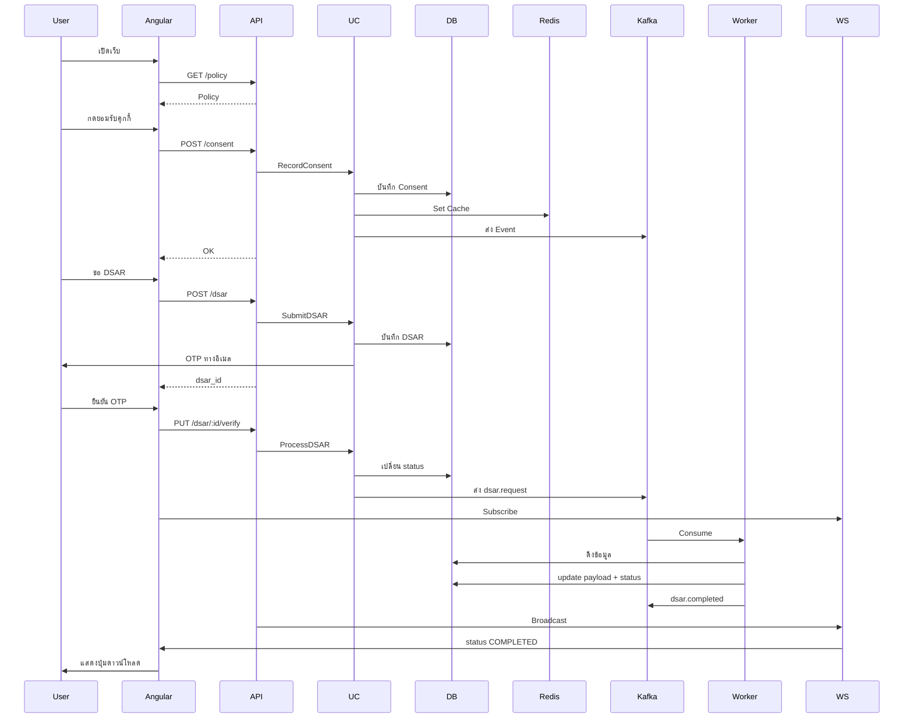
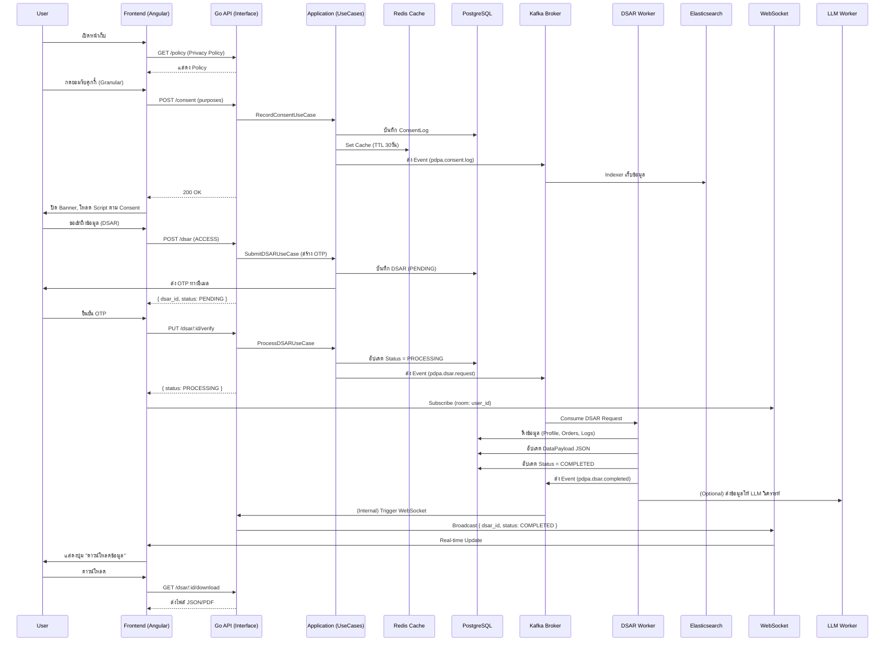

#### 📘 โมดูล pdpa – เอกสารการออกแบบระบบ (Clean Architecture + DDD)

## สารบัญ
1. ภาพรวมระบบ  
2. โครงสร้าง Module  
3. Domain Layer  
   - 3.1 Entities  
   - 3.2 Value Objects  
   - 3.3 Repository Interfaces  
   - 3.4 Domain Services  
   - 3.5 Domain Errors  
4. Application Layer  
   - 4.1 Use Cases  
   - 4.2 DTOs  
5. Infrastructure Layer  
   - 5.1 Repository Implementations  
   - 5.2 JWT Implementation  
   - 5.3 Bcrypt Hasher Implementation  
   - 5.4 Rate Limit Middleware  
6. Interface Layer  
   - 6.1 HTTP Handlers  
   - 6.2 Routes  
   - 6.3 Middleware  
7. Database Migrations  
8. Workflow Diagram  
9. System Flow  
10. การติดตั้งและใช้งาน  
11. Business Model  
12. ภาคผนวก  
13. Prompt สำหรับการขยายระบบในอนาคต  

---

## 1. ภาพรวมระบบ

โมดูล `pdpa` จัดการเรื่องสิทธิ์ส่วนบุคคลตามกฎหมาย PDPA ประกอบด้วยฟังก์ชันหลัก:
- บันทึกประวัติความยินยอม (Consent Logging)
- จัดการคำร้องขอใช้สิทธิ์ (DSAR – Data Subject Access Request) ทั้งแบบเข้าถึง ลบ และถอนความยินยอม
- รายงานและวิเคราะห์ข้อมูลด้วย LLM
- แจ้งเตือนทางอีเมล
- รองรับ Real-time ผ่าน WebSocket

**เทคโนโลยีที่ใช้:**
- Backend: Go (Gin) + PostgreSQL + Redis + Kafka + Elasticsearch
- Frontend: Angular 16+ (Standalone + NgRx)
- Async: Kafka Consumers (DSAR, LLM, Email, Blockchain)
- Real-time: WebSocket (Gorilla)

---

## 2. โครงสร้าง Module

```
internal/modules/pdpa/
│
├── domain/                     # 🏛️ DOMAIN LAYER
│   ├── entity/
│   │   ├── consent_log.go
│   │   ├── dsar_request.go
│   │   └── audit_trail.go
│   ├── value_object/
│   │   ├── consent_purpose.go
│   │   ├── consent_status.go
│   │   ├── dsar_type.go
│   │   └── dsar_status.go
│   ├── repository/
│   │   ├── consent_repository.go
│   │   ├── dsar_repository.go
│   │   └── audit_repository.go
│   ├── service/
│   │   ├── consent_validator.go
│   │   └── anonymization_service.go
│   └── errors/
│       └── errors.go
│
├── application/                # 🎯 APPLICATION LAYER
│   ├── record_consent.go
│   ├── submit_dsar.go
│   ├── process_dsar.go
│   ├── get_consent_history.go
│   ├── get_dsar_status.go
│   ├── get_admin_report.go
│   └── dto.go
│
├── infrastructure/             # 🔧 INFRASTRUCTURE LAYER
│   ├── persistence/
│   │   ├── postgres/
│   │   │   ├── consent_repo_impl.go
│   │   │   ├── dsar_repo_impl.go
│   │   │   └── models.go
│   │   └── redis/
│   │       └── consent_cache.go
│   ├── messaging/
│   │   ├── kafka_producer.go
│   │   └── consumers/
│   │       ├── dsar_worker.go
│   │       ├── llm_worker.go
│   │       ├── email_worker.go
│   │       └── blockchain_worker.go
│   └── search/
│       └── elasticsearch/
│           └── consent_indexer.go
│
└── interfaces/                 # 🌐 INTERFACE LAYER
    ├── http/
    │   ├── consent_handler.go
    │   ├── dsar_handler.go
    │   ├── admin_handler.go
    │   ├── routes.go
    │   └── dto.go
    └── websocket/
        └── dsar_broadcaster.go
```

---

## 3. Domain Layer

### 3.1 Entities

**`consent_log.go`**
```go
type ConsentLog struct {
    ID          uuid.UUID
    UserID      uuid.UUID
    SessionID   string
    Purpose     ConsentPurpose
    Status      ConsentStatus
    IPAddress   string
    UserAgent   string
    GrantedAt   time.Time
    ExpiresAt   time.Time
}
```

**`dsar_request.go`**
```go
type DSARRequest struct {
    ID             uuid.UUID
    UserID         uuid.UUID
    RequestType    DSARType
    Status         DSARStatus
    RequestedAt    time.Time
    CompletedAt    *time.Time
    DataPayload    []byte
    RejectionReason string
    OTPCode        string
    OTPExpiredAt   time.Time
}
```

### 3.2 Value Objects

```go
// consent_purpose.go
type ConsentPurpose string
const (
    PurposeNecessary ConsentPurpose = "NECESSARY"
    PurposeAnalytics ConsentPurpose = "ANALYTICS"
    PurposeMarketing ConsentPurpose = "MARKETING"
)

// consent_status.go
type ConsentStatus string
const (
    ConsentGranted ConsentStatus = "GRANTED"
    ConsentRevoked ConsentStatus = "REVOKED"
    ConsentExpired ConsentStatus = "EXPIRED"
)

// dsar_type.go
type DSARType string
const (
    DSARAccess          DSARType = "ACCESS"
    DSARErasure         DSARType = "ERASURE"
    DSARWithdrawConsent DSARType = "WITHDRAW_CONSENT"
)

// dsar_status.go
type DSARStatus string
const (
    DSARStatusPending    DSARStatus = "PENDING"
    DSARStatusProcessing DSARStatus = "PROCESSING"
    DSARStatusCompleted  DSARStatus = "COMPLETED"
    DSARStatusRejected   DSARStatus = "REJECTED"
)
```

### 3.3 Repository Interfaces

```go
// consent_repository.go
type ConsentRepository interface {
    Save(ctx context.Context, log *entity.ConsentLog) error
    FindByUserID(ctx context.Context, userID uuid.UUID) ([]entity.ConsentLog, error)
    FindLatestByUserAndPurpose(ctx context.Context, userID uuid.UUID, purpose valueobject.ConsentPurpose) (*entity.ConsentLog, error)
    RevokeByUserAndPurpose(ctx context.Context, userID uuid.UUID, purpose valueobject.ConsentPurpose) error
}

// dsar_repository.go
type DSARRepository interface {
    Save(ctx context.Context, req *entity.DSARRequest) error
    FindByID(ctx context.Context, id uuid.UUID) (*entity.DSARRequest, error)
    FindByUserID(ctx context.Context, userID uuid.UUID) ([]entity.DSARRequest, error)
    UpdateStatus(ctx context.Context, id uuid.UUID, status valueobject.DSARStatus, payload []byte) error
}
```

### 3.4 Domain Services

**`consent_validator.go`**
```go
type ConsentValidator struct{}
func (v *ConsentValidator) IsExpired(grantedAt time.Time) bool {
    return time.Since(grantedAt) > 365*24*time.Hour
}
```

**`anonymization_service.go`** – แปลงข้อมูลส่วนตัวเป็นนิรนาม

### 3.5 Domain Errors

```go
var (
    ErrConsentNotFound      = errors.New("consent not found")
    ErrDSARNotFound         = errors.New("DSAR not found")
    ErrDSARAlreadyProcessed = errors.New("DSAR already processed")
    ErrInvalidPurpose       = errors.New("invalid purpose")
    ErrOTPExpired           = errors.New("OTP expired")
    ErrRateLimitExceeded    = errors.New("rate limit exceeded")
)
```

---

## 4. Application Layer

### 4.1 Use Cases

- **RecordConsentUseCase**: บันทึกการยินยอม (รับ purposes, บันทึก DB, ตั้ง Redis Cache, ส่ง Kafka)
- **SubmitDSARUseCase**: สร้าง DSAR, สร้าง OTP, ส่งอีเมล, บันทึก DB สถานะ `PENDING`
- **ProcessDSARUseCase**: เปลี่ยนสถานะเป็น `PROCESSING` และส่ง Kafka Event ให้ Worker
- **GetConsentHistoryUseCase**: ดึงประวัติจาก DB
- **GetDSARStatusUseCase**: ดึงสถานะ DSAR
- **GetAdminReportUseCase**: เรียกข้อมูลจาก Elasticsearch หรือ LLM Worker เพื่อสร้างรายงาน

### 4.2 DTOs

```go
type RecordConsentRequest struct {
    Purposes map[string]bool `json:"purposes"`
}

type SubmitDSARRequest struct {
    RequestType string `json:"request_type" binding:"oneof=ACCESS ERASURE WITHDRAW_CONSENT"`
}

type DSARResponse struct {
    ID        uuid.UUID `json:"id"`
    Status    string    `json:"status"`
    CreatedAt string    `json:"created_at"`
}
```

---

## 5. Infrastructure Layer

### 5.1 Repository Implementations (PostgreSQL + GORM)

ใช้ GORM เพื่อเชื่อมต่อกับตาราง `consent_logs`, `dsar_requests` และ `pdpa_audit_trails` โดยมี `models.go` ที่แมป struct กับตาราง

### 5.2 JWT Implementation

Middleware จะแยก `user_id` จาก JWT และ Inject เข้า `context`

### 5.3 Bcrypt Hasher Implementation

ใช้สำหรับ Hash OTP ก่อนเก็บ (เสริมความปลอดภัย)

```go
func HashOTP(otp string) (string, error) { ... }
func CheckOTP(hashed, otp string) bool { ... }
```

### 5.4 Rate Limit Middleware

จำกัดการยื่น DSAR ไม่เกิน 3 ครั้งต่อชั่วโมงต่อ user (ใช้ `golang.org/x/time/rate`)

---

## 6. Interface Layer

### 6.1 HTTP Handlers

- `ConsentHandler`: `RecordConsent`, `GetHistory`
- `DSARHandler`: `SubmitDSAR`, `GetStatus`, `DownloadData`
- `AdminHandler`: `GetLLMReport`

### 6.2 Routes

```go
pdpa := r.Group("/pdpa")
pdpa.Use(authMiddleware)
pdpa.POST("/consent", consentHandler.RecordConsent)
pdpa.GET("/consent/history", consentHandler.GetHistory)
pdpa.POST("/dsar", dsarHandler.Submit)
pdpa.GET("/dsar/:id/status", dsarHandler.GetStatus)
pdpa.GET("/dsar/:id/download", dsarHandler.DownloadData)

admin := pdpa.Group("/admin")
admin.Use(rateLimitMiddleware)
admin.GET("/report", adminHandler.GetLLMReport)
```

### 6.3 Middleware

- **CORS**: กำหนด Allow-Origin
- **Logging**: บันทึก request/response
- **JWT Auth**: ตรวจสอบ token
- **Rate Limit**: ใช้กับ Admin endpoint

---

## 7. Database Migrations

```sql
CREATE TABLE consent_logs (
    id UUID PRIMARY KEY DEFAULT gen_random_uuid(),
    user_id UUID NOT NULL,
    session_id VARCHAR(255),
    purpose VARCHAR(50) NOT NULL,
    status VARCHAR(20) NOT NULL DEFAULT 'GRANTED',
    ip_address VARCHAR(45),
    user_agent TEXT,
    granted_at TIMESTAMP DEFAULT NOW(),
    expires_at TIMESTAMP,
    CONSTRAINT fk_user FOREIGN KEY (user_id) REFERENCES users(id)
);
CREATE INDEX idx_consent_user_id ON consent_logs (user_id);

CREATE TABLE dsar_requests (
    id UUID PRIMARY KEY DEFAULT gen_random_uuid(),
    user_id UUID NOT NULL,
    request_type VARCHAR(20) NOT NULL,
    status VARCHAR(20) DEFAULT 'PENDING',
    requested_at TIMESTAMP DEFAULT NOW(),
    completed_at TIMESTAMP,
    data_payload JSONB,
    rejection_reason TEXT,
    otp_code VARCHAR(255),
    otp_expired_at TIMESTAMP,
    CONSTRAINT fk_user_dsar FOREIGN KEY (user_id) REFERENCES users(id)
);
CREATE INDEX idx_dsar_user_id ON dsar_requests (user_id);

CREATE TABLE pdpa_audit_trails (
    id UUID PRIMARY KEY DEFAULT gen_random_uuid(),
    user_id UUID,
    action VARCHAR(50) NOT NULL,
    details JSONB,
    created_at TIMESTAMP DEFAULT NOW()
);
```

---

## 8. Workflow Diagram



---

## 9. System Flow

1. **Cookie Banner**: แสดงเมื่อไม่มี Consent หรือหมดอายุ → ผู้ใช้เลือก Purpose → บันทึกไป DB, Redis, Kafka
2. **DSAR Access**: ผู้ใช้ยื่นคำร้อง → รับ OTP → ยืนยัน → ระบบส่ง Kafka → Worker ดึงข้อมูล → เปลี่ยน status → WebSocket แจ้ง Frontend → ดาวน์โหลดไฟล์
3. **DSAR Erasure**: คล้าย Access แต่ Worker จะทำการ Anonymize ข้อมูลแทนการ export และส่งอีเมลยืนยันการลบ
4. **Admin Report**: Admin เรียก `/admin/report` → ระบบอ่านข้อมูลจาก Elasticsearch หรือเรียก LLM Worker แบบ Async แล้วแสดงผล

---

## 10. การติดตั้งและใช้งาน

**ข้อกำหนด**: Go 1.21+, PostgreSQL, Redis, Kafka, Elasticsearch

**ไฟล์ `.env`** (ตัวอย่าง):
```
DB_HOST=localhost
DB_PORT=5432
DB_USER=admin
DB_PASSWORD=secret
DB_NAME=pdpa_db
REDIS_HOST=localhost:6379
KAFKA_BROKERS=localhost:9092
JWT_SECRET=your_secret
SMTP_HOST=smtp.gmail.com
SMTP_PORT=587
SMTP_USER=user@gmail.com
SMTP_PASS=pass
```

**คำสั่งรัน**:
```bash
go run cmd/migrate/main.go          # migrate DB
go run cmd/api/main.go              # start API server
go run cmd/workers/dsar/main.go     # DSAR worker
go run cmd/workers/llm/main.go      # LLM worker
go run cmd/workers/email/main.go    # Email worker
```

---

## 11. Business Model

- **SaaS**: คิดค่าบริการตามจำนวนผู้ใช้ (ต่อ 1,000 ราย) หรือตาม DSAR request
- **Enterprise**: ขายลิขสิทธิ์รายปีพร้อม Customization
- **ต้นทุนหลัก**: ค่า Kafka/Elasticsearch, ค่า LLM API, ทีมพัฒนา

---

## 12. ภาคผนวก

**Docker Compose** สำหรับพัฒนา:
```yaml
version: '3.8'
services:
  postgres: { ... }
  redis: { ... }
  zookeeper: { ... }
  kafka: { ... }
  elasticsearch: { ... }
```

---

## 13. Prompt สำหรับการขยายระบบในอนาคต

1. **Blockchain**: บันทึก Hash ของ Consent Log ลง Smart Contract
2. **LLM Report**: สร้าง Executive Summary แบบอัตโนมัติจากข้อมูล Elasticsearch
3. **Mobile SDK**: สร้าง gRPC Gateway สำหรับ Flutter/iOS
4. **Data Breach Notification**: ตรวจจับการเข้าถึงผิดปกติและแจ้งเตือน DPO
5. **Multi-Tenancy**: รองรับหลายองค์กรด้วย `tenant_id`

---
 

> **เป้าหมายของโมดูล:**  
> - บันทึกประวัติความยินยอมของผู้ใช้งาน (Consent Logging)  
> - รายงานประวัติการใช้งานระบบตามหลัก PDPA  
> - แจ้งเตือนทางอีเมล (Email Notification)  
> - ประมวลผลข้อมูลด้วย LLM แบบ Asynchronous เพื่อวิเคราะห์และสรุปรายงาน  
> - จัดการสิทธิ์ของเจ้าของข้อมูล (DSAR): ขอเข้าถึง, ขอลบ, ขอถอนความยินยอม  
> - รองรับการทำงานแบบ Real-time ผ่าน WebSocket  

---

## 1. ภาพรวมระบบ (System Overview)

| **องค์ประกอบ** | **เทคโนโลยี** | **บทบาท** |
| :--- | :--- | :--- |
| **Frontend** | Angular 16+ (Standalone + NgRx) | แสดง Cookie Banner, ฟอร์ม DSAR, Dashboard Admin, แจ้งเตือนแบบ Real-time |
| **API Gateway** | Go + Gin | รับ HTTP Request, ตรวจสอบ JWT, เรียก Use Cases |
| **Application Core** | Go (Clean Architecture) | ดำเนินการตามกฎธุรกิจ (บันทึกความยินยอม, สร้าง/ดำเนินการ DSAR) |
| **Cache Layer** | Redis | เก็บสถานะการยินยอมล่าสุด (TTL 30 วัน) ลดภาระ DB |
| **Database** | PostgreSQL | เก็บ Consent Log, DSAR Request, Audit Trail อย่างถาวร |
| **Message Queue** | Kafka | สื่อสารแบบ Async ระหว่าง API กับ Workers (DSAR, LLM, Email) |
| **Search Engine** | Elasticsearch | เก็บ Index สำหรับค้นหา Consent Log และสร้างรายงานเร็ว |
| **Real-time** | WebSocket (Gorilla) | ส่งอัปเดตสถานะ DSAR ไปยัง Frontend ทันที |
| **Async Workers** | Go Routines + Kafka Consumer Group | ประมวลผล DSAR, เรียก LLM, สร้าง Embedding, บันทึก Blockchain |

---

## 2. โครงสร้างโมดูล `pdpa`

```
internal/modules/pdpa/
│
├── domain/                     # 🏛️ DOMAIN LAYER
│   ├── entity/
│   │   ├── consent_log.go              # Consent Aggregate Root
│   │   ├── dsar_request.go             # DSAR Aggregate Root
│   │   └── audit_trail.go              # Audit Trail Entity
│   │
│   ├── value_object/
│   │   ├── consent_purpose.go          # (NECESSARY, ANALYTICS, MARKETING)
│   │   ├── consent_status.go           # (GRANTED, REVOKED, EXPIRED)
│   │   ├── dsar_type.go                # (ACCESS, ERASURE, WITHDRAW_CONSENT)
│   │   └── dsar_status.go              # (PENDING, PROCESSING, COMPLETED, REJECTED)
│   │
│   ├── repository/
│   │   ├── consent_repository.go       # Interface
│   │   ├── dsar_repository.go          # Interface
│   │   └── audit_repository.go         # Interface
│   │
│   ├── service/
│   │   ├── consent_validator.go        # ตรวจสอบอายุและความถูกต้องของ Consent
│   │   └── anonymization_service.go    # แปลงข้อมูลเป็นนิรนาม (สำหรับ Erasure)
│   │
│   └── errors/
│       └── errors.go                   # Domain Errors
│
├── application/                        # 🎯 APPLICATION LAYER
│   ├── record_consent.go               # UseCase: บันทึก/อัปเดตการยินยอม
│   ├── submit_dsar.go                  # UseCase: สร้างคำร้อง DSAR (ส่ง OTP)
│   ├── process_dsar.go                 # UseCase: สั่ง Kafka ให้ประมวลผล DSAR
│   ├── get_consent_history.go          # UseCase: ดึงประวัติการยินยอม
│   ├── get_dsar_status.go              # UseCase: เช็คสถานะ DSAR
│   ├── get_admin_report.go             # UseCase: ดึงรายงาน (จาก LLM/ES)
│   └── dto.go                          # Request/Response DTOs
│
├── infrastructure/                    # 🔧 INFRASTRUCTURE LAYER
│   ├── persistence/
│   │   ├── postgres/
│   │   │   ├── consent_repo_impl.go    # GORM Implementation
│   │   │   ├── dsar_repo_impl.go       # GORM Implementation
│   │   │   └── models.go               # GORM Models (ตาราง DB)
│   │   └── redis/
│   │       └── consent_cache.go        # เก็บ/อ่าน Consent State ใน Redis
│   │
│   ├── messaging/
│   │   ├── kafka_producer.go           # ส่ง Event ไปยัง Topics
│   │   └── consumers/                  # Kafka Consumer Group
│   │       ├── dsar_worker.go          # ดึงข้อมูลจากหลายโมดูล (Order, Profile)
│   │       ├── llm_worker.go           # เรียก LLM (OpenAI/Claude) เพื่อวิเคราะห์
│   │       ├── email_worker.go         # ส่งอีเมลแจ้งสถานะ
│   │       └── blockchain_worker.go    # บันทึก Hash ลง Blockchain (อนาคต)
│   │
│   └── search/
│       └── elasticsearch/
│           └── consent_indexer.go      # จัดทำ Index ให้ Elasticsearch
│
└── interfaces/                        # 🌐 INTERFACE LAYER
    ├── http/
    │   ├── consent_handler.go          # Handler: POST /consent, GET /history
    │   ├── dsar_handler.go             # Handler: POST /dsar, GET /status/:id
    │   ├── admin_handler.go            # Handler: GET /admin/report
    │   ├── routes.go                   # ลงทะเบียน Routes
    │   └── dto.go                      # HTTP Request/Response DTOs
    └── websocket/
        └── dsar_broadcaster.go         # Broadcast สถานะ DSAR ผ่าน WebSocket
```

---

## 3. Domain Layer

### 3.1 Entities (Aggregate Roots)

#### `consent_log.go`
```go
package entity

import (
    "time"
    "github.com/google/uuid"
)

type ConsentLog struct {
    ID          uuid.UUID      `json:"id"`
    UserID      uuid.UUID      `json:"user_id"`
    SessionID   string         `json:"session_id"`    // กรณียังไม่ Login
    Purpose     ConsentPurpose `json:"purpose"`
    Status      ConsentStatus  `json:"status"`        // GRANTED, REVOKED
    IPAddress   string         `json:"ip_address"`
    UserAgent   string         `json:"user_agent"`
    GrantedAt   time.Time      `json:"granted_at"`
    ExpiresAt   time.Time      `json:"expires_at"`    // +1 ปี ตาม PDPA
}
```

#### `dsar_request.go`
```go
package entity

import (
    "time"
    "github.com/google/uuid"
)

type DSARRequest struct {
    ID             uuid.UUID   `json:"id"`
    UserID         uuid.UUID   `json:"user_id"`
    RequestType    DSARType    `json:"request_type"`    // ACCESS, ERASURE, WITHDRAW_CONSENT
    Status         DSARStatus  `json:"status"`          // PENDING, PROCESSING, COMPLETED, REJECTED
    RequestedAt    time.Time   `json:"requested_at"`
    CompletedAt    *time.Time  `json:"completed_at"`
    DataPayload    []byte      `json:"data_payload"`    // JSON ของข้อมูลที่ดึงมา (กรณี ACCESS)
    RejectionReason string     `json:"rejection_reason"`
    OTPCode        string      `json:"-"`               // ซ่อนจาก JSON
    OTPExpiredAt   time.Time   `json:"-"`
}
```

### 3.2 Value Objects

#### `consent_purpose.go`
```go
package valueobject

type ConsentPurpose string

const (
    PurposeNecessary ConsentPurpose = "NECESSARY"
    PurposeAnalytics ConsentPurpose = "ANALYTICS"
    PurposeMarketing ConsentPurpose = "MARKETING"
)

func (p ConsentPurpose) IsValid() bool {
    switch p {
    case PurposeNecessary, PurposeAnalytics, PurposeMarketing:
        return true
    }
    return false
}
```

#### `consent_status.go`
```go
package valueobject

type ConsentStatus string

const (
    ConsentGranted ConsentStatus = "GRANTED"
    ConsentRevoked ConsentStatus = "REVOKED"
    ConsentExpired ConsentStatus = "EXPIRED"
)
```

#### `dsar_type.go`
```go
package valueobject

type DSARType string

const (
    DSARAccess          DSARType = "ACCESS"
    DSARErasure         DSARType = "ERASURE"
    DSARWithdrawConsent DSARType = "WITHDRAW_CONSENT"
)
```

#### `dsar_status.go`
```go
package valueobject

type DSARStatus string

const (
    DSARStatusPending    DSARStatus = "PENDING"
    DSARStatusProcessing DSARStatus = "PROCESSING"
    DSARStatusCompleted  DSARStatus = "COMPLETED"
    DSARStatusRejected   DSARStatus = "REJECTED"
)
```

### 3.3 Repository Interfaces

#### `consent_repository.go`
```go
package repository

import (
    "context"
    "github.com/google/uuid"
    "internal/modules/pdpa/domain/entity"
)

type ConsentRepository interface {
    Save(ctx context.Context, log *entity.ConsentLog) error
    FindByUserID(ctx context.Context, userID uuid.UUID) ([]entity.ConsentLog, error)
    FindLatestByUserAndPurpose(ctx context.Context, userID uuid.UUID, purpose valueobject.ConsentPurpose) (*entity.ConsentLog, error)
    RevokeByUserAndPurpose(ctx context.Context, userID uuid.UUID, purpose valueobject.ConsentPurpose) error
}
```

#### `dsar_repository.go`
```go
package repository

import (
    "context"
    "github.com/google/uuid"
    "internal/modules/pdpa/domain/entity"
)

type DSARRepository interface {
    Save(ctx context.Context, req *entity.DSARRequest) error
    FindByID(ctx context.Context, id uuid.UUID) (*entity.DSARRequest, error)
    FindByUserID(ctx context.Context, userID uuid.UUID) ([]entity.DSARRequest, error)
    UpdateStatus(ctx context.Context, id uuid.UUID, status valueobject.DSARStatus, payload []byte) error
}
```

#### `audit_repository.go`
```go
package repository

import (
    "context"
    "internal/modules/pdpa/domain/entity"
)

type AuditRepository interface {
    Log(ctx context.Context, trail *entity.AuditTrail) error
}
```

### 3.4 Domain Services

#### `consent_validator.go`
```go
package service

import (
    "time"
    "internal/modules/pdpa/domain/valueobject"
)

type ConsentValidator struct{}

func (v *ConsentValidator) IsExpired(grantedAt time.Time) bool {
    // PDPA กำหนดให้ความยินยอมมีอายุสูงสุด 1 ปี
    return time.Since(grantedAt) > 365*24*time.Hour
}

func (v *ConsentValidator) IsGranularConsentValid(purposes []valueobject.ConsentPurpose) bool {
    // ต้องมีอย่างน้อย 1 Purpose
    return len(purposes) > 0
}
```

#### `anonymization_service.go`
```go
package service

// AnonymizeData รับข้อมูลส่วนตัวแล้วแปลงเป็นนิรนาม (เช่น แทนที่ชื่อด้วย "XXXX")
func AnonymizeData(data map[string]interface{}) map[string]interface{} {
    // Logic การทำ Data Masking
    // เช่น แทนที่ฟิลด์ name, email, phone เป็น "ANONYMIZED"
    return data
}
```

### 3.5 Domain Errors

#### `errors.go`
```go
package errors

import "errors"

var (
    ErrConsentNotFound      = errors.New("consent record not found")
    ErrDSARNotFound         = errors.New("DSAR request not found")
    ErrDSARAlreadyProcessed = errors.New("DSAR request already processed")
    ErrInvalidPurpose       = errors.New("invalid consent purpose")
    ErrOTPExpired           = errors.New("OTP expired or invalid")
    ErrRateLimitExceeded    = errors.New("too many DSAR requests, please try again later")
)
```

---

## 4. Application Layer

### 4.1 Use Cases

#### `record_consent.go`
```go
package application

import (
    "context"
    "time"
    "github.com/google/uuid"
    "internal/modules/pdpa/domain/entity"
    "internal/modules/pdpa/domain/valueobject"
    "internal/modules/pdpa/domain/repository"
    "internal/modules/pdpa/infrastructure/cache"
    "internal/modules/pdpa/infrastructure/messaging"
)

type RecordConsentUseCase struct {
    consentRepo repository.ConsentRepository
    cache       cache.ConsentCache
    producer    messaging.KafkaProducer
}

func (uc *RecordConsentUseCase) Execute(ctx context.Context, userID uuid.UUID, sessionID string, purposes map[string]bool, ip, ua string) error {
    for purposeStr, granted := range purposes {
        purpose := valueobject.ConsentPurpose(purposeStr)
        if !purpose.IsValid() {
            return domainerrors.ErrInvalidPurpose
        }
        status := valueobject.ConsentGranted
        if !granted {
            status = valueobject.ConsentRevoked
        }
        log := &entity.ConsentLog{
            ID:          uuid.New(),
            UserID:      userID,
            SessionID:   sessionID,
            Purpose:     purpose,
            Status:      status,
            IPAddress:   ip,
            UserAgent:   ua,
            GrantedAt:   time.Now(),
            ExpiresAt:   time.Now().AddDate(1, 0, 0), // +1 ปี
        }
        // บันทึก DB
        if err := uc.consentRepo.Save(ctx, log); err != nil {
            return err
        }
        // อัปเดต Redis Cache
        uc.cache.Set(ctx, userID, purpose, granted)
        // ส่ง Event ไป Kafka
        uc.producer.PublishConsentEvent(ctx, log)
    }
    return nil
}
```

#### `submit_dsar.go`
```go
package application

import (
    "context"
    "crypto/rand"
    "encoding/hex"
    "time"
    "github.com/google/uuid"
    "internal/modules/pdpa/domain/entity"
    "internal/modules/pdpa/domain/repository"
    "internal/modules/pdpa/infrastructure/email"
)

type SubmitDSARUseCase struct {
    dsarRepo    repository.DSARRepository
    emailSender email.Sender
}

func (uc *SubmitDSARUseCase) Execute(ctx context.Context, userID uuid.UUID, dsarType valueobject.DSARType) (*entity.DSARRequest, error) {
    // สร้าง OTP (6 หลัก)
    otpBytes := make([]byte, 3)
    rand.Read(otpBytes)
    otp := hex.EncodeToString(otpBytes)

    req := &entity.DSARRequest{
        ID:           uuid.New(),
        UserID:       userID,
        RequestType:  dsarType,
        Status:       valueobject.DSARStatusPending,
        RequestedAt:  time.Now(),
        OTPCode:      otp,
        OTPExpiredAt: time.Now().Add(15 * time.Minute),
    }
    if err := uc.dsarRepo.Save(ctx, req); err != nil {
        return nil, err
    }
    // ส่ง OTP ทางอีเมล (ต้องมี email ของ user)
    uc.emailSender.SendOTP(ctx, userID, otp)
    return req, nil
}
```

#### `process_dsar.go`
```go
package application

import (
    "context"
    "github.com/google/uuid"
    "internal/modules/pdpa/domain/repository"
    "internal/modules/pdpa/infrastructure/messaging"
)

type ProcessDSARUseCase struct {
    producer messaging.KafkaProducer
    dsarRepo repository.DSARRepository
}

func (uc *ProcessDSARUseCase) Execute(ctx context.Context, dsarID uuid.UUID) error {
    req, err := uc.dsarRepo.FindByID(ctx, dsarID)
    if err != nil {
        return err
    }
    // เปลี่ยนสถานะเป็น PROCESSING
    if err := uc.dsarRepo.UpdateStatus(ctx, dsarID, valueobject.DSARStatusProcessing, nil); err != nil {
        return err
    }
    // ส่ง Kafka Event
    return uc.producer.PublishDSARRequest(ctx, req)
}
```

#### `get_consent_history.go`
```go
// เรียก consentRepo.FindByUserID() แล้วแปลงเป็น DTO
```

#### `get_dsar_status.go`
```go
// เรียก dsarRepo.FindByID() แล้วคืนสถานะ
```

#### `get_admin_report.go`
```go
// ไปอ่านข้อมูลจาก Elasticsearch หรือเรียก LLM Worker ผ่าน Kafka แล้วรอผล
```

### 4.2 DTOs

#### `dto.go`
```go
package dto

import "github.com/google/uuid"

type RecordConsentRequest struct {
    Purposes map[string]bool `json:"purposes"` // {"ANALYTICS": true, "MARKETING": false}
}

type SubmitDSARRequest struct {
    RequestType string `json:"request_type" binding:"required,oneof=ACCESS ERASURE WITHDRAW_CONSENT"`
}

type DSARResponse struct {
    ID        uuid.UUID `json:"id"`
    Status    string    `json:"status"`
    CreatedAt string    `json:"created_at"`
}

type ConsentHistoryResponse struct {
    Purpose   string `json:"purpose"`
    Status    string `json:"status"`
    GrantedAt string `json:"granted_at"`
    ExpiresAt string `json:"expires_at"`
}
```

---

## 5. Infrastructure Layer

### 5.1 Repository Implementations (PostgreSQL + GORM)

#### `consent_repo_impl.go`
```go
package postgres

import (
    "context"
    "gorm.io/gorm"
    "internal/modules/pdpa/domain/entity"
    "internal/modules/pdpa/domain/valueobject"
    "internal/modules/pdpa/infrastructure/persistence/postgres/models"
)

type consentRepoImpl struct {
    db *gorm.DB
}

func NewConsentRepository(db *gorm.DB) repository.ConsentRepository {
    return &consentRepoImpl{db: db}
}

func (r *consentRepoImpl) Save(ctx context.Context, log *entity.ConsentLog) error {
    model := models.ConsentLogModel{
        ID:        log.ID,
        UserID:    log.UserID,
        SessionID: log.SessionID,
        Purpose:   string(log.Purpose),
        Status:    string(log.Status),
        IPAddress: log.IPAddress,
        UserAgent: log.UserAgent,
        GrantedAt: log.GrantedAt,
        ExpiresAt: log.ExpiresAt,
    }
    return r.db.WithContext(ctx).Create(&model).Error
}
// ... implement other methods
```

#### `models.go` (GORM Models)
```go
package models

import (
    "time"
    "github.com/google/uuid"
)

type ConsentLogModel struct {
    ID        uuid.UUID `gorm:"type:uuid;primaryKey"`
    UserID    uuid.UUID `gorm:"type:uuid;index"`
    SessionID string    `gorm:"index"`
    Purpose   string    `gorm:"type:varchar(50);index"`
    Status    string    `gorm:"type:varchar(20)"`
    IPAddress string    `gorm:"type:varchar(45)"`
    UserAgent string
    GrantedAt time.Time `gorm:"index"`
    ExpiresAt time.Time
}

type DSARRequestModel struct {
    ID              uuid.UUID  `gorm:"type:uuid;primaryKey"`
    UserID          uuid.UUID  `gorm:"type:uuid;index"`
    RequestType     string     `gorm:"type:varchar(20)"`
    Status          string     `gorm:"type:varchar(20);index"`
    RequestedAt     time.Time  `gorm:"index"`
    CompletedAt     *time.Time
    DataPayload     []byte     `gorm:"type:jsonb"`
    RejectionReason string
    OTPCode         string
    OTPExpiredAt    time.Time
}
```

#### `consent_cache.go` (Redis)
```go
package cache

import (
    "context"
    "encoding/json"
    "time"
    "github.com/go-redis/redis/v8"
    "github.com/google/uuid"
)

type ConsentCache interface {
    Set(ctx context.Context, userID uuid.UUID, purpose valueobject.ConsentPurpose, granted bool) error
    Get(ctx context.Context, userID uuid.UUID, purpose valueobject.ConsentPurpose) (bool, error)
}

type redisConsentCache struct {
    client *redis.Client
}

func (c *redisConsentCache) Set(ctx context.Context, userID uuid.UUID, purpose valueobject.ConsentPurpose, granted bool) error {
    key := "consent:" + userID.String() + ":" + string(purpose)
    val := "true"
    if !granted {
        val = "false"
    }
    return c.client.Set(ctx, key, val, 30*24*time.Hour).Err() // TTL 30 วัน
}
```

### 5.2 JWT Implementation (ใช้ร่วมกับ Auth Module)
JWT middleware จะแยก extract `user_id` จาก token แล้ว inject เข้า context

### 5.3 Bcrypt Hasher Implementation
สำหรับใช้ Hash OTP ก่อนเก็บใน DB (เสริมความปลอดภัย)

```go
package security

import "golang.org/x/crypto/bcrypt"

func HashOTP(otp string) (string, error) {
    bytes, err := bcrypt.GenerateFromPassword([]byte(otp), bcrypt.DefaultCost)
    return string(bytes), err
}

func CheckOTP(hashed, otp string) bool {
    return bcrypt.CompareHashAndPassword([]byte(hashed), []byte(otp)) == nil
}
```

### 5.4 Rate Limit Middleware
```go
package middleware

import (
    "github.com/gin-gonic/gin"
    "golang.org/x/time/rate"
    "net/http"
)

var limiter = rate.NewLimiter(3, 1) // 3 requests per hour

func RateLimitMiddleware() gin.HandlerFunc {
    return func(c *gin.Context) {
        if !limiter.Allow() {
            c.AbortWithStatusJSON(http.StatusTooManyRequests, gin.H{"error": "Too many DSAR requests"})
            return
        }
        c.Next()
    }
}
```

---

## 6. Interface Layer

### 6.1 HTTP Handlers

#### `consent_handler.go`
```go
package http

import (
    "net/http"
    "github.com/gin-gonic/gin"
    "internal/modules/pdpa/application"
    "internal/modules/pdpa/interface/http/dto"
)

type ConsentHandler struct {
    recordUC *application.RecordConsentUseCase
    historyUC *application.GetConsentHistoryUseCase
}

func (h *ConsentHandler) RecordConsent(c *gin.Context) {
    var req dto.RecordConsentRequest
    if err := c.ShouldBindJSON(&req); err != nil {
        c.JSON(http.StatusBadRequest, gin.H{"error": err.Error()})
        return
    }
    userID := c.GetString("user_id") // จาก JWT
    sessionID := c.GetString("session_id") // หรือจาก Cookie
    ip := c.ClientIP()
    ua := c.GetHeader("User-Agent")
    if err := h.recordUC.Execute(c.Request.Context(), userID, sessionID, req.Purposes, ip, ua); err != nil {
        c.JSON(http.StatusInternalServerError, gin.H{"error": err.Error()})
        return
    }
    c.JSON(http.StatusOK, gin.H{"message": "consent recorded"})
}
```

#### `dsar_handler.go`
```go
func (h *DSARHandler) SubmitDSAR(c *gin.Context) {
    var req dto.SubmitDSARRequest
    if err := c.ShouldBindJSON(&req); err != nil {
        c.JSON(http.StatusBadRequest, gin.H{"error": err.Error()})
        return
    }
    dsarType := valueobject.DSARType(req.RequestType)
    userID := c.GetString("user_id")
    reqEntity, err := h.submitUC.Execute(c.Request.Context(), userID, dsarType)
    if err != nil {
        c.JSON(http.StatusInternalServerError, gin.H{"error": err.Error()})
        return
    }
    c.JSON(http.StatusOK, dto.DSARResponse{
        ID:        reqEntity.ID,
        Status:    string(reqEntity.Status),
        CreatedAt: reqEntity.RequestedAt.Format(time.RFC3339),
    })
}
```

#### `admin_handler.go`
```go
func (h *AdminHandler) GetLLMReport(c *gin.Context) {
    report, err := h.reportUC.Execute(c.Request.Context())
    if err != nil {
        c.JSON(http.StatusInternalServerError, gin.H{"error": err.Error()})
        return
    }
    c.JSON(http.StatusOK, report)
}
```

### 6.2 Routes

#### `routes.go`
```go
package http

import (
    "github.com/gin-gonic/gin"
    "internal/modules/pdpa/interface/http/middleware"
)

func RegisterRoutes(r *gin.RouterGroup, handlers *Handlers, authMiddleware gin.HandlerFunc) {
    pdpa := r.Group("/pdpa")
    pdpa.Use(authMiddleware) // JWT Auth

    pdpa.GET("/policy", handlers.Consent.GetPolicy) // Public? ควรไม่ใช้ auth
    pdpa.POST("/consent", handlers.Consent.RecordConsent)
    pdpa.GET("/consent/history", handlers.Consent.GetHistory)
    pdpa.POST("/dsar", handlers.DSAR.Submit)
    pdpa.GET("/dsar/:id/status", handlers.DSAR.GetStatus)
    pdpa.GET("/dsar/:id/download", handlers.DSAR.DownloadData)

    admin := pdpa.Group("/admin")
    admin.Use(middleware.RateLimitMiddleware())
    admin.GET("/report", handlers.Admin.GetLLMReport)
}
```

### 6.3 Middleware

- **CORS**: กำหนด Allow-Origin, Methods, Headers
- **Logging**: บันทึก request method, path, status, latency
- **JWT Auth**: แยก `user_id` และ inject ลง Context

```go
func JWTAuthMiddleware() gin.HandlerFunc {
    return func(c *gin.Context) {
        token := c.GetHeader("Authorization")
        // parse JWT, extract user_id
        userID, err := parseToken(token)
        if err != nil {
            c.AbortWithStatusJSON(http.StatusUnauthorized, gin.H{"error": "unauthorized"})
            return
        }
        c.Set("user_id", userID)
        c.Next()
    }
}
```

---

## 7. Database Migrations (PostgreSQL)

```sql
-- 1. Consent Logs
CREATE TABLE consent_logs (
    id UUID PRIMARY KEY DEFAULT gen_random_uuid(),
    user_id UUID NOT NULL,
    session_id VARCHAR(255),
    purpose VARCHAR(50) NOT NULL,
    status VARCHAR(20) NOT NULL DEFAULT 'GRANTED',
    ip_address VARCHAR(45),
    user_agent TEXT,
    granted_at TIMESTAMP DEFAULT NOW(),
    expires_at TIMESTAMP,
    CONSTRAINT fk_user FOREIGN KEY (user_id) REFERENCES users(id) ON DELETE CASCADE
);
CREATE INDEX idx_consent_user_id ON consent_logs (user_id);
CREATE INDEX idx_consent_purpose ON consent_logs (purpose);

-- 2. DSAR Requests
CREATE TABLE dsar_requests (
    id UUID PRIMARY KEY DEFAULT gen_random_uuid(),
    user_id UUID NOT NULL,
    request_type VARCHAR(20) NOT NULL,
    status VARCHAR(20) DEFAULT 'PENDING',
    requested_at TIMESTAMP DEFAULT NOW(),
    completed_at TIMESTAMP,
    data_payload JSONB,
    rejection_reason TEXT,
    otp_code VARCHAR(255),
    otp_expired_at TIMESTAMP,
    CONSTRAINT fk_user_dsar FOREIGN KEY (user_id) REFERENCES users(id) ON DELETE CASCADE
);
CREATE INDEX idx_dsar_user_id ON dsar_requests (user_id);
CREATE INDEX idx_dsar_status ON dsar_requests (status);

-- 3. Audit Trail
CREATE TABLE pdpa_audit_trails (
    id UUID PRIMARY KEY DEFAULT gen_random_uuid(),
    user_id UUID,
    action VARCHAR(50) NOT NULL,
    details JSONB,
    created_at TIMESTAMP DEFAULT NOW()
);
CREATE INDEX idx_audit_user_id ON pdpa_audit_trails (user_id);
```

---

## 8. Workflow Diagram (Mermaid)



---

## 9. System Flow (อธิบายโดยละเอียด)

1. **Cookie Banner Flow**
   - Angular ตรวจสอบ `localStorage` + เรียก API `/consent/history`
   - ถ้าไม่มีข้อมูล หรือหมดอายุ → แสดง Banner
   - ผู้ใช้เลือก Purpose (ต้องมีปุ่ม Accept/Reject เท่ากัน)
   - Frontend ส่ง `POST /consent` → Backend บันทึก DB, Redis, และ Kafka
   - เมื่อสำเร็จ Angular เรียก `window.location.reload()` หรือโหลด Script (GTM, FB Pixel) แบบมีเงื่อนไข

2. **DSAR Access Flow**
   - ผู้ใช้กรอกฟอร์ม → ระบบสร้าง OTP (6 หลัก) ส่งไปยังอีเมลที่ลงทะเบียน
   - ผู้ใช้กรอก OTP → Backend เปลี่ยนสถานะเป็น `PROCESSING`
   - **Async Worker** ดึงข้อมูลจากหลายโมดูล (อาจเรียก gRPC ภายใน) มารวมเป็น JSON
   - Worker อัปเดต `data_payload` → สถานะเป็น `COMPLETED`
   - WebSocket ส่งข้อความไปยัง Frontend -> ผู้ใช้ดาวน์โหลดข้อมูล

3. **DSAR Erasure Flow**
   - คล้าย Access แต่เมื่อ Worker ดึงข้อมูลเสร็จ จะไม่เก็บ `data_payload`
   - Worker เรียก `AnonymizationService` เพื่อ Mask ข้อมูลใน DB
   - จากนั้นลบข้อมูลจริงในตารางหลัก (หรือ Anonymize) และส่งอีเมลยืนยันการลบให้ผู้ใช้

---

## 10. การติดตั้งและใช้งาน (Installation & Setup)

**ข้อกำหนดเบื้องต้น**:
- Go 1.21+
- PostgreSQL 14+
- Redis 7+
- Kafka 3.4+ (หรือ Redpanda)
- Elasticsearch 8+

**ไฟล์ Environment (.env)**
```env
# PostgreSQL
DB_HOST=localhost
DB_PORT=5432
DB_USER=admin
DB_PASSWORD=secret
DB_NAME=pdpa_db

# Redis
REDIS_HOST=localhost:6379

# Kafka
KAFKA_BROKERS=localhost:9092
KAFKA_TOPIC_CONSENT=pdpa.consent.log
KAFKA_TOPIC_DSAR=pdpa.dsar.request

# JWT
JWT_SECRET=your_secret_key

# Email
SMTP_HOST=smtp.gmail.com
SMTP_PORT=587
SMTP_USER=user@gmail.com
SMTP_PASS=password

# Elasticsearch
ELASTICSEARCH_URL=http://localhost:9200
```

**คำสั่งรัน**:
```bash
# Migrate Database
go run cmd/migrate/main.go

# Run API Server
go run cmd/api/main.go

# Run Workers (แยก Terminal)
go run cmd/workers/dsar/main.go
go run cmd/workers/llm/main.go
go run cmd/workers/email/main.go
```

---

## 11. Business Model (โมเดลธุรกิจ)

โมดูล PDPA สามารถสร้างรายได้หรือมูลค่าให้กับองค์กรได้ 2 แบบ:
1. **B2B (SaaS)**: คิดค่าบริการตามปริมาณ User (ต่อ 1,000 ราย) หรือตามจำนวน DSAR Request ที่ประมวลผล (เช่น $0.10/request) รวมถึงฟีเจอร์ AI Report
2. **Enterprise License**: ขายเป็นแพ็คเกจรายปี พร้อม Support และ Custom Integration (Blockchain, On-Premise)

**ต้นทุนหลัก**:
- ค่า Kafka/Elasticsearch Infrastructure
- ค่า API LLM (OpenAI/Claude) สำหรับสรุปรายงาน
- ทีมพัฒนาบำรุงรักษา

---

## 12. ภาคผนวก (Appendix)

**ตัวอย่าง Docker Compose สำหรับ Local Dev:**
```yaml
version: '3.8'
services:
  postgres:
    image: postgres:15
    environment:
      POSTGRES_DB: pdpa
      POSTGRES_USER: admin
      POSTGRES_PASSWORD: secret
    ports:
      - "5432:5432"
  redis:
    image: redis:7-alpine
    ports:
      - "6379:6379"
  zookeeper:
    image: confluentinc/cp-zookeeper:latest
    environment:
      ZOOKEEPER_CLIENT_PORT: 2181
  kafka:
    image: confluentinc/cp-kafka:latest
    depends_on:
      - zookeeper
    environment:
      KAFKA_BROKER_ID: 1
      KAFKA_ZOOKEEPER_CONNECT: zookeeper:2181
      KAFKA_ADVERTISED_LISTENERS: PLAINTEXT://localhost:9092
    ports:
      - "9092:9092"
  elasticsearch:
    image: docker.elastic.co/elasticsearch/elasticsearch:8.6.0
    environment:
      - discovery.type=single-node
    ports:
      - "9200:9200"
```

---

## 13. Prompt สำหรับการขยายระบบในอนาคต (Future Prompts)

เพื่อให้ระบบเติบโตและรองรับความต้องการใหม่ ๆ สามารถใช้ Prompt เหล่านี้ในการขยายฟีเจอร์:

1. **Blockchain Integration**:
   > "จงเขียน Blockchain Consumer (Kafka) เพื่อรับ Event `pdpa.consent.log` และสร้าง Hash ของ Consent Log แล้วบันทึกลงบน Smart Contract บน Ethereum/BSN เพื่อใช้เป็นหลักฐานที่ไม่สามารถแก้ไขได้ (Immutable Audit Trail)"

2. **Advanced LLM Report**:
   > "จงปรับปรุง LLM Worker ให้สามารถอ่านข้อมูลจาก Elasticsearch ที่ผ่านมา 6 เดือน และสร้าง Executive Summary แบบ Natural Language พร้อมแนะนำแนวทางปรับปรุง Privacy Policy เพื่อให้สอดคล้องกับ PDPA มากยิ่งขึ้น"

3. **Mobile App SDK**:
   > "จงออกแบบ gRPC Gateway หรือ REST SDK สำหรับ Flutter/iOS เพื่อให้ Mobile App สามารถเรียกใช้งาน API ของโมดูล PDPA ได้เหมือนกับ Web (รวมถึงการแสดง Cookie Banner บน Mobile)"

4. **Automated Data Breach Notification**:
   > "จงเพิ่มระบบตรวจสอบ Log สงสัย (Anomaly Detection) และหากพบว่ามีการเข้าถึงข้อมูลส่วนตัวผิดปกติ ให้ระบบสร้างเหตุการณ์แจ้งเตือนไปยัง Data Protection Officer (DPO) โดยอัตโนมัติ พร้อมส่งรายงานไปยัง PDPC ภายใน 72 ชั่วโมง"

5. **Multi-Tenancy Support**:
   > "จงปรับปรุง Database Schema และ Repository ให้รองรับหลาย Tenant (Organizations) โดยแยกข้อมูลด้วย `tenant_id` และเพิ่ม Middleware สำหรับดึง Tenant ID จาก Subdomain"

---

## สรุป

เอกสารนี้ครอบคลุมการออกแบบโมดูล `pdpa` ตั้งแต่ **Domain Entities**, **Use Cases**, **Infrastructure (DB, Cache, Kafka, ES)**, ไปจนถึง **Interface (REST API & WebSocket)** ตามหลัก Clean Architecture อย่างเคร่งครัด พร้อมทั้งเชื่อมโยงกับ Frontend Angular และรองรับการขยายในอนาคต

หากต้องการให้ลงรายละเอียดในส่วนใดเพิ่มเติม หรือเขียนโค้ดจริง (Implementation) สำหรับ Use Case, Repository หรือ Worker ใด ๆ โปรดแจ้งได้เลยครับ ผมจะจัดเตรียมให้ทันที 🚀