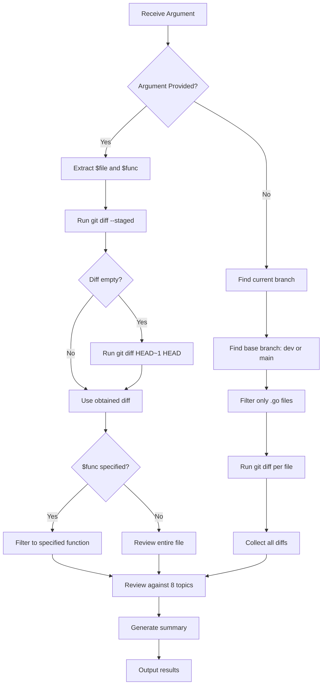

## 📋 Skill Description

**Skill Name:** Go Code Review

**Purpose:** Review Go code according to 8 main topics: Error Handling, SQL Injection, Panic Check, Unclosed Transactions/Resources, Memory Leak, Context Propagation, Debug Code Cleanup, and Unit Test Presence — applied to the open file or staged changes from Git.

**Invocation Format:**
```bash
# Review entire file
go-review api/admin/foo/handler.go

# Review specific function
go-review api/admin/foo/handler.go::CreateHandler

# Review all changed files in current branch
go-review
```

---

## 📚 Table of Contents

1. [Introduction](#1-introduction)
2. [Definitions](#2-definitions)
3. [Review Topics](#3-review-topics)
4. [Review Workflow](#4-review-workflow)
5. [Example File Structure](#5-example-file-structure)
6. [Detailed Review Topics](#6-detailed-review-topics)
7. [Unit Test Presence](#7-unit-test-presence)
8. [Root Cause Analysis (RCA) Template](#8-root-cause-analysis-rca-template)
9. [Review Checklist](#9-review-checklist)
10. [Summary](#10-summary)

---

## 1. Introduction

### What is it?

The Go Code Review Skill is an automated tool for checking Go code quality, covering critical issues often found in production environments that can lead to security vulnerabilities, performance degradation, and system instability.

### How many modes are there?

| Mode | Description | Invocation |
|------|-------------|------------|
| **Full File Review** | Review the entire specified file | `go-review path/to/file.go` |
| **Function-Specific Review** | Review only the specified function | `go-review path/to/file.go::FunctionName` |
| **Branch Review** | Review all changed files in the current branch | `go-review` (no arguments) |

---

## 2. Definitions

| Term | Definition |
|------|------------|
| **Critical Issue** | An issue that must be fixed before merging because it can cause system failure or security vulnerabilities |
| **Warning** | An issue that should be fixed to prevent future problems |
| **Root Cause** | The underlying cause of a problem, which must be addressed to prevent recurrence |
| **Context Propagation** | Passing Context between functions to preserve timeout, cancellation, and request-scoped values |
| **Goroutine Leak** | A goroutine that is created but never terminated, leading to memory leakage |
| **Parameterized Query** | Using placeholders in SQL queries to prevent SQL Injection |

---

## 3. Review Topics

| # | Topic | Priority | Description |
|---|-------|----------|-------------|
| 1 | Error Handling | 🔴 Critical | Proper error handling, never ignore errors |
| 2 | SQL Injection | 🔴 Critical | Use parameterized queries to prevent SQL Injection |
| 3 | Panic Check | 🔴 Critical | Prevent and handle potential panics |
| 4 | Unclosed Transactions/Resources | 🔴 Critical | Close resources after use |
| 5 | Memory Leak | 🟡 Warning | Potential memory leak risks |
| 6 | Context Propagation | 🟡 Warning | Correct propagation of Context |
| 7 | Debug Code Cleanup | 🟡 Warning | Remove debug code |
| 8 | Unit Test Presence | 🟡 Warning | Unit test coverage |

---

## 4. Review Workflow



---

## 5. Example File Structure

```
icmongolang/
├── pkg/
│   ├── helpers/
│   │   ├── iot.go          # Alarm logic
│   │   └── format.go       # Helper functions (time, string, random)
│   ├── mqtt/
│   │   └── client.go       # MQTT client with GetDataFromTopic
│   ├── influxdb/
│   │   └── client.go       # InfluxDB client
│   └── redis/
│       └── redis_conn.go   # Redis client + Cache interface
├── internal/
│   ├── mqtt/
│   │   ├── delivery/http/
│   │   │   ├── handler.go
│   │   │   └── routes.go
│   │   ├── presenter/
│   │   │   └── presenter.go
│   │   └── usecase/
│   │       └── usecase.go
│   ├── influxdb/
│   │   ├── delivery/http/
│   │   │   ├── handler.go
│   │   │   └── routes.go
│   │   ├── presenter/
│   │   │   └── presenter.go
│   │   └── usecase/
│   │       └── usecase.go
│   ├── alarm/
│   │   ├── delivery/http/
│   │   │   ├── handler.go
│   │   │   └── routes.go
│   │   ├── repository/
│   │   │   └── alarm_log_repo.go
│   │   └── usecase/
│   │       └── usecase.go
│   └── server/
│       ├── handlers.go
│       └── server.go
└── cmd/
    └── api/
        └── main.go
```

---

## 6. Detailed Review Topics

### 6.1 Error Handling 🔴

#### What is it?
Error handling in the Go language, a critical part that helps the system correctly handle failure scenarios.

#### How many patterns?
| Pattern | Description | Example |
|---------|-------------|---------|
| **Ignore** | Use `_` to ignore error | `_ = doSomething()` |
| **Log Only** | Log error but do not return | `log.Error(err)` |
| **Wrap & Return** | Wrap error and return it | `fmt.Errorf("context: %w", err)` |
| **Handle & Continue** | Handle error and continue execution | `if err != nil { /* handle */ }` |

#### Why use it?
- Prevent nil pointer dereference
- Provide sufficient information for debugging
- Maintain correctness of business logic
- Prevent data corruption

#### Benefits
- More stable system
- Easier debugging with stack traces
- Clear error messages for users
- Reduced troubleshooting time

#### Cautions
- Never ignore errors outright
- Do not log the same error redundantly
- Do not expose internal error details to clients

#### Advantages
- High system reliability
- Easy to trace issues
- Supports graceful degradation

#### Disadvantages
- Code may become longer
- Requires careful handling

#### Prohibitions
- ❌ Do not use `_` to ignore errors
- ❌ Do not `panic` in production code
- ❌ Do not return `nil, nil` when an error occurs

#### Key Comment

**English:**
> Always handle errors explicitly. Never ignore an error using `_`. Use `fmt.Errorf("...: %w", err)` to wrap errors with context. Log errors at the appropriate level and return them to the caller when necessary.

**ภาษาไทย (Thai):**
> จัดการ error อย่างชัดเจนเสมอ อย่า ignore error โดยใช้ `_` ใช้ `fmt.Errorf("...: %w", err)` เพื่อเพิ่มบริบทให้ error Log error ในระดับที่เหมาะสม และส่งต่อ error กลับไปยัง caller เมื่อจำเป็น

---

### 6.2 SQL Injection 🔴

#### What is it?
A security vulnerability caused by directly using user input in SQL queries.

#### How many patterns?
| Pattern | Description | Example |
|---------|-------------|---------|
| **Direct Concatenation** | Concatenate input into query | `"SELECT * FROM users WHERE id = " + id` |
| **fmt.Sprintf** | Use Sprintf to build query | `fmt.Sprintf("SELECT * FROM users WHERE id = %s", id)` |
| **Parameterized Query** | Use placeholders | `db.Where("id = ?", id)` |

#### Why use it?
- Prevent SQL Injection attacks
- Protect users' sensitive data
- Comply with security standards

#### Benefits
- System is secure against SQL Injection
- User data is protected
- Reduced risk of attacks

#### Cautions
- Always use parameterized queries
- Validate input before using it
- Use ORMs that support parameterized queries

#### Advantages
- Safe from SQL Injection
- Code is easier to read
- Supports complex queries

#### Disadvantages
- Need to learn parameterized query syntax
- Slight overhead possible

#### Prohibitions
- ❌ Do not use `fmt.Sprintf` to build SQL queries
- ❌ Do not use string concatenation to build SQL queries
- ❌ Do not accept user input without sanitization

#### Key Comment

**English:**
> Always use parameterized queries. Never concatenate user input directly into SQL strings. Use `db.Where("id = ?", id)` or `db.Raw("SELECT ... WHERE id = ?", id)`.

**ภาษาไทย:**
> ใช้ parameterized query ทุกครั้ง อย่า concatenate input จาก user ลงใน SQL string โดยตรง ใช้ `db.Where("id = ?", id)` หรือ `db.Raw("SELECT ... WHERE id = ?", id)`

---

### 6.3 Panic Check 🔴

#### What is it?
Checking for points where a panic may occur in the program and handling panics appropriately.

#### How many patterns?
| Pattern | Description | Example |
|---------|-------------|---------|
| **Unchecked Panic** | Panic without handling | `panic("error")` |
| **Recovered Panic** | Use recover to catch panic | `defer func() { recover() }()` |
| **Nil Pointer** | Dereferencing a nil pointer | `var x *T; x.Method()` |
| **Type Assertion** | Unchecked type assertion | `v := x.(string)` |

#### Why use it?
- Prevent system crashes
- Enable graceful shutdown
- Maintain system stability

#### Benefits
- System does not crash on panic
- Panics can be logged for analysis
- Users receive appropriate error messages

#### Cautions
- Use panic only in cases that cannot be recovered
- Use recover only in the goroutine where panic occurs
- Do not use panic for control flow

#### Advantages
- Stable system
- Fast detection and resolution of issues
- Supports graceful degradation

#### Disadvantages
- Using recover may hide bugs
- Must be careful in panic handling

#### Prohibitions
- ❌ Do not use panic in business logic
- ❌ Do not use recover without logging
- ❌ Do not use panic for control flow

#### Key Comment

**English:**
> Avoid using `panic()` in production code. Always check for nil pointers before dereferencing. Use `recover()` only at the top level of goroutines to log and gracefully handle unexpected panics.

**ภาษาไทย:**
> หลีกเลี่ยงการใช้ `panic()` ใน production code ตรวจสอบ nil pointer ก่อนเรียกใช้เสมอ ใช้ `recover()` เฉพาะในระดับบนสุดของ goroutine เพื่อ log และจัดการ panic ที่ไม่คาดคิด

---

### 6.4 Unclosed Transactions / Resources 🔴

#### What is it?
Opening resources (DB connections, files, HTTP responses) without closing them after use.

#### How many patterns?
| Pattern | Description | Example |
|---------|-------------|---------|
| **DB Transaction** | Transaction not closed | `tx := db.Begin()` |
| **HTTP Response** | Response body not closed | `resp, _ := http.Get(url)` |
| **File** | File not closed | `f, _ := os.Open("file.txt")` |
| **Database Rows** | Rows not closed after query | `rows, _ := db.Query(sql)` |

#### Why use it?
- Prevent resource leaks
- Maintain system performance
- Prevent exhaustion of connection pools

#### Benefits
- Efficient resource usage
- No connection leaks
- High system stability

#### Cautions
- Always use `defer` to close resources
- Check errors after commit/rollback
- Close resources in correct order

#### Advantages
- Low resource consumption
- No memory leaks
- Stable system

#### Disadvantages
- Must be careful in closing resources
- May forget to close in some cases

#### Prohibitions
- ❌ Do not open a resource without closing it
- ❌ Do not use `defer` after the resource has already been used
- ❌ Do not ignore errors when closing resources

#### Key Comment

**English:**
> Always close resources using `defer` immediately after opening. For transactions, use `defer tx.Rollback()` and call `tx.Commit()` on success. For HTTP responses, always `defer resp.Body.Close()`.

**ภาษาไทย:**
> ปิด resources โดยใช้ `defer` ทันทีหลังจากเปิด สำหรับ transaction ใช้ `defer tx.Rollback()` และเรียก `tx.Commit()` เมื่อสำเร็จ สำหรับ HTTP response ต้อง `defer resp.Body.Close()` เสมอ

---

### 6.5 Memory Leak 🟡

#### What is it?
A situation where a program keeps using increasing amounts of memory without releasing it when no longer needed.

#### How many patterns?
| Pattern | Description | Example |
|---------|-------------|---------|
| **Goroutine Leak** | Goroutines that never terminate | `go func() { for {} }()` |
| **Ticker Leak** | Ticker not stopped | `ticker := time.NewTicker(time.Second)` |
| **Timer Leak** | Timer not stopped | `timer := time.NewTimer(time.Second)` |
| **Channel Block** | Channel not drained/closed | `ch := make(chan int); <-ch` |
| **Slice/Map Alloc** | Large allocations in loops | `for { s := make([]int, 1000000) }` |

#### Why use it?
- Prevent memory leaks
- Maintain system performance
- Prevent OOM (Out-Of-Memory) crashes

#### Benefits
- Low memory usage
- No OOM crashes
- Stable system

#### Cautions
- Use context to control goroutines
- Stop tickers/timers when no longer used
- Close channels when no longer needed

#### Advantages
- Low memory usage
- No OOM crashes
- Stable system

#### Disadvantages
- Must be careful in managing goroutines
- May forget to stop tickers/timers

#### Prohibitions
- ❌ Do not create goroutines without control
- ❌ Do not create tickers/timers without stopping
- ❌ Do not create channels without closing

#### Key Comment

**English:**
> Always control goroutine lifecycle using context and wait groups. Stop tickers and timers using `defer ticker.Stop()`. Close channels when they are no longer needed to avoid blocking.

**ภาษาไทย:**
> ควบคุม lifecycle ของ goroutine โดยใช้ context และ wait groups เสมอ หยุด ticker และ timer โดยใช้ `defer ticker.Stop()` ปิด channel เมื่อไม่ต้องการใช้เพื่อหลีกเลี่ยงการ block

---

### 6.6 Context Propagation 🟡

#### What is it?
Passing Context between functions to preserve timeout, cancellation, and request-scoped values.

#### How many patterns?
| Pattern | Description | Example |
|---------|-------------|---------|
| **Background Context** | Use context.Background() | `ctx := context.Background()` |
| **TODO Context** | Use context.TODO() | `ctx := context.TODO()` |
| **WithCancel** | Create a cancellable context | `ctx, cancel := context.WithCancel(parent)` |
| **WithTimeout** | Create a context with timeout | `ctx, cancel := context.WithTimeout(parent, time.Second)` |

#### Why use it?
- Preserve timeout and cancellation
- Pass request-scoped values (tracing, authentication)
- Prevent goroutine leaks

#### Benefits
- Faster system response
- Ability to cancel long-running requests
- Support for distributed tracing

#### Cautions
- Do not use context.Background() in production code
- Pass ctx to all functions that need it
- Use WithTimeout/WithCancel to control lifecycle

#### Advantages
- Flexible system
- Lifecycle control
- Distributed tracing support

#### Disadvantages
- Must pass ctx through many functions
- May pass ctx unnecessarily

#### Prohibitions
- ❌ Do not use context.Background() in production code
- ❌ Do not use context.TODO() in production code
- ❌ Do not store ctx in structs

#### Key Comment

**English:**
> Always propagate context from the caller. Never use `context.Background()` or `context.TODO()` in production code. Use `db.WithContext(ctx)` for GORM and pass context to all downstream calls.

**ภาษาไทย:**
> ส่งต่อ context จาก caller เสมอ อย่าใช้ `context.Background()` หรือ `context.TODO()` ใน production code ใช้ `db.WithContext(ctx)` สำหรับ GORM และส่ง context ไปยังทุกการเรียก downstream

---

### 6.7 Debug Code Cleanup 🟡

#### What is it?
Removing code used for debugging, commented-out code, and hardcoded values that should not exist in production.

#### How many patterns?
| Pattern | Description | Example |
|---------|-------------|---------|
| **Print Debug** | Use fmt.Println for debugging | `fmt.Println("debug:", value)` |
| **Log Debug** | Use log.Println for debugging | `log.Println("debug:", value)` |
| **Comment Code** | Code left commented out | `// doSomething()` |
| **TODO Comment** | Pending TODO comments | `// TODO: fix this` |
| **Hardcoded Test** | Hardcoded values for testing | `if env == "test" { ... }` |

#### Why use it?
- Clean and readable code
- No unnecessary noise
- Prevent accidental use of debug code in production

#### Benefits
- Clean and readable code
- Reduced risk of using debug code
- Increased system reliability

#### Cautions
- Remove commented-out code
- Remove unnecessary TODO comments
- Use environment variables instead of hardcoded values

#### Advantages
- Readable code
- Reduced risk of using debug code
- Increased system reliability

#### Disadvantages
- May remove still-needed code
- Must be careful when removing

#### Prohibitions
- ❌ Do not commit debug code to production
- ❌ Do not keep hardcoded test values
- ❌ Do not leave commented-out code in production

#### Key Comment

**English:**
> Remove all debug print statements, commented-out code, and TODO comments before merging to production. Use proper logging instead of `fmt.Println`. Extract hardcoded values to configuration.

**ภาษาไทย:**
> ลบ debug print statements, comment-out code, และ TODO comment ทั้งหมดก่อน merge ไป production ใช้ logging แทน `fmt.Println` แยก hardcoded values ไปไว้ใน configuration

---

## 7. Unit Test Presence

### What is it?
Checking whether added or modified functions have corresponding Unit Tests.

### How many patterns?
| Pattern | Description | Example |
|---------|-------------|---------|
| **Happy Path** | Test normal cases | `TestFunction_Success` |
| **Error Path** | Test error cases | `TestFunction_Error` |
| **Edge Case** | Test boundary cases | `TestFunction_EdgeCase` |
| **Integration** | Test interaction with other systems | `TestIntegration_Function` |

#### Why use it?
- Verify code correctness
- Prevent regression
- Serve as code documentation

#### Benefits
- Reliable code
- Fewer bugs in production
- Increased confidence in refactoring

#### Cautions
- Write tests covering all cases
- Use mocks for dependencies
- Run tests before every deployment

#### Advantages
- Reliable code
- Fewer bugs in production
- Increased confidence in refactoring

#### Disadvantages
- Time-consuming to write tests
- Tests require maintenance

#### Prohibitions
- ❌ Do not deploy without tests
- ❌ Do not use time.Sleep in tests
- ❌ Do not have interdependent tests

#### Key Comment

**English:**
> Every new or modified function should have corresponding unit tests. Cover happy path, error path, and edge cases. Use mocks for dependencies and run tests before every deployment.

**ภาษาไทย:**
> ทุกฟังก์ชันที่ถูกเพิ่มหรือแก้ไขควรมี unit test รองรับ ครอบคลุม happy path, error path, และ edge cases ใช้ mock สำหรับ dependencies และรัน test ก่อน deploy ทุกครั้ง

---

## 8. Root Cause Analysis (RCA) Template

### 8.1 General Problem Information

| Item | Details |
|------|---------|
| **Problem / Incident Name** | |
| **Document Number (if any)** | |
| **Date of Occurrence** | |
| **RCA Date** | |
| **Reporter** | |
| **Analysis Team (Participants)** | |
| **Department / Unit Involved** | |

---

### 8.2 Define the Problem

> **Objective:** Clearly specify what the problem is, when and where it occurred, who was involved, and what the impact was.

- **What is the problem?** (Describe specifically, not vaguely)

- **Where / in which step did it occur?**

- **When did it occur?** (Date, time, or frequency)

- **Who discovered it / was affected?**

- **Impact** (Quantitative and qualitative, e.g., costs, wasted time, customer dissatisfaction, etc.)

- **Severity** (☐ Low ☐ Medium ☐ High ☐ Critical)

---

### 8.3 Gather Data

> **Objective:** Collect evidence, data, statistics, and relevant facts for analysis.

| Data Type | Details / Evidence |
|-----------|---------------------|
| Quantitative data (numbers, statistics) | |
| Qualitative data (testimonies, complaints) | |
| Physical evidence (photos, samples, logs) | |
| System / database data | |
| Operation logs / procedures | |
| Interviews with involved persons | |
| Other data | |

---

### 8.4 Cause Analysis

> **Tools:** Fishbone Diagram and 5 Whys technique  
> **Guidance:** Start with brainstorming all possible causes in each category. Then select the most likely cause(s) and apply 5 Whys to dig down to the root.

#### 8.4.1 Fishbone Diagram

List possible causes in each category (categories can be adjusted as appropriate).

| Category | Possible Causes |
|----------|-----------------|
| **Man** <br>(skills, knowledge, attention, health, training) | |
| **Machine / Equipment** <br>(maintenance, setup, lifespan, accuracy) | |
| **Method** <br>(procedures, manuals, controls, inspections) | |
| **Material** <br>(quality, supplier, storage, delivery) | |
| **Environment** <br>(lighting, temperature, cleanliness, noise, layout) | |
| **Management / System** <br>(policies, communication, resources, motivation) | |
| **Other (specify)** | |

---

#### 8.4.2 Deep Analysis using 5 Whys

> **Select the most likely cause(s)** from the above analysis, then ask "Why?" repeatedly at least 5 times until the true root cause is found.

| Level | Question "Why?" | Answer |
|-------|-----------------|--------|
| **Why 1** | Why did (problem) happen? | |
| **Why 2** | Why did (answer from Why 1) happen? | |
| **Why 3** | Why did (answer from Why 2) happen? | |
| **Why 4** | Why did (answer from Why 3) happen? | |
| **Why 5** | Why did (answer from Why 4) happen? | |
| **(additional if needed)** | | |

> **Summarize the Root Cause(s) obtained from the analysis:**

---

### 8.5 Root Cause Summary

> **Clearly state what the root cause(s) are** (may be more than one).

| # | Root Cause | Category (Man/Machine/Method/Material/etc.) |
|---|------------|---------------------------------------------|
| 1. | | |
| 2. | | |
| 3. | | |

---

### 8.6 Corrective & Preventive Actions

> **Objective:** Define measures that address the root cause and prevent recurrence.  
> **Principle:** Measures must be **Specific, Measurable, Achievable, Relevant, Time-bound (SMART)**.

| # | Measure / Action | Responsible | Deadline | Status (Done/Pending) |
|---|------------------|-------------|----------|-----------------------|
| 1. | | | | |
| 2. | | | | |
| 3. | | | | |

- **Short-term measures (immediate fixes):**

- **Long-term measures (preventive):**

- **System / procedure changes (if any):**

- **Required training / communication:**

---

### 8.7 Follow-up

> **Objective:** Verify whether implemented measures are effective and prevent recurrence.

| Follow-up Activity | Timeline | Responsible | Evaluation Result |
|--------------------|----------|-------------|-------------------|
| Check after implementation | | | |
| Short-term follow-up (1 month) | | | |
| Long-term follow-up (3–6 months) | | | |
| Lesson Learned summary | | | |

---

### 8.8 Lessons Learned

> **What we learned from this incident and what should be improved overall.**

- 

---

### 8.9 Approval

| Role | Name - Surname | Signature | Date |
|------|---------------|-----------|------|
| RCA Presenter | | | |
| Approver (Executive) | | | |

---

### 8.10 References / Appendices (if any)

- [ ] Work instructions
- [ ] Previous records
- [ ] Photos / Videos
- [ ] Test reports
- [ ] Others (specify)

---

**Note:**  
- This template can be adjusted by adding/removing sections to suit the organization and nature of the problem.  
- Effective RCA requires **real data** and **participation from all involved teams**.  
- Avoid blaming individuals; focus on **processes and systems**.

---

## 9. Review Checklist

### 9.1 Error Handling
- [ ] Check for `_ = err` (should not exist)
- [ ] Check for `if err != nil` that does not return/log
- [ ] Check for reusing `err` variable in loops
- [ ] Check for error messages with sufficient context
- [ ] Check for error wrapping with `%w`

### 9.2 SQL Injection
- [ ] Check for `db.Raw(fmt.Sprintf(...))`
- [ ] Check for string concatenation in queries
- [ ] Check for parameterized queries
- [ ] Check for user input in `.sql` files

### 9.3 Panic Check
- [ ] Check for unnecessary use of `panic()`
- [ ] Check for nil pointer dereference
- [ ] Check for array/slice out-of-bounds
- [ ] Check for type assertion without checking `ok`
- [ ] Check for proper use of `recover()`

### 9.4 Unclosed Transactions / Resources
- [ ] Check that `db.Begin()` has `defer tx.Rollback()`
- [ ] Check that `http.Get()` / `client.Do()` has `defer resp.Body.Close()`
- [ ] Check that `os.Open()` / `os.Create()` has `defer file.Close()`
- [ ] Check that `rows.Close()` after `db.Query()`
- [ ] Check for lock acquisition without release

### 9.5 Memory Leak
- [ ] Check for goroutines without termination control
- [ ] Check for `time.NewTicker` without `defer ticker.Stop()`
- [ ] Check for `time.NewTimer` without `defer timer.Stop()`
- [ ] Check for channels not drained/closed
- [ ] Check for large slice/map allocations inside loops

### 9.6 Context Propagation
- [ ] Check for `context.Background()` instead of `ctx`
- [ ] Check for `context.TODO()` instead of `ctx`
- [ ] Check for passing `ctx` to GORM (`.WithContext(ctx)`)
- [ ] Check for passing `ctx` to HTTP calls
- [ ] Check for passing `ctx` to downstream services

### 9.7 Debug Code Cleanup
- [ ] Check for `fmt.Println()`, `fmt.Printf()`, `fmt.Print()`
- [ ] Check for unnecessary `log.Println()` / `log.Printf()`
- [ ] Check for commented-out code
- [ ] Check for pending TODOs
- [ ] Check for hardcoded test values

### 9.8 Unit Test Presence
- [ ] Check for `_test.go` file for added/modified functions
- [ ] Check test coverage (happy path, error path, edge case)
- [ ] Check for mocks for dependencies
- [ ] Check that tests are run before deployment

---

## 10. Summary
 