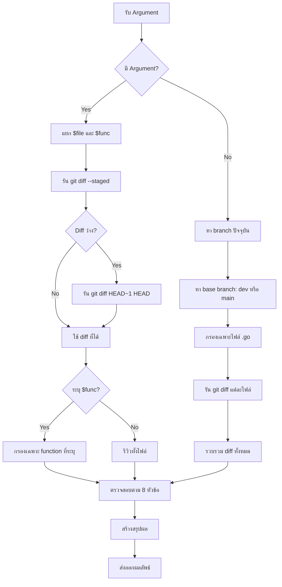

# Go Code Review Template - AI Skill

## 📋 คำอธิบาย Skill

**ชื่อ Skill:** Go Code Review

**วัตถุประสงค์:** ตรวจสอบ Go code ตาม 8 หัวข้อหลัก ได้แก่ Error Handling, SQL Injection, Panic Check, Unclosed Transactions/Resources, Memory Leak, Context Propagation, Debug Code Cleanup และ Unit Test Presence — ใช้กับไฟล์ที่เปิดอยู่ หรือ staged changes จาก Git

**รูปแบบการเรียกใช้:**
```bash
# รีวิวทั้งไฟล์
go-review api/admin/foo/handler.go

# รีวิวเฉพาะ function
go-review api/admin/foo/handler.go::CreateHandler

# รีวิวทุกไฟล์ที่เปลี่ยนแปลงใน branch ปัจจุบัน
go-review
```

---

## 📚 สารบัญ

1. [บทนำ (Introduction)](#1-บทนำ-introduction)
2. [บทนิยาม (Definitions)](#2-บทนิยาม-definitions)
3. [หัวข้อการตรวจสอบ (Review Topics)](#3-หัวข้อการตรวจสอบ-review-topics)
4. [Workflow การตรวจสอบ](#4-workflow-การตรวจสอบ)
5. [โครงสร้างไฟล์ตัวอย่าง](#5-โครงสร้างไฟล์ตัวอย่าง)
6. [รายละเอียดการตรวจสอบแต่ละหัวข้อ](#6-รายละเอียดการตรวจสอบแต่ละหัวข้อ)
7. [Unit Test Presence](#7-unit-test-presence)
8. [Root Cause Analysis (RCA) Template](#8-root-cause-analysis-rca-template)
9. [Checklist การตรวจสอบ](#9-checklist-การตรวจสอบ)
10. [สรุปภาพรวม (Summary)](#10-สรุปภาพรวม-summary)

---

## 1. บทนำ (Introduction)

### คืออะไร?

Go Code Review Skill เป็นเครื่องมือสำหรับตรวจสอบคุณภาพโค้ด Go โดยอัตโนมัติ ครอบคลุมประเด็นสำคัญที่มักพบใน Production Environment ซึ่งอาจนำไปสู่ปัญหาด้านความปลอดภัย ประสิทธิภาพ และความเสถียรของระบบ

### มีกี่แบบ?

| แบบ | รายละเอียด | การเรียกใช้ |
|-----|-----------|------------|
| **Full File Review** | ตรวจสอบทั้งไฟล์ที่ระบุ | `go-review path/to/file.go` |
| **Function-Specific Review** | ตรวจสอบเฉพาะ function ที่ระบุ | `go-review path/to/file.go::FunctionName` |
| **Branch Review** | ตรวจสอบทุกไฟล์ที่เปลี่ยนแปลงใน branch ปัจจุบัน | `go-review` (ไม่มี argument) |

---

## 2. บทนิยาม (Definitions)

| คำศัพท์ | นิยาม |
|--------|-------|
| **Critical Issue** | ปัญหาที่ต้องแก้ไขก่อน Merge เนื่องจากอาจทำให้ระบบล้มเหลวหรือมีช่องโหว่ด้านความปลอดภัย |
| **Warning** | ปัญหาที่ควรแก้ไขเพื่อป้องกันปัญหาในอนาคต |
| **Root Cause** | สาเหตุที่แท้จริงของปัญหา ซึ่งต้องถูกแก้ไขเพื่อป้องกันการเกิดซ้ำ |
| **Context Propagation** | การส่งต่อ Context ระหว่างฟังก์ชันเพื่อรักษา timeout, cancellation, และค่าใน request |
| **Goroutine Leak** | Goroutine ที่ถูกสร้างขึ้นแล้วไม่ถูกทำลาย ส่งผลให้หน่วยความจำรั่ว |
| **Parameterized Query** | การใช้ placeholders ใน SQL query เพื่อป้องกัน SQL Injection |

---

## 3. หัวข้อการตรวจสอบ (Review Topics)

| ลำดับ | หัวข้อ | Priority | คำอธิบาย |
|-------|-------|----------|----------|
| 1 | Error Handling | 🔴 Critical | การจัดการ error ที่ถูกต้อง ไม่ ignore error |
| 2 | SQL Injection | 🔴 Critical | การใช้ parameterized query ป้องกัน SQL Injection |
| 3 | Panic Check | 🔴 Critical | การป้องกันและจัดการ panic ที่อาจเกิดขึ้น |
| 4 | Unclosed Transactions/Resources | 🔴 Critical | การปิด resources หลังใช้งานเสร็จ |
| 5 | Memory Leak | 🟡 Warning | จุดเสี่ยงที่อาจทำให้หน่วยความจำรั่ว |
| 6 | Context Propagation | 🟡 Warning | การส่งต่อ Context อย่างถูกต้อง |
| 7 | Debug Code Cleanup | 🟡 Warning | การลบ code ที่ใช้ debug |
| 8 | Unit Test Presence | 🟡 Warning | ความครอบคลุมของ Unit Test |

---

## 4. Workflow การตรวจสอบ



---

## 5. โครงสร้างไฟล์ตัวอย่าง

```
icmongolang/
├── pkg/
│   ├── helpers/
│   │   ├── iot.go          # Alarm logic
│   │   └── format.go       # ฟังก์ชันช่วยเหลือ (time, string, random)
│   ├── mqtt/
│   │   └── client.go       # MQTT client พร้อม GetDataFromTopic
│   ├── influxdb/
│   │   └── client.go       # InfluxDB client
│   └── redis/
│       └── redis_conn.go   # Redis client + Cache interface
├── internal/
│   ├── mqtt/
│   │   ├── delivery/http/
│   │   │   ├── handler.go
│   │   │   └── routes.go
│   │   ├── presenter/
│   │   │   └── presenter.go
│   │   └── usecase/
│   │       └── usecase.go
│   ├── influxdb/
│   │   ├── delivery/http/
│   │   │   ├── handler.go
│   │   │   └── routes.go
│   │   ├── presenter/
│   │   │   └── presenter.go
│   │   └── usecase/
│   │       └── usecase.go
│   ├── alarm/
│   │   ├── delivery/http/
│   │   │   ├── handler.go
│   │   │   └── routes.go
│   │   ├── repository/
│   │   │   └── alarm_log_repo.go
│   │   └── usecase/
│   │       └── usecase.go
│   └── server/
│       ├── handlers.go
│       └── server.go
└── cmd/
    └── api/
        └── main.go
```

---

## 6. รายละเอียดการตรวจสอบแต่ละหัวข้อ

### 6.1 Error Handling 🔴

#### คืออะไร?
การจัดการ error ใน Go language ซึ่งเป็นส่วนสำคัญที่ช่วยให้ระบบสามารถ handle failure scenarios ได้อย่างถูกต้อง

#### มีกี่แบบ?
| แบบ | รายละเอียด | ตัวอย่าง |
|-----|-----------|---------|
| **Ignore** | ใช้ `_` เพื่อ ignore error | `_ = doSomething()` |
| **Log Only** | log error แต่ไม่ return | `log.Error(err)` |
| **Wrap & Return** | wrap error และ return กลับไป | `fmt.Errorf("context: %w", err)` |
| **Handle & Continue** | จัดการ error และทำงานต่อไป | `if err != nil { /* handle */ }` |

#### ทำไมต้องใช้?
- ป้องกัน nil pointer dereference
- ให้ข้อมูลที่เพียงพอในการ debug
- รักษาความถูกต้องของ business logic
- ป้องกัน data corruption

#### ประโยชน์ที่ได้รับ
- ระบบมีความเสถียรมากขึ้น
- Debug ง่ายขึ้นด้วย stack trace
- ผู้ใช้ได้รับ error message ที่ชัดเจน
- ลดเวลาการแก้ไขปัญหา

#### ข้อควรระวัง
- อย่า ignore error โดยเด็ดขาด
- อย่า log error ซ้ำซ้อนหลายครั้ง
- อย่า expose internal error details ไปยัง client

#### ข้อดี
- ระบบมีความน่าเชื่อถือสูง
- สามารถ追踪ปัญหาได้ง่าย
- รองรับ graceful degradation

#### ข้อเสีย
- โค้ดอาจยาวขึ้น
- ต้องใช้ความระมัดระวังในการจัดการ

#### ข้อห้าม
- ❌ ห้ามใช้ `_` เพื่อ ignore error
- ❌ ห้าม panic ใน production code
- ❌ ห้าม return nil, nil เมื่อเกิด error

#### จุดสำคัญ (Comment)

**English:**
> Always handle errors explicitly. Never ignore an error using `_`. Use `fmt.Errorf("...: %w", err)` to wrap errors with context. Log errors at the appropriate level and return them to the caller when necessary.

**ภาษาไทย:**
> จัดการ error อย่างชัดเจนเสมอ อย่า ignore error โดยใช้ `_` ใช้ `fmt.Errorf("...: %w", err)` เพื่อเพิ่มบริบทให้ error Log error ในระดับที่เหมาะสม และส่งต่อ error กลับไปยัง caller เมื่อจำเป็น

---

### 6.2 SQL Injection 🔴

#### คืออะไร?
ช่องโหว่ด้านความปลอดภัยที่เกิดจากการนำ input จาก user ไปใช้ใน SQL query โดยตรง

#### มีกี่แบบ?
| แบบ | รายละเอียด | ตัวอย่าง |
|-----|-----------|---------|
| **Direct Concatenation** | นำ input มา concatenate กับ query | `"SELECT * FROM users WHERE id = " + id` |
| **fmt.Sprintf** | ใช้ Sprintf เพื่อสร้าง query | `fmt.Sprintf("SELECT * FROM users WHERE id = %s", id)` |
| **Parameterized Query** | ใช้ placeholders | `db.Where("id = ?", id)` |

#### ทำไมต้องใช้?
- ป้องกันการโจมตีแบบ SQL Injection
- ปกป้องข้อมูลสำคัญของผู้ใช้
- ปฏิบัติตามมาตรฐานความปลอดภัย

#### ประโยชน์ที่ได้รับ
- ระบบปลอดภัยจาก SQL Injection
- ข้อมูลผู้ใช้ได้รับการปกป้อง
- ลดความเสี่ยงในการถูกโจมตี

#### ข้อควรระวัง
- ใช้ parameterized query ทุกครั้ง
- ตรวจสอบ input ก่อนใช้งาน
- ใช้ ORM ที่รองรับ parameterized query

#### ข้อดี
- ปลอดภัยจาก SQL Injection
- โค้ดอ่านง่ายขึ้น
- รองรับ query ที่ซับซ้อน

#### ข้อเสีย
- ต้องเรียนรู้ syntax ของ parameterized query
- อาจมี overhead เล็กน้อย

#### ข้อห้าม
- ❌ ห้ามใช้ `fmt.Sprintf` ในการสร้าง SQL query
- ❌ ห้ามใช้ string concatenation ในการสร้าง SQL query
- ❌ ห้ามรับ input จาก user โดยไม่ผ่านการ sanitize

#### จุดสำคัญ (Comment)

**English:**
> Always use parameterized queries. Never concatenate user input directly into SQL strings. Use `db.Where("id = ?", id)` or `db.Raw("SELECT ... WHERE id = ?", id)`.

**ภาษาไทย:**
> ใช้ parameterized query ทุกครั้ง อย่า concatenate input จาก user ลงใน SQL string โดยตรง ใช้ `db.Where("id = ?", id)` หรือ `db.Raw("SELECT ... WHERE id = ?", id)`

---

### 6.3 Panic Check 🔴

#### คืออะไร?
การตรวจสอบจุดที่อาจเกิด panic ในโปรแกรม และการจัดการ panic อย่างเหมาะสม

#### มีกี่แบบ?
| แบบ | รายละเอียด | ตัวอย่าง |
|-----|-----------|---------|
| **Unchecked Panic** | panic ที่ไม่มีการจัดการ | `panic("error")` |
| **Recovered Panic** | ใช้ recover เพื่อจับ panic | `defer func() { recover() }()` |
| **Nil Pointer** | การเรียกใช้ nil pointer | `var x *T; x.Method()` |
| **Type Assertion** | Type assertion ที่ไม่ตรวจสอบ | `v := x.(string)` |

#### ทำไมต้องใช้?
- ป้องกันระบบล่ม
- ให้ graceful shutdown
- รักษาความเสถียรของระบบ

#### ประโยชน์ที่ได้รับ
- ระบบไม่ล่มเมื่อเกิด panic
- สามารถ log panic เพื่อวิเคราะห์
- ผู้ใช้ได้รับ error message ที่เหมาะสม

#### ข้อควรระวัง
- ใช้ panic เฉพาะกรณีที่ไม่สามารถ recover ได้
- ใช้ recover เฉพาะใน goroutine ที่มี panic
- อย่าใช้ panic เพื่อ control flow

#### ข้อดี
- ระบบมีความเสถียร
- สามารถตรวจจับและแก้ไขปัญหาได้เร็ว
- รองรับ graceful degradation

#### ข้อเสีย
- การใช้ recover อาจซ่อน bug
- ต้องระมัดระวังในการจัดการ panic

#### ข้อห้าม
- ❌ ห้ามใช้ panic ใน business logic
- ❌ ห้ามใช้ recover โดยไม่ log
- ❌ ห้ามใช้ panic เพื่อ control flow

#### จุดสำคัญ (Comment)

**English:**
> Avoid using `panic()` in production code. Always check for nil pointers before dereferencing. Use `recover()` only at the top level of goroutines to log and gracefully handle unexpected panics.

**ภาษาไทย:**
> หลีกเลี่ยงการใช้ `panic()` ใน production code ตรวจสอบ nil pointer ก่อนเรียกใช้เสมอ ใช้ `recover()` เฉพาะในระดับบนสุดของ goroutine เพื่อ log และจัดการ panic ที่ไม่คาดคิด

---

### 6.4 Unclosed Transactions / Resources 🔴

#### คืออะไร?
การเปิด resources (DB connection, file, HTTP response) แล้วไม่ปิดเมื่อใช้งานเสร็จ

#### มีกี่แบบ?
| แบบ | รายละเอียด | ตัวอย่าง |
|-----|-----------|---------|
| **DB Transaction** | เปิด transaction แล้วไม่ปิด | `tx := db.Begin()` |
| **HTTP Response** | เปิด HTTP request แล้วไม่ปิด body | `resp, _ := http.Get(url)` |
| **File** | เปิดไฟล์แล้วไม่ปิด | `f, _ := os.Open("file.txt")` |
| **Database Rows** | Query แล้วไม่ปิด rows | `rows, _ := db.Query(sql)` |

#### ทำไมต้องใช้?
- ป้องกัน resource leak
- รักษาประสิทธิภาพของระบบ
- ป้องกัน connection pool หมด

#### ประโยชน์ที่ได้รับ
- ระบบใช้ทรัพยากรอย่างมีประสิทธิภาพ
- ไม่เกิด connection leak
- ระบบมีความเสถียรสูง

#### ข้อควรระวัง
- ใช้ defer เพื่อปิด resource ทุกครั้ง
- ตรวจสอบ error หลังจาก commit/rollback
- ปิด resource ในลำดับที่ถูกต้อง

#### ข้อดี
- ระบบใช้ทรัพยากรน้อย
- ไม่เกิด memory leak
- ระบบมีความเสถียร

#### ข้อเสีย
- ต้องระมัดระวังในการปิด resource
- อาจลืมปิด resource ในบางกรณี

#### ข้อห้าม
- ❌ ห้ามเปิด resource โดยไม่ปิด
- ❌ ห้ามใช้ defer หลังจากที่ resource ถูกใช้แล้ว
- ❌ ห้าม ignore error จากการปิด resource

#### จุดสำคัญ (Comment)

**English:**
> Always close resources using `defer` immediately after opening. For transactions, use `defer tx.Rollback()` and call `tx.Commit()` on success. For HTTP responses, always `defer resp.Body.Close()`.

**ภาษาไทย:**
> ปิด resources โดยใช้ `defer` ทันทีหลังจากเปิด สำหรับ transaction ใช้ `defer tx.Rollback()` และเรียก `tx.Commit()` เมื่อสำเร็จ สำหรับ HTTP response ต้อง `defer resp.Body.Close()` เสมอ

---

### 6.5 Memory Leak 🟡

#### คืออะไร?
การที่โปรแกรมใช้หน่วยความจำเพิ่มขึ้นเรื่อยๆ โดยไม่ถูกปลดปล่อยเมื่อไม่ใช้งานแล้ว

#### มีกี่แบบ?
| แบบ | รายละเอียด | ตัวอย่าง |
|-----|-----------|---------|
| **Goroutine Leak** | Goroutine ที่ไม่สิ้นสุด | `go func() { for {} }()` |
| **Ticker Leak** | Ticker ที่ไม่ถูก stop | `ticker := time.NewTicker(time.Second)` |
| **Timer Leak** | Timer ที่ไม่ถูก stop | `timer := time.NewTimer(time.Second)` |
| **Channel Block** | Channel ที่ไม่ถูก drain/close | `ch := make(chan int); <-ch` |
| **Slice/Map Alloc** | การ allocate ขนาดใหญ่ในลูป | `for { s := make([]int, 1000000) }` |

#### ทำไมต้องใช้?
- ป้องกันหน่วยความจำรั่ว
- รักษาประสิทธิภาพของระบบ
- ป้องกันระบบล่มจาก OOM

#### ประโยชน์ที่ได้รับ
- ระบบใช้หน่วยความจำน้อย
- ไม่เกิด OOM
- ระบบมีความเสถียร

#### ข้อควรระวัง
- ใช้ context เพื่อควบคุม goroutine
- stop ticker/timer เมื่อไม่ใช้งาน
- close channel เมื่อไม่ต้องการ

#### ข้อดี
- ระบบใช้หน่วยความจำน้อย
- ไม่เกิด OOM
- ระบบมีความเสถียร

#### ข้อเสีย
- ต้องระมัดระวังในการจัดการ goroutine
- อาจลืม stop ticker/timer

#### ข้อห้าม
- ❌ ห้ามสร้าง goroutine โดยไม่มีการควบคุม
- ❌ ห้ามสร้าง ticker/timer โดยไม่ stop
- ❌ ห้ามสร้าง channel โดยไม่ close

#### จุดสำคัญ (Comment)

**English:**
> Always control goroutine lifecycle using context and wait groups. Stop tickers and timers using `defer ticker.Stop()`. Close channels when they are no longer needed to avoid blocking.

**ภาษาไทย:**
> ควบคุม lifecycle ของ goroutine โดยใช้ context และ wait groups เสมอ หยุด ticker และ timer โดยใช้ `defer ticker.Stop()` ปิด channel เมื่อไม่ต้องการใช้เพื่อหลีกเลี่ยงการ block

---

### 6.6 Context Propagation 🟡

#### คืออะไร?
การส่งต่อ Context ระหว่างฟังก์ชันเพื่อรักษา timeout, cancellation, และค่าใน request

#### มีกี่แบบ?
| แบบ | รายละเอียด | ตัวอย่าง |
|-----|-----------|---------|
| **Background Context** | ใช้ context.Background() | `ctx := context.Background()` |
| **TODO Context** | ใช้ context.TODO() | `ctx := context.TODO()` |
| **WithCancel** | สร้าง context ที่สามารถยกเลิกได้ | `ctx, cancel := context.WithCancel(parent)` |
| **WithTimeout** | สร้าง context ที่มี timeout | `ctx, cancel := context.WithTimeout(parent, time.Second)` |

#### ทำไมต้องใช้?
- รักษา timeout และ cancellation
- ส่งต่อค่าที่อยู่ใน request (tracing, authentication)
- ป้องกัน goroutine leak

#### ประโยชน์ที่ได้รับ
- ระบบตอบสนองเร็วขึ้น
- สามารถ cancel request ที่ใช้เวลานาน
- รองรับ distributed tracing

#### ข้อควรระวัง
- อย่าใช้ context.Background() ใน production code
- ส่ง ctx ไปยังทุกฟังก์ชันที่ต้องการ
- ใช้ WithTimeout/WithCancel เพื่อควบคุม lifecycle

#### ข้อดี
- ระบบมีความยืดหยุ่น
- สามารถควบคุม lifecycle ได้
- รองรับ distributed tracing

#### ข้อเสีย
- ต้องส่ง ctx ผ่านหลายฟังก์ชัน
- อาจมีการส่ง ctx ที่ไม่จำเป็น

#### ข้อห้าม
- ❌ ห้ามใช้ context.Background() ใน production code
- ❌ ห้ามใช้ context.TODO() ใน production code
- ❌ ห้ามเก็บ ctx ใน struct

#### จุดสำคัญ (Comment)

**English:**
> Always propagate context from the caller. Never use `context.Background()` or `context.TODO()` in production code. Use `db.WithContext(ctx)` for GORM and pass context to all downstream calls.

**ภาษาไทย:**
> ส่งต่อ context จาก caller เสมอ อย่าใช้ `context.Background()` หรือ `context.TODO()` ใน production code ใช้ `db.WithContext(ctx)` สำหรับ GORM และส่ง context ไปยังทุกการเรียก downstream

---

### 6.7 Debug Code Cleanup 🟡

#### คืออะไร?
การลบโค้ดที่ใช้สำหรับ debug, comment-out, และ hardcoded values ที่ไม่ควรอยู่ใน production

#### มีกี่แบบ?
| แบบ | รายละเอียด | ตัวอย่าง |
|-----|-----------|---------|
| **Print Debug** | ใช้ fmt.Println เพื่อ debug | `fmt.Println("debug:", value)` |
| **Log Debug** | ใช้ log.Println เพื่อ debug | `log.Println("debug:", value)` |
| **Comment Code** | โค้ดที่ถูก comment ทิ้งไว้ | `// doSomething()` |
| **TODO Comment** | TODO comment ที่ค้าง | `// TODO: fix this` |
| **Hardcoded Test** | Hardcoded value สำหรับทดสอบ | `if env == "test" { ... }` |

#### ทำไมต้องใช้?
- โค้ดสะอาดและอ่านง่าย
- ไม่มี noise ที่ไม่จำเป็น
- ป้องกันการเผลอใช้ debug code ใน production

#### ประโยชน์ที่ได้รับ
- โค้ดสะอาดและอ่านง่าย
- ลดความเสี่ยงในการใช้งาน debug code
- เพิ่มความน่าเชื่อถือของระบบ

#### ข้อควรระวัง
- ลบโค้ดที่ถูก comment ทิ้ง
- ลบ TODO comment ที่ไม่จำเป็น
- ใช้ environment variable แทน hardcoded value

#### ข้อดี
- โค้ดอ่านง่าย
- ลดความเสี่ยงในการใช้งาน debug code
- เพิ่มความน่าเชื่อถือของระบบ

#### ข้อเสีย
- อาจลบโค้ดที่ยังจำเป็น
- ต้องระมัดระวังในการลบ

#### ข้อห้าม
- ❌ ห้าม commit debug code ไป production
- ❌ ห้ามเก็บ hardcoded value สำหรับทดสอบ
- ❌ ห้ามทิ้ง comment-out code ไว้ใน production

#### จุดสำคัญ (Comment)

**English:**
> Remove all debug print statements, commented-out code, and TODO comments before merging to production. Use proper logging instead of `fmt.Println`. Extract hardcoded values to configuration.

**ภาษาไทย:**
> ลบ debug print statements, comment-out code, และ TODO comment ทั้งหมดก่อน merge ไป production ใช้ logging แทน `fmt.Println` แยก hardcoded values ไปไว้ใน configuration

---

## 7. Unit Test Presence

### คืออะไร?
การตรวจสอบว่าฟังก์ชันที่ถูกเพิ่มหรือแก้ไขมี Unit Test รองรับหรือไม่

### มีกี่แบบ?
| แบบ | รายละเอียด | ตัวอย่าง |
|-----|-----------|---------|
| **Happy Path** | ทดสอบกรณีปกติ | `TestFunction_Success` |
| **Error Path** | ทดสอบกรณี error | `TestFunction_Error` |
| **Edge Case** | ทดสอบกรณีขอบ | `TestFunction_EdgeCase` |
| **Integration** | ทดสอบการทำงานร่วมกับระบบอื่น | `TestIntegration_Function` |

### ทำไมต้องใช้?
- ตรวจสอบความถูกต้องของโค้ด
- ป้องกัน regression
- เป็น documentation ของโค้ด

### ประโยชน์ที่ได้รับ
- โค้ดมีความน่าเชื่อถือ
- ลด bug ใน production
- เพิ่มความมั่นใจในการ refactor

### ข้อควรระวัง
- เขียน test ครอบคลุมทุกกรณี
- ใช้ mock เพื่อ test กับ dependency
- รัน test ก่อน deploy ทุกครั้ง

### ข้อดี
- โค้ดมีความน่าเชื่อถือ
- ลด bug ใน production
- เพิ่มความมั่นใจในการ refactor

### ข้อเสีย
- ใช้เวลาในการเขียน test
- ต้องบำรุงรักษา test

### ข้อห้าม
- ❌ ห้าม deploy โดยไม่มี test
- ❌ ห้ามใช้ time.Sleep ใน test
- ❌ ห้าม test ที่ depend กัน

### จุดสำคัญ (Comment)

**English:**
> Every new or modified function should have corresponding unit tests. Cover happy path, error path, and edge cases. Use mocks for dependencies and run tests before every deployment.

**ภาษาไทย:**
> ทุกฟังก์ชันที่ถูกเพิ่มหรือแก้ไขควรมี unit test รองรับ ครอบคลุม happy path, error path, และ edge cases ใช้ mock สำหรับ dependencies และรัน test ก่อน deploy ทุกครั้ง

---

## 8. Root Cause Analysis (RCA) Template

### 8.1 ข้อมูลทั่วไปของปัญหา

| รายการ | รายละเอียด |
|--------|------------|
| **ชื่อปัญหา / เหตุการณ์** | |
| **เลขที่เอกสาร (ถ้ามี)** | |
| **วันที่เกิดปัญหา** | |
| **วันที่จัดทำ RCA** | |
| **ผู้รายงานปัญหา** | |
| **ทีมวิเคราะห์ (ผู้ร่วมดำเนินการ)** | |
| **หน่วยงาน / แผนกที่เกี่ยวข้อง** | |

---

### 8.2 คำอธิบายปัญหา (Define the Problem)

> **วัตถุประสงค์:** ระบุให้ชัดเจนว่าปัญหาคืออะไร เกิดขึ้นเมื่อใด ที่ไหน ใครเกี่ยวข้อง และส่งผลกระทบอย่างไร

- **ปัญหาคืออะไร?** (อธิบายอย่างเจาะจง ไม่ใช้ภาษากว้าง ๆ)
  
- **เกิดขึ้นที่ไหน / ขั้นตอนใด?** 
  
- **เกิดขึ้นเมื่อใด?** (วันที่ เวลา หรือความถี่)
  
- **ใครเป็นผู้พบ / ได้รับผลกระทบ?** 
  
- **ผลกระทบที่เกิดขึ้น** (เชิงปริมาณและคุณภาพ เช่น ค่าใช้จ่าย เวลาสูญเสีย ความไม่พอใจลูกค้า ฯลฯ)
  
- **ความรุนแรงของปัญหา** (☐ ต่ำ ☐ ปานกลาง ☐ สูง ☐ วิกฤต)

---

### 8.3 การรวบรวมข้อมูล (Gather Data)

> **วัตถุประสงค์:** รวบรวมหลักฐาน ข้อมูล สถิติ และข้อเท็จจริงที่เกี่ยวข้องเพื่อใช้ประกอบการวิเคราะห์

| ประเภทข้อมูล | รายละเอียด / หลักฐาน |
|--------------|------------------------|
| ข้อมูลเชิงปริมาณ (ตัวเลข, สถิติ) | |
| ข้อมูลเชิงคุณภาพ (คำบอกเล่า, คำร้องเรียน) | |
| หลักฐานทางกายภาพ (ภาพถ่าย, ตัวอย่าง, บันทึก) | |
| ข้อมูลจากระบบ / ฐานข้อมูล | |
| บันทึกการทำงาน / ขั้นตอนปฏิบัติ | |
| การสัมภาษณ์ผู้ที่เกี่ยวข้อง | |
| ข้อมูลอื่น ๆ | |

---

### 8.4 การวิเคราะห์สาเหตุ (Cause Analysis)

> **เครื่องมือที่ใช้:** แผนภาพก้างปลา (Fishbone) และเทคนิค 5 Whys  
> **คำแนะนำ:** เริ่มจากการระดมสมองเพื่อหาสาเหตุที่เป็นไปได้ทั้งหมดในแต่ละหมวดหมู่ จากนั้นเลือกสาเหตุที่น่าสงสัยมากที่สุดมาทำ 5 Whys เพื่อเจาะลึกจนพบต้นตอ

#### 8.4.1 แผนภาพก้างปลา (Fishbone Diagram)

ให้ระบุสาเหตุที่เป็นไปได้ในแต่ละหมวดหมู่ (สามารถเพิ่มหมวดหมู่ตามความเหมาะสม)

| หมวดหมู่ | สาเหตุที่อาจเป็นไปได้ |
|----------|----------------------|
| **คน (Man)** <br>(ทักษะ, ความรู้, สมาธิ, สุขภาพ, การฝึกอบรม) | |
| **เครื่องจักร / อุปกรณ์ (Machine)** <br>(การบำรุงรักษา, การตั้งค่า, อายุการใช้งาน, ความแม่นยำ) | |
| **วิธีการทำงาน (Method)** <br>(ขั้นตอน, คู่มือ, การควบคุม, การตรวจสอบ) | |
| **วัตถุดิบ / วัสดุ (Material)** <br>(คุณภาพ, ผู้จัดจำหน่าย, การเก็บรักษา, การจัดส่ง) | |
| **สิ่งแวดล้อม (Environment)** <br>(แสงสว่าง, อุณหภูมิ, ความสะอาด, เสียง, การจัดวาง) | |
| **การจัดการ / ระบบ (Management)** <br>(นโยบาย, การสื่อสาร, ทรัพยากร, แรงจูงใจ) | |
| **อื่น ๆ (ระบุ)** | |

---

#### 8.4.2 การวิเคราะห์เจาะลึกด้วยเทคนิค 5 Whys

> **เลือกสาเหตุที่เป็นไปได้มากที่สุด** จากการวิเคราะห์ข้างต้น แล้วถาม "ทำไม?" ซ้ำ ๆ อย่างน้อย 5 ครั้งหรือจนกว่าจะพบต้นตอที่แท้จริง

| ระดับ | คำถาม "ทำไม?" | คำตอบ |
|-------|---------------|-------|
| **Why 1** | ทำไม (ปัญหา) ถึงเกิดขึ้น? | |
| **Why 2** | ทำไม (คำตอบจาก Why 1) ถึงเกิดขึ้น? | |
| **Why 3** | ทำไม (คำตอบจาก Why 2) ถึงเกิดขึ้น? | |
| **Why 4** | ทำไม (คำตอบจาก Why 3) ถึงเกิดขึ้น? | |
| **Why 5** | ทำไม (คำตอบจาก Why 4) ถึงเกิดขึ้น? | |
| **(เพิ่มเติมถ้าจำเป็น)** | | |

> **สรุปสาเหตุที่แท้จริง (Root Cause) ที่ได้จากการวิเคราะห์:**

---

### 8.5 สรุปสาเหตุที่แท้จริง (Root Cause Summary)

> **ระบุอย่างชัดเจนว่าต้นตอของปัญหาคืออะไร** (อาจมีมากกว่า 1 สาเหตุ)

| ลำดับ | สาเหตุที่แท้จริง (Root Cause) | ประเภท (คน/เครื่อง/วิธี/วัสดุ/ฯลฯ) |
|-------|-------------------------------|-----------------------------------|
| 1. | | |
| 2. | | |
| 3. | | |

---

### 8.6 แนวทางแก้ไขและป้องกัน (Corrective & Preventive Actions)

> **วัตถุประสงค์:** กำหนดมาตรการที่มุ่งแก้ที่ต้นตอ และป้องกันไม่ให้เกิดซ้ำ  
> **หลักการ:** มาตรการต้อง **Specific, Measurable, Achievable, Relevant, Time-bound (SMART)**

| ลำดับ | มาตรการ / แนวทางแก้ไข | ผู้รับผิดชอบ | กำหนดแล้วเสร็จ | สถานะ (ดำเนินการ/รอดำเนินการ) |
|-------|------------------------|-------------|----------------|-------------------------------|
| 1. | | | | |
| 2. | | | | |
| 3. | | | | |

- **มาตรการระยะสั้น (แก้ไขเฉพาะหน้า):**
  
- **มาตรการระยะยาว (ป้องกัน):**
  
- **การเปลี่ยนแปลงระบบ / ขั้นตอนปฏิบัติ (ถ้ามี):**
  
- **การฝึกอบรม / สื่อสารที่จำเป็น:**

---

### 8.7 การติดตามผล (Follow-up)

> **วัตถุประสงค์:** ตรวจสอบว่ามาตรการที่นำไปใช้ได้ผลจริงหรือไม่ ป้องกันการกลับมาเกิดซ้ำ

| กิจกรรมติดตาม | ระยะเวลา | ผู้รับผิดชอบ | ผลการประเมิน |
|---------------|----------|-------------|--------------|
| ตรวจสอบหลังดำเนินการ | | | |
| ติดตามผลระยะสั้น (1 เดือน) | | | |
| ติดตามผลระยะยาว (3-6 เดือน) | | | |
| สรุปบทเรียน (Lesson Learned) | | | |

---

### 8.8 บทเรียนที่ได้รับ (Lesson Learned)

> **สิ่งที่เราเรียนรู้จากเหตุการณ์นี้ และสิ่งที่ควรปรับปรุงในภาพรวม**

- 

---

### 8.9 การอนุมัติ (Approval)

| บทบาท | ชื่อ - นามสกุล | ลงนาม | วันที่ |
|--------|---------------|--------|--------|
| ผู้นำเสนอ RCA | | | |
| ผู้อนุมัติ (ผู้บริหาร) | | | |

---

### 8.10 เอกสารอ้างอิง / ภาคผนวก (ถ้ามี)

- [ ] คู่มือปฏิบัติงาน
- [ ] บันทึกข้อมูลเดิม
- [ ] รูปภาพ / วิดีโอประกอบ
- [ ] รายงานการทดสอบ
- [ ] อื่น ๆ (ระบุ)

---

**หมายเหตุ:**  
- Template นี้สามารถปรับเปลี่ยนเพิ่ม/ลดหัวข้อให้เหมาะกับองค์กรและลักษณะปัญหา  
- การทำ RCA ที่มีประสิทธิภาพต้องอาศัย **ข้อมูลจริง** และ **การมีส่วนร่วมของทีมที่เกี่ยวข้องทุกฝ่าย**  
- หลีกเลี่ยงการชี้นำหรือโทษบุคคล มุ่งเน้นที่ **กระบวนการและระบบ** เป็นสำคัญ

---

## 9. Checklist การตรวจสอบ

### 9.1 Error Handling
- [ ] ตรวจสอบการใช้ `_ = err` (ไม่ควรมี)
- [ ] ตรวจสอบ `if err != nil` ที่ไม่ return/log
- [ ] ตรวจสอบการใช้ตัวแปร `err` ซ้ำในลูป
- [ ] ตรวจสอบ error message ที่มีบริบทเพียงพอ
- [ ] ตรวจสอบการ wrap error ด้วย `%w`

### 9.2 SQL Injection
- [ ] ตรวจสอบการใช้ `db.Raw(fmt.Sprintf(...))`
- [ ] ตรวจสอบการใช้ string concatenation ใน query
- [ ] ตรวจสอบการใช้ parameterized query
- [ ] ตรวจสอบการรับ input จาก user ใน `.sql` files

### 9.3 Panic Check
- [ ] ตรวจสอบการใช้ `panic()` ที่ไม่จำเป็น
- [ ] ตรวจสอบ nil pointer dereference
- [ ] ตรวจสอบ array/slice out of bounds
- [ ] ตรวจสอบ type assertion โดยไม่ตรวจสอบ `ok`
- [ ] ตรวจสอบการใช้ `recover()` อย่างถูกต้อง

### 9.4 Unclosed Transactions / Resources
- [ ] ตรวจสอบ `db.Begin()` มี `defer tx.Rollback()`
- [ ] ตรวจสอบ `http.Get()` / `client.Do()` มี `defer resp.Body.Close()`
- [ ] ตรวจสอบ `os.Open()` / `os.Create()` มี `defer file.Close()`
- [ ] ตรวจสอบ `rows.Close()` หลังจาก `db.Query()`
- [ ] ตรวจสอบการ acquire lock แล้วไม่ release

### 9.5 Memory Leak
- [ ] ตรวจสอบ Goroutine ที่ไม่มีกลไกควบคุม
- [ ] ตรวจสอบ `time.NewTicker` ที่ไม่มี `defer ticker.Stop()`
- [ ] ตรวจสอบ `time.NewTimer` ที่ไม่มี `defer timer.Stop()`
- [ ] ตรวจสอบ Channel ที่ไม่มีการ drain/close
- [ ] ตรวจสอบการ allocate slice/map ขนาดใหญ่ในลูป

### 9.6 Context Propagation
- [ ] ตรวจสอบการใช้ `context.Background()` แทน `ctx`
- [ ] ตรวจสอบการใช้ `context.TODO()` แทน `ctx`
- [ ] ตรวจสอบการส่ง `ctx` ไปยัง GORM (`.WithContext(ctx)`)
- [ ] ตรวจสอบการส่ง `ctx` ไปยัง HTTP call
- [ ] ตรวจสอบการส่ง `ctx` ไปยัง downstream service

### 9.7 Debug Code Cleanup
- [ ] ตรวจสอบ `fmt.Println()`, `fmt.Printf()`, `fmt.Print()`
- [ ] ตรวจสอบ `log.Println()` / `log.Printf()` ที่ไม่จำเป็น
- [ ] ตรวจสอบ comment-out code
- [ ] ตรวจสอบ TODO ที่ค้าง
- [ ] ตรวจสอบ hardcoded values ที่ใช้ทดสอบ

### 9.8 Unit Test Presence
- [ ] ตรวจสอบไฟล์ `_test.go` สำหรับฟังก์ชันที่เพิ่ม/แก้ไข
- [ ] ตรวจสอบความครอบคลุมของ test (happy path, error path, edge case)
- [ ] ตรวจสอบการใช้ mock สำหรับ dependencies
- [ ] ตรวจสอบการรัน test ก่อน deploy

---

## 10. สรุปภาพรวม (Summary)

### English

**Go Code Review** is a comprehensive quality assurance process for Go code that covers 8 critical areas:

1. **Error Handling** - Ensuring all errors are properly handled and propagated
2. **SQL Injection** - Using parameterized queries to prevent security vulnerabilities
3. **Panic Check** - Preventing and gracefully handling runtime panics
4. **Unclosed Transactions/Resources** - Properly closing all resources after use
5. **Memory Leak** - Identifying and preventing memory leaks
6. **Context Propagation** - Correctly propagating context through the call chain
7. **Debug Code Cleanup** - Removing debug code before production deployment
8. **Unit Test Presence** - Ensuring adequate test coverage for new/changed code

**Benefits:**
- Improved system stability and reliability
- Enhanced security posture
- Reduced production incidents
- Better maintainability and code quality
- Faster debugging and issue resolution

**Best Practices:**
- Always review code before merging to dev branch
- Address critical issues before deployment
- Maintain comprehensive test coverage
- Document lessons learned from incidents

---

### ภาษาไทย

**Go Code Review** เป็นกระบวนการตรวจสอบคุณภาพโค้ด Go ที่ครอบคลุม 8 หัวข้อสำคัญ:

1. **Error Handling** - ตรวจสอบการจัดการ error ที่ถูกต้องและครบถ้วน
2. **SQL Injection** - ใช้ parameterized query เพื่อป้องกันช่องโหว่ด้านความปลอดภัย
3. **Panic Check** - ป้องกันและจัดการ runtime panic อย่างเหมาะสม
4. **Unclosed Transactions/Resources** - ปิด resources ทั้งหมดหลังใช้งานเสร็จ
5. **Memory Leak** - ระบุและป้องกันการรั่วไหลของหน่วยความจำ
6. **Context Propagation** - ส่งต่อ Context อย่างถูกต้องใน call chain
7. **Debug Code Cleanup** - ลบโค้ด debug ก่อน deploy ไป production
8. **Unit Test Presence** - ตรวจสอบความครอบคลุมของ test สำหรับโค้ดที่เพิ่ม/แก้ไข

**ประโยชน์ที่ได้รับ:**
- ระบบมีความเสถียรและน่าเชื่อถือมากขึ้น
- เพิ่มความปลอดภัยของระบบ
- ลดปัญหาที่เกิดขึ้นใน production
- โค้ดดูแลรักษาง่ายและมีคุณภาพสูงขึ้น
- แก้ไขปัญหาได้รวดเร็วขึ้น

**แนวปฏิบัติที่ดี:**
- ตรวจสอบโค้ดก่อน merge ไป dev branch ทุกครั้ง
- แก้ไขปัญหาที่สำคัญก่อน deploy
- รักษาความครอบคลุมของ test
- บันทึกบทเรียนที่ได้จากเหตุการณ์ต่างๆ

---

## 🔧 Pseudo Code for AI Agent

```python
# Go Code Review AI Agent - Pseudo Code

class GoCodeReviewAgent:
    def __init__(self):
        self.review_categories = [
            "Error Handling",
            "SQL Injection",
            "Panic Check",
            "Unclosed Transactions/Resources",
            "Memory Leak",
            "Context Propagation",
            "Debug Code Cleanup",
            "Unit Test Presence"
        ]
        self.critical_findings = []
        self.warning_findings = []
    
    def parse_arguments(self, args):
        """
        Parse user arguments to determine review scope
        
        Args:
            args: Command line arguments
                  - path/to/file.go
                  - path/to/file.go::FunctionName
                  - None (review all changed files)
        Returns:
            dict: {
                'file': str, 
                'function': str or None,
                'mode': 'file' | 'function' | 'branch'
            }
        """
        if not args:
            return {'mode': 'branch'}
        
        if '::' in args:
            file_path, func_name = args.split('::')
            return {'mode': 'function', 'file': file_path, 'function': func_name}
        
        return {'mode': 'file', 'file': args}
    
    def get_changed_files(self):
        """
        Get all changed .go files in current branch
        
        Returns:
            list: List of file paths
        """
        # git rev-parse --abbrev-ref HEAD
        # git diff dev...HEAD --name-only
        # Filter for .go files excluding _test.go
        pass
    
    def get_file_diff(self, file_path, base_branch='dev'):
        """
        Get diff for a specific file
        
        Args:
            file_path: Path to file
            base_branch: Base branch name
        Returns:
            str: Diff content
        """
        # git diff --staged -- {file_path}
        # If empty: git diff {base_branch}...HEAD -- {file_path}
        pass
    
    def extract_function_code(self, file_content, function_name):
        """
        Extract only the code for a specific function
        
        Args:
            file_content: Full file content
            function_name: Name of function to extract
        Returns:
            str: Function code block
        """
        # Find func {function_name} in file
        # Extract function body
        pass
    
    def review_error_handling(self, code):
        """Check for proper error handling"""
        findings = []
        # Check for ignored errors: _ = err
        # Check for nil error handling
        # Check for missing error context
        return findings
    
    def review_sql_injection(self, code):
        """Check for SQL injection vulnerabilities"""
        findings = []
        # Check for fmt.Sprintf in SQL queries
        # Check for string concatenation in SQL
        # Check for raw SQL without parameters
        return findings
    
    def review_panic_check(self, code):
        """Check for panic risks"""
        findings = []
        # Check for unprotected panic()
        # Check for nil pointer dereference
        # Check for type assertion without ok check
        return findings
    
    def review_unclosed_resources(self, code):
        """Check for unclosed resources"""
        findings = []
        # Check for db.Begin() without defer Rollback()
        # Check for http.Get() without defer Body.Close()
        # Check for os.Open() without defer Close()
        # Check for db.Query() without rows.Close()
        return findings
    
    def review_memory_leak(self, code):
        """Check for memory leak risks"""
        findings = []
        # Check for goroutines without lifecycle control
        # Check for tickers without Stop()
        # Check for timers without Stop()
        # Check for channels without drain/close
        return findings
    
    def review_context_propagation(self, code):
        """Check for proper context propagation"""
        findings = []
        # Check for context.Background() usage
        # Check for context.TODO() usage
        # Check for missing WithContext(ctx) in GORM
        # Check for context not passed to downstream calls
        return findings
    
    def review_debug_code(self, code):
        """Check for debug code in production"""
        findings = []
        # Check for fmt.Println, fmt.Printf
        # Check for unnecessary log.Println
        # Check for commented-out code
        # Check for TODO comments
        # Check for hardcoded test values
        return findings
    
    def review_unit_tests(self, file_path, changes):
        """Check for unit test coverage"""
        findings = []
        # Check if _test.go exists
        # Check if test covers new/changed functions
        # Check for happy path, error path, edge cases
        return findings
    
    def generate_report(self):
        """Generate final review report"""
        report = "## สรุปผลการ Code Review\n\n"
        
        for category in self.review_categories:
            report += f"### {category}\n"
            # Add findings for this category
            report += "\n"
        
        # Add summary statistics
        report += "### สรุปภาพรวม\n"
        report += f"- 🔴 Critical: {len(self.critical_findings)}\n"
        report += f"- 🟡 Warning: {len(self.warning_findings)}\n"
        
        return report
    
    def run(self, args):
        """Main execution flow"""
        # Parse arguments
        review_scope = self.parse_arguments(args)
        
        # Get code to review
        if review_scope['mode'] == 'branch':
            files = self.get_changed_files()
            for file_path in files:
                diff = self.get_file_diff(file_path)
                self.review_code(diff, file_path)
        elif review_scope['mode'] == 'function':
            file_path = review_scope['file']
            func_name = review_scope['function']
            diff = self.get_file_diff(file_path)
            func_code = self.extract_function_code(diff, func_name)
            self.review_code(func_code, file_path, func_name)
        else:  # file mode
            file_path = review_scope['file']
            diff = self.get_file_diff(file_path)
            self.review_code(diff, file_path)
        
        # Generate report
        return self.generate_report()
```

---

## 📝 Quick Reference Card

| Priority | Category | Check | Fix |
|----------|----------|-------|-----|
| 🔴 | Error Handling | `_ = err` | `if err != nil { return fmt.Errorf("...: %w", err) }` |
| 🔴 | SQL Injection | `fmt.Sprintf` in SQL | Use parameterized queries |
| 🔴 | Panic Check | `panic()` in business logic | Use error handling instead |
| 🔴 | Resources | Missing `defer` for Close | Add `defer resource.Close()` |
| 🟡 | Memory Leak | Goroutine without context | Use context for lifecycle control |
| 🟡 | Context | `context.Background()` | Use context from caller |
| 🟡 | Debug | `fmt.Println()` | Remove or use proper logging |
| 🟡 | Tests | Missing `_test.go` | Write unit tests |

---

## 🎯 Success Metrics

| Metric | Target | Measurement |
|--------|--------|-------------|
| Critical Issues Found | > 0 before merge | Number of critical issues reported |
| Warnings Found | > 0 before merge | Number of warnings reported |
| Code Quality Improvement | ↑ 20% | Reduce production incidents |
| Review Time | < 5 min per file | Time to complete review |
| Test Coverage | ↑ 80% | Percentage of code covered by tests |

---

**End of Template**