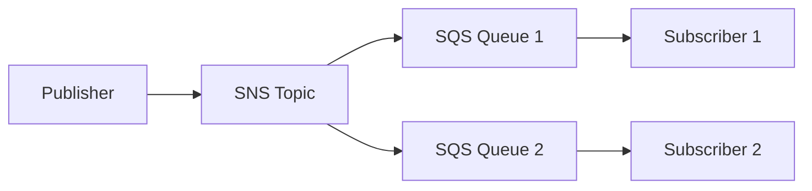

In Go, integrating with AWS SQS and SNS for a messaging architecture is well-supported through several robust libraries. These libraries abstract the AWS SDK complexity, allowing you to focus on your application's business logic. The choice of library often depends on whether you prefer a high-level, portable abstraction or direct, fine-grained control over the AWS services.

Here is a quick overview of the most popular Go libraries for working with SQS and SNS:

| Library | Description | Key Features |
| :--- | :--- | :--- |
| **Watermill**  | A Go library for building event-driven applications, with a dedicated AWS SQS/SNS pub/sub implementation. | High-level abstraction, handles automatic SQS queue creation and subscription for SNS topics, supports message routing and middleware . |
| **Go CDK (go-cloud)**  | A collection of portable cloud APIs, including `pubsub` with implementations for AWS (SNS/SQS), GCP, and Azure. | Write cloud-agnostic code using a uniform API for topics and subscriptions; supports URL-style resource opening . |
| **swarm**  | A library that adapts Go channels for various distributed queueing systems, including SQS and SNS. | Provides an idiomatic Go interface using `chan<- T` and `<-chan T`; supports at-least-once and at-most-once delivery policies . |
| **go-aws-msg**  | A library providing basic pub/sub primitives for building systems with SNS and SQS. | Inspired by `go-msg`, focuses on foundational building blocks for data pipelines . |

### 📬 Understanding SNS and SQS in Your Architecture

In a typical event-driven Go application, SNS and SQS are often used together to combine the strengths of both services. This architecture creates a highly decoupled and scalable system .

-   **SNS (Simple Notification Service)** is a fully managed **pub/sub messaging service**. It is designed to broadcast messages to a large number of subscribers (fan-out), which can include SQS queues, HTTP/HTTPS endpoints, Lambda functions, emails, and more .
-   **SQS (Simple Queue Service)** is a fully managed **message queuing service**. It acts as a reliable buffer between services, allowing for decoupled communication. A message in an SQS queue is typically consumed and deleted by a **single** consumer, making it ideal for task queues and background job processing .

When combined, an SNS topic can broadcast a single message to multiple SQS queues, where each queue can be processed independently by different microservices .

This diagram from the Watermill documentation illustrates this common pattern:



### 💻 Code Examples with Popular Libraries

Here's how you can implement this architecture using some of the popular Go libraries mentioned above.

#### Using Go CDK for Portability

The Go Cloud Development Kit (Go CDK) provides a portable API, making your code less dependent on specific AWS implementation details .

**Opening a Subscription (Consumer):**
```go
import (
    "context"
    "log"
    "gocloud.dev/pubsub"
    _ "gocloud.dev/pubsub/awssnssqs"
)

func main() {
    ctx := context.Background()
    // Open a subscription to an SQS queue
    sub, err := pubsub.OpenSubscription(ctx, 
        "awssqs://sqs.us-east-2.amazonaws.com/123456789012/myqueue?region=us-east-2")
    if err != nil {
        log.Fatal(err)
    }
    defer sub.Shutdown(ctx)

    // Receive messages
    msg, err := sub.Receive(ctx)
    if err != nil {
        log.Fatal(err)
    }
    log.Printf("Got message: %s\n", msg.Body)
    msg.Ack() // Acknowledge the message for deletion
}
```
*Source for example: Go CDK documentation *

#### Using Watermill for Rich Message Handling

Watermill offers a feature-rich environment with middleware and routing capabilities, making it suitable for complex event-driven applications .

**Subscribing to an SNS Topic (which creates an SQS queue automatically):**
```go
import (
    "context"
    "log"
    "github.com/ThreeDotsLabs/watermill"
    "github.com/ThreeDotsLabs/watermill-aws/sns"
    "github.com/ThreeDotsLabs/watermill/message"
)

func main() {
    logger := watermill.NewStdLogger(false, false)
    subscriberConfig := sns.SubscriberConfig{ /* AWS config */ }
    subscriber, err := sns.NewSubscriber(subscriberConfig, logger)
    if err != nil {
        panic(err)
    }

    // Subscribe to an SNS topic. This creates an SQS queue and subscribes it.
    messages, err := subscriber.Subscribe(context.Background(), "your-sns-topic-arn")
    if err != nil {
        panic(err)
    }

    for msg := range messages {
        log.Printf("received message: %s", string(msg.Payload))
        msg.Ack()
    }
}
```
*Source for concept: Watermill documentation *

#### Using swarm for Channel-Based Concurrency

`swarm` leverages Go's built-in concurrency primitives, making it feel natural for Go developers .

**Consuming Messages (Dequeue) with Channels:**
```go
import (
    "github.com/fogfish/swarm"
    "github.com/fogfish/swarm/broker/sqs"
    "github.com/fogfish/swarm/queue"
)

type Note struct {
    ID   string `json:"id"`
    Text string `json:"text"`
}

func main() {
    // Spawn a new instance of the messaging broker
    q := swarm.Must(sqs.New("name-of-the-queue"))

    // Create a pair of Go channels for consuming messages of type Note
    deq, ack := queue.Dequeue[Note](q)

    // Consume messages and then acknowledge them
    for msg := range deq {
        // ... process msg.Object ...
        ack <- msg
    }
}
```
*Source for example: swarm documentation *

### 🤔 How to Choose the Right Library

Your choice depends on your project's specific needs:

-   **For maximum portability** between cloud providers (e.g., AWS, GCP, Azure), **Go CDK** is the best choice .
-   **For complex, event-driven applications** requiring features like message routing, middleware, and a robust processing pipeline, **Watermill** is an excellent fit .
-   **For a highly idiomatic Go experience** using channels and if you value concurrency primitives, **swarm** is a great option .
-   **For simple use cases or if you need direct control** over the AWS SDK, using the official AWS SDK for Go directly is perfectly acceptable, though it requires more boilerplate.

I hope this gives you a clear starting point for building your messaging architecture in Go. If you can share more about your specific use case, I might be able to offer more tailored advice.