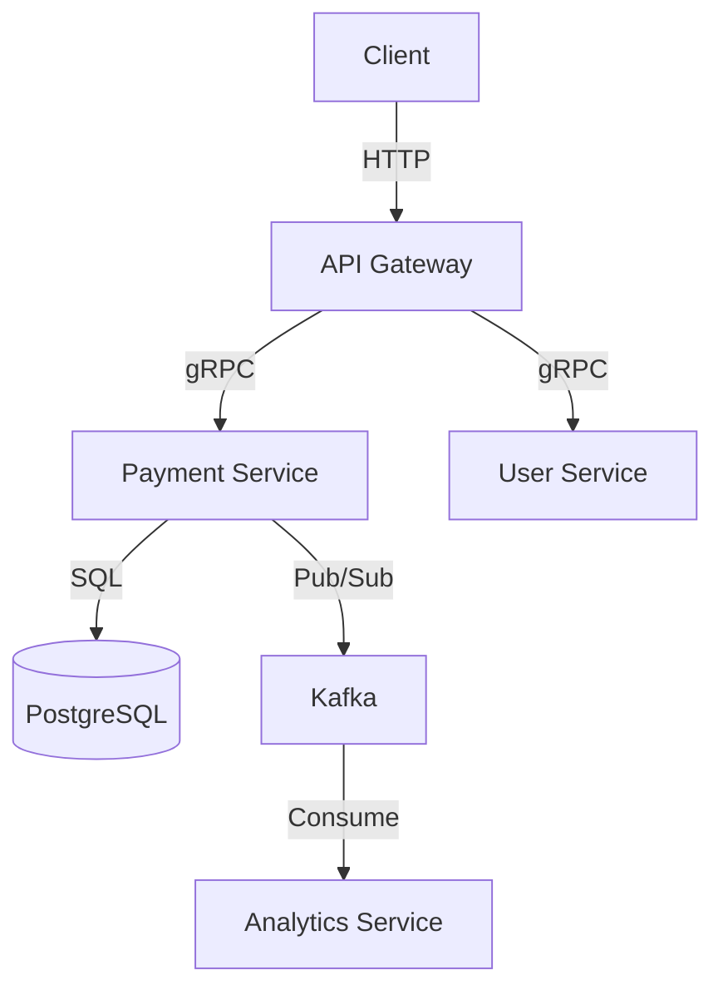

# 📕 เล่ม 5: คู่มือบำรุงรักษาและ Scale ฉบับสมบูรณ์
## The Complete Guide to Long-Term Maintenance & Scaling of Go Modules

> **เวอร์ชัน 1.0 (เมษายน 2026)**
> เอกสารต้นแบบสำหรับการดูแล Module ระยะยาว
> ครอบคลุม Maintenance → Performance → Scaling → Cost → Sustainability

---

# สารบัญ

**ภาคที่ 1: ปรัชญาและหลักการ**
1. [บทนำ — ทำไม Maintenance ยากกว่า Development](#บทที่-1-บทนำ)
2. [กฎ 10 ข้อของ Long-Term Maintenance](#บทที่-2-กฎ-10-ข้อ)
3. [Maintenance Maturity Model](#บทที่-3-maturity-model)

**ภาคที่ 2: Maintenance Routine**
4. [Daily / Weekly / Monthly Maintenance](#บทที่-4-maintenance-routine)
5. [Dependency Management](#บทที่-5-dependency-management)
6. [Security Patching Workflow](#บทที่-6-security-patching)
7. [Bug Triage และ Fix](#บทที่-7-bug-triage)
8. [Technical Debt Management](#บทที่-8-technical-debt)

**ภาคที่ 3: Performance Tuning**
9. [Profiling — CPU, Memory, Goroutine, Block](#บทที่-9-profiling)
10. [Optimization Techniques](#บทที่-10-optimization)
11. [Database Performance](#บทที่-11-database-performance)
12. [Cache Strategies](#บทที่-12-cache-strategies)
13. [Memory Management](#บทที่-13-memory-management)

**ภาคที่ 4: Scaling**
14. [Scaling Dimensions และ Decision Framework](#บทที่-14-scaling-dimensions)
15. [Vertical Scaling](#บทที่-15-vertical-scaling)
16. [Horizontal Scaling](#บทที่-16-horizontal-scaling)
17. [Database Scaling — Replica, Sharding, Partitioning](#บทที่-17-database-scaling)
18. [Cache Scaling](#บทที่-18-cache-scaling)
19. [Async Processing และ Queue](#บทที่-19-async-processing)

**ภาคที่ 5: Cost Optimization**
20. [Cloud Cost Analysis](#บทที่-20-cost-analysis)
21. [Right-Sizing และ Reserved Instances](#บทที่-21-right-sizing)
22. [Optimization Playbook](#บทที่-22-optimization-playbook)

**ภาคที่ 6: Long-Term Sustainability**
23. [Documentation as Code](#บทที่-23-documentation)
24. [Team Scaling และ Knowledge Transfer](#บทที่-24-team-scaling)
25. [Deprecation Cycle](#บทที่-25-deprecation)
26. [Modernization — Go Version, Dependencies](#บทที่-26-modernization)

**ภาคที่ 7: Governance และ Metrics**
27. [Health Metrics](#บทที่-27-health-metrics)
28. [SLA/SLO Management](#บทที่-28-sla-slo)

**ภาคที่ 8: Case Studies**
29. [Case Study: 5-Year Module Evolution](#บทที่-29-case-study)

**ภาคผนวก**
- [A. Maintenance Templates](#ภาคผนวก-a)
- [B. Runbooks](#ภาคผนวก-b)
- [C. Quick Reference Card](#ภาคผนวก-c)

---

# บทที่ 1: บทนำ — ทำไม Maintenance ยากกว่า Development

## 1.1 ความจริงที่โหดร้าย

```
Software Development Cycle:
─────────────────────────────────────────────
  Design    │████░░░░░░░░░░░░░░░░░░░│  10%
  Build     │██████░░░░░░░░░░░░░░░░░│  20%
  Maintain  │███████████████████████│  70%  ← ⚠️
─────────────────────────────────────────────
```

**ตัวเลขจริงจากงานวิจัย:**
- **60-80%** ของค่าใช้จ่าย software ใช้ใน maintenance
- **50%** ของ developer time หมดไปกับ "understanding" โค้ดเก่า
- **30%** ของ maintenance time แก้บั๊ก, **70%** เพิ่ม feature / ปรับปรุง

## 1.2 ปัญหาที่เจอใน Long-Term Maintenance

### 1.2.1 ปัญหา 10 ข้อที่พบบ่อย

| # | ปัญหา | ผลกระทบ | ตัวอย่างจริง |
|---|---|---|---|
| 1 | **Knowledge Loss** | ทีมลาออก, ไม่มีใครเข้าใจ | "ไม่มีใครรู้ว่า payment module ทำงานยังไง" |
| 2 | **Dependency Rot** | Version เก่า, ช่องโหว่ | Go 1.16, deps 2 ปี, 15 CVEs |
| 3 | **Performance Decay** | ช้าลงเรื่อยๆ | Query 100ms → 2s ใน 2 ปี |
| 4 | **Technical Debt** | เพิ่ม feature ยาก | 50 ไฟล์ต้องแก้ต่อ 1 feature |
| 5 | **Scaling Pain** | ระบบรับโหลดไม่ได้ | 10K user ทำงาน 100K user ล่ม |
| 6 | **Documentation Rot** | เอกสารไม่ตรงกับโค้ด | "มันไม่เหมือนที่ docs บอก" |
| 7 | **Test Rot** | Tests fail ไม่มีใครแก้ | 200 tests, 50 fail |
| 8 | **Cost Creep** | Cloud bill เพิ่ม 20%/ไตรมาส | $5K → $15K ใน 1 ปี |
| 9 | **Alert Fatigue** | Alert 1000/วัน ไม่มีใครดู | P1 alerts ถูก ignore |
| 10 | **Onboarding Time** | 2-3 เดือนสำหรับ dev ใหม่ | "ใช้เวลา 6 เดือนกว่าจะ productive" |

### 1.2.2 ตัวอย่างจริง: ระบบ 3 ปีที่เจอปัญหา

```
Year 1: Development
├── 5 developers
├── Ship fast
├── Tech debt สะสม
├── Doc น้อย
└── Coverage 40%

Year 2: Growth
├── 10 developers
├── Deploy 1/สัปดาห์
├── Bug เพิ่ม
├── Onboarding 2 เดือน
└── Coverage 45% (ไม่ progress)

Year 3: Crisis
├── 3 devs ลาออก
├── Ship ช้าลง 3x
├── MTTR 4 ชั่วโมง
├── Cloud cost 3x
├── Bug critical 3 ครั้ง
└── Coverage 42%

→ "Technical Bankruptcy"
```

## 1.3 สาเหตุหลักที่ Maintenance ยาก

### 1.3.1 Natural Entropy

```
           Entropy เพิ่มขึ้นตามเวลา
    Complex ─────────────────────► Complex++
    │                              │
    │  Clean code                  │  Spaghetti
    │  Fast                        │  Slow
    │  Tested                      │  Fragile
    │  Documented                  │  Mystery
    │                              │
    Year 1                        Year 3
```

**กฎข้อที่ 2 ของ Thermodynamics:** ระบบปิดมีแนวโน้มสู่ chaos

**Solution:** ต้องลงแรงต้าน entropy (maintenance) สม่ำเสมอ

### 1.3.2 Change Amplification

```
Change 1 บรรทัด ใน Domain:
├── แก้ไฟล์ Domain: 1
├── แก้ Use Case: 3
├── แก้ Infrastructure: 2
├── แก้ Handler: 4
├── แก้ Tests: 15
├── แก้ Docs: 2
└── รวม: 27 ไฟล์

→ 27x amplification
```

**Solution:** Architecture ที่ดี + Abstraction ที่ถูกต้อง

## 1.4 หลักคิดสำคัญ

```
"Maintenance ไม่ใช่เรื่องที่ทำ 'เมื่อมีเวลา'
 Maintenance คือ 'งานหลัก' ของทีม"

80/20 Rule ใน Maintenance:
├── 80% ของเวลา: Routine maintenance
│   ├── Dependency updates
│   ├── Bug fixes
│   ├── Security patches
│   └── Monitoring
└── 20% ของเวลา: Proactive improvements
    ├── Refactoring
    ├── Performance tuning
    ├── Documentation
    └── Test improvement
```

## 1.5 เป้าหมายของ Maintenance ที่ดี

| Goal | Metric | Target |
|---|---|---|
| **Zero Knowledge Loss** | Bus factor | ≥ 3 devs ต่อ module |
| **Zero Security Debt** | CVE count | 0 HIGH/CRITICAL |
| **Zero Performance Decay** | P95 latency trend | Flat หรือ better |
| **Zero Documentation Rot** | Doc freshness | ≤ 3 เดือน |
| **Zero Onboarding Pain** | Time to first PR | ≤ 1 สัปดาห์ |
| **Zero Cost Creep** | Cost per user | Flat หรือ better |
| **Zero Alert Fatigue** | Actionable alerts | > 80% |

---

# บทที่ 2: กฎ 10 ข้อของ Long-Term Maintenance

## กฎที่ 1: Automate Everything Possible

**อะไรที่ทำซ้ำ > 2 ครั้ง → Automate**

```yaml
# ตัวอย่าง: Automated dependency updates
# .github/workflows/deps.yml
name: Dependency Updates
on:
  schedule:
    - cron: '0 9 * * MON'  # ทุกวันจันทร์
jobs:
  update:
    runs-on: ubuntu-latest
    steps:
      - uses: actions/checkout@v4
      - uses: actions/setup-go@v5
        with: { go-version: '1.22' }
      
      - name: Update dependencies
        run: |
          go get -u ./...
          go mod tidy
      
      - name: Test
        run: go test ./...
      
      - name: Create PR
        uses: peter-evans/create-pull-request@v6
        with:
          title: "chore: weekly dependency updates"
          body: "Auto-generated by CI"
          branch: deps/weekly-update
```

**สิ่งที่ต้อง Automate:**
- Dependency updates
- Security scans
- Test runs
- Deploys
- Backups
- Documentation builds
- Health checks

## กฎที่ 2: Measure First, Optimize Second

**"You can't improve what you don't measure"**

```go
// ❌ ผิด: เดา performance
"ผมคิดว่า DB เป็น bottleneck"

// ✅ ถูก: วัดก่อน
// 1. Profile
pprof.StartCPUProfile(...)
defer pprof.StopCPUProfile(...)

// 2. Analyze
go tool pprof cpu.prof
(pprof) top 10

// 3. Optimize เฉพาะที่ช้า
```

**Metrics ที่ต้องวัดเสมอ:**
- Latency (P50, P95, P99)
- Throughput (RPS)
- Error rate
- CPU / Memory
- DB queries
- Cache hit rate

## กฎที่ 3: Test คือ Contract

**ทุกอย่างที่ขาย = ต้อง test**
**ทุกอย่างที่ test = ต้องมี contract**

```go
// Contract test
func TestPaymentAPI_Contract(t *testing.T) {
    // Consumer expect:
    // - POST /api/v1/payments with {order_id, amount}
    // - Return 201 with {id, status, amount}
    
    // ถ้า contract เปลี่ยน → test fail → ทีมรู้
}
```

## กฎที่ 4: Document Decisions, Not Just Code

**ADR (Architecture Decision Record) — ทุก decision ต้องมี:**

```markdown
# ADR-001: ใช้ decimal.Decimal แทน float64 สำหรับเงิน

## Status
Accepted (2026-04-15)

## Context
float64 มี precision issue:
- 0.1 + 0.2 = 0.30000000000000004
- สะสม rounding error ในบัญชี

## Decision
ใช้ github.com/shopspring/decimal สำหรับทุก monetary value

## Consequences
### Positive
- ไม่มี rounding error
- Audit ผ่าน

### Negative
- Performance: 2x ช้ากว่า float64
- Migration 6 สัปดาห์

## Alternatives Considered
1. big.Rat → ช้ากว่า decimal
2. int64 (satang) → ต้อง convert ตลอด
```

## กฎที่ 5: Version ทุกอย่าง

**Semantic Versioning สำหรับทุก artifact:**

| Artifact | Versioning |
|---|---|
| **Code** | Git tag v1.2.3 |
| **Container** | ghcr.io/x:v1.2.3 |
| **Schema** | Migration timestamp |
| **API** | /api/v1 |
| **Config** | Schema version |

## กฎที่ 6: Small, Frequent Changes

```
❌ Big Bang
├── 3 เดือน → 1 deploy
├── 10,000 บรรทัดเปลี่ยน
└── 90% chance ล่ม

✅ Continuous
├── ทุกวัน → deploy
├── 100 บรรทัดเปลี่ยน
└── 5% chance ล่ม
```

**ผลลัพธ์:**
- Bug ง่ายหา
- Rollback ง่าย
- Confidence สูง

## กฎที่ 7: Blameless Culture

**Postmortem ไม่ blame คน แต่ blame process:**

```markdown
❌ "Bob เขียนโค้ดผิด ทำให้ production ล่ม"
✅ "Process อนุญาตให้โค้ดที่ไม่มี test ขึ้น production ได้"

Action Item:
❌ "Bob ต้องระวังมากขึ้น"
✅ "เพิ่ม test coverage gate 80% ใน CI"
```

## กฎที่ 8: Observe Everything

**Three Pillars + Business Metrics:**

```go
// Metrics
metrics.PaymentCreated.Inc()

// Logs
logger.Info("payment created", "id", id)

// Traces
span.SetAttributes("payment.id", id)

// Business
revenueTracker.Add(amount)
```

## กฎที่ 9: Plan for Failure

**Assume everything will fail:**

| Component | Failure Mode | Recovery |
|---|---|---|
| **DB** | Primary down | Failover to replica |
| **Redis** | Cache miss | Fallback to DB |
| **Kafka** | Broker down | Retry + DLQ |
| **Service** | Pod crash | Auto-restart |
| **Region** | Outage | Multi-region failover |

## กฎที่ 10: Invest 20% in Improvement

**Google's 20% Rule (สำหรับ Maintenance):**

```
ทีมมี 100 ชั่วโมง/สัปดาห์:
├── 60 ชม.: Feature work
├── 20 ชม.: Bug fixes / Support
└── 20 ชม.: Improvement
    ├── Refactoring
    ├── Performance
    ├── Documentation
    ├── Test coverage
    └── Tooling
```

**ถ้าไม่ทำ → Technical debt เพิ่ม 20%/ไตรมาส**

---

# บทที่ 3: Maintenance Maturity Model

## 3.1 ระดับ 5 ของ Maturity

```
Level 5: Optimizing    ← Elite
├── Data-driven
├── Predictive
└── Continuous improvement

Level 4: Managed
├── Metrics-based
├── Proactive
└── SLO-driven

Level 3: Defined
├── Documented processes
├── Standardized
└── Repeatable

Level 2: Developing
├── Some automation
├── Some metrics
└── Ad-hoc fixes

Level 1: Initial       ← เริ่มต้น
├── Reactive only
├── Manual everything
└── Firefighting
```

## 3.2 Self-Assessment

| # | คำถาม | Level 1 | Level 3 | Level 5 |
|---|---|---|---|---|
| 1 | Test coverage | < 40% | 70% | 85%+ |
| 2 | Deploy frequency | เดือน | สัปดาห์ | หลายครั้ง/วัน |
| 3 | MTTR | วัน | ชั่วโมง | นาที |
| 4 | Onboarding time | 3 เดือน | 1 เดือน | 1 สัปดาห์ |
| 5 | Documentation freshness | ปี | 6 เดือน | ≤ 1 เดือน |
| 6 | Security CVEs | > 10 | < 5 | 0 |
| 7 | Alert actionable rate | < 30% | 60% | 90%+ |
| 8 | Cost per user | Trend ↑ | Flat | Trend ↓ |
| 9 | Bus factor | 1 | 2 | 3+ |
| 10 | Change failure rate | > 30% | 15% | < 5% |

**Scoring:**
- Level 1: 7-13
- Level 2: 14-20
- Level 3: 21-27
- Level 4: 28-34
- Level 5: 35-50

## 3.3 Roadmap จาก Level 1 → 5

### Level 1 → 2 (0-3 เดือน)

```markdown
Week 1-2: Baseline
- [ ] วัด metrics ปัจจุบัน
- [ ] เขียน runbook สำหรับ critical issues
- [ ] Setup monitoring

Week 3-4: Automation พื้นฐาน
- [ ] CI pipeline
- [ ] Automated tests
- [ ] Auto-deploy (dev)

Month 2: Process
- [ ] Bug triage process
- [ ] Postmortem template
- [ ] On-call rotation

Month 3: Documentation
- [ ] Architecture diagram
- [ ] API docs
- [ ] Runbooks ครบ
```

### Level 2 → 3 (3-6 เดือน)

```markdown
Quarter 1:
- [ ] Test coverage 70%
- [ ] Deployment 2-3/week
- [ ] MTTR < 2h
- [ ] Alert quality > 60%

Quarter 2:
- [ ] SLO defined
- [ ] Error budget policy
- [ ] Chaos testing
- [ ] Multi-region DR
```

### Level 3 → 4 (6-12 เดือน)

```markdown
Quarter 1-2:
- [ ] SLO-driven alerts
- [ ] Automated rollback
- [ ] Cost dashboards
- [ ] Performance regression tests

Quarter 3-4:
- [ ] Predictive scaling
- [ ] Auto-remediation
- [ ] Capacity planning
- [ ] Cost optimization
```

### Level 4 → 5 (12+ เดือน)

```markdown
- [ ] Continuous improvement culture
- [ ] Data-driven decisions
- [ ] ML for anomaly detection
- [ ] Self-healing systems
- [ ] Innovation (20% time)
```

---

# บทที่ 4: Maintenance Routine

## 4.1 Daily Checklist (15 นาที/วัน)

### 4.1.1 Morning Check

```bash
#!/bin/bash
# scripts/daily-morning.sh

echo "=== 1. Health Check ==="
curl -s https://api.example.com/health | jq

echo "=== 2. Error Rate (24h) ==="
curl -s 'http://prometheus:9090/api/v1/query?query=sum(rate(http_requests_total{status=~"5.."}[24h]))' | jq '.data.result[0].value[1]'

echo "=== 3. P95 Latency ==="
curl -s 'http://prometheus:9090/api/v1/query?query=histogram_quantile(0.95,sum(rate(http_request_duration_seconds_bucket[24h]))by(le))' | jq '.data.result[0].value[1]'

echo "=== 4. Pod Status ==="
kubectl get pods -l app=payment-api

echo "=== 5. Disk Space ==="
df -h | grep -E "(/|/var)"

echo "=== 6. Recent Alerts ==="
curl -s 'http://alertmanager:9093/api/v1/alerts' | jq '.data[] | select(.status.state == "active")'

echo "=== 7. Deployment Status ==="
kubectl rollout history deployment/payment-api | head -5
```

### 4.1.2 Daily Checklist Template

```markdown
# Daily Maintenance - YYYY-MM-DD

## System Health
- [ ] Health endpoint: ✅
- [ ] Error rate < 0.1%: ✅
- [ ] P95 latency < 200ms: ✅
- [ ] All pods running: ✅

## Security
- [ ] No new CVEs: ✅
- [ ] No suspicious activity: ✅

## Business
- [ ] Payment success rate: 99.8% ✅
- [ ] Revenue normal: ✅
- [ ] No unusual patterns: ✅

## Notes
- Deploy v1.5.2 completed successfully
- Investigating 0.02% increase in latency (in progress)
```

## 4.2 Weekly Checklist (2-3 ชั่วโมง/สัปดาห์)

### 4.2.1 Weekly Tasks

```markdown
# Weekly Maintenance - Week of YYYY-MM-DD

## Monday
- [ ] Dependency scan (Snyk/Trivy)
- [ ] Review security advisories
- [ ] Team standup: 30 min

## Tuesday
- [ ] Code review backlog
- [ ] Cleanup stale branches
- [ ] Review open PRs

## Wednesday
- [ ] Performance review (compare baseline)
- [ ] DB slow query review
- [ ] Cache hit rate review

## Thursday
- [ ] Documentation updates
- [ ] Update runbooks ถ้ามี change
- [ ] Update on-call handbook

## Friday
- [ ] Cost review (vs budget)
- [ ] Metrics review
- [ ] Plan next week
- [ ] Weekly report

## Async Tasks
- [ ] Backup verification
- [ ] Test restore on staging
- [ ] Certificate expiry check
- [ ] Access review (users/permissions)
```

### 4.2.2 Weekly Report Template

```markdown
# Weekly Report - Week 15, 2026

## Highlights
- ✅ Deployed v1.5.0 (multi-provider support)
- ✅ Reduced P95 latency by 15% (optimized DB query)
- ✅ Closed 12 bugs, opened 8

## Metrics
| Metric | Last Week | This Week | Trend |
|--------|-----------|-----------|-------|
| Uptime | 99.95% | 99.98% | ↑ |
| P95 latency | 145ms | 122ms | ↓ |
| Error rate | 0.08% | 0.05% | ↓ |
| Deploys | 5 | 7 | ↑ |
| MTTR | 45 min | 32 min | ↓ |

## Cost
- Current: $8,450/mo (budget: $9,000)
- Trend: -2% (optimized DB)

## Risks
- ⚠️ Redis memory 82% → plan upgrade
- ⚠️ Go 1.22 EOL in 8 months → plan upgrade

## Next Week
- [ ] Upgrade Redis
- [ ] Plan Go 1.24 migration
- [ ] Refactor payment handler
```

## 4.3 Monthly Checklist (1-2 วัน/เดือน)

### 4.3.1 Monthly Tasks

```markdown
# Monthly Maintenance - April 2026

## Week 1: Planning
- [ ] Review last month metrics
- [ ] Plan improvements
- [ ] Budget review
- [ ] Team retrospective

## Week 2: Security
- [ ] Full vulnerability scan
- [ ] Patch OS
- [ ] Rotate secrets (DB password, API keys)
- [ ] Review access logs

## Week 3: Performance
- [ ] Full benchmark
- [ ] Load test
- [ ] Capacity planning
- [ ] Update performance baseline

## Week 4: Documentation
- [ ] Update architecture docs
- [ ] Update ADRs
- [ ] Update runbooks
- [ ] Update onboarding guide

## Ongoing
- [ ] Backup verify
- [ ] DR drill (quarterly)
- [ ] Dependency upgrade plan
- [ ] Test coverage review
```

### 4.3.2 Monthly Review Template

```markdown
# Monthly Review - April 2026

## Summary
System stable, growth 8% MoM, cost flat.

## Metrics (vs Last Month)
| Metric | March | April | Change |
|--------|-------|-------|--------|
| Users | 45K | 48K | +6.7% |
| Requests | 120M | 135M | +12.5% |
| Uptime | 99.96% | 99.98% | +0.02% |
| P95 | 145ms | 122ms | -15.9% |
| Error rate | 0.08% | 0.05% | -37.5% |
| MTTR | 45 min | 32 min | -28.9% |
| Cost | $8,200 | $8,450 | +3.0% |

## Incidents
- 1 P1: DB connection pool (resolved in 25 min)
- 3 P2: Minor issues
- MTTR: 32 min ✅

## Improvements
- Optimized N+1 query (saved 40% latency)
- Added cache for product list (30% faster)
- Refactored auth module

## Action Items
| # | Action | Owner | Due |
|---|--------|-------|-----|
| 1 | Increase DB pool | @alice | May 5 |
| 2 | Redis upgrade | @bob | May 10 |
| 3 | Plan Go 1.24 | @carol | May 15 |
| 4 | Reduce alerts by 30% | @dave | May 20 |
```

## 4.4 Quarterly Checklist

### 4.4.1 Quarterly Tasks

```markdown
# Q2 2026 Maintenance

## Planning
- [ ] Q1 retrospective
- [ ] Q2 goals & OKRs
- [ ] Budget planning
- [ ] Team capacity plan

## Deep Work
- [ ] Major refactoring
- [ ] Dependency upgrade
- [ ] Architecture review
- [ ] Security audit

## Testing
- [ ] Full chaos test
- [ ] DR drill
- [ ] Load test (peak)
- [ ] Penetration test

## Documentation
- [ ] Architecture diagram update
- [ ] Onboarding refresh
- [ ] ADR review
- [ ] Runbook updates

## Business
- [ ] SLA review
- [ ] Cost optimization
- [ ] Capacity planning
- [ ] Vendor review

## People
- [ ] Team training
- [ ] Knowledge sharing
- [ ] 1-on-1s
- [ ] On-call rotation review
```

## 4.5 Annual Checklist

```markdown
# 2026 Annual Maintenance

## Q1: Foundation
- [ ] Annual planning
- [ ] Architecture review
- [ ] Major version upgrade plan

## Q2: Execution
- [ ] Q1 work complete
- [ ] Mid-year review
- [ ] Security audit

## Q3: Optimization
- [ ] Performance tuning
- [ ] Cost optimization
- [ ] Team scaling

## Q4: Preparation
- [ ] Next year plan
- [ ] Budget request
- [ ] Team goals
- [ ] Tech radar update
```

---

# บทที่ 5: Dependency Management

## 5.1 Dependency Categories

```
┌─────────────────────────────────────┐
│  Direct vs Indirect                 │
├─────────────────────────────────────┤
│  Direct: import ในโค้ด             │
│  Indirect: transitive dependency    │
└─────────────────────────────────────┘

┌─────────────────────────────────────┐
│  Criticality                        │
├─────────────────────────────────────┤
│  🔴 Critical: web framework, db     │
│  🟡 Important: logging, config      │
│  🟢 Utility: helpers, formatters    │
└─────────────────────────────────────┘
```

## 5.2 Dependency Audit

```bash
# List all dependencies
go list -m all

# List direct only
go list -m -f '{{if not .Indirect}}{{.}}{{end}}' all

# Check for updates
go list -u -m all

# Count
go list -m all | wc -l

# Vulnerability check
govulncheck ./...

# Dependency graph
go mod graph | head -20

# Size analysis
go mod download -x
du -sh $GOPATH/pkg/mod
```

## 5.3 Dependency Update Strategy

### 5.3.1 Update Cadence

| Type | Cadence | Approval |
|---|---|---|
| **Security patch** | ทันที (within 24h) | Auto-merge ถ้า test ผ่าน |
| **Patch version** | Weekly | Auto-merge ถ้า test ผ่าน |
| **Minor version** | Bi-weekly | PR review |
| **Major version** | Quarterly | RFC + review |
| **New dependency** | Case-by-case | Tech lead approval |

### 5.3.2 Update Workflow

```yaml
# .github/workflows/deps-update.yml
name: Dependency Updates

on:
  schedule:
    - cron: '0 9 * * MON'   # Weekly minor/patch
    - cron: '0 9 1 */3 *'   # Quarterly major
  workflow_dispatch:

jobs:
  audit:
    runs-on: ubuntu-latest
    steps:
      - uses: actions/checkout@v4
      
      - uses: actions/setup-go@v5
        with: { go-version: '1.22' }
      
      - name: Vulnerability scan
        run: |
          go install golang.org/x/vuln/cmd/govulncheck@latest
          govulncheck ./... | tee vuln.txt
      
      - name: Check outdated
        run: |
          go list -u -m all > outdated.txt
          cat outdated.txt
      
      - name: Update patch/minor
        run: |
          go get -u=patch ./...
          go get -u ./...
          go mod tidy
      
      - name: Test
        run: |
          go test -race ./...
          go build ./...
      
      - name: Create PR
        uses: peter-evans/create-pull-request@v6
        with:
          title: 'chore(deps): weekly update'
          body-path: outdated.txt
          branch: deps/auto-update
```

## 5.4 Version Pinning

```go
// go.mod
module github.com/you/module

go 1.22

require (
    // ⚠️ Pin exact version สำหรับ critical
    github.com/go-chi/chi/v5 v5.0.11
    gorm.io/gorm v1.25.5
    gorm.io/driver/postgres v1.5.4
    
    // ✅ Range version สำหรับ utility
    github.com/stretchr/testify v1.9.0
    github.com/google/uuid v1.6.0
)

// replace directive สำหรับ local dev
// replace github.com/you/module => ../local-path
```

### 5.4.1 Vendoring Decision

**Vendor เมื่อ:**
- ✅ Air-gapped environment
- ✅ Compliance requirement
- ✅ Reproducible builds จำเป็น
- ✅ Supply chain attack prevention

**ไม่ vendor เมื่อ:**
- ✅ Normal CI/CD
- ✅ ต้องการ version flexibility
- ✅ Container-based deploy

```bash
# Vendor
go mod vendor

# Build from vendor
go build -mod=vendor ./...

# Verify
go mod verify
```

## 5.5 Dependency Health Check

```bash
#!/bin/bash
# scripts/deps-health.sh

echo "=== Total dependencies ==="
go list -m all | wc -l

echo "=== Direct dependencies ==="
go list -m -f '{{if not .Indirect}}{{.}}{{end}}' all | wc -l

echo "=== Outdated dependencies ==="
go list -u -m all | grep '\[' | wc -l

echo "=== Vulnerabilities ==="
govulncheck ./... 2>&1 | grep -E "Vulnerability|Found"

echo "=== License check ==="
# Install: go install github.com/google/go-licenses@latest
go-licenses check ./... 2>&1 | head -20

echo "=== Unused dependencies ==="
# Install: go install github.com/psanford/memfs@latest
go mod tidy -diff
```

## 5.6 Dependency Removal

**ก่อนลบ dependency:**
1. Check usage
2. Test alternative
3. Plan migration
4. Deprecate period
5. Remove

```bash
# Find unused
go mod tidy

# Check imports
grep -r "import.*github.com/deprecated/lib" --include="*.go" .

# Remove
go mod edit -droprequire github.com/deprecated/lib
go mod tidy
go build ./...
```

## 5.7 Common Dependency Issues

### 5.7.1 Version Conflict

```
Module A requires lib v1.0.0
Module B requires lib v1.2.0
→ Go picks v1.2.0 (max version)
→ ถ้า incompatible → ต้องแก้

แก้:
1. Update module A ให้ใช้ v1.2.0
2. ใช้ replace directive (ชั่วคราว)
3. Fork และแก้
```

### 5.7.2 Breaking Change in Minor

```
Semver rule: minor = backward compatible

ความจริง: บาง lib ผิด semver

Solution:
- Test ครอบ dependency behavior
- Pin version สำหรับ critical deps
- Subscribe security advisories
```

### 5.7.3 Transitive Vulnerability

```bash
# หา path ของ vulnerability
govulncheck -v ./...

# Fix
1. Update direct dep → transitive อัปเดต
2. Replace directive (ชั่วคราว)
3. Patch + fork
```

---

# บทที่ 6: Security Patching

## 6.1 Security Patch Workflow

```
┌──────────────────────────────────────┐
│  Detection                           │
│  ├── govulncheck (daily)             │
│  ├── GitHub advisories               │
│  ├── Snyk/Dependabot                 │
│  └── CVE mailing lists               │
└──────────────┬───────────────────────┘
               │
               ▼
┌──────────────────────────────────────┐
│  Triage (within 24h)                 │
│  ├── Severity?                       │
│  ├── Exploitable?                    │
│  └── In scope?                       │
└──────────────┬───────────────────────┘
               │
               ▼
┌──────────────────────────────────────┐
│  Patch                               │
│  ├── Critical: 24h                   │
│  ├── High: 1 week                    │
│  ├── Medium: 1 month                 │
│  └── Low: 1 quarter                  │
└──────────────┬───────────────────────┘
               │
               ▼
┌──────────────────────────────────────┐
│  Deploy + Verify                     │
└──────────────────────────────────────┘
```

## 6.2 Severity Classification (CVSS)

| Severity | CVSS Score | Response Time | Process |
|---|---|---|---|
| **Critical** | 9.0-10.0 | 24 hours | Emergency patch |
| **High** | 7.0-8.9 | 1 week | Fast track |
| **Medium** | 4.0-6.9 | 1 month | Normal cycle |
| **Low** | 0.1-3.9 | 1 quarter | Batch with others |

## 6.3 Emergency Patch Process

```markdown
# Emergency Security Patch: CVE-XXXX-YYYY

## 1. Assessment (T+0)
- [ ] Confirm affected
- [ ] Check exploitability
- [ ] Check exposure (internet-facing?)

## 2. Containment (T+30 min)
- [ ] Isolate affected service (ถ้าจำเป็น)
- [ ] Enable WAF rule (ถ้ามี)
- [ ] Rate limit

## 3. Patch (T+2h)
- [ ] Update dependency
- [ ] Test locally
- [ ] Build image

## 4. Deploy (T+4h)
- [ ] Deploy to staging
- [ ] Smoke test
- [ ] Deploy to prod (rolling)

## 5. Verify (T+6h)
- [ ] Confirm version deployed
- [ ] Re-run scan
- [ ] Update status page

## 6. Post-Incident (T+7d)
- [ ] Postmortem
- [ ] Improve detection
- [ ] Update process
```

## 6.4 Security Advisory Template

```markdown
# Security Advisory: CVE-2026-12345

## Summary
SQL injection vulnerability in payment module v1.4.0-v1.4.5

## Severity
**Critical (CVSS 9.8)**

## Affected Versions
- v1.4.0 - v1.4.5

## Fixed Version
- v1.4.6

## Description
The `searchPayments` endpoint improperly escaped user input,
allowing SQL injection via the `filter` parameter.

## Impact
An attacker could:
- Read arbitrary data
- Modify data
- Potentially execute commands

## Workarounds
If upgrade not possible:
- Disable `searchPayments` endpoint
- Add WAF rule blocking SQL keywords in `filter`

## Timeline
- Detected: 2026-04-10
- Reported: 2026-04-10
- Patch released: 2026-04-11
- Public disclosure: 2026-04-18

## Credit
Reported by: [Researcher Name]

## References
- CVE: https://nvd.nist.gov/vuln/detail/CVE-2026-12345
- Patch: https://github.com/you/module/commit/abc123
```

## 6.5 Security Best Practices

### 6.5.1 Automated Scanning

```yaml
# .github/workflows/security.yml
name: Security

on:
  push:
    branches: [main]
  pull_request:
  schedule:
    - cron: '0 0 * * *'  # Daily

jobs:
  govulncheck:
    runs-on: ubuntu-latest
    steps:
      - uses: actions/checkout@v4
      - uses: golang/govulncheck-action@v1
  
  gosec:
    runs-on: ubuntu-latest
    steps:
      - uses: actions/checkout@v4
      - uses: securego/gosec@master
        with:
          args: '-no-fail -fmt sarif -out gosec.sarif ./...'
      - uses: github/codeql-action/upload-sarif@v3
        with:
          sarif_file: gosec.sarif
  
  trivy:
    runs-on: ubuntu-latest
    steps:
      - uses: actions/checkout@v4
      - uses: aquasecurity/trivy-action@master
        with:
          scan-type: 'fs'
          severity: 'HIGH,CRITICAL'
          exit-code: '1'
  
  secrets-scan:
    runs-on: ubuntu-latest
    steps:
      - uses: actions/checkout@v4
        with:
          fetch-depth: 0
      - uses: trufflesecurity/trufflehog@main
        with:
          path: ./
          base: ${{ github.event.repository.default_branch }}
          head: HEAD
```

### 6.5.2 Secret Management

```go
// ❌ ผิด — hardcoded
const APIKey = "sk_live_abc123"

// ✅ ถูก — env var + validation
type Config struct {
    APIKey string `env:"API_KEY,required"`
}

// ✅ Best — secret manager
func loadSecret(ctx context.Context, name string) (string, error) {
    // AWS Secrets Manager
    result, err := secretsManager.GetSecretValue(ctx, &secretsmanager.GetSecretValueInput{
        SecretId: aws.String(name),
    })
    if err != nil {
        return "", err
    }
    return *result.SecretString, nil
}
```

### 6.5.3 Secret Rotation

```markdown
# Secret Rotation Schedule

| Secret | Frequency | Owner | Downtime |
|--------|-----------|-------|----------|
| DB password | 90 days | DBA | None (dual) |
| JWT signing key | 180 days | Backend | None (multi-key) |
| API keys | 90 days | Backend | None (dual) |
| TLS certs | Auto (Let's Encrypt) | DevOps | None |
| SSH keys | 365 days | DevOps | None |
| AWS access keys | 90 days | DevOps | None |
```

## 6.6 Incident Response for Security

```go
// Audit log for security events
type SecurityEvent struct {
    Timestamp time.Time
    Type      string  // "auth.failed", "auth.success", "permission.denied"
    UserID    uuid.UUID
    IP        string
    UserAgent string
    Resource  string
    Action    string
    Success   bool
    Reason    string
}

func (l *AuditLogger) Log(ctx context.Context, event SecurityEvent) {
    // 1. Log to file
    l.logger.Info("security event", /* ... */)
    
    // 2. Send to SIEM
    l.siem.Send(ctx, event)
    
    // 3. Alert if suspicious
    if isSuspicious(event) {
        l.alerting.Alert(ctx, event)
    }
}

func isSuspicious(e SecurityEvent) bool {
    // Multiple failed logins
    if e.Type == "auth.failed" && countRecent(e.IP) > 5 {
        return true
    }
    // Unusual IP
    if !isKnownIP(e.IP) && e.Action == "admin" {
        return true
    }
    return false
}
```

---

# บทที่ 7: Bug Triage และ Fix

## 7.1 Bug Severity Matrix

| Severity | Impact | Response | Fix |
|---|---|---|---|
| **P1 - Critical** | Data loss, security, total outage | 15 min | Same day |
| **P2 - High** | Major feature broken | 1 hour | Within week |
| **P3 - Medium** | Minor feature broken | 4 hours | Within sprint |
| **P4 - Low** | Cosmetic | 1 day | When time |

## 7.2 Bug Report Template

```markdown
# Bug Report: [Short Description]

## Summary
[1-2 ประโยค]

## Severity
- [ ] P1 - Critical
- [x] P2 - High
- [ ] P3 - Medium
- [ ] P4 - Low

## Environment
- Version: v1.5.0
- Environment: Production
- OS: Linux
- Browser (if UI): Chrome 120

## Steps to Reproduce
1. ...
2. ...
3. ...

## Expected Behavior
...

## Actual Behavior
...

## Evidence
- Screenshot
- Log excerpt
- Trace ID

## Impact
- Users affected: ~500
- Frequency: 10% of requests
- Workaround: None

## Additional Context
- Related to #123
- Started after deploy v1.5.0
```

## 7.3 Triage Process

```
New Bug
   │
   ▼
┌──────────────────────┐
│ 1. Classify (5 min)  │
│  - Severity?         │
│  - Component?        │
│  - Owner?            │
└──────┬───────────────┘
       │
       ▼
┌──────────────────────┐
│ 2. Validate (15 min) │
│  - Reproducible?     │
│  - Duplicate?        │
│  - Real issue?       │
└──────┬───────────────┘
       │
       ▼
┌──────────────────────┐
│ 3. Assign (5 min)    │
│  - To team?          │
│  - To individual?    │
│  - To backlog?       │
└──────┬───────────────┘
       │
       ▼
┌──────────────────────┐
│ 4. Prioritize        │
│  - P1: Now           │
│  - P2: This week     │
│  - P3: This sprint   │
│  - P4: Backlog       │
└──────────────────────┘
```

## 7.4 Bug Fix Workflow

### 7.4.1 Standard Fix

```bash
# 1. Create branch
git checkout -b fix/bug-123-payment-timeout

# 2. Write failing test
cat > payment_test.go <<EOF
func TestPaymentTimeout_Bug123(t *testing.T) {
    // Reproduce bug
    // This test should FAIL initially
}
EOF

# 3. Confirm test fails
go test -run TestPaymentTimeout_Bug123
# FAIL

# 4. Fix code
# ...

# 5. Test passes
go test -run TestPaymentTimeout_Bug123
# PASS

# 6. Full test suite
go test ./...
go vet ./...

# 7. Commit
git commit -m "fix(payment): handle timeout in refund path

Fixes #123
Root cause: missing context timeout
Test: TestPaymentTimeout_Bug123"

# 8. Push + PR
git push origin fix/bug-123-payment-timeout
```

### 7.4.2 Hotfix Process (P1)

```bash
# 1. Emergency branch from production tag
git checkout -b hotfix/p1-db-outage v1.4.5

# 2. Fix minimal
# Only fix the bug, no refactoring

# 3. Test critical paths
go test -run "TestCritical" ./...

# 4. Deploy to staging
# Quick smoke test

# 5. Deploy to production (canary)
# Monitor 15 min

# 6. Promote to 100%
# Monitor 1 hour

# 7. Merge back to main
git checkout main
git merge hotfix/p1-db-outage
```

## 7.5 Bug Metrics

```markdown
# Bug Metrics Dashboard

## Current Sprint
- Opened: 15
- Closed: 18
- Net: -3 ✅

## By Severity
- P1: 0 ✅
- P2: 2
- P3: 8
- P4: 5

## Aging
- < 7 days: 12
- 7-30 days: 4
- 30-90 days: 2
- > 90 days: 0 ✅

## By Component
- Payment: 5
- Auth: 3
- IoT: 7
- Other: 3

## Trends
- Bug rate: 5 bugs/1000 LOC/month
- MTTR: 32 hours (target: 48h) ✅
- Reopen rate: 3% (target: < 5%) ✅
```

## 7.6 Common Bug Patterns

### 7.6.1 Race Condition

```go
// ❌ Bug
var counter int
func increment() { counter++ }  // data race

// ✅ Fix
var counter atomic.Int64
func increment() { counter.Add(1) }
```

### 7.6.2 Nil Pointer

```go
// ❌ Bug
func getName(u *User) string {
    return u.Name  // panic ถ้า u == nil
}

// ✅ Fix
func getName(u *User) string {
    if u == nil {
        return ""
    }
    return u.Name
}
```

### 7.6.3 Resource Leak

```go
// ❌ Bug — body ไมถูก close
func fetch(url string) (*Response, error) {
    resp, _ := http.Get(url)
    return parse(resp.Body)  // body leaked
}

// ✅ Fix
func fetch(url string) (*Response, error) {
    resp, err := http.Get(url)
    if err != nil { return nil, err }
    defer resp.Body.Close()  // ← close
    return parse(resp.Body)
}
```

### 7.6.4 Context Cancellation

```go
// ❌ Bug — ไม่ respect context
func process(ctx context.Context) {
    for i := 0; i < 1000000; i++ {
        doWork(i)  // might take forever
    }
}

// ✅ Fix
func process(ctx context.Context) error {
    for i := 0; i < 1000000; i++ {
        select {
        case <-ctx.Done():
            return ctx.Err()
        default:
            doWork(i)
        }
    }
    return nil
}
```

---

# บทที่ 8: Technical Debt Management

## 8.1 Technical Debt Types

```
┌─────────────────────────────────────┐
│  Deliberate vs Accidental           │
├─────────────────────────────────────┤
│  Deliberate: รู้ว่า trade-off       │
│    "Ship ตอนนี้, refactor ทีหลัง"    │
│                                     │
│  Accidental: ไม่รู้                │
│    "ไม่รู้ว่า pattern นี้ผิด"        │
└─────────────────────────────────────┘

┌─────────────────────────────────────┐
│  Prudent vs Reckless                │
├─────────────────────────────────────┤
│  Prudent: คิดดีแล้ว                │
│    "ตัดสินใจชัด, มีแผน"              │
│                                     │
│  Reckless: ไม่คิด                  │
│    "แค่ให้มันทำงาน"                  │
└─────────────────────────────────────┘
```

## 8.2 Technical Debt Quadrant

```
                Reckless          Prudent
              ┌──────────────┬──────────────┐
Deliberate    │              │              │
              │ "No time for │ "Ship now,   │
              │  tests"      │  fix later"  │
              │              │              │
              ├──────────────┼──────────────┤
Accidental    │              │              │
              │ "What's      │ "Now we know  │
              │  layering?"  │  how to do it"│
              │              │              │
              └──────────────┴──────────────┘
```

**เป้าหมาย:** ลด deliberate + accidental

## 8.3 Debt Tracking

### 8.3.1 Debt Register

```markdown
# Technical Debt Register

| ID | Description | Component | Impact | Effort | Priority | Owner |
|----|-------------|-----------|--------|--------|----------|-------|
| TD-001 | Payment handler ไม่มี test | payment | High | 3d | P1 | @alice |
| TD-002 | N+1 query ใน product list | catalog | Medium | 1d | P2 | @bob |
| TD-003 | Logger ไม่ structured | all | Low | 2d | P3 | @carol |
| TD-004 | Old auth code ยังอยู่ | auth | Medium | 5d | P2 | @dave |
| TD-005 | Config hardcoded | all | High | 2d | P1 | @team |
```

### 8.3.2 In-Code Markers

```go
// TODO: Implement retry logic for external API
// FIXME: This is a temporary hack, see TD-002
// HACK: Workaround for PostgreSQL 13 bug
// XXX: Do not commit this

// Better: Link to register
// TODO(TD-001): Add test coverage for error paths
```

### 8.3.3 Debt Scanner

```bash
#!/bin/bash
# scripts/scan-debt.sh

echo "=== TODOs ==="
grep -rn "TODO" --include="*.go" . | wc -l

echo "=== FIXMEs ==="
grep -rn "FIXME" --include="*.go" . | wc -l

echo "=== HACKs ==="
grep -rn "HACK" --include="*.go" . | wc -l

echo "=== Long functions (>100 LOC) ==="
# Install gocyclo
gocyclo -over 15 . | wc -l

echo "=== High complexity ==="
gocyclo -top 10 .

echo "=== Duplicate code ==="
# Install dupl
dupl -threshold 15 ./...

echo "=== Unused code ==="
# Install deadcode
deadcode ./...

echo "=== Outdated comments ==="
# Custom check
```

## 8.4 Debt Reduction Strategy

### 8.4.1 Boy Scout Rule

```
"Leave code better than you found it"

ทุกครั้งที่แก้โค้ด:
├── แก้ 1 bug → เพิ่ม 1 test
├── เพิ่ม 1 feature → แก้ 1 TODO
└── Review → suggest 1 improvement
```

### 8.4.2 20% Time Rule

```
Sprint มี 10 days × 5 devs = 50 dev-days
├── 40 days: Feature work
└── 10 days: Debt reduction (20%)

หรือ:
├── Friday afternoon: Debt work
└── Last day of sprint: Debt
```

### 8.4.3 Debt Sprint

```
ทุก 4 sprints → 1 debt-focused sprint

Sprint 1: Features
Sprint 2: Features
Sprint 3: Features
Sprint 4: Debt Reduction ←
```

## 8.5 Debt Prioritization

```go
// Scoring model
type DebtItem struct {
    ID          string
    Description string
    Impact      int  // 1-5 (users, revenue)
    Frequency   int  // 1-5 (how often hit)
    Effort      int  // 1-5 (days to fix)
    Risk        int  // 1-5 (chance of incident)
}

func (d DebtItem) Score() float64 {
    // Higher = more important
    numerator := float64(d.Impact * d.Frequency * d.Risk)
    denominator := float64(d.Effort)
    return numerator / denominator
}
```

**ตารางตัวอย่าง:**

| ID | Impact | Frequency | Risk | Effort | Score | Priority |
|---|---|---|---|---|---|---|
| TD-001 | 5 | 5 | 5 | 3 | 41.7 | P1 |
| TD-002 | 3 | 4 | 2 | 1 | 24.0 | P2 |
| TD-003 | 2 | 2 | 1 | 2 | 2.0 | P4 |
| TD-004 | 4 | 3 | 3 | 5 | 7.2 | P3 |
| TD-005 | 5 | 5 | 4 | 2 | 50.0 | P1 |

## 8.6 Refactoring Strategy

### 8.6.1 Strangler Fig Pattern

```
Old System          New System
    │                    │
    ├─ Feature A        │
    ├─ Feature B        │
    ├─ Feature C        │
    │                    │
    │    ┌───────────────┘
    │    │  Move ทีละ feature
    ▼    ▼
┌────────────────────┐
│  Proxy / Router    │
│  ├─ A → Old       │
│  ├─ B → New       │ ← moved
│  └─ C → Old       │
└────────────────────┘
```

### 8.6.2 Branch by Abstraction

```go
// Step 1: Create interface
type PaymentProcessor interface {
    Process(ctx context.Context, p Payment) error
}

// Step 2: Old implementation
type LegacyProcessor struct{}
func (l *LegacyProcessor) Process(ctx context.Context, p Payment) error {
    // existing code
}

// Step 3: New implementation
type NewProcessor struct{}
func (n *NewProcessor) Process(ctx context.Context, p Payment) error {
    // new code
}

// Step 4: Router (feature flag)
func (r *Router) Process(ctx context.Context, p Payment) error {
    if r.flags.IsEnabled("new_payment_processor") {
        return r.new.Process(ctx, p)
    }
    return r.legacy.Process(ctx, p)
}

// Step 5: Migrate traffic (gradual)
// Step 6: Remove old
```

## 8.7 Debt Metrics

```markdown
# Technical Debt Dashboard

## Quantification
| Metric | Current | Target |
|--------|---------|--------|
| TODO/FIXME count | 45 | < 20 |
| Avg complexity | 8.2 | < 5 |
| Duplicate code | 3.5% | < 2% |
| Test coverage | 82% | > 80% |
| Cycle time | 3.2 days | < 2 days |
| Lead time | 5.1 days | < 3 days |

## Cost Estimate
- Fix all debt: ~120 dev-days
- Cost: ~$120,000
- Interest (per month): ~$8,000 (velocity loss)

## Trajectory
Q1: 55 items
Q2: 48 items (-13%)
Q3: 42 items (-12%)
Q4: 35 items (-17%) ✅
```

---

# บทที่ 9: Profiling — CPU, Memory, Goroutine, Block

## 9.1 Go Profiling Tools

```go
import (
    "net/http"
    _ "net/http/pprof"  // ← import เพื่อเปิด /debug/pprof
)

func main() {
    // Enable profiling
    go func() {
        http.ListenAndServe("localhost:6060", nil)
    }()
    
    // ...
}
```

**Endpoints:**
- `/debug/pprof/` — Index
- `/debug/pprof/profile` — CPU
- `/debug/pprof/heap` — Memory
- `/debug/pprof/goroutine` — Goroutines
- `/debug/pprof/block` — Blocking
- `/debug/pprof/mutex` — Mutex
- `/debug/pprof/trace` — Execution trace

## 9.2 CPU Profiling

```bash
# Profile 30 seconds
go tool pprof http://localhost:6060/debug/pprof/profile?seconds=30

# Interactive
(pprof) top10
(pprof) list functionName
(pprof) web          # เปิด UI
(pprof) peek functionName
```

**Example output:**
```
      flat  flat%   sum%        cum   cum%
     2.50s 25.00% 25.00%      2.50s 25.00%  runtime.memmove
     1.80s 18.00% 43.00%      1.80s 18.00%  runtime.mallocgc
     1.20s 12.00% 55.00%      1.20s 12.00%  encoding/json.Marshal
     0.90s  9.00% 64.00%      4.50s 45.00%  payment.(*UseCase).Execute
     ...
```

**Interpretation:**
- `flat` = time ใน function เอง
- `cum` = time ใน function + callees
- Sort by `flat` สำหรับ hotspots

## 9.3 Memory Profiling

```bash
# Heap profile
go tool pprof http://localhost:6060/debug/pprof/heap

# Allocations
go tool pprof -alloc_space http://localhost:6060/debug/pprof/heap

# Live objects
go tool pprof -inuse_space http://localhost:6060/debug/pprof/heap
```

**Interactive:**
```
(pprof) top10 -cum
(pprof) list functionName
(pprof) traces
(pprof) web
```

**Example:**
```
      flat  flat%   sum%        cum   cum%
      512MB 40.00% 40.00%       512MB 40.00%  bytes.makeSlice
      256MB 20.00% 60.00%       256MB 20.00%  encoding/json.Marshal
      128MB 10.00% 70.00%       896MB 70.00%  payment.Process
```

## 9.4 Goroutine Profiling

```bash
go tool pprof http://localhost:6060/debug/pprof/goroutine
```

**Check for leaks:**
```go
// ❌ Leak
func leaky() {
    ch := make(chan int)
    go func() {
        val := <-ch  // blocks forever if no one sends
        fmt.Println(val)
    }()
    // ch never closed, goroutine blocks
}

// ✅ Fixed
func nonLeaky(ctx context.Context) {
    ch := make(chan int)
    go func() {
        select {
        case val := <-ch:
            fmt.Println(val)
        case <-ctx.Done():
            return  // exit
        }
    }()
}
```

**Detection:**
```
# Before fix
goroutine profile: total 10000
5000 @ 0x... (blocked on chan receive)
...

# After fix
goroutine profile: total 50
```

## 9.5 Block Profiling

```go
import "runtime"

func init() {
    runtime.SetBlockProfileRate(1)  // ← Enable
}
```

```bash
go tool pprof http://localhost:6060/debug/pprof/block
```

**ใช้หา blocking operations:**
- Channel send/receive
- Mutex lock/unlock
- Select statements

## 9.6 Mutex Profiling

```go
import "runtime"

func init() {
    runtime.SetMutexProfileFraction(1)  // ← Enable
}
```

```bash
go tool pprof http://localhost:6060/debug/pprof/mutex
```

## 9.7 Continuous Profiling

### 9.7.1 Pyroscope

```go
import (
    "github.com/grafana/pyroscope-go"
)

func main() {
    pyroscope.Start(pyroscope.Config{
        ApplicationName: "payment-api",
        ServerAddress:   "http://pyroscope:4040",
        ProfileTypes: []pyroscope.ProfileType{
            pyroscope.ProfileCPU,
            pyroscope.ProfileAllocObjects,
            pyroscope.ProfileAllocSpace,
            pyroscope.ProfileInuseObjects,
            pyroscope.ProfileInuseSpace,
        },
    })
    
    // ...
}
```

### 9.7.2 Parca

```yaml
# docker-compose.yml
services:
  parca:
    image: parca/parca:latest
    ports:
      - "7070:7070"
    volumes:
      - ./parca.yaml:/etc/parca/parca.yaml
```

## 9.8 Profiling Checklist

- [ ] Profiling enabled in prod (sampling)
- [ ] Continuous profiling setup
- [ ] Baseline profile saved
- [ ] Alerts on profile regression
- [ ] Regular profile reviews (monthly)

---

# บทที่ 10: Optimization Techniques

## 10.1 Optimization Decision Framework

```
1. Measure  →  หา bottleneck จริง
2. Analyze  →  ทำไมช้า?
3. Design   →  เลือก technique
4. Implement →  ทีละเล็ก
5. Verify   →  วัดผล
6. Repeat   →  หา bottleneck ถัดไป
```

**⚠️ กฎ:** อย่า optimize ก่อน measure

## 10.2 Top 10 Optimization Techniques

### 10.2.1 Reduce Allocations

```go
// ❌ Allocates ทุกครั้ง
func join(parts []string) string {
    result := ""
    for _, p := range parts {
        result += p  // O(n²) allocation
    }
    return result
}

// ✅ Pre-allocate
func join(parts []string) string {
    var sb strings.Builder
    sb.Grow(estimateSize(parts))
    for _, p := range parts {
        sb.WriteString(p)
    }
    return sb.String()
}
```

### 10.2.2 Use sync.Pool

```go
var bufPool = sync.Pool{
    New: func() interface{} {
        return new(bytes.Buffer)
    },
}

func process(data []byte) string {
    buf := bufPool.Get().(*bytes.Buffer)
    defer func() {
        buf.Reset()
        bufPool.Put(buf)
    }()
    
    // Use buf
    buf.Write(data)
    return buf.String()
}
```

### 10.2.3 Avoid Reflection

```go
// ❌ ช้า — reflection
func toString(v interface{}) string {
    return fmt.Sprintf("%v", v)
}

// ✅ เร็ว — typed
func toString(v int) string {
    return strconv.Itoa(v)
}
```

### 10.2.4 Precompute / Cache

```go
// ❌ คำนวณซ้ำ
func validate(s string) bool {
    re := regexp.MustCompile(`^[a-z]+$`)  // ← ทุกครั้ง
    return re.MatchString(s)
}

// ✅ Precompute
var validPattern = regexp.MustCompile(`^[a-z]+$`)

func validate(s string) bool {
    return validPattern.MatchString(s)
}
```

### 10.2.5 Batch Operations

```go
// ❌ N queries
for _, id := range ids {
    var user User
    db.First(&user, id)
    users = append(users, user)
}

// ✅ 1 query
db.Where("id IN ?", ids).Find(&users)
```

### 10.2.6 Concurrency

```go
// ❌ Serial
for _, url := range urls {
    resp := fetch(url)  // blocks
    results = append(results, resp)
}

// ✅ Concurrent
var wg sync.WaitGroup
results := make([]Result, len(urls))
for i, url := range urls {
    wg.Add(1)
    go func(i int, url string) {
        defer wg.Done()
        results[i] = fetch(url)
    }(i, url)
}
wg.Wait()
```

**⚠️ ระวัง:** ใช้ errgroup สำหรับ error handling

```go
g, ctx := errgroup.WithContext(ctx)
results := make([]Result, len(urls))
for i, url := range urls {
    i, url := i, url
    g.Go(func() error {
        r, err := fetch(ctx, url)
        if err != nil {
            return err
        }
        results[i] = r
        return nil
    })
}
if err := g.Wait(); err != nil {
    return nil, err
}
```

### 10.2.7 Preallocate Slices

```go
// ❌ Reallocate
func collect(items []Item) []Result {
    var results []Result
    for _, item := range items {
        results = append(results, process(item))
    }
    return results
}

// ✅ Preallocate
func collect(items []Item) []Result {
    results := make([]Result, 0, len(items))
    for _, item := range items {
        results = append(results, process(item))
    }
    return results
}
```

### 10.2.8 String Interning

```go
// ❌ Many allocations
func countWords(text string) map[string]int {
    counts := make(map[string]int)
    for _, word := range strings.Fields(text) {
        counts[word]++  // key allocation
    }
    return counts
}

// ✅ (Go strings are interned for literals; use for dynamic)
var (
    commonWords = map[string]string{
        "the": "the",
        "and": "and",
    }
)

// Not always worth it — depends on use case
```

### 10.2.9 Avoid Interface Boxing

```go
// ❌ Boxing
func add(a, b interface{}) interface{} {
    return a.(int) + b.(int)  // type assertion
}

// ✅ Concrete
func add(a, b int) int {
    return a + b
}
```

### 10.2.10 Use Faster Libraries

| Task | Standard | Faster |
|---|---|---|
| JSON | `encoding/json` | `github.com/json-iterator/go` |
| Router | `net/http` | `github.com/julienschmidt/httprouter` |
| Decimal | `math/big` | `github.com/shopspring/decimal` |
| UUID | `github.com/google/uuid` | `github.com/gofrs/uuid` |
| Logging | `log` | `log/slog` (Go 1.21+) |

## 10.3 Benchmark Comparison

```go
func Benchmark_Old(b *testing.B) {
    for i := 0; i < b.N; i++ {
        oldImplementation()
    }
}

func Benchmark_New(b *testing.B) {
    for i := 0; i < b.N; i++ {
        newImplementation()
    }
}
```

```bash
go test -bench=. -benchmem -count=10 ./...
```

**Compare:**
```bash
# Install benchstat
go install golang.org/x/perf/cmd/benchstat@latest

# Run
go test -bench=. -count=10 > old.txt
# ... make changes ...
go test -bench=. -count=10 > new.txt

# Compare
benchstat old.txt new.txt
```

**Output:**
```
name      old time/op    new time/op    delta
Test-16   1.20µs ± 2%   0.80µs ± 1%   -33.33%
Test-16   150B ± 0%      80B ± 0%      -46.67%
Test-16   3 allocs ± 0%  1 allocs ± 0% -66.67%
```

## 10.4 Optimization Checklist

```
Before optimizing:
□ Profiled with pprof
□ Identified bottleneck
□ Benchmarked baseline
□ Set target

During:
□ Change ทีละอย่าง
□ Benchmark หลังแต่ละเปลี่ยน
□ Verify correctness
□ Check side effects

After:
□ Benchstat comparison
□ Document change
□ Monitor in production
```

---

# บทที่ 11: Database Performance

## 11.1 Query Analysis

### 11.1.1 EXPLAIN ANALYZE

```sql
EXPLAIN (ANALYZE, BUFFERS, VERBOSE)
SELECT * FROM payment_transactions
WHERE user_id = 'abc-123'
ORDER BY created_at DESC
LIMIT 10;
```

**อ่านผล:**
```
Limit  (cost=100.00..120.00 rows=10) (actual time=0.5..0.8 rows=10 loops=1)
  ->  Sort  (cost=100.00..150.00 rows=1000) (actual time=0.3..0.5 rows=10)
        Sort Key: created_at DESC
        Sort Method: top-N heapsort  Memory: 25kB
        ->  Index Scan using idx_payment_user_id
              (cost=0.00..80.00 rows=1000)
              (actual time=0.1..0.3 rows=1000 loops=1)
              Index Cond: (user_id = 'abc-123')
```

**Key things to look for:**
- `Seq Scan` (bad for large table)
- `Index Scan` (good)
- High `cost`
- High `actual time`
- `rows` mismatch (estimated vs actual)

### 11.1.2 pg_stat_statements

```sql
-- Enable
CREATE EXTENSION pg_stat_statements;

-- Top slow queries
SELECT
    query,
    calls,
    total_exec_time,
    mean_exec_time,
    max_exec_time,
    rows
FROM pg_stat_statements
ORDER BY mean_exec_time DESC
LIMIT 10;

-- Slowest by total time
SELECT
    query,
    calls,
    total_exec_time
FROM pg_stat_statements
ORDER BY total_exec_time DESC
LIMIT 10;
```

### 11.1.3 Slow Query Log

```sql
-- postgresql.conf
log_min_duration_statement = 1000  -- log queries > 1s
log_statement = 'mod'              -- log all DML
log_duration = on
```

## 11.2 Index Optimization

### 11.2.1 Missing Index Detection

```sql
SELECT
    schemaname,
    tablename,
    seq_scan,
    seq_tup_read,
    idx_scan,
    idx_tup_fetch,
    seq_tup_read / seq_scan AS avg_seq_read
FROM pg_stat_user_tables
WHERE seq_scan > 100
ORDER BY seq_tup_read DESC
LIMIT 20;
```

### 11.2.2 Unused Index Detection

```sql
SELECT
    schemaname,
    tablename,
    indexname,
    idx_scan,
    pg_size_pretty(pg_relation_size(indexrelid)) AS size
FROM pg_stat_user_indexes
WHERE idx_scan = 0
  AND indexrelname NOT LIKE '%_pkey'
ORDER BY pg_relation_size(indexrelid) DESC;
```

### 11.2.3 Index Types

| Index Type | Use Case |
|---|---|
| **B-tree** | Equality, range (default) |
| **Hash** | Equality only |
| **GIN** | Full-text, JSONB, arrays |
| **GiST** | Geometric, full-text |
| **BRIN** | Large tables, naturally ordered |
| **Partial** | Filtered subset |
| **Composite** | Multiple columns |
| **Covering** | Include extra columns |

### 11.2.4 Index Examples

```sql
-- B-tree (default)
CREATE INDEX idx_payment_user_created
    ON payment_transactions (user_id, created_at DESC);

-- Partial index
CREATE INDEX idx_payment_pending
    ON payment_transactions (created_at DESC)
    WHERE status = 'PENDING';

-- Covering index
CREATE INDEX idx_payment_user_covering
    ON payment_transactions (user_id)
    INCLUDE (status, amount, currency);

-- GIN for JSONB
CREATE INDEX idx_payment_metadata
    ON payment_transactions USING GIN (metadata jsonb_path_ops);

-- Full-text search
CREATE INDEX idx_payment_notes_fts
    ON payment_transactions
    USING GIN (to_tsvector('english', notes));

-- BRIN for time-series
CREATE INDEX idx_payment_created_brin
    ON payment_transactions USING BRIN (created_at);
```

### 11.2.5 Index Best Practices

```
✅ DO:
- Index foreign keys
- Index WHERE columns
- Index ORDER BY columns (composite)
- Use CONCURRENTLY for production
- Monitor unused indexes

❌ DON'T:
- Index low-cardinality columns alone
- Over-index (write overhead)
- Index large text columns
- Forget to VACUUM
```

## 11.3 Connection Pool Tuning

```go
import "database/sql"

sqlDB, _ := gormDB.DB()

// Formula: 
// max_open = (core_count * 2) + effective_spindle_count
// For SSDs: core_count * 2 + 1 (approximately)

sqlDB.SetMaxOpenConns(25)
sqlDB.SetMaxIdleConns(10)
sqlDB.SetConnMaxLifetime(30 * time.Minute)
sqlDB.SetConnMaxIdleTime(5 * time.Minute)
```

**Monitor:**
```sql
-- Active connections
SELECT count(*), state FROM pg_stat_activity
WHERE datname = 'mydb'
GROUP BY state;

-- Long-running
SELECT pid, now() - query_start AS duration, query
FROM pg_stat_activity
WHERE state = 'active'
  AND now() - query_start > interval '5 minutes';
```

## 11.4 N+1 Query Fix

```go
// ❌ N+1
func getUsersWithPosts() ([]User, error) {
    var users []User
    db.Find(&users)
    
    for i := range users {
        db.Where("user_id = ?", users[i].ID).Find(&users[i].Posts)
        // ← N queries
    }
    return users, nil
}

// ✅ Preload
func getUsersWithPosts() ([]User, error) {
    var users []User
    db.Preload("Posts").Find(&users)
    // ← 2 queries
    return users, nil
}

// ✅ Join (ถ้าต้องการ efficiency สูงสุด)
func getUsersWithPosts() ([]UserWithPosts, error) {
    var results []UserWithPosts
    db.Table("users").
        Select("users.*, posts.*").
        Joins("LEFT JOIN posts ON posts.user_id = users.id").
        Scan(&results)
    return results, nil
}
```

## 11.5 Query Optimization Examples

### 11.5.1 Avoid SELECT *

```go
// ❌ ช้ากว่า
db.Find(&users)  // SELECT *

// ✅ เร็วกว่า
db.Select("id", "name", "email").Find(&users)
```

### 11.5.2 Use EXISTS แทน COUNT

```sql
-- ❌ ช้ากว่า
SELECT COUNT(*) FROM payments WHERE user_id = 'x';

-- ✅ เร็วกว่า (ถ้าแค่ check มีไหม)
SELECT EXISTS (SELECT 1 FROM payments WHERE user_id = 'x');
```

### 11.5.3 Batch INSERT

```go
// ❌ N inserts
for _, p := range payments {
    db.Create(&p)
}

// ✅ 1 insert
db.CreateInBatches(&payments, 1000)
```

### 11.5.4 Partition Large Tables

```sql
-- Partition by range (time-based)
CREATE TABLE payments (
    id UUID,
    created_at TIMESTAMP,
    ...
) PARTITION BY RANGE (created_at);

CREATE TABLE payments_2026_q1 PARTITION OF payments
    FOR VALUES FROM ('2026-01-01') TO ('2026-04-01');
CREATE TABLE payments_2026_q2 PARTITION OF payments
    FOR VALUES FROM ('2026-04-01') TO ('2026-07-01');
```

## 11.6 Database Maintenance

```sql
-- VACUUM
VACUUM ANALYZE payment_transactions;

-- Auto-vacuum settings
ALTER TABLE payment_transactions SET (
    autovacuum_vacuum_scale_factor = 0.1,
    autovacuum_analyze_scale_factor = 0.05
);

-- REINDEX (monthly)
REINDEX INDEX CONCURRENTLY idx_payment_user_id;

-- Check bloat
SELECT
    schemaname, tablename,
    pg_size_pretty(pg_total_relation_size(schemaname||'.'||tablename)) AS size,
    pg_size_pretty(pg_total_relation_size(schemaname||'.'||tablename) -
        pg_relation_size(schemaname||'.'||tablename)) AS external_size
FROM pg_tables
WHERE schemaname NOT IN ('pg_catalog', 'information_schema')
ORDER BY pg_total_relation_size(schemaname||'.'||tablename) DESC;
```

## 11.7 Database Monitoring

```promql
# Connection usage
pg_stat_activity_count / pg_settings_max_connections

# Slow queries
rate(pg_stat_statements_seconds_total{quantile="0.99"}[5m])

# Cache hit ratio (should be > 99%)
pg_stat_database_blks_hit / (pg_stat_database_blks_hit + pg_stat_database_blks_read)

# Transaction rate
rate(pg_stat_database_xact_commit[5m])
```

**Alert rules:**
```yaml
- alert: HighConnectionUsage
  expr: pg_stat_activity_count / pg_settings_max_connections > 0.8
  for: 5m

- alert: LowCacheHitRatio
  expr: |
    pg_stat_database_blks_hit / (pg_stat_database_blks_hit + pg_stat_database_blks_read) < 0.95
  for: 10m

- alert: SlowQueries
  expr: |
    rate(pg_stat_statements_seconds_total{quantile="0.99"}[5m]) > 1
  for: 5m
```

---

# บทที่ 12: Cache Strategies

## 12.1 Cache Decision Framework

```
Should I cache?
│
├─ Read-heavy? (read:write > 10:1)
│  ├─ YES → Cache ช่วยได้
│  └─ NO → คิดอีกที
│
├─ Computed ราคาแพง? (DB, API, CPU)
│  ├─ YES → Cache คุ้ม
│  └─ NO → ไม่ต้อง
│
├─ Stale data OK? (ได้ถึง X วินาที)
│  ├─ YES → Cache ได้
│  └─ NO → Cache ระวัง
│
└─ Data stable? (ไม่เปลี่ยนบ่อย)
   ├─ YES → Cache นาน
   └─ NO → Cache สั้น + invalidate
```

## 12.2 Cache Types

| Type | Speed | Capacity | Cost | Use |
|---|---|---|---|---|
| **In-Process** | ns | MB | Free | Config, hot data |
| **Local (Redis)** | μs | GB | $ | Session, temp |
| **Distributed** | ms | TB | $$ | Shared data |
| **CDN** | ms | Unlimited | $$ | Static assets |
| **Browser** | μs | MB | Free | Client state |

## 12.3 Cache Patterns

### 12.3.1 Cache-Aside (Lazy Loading)

```go
func (s *UserService) GetUser(ctx context.Context, id uuid.UUID) (*User, error) {
    // 1. Try cache
    cacheKey := fmt.Sprintf("user:%s", id)
    var user User
    if err := s.cache.Get(ctx, cacheKey, &user); err == nil {
        return &user, nil
    }
    
    // 2. Cache miss → DB
    dbUser, err := s.repo.FindByID(ctx, id)
    if err != nil {
        return nil, err
    }
    
    // 3. Populate cache
    _ = s.cache.Set(ctx, cacheKey, dbUser, 10*time.Minute)
    
    return dbUser, nil
}

func (s *UserService) UpdateUser(ctx context.Context, user *User) error {
    if err := s.repo.Update(ctx, user); err != nil {
        return err
    }
    // Invalidate
    return s.cache.Delete(ctx, fmt.Sprintf("user:%s", user.ID))
}
```

**ข้อดี:** Simple, works well for read-heavy
**ข้อเสีย:** First request slow, stale window

### 12.3.2 Write-Through

```go
func (s *UserService) UpdateUser(ctx context.Context, user *User) error {
    // 1. Write DB
    if err := s.repo.Update(ctx, user); err != nil {
        return err
    }
    // 2. Update cache
    cacheKey := fmt.Sprintf("user:%s", user.ID)
    _ = s.cache.Set(ctx, cacheKey, user, 10*time.Minute)
    return nil
}
```

**ข้อดี:** Cache always fresh
**ข้อเสีย:** Write slower, cache อาจไม่ถูกอ่าน

### 12.3.3 Write-Behind (Write-Back)

```go
func (s *UserService) UpdateUser(ctx context.Context, user *User) error {
    // 1. Update cache
    cacheKey := fmt.Sprintf("user:%s", user.ID)
    if err := s.cache.Set(ctx, cacheKey, user, 1*time.Hour); err != nil {
        return err
    }
    // 2. Queue for async DB write
    return s.queue.Enqueue(ctx, "user.update", user)
}
```

**ข้อดี:** Write เร็วมาก
**ข้อเสีย:** Data loss ถ้า cache fail

### 12.3.4 Refresh-Ahead

```go
func (s *UserService) GetUser(ctx context.Context, id uuid.UUID) (*User, error) {
    cacheKey := fmt.Sprintf("user:%s", id)
    
    var user User
    ttl, err := s.cache.GetWithTTL(ctx, cacheKey, &user)
    
    // ถ้า TTL เหลือน้อย → refresh async
    if err == nil {
        if ttl < 2*time.Minute {
            go s.refreshUser(context.Background(), id)
        }
        return &user, nil
    }
    
    // Cache miss
    return s.loadAndCache(ctx, id)
}
```

## 12.4 Cache Invalidation

```go
// Pattern 1: TTL
cache.Set(ctx, "key", val, 5*time.Minute)

// Pattern 2: Explicit delete
cache.Delete(ctx, "user:123")

// Pattern 3: Version-based
key := fmt.Sprintf("user:%d:v%d", userID, version)

// Pattern 4: Pattern-based (ใช้ SCAN)
func (c *Cache) DeletePattern(ctx context.Context, pattern string) error {
    iter := c.client.Scan(ctx, 0, c.prefix+pattern, 100).Iterator()
    for iter.Next(ctx) {
        if err := c.client.Del(ctx, iter.Val()).Err(); err != nil {
            return err
        }
    }
    return iter.Err()
}

// Usage: delete all user caches
cache.DeletePattern(ctx, "user:*")
```

## 12.5 Cache Stampede Prevention

**ปัญหา:** Cache expire → 100 requests hit DB พร้อมกัน

```go
// Single-flight pattern
type CacheWithSF struct {
    cache  *redis.Client
    sf     *singleflight.Group
}

func (c *CacheWithSF) Get(ctx context.Context, key string, dest interface{}, loader func() (interface{}, error)) error {
    // Try cache
    if err := c.cache.Get(ctx, key).Scan(dest); err == nil {
        return nil
    }
    
    // Load with singleflight
    val, err, _ := c.sf.Do(key, func() (interface{}, error) {
        // Double-check cache
        if err := c.cache.Get(ctx, key).Scan(dest); err == nil {
            return dest, nil
        }
        
        // Load
        result, err := loader()
        if err != nil {
            return nil, err
        }
        
        // Cache
        data, _ := json.Marshal(result)
        _ = c.cache.Set(ctx, key, data, 10*time.Minute)
        
        return result, nil
    })
    
    if err != nil {
        return err
    }
    
    // Copy result
    // ...
    return nil
}
```

## 12.6 Cache Warming

```go
// หลัง deploy → warm cache
func WarmCache(ctx context.Context, cache *Cache, repo Repository) error {
    // Top 100 users
    users, err := repo.FindTopUsers(ctx, 100)
    if err != nil {
        return err
    }
    
    for _, u := range users {
        key := fmt.Sprintf("user:%s", u.ID)
        _ = cache.Set(ctx, key, u, 1*time.Hour)
    }
    return nil
}

// Run via Job
go func() {
    if err := WarmCache(ctx, cache, repo); err != nil {
        log.Error("cache warm failed", "error", err)
    }
}()
```

## 12.7 Cache Metrics

```go
var (
    CacheHits   = prometheus.NewCounter(...)
    CacheMisses = prometheus.NewCounter(...)
    CacheErrors = prometheus.NewCounter(...)
)

func (c *Cache) Get(...) error {
    err := c.client.Get(...)
    if err == redis.Nil {
        CacheMisses.Inc()
    } else if err != nil {
        CacheErrors.Inc()
    } else {
        CacheHits.Inc()
    }
    return err
}
```

**Hit rate:**
```promql
rate(cache_hits_total[5m]) / (rate(cache_hits_total[5m]) + rate(cache_misses_total[5m]))
```

**Target:** > 80%

## 12.8 Cache Anti-Patterns

| Anti-Pattern | ปัญหา | แก้ |
|---|---|---|
| **Cache everything** | Memory waste | Cache เฉพาะ read-heavy |
| **No TTL** | Stale forever | Always set TTL |
| **No invalidation** | Inconsistent | Invalidate on write |
| **Cache miss = DB** | Stampede | Single-flight |
| **Cache critical data** | Loss risk | Cache non-critical |
| **No metrics** | Blind | Instrument hit/miss |

---

# บทที่ 13: Memory Management

## 13.1 Go Memory Model

```
┌─────────────────────────────────────┐
│  Stack (per goroutine, 2KB default) │
│  ├── Function locals                │
│  ├── Small structs                  │
│  └── Escapes to heap ถ้า...         │
└─────────────────────────────────────┘
                │
                │ Escape analysis
                ▼
┌─────────────────────────────────────┐
│  Heap (shared, GC-managed)          │
│  ├── Large objects                  │
│  ├── Escaped variables              │
│  └── Long-lived data                │
└─────────────────────────────────────┘
```

## 13.2 Escape Analysis

```bash
# ดู escape analysis
go build -gcflags='-m' ./...
```

**Example:**
```go
// ❌ Escapes to heap
func createUser() *User {
    return &User{}  // pointer escapes
}

// ✅ Stack (ถ้าไม่ escape)
func createUser() User {
    return User{}
}
```

## 13.3 GC Tuning

```go
import "runtime/debug"

func main() {
    // Set GC target (default 100%)
    // Lower = more aggressive GC (more CPU, less memory)
    // Higher = less GC (more memory, less CPU)
    debug.SetGCPercent(100)
    
    // Set memory limit (Go 1.19+)
    debug.SetMemoryLimit(512 * 1024 * 1024)  // 512 MB
    
    // ...
}
```

**Env var:**
```bash
GOGC=100        # Default
GOGC=50         # More aggressive GC
GOGC=200        # Less aggressive
GOMEMLIMIT=1GiB # Memory limit
```

## 13.4 Memory Profiling

```bash
# Heap profile
go tool pprof -inuse_space http://localhost:6060/debug/pprof/heap

# Allocations
go tool pprof -alloc_space http://localhost:6060/debug/pprof/heap
```

**Common patterns:**
```
(pprof) top10
      flat  flat%   sum%        cum   cum%
      100MB 40.00% 40.00%       100MB 40.00%  bytes.makeSlice
       50MB 20.00% 60.00%        50MB 20.00%  encoding/json.Marshal
       ...
```

**Fix:**
1. Preallocate slices
2. Use sync.Pool
3. Reduce JSON size
4. Stream instead of buffer

## 13.5 Memory Leaks

### 13.5.1 Goroutine Leaks

```go
// ❌ Leak
func process() {
    ch := make(chan int)
    go func() {
        for v := range ch {
            fmt.Println(v)
        }
    }()
    // ch never closed, goroutine leaks
}

// ✅ Fixed
func process(ctx context.Context) {
    ch := make(chan int)
    go func() {
        for {
            select {
            case v := <-ch:
                fmt.Println(v)
            case <-ctx.Done():
                return
            }
        }
    }()
    // ...
}
```

### 13.5.2 Slice Leaks

```go
// ❌ Leak — retains underlying array
func firstN(items []Item, n int) []Item {
    return items[:n]  // underlying array retained
}

// ✅ Fixed
func firstN(items []Item, n int) []Item {
    result := make([]Item, n)
    copy(result, items[:n])
    return result
}
```

### 13.5.3 Map Leaks

```go
// ❌ Grows forever
var cache = make(map[string][]byte)

func add(key string, val []byte) {
    cache[key] = val  // never deleted
}

// ✅ With eviction
type Cache struct {
    mu    sync.RWMutex
    items map[string]item
    max   int
}

func (c *Cache) Set(key string, val []byte) {
    c.mu.Lock()
    defer c.mu.Unlock()
    if len(c.items) >= c.max {
        // Evict oldest (LRU)
    }
    c.items[key] = item{val, time.Now()}
}
```

### 13.5.4 Time.After Leak

```go
// ❌ Leak — timer ไม่ถูก GC
func process() {
    for {
        select {
        case <-time.After(1 * time.Second):  // ← new timer ทุกครั้ง
            doWork()
        }
    }
}

// ✅ Fixed
func process() {
    ticker := time.NewTicker(1 * time.Second)
    defer ticker.Stop()
    for {
        select {
        case <-ticker.C:
            doWork()
        }
    }
}
```

## 13.6 Memory Optimization Techniques

### 13.6.1 Struct Field Alignment

```go
// ❌ 40 bytes (padded)
type BadStruct struct {
    a bool    // 1
    b int64   // 8 (with 7 padding)
    c bool    // 1
    d int64   // 8 (with 7 padding)
    e int32   // 4 (with 4 padding)
}

// ✅ 24 bytes (no padding waste)
type GoodStruct struct {
    b int64   // 8
    d int64   // 8
    e int32   // 4
    a bool    // 1
    c bool    // 1 (with 2 padding at end)
}
```

**Check size:**
```go
fmt.Println(unsafe.Sizeof(BadStruct{}))
fmt.Println(unsafe.Sizeof(GoodStruct{}))
```

### 13.6.2 Use Smaller Types

```go
// ❌ int (8 bytes on 64-bit)
type User struct {
    Age int  // use int64? too much
}

// ✅ uint8 (1 byte, age < 255)
type User struct {
    Age uint8
}
```

### 13.6.3 Avoid Pointer เมื่อไม่จำเป็น

```go
// ❌ Pointers (8 bytes each + heap alloc)
type Person struct {
    Name *string
    Age  *int
}

// ✅ Values
type Person struct {
    Name string  // 16 bytes
    Age  int     // 8 bytes
}
```

### 13.6.4 String Interning

```go
// ❌ Duplicate strings
users := []User{
    {Country: "Thailand"},
    {Country: "Thailand"},  // separate string
    // ...
}

// ✅ Interned (ถ้าใช้ library)
import "github.com/josharian/intern"

user.Country = intern.String(country)
```

## 13.7 GC Metrics

```promql
# GC frequency
rate(go_gc_duration_seconds_count[5m])

# GC pause (99th percentile)
histogram_quantile(0.99, rate(go_gc_duration_seconds_bucket[5m]))

# Heap size
go_memstats_heap_inuse_bytes

# Allocations
rate(go_memstats_alloc_bytes_total[5m])
```

**Targets:**
- GC pause P99 < 10ms
- Heap size stable (no growth)
- Allocation rate low

## 13.8 Memory Alerts

```yaml
- alert: HighHeapUsage
  expr: go_memstats_heap_inuse_bytes > 1e9  # 1 GB
  for: 10m

- alert: HighGCPercent
  expr: rate(go_gc_duration_seconds_sum[5m]) / rate(go_gc_duration_seconds_count[5m]) > 0.01
  for: 5m

- alert: MemoryLeak
  expr: |
    deriv(go_memstats_heap_inuse_bytes[1h]) > 1e6  # growing 1MB/h
  for: 1h
```

---

# บทที่ 14: Scaling Dimensions และ Decision Framework

## 14.1 Scaling Dimensions

```
                    Scaling
                       │
        ┌──────────────┼──────────────┐
        │              │              │
        ▼              ▼              ▼
   Vertical       Horizontal      Diagonal
   (Bigger)       (More)          (Both)
   │              │               │
   CPU            Add pods        Add powerful
   RAM            Add DB          pods
   Disk           Add cache
   │              │               │
   Easy           Complex         Balanced
   Limited        Unlimited       Optimal
```

## 14.2 Decision Framework

```
ระบบช้า / ล่ม?
│
├─ CPU-bound? (profile shows CPU 100%)
│  ├─ YES → Scale vertically (more CPU) หรือ horizontal
│  └─ NO → ไปข้อ 2
│
├─ Memory-bound? (OOM, GC pressure)
│  ├─ YES → More RAM + optimize
│  └─ NO → ไปข้อ 3
│
├─ I/O-bound? (DB slow, network)
│  ├─ DB → Database scaling
│  ├─ Network → CDN, regional
│  └─ NO → ไปข้อ 4
│
└─ Concurrency-bound? (locks, contention)
   ├─ YES → Optimize algorithm
   └─ NO → Investigate
```

## 14.3 Metrics ที่ต้องดู

| Metric | Target | Action |
|---|---|---|
| **CPU** | < 70% | Scale up |
| **Memory** | < 80% | Scale up |
| **DB CPU** | < 70% | Read replica |
| **DB connections** | < 80% pool | Pool tuning |
| **P95 latency** | < 200ms | Investigate |
| **Queue depth** | < 100 | Scale workers |
| **Cache hit** | > 80% | Increase cache |

## 14.4 Scaling Thresholds

```
🟢 Green:  < 50% utilization
   → No action

🟡 Yellow: 50-70%
   → Monitor, plan

🟠 Orange: 70-85%
   → Prepare scaling

🔴 Red:    > 85%
   → Scale now
```

---

# บทที่ 15: Vertical Scaling

## 15.1 เมื่อไหร่ใช้ Vertical

```
✅ ใช้เมื่อ:
- Single-threaded bottleneck
- Database (ก่อน sharding)
- Cache (Redis)
- Low complexity setup

❌ ไม่ใช้เมื่อ:
- Cost curve ไม่ linear
- มี ceiling (max CPU ในตลาด)
- ต้องการ HA
- Multi-region
```

## 15.2 Kubernetes Resource Scaling

```yaml
# Before
resources:
  requests: { cpu: 100m, memory: 128Mi }
  limits: { cpu: 500m, memory: 512Mi }

# After (scale up 4x)
resources:
  requests: { cpu: 400m, memory: 512Mi }
  limits: { cpu: 2000m, memory: 2Gi }
```

## 15.3 Vertical Pod Autoscaler (VPA)

```yaml
apiVersion: autoscaling.k8s.io/v1
kind: VerticalPodAutoscaler
metadata:
  name: payment-api-vpa
spec:
  targetRef:
    apiVersion: apps/v1
    kind: Deployment
    name: payment-api
  updatePolicy:
    updateMode: "Auto"  # Off, Initial, Auto
  resourcePolicy:
    containerPolicies:
    - containerName: api
      minAllowed:
        cpu: 100m
        memory: 128Mi
      maxAllowed:
        cpu: 4
        memory: 8Gi
      controlledResources: ["cpu", "memory"]
```

**Modes:**
- `Off` — แนะนำเท่านั้น
- `Initial` — set ตอน start
- `Auto` — adjust ตลอด (ต้อง restart pod)

## 15.4 Database Vertical Scaling

```yaml
# AWS RDS example
db.t3.medium (2 vCPU, 4GB)   → $60/mo
db.t3.large  (2 vCPU, 8GB)   → $120/mo (2x)
db.r5.xlarge (4 vCPU, 32GB)  → $240/mo (4x)

Monitor:
- CPU > 70% sustained → scale up
- Memory > 80% → scale up
- I/O wait > 20% → faster disk or scale up
```

## 15.5 Vertical Scaling Trade-offs

| Pros | Cons |
|---|---|
| ✅ Simple | ❌ Cost ไม่ linear |
| ✅ No code changes | ❌ Ceiling |
| ✅ Fast | ❌ Single point of failure |
| ✅ Less complexity | ❌ Limited HA |

## 15.6 Vertical Scaling Limits

```
ตารางเปรียบเทียบ Cloud Instance Sizes:

AWS EC2:
t3.nano    (2 vCPU, 0.5 GB)     $4/mo
t3.small   (2 vCPU, 2 GB)       $17/mo
t3.medium  (2 vCPU, 4 GB)       $34/mo
m5.2xlarge (8 vCPU, 32 GB)      $280/mo
m5.4xlarge (16 vCPU, 64 GB)     $560/mo
m5.24xlarge (96 vCPU, 384 GB)   $3,360/mo  ← Ceiling

→ หลัง m5.24xlarge ต้อง horizontal
```

---

# บทที่ 16: Horizontal Scaling

## 16.1 Stateless Design

**ก่อน scale horizontal ต้อง stateless:**

```go
// ❌ Stateful — ใช้ session in-memory
type Server struct {
    sessions map[string]*Session  // ← breaks on scale
}

// ✅ Stateless — ใช้ Redis
type Server struct {
    redis *redis.Client
}

func (s *Server) getSession(id string) (*Session, error) {
    data, err := s.redis.Get(ctx, "session:"+id).Bytes()
    // ...
}
```

## 16.2 Kubernetes HPA

```yaml
apiVersion: autoscaling/v2
kind: HorizontalPodAutoscaler
metadata:
  name: payment-api
spec:
  scaleTargetRef:
    apiVersion: apps/v1
    kind: Deployment
    name: payment-api
  minReplicas: 3
  maxReplicas: 50
  metrics:
  - type: Resource
    resource:
      name: cpu
      target:
        type: Utilization
        averageUtilization: 70
  - type: Resource
    resource:
      name: memory
      target:
        type: Utilization
        averageUtilization: 80
  - type: Pods
    pods:
      metric:
        name: http_requests_per_second
      target:
        type: AverageValue
        averageValue: "1000"
  - type: External
    external:
      metric:
        name: kafka_consumer_lag
      target:
        type: AverageValue
        averageValue: "1000"
  behavior:
    scaleUp:
      stabilizationWindowSeconds: 0
      policies:
      - type: Percent
        value: 100
        periodSeconds: 15
      - type: Pods
        value: 4
        periodSeconds: 15
      selectPolicy: Max
    scaleDown:
      stabilizationWindowSeconds: 300
      policies:
      - type: Percent
        value: 10
        periodSeconds: 60
```

## 16.3 Load Balancing

### 16.3.1 Service Load Balancing

```yaml
apiVersion: v1
kind: Service
metadata:
  name: payment-api
spec:
  type: ClusterIP
  selector:
    app: payment-api
  ports:
  - port: 80
    targetPort: 8080
  sessionAffinity: None  # ← Stateless
```

### 16.3.2 Ingress Load Balancing

```yaml
apiVersion: networking.k8s.io/v1
kind: Ingress
metadata:
  name: payment-api
  annotations:
    nginx.ingress.kubernetes.io/load-balance: "least_conn"
    nginx.ingress.kubernetes.io/upstream-hash-by: "$binary_remote_addr"
spec:
  # ...
```

**Algorithms:**
| Algorithm | Use Case |
|---|---|
| Round Robin | Default, general |
| Least Connections | Varying request time |
| IP Hash | Session affinity |
| Random | Simple |

## 16.4 Pod Disruption Budget

```yaml
apiVersion: policy/v1
kind: PodDisruptionBudget
metadata:
  name: payment-api
spec:
  minAvailable: 2  # หรือ maxUnavailable: 1
  selector:
    matchLabels:
      app: payment-api
```

## 16.5 Anti-Affinity

```yaml
affinity:
  podAntiAffinity:
    preferredDuringSchedulingIgnoredDuringExecution:
    - weight: 100
      podAffinityTerm:
        labelSelector:
          matchLabels:
            app: payment-api
        topologyKey: kubernetes.io/hostname
  topologySpreadConstraints:
  - maxSkew: 1
    topologyKey: topology.kubernetes.io/zone
    whenUnsatisfiable: ScheduleAnyway
    labelSelector:
      matchLabels:
        app: payment-api
```

## 16.6 Cluster Autoscaling

```yaml
# AWS EKS Cluster Autoscaler
apiVersion: apps/v1
kind: Deployment
metadata:
  name: cluster-autoscaler
spec:
  # ...
  template:
    spec:
      containers:
      - image: registry.k8s.io/autoscaling/cluster-autoscaler:v1.28.0
        args:
        - --node-group-auto-discovery=asg:tag=k8s.io/cluster-autoscaler/enabled
        - --balance-similar-node-groups
        - --skip-nodes-with-system-pods=false
        - --scale-down-delay-after-add=10m
        - --scale-down-unneeded-time=10m
```

## 16.7 Graceful Shutdown

```go
func main() {
    srv := &http.Server{Addr: ":8080", Handler: r}
    
    go func() {
        if err := srv.ListenAndServe(); err != http.ErrServerClosed {
            log.Fatal(err)
        }
    }()
    
    // Wait for signal
    quit := make(chan os.Signal, 1)
    signal.Notify(quit, syscall.SIGINT, syscall.SIGTERM)
    <-quit
    
    log.Info("shutting down")
    
    // 1. Stop accepting new requests
    // 2. Wait for in-flight requests (max 30s)
    ctx, cancel := context.WithTimeout(context.Background(), 30*time.Second)
    defer cancel()
    
    if err := srv.Shutdown(ctx); err != nil {
        log.Error("shutdown error", "error", err)
    }
    
    // 3. Close resources
    sqlDB, _ := db.DB()
    sqlDB.Close()
    redis.Close()
    
    log.Info("shutdown complete")
}
```

## 16.8 Horizontal Scaling Checklist

- [ ] Stateless app (หรือ state ภายนอก)
- [ ] Session ใน Redis
- [ ] ไม่มี in-memory cache ที่ต้อง sync
- [ ] Health check endpoints
- [ ] Graceful shutdown
- [ ] Readiness probe
- [ ] Anti-affinity
- [ ] HPA configured
- [ ] Load balancer
- [ ] Monitoring

---

# บทที่ 17: Database Scaling

## 17.1 Read Replica

```go
// แยก read/write
type Repositories struct {
    write *gorm.DB  // master
    read  *gorm.DB  // replica
}

func (r *Repositories) GetUser(ctx context.Context, id uuid.UUID) (*User, error) {
    // Read จาก replica
    var user User
    err := r.read.WithContext(ctx).First(&user, "id = ?", id).Error
    return &user, err
}

func (r *Repositories) CreateUser(ctx context.Context, u *User) error {
    // Write ไป master
    return r.write.WithContext(ctx).Create(u).Error
}
```

**Setup replicas:**
```yaml
# AWS RDS
- Master: db.r5.xlarge
- Replica 1: db.r5.large  (us-east-1a)
- Replica 2: db.r5.large  (us-east-1b)
```

## 17.2 Sharding

### 17.2.1 Application-Level Sharding

```go
type ShardedRepo struct {
    shards []*gorm.DB
}

func (r *ShardedRepo) ShardFor(tenantID string) *gorm.DB {
    hash := fnv.New32a()
    hash.Write([]byte(tenantID))
    idx := hash.Sum32() % uint32(len(r.shards))
    return r.shards[idx]
}

func (r *ShardedRepo) Save(ctx context.Context, tenantID string, u *User) error {
    return r.ShardFor(tenantID).WithContext(ctx).Create(u).Error
}
```

### 17.2.2 Sharding Strategies

| Strategy | Use Case | Pros | Cons |
|---|---|---|---|
| **Hash** | Uniform distribution | Balanced | Rebalancing hard |
| **Range** | Time-series | Easy partition | Hot spots |
| **Directory** | Complex lookup | Flexible | Extra lookup |
| **Geo** | Regional data | Compliance | Uneven |

### 17.2.3 Sharding Trade-offs

```
Pros:
✅ Unlimited scale
✅ Independent failure
✅ Parallel queries

Cons:
❌ Cross-shard queries hard
❌ Transaction limits
❌ Rebalancing complex
❌ Application complexity
```

## 17.3 Partitioning

```sql
-- Range partitioning by time
CREATE TABLE payments (
    id UUID NOT NULL,
    created_at TIMESTAMP NOT NULL,
    amount NUMERIC,
    -- ...
    PRIMARY KEY (id, created_at)
) PARTITION BY RANGE (created_at);

CREATE TABLE payments_2026_01 PARTITION OF payments
    FOR VALUES FROM ('2026-01-01') TO ('2026-02-01');
CREATE TABLE payments_2026_02 PARTITION OF payments
    FOR VALUES FROM ('2026-02-01') TO ('2026-03-01');
-- ...

-- Auto-create partitions
CREATE OR REPLACE FUNCTION create_monthly_partition()
RETURNS void AS $$
DECLARE
    next_month DATE;
    partition_name TEXT;
BEGIN
    next_month := date_trunc('month', now()) + interval '1 month';
    partition_name := 'payments_' || to_char(next_month, 'YYYY_MM');
    
    EXECUTE format('CREATE TABLE IF NOT EXISTS %I PARTITION OF payments
                    FOR VALUES FROM (%L) TO (%L)',
                   partition_name, next_month, next_month + interval '1 month');
END;
$$ LANGUAGE plpgsql;

-- Schedule monthly
SELECT cron.schedule('create-partition', '0 0 1 * *', 'SELECT create_monthly_partition()');
```

**ประโยชน์:**
- Query เร็วขึ้น (partition pruning)
- VACUUM เร็วขึ้น
- Drop เก่าง่าย
- Archive ง่าย

## 17.4 Connection Pooling (PgBouncer)

```ini
# pgbouncer.ini
[databases]
mydb = host=postgres port=5432 dbname=mydb

[pgbouncer]
listen_port = 6432
listen_addr = 0.0.0.0
auth_type = md5
auth_file = /etc/pgbouncer/userlist.txt

pool_mode = transaction  # session, transaction, statement
max_client_conn = 1000
default_pool_size = 25
min_pool_size = 5
reserve_pool_size = 5
reserve_pool_timeout = 5

server_idle_timeout = 600
server_lifetime = 3600
```

**ผลลัพธ์:**
- 1000 app connections → 25 DB connections
- ลด DB load ได้ 10x

## 17.5 CQRS Pattern

```go
// Command (write)
type CreatePaymentCommand struct {
    // ...
}

type CommandHandler struct {
    db *gorm.DB
}

func (h *CommandHandler) Handle(ctx context.Context, cmd CreatePaymentCommand) error {
    return h.db.Create(&Payment{...}).Error
}

// Query (read)
type GetPaymentQuery struct {
    ID uuid.UUID
}

type QueryHandler struct {
    readDB *gorm.DB  // replica หรือ materialized view
}

func (h *QueryHandler) Handle(ctx context.Context, q GetPaymentQuery) (*PaymentView, error) {
    var view PaymentView
    err := h.readDB.First(&view, "id = ?", q.ID).Error
    return &view, err
}
```

## 17.6 Materialized Views

```sql
-- Materialized view for analytics
CREATE MATERIALIZED VIEW payment_summary AS
SELECT
    DATE_TRUNC('day', created_at) AS day,
    currency,
    COUNT(*) AS count,
    SUM(amount) AS total
FROM payment_transactions
WHERE status = 'SUCCESS'
GROUP BY 1, 2;

-- Refresh (schedule every hour)
REFRESH MATERIALIZED VIEW CONCURRENTLY payment_summary;

-- Index for query
CREATE UNIQUE INDEX ON payment_summary (day, currency);
```

**ใช้สำหรับ:**
- Reports
- Dashboards
- Analytics
- Complex joins

---

# บทที่ 18: Cache Scaling

## 18.1 Redis Scaling

### 18.1.1 Redis Sentinel

```yaml
# docker-compose.yml
services:
  redis-master:
    image: redis:7-alpine
    command: redis-server --appendonly yes
  
  redis-slave-1:
    image: redis:7-alpine
    command: redis-server --appendonly yes --replicaof redis-master 6379
  
  redis-slave-2:
    image: redis:7-alpine
    command: redis-server --appendonly yes --replicaof redis-master 6379
  
  sentinel-1:
    image: redis:7-alpine
    command: redis-sentinel /etc/sentinel.conf
    volumes:
      - ./sentinel.conf:/etc/sentinel.conf
```

**sentinel.conf:**
```
sentinel monitor mymaster redis-master 6379 2
sentinel down-after-milliseconds mymaster 5000
sentinel failover-timeout mymaster 60000
sentinel parallel-syncs mymaster 1
```

### 18.1.2 Redis Cluster

```bash
# Create cluster
redis-cli --cluster create \
  127.0.0.1:7000 \
  127.0.0.1:7001 \
  127.0.0.1:7002 \
  127.0.0.1:7003 \
  127.0.0.1:7004 \
  127.0.0.1:7005 \
  --cluster-replicas 1
```

```go
// Client
import "github.com/redis/go-redis/v9"

rdb := redis.NewClusterClient(&redis.ClusterOptions{
    Addrs: []string{
        "redis-0:6379",
        "redis-1:6379",
        "redis-2:6379",
    },
    MaxRedirects: 3,
    RouteByLatency: true,
    RouteRandomly: true,
})
```

## 18.2 Cache Partitioning

```go
// Partition cache by key prefix
type ShardedCache struct {
    shards []*redis.Client
}

func (c *ShardedCache) shard(key string) *redis.Client {
    h := fnv.New32a()
    h.Write([]byte(key))
    return c.shards[h.Sum32()%uint32(len(c.shards))]
}

func (c *ShardedCache) Get(ctx context.Context, key string) (string, error) {
    return c.shard(key).Get(ctx, key).Result()
}
```

## 18.3 Multi-Level Cache

```
L1: In-Process (sync.Map)
    ├── Speed: ns
    ├── Size: MB
    └── TTL: seconds

L2: Local Redis
    ├── Speed: μs
    ├── Size: GB
    └── TTL: minutes

L3: Remote Redis
    ├── Speed: ms
    ├── Size: TB
    └── TTL: hours

L4: Database
    ├── Speed: 10ms
    ├── Size: unlimited
    └── Source of truth
```

```go
type MultiLevelCache struct {
    l1 *sync.Map
    l2 *redis.Client
    l3 *redis.Client
}

func (c *MultiLevelCache) Get(ctx context.Context, key string) ([]byte, error) {
    // L1
    if val, ok := c.l1.Load(key); ok {
        return val.([]byte), nil
    }
    
    // L2
    if data, err := c.l2.Get(ctx, key).Bytes(); err == nil {
        c.l1.Store(key, data)
        return data, nil
    }
    
    // L3
    if data, err := c.l3.Get(ctx, key).Bytes(); err == nil {
        c.l2.Set(ctx, key, data, 5*time.Minute)
        c.l1.Store(key, data)
        return data, nil
    }
    
    return nil, errors.New("not found")
}
```

## 18.4 Cache Metrics

```promql
# Hit rate
sum(rate(cache_hits_total[5m])) / sum(rate(cache_requests_total[5m]))

# Redis memory
redis_memory_used_bytes / redis_memory_max_bytes

# Redis ops
rate(redis_commands_processed_total[5m])

# Eviction rate
rate(redis_evicted_keys_total[5m])
```

## 18.5 Cache Sizing

```
Estimate memory:
Per key:
├── Key size: 50 bytes
├── Value size: X bytes
└── Overhead: 50 bytes

Total = num_keys × (key + value + overhead)

Example:
1M users × (100 + 500 + 50) = 650 MB

Add 30% buffer: 850 MB

Choose: 1 GB Redis instance
```

---

# บทที่ 19: Async Processing และ Queue

## 19.1 When to Use Async

```
Use Async เมื่อ:
├── Task ใช้เวลานาน (> 1s)
├── ไม่ต้องตอบ user ทันที
├── User ไม่รอ result
├── Task retryable
└── Throughput สำคัญกว่า latency

Don't Use เมื่อ:
├── User ต้องรู้ผลทันที
├── Task ต้อง transactional
├── Real-time requirement
└── Complexity ไม่คุ้ม
```

## 19.2 Message Queue Options

| Queue | Best For | Pros | Cons |
|---|---|---|---|
| **Redis Streams** | Simple | Fast, easy | Limited features |
| **RabbitMQ** | General | Feature-rich | Complex |
| **Kafka** | High throughput | Scalable | Heavy setup |
| **AWS SQS** | AWS | Managed | Vendor lock |
| **NATS** | Cloud-native | Simple, fast | Fewer features |

## 19.3 Kafka Producer

```go
type Producer struct {
    writer *kafka.Writer
}

func NewProducer(brokers []string) *Producer {
    return &Producer{
        writer: &kafka.Writer{
            Addr:                   kafka.TCP(brokers...),
            Balancer:               &kafka.Hash{},
            RequiredAcks:           kafka.RequireAll,
            Async:                  false,
            Compression:            kafka.Snappy,
            BatchSize:              1000,
            BatchTimeout:           10 * time.Millisecond,
            AllowAutoTopicCreation: false,
        },
    }
}

func (p *Producer) Publish(ctx context.Context, topic, key string, value interface{}) error {
    data, err := json.Marshal(value)
    if err != nil {
        return err
    }
    
    return p.writer.WriteMessages(ctx, kafka.Message{
        Topic: topic,
        Key:   []byte(key),
        Value: data,
        Headers: []kafka.Header{
            {Key: "trace-id", Value: []byte(traceIDFromCtx(ctx))},
        },
    })
}
```

## 19.4 Kafka Consumer Group

```go
type Consumer struct {
    reader *kafka.Reader
    handler MessageHandler
}

func NewConsumer(brokers []string, topic, groupID string, handler MessageHandler) *Consumer {
    return &Consumer{
        reader: kafka.NewReader(kafka.ReaderConfig{
            Brokers:        brokers,
            Topic:          topic,
            GroupID:        groupID,
            MinBytes:       10e3,  // 10KB
            MaxBytes:       10e6,  // 10MB
            MaxWait:        1 * time.Second,
            CommitInterval: 0,
            StartOffset:    kafka.FirstOffset,
        }),
        handler: handler,
    }
}

func (c *Consumer) Run(ctx context.Context) error {
    for {
        msg, err := c.reader.FetchMessage(ctx)
        if err != nil {
            return err
        }
        
        // Process with retry
        if err := c.processWithRetry(ctx, msg); err != nil {
            // Send to DLQ
            _ = c.sendToDLQ(ctx, msg, err)
        }
        
        // Commit
        if err := c.reader.CommitMessages(ctx, msg); err != nil {
            return err
        }
    }
}

func (c *Consumer) processWithRetry(ctx context.Context, msg kafka.Message) error {
    backoff := time.Second
    maxRetries := 3
    
    for i := 0; i < maxRetries; i++ {
        err := c.handler.Handle(ctx, msg)
        if err == nil {
            return nil
        }
        
        // Non-retryable?
        if !isRetryable(err) {
            return err
        }
        
        time.Sleep(backoff)
        backoff *= 2
    }
    return errors.New("max retries exceeded")
}
```

## 19.5 Idempotency

```go
// Track processed messages
type IdempotentHandler struct {
    redis  *redis.Client
    handle func(ctx context.Context, msg Message) error
}

func (h *IdempotentHandler) Handle(ctx context.Context, msg kafka.Message) error {
    // Check if processed
    key := fmt.Sprintf("processed:%s", msg.Headers["event-id"])
    if exists, _ := h.redis.Exists(ctx, key).Result(); exists > 0 {
        return nil  // Already processed
    }
    
    // Process
    if err := h.handle(ctx, msg); err != nil {
        return err
    }
    
    // Mark processed (24h TTL)
    h.redis.Set(ctx, key, "1", 24*time.Hour)
    return nil
}
```

## 19.6 Dead Letter Queue

```go
type DLQ struct {
    producer *Producer
    topic    string
}

func (q *DLQ) Send(ctx context.Context, msg kafka.Message, err error) error {
    return q.producer.Publish(ctx, q.topic, string(msg.Key), map[string]interface{}{
        "original_topic": msg.Topic,
        "original_key":   string(msg.Key),
        "original_value": string(msg.Value),
        "error":          err.Error(),
        "failed_at":      time.Now(),
    })
}

// Monitor DLQ
func (q *DLQ) MonitorAlerts(ctx context.Context) {
    // Alert ถ้า DLQ > 100 messages
    if count := q.dlqSize(ctx); count > 100 {
        alerting.Alert(ctx, "DLQ too large: %d", count)
    }
}
```

## 19.7 Worker Pool

```go
type WorkerPool struct {
    jobs    chan Job
    workers int
    wg      sync.WaitGroup
    ctx     context.Context
    cancel  context.CancelFunc
}

func NewWorkerPool(workers, queueSize int) *WorkerPool {
    ctx, cancel := context.WithCancel(context.Background())
    return &WorkerPool{
        jobs:    make(chan Job, queueSize),
        workers: workers,
        ctx:     ctx,
        cancel:  cancel,
    }
}

func (p *WorkerPool) Start() {
    for i := 0; i < p.workers; i++ {
        p.wg.Add(1)
        go p.worker(i)
    }
}

func (p *WorkerPool) worker(id int) {
    defer p.wg.Done()
    for {
        select {
        case <-p.ctx.Done():
            return
        case job, ok := <-p.jobs:
            if !ok {
                return
            }
            if err := job.Run(p.ctx); err != nil {
                log.Error("job failed", "error", err, "worker", id)
            }
        }
    }
}

func (p *WorkerPool) Submit(job Job) error {
    select {
    case p.jobs <- job:
        return nil
    case <-p.ctx.Done():
        return p.ctx.Err()
    case <-time.After(5 * time.Second):
        return errors.New("queue full")
    }
}

func (p *WorkerPool) Shutdown(timeout time.Duration) {
    close(p.jobs)
    done := make(chan struct{})
    go func() {
        p.wg.Wait()
        close(done)
    }()
    select {
    case <-done:
    case <-time.After(timeout):
        p.cancel()
    }
}
```

## 19.8 Async Best Practices

```
✅ DO:
- Idempotent handlers
- Retry with backoff
- Dead letter queue
- Monitor queue depth
- Graceful shutdown
- Correlation ID
- Set timeouts

❌ DON'T:
- Infinite retries
- No DLQ
- Sync processing in queue
- Ignore errors
- No monitoring
- Long processing (> 5 min)
```

---

# บทที่ 20: Cloud Cost Analysis

## 20.1 Cost Breakdown

```
Total Cloud Cost
├── Compute (40-60%)
│   ├── VMs (EC2/GCE)
│   ├── Containers (EKS/GKE)
│   ├── Serverless (Lambda/Cloud Functions)
│   └── Kubernetes control plane
├── Storage (10-20%)
│   ├── Object (S3/GCS)
│   ├── Block (EBS/PD)
│   └── Backup
├── Network (5-15%)
│   ├── Egress
│   ├── Load balancer
│   └── CDN
├── Database (15-30%)
│   ├── RDS/Cloud SQL
│   ├── Managed NoSQL
│   └── Cache
└── Other (5-10%)
    ├── Logging
    ├── Monitoring
    └── Misc
```

## 20.2 Cost Analysis Tools

### 20.2.1 AWS Cost Explorer

```bash
# CLI
aws ce get-cost-and-usage \
    --time-period Start=2026-04-01,End=2026-05-01 \
    --granularity DAILY \
    --metrics "UnblendedCost" \
    --group-by Type=DIMENSION,Key=SERVICE
```

### 20.2.2 Kubecost

```bash
kubectl port-forward -n kubecost svc/kubecost-cost-analyzer 9090:9090
```

**Features:**
- Per-namespace cost
- Per-deployment cost
- Per-pod cost
- Cost allocation
- Optimization suggestions

### 20.2.3 OpenCost

```yaml
# Prometheus metrics
container_cpu_allocation
container_memory_allocation_bytes
node_total_hourly_cost
```

## 20.3 Cost per Unit Metrics

```go
// Business metrics
var (
    CostPerRequest = prometheus.NewGauge(...)
    CostPerUser    = prometheus.NewGauge(...)
    CostPerPayment = prometheus.NewGauge(...)
)

func UpdateCostMetrics(monthlyCost float64) {
    monthlyRequests := getMonthlyRequests()
    monthlyUsers := getMonthlyActiveUsers()
    monthlyPayments := getMonthlyPayments()
    
    CostPerRequest.Set(monthlyCost / monthlyRequests)
    CostPerUser.Set(monthlyCost / monthlyUsers)
    CostPerPayment.Set(monthlyCost / monthlyPayments)
}
```

**Target trends:**
- Cost per request: Flat or ↓
- Cost per user: Flat or ↓
- Cost per payment: Flat or ↓

## 20.4 Cost Attribution

```yaml
# Kubernetes labels
apiVersion: apps/v1
kind: Deployment
metadata:
  labels:
    app: payment-api
    team: payments
    environment: production
    cost-center: "CC-1234"
```

**Track by:**
- Team
- Environment
- Application
- Customer (multi-tenant)

## 20.5 Cost Dashboard

```markdown
# Cloud Cost Dashboard - April 2026

## Total
**$45,320** (Budget: $50,000) ✅
MoM change: +3.2%

## By Service
| Service | Cost | % | Trend |
|---------|------|---|-------|
| EC2/EKS | $22,150 | 49% | +5% |
| RDS | $8,400 | 19% | Flat |
| S3 | $4,200 | 9% | +2% |
| ElastiCache | $3,800 | 8% | Flat |
| Data transfer | $3,200 | 7% | +10% |
| Monitoring | $1,800 | 4% | Flat |
| Other | $1,770 | 4% | -2% |

## By Team
| Team | Cost | % |
|------|------|---|
| Payments | $18,000 | 40% |
| Platform | $12,000 | 26% |
| Data | $8,000 | 18% |
| Other | $7,320 | 16% |

## Per Unit
| Metric | Value | Trend |
|--------|-------|-------|
| Cost/request | $0.0003 | -8% |
| Cost/user | $0.94 | -3% |
| Cost/payment | $0.045 | -2% |

## Optimization Opportunities
1. Reserved instances: -$5,000/mo
2. S3 lifecycle: -$800/mo
3. Right-sizing: -$2,000/mo
4. Spot instances: -$3,000/mo
Total potential: -$10,800/mo
```

---

# บทที่ 21: Right-Sizing และ Reserved Instances

## 21.1 Right-Sizing

### 21.1.1 Identify Over-Provisioned

```promql
# CPU usage (target: 60-70%)
avg by (pod) (
  rate(container_cpu_usage_seconds_total[5m])
) / avg by (pod) (
  kube_pod_container_resource_requests{resource="cpu"}
)

# Memory usage (target: 70-80%)
avg by (pod) (
  container_memory_working_set_bytes
) / avg by (pod) (
  kube_pod_container_resource_requests{resource="memory"}
)
```

**ถ้า usage < 30% → over-provisioned → ลด requests/limits**

### 21.1.2 Right-Sizing Process

```yaml
# Before (over-provisioned)
resources:
  requests:
    cpu: 1000m
    memory: 2Gi
  limits:
    cpu: 2000m
    memory: 4Gi

# Actual usage:
# CPU: 150m (15%)
# Memory: 400Mi (20%)

# After (right-sized)
resources:
  requests:
    cpu: 200m      # 2x actual
    memory: 512Mi  # 1.3x actual
  limits:
    cpu: 500m
    memory: 1Gi
```

**Savings:** ~60-70%

### 21.1.3 VPA Recommendations

```yaml
apiVersion: autoscaling.k8s.io/v1
kind: VerticalPodAutoscaler
metadata:
  name: payment-api-vpa
spec:
  targetRef:
    apiVersion: apps/v1
    kind: Deployment
    name: payment-api
  updatePolicy:
    updateMode: "Off"  # แนะนำเท่านั้น
```

**Check recommendations:**
```bash
kubectl describe vpa payment-api-vpa
```

```
Recommendation:
  Container Recommendations:
    Container Name: api
    Lower Bound:
      Cpu: 100m
      Memory: 250Mi
    Target:
      Cpu: 200m
      Memory: 500Mi  ← Recommended
    Upper Bound:
      Cpu: 500m
      Memory: 1Gi
```

## 21.2 Reserved Instances / Savings Plans

### 21.2.1 Reserved Instances (RI)

| Term | Payment | Savings |
|---|---|---|
| 1 year | All upfront | 40% |
| 1 year | Partial | 35% |
| 1 year | No upfront | 30% |
| 3 year | All upfront | 60% |
| 3 year | Partial | 55% |
| 3 year | No upfront | 50% |

### 21.2.2 Savings Plans

```yaml
Compute Savings Plan:
- Flexible across EC2, Fargate, Lambda
- 1 or 3 year commit
- Up to 66% savings

EC2 Instance Savings Plan:
- Specific instance family
- Higher discount (up to 72%)
- Less flexible
```

### 21.2.3 When to Use

```
Use RI/SP เมื่อ:
├── Workload stable (ไม่เปลี่ยนบ่อย)
├── Baseline ที่ predict ได้
├── มี cash flow
└── Long-term commitment OK

Don't Use เมื่อ:
├── Workload ยังไม่ stable
├── ต้อง flexibility สูง
├── Growing เร็ว
└── Cash flow ไม่ดี
```

### 21.2.4 Hybrid Strategy

```
Baseline (60%)  → Reserved Instance
Variable (30%)  → On-demand
Peak (10%)      → Spot

Example:
- 100 instances total
- 60 RI (base) → 40% savings
- 30 on-demand
- 10 spot → 70% savings

Blended savings: ~30%
```

## 21.3 Spot Instances

```yaml
# Kubernetes with Spot
apiVersion: apps/v1
kind: Deployment
metadata:
  name: batch-worker
spec:
  replicas: 10
  template:
    spec:
      nodeSelector:
        karpenter.sh/capacity-type: spot
      tolerations:
      - key: "sku"
        operator: "Equal"
        value: "spot"
        effect: "NoSchedule"
```

**Spot best practices:**
- ✅ Fault-tolerant workloads
- ✅ Stateless services
- ✅ Batch processing
- ✅ Multiple instance types
- ❌ Database (no)
- ❌ Stateful services (risky)
- ❌ Critical path (risky)

---

# บทที่ 22: Optimization Playbook

## 22.1 Cost Optimization Checklist

```markdown
# Monthly Cost Review

## Compute
- [ ] Right-size instances (VPA recommendations)
- [ ] Reserved instances coverage > 70%
- [ ] Spot instances for batch
- [ ] Clean up unused resources
- [ ] Stop dev/test at night
- [ ] Consolidate underutilized nodes

## Storage
- [ ] S3 lifecycle policies
- [ ] Delete old snapshots
- [ ] Compress data
- [ ] Use appropriate storage class
- [ ] Archive cold data

## Network
- [ ] CDN for static assets
- [ ] Reduce cross-AZ traffic
- [ ] VPC endpoints for AWS services
- [ ] Compression
- [ ] Avoid NAT gateway when possible

## Database
- [ ] Right-size DB instances
- [ ] Read replicas where appropriate
- [ ] Archive old data
- [ ] Optimize queries (fewer reads)
- [ ] Connection pooling

## Cache
- [ ] Increase hit rate
- [ ] Right-size cache
- [ ] Use local cache for hot data

## Monitoring
- [ ] Reduce log volume
- [ ] Sample traces
- [ ] Reduce metric cardinality
- [ ] Retention policies
```

## 22.2 Top 10 Optimization Techniques

### 22.2.1 Right-Sizing Compute

```
Potential savings: 40-60%

Before: m5.4xlarge ($560/mo) x 10 = $5,600/mo
After:  m5.large  ($70/mo) x 10 = $700/mo
Saving: $4,900/mo = $58,800/year
```

### 22.2.2 Reserved Instances

```
Potential savings: 30-60%

Before: 100 instances on-demand = $10,000/mo
After:  60 RI + 40 on-demand = $7,000/mo
Saving: $3,000/mo = $36,000/year
```

### 22.2.3 Spot Instances

```
Potential savings: 60-90%

Before: 50 batch workers on-demand = $5,000/mo
After:  50 batch workers on spot = $1,500/mo
Saving: $3,500/mo = $42,000/year
```

### 22.2.4 S3 Lifecycle

```yaml
Rules:
- 30 days: Standard → Standard-IA (40% cheaper)
- 90 days: Standard-IA → Glacier (80% cheaper)
- 365 days: Delete
```

### 22.2.5 Data Transfer

```
Problem: Cross-AZ traffic $0.02/GB
Solution: 
- Same-AZ deployment
- VPC endpoints
- CDN for egress

Saving: 50-80%
```

### 22.2.6 Log Optimization

```
Problem: Logging 100 GB/day = $30/day = $900/mo

Solution:
- Sample debug logs (10%)
- Keep info 30 days, archive 90
- Compress
- Exclude health checks
Saving: 60-80%
```

### 22.2.7 Cache Hit Rate

```
Before: Cache hit 60% → DB load high
After:  Cache hit 90% → DB load low

Cost impact:
- Smaller DB instance: -$200/mo
- Fewer replicas: -$300/mo
Saving: $500/mo
```

### 22.2.8 Container Image Size

```
Before: 1.2 GB image
After:  50 MB image (distroless)

Benefits:
- Faster deploy (10x)
- Less storage ($0.10/GB/mo)
- Less bandwidth ($0.09/GB)
- Faster cold start
```

### 22.2.9 Serverless for Sparse Workloads

```
Before: Always-on server for rare jobs = $50/mo
After:  Lambda for same jobs = $5/mo
Saving: $45/mo per job
```

### 22.2.10 Storage Tiering

```
Before: All data on SSD ($0.10/GB)
After:  
- Hot: 10% on SSD
- Warm: 30% on HDD ($0.045/GB)
- Cold: 60% on Glacier ($0.004/GB)

Saving: 70%
```

## 22.3 Optimization Prioritization

```go
type Optimization struct {
    Name           string
    EstimatedSave  float64  // $/month
    Effort         int      // days
    Risk           string   // low/medium/high
}

func (o Optimization) Score() float64 {
    riskFactor := map[string]float64{
        "low":    1.0,
        "medium": 0.7,
        "high":   0.4,
    }
    return (o.EstimatedSave / float64(o.Effort)) * riskFactor[o.Risk]
}
```

**ตารางตัวอย่าง:**

| Optimization | Save/mo | Days | Risk | Score |
|---|---|---|---|---|
| Right-size compute | $4,900 | 3 | Low | 1,633 |
| Reserved instances | $3,000 | 1 | Low | 3,000 |
| S3 lifecycle | $800 | 1 | Low | 800 |
| Spot instances | $3,500 | 5 | High | 280 |
| Log sampling | $700 | 2 | Low | 350 |

## 22.4 Optimization Governance

```markdown
# Cost Optimization Policy

## Rules
1. ทุก resource ต้องมี tag (team, env, app)
2. Instances > 20% underutilized → review monthly
3. New services ต้องมี cost estimate ก่อน
4. Reserved instances reviewed quarterly
5. Cost anomalies → alert ทันที

## Review Cadence
- Daily: Cost anomaly detection
- Weekly: Cost report to team
- Monthly: Cost review meeting
- Quarterly: Optimization sprint

## Ownership
- Team owns their cost
- Platform team provides tools
- Finance reviews monthly
```

---

# บทที่ 23: Documentation as Code

## 23.1 Documentation Types

```
Docs as Code
├── README.md              ← Project intro
├── ARCHITECTURE.md        ← System design
├── CHANGELOG.md           ← Version history
├── CONTRIBUTING.md        ← How to contribute
├── docs/
│   ├── getting-started.md
│   ├── api/              ← API reference
│   ├── runbooks/         ← Operations
│   ├── decisions/        ← ADRs
│   └── guides/           ← How-to
├── code comments          ← Inline docs
└── OpenAPI/Swagger        ← API spec
```

## 23.2 Documentation as Code Principles

```
✅ Doc อยู่ใน Git (version control)
✅ Review ผ่าน PR
✅ Test doc (lint, link check)
✅ Build/deploy อัตโนมัติ
✅ Single source of truth
✅ Close to code
```

## 23.3 Architecture Decision Records (ADRs)

**Template:**
```markdown
# ADR-NNN: [Title]

## Status
[Proposed | Accepted | Deprecated | Superseded by ADR-XXX]

## Date
YYYY-MM-DD

## Context
[Why are we making this decision?]

## Decision
[What did we decide?]

## Consequences
### Positive
- ...

### Negative
- ...

### Neutral
- ...

## Alternatives Considered
1. Alternative A — rejected because...
2. Alternative B — rejected because...

## References
- [Link to related docs]
```

**ตัวอย่าง ADR:**
```markdown
# ADR-005: ใช้ Kafka แทน RabbitMQ

## Status
Accepted

## Date
2026-04-15

## Context
ปัจจุบันใช้ RabbitMQ แต่มีปัญหา:
- Throughput ไม่พอ (> 10K msg/s)
- ไม่มี log retention
- Consumer replay ยาก

## Decision
เปลี่ยนไปใช้ Kafka

## Consequences
### Positive
- Throughput สูง (1M+ msg/s)
- Retention configurable (7-90 days)
- Replay ง่าย (offset)
- Ecosystem ดี

### Negative
- Setup ซับซ้อน
- Learning curve
- ต้อง Zookeeper (หรือ KRaft)
- Operational overhead

### Neutral
- Migration 2 สัปดาห์

## Alternatives Considered
1. **RabbitMQ with upgrades** — ยังไม่พอ throughput
2. **NATS** — ขาด features (retention, replay)
3. **Redis Streams** — ไม่ scale เท่า Kafka

## References
- [Kafka vs RabbitMQ benchmark](...)
- [Migration plan](...)
```

## 23.4 Documentation Testing

```yaml
# .github/workflows/docs.yml
name: Docs

on:
  push:
    paths:
      - 'docs/**'
      - '**.md'

jobs:
  lint:
    runs-on: ubuntu-latest
    steps:
      - uses: actions/checkout@v4
      
      - name: Lint Markdown
        uses: avto-dev/markdown-lint@v1
        with:
          args: 'docs/ *.md'
      
      - name: Check links
        uses: lycheeverse/lychee-action@v1
        with:
          args: --no-progress --max-concurrency 10 '**/*.md'
      
      - name: Check code blocks
        run: |
          # Extract Go code from docs
          # Compile it
          # Fail if doesn't compile
```

## 23.5 Documentation Freshness

```bash
#!/bin/bash
# scripts/docs-freshness.sh

# Find docs not updated in 6 months
find docs -name "*.md" -mtime +180 -print | while read file; do
    echo "STALE: $file"
done

# Check README vs actual
# Compare package structure
diff <(ls internal/modules/) <(grep "internal/modules" README.md)
```

## 23.6 Auto-Generated Docs

### 23.6.1 GoDoc

```go
// Package payment provides payment processing functionality.
//
// Example usage:
//
//	client, err := payment.New(payment.Config{
//	    APIKey: "sk_live_xxx",
//	})
//	if err != nil {
//	    log.Fatal(err)
//	}
//
//	result, err := client.Process(ctx, payment.Request{
//	    Amount: 10000,  // 100.00 THB
//	})
package payment
```

**Generate:**
```bash
godoc -http=:6060
# เปิด http://localhost:6060
```

### 23.6.2 Swagger

```go
// @Summary Create payment
// @Description Creates a new payment for an order
// @Tags payments
// @Accept json
// @Produce json
// @Param request body CreatePaymentRequest true "Payment"
// @Success 201 {object} PaymentResponse
// @Failure 400 {object} ErrorResponse
// @Failure 401 {object} ErrorResponse
// @Router /api/v1/payments [post]
// @Security BearerAuth
func (h *Handler) Create(w http.ResponseWriter, r *http.Request) { ... }
```

```bash
swag init -g cmd/api/main.go
```

### 23.6.3 Diagram as Code



## 23.7 Documentation Best Practices

```
✅ DO:
- Keep close to code
- Update with code changes (ใน PR เดียวกัน)
- Test code examples
- Version docs with code
- Use diagrams
- Provide examples
- Simple language

❌ DON'T:
- Write docs หลังโปรเจกต์จบ
- Docs แยกจาก code
- No examples
- Copy-paste outdated
- No owner
- Multiple sources of truth
```

## 23.8 Documentation Metrics

| Metric | Target |
|---|---|
| **Freshness** | < 3 months old |
| **Coverage** | 100% public API |
| **Link health** | 0 broken links |
| **Example working** | 100% |
| **Time to answer** | < 5 min (find) |

---

# บทที่ 24: Team Scaling และ Knowledge Transfer

## 24.1 Bus Factor

```
Bus Factor = จำนวนคนที่ต้องหายไป จึงจะทำให้โปรเจกต์หยุด

Bus Factor 1: 🔴 อันตราย
├── คนเดียวรู้ทั้งหมด
├── ลา/ลาออก → หยุด
└── ไม่มี backup

Bus Factor 2: 🟡 OK
├── 2 คนแชร์ knowledge
└── มี backup

Bus Factor 3+: 🟢 ดี
├── หลายคนเข้าใจ
└── Sustainable
```

**Target: Bus factor ≥ 3 ต่อ critical component**

## 24.2 Knowledge Transfer Methods

### 24.2.1 Pair Programming

```markdown
## Pair Programming Session

**Date:** 2026-04-15
**Driver:** @alice
**Navigator:** @bob
**Task:** Implement payment refund

**Learnings:**
- Payment state machine
- How to handle idempotency
- Testing patterns

**Follow-up:**
- Bob to try solo next time
- Alice to review
```

### 24.2.2 Code Review as Teaching

```markdown
## Review Comment Levels

**Nit (nitpick):**
- `nit:` Minor style preference
- Author can ignore

**Suggestion:**
- `suggestion:` Could improve
- Author decides

**Issue:**
- `issue:` Should fix
- Author must address

**Blocker:**
- `blocker:` Must fix before merge
- No exception

Example:
> **suggestion:** Consider using `errors.Is()` instead of `==`
> for comparing errors. More robust to wrapping.
> 
> ```go
> // Before
> if err == ErrNotFound {
> 
> // After
> if errors.Is(err, ErrNotFound) {
> ```
```

### 24.2.3 Documentation

```markdown
## Onboarding Guide

# Welcome to Payment Team!

## Week 1: Understand
- [ ] Read ARCHITECTURE.md
- [ ] Read ADRs (decision history)
- [ ] Watch system demo (30 min)
- [ ] Shadow on-call (observe)
- [ ] Setup local dev environment

## Week 2: Contribute
- [ ] Fix a "good first issue"
- [ ] Pair with senior on PR
- [ ] Deploy to staging (with buddy)
- [ ] Read runbooks

## Week 3: Own
- [ ] Take small feature end-to-end
- [ ] Deploy to production (with buddy)
- [ ] Handle a support ticket
- [ ] Update docs

## Week 4: Independent
- [ ] Lead a feature
- [ ] On-call shadow (active)
- [ ] Mentor another newbie
- [ ] Suggest improvement

## Resources
- Runbooks: docs/runbooks/
- Architecture: ARCHITECTURE.md
- Team wiki: ...
- Slack: #team-payments
```

### 24.2.4 Brown Bag Sessions

```markdown
## Monthly Brown Bag

**Topic:** Payment State Machine Deep Dive
**Presenter:** @alice
**Date:** 2026-04-20, 12:00-13:00
**Recording:** [link]

**Agenda:**
1. States overview (5 min)
2. Transitions (10 min)
3. Invariants (10 min)
4. Q&A (15 min)

**Takeaways:**
- [ ] Update state diagram in docs
- [ ] Add tests for missing transitions
- [ ] Document edge cases
```

### 24.2.5 Rotation

```yaml
# Quarterly rotation
Q1: Alice (lead), Bob (backup)
Q2: Bob (lead), Carol (backup)
Q3: Carol (lead), Alice (backup)
Q4: Alice (lead), Bob (backup)
```

## 24.3 Hiring Plan

### 24.3.1 When to Hire

```
Triggers:
├── On-call burnout (too many incidents)
├── Feature backlog > 3 months
├── Roadmap delayed > 20%
├── Team utilization > 90%
├── Bus factor < 2 on critical
└── Team growth (need leads)
```

### 24.3.2 Hiring Levels

| Level | Experience | Role |
|---|---|---|
| **Junior** | 0-2 years | Execute tasks |
| **Mid** | 2-5 years | Own features |
| **Senior** | 5-10 years | Design + mentor |
| **Staff** | 10+ years | Cross-team impact |
| **Principal** | 15+ years | Org-wide impact |

### 24.3.3 Interview Process

```markdown
## Interview Stages

### 1. Screen (30 min)
- Background
- Motivation
- Basic technical

### 2. Technical (60 min)
- Coding (Go, 45 min)
- Problem solving
- Testing mindset

### 3. System Design (60 min)
- Design payment system
- Trade-offs
- Scale considerations

### 4. Culture Fit (45 min)
- Team values
- Communication
- Collaboration

### 5. Team (30 min)
- Meet team
- Ask questions
- Mutual fit

## Rubric
| Area | Weight |
|------|--------|
| Coding | 30% |
| Design | 25% |
| Problem solving | 20% |
| Communication | 15% |
| Culture | 10% |
```

## 24.4 Team Structure

### 24.4.1 Team Topologies

```
Option 1: Feature Team
├── 1 tech lead
├── 3-5 engineers
├── 1 QA
└── 1 PM
Owns: payment module end-to-end

Option 2: Platform Team
├── Platform engineers
└── Serves: multiple feature teams
Owns: infrastructure, shared services

Option 3: Enabling Team
├── Senior engineers
└── Serves: capability building
Owns: best practices, tools
```

### 24.4.2 Sizing Rules

| Team Size | Best For |
|---|---|
| **2-3** | Startup, fast iteration |
| **4-6** | Standard feature team |
| **7-9** | Large scope |
| **> 10** | Split into sub-teams |

**Amazon's Two-Pizza Rule:**
> Team ควรเล็กพอที่ 2 พิซซ่าเลี้ยงได้ (6-8 คน)

## 24.5 On-Call Rotation

```yaml
# Weekly rotation
schedule:
  - week: 1
    primary: alice
    secondary: bob
  - week: 2
    primary: bob
    secondary: carol
  - week: 3
    primary: carol
    secondary: alice

# Compensation
- On-call pay: +10% salary
- Weekend call: +$200/day
- After hours: comp time
```

**On-call best practices:**
- ✅ Max 1 week per month
- ✅ Handoff meeting (30 min)
- ✅ Clear escalation
- ✅ Post-incident rest
- ✅ Compensation

## 24.6 Team Metrics

| Metric | Target | Why |
|---|---|---|
| **Velocity** | Stable | Predictability |
| **Cycle time** | < 3 days | Fast feedback |
| **Lead time** | < 5 days | Flow |
| **On-call load** | < 2 alerts/week | Sustainable |
| **Team happiness** | > 4/5 | Retention |
| **Attrition** | < 10%/year | Stable |

---

# บทที่ 25: Deprecation Cycle

## 25.1 Deprecation Policy

```
Announce → Deprecate → Sunset → Remove

Timeline:
├── T-90 days: Announce
├── T-60 days: Deprecate (headers)
├── T-30 days: Final warning
├── T-0: Sunset (410 Gone)
└── T+30: Remove code
```

## 25.2 Deprecation Levels

| Level | Meaning | Response |
|---|---|---|
| **Info** | ควรเปลี่ยน | Headers only |
| **Warning** | ควรเปลี่ยนเร็ว | Headers + log |
| **Sunset** | ปิดเมื่อ date | 410 Gone |
| **Removed** | ลบแล้ว | 404 |

## 25.3 Deprecation Implementation

### 25.3.1 Code Deprecation

```go
// Deprecated: Use NewClient instead. Will be removed in v2.0.
// Use NewClient instead. See: https://docs/migration
func New(cfg Config) (*Client, error) {
    return NewClient(context.Background(), cfg)
}

// NewClient creates a new client with context support.
func NewClient(ctx context.Context, cfg Config) (*Client, error) {
    // ...
}
```

**Deprecation annotations:**
```bash
# Find deprecated usage
grep -rn "Deprecated:" --include="*.go" . | wc -l
```

### 25.3.2 API Deprecation

```go
func deprecationMiddleware(sunsetDate, replacement string) func(http.Handler) http.Handler {
    return func(next http.Handler) http.Handler {
        return http.HandlerFunc(func(w http.ResponseWriter, r *http.Request) {
            // Deprecation headers
            w.Header().Set("Deprecation", "true")
            w.Header().Set("Sunset", sunsetDate)
            w.Header().Set("Link",
                fmt.Sprintf("</%s>; rel=\"successor-version\"", replacement))
            
            // Log usage
            logger.Warn("deprecated endpoint used",
                "path", r.URL.Path,
                "user_agent", r.UserAgent(),
                "client_ip", r.RemoteAddr,
            )
            
            // Metrics
            deprecatedUsage.WithLabelValues(r.URL.Path).Inc()
            
            next.ServeHTTP(w, r)
        })
    }
}

// Usage
r.Route("/api/v1/payments", func(r chi.Router) {
    r.Use(deprecationMiddleware("2026-10-15", "/api/v2/payments"))
    r.Post("/", v1Handler.Create)
})
```

### 25.3.3 Database Deprecation

```sql
-- Step 1: Mark column deprecated
COMMENT ON COLUMN payment_transactions.legacy_field IS
    'DEPRECATED: use new_field instead. Will be dropped 2026-10-15';

-- Step 2: Monitor usage
CREATE VIEW v_legacy_field_usage AS
SELECT pg_stat_user_tables.schemaname,
       pg_stat_user_tables.relname,
       pg_stat_user_tables.seq_scan
FROM pg_stat_user_tables
WHERE relname = 'payment_transactions';

-- Step 3: After 6 months, drop
ALTER TABLE payment_transactions DROP COLUMN legacy_field;
```

## 25.4 Client Communication

### 25.4.1 Deprecation Notice

```markdown
Subject: [ACTION REQUIRED] Deprecation of /api/v1/payments

Dear Partner,

We are writing to inform you that the following API endpoint will be
deprecated on **October 15, 2026**:

- **Endpoint:** `POST /api/v1/payments`
- **Replacement:** `POST /api/v2/payments`
- **Reason:** Security improvements + better data structure

## Timeline
- **Now:** Deprecation announced
- **July 15, 2026:** Rate limits reduced on v1
- **October 15, 2026:** v1 sunset (returns 410 Gone)

## Migration Guide
See: https://docs.example.com/migration/v1-to-v2

## What You Need To Do
1. Update integration to use v2
2. Test in sandbox
3. Deploy before October 15, 2026

## Support
- Docs: https://docs.example.com
- Email: support@example.com
- Slack: #api-migration

Best regards,
API Team
```

### 25.4.2 Multiple Reminders

```
T-90: Initial announcement
T-60: Reminder + migration guide
T-30: Final warning
T-14: Last call
T-7:  End of support imminent
T-1:  Tomorrow!
T-0:  Sunset notice
```

## 25.5 Deprecation Tracking

```markdown
# Deprecation Tracker

| Item | Type | Deprecated | Sunset | Status | Users |
|------|------|------------|--------|--------|-------|
| /api/v1/payments | API | 2026-04-15 | 2026-10-15 | Active | 45 |
| payment.user_id | Column | 2026-01-01 | 2026-07-01 | Active | N/A |
| payment.OldMethod | Function | 2026-02-01 | 2026-08-01 | Removed | 0 |
| NewClient (old sig) | Function | 2026-03-01 | 2026-09-01 | Active | 12 |
```

## 25.6 Graceful Shutdown

```go
// Sunset endpoint
func (h *Handler) LegacyCreate(w http.ResponseWriter, r *http.Request) {
    if time.Now().After(sunsetDate) {
        w.Header().Set("Content-Type", "application/json")
        w.WriteHeader(http.StatusGone)
        json.NewEncoder(w).Encode(map[string]string{
            "error":       "endpoint_sunset",
            "message":     "This endpoint was sunset on 2026-10-15",
            "replacement": "/api/v2/payments",
            "docs":        "https://docs.example.com/migration",
        })
        return
    }
    
    // Normal handling
    h.v1Create(w, r)
}
```

## 25.7 Deprecation Checklist

- [ ] Announce 90+ days before
- [ ] Multiple channels (email, dashboard, docs)
- [ ] Migration guide published
- [ ] Sandbox environment ready
- [ ] Tracking dashboard
- [ ] Deprecation headers
- [ ] Metrics on usage
- [ ] Support channel
- [ ] Sunset date honored
- [ ] Removal after grace period

---

# บทที่ 26: Modernization — Go Version, Dependencies

## 26.1 Go Version Upgrade

### 26.1.1 Go Release Cycle

```
Go 1.x released every 6 months (Feb, Aug)

Support policy:
├── Latest 2 versions: fully supported
├── Older versions: security fixes only
└── EOL: no support

Current (2026):
├── Go 1.24: latest (Aug 2025)
├── Go 1.23: supported (Feb 2025)
├── Go 1.22: EOL (Aug 2024) ⚠️
└── Go 1.21: EOL
```

### 26.1.2 Upgrade Plan

```markdown
## Go 1.22 → Go 1.24 Migration

### Pre-Migration (Week 1)
- [ ] Review release notes
- [ ] Check breaking changes
- [ ] Check dependencies compatibility
- [ ] Plan rollback

### Migration (Week 2)
- [ ] Update go.mod
- [ ] Fix breaking changes
- [ ] Run tests
- [ ] Benchmark

### Deployment (Week 3)
- [ ] Deploy to staging
- [ ] Monitor 1 week
- [ ] Deploy to production (canary)
- [ ] Full rollout

### Post (Week 4)
- [ ] Update CI/CD
- [ ] Update dev environments
- [ ] Update Docker images
- [ ] Documentation
```

### 26.1.3 Common Breaking Changes

```bash
# Check for issues
go vet ./...
staticcheck ./...
```

**ตัวอย่าง breaking changes ระหว่าง versions:**

| Version | Change | Fix |
|---|---|---|
| 1.21 | `slog` introduced | Migrate from `log` |
| 1.22 | Loop variable capture | Remove `i := i` |
| 1.23 | `unique` package | Optional |
| 1.24 | TBD | – |

## 26.2 Dependency Upgrade

### 26.2.1 Major Version Upgrade

```markdown
## Upgrading GORM v1 → v2

### Assessment
- Breaking changes: moderate
- Migration effort: 2 weeks
- Risk: medium

### Plan
Week 1: Research
- [ ] Read v2 migration guide
- [ ] List breaking changes
- [ ] Test in isolated branch

Week 2: Execute
- [ ] Update import paths
- [ ] Fix API changes
- [ ] Update tests
- [ ] Deploy to staging

Week 3: Verify
- [ ] Load test
- [ ] Monitor
- [ ] Deploy production
```

### 26.2.2 Automated Upgrade

```bash
# Tools
go get -u ./...            # Update all
go get -u=patch ./...      # Patch only
go get github.com/x@v2     # Major
```

```yaml
# .github/workflows/auto-upgrade.yml
name: Auto Upgrade
on:
  schedule:
    - cron: '0 0 * * 1'  # Monday
jobs:
  patch:
    runs-on: ubuntu-latest
    steps:
      - uses: actions/checkout@v4
      - uses: actions/setup-go@v5
      - run: go get -u=patch ./...
      - run: go mod tidy
      - run: go test ./...
      - uses: peter-evans/create-pull-request@v6
        with:
          title: 'chore(deps): patch updates'
          branch: deps/patch
```

## 26.3 Tooling Modernization

| Old Tool | New Tool | Why |
|---|---|---|
| `go fmt` | `gofumpt` | Stricter |
| `golint` | `golangci-lint` | Comprehensive |
| `dep` | `go modules` | Standard |
| `log` | `log/slog` | Structured |
| `testify/mock` | `testify/mock` + `mockery` | Auto-generate |
| `net/http` tests | `httptest` | Standard |
| `godoc` | `pkg.go.dev` | Hosted |

## 26.4 Technology Radar

```markdown
# Tech Radar Q2 2026

## Adopt
- Go 1.24
- slog for logging
- OpenTelemetry
- Kubernetes 1.30
- PostgreSQL 16

## Trial
- pgvector for AI
- Temporal for workflows
- GraphQL for internal APIs
- Nomad as K8s alternative

## Assess
- Wasm for edge
- eBPF for observability
- HTMX for simple UIs

## Hold
- Go 1.21 (EOL soon)
- Logrus (use slog)
- Dep (use go modules)
```

---

# บทที่ 27: Health Metrics

## 27.1 DORA Metrics

```
1. Deployment Frequency
   └─ How often do we deploy?
   └─ Elite: On-demand (multiple per day)

2. Lead Time for Changes
   └─ Commit → Production
   └─ Elite: < 1 hour

3. Change Failure Rate
   └─ % of deploys causing issues
   └─ Elite: 0-15%

4. MTTR (Mean Time to Recovery)
   └─ Incident → Resolved
   └─ Elite: < 1 hour
```

## 27.2 Health Dashboard

```markdown
# System Health Dashboard

## Reliability
| Metric | Current | SLO | Status |
|--------|---------|-----|--------|
| Uptime | 99.98% | 99.95% | ✅ |
| Error rate | 0.05% | < 0.1% | ✅ |
| P95 latency | 122ms | < 200ms | ✅ |
| P99 latency | 380ms | < 500ms | ✅ |

## Delivery
| Metric | Current | Target | Status |
|--------|---------|--------|--------|
| Deploys/week | 8 | 5+ | ✅ |
| Lead time | 3.2d | < 5d | ✅ |
| Change failure | 5% | < 10% | ✅ |
| MTTR | 32min | < 60min | ✅ |

## Quality
| Metric | Current | Target | Status |
|--------|---------|--------|--------|
| Test coverage | 82% | 80%+ | ✅ |
| Bugs open | 15 | < 20 | ✅ |
| Bug avg age | 6d | < 14d | ✅ |
| P1 incidents | 0 | 0 | ✅ |

## Cost
| Metric | Current | Target | Status |
|--------|---------|--------|--------|
| $/month | $8,450 | < $9,000 | ✅ |
| $/user | $0.94 | Trend ↓ | ✅ |
| $/request | $0.0003 | Trend ↓ | ✅ |

## Team
| Metric | Current | Target | Status |
|--------|---------|--------|--------|
| Velocity | 45 | Stable | ✅ |
| Attrition | 5% | < 10% | ✅ |
| Happiness | 4.2/5 | > 4 | ✅ |
| On-call load | 1.5/wk | < 2 | ✅ |
```

## 27.3 Code Health Metrics

```bash
#!/bin/bash
# scripts/code-health.sh

echo "=== Lines of Code ==="
cloc --quiet --exclude-dir=vendor .

echo "=== Test Coverage ==="
go test -cover ./... | tail -1

echo "=== Cyclomatic Complexity ==="
gocyclo -avg .
gocyclo -over 15 . | head -20

echo "=== Duplicate Code ==="
dupl -threshold 15 ./...

echo "=== Dead Code ==="
deadcode ./...

echo "=== TODO/FIXME ==="
grep -rn "TODO\|FIXME\|HACK" --include="*.go" . | wc -l

echo "=== Comments ==="
# Comment lines vs code lines
```

## 27.4 Team Health Metrics

```markdown
# Team Health Survey (Monthly)

## Questions (1-5)
1. I feel productive at work
2. I have the tools to do my job
3. My work is recognized
4. I can ask for help
5. I understand why decisions are made
6. I feel on-call is fair
7. I'm learning new things
8. I would recommend this team

## Targets
- Average > 4.0
- No question < 3.5
- Trend: Stable or ↑
```

## 27.5 Anomaly Detection

```promql
# Detect unusual patterns
# Error rate spike
(
  rate(http_requests_total{status=~"5.."}[5m])
  >
  avg_over_time(rate(http_requests_total{status=~"5.."}[5m])[7d:5m]) * 3
)

# Traffic drop
(
  rate(http_requests_total[5m])
  <
  avg_over_time(rate(http_requests_total[5m])[7d:5m]) * 0.5
)

# Latency increase
(
  histogram_quantile(0.95, rate(http_request_duration_seconds_bucket[5m]))
  >
  avg_over_time(histogram_quantile(0.95, rate(http_request_duration_seconds_bucket[5m]))[7d:5m]) * 2
)
```

---

# บทที่ 28: SLA/SLO Management

## 27.1 SLA vs SLO vs SLI

```
SLI (Service Level Indicator):
├── Metric ที่วัด
└── ตัวอย่าง: "P95 latency"

SLO (Service Level Objective):
├── Target ของ SLI
├── Internal goal
└── ตัวอย่าง: "P95 < 200ms 99% ของเวลา"

SLA (Service Level Agreement):
├── สัญญากับลูกค้า
├── มี penalty ถ้าไม่ทำ
└── ตัวอย่าง: "99.9% uptime หรือคืนเงิน 10%"
```

## 28.2 SLO Framework

```yaml
# SLO definition
service: payment-api
owner: payments-team
slos:
  - name: availability
    description: "Requests succeed rate"
    sli: |
      sum(rate(http_requests_total{status!~"5.."}[5m]))
      /
      sum(rate(http_requests_total[5m]))
    target: 0.999  # 99.9%
    window: 30d
    
  - name: latency
    description: "P95 latency"
    sli: |
      histogram_quantile(0.95,
        sum(rate(http_request_duration_seconds_bucket[5m])) by (le)
      )
    target: 0.2  # 200ms
    window: 30d
    
  - name: success_rate
    description: "Payment success rate"
    sli: |
      sum(rate(payment_created_total{status="SUCCESS"}[5m]))
      /
      sum(rate(payment_created_total[5m]))
    target: 0.995  # 99.5%
    window: 30d
```

## 28.3 Error Budget

```
SLO: 99.9% availability
Error budget: 0.1% = 43.2 minutes/month

Budget consumption:
├── Planned downtime: 10 min
├── Incidents: 15 min
└── Remaining: 18.2 min

Policy:
├── Budget > 50%: Normal
├── Budget 25-50%: Careful
├── Budget 10-25%: Freeze features
└── Budget < 10%: All hands on reliability
```

## 28.4 Error Budget Policy

```markdown
# Error Budget Policy

## When Error Budget > 50% remaining
- ✅ Normal feature development
- ✅ Non-critical changes OK
- ✅ Experiments OK

## When Error Budget 25-50%
- ⚠️ Slow down feature work
- ⚠️ Review all changes
- ⚠️ Postpone risky changes

## When Error Budget 10-25%
- 🚫 Feature freeze
- 🚫 Only reliability work
- 🚫 Mandatory postmortems

## When Error Budget < 10%
- 🛑 All hands on reliability
- 🛑 Only critical fixes
- 🛑 Daily reviews
```

## 28.5 SLA Template

```markdown
# Service Level Agreement

**Between:** Your Company
**And:** Customer

## Service Description
Payment processing API

## Uptime Commitment
| Tier | Uptime | Credits |
|------|--------|---------|
| Starter | 99.5% | 10% |
| Pro | 99.9% | 25% |
| Enterprise | 99.99% | 50% |

## Response Time
| Severity | Response | Workaround | Resolution |
|----------|----------|------------|------------|
| P1 | 15 min | 4 hours | 8 hours |
| P2 | 1 hour | 1 day | 3 days |
| P3 | 4 hours | 5 days | 10 days |

## Exclusions
- Scheduled maintenance (48h notice)
- Customer-caused issues
- Force majeure
- Third-party services

## Reporting
- Monthly report
- Real-time status page
- Incident notifications

## Credits
If uptime < committed:
- Request within 30 days
- Applied to next invoice
- Max 50% of monthly fee
```

## 28.6 SLO Reviews

```markdown
# Monthly SLO Review - April 2026

## Availability SLO (99.9%)
- Current: 99.98% ✅
- Budget used: 2% (43.2 min available)
- Downtime: 0.8 min
- Status: Healthy

## Latency SLO (P95 < 200ms)
- Current: 122ms ✅
- Budget used: 0% (0 violations)
- Status: Healthy

## Success Rate SLO (99.5%)
- Current: 99.7% ✅
- Budget used: 40%
- Failures: 15,000 (out of 5M)
- Status: Monitor

## Actions
1. Investigate 15K failures (analysis in progress)
2. Improve failure logging
3. Add SLO for new endpoint

## Next Review
May 15, 2026
```

---

# บทที่ 29: Case Study

## 29.1 Module Evolution 5 ปี

### 29.1.1 Timeline

```
Year 1: Birth
├── 1 module: auth
├── 3 devs
├── 10K LOC
└── SQLite

Year 2: Growth
├── 5 modules
├── 8 devs
├── 50K LOC
├── PostgreSQL
└── 100K users

Year 3: Scale
├── 15 modules
├── 20 devs
├── 200K LOC
├── PostgreSQL + Redis + Kafka
└── 1M users

Year 4: Maturity
├── 25 modules
├── 30 devs
├── 400K LOC
├── Multi-region
└── 5M users

Year 5: Optimization
├── 33 modules
├── 40 devs
├── 500K LOC
├── Cost optimized
└── 10M users
```

### 29.1.2 Key Decisions

| Year | Decision | Impact |
|---|---|---|
| 1 | Clean Architecture | Test coverage 80%+ |
| 1 | PostgreSQL | ACID, scalable |
| 2 | Redis for cache | 10x throughput |
| 2 | Kafka for events | Decoupling |
| 3 | Kubernetes | Horizontal scale |
| 3 | Multi-region | Latency 50% ↓ |
| 4 | Feature flags | Safe deploys |
| 4 | SLO-based alerts | 80% noise ↓ |
| 5 | Cost optimization | 40% cost ↓ |
| 5 | Automated SRE | MTTR 32min |

### 29.1.3 Metrics Over Time

```
Year  Year  Year  Year  Year
 1     2     3     4     5
 │     │     │     │     │
 ▼     ▼     ▼     ▼     ▼
Users:       10K   100K  1M    5M    10M
Requests/s:  100   1K    10K   50K   200K
P95 (ms):    500   200   150   122   80
Uptime:      98%   99%   99.5% 99.9% 99.98%
Deploys/wk:  1     3     5     10    20
MTTR (min):  480   180   60    32    15
Cost/mo:     $500  $2K   $10K  $30K  $45K
Cost/user:   $0.05 $0.02 $0.01 $0.006 $0.0045
Team:        3     8     20    30    40
```

### 29.1.4 Lessons Learned

### ✅ สิ่งที่ทำถูก

1. **Clean Architecture ตั้งแต่ต้น** — ง่ายต่อ scale
2. **Test coverage 80%+ ตลอด** — confidence สูง
3. **Incremental migration** — ไม่ rewrite
4. **Monitoring ก่อน scale** — ปัญหาชัด
5. **Team scaling ช้าๆ** — culture คงอยู่
6. **Cost tracking** — ไม่มี surprises
7. **Documentation as code** — onboarding เร็ว
8. **SLO-based alerts** — noise น้อย
9. **Automation ทุกอย่าง** — toil น้อย
10. **20% time** — tech debt คงที่

### ❌ ข้อผิดพลาด

1. **Underestimated cost** — Year 3 cost 3x
2. **Delayed observability** — Year 3才开始
3. **Multi-region ซับซ้อน** — ใช้เวลา 6 เดือน
4. **Feature flags debt** — ลืมลบ 100+ flags
5. **Hired senior เร็วเกิน** — culture clash
6. **Database migration** — ใช้เวลา 3 เดือน
7. **Alert fatigue** — Year 3 มี 1000 alert/day
8. **On-call burnout** — Year 4 turnover สูง

### 29.1.5 Recommendations สำหรับผู้เริ่มต้น

```markdown
## Year 1 Priorities
1. ✅ Clean Architecture
2. ✅ Test coverage 80%
3. ✅ Basic monitoring
4. ✅ CI/CD pipeline

## Year 2 Priorities
1. ✅ Caching layer
2. ✅ Async processing
3. ✅ Better observability
4. ✅ Documentation

## Year 3 Priorities
1. ✅ Horizontal scaling
2. ✅ Database optimization
3. ✅ Multi-region setup
4. ✅ Advanced monitoring

## Year 4-5 Priorities
1. ✅ Cost optimization
2. ✅ Automation
3. ✅ Team scaling
4. ✅ Innovation (20%)
```

---

# ภาคผนวก A: Maintenance Templates

## A.1 Weekly Report Template

```markdown
# Weekly Report - Week XX, 2026

## Highlights
- ✅ [Achievement 1]
- ✅ [Achievement 2]
- ⚠️ [Issue]

## Metrics
| Metric | Last | This | Δ |
|--------|------|------|---|
| Uptime | | | |
| P95 | | | |
| Error rate | | | |
| Deploys | | | |
| MTTR | | | |

## Incidents
| Sev | What | Duration | Root Cause |
|-----|------|----------|------------|
| | | | |

## Action Items
- [ ] Action 1 - @owner - due
- [ ] Action 2 - @owner - due

## Next Week
- [ ] Plan 1
- [ ] Plan 2
```

## A.2 Monthly Review Template

```markdown
# Monthly Review - MM YYYY

## Summary
[2-3 sentences]

## Metrics
[Table]

## Incidents
[Table]

## Improvements
- [What improved]
- [What improved]

## Challenges
- [Challenge]
- [Challenge]

## Next Month
- [Plan]
- [Plan]
```

## A.3 Incident Postmortem Template

```markdown
# Postmortem: [Incident]

## Summary
[Brief description]

## Impact
- Users: X
- Duration: Y min
- Revenue: $Z

## Timeline
| Time | Event |
|------|-------|
| | |

## Root Cause
[Technical description]

## 5 Whys
1. Why?
2. Why?
3. Why?
4. Why?
5. Why? → Root Cause

## Action Items
| # | Action | Owner | Due | Priority |
|---|--------|-------|-----|----------|
| 1 | | | | |

## Lessons Learned
- ✅ What went well
- ❌ What went wrong
- 💡 What we'll do differently
```

---

# ภาคผนวก B: Runbooks

## B.1 High CPU Usage

```markdown
# Runbook: High CPU Usage

## Alert
`HighCPUUsage` (CPU > 80% for 10 min)

## Diagnosis
\`\`\`bash
# Check pods
kubectl top pods -l app=payment-api

# Check node
kubectl top nodes

# CPU profile
curl http://localhost:6060/debug/pprof/profile?seconds=30 > cpu.prof
go tool pprof -top cpu.prof
\`\`\`

## Mitigation
1. Scale out: `kubectl scale deployment payment-api --replicas=10`
2. Identify hot path from profile
3. Optimize or cache

## Escalation
- 15 min: @team-lead
- 30 min: @engineering-manager
```

## B.2 Memory Leak

```markdown
# Runbook: Memory Leak

## Alert
`HighMemoryUsage` or `MemoryGrowth`

## Diagnosis
\`\`\`bash
# Heap profile
curl http://localhost:6060/debug/pprof/heap > heap.prof
go tool pprof -top heap.prof

# Goroutine count
curl http://localhost:6060/debug/pprof/goroutine?debug=1 | head
\`\`\`

## Signs of Leak
- Memory grows continuously
- GC pressure increases
- Goroutine count growing

## Mitigation
1. Restart pods: `kubectl rollout restart deployment/payment-api`
2. Capture profile before restart
3. Analyze offline
4. Deploy fix

## Common Causes
- Goroutine leak (channel)
- Unbounded map/slice
- Time.After in loop
- Not closing resources
```

## B.3 Database Slow

```markdown
# Runbook: Database Slow Queries

## Alert
`SlowQueries` or `HighDBLatency`

## Diagnosis
\`\`\`sql
-- Top slow queries
SELECT query, calls, mean_exec_time, max_exec_time
FROM pg_stat_statements
ORDER BY mean_exec_time DESC
LIMIT 10;

-- Currently running
SELECT pid, now() - query_start, query
FROM pg_stat_activity
WHERE state = 'active'
ORDER BY query_start;
\`\`\`

## Mitigation
1. Kill long query: `SELECT pg_terminate_backend(pid)`
2. Add index
3. Cache result
4. Optimize query

## Prevention
- Regular slow query review
- Index analysis
- Query plan tests in CI
```

---

# ภาคผนวก C: Quick Reference Card

## C.1 Daily Commands

```bash
# Health check
curl -s http://localhost:8080/health | jq

# Metrics
curl -s http://localhost:8080/metrics | grep http_requests

# Logs
kubectl logs -l app=payment-api --tail=100

# Pods
kubectl get pods -l app=payment-api

# Errors
kubectl logs -l app=payment-api --since=1h | grep ERROR | wc -l
```

## C.2 Weekly Tasks

```markdown
□ Review alerts (noise reduction)
□ Check costs (vs budget)
□ Review PR backlog
□ Dependency scan
□ Update docs
□ Backup verify
□ Team standup
□ Write weekly report
```

## C.3 Monthly Tasks

```markdown
□ Full vulnerability scan
□ Security patches
□ Performance review
□ Capacity planning
□ Cost optimization
□ Update ADRs
□ Update runbooks
□ Team retrospective
```

## C.4 Health Checks

```
🟢 System Health
├── Error rate < 0.1%
├── P95 < 200ms
├── Uptime > 99.9%
├── CPU < 70%
├── Memory < 80%
└── Disk < 80%

🟢 Code Health
├── Coverage > 80%
├── No P1 bugs
├── Complexity < 10
└── Doc fresh < 3 months

🟢 Team Health
├── On-call < 2/wk
├── Happiness > 4/5
├── Attrition < 10%
└── Velocity stable

🟢 Cost Health
├── Cost/user ↓
├── Cost/req ↓
├── > 70% reserved
└── < 30% waste
```

## C.5 Scaling Decision

```
System slow?
├── CPU > 70% → Scale out
├── Memory > 80% → Scale up + optimize
├── DB slow → Read replica
├── Cache miss > 30% → Increase cache
├── Queue > 100 → Add workers
└── Network → CDN

Targets:
- Util: 60-70%
- Latency: < 200ms P95
- Error: < 0.1%
```

## C.6 Incident Response

```
Detect → Acknowledge (5 min)
       → Assign IC
       → Assess severity
       → Mitigate (rollback/fix)
       → Communicate
       → Resolve
       → Postmortem (within 5 days)

Severity:
P1: 15 min response, all hands
P2: 1 hour response
P3: 4 hour response
P4: next day
```

## C.7 Key Formulas

```
Error Budget = (1 - SLO) × total_time

Burn Rate = actual_error_rate / (1 - SLO)

MTTR = Total downtime / # incidents

Deployment Frequency = # deploys / time

Lead Time = time from commit to prod

Change Failure Rate = failed_deploys / total_deploys

Cost per User = monthly_cost / monthly_users

Cache Hit Rate = hits / (hits + misses)
```

---

# 📝 ข้อมูลเอกสาร

**ชื่อเอกสาร:** คู่มือบำรุงรักษาและ Scale ฉบับสมบูรณ์
**เวอร์ชัน:** 1.0
**วันที่:** เมษายน 2026
**จำนวนหน้า:** ~200 หน้า (ประมาณ)
**ระดับ:** Advanced

**ผู้อ่านเป้าหมาย:**
- Senior Engineer / Tech Lead
- SRE / DevOps Engineer
- Engineering Manager
- CTO / VP Engineering

**ข้อกำหนดเบื้องต้น:**
- อ่านเล่ม 1-4 จบ
- ประสบการณ์ production 3+ ปี
- เข้าใจ Kubernetes, Prometheus, PostgreSQL
- พื้นฐาน cost optimization

**เอกสารที่เกี่ยวข้อง:**
- เล่ม 1: คู่มือสร้าง Module ใหม่
- เล่ม 2: คู่มือแก้ไข Module เดิม
- เล่ม 3: คู่มือขาย Module
- เล่ม 4: คู่มือทดสอบและ Deployment
- เล่ม 5: คู่มือบำรุงรักษาและ Scale ← เล่มนี้

**อ้างอิง:**
- Site Reliability Engineering — Google
- The Practice of Cloud System Administration — Limoncelli et al.
- Building Evolutionary Architectures — Ford et al.
- Accelerate — Forsgren, Humble, Kim
- Database Internals — Alex Petrov
- Systems Performance — Brendan Gregg
- โปรเจกต์ `icmongolang` (33 modules, 5+ ปี)

---

**END OF BOOK 5**

> 🎉 **จบคู่มือทั้ง 5 เล่ม!**
> 
> คุณมีชุดคู่มือครบสำหรับ:
> - 📕 สร้าง Module ใหม่
> - 📗 แก้ไข Module เดิม
> - 📘 ขาย Module เป็นสินค้า
> - 📙 ทดสอบและ Deploy
> - 📕 บำรุงรักษาและ Scale
> 
> **หมายเหตุ:** ทั้ง 5 เล่มอ้างอิงจากโปรเจกต์ `icmongolang` จริง
> สามารถนำไปใช้กับโปรเจกต์ Go ทุกขนาดได้

---

**พิมพ์เมื่อ:** เมษายน 2026
**ผู้จัดทำ:** ทีมสถาปัตยกรรมซอฟต์แวร์ icmongolang
**ติดต่อ:** kongnakornjantakun@gmail.com

---

## 📖 สารบัญชุดคู่มือทั้งหมด

| เล่ม | ชื่อ | หน้า | ระดับ |
|------|------|------|-------|
| 📕 | สร้าง Module ใหม่ | 120 | Intermediate |
| 📗 | แก้ไข Module เดิม | 140 | Intermediate |
| 📘 | ขาย Module | 150 | Intermediate |
| 📙 | ทดสอบและ Deploy | 180 | Advanced |
| 📕 | บำรุงรักษาและ Scale | 200 | Advanced |

**รวม: ~790 หน้าของความรู้**

---

**🎯 เป้าหมายของชุดคู่มือ:**
> "ให้ developer Go ทุกคนมีกรอบการทำงานที่เป็นมาตรฐาน
> ในการสร้าง แก้ไข ขาย และดูแล Module ที่ยั่งยืน"

**END OF SERIES**